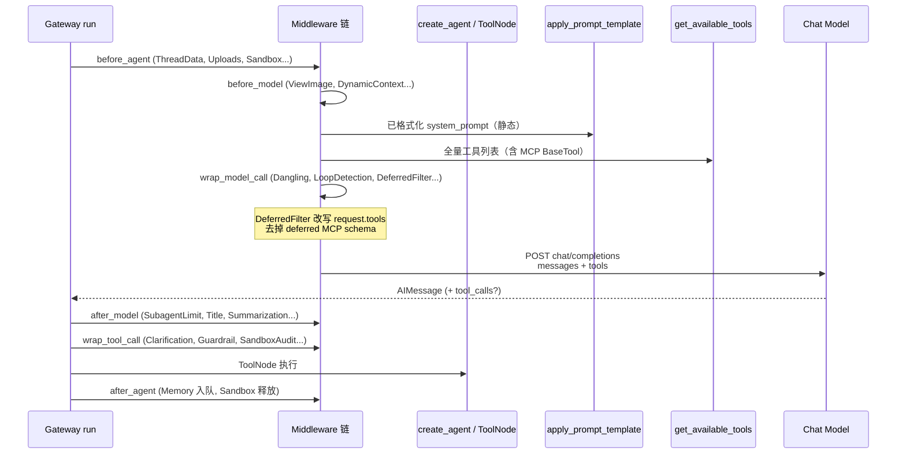

# Lead Agent Prompt 与上下文全链路

> **版本**: 2.0（独立完整版，非存根）  
> **源码真源**: `packages/harness/deerflow/agents/lead_agent/` · `tools/tools.py` · 各 middleware  
> **对照归档**: [DEERFLOW_FRAMEWORK_QA_ARCHIVE.md §4.3](DEERFLOW_FRAMEWORK_QA_ARCHIVE.md#lead-prompt-full-chain)  
> **中间件顺序**: [middleware-execution-flow.md](middleware-execution-flow.md)

本文描述 **一次主模型调用** 进入 LLM 前的 **三条通道**（system / tools / messages），以及中间件如何在各阶段改写负载。

---

## 1. 三条通道总览

```mermaid
graph TB
    subgraph System["System 通道"]
        TPL[SYSTEM_PROMPT_TEMPLATE]
        SOUL[SOUL.md]
        MEM[memory.json 注入]
        SK[skills 索引]
        DEF[deferred tools 列表]
        SUB[subagent_system]
        CLAR[clarification_system]
        TPL --> APPLY[apply_prompt_template]
        SOUL --> APPLY
        MEM --> APPLY
        SK --> APPLY
        DEF --> APPLY
        SUB --> APPLY
        CLAR --> APPLY
    end

    subgraph Tools["Tools 通道"]
        CFG[config.yaml tools]
        BUILTIN[builtins]
        MCP[MCP BaseTool]
        GAT[get_available_tools]
        CFG --> GAT
        BUILTIN --> GAT
        MCP --> GAT
        DTF[DeferredToolFilterMiddleware]
        GAT --> BIND[bind_tools / HTTP tools]
        DTF --> BIND
    end

    subgraph Messages["Messages 通道"]
        USER[User / HumanMessage]
        UP[UploadsMiddleware 块]
        VI[ViewImageMiddleware]
        TODO[todo_reminder]
        LOOP[LoopDetection warning]
        SUM[Summarization 摘要]
        DANG[Dangling ToolMessage 补丁]
        TOOL[ToolMessage 历史]
        USER --> MSGS[messages 列表]
        UP --> MSGS
        VI --> MSGS
        TODO --> MSGS
        LOOP --> MSGS
        SUM --> MSGS
        DANG --> MSGS
        TOOL --> MSGS
    end

    APPLY --> MODEL[Chat Model API]
    BIND --> MODEL
    MSGS --> MODEL
```



| 通道 | 含义 | DeerFlow Lead 主要来源 |
|------|------|------------------------|
| **System** | 角色、规范、索引 | `create_agent(..., system_prompt=apply_prompt_template(...))` |
| **Tools** | name + description + JSON Schema | `get_available_tools()` → `bind_tools`；`tool_search` 开时 **DeferredToolFilter** 从 `request.tools` 去掉 deferred MCP |
| **Messages** | 多轮对话 + 补丁 | checkpoint `messages`；各 middleware 注入 Human/Tool 消息 |

> **`SYSTEM_PROMPT_*.md`** 仅为 **system 模板可读快照**，**不含** Tools 列与 Messages 列的动态内容。

---

## 2. 端到端时序（单次 model call 前）



---

## 3. 静态 System：`apply_prompt_template`

**位置**: `agents/lead_agent/prompt.py`

| 块（XML） | 来源 | 要点 |
|-----------|------|------|
| `<role>` + `{agent_name}` | 模板 | Agent 身份行 |
| `<soul>` | `SOUL.md`（`load_agent_soul`） | 人格/价值观，**非** memory.json |
| `<memory>` | `memory.json` + `format_memory_for_injection` | 跨会话摘要 |
| `<thinking_style>` | 模板 | 推理风格 |
| `<clarification_system>` | 模板 | 强澄清 + `ask_clarification` |
| `<skill_system>` | `get_skills_prompt_section` | **仅索引**（name/desc/path） |
| `<available-deferred-tools>` | `tool_search` 开时 | deferred MCP **名字**列表 |
| `<subagent_system>` | `subagent_enabled` | `task` 并发规则、类型说明 |
| `<working_directory>` | 模板 | `/mnt/user-data/...` 沙箱叙事 |
| `<response_style>` / `<citations>` | 模板 | 交付与引用格式 |
| `<current_date>` | 运行时拼接 | 调用当日 |

**Plan 模式双轨**（`is_plan_mode`）：

- **`TodoListMiddleware`** 在 `wrap_model_call` 追加 `<todo_list_system>`
- **`write_todos` 工具** 挂独立 `WRITE_TODOS_TOOL_DESCRIPTION`（可与 system 段措辞不完全一致）

详见 [plan_mode_usage.md](plan_mode_usage.md)、QA 归档 §9.8。

---

## 4. Tools 通道详解

### 4.1 `get_available_tools` 组装

```text
loaded_tools (config.yaml 反射)
+ builtin_tools (present_files, ask_clarification, view_image?, task?, tool_search?)
+ mcp_tools (get_cached_mcp_tools)
→ create_agent / ToolNode 全量持有
→ wrap_model_call 决定「绑给模型的 schema 子集」
```

### 4.2 MCP 与 `tool_search` 开关

| | `tool_search` **关** | `tool_search` **开** |
|--|---------------------|---------------------|
| Registry | 不登记 MCP | 每 MCP 工具 register |
| `tool_search` 工具 | 无 | builtin 追加 |
| System | 无 deferred 列表 | `<available-deferred-tools>` |
| `DeferredToolFilterMiddleware` | 不挂载 | 每轮从 `request.tools` **去掉** deferred 名 |
| 模型所见 MCP | **每轮全量 schema** | **绑定更瘦**；经 `tool_search` ToolMessage 看 JSON |

**执行侧不变**：ToolNode 始终持有全量 `BaseTool`，MCP 仍按名真执行。

### 4.3 Skills vs MCP 进 messages 的形状

| | Skills | MCP |
|--|--------|-----|
| 声明 | system 索引 + 路径 | `tools` / `bind_tools`（或 deferred + tool_search JSON） |
| 执行 | `read_file` 等 → **ToolMessage** | `tool_calls` → MCP adapter → **ToolMessage** |
| 长正文 | 在 ToolMessage 里 | 在 ToolMessage 里 |

---

## 5. Messages 通道：中间件注入表

| Middleware | 钩子 | 注入内容 |
|------------|------|----------|
| UploadsMiddleware | `before_agent` | `<uploaded_files>` 附在用户消息前 |
| DynamicContextMiddleware | `before_model` | 日期/记忆相关 HumanMessage |
| ViewImageMiddleware | `before_model` | 图片 base64 HumanMessage |
| TodoMiddleware | `before_model` | `todo_reminder` |
| LoopDetectionMiddleware | 多钩子 | 循环告警 HumanMessage |
| SummarizationMiddleware | `before_model` | 用摘要替换早期 messages |
| DanglingToolCallMiddleware | `wrap_model_call` | 补全悬空 ToolMessage |
| ClarificationMiddleware | `wrap_tool_call` | 拦截 `ask_clarification` |

---

## 6. 子 Agent 与主 Agent 的 prompt 分工

- **主 Agent**：完整 `SYSTEM_PROMPT_TEMPLATE` + `<subagent_system>`（编排规则）
- **子 Agent**：仅 `SubagentConfig.system_prompt`（如 `general_purpose.py`），**不**跑主模板
- **`task` 工具**：主模型委派；子图 **无** Clarification / DeferredFilter / 嵌套 `task`

---

## 7. 自检与调试

| 手段 | 说明 |
|------|------|
| LangSmith / Langfuse | 生产追踪（`tracing/factory.py`） |
| `ModelCallLoggingMiddleware` | 源码存在，**默认未接入**生产链；可临时挂入看 `wrap_model_call` messages |
| Gateway SSE | 观察 tool_call / tool_result 事件流 |

---

## 8. 相关文档

| 文档 | 内容 |
|------|------|
| [DEEP_AGENTS_VS_DEERFLOW_PROMPT_COMPARISON.md](DEEP_AGENTS_VS_DEERFLOW_PROMPT_COMPARISON.md) | 与 Deep Agents prompt 对照 |
| [middleware-execution-flow.md](middleware-execution-flow.md) | 21 步生产中间件链 |
| [MCP_SERVER.md](MCP_SERVER.md) | MCP 加载与 bind 时序 |
| [SYSTEM_PROMPT_*_SUBAGENT_*.md](SYSTEM_PROMPT_CN_SUBAGENT_ENABLED.md) | 模板快照（非运行时全量） |

---

**最后更新**: 2026-06-01
