# Grok Build 架构设计文档

> **文档版本**：5.2（2026-07-29）  
> **源码根**：`grok-build/`（workspace members 以根 `Cargo.toml` 为准）  
> **阅读方式**：先读 **Part I（高层设计）** 建立全局地图，再读 **Part II（源码深潜）** 对照实现  
> **结构对齐**：[`pi/docs/ARCHITECTURE.md`](../../pi/docs/ARCHITECTURE.md)（Part I / Part II）  
> **专题**：[GROK_RUNTIME_PROMPTS.md](./GROK_RUNTIME_PROMPTS.md) · [PACKAGE_MODULES.md](./PACKAGE_MODULES.md)

---

## 文档结构

| 部分 | 受众 | 内容 |
|------|------|------|
| **Part I** | 架构师、新贡献者、对照 Pi/OpenHuman | 产品定位、包边界、实体、子系统、关键时序、双状态源、消息模型 |
| **Part II** | 要改具体函数的开发者 | Turn / Interjection / Memory / Tool——带路径与易错点 |

---

## Part I 目录

- [I.0 总体框架（一页纸）](#i0-总体框架一页纸)
- [I.1 产品定位与设计哲学](#i1-产品定位与设计哲学)
- [I.2 包依赖与边界](#i2-包依赖与边界)
- [I.3 核心实体：设计与协作关系](#i3-核心实体设计与协作关系)
- [I.4 子系统协作图](#i4-子系统协作图)
- [I.5 关键时序图](#i5-关键时序图)
- [I.6 双状态源与同步规则](#i6-双状态源与同步规则)
- [I.7 会话与消息数据模型](#i7-会话与消息数据模型)
- [I.8 模块索引](#i8-模块索引)
- [I.9 扩展面与运行表面](#i9-扩展面与运行表面)
- [I.10 依赖规则与演进](#i10-依赖规则与演进)
- [I.11 与 Pi / OpenHuman 对照](#i11-与-pi--openhuman-对照)

## Part II 目录（源码深潜）

- [II.1 端到端](#ii1-端到端核心流程与源码详解)
- [II.2 实体](#ii2-实体定义属性与引用关系)
- [II.3 模块分层](#ii3-模块分层为什么这样切)
- [II.4 Memory · Plan · 多 Agent](#ii4-memory--plan--多-agent整体设计) ← **优先读**
- [II.5 Tool / Skill / MCP](#ii5-tool--skill--mcp-体系)
- [II.6 字段表](#ii6-核心实体字段全表)
- [II.7 一次 Prompt 叙事](#ii7-一次-prompt-到底在干什么叙事不点名文件)


---

# Part I · 高层架构

## I.0 总体框架（一页纸）

Grok Build 的运行时可以概括为：**一种呈现方式（TUI / ACP / Headless）+ 一个跨线程编排器（SessionActor）+ 一份单写者对话历史（ChatStateActor）+ 一个内层 sampling↔tool 循环（process_conversation_turn）+ 一个流式采样器（SamplerActor）**。

### I.0.1 逻辑分层与 crate 映射

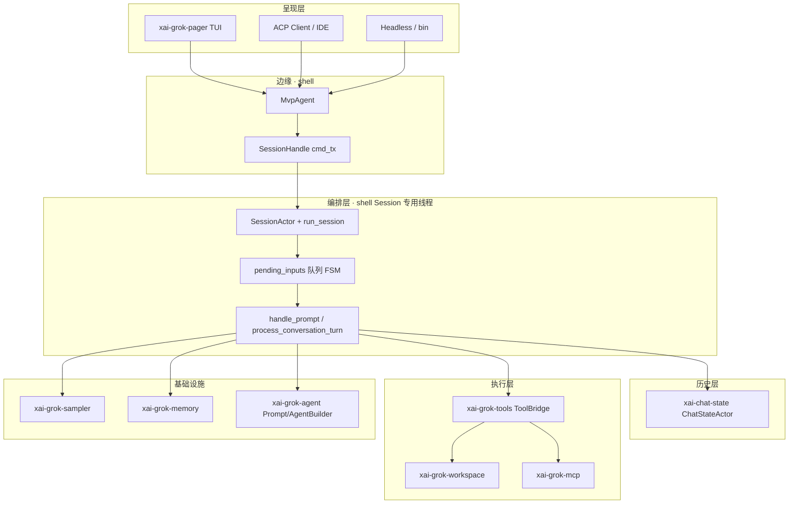
```mermaid
flowchart TB
    subgraph PRESENT["呈现层"]
        Pager[xai-grok-pager TUI]
        ACP[ACP Client / IDE]
        Headless[Headless / bin]
    end

    subgraph EDGE["边缘 · shell"]
        Mvp[MvpAgent]
        Handle[SessionHandle cmd_tx]
    end

    subgraph ORCH["编排层 · shell Session 专用线程"]
        SA[SessionActor + run_session]
        Q[pending_inputs 队列 FSM]
        Turn[handle_prompt / process_conversation_turn]
    end

    subgraph HIST["历史层"]
        CS[xai-chat-state ChatStateActor]
    end

    subgraph EXEC["执行层"]
        TB[xai-grok-tools ToolBridge]
        WS[xai-grok-workspace]
        MCP[xai-grok-mcp]
    end

    subgraph INFRA["基础设施"]
        Sam[xai-grok-sampler]
        Mem[xai-grok-memory]
        AgDef[xai-grok-agent Prompt/AgentBuilder]
    end

    Pager & ACP & Headless --> Mvp --> Handle --> SA
    SA --> Q --> Turn
    Turn --> CS & TB & Sam & Mem
    TB --> WS & MCP
    Turn --> AgDef
```

### I.0.2 一次 `session/prompt` 期间谁存在

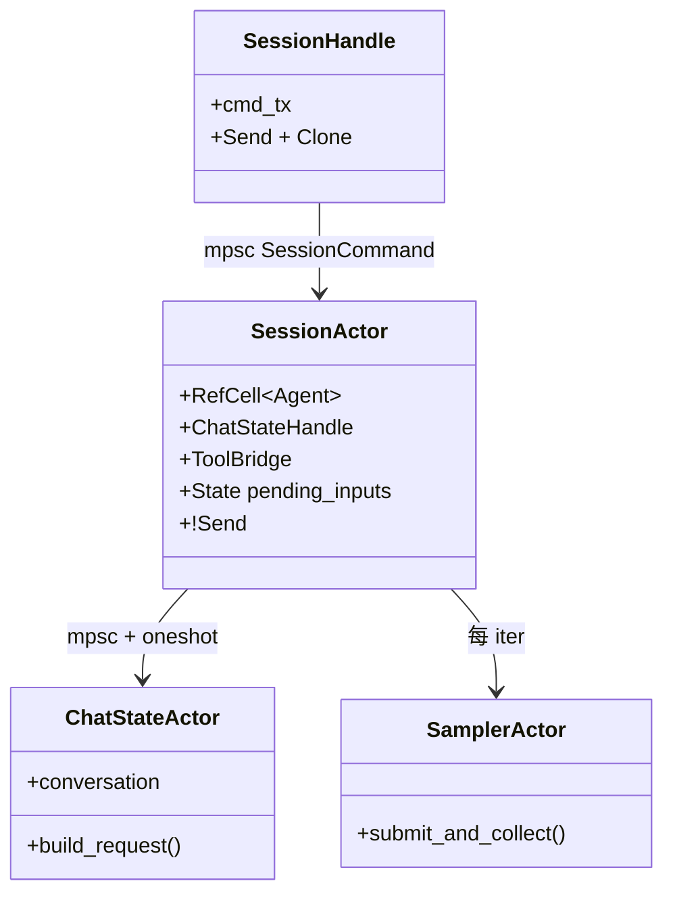
```mermaid
classDiagram
    direction TB
    class SessionHandle {
        +cmd_tx
        +Send + Clone
    }
    class SessionActor {
        +RefCell~Agent~
        +ChatStateHandle
        +ToolBridge
        +State pending_inputs
        +!Send
    }
    class ChatStateActor {
        +conversation
        +build_request()
    }
    class SamplerActor {
        +submit_and_collect()
    }
    SessionHandle --> SessionActor : mpsc SessionCommand
    SessionActor --> ChatStateActor : mpsc + oneshot
    SessionActor --> SamplerActor : 每 iter
```
### 映射标准 Agent‑Harness 架构对照表

表格

| grok‑build 组件 | Harness 标准概念 | 职责 |
| --- | --- | --- |
| SessionHandle | Session Client/Proxy | 外部访问会话的句柄，消息投递 |
| SessionActor | Harness Orchestrator Agent Session Runtime | Agent 主循环，turn 调度、队列、生命周期，ReAct 上层编排 |
| ChatStateActor | Conversation Store | 对话历史、上下文压缩、持久化记忆 |
| SamplerActor | Model Sampler Adapter | 封装 LLM 调用，流式、重试 |

一句话心智模型：

```text
Surface → SessionHandle.cmd_tx → SessionActor（OS 线程 + LocalSet）
  → 队列 FSM → handle_prompt → process_conversation_turn 内层 loop
       → ChatState.build_request → Sampler 流式
       → ToolBridge → 写回 ChatState → 下一 iter
  流式：Gateway SessionUpdate；完成：oneshot PromptTurnResult
```

---

## I.1 产品定位与设计哲学

### 是什么

**Grok Build** 是 xAI 系 **终端 / IDE Coding Agent**：ACP 协议表面 + 专用线程上的 Session 编排；对话、工具、记忆、压缩都挂在 Session 生命周期上。

### 设计哲学

| 原则 | 含义 |
|------|------|
| **Session 单写编排** | 同一 session **一个** `running_task`；并行靠 subagent 新 session / 后台 bash |
| **Handle 可 Send，Actor 不可** | UI/ACP 线程只持 `cmd_tx`；`!Send` 态留在 Session OS 线程 |
| **双通道完成** | Gateway 流式给 UI；oneshot 只服务发起 prompt 的 RPC |
| **历史单写者** | conversation 只经 `ChatStateActor`；Turn 不直接 mutate Vec |
| **工具不回调 Session** | `tools → shell` 禁止；cancel/队列不变式不被旁路 |
| **中途插话不 abort** | Interjection → synthetic user，继续当前 turn（≠ 默认打断） |

### 与同类产品的边界

| | Grok Build | Pi | OpenHuman |
|--|------------|-----|-----------|
| 交付 | TUI + ACP IDE | 终端 CLI + SDK + RPC | 桌面/Web 个人助手 |
| 编排 | SessionActor（Rust，专用线程） | AgentSession（TS） | web_chat + Agent harness |
| 中途改道 | Interjection + Prompt 队列 | **steer / followUp 双队列** | **QueueMode 五态** |
| 会话存储 | ChatState + jsonl/persistence | JSONL 树 + 可选 SQLite | history + transcript JSONL + vault |
| 压缩时机 | **内层 loop 采样前** | turn 后 / prompt 前 threshold | harness 中间件 |

---

## I.2 包依赖与边界

### I.2.1 编译期依赖（示意）

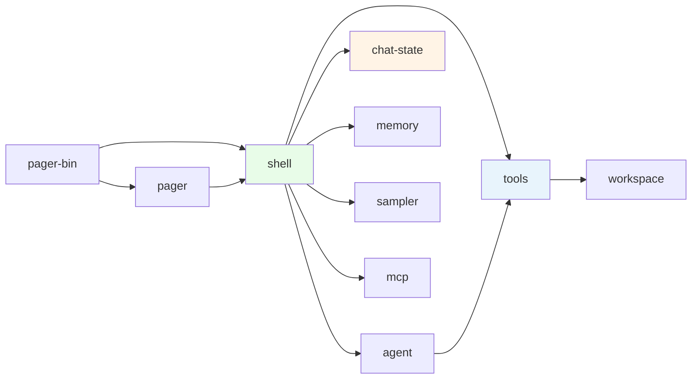
```mermaid
flowchart LR
    BIN[pager-bin] --> PAGER[pager]
    BIN --> SHELL[shell]
    PAGER --> SHELL
    SHELL --> AGENT[agent]
    SHELL --> CS[chat-state]
    SHELL --> TOOLS[tools]
    SHELL --> MEM[memory]
    SHELL --> SAM[sampler]
    SHELL --> MCP[mcp]
    TOOLS --> WS[workspace]
    AGENT --> TOOLS

    style SHELL fill:#e8fce8
    style CS fill:#fff4e6
    style TOOLS fill:#e8f4fc
```

| Crate | 对外职责 | 禁止依赖 |
|-------|----------|----------|
| **shell** | Session 编排、turn、队列、ACP 边缘 | —（组合根侧） |
| **chat-state** | conversation 真相、`build_request` | shell |
| **tools** | ToolBridge / 执行 | shell |
| **agent** | AgentBuilder、Prompt 模板 | shell 业务 |
| **sampler** | HTTP 流式 | Session 业务 |
| **memory** | vault / 检索 | 不知 Prompt 队列 |

### I.2.2 运行时调用链

```text
MvpAgent::prompt
  └── SessionCommand::Prompt { respond_to }
        └── run_session select! → queue_input → maybe_start_running_task
              └── spawn_local(handle_prompt)
                    ├── slash / bash 短路？
                    └── process_conversation_turn loop
                          ├── auto-compact?
                          ├── ChatState.build_request
                          ├── Sampler.submit_and_collect
                          └── ToolBridge.execute_tool_calls
```

---

## I.3 核心实体：设计与协作关系

### I.3.1 实体总表

| 实体 | 所在 | 生命周期 | 职责（一句话） | 持久化 |
|------|------|----------|----------------|--------|
| **SessionHandle** | shell | 会话级 | 可 Send 的命令入口 | 否 |
| **SessionActor** | shell | 会话线程 | 队列、turn、compact、memory 胶水 | 否（持有句柄） |
| **State** | shell | 同 Actor | `running_task` + `pending_inputs` | 否 |
| **Agent** | agent/shell | 同 Session | 定义 + ToolBridge + PromptContext | 配置侧 |
| **ChatStateActor** | chat-state | 同 Session | conversation 单写者 | jsonl / DB |
| **ToolBridge** | tools | 同 Session | 工具执行与 reminder | 否 |
| **SamplerActor** | sampler | 同 Session | 模型流式 | 否 |
| **InterjectionBuffer** | shell | turn 间 | 中途用户插话 | 注入后进 ChatState |
| **Memory vault** | memory | 跨 session | 长期知识 | 磁盘 + SQLite |

字段级详表见 Part II「核心实体字段全表」。

### I.3.2 推理环协作

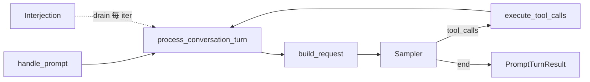
```mermaid
flowchart LR
    HP[handle_prompt] --> PCT[process_conversation_turn]
    PCT --> BR[build_request]
    BR --> SAM[Sampler]
    SAM -->|tool_calls| EX[execute_tool_calls]
    EX --> PCT
    SAM -->|end| DONE[PromptTurnResult]
    IJ[Interjection] -.->|drain 每 iter| PCT
```

---

## I.4 子系统协作图

| 子系统 | 核心类型 | 输入 | 输出 |
|--------|----------|------|------|
| **呈现** | Pager / ACP Client | 用户输入 | `SessionCommand::Prompt` |
| **ACP 边缘** | MvpAgent | ACP `session/prompt` | oneshot 等待 + Gateway 订阅 |
| **Session 编排** | SessionActor | cmd_rx | Turn 生命周期 |
| **对话历史** | ChatStateActor | Push / BuildRequest | ConversationRequest |
| **Turn 循环** | `process_conversation_turn` | request | tool / Completed |
| **工具执行** | ToolBridge | tool_calls | results + reminders |
| **模型采样** | SamplerActor | ConversationRequest | 流式 + Response |
| **长期记忆** | memory + idle flush | conversation 增量 | vault |
| **上下文压缩** | compaction in-loop | token 压力 | ReplaceConversation |

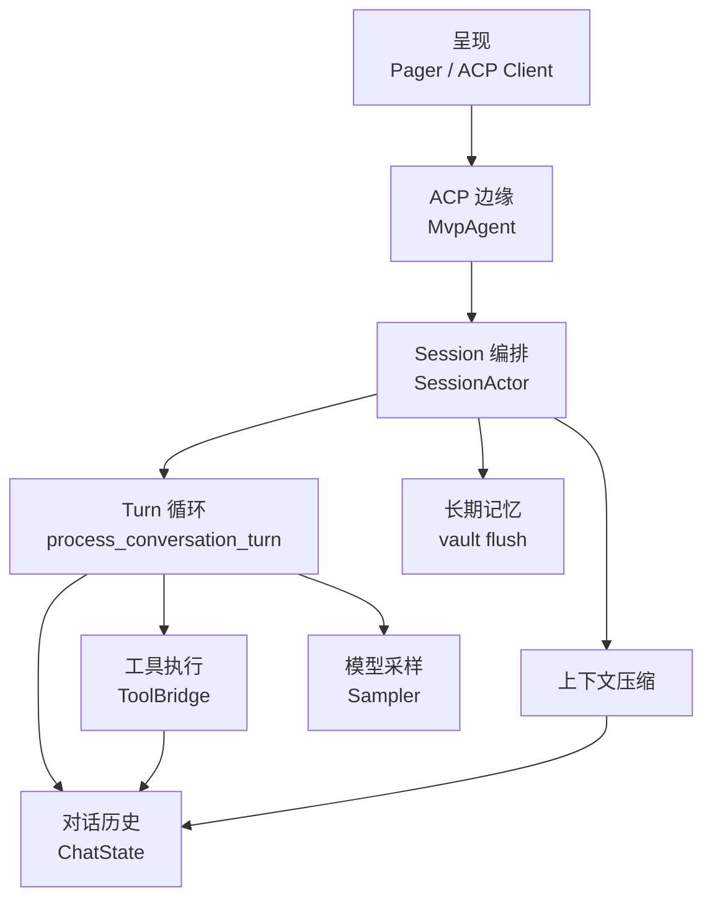
```mermaid
flowchart TB
    UI[呈现<br/>Pager / ACP Client] --> Edge[ACP 边缘<br/>MvpAgent]
    Edge --> Sess[Session 编排<br/>SessionActor]
    Sess --> Turn[Turn 循环<br/>process_conversation_turn]
    Turn --> Hist[对话历史<br/>ChatState]
    Turn --> Tools[工具执行<br/>ToolBridge]
    Turn --> Model[模型采样<br/>Sampler]
    Sess --> Mem[长期记忆<br/>vault flush]
    Sess --> Comp[上下文压缩]
    Comp --> Hist
    Tools --> Hist
```

---

## I.5 关键时序图

### I.5.1 用户一轮 Prompt（含工具）

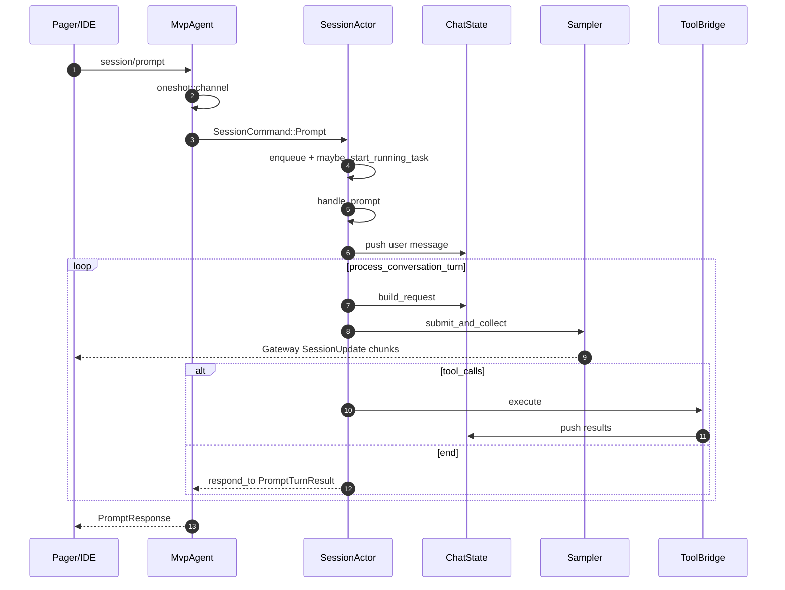
```mermaid
sequenceDiagram
    autonumber
    participant UI as Pager/IDE
    participant Mvp as MvpAgent
    participant SA as SessionActor
    participant CS as ChatState
    participant Sam as Sampler
    participant TB as ToolBridge

    UI->>Mvp: session/prompt
    Mvp->>Mvp: oneshot::channel
    Mvp->>SA: SessionCommand::Prompt
    SA->>SA: enqueue + maybe_start_running_task
    SA->>SA: handle_prompt
    SA->>CS: push user message
    loop process_conversation_turn
        SA->>CS: build_request
        SA->>Sam: submit_and_collect
        Sam-->>UI: Gateway SessionUpdate chunks
        alt tool_calls
            SA->>TB: execute
            TB->>CS: push results
        else end
            SA-->>Mvp: respond_to PromptTurnResult
        end
    end
    Mvp-->>UI: PromptResponse
```

### I.5.2 队列串行（对比 Pi 外层 followUp）

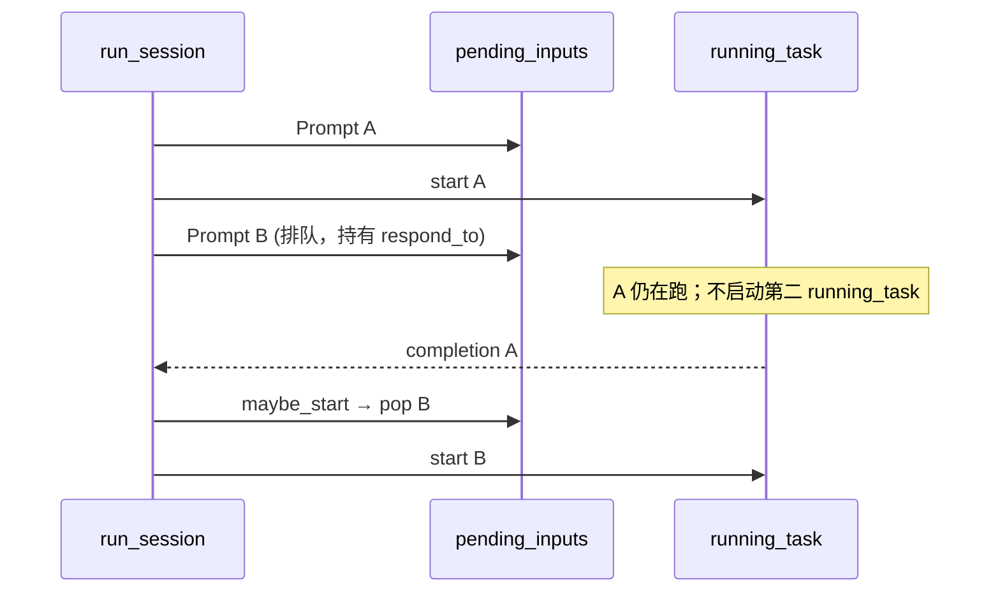
```mermaid
sequenceDiagram
    participant SA as run_session
    participant Q as pending_inputs
    participant T as running_task

    SA->>Q: Prompt A
    SA->>T: start A
    SA->>Q: Prompt B (排队，持有 respond_to)
    Note over T: A 仍在跑；不启动第二 running_task
    T-->>SA: completion A
    SA->>Q: maybe_start → pop B
    SA->>T: start B
```

> Pi 的 **followUp** 在 `runLoop` **外层**消费；Grok 的「下一条用户 Prompt」在 **Session 队列**，是产品级 FIFO，不是 turn 内车道。

---

## I.6 多份「对话副本」——谁才是真相（原「同步规则」）

读代码时最容易晕的一点：**不是只有一份 messages**。同一时刻至少有好几份「像对话」的东西，职责不同。所谓「同步」，就是：**哪次操作改了哪一份，别的份会不会立刻跟上**。

### 先记住四本账

把它们想成四本账，不要想成四个类名：

| 账本 | 白话 | 模型会不会直接读它 |
|------|------|-------------------|
| **会话本 A** | ChatState 里存的整段对话（用户/助手/工具结果） | 不直接读；要经 `build_request` 抄一版 |
| **送模本 B** | 这一 iter 真正 POST 给模型的那包 messages | **会**（唯一「模型此刻看见」的） |
| **屏幕本 C** | 已经推到 TUI/IDE 的流式 chunk | 不会；只给用户看 |
| **长期本 D** | Memory vault（跨 session 笔记） | 通常不会整本塞进；偶尔摘一段当 reminder |

> **核心事实**：A 可以很长；B 往往是 A 的「精简/修补/加 reminder」快照，**可以短于 A**。C 可以比 A 滞后或重复。D 更新了，**不等于** 当前 turn 的 B 立刻变。

### 一张图：一次 iter 里账本怎么动

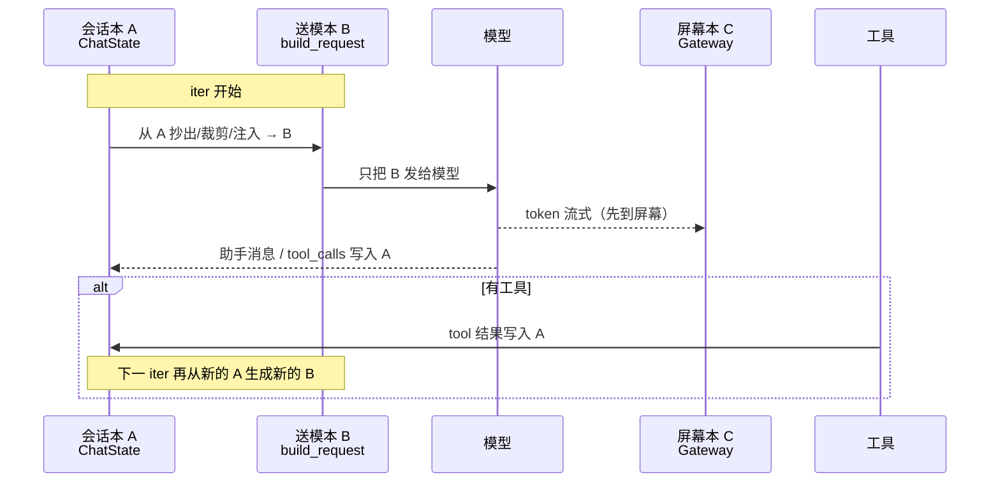
```mermaid
sequenceDiagram
    participant A as 会话本 A<br/>ChatState
    participant B as 送模本 B<br/>build_request
    participant LLM as 模型
    participant C as 屏幕本 C<br/>Gateway
    participant Tool as 工具

    Note over A,B: iter 开始
    A->>B: 从 A 抄出/裁剪/注入 → B
    B->>LLM: 只把 B 发给模型
    LLM-->>C: token 流式（先到屏幕）
    LLM-->>A: 助手消息 / tool_calls 写入 A
    alt 有工具
        Tool->>A: tool 结果写入 A
        Note over A,B: 下一 iter 再从新的 A 生成新的 B
    end
```

### 「同步规则」= 五种常见操作分别动哪本账

| 发生了什么 | 先改谁 | 后改谁 / 不改谁 | 常见误解 |
|------------|--------|-----------------|----------|
| 用户发 Prompt / 助手说话 / 工具返回 | **先写 A** | **下一 iter** 才从 A 生成新 B | 「写进 ChatState 模型就立刻看见」——要等下一轮 `build_request` |
| 中途 Interjection（插话） | drain 后写成 A 里一条 **独立 user** | 下一 iter 进 B；**不**贴在 tool result 上 | 「插话会取消当前 turn」——Grok 默认不 cancel |
| 上下文 Compact | **改写 A**（`ReplaceConversation`） | 下一 iter 的 B 按新 A 重建 | 「压缩只改这一次请求」——改的是会话本 |
| Idle 记忆 flush | 从 A **摘内容写到 D** | **不**自动改当前 B | 「flush 完模型就记得了」——要等下次 inject reminder |
| Turn 结束（oneshot 返回） | RPC 完成 | C 上的流式可能还在刷 | 「RPC 返回了 = 屏幕也停了」——两条通道 |

### 用一句话记

**A 是账本，B 是这一次给模型看的复印件，C 是投影仪，D 是保险柜。**  
改 A ≠ 模型立刻变；进保险柜 ≠ 当前考试卷（B）变；投影仪亮了 ≠ 考试结束（oneshot）。

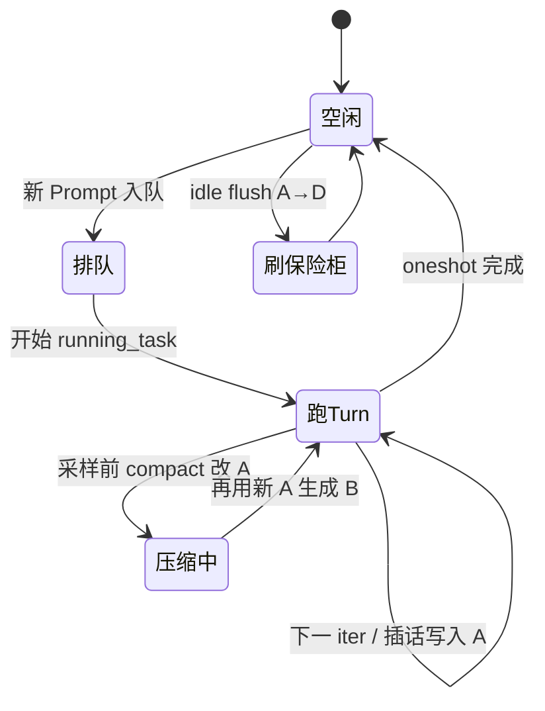
```mermaid
stateDiagram-v2
    [*] --> 空闲
    空闲 --> 排队: 新 Prompt 入队
    排队 --> 跑Turn: 开始 running_task
    跑Turn --> 跑Turn: 下一 iter / 插话写入 A
    跑Turn --> 压缩中: 采样前 compact 改 A
    压缩中 --> 跑Turn: 再用新 A 生成 B
    跑Turn --> 空闲: oneshot 完成
    空闲 --> 刷保险柜: idle flush A→D
    刷保险柜 --> 空闲
```

---

## I.7 会话与消息数据模型

### 存储形态

- **运行时**：ChatState 内存 conversation + Actor 命令。  
- **落盘**：session persistence / updates.jsonl（经 ReplayBuffer 策略）。  
- **跨 session**：Memory vault + SQLite 索引（可选启用）。

### 与 Pi 消息管道对照

| Pi 阶段 | Pi 函数 | Grok 近似 |
|---------|---------|-----------|
| 磁盘树 Entry | SessionEntry | ChatState items / jsonl 行 |
| 投影 | sessionEntryToContextMessages | ChatState 已是近似线性；prune 在 build_request |
| 转 LLM | convertToLlm | `build_request` → ConversationRequest |
| 压缩边界 | CompactionEntry + firstKept | ReplaceConversation / summary items |

Grok **不是** Pi 那种 `parentId` 会话树为中心；分支/rewind 是 Session 产品能力叠在线性 ChatState 之上（见 Part II）。

### 工具调用在「消息」里的形态

- Assistant 轮次携带 tool_calls；tool 结果作为后续 item 写回 ChatState。  
- **两段式**（调用与结果分离），对齐常见 Provider，也对齐 Pi「toolCall 与 toolResult 两个 SessionEntry」的精神。

---

## I.8 模块索引

> 查路径用 [PACKAGE_MODULES.md](./PACKAGE_MODULES.md)；查协作用 I.3–I.5。

| 区域 | 关键路径 |
|------|----------|
| Session 主循环 | `xai-grok-shell/.../run_loop.rs` |
| Turn | `.../turn.rs` |
| 队列晋升 | `.../notification_drain.rs` `maybe_start_running_task` |
| Interjection | `.../interjection.rs` |
| 工具批 | `.../tool_calls.rs` |
| ChatState | `xai-chat-state/` |
| Prompt 模板 | `xai-grok-agent/` |

---

## I.9 扩展面与运行表面

| 表面 | 入口 | 完成语义 |
|------|------|----------|
| TUI Pager | 本地 Action → ACP/Session | Gateway + UI state |
| ACP IDE | `session/prompt` | oneshot PromptResponse |
| Headless | bin 子命令 | 同 Session 管道 |
| Slash / Skill | `handle_prompt` 前解析 | 可能不进 LLM |
| MCP | mcp crate + turn 工具表 | 动态 ToolSpec |
| Workflow | named workflow / Rhai | host turn 或合成 prompt |

---

## I.10 依赖规则与演进

1. **禁止** tools/chat-state 依赖 shell。  
2. 新「中途改道」优先复用 Interjection / 队列，而不是第二 `running_task`。  
3. 压缩逻辑保持在 **采样前** 可观测；不要再引入「队列里的伪 Prompt 类型 auto-compact」（源码已删该路径）。  
4. Prompt 拼装变更走 agent 模板 + [GROK_RUNTIME_PROMPTS.md](./GROK_RUNTIME_PROMPTS.md)。

---

## I.11 与 Pi / OpenHuman 对照

| 主题 | Pi | Grok | OpenHuman |
|------|-----|------|-----------|
| 循环状态 | `runLoop` 无状态；状态在 Agent | 状态在 SessionActor + ChatState | Agent + tinyagents harness |
| 双队列 | **steer 内层 / followUp 外层** | Prompt FIFO + **Interjection** | **QueueMode** 五态 |
| 默认第二条消息 | 可 steer/followUp | 排队或 Cancel 策略 | **Interrupt** |
| 消息投影 | Entry → AgentMessage → Message | ChatState → build_request | history → harness messages |
| 完成通道 | AgentEvent / settled | Gateway + **oneshot** | Socket **chat_done**（RPC 只 ack） |

---

# Part II · 源码深潜

> 以下保留并整理既有源码级解读：因果、易错点、字段表、Demo。高层地图见 Part I。

'''

# II.1 端到端核心流程与源码详解

## 1.1 进程与线程拓扑

Grok 不是「主线程里 while 调 API」。至少涉及 **三个执行上下文**：

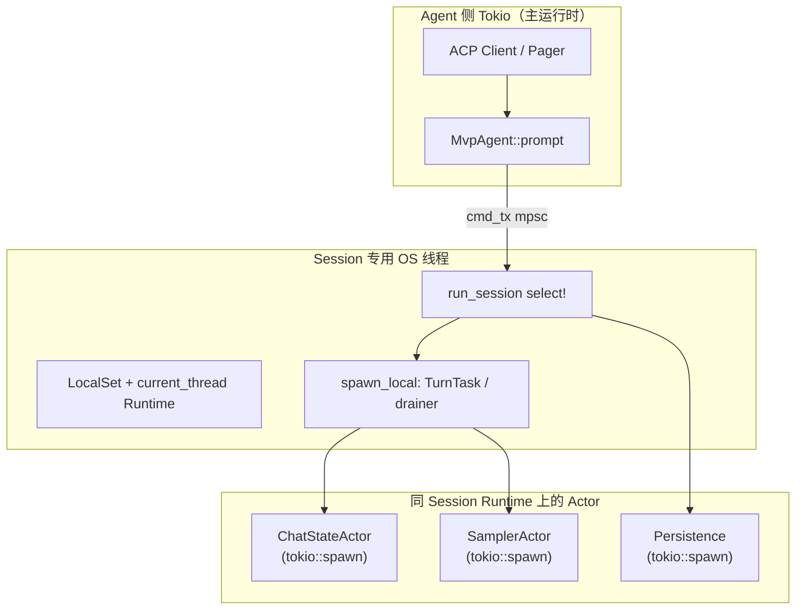
```mermaid
flowchart TB
    subgraph agent_rt["Agent 侧 Tokio（主运行时）"]
        Mvp["MvpAgent::prompt"]
        Client["ACP Client / Pager"]
    end

    subgraph session_thread["Session 专用 OS 线程"]
        LS["LocalSet + current_thread Runtime"]
        RS["run_session select!"]
        LT["spawn_local: TurnTask / drainer"]
    end

    subgraph actors["同 Session Runtime 上的 Actor"]
        CS["ChatStateActor\n(tokio::spawn)"]
        SAM["SamplerActor\n(tokio::spawn)"]
        PER["Persistence\n(tokio::spawn)"]
    end

    Client --> Mvp
    Mvp -->|"cmd_tx mpsc"| RS
    RS --> LT
    LT --> CS
    LT --> SAM
    RS --> PER
```

| 上下文 | 为何存在 |
|--------|----------|
| **Agent 线程** | ACP JSON-RPC、`SessionHandle` 必须 `Send + Clone` |
| **Session OS 线程** | `SessionActor: !Send`（`RefCell<Agent>`、PTY、LocalSet future） |
| **ChatState / Sampler Actor** | conversation 与 HTTP 流 **单写者**；与 Session 逻辑解耦 |

**spawn 入口**: `spawn_session_on_thread`（`session/acp_session_impl/spawn.rs`）  
→ `std::thread::spawn` → `LocalSet::block_on(spawn_session_actor)` → `spawn_local(run_session)`。

---

## 1.2 主路径时序图：从 ACP prompt 到 PromptResponse

下图覆盖 **「普通用户消息 → LLM ReAct → PromptResponse」** 的 happy path。每条箭头标注 **通道 ID（§1.7）+ Rust 实体/载荷**；参与者列给出 **源码落点**。

### 1.2.1 完整性审查：有没有遗漏？

**结论：主干完整，但图是「LLM 主路径」的简化版**——对排查 RPC 挂死、流式乱序、队列不推进三类 bug 足够；对 slash/bash 短路、持久化、send-now 抢占需对照下文缺口表。

| 维度 | 图中是否覆盖 | 说明 |
|------|-------------|------|
| ACP 入站 → oneshot 完成 | ✅ | `MvpAgent::prompt` → `respond_to` → `PromptResponse` |
| Session 单槽 `running_task` | ✅ | `queue_input` + `maybe_start_running_task` |
| ReAct 双循环 | ✅ | `handle_turn_input` 外层 + `process_conversation_turn` 内层 |
| Gateway 流式 vs RPC 完成 | ✅ | C3/C5 流式与 O1 完成分离（§1.3） |
| **T1 OS 线程边界** | ⚠️ 未画出 | `spawn_session_on_thread` → 独立 Session 线程 + `LocalSet`；Agent RT 与 Session **不同线程** |
| **HumanDelivery 入队** | ⚠️ 默认路径未画 | `sendNow=false` 时经 `HumanDeliveryHandle::send_human(DeliveryEnvelope)` 再变成 `SessionCommand::Prompt` |
| **handle_prompt 前置过滤器** | ⚠️ 折叠为 Note | bash 捷径 / slash builtin / hooks 可能 **不进 LLM** 仍走 completion（§1.8） |
| **采样前每 iter 工作** | ⚠️ 折叠为一步 | interjection drain、auto-compact、skill/MCP reminder、`identical_tool_calls` 硬停 |
| **PersistenceActor** | ⚠️ 可选支路 | `persist_ack`（O2）保证 jsonl 落盘后再采样 |
| **turn_stream_drained** | ⚠️ 未单独画 | O3：文本 SSE 结束后再发 tool 相关 UI，防乱序 |
| **handle_completion 之后** | ⚠️ 在 O1 返回之后 | `handle_turn_end`、`maybe_start_running_task`（队首下一项）、`maybe_drain_notifications` |
| **send_now 抢占** | ❌ | `cancel_turn_for_send_now` + `ReplayBuffer` 刷新 |
| **权限 / sandbox 门** | ❌ | `execute_tool_calls` 内的 approval gate、PTY/sandbox |
| **xAI HTTP 上游** | 隐含在 SamplerActor | Gateway 面向 **客户端**；上游 LLM 在 Sampler 内 |

> **易错点**：截图里若只看到 7 个参与者头（IDE → handle_prompt），那是裁剪；完整图还应包含 ChatState、Sampler、ReplayBuffer、Persistence、Gateway、oneshot 六段管线。

### 1.2.2 参与者实体对照表

| 参与者 | 源码实体 | 文件 |
|--------|----------|------|
| Pager / IDE Client | ACP `Client` | 外部 |
| MvpAgent | `impl AgentServer for MvpAgent` · `prompt()` | `agent/mvp_agent/acp_agent.rs` |
| HumanDeliveryHandle | `DeliveryEnvelope<HumanPromptContent>` | `session/message_delivery.rs` |
| cmd_tx · C1 | `SessionHandle.cmd_tx: mpsc::UnboundedSender<SessionCommand>` | `session/handle.rs` |
| run_session | `async fn run_session` · `select!` 主循环 | `session/acp_session_impl/run_loop.rs` |
| SessionActor | `Arc<SessionActor>` · `state.pending_inputs` / `running_task` | `session/acp_session_impl/mod.rs` |
| queue_input | `QueueInputRequest` → `InputItem`（含 `respond_to: O1`） | `session/acp_session_impl/prompt_queue.rs` |
| AgentTask / run_task | `AgentTask::new_prompt` · `spawn_local_in_session_ctx(run_task)` | `session/acp_session_impl/turn_task.rs` |
| handle_turn_input | `TurnInputRequest` → `handle_prompt` | `session/acp_session_impl/turn.rs` |
| ChatStateActor · C7 | `ChatStateCommand`（BuildRequest / PushUserMessage…） | `session/chat_state/` |
| PersistenceActor · C6 | `PersistenceMsg` → `updates.jsonl` / transcript | `session/persistence/` |
| SamplerActor | `submit_and_collect` → xAI HTTP SSE | `session/sampler/` |
| sampler drainer | `spawn_local` · `handle_sampling_event` | `session/acp_session_impl/sampler_turn.rs` |
| ReplayBuffer · C3 | `SessionEvent` 批量刷写 | `session/replay_buffer.rs` |
| GatewaySender | `forward_fire_and_forget(ExtNotification)` | `agent/gateway.rs` |
| respond_to · O1 | `oneshot::Sender<PromptTurnResult>` | 随 `SessionCommand::Prompt` 下发 |

### 1.2.3 主路径时序图（实体标注版）

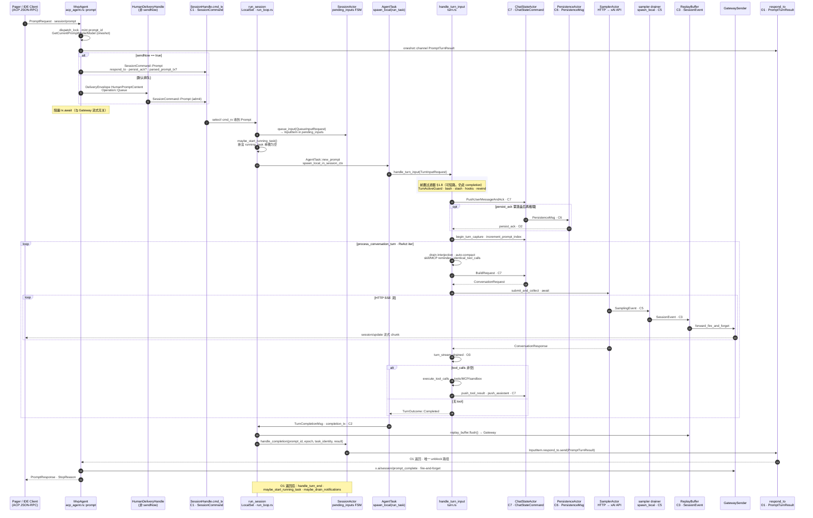
```mermaid
sequenceDiagram
    autonumber
    participant UI as Pager / IDE Client<br/>(ACP JSON-RPC)
    participant Mvp as MvpAgent<br/>acp_agent.rs::prompt
    participant Del as HumanDeliveryHandle<br/>(非 sendNow)
    participant Cmd as SessionHandle.cmd_tx<br/>C1 · SessionCommand
    participant Run as run_session<br/>LocalSet · run_loop.rs
    participant SA as SessionActor<br/>pending_inputs FSM
    participant Turn as AgentTask<br/>spawn_local(run_task)
    participant HP as handle_turn_input<br/>turn.rs
    participant Chat as ChatStateActor<br/>C7 · ChatStateCommand
    participant Pers as PersistenceActor<br/>C6 · PersistenceMsg
    participant Sam as SamplerActor<br/>HTTP → xAI API
    participant Drain as sampler drainer<br/>spawn_local · C5
    participant RB as ReplayBuffer<br/>C3 · SessionEvent
    participant GW as GatewaySender
    participant OS as respond_to<br/>O1 · PromptTurnResult

    UI->>Mvp: PromptRequest · session/prompt
    Mvp->>Mvp: dispatch_lock · mint prompt_id<br/>GetCurrentPromptMode/Model (oneshot)
    Mvp->>OS: oneshot::channel PromptTurnResult

    alt sendNow == true
        Mvp->>Cmd: SessionCommand::Prompt<br/>respond_to · persist_ack? · parsed_prompt_tx?
    else 默认排队
        Mvp->>Del: DeliveryEnvelope HumanPromptContent<br/>Operation::Queue
        Del->>Cmd: SessionCommand::Prompt (admit)
    end
    Note over Mvp: 阻塞 rx.await（与 Gateway 流式无关）

    Cmd->>Run: select! cmd_rx 收到 Prompt
    Run->>SA: queue_input(QueueInputRequest)<br/>→ InputItem in pending_inputs
    Run->>Run: maybe_start_running_task()<br/>断言 running_task 单槽为空
    Run->>Turn: AgentTask::new_prompt<br/>spawn_local_in_session_ctx

    Turn->>HP: handle_turn_input(TurnInputRequest)

    rect rgb(245, 245, 255)
        Note over HP: 前置过滤器 §1.8（可短路，仍走 completion）<br/>TurnActiveGuard · bash · slash · hooks · rewind
    end

    HP->>Chat: PushUserMessageAndAck · C7
    opt persist_ack 需落盘后再推理
        Chat->>Pers: PersistenceMsg · C6
        Pers-->>HP: persist_ack · O2
    end
    HP->>Chat: begin_turn_capture · increment_prompt_index

    loop process_conversation_turn · ReAct iter
        HP->>HP: drain interjection · auto-compact<br/>skill/MCP reminder · identical_tool_calls
        HP->>Chat: BuildRequest · C7
        Chat-->>HP: ConversationRequest
        HP->>Sam: submit_and_collect · await
        loop HTTP SSE 流
            Sam->>Drain: SamplingEvent · C5
            Drain->>RB: SessionEvent · C3
            RB->>GW: forward_fire_and_forget
            GW-->>UI: session/update 流式 chunk
        end
        Sam-->>HP: ConversationResponse
        HP->>HP: turn_stream_drained · O3
        alt tool_calls 非空
            HP->>HP: execute_tool_calls → tools/MCP/sandbox
            HP->>Chat: push_tool_result · push_assistant · C7
        else 无 tool
            HP-->>Turn: TurnOutcome::Completed
        end
    end

    Turn->>Run: TurnCompletionMsg · completion_tx · C2
    Run->>RB: replay_buffer.flush() → Gateway
    Run->>SA: handle_completion(prompt_id, epoch, task_identity, result)
    SA->>OS: InputItem.respond_to.send(PromptTurnResult)
    OS-->>Mvp: O1 返回 · 唯一 unblock 路径
    Mvp->>GW: x.ai/session/prompt_complete · fire-and-forget
    Mvp-->>UI: PromptResponse · StopReason
    Note over Run,SA: O1 返回后：handle_turn_end ·<br/>maybe_start_running_task · maybe_drain_notifications
```

### 关键异步边界说明

| 步骤 | 边界 | 实体 / 载荷 | 谁等待谁 |
|------|------|-------------|----------|
| T1 | OS thread | `spawn_session_on_thread` | Agent RT 发 C1；Session 在另一线程 `LocalSet` 消费 |
| 3→5 | C1 mpsc | `SessionCommand::Prompt { respond_to, persist_ack, … }` | Mvp 发完即继续；Run 在 `select!` 中稍后处理 |
| 5a | HumanDelivery | `DeliveryEnvelope<HumanPromptContent>` | 非 sendNow 的排队语义；最终仍落成 C1 |
| 7→9 | 同线程 | `queue_input` → `maybe_start_running_task` | 队首 `InputItem` 提升为 `running_task` |
| 9→10 | spawn_local | `AgentTask` + `TurnInputRequest` | Turn 与 Run 同 Session 线程，可 `!Send` |
| 12→14 | C7 + O2? | `ChatStateCommand` · 可选 `persist_ack` | Turn 等 ChatState 单写者；O2 等 jsonl |
| 16→20 | HTTP + C5 + C3 | `SamplingEvent` → `SessionEvent` | Turn 等 `submit_and_collect`；UI 经 Gateway 不等 Turn |
| 20 | O3 oneshot | `turn_stream_drained` | 保证 tool UI 在文本流之后 |
| 24→26 | C2 mpsc | `TurnCompletionMsg { prompt_id, PromptTurnResult }` | Turn 结束唤醒 Run 的 `completion_rx` |
| 26→28 | C3 flush + 状态机 | `handle_completion` · `claim_task_finalization` | 匹配队首 `prompt_id` 才 `respond_to.send` |
| 28→29 | **O1 oneshot** | `PromptTurnResult` | **唯一** unblock `MvpAgent::prompt` 的路径 |
| 29 之后 | 同线程 housekeeping | `handle_turn_end` · 队首下一 prompt | 不阻塞已返回的 RPC；影响后续队列推进 |

---

## 1.3 双通道：Gateway 流式 vs RPC 完成

很多 bug 来自混淆这两条通道：

| 维度 | Gateway（SessionUpdate） | oneshot `respond_to` |
|------|--------------------------|---------------------|
| **目的** | 实时 UI：token、tool、队列、审批 | ACP RPC 语义完成 |
| **时机** | Turn 进行中，可数百次 | Turn 结束（或从队列移除）一次 |
| **传输** | `GatewaySender::forward_fire_and_forget` | `tokio::sync::oneshot` |
| **持久化** | 多数进 `updates.jsonl`（经 ReplayBuffer） | 不持久化 |
| **典型事件** | `AgentMessageChunk`、`ToolCall`、`x.ai/queue/changed` | `PromptTurnResult` |
| **额外** | `prompt_complete` 在 oneshot **之后**由 MvpAgent 再发 | 客户端应用 await RPC |

**设计意图**：流式不能阻塞 RPC 完成语义；Leader 多 attach 时，流式给所有 client，oneshot 只服务发起 prompt 的 RPC。

---

## 1.4 Session 主循环：`run_session` 的 select!

**文件**: `session/acp_session_impl/run_loop.rs`

Session 在 **Idle 时仍可能工作**（memory flush、dream、MCP init）。`select!` **biased** 顺序大致为：

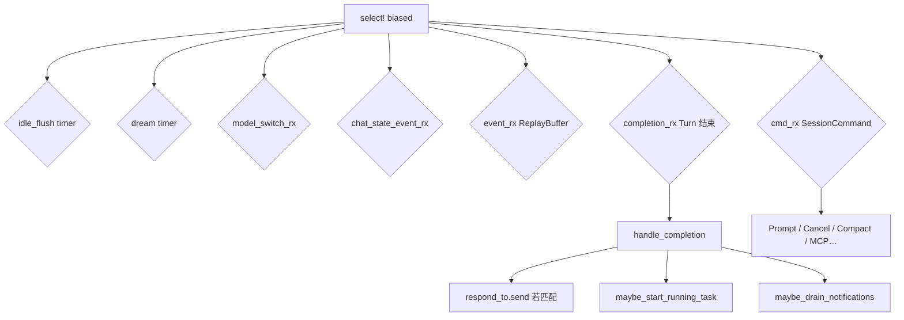
```mermaid
flowchart TD
    A[select! biased] --> B{idle_flush timer}
    A --> C{dream timer}
    A --> D{model_switch_rx}
    A --> E{chat_state_event_rx}
    A --> F{event_rx ReplayBuffer}
    A --> G{completion_rx Turn 结束}
    A --> H{cmd_rx SessionCommand}

    G --> G1[handle_completion]
    G1 --> G2[respond_to.send 若匹配]
    G1 --> G3[maybe_start_running_task]
    G1 --> G4[maybe_drain_notifications]

    H --> H1[Prompt / Cancel / Compact / MCP…]
```

| Arm | 触发时 Session 在做什么 | 与 Turn 关系 |
|-----|-------------------------|--------------|
| `completion_rx` | 某 `AgentTask` 结束 | 可能启动 **下一个** 排队 Prompt |
| `cmd_rx Prompt` | 用户新输入 | 入队；若 Idle 则 `maybe_start_running_task` |
| `idle_flush` | 无 turn、超时 | **并行**于 Turn 的 memory 写 vault |
| `chat_state_event_rx` | compaction 后 conversation 重置等 | 副作用，不直接跑 turn |

---

## 1.5 队列 FSM：Prompt 如何串行

**状态**: `State`（`acp_session.rs`）

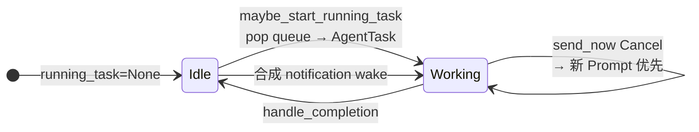
```mermaid
stateDiagram-v2
    direction LR
    [*] --> Idle: running_task=None
    Idle --> Working: maybe_start_running_task<br/>pop queue → AgentTask
    Working --> Idle: handle_completion
    Working --> Working: send_now Cancel<br/>→ 新 Prompt 优先
    Idle --> Working: 合成 notification wake
```

| 结构 | 含义 |
|------|------|
| `running_task: Option<AgentTask>` | 当前 turn 的 `spawn_local` 任务 + AbortHandle |
| `pending_inputs: VecDeque<InputItem>` | 排队 Prompt；每项 **持有** `respond_to` oneshot |
| `pending_notifications` | bash/monitor 完成 → Idle 时 synthetic prompt |

**Invariant**：同一 session **只有一个** `running_task`；并行靠 **subagent 新 session** 或 **background bash**，不是多个 `running_task`。

---

## 1.6 Turn 内双循环设计

### 外层：`handle_prompt`（一次用户 Prompt）

**文件**: `turn.rs`

| 阶段 | 做什么 | 异步点 |
|------|--------|--------|
| TurnActiveGuard | 防重入 | — |
| bash 捷径 / slash | 可能 **不进入** LLM | 可能直接完成 |
| UserPromptSubmit hook | 可阻断/改消息 | hook 内 await |
| 写用户消息 | `push_user_message_and_ack` | 可选 `persist_ack` oneshot |
| `process_conversation_turn_with_recovery` | 外层 goal/recovery | 多轮直到 Completed |
| 收尾 | usage、telemetry、hooks | `turn_end.rs` |

### 内层：`process_conversation_turn`（sampling + tool loop）

**这是「模型—工具」ReAct 环**，`loop_index` 递增直到：

- 模型不再返回 tool_calls → `Completed`
- `max_turns` / stationarity / cancel
- structured output 校验完成

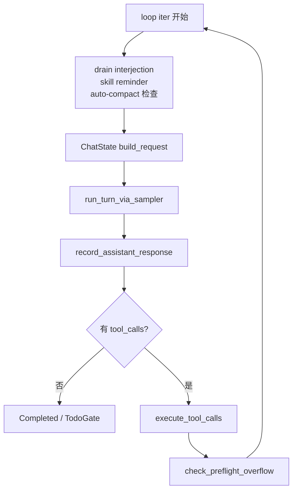
```mermaid
flowchart TD
    START[loop iter 开始] --> PRE[drain interjection<br/>skill reminder<br/>auto-compact 检查]
    PRE --> BUILD[ChatState build_request]
    BUILD --> SAMPLE[run_turn_via_sampler]
    SAMPLE --> REC[record_assistant_response]
    REC --> Q{有 tool_calls?}
    Q -->|否| DONE[Completed / TodoGate]
    Q -->|是| EXEC[execute_tool_calls]
    EXEC --> POST[check_preflight_overflow]
    POST --> START
```

**每 iter 前**可能：`check_auto_compact_needed` → `run_compact_only`（见 §4.5）。

### Sampler 流式子循环

`run_turn_via_sampler`（`sampler_turn.rs`）：

1. `submit_and_collect` 阻塞 **当前 Turn task**
2. 并行：`SamplerActor` 收 SSE → `sampler_event_tx` → `spawn_local` drainer → `handle_sampling_event` → gateway
3. `turn_stream_drained` oneshot：保证 **文本流结束** 后再发 tool 相关 UI（防乱序）

---

## 1.7 异步边界总表（画架构图用）

| ID | 类型 | 端点 | 载荷 |
|----|------|------|------|
| T1 | OS thread | Agent RT ↔ Session thread | `spawn_session_on_thread` |
| C1 | mpsc | Agent → Session | `SessionCommand` |
| C2 | mpsc | Turn → run_session | `(prompt_id, PromptTurnResult)` |
| C3 | mpsc | Session → ReplayBuffer | `SessionEvent` |
| C4 | mpsc | ChatState → Session | `ChatStateEvent` |
| C5 | mpsc | Sampler → drainer | `SamplingEvent` |
| C6 | mpsc | Session → Persistence | `PersistenceMsg` |
| C7 | mpsc | Handle → ChatStateActor | `ChatStateCommand` |
| O1 | oneshot | **MvpAgent::prompt** | `PromptTurnResult` |
| O2 | oneshot | persist_ack | jsonl 落盘后推理 |
| O3 | oneshot | stream_drained | 流式与 tool UI 顺序 |

---


---

## 1.8 源码级详解：`handle_prompt` 真正做了什么

> 对照：`xai-grok-shell/.../acp_session_impl/turn.rs` · `handle_prompt` / `process_conversation_turn`

很多人把 Turn 想成「把 user 文本塞进 messages → 调模型」。源码里 **`handle_prompt` 是一条长过滤器**；只有少数路径会落到 `process_conversation_turn` 的 ReAct 环。

### 1.8.1 进入 LLM 之前的短路与改写

按源码顺序（省略遥测）：

1. **`PromptOrigin::from_prompt_id`**  
   - 合成 origin（workflow 完成、某些内部 wake）会跳过「取消 pending recap」等用户态副作用。  
   - 若带 `completion_id`，先 `mark_completions_reported` + 释放 `task_completion_reservations`——避免合成完成提示与真实用户 Prompt 抢同一 reservation。

2. **`TurnActiveGuard`**（工具上下文 + session 两层）  
   - 标记「本 session 正在跑 turn」。工具层读这个标志决定能否开新后台任务等。

3. **rewind 再生判定**  
   - `rewind_pending_prompt` 里若有上一次文本：新文本相同 → `record_regeneration`；不同 → `record_edit_and_retry`。  
   - 这是产品指标，不改变消息内容，但解释了 UI「再生成」与「改了再发」为何分叉。

4. **bash 捷径** `extract_bash_command`  
   - 命中则 `handle_direct_bash_command` **整段 return**，不进模型。  
   - **易错点**：用户以为「任何输入都过 Agent」；实际某些模板化 bash 块是 Host 直跑。

5. **Slash / Skill 解析** `slash_commands::resolve`  
   - Cursor 风格 `user_message_template` → `SkillSlashRewrite::Passthrough`（不把 `/skill` 改写成 run）。  
   - 否则 `RewriteToRun`。  
   - `SlashCommandOutcome::Builtin`：GoalSet / GoalResume / WorkflowLaunch / 其它 builtin —— 多数 **直接 `ok_end_turn` 或 host 输出**，不采样。  
   - `InvokeSkill`：写入 `active_skill`，后续 turn 遥测带 `skill.name`。

6. 只有走到「普通用户消息」分支，才会：写 ChatState 用户消息 → `process_conversation_turn_with_recovery`。

> **易错点**：在 ACP 层看到 `session/prompt` 返回了 `end_turn`，并不等于模型说了一句话——可能是 slash builtin / bash / workflow launch。查 `prompt_id` origin 与 telemetry `command_source`。
# .8.1 LLM 调用前：短路与改写逻辑整理（基于 grok-build 源码）

>
> 核心一句话：**在把消息送入 SamplerActor 调用 LLM 之前，SessionActor 会执行一整套前置校验、拦截、改写逻辑；很多场景直接短路（不进大模型），只有最后落到普通用户消息分支，才真正发起 LLM 采样**。
> 执行顺序严格按源码流程，下面分段拆解，去掉遥测，保留业务逻辑。

## 整体执行总览（流水线）

用户消息进入 Turn 流程 → 1. 来源标记与资源预留释放 → 2. TurnActiveGuard 标记会话正在执行任务 → 3. Rewind（重试 / 再生判定） → 4. 内置 bash 命令短路（host 直接执行，跳过 LLM） →5. Slash 指令 / 技能解析（部分内置命令直接结束 turn，不采样） → **只有全部短路分支都没命中，才进入真正的 Agent+LLM 流程**

---

## 分步拆解

### ① PromptOrigin 来源标记 + completion_id 资源处理

```
PromptOrigin::from_prompt_id
带completion_id时：mark_completions_reported + 释放 task_completion_reservations
```

1. 给当前 prompt 打上来源标签：区分是**用户手动输入**，还是**workflow 自动生成、内部 wake 触发的合成 prompt**
   - 如果是**合成自动 prompt（不是用户手动输入）**：会跳过一些用户侧副作用（例如取消 pending recap），避免内部自动消息触发面向用户的 UI 行为。
2. 如果这条请求携带`completion_id`：
   - 标记该任务已上报；释放任务预留资源`task_completion_reservations`
   - 目的：**防止内部自动生成的完成提示 和 用户真实 prompt 争抢同一个资源配额 (reservation)**，避免资源冲突。

### ② TurnActiveGuard（Turn 生命周期守卫，工具 + Session 双层标记）

创建`TurnActiveGuard`，作用：

- 标记：**当前 Session 正在运行一个 Turn**
- 工具运行时会读取这个标记，用来判断是否允许开启新的后台工具任务、控制并发。
- Guard 是 RAII 风格：代码块结束自动销毁，自动清除「正在跑 turn」标记。

### ③ rewind 再生判定（对应 UI 的【重新生成 / 修改后重试】）

`rewind_pending_prompt` 读取上一轮的历史文本：

- 新输入文本 == 上一轮文本 → 判定：**再生（regeneration）**，埋点记录`record_regeneration`
- 新输入文本！= 上一轮文本 → 判定：**编辑后重试**，埋点记录`record_edit_and_retry`

>
> ⚠️重点：**这一步只做指标埋点，不会修改发给 LLM 的消息内容**
> 解释了你看到 UI 上两个按钮行为为什么分开：「重新生成」和「改文字再提交」在 Harness 内部是两条不同指标链路。

### ④ bash 捷径 extract_bash_command 【重要短路点 1：直接跳过 LLM】

提取用户消息里 bash 代码块：

- 命中 bash 指令 → 调用`handle_direct_bash_command`，**直接 host 本地执行命令，函数直接 return，不进入模型采样**

>
> 易错点澄清：
> 不是所有用户输入都会走 Agent+LLM；模板化 bash 块可以被前置拦截，由 Host 直接运行，不走大模型。

### ⑤ Slash / Skill 斜杠命令解析 `slash_commands::resolve`【短路点 2】

解析 `/xxx` 这类斜杠指令（类似 Cursor 的斜杠技能）

1. 模板分支：`user_message_template`场景 → `SkillSlashRewrite::Passthrough`，保留原始`/skill`文本，不翻译成 tool run 调用。
2. 其余场景：把 slash 命令改写为`RewriteToRun`（转为工具调用语义）。

然后解析输出结果`SlashCommandOutcome`，分两类：

1. **Builtin 内置命令**：`/goalset`、`/goalresume`、`/workflowlaunch`等
   - 绝大多数内置命令直接执行后调用`ok_end_turn`，host 直接输出结果，**不调用 LLM 采样，短路**
2. **InvokeSkill 调用外部技能**：
   - 标记`active_skill`，把技能名注入 turn 遥测，继续往下走，**不短路，会进模型**

### ⑥ 最终分支：普通用户消息（所有短路都没命中）

只有前面所有短路分支都不触发，才执行：

1. 将用户消息写入 ChatState 对话历史
2. 调用 `process_conversation_turn_with_recovery` → 正式进入 Agent ReAct 循环，后续会调用 SamplerActor 发起 LLM 采样。

---

# 极简版流程图（Mermaid）

预览

查看代码

生成失败，请重试

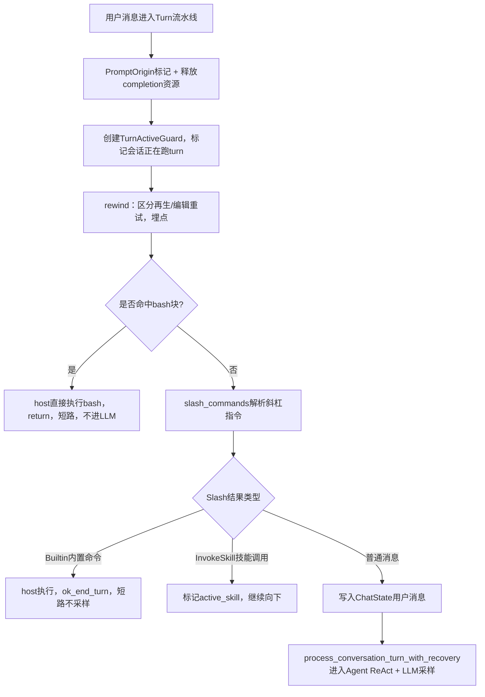
```mermaid
flowchart TD
    A[用户消息进入Turn流水线] --> B[PromptOrigin标记 + 释放completion资源]
    B --> C[创建TurnActiveGuard，标记会话正在跑turn]
    C --> D[rewind：区分再生/编辑重试，埋点]
    D --> E{是否命中bash块?}
    E -->|是| E1[host直接执行bash，return，短路，不进LLM]
    E -->|否| F[slash_commands解析斜杠指令]
    F --> G{Slash结果类型}
    G -->|Builtin内置命令| G1[host执行，ok_end_turn，短路不采样]
    G -->|InvokeSkill技能调用| G2[标记active_skill，继续向下]
    G -->|普通消息| H[写入ChatState用户消息]
    H --> I[process_conversation_turn_with_recovery<br/>进入Agent ReAct + LLM采样]
```
## 1、关键发现（源码实锤）

1. **确实存在独立的 `pub(crate) struct State`**，但它**不是 SessionActor 的直接字段**，而是被包在 `TokioMutex<State>` 里面挂在 SessionActor：

```
pub(crate) struct SessionActor {
    // ...
    pub(crate) state: TokioMutex<State>, // ← 在这里，tokio互斥锁包裹
    // ...
}
```

`State` 结构体定义就在你粘贴的源码中间：

```
pub(crate) struct State {
    pub(crate) running_task: Option<AgentTask>,
    finalization_gate: FinalizationGate,
    pub(crate) message_delivery: parent_message::MessageDeliveryState,
    pub(crate) pending_inputs: VecDeque<InputItem>, // ✅主Prompt队列
    pub(crate) pending_notifications: Vec<PendingNotification>,
    pub(crate) edit_holds: HashMap<String, std::time::Instant>,
    pub(crate) notifications_suppressed: bool,
    pub(crate) hook_block_hold: HookBlockHold,
    pub(crate) rewindable: bool,
    pub(crate) front_message_committed: bool,
    pub(crate) nudges_used_this_session: u32,
}
```

👉 **`pending_inputs`、`running_task` 在 `TokioMutex<State>` 内部**。

2. ⚠️ **`pending_interjections` 不在这个 `State` 里面！！**

```
pub(crate) struct SessionActor {
    // ...
    /// Pending mid‑turn interjections from the user (Ctrl+Enter).
    /// Pushed by `SessionCommand::Interject` handler, drained at safe points in `process_conversation_turn`.
    /// Internally synchronized.
    pub(crate) pending_interjections: InterjectionBuffer<acp::ImageContent>,
    // ...
}
```

- `pending_interjections` 是**SessionActor 顶层直接字段**，类型是`InterjectionBuffer<T>`，它内部自带同步，**不进入 `state: TokioMutex<State>`**。

>
> 我之前的错误：把三个东西全部塞到同一个 `State{}` 伪代码结构体，混淆了：
>
>
> - `pending_inputs` / `running_task` → 在 `TokioMutex<State>`
> - `pending_interjections` → 顶层字段，独立的 `InterjectionBuffer`，不在 State 里面。

---

## 2、两个缓冲区真实形态（100% 来自你贴的源码）

### ① pending_inputs（普通 prompt 排队队列）

- 位置：`SessionActor.state.lock().await.pending_inputs: VecDeque<InputItem>`
- 存储：`InputItem`，每一项携带 `respond_to: oneshot::Sender<PromptTurnResult>`，还有 `send_now: bool` 标记。
- 保护：**`TokioMutex<State>` 异步锁保护**，只能`.lock().await`访问。
- 消费逻辑：`maybe_start_running_task`，读取`state.running_task`，有任务就排队；空闲才 pop 队头启动 turn。

### ② pending_interjections（中途插话 /steer）

- 位置：`SessionActor.pending_interjections: InterjectionBuffer<acp::ImageContent>`，**顶层字段，不在 State 结构体中**。
- 注释原文：

>
> Pushed by `SessionCommand::Interject` handler, drained at safe points in `process_conversation_turn`. Internally synchronized.

- `InterjectionBuffer`内部自带同步，**不需要拿`state`的 tokio 锁**。
- 消费：`drain_pending_interjections()`，在`process_conversation_turn`内部三个安全断点执行，**不会取消当前正在运行的 running_task**。

### ③ SendNow（抢占逻辑）

`InputItem`里面有布尔标记 `send_now: bool`。

>
> Send‑now inserts land behind earlier still‑queued send‑now prompts, so stacked sends run FIFO.
> Sends stack e.g. during a goal turn, which promotes but never cancels.

⚠️ 重点纠正：
`SendNow`**不是直接 cancel 当前 task**，它只是入队标记为`send_now=true`的`InputItem`；只有特定路径会调用 `cancel_running_task()`。并不是收到 SendNow 就立刻 kill turn。

>
> 之前笔记里 “send_now 直接 cancel task” 是错误理解源码。

### 字段位置对照表

表格

| 字段 | 所在位置 | 同步原语 |
| --- | --- | --- |
| pending_inputs | `SessionActor.state: TokioMutex<State>` | tokio Mutex，`.lock().await` |
| running_task | `SessionActor.state: TokioMutex<State>` | tokio Mutex |
| pending_interjections | **SessionActor 顶层直接字段** | `InterjectionBuffer`内部自带同步，不依赖 state 锁 |

---

# 核心总结

1. 这一段是**LLM 前置网关层**：在消息交给模型之前，做拦截、改写、并发标记、指标采集；
2. 多个**短路分支**，满足条件就直接在 Host 执行，完全不进大模型（bash、部分斜杠内置指令）；
3. `rewind`只做指标统计，**不改消息**，用来区分 UI「重新生成」vs「修改 prompt 再发」；
4. 斜杠指令分两种：内置命令直接结束 turn；技能调用才会带入 Agent 流程；
5. 只有全部短路条件都不触发，消息才会写入对话历史、进入 Agent 的 ReAct 循环，调用 SamplerActor。
### 1.8.2 内层 loop：采样前比采样后更重要

`process_conversation_turn` 的 `loop` **每一轮开头**（在 `build_request` 之前）固定做一批工作：

| 步骤 | 源码意图 | 若不做会怎样 |
|------|----------|--------------|
| `identical_tool_calls` hard stop | 防工具空转/死循环 | session 烧 token 到 cap |
| `drain_pending_interjections` | 把中途用户插话变成 **独立 synthetic user** | 插话丢了或塞进 tool result（破坏 pairing） |
| `flush_pending_skill_reminders` / `inject_pending_monitor_events` | 横切提醒进上下文 | skill/monitor 状态与模型不同步 |
| `first_turn_memory_reminder` | 仅首次注入 vault 摘要 | 每轮重复灌 memory → 爆窗 |
| `maybe_inject_mcp_reminder` | MCP 未就绪提示 | 模型乱调未注册工具 |
| two-pass prefire | 可选压缩预计算 | 大上下文首包延迟 |
| **`check_auto_compact_needed` → `run_compact_only`** | **采样前**压 conversation | 直接 400/超窗；注释写明已不再在队列里单独排 auto-compact |

然后才：

```text
prepare_tool_definitions（可含 MCP wait）
  → 组 effective_tools（forked override / StructuredOutput 工具路径）
  → chat_state.build_request(tools, memory_reminder, …)
  → Sampler 流式
  → 有 tool_calls → execute_tool_calls → continue
  → 无 → Completed / TodoGate / structured 校验重试
```

> **易错点（与 Pi/OpenHuman 对齐时）**：Grok 的「压缩」挂在 **内层 loop 采样前**，不是单独的「队列任务类型」。`maybe_start_running_task` 注释已写死：auto-compact **不再**作为 pending 队列项。

### 1.8.3 Structured output 的双路径

同一 `json_schema`：

- 后端 `supports_native_schema()` → 走 API native schema（`structured_output_native`）。  
- 否则注入 **`StructuredOutput` 工具** + system reminder，要求模型 **最后只 call 一次该工具**。  

**易错点**：UI 若只盯 assistant text，会以为「没回答」——答案在 tool arguments 里。

---

## 1.9 中途插话：Interjection，不是 Steer 队列

OpenHuman 有显式 `QueueMode::{Steer,Followup,Collect,Parallel,Interrupt}`。  
Grok **没有**同名五态；中途改道靠另一套机制：

### 1.9.1 Interjection（中途用户消息）

- 入口：ACP 扩展方法 `x.ai/session/interjection` → `pending_interjections` buffer。  
- 消费：`drain_pending_interjections`（每 loop 开头、工具批之后、turn 收尾前都会 drain）。  
- 落盘形态：`ConversationItem::interjection` + `SyntheticReason::Interjection` —— **独立 user 回合**，不贴在 tool result 上。  
- 注释强调：这样 compaction / replay / analytics 才能把「用户改口」当成真正的 user turn。

> **易错点**：以为 Grok「没有 steer」。有，但叫 **interjection**，且 **不取消当前 turn**（与 OpenHuman 默认 `Interrupt` 相反）。插话后 loop `continue`，模型在下一轮采样看到新 user。

### 1.9.2 Prompt 队列（ACP 多条 Prompt 串行）

- `State.pending_inputs` + `running_task`：**同一时刻一个 running_task**。  
- `maybe_start_running_task`：已有 running → **只排队**；空闲 → pop（可选 `combine_queued_prompts` 合并队头）。  
- 每条排队项 **持有** 自己的 `respond_to` oneshot —— 队列移除也要应答，否则 ACP client 永久挂起。

这是 **Prompt 级 FIFO**，不是 turn 内 Steer 车道。

### 1.9.3 `ToolLoop::FollowupMessage`

工具执行路径可返回 `FollowupMessage`：把一段文本 **作为新的 user turn** 写回 ChatState 再继续 loop。  
语义接近「工具触发的 follow-up」，不是用户在 UI 选的 Followup 模式。
**确实是两套独立缓冲区（不是抢占 / 排队二选一，而是两类不同语义的输入通道）**

1. `pending_inputs`：**主 Prompt 队列，串行排队队列（普通用户消息）**
2. `pending_interjections`：**中途插话缓冲区（interjection，Steer，不中断当前 turn）**

>
> 注意：Grok 没有「抢占式打断当前 turn」作为默认行为；**interjection 不抢占、不杀正在跑的 L2 turn**，这是和 OpenHuman Interrupt 最大区别。

## 1. 两个缓冲区对比表

表格

| 字段 | pending_inputs（主 Prompt 队列） | pending_interjections（插话缓冲区 interjection） |
| --- | --- | --- |
| ACP 入口 | `x.ai/session/prompt` | `x.ai/session/interjection` |
| 核心语义 | **新的独立任务 turn，串行排队** | **在当前任务执行过程中，用户追加的实时 steer 提示** |
| 对正在运行 turn 的影响 | 如果已有`running_task` → **排队等待当前 turn 跑完**，不会打断 | **不取消、不抢占当前正在执行的 turn，继续跑**；只在**L1 循环的固定检查点 drain** |
| 消费时机 | `maybe_start_running_task`，**仅在 session 空闲（无 running_task）才启动队头 prompt** | `drain_pending_interjections()`，三个固定检查点：1. L1 循环每轮 loop 开头2. 工具批执行完成后3. 当前 turn 收尾之前 |
| 落盘形态 | 标准`ConversationItem::user` | `ConversationItem::interjection` + `SyntheticReason::Interjection`，独立 user 回合 |
| 队列项携带 | 每个排队 prompt 自带`oneshot respond_to`，保证客户端不会永久挂起 | 插话消息同样写入对话历史，**作为独立 user turn**，方便 compaction/replay/analytics 识别「用户中途改口」 |
| 调度规则 | 同一时刻最多 1 个 running_task，FIFO；可选`combine_queued_prompts`合并队头多条 | 缓冲区会被一次性 drain 全部多条插话，一次性追加到对话上下文；**本轮模型下一次采样才会看到这些 interjection** |

## 2. 工作时序（核心差异）

### pending_inputs（普通 Prompt 排队）

1. ACP 收到 prompt → push 进`pending_inputs`
2. `maybe_start_running_task`检查：
   - ✅ 无`running_task`：pop 队头，启动新 L2 turn
   - ❌ 已有`running_task`：只入队，**等待当前 turn 完整跑完，才会跑下一条**

>
> 这是**串行任务队列**，标准 FIFO，任务不抢占。

### pending_interjections（中途插话 steer）

1. ACP interjection 接口收到用户消息 → 写入`pending_interjections`缓冲区
2. 当前 L2 turn**继续执行，不会停**
3. 到达 L1 的检查点，调用`drain_pending_interjections`：
   - 把缓冲区里所有 interjection 一次性拿出来，追加进 ChatState 作为独立`interjection`对话项
   - 本轮 Agent 继续往下走到下一次 SamplerActor 采样；**下一轮 LLM 采样的时候模型才读到这条用户插话**

>
> 本质：**给正在跑的 ReAct 循环追加新的用户指令，但不杀死当前正在跑的 turn**。
> 不是立刻生效，是**在 turn 的自然断点注入上下文**。
### 1.9.4 对照表（读源码时用）

| 需求 | Grok | OpenHuman |
|------|------|-----------|
| 取消当前 turn 再开新的 | Cancel / 新 Prompt 策略（产品层） | 默认 `QueueMode::Interrupt` |
| 中途注入用户意图、不 abort | **Interjection** → synthetic user | **`Steer`** → `SteeringHandle` + 前缀 `[User steering message]:` |
| 当前 turn 结束后再跑 | 下一条 `pending_inputs` | **`Followup`** → turn 结束后 `drain_followups` → 再 `start_chat` |
| 静默追加上下文 | reminder / monitor inject | **`Collect`** → `[Additional context from user]:` |
| 同 thread 并行另一条 | **新 session / subagent**（不是第二 `running_task`） | **`Parallel`** + `fork=true`，走 `PARALLEL_IN_FLIGHT` |

---

## 1.10 `run_session` 为何 Idle 也在干活

`run_loop.rs` 的 `select! biased` 在没有 Prompt 时仍可能：

- **idle_flush**：conversation 变长则 `run_memory_flush("interval")`（与 Turn **并行** spawn_local）。  
- **dream_check**：记忆整理。  
- **MCP init / liveness dispatcher**：工具表晚到 → turn 开头 `prepare_tool_definitions` 可能空等 MCP。  
- **fs / skills watcher**：热更新 slash 可用性。

> **设计意图**：Session 线程是 **长生命周期编排器**，不是「有 Prompt 才活」。画架构图时若只画 Prompt→LLM，会漏掉 Memory/MCP 与 Turn 的竞态（flush 与 compact 同时碰 vault/conversation）。


# II.2 实体定义、属性与引用关系

## 2.1 实体关系总图

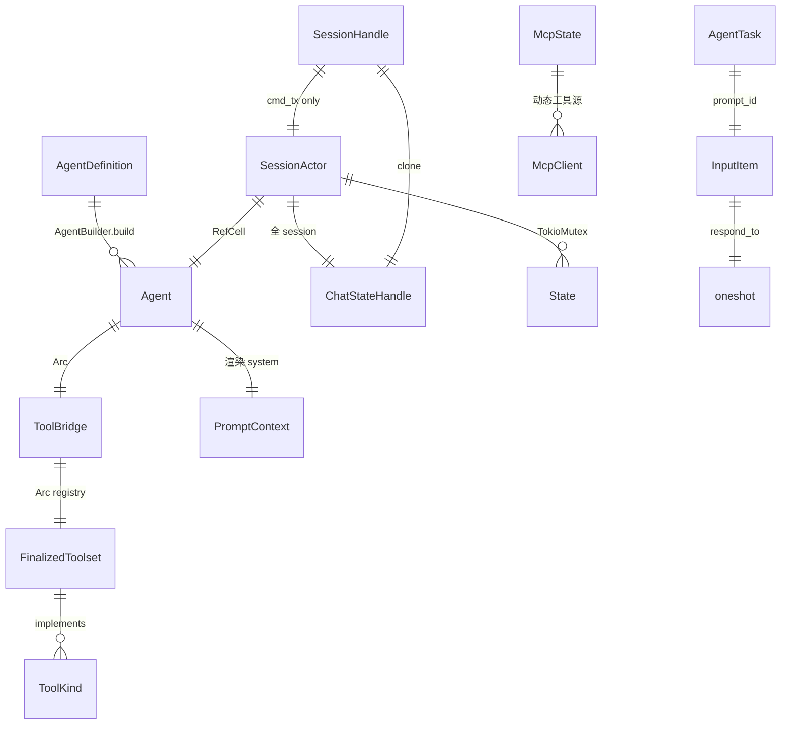
```mermaid
erDiagram
    AgentDefinition ||--o{ Agent : "AgentBuilder.build"
    Agent ||--|| ToolBridge : "Arc"
    Agent ||--|| PromptContext : "渲染 system"
    SessionActor ||--|| Agent : "RefCell"
    SessionActor ||--|| ChatStateHandle : "全 session"
    SessionActor ||--o{ State : "TokioMutex"
    SessionHandle ||--|| SessionActor : "cmd_tx only"
    SessionHandle ||--|| ChatStateHandle : "clone"
    InputItem ||--|| oneshot : "respond_to"
    AgentTask ||--|| InputItem : "prompt_id"
    ToolBridge ||--|| FinalizedToolset : "Arc registry"
    FinalizedToolset ||--o{ ToolKind : "implements"
    McpState ||--o{ McpClient : "动态工具源"
```

**枢纽**：`SessionActor` 连接协议（Command）、Harness（`Agent`）、历史（`ChatState`）、出站（gateway）、横切（memory、compaction、MCP）。

---

## 2.2 SessionHandle（L1 代理）

**路径**: `xai-grok-shell/src/session/handle.rs`  
**约束**: `Clone + Send`；**不**包含 `SessionActor` 指针。

| 字段/能力 | 类型语义 | 谁读 | 设计意图 |
|-----------|----------|------|----------|
| `cmd_tx` | `UnboundedSender<SessionCommand>` | Pager、Leader、测试 | 唯一写入口；90+ 命令统一协议 |
| `chat_state_handle` | `ChatStateHandle` | trace、调试 | 读 conversation 快照（仍经 actor） |
| `current_prompt_id` | `Arc<Mutex<Option<String>>>` | cancel、subagent | 与 Actor **共享**；定位当前 turn |
| `pending_interactions` | `PendingInteractions` | roster | 审批/提问/plan 阻塞态 |
| `model_id` / `yolo_mode` | per-session | Leader 多 client | **禁止**用 MvpAgent 全局可变 |
| `resolved_tool_overrides` | `ArcSwapOption` | fork 子 session | 子 agent 继承 cutoff |
| `mcp_servers` | `Vec<McpServer>` | fork 快照 | `UpdateMcpServers` **不**更新 Handle 副本 |
| `gateway_enabled` | `AtomicBool` | 是否推 SessionUpdate | attach 时可静音 |

**方法模式**：无 `async fn turn()`；全是 `cmd_tx.send(...)` + 可选 `oneshot` 等回复。

---

## 2.3 SessionActor + State

**路径**: `session/acp_session.rs`（struct ~581 行）

### SessionActor 职责分组

| 组 | 代表字段 | 职责 |
|----|----------|------|
| 队列 | `state: TokioMutex<State>` | FSM + notification |
| Harness | `agent: RefCell<Agent>` | mid-session rebuild |
| 历史 | `chat_state_handle` | **禁止** Session 直改 conversation |
| 出站 | `notifications` | gateway + replay |
| 鉴权 | `auth_manager`, `model_auth_memo` | 每 turn 门禁、401 attribution |
| MCP | `mcp_state`, `mcp_strategy` | 动态工具池单锁 |
| 压缩 | `compaction: CompactionConfig` | 阈值、抑制门 |
| 记忆 | `memory: SessionMemory` | flush/dream；`is_flushing` 门控 |
| 中断 | `pending_interjections`, `pending_skill_reminders` | Ctrl+Enter、skill 公告 |
| 采样 | sampler handle、idle timeout | 流式 HTTP |

### State 字段

| 字段 | 行为 |
|------|------|
| `running_task` | `Some` = Working；`running_prompt_id()` 为 sweep 权威 |
| `pending_inputs` | 排队；每项带 `respond_to` |
| `pending_notifications` | Idle 时 synthetic wake |
| `notifications_suppressed` | Ctrl+C 后抑制自动 wake |
| `nudges_used_this_session` | LazinessDetector；换 model 重置 |

---

## 2.4 SessionCommand（协议摘要）

**路径**: `session/commands.rs` — enum 自 125 行。

设计：**邮箱模式** + **oneshot 同步回复** + **gateway 流式**（三轨分离）。

| 分类 | 代表变体 | 同步回复 |
|------|----------|----------|
| Turn | `Prompt`, `Cancel`, `Interject` | `Prompt` → `PromptTurnResult` |
| Harness | `SetSessionModel`, `RebuildAgentForDefinition` | 部分 oneshot |
| 队列 | `EditQueuedPrompt`, `ClearQueue`, `RemoveQueuedPrompt` | `RemovedFromQueue` 特殊 |
| 压缩/Memory | `CompactSession`, `FlushMemory` | oneshot ack |
| MCP | `UpdateMcpServers`, `CallMcpTool` | 多种 |
| 观测 | `GetSessionInfo`, `TakeTurnMessages` | 快照 |

`Prompt` 关键字段：`send_now`, `verbatim`, `json_schema`, `respond_to`, `persist_ack`, `admission`（task wake）。

---

## 2.5 Agent / AgentDefinition / AgentBuilder

### AgentDefinition（蓝图）

- **来源**: `.grok/agents/*.md`（YAML + body）
- **无运行时状态**；变更加 `RebuildAgentForDefinition`

### Agent（构建产物）

**路径**: `xai-grok-agent/src/agent.rs`

| 字段 | 含义 | 影响模型 |
|------|------|----------|
| `system_prompt` | `PromptContext::render` 缓存 | system 头 |
| `tool_bridge` | `Arc<ToolBridge>` | tool schema |
| `compaction_policy` | 自动压缩阈值 | iter 前检查 |
| `reminder_policy` | system-reminder 策略 | turn 内块 |
| `hosted_tools` | WebSearch 等 native API | 请求体 tools 字段 |

**NOT portable** — 绑 session ToolBridge；跨 session 用新 spawn + 继承 spec。

### AgentBuilder::build() 十步（摘要）

**路径**: `xai-grok-agent/src/builder.rs` ~669

1. `resolve_definition`
2. skills 发现 / preload → 注入 `prompt_body`
3. `ToolRegistryBuilder` + 按 config 注册内置 tool
4. `finalize_builder` → `FinalizedToolset` + `Terminal` 抽出
5. 组装 `PromptContext`（AGENTS.md、personas、memory 段）
6. `render` → `system_prompt`
7. `hosted_tools`
8. `Agent::new`

cwd 双轨：`working_directory`（工具）vs `prompt_working_directory`（system 可见路径）。

---

## 2.6 ChatStateActor

**路径**: `xai-chat-state/src/actor/mod.rs`

**单写者**：所有 `conversation`、`total_tokens`、usage ledger 变更经 `ChatStateCommand`。

| 命令类 | 代表 | Turn 中何时 |
|--------|------|-------------|
| Mutation | `PushUserMessageAndAck` | `handle_prompt` 开头 |
| Mutation | `PushAssistantResponse`, `PushToolResult` | 每 sampling iter |
| Mutation | `ReplaceConversation` | compaction |
| Mutation | `ReplaceSystemHead` | reconnect / rebuild agent |
| Query | `BuildConversationRequest` | **每 iter** `build_request` |
| Usage | `RecordTokenUsage`, `RecordSubagentUsage` | 流式/子 agent |

`build_request` 内部（`request_builder.rs`）：clone conversation → prune tool results → repair dangling → 注入 `memory_reminder` → 产出 API 请求。

---

## 2.7 ToolBridge / FinalizedToolset

**路径**: `xai-grok-tools/src/bridge.rs`, `registry/types.rs`

| 组件 | 职责 |
|------|------|
| `ToolRegistryBuilder` | 编译期注册内置 `ToolKind` |
| `finalize(config, SessionContext)` | 满足 requirements、装 `Resources` |
| `FinalizedToolset` | 不可变 registry + `LocalRegistry` 执行 |
| `ToolBridge` | `call_new_tool`；`terminal` **独立于** registry 锁（cancel kill bash） |

`ToolBridgeResult`：`output`（ACP/JSON）与 `prompt_text`（带 reminder 给下一轮模型）。

---

## 2.8 MvpAgent

**路径**: `shell/agent/mvp_agent/acp_agent.rs`

| 做 | 不做 |
|----|------|
| ACP `prompt()` → `SessionCommand::Prompt` | turn loop |
| 解析 `_meta`（mode、send_now、schema） | 直接写 ChatState |
| auth、model 切换协商 | tool 实现 |

---

# II.3 模块分层（为什么这样切）

> Crate 全表见 [PACKAGE_MODULES.md](./PACKAGE_MODULES.md)。这里只讲 **依赖禁令背后的因果**。

## 3.1 三条硬边界

```text
shell（编排） ──调用──► chat-state / tools / memory / sampler / mcp
tools ──X──► shell     （工具实现不得回调 SessionActor）
chat-state ──X──► shell （历史存储不知 Prompt 队列）
```

**为什么 tools 不能回调 shell？**  
工具在 `execute_tool_calls` 里跑，持有的是 `ToolBridge` + workspace。若工具能直接 `SessionCommand`，cancel、队列、interjection 的单写者不变式会被旁路——例如工具自己再开一个 Prompt，而 `running_task` 仍认为只有一个 turn。

**为什么 ChatState 独立 Actor？**  
`build_request` 每 loop 都要 clone/prune/repair conversation。HTTP 流、Persistence、Turn 同时碰同一份 `Vec<Message>` 会数据竞争。单写者 Actor + oneshot 查询，让「压缩 ReplaceConversation」与「正在 build_request」可序列化。

**为什么 Session 必须 `!Send` 专用线程？**  
`RefCell<Agent>`、PTY、大量 `spawn_local`。ACP 侧 `SessionHandle` 只留 `cmd_tx`，所以 UI 线程可以 `Send`，编排态不用变 `Sync`。

## 3.2 胶水在 shell，定义在 agent，执行在 tools

| 层 | 典型类型 | 负责的「为什么」 |
|----|----------|------------------|
| `xai-grok-shell` | `SessionActor` | **何时**开 turn、如何排队、何时 compact/flush |
| `xai-grok-agent` | `AgentBuilder`, templates | **Prompt 长什么样** |
| `xai-grok-tools` | `ToolBridge` | **工具怎么跑**、reminder 怎么回灌 |
| `xai-chat-state` | `ChatStateActor` | **历史事实**与 `build_request` |
| `xai-grok-memory` | vault/index | **跨 session 知识**；由 shell 决定何时 inject/flush |
| `xai-grok-sampler` | `SamplerActor` | **HTTP 流**；不懂 Session 业务 |

改「用户发两条会不会并行」→ shell。改「某个 bash 工具 schema」→ tools。改「system 段落顺序」→ agent。改「压缩后消息形状」→ chat-state + shell compaction。

## 3.3 数据流（一图）

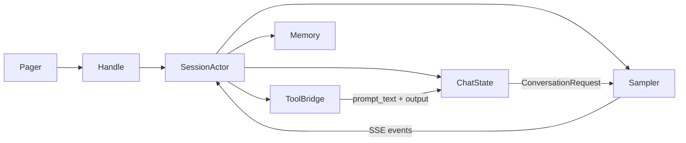
```mermaid
flowchart LR
    Pager --> Handle --> SA[SessionActor]
    SA --> CS[ChatState]
    SA --> TB[ToolBridge]
    SA --> Mem[Memory]
    SA --> Sam[Sampler]
    CS -->|ConversationRequest| Sam
    Sam -->|SSE events| SA
    TB -->|prompt_text + output| CS
```


# II.4 Memory · Plan · 多 Agent（整体设计）

> 这里讲 **产品语义与因果**，不讲文件目录。Prompt 原文中文见 [GROK_RUNTIME_PROMPTS.md](./GROK_RUNTIME_PROMPTS.md)。

---

## II.4.1 Memory：长短期怎么分、怎么读写、怎么个性化

### 心智模型

Grok 的记忆是 **两层保险**，不是一个「向量数据库字段」：

| 层 | 白话 | 寿命 | 模型怎么看见 |
|----|------|------|--------------|
| **会话本** | 当前 ChatState 对话（含工具结果） | 本 session；可被 compact 砍短 | 每 iter `build_request` 整段带上 |
| **Vault** | `~/.grok/memory/` 下的 Markdown + SQLite 索引 | 跨 session | **从不整库灌 prompt**；只「检索 → 格式化 → 注入或 tool」 |

Vault 里再分：

```text
全局 MEMORY.md          ← 跨项目偏好（OS/壳/个人习惯应写这里）
{workspace}/MEMORY.md   ← 项目约定（dream 沉淀）
{workspace}/sessions/*.md ← flush 出来的「待整理日记」
index.sqlite            ← FTS / 可选向量，服务 search
```

**Dream** 不是第三存储：把多份 session 日记 **合成进** 项目 `MEMORY.md`，再删已处理日记、重建索引。

实验开关：`--experimental-memory` / `GROK_MEMORY=1` / 配置 `[memory] enabled`。关掉则没有 search/get 工具，也没有 `/flush` `/dream`。

### 读：什么时候进模型

**1）首 turn 自动注入（只决策一次）**

新会话段第一次采样前：用用户末句搜 vault（寒暄句改用固定 query「project conventions preferences architecture」），结果包成：

```text
<memory-context>
## Relevant Memory from Past Sessions
### Result …
</memory-context>
```

塞进 `build_request` 的 system 侧，并 latched：`context_injected=true`。  
之后 turn **不会**每圈自动再搜。Resume 时若 conversation 里已有 `<memory-context>`，为保 prompt cache **不重搜**。

**2）Compact 后 recovery**

对话被摘要替换后，再搜一次 vault，结果进 post-compact system-reminder，把「砍掉前」的关键事实捞回来。

**3）模型主动工具**

`memory_search` / `memory_get`：缺先验决策、convention、偏好，或 compact 丢上下文时，模型自己召回。这是 **读**；没有通用「memory_write」工具。

### 写：什么时候落盘

| 触发 | 写到哪 | 意图 |
|------|--------|------|
| Idle flush / `/flush` | `sessions/*.md` | 会话变长或用户强制，把细节先落地 |
| Compact **前** flush | 同上 | 摘要丢掉细节之前先沉淀 |
| Session end | 很瘦的 metadata 摘要 | **不记 shell 命令**（防 secret） |
| Dream / `/dream` | 覆盖项目 `MEMORY.md` | 日记 → 耐久知识 |
| `/memory [global\|workspace] …` | 对应 MEMORY.md | 显式个性化/项目笔记 |

Flush 是 **另一次 sampling（无 tools）**，有 `is_flushing` 锁；锁定期间 **禁止 auto-compact**（防和 ReplaceConversation 打架）。

Flush 提示词明确：**不要**把 OS/shell/editor 偏好写进 session 日记——那些属于 **全局 MEMORY.md**。

### 个性化

- **有** `MEMORY.md`（全局 + 项目），不是 CRM 用户画像系统。  
- 偏好应进 **global**；项目约定进 **workspace**。  
- UI/MCP 的 settings 偏好是另一套，不要和 vault 混为一谈。

### Compact × Memory（一条因果链）

```text
token 吃紧
  → 先 flush 进 vault（细节保险）
  → 再 LLM 摘要替换会话本（变短）
  → recovery 从 vault 检索补回关键事实
```

**原则**：Compact 砍短时对话；Vault 是跨 session 保险。Recovery 是补丁，不是整库回灌。

### 易错点

1. 日志 `MEMORY_IDLE_FLUSH` ≠ 模型已经看见——只是写盘。  
2. 首 turn 只注入一次；query 变了也可能还拿着旧 `<memory-context>`。  
3. 丰富跨 session 知识靠 flush/dream；只靠 session-end 瘦摘要，下一会话几乎空。  
4. Subagent 跳过 dream。

---

## II.4.2 Plan 模式：先谈清楚再动手

### 解决什么问题

用户需求不清、改动面大时，**禁止直接改仓库**，强迫：探索 → 写 plan 文件 → 用户批准 → 再退出模式写代码。

这和 Goal harness（自动驾驶验收）是 **两条正交路径**，不要混。

### 状态机（白话）

```text
未开 Plan
  → 用户 Shift+Tab / mode=plan，或模型调 enter_plan_mode
  → Active：只能改 plan 文件；应 ask_user 或 exit 收尾
  → exit_plan_mode 把 plan 端给用户批
      → 批准 → 退出 Plan，可写代码
      → 取消/空 plan → 仍留在 Plan（fail closed）
```

### 规矩

- **Edit gate**：除 plan 文件外，一切文件编辑被拒（YOLO 也拦）。  
- **不被 gate 的坑**：read/grep、以及 **bash** —— plan mode **不保证** shell 只读，模型仍可能用终端改环境。  
- 回合应以 **`ask_user_question` 澄清** 或 **`exit_plan_mode` 交卷** 结束，而不是闷头改代码。

### 进入时模型看到的核心指令（六步）

1. 彻底探索代码库（有 `task` 时可用 `explore` 子代理并行搜，省主上下文）  
2. 找相似功能与权衡  
3. 需要澄清就 `ask_user_question`  
4. 设计可落地的实现策略  
5. 写入 plan 文件  
6. 就绪后 `exit_plan_mode` 交给用户

每回合还会钉一句：**不要对系统做编辑/写入；本回合只能 ask 或 exit。**

### Plan vs Goal

| | Plan mode | Goal harness |
|--|-----------|--------------|
| 驱动 | 同一主 agent + 用户拍板 | 编排器自动推进 |
| 计划给谁看 | **用户** | verifier/implementer（用户基本不看） |
| 提问 | 鼓励 ask_user | **禁止**追问用户 |
| 结束 | 用户批准 exit | verifier 收敛 / classifier |

---

## II.4.3 多 Agent：三条轨，不要合成一条

Grok **不是**「一个进程里多个 running_task」。并行 = **新 session（子代理）**。

### 轨 A：`task` 工具（显式委派）

主 agent 调 `task`，spawn **新 Session**：

| subagent_type | 角色 |
|---------------|------|
| `explore` | 只读摸代码；Plan 里鼓励并行开多个 |
| `general-purpose` | 可改仓库的完整工人 |
| `plan` 等 | 按 agent 定义裁工具 |

父子上下文：父历史压成 `<background_context>`（近几轮原文 + 更早摘要）；**任务正文**是子代理最后一条 user（最大 recency）。子代理换自己的 system（`subagent_prompt` + 角色说明）。

### 轨 B：Goal harness（自动驾驶）

`/goal` 一类入口：

```text
Planner（写一次验收契约 goal/plan.md，用户几乎不看）
  → Implementer（就是父会话本体，禁止追问）
  → Verifier 面板（对抗验收）
  → 卡住 → Strategist（只改 HOW，不改 WHAT/验收标准）
```

Planner / Strategist / Verifier 各自有专用 system prompt（见 RUNTIME_PROMPTS）。

### 轨 C：主 Session 串行

同一 SessionActor **永远一个** `running_task`。所谓「多 agent」不是在这里开线程，而是 A/B 轨新开 session，结果回灌。

### 选型

| 场景 | 走哪条 |
|------|--------|
| 方案不清、要人拍板 | **Plan mode** |
| 「一直做到完」、自动验收 | **Goal** |
| 主线程并行摸代码 | **task + explore** |
| 把一块可改仓库的活派出去 | **task + general-purpose** |

### 易错点

1. Plan 的 edit gate 不管 bash。  
2. Goal 禁止追问；Plan 依赖 ask——别把 Goal 当 Plan 用。  
3. 并行靠新 session，不是第二个 `running_task`。

---

# II.5 Tool / Skill / MCP 体系

## 5.1 工具注册与构建链

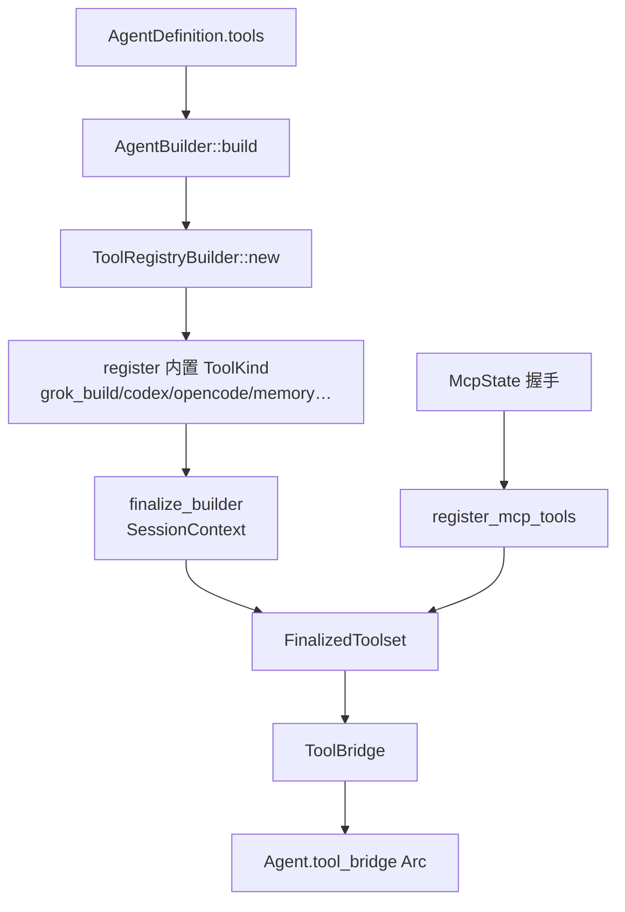
```mermaid
flowchart TD
    AD[AgentDefinition.tools] --> AB[AgentBuilder::build]
    AB --> TRB[ToolRegistryBuilder::new]
    TRB --> REG[register 内置 ToolKind<br/>grok_build/codex/opencode/memory…]
    REG --> FIN[finalize_builder<br/>SessionContext]
    FIN --> FTS[FinalizedToolset]
    FTS --> BR[ToolBridge]
    BR --> AG[Agent.tool_bridge Arc]

    MCP[McpState 握手] --> RMT[register_mcp_tools]
    RMT --> FTS
```

| 阶段 | 可变性 |
|------|--------|
| `finalize` 后 registry | 结构固定；MCP **动态** `register_tool` |
| mid-session rebuild | 新 `Agent` + 可能 `re_register_mcp_tools_on_rebuilt_bridge` |

**SessionContext** 传入：cwd、session id、skills 列表、memory backend、LSP、web search config…
# Grok Build Harness Goal 模式（`/goal`）源码层面原理

Goal 模式本质：**在普通 Turn-by-turn 对话 Agent 外层，套一层独立的 Goal 状态机 + 独立隐藏 Evaluator 模型，把一次性长任务从 “每轮都要人确认” 改成自主循环直到验证达标**。

>
> 源码入口：`goal_evaluator.rs`，核心是**三层嵌套循环**，不是简单 prompt 技巧，是 Harness Runtime 一等公民的状态管理。

## 一、三层循环架构（源码定义）

```
L1：Goal顶层状态机（最外层，管理目标生命周期）
└── L2：Plan循环（计划、重规划、进度清单checklist）
    └── L3：普通Agent Turn循环（模型调用、工具执行、文件/命令操作）
```

1. **L3：基础 Turn 循环**（就是普通 grok-build 默认 agent）
   - 模型调用 → 解析 tool_call → 沙箱执行工具 → 把结果塞回对话上下文 → 一轮 Turn 结束。
   - 普通交互模式：L3 结束就停下来等待用户输入确认。
   - Goal 模式：**L3 跑完不会交还控制权，进入 Goal 评估**。
2. **L2：Plan/Checklist 层**
   - 首次收到`/goal "xxx目标"`：模型生成结构化**checklist 任务清单**，持久写入会话状态（GOAL.md）。
   - 每一轮 L3 执行完毕，会更新清单进度；如果发现当前方案走不通，**动态重规划，修改清单**，不是死磕最开始的计划。
   - 可以派生并行子 Agent（最多 8 个），每个子 agent 在独立 git worktree 沙箱执行，隔离 speculative 尝试。
3. **L1：Goal 状态机（核心）**
   Goal 枚举状态（源码定义）：

- `Running`：正在执行
- `CandidateComplete`：评估器判定 “看起来做完了”，进入二次验证
- `Blocked`：遇到无法解决障碍，暂停，等待人工干预
- `Paused`：人工 / 预算触发暂停（`/goal pause`）
- `Completed`：全部验证通过，目标结束
- `BudgetExhausted`：token/turn 超时，强制终止

>
> 普通对话没有这套状态机，Goal 模式是**在 SessionActor 内部增加 GoalState 结构体**，和普通会话复用同一套 Turn 消息管道。

## 二、最关键设计：独立 Hidden Evaluator（`goal_evaluator.rs`）

>
> 这是 Goal 模式和普通 Plan 模式最大区别：**不信任主 Agent 自己说 “任务完成”**。

L3 每一轮执行完成后，Harness 自动发起**一次用户不可见、独立的 LLM 调用（hidden completion evaluator）**：

1. 输入：原始 Goal 目标 + 完整会话 transcript（所有历史 turn 日志）
2. 约束：**禁止调用任何工具**，强制输出 JSON schema，三选一：
   - `continue`：任务未完成，继续 L3 执行
   - `candidate_complete`：看起来完成，进入**独立验证阶段**
   - `blocked`：卡住，无法继续
3. 降级策略：优先轻量小模型做评估，超时 / 失败回退到主模型；超时 30s，最多重试 2 次博客园
4. 规则：Evaluator system prompt 要求**保守判定，不能轻信主 agent 的自我汇报**

### CandidateComplete 之后的二次验证（不是一步完成）

当 evaluator 输出`candidate_complete`，**并不会直接标记 Goal 成功**，会自动执行验证动作：

- 自动代码 review、运行测试脚本、检查文件输出
- 验证失败 → 回到 L2，更新计划清单，继续修复
- 验证通过 → Goal 状态置为`Completed`；验证连续失败 / 基础设施异常 → 进入 Paused

## 三、预算与防死循环保护（Goal 模式专属护栏）

Goal 模式自带独立预算，和普通对话 token 预算隔离：

1. Token 上限、Turn 轮数上限、最大执行时长；任一耗尽 → `BudgetExhausted`，终止自主循环，交还控制权给用户。
2. Blocked 阈值保护：连续 N 次判定 blocked，自动 pause，防止无限重试。
3. Compaction 引擎会在上下文超限触发摘要压缩，**Goal 状态、checklist 进度独立持久化，不会被压缩丢掉**（写入 GOAL.md），压缩后仍然可以恢复目标进度。

## 四、消息流与 Turn 抽象的关系

前面提到 Harness 所有事件统一收敛到 Turn 抽象，Goal 模式就是利用这套统一消息管道：

- 主 Agent 的工具执行、子 agent 返回结果、evaluator 回调、重规划触发，全部作为不同`PromptOrigin`类型的 Turn 事件进入 runtime；
- 用户随时可以在 Goal 运行过程中追加指令，注入新 Turn，**不打断 Goal 状态，动态修改目标**；
- 命令：`/goal status`、`/goal pause`、`/goal resume`、`/goal clear`，本质是修改 L1 Goal 状态机的状态。

## 五、子 Agent 并行机制（Goal 内的并行分支）

Goal 可以 spawn 最多 8 个子 Agent：

- 每个子 agent 分配独立 git worktree 沙箱，互不污染主代码目录；
- 子 agent 执行结果返回父 Goal；父 Goal 汇总结果、合并变更；
- 子 agent 同样有自己的 turn 循环，但子 agent**不启动独立 Goal evaluator**，只有顶层 Goal 才有 evaluator。

## 六、一句话概括原理（源码视角）

Goal 模式不是新模型能力，**是 Harness Runtime 增加了独立 Goal 状态机 + 后台独立评估器**；把传统一问一答的 Turn 循环，变成「执行→独立审计评估→按需重规划→验证」的自主闭环；带预算、暂停恢复、checklist 持久化、并行隔离子 Agent，直到评估 + 验证双通过才标记完成。

## 七、对比 Plan Mode（容易混淆）

- **Plan Mode**：先生成计划，人工审批后再执行；没有自动循环、没有独立 evaluator，每一步执行完停下来。
- **Goal Mode**：Plan + 自动循环 + hidden evaluator + 验证闭环，不需要人工逐步骤确认，自主跑直到目标验证完成。

## 伪代码简化

```
// Goal主循环，在SessionActor内
loop {
    match goal_state {
        Running => {
            run_l3_agent_turn();          // 主agent执行工具调用
            let eval_res = hidden_evaluator.assess(goal, transcript);
            match eval_res {
                Continue => update_checklist;
                CandidateComplete => {
                    let verify_result = run_verification();
                    if verify_result.pass {
                        goal_state = Completed;
                    } else {
                        replan(); // 验证失败，重新规划
                    }
                }
                Blocked => {
                    if blocked_count > threshold { goal_state = Paused; }
                }
            }
            // 预算检查
            if token_exceed || turn_exceed {
                goal_state = BudgetExhausted;
            }
        }
        Paused | Completed | BudgetExhausted => break,
    }
}
```
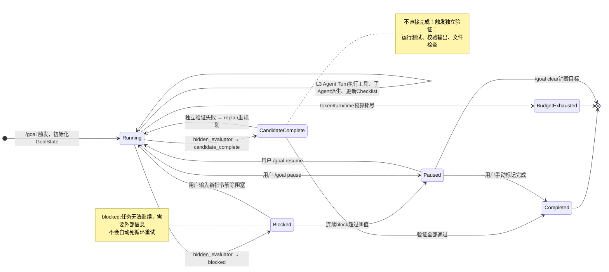
```mermaid
stateDiagram-v2
    direction LR
    [*] --> Running : /goal 触发，初始化GoalState

    Running --> Running : L3 Agent Turn执行工具、子Agent派生、更新Checklist
    Running --> CandidateComplete : hidden_evaluator → candidate_complete

    CandidateComplete --> Running : 独立验证失败 → replan重规划
    CandidateComplete --> Completed : 验证全部通过

    Running --> Blocked : hidden_evaluator → blocked
    Blocked --> Paused : 连续block超过阈值
    Blocked --> Running : 用户输入新指令解除阻塞

    Running --> BudgetExhausted : token/turn/time预算耗尽
    Running --> Paused : 用户 /goal pause
    Paused --> Running : 用户 /goal resume
    Paused --> Completed : 用户手动标记完成

    Completed --> [*]
    BudgetExhausted --> [*]
    Paused --> [*] : /goal clear销毁目标

    note right of CandidateComplete
        不直接完成！触发独立验证：
        运行测试、校验输出、文件检查
    end note

    note left of Blocked
        blocked:任务无法继续，需要外部信息
        不会自动死循环重试
    end note
```
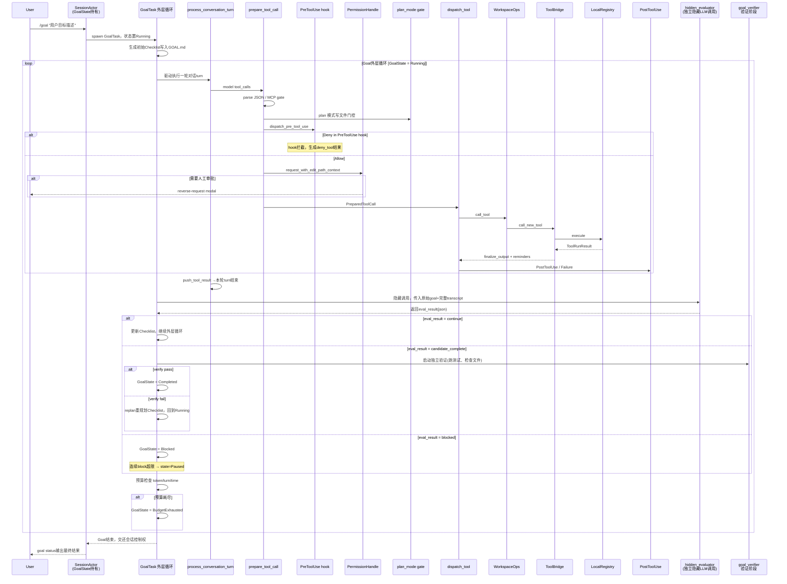
```mermaid
sequenceDiagram
   participant User
   participant SA as SessionActor<br/>(GoalState持有)
   participant GT as GoalTask 外层循环
   participant ConvLoop as process_conversation_turn
   participant Prep as prepare_tool_call
   participant Hook as PreToolUse hook
   participant Perm as PermissionHandle
   participant Plan as plan_mode gate
   participant Disp as dispatch_tool
   participant WO as WorkspaceOps
   participant TB as ToolBridge
   participant LR as LocalRegistry
   participant Post as PostToolUse
   participant Eval as hidden_evaluator<br>(独立隐藏LLM调用)
   participant Verify as goal_verifier<br>验证阶段

   User->>SA: /goal "用户目标描述"
   SA->>GT: spawn GoalTask，状态置Running
   GT->>GT: 生成初始Checklist写入GOAL.md

   loop Goal外层循环 [GoalState = Running]
      GT->>ConvLoop: 驱动执行一轮对话turn

      ConvLoop->>Prep: model tool_calls
      Prep->>Prep: parse JSON / MCP gate
      Prep->>Plan: plan 模式写文件门控
      Prep->>Hook: dispatch_pre_tool_use

      alt Deny in PreToolUse hook
         Note over Hook: hook拦截，生成deny_tool结果
      else Allow
         Prep->>Perm: request_with_edit_path_context
         alt 需要人工审批
            Perm-->>User: reverse‑request modal
         end
         Prep->>Disp: PreparedToolCall
         Disp->>WO: call_tool
         WO->>TB: call_new_tool
         TB->>LR: execute
         LR-->>TB: ToolRunResult
         TB-->>Disp: finalize_output + reminders
         Disp->>Post: PostToolUse / Failure
      end

      ConvLoop->>ConvLoop: push_tool_result →本轮turn结束

   %% turn结束，触发隐藏evaluator
      GT->>Eval: 隐藏调用，传入原始goal+完整transcript
      Eval-->>GT: 返回eval_result(json)

      alt eval_result = continue
         GT->>GT: 更新Checklist，继续外层循环
      else eval_result = candidate_complete
         GT->>Verify: 启动独立验证(跑测试、检查文件)
         alt verify pass
            GT->>GT: GoalState = Completed
         else verify fail
            GT->>GT: replan重规划Checklist，回到Running
         end
      else eval_result = blocked
         GT->>GT: GoalState = Blocked
         note over GT: 连续block超限 → state=Paused
      end

      GT->>GT: 预算检查 token/turn/time
      alt 预算耗尽
         GT->>GT: GoalState = BudgetExhausted
      end
   end

   GT-->>SA: Goal结束，交还会话控制权
   SA-->>User: goal status输出最终结果
```
```mermaid
stateDiagram-v2
    direction LR
    [*] --> Running : /goal 触发，初始化GoalState

    Running --> Running : L3 Agent Turn执行工具、派生子Agent、更新Checklist
    Running --> CandidateComplete : hidden_evaluator → candidate_complete

    CandidateComplete --> Running : 独立验证失败 → replan重规划
    CandidateComplete --> Completed : 验证全部通过

    Running --> Blocked : hidden_evaluator → blocked
    Blocked --> Paused : 连续block超过阈值
    Blocked --> Running : 用户输入新指令解除阻塞

    Running --> BudgetExhausted : token/turn/time预算耗尽
    Running --> Paused : 用户 /goal pause
    Paused --> Running : 用户 /goal resume
    Paused --> Completed : 用户手动标记完成

    Completed --> [*]
    BudgetExhausted --> [*]
    Paused --> [*] : /goal clear销毁目标

    note right of CandidateComplete
        不直接完成！触发独立验证：
        运行测试、校验输出、文件检查
    end note

    note left of Blocked
        blocked:任务无法继续，需要外部信息
        不会自动死循环重试
    end note
```
---

## 5.2 单次 Tool Call 中间件链（Session 侧）

**入口**: `execute_tool_calls` → `prepare_tool_call` → `dispatch_tool`

```mermaid
sequenceDiagram
   participant process_conversation_turn as Loop
   participant prepare_tool_call as Prep
   participant PreToolUse_hook as Hook
   participant PermissionHandle as Perm
   participant plan_mode_gate as Plan
   participant dispatch_tool as Disp
   participant WorkspaceOps as WO
   participant ToolBridge as TB
   participant LocalRegistry as LR
   participant PostToolUse as Post
   participant UI

   Loop->>Prep: model tool_calls
   Prep->>Prep: parse JSON / MCP gate
   Prep->>Plan: plan 模式写文件门控
   Prep->>Hook: dispatch_pre_tool_use

   alt Deny in PreToolUse hook
      Hook-->>Prep: deny_tool
      Prep-->>process_conversation_turn: push_tool_result(denied) → next iter
   else Allow
      Prep->>Perm: request_with_edit_path_context
      alt 需要人工审批
         Perm-->>UI: reverse_request modal
      end

      Prep->>Disp: PreparedToolCall
      Disp->>WO: call_tool
      WO->>TB: call_new_tool
      TB->>LR: execute
      LR-->>TB: ToolRunResult
      TB-->>Disp: finalize_output + reminders
      Disp->>Post: PostToolUse / Failure
      Disp-->>process_conversation_turn: push_tool_result → next iter
   end
   end
```

### `prepare_tool_call` 在拦什么（顺序有因果）

工具真正执行前，Session 侧先过一串闸门——**顺序不能随便调**：

1. **先发 Pending 给 UI** — 用户立刻看到「正在调某工具」，不必等权限走完。  
2. **MCP 是否就绪** — 未握手完就执行会空挂/错工具表。  
3. **参数是否合法** — 坏 JSON 应在执行前失败，并尽量可恢复拼接。  
4. **Plan 模式能否改文件** — 产品策略，不是模型决定。  
5. **PreToolUse hook** — 扩展可改参/跳过。  
6. **权限 / 审批** — YOLO、pin、弹窗；用户拒绝则本 tool 结束。  
7. **exit_plan 等特殊拦截** — 走 reverse-request，不是普通 tool result。  
8. 通过后才变成可 dispatch 的 `PreparedToolCall`。

工具层内部再：`prepare_dispatch`（查注册表）→ `execute` → `finalize_output`（reminder、skill 发现等回灌给下一 iter）。

**Cancel**：杀前台命令走 **独立** terminal 句柄，不跟 registry 锁绑死——否则「取消」会卡在别的工具正持锁上。

---

## 5.3 Skill 体系：发现、注入、运行时公告

### 发现优先级（`prompt/skills.rs`）

Local → Repo → User → config → Server → Bundled → plugins（native 同名优先）。

### 构建期注入

`AgentBuilder::build`：

1. `list_skills_with_plugins` / `resolve_preloaded_skills`
2. `format_skills_for_injection` → 追加到 `definition.prompt_body`
3. `SessionContext.skills` → finalize 时 `SkillManager::seed`
4. `seed_skill_discovery` — 未注入 path 的 listing

### 运行时 mid-session 发现

| 组件 | 路径 | 行为 |
|------|------|------|
| `SkillDiscoveryReminder` | tools reminders | 工具结果后可能触发 |
| `pending_skill_reminders` | `SessionActor` | turn 中缓冲 `ConversationItem` |
| `flush_pending_skill_reminders` | `session_setup.rs` | turn 安全点写入 conversation |

若 `current_prompt_id` 有值 → 进 pending；否则立即 push ChatState。

**Skill 工具**: `OpenCodeSkillTool`（`ToolKind::Skill`）— 读 SKILL.md 执行脚本。

---

## 5.4 MCP 动态工具

### McpState

**路径**: `xai-grok-mcp/src/servers.rs`，Session 上 `Arc<TokioMutex<McpState>>`

| 字段 | 作用 |
|------|------|
| `configs` | server 列表 |
| `owned_clients` / `shared_clients` | 连接池 |
| `mcp_tool_meta` | qualified name → schema meta |
| `disabled_tools` |  per-tool 开关 |
| `generation` | 防 stale init |

### 注册路径

```text
McpClient::get_tool_registrations()
  → register_mcp_tool (shell/mcp.rs)
       → if model_visible: ToolBridge::register_mcp_tools
       → else: app-only
```

Qualified name: `{server}{delimiter}{tool}`。

### UpdateMcpServers mid-session

`SessionCommand::UpdateMcpServers`：

1. `update_configs_diff` → added/removed
2. `unregister_tools_by_prefix` 移除 server
3. `spawn_local(ensure_mcp_tools_initialized)` 握手 + 注册

**Meta 工具**: `SearchTool`（搜 MCP 目录）、`UseTool`（派发到 MCP target）。

---

## 5.5 Reminder 与「中间件」设计（工具层横切）

Grok **没有** OpenHuman 式 harness middleware 栈；横切在：

| 机制 | 位置 | 作用 |
|------|------|------|
| **Hooks** | `xai-grok-hooks` | Pre/Post ToolUse、PermissionDenied |
| **Reminder** | `finalize_output` | 执行后追加 `prompt_text` 片段 |
| **Permission** | workspace + Session | 审批、YOLO、plan file |
| **ToolPolicy** | definition + overrides | cutoff、disabled |

Reminder 类型示例：`LspDiagnosticsReminder`、`TaskCompletionReminder`、`SkillDiscoveryReminder` — 进入 **下一轮** `prompt_text`，不是 ACP output。

---

## 6. 修订记录

| 版本 | 日期 | 说明 |
|------|------|------|
| 1.0–1.1 | 2026-07-28 | 章节骨架 |
| **2.0** | 2026-07-28 | **五维全解**：E2E 异步时序、双循环、实体、模块、Memory、Tool/Skill/MCP |

---

**维护**: 符号名 `grep` 定位；行号易漂移。上游 sync 后核对 `SOURCE_REV`。

---

# II.6 核心实体字段全表

> 原 `GROK_BUILD_CORE_ENTITIES.md`（字段 → 谁读 → 何时变 → 改错后果）。

> **版本**: 1.0（2026-07-28）  
> **源码根目录**: `grok-build/crates/codegen/`  
> **关联**: [GROK_BUILD_ARCHITECTURE_ANALYSIS.md](#) · [GROK_BUILD_RUNTIME_PROMPTS.md](./GROK_RUNTIME_PROMPTS.md)  
> **读完应能回答**: 谁包谁、谁调谁、引用何时绑定、改哪个字段会影响模型输入。

---

## 1. 分层抽象（心智模型）

Grok Build 不是「一个 while 循环调 OpenAI」，而是 **Surface → Session → Turn → Sampling → Tool** 嵌套：

```mermaid
flowchart TB
    subgraph L0["L0 呈现 / 协议"]
        Pager["GrokPager TUI"]
        ACP["MvpAgent ACP"]
        HL["Headless"]
    end

    subgraph L1["L1 Session 编排"]
        SH["SessionHandle\nClone+Send 代理"]
        SA["SessionActor\n!Send 单线程"]
        ST["State\n队列 FSM"]
    end

    subgraph L2["L2 Harness 定义"]
        AD["AgentDefinition\n.grok/agents/*.md"]
        AG["Agent\nprompt + ToolBridge"]
    end

    subgraph L3["L3 Turn 内循环"]
        TP["process_conversation_turn\n采样 loop"]
        CS["ChatStateActor\n消息单写者"]
        SAM["Sampler\n流式 LLM"]
        TB["ToolBridge\n工具分发"]
    end

    subgraph infra["横切"]
        MEM["SessionMemory / xai-grok-memory"]
        CMP["CompactionConfig"]
        MCP["McpState"]
    end

    Pager --> ACP
    ACP --> SH
    SH --> SA
    SA --> ST
    SA --> AG
    SA --> TP
    TP --> CS
    TP --> SAM
    TP --> TB
    SA --> MEM
    SA --> CMP
    AG --> TB
```

| 层 | 实体 | 回答的问题 |
|----|------|-----------|
| **L0** | Pager / ACP / Headless | 用户输入怎么进系统？结果怎么展示？ |
| **L1** | `SessionHandle` + `SessionActor` | 多 Prompt 怎么排队？谁串行执行 Turn？ |
| **L2** | `AgentDefinition` + `Agent` | system prompt 与 tool 集从哪来？ |
| **L3** | Turn loop + `ChatStateActor` | 一轮对话内 messages 如何增长？tool 如何回写？ |

记忆口诀：**Surface 送命令 → Session 排队跑 Turn → Agent 提供 prompt/工具 → ChatState 存历史 → Sampler 调模型 → ToolBridge 执行工具**。

---

## 2. 八元关系：Surface / Handle / Actor / Agent / ChatState / ToolBridge / Sampler / Definition

### 2.1 一句话分工

| 实体 | 管什么 | 不管什么 |
|------|--------|----------|
| **GrokPager** | TUI、slash、审批 UI | 不持有 `SessionActor` |
| **MvpAgent** | ACP JSON-RPC → `SessionCommand` | 不做 tool 实现 |
| **SessionHandle** | `cmd_tx`、共享 `Arc` 句柄 | 不执行 turn 逻辑 |
| **SessionActor** | Turn 调度、compact、memory flush | 不渲染 ratatui |
| **Agent** | `system_prompt`、`Arc<ToolBridge>` | 不直接调 HTTP API |
| **ChatStateActor** | `conversation`、token 计数 | 不决定何时 compact |
| **ToolBridge** | `call_new_tool`、MCP 注册 | 不解析 agent md |
| **AgentDefinition** | 静态配置（文件） | 无运行时状态 |

### 2.2 包含与调用关系

```text
GrokPager (ACP Client)
  └─ MvpAgent::prompt()
       └─ SessionHandle.cmd_tx.send(SessionCommand::Prompt { respond_to })
            └─ SessionActor::run_session() match
                 └─ queue_input → maybe_start_running_task()
                      └─ AgentTask → handle_prompt()
                           └─ process_conversation_turn() loop
                                ├─ ChatStateHandle.build_request()
                                ├─ run_turn_via_sampler()
                                └─ execute_tool_calls() → ToolBridge
```

### 2.3 引用关系（谁持有谁）

| 引用 | 方向 | 何时绑定 | 说明 |
|------|------|----------|------|
| `SessionActor.agent` | Actor → `RefCell<Agent>` | spawn 或 `RebuildAgentForDefinition` | mid-session 可换 |
| `Agent.tool_bridge` | Agent → `Arc<ToolBridge>` | `AgentBuilder::build` | MCP 动态注册改 registry |
| `Agent.definition` | Agent → `AgentDefinition` | 构建时 | 只读配置快照 |
| `SessionActor.chat_state_handle` | Actor → ChatState | spawn | 全 session 单实例 |
| `SessionHandle.cmd_tx` | Handle → Actor 邮箱 | spawn | 多 Clone 共享 |
| `Prompt.respond_to` | 单次 Prompt → oneshot | 每次 prompt | 同步完成信号 |
| `AgentDefinition` 文件 | 磁盘 → Builder | `from_file` 或 rebuild | `.grok/agents/` |

**枢纽实体是 `SessionActor`**：它连接协议（Command）、Harness（Agent）、历史（ChatState）、执行（Sampler/Tool）。

### 2.4 易错点

1. **Pager 不直接调 `SessionActor`**——必须经 ACP `MvpAgent`（或 Leader 转发）。
2. **`Agent` 不能跨 Session 搬运**——注释写明 NOT portable；fork 用新 session + 继承 spec。
3. **`ChatState` 与 `Agent.history` 不是同一个东西**——OpenHuman 式 `Agent.history` 在 Grok 里主要是 ChatState 的 conversation。
4. **Prompt 完成信号是 oneshot，流式是 gateway**——两条通道，勿混。

---

## 3. 核心实体速查表

| 实体 | 源码 | 类型 | 层 |
|------|------|------|-----|
| `SessionHandle` | `xai-grok-shell/.../handle.rs:41` | struct | L1 |
| `SessionActor` | `.../acp_session.rs:581` | struct `!Send` | L1 |
| `State` | `.../acp_session.rs:282` | struct | L1 |
| `SessionCommand` | `.../commands.rs:125` | enum 90+ | L1 协议 |
| `AgentTask` | `notification_drain.rs` | 内部任务 | L1 |
| `Agent` | `xai-grok-agent/agent.rs:25` | struct | L2 |
| `AgentBuilder` | `xai-grok-agent/builder.rs:42` | struct | L2 |
| `AgentDefinition` | `xai-grok-agent/config.rs` | struct | L2 配置 |
| `PromptContext` | `xai-grok-agent/prompt/context.rs:85` | struct | L2 prompt |
| `ChatStateActor` | `xai-chat-state/actor/mod.rs:30` | struct | L3 |
| `ChatStateHandle` | `xai-chat-state/handle.rs` | struct | L3 |
| `ToolBridge` | `xai-grok-tools/bridge.rs:60` | struct | L3 |
| `FinalizedToolset` | `xai-grok-tools/registry` | struct | L3 |
| `SessionMemory` | `shell/memory_state.rs` | struct | 横切 |
| `MvpAgent` | `shell/agent/mvp_agent/` | ACP impl | L0 |

---


## 4. 实体详解（源码级）

以下按 **字段 → 谁读 → 何时变 → 改错后果** 组织；路径均在 `crates/codegen/` 下。

### 4.1 SessionHandle — L1 跨线程代理

**文件**: `xai-grok-shell/src/session/handle.rs`

`SessionHandle` 是外部世界唯一合法的 Session 交互面：`Clone + Send`，通过 `cmd_tx` 发 `SessionCommand`。Actor 本体在专用线程，**不可**直接引用。

#### 4.1.1 核心通道字段

| 字段 | 类型 | 谁读 | 设计说明 |
|------|------|------|----------|
| `cmd_tx` | `UnboundedSender<SessionCommand>` | 所有调用方 | 邮箱协议；90+ 变体统一入口 |
| `persistence_tx` | `UnboundedSender<PersistenceMsg>` | extension handler | 旁路持久化，不经 turn |
| `chat_state_handle` | `ChatStateHandle` | trace、调试、Leader | 读 conversation 快照 |
| `signals_handle` | `SessionSignalsHandle` | telemetry | turn delta 快照 |

#### 4.1.2 与「当前 turn」共享的 Arc

| 字段 | 与 Actor 共享 | 用途 |
|------|---------------|------|
| `current_prompt_id` | 是 | cancel 只杀**当前 turn** 起的 subagent |
| `pending_interactions` | 是 | roster 读 `NeedsInput`（审批/提问/plan） |
| `gateway_enabled` | `AtomicBool` | 是否向 client 推 SessionUpdate |

#### 4.1.3 Leader 多客户端 per-session 隔离

**注释明确要求**：下列字段在 Leader 下 **per-session**，不得用 `MvpAgent` 全局可变状态替代：

| 字段 | 防什么串味 |
|------|------------|
| `model_id` | 客户端 A 换模型不影响 B |
| `reasoning_effort` | 同上 |
| `yolo_mode` | 客户端 A 开 YOLO 不影响 B |
| `origin_client` | User-Agent、yolo broadcast 范围 |

#### 4.1.4 子 session / fork 继承

| 字段 | fork 时 |
|------|---------|
| `resolved_tool_overrides` | `ArcSwapOption` — 子 agent 读 cutoff |
| `max_turns` | 继承父 limit |
| `mcp_servers` | spawn 时 **快照**；`UpdateMcpServers` 后不自动更新 Handle 副本 |
| `initial_client_mcp_servers` | plugin reload 重算 merge |
| `display_cwd` | worktree 路径 UI 显示为原项目路径 |
| `tool_context` | cwd、session id 等 Resources |

#### 4.1.5 SessionLiveState（roster 用）

| 状态 | 含义 |
|------|------|
| `Working` | resident + turn 进行中 |
| `IdleResident` | resident + 空闲 |
| `Dormant` | 仅在磁盘，未 load |
| `Completed` | 磁盘终态标记 |
| `DeadFailed` | actor panic，可 reap |

磁盘 session **无** 单一「进程 pid 终态」— liveness = residency + turn-state。

### 4.2 SessionActor — L1 运行时心脏

**文件**: `xai-grok-shell/src/session/acp_session.rs`（struct 约 581 行）

**线程**: `spawn_session_on_thread` → `std::thread` + `LocalSet` + `run_session()`。`!Send` 因 `RefCell<Agent>`、PTY、部分 LocalSet future。

#### 4.2.1 字段分组表

| 组 | 代表字段 | 职责 |
|----|----------|------|
| **队列** | `state: TokioMutex<State>` | `running_task`、`pending_inputs`、通知队列 |
| **Harness** | `agent: RefCell<Agent>` | system prompt + ToolBridge；`RebuildAgentForDefinition` 整替 |
| **历史** | `chat_state_handle` | **唯一** conversation 写路径 |
| **出站** | `notifications` | gateway、persistence、replay buffer |
| **鉴权** | `auth_method_id`、`auth_manager`、`model_auth_memo` | 每 turn 门禁；401 attribution |
| **采样** | sampler 相关 config | `reconstruct_full_config`、`inference_idle_timeout` |
| **工具** | `tool_context`、`permissions`、`deny_read_globs` | cwd、审批、grep 排除 |
| **MCP** | `mcp_state`、`mcp_strategy` | 单锁原子更新 |
| **压缩** | `compaction: CompactionConfig` | 阈值 Cell、`auto_compact_suppressed` |
| **记忆** | `memory: SessionMemory` | flush/dream、`is_flushing` 门控 compact |
| **中断** | `pending_interjections`、`pending_skill_reminders` | Ctrl+Enter、skill 公告 |
| **空闲** | `idle_flush_timeout`、`dream_check_timeout` | 无 turn 时仍可能跑 memory |
| **遥测** | `feedback_manager`、`upload_queue` | trace 上传、信号 |

#### 4.2.2 与 Handle 共享指针

`current_prompt_id`、`pending_interactions`、`resolved_tool_overrides`、`gateway_enabled` — spawn 时与 `SessionHandle` **同一 Arc**，roster/取消路径可同步读。

#### 4.2.3 fork 专用

| 字段 | 作用 |
|------|------|
| `forked_tool_override` | 镜像父 schema，radix KV 前缀字节一致 |
| `display_cwd` | hunk tracker API 路径改写 |

### 4.3 State — 队列 FSM 与 sweep 语义

**文件**: `acp_session.rs` — `State` struct

```rust
pub(crate) struct State {
    pub(crate) running_task: Option<AgentTask>,
    pub(crate) pending_inputs: VecDeque<InputItem>,
    pub(crate) pending_notifications: Vec<PendingNotification>,
    pub(crate) combine_edit_holds: HashSet<String>,
    pub(crate) notifications_suppressed: bool,
    pub(crate) rewindable: bool,
    pub(crate) nudges_used_this_session: u32,
}
```

| 字段 | 行为 |
|------|------|
| `running_task` | 有则 Working；`running_prompt_id()` 是 sweep **唯一**可靠 running 身份 |
| `pending_inputs` | 排队 prompt；LWW 由服务端 `queue_input` 权威 |
| `pending_notifications` | bash/monitor 完成；Idle 时 synthetic prompt |
| `combine_edit_holds` | composer 编辑中暂不 promote 合并 |
| `notifications_suppressed` | Ctrl+C 后抑制自动 wake，直到真用户 prompt |
| `rewindable` | 首条 outbound 前可 rewind |
| `nudges_used_this_session` | LazinessDetector 计数；`model_switch_rx` 重置 |

**`sweep_pending_inputs`  invariant**：删除队列项时 **必须** 用 `running_prompt_id` 匹配保护 in-flight 槽；否则 `cancel_running_task` 会误杀队首用户消息。返回项若带 `respond_to` 须由调用方 resolve，否则 ACP `session/prompt` 挂死。

**`is_session_idle_for_injection`**：无 running、无 pending、未 suppress — notification drain / laziness / idle notification **共用**此谓词，避免语义漂移。

### 4.4 SessionCommand — L1 协议（分类全表）

**文件**: `xai-grok-shell/src/session/commands.rs` — enum 自 125 行起，90+ 变体。

**设计模式**：外部只 `send`；Actor `match`；同步结果 `oneshot`；流式走 `gateway`（**不是** Command 返回值）。

| 分类 | 变体 | 同步回复 | 行为摘要 |
|------|------|----------|----------|
| **Turn** | `Prompt` | `PromptTurnResult` | 主路径；含 `send_now`、`verbatim`、`json_schema`、`persist_ack` |
| | `Cancel` | 部分 | 杀 sampler + `kill_foreground_commands` |
| | `Interject` | — | Ctrl+Enter 注入 buffer |
| **Harness** | `SetSessionModel` | model id | 可能 concise system 重写 |
| | `RebuildAgentForDefinition` | — | 新 `Agent` + 可能 `ReplaceSystemHead` |
| | `SetToolOverrides` / `GetToolOverrides` | oneshot | 子 agent cutoff |
| | `OverrideModelName` | — | 遥测/显示 |
| **队列** | `EditQueuedPrompt`、`ReorderQueue`、`ClearQueue` | — | 服务端 LWW |
| | `RemoveQueuedPrompt` | `RemovedFromQueue` | **不**触发 turn 完成广播 |
| | `HoldCombineEdit` / `ReleaseCombineEdit` | — | composer 合并 |
| **压缩** | `CompactSession` | ack | 用户 `/compact` |
| **Memory** | `FlushMemory` | oneshot | 与 `is_flushing` 互斥 compact |
| **权限** | `SetYoloMode`、`ResetPermissionState` | — | per-session（Handle 字段） |
| **MCP** | `UpdateMcpServers`、`CallMcpTool`、`ToggleMcpTool`… | 多种 oneshot | 动态工具池 |
| **持久化** | `Rewind`、`RepairHistory`、`CopyFile` | 报告/路径 | jsonl 修复 |
| **观测** | `GetSessionInfo`、`TakeTurnMessages` | 快照 | 调试 |
| **生命周期** | `Shutdown`、`IsBusy` | — | Leader idle unload |

#### 4.4.1 `Prompt` 字段精要

| 字段 | 影响 |
|------|------|
| `prompt_id` | 全链路关联；cancel 定位 |
| `prompt_blocks` | 用户多模态内容 |
| `prompt_mode` | plan mode 等 |
| `send_now` | 取消当前 + 优先本条 |
| `verbatim` | 跳过 `<user_query>` 包装 |
| `json_schema` | StructuredOutput 合成工具 |
| `respond_to` | **必须** await 的完成信号 |
| `persist_ack` | jsonl 落盘后再推理 |
| `admission` | task wake 准入 + fallback |
| `tool_overrides_update` | 本 prompt 工具 override |
| `parsed_prompt_tx` | 回传 parse 后全文给 metadata |

#### 4.4.2 `PromptTurnResult` 与双通道

| 通道 | 载体 | 内容 |
|------|------|------|
| 流式 | `gateway` SessionUpdate | token、tool、permission |
| 完成 | `oneshot PromptTurnResult` | stop_reason、usage、structured_output |

`PromptCompletionKind::RemovedFromQueue`：**故意**不广播 `prompt_complete`（避免 Leader 误以为 running turn 结束）。

### 4.5 AgentDefinition — L2 配置蓝图

**文件**: `xai-grok-agent/src/config.rs` — `AgentDefinition`

| 来源 | `.grok/agents/<name>.md` YAML frontmatter + Markdown body |
| 与 `Agent` | Definition = 蓝图；`Agent` = build 产物（渲染后 system + finalized tools） |

常见 frontmatter（概念）：

| 字段 | 作用 |
|------|------|
| `name`、`description` | 标识与 UI |
| `model`、`tools`、`permission_mode` | 默认采样与工具集 |
| `prompt_mode` | Extend vs Full |
| `skills`、`subagents` | 发现与委托 |
| `agents_md` | 是否注入 AGENTS.md 链 |
| `inject_default_tools` | false = 纯 curated toolset |

mid-session：**不**直接改 Definition 文件；`RebuildAgentForDefinition` 或 mode switch 读新定义重建 `Agent`。

### 4.6 Agent — L2 Harness 快照

**文件**: `xai-grok-agent/src/agent.rs`

```rust
pub struct Agent {
    definition: AgentDefinition,
    prompt_context: PromptContext,
    system_prompt: String,
    tool_bridge: Arc<ToolBridge>,
    reminder_policy: ReminderPolicy,
    compaction_policy: CompactionPolicy,
    hosted_tools: Vec<HostedTool>,
    backend_search_enabled: bool,
}
```

**注释：NOT portable** — 绑死 session 的 ToolBridge、渲染 prompt、策略。

| 方法 | 何时调 | 效果 |
|------|--------|------|
| `system_prompt()` | build_request | 缓存的 render 结果 |
| `compact_system_prompt()` | 摘要 pass | 静态 `COMPACT_SYSTEM_PROMPT` |
| `tool_definitions()` | 每 sampling iter | 委托 ToolBridge |
| `should_auto_compact()` | iter 前 | `CompactionPolicy` 阈值 |
| `finalize_prompt()` | tool override 后 | 重 render system |
| `render_prompt_for_definition()` | mode switch | 换 body 不重 registry |

**改模型输入的路径**：

1. 改 `system_prompt` → 仅 rebuild / `finalize_prompt` / `ReplaceSystemHead`
2. 改 tool schema → `prepare_tool_definitions_timed` + ToolBridge registry
3. 改 conversation → **只能** ChatStateActor，不是 Agent 字段

### 4.7 AgentBuilder — 构建链（10 步导读）

**文件**: `xai-grok-agent/src/builder.rs` — `build()` 自 ~669 行

| 步 | 代码动作 | 产出 |
|----|----------|------|
| 1 | `resolve_definition()` | `AgentDefinition` |
| 2 | skills 发现 / preload | `skill_info`、body 注入 |
| 3 | `ToolBridge::get_builder()` | registry builder |
| 4 | 按 config 注册内置 tool | memory、web_search、task… |
| 5 | `apply_workflow_tool_gates` | background workflow |
| 6 | `finalize_builder(config, SessionContext)` | `Arc<FinalizedToolset>` + terminal |
| 7 | `PromptContext` 组装 | AGENTS.md、personas、memory 段 |
| 8 | `prompt_context.render(&tool_bridge)` | `system_prompt` |
| 9 | `hosted_tools`（WebSearch 等） | API 侧 native tools |
| 10 | `Agent::new(...)` | 不可变快照（RefCell 在 Actor 侧） |

**cwd 双轨**（Builder 字段）：

| 字段 | 用途 |
|------|------|
| `working_directory` | 工具真实 cwd |
| `with_prompt_working_directory` | system `<user_info>` 可见路径 |

**门控示例**：`memory_backend.is_none()` 时从 tool_config **剔除** memory_search/get；`subagents_enabled` false 时剔除 `task` tool。

### 4.8 PromptContext — Prompt 输入集

**文件**: `xai-grok-agent/src/prompt/context.rs`

可序列化；`render()` → `ToolBridge::render_prompt()` → MiniJinja `TemplateRenderer`。

| 字段 | 进模型方式 |
|------|------------|
| `prompt_mode` | Extend = encrypted `prompt.md` + body |
| `audience` | Primary vs Subagent 模板分支 |
| `prompt_body` | agent md body |
| `agents_md_files` | 发现链 → system 或 user reminder |
| `persona_summaries` | 子 agent 目录 |
| `memory_enabled` | memory 工具说明段 |
| `working_directory` | 模板占位符 |

运行时动态层（Session 侧，非 PromptContext 字段）：

- `first_turn_memory_reminder` → `build_request(memory_reminder=...)`
- interjection / skill reminder → conversation 项
- `ReminderPolicy` → system-reminder 块

### 4.9 ChatStateActor — L3 消息单写者

**文件**: `xai-chat-state/src/actor/mod.rs`

```rust
pub struct ChatStateActor {
    state: ChatState,
    pruning_config: PruningConfig,
    persistence: Box<dyn ChatPersistence>,
    cmd_rx: UnboundedReceiver<ChatStateCommand>,
    event_tx: UnboundedSender<ChatStateEvent>,
}
```

**铁律**：Session **禁止**直接改 `conversation` — 一律 `chat_state_handle.send(...)`。

#### 4.9.1 ChatStateCommand 分类

**Mutations**（`xai-chat-state/src/commands.rs`）：

| 命令 | 典型调用方 |
|------|------------|
| `PushUserMessage` / `PushUserMessageAndAck` | `handle_prompt` |
| `PushAssistantResponse` | sampler 完成后 |
| `PushToolResult` | `execute_tool_calls` 后 |
| `ReplaceConversation` | compaction |
| `ReplaceSystemHead` | reconnect / rebuild agent |
| `RecordTokenUsage` / `RecordLastTurnUsage` | 流式 usage |
| `RecordSubagentUsage` | 子 agent 账单 |
| `BuildConversationRequest` | **每 sampling iter** |
| `RepairHistory` | `/repair`、dry_run |
| `Flush` | turn 结束 |

**Queries**：`GetConversation`、`GetTotalTokens`、`GetPromptUsage`…

#### 4.9.2 `BuildConversationRequest` 做了什么

在 Actor 内串行完成（避免 Session 侧 RMW 竞态）：

1. clone conversation
2. prune 旧 tool result（`PruningConfig`）
3. repair dangling tool calls
4. 注入 `memory_reminder`（可选 persist）
5. 组装 `ConversationRequest`（tool_definitions + trace ids）

**Compaction 后**：`ReplaceConversation { is_compaction: true }` 重置 token 估计；与 Session `compaction` 模块协作。

### 4.10 ToolBridge — L3 工具门面

**文件**: `xai-grok-tools/src/bridge.rs`

```rust
pub struct ToolBridge {
    registry: Arc<FinalizedToolset>,
    terminal: Option<Arc<dyn TerminalBackend>>,
}
```

| 设计 | 原因 |
|------|------|
| `terminal` **独立**于 registry 锁 | Cancel 时 `kill_foreground_commands` 不等 `call()` 释放锁 |
| `ToolBridgeResult` | `output`（ACP/hunk）vs `prompt_text`（带 reminder 给模型） |
| `register_mcp_tools` | 动态 MCP 与 memory 工具同路径 |
| Resources 在 registry | MCP、completion、retry 状态在 `FinalizedToolset.resources` |

**调用链**：

```text
dispatch_tool → workspace_ops.call_tool
  → ToolBridge::call_new_tool
       → FinalizedToolset::call
            → ToolKind impl
```

`PreparedToolCall`（`acp_session.rs`）在 dispatch 前完成：permission、hook、JSON 修复、`lock_path_for_args` 分桶。

### 4.11 MvpAgent — L0 ACP 边缘

**目录**: `xai-grok-shell/src/agent/mvp_agent/`

| 职责 | 非职责 |
|------|--------|
| ACP `Agent` trait | turn loop |
| `prompt()` → `SessionCommand::Prompt` | tool 实现 |
| `auth_method_id`、`set_session_model` | ChatState 直接写 |
| 解析 `_meta`：mode、send_now、json_schema | compaction 策略 |

Leader 场景：多个 client attach 同一 session 的 `cmd_tx`；per-session 字段在 `SessionHandle` 上隔离。

---

## 5. 实体生命周期（何时创建 / 销毁 / 替换）

```mermaid
stateDiagram-v2
    [*] --> Spawned: spawn_session_on_thread
    Spawned --> Working: Prompt → AgentTask
    Working --> Idle: handle_completion
    Idle --> Working: queued Prompt
    Working --> Working: tool loop inside turn
    Idle --> Dormant: leader unload / client disconnect
    Dormant --> Spawned: session/load
    Spawned --> DeadFailed: actor panic
```

| 实体 | 创建 | 销毁/替换 |
|------|------|-----------|
| `SessionHandle` | spawn 返回 | session shutdown |
| `ChatStateActor` | spawn 时 `ChatStateActor::spawn` | cancellation_token |
| `Agent` | `AgentBuilder::build` | `RebuildAgentForDefinition` |
| `ToolBridge` | finalize_builder | 随 Agent 重建；MCP 改 registry 不重建 Bridge |
| `McpState` | session spawn | session 结束 |

---


## 设计要点（读源码该带走的）

1. **Session 同时只有一个 `running_task`** — 并行靠 subagent / 后台 bash，不是第二个 turn。  
2. **双通道** — Gateway 给眼睛看；oneshot 给 ACP RPC 收尾。两者不同步结束很正常。  
3. **Agent ≠ 历史** — Prompt/工具在 Agent；messages 在 ChatState。改「模型看见什么」先找 `build_request`。  
4. **Compact 改会话本 A**；Memory flush 进保险柜 D — 都不会让「当前这半句流式」自动变。  
5. **Interjection 不 abort turn** — 只是下一 iter 多一条 user。

> Crate / 改哪改文件：见 [PACKAGE_MODULES.md](./PACKAGE_MODULES.md)。此处不再列 Step→路径表。

---

# II.7 一次 Prompt 到底在干什么（叙事，不点名文件）

假设：TUI 里已经开好 session，用户敲了一句普通任务（不是 `/slash`、不是 bash 捷径）。

### 1. 用户按 Enter —— 还没到「大脑」

TUI 只负责把内容打成 ACP 的 `session/prompt`。  
真正干活的进程里，`MvpAgent` 做两件事就停手等待：

- 造一个 **oneshot**：用来接收「整轮 turn 结束」  
- 把 Prompt（带着这个 oneshot）丢进 Session 的 **命令通道**

之后 UI 上的字，主要来自 **Gateway 流式**；Enter 对应的那次 RPC，要等 oneshot 才返回。

**为什么要拆成两步？**  
流式不能堵在 RPC 上：多窗口 attach、中途插话、工具审批都要继续推事件；RPC 只回答「这轮用户任务有没有正式结束」。

### 2. Session 线程：先排队，再跑

`run_session` 收到 Prompt：

- 若已有 turn 在跑 → **进队**（每条排队项自己握着 oneshot，丢掉也要应答，否则客户端挂死）  
- 若空闲 → 晋升为唯一的 `running_task`

**为什么不能两个 turn 一起跑？**  
同一份 ChatState / 工具终端 / 审批状态不是为并行写的。要并行就新开 session（subagent），不要在同一 Actor 上开两个 `running_task`。

### 3. `handle_prompt`：先过滤，再进环

进模型之前会短路掉很多「其实不是对话」的东西：bash 捷径、slash builtin、workflow 启动……  
只有普通用户话，才会写入会话本，然后进入 **`process_conversation_turn` 的 iter 环**。

**易错点**：你在 ACP 层看到 end_turn，不代表模型说了话——可能只是执行了个 slash。

### 4. 每个 iter：复印 → 问模型 →（可选）干活

每一圈大致是：

1. 倒掉中途 Interjection（写进会话本）  
2. 必要时压缩会话本  
3. 从会话本 **复印** 出送模本（可更短、可带 memory reminder）  
4. 流式问模型（屏幕本同时在刷）  
5. 若要工具：执行 → 结果写回会话本 → **再来一圈**  
6. 若不要工具：收尾 → oneshot 成功 → turn 结束

**一次成功 turn** = 用户这句话从入队跑到 oneshot；**一次 iter** = 其中问模型的一圈。

### 5. 你若只记三句

| 现象 | 原因 |
|------|------|
| 屏幕还在出字，但 RPC 已经返回 | 双通道；以 oneshot 为准看「任务完没完」 |
| 插了一句话，当前工具没停 | Interjection；等下一 iter 模型才看见 |
| 第二条 Prompt 像没反应 | 多半在排队；等上一条 turn 的 oneshot |

Prompt 长什么样见 [GROK_RUNTIME_PROMPTS.md](./GROK_RUNTIME_PROMPTS.md)。
