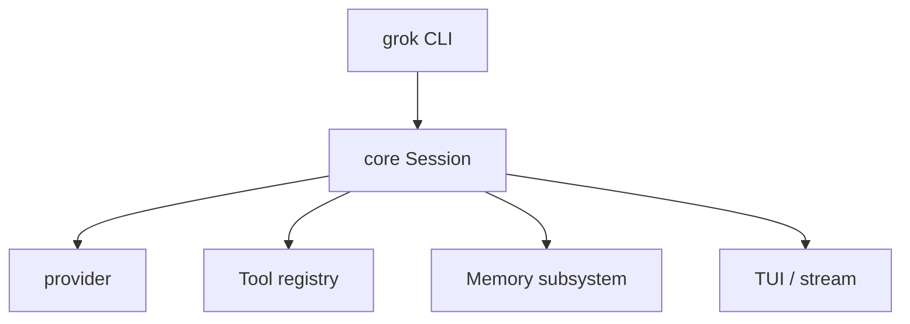

# Grok Build 设计思想导读（九幕）

> **深潜**：[ARCHITECTURE.md](./ARCHITECTURE.md) · [GROK_RUNTIME_PROMPTS.md](./GROK_RUNTIME_PROMPTS.md)  
> **Pi 对照**：[pi/docs/DESIGN_THINKING_SERIES.md](../../pi/docs/DESIGN_THINKING_SERIES.md)  
> **OpenHuman 对照**：[openhuman/doc-cn/DESIGN_THINKING_SERIES.md](../../openhuman/doc-cn/DESIGN_THINKING_SERIES.md)

---

## 第 1 幕：源码全景

**一句话**：**Rust workspace** — CLI → core session → provider → 工具/MCP；产品语义在 `ARCHITECTURE` Part I/II。

```text
grok-build/
├── crates/core/        Session、Turn、工具循环
├── crates/cli/         命令入口
├── crates/provider/    模型客户端
└── doc-cn/             本导读 + ARCHITECTURE
```

→ [PACKAGE_MODULES.md](./PACKAGE_MODULES.md) · [ARCHITECTURE §I.0](./ARCHITECTURE.md)

---

## 第 2 幕：状态 vs 执行

| | Session 状态 | Agent 执行 |
|--|-------------|------------|
| **持有** | pending inputs、memory 句柄、plan 产物 | 单 turn 内 LLM↔tool |
| **入口** | `Session::submit` / 队列 | `run_turn` 或等价循环 |
| **投影** | TUI / 流式事件 | 无独立「Agent 类」命名（概念对齐 Pi Loop） |

→ [ARCHITECTURE Part I §I.2](./ARCHITECTURE.md)

---

## 第 3 幕：双层循环

**外层**：Session 级 **Prompt FIFO** — 下一条用户消息排队（产品级串行）  
**内层**：单 turn 内 **LLM → tool → 结果** 直到 stop

```text
Session 队列（外层）
  └── Turn（内层）
        while tool_calls:
          execute → append result
        [可选] Interjection 注入 synthetic user → continue 内层
```

**与 Pi 差异**：Pi 的 `followUp` 在 `runLoop` **外层 while**；Grok 的「下一条 Prompt」在 **Session 队列**，是产品 FIFO，不是 turn 内车道。

→ [ARCHITECTURE §I.5.2 队列串行](./ARCHITECTURE.md)

---

## 第 4 幕：依赖与装配



→ [ARCHITECTURE §I.3 分层](./ARCHITECTURE.md)

---

## 第 5 幕：工具管线

```text
model tool_calls
  → registry 解析
  → sandbox / approval（若配置）
  → 执行 bash、read、MCP…
  → tool output → 历史
```

Skills 以 prompt 片段注入，非 Pi 式独立 harness 扩展树（见 RUNTIME_PROMPTS）。

→ [GROK_RUNTIME_PROMPTS.md](./GROK_RUNTIME_PROMPTS.md)

---

## 第 6 幕：事件流

| 通道 | 内容 |
|------|------|
| **流式 delta** | assistant / reasoning 片段 |
| **Turn 边界** | start / complete |
| **工具生命周期** | call / output / error |

TUI 消费事件流；持久化见第 8 幕。

→ [ARCHITECTURE §I.4](./ARCHITECTURE.md)

---

## 第 7 幕：Steering vs Follow-up（三项目对照）

| 语义 | Grok Build | Pi | OpenHuman |
|------|------------|-----|-----------|
| 运行中注入、**不 abort** | **Interjection** → synthetic user | `steer()` | `QueueMode::Steer` |
| turn 结束后再跑 | `pending_inputs` / 下条 Prompt | `followUp()` | `QueueMode::Followup` |
| 取消当前再开 | Cancel 策略 | `abort` + 新 prompt | `QueueMode::Interrupt` |

**易错**：Grok **有 steer 语义**，但叫 **Interjection**；插话后 loop `continue`，模型下一轮采样看到新 user（与 OpenHuman 默认 Interrupt 相反）。

→ [ARCHITECTURE §II.4](./ARCHITECTURE.md#ii4-memory--plan--多-agent-整体设计)

---

## 第 8 幕：持久化 Harness

| 账 | 内容 |
|----|------|
| **会话日志** | turn 历史、工具轨迹 |
| **Memory** | 长期记忆子系统（Part II） |
| **Plan 产物** | 与 Memory / MA 正交 |

Memory、Plan、多 Agent 是 **三个正交维度**，不要混为一棵 JSONL 树。

→ [ARCHITECTURE Part II](./ARCHITECTURE.md)

---

## 第 9 幕：最小核心 + 边界

| 边界 | Grok |
|------|------|
| **Interjection** | 中途改道（非 Cancel） |
| **Memory** | 长效知识 |
| **Plan** | 任务分解产物 |
| **多 Agent** | delegate / 协作（见 Part II） |

**优先阅读**：[ARCHITECTURE §II.4 Memory / Plan / 多 Agent](./ARCHITECTURE.md)

→ [README.md](./README.md)

---

## 阅读路径

```text
DESIGN_THINKING_SERIES → ARCHITECTURE Part I → §II.4 三正交维度 → RUNTIME_PROMPTS
```
