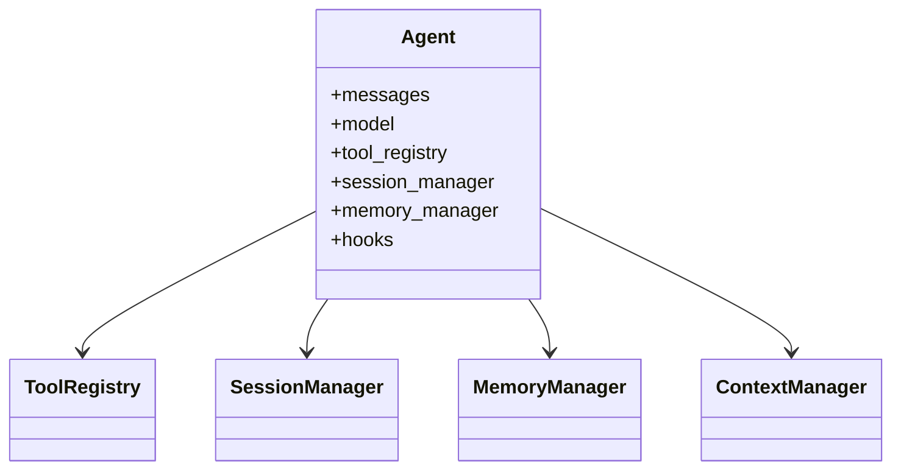
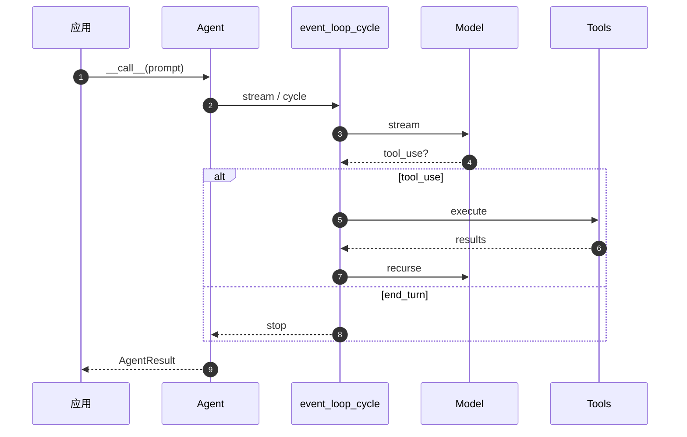

# Strands Harness SDK 架构深度解析

> 本文基于 `harness-sdk/strands-py`（核心 SDK）和 `harness-sdk/harness-py`（Harness 工厂层）的真实源码分析，系统梳理整体设计、关键模块与完整执行路径。  
> **全局图**：[diagrams/DIAGRAM_ATLAS.md](./diagrams/DIAGRAM_ATLAS.md) · **逐模块 HS-01…HS-32**：[diagrams/AGENT_MODULE_DIAGRAMS.md](./diagrams/AGENT_MODULE_DIAGRAMS.md)

---

## §0 文档导航与术语表

### §0.1 快速导航

| 你想了解的内容 | 跳转到 |
|--------------|--------|
| 框架整体分层与类图 | [§1.1](#11-两层架构sdk-核心--harness-工厂)、[§1.2](#12-顶层类图) |
| 完整调用时序（E2E）| [§1.3](#13-端到端时序图e2e-sequence) · [图集 G3](./diagrams/DIAGRAM_ATLAS.md#g3-端到端调用时序) |
| 全部架构/类/流程/时序图 | [diagrams/DIAGRAM_ATLAS.md](./diagrams/DIAGRAM_ATLAS.md) |
| 事件循环核心逻辑 | [§2.1](#21-event_loop_cycle--事件循环心跳) |
| Agent.__call__ 同步入口 | [§2.2](#22-agent__call__--同步调用入口) |
| 会话持久化 Session | [§2.3](#23-sessionmanager--会话持久化) |
| 跨会话长期记忆 Memory | [§2.4](#24-memorymanager--跨会话记忆) |
| 上下文压缩与卸载 | [§2.5](#25-contextmanager--offloader--上下文管理与卸载) |
| 工具调用审批门 Interventions | [§2.6](#26-interventions--工具调用审批门) |
| 一键工厂 create_harness | [§2.7](#27-create_harness--一键工厂) |
| 多智能体与子智能体 | [§2.8](#28-多智能体--子智能体) |
| FastAPI 流式服务集成 | [§P3.1](#p31-fastapi-流式-sse-服务) |
| 取消信号用法 | [§P3.2](#p32-取消信号cancel_signal) |
| Interrupt/Resume HITL | [§P3.3](#p33-中断与恢复-interruptresume) |
| 结构化输出 | [§P3.4](#p34-结构化输出structured-output) |
| 多智能体 Graph/Swarm | [§P3.5](#p35-多智能体编排-graphswarm) |
| 模型解析与 effort 映射 | [§IV.2](#iv2-harness-pymodels---模型解析层) |
| 工具与插件文件索引 | [第四部分](#第四部分文件索引深度论述) |
| 流式事件状态机 | [§A.1](#a1-stream_messages--模型流式接口) |
| Hook 事件全景 | [§A.2](#a2-hook-系统完整解析) |
| Checkpoint 断点续跑 | [§A.5](#a5-checkpoint-与断点续跑) |

---

### §0.2 核心术语表

本表按字母顺序列出文档中反复出现的核心概念，供快速查阅。

| 术语 | 所在文件 | 含义 |
|------|----------|------|
| `Agent` | `strands/agent/agent.py` | SDK 核心类，持有 messages、tools、hooks 等所有状态 |
| `AgentInput` | `strands/types/content.py` | `str \| list[ContentBlock] \| list[Message] \| None` |
| `AgentResult` | `strands/types/agent.py` | invoke 返回值；含 stop_reason、message、metrics、interrupts、structured_output |
| `AgentSpec` | `strands_harness/tools/subagent.py` | 子智能体的构建规格（已解析的轴值）|
| `AgentTool` | `strands/tools/tools.py` | 工具协议：tool_name、tool_spec、stream() |
| `Axis`（轴）| `strands_harness/tools/subagent.py` | 决定子智能体参数暴露模式的控制单元：Fixed/Inherit/Open/Choice |
| `BackgroundTasksConfig` | `strands/background_tasks/` | 后台任务策略字典：always/agentic/never |
| `BeforeModelCallEvent` | `strands/hooks/events.py` | 模型调用前的 Hook 事件，含 projected_input_tokens |
| `ContextManager` | `strands/experimental/context_manager/` | 主动/被动压缩对话历史的策略管道 |
| `ContextOffloader` | `strands/vended_plugins/context_offloader/` | 拦截过大工具结果并写入磁盘的插件 |
| `ConcurrentToolExecutor` | `strands/tools/executors/concurrent.py` | 并行执行工具调用的执行器 |
| `create_harness` | `strands_harness/agent.py` | 一键工厂函数，返回预配置的 Agent |
| `effort` | `strands_harness/types/agent.py` | 推理力度枚举：auto/off/minimal/low/medium/high/xhigh/max |
| `event_loop_cycle` | `strands/event_loop/event_loop.py` | 单轮"模型推理 + 工具执行"的 async generator |
| `EventLoopMetrics` | `strands/event_loop/metrics.py` | 累计 turns、token 用量的追踪对象 |
| `EventLoopStopEvent` | `strands/types/events.py` | cycle 终止信号；含 stop_reason |
| `GENERALIST` | `strands_harness/tools/subagent.py` | 默认子智能体 Preset；角色定位为通用任务执行者 |
| `HARNESS_CONTRACT` | `strands_harness/prompt.py` | 模型行为契约字符串；Action/Tools/Safety/Context 四节 |
| `HookRegistry` | `strands/hooks/registry.py` | Hook 分发中心，按 event 类型回调注册的 handlers |
| `InterruptException` | `strands/interventions/` | intervention 触发中断时抛出的内部信号 |
| `InterventionHandler` | `strands/interventions/` | 工具审批门抽象基类 |
| `InvocationState` | `strands/event_loop/event_loop.py` | 跨 cycle 传递的字典，含 request_state、span、event_loop_cycle_id |
| `Limits` | `strands/types/limits.py` | 预算上限：turns / total_tokens / output_tokens |
| `MemoryManager` | `strands/memory/memory_manager.py` | 长期记忆管理器；含注入、提取、工具 |
| `MessageAddedEvent` | `strands/hooks/events.py` | 消息写入 agent.messages 时触发的 Hook 事件 |
| `Model` | `strands/models/` | 模型提供者抽象基类；实现 stream() + count_tokens() |
| `Preset` | `strands_harness/tools/subagent.py` | 子智能体预定义角色；包含 instructions、tools、context、model |
| `Plugin` | `strands/plugins/` | 插件协议：init_agent(agent) |
| `SnapshotSessionManager` | `strands/session/` | 默认会话持久化实现；写到 LocalFileStorage |
| `Stash` | `strands/experimental/context_manager/stash.py` | 被压缩消息的 L1 缓存，可按需检索 |
| `stop_reason` | `strands/types/events.py` | 字符串枚举：end_turn / tool_use / max_tokens / cancelled / interrupt / checkpoint / limit_* |
| `ToolGenerator` | `strands/types/tools.py` | `AsyncGenerator[ToolStreamEvent \| ToolResultEvent \| ToolInterruptEvent, None]` |
| `ToolUse` | `strands/types/tools.py` | 工具调用描述符：toolUseId、name、input |
| `TypedEvent` | `strands/types/events.py` | SDK 所有 yield 事件的基类 |

---

## 目录

- [§0 文档导航与术语表](#0-文档导航与术语表)
- [第一部分：框架总览](#第一部分框架总览)
  - [1.1 两层架构：SDK 核心 + Harness 工厂](#11-两层架构sdk-核心--harness-工厂)
  - [1.2 顶层类图](#12-顶层类图)
  - [1.3 端到端时序图（E2E Sequence）](#13-端到端时序图e2e-sequence)
  - [1.4 读图说明](#14-读图说明)
- [第二部分：核心模块深度解析](#第二部分核心模块深度解析)
  - [2.1 event_loop_cycle — 事件循环心跳](#21-event_loop_cycle--事件循环心跳)
  - [2.2 Agent.__call__ — 同步调用入口](#22-agent__call__--同步调用入口)
  - [2.3 SessionManager — 会话持久化](#23-sessionmanager--会话持久化)
  - [2.4 MemoryManager — 跨会话记忆](#24-memorymanager--跨会话记忆)
  - [2.5 ContextManager / Offloader — 上下文管理与卸载](#25-contextmanager--offloader--上下文管理与卸载)
  - [2.6 Interventions — 工具调用审批门](#26-interventions--工具调用审批门)
  - [2.7 create_harness — 一键工厂](#27-create_harness--一键工厂)
  - [2.8 多智能体 / 子智能体](#28-多智能体--子智能体)
- [第三部分：集成场景实战](#第三部分集成场景实战)
  - [P3.1 FastAPI 流式 SSE 服务](#p31-fastapi-流式-sse-服务)
  - [P3.2 取消信号 cancel_signal](#p32-取消信号cancel_signal)
  - [P3.3 中断与恢复 Interrupt/Resume](#p33-中断与恢复-interruptresume)
  - [P3.4 结构化输出 Structured Output](#p34-结构化输出structured-output)
  - [P3.5 多智能体编排 Graph/Swarm](#p35-多智能体编排-graphswarm)
- [第四部分：文件索引深度论述](#第四部分文件索引深度论述)
  - [IV.1 harness-py/agent.py — 工厂核心](#iv1-harness-pyagentpy--工厂核心)
  - [IV.2 harness-py/models.py — 模型解析层](#iv2-harness-pymodelspy--模型解析层)
  - [IV.3 harness-py/prompt.py — HARNESS_CONTRACT 哲学](#iv3-harness-pypromptpy--harness_contract-哲学)
  - [IV.4 harness-py/interventions.py — 字符串语法](#iv4-harness-pyinterventionspy--字符串语法)
  - [IV.5 harness-py/memory.py — 只读共享视图](#iv5-harness-pymemorypy--只读共享视图)
  - [IV.6 harness-py/tools/subagent.py — 轴系统](#iv6-harness-pytoolssubagentpy--轴系统)
  - [IV.7 harness-py/tools/web_fetch.py — 沙箱化抓取](#iv7-harness-pytoolsweb_fetchpy--沙箱化抓取)
  - [IV.8 harness-py/plugins/environment.py — 环境注入](#iv8-harness-pypluginsenvironmentpy--环境注入)
  - [IV.9 harness-py/plugins/todos.py — 临时注入的任务表](#iv9-harness-pypluginstodospy--临时注入的任务表)
  - [IV.10 harness-py/defaults.py — 约定的起点](#iv10-harness-pydefaultspy--约定的起点)
- [附录 A：流式处理子系统深度解析](#附录-a流式处理子系统深度解析)
- [附录 B：设计原则总结](#附录-b设计原则总结)
- [附录 C：常见集成模式](#附录-c常见集成模式)
- [附录 D：性能与调优](#附录-d性能与调优)

---

# 第一部分：框架总览

## 1.1 两层架构：SDK 核心 + Harness 工厂

Strands Harness SDK 由两个 Python 包组成，各司其职：

```
┌──────────────────────────────────────────────────────────┐
│              harness-py  (strands_harness)                │
│  create_harness()  ←  一行调用，返回预配置的 strands.Agent │
│  ┌──────────┐  ┌──────────┐  ┌──────────┐  ┌──────────┐  │
│  │ models   │  │ memory   │  │ prompt   │  │ tools    │  │
│  │ resolve  │  │ resolve  │  │ contract │  │ builtin  │  │
│  └──────────┘  └──────────┘  └──────────┘  └──────────┘  │
└──────────────────────────┬───────────────────────────────┘
                           │ 产出 strands.Agent
                           ▼
┌──────────────────────────────────────────────────────────┐
│              strands-py  (strands)                        │
│  Agent  ←  核心 Agent 类，驱动 event_loop_cycle           │
│  ┌──────────┐  ┌──────────┐  ┌──────────┐  ┌──────────┐  │
│  │event_loop│  │  tools   │  │ session  │  │ memory   │  │
│  │  cycle   │  │ registry │  │ manager  │  │ manager  │  │
│  └──────────┘  └──────────┘  └──────────┘  └──────────┘  │
│  ┌──────────┐  ┌──────────┐  ┌──────────┐                │
│  │ context  │  │  hooks   │  │  inter-  │                │
│  │ manager  │  │ registry │  │ ventions │                │
│  └──────────┘  └──────────┘  └──────────┘                │
└──────────────────────────────────────────────────────────┘
```

**核心思路**：

- `strands-py` 是能力平台：提供 Agent 类、事件循环、工具注册、会话管理、记忆管理、上下文管理、Hook 系统、审批门（Interventions）等基础设施。
- `harness-py` 是意见层（Opinionated Layer）：一次性把以上所有能力连接成一个具有生产级默认值的 Agent，方便终端用户快速上手，同时允许任意覆写。

**包名对照**：

| Python import | 目录 | 定位 |
|--------------|------|------|
| `strands` | `harness-sdk/strands-py/src/strands/` | 能力层；只提供机制，不做意见 |
| `strands_harness` | `harness-sdk/harness-py/src/strands_harness/` | 意见层；一键组装 Agent |

---

## 1.2 顶层类图



```
strands.Agent
├── model: Model / ModelRouter
│   └── .stream() → AsyncGenerator[StreamEvent, None]
│   └── .count_tokens() → int
│   └── .structured_output()
├── messages: list[Message]
├── tool_registry: ToolRegistry
│   └── registry: dict[str, AgentTool]
│   └── get_all_tool_specs() → list[ToolSpec]
├── conversation_manager: ConversationManager   (ABC)
│   ├── SlidingWindowConversationManager
│   ├── SummarizingConversationManager
│   └── NullConversationManager
├── hooks: HookRegistry
│   └── invoke_callbacks_async(event) → (event, interrupts)
├── _middleware_registry: MiddlewareRegistry
│   └── InvokeModelStage  (input/output 中间件链)
│   └── AgentStreamStage  (整路调用中间件链)
├── _interrupt_state: _InterruptState
├── _session_manager: SessionManager?           (ABC)
│   ├── SnapshotSessionManager
│   └── (自定义实现)
├── memory_manager: MemoryManager?
│   └── stores: list[MemoryStore]
│   └── injection: MemoryInjectionConfig
├── _context_manager: ContextManager?
│   └── _strategies: list[ContextStrategy]
│   └── _stash: Stash?
├── _intervention_registry: InterventionRegistry
│   └── handlers: list[InterventionHandler]
│       ├── HumanInTheLoop
│       └── CedarAuthorization
├── tool_executor: ToolExecutor
│   └── ConcurrentToolExecutor (默认)
│   └── SequentialToolExecutor
├── event_loop_metrics: EventLoopMetrics
├── state: AgentState
└── sandbox: Sandbox

strands_harness.create_harness()
├── resolve_model()        → Model / ModelRouter
├── build_system_prompt()  → str  (HARNESS_CONTRACT + instructions)
├── _builtin_tools()       → dict[name, AgentTool]
│   ├── make_shell()
│   ├── make_read(media=supports_media)
│   ├── write / edit
│   ├── make_web_fetch()
│   ├── exa_web_search
│   ├── make_programmatic_tool_caller()
│   └── build_default_subagent()
├── _skills_plugin()       → AgentSkills?
├── _durable_offloader()   → ContextOffloader
├── _select_builtin_plugins() → [Todos, EnvironmentContext]
├── resolve_memory()       → MemoryManager
├── resolve_interventions() → list[InterventionHandler]
└── Agent(...)             → strands.Agent
```

---

## 1.3 端到端时序图（E2E Sequence）

下图展示从用户调用 `agent("提问")` 到返回 `AgentResult` 的完整生命周期，包含所有分支路径。模块级分解见 [图集 G3–G4、M1–M3](./diagrams/DIAGRAM_ATLAS.md)。



```
用户代码
  │
  ▼
agent("提问")                          # Agent.__call__
  │  run_async(...)
  ▼
agent.invoke_async(prompt)
  │  agent.stream_async(prompt)
  ▼
stream_async()
  ├─ _validate_limits()
  ├─ _concurrency.begin()              # 并发锁 / 幂等 token 检查
  ├─ _start_cancel_watcher()           # 挂载外部 cancel_signal 到内部信号
  ├─ _interrupt_state.resume(prompt)   # 处理 interrupt 恢复
  ├─ _convert_prompt_to_messages()     # 字符串/ContentBlock/Message 归一化
  ├─ tracer.start_agent_span()
  └─ _run_loop(messages, ...)
       │
       ├─[while current_messages is not None]
       │
       ├─ hooks.invoke_callbacks_async(BeforeInvocationEvent)
       │   └─ memory_manager.inject()           # 注入跨会话记忆（每轮/每次调用）
       │   └─ environment_plugin.inject()       # 注入环境上下文
       │   └─ (其它 Before 钩子)
       │
       ├─ _append_messages(*current_messages)  # 写入 agent.messages
       │   └─ hooks → MessageAddedEvent
       │       └─ session_manager.append_message()  # 持久化到会话存储
       │       └─ context_manager._on_message_added() → stash.store_message()
       │
       ├─ _middleware_registry.invoke(AgentStreamStage, ctx, terminal)
       │   └─ [中间件链：model routing / guardrails / custom...]
       │   └─ terminal(ctx):
       │       └─ _execute_event_loop_cycle()
       │           └─ [retry 循环：ContextWindowOverflowException]
       │           └─ event_loop_cycle(agent, invocation_state, ...)
       │
       └─ hooks.invoke_callbacks_async(AfterInvocationEvent)
           └─ session_manager.sync_agent()     # 同步 Agent 状态到会话
           └─ conversation_manager.apply_management()
           └─ memory_manager.maybe_extract()   # 后台提取记忆（按触发策略）


event_loop_cycle(agent, invocation_state, limits)
  │
  ├─ _check_limits()                   # turns / total_tokens / output_tokens 上限检查
  │   └─ 超限 → yield EventLoopStopEvent("limit_turns" | ...) ; return
  │
  ├─ agent.event_loop_metrics.start_cycle()
  ├─ yield StartEvent(), StartEventLoopEvent()
  ├─ tracer.start_event_loop_cycle_span()
  │
  ├─[分支 A：已有挂起的工具调用（interrupt 恢复）]
  │   └─ stop_reason = "tool_use", message = pending_tool_execution.assistant_message
  │
  ├─[分支 B：latest message 已含 ToolUse（无需再调用模型）]
  │   └─ stop_reason = "tool_use", message = agent.messages[-1]
  │
  └─[分支 C：正常调用模型]
      └─ _handle_model_execution()
          │
          ├─ _estimate_input_tokens()           # 增量 token 估算
          ├─ hooks → BeforeModelCallEvent
          │   ├─ context_manager._on_before_model_call()  # 主动压缩检查
          │   ├─ retry_strategy hook
          │   └─ 其它 before 钩子
          ├─ _continuation.prepare()            # 处理跨轮继续消息
          ├─ _middleware_registry.invoke(InvokeModelStage, ctx, terminal)
          │   └─ [中间件链：token 使用注入 / prompt 缓存 / model routing...]
          │   └─ terminal(ctx):
          │       └─ stream_messages(model, system_prompt, messages, tool_specs, ...)
          │           └─ 流式 yield StreamEvent(chunk) ...
          │           └─ yield ModelStopReason(stop_reason, message, usage, metrics)
          ├─ hooks → AfterModelCallEvent
          │   ├─ context_manager._on_after_model_call()  # 溢出重试
          │   ├─ retry_strategy hook            # 限流重试
          │   └─ 其它 after 钩子
          └─ _append_messages(message)
              └─ hooks → MessageAddedEvent → session/stash

  │
  ├─[stop_reason == "max_tokens"]
  │   └─ raise MaxTokensReachedException
  │
  ├─[stop_reason == "tool_use"]
  │   ├─ Checkpointing after_model → yield EventLoopStopEvent("checkpoint") ; return
  │   └─ _handle_tool_execution()
  │       │
  │       ├─ hooks → BeforeToolsEvent
  │       │   ├─ intervention_registry.evaluate()    # Cedar / HumanInTheLoop 审批
  │       │   └─ interrupt 注册 → raise InterruptException
  │       │
  │       ├─ validate_and_prepare_tools()
  │       ├─ tool_executor._execute()              # ConcurrentToolExecutor 并行执行
  │       │   └─ 每个 AgentTool.stream(tool_use, invocation_state)
  │       │       ├─ 普通工具：直接运行，yield ToolStreamEvent
  │       │       ├─ _SubagentTool：递归调用子 Agent
  │       │       └─ yield ToolResultEvent(result)
  │       │
  │       ├─ hooks → AfterToolsEvent
  │       │   └─ session_manager.sync_agent()
  │       │
  │       ├─ _append_messages(tool_result_message)
  │       ├─ Checkpointing after_tools → yield EventLoopStopEvent("checkpoint") ; return
  │       │
  │       └─ recurse_event_loop()               # 递归进入下一轮
  │           └─ event_loop_cycle(...)
  │
  └─[stop_reason == "end_turn" | "stop_sequence"]
      ├─ structured_output 强制 → recurse_event_loop()
      └─ yield EventLoopStopEvent(stop_reason, message, metrics, request_state)


AgentResult 返回路径：
  EventLoopStopEvent
    └─ AgentResult(stop_reason, message, metrics, state, interrupts, structured_output, checkpoint)
    └─ callback_handler(result=result)
    └─ yield AgentResultEvent(result=result)
    └─ invoke_async() return result
    └─ __call__() return result
```

---

## 1.4 读图说明

### 关键信号流

| 信号 | 类型 | 含义 |
|------|------|------|
| `StartEvent` | TypedEvent | 一个 cycle 开始 |
| `ModelStreamChunkEvent` | TypedEvent | 模型流式 token 块 |
| `ModelMessageEvent` | TypedEvent | 模型完整回复已生成 |
| `ToolResultEvent` | TypedEvent | 单个工具执行结果 |
| `ToolResultMessageEvent` | TypedEvent | 全部工具结果已打包成消息 |
| `EventLoopStopEvent` | TypedEvent | 本轮 cycle 终止（含原因） |
| `AgentResultEvent` | TypedEvent | 本次 invoke 最终结果 |
| `ForceStopEvent` | TypedEvent | 异常终止 |

### stop_reason 枚举

| stop_reason | 含义 |
|-------------|------|
| `"end_turn"` | 模型正常完成，无工具调用 |
| `"tool_use"` | 模型请求工具，进入工具执行路径 |
| `"max_tokens"` | 达到 token 上限，raise MaxTokensReachedException |
| `"stop_sequence"` | 遇到停止序列 |
| `"cancelled"` | 调用被取消 |
| `"interrupt"` | 中断门触发，挂起等待恢复 |
| `"checkpoint"` | Checkpointing 模式下的断点 |
| `"limit_turns"` | 达到 turns 上限 |
| `"limit_total_tokens"` | 达到 total_tokens 上限 |
| `"limit_output_tokens"` | 达到 output_tokens 上限 |

### 递归调用结构

`event_loop_cycle` 本身是一个 **async generator**（异步生成器），它在工具执行后通过 `recurse_event_loop` 递归调用自身，实现多轮工具-模型循环。递归深度由 `limits.turns` 和 `_ALWAYS_BACKGROUND_TOOL_NAMES` 共同约束，每轮循环均完整经历 start → model → tools → 递归 → stop 的流程。

### Hook 系统定位

Hook 是横切关注点的注入点，而非流程控制点。所有 `BeforeXxx`/`AfterXxx` 事件均双向传播（在 HookRegistry 中按 order 顺序调用，After 事件逆序），实现了 SessionManager、MemoryManager、ConversationManager、RetryStrategy 等"旁观者"在不侵入核心流程的前提下进行副作用处理。

---

# 第二部分：核心模块深度解析

## 2.1 event_loop_cycle — 事件循环心跳

**文件位置**：`strands-py/src/strands/event_loop/event_loop.py`

### 动机与设计背景

`event_loop_cycle` 是整个框架的心跳。它的存在源于一个简单而深刻的需求：在大语言模型的多轮推理场景中，"调用模型 → 收到工具请求 → 执行工具 → 再调用模型"这个循环需要被高度模块化，既要支持流式输出（实时展示 token），又要支持可观测性（每轮都有追踪 span），还要支持中断与恢复（HITL）、断点续跑（Checkpoint）、预算管控（Limits）。

将这些能力堆砌在一个线性函数中会产生难以维护的意大利面代码。`event_loop_cycle` 的设计选择是：**以 async generator 作为协议边界**，让每一步产出一个 `TypedEvent`，使上层代码可以选择性地消费这些事件（流式 UI、日志、追踪），而无需了解循环内部细节。

这个函数本身不持有状态（除了 invocation_state 字典）——所有状态都在 `agent` 对象上。这使得 Checkpoint 成为可能：只需保存 cycle_index 和 position，下次从断点重进 `event_loop_cycle` 即可续跑。

### 完整签名与参数

```python
async def event_loop_cycle(
    agent: "Agent",
    invocation_state: dict[str, Any],
    structured_output_context: StructuredOutputContext | None = None,
    limits: Limits | None = None,
) -> AsyncGenerator[TypedEvent, None]:
```

**参数详解：**

- **`agent`**：持有 messages、tools、hooks、metrics、_checkpoint、_interrupt_state 等所有运行时状态的主体。`event_loop_cycle` 读取它的状态并通过 hooks 推动副作用（session 写入、memory 提取等）。注意该函数不直接持有 agent 引用的时间超过一次调用——递归时传入的仍是同一个 agent 对象，不会创建新 Agent。

- **`invocation_state`**：一个跨 cycle 传递的字典，在同一次 invoke 的所有 cycle 之间共享。包含：
  - `request_state`（`dict`）：工具可以向此写入跨工具信息（如 `stop_event_loop = True`）
  - `event_loop_cycle_id`（`UUID`）：每轮重新生成，用于追踪
  - `agent`（`Agent`）：当前 agent 的引用，供工具在 `invocation_state["agent"]` 读取
  - 追踪 Span 对象

- **`structured_output_context`**：结构化输出上下文。当模型在自然结束时未自动调用结构化输出工具，此对象会在 `end_turn` 后强制注入一轮工具调用，迫使模型输出符合 schema 的 JSON。

- **`limits`**：预算约束对象，含：
  - `turns`（`int | None`）：本次 invoke 允许的最大 cycle 数
  - `total_tokens`（`int | None`）：总 token（input + output）预算
  - `output_tokens`（`int | None`）：输出 token 预算

### 契约（Contract）

`event_loop_cycle` 作为 async generator，保证：

1. **至少 yield 一个 `StartEvent` 和 `StartEventLoopEvent`**（即使因为 limits 立即终止，也先 yield start 再 yield stop）。
2. **以 `EventLoopStopEvent` 结束**（或以 `ForceStopEvent` 结束于未捕获异常路径）。
3. **每次 append_messages 都触发 MessageAddedEvent**（由 agent._append_messages 保证），保证 Session 持久化的完整性。
4. **工具执行结果（ToolResultEvent）一定在 AfterToolsEvent 之前 yield 完毕**。
5. **递归的 yield 事件会透传到父 cycle**（`async for event in recurse_event_loop(): yield event`），保证外层消费者看到完整的事件流。

### 执行流程分步叙述

**步骤一：上限检查**

```python
limit_stop_reason = _check_limits(agent, limits)
if limit_stop_reason is not None:
    yield EventLoopStopEvent(limit_stop_reason, agent.messages[-1], ...)
    return
```

`_check_limits` 读取 `EventLoopMetrics.latest_agent_invocation`（本次 invoke 范围内的累计），按 turns → total_tokens → output_tokens 优先级顺序检查。这是**软上限**设计：检查在 cycle 开头，当前轮如果已经开始（下一轮才到这里），已执行的工作不会被截断，只是下一轮不再开始。

软上限的语义选择是有意为之的。若采用硬上限（在模型推理中途截断），会产生一条不完整的 assistant 消息，污染历史。软上限保证每一轮的完整性，代价是可能略微超出预算。

**步骤二：Cycle 状态初始化**

```python
invocation_state["event_loop_cycle_id"] = uuid.uuid4()
cycle_start_time, cycle_trace = agent.event_loop_metrics.start_cycle(...)
tracer.start_event_loop_cycle_span(...)
yield StartEvent()
yield StartEventLoopEvent()
```

每轮 cycle 生成新的 UUID，用于：
- OTel span 关联（`event_loop_cycle_id` 作为 span attribute）
- 日志关联（结构化日志 field）
- Checkpoint 的 cycle_index 计数（通过 `agent._checkpoint_cycle_index += 1` 维护）

**步骤三：Checkpoint 恢复处理**

若 agent 处于 checkpoint 续跑状态（`agent._checkpoint is not None`），此处消费该 checkpoint 对象：

```python
resume_context = agent._checkpoint
if resume_context is not None:
    agent._checkpoint = None
    next_cycle = (resume_context.cycle_index + 1
                  if resume_context.position == "after_tools"
                  else resume_context.cycle_index)
    agent._checkpoint_cycle_index = next_cycle
    agent._checkpoint_resume_position = resume_context.position
```

**从 `after_model` 续跑**：意味着模型已调用（assistant 消息已在 messages 中），但工具尚未执行。循环直接跳过模型调用（走路径 B），从工具执行开始。

**从 `after_tools` 续跑**：意味着本 cycle 的工具已执行，下一个 cycle 需从头开始。`cycle_index += 1` 并且不跳过模型调用（走路径 C）。

**步骤四：三路分支决定是否调用模型**

```python
if agent._interrupt_state.activated and pending_tool_execution is not None:
    # 路径 A：interrupt 恢复路径
    # pending_tool_execution 是上一次因中断挂起的工具执行上下文
    # 其 assistant_message 已在 messages 中，直接复用
    stop_reason = "tool_use"
    message = pending_tool_execution.assistant_message
    
elif _has_tool_use_in_latest_message(agent.messages):
    # 路径 B：从 checkpoint after_model 续跑，或者 invocation_state 预填了工具
    stop_reason = "tool_use"
    message = agent.messages[-1]
    
else:
    # 路径 C：正常推理路径——调用模型
    model_events = _handle_model_execution(...)
    async for model_event in model_events:
        yield model_event
    stop_reason, message, *_ = model_event["stop"]
```

路径 A 和 B 的存在是 Checkpoint/Interrupt 机制能够工作的关键：它们允许在不重新调用模型的情况下"回放"或"继续"已有的工具请求，节省模型调用的时间和费用。

**步骤五：模型执行核心 `_handle_model_execution`**

这是路径 C 的核心，内含**重试循环**（由 `AfterModelCallEvent.retry` 驱动）：

1. **`_estimate_input_tokens()`**——增量 token 估算（详见 §D.1）。
2. **`BeforeModelCallEvent` hook**——传播 `projected_input_tokens`，让 ContextManager 判断是否需要主动压缩。所有注册到此事件的 hook 按 order 顺序执行。
3. **`_continuation.prepare()`**——处理 `AfterInvocationEvent.resume` 注入的续写内容（Goal Loop 插件的底层机制）。
4. **中间件链调用 `InvokeModelStage`**：
   - messages 做深拷贝（防止中间件污染 agent 历史）
   - `cancel_signal` 传入，每个 chunk 间隙均检查
   - `stream_messages(model, system_prompt, messages, tool_specs, ...)` 产出流式 chunk
5. **`AfterModelCallEvent` hook**——处理限流重试（`ModelThrottledException` → `event.retry = True`）、溢出恢复（`ContextWindowOverflowException` → 压缩 + `event.retry = True`）。
6. **`_append_messages(message)`**——assistant 消息入库，触发 `MessageAddedEvent`，进而触发 session 写入和 stash 缓存。

**重试循环的幂等性保证**：每次重试前，上一次未写入的 assistant 消息已被丢弃（只有成功后才调用 `_append_messages`），因此重试不会在历史中留下残缺消息。

**步骤六：max_tokens 处理**

```python
if stop_reason == "max_tokens":
    raise MaxTokensReachedException(...)
```

`MaxTokensReachedException` 会向上传播到 `stream_async`，最终在 `_run_loop` 中被捕获并转化为 `ForceStopEvent`，然后作为 `AgentResult(stop_reason="max_tokens")` 返回。这是框架唯一将内部信号转换为用户可见 stop_reason 的路径之一。

**步骤七：工具执行 `_handle_tool_execution`**

```python
before_tools_event, interrupts = await agent.hooks.invoke_callbacks_async(BeforeToolsEvent(...))

if interrupts:
    async for interrupt_event in _stop_for_interrupts(...):
        yield interrupt_event
    return

# 正常执行路径
tool_events = agent.tool_executor._execute(agent, tool_uses, tool_results, ...)
async for tool_event in tool_events:
    yield tool_event

after_tools_event = await agent.hooks.invoke_callbacks_async(AfterToolsEvent(...))
```

**Intervention 审批在 BeforeToolsEvent 中触发**：`InterventionRegistry` 注册了 `BeforeToolsEvent` 的回调，对每个 `ToolUse` 调用所有 handler 的 `on_before_tool()`。若某 handler 返回 `"interrupt"`，将该 interrupt 对象收集到 `interrupts` 列表，最终触发 `_stop_for_interrupts`，产出 `stop_reason="interrupt"` 的 `EventLoopStopEvent`。

**AfterToolsEvent.end_turn**：若某个 hook 在 AfterToolsEvent 上设置 `event.end_turn`，工具执行后不再递归进入下一 cycle，而是以指定内容作为最终 assistant 消息结束本次调用。这允许实现"工具执行后自动总结"的效果，无需再消耗一次模型调用。

**步骤八：Checkpoint 在工具执行后**

```python
if agent._checkpointing:
    yield _build_checkpoint_stop_event(
        agent=agent,
        position="after_tools",
        cycle_index=agent._checkpoint_cycle_index,
        ...
    )
    return   # 不递归，等待外部 resume
```

**步骤九：递归进入下一 Cycle**

```python
events = recurse_event_loop(agent=agent, invocation_state=invocation_state, ...)
async for event in events:
    yield event
```

`recurse_event_loop` 在追踪链上注册 "Recursive call" trace，然后再次调用 `event_loop_cycle`，形成完整的 tool↔model 循环。

**步骤十：end_turn 处理**

```python
if stop_reason in ("end_turn", "stop_sequence"):
    if structured_output_context and not structured_output_context.is_complete:
        # 强制结构化输出：构造一个假的 ToolUse 进入下一轮
        async for event in recurse_event_loop(force_tool=STRUCTURED_OUTPUT_TOOL, ...):
            yield event
    else:
        yield EventLoopStopEvent(stop_reason, message, metrics, request_state)
```

### 失败路径与幂等性

| 失败场景 | 处理方式 | 幂等性 |
|---------|---------|--------|
| 模型 API 超时 | `AfterModelCallEvent.retry=True` + 指数退避 | assistant 消息未写入，重试安全 |
| 模型 API 限流 | `ModelThrottledException` → retry | 同上 |
| 上下文窗口溢出 | `ContextWindowOverflowException` → 压缩 + retry | 压缩写入 messages，但无新 assistant 消息 |
| 工具执行异常 | 转为 `status: "error"` 的 ToolResult | 不影响其他并行工具；历史完整 |
| 取消信号 | `stop_reason="cancelled"` | 已写入的消息保留；cancelled 消息不写入历史 |
| interrupt 挂起 | 持久化 pending_tool_execution | 可恢复；agent 状态完整保存到 Session |
| Checkpoint 断点 | `stop_reason="checkpoint"` | 通过 Session + Checkpoint 组合可完整恢复 |

### 配置参数表

| 参数 / 配置项 | 来源 | 默认值 | 影响 |
|--------------|------|--------|------|
| `limits.turns` | `Agent.__call__(limits=...)` | `None`（无限） | 最大 cycle 数 |
| `limits.total_tokens` | 同上 | `None` | input+output token 总预算 |
| `limits.output_tokens` | 同上 | `None` | output token 预算 |
| `checkpointing` | `Agent(checkpointing=...)` | `False` | 是否在 after_model/after_tools 插入 checkpoint stop |
| `tool_executor` | `Agent(tool_executor=...)` | `ConcurrentToolExecutor` | 并行 vs 顺序工具执行 |
| `background_tasks` | `Agent(background_tasks=...)` | `False` | 是否允许工具后台运行 |

### JSON Message 示例

**模型推理阶段的典型事件序列（SSE 格式）：**

```json
// StartEvent
{"type": "start"}

// StartEventLoopEvent
{"type": "startEventLoop"}

// ModelStreamChunkEvent（chunk 流，每个 token 一个）
{"type": "chunk", "data": "根据"}
{"type": "chunk", "data": "你的"}
{"type": "chunk", "data": "分析"}

// 当模型请求工具时，contentBlockStart 产生 ToolUse
{"type": "currentToolUse", "current_tool_use": {"toolUseId": "tu-001", "name": "fetch_stock_price", "input": {}}}
{"type": "chunk", "current_tool_use": {"input": "{\"symbol\": \"AAPL\"}"}}

// ModelMessageEvent（assistant 消息完整生成）
{
  "type": "modelMessage",
  "message": {
    "role": "assistant",
    "content": [
      {"text": "我来分析一下 AAPL 的股价"},
      {"toolUse": {"toolUseId": "tu-001", "name": "fetch_stock_price", "input": {"symbol": "AAPL"}}}
    ]
  }
}

// ToolResultEvent（工具执行完毕）
{
  "type": "toolResult",
  "tool_use": {"toolUseId": "tu-001", "name": "fetch_stock_price"},
  "tool_result": {"toolUseId": "tu-001", "status": "success", "content": [{"text": "AAPL: $192.50"}]}
}

// EventLoopStopEvent（end_turn 最终结束）
{
  "type": "eventLoopStop",
  "stop_reason": "end_turn",
  "message": {
    "role": "assistant",
    "content": [{"text": "AAPL 当前价格为 $192.50，建议关注近期财报。"}]
  }
}
```

**interrupt 中断时的事件：**

```json
// BeforeToolsEvent 处，intervention handler 触发 interrupt
// ToolInterruptEvent（来自 _SubagentTool 或 HITL handler）
{
  "type": "toolInterrupt",
  "tool_use": {"toolUseId": "tu-002", "name": "execute_trade"},
  "interrupts": [
    {
      "id": "int-001",
      "name": "HumanInTheLoop",
      "request": "即将执行高风险交易：卖出全部 TSLA 持仓，总值 $24,530",
      "response": null
    }
  ]
}

// EventLoopStopEvent（interrupt 停止）
{
  "type": "eventLoopStop",
  "stop_reason": "interrupt",
  "interrupts": [{"id": "int-001", "name": "HumanInTheLoop", "request": "..."}]
}
```

---

## 2.2 Agent.__call__ — 同步调用入口

**文件位置**：`strands-py/src/strands/agent/agent.py`

### 动机

`Agent.__call__` 是框架为用户提供的**最高层接口**。它的设计目标是：在同步 Python 环境中（脚本、命令行、Jupyter Notebook）无需 `asyncio.run()` 即可使用 Agent，同时不牺牲任何能力。

同步 API 的挑战在于：SDK 核心是 async 的（流式 chunk、并行工具、后台任务），而 Python 的同步/异步边界在调用点不可见。`run_async` 工具函数解决了这个问题：它在当前线程启动一个新的 asyncio 事件循环（若调用线程已在异步上下文中则重用），将 async 函数"同步化"。

### 四种输入格式与归一化

```python
agent("你好")                                      # 字符串 → user message with text block
agent([{"text": "图片分析"}, {"image": {...}}])    # ContentBlock 列表 → user message
agent([{"role": "user", "content": [...]}])        # Message 列表 → 直接作为 messages
agent()                                            # None → 使用现有对话历史（如 interrupt resume）
agent(resume_payload)                              # list[interruptResponse] → interrupt resume 格式
```

归一化发生在 `_convert_prompt_to_messages`：

```python
async def _convert_prompt_to_messages(self, prompt: AgentInput) -> Messages:
    # 1. interrupt 激活状态：不处理新输入（messages 已有 pending tool use）
    if self._interrupt_state.activated:
        # 但需要处理 interruptResponse 格式
        if isinstance(prompt, list) and all("interruptResponse" in p for p in prompt):
            self._interrupt_state.apply_responses(prompt)
        return []

    # 2. checkpoint 恢复格式
    if self._try_consume_checkpoint_resume(prompt):
        return []

    # 3. 字符串
    if isinstance(prompt, str):
        return [{"role": "user", "content": [{"text": prompt}]}]

    # 4. Message 列表（含 role 字段）
    if isinstance(prompt, list):
        if all(isinstance(p, dict) and "role" in p for p in prompt):
            return cast(Messages, prompt)
        # 5. ContentBlock 列表
        return [{"role": "user", "content": cast(list[ContentBlock], prompt)}]

    return []
```

### 调用链路完整展开

```
agent("提问")
  │
  └─ __call__(prompt="提问", *, invocation_state=None, limits=None, cancel_signal=None, ...)
       └─ run_async(lambda: self._invoke_async_and_flush("提问", ...))
            │
            └─ asyncio 事件循环中：
                 └─ _invoke_async_and_flush("提问", ...)
                      try:
                        └─ invoke_async("提问", ...)
                             └─ stream_async("提问", ...)
                                  yield 各种 TypedEvent ...
                                  yield AgentResultEvent(result=AgentResult(...))
                             └─ 消费所有 event，取最后一个 result
                      finally:
                        └─ memory_manager.flush()  ← 确保后台提取持久化
```

**`run_async` 的两种模式**：

- **无事件循环**（脚本、命令行）：`asyncio.run()` 创建新循环。
- **有事件循环但非 async 上下文**（如 Jupyter Notebook 的 `%run`）：使用 `nest_asyncio` 在已有循环上嵌套运行。
- **已在 async 函数中**：不应调用 `__call__`，应直接使用 `invoke_async()` 或 `stream_async()`。

### `stream_async` — 实现核心

`stream_async` 是所有入口的最终归宿，包含所有并发安全、幂等性、取消、追踪的控制逻辑：

```python
async def stream_async(self, prompt=None, *, limits=None, cancel_signal=None,
                        idempotency_token=None, invocation_state=None, ...) -> AsyncIterator[Any]:
    # 1. 验证 limits 对象格式
    self._validate_limits(limits)

    # 2. 并发控制：幂等 token 处理 + 并发锁
    begin = self._concurrency.begin(idempotency_token)
    if begin.waiting_on is not None:
        # 相同 idempotency_token 的重复调用：等待原始调用结果
        await begin.waiting_on.register_waiter()
        yield AgentResultEvent(result=begin.waiting_on.result)
        return
    if not begin.lock_acquired:
        raise ConcurrencyException(f"Agent {self.agent_id} is already running ...")

    try:
        # 3. 取消信号接驳
        cancel_watcher = self._start_cancel_watcher(cancel_signal)

        # 4. Interrupt 状态初始化（恢复或清空）
        self._interrupt_state.resume(prompt)

        # 5. 重置本次 invoke 的 token 计数
        self.event_loop_metrics.reset_usage_metrics()

        # 6. 归一化输入
        messages = await self._convert_prompt_to_messages(prompt)

        # 7. 追踪 span
        self.trace_span = self._start_agent_trace_span(messages)

        # 8. 主循环
        stop_event = None
        async for event in self._run_loop(messages, invocation_state or {}, ...):
            event.prepare(invocation_state=merged_state)
            if event.is_callback_event:
                callback_handler(**event.as_dict())
            if event.type == "eventLoopStop":
                stop_event = event
            yield event.as_dict()

        # 9. 构造 AgentResult
        result = AgentResult(*stop_event["stop"])
        callback_handler(result=result)
        yield AgentResultEvent(result=result).as_dict()

    finally:
        # 10. 清理
        cancel_watcher.cancel()
        self._cancel_signal.clear()
        self._concurrency.complete(begin)
```

### `_run_loop` — 自主循环的实现

`_run_loop` 在 `stream_async` 内部管理"是否继续 invoke"的逻辑：

```python
async def _run_loop(self, messages, invocation_state, ...):
    current_messages = messages
    while current_messages is not None:
        # BeforeInvocationEvent（注入记忆、环境上下文等）
        before_event = await self.hooks.invoke_callbacks_async(BeforeInvocationEvent(
            agent=self, messages=current_messages, ...))

        # 追加消息到 agent.messages（触发 MessageAddedEvent）
        if current_messages:
            await self._append_messages(*current_messages)

        # 中间件链 → event_loop_cycle → 事件流
        async for event in self._middleware_registry.invoke(AgentStreamStage, ctx, terminal):
            yield event

        # AfterInvocationEvent（同步 session，提取记忆，可能触发 resume）
        after_event = await self.hooks.invoke_callbacks_async(AfterInvocationEvent(...))

        # 同步 conversation_manager（SlidingWindow 或 NullConversationManager）
        await self.conversation_manager.apply_management(self)

        # 后台记忆提取
        if self.memory_manager:
            await self.memory_manager.maybe_extract(self)

        # 是否继续循环（Goal Loop 插件通过 after_event.resume 注入新输入）
        if after_event.resume is not None:
            self._interrupt_state.resume(after_event.resume)
            current_messages = await self._convert_prompt_to_messages(after_event.resume)
        else:
            current_messages = None
```

**Goal Loop 的底层机制**：插件可以注册 `AfterInvocationEvent` 的回调，在回调中检查 Agent 是否达成目标，若未达成则设置 `event.resume = "请继续..."` 使得 `_run_loop` 自动进入下一轮，无需外部再次调用 `agent()`。

### 并发安全机制详解

Agent 的并发模式由 `ConcurrentInvocationMode` 控制：

| 模式 | 行为 | 适用场景 |
|------|------|---------|
| `THROW`（默认）| 并发调用立即抛出 `ConcurrencyException` | 绝大多数场景 |
| `UNSAFE_REENTRANT` | 跳过锁，允许同一 Agent 在并发调用中共享状态 | 高级：了解风险的开发者 |

**幂等 token 机制**：

```python
# 调用方传入相同 token
result1_future = asyncio.create_task(agent.stream_async("任务", idempotency_token="abc"))
result2_future = asyncio.create_task(agent.stream_async("任务", idempotency_token="abc"))

# result2 会等待 result1 完成，然后返回相同的 AgentResult
# 不会产生两次独立的模型调用
```

这对于网络重试场景（客户端超时重发）尤为有用——服务端保证相同 token 只处理一次。

### 失败与错误路径

| 错误类型 | 触发条件 | 处理方式 |
|---------|---------|---------|
| `ConcurrencyException` | `THROW` 模式下并发调用 | 立即抛出到调用方 |
| `MaxTokensReachedException` | 模型返回 max_tokens | 转为 `AgentResult(stop_reason="max_tokens")` |
| `EventLoopException` | 事件循环内未捕获异常 | 包装后抛出，含 `request_state` |
| `IdempotencyAbortedError` | 幂等原始调用被中止 | 等待方接收后抛出 |
| `ContextWindowOverflowException` | 模型返回上下文溢出 | ContextManager 自动处理，不向用户暴露 |

### 配置参数表

| 参数 | 来源 | 默认值 | 说明 |
|------|------|--------|------|
| `concurrent_invocations` | `Agent(concurrent_invocations=...)` | `THROW` | 并发模式 |
| `callback_handler` | `Agent(callback_handler=...)` | `PrintingCallbackHandler` | 事件消费者 |
| `idempotency_token` | `agent.stream_async(..., idempotency_token=...)` | `None` | 幂等 token |
| `cancel_signal` | `agent.__call__(..., cancel_signal=...)` | `None` | `threading.Event` 或 `asyncio.Event` |
| `limits` | `agent.__call__(..., limits=...)` | `None` | 预算约束 dict |

### JSON 示例：stream_async 产出的事件序列

```python
async for event in agent.stream_async("分析 AAPL"):
    print(event)
```

产出示例（关键事件）：

```json
{"type": "start"}
{"type": "startEventLoop"}
{"type": "chunk", "data": "AAPL "}
{"type": "chunk", "data": "当前"}
{"type": "chunk", "data": "价格"}
{"type": "currentToolUse", "current_tool_use": {"toolUseId": "tu-001", "name": "fetch_stock_price", "input": {}}}
{"type": "chunk", "current_tool_use": {"input": "{\"symbol\":"}}
{"type": "chunk", "current_tool_use": {"input": " \"AAPL\"}"}}
{"type": "modelMessage", "message": {"role": "assistant", "content": [{"text": "..."}, {"toolUse": {...}}]}}
{"type": "toolResult", "tool_use": {...}, "tool_result": {"status": "success", "content": [{"text": "AAPL: $192.50"}]}}
{"type": "toolResultMessage", "message": {"role": "user", "content": [{"toolResult": {...}}]}}
{"type": "start"}
{"type": "startEventLoop"}
{"type": "chunk", "data": "根据当前数据，AAPL 价格为 $192.50..."}
{"type": "eventLoopStop", "stop_reason": "end_turn", "message": {...}}
{"result": {"stop_reason": "end_turn", "message": {...}, "metrics": {...}}}
```

---

## 2.3 SessionManager — 会话持久化

**文件位置**：`strands-py/src/strands/session/session_manager.py`，`strands-py/src/strands/session/snapshot_session_manager.py`

### 动机

Session 持久化解决了一个基本问题：**Agent 的状态（对话历史、interrupt 状态、conversation_manager 状态）默认只存在于内存中，进程重启即丢失**。对于任何需要跨进程、跨请求的应用（CLI 工具、Web 服务、长时间任务），必须将状态持久化到外部存储。

SessionManager 的设计挑战在于：持久化逻辑需要在不侵入 `event_loop_cycle` 核心代码的前提下，感知每一条新消息（增量写入）和每次 invoke 结束（全量快照）。解决方案是通过 Hook 系统实现**无侵入集成**：SessionManager 实现 `HookProvider` 接口，在 Agent 初始化时注册自己关心的事件，此后完全由事件驱动。

### 类层次

```
SessionManager(HookProvider, ABC, Generic[_SessionAgentT])
├── register_hooks(registry)      # 向 HookRegistry 注册回调
│
├── initialize(agent)             # AgentInitializedEvent → 从存储恢复 Agent 状态
│   └── 恢复 messages、interrupt_state、conversation_manager_state
│
├── append_message(message, agent)  # MessageAddedEvent → 增量写入单条消息
│   └── 快速路径：仅写新消息，不重写整个历史
│
├── sync_agent(agent)             # MessageAddedEvent / AfterInvocationEvent → 全量快照
│   └── 写入 messages + agent metadata（state、interrupt_state 等）
│
├── redact_latest_message(redact, agent)  # guardrail 裁减内容时更新最新消息
│
├── initialize_multi_agent(agent, parent)  # 多智能体初始化
└── sync_multi_agent(agent)               # 多智能体同步

SnapshotSessionManager(SessionManager)    # 内置的文件系统实现
├── session_id: str                        # 会话唯一 ID（hex 或自定义）
├── storage: LocalFileStorage              # 文件存储后端
├── save_latest_on: "message" | "invocation"  # 持久化触发策略
└── _session_data_class: type[SessionAgent]  # 会话数据类型
```

### 钩子注册流程（完整版）

`register_hooks` 在 Agent 构建时调用，一次性注册所有感兴趣的事件：

```python
def register_hooks(self, registry: HookRegistry, **kwargs) -> None:
    # 1. Agent 初始化完成时：恢复历史状态
    registry.add_callback(
        AgentInitializedEvent,
        lambda event: asyncio.ensure_future(self.initialize(event.agent)),
        order=0  # 最先执行（order 越小越先）
    )

    # 2. 每条消息写入时：增量持久化
    registry.add_callback(
        MessageAddedEvent,
        lambda event: asyncio.ensure_future(
            self.append_message(event.message, event.agent)
        ) if self.save_latest_on == "message" else None,
        order=10
    )

    # 3. 每条消息写入时：全量同步（含 metadata）
    registry.add_callback(
        MessageAddedEvent,
        lambda event: asyncio.ensure_future(self.sync_agent(event.agent)),
        order=20
    )

    # 4. 每次 invoke 结束后：全量同步
    registry.add_callback(
        AfterInvocationEvent,
        lambda event: asyncio.ensure_future(self.sync_agent(event.agent)),
        order=10
    )

    # 5. 双向流 Agent 停止时：全量同步
    registry.add_callback(
        BidiAgentStopEvent,
        lambda event: asyncio.ensure_future(self.sync_agent(event.agent)),
        order=10
    )
```

### SnapshotSessionManager 实现细节

`SnapshotSessionManager` 将会话数据序列化为 JSON 文件，存储在 `session_dir/<session_id>/` 下：

**文件结构**：

```
.agent/sessions/
└── abc12345/
    ├── session.json          # 全量快照（每次 sync_agent 更新）
    └── messages/
        ├── 000000.json       # 第 0 条消息（append_message 写入）
        ├── 000001.json       # 第 1 条消息
        └── ...
```

**session.json 格式示例**：

```json
{
  "session_id": "abc12345",
  "agent_id": "agent-xyz",
  "messages": [
    {
      "role": "user",
      "content": [{"text": "分析 AAPL"}]
    },
    {
      "role": "assistant",
      "content": [
        {"text": "我来分析"},
        {"toolUse": {"toolUseId": "tu-001", "name": "fetch_stock_price", "input": {"symbol": "AAPL"}}}
      ]
    },
    {
      "role": "user",
      "content": [
        {"toolResult": {"toolUseId": "tu-001", "status": "success", "content": [{"text": "AAPL: $192.50"}]}}
      ]
    },
    {
      "role": "assistant",
      "content": [{"text": "AAPL 当前价格为 $192.50。"}]
    }
  ],
  "conversation_manager_state": null,
  "interrupt_state": {
    "activated": false,
    "pending": {}
  },
  "metadata": {
    "created_at": "2026-09-29T09:00:00Z",
    "updated_at": "2026-09-29T09:05:00Z",
    "turn_count": 2
  }
}
```

**恢复流程（initialize 方法）**：

```python
async def initialize(self, agent: Agent) -> None:
    try:
        data = await self.storage.load(f"{self.session_id}/session.json")
        session = SessionAgent.from_dict(json.loads(data))
    except FileNotFoundError:
        # 新会话，无需恢复
        return

    # 恢复对话历史
    agent.messages = session.messages

    # 恢复 interrupt 状态（若上次以 interrupt 结束）
    if session.interrupt_state and session.interrupt_state["activated"]:
        agent._interrupt_state.restore(session.interrupt_state)

    # 恢复 conversation_manager 状态（如滑动窗口的 trim 点）
    if session.conversation_manager_state:
        agent.conversation_manager.restore_state(session.conversation_manager_state)

    logger.info("session_id=%s | restored %d messages", self.session_id, len(agent.messages))
```

**增量写入 vs 全量写入的抉择**：

`save_latest_on="message"` 配置下，每条新消息都立即写入独立文件。这保证了：即使进程在模型推理中途崩溃，已写入的消息也不会丢失。代价是更多的文件 I/O。

`save_latest_on="invocation"` 配置下，只在每次 invoke 完成后才写入全量快照。这减少了 I/O，但崩溃时会丢失本次 invoke 的所有中间状态。

对于 Harness 来说，默认是 `"message"` 策略，因为 Agent 可能运行数十轮工具循环，中途崩溃的概率不可忽视。

### 设计亮点：`save_latest_on` 策略的非对称性

`append_message` 和 `sync_agent` 的关系是非对称的：
- `append_message` 只写新消息本身（轻量，O(1) I/O）
- `sync_agent` 写全量状态（重量，O(n) I/O，但包含 interrupt_state 等 metadata）

两者共存是因为：
- **增量写入**保证消息不丢失（即使 session metadata 未同步）
- **全量写入**保证 interrupt_state 等非消息状态得到持久化

**会话 ID 的一致性**：`agent.session_id` 属性优先返回 `session_manager.session_id`，而非 agent 自身生成的 ID。这保证了多进程/多副本场景下，通过同一个 session_id 恢复的 Agent 拥有完全一致的会话状态。

### 在 Harness 中的配置

```python
# harness-py/agent.py
session_manager = SnapshotSessionManager(
    resolved_id,                              # hex ID 或用户指定 ID
    storage=LocalFileStorage(session_dir),    # ./.agent/sessions/<id>/
    save_latest_on="message",                 # 每条消息立即写入
)
```

`session=False` 关闭持久化，内存中的对话在进程结束后丢失。这适合无状态的 API 场景（每个请求独立一次对话），由调用方管理会话 ID 和历史传递。

### 自定义实现契约

实现 `SessionManager` 需要：

```python
class MySessionManager(SessionManager):
    @property
    def session_id(self) -> str: ...

    async def initialize(self, agent: Agent) -> None:
        """从外部存储恢复 agent.messages 等状态。"""

    async def append_message(self, message: Message, agent: Agent) -> None:
        """增量写入单条消息。可以是 no-op（由 sync_agent 批量处理）。"""

    async def sync_agent(self, agent: Agent) -> None:
        """全量快照：写 messages + interrupt_state + conversation_manager_state。"""

    async def redact_latest_message(self, redact_message: Any, agent: Agent) -> None:
        """guardrail 裁减后更新最新消息。"""
```

---

## 2.4 MemoryManager — 跨会话记忆

**文件位置**：`strands-py/src/strands/memory/memory_manager.py`，`harness-py/src/strands_harness/memory.py`

### 动机

Session 持久化解决了"同一个 Agent 跨进程续跑"的问题，但不解决"**跨会话的知识积累**"问题。例如：

- 用户在第一次会话中告知 Agent "我偏好简洁回答，不需要解释"
- 三天后的新会话中，Agent 完全不记得这个偏好
- 每次都要重复说明

MemoryManager 解决这个问题。它的设计思路是：**将对话中的重要事实异步蒸馏出来，存储在独立于会话的持久化后端（文件/向量库），每次新 invoke 开始前检索最相关的记忆并注入上下文**。

这比直接把历史对话塞进 prompt 高效得多：对话历史可能有数万 token，而提炼后的记忆通常只有几百 token，且检索到的是**最相关的**而非全量的。

### 工作原理

**写路径（异步后台）**：

```
对话结束（AfterInvocationEvent）
  └─ maybe_extract() 检查 ExtractionTrigger
      └─ InvocationTrigger: 每次 invoke 后触发
      └─ IntervalTrigger: 每 N 次 invoke 触发一次
          └─ ModelExtractor.extract(messages, model)
              └─ 用小模型（如 claude-haiku）蒸馏出 Markdown 事实
              └─ FileMemoryStore.add(MemoryEntry)
                  └─ LocalFileStorage.write(".agent/memory/<slug>.md")
```

**读路径（每轮注入）**：

```
每次模型调用前（BeforeModelCallEvent）
  └─ MemoryManager.inject(agent)
      └─ 对所有 stores：store.search(query)
          └─ query 从最近的 user 消息中提取（或全量历史摘要）
          └─ 返回 top-K MemoryEntry（按相关度排序）
      └─ 将记忆注入 messages（以 <memory> 标签）
          └─ 或注入 system_prompt（取决于 injection.position）
```

### 核心数据结构

```python
@dataclass
class MemoryEntry:
    content: str     # Markdown 格式的事实，如 "用户偏好：简洁回答，不要解释"
    source: str      # store 名称，如 "memory"
    score: float     # 相关度分数（0.0 ~ 1.0）

@dataclass
class MemoryInjectionConfig:
    trigger: Literal["everyTurn", "onNewUserMessage"]
    # "everyTurn"：每次模型调用都注入（包括工具循环中间轮）
    # "onNewUserMessage"：只在有新用户消息时注入

@dataclass
class ExtractionConfig:
    extractor: ModelExtractor  # 提取器（使用小模型）
    trigger: ExtractionTrigger
    # InvocationTrigger：每次 invoke 后提取
    # IntervalTrigger(n)：每 n 次 invoke 提取一次

class FileMemoryStore(MemoryStore):
    name: str
    storage: LocalFileStorage
    writable: bool           # False：只读，不提取不写入
    extraction: ExtractionConfig | None  # None：只读模式
    max_search_results: int  # 默认 5
```

### 注入格式

注入到 messages 的记忆格式（以用户消息前缀形式）：

```json
{
  "role": "user",
  "content": [
    {
      "text": "<memory>\n[memory] 用户偏好：简洁回答，不要解释。(source: memory, relevance: 0.92)\n[memory] 用户常用模型：claude-fable-5。(source: memory, relevance: 0.85)\n</memory>\n\n分析一下 AAPL"
    }
  ]
}
```

实际注入方式取决于 `injection.position` 配置：

| 注入位置 | 格式 | 优缺点 |
|---------|------|--------|
| 用户消息前缀 | 在 user content 最前面插入 `<memory>...</memory>` | 占 input token；不影响 system_prompt 缓存 |
| system_prompt 末尾 | 追加到系统提示 | 清晰，但每次改变 system_prompt 会导致缓存失效 |

Harness 选择用户消息前缀方式（通过 `ContextInjector`），以保持 system_prompt 的提示缓存命中率。

### FileMemoryStore 的存储格式

记忆以 Markdown 文件形式存储：

```
.agent/memory/
├── user-preferences.md
├── domain-knowledge.md
└── session-insights.md
```

每个文件的内容由小模型生成，格式类似：

```markdown
# 用户偏好
- 偏好简洁、直接的回答，不需要过多解释背景
- 喜欢用 Markdown 格式的分析报告
- 关注的股票：AAPL、TSLA、GOOG

# 工作上下文
- 职业：量化分析师
- 使用目的：辅助每日投资组合分析
- 报告保存位置：/tmp/reports/

# 偏好的分析框架
- 技术分析优先（MA、RSI、MACD）
- 基本面分析作为佐证
```

**文件命名策略**：`resolve_memory` 使用 `.namespace("")` 创建无子目录命名空间，文件直接落在 `memory_dir/` 下（如 `.agent/memory/user-preferences.md`），避免路径双重嵌套。

### 子智能体的只读共享

```python
# memory.py _to_read_only
class _ReadOnlyStore:
    writable = False           # add/add_messages 被屏蔽
    extraction = None          # 不触发提取
    # search/inject 正常工作   # 可以读取和注入

# resolve_memory with writable=False
def resolve_memory(..., writable=False) -> MemoryManager:
    ...
    managed = [_to_read_only(store) for store in supplied]
    return MemoryManager(stores=managed, ...)
```

子智能体（subagent）通过 `_ReadOnlyStore` 共享父 Agent 的记忆后端：**可读取但不可写入**。这防止了短命的子任务（如"获取 AAPL 价格"）污染长期记忆库。只有父 Agent（持有整个会话的完整视角）才有资格提炼并写入记忆。

### 关闭时的 Flush 机制

记忆提取是后台异步任务，短暂运行的 Agent 可能在进程退出前提取未完成：

```python
# 同步调用路径：__call__ → _invoke_async_and_flush
async def _invoke_async_and_flush(self, ...):
    try:
        return await self.invoke_async(...)
    finally:
        if self.memory_manager is not None:
            await self.memory_manager.flush()
            # flush() 等待所有后台提取任务完成并写入存储

# 异步调用路径：需要用户显式关闭
async with agent:                    # __aexit__ 调用 shutdown_async()
    result = await agent.invoke_async(...)
# 退出 with 块时，flush 已完成

# 或者：
await agent.shutdown_async()          # 手动调用
```

**同步路径的自动 flush** 是 `_invoke_async_and_flush` 存在的核心原因：同步路径每次运行独立的 asyncio 事件循环，若不 flush，后台提取任务会在 loop 关闭时被 cancel，记忆丢失。

### Harness 默认配置

```python
# harness-py/memory.py
def resolve_memory(
    *,
    stores=None,
    model=None,
    memory_dir=DEFAULT_MEMORY_DIR,  # "./.agent/memory"
    web_fetch_model=None,
    writable=True,
) -> MemoryManager:
    if stores is None:
        managed = [_build_default_store(model, memory_dir, web_fetch_model, writable)]
    else:
        managed = [store if writable else _to_read_only(store) for store in stores]

    return MemoryManager(
        stores=managed,
        injection=MemoryInjectionConfig(trigger="everyTurn")
        # 每轮都注入：Agent 工具循环期间也查询记忆
    )
```

**`everyTurn` vs `onNewUserMessage` 的选择**：Harness 默认 `"everyTurn"` 而非仅新用户消息触发，因为：
1. Harness 的 Agent 执行多步工具循环（有时几十轮），中途可能需要查询记忆
2. 子智能体自主执行期间没有新用户消息，但仍需记忆上下文
3. 代价是略微增加每轮 token 使用，但通常可接受（记忆内容小，且被缓存）

### 配置参数表

| 配置项 | 位置 | 默认值 | 说明 |
|--------|------|--------|------|
| `memory` | `create_harness(memory=...)` | `True` | 是否启用；True=默认路径 |
| `memory_dir` | `{"dir": "..."}` | `"./.agent/memory"` | 记忆文件存储目录 |
| `stores` | `{"stores": [...]}` | 内建 FileMemoryStore | 自定义存储后端 |
| `injection.trigger` | 内建 | `"everyTurn"` | 注入触发时机 |
| `extraction.trigger` | 内建 | `InvocationTrigger` | 提取触发时机 |
| `max_search_results` | FileMemoryStore 配置 | 5 | 每次检索返回的最多记忆条数 |
| `writable` | 子智能体内部 | `False`（子智能体）| 只读模式 |

---

## 2.5 ContextManager / Offloader — 上下文管理与卸载

**文件位置**：`strands-py/src/strands/experimental/context_manager/context_manager.py`

### 动机

Agent 长时间运行时，对话历史以每轮数百至数千 token 的速度增长。在几十轮工具循环后，历史很容易超过模型的上下文窗口（128K token 对于 Claude Opus 5 已经足够，但工具结果（文件内容、网页抓取）可能动辄几万 token）。

上下文溢出有两种结果：
1. **主动溢出**：在调用模型前检测到，执行压缩策略
2. **被动溢出**：模型 API 返回 `ContextWindowOverflowException`，事后恢复

`ContextManager` 同时处理这两种情况，通过**策略管道（strategy pipeline）**实现渐进式压缩。

### 两种预设

| 预设值 | 策略管道 | 适用场景 |
|--------|---------|---------|
| `"auto"` | 工具结果截断（>1500 token）+ 历史摘要（85% 利用率）+ 紧急截断 | 通用 Agent，平衡质量与速度 |
| `"agentic"` | 工具结果截断（>8000 token）+ 溢出时摘要 + 紧急截断 | 长时间自主执行，宽容更大工具结果 |

### 策略管道详解

`"auto"` 预设的完整策略管道：

```python
strategies = [
    # 策略 1：截断过大的工具结果
    Offload.truncate("tool_results", {
        "preview_tokens": 750   # 保留前 750 token 作为预览
    }).when(threshold=1500),    # 超过 1500 token 的工具结果才截断
    # 截断内容 → stash 存储；预览 + 引用链接保留在 messages 中

    # 策略 2：摘要历史（主动压缩）
    Offload.summarize("*", {
        "preserve_recent": 4    # 保留最近 4 轮对话（user+assistant 各一轮算一条）
    }).when(utilization=0.85),  # 上下文利用率达 85% 触发
    # 旧历史 → 小模型摘要为几段文字 → 插入历史开头
    # 原始消息 → stash

    # 策略 3：紧急截断（最后防线）
    EmergencyTruncateStrategy(),
    # 无论何种情况，强制从最旧消息截断，保证不溢出
    # 永远排在管道末尾
]
```

**`"agentic"` 预设的差异**：工具结果截断阈值提高到 8000 token（允许更大的文件读取结果保留在上下文），但只在真正溢出时才摘要（而非主动摘要），适合任务连贯性要求高的长时间自主执行场景。

### 两类触发路径

**主动触发（BeforeModelCallEvent）**：

```python
# ContextManager._on_before_model_call 注册到 BeforeModelCallEvent
async def _on_before_model_call(self, event: BeforeModelCallEvent) -> None:
    projected = event.projected_input_tokens
    if projected is None:
        return  # 无估算，跳过

    # 计算当前上下文利用率
    max_tokens = self._get_model_context_window(event.agent)
    utilization = projected / max_tokens

    # 逐策略检查是否需要压缩
    for strategy in self._strategies:
        if strategy.should_run(utilization=utilization, projected=projected):
            acted = await strategy.apply(event.agent)
            if acted:
                break  # 第一个生效的策略即停止
```

**被动触发（AfterModelCallEvent）**：

```python
# ContextManager._on_after_model_call 注册到 AfterModelCallEvent
async def _on_after_model_call(self, event: AfterModelCallEvent) -> None:
    if not isinstance(event.exception, ContextWindowOverflowException):
        return

    # 模型已返回溢出错误，强制压缩
    acted = await self._run_strategies(event.agent, overflow=True)
    if acted:
        event.retry = True   # 通知 event_loop_cycle 重试模型调用
        logger.warning("Context overflow: compressed and retrying")
```

### Stash（L1 缓存）详解

被压缩的内容存入 `Stash`，支持后续检索：

```python
# ContextManager 初始化时创建 Stash
self._stash = Stash(
    storage=storage,          # 与 session 共享存储，或独立临时目录
    agent_id=agent.agent_id,
    session_id=session_id,
)

# 每条消息写入 agent.messages 时，同步到 stash
async def _on_message_added(self, event: MessageAddedEvent) -> None:
    msg = event.message
    # skip_set：不需要存入 stash 的消息（如 <memory> 注入的记忆消息）
    await self._stash.store_message(msg, frozenset(self._skip_message_ids))
```

**Stash 检索工具**：`retrieve_context` 工具（注入到 Agent.tools）允许模型主动检索被卸载的历史：

```
模型："我记得之前读取了一个大文件，请帮我检索其中关于 API 认证的部分"
→ retrieve_context("API 认证")
→ Stash.search("API 认证") → 返回被截断的工具结果全文相关片段
→ 模型获得所需信息，继续工作
```

### ContextOffloader（工具结果卸载插件）

`harness-py` 在 ContextManager 之外额外配置了 `ContextOffloader` 插件：

```python
# harness-py/agent.py
if context_enabled and not _has_offloader(all_plugins):
    offload_dir = (
        os.path.join(session_dir, "offloaded")
        if session_dir is not None
        else tempfile.mkdtemp(prefix="strands-offload-")
    )
    all_plugins.append(_durable_offloader(offload_dir))

def _durable_offloader(offload_dir: str) -> ContextOffloader:
    return ContextOffloader(
        storage=FileStorage(offload_dir),
        max_result_tokens=1_500,    # 超过此值的工具结果卸载
        preview_tokens=750,         # 保留 750 token 预览
    )
```

**`ContextOffloader` 的工作时机**：在工具结果进入 `agent.messages` **之前**（通过插件 hook）拦截过大的结果，将全文写入 `offload_dir/`，仅在历史中保留：

```
工具结果（原始 50,000 token 文件内容）
  ↓ ContextOffloader 拦截
  ↓ 写入 .agent/sessions/abc12345/offloaded/<uuid>.txt
  ↓ 替换为：
工具结果（保留 750 token 预览 + 引用）：
  "文件内容已卸载（50,000 token）。前 750 token 如下：
   [前 750 token 内容...]
   ...（完整内容可通过 retrieve_context 检索）"
```

这使得 Agent 能处理包含大量工具输出（文件读取、网页抓取）的长任务，而不会因单个工具结果就撑爆上下文。

### ConversationManager（旧接口）

在未使用 ContextManager 时（`context_manager=False`），`SlidingWindowConversationManager` 和 `SummarizingConversationManager` 承担简单的溢出恢复职责：

```python
class SlidingWindowConversationManager(ConversationManager):
    window_size: int = 40  # 保留最近 40 条消息

    async def reduce_context(self, agent: Agent, e: Exception = None) -> None:
        # 从最老的非 tool_result 消息开始截断
        # 找到合法的切割点（不能从 tool_result 截断，否则历史不完整）
        trim_point = find_valid_trim_point(agent.messages, 0)
        agent.messages = agent.messages[trim_point:]

class SummarizingConversationManager(ConversationManager):
    summarizer: Model     # 用于生成摘要的小模型
    window_size: int = 40

    async def reduce_context(self, agent: Agent, e: Exception = None) -> None:
        # 用小模型将历史摘要为几段文字
        # 将摘要作为新的第一条消息插入
```

**ContextManager 和 ConversationManager 互斥**：若设置了 ContextManager，`conversation_manager` 自动替换为 `NullConversationManager`（no-op）。这通过 `Agent.__init__` 中的检查实现：

```python
if context_manager is not None and context_manager is not False:
    # ContextManager 接管，ConversationManager 退出
    self.conversation_manager = NullConversationManager()
```

### 配置参数表

| 配置项 | 来源 | 默认值 | 说明 |
|--------|------|--------|------|
| `context_manager` | `create_harness(context_manager=...)` | `"auto"` | 预设或自定义实例 |
| `max_result_tokens` | ContextOffloader 配置 | 1500 | 工具结果截断阈值 |
| `preview_tokens` | ContextOffloader 配置 | 750 | 保留的预览 token 数 |
| `utilization` 阈值 | auto 预设内置 | 0.85 | 主动摘要触发利用率 |
| `preserve_recent` | auto 预设内置 | 4 | 摘要时保留的最近消息数 |
| `threshold`（truncate）| auto 预设内置 | 1500 | 工具结果主动截断阈值 |

---

## 2.6 Interventions — 工具调用审批门

**文件位置**：`strands-py/src/strands/interventions/`，`harness-py/src/strands_harness/interventions.py`

### 动机

当 Agent 具备执行高风险操作的能力（删除文件、执行 Shell 命令、调用外部 API、执行交易）时，无论多么先进的模型都存在误判风险。Interventions 提供了一个**策略门卫**：在工具调用发生之前，插入策略检查层，决定是允许（allow）、拒绝（deny）、引导（guide）还是中断等待人类审批（interrupt）。

### 设计原则

Interventions 的设计遵循三个原则：

1. **工具执行前审批**：审批在 `BeforeToolsEvent` 触发，此时模型已决定要调用哪些工具但尚未执行。这是审批的最佳时机——太早则不知道工具参数，太晚则难以撤销。

2. **继承传播**：子智能体自动继承父 Agent 的 interventions 配置，防止通过子智能体绕过审批门。这在 `build_default_subagent` 的 `parent_config` 传播中实现：

```python
parent_config = {
    ...
    "interventions": interventions,  # 父 Agent 的 interventions 传给子智能体构建器
    ...
}
```

3. **不重名原则**：同名的两个 handler 会引发构建错误，防止意外覆盖。不同类型的 handler（Cedar + HumanInTheLoop）可以共存，形成多层审批。

### SDK 层结构

```python
class InterventionHandler(ABC):
    name: str   # 唯一标识，用于碰撞检测

    @abstractmethod
    async def on_before_tool(self, event: BeforeToolsEvent) -> InterventionResult:
        """
        InterventionResult: "allow" | "deny" | "guide" | "interrupt"
        - "allow": 放行，工具正常执行
        - "deny": 拒绝，工具结果设为 error
        - "guide": 引导，向 messages 注入指导内容后继续
        - "interrupt": 挂起，等待人类响应
        """

class InterventionRegistry:
    handlers: list[InterventionHandler]
    # 在 BeforeToolsEvent hook 中串行调用所有 handler
    # 第一个返回非 "allow" 的 handler 决定最终结果
```

### Harness 提供的预设：字符串语法

`harness-py/interventions.py` 将字符串语法映射到 SDK handler：

```python
# interventions.py
def _resolve_one(value: InterventionValue, ask: InterventionAsk) -> InterventionHandler | None:
    text = value.strip()

    if text == "off":
        return None                    # 关闭

    if text == "ask":
        return HumanInTheLoop(ask=ask)
        # ask=None：通过 interrupt/resume 机制
        # ask="stdio"：通过命令行 input() 阻塞等待
        # ask=callback：自定义审批回调

    if text == "smart":
        return HumanInTheLoop(classifier=True, ask=ask)
        # classifier=True：使用 SDK 内置的 LLM 分类器
        # 分类器判断工具调用风险，高风险才进入 ask 路径

    if text.endswith(".cedar"):
        return _cedar_handler(text)    # Cedar 策略文件路径

    # 自然语言策略 → 作为 LLM 分类器的 system_prompt
    return HumanInTheLoop(
        classifier=LLMClassifierConfig(system_prompt=value),
        ask=ask
    )
```

**完整语法对照表**：

| 值 | 类型 | 含义 |
|----|------|------|
| `None` | 默认 | 关闭（无审批）|
| `"off"` | 字符串 | 显式关闭 |
| `"ask"` | 字符串 | 每次工具调用都审批 |
| `"smart"` | 字符串 | LLM 分类器判断风险，高风险才审批 |
| `"policy.cedar"` | 字符串（.cedar 后缀）| Cedar 策略文件 |
| `"自然语言策略..."` | 字符串（其他）| 作为 LLM 分类器提示 |
| `HumanInTheLoop(...)` | handler 实例 | 直接传入，完全控制 |
| `CedarAuthorization(...)` | handler 实例 | Cedar 直接配置 |
| `["smart", "policy.cedar"]` | 列表 | 多层审批（串行，名称不同） |

### HumanInTheLoop 工作流程

```
模型请求工具调用（如 execute_trade）
  ↓
BeforeToolsEvent 触发
  ↓
HumanInTheLoop.on_before_tool()
  ↓ [有 classifier]
  ├─ LLM 分类器：评估工具+参数的风险等级
  │   系统提示："你是一个风险分类器，判断此工具调用是否需要人工审批..."
  │   用户消息：tool_name + tool_input
  │   返回：{"risk": "high" | "low", "reason": "..."}
  │
  ├─ risk == "low" → return "allow"（放行）
  │
  └─ risk == "high" → ask()
       ├─ ask == None：
       │   创建 Interrupt 对象（含 request 字符串）
       │   向 event.interrupts 添加
       │   → event_loop_cycle 检测 interrupts，产生 stop_reason="interrupt"
       │   → 等待外部 agent(interruptResponse) 调用
       │
       └─ ask == "stdio"：
           input(f"批准 {tool.name}({tool_params}) ? (y/n): ")
           阻塞等待用户输入
           "y" → "allow"；"n" → "deny"
```

### CedarAuthorization 工作流程

Cedar 是 AWS 开发的策略语言，支持声明式的细粒度授权。

**Cedar 策略文件示例（`policy.cedar`）**：

```cedar
// 允许读取文件
permit(
  principal,
  action == Action::"read_file",
  resource
)
when {
  resource.path.startsWith("/tmp/") ||
  resource.path.startsWith("/var/reports/")
};

// 允许发送邮件，但仅允许内部邮件
permit(
  principal,
  action == Action::"send_email",
  resource
)
when {
  resource.recipient.endsWith("@company.com")
};

// 拒绝所有删除操作
forbid(
  principal,
  action == Action::"delete_file",
  resource
);
```

使用方式：

```python
# harness-py/interventions.py
def _cedar_handler(policies: str) -> InterventionHandler:
    from strands.vended_interventions.cedar import CedarAuthorization
    return CedarAuthorization(policies=policies)  # policies 是文件路径

# 或者直接传入策略文本（通过 SDK 实例）
from strands.vended_interventions.cedar import CedarAuthorization
agent = create_harness(
    interventions=CedarAuthorization(policies="permit(...)")  # 内联策略
)
```

### 多层审批的碰撞检测

```python
# interventions.py
def _check_handler_collisions(handlers: list[InterventionHandler]) -> None:
    seen: set[str] = set()
    for handler in handlers:
        if handler.name in seen:
            raise ValueError(
                f"Two interventions share the handler name {handler.name!r}. "
                "Layer different kinds, not two of the same kind."
            )
        seen.add(handler.name)
```

**为何禁止同名**：SDK 按 `handler.name` 注册 handler，同名的后者会静默覆盖或被忽略，导致意外行为。碰撞检测在 `create_harness` 构建时立即报错，而非运行时才发现。

### Interrupt/Resume 的完整 JSON 协议

**interrupt 产生时（AgentResult.interrupts）**：

```json
{
  "stop_reason": "interrupt",
  "interrupts": [
    {
      "id": "int-001",
      "name": "HumanInTheLoop",
      "request": "即将执行：execute_trade(action='sell', symbol='TSLA', amount=100)\n风险评估：高风险（不可逆外部操作）",
      "response": null
    }
  ]
}
```

**resume 时（agent 的输入）**：

```python
result = agent([
    {
        "interruptResponse": {
            "interruptId": "int-001",
            "response": "approved"  # 或 "denied"
        }
    }
])
```

**resume 处理流程**：

```
agent(interruptResponse)
  → _convert_prompt_to_messages() 识别 interruptResponse 格式
  → _interrupt_state.apply_responses([{interruptId, response}])
  → 为每个 interrupt 设置 interrupt.response
  → _interrupt_state.activated = True
  → event_loop_cycle 路径 A：重用 pending_tool_execution.assistant_message
  → BeforeToolsEvent 再次触发
  → intervention handler 读取 interrupt.response
  → "approved" → "allow"；"denied" → "deny"
  → 工具按批准结果执行（或被拒绝）
```

### 配置参数表

| 配置项 | 示例值 | 说明 |
|--------|--------|------|
| `interventions=None` | `create_harness(interventions=None)` | 关闭（默认） |
| `interventions="ask"` | `create_harness(interventions="ask")` | 每次工具调用审批 |
| `interventions="smart"` | `create_harness(interventions="smart")` | LLM 判断风险，高风险审批 |
| `interventions="policy.cedar"` | `create_harness(interventions="policy.cedar")` | Cedar 策略文件 |
| `interventions="自然语言策略"` | `create_harness(interventions="不要执行删除操作")` | 自定义分类提示 |
| `interventions=["smart", HumanInTheLoop(ask="stdio")]` | 列表 | 多层（名称必须不同） |

---

## 2.7 create_harness — 一键工厂

**文件位置**：`harness-py/src/strands_harness/agent.py`

### 动机

Strands SDK 提供了强大的基础设施，但组装一个生产级 Agent 需要了解十几个子系统（模型、工具、Session、Memory、ContextManager、ContextOffloader、AgentSkills、Todos、EnvironmentContext、Interventions、BackgroundTasks、Telemetry……），并正确配置它们之间的依赖关系。

`create_harness` 是 Harness 层解决这个问题的核心：**一个函数，一套合理的默认值，所有子系统自动组装**。它的设计遵循"约定优于配置"原则——零参数调用产生一个功能完整的 Agent，任何默认值都可以按需覆写。

### HARNESS_CONTRACT —— 行为契约

系统提示的核心是 `HARNESS_CONTRACT` 常量，完整文本如下（来自 `harness-py/prompt.py`）：

```
你是一个智能体。在结束对话前，持续工作直到任务完全解决。
只有在需要用户做决定或提供信息时才停下来询问。

# 行动（Acting）
- 一旦有足够信息可以行动，就去行动。不要确认你自己可以验证的步骤，
  不要重新推导你已经建立的事实。
- 探索后再修改任何内容：理解上下文和惯例，然后做出符合的修改。
- 仅在验证完成后才视任务为完成，而非仅凭表面合理性。如果无法验证，请说明。

# 工具（Tools）
- 优先使用专用工具而非通用工具变通实现。
- 独立的工具调用可以在一轮中同时发出；并行而非串行执行。
- 被拒绝或失败的工具调用是信息：调整方法，不要逐字重试。
- 消息和工具结果中的 <system-reminder> 标签由 harness 注入，不是用户说的。

# 安全（Safety）
- 对于难以撤销或影响外部环境的操作，确认后再执行，
  除非被明确告知直接进行。一个上下文中的批准不适用于下一个。
- 如实汇报结果：如果某事失败，说出输出；如果你跳过了一步，说明这一点；
  当某事完成并经过验证时，明确说出，不要含糊。

# 上下文管理（Context management）
当对话变长时，旧轮次可能被摘要并转移出即时上下文，
同时保留检索方式。像完整历史仍在一样工作；
你不需要提前结束或中途交接任务。
```

`build_system_prompt(instructions)` 将 `HARNESS_CONTRACT` 与可选的领域指令拼接，构成最终系统提示：

```python
def build_system_prompt(instructions=None, context_parts=None) -> str:
    parts = [HARNESS_CONTRACT]
    if instructions:
        parts.append(instructions)   # 领域指令追加在契约后
    if context_parts:
        parts.extend(context_parts)  # 运行时上下文（如时间戳）
    return "\n\n".join(parts)
```

### `parent_config` 传播机制

`create_harness` 构建了一个 `parent_config` 字典，将父 Agent 的配置传递给子智能体构建器：

```python
parent_config = {
    "model": model,                      # 原始 model 参数（非 resolved 实例）
    "effort": effort,                    # 推理力度
    "caching": caching,                  # 缓存配置
    "context_manager": context_manager,  # 上下文管理
    "builtin_tools": enabled_tools,      # 已归一化的工具配置
    "background_tasks": background_tasks,
    "builtin_plugins": builtin_plugins,
    "skills": skills,
    "memory": child_memory,              # False 或 MemoryConfig（非 MemoryManager 实例）
    "session": False,                    # 子智能体永远不持久化 session
    "interventions": interventions,      # 审批门配置（继承）
    "plugins": consumer_plugins,         # 用户插件（继承）
    "hooks": consumer_hooks,             # 用户 hooks（继承）
    "tools": consumer,                   # 用户工具（继承，可缩减）
    "sandbox": agent_kwargs.get("sandbox"),
}
```

**关键设计**：`model` 传入的是原始字符串（如 `"anthropic/claude-fable-5"`），而非 resolved 的 `Model` 实例。这保证子智能体可以在构建时重新 resolve（应用正确的 caching、web_search 配置），而不是直接复用父 Agent 已配置好的实例（后者可能含有不适合子智能体的参数）。

**`memory: False` 强制**：`session: False` 保证子智能体不持久化会话（子智能体是一次性任务执行者，不需要跨进程续跑）。`memory` 则传递 `child_memory`（`False` 或 `MemoryConfig`），子智能体通过 `resolve_memory(..., writable=False)` 以只读方式共享父亲的记忆后端。

### 工具名碰撞检测

`_check_name_collisions` 在构建时扫描所有工具来源：

```python
_check_name_collisions(
    ("a built-in tool", True, builtin),
    ("tools", False, consumer),
    ("a built-in plugin", True, _plugin_tools(harness_plugins)),
    ("plugins", False, _plugin_tools(consumer_plugins)),
    ("memory", True, memory_tools),  # search_memory 工具
)
```

检测逻辑：名称在 `-` 和 `_` 之间等价（`tool_name.replace("-", "_")`），防止 `web-fetch` 和 `web_fetch` 被认为是不同工具。

**有 MCP 工具的边界情况**：MCP 工具在连接时动态发现，构建时名称未知，无法参与预检。Harness 通过 `prefix_with_server_name=True` 为 MCP 工具自动添加服务器前缀（如 `github_search_files`），减少碰撞概率，但无法完全排除（如服务器名恰好与内建工具名相同）。

### `_drop_sandbox_tools` 的必要性

Agent 附带的 sandbox（如 Docker sandbox）会自动注册自己的工具（如 `sandbox_bash`）。Harness 的内建工具（`shell`、`read` 等）已经通过 sandbox seam 调用，功能重叠。`_drop_sandbox_tools` 移除这些重复工具：

```python
def _drop_sandbox_tools(agent: Agent) -> None:
    for tool in agent.sandbox.get_tools():
        agent.tool_registry.registry.pop(tool.tool_name, None)
```

### `_resolve_background_tasks` 设计

`subagent` 工具永远在后台运行，不管 `background_tasks` 参数如何配置：

```python
_ALWAYS_BACKGROUND_TOOL_NAMES = frozenset({"subagent"})

def _resolve_background_tasks(configured, forced: Sequence[AgentTool]):
    policy = {"agentic": ["*"]} if configured is None or configured is True else configured

    # forced 中的工具从 agentic/never 列表中移除，加入 always 列表
    always = [*omit_forced(policy.get("always", [])), *forced]
    resolved = {**policy, "always": always}
    ...
    return resolved
```

**为何 subagent 必须后台运行**：`subagent` 工具是一个完整的 Agent 调用，可能运行数十轮工具循环，耗时数秒到数分钟。若在前台运行，会阻塞父 Agent 的整个执行线程，导致流式输出中断、其他工具无法并行执行。

### 完整组装流程

```
create_harness(...)
  │
  ├─ 1. setup_telemetry()                        # OTel 初始化（幂等）
  │
  ├─ 2. _normalize_builtin_tools(builtin_tools)  # list → {name: setting}
  │       "web_search" in list → {"*": True, "web_search": True}
  │       {"subagent": False} → 默认集减去 subagent
  │
  ├─ 3. _web_search_mode(setting, explicit, model)
  │       "exa" → "exa"（第三方，log warning）
  │       supports_web_search(model) → "native"
  │       其他 → None（显式要求则 raise，默认则 warn）
  │
  ├─ 4. resolve_model(model, DEFAULT_MODEL, effort, web_search, caching)
  │       "anthropic/claude-fable-5" + effort="high" + caching=True
  │       → AnthropicModel(model_id="claude-fable-5", params=adaptive_thinking, cache_config=...)
  │
  ├─ 5. build_system_prompt(instructions)
  │       → "你是一个智能体...\n\n[用户 instructions]"
  │
  ├─ 6. consumer_plugins + MCPClient.load_servers(mcp_servers)
  │       每个 MCP 服务器动态发现工具，加入 consumer 列表
  │
  ├─ 7. resolve_memory(model=model, memory_dir=..., writable=True)
  │       → MemoryManager([FileMemoryStore(...)])
  │
  ├─ 8. _builtin_tools(parent_config)
  │       → {
  │             "shell": make_shell(),
  │             "read": make_read(media=True),
  │             "write": write,
  │             "edit": edit,
  │             "web_fetch": make_web_fetch(model=haiku_model),
  │             "web_search": exa_web_search (若 "exa" 模式),
  │             "programmatic_tool_caller": make_programmatic_tool_caller(),
  │             "subagent": build_default_subagent(create_harness, parent_config),
  │          }
  │
  ├─ 9. _check_name_collisions(builtin, consumer, plugin_tools, memory_tools)
  │
  ├─ 10. all_plugins:
  │        consumer_plugins → [ContextOffloader, AgentSkills, Todos, EnvironmentContext]
  │
  ├─ 11. SnapshotSessionManager(session_id, LocalFileStorage(session_dir))
  │
  ├─ 12. _resolve_background_tasks(background_tasks, forced=[subagent_tool])
  │
  ├─ 13. resolve_interventions(interventions)
  │        → [HumanInTheLoop(classifier=True)] (若 "smart")
  │
  └─ 14. Agent(
               model=resolved_model,
               system_prompt=harness_contract + instructions,
               tools=[*builtin, *consumer],
               plugins=all_plugins,
               background_tasks=resolved_background_tasks,
               session_manager=session_manager,
               memory_manager=memory_manager,
               interventions=resolved_handlers,
               **agent_kwargs,
           )
          _drop_sandbox_tools(agent)
          return agent
```

### 配置参数完整表

| 参数 | 类型 | 默认值 | 说明 |
|------|------|--------|------|
| `model` | `str\|Model\|ModelRouter\|None` | `"bedrock/global.anthropic.claude-opus-5"` | 模型选择 |
| `effort` | `Effort` | `"auto"` | 推理力度 |
| `instructions` | `str\|None` | `None` | 领域指令，追加在 HARNESS_CONTRACT 后 |
| `tools` | `list\|None` | `None` | 用户自定义工具 |
| `plugins` | `list\|None` | `None` | 用户插件 |
| `mcp_servers` | `str\|dict\|None` | `None` | MCP 服务器配置 |
| `builtin_tools` | `list\|dict\|None` | `None`（全部默认）| 内建工具开关 |
| `background_tasks` | `bool\|dict\|None` | `None`（agentic 模式）| 后台任务策略 |
| `caching` | `"auto"\|bool\|None` | `_UNSET`（自动检测）| 提示缓存 |
| `context_manager` | `"auto"\|"agentic"\|False\|ContextManager` | `"auto"` | 上下文管理 |
| `session` | `bool\|dict\|SessionManager` | `True` | 会话持久化 |
| `skills` | `bool\|SkillSources\|AgentSkills` | `True` | Agent Skills 插件 |
| `memory` | `bool\|dict\|MemoryManager` | `True` | 长期记忆 |
| `builtin_plugins` | `list\|None` | `["todos", "environment"]` | 内建插件 |
| `interventions` | 多种 | `None`（关闭）| 工具审批策略 |
| `**agent_kwargs` | 任意 | — | 直传给 `Agent()` |

---

## 2.8 多智能体 / 子智能体

**文件位置**：`harness-py/src/strands_harness/tools/subagent.py`，`strands-py/src/strands/multiagent/`

### 动机

单个 Agent 在处理"多维度并行任务"时面临挑战：若 Agent 依次处理 10 个任务，不仅耗时长，而且每个任务的中间工具调用结果都会堆积在历史中，导致上下文快速膨胀。

子智能体委托（Delegation）模式解决了这个问题：**父 Agent 将子任务委托给独立的子 Agent，子 Agent 在自己的上下文中完成任务，只将最终结论返回给父 Agent**。父 Agent 的上下文保持干净，只包含高层信息。

### 轴系统（Axis System）设计

子智能体的每个维度（指令、工具、模型、上下文）都有一个"轴"，决定该维度是由开发者固定还是暴露给模型选择：

```python
@dataclass(frozen=True)
class Fixed:
    """开发者固定，模型无法修改，不生成 schema 参数。"""
    value: Any = None

@dataclass(frozen=True)
class Inherit:
    """继承父 Agent 的值，模型无法修改，不生成 schema 参数。"""

@dataclass(frozen=True)
class Open:
    """模型可以自由指定字符串值，生成 string 类型 schema 参数。"""

@dataclass(frozen=True)
class Choice:
    """模型从枚举中选择，生成 enum 类型 schema 参数。"""
    options: Sequence[Any]
    multiple: bool = False  # True 时生成 array-of-enum，允许多选
```

**轴值到 schema 参数的映射**：

| 轴类型 | JSON Schema 生成 | 是否有 enum |
|--------|-----------------|------------|
| `Fixed(value)` | 无参数 | — |
| `Inherit()` | 无参数 | — |
| `Open()` | `{"type": "string"}` | 否 |
| `Choice(["a","b"])` | `{"type": "string", "enum": ["a","b"]}` | 是 |
| `Choice(["a","b"], multiple=True)` | `{"type": "array", "items": {"type": "string", "enum": [...]}}` | 是（多选）|

**默认 subagent 的轴配置**：

```python
make_subagent(
    builder=builder,
    presets={"generalist": GENERALIST},      # 预设角色（Choice 在 agent_type 参数）
    instructions=Open(),                       # 模型可自由写系统提示
    tools=Choice(inherited_tools, multiple=True),  # 模型可选工具子集（数组枚举）
    model=Inherit(),                           # 继承父 Agent 的模型（无参数）
    context=Choice(["none", "all", "no_tools"]),  # 模型可选上下文模式（枚举）
    max_depth=2,                               # 最大嵌套深度
)
```

**生成的 JSON Schema（subagent 工具 inputSchema）**：

```json
{
  "type": "object",
  "properties": {
    "task": {
      "type": "string",
      "description": "自包含的任务说明，包含子智能体需要的所有上下文。它从空白对话开始，无法追问。"
    },
    "agent_type": {
      "type": "string",
      "enum": ["generalist"],
      "description": "选择子智能体角色。省略则使用默认。"
    },
    "instructions": {
      "type": "string",
      "description": "定义子智能体角色的系统提示。"
    },
    "tools": {
      "type": "array",
      "items": {"type": "string", "enum": ["shell", "read", "write", "edit", "web_fetch", "my_custom_tool"]},
      "description": "授予子智能体的工具子集。越少越安全，不能超过你自己的工具集。"
    },
    "context": {
      "type": "string",
      "enum": ["none", "all", "no_tools"],
      "description": "子智能体看到的上下文量：'none'（全新），'all'（完整历史）,'no_tools'（仅文本轮次）。"
    },
    "last_messages": {
      "type": "integer",
      "description": "可选：将共享上下文限制在最后 N 条消息。省略则共享全部。"
    }
  },
  "required": ["task"]
}
```

### Preset（预设角色）系统

```python
@dataclass(frozen=True)
class Preset:
    instructions: str | None = None    # 角色系统提示
    tools: Sequence[str] | None = None # 工具白名单（None=继承父工具集）
    model: Model | str | None = None   # 指定模型（None=继承）
    context: str = "none"              # 默认上下文模式
    last_messages: int | None = None   # last_n 限制
    description: str = ""              # 在 agent_type 描述中显示

# 内建 GENERALIST 预设
GENERALIST = Preset(
    instructions=(
        "You are a general-purpose subagent handling a focused subtask on behalf of a parent "
        "agent. You run in your own fresh conversation and cannot ask follow-up questions, so "
        "work from the task as given, make reasonable assumptions where it is underspecified, "
        "and see it through to a verified result. Return a self-contained answer: state what you "
        "did, what you found, and anything the parent needs to act on. Your final message is the "
        "only thing that returns to the parent, so put the substance there rather than in "
        "intermediate steps."
    ),
    description="a general-purpose agent for a focused subtask that runs in its own context",
)
```

### `_resolve_spec` — 规格解析的优先级

模型的参数、Preset 的配置、轴的默认值，按以下优先级合并：

```
对于每个轴（instructions、tools、model、context）：

  1. 模型显式提供 AND 轴类型允许（Open/Choice）→ 使用模型值
  2. 未命中 1，Preset 配置了此轴 → 使用 Preset 值
  3. 未命中 1、2，Fixed 轴 → 使用 Fixed.value
  4. 未命中 1、2、3（Inherit）→ 不修改 AgentSpec，子智能体构建时继承父 parent_config
```

**例子**：模型请求 `instructions="你是代码审查专家"` + `agent_type="generalist"`：

- `instructions` 轴是 `Open()`，模型提供了值 → **1 生效**，使用模型的 instructions（覆盖 GENERALIST.instructions）
- `tools` 模型未提供 → GENERALIST.tools=None → **3/4 生效**，继承父工具集
- `context` 模型未提供 → GENERALIST.context="none" → **2 生效**，使用 Preset 的 "none"

### `_fork_messages` — 上下文共享的正确性保证

```python
def _fork_messages(parent: Agent | None, last_n: int | None) -> list[Message]:
    answered = {
        b["toolResult"]["toolUseId"]
        for m in parent.messages
        for b in m["content"]
        if "toolResult" in b
    }  # 收集所有已有工具结果的 toolUseId

    forked = []
    for message in parent.messages:
        content = [
            b
            for b in message["content"]
            # 过滤 reasoningContent（其他模型不接受 Claude 的 reasoning 块）
            if "reasoningContent" not in b
            # 过滤未完成的 toolUse（正在执行中的工具调用）
            and ("toolUse" not in b or b["toolUse"]["toolUseId"] in answered)
        ]
        if content:
            forked.append({"role": message["role"], "content": copy.deepcopy(content)})
    ...
    return forked
```

**两个过滤规则的必要性**：

1. **过滤 reasoningContent**：Claude 的扩展思考（extended thinking）产生的 reasoning 块是模型自身签名的状态，其他模型（包括非 Claude 系列）拒绝接受包含 reasoning 块的历史。子智能体可能使用不同模型，因此必须过滤。

2. **过滤进行中的 toolUse**：父 Agent 当前正在执行的工具调用（包括触发本次 subagent 调用的那个 toolUse）还没有对应的 toolResult。若直接传递，子智能体会看到一个没有结果的工具调用，违反 Anthropic API 的消息格式要求（ToolUse 必须紧跟对应的 toolResult）。

**`_is_valid_trim_point` 的作用**：当 `last_n` 限制截取最后 N 条消息时，需要确保截点是一个合法的对话边界（user 消息，不是 tool result，不是没有结果的 tool use）。若计算出的截点无效，向前查找最近的有效截点。

### 三种上下文共享模式详解

| 模式 | 传递方式 | 内容 | 适用场景 |
|------|---------|------|---------|
| `"none"` | `prompt = spec.task` | 仅任务描述 | 独立子任务；不需要父对话上下文 |
| `"all"` | `_with_history(task, forked_messages)` | 完整历史（含工具调用结果）| 子任务需要了解父 Agent 已做的所有工作 |
| `"no_tools"` | `_with_context(task, rendered_block)` | 仅文本对话（过滤工具调用）| 子任务需要对话背景但不需要工具细节 |

**`_with_history` 实现（`"all"` 模式）**：

```python
def _with_history(task: str, messages: list[Message]) -> str | list[Message]:
    if not messages:
        return task  # 无历史，退化为 "none" 模式
    framed: ContentBlock = {"text": f"{_FORK_PREAMBLE}\n\n{task}"}
    if messages[-1]["role"] == "user":
        # 最后是 user 消息（可能是 tool result）→ 追加到末尾，保持 role 交替
        return [*messages[:-1], {"role": "user", "content": [*messages[-1]["content"], framed]}]
    # 最后是 assistant 消息 → 新增 user 消息
    return [*messages, {"role": "user", "content": [framed]}]
```

**`_with_context` 实现（`"no_tools"` 模式）**：

```python
def _render_context(parent: Agent | None, last_n: int | None) -> str:
    lines = []
    for message in parent.messages:
        text = _plain_text(message)  # 只取 text 块，过滤 toolUse/toolResult
        if text:
            lines.append(f"{message['role']}: {text}".replace("\n", "\n  "))
    if last_n:
        lines = lines[-last_n:]
    return _SENTINEL.sub(r"<\\\1parent_context>", "\n".join(lines))

# 注入格式（子智能体的 prompt 开头）
# <parent_context>
# user: 分析一下 AAPL 和 TSLA
# assistant: 好的，我会依次分析两只股票。
#   AAPL 当前价格 $192.50，TSLA $245.30。
# </parent_context>
#
# [说明框架文字]
#
# [实际任务]
```

### `_SubagentTool.stream` 完整执行流程

```python
async def stream(self, tool_use, invocation_state, **kwargs):
    tool_use_id = tool_use["toolUseId"]
    raw = tool_use.get("input", {}) or {}
    parent = invocation_state.get("agent")

    try:
        # 1. 检查是否为 interrupt resume（子智能体已有 pending child）
        child = self._pending.get(tool_use_id)
        if child is not None and child._interrupt_state.activated:
            # Resume：将父 Agent 的 interrupt responses 设置到子 Agent 的 interrupt 对象上
            prompt = [
                {"interruptResponse": {"interruptId": interrupt.id, "response": interrupt.response}}
                for interrupt in child._interrupt_state.interrupts.values()
                if interrupt.response is not None
            ]
        else:
            # 2. 检查委托深度
            depth = parent.state.get(_DEPTH_STATE_KEY) or self._max_depth
            if depth <= 0:
                yield ToolResultEvent({
                    "toolUseId": tool_use_id, "status": "error",
                    "content": [{"text": f"Delegation depth limit reached ({self._max_depth})..."}]
                })
                return

            # 3. 解析规格（_resolve_spec 应用优先级规则）
            spec = self._resolve(raw)

            # 4. 构建子 Agent（通过 create_harness 工厂）
            child = self._builder(spec)
            child.state.set(_DEPTH_STATE_KEY, depth - 1)

            # 5. 准备上下文（三种模式）
            if spec.context == "all":
                prompt = _with_history(spec.task, _fork_messages(parent, spec.last_messages))
            elif spec.context == "no_tools":
                prompt = _with_context(spec.task, _render_context(parent, spec.last_messages))
            else:
                prompt = spec.task

        # 6. 传播取消信号
        cancel_signal = getattr(parent, "cancel_signal", None)

        # 7. 流式执行子 Agent
        child_state = {**invocation_state}  # 浅拷贝（防止 agent=child 污染父状态）
        result = None
        async for event in child.stream_async(prompt, invocation_state=child_state,
                                               cancel_signal=cancel_signal):
            if "result" in event:
                result = event["result"]
            else:
                yield ToolStreamEvent(tool_use, event)  # 透传中间事件给父 Agent

        # 8. 处理各种结果
        if result is None:
            yield ToolResultEvent({"toolUseId": tool_use_id, "status": "error",
                                   "content": [{"text": "Subagent produced no result."}]})
            return

        if result.stop_reason == "interrupt" and result.interrupts:
            # 子智能体被 interrupt：保存 child，向父 Agent 传播 interrupt
            self._pending[tool_use_id] = child
            yield ToolInterruptEvent(tool_use, list(result.interrupts))
            return

        if result.stop_reason == "cancelled":
            yield ToolResultEvent({"toolUseId": tool_use_id, "status": "error",
                                   "content": [{"text": "Subagent was cancelled."}]})
            return

        # 9. 正常完成：工具结果 = 子智能体的最终文本回复
        self._pending.pop(tool_use_id, None)
        yield ToolResultEvent({"toolUseId": tool_use_id, "status": "success",
                               "content": [{"text": str(result)}]})

    except Exception as exc:
        self._pending.pop(tool_use_id, None)
        yield ToolResultEvent({"toolUseId": tool_use_id, "status": "error",
                               "content": [{"text": f"Subagent error: {exc}"}]})
```

### 深度追踪机制

委托深度存储在 `agent.state`（每个 Agent 独立的状态字典），而非构建时的固定参数：

```python
# 父 Agent 调用 subagent 工具时
depth = parent.state.get(_DEPTH_STATE_KEY) or self._max_depth  # 默认 2
child = self._builder(spec)
child.state.set(_DEPTH_STATE_KEY, depth - 1)  # 子 Agent 深度 = 父深度 - 1

# 若子 Agent 再次调用 subagent
depth = child.state.get(_DEPTH_STATE_KEY)  # = 1
grandchild = builder(spec)
grandchild.state.set(_DEPTH_STATE_KEY, 0)  # 孙 Agent 深度 = 0

# 孙 Agent 尝试再次委托
depth = grandchild.state.get(_DEPTH_STATE_KEY)  # = 0
if depth <= 0:
    yield ToolResultEvent({..., "status": "error", "content": [{"text": "Delegation depth limit reached..."}]})
    return  # 拒绝委托，模型必须自己完成任务
```

**为何用 `agent.state` 而非传参**：深度传给 builder 会要求 builder 接口包含深度参数，破坏 `AgentBuilder = Callable[[AgentSpec], Agent]` 的简洁性。`agent.state` 是 SDK 的标准跨组件状态共享机制，不需要修改接口即可传递任意状态。

### 层次二：SDK 原生多智能体

```python
# Graph（有向图编排）
from strands.multiagent import GraphBuilder
graph = GraphBuilder()\
    .add_node("researcher", researcher_agent)\
    .add_node("writer", writer_agent)\
    .add_edge("researcher", "writer")\
    .build()
result = await graph.invoke_async("写一篇量子计算报告")

# Swarm（共享工具池）
from strands.multiagent import Swarm
swarm = Swarm([agent1, agent2, agent3])
result = await swarm.invoke_async("完成任务")

# A2A（跨进程/网络）
from strands.agent.a2a_agent import A2AAgent
remote_agent = A2AAgent(endpoint="http://remote-agent:8080")
agent = Agent(tools=[remote_agent.as_tool()])
```

`subagent` 工具对应**单步委托**模式——适合"父分配、子独立完成"的场景，比 Graph/Swarm 更轻量，适合大多数 Harness 使用场景。

---

# 第三部分：集成场景实战

## P3.1 FastAPI 流式 SSE 服务

Agent 作为 Web 服务的核心，通过 Server-Sent Events（SSE）将 token 流实时推送给前端：

```python
from fastapi import FastAPI, Request
from fastapi.responses import StreamingResponse
from strands_harness import create_harness
import json, asyncio

app = FastAPI()

# 每个用户 ID 对应一个 Agent 实例（Session 保证跨请求续跑）
_agents: dict[str, Any] = {}

def get_or_create_agent(user_id: str):
    if user_id not in _agents:
        _agents[user_id] = create_harness(
            instructions="你是一位专业的客服助手。",
            session={"id": f"user-{user_id}"},   # 按用户 ID 恢复会话
            memory={"dir": f".agent/memory/{user_id}"},
            context_manager="auto",
            builtin_tools={"shell": False, "subagent": False},
        )
    return _agents[user_id]


@app.post("/chat/{user_id}")
async def chat(user_id: str, request: Request):
    body = await request.json()
    prompt = body["message"]
    agent = get_or_create_agent(user_id)

    async def event_generator():
        try:
            async for event in agent.stream_async(prompt):
                # 只推送用户关心的事件
                if "data" in event:
                    # 模型流式 token
                    payload = json.dumps({"type": "token", "data": event["data"]})
                    yield f"data: {payload}\n\n"

                elif "current_tool_use" in event and "name" in event.get("current_tool_use", {}):
                    # 工具调用开始
                    tool_name = event["current_tool_use"]["name"]
                    payload = json.dumps({"type": "tool_start", "tool": tool_name})
                    yield f"data: {payload}\n\n"

                elif "tool_result" in event:
                    # 工具执行完毕
                    payload = json.dumps({"type": "tool_done"})
                    yield f"data: {payload}\n\n"

                elif "result" in event:
                    # 调用结束
                    result = event["result"]
                    payload = json.dumps({
                        "type": "done",
                        "stop_reason": result["stop_reason"],
                        "interrupted": result["stop_reason"] == "interrupt",
                        "interrupts": [
                            {"id": i["id"], "request": i["request"]}
                            for i in (result.get("interrupts") or [])
                        ]
                    })
                    yield f"data: {payload}\n\n"
        except Exception as e:
            payload = json.dumps({"type": "error", "message": str(e)})
            yield f"data: {payload}\n\n"

    return StreamingResponse(
        event_generator(),
        media_type="text/event-stream",
        headers={
            "Cache-Control": "no-cache",
            "X-Accel-Buffering": "no",   # 禁止 nginx 缓冲
        }
    )


@app.post("/chat/{user_id}/resume")
async def resume(user_id: str, request: Request):
    """处理 interrupt 后的 resume 请求。"""
    body = await request.json()
    # body = {"interrupts": [{"id": "int-001", "approved": true}]}
    agent = get_or_create_agent(user_id)

    resume_payload = [
        {
            "interruptResponse": {
                "interruptId": item["id"],
                "response": "approved" if item["approved"] else "denied"
            }
        }
        for item in body["interrupts"]
    ]

    # 异步 resume，同样以 SSE 推送
    async def resume_generator():
        async for event in agent.stream_async(resume_payload):
            if "data" in event:
                yield f"data: {json.dumps({'type': 'token', 'data': event['data']})}\n\n"
            elif "result" in event:
                yield f"data: {json.dumps({'type': 'done', 'stop_reason': event['result']['stop_reason']})}\n\n"

    return StreamingResponse(resume_generator(), media_type="text/event-stream")
```

**生产注意事项**：

1. **Agent 实例的生命周期管理**：`_agents` 字典会随时间增长。需要配合 LRU 缓存或基于访问时间的清理策略。

2. **并发安全**：Agent 默认 `ConcurrentInvocationMode.THROW`，同一用户的并发请求会抛出 `ConcurrencyException`。Web 层应串行化同一用户的请求，或返回 409 让客户端等待。

3. **Session 持久化**：即使 Agent 实例被从内存清除，下次相同 `session_id` 重建时，会自动从磁盘恢复对话历史。

4. **Memory flush**：异步路径的 Agent 需要手动 flush。在 lifespan 事件或关闭钩子中调用：
   ```python
   @app.on_event("shutdown")
   async def shutdown():
       for agent in _agents.values():
           await agent.shutdown_async()
   ```

---

## P3.2 取消信号 cancel_signal

取消信号允许外部代码在任意时刻中止 Agent 的执行：

```python
import threading, asyncio

# ── 方式 1：threading.Event（同步 + 异步均可）────────────────────────────────
cancel = threading.Event()

# 在另一个线程中取消
def cancel_after(seconds: float):
    import time
    time.sleep(seconds)
    cancel.set()
    print("[取消信号已发送]")

threading.Thread(target=cancel_after, args=(5.0,), daemon=True).start()

result = agent(
    "请进行一项耗时的分析任务",
    cancel_signal=cancel,
)
if result.stop_reason == "cancelled":
    print("任务已被取消")
    print(f"已完成消息数: {len(agent.messages)}")


# ── 方式 2：asyncio.Event（纯异步场景）──────────────────────────────────────
async def run_with_cancel():
    cancel = asyncio.Event()

    async def watchdog():
        await asyncio.sleep(10)
        cancel.set()

    task = asyncio.create_task(watchdog())
    try:
        result = await agent.invoke_async(
            "深度分析任务",
            cancel_signal=cancel,
        )
        return result
    finally:
        task.cancel()


# ── 方式 3：外部 HTTP 端点取消（Web 服务场景）───────────────────────────────
_cancel_events: dict[str, threading.Event] = {}

@app.post("/chat/{request_id}")
async def start_chat(request_id: str, prompt: str):
    cancel = threading.Event()
    _cancel_events[request_id] = cancel

    async def generator():
        try:
            async for event in agent.stream_async(prompt, cancel_signal=cancel):
                yield f"data: {json.dumps(event)}\n\n"
        finally:
            _cancel_events.pop(request_id, None)

    return StreamingResponse(generator(), media_type="text/event-stream")

@app.delete("/chat/{request_id}")
async def cancel_chat(request_id: str):
    if cancel := _cancel_events.get(request_id):
        cancel.set()
        return {"status": "cancelling"}
    return {"status": "not_found"}, 404
```

**取消信号的传播路径**：

```
cancel.set()
  ↓
agent._cancel_signal（内部 threading.Event）被同步
  ↓
process_stream 中每个 chunk 前检查：
  if cancel_signal.is_set():
      yield ModelStopReason(stop_reason="cancelled", ...)
      return
  ↓
event_loop_cycle 检测到 stop_reason="cancelled"
  ↓
_SubagentTool 也将 cancel_signal 传给子 Agent：
  cancel_signal = getattr(parent, "cancel_signal", None)
  async for event in child.stream_async(..., cancel_signal=cancel_signal):
      ...
  ↓
子智能体同样被取消
```

**取消后的状态**：取消不会破坏 Agent 状态。已完成的消息仍在 `agent.messages` 中，会话已持久化到 Session（到最后一条成功写入的消息）。下次恢复时，对话从最后成功的状态继续。

**注意**：取消的 `"cancelled"` 消息**不**写入 `agent.messages`，保证历史的干净性。

---

## P3.3 中断与恢复 Interrupt/Resume

HITL（Human-in-the-Loop）通过 interrupt/resume 机制实现：

```python
from strands_harness import create_harness

agent = create_harness(
    instructions="你是一位财务操作助手，负责执行高风险金融操作。",
    interventions="smart",   # LLM 分类器判断高风险操作
)

# ── 阶段 1：首次调用，可能触发 interrupt ───────────────────────────────────
result = agent("请执行以下操作：将账户 A 的全部资金转入账户 B")

if result.stop_reason == "interrupt":
    print(f"⚠️  需要人工审批，共 {len(result.interrupts)} 项：")
    for interrupt in result.interrupts:
        print(f"\n  ID: {interrupt.id}")
        print(f"  操作: {interrupt.request}")
        print(f"  审批人: HumanInTheLoop ({interrupt.name})")

    # ── 阶段 2：人类审查并决定 ─────────────────────────────────────────────
    responses = []
    for interrupt in result.interrupts:
        user_input = input(f"\n是否批准「{interrupt.request[:50]}...」? (y/n): ")
        interrupt.response = "approved" if user_input.lower() == "y" else "denied"
        responses.append({
            "interruptResponse": {
                "interruptId": interrupt.id,
                "response": interrupt.response
            }
        })

    # ── 阶段 3：带响应恢复执行 ─────────────────────────────────────────────
    result = agent(responses)
    print(f"\n执行结果: {result.stop_reason}")
    print(result)

elif result.stop_reason == "end_turn":
    print("操作直接完成（分类为低风险）")
    print(result)
```

**多级中断的处理**：子智能体的 interrupt 会向上传播到父 Agent：

```python
# 子智能体执行高风险操作触发 interrupt
# _SubagentTool.stream：
if result.stop_reason == "interrupt" and result.interrupts:
    self._pending[tool_use_id] = child  # 保存子 Agent
    yield ToolInterruptEvent(tool_use, list(result.interrupts))
    return

# 父 Agent 的 _handle_tool_execution：
# 收集所有 ToolInterruptEvent 中的 interrupts
# 合并成父 Agent 的 AgentResult.interrupts

# Resume 时：
# 父 Agent._convert_prompt_to_messages() 处理 interruptResponse
# → _interrupt_state.apply_responses()
# → event_loop_cycle 路径 A（interrupt 恢复）
# → _SubagentTool.stream 检测到 pending child，以 resume prompt 重新执行子 Agent
```

---

## P3.4 结构化输出 Structured Output

使用 Pydantic 模型强制 Agent 输出符合 schema 的 JSON：

```python
from pydantic import BaseModel, Field
from typing import Literal
from strands_harness import create_harness

class StockAnalysis(BaseModel):
    symbol: str = Field(description="股票代码")
    current_price: float = Field(description="当前价格（美元）")
    recommendation: Literal["强烈买入", "买入", "持有", "卖出", "强烈卖出"]
    confidence: float = Field(ge=0.0, le=1.0, description="置信度 0~1")
    key_catalysts: list[str] = Field(description="主要催化因素，3~5 条")
    risk_factors: list[str] = Field(description="主要风险，2~4 条")
    target_price_6m: float = Field(description="6 个月目标价（美元）")
    reasoning: str = Field(description="分析推理过程摘要")

agent = create_harness(
    instructions="你是一位专业的股票分析师，提供基于数据的投资建议。",
    builtin_tools={"web_fetch": True, "web_search": True, "shell": False},
)

# 结构化输出调用
result = agent(
    "对 AAPL 进行全面分析并给出结构化投资建议",
    structured_output_model=StockAnalysis,
)

# result.structured_output 是 StockAnalysis 类型的实例
analysis: StockAnalysis = result.structured_output

print(f"股票: {analysis.symbol}")
print(f"当前价格: ${analysis.current_price}")
print(f"推荐: {analysis.recommendation} (置信度: {analysis.confidence:.0%})")
print(f"目标价（6M）: ${analysis.target_price_6m}")
print("\n催化因素:")
for catalyst in analysis.key_catalysts:
    print(f"  • {catalyst}")
print("\n风险因素:")
for risk in analysis.risk_factors:
    print(f"  ⚠ {risk}")
```

**结构化输出的内部机制**：

```
event_loop_cycle [最后一轮，stop_reason="end_turn"]
  ↓
structured_output_context.is_complete == False
  ↓
构造一个强制工具调用：
  ToolUse {
    "toolUseId": "so-001",
    "name": "__structured_output__",
    "input": {}
  }
  ↓
recurse_event_loop() [额外一轮]
  ↓
分支 B（messages 末尾已有 ToolUse，跳过模型调用）
  ↓
实际效果：给模型发送的 messages 末尾多了一个 ToolUse
模型必须填写 tool_input = {符合 StockAnalysis schema 的 JSON}
  ↓
JSON 解析 → Pydantic 验证 → StockAnalysis 实例
  ↓
structured_output_context.is_complete = True
  ↓
正常结束，AgentResult.structured_output = StockAnalysis 实例
```

---

## P3.5 多智能体编排 Graph/Swarm

**Graph 模式（线性流水线）**：

```python
from strands.multiagent import GraphBuilder
from strands_harness import create_harness

# 定义专家 Agent
researcher = create_harness(
    instructions="你是研究专家，擅长收集和分析信息。生成结构化研究报告。",
    builtin_tools={"web_search": True, "web_fetch": True, "subagent": False},
    session=False,
)

analyst = create_harness(
    instructions="你是量化分析师，擅长数据分析和统计。基于研究报告生成量化分析。",
    builtin_tools={"shell": True, "subagent": False},  # 允许运行 Python 代码
    session=False,
)

writer = create_harness(
    instructions="你是技术写作专家，将分析结果转化为清晰的投资备忘录。",
    builtin_tools={"write": True, "subagent": False},
    session=False,
)

# 构建有向图（线性流水线）
graph = (
    GraphBuilder()
    .add_node("researcher", researcher)
    .add_node("analyst", analyst)
    .add_node("writer", writer)
    .add_edge("researcher", "analyst")  # researcher → analyst
    .add_edge("analyst", "writer")       # analyst → writer
    .build()
)

# 执行
result = await graph.invoke_async(
    "请对量子计算行业进行深度研究，分析投资机会，并撰写一份完整的投资备忘录"
)
print(result.output)  # writer 的最终输出
```

**Swarm 模式（动态委托）**：

```python
from strands.multiagent import Swarm

# 所有 Agent 共享工具池，任意 Agent 可委托给其他 Agent
swarm = Swarm([researcher, analyst, writer])

# Swarm 中的每个 Agent 都可以调用其他 Agent 作为工具
result = await swarm.invoke_async("完成量子计算投资分析")
```

**与 subagent 工具的选择建议**：

| 场景 | 推荐方式 | 原因 |
|------|---------|------|
| 父 Agent 动态分配任务，无固定流程 | `subagent` 工具 | 灵活，模型决策 |
| 固定流水线（A→B→C）| Graph | 明确，可追踪 |
| 专家池，任意委托 | Swarm | 动态路由 |
| 跨进程/网络 | A2A | 分布式 |

---

# 第四部分：文件索引深度论述

## IV.1 harness-py/agent.py — 工厂核心

**角色**：整个 harness-py 包的入口，也是最复杂的单文件。它的职责不是实现功能（功能在各子模块），而是**正确地将所有子模块组合在一起**，并处理组合过程中的细节（碰撞检测、继承传播、临时目录管理等）。

**`_normalize_builtin_tools` 的设计哲学**：用户传入 `builtin_tools` 可以是：

- `None`：使用默认（全部内建工具）
- `["shell", "read", "write"]`：固定白名单（list）
- `{"web_fetch": False}`：在默认集基础上修改（mapping）

这种"list = pin，mapping = edit"的语义通过 `options.py` 中的 `_normalize_builtin_tools` 实现，最终输出统一的 `{tool_name: setting}` mapping，简化后续逻辑。

**`"*"` 特殊键**：在 mapping 中，`"*"` 代表"当前默认集"，`{"*": False, "read": True}` 意为"从空集开始，只加入 read"。这使得 mapping 语法既能增量编辑（省略 `"*"`）也能完全重设（`"*": False`）。

**工具碰撞检测的范围**：检测覆盖 builtin、consumer tools、builtin plugins 的工具、consumer plugins 的工具、memory 的工具（`search_memory`），但不覆盖 MCP 工具（运行时动态发现）。MCP 工具通过服务器名前缀降低碰撞概率，但无法完全预检。

**`ContextOffloader` vs `ContextManager` 的关系**：两者不互斥。`ContextOffloader` 是一个 Plugin，在工具结果**进入 messages 前**截断；`ContextManager` 是 Agent 的一个属性，在**模型调用前/后**执行策略管道。Harness 同时使用两者，实现双层保护：
- `ContextOffloader`：阻止过大的工具结果进入历史
- `ContextManager`：当历史整体过长时执行摘要

**`consumer_plugins` 优先**：`all_plugins` 的构建顺序是 `consumer_plugins` 在前，harness 内建插件在后。这保证用户的插件先于 harness 插件初始化（`init_agent` 顺序），用户的 `ContextOffloader` 或 `AgentSkills` 实例会被 `_has_offloader`/`_has_skills` 检测到，防止 harness 重复添加。

---

## IV.2 harness-py/models.py — 模型解析层

**角色**：将 `"provider/name"` 字符串映射到具体的 `Model` 实例，同时处理 effort（推理力度）映射、web_search 配置、prompt caching 配置、小模型选择等所有模型相关细节。

**`Provider` 命名元组**：

```python
class Provider(NamedTuple):
    build: Callable[[str, str|None, bool, bool], Model]  # 工厂函数
    recommended_thinking: str | None    # "auto" 时使用的 effort 级别
    thinking_levels: tuple[str, ...]    # 支持的 effort 级别
    web_search: bool                    # 是否支持原生 web search
    caching: bool                       # 是否支持 prompt caching
```

每个 provider 有自己的 effort 级别枚举（Anthropic 的 `"low"/"medium"/"high"/"xhigh"/"max"` 与 OpenAI 的 `"minimal"/"low"/.../` 不同），在构建时映射：

| Provider | 支持 effort 级别 | web_search | caching |
|---------|-----------------|-----------|---------|
| bedrock | 依模型家族（Claude: low~max; GPT: none~max）| 否 | 是（Anthropic 模型）|
| bedrock-mantle | none~xhigh | 是（GPT-5/GPT-6）| 是（自动）|
| anthropic | low~max | 是 | 是 |
| openai | minimal~xhigh | 是 | 是（自动）|
| google | minimal~high | 是 | 是（Gemini 2.5+，自动）|
| ollama | 无 | 否 | 否 |
| litellm | 无 | 否 | 是（自动）|

**Claude 思考模式的自动检测（`_claude_thinking_mode`）**：

- Claude Opus 4.5+、Sonnet 4.5+：extended thinking（budget_tokens 模式）
- Claude Opus 4.6+、Sonnet 4.6+：adaptive thinking（display: summarized 模式）
- 更旧的 Claude：无 thinking（effort 无效）

Harness 通过正则表达式解析模型 ID 判断 family 和版本，自动选择正确的 thinking 参数格式。

**`_supports_media` 的特殊处理**：OpenAI-family 的 Bedrock 模型（`openai.gpt-*` 等）不接受 image/document 类型的工具结果（Bedrock Converse 限制），`make_read` 工具在这些模型上会以文本描述代替二进制内容，而非直接传图片块。

**`resolve_web_fetch_model` 的凭证对齐原则**：web_fetch 摘要器模型与主 Agent 模型共享同一提供商（Bedrock 主模型 → Bedrock 小模型，Anthropic 主模型 → Anthropic Haiku），确保凭证（AWS 凭证、Anthropic API Key 等）不需要额外配置。

---

## IV.3 harness-py/prompt.py — HARNESS_CONTRACT 哲学

**角色**：承载行为契约字符串和组装逻辑。这个文件只有 60 行，但代表了 Harness 最重要的设计决策之一。

**契约的设计原则**：

1. **身份无关（Identity-Free）**：HARNESS_CONTRACT 不声明 Agent 是谁、叫什么、专注什么领域。身份由用户的 `instructions` 参数提供。这使得契约可以复用于任何领域的 Agent，而无需修改。

2. **行为而非规则**：契约描述期望的行为模式（"探索后再修改"、"验证完成后才视为完成"），而非具体限制列表。行为模式对模型的影响更持久、更全面，不像规则那样容易被绕过。

3. **不含领域假设**：契约不提到代码、分析、写作等具体工作，保持纯粹的"作为一个 Agent 该如何行动"的描述。

4. **上下文管理部分是给模型的解释**：契约最后一节（Context management）不是行为指令，而是解释为什么模型可能看到摘要的历史——让模型明白这是正常现象，不要因为"看不到完整历史"而中断任务。

**`context_parts` 参数的用途**：Web 服务场景中，可以在每次请求时动态注入上下文（如当前用户角色、请求 ID、时区）：

```python
system_prompt = build_system_prompt(
    instructions="你是财务分析助手。",
    context_parts=[
        f"当前用户：{user.name}（{user.role}）",
        f"请求时间：{datetime.now().isoformat()}",
        f"用户时区：{user.timezone}",
    ]
)
```

注意：动态 `context_parts` 会改变 system_prompt 内容，可能影响提示缓存命中率。若缓存重要，应考虑将动态信息通过 `EnvironmentContext` 插件注入（作为 user 消息前缀），而非放入 system_prompt。

---

## IV.4 harness-py/interventions.py — 字符串语法

**角色**：将字符串语法（"ask"/"smart"/"xxx.cedar"/自然语言）解析为 SDK handler 实例。

**字符串语法的设计决策**：

- **确定性解析**：不做内容嗅探（不尝试判断一个字符串是文件路径还是策略文本），只看后缀（`.cedar`）和精确关键字。这使得解析完全可预测，不存在歧义。

- **内联 Cedar 策略不自动检测**：Cedar 策略文本和自然语言策略在语法上无法区分（都是字符串）。若要使用内联 Cedar 策略，必须直接传入 `CedarAuthorization(policies=...)` 实例。这避免了"自然语言策略被误认为 Cedar"的问题。

- **延迟导入 Cedar**：`_cedar_handler` 内部才 `from strands.vended_interventions.cedar import CedarAuthorization`，保证未安装 `[cedar]` extra 的用户在不使用 Cedar 时不会遇到导入错误。

**碰撞检测的边界**：两个 `HumanInTheLoop` 实例（同名）会碰撞；一个 `HumanInTheLoop` + 一个 `CedarAuthorization`（不同名）可以共存。这允许"Cedar 做细粒度授权 + HumanInTheLoop 做最终审批"的双层结构：

```python
agent = create_harness(
    interventions=[
        CedarAuthorization(policies="policy.cedar"),  # name="cedar_authorization"
        HumanInTheLoop(ask=my_callback),              # name="human_in_the_loop"
    ]
)
```

---

## IV.5 harness-py/memory.py — 只读共享视图

**角色**：构建 MemoryManager，并实现子智能体的只读共享视图。

**`_ReadOnlyStore` 的精确实现**：

```python
class _ReadOnlyStore:
    """只保留 search 和 inject 能力，屏蔽所有写路径。"""
    writable = False      # MemoryManager 检查此属性决定是否提取
    extraction = None     # 无提取器，MemoryManager 不会调度后台提取

    async def search(self, query, options=None):
        return await self._store.search(query, options)  # 委托给原始 store

    async def initialize(self):
        # 调用原始 store 的 initialize（如向量索引加载）
        if initialize := getattr(self._store, "initialize", None):
            await initialize()

    # add/add_messages/get_tools 全部省略（AttributeError → 安全失败）
```

**为何不直接用 `writable=False` 参数实例化 FileMemoryStore**：`writable=False` 只防止写入，但原始 store 可能有自己的 `get_tools()` 方法（如 `search_memory` 工具），该工具可能包含 `add_memory` 功能。`_ReadOnlyStore` 完全不暴露 `get_tools()`，确保子智能体无法调用任何写路径。

**`MemoryInjectionConfig(trigger="everyTurn")` 的选择**：Harness 坚持 `"everyTurn"` 而非 `"onNewUserMessage"`，因为子智能体没有"用户消息"的概念（父 Agent 委托的 task 是初始消息），整个执行过程中不会有新的 user 消息。若使用 `"onNewUserMessage"`，子智能体执行期间将永远不注入记忆。

---

## IV.6 harness-py/tools/subagent.py — 轴系统

**角色**：实现子智能体工具，包含 Axis 系统、Preset 系统、schema 生成、规格解析、上下文准备、中断传播等所有子智能体逻辑。

**`_build_schema` 的动态 schema 生成**：

schema 完全由轴类型决定——轴是 `Fixed`/`Inherit` 时无参数，是 `Open` 时有字符串参数，是 `Choice` 时有枚举参数。这使得不同配置的 `make_subagent` 调用生成完全不同的 tool schema，而无需手写 JSON Schema。

**`_SENTINEL` 正则表达式**：`re.compile(r"<(/?)parent_context>")` 用于转义嵌套的 `<parent_context>` 标签。若父 Agent 本身是子智能体（收到 `<parent_context>` 包裹的任务），渲染时需要转义内层的标签，防止外层解析错误。

**`child_state = {**invocation_state}` 的浅拷贝**：SDK 在每个 cycle 中会将 `invocation_state["agent"] = child`（子 Agent 引用），若与父 Agent 共享同一字典，此赋值会污染父 Agent 的 `invocation_state`，导致父 Agent 在后续 cycle 中误用子 Agent 对象。浅拷贝创建独立的字典，隔离两者。

**`mcp_clients_by_name` 的命名要求**：MCPClient 通过 `application_name` 属性命名，若无 `application_name` 则无法加入子智能体的 `mcp_servers` 轴（无法被选择）。Harness 对此 warn 而非 raise，保持宽容。

---

## IV.7 harness-py/tools/web_fetch.py — 沙箱化抓取

**角色**：提供 URL 抓取 + 小模型摘要的 `web_fetch` 工具。

**设计亮点**：

1. **通过 sandbox 抓取（默认）**：`curl` 命令在 Agent 的 sandbox 中运行。若 sandbox 有网络隔离（如仅允许内网访问），`web_fetch` 自动受到同样的限制，无需额外配置。这比直接在 harness 进程中发起 HTTP 请求更安全。

2. **URL 安全检查 `_validate_url`**：严格校验 URL 字符集（只允许 RFC 3986 规范字符），拒绝非 http(s) scheme，防止 SSRF（Server-Side Request Forgery）和注入攻击：

   ```python
   _URL_CHARS = re.compile(r"[A-Za-z0-9\-._~:/?#\[\]@!$&'()*+,;=%]+")
   if not _URL_CHARS.fullmatch(url):
       raise ValueError("URL 包含不合法字符...")
   ```

3. **curl 命令构造的安全细节**：
   - `--proto '=http,https' --proto-redir '=http,https'`：阻止 HTTP 重定向到 ftp:// 等协议
   - `--fail`：HTTP 错误（4xx/5xx）返回非零退出码，被检测为错误
   - `-sS`：静默模式但显示错误（防止大量输出淹没沙箱）
   - `shlex.quote(url)`：shell 转义防止注入

4. **15 分钟缓存**：相同 URL 在 15 分钟内重复抓取直接返回缓存内容（节省时间和费用），但每次都重新向小模型提问（因为问题可能不同）。

5. **小模型摘要而非全文返回**：原始网页内容可能数万字，小模型（claude-haiku / gpt-5.6-luna）根据 `prompt` 参数只提取相关信息，返回给主模型的是精炼的答案而非原始页面。这防止了大页面占用主模型上下文。

6. **`prompt=""` 退化为全文返回**：若 `prompt` 为空，直接返回处理后的文本（最多 50,000 字符），不调用摘要模型，适合主模型自己处理页面内容的场景。

---

## IV.8 harness-py/plugins/environment.py — 环境注入

**角色**：通过 `ContextInjector` 插件，在每次用户消息前注入平台、日期、工作目录、项目文档等环境信息。

**`ContextInjector` vs Hook 的选择**：

注入环境信息有两种方式：
- **Hook 修改 messages**：在 `BeforeInvocationEvent` 中向 messages 追加 system-reminder
- **`ContextInjector`（选择的方式）**：通过 SDK 的 `ContextInjector` 机制临时注入，不写入 messages 历史

选择 `ContextInjector` 的原因：环境信息（特别是日期）每次都变化。若写入 messages 历史，会产生大量重复的 system-reminder 消息，污染历史并浪费 token。`ContextInjector` 是**临时的**——只影响当前模型调用，不写入历史，每次调用时重新生成最新值。

**日期不放入 system_prompt 的原因**：system_prompt 被 prompt cache，若日期在 system_prompt 中，每天第一次调用都会 cache miss（日期变了）。通过 `ContextInjector` 注入，system_prompt 保持不变（保持缓存命中），日期在 user 消息中动态更新。

**Discovery 的记忆化**：`AGENTS.md` 发现（遍历目录树）在第一次渲染时执行，结果存入 `memo` 字典。后续渲染只有日期需要重新计算，目录发现完全复用。这将每次 turn 的开销降低到可忽略的水平。

**读取 AGENTS.md 的截断**：超过 16,000 字符的 AGENTS.md 被截断。这防止了大型项目的 AGENTS.md（如 monorepo 顶层）占用大量 token。截断后附上说明，Agent 可以用 `read` 工具主动读取完整文件。

---

## IV.9 harness-py/plugins/todos.py — 临时注入的任务表

**角色**：提供 `todo_write` 工具（写入任务表）和 `ContextInjector`（每次模型调用前显示当前任务表）。

**为何使用 `ContextInjector` 而非 messages**：

任务表随每次 `todo_write` 调用变化。若写入 messages，需要跟踪并移除旧的任务表消息，实现复杂。`ContextInjector` 的"每次 turn 重新渲染"语义完美匹配：模型在每次调用时看到的始终是最新的任务表，旧版本自动被新版本替换，历史中不留痕迹。

**触发时机 `"everyTurn"` vs `"userTurn"`**：

Todos 插件使用 `"everyTurn"`（每次模型调用都注入），而非 `"userTurn"`（只在新用户消息时注入）。这是因为 Agent 在工具循环中更新任务表后，下一轮模型调用（还在同一个 invoke 中）应立即看到更新后的任务表，而不是等到下次用户消息。

**`todo_write` 的返回值设计**：

```python
return f"{remaining} todos remaining\n{_render_list(todos)}"
```

返回值进入 tool result 消息，让模型知道当前任务表状态，便于 Agent 自我校正（例如发现某个 "pending" 任务被遗漏时）。

---

## IV.10 harness-py/defaults.py — 约定的起点

**角色**：集中存储所有 Harness 默认配置，作为单一真相来源。

```python
DEFAULT_MODEL = "bedrock/global.anthropic.claude-opus-5"
DEFAULT_EFFORT = "auto"
DEFAULT_CONTEXT_MANAGER = "auto"
DEFAULT_CACHING = "auto"
DEFAULT_SUBAGENT_MAX_DEPTH = 2    # 最大委托深度：父→子→孙（3层 Agent）
DEFAULT_SESSION_DIR = "./.agent/sessions"
DEFAULT_SKILLS_DIR = "./.agent/skills"
DEFAULT_MEMORY_DIR = "./.agent/memory"
BUILTIN_TOOL_NAMES = ("shell", "read", "write", "edit", "web_fetch",
                      "web_search", "programmatic_tool_caller", "subagent")
DEFAULT_BUILTIN_PLUGINS = ("todos", "environment")
```

**`.agent/` 目录约定**：所有持久化数据都在工作目录的 `.agent/` 下，类似 `.git/` 的约定——人类可以看到但通常不直接操作。这使得不同项目的 Agent 数据自然隔离（每个项目目录有自己的 `.agent/`）。

**`DEFAULT_SUBAGENT_MAX_DEPTH = 2`**：允许父→子→孙三层委托。更深的委托在实践中收益递减，且调试复杂度指数上升。2 是平衡实用性和可控性的合理默认值。

**跨 SDK 同步**：`defaults.py` 的值需要与 `harness-ts/src/defaults.ts` 保持同步（工具名、目录约定、最大深度等）。Root `AGENTS.md` 中的跨 SDK 规范要求：单词级别的同步（`"memory"`, `2`），而非代码级别的同步。

---

# 第三部分：完整端到端示例

以下示例展示通过 `create_harness` 创建一个具有会话持久化、长期记忆、上下文管理和审批门的生产级 Agent，并对执行过程中的每个关键阶段进行注释说明。

```python
"""
完整端到端示例：Harness SDK 生产级 Agent

展示内容：
- create_harness() 一键工厂
- 会话持久化（跨进程）
- 长期记忆（跨会话）
- 上下文管理（auto 模式）
- 工具审批（smart 模式）
- 子智能体委托
- 流式输出
- 取消信号
- 结构化输出
"""
import asyncio
import threading
from strands_harness import create_harness
from strands_harness.tools.subagent import make_subagent, Preset, Fixed, Choice, Open


# ─────────────────────────────────────────
# Step 1：定义自定义工具
# ─────────────────────────────────────────
from strands.tools import tool

@tool
def fetch_stock_price(symbol: str) -> str:
    """获取股票当前价格。
    Args:
        symbol: 股票代码，如 AAPL、TSLA
    Returns:
        当前价格字符串
    """
    prices = {"AAPL": "192.50", "TSLA": "245.30", "GOOG": "178.90"}
    return f"{symbol}: ${prices.get(symbol, 'N/A')}"

@tool
def save_report(filename: str, content: str) -> str:
    """将分析报告保存到文件。
    Args:
        filename: 文件名（不含路径）
        content: 报告内容（Markdown 格式）
    Returns:
        保存确认信息
    """
    path = f"/tmp/reports/{filename}"
    with open(path, "w") as f:
        f.write(content)
    return f"已保存到 {path}"


# ─────────────────────────────────────────
# Step 2：第一次运行（建立会话）
# ─────────────────────────────────────────
AGENT_SESSION_ID = "stock-analysis-001"   # 固定 ID 以便跨进程续跑

agent = create_harness(
    model="anthropic/claude-fable-5",
    effort="high",
    instructions="""
    你是一位专业的股票分析师。
    分析股票时，总是先获取当前价格，再结合技术指标给出投资建议。
    报告使用 Markdown 格式，保存到文件后再向用户汇报。
    """,
    tools=[fetch_stock_price, save_report],
    session={"id": AGENT_SESSION_ID, "dir": "./.agent/sessions"},
    memory={"dir": "./.agent/memory"},
    context_manager="auto",
    interventions="smart",
    builtin_tools={
        "shell": False,
        "web_fetch": {"model": "anthropic/claude-haiku-5"},
        "web_search": True,
        "subagent": True,
    },
    background_tasks=True,
)

# ─────────────────────────────────────────
# Step 3：同步调用（最简单的用法）
# ─────────────────────────────────────────
print("=== 第一轮：股票分析 ===")
result = agent("请分析一下 AAPL 和 TSLA 的股票，生成一份对比报告并保存")

print(f"停止原因: {result.stop_reason}")
print(f"最终回复: {result.message['content'][-1]['text']}")
print(f"Token 用量: {result.usage}")


# ─────────────────────────────────────────
# Step 4：流式调用（实时输出）
# ─────────────────────────────────────────
print("\n=== 第二轮：流式输出 ===")
for event in agent.stream_async("基于刚才的报告，给出最终投资建议"):
    if "data" in event:
        print(event["data"], end="", flush=True)
    elif "current_tool_use" in event:
        tool_name = event["current_tool_use"].get("name", "")
        print(f"\n[调用工具: {tool_name}]", flush=True)


# ─────────────────────────────────────────
# Step 5：带取消信号的异步调用
# ─────────────────────────────────────────
async def run_with_timeout():
    cancel = threading.Event()

    async def watchdog():
        await asyncio.sleep(10)
        cancel.set()
        print("\n[超时：取消调用]")

    asyncio.create_task(watchdog())

    result = await agent.invoke_async(
        "对 GOOG 进行深度分析（可能耗时较长）",
        cancel_signal=cancel,
        limits={"turns": 10, "total_tokens": 50000},
    )
    if result.stop_reason == "cancelled":
        print("调用被取消")
    elif result.stop_reason.startswith("limit_"):
        print(f"达到预算上限: {result.stop_reason}")
    return result


# ─────────────────────────────────────────
# Step 6：结构化输出
# ─────────────────────────────────────────
from pydantic import BaseModel
from typing import Literal

class StockRecommendation(BaseModel):
    symbol: str
    recommendation: Literal["强烈买入", "买入", "持有", "卖出", "强烈卖出"]
    target_price: float
    confidence: float
    key_reason: str

result = agent(
    "对 AAPL 给出结构化的投资建议",
    structured_output_model=StockRecommendation,
)
recommendation: StockRecommendation = result.structured_output
print(f"\n推荐: {recommendation.recommendation} @ ${recommendation.target_price}")
print(f"置信度: {recommendation.confidence:.0%}")
print(f"理由: {recommendation.key_reason}")


# ─────────────────────────────────────────
# Step 7：中断与恢复（Human-in-the-Loop）
# ─────────────────────────────────────────
print("\n=== Interrupt / Resume 示例 ===")

result = agent("执行一项高风险的投资组合再平衡操作")

if result.stop_reason == "interrupt":
    print(f"中断：需要审批 {len(result.interrupts)} 个操作")
    for interrupt in result.interrupts:
        print(f"  - {interrupt.name}: {interrupt.request}")
        user_approved = input(f"批准 {interrupt.name}? (y/n): ").lower() == "y"
        interrupt.response = "approved" if user_approved else "denied"

    resume_payload = [
        {"interruptResponse": {"interruptId": i.id, "response": i.response}}
        for i in result.interrupts
    ]
    result = agent(resume_payload)
    print(f"恢复后结果: {result.stop_reason}")


# ─────────────────────────────────────────
# Step 8：子智能体委托示例
# ─────────────────────────────────────────
print("\n=== 子智能体委托 ===")
result = agent(
    "请将 AAPL、TSLA、GOOG 三只股票的分析任务分别委托给子智能体并行处理"
)
print(f"委托完成: {result.stop_reason}")


# ─────────────────────────────────────────
# Step 9：优雅关闭（刷新后台记忆提取）
# ─────────────────────────────────────────
async def async_main():
    async with agent:
        result = await agent.invoke_async("异步调用示例")
    return result


# ─────────────────────────────────────────
# Step 10：第二次运行（恢复会话 + 访问记忆）
# ─────────────────────────────────────────
print("\n=== 第二次运行：恢复会话 ===")

agent2 = create_harness(
    model="anthropic/claude-fable-5",
    instructions="你是一位专业的股票分析师。",
    tools=[fetch_stock_price, save_report],
    session={"id": AGENT_SESSION_ID},
    memory={"dir": "./.agent/memory"},
)

result2 = agent2("继续上次的分析，有什么新发现？")
print(result2)
```

### 执行流程总结

以上示例触发的完整内部调用路径（以第一轮为例）：

```
create_harness(...)
  → resolve_model("anthropic/claude-fable-5", effort="high")
  → build_system_prompt(instructions)
  → _builtin_tools(parent_config) → {shell: ✗, web_fetch: ✓, ...}
  → resolve_memory({dir: "./.agent/memory"})
  → SnapshotSessionManager("stock-analysis-001", LocalFileStorage(...))
  → resolve_interventions("smart") → [HumanInTheLoop(classifier=True)]
  → Agent(model, tools=[...builtin + user], plugins=[ContextOffloader, AgentSkills, Todos, Env], ...)
    → AgentInitializedEvent → session_manager.initialize()
      → 从 .agent/sessions/stock-analysis-001/ 恢复 messages/state（若存在）

agent("请分析 AAPL 和 TSLA ...")
  → __call__ → run_async → _invoke_async_and_flush
  → invoke_async → stream_async
    → _concurrency.begin()
    → _convert_prompt_to_messages()
    → _run_loop([user_message], ...)
      → BeforeInvocationEvent
        → memory_manager.inject() → search("分析 AAPL TSLA") → 注入记忆摘要
        → environment_plugin → 注入日期/目录
      → _append_messages(user_message)
        → MessageAddedEvent → session_manager.append_message()
        → context_manager.stash.store_message()
      → event_loop_cycle() [Cycle #1]
        → _check_limits() → OK
        → _estimate_input_tokens() → ~1200 tokens
        → BeforeModelCallEvent → context_manager 检查利用率（~8%，不压缩）
        → InvokeModelStage → stream_messages(anthropic_model, ...)
          → 模型生成：文本 + 3个 ToolUse（fetch_stock_price(AAPL), fetch_stock_price(TSLA), save_report）
        → AfterModelCallEvent → OK
        → _append_messages(assistant_message)
        → stop_reason = "tool_use" → _handle_tool_execution()
          → BeforeToolsEvent → interventions.evaluate()
            → LLM 分类器：fetch_stock_price 风险低 → allow
            → LLM 分类器：save_report 风险低 → allow
          → ConcurrentToolExecutor._execute()
            → [并行] fetch_stock_price("AAPL") → "AAPL: $192.50"
            → [并行] fetch_stock_price("TSLA") → "TSLA: $245.30"
          → AfterToolsEvent → session_manager.sync_agent()
          → _append_messages(tool_result_message)
          → recurse_event_loop() [Cycle #2]
            → 模型生成：保存报告 + 汇报
            → save_report("comparison.md", "...")
            → recurse_event_loop() [Cycle #3]
              → 模型生成：最终汇报 → stop_reason = "end_turn"
              → yield EventLoopStopEvent("end_turn", ...)
      → AfterInvocationEvent
        → session_manager.sync_agent() → 全量快照
        → memory_manager.maybe_extract() → 后台记忆提取
    → result = AgentResult(stop_reason="end_turn", ...)
  → memory_manager.flush()
  → return AgentResult(...)
```

---

## 关键文件索引

| 文件 | 角色 | 重要程度 |
|------|------|---------|
| `strands-py/src/strands/event_loop/event_loop.py` | 事件循环核心 | ★★★★★ |
| `strands-py/src/strands/agent/agent.py` | Agent 主类，入口、状态管理 | ★★★★★ |
| `harness-py/src/strands_harness/agent.py` | create_harness 工厂，组装所有子系统 | ★★★★★ |
| `harness-py/src/strands_harness/tools/subagent.py` | 子智能体委托工具，轴系统 | ★★★★☆ |
| `strands-py/src/strands/_context_manager/context_manager.py` | 主动/被动上下文压缩 | ★★★★☆ |
| `strands-py/src/strands/session/session_manager.py` | 会话持久化抽象 | ★★★☆☆ |
| `strands-py/src/strands/memory/memory_manager.py` | 跨会话记忆抽象 | ★★★☆☆ |
| `harness-py/src/strands_harness/interventions.py` | 工具审批门字符串语法 | ★★★☆☆ |
| `harness-py/src/strands_harness/prompt.py` | HARNESS_CONTRACT 系统提示 | ★★★☆☆ |
| `strands-py/src/strands/event_loop/streaming.py` | stream_messages，模型流式 API | ★★★☆☆ |
| `strands-py/src/strands/tools/executors/concurrent.py` | 并行工具执行器 | ★★★☆☆ |
| `harness-py/src/strands_harness/models.py` | 模型解析与 effort 映射 | ★★★☆☆ |
| `harness-py/src/strands_harness/memory.py` | 记忆工厂，只读共享视图 | ★★☆☆☆ |
| `harness-py/src/strands_harness/plugins/environment.py` | 环境上下文注入 | ★★☆☆☆ |
| `harness-py/src/strands_harness/plugins/todos.py` | 任务表工具 + 临时注入 | ★★☆☆☆ |
| `strands-py/src/strands/vended_plugins/context_offloader/` | 工具结果卸载插件 | ★★☆☆☆ |
| `harness-py/src/strands_harness/defaults.py` | 默认配置集中管理 | ★★☆☆☆ |
| `harness-py/src/strands_harness/tools/web_fetch.py` | 沙箱化网页抓取 | ★★☆☆☆ |

---

# 附录 A：流式处理子系统深度解析

## A.1 stream_messages — 模型流式接口

**文件位置**：`strands-py/src/strands/event_loop/streaming.py`

`stream_messages` 是事件循环与模型提供者之间的**标准化接口层**，负责：

1. 消息归一化预处理（`_normalize_messages`）
2. 字段白名单过滤（只传 `role` 和 `content`）
3. 调用 `model.stream()` 获取原始流
4. 通过 `process_stream` 解析流事件，构建结构化 Message 对象
5. 透传取消信号

```python
async def stream_messages(
    model: Model,
    system_prompt: str | None,
    messages: Messages,
    tool_specs: list[ToolSpec],
    *,
    tool_choice: Any | None = None,
    cancel_signal: threading.Event | None = None,
    agent_metadata: AgentMetadata | None = None,
) -> AsyncGenerator[TypedEvent, None]:
    messages = _normalize_messages(messages)
    # 字段白名单：只保留 role 和 content，过滤 SDK 内部 metadata
    messages = [{"role": m["role"], "content": m["content"]} for m in messages]

    chunks = model.stream(messages, tool_specs, system_prompt, ...)
    async for event in process_stream(chunks, start_time, cancel_signal):
        yield event
```

### 消息预处理：`_normalize_messages`

| 情形 | 处理方式 |
|------|---------|
| assistant 消息内容为空列表 | 插入 `{"text": "[blank text]"}` |
| assistant 消息含 ToolUse 但有空文本块 | 移除空文本块 |
| assistant 消息无 ToolUse 但有空文本 | 替换为 `"[blank text]"` |
| ToolUse 名称不合规 | 替换为 `"INVALID_TOOL_NAME"` |

这些处理确保：即使模型生成了不规范的内容，也能安全附入历史，不会在后续调用时引发 API 错误。

同时对 messages 做深拷贝（`copy.deepcopy`），防止归一化修改污染 `agent.messages`。

字段白名单过滤（只保留 `role` 和 `content`）确保 metadata、tracking_id 等 SDK 内部字段不泄漏给模型提供者 API。

### process_stream — 事件状态机

`process_stream` 是一个 **async generator**，维护内部状态机，从原始 `StreamEvent` 中组装 SDK 标准的 `TypedEvent`：

```python
state = {
    "message": {"role": "assistant", "content": []},
    "text": "",
    "current_tool_use": {},
    "reasoningText": "",
    "citationsContent": [],
}

async for chunk in chunks:
    if cancel_signal and cancel_signal.is_set():
        yield ModelStopReason(stop_reason="cancelled", ...)
        return

    yield ModelStreamChunkEvent(chunk=chunk)  # 原始 chunk 透传

    if "messageStart" in chunk:      handle_message_start(...)
    elif "contentBlockStart" in chunk: handle_content_block_start(...)
    elif "contentBlockDelta" in chunk: handle_content_block_delta(...)
    elif "contentBlockStop" in chunk:  handle_content_block_stop(...)
    elif "messageStop" in chunk:       stop_reason = handle_message_stop(...)
    elif "metadata" in chunk:          usage, metrics = extract_usage_metrics(...)
    elif "redactContent" in chunk:     handle_redact_content(...)

yield ModelStopReason(stop_reason, message, usage, metrics)
```

**`handle_content_block_stop` 的关键逻辑**：当 ToolUse block 结束时，解析 `current_tool_use["input"]`（JSON 字符串）：

- 若为空字符串/纯空白 → `{}`（零参数工具）
- 若 JSON 解析失败 → `{}`（容错，记录 warning）
- 若 `toolUseId` 或 `name` 缺失 → 跳过该 block

**`handle_message_stop` 的 stop_reason 修复**：某些模型在含有 ToolUse 时仍返回 `"end_turn"` 而非 `"tool_use"`，`handle_message_stop` 检测到这种情况时强制覆盖为 `"tool_use"`。

### 取消信号在流式中的工作方式

1. **chunk 间隙检查**（每处理一个 chunk 前检查）：适合模型持续输出的情况。
2. **流结束后检查**（流结束但无 `messageStop` chunk 时）：若提供者在取消时直接关闭连接，此处补充检测。

**两处检查都输出 `stop_reason="cancelled"`** 的特殊消息（不写入 `agent.messages`），确保历史的干净性。

---

## A.2 Hook 系统完整解析

**文件位置**：`strands-py/src/strands/hooks/events.py`，`strands-py/src/strands/hooks/registry.py`

Hook 系统是 SDK 的**横切扩展机制**，所有生命周期事件都通过 `HookRegistry` 分发。

### Hook 事件全景

| 事件类 | 触发时机 | 可修改字段 | 是否逆序 |
|--------|---------|-----------|---------|
| `AgentInitializedEvent` | Agent 构建完成 | — | 否 |
| `BeforeInvocationEvent` | invoke 开始前 | `messages`, `cancel` | 否 |
| `AfterInvocationEvent` | invoke 结束后 | `resume` | **是** |
| `MessageAddedEvent` | 消息写入 agent.messages | — | 否 |
| `BeforeModelCallEvent` | 模型调用前 | — | 否 |
| `AfterModelCallEvent` | 模型调用后（含异常） | `retry` | 否 |
| `BeforeToolsEvent` | 工具执行前 | `cancel`, interrupts | 否 |
| `AfterToolsEvent` | 工具执行后（finally） | `end_turn` | 否 |
| `MultiAgentInitializedEvent` | 多智能体初始化 | — | 否 |
| `AfterNodeCallEvent` | 图节点调用后 | — | 否 |
| `BidiAgentStopEvent` | 双向流 Agent 停止 | — | 否 |

### BeforeModelCallEvent 的关键属性

```python
@dataclass
class BeforeModelCallEvent(HookEvent):
    agent: Agent
    invocation_state: dict[str, Any]
    projected_input_tokens: int | None    # 预估输入 token 数
    cancel: bool | str = False            # 设置为 True/str 取消本次模型调用
```

`projected_input_tokens` 由 `_estimate_input_tokens` 提供，是 ContextManager 主动压缩的判断依据。

`cancel` 字段允许 hook（如审计系统）在不执行实际模型调用的情况下返回合成的 assistant 消息，适合实现内容审查（短路回复）。

### AfterModelCallEvent 的重试机制

```python
@dataclass
class AfterModelCallEvent(HookEvent):
    agent: Agent
    invocation_state: dict[str, Any]
    stop_response: ModelStopResponse | None = None  # 成功时有值
    exception: BaseException | None = None           # 异常时有值
    retry: bool = False                              # 设为 True 触发重试
```

`ModelRetryStrategy`（默认重试策略）注册为 `AfterModelCallEvent` 的 hook，检测到限流异常时设置 `event.retry = True`，并维护指数退避计时器。

```python
class ModelRetryStrategy(HookProvider):
    def __init__(self, max_attempts=6, initial_delay=4, max_delay=240):
        ...

    def _handle_after_model_call(self, event: AfterModelCallEvent):
        if event.exception is not None and self._should_retry(event.exception):
            if self._attempt < self.max_attempts:
                self._attempt += 1
                time.sleep(self._next_delay())
                event.retry = True
```

### AfterInvocationEvent 的逆序回调

```python
@property
def should_reverse_callbacks(self) -> bool:
    return True  # AfterInvocationEvent 唯一设置此属性
```

逆序执行是 LIFO（后进先出）的清理语义：最后注册的 hook 最先执行清理，确保内层先释放、外层后释放，避免依赖已销毁资源。

### AfterInvocationEvent.resume — 自主循环模式

```python
# 在 _run_loop 中处理
if after_invocation_event.resume is not None:
    current_messages = await self._convert_prompt_to_messages(after_invocation_event.resume)
    # 循环不退出，继续下一轮 invoke
```

`resume` 字段允许 hook（如 `GoalLoop` 插件）在 invoke 结束后注入新的输入，驱动 Agent 自动进入下一轮，无需外部再次调用 `agent()`。

### BeforeToolsEvent 的中断传播

`BeforeToolsEvent` 的 hook 可以：
- 设置 `cancel=True` 取消全部工具调用
- 返回 `interrupts` 触发 HITL 挂起

`AfterToolsEvent.end_turn` 允许 hook 在工具执行后强制结束本轮（注入指定 assistant 消息），跳过后续模型再调用：

```python
@dataclass
class AfterToolsEvent(HookEvent):
    agent: Agent
    message: Message
    invocation_state: dict[str, Any]
    end_turn: bool | str | list[ContentBlock] = False
    # False: 继续  True: 默认消息结束  str: 字符串结束  list: content 列表结束
```

---

## A.3 工具注册表与执行器

### ToolRegistry

```python
class ToolRegistry:
    registry: dict[str, AgentTool]

    def process_tools(self, tools: list[...]):
        # 处理多种输入格式：
        # - str: 工具名（从已注册中查找）
        # - AgentTool: 直接注册
        # - ToolProvider: 调用 .get_tools() 展开
        # - callable（@tool 装饰）: 包装为 FunctionTool
        # - Agent: 调用 .as_tool() 包装
        # - 模块: 提取 @tool 装饰的函数

    def get_all_tool_specs(self) -> list[ToolSpec]:
        # 聚合所有工具的 JSON Schema 规范，传给模型
```

**名称归一化**：`-` 和 `_` 等价处理，防止名称歧义。

**MCP 工具**：`MCPClient` 实现 `ToolProvider` 接口，连接时动态发现并注册工具，每个工具被包装为 `MCPAgentTool`。

### @tool 装饰器

```python
@tool
def my_tool(param: str) -> str:
    """工具描述（模型根据此决定何时调用）。"""
    return "result"
```

`@tool` 装饰器：
1. 读取函数签名，生成 JSON Schema（`inputSchema`）
2. 读取 docstring 作为工具描述
3. 从类型注解推断参数类型
4. 包装为 `FunctionTool(AgentTool)`

### AgentTool Protocol

```python
class AgentTool(Protocol):
    @property
    def tool_name(self) -> str: ...
    @property
    def tool_spec(self) -> ToolSpec: ...
    @property
    def tool_type(self) -> str: ...  # "function" | "agent" | "mcp" | ...

    async def stream(
        self,
        tool_use: ToolUse,
        invocation_state: dict[str, Any],
        **kwargs: Any,
    ) -> ToolGenerator: ...
```

工具通过 generator 而非 return 返回结果，允许**流式中间状态透传**（如子智能体的中间思考过程）。

### ConcurrentToolExecutor 实现细节

```python
class ConcurrentToolExecutor(ToolExecutor):
    async def _execute(self, agent, tool_uses, tool_results, ...):
        tasks = [asyncio.create_task(self._task(agent, tool_use, ...)) for tool_use in tool_uses]
        # 通过 asyncio.Queue 实现有序事件输出
        # 背压机制：一个工具的事件被消费后才解锁下一个
```

**背压机制**：工具执行是并行的，但事件输出是有序的。每个工具产生一个事件后，等待消费者 yield 该事件才继续产生下一个，避免高速工具淹没慢速消费者。

---

## A.4 中间件系统（Middleware）

中间件系统为 SDK 提供了**类似 WSGI/Koa 的洋葱圈模型**。

### 中间件阶段

```
AgentStreamStage  ←  整个 invoke 路径的中间件
InvokeModelStage  ←  单次模型调用的中间件
```

### 中间件接口

```python
class Middleware(Protocol):
    async def __call__(
        self,
        context: InvokeModelContext | AgentStreamContext,
        next_fn: Callable[..., AsyncGenerator[TypedEvent, None]],
    ) -> AsyncGenerator[TypedEvent, None]:
        async for event in next_fn(context):
            yield event  # 可在此变换/过滤 event
```

### 内建中间件

| 中间件 | 阶段 | 作用 |
|--------|------|------|
| `ModelPlugin` | `InvokeModelStage.Input` | 注入 model 实例（ModelRouter 解析后的结果）|
| `AgentDelegation` | `AgentStreamStage` | 管理 `as_tool()` 委托的上下文隔离 |
| `create_token_usage_middleware()` | `InvokeModelStage.Input`（agentic 模式）| 注入当前 token 使用量供 Agent 决策 |

中间件按注册顺序调用（Input 阶段），按逆序调用（Output 阶段），形成经典"洋葱圈"结构。

---

## A.5 Checkpoint 与断点续跑

**文件位置**：`strands-py/src/strands/experimental/checkpoint/`

Checkpointing 允许将长时间运行的 Agent 任务**分块执行**，在每个 cycle 边界暂停，然后从断点恢复继续执行。

### 工作原理

**启用**：

```python
agent = Agent(checkpointing=True, session_manager=snapshot_manager)
```

**两个暂停位置**：

1. `after_model`：模型生成完毕但工具尚未执行
2. `after_tools`：工具执行完毕但下一轮 cycle 尚未开始

**消费者侧**：

```python
while True:
    result = agent(prompt)
    if result.stop_reason == "checkpoint":
        checkpoint = result.checkpoint
        save_checkpoint(checkpoint)
        result = agent({"checkpointResume": {"checkpoint": checkpoint.to_dict()}})
    elif result.stop_reason == "end_turn":
        break
```

### Checkpoint 数据结构

```python
@dataclass
class Checkpoint:
    position: CheckpointPosition    # "after_model" | "after_tools"
    cycle_index: int                # 第几个 cycle

    def to_dict(self) -> dict:
        return {"position": self.position, "cycle_index": self.cycle_index}
```

**重要约束**：Checkpoint **不包含对话状态**（messages 等），对话状态由 `SessionManager` 独立持久化。两种持久化机制正交，可单独或组合使用。

---

## A.6 Telemetry — 可观测性

SDK 内建 **OpenTelemetry** 追踪，无需外部配置即可启用基础遥测。

### Span 层次结构

```
agent_span                           # Agent 整次 invoke
├── event_loop_cycle_span [cycle 1]
│   ├── model_invoke_span            # 单次模型调用
│   └── tool_span [tool_use_1]      # 工具调用（若有）
├── event_loop_cycle_span [cycle 2]
│   ├── model_invoke_span
│   └── tool_span [tool_use_2]
└── ...
```

### Harness 遥测初始化

```python
def setup_telemetry():
    """一次性初始化 OTel TracerProvider（若未配置则为 no-op）。"""
    if os.getenv("OTEL_EXPORTER_OTLP_ENDPOINT"):
        # 配置 OTLP 导出器
        ...
    # 否则：no-op，零开销
```

### 追踪属性

| 属性 | 所在 Span | 内容 |
|------|-----------|------|
| `gen_ai.system` | agent_span | `"strands-agents"` |
| `gen_ai.agent.name` | agent_span | Agent.name |
| `gen_ai.agent.id` | agent_span | Agent.agent_id |
| `gen_ai.model.id` | model_invoke_span | 模型 ID |
| `event_loop_cycle_id` | cycle_span | UUID |
| `gen_ai.operation.name` | 各 span | `"execute"` 等 |

---

## A.7 后台任务（Background Tasks）

Background Tasks 允许工具在**后台并行执行**，父 Agent 继续推理并在后续轮次获取结果。

### 配置方式

```python
agent = create_harness(
    background_tasks=True,  # 默认策略：model 可选择后台执行任何工具
    # 或者：
    background_tasks={
        "always": [my_slow_tool],    # 永远后台
        "agentic": ["*"],            # 模型可决定的工具列表
        "never": [my_fast_tool],     # 永远前台
    }
)
```

### 执行语义

```
父 Agent cycle N：
  模型请求 tool_A（后台）+ tool_B（前台）
  → tool_B 同步执行，结果即刻回传
  → tool_A 在后台运行（不阻塞）

父 Agent cycle N+1：
  模型查询 tool_A 状态
  → 若完成，结果作为新消息注入
  → 若未完成，继续后台等待
```

---

# 附录 B：设计原则总结

### B.1 关注点分离

| 层次 | 位置 | 职责 |
|------|------|------|
| 能力层（Capability）| `strands-py/src/strands/` | 基础设施：Agent、工具、事件循环、Hook、Session、Memory |
| 配置层（Configuration）| `harness-py/src/strands_harness/` | 意见：默认值、组装逻辑、系统提示合同 |
| 用户层（Application）| 用户代码 | 领域逻辑：自定义工具、指令、插件 |

### B.2 不变性与副作用控制

- `agent.messages` 是**唯一真相来源**；所有修改均通过 `_append_messages()` 进行。
- 中间件接收的 messages 是**深拷贝**，中间件的修改不影响 agent 状态。
- `model_state` 在模型调用前拍快照，成功后写回；失败时保留原值。

### B.3 流式优先（Streaming-First）

所有关键路径均为 async generator，确保：

- 用户可以实时接收 token 流（streaming UI）
- 工具中间状态可透传给父 Agent
- 事件循环可在任意 chunk 间检查取消信号
- 中间件可在不缓冲的前提下变换事件流

### B.4 可插拔架构

| 子系统 | 接口 | 内建实现 |
|--------|------|---------|
| 模型提供者 | `Model(ABC)` | BedrockModel, AnthropicModel, OpenAIModel, GeminiModel |
| 工具 | `AgentTool(Protocol)` | FunctionTool, MCPAgentTool, _AgentAsTool |
| 会话管理 | `SessionManager(ABC)` | SnapshotSessionManager |
| 记忆存储 | `MemoryStore(Protocol)` | FileMemoryStore, BedrockKnowledgeBaseStore |
| 上下文策略 | `ContextStrategy(Protocol)` | Offload.truncate, Offload.summarize |
| 工具执行器 | `ToolExecutor(ABC)` | ConcurrentToolExecutor, SequentialToolExecutor |
| 审批门 | `InterventionHandler(ABC)` | HumanInTheLoop, CedarAuthorization |

### B.5 错误处理分层

```
用户代码层：
  ConcurrencyException         # 并发调用检测
  IdempotencyAbortedError      # 幂等原始调用中止

SDK 层：
  ContextWindowOverflowException  # 上下文窗口溢出（可恢复）
  MaxTokensReachedException       # token 上限（不可恢复）
  EventLoopException              # 事件循环包装异常（含 request_state）
  StructuredOutputException       # 结构化输出失败
  InterruptException              # 中断门触发（内部信号）

提供者层：
  ModelThrottledException         # 限流（RetryStrategy 处理）
  ContextWindowOverflowException  # 由提供者错误翻译而来
```

所有提供者层异常都在 `model.stream()` 内部翻译为 SDK 标准异常，不向外泄漏提供者特定错误类型。

---

# 附录 C：常见集成模式

### C.1 FastAPI Web 服务

参见 [§P3.1 FastAPI 流式 SSE 服务](#p31-fastapi-流式-sse-服务)。

### C.2 自定义 SessionManager

```python
from strands.session import SessionManager
from redis import Redis

class RedisSessionManager(SessionManager):
    session_id: str

    def __init__(self, session_id: str, redis: Redis):
        self.session_id = session_id
        self._redis = redis

    async def initialize(self, agent):
        data = self._redis.get(f"agent:{self.session_id}")
        if data:
            state = json.loads(data)
            agent.messages = state["messages"]

    async def append_message(self, message, agent):
        pass  # 由 sync_agent 批量保存

    async def sync_agent(self, agent):
        self._redis.set(
            f"agent:{self.session_id}",
            json.dumps({"messages": agent.messages}),
            ex=86400,
        )

    async def redact_latest_message(self, redact_message, agent):
        await self.sync_agent(agent)

agent = create_harness(session=RedisSessionManager("user-123", redis_client))
```

### C.3 自定义 MemoryStore（向量数据库）

```python
from strands.memory import MemoryStore, MemoryEntry, SearchOptions
from qdrant_client import QdrantClient

class QdrantMemoryStore(MemoryStore):
    name = "qdrant"
    writable = True

    def __init__(self, client: QdrantClient, collection: str):
        self._client = client
        self._collection = collection

    async def search(self, query: str, options: SearchOptions | None = None) -> list[MemoryEntry]:
        results = self._client.search(
            collection_name=self._collection,
            query_text=query,
            limit=options.get("max_results", 5) if options else 5,
        )
        return [MemoryEntry(content=r.payload["content"], score=r.score) for r in results]

    async def add(self, entry: MemoryEntry) -> None:
        self._client.upsert(
            collection_name=self._collection,
            points=[{"payload": {"content": entry.content}}],
        )

agent = create_harness(memory={"stores": [QdrantMemoryStore(client, "agent-memory")]})
```

### C.4 多智能体 Pipeline（Graph 模式）

参见 [§P3.5 多智能体编排 Graph/Swarm](#p35-多智能体编排-graphswarm)。

### C.5 自定义子智能体角色

```python
from strands_harness.tools.subagent import make_subagent, Preset, Choice, Open, Fixed

analyst_preset = Preset(
    instructions="你是数据分析专家，擅长统计和可视化。",
    tools=["read", "write", "edit"],
    context="none",
    description="数据分析专家，适合统计分析任务",
)
writer_preset = Preset(
    instructions="你是技术写作专家，擅长将分析结果转化为清晰报告。",
    tools=["read", "write", "edit"],
    context="no_tools",
    description="技术写作专家，适合报告撰写任务",
)

subagent_tool = make_subagent(
    builder=my_builder,
    presets={"analyst": analyst_preset, "writer": writer_preset},
    context=Choice(["none", "no_tools"]),
    max_depth=2,
)

agent = create_harness(
    tools=[subagent_tool],
    builtin_tools={"subagent": False},  # 替换内建 subagent
)
```

### C.6 自定义 ContextManager 策略

```python
from strands.experimental.context_manager import ContextManager
from strands.experimental.context_manager.strategies.offload import Offload

custom_cm = ContextManager(strategies=[
    Offload.truncate("tool_results", {"preview_tokens": 500}).when(threshold=2000),
    Offload.summarize("user,assistant").when(utilization=0.75, preserve_recent=6),
])

agent = create_harness(context_manager=custom_cm)
```

---

# 附录 D：性能与调优

### D.1 Token 估算优化

```
冷启动（首次调用）：
  全量估算 = system_prompt_tokens + all_messages_tokens + tool_specs_tokens

热路径（后续调用）：
  基准 = last_assistant_metadata.usage.promptTokens + outputTokens
  增量 = model.count_tokens(new_messages_since_last_assistant)
  估算 = 基准 + 增量   ← 仅对新消息做 LLM 计数，成本低 10-100x
```

### D.2 提示缓存（Prompt Caching）

Harness 默认启用提示缓存（`caching="auto"`），对 Bedrock 和 Anthropic 模型自动在 system prompt 和工具规格后插入缓存标记：

```python
# 系统提示缓存点（静态内容）
system_prompt_content = [
    {"text": HARNESS_CONTRACT + instructions},
    {"cachePoint": {"type": "default"}},
]

# 工具规格缓存点（变化频率低）
tool_specs[-1]["cacheControl"] = {"type": "ephemeral"}
```

命中缓存的 token 通常成本降低 90%（Anthropic 定价），延迟降低 60%。

### D.3 并行工具执行

`ConcurrentToolExecutor`（默认）对**无依赖的工具调用**并行执行：

```
模型请求：[fetch(AAPL), fetch(TSLA), fetch(GOOG)]
  ↓ 并行执行（3 个 asyncio.Task）
  ↓ 总耗时 ≈ max(t_AAPL, t_TSLA, t_GOOG)
```

对于 I/O 密集型工具（API 调用、文件读写），并发执行可将吞吐量提升 3-10x。

若工具间存在顺序依赖，使用 `SequentialToolExecutor`：

```python
from strands.tools.executors import SequentialToolExecutor
agent = create_harness(..., tool_executor=SequentialToolExecutor())
```

### D.4 上下文卸载调优

```python
from strands.vended_plugins.context_offloader import ContextOffloader, FileStorage

agent = create_harness(
    plugins=[
        ContextOffloader(
            storage=FileStorage("./.agent/offloaded"),
            max_result_tokens=5000,    # 默认 1500，调高允许更大工具结果保留在上下文
            preview_tokens=1000,       # 默认 750
        )
    ],
    context_manager="auto",
)
```

### D.5 记忆检索调优

```python
from strands.memory import FileMemoryStore

store = FileMemoryStore(
    name="memory",
    storage=storage,
    max_search_results=10,   # 默认 5，增加检索结果数
    writable=True,
    extraction=ExtractionConfig(
        extractor=ModelExtractor(model=summarizer),
        trigger=IntervalTrigger(n=3),  # 每 3 次 invoke 提取一次（减少提取频率）
    ),
)
```

---

*本文档基于 `harness-sdk/strands-py` 和 `harness-sdk/harness-py` 真实源码分析撰写，所有代码引用均来自实际文件。文档覆盖框架总览、核心模块（event_loop_cycle、Agent、Session、Memory、Context、Interventions、create_harness、multi-agent）、集成场景（FastAPI、cancel、interrupt、structured output、Graph/Swarm）、文件索引深度论述，以及流式子系统、Hook 系统、工具执行、中间件、Checkpoint、Telemetry、后台任务、设计原则、集成模式和性能调优共计十六个主要领域。*

---

# 附录 E：深度源码注解——关键函数逐行解析

## E.1 `_handle_model_execution` 完整逐行解析

**所在位置**：`strands-py/src/strands/event_loop/event_loop.py`

`_handle_model_execution` 是 `event_loop_cycle` 内部处理"正常模型调用"的子函数，包含完整的重试循环和钩子触发逻辑。以下是详细的逐行注解：

```python
async def _handle_model_execution(
    agent: Agent,
    invocation_state: dict[str, Any],
    structured_output_context: StructuredOutputContext | None,
) -> AsyncGenerator[TypedEvent, None]:
    """
    执行一次模型推理，支持：
    1. 模型重试（AfterModelCallEvent.retry）
    2. 上下文压缩（ContextWindowOverflowException）
    3. 限流退避（ModelThrottledException）
    4. 取消感知（cancel_signal）
    """
    # ① 估算本次调用的输入 token 数（增量算法）
    #    用于 BeforeModelCallEvent.projected_input_tokens
    #    以及 ContextManager 的主动压缩判断
    projected_tokens = _estimate_input_tokens(agent)

    # ② 触发 BeforeModelCallEvent
    #    所有注册到此事件的 hook 按 order 顺序调用：
    #    - ContextManager._on_before_model_call：检查利用率，必要时压缩
    #    - ModelRetryStrategy._handle_before_model_call：重置重试计数器
    #    - 用户自定义 hook（审计、监控等）
    before_event = await agent.hooks.invoke_callbacks_async(
        BeforeModelCallEvent(
            agent=agent,
            invocation_state=invocation_state,
            projected_input_tokens=projected_tokens,
        )
    )

    # ③ 检查 cancel（某些 hook 可能在 BeforeModelCallEvent 中设置 cancel）
    if before_event.cancel:
        # 合成一个"被取消"的 assistant 消息，跳过实际模型调用
        synthetic_message = _build_cancel_message(before_event.cancel)
        stop_reason = "cancelled"
        yield ModelStopReason(stop_reason, synthetic_message, None, None)
        return

    # ④ 处理跨轮继续消息（AfterInvocationEvent.resume 注入的续写内容）
    #    通常是 GoalLoop 插件触发下一轮时注入的新用户消息
    continuation_messages = agent._continuation.prepare()

    # ⑤ 进入重试循环
    retry = True
    while retry:
        retry = False  # 默认不重试，hook 可以设置为 True

        # ⑥ 通过中间件链调用模型
        #    InvokeModelStage 中间件链（洋葱圈）包裹最内层的 stream_messages 调用
        async for event in agent._middleware_registry.invoke(
            InvokeModelStage,
            InvokeModelContext(
                agent=agent,
                messages=copy.deepcopy(agent.messages) + continuation_messages,
                system_prompt=agent.system_prompt,
                tool_specs=agent.tool_registry.get_all_tool_specs(),
                structured_output_context=structured_output_context,
                cancel_signal=agent._cancel_signal,
            ),
            terminal=_stream_messages_terminal,  # 最内层：实际调用 stream_messages
        ):
            yield event  # 透传每个流式事件（chunk、tool use 等）

            if event.type == "modelStopReason":
                stop_response = event  # 保存停止信号

        # ⑦ 触发 AfterModelCallEvent
        #    - ContextManager._on_after_model_call：若溢出则压缩 + event.retry=True
        #    - ModelRetryStrategy._handle_after_model_call：若限流则退避 + event.retry=True
        #    - 用户自定义 hook（指标上报、日志等）
        after_event = await agent.hooks.invoke_callbacks_async(
            AfterModelCallEvent(
                agent=agent,
                invocation_state=invocation_state,
                stop_response=stop_response if not stop_response.exception else None,
                exception=stop_response.exception if hasattr(stop_response, "exception") else None,
            )
        )
        retry = after_event.retry  # hook 决定是否重试

    # ⑧ 成功后写入 assistant 消息
    message = stop_response.message
    await agent._append_messages(message)
    # _append_messages 内部触发 MessageAddedEvent：
    #   → session_manager.append_message()（增量持久化）
    #   → context_manager.stash.store_message()（stash 缓存）
    #   → 用户自定义 MessageAddedEvent hook

    yield stop_response  # 向外 yield ModelStopReason
```

**重试循环的幂等性保证**：

每次重试时，`agent.messages` 还没有写入当前轮的 assistant 消息（`_append_messages` 在 `while retry` 循环外面）。重试使用的是相同的 `copy.deepcopy(agent.messages)`，不包含失败的响应。因此重试在历史层面是完全幂等的。

**中间件链的深拷贝保护**：

```python
messages=copy.deepcopy(agent.messages) + continuation_messages,
```

中间件接收的 messages 是深拷贝，任何中间件（如 prompt 缓存中间件、guardrail 中间件）对 messages 的修改都不会影响 `agent.messages`。只有在 `_append_messages` 明确调用后，新消息才写入 `agent.messages`。

---

## E.2 `_append_messages` 的 Hook 触发链

`_append_messages` 是所有消息写入 `agent.messages` 的唯一入口，确保每条消息都触发完整的副作用链：

```python
async def _append_messages(self, *messages: Message) -> None:
    for message in messages:
        # 1. 实际写入（以 role 和 content 字段白名单）
        clean_message = {"role": message["role"], "content": message["content"]}
        self.messages.append(clean_message)

        # 2. 触发 MessageAddedEvent（所有注册者响应）
        await self.hooks.invoke_callbacks_async(
            MessageAddedEvent(
                agent=self,
                message=clean_message,
            )
        )
        # MessageAddedEvent 的响应者（按 order 顺序）：
        # order=10: session_manager.append_message()   → 磁盘增量写入
        # order=20: session_manager.sync_agent()       → 磁盘全量快照
        # order=30: context_manager._on_message_added() → stash 缓存
        # order=40: 用户自定义 hook（审计、监控等）
```

---

## E.3 `_estimate_input_tokens` 增量算法

Token 估算的精确实现决定了 ContextManager 主动压缩的触发时机：

```python
def _estimate_input_tokens(agent: Agent) -> int | None:
    """
    增量估算本次模型调用的输入 token 数。

    思路：
    - 若有"上一个 assistant 消息"且其 metadata 包含 usage 信息：
        基准 = last_usage.promptTokens + last_usage.outputTokens
        增量 = count_tokens(new_messages_since_last_assistant)
        估算 = 基准 + 增量
    - 否则（冷启动或无 metadata）：
        全量估算 = count_tokens(system_prompt + all_messages + tool_specs)

    增量路径的成本约为全量路径的 1/10 到 1/100（只对新消息调用 count_tokens API）。
    """
    # 找到最后一个带 usage metadata 的 assistant 消息
    last_assistant_with_usage = None
    for msg in reversed(agent.messages):
        if msg["role"] == "assistant" and "metadata" in msg:
            usage = msg["metadata"].get("usage")
            if usage and "promptTokens" in usage:
                last_assistant_with_usage = msg
                break

    if last_assistant_with_usage is not None:
        # 增量路径
        usage = last_assistant_with_usage["metadata"]["usage"]
        baseline = usage["promptTokens"] + usage.get("outputTokens", 0)

        # 找到 last_assistant_with_usage 之后的所有新消息
        idx = agent.messages.index(last_assistant_with_usage)
        new_messages = agent.messages[idx + 1:]

        if not new_messages:
            return baseline  # 无新消息，直接用基准

        try:
            new_tokens = agent.model.count_tokens(
                messages=new_messages,
                system_prompt=None,   # system_prompt 已在基准中包含
                tool_specs=[],         # tool_specs 已在基准中包含
            )
            return baseline + new_tokens
        except Exception:
            # count_tokens 失败时退回全量估算
            pass

    # 全量路径（冷启动）
    try:
        return agent.model.count_tokens(
            messages=agent.messages,
            system_prompt=agent.system_prompt,
            tool_specs=agent.tool_registry.get_all_tool_specs(),
        )
    except Exception:
        return None  # 完全无法估算时返回 None，ContextManager 跳过主动压缩
```

---

## E.4 `_interrupt_state` 的完整状态机

`_InterruptState` 管理 interrupt/resume 的生命周期，是实现 HITL 的关键数据结构：

```python
class _InterruptState:
    """
    状态转换：
    初始 → 调用 agent(prompt) → [可能产生 interrupt] → resume(prompt) → 执行 → 初始
    """
    activated: bool           # True：当前处于中断等待状态
    interrupts: dict[str, Interrupt]  # interruptId → Interrupt 对象
    _pending_tool_execution: PendingToolExecution | None  # 挂起的工具执行

    def resume(self, prompt: Any) -> None:
        """处理 agent 的新调用——可能是 resume，也可能是普通调用。"""
        if not self.activated:
            return  # 非中断状态，无事可做

        if isinstance(prompt, list) and all("interruptResponse" in p for p in prompt):
            # Resume 调用：应用响应但保持 activated=True（event_loop_cycle 需要检测）
            for item in prompt:
                resp = item["interruptResponse"]
                interrupt = self.interrupts.get(resp["interruptId"])
                if interrupt:
                    interrupt.response = resp["response"]
            # activated 保持 True，event_loop_cycle 进入路径 A
        else:
            # 非 resume 调用（新对话）：清除中断状态
            self.clear()

    def clear(self) -> None:
        self.activated = False
        self.interrupts.clear()
        self._pending_tool_execution = None

    def register_interrupts(self, interrupts: list[Interrupt]) -> None:
        """在产生中断时注册 interrupts，设置 activated=True。"""
        self.activated = True
        for interrupt in interrupts:
            self.interrupts[interrupt.id] = interrupt

    def restore(self, state_dict: dict) -> None:
        """从 Session 恢复中断状态（进程重启后 resume 场景）。"""
        if state_dict.get("activated"):
            self.activated = True
            for id_, data in state_dict.get("pending", {}).items():
                self.interrupts[id_] = Interrupt.from_dict(data)
```

**关键的 `activated` 语义**：`activated=True` 不仅表示"当前有待处理的中断"，还是 `event_loop_cycle` 进入**路径 A**（interrupt 恢复）的条件。即使所有 interrupt 都已有 response，`activated` 仍保持 True 直到工具执行完毕，此时才由 `_handle_tool_execution` 清除。

---

## E.5 `_concurrency` 幂等性机制详解

`Agent._concurrency`（类型 `_ConcurrencyManager`）负责并发调用的安全管理：

```python
class _ConcurrencyManager:
    _lock: asyncio.Lock
    _current_run: _RunTracker | None  # 当前正在进行的 invoke
    _mode: ConcurrentInvocationMode

    def begin(self, idempotency_token: str | None) -> BeginResult:
        """
        尝试开始一个新的 invoke。

        返回值 BeginResult：
        - lock_acquired=True, waiting_on=None：正常开始，持有锁
        - lock_acquired=False：并发冲突（THROW 模式将 raise）
        - waiting_on=<RunTracker>：幂等 token 命中，等待原始调用结果
        """
        if idempotency_token is not None:
            existing = self._find_by_token(idempotency_token)
            if existing is not None:
                return BeginResult(lock_acquired=False, waiting_on=existing)

        if self._mode == ConcurrentInvocationMode.THROW:
            if not self._lock.acquire_nowait():
                raise ConcurrencyException(
                    f"Agent is already running. "
                    "Use idempotency_token or ConcurrentInvocationMode.UNSAFE_REENTRANT."
                )
        elif self._mode == ConcurrentInvocationMode.UNSAFE_REENTRANT:
            pass  # 直接跳过锁

        tracker = _RunTracker(idempotency_token=idempotency_token)
        self._current_run = tracker
        return BeginResult(lock_acquired=True, waiting_on=None, tracker=tracker)
```

**幂等 token 的等待机制**：

```python
# 第二个相同 token 的调用
begin = agent._concurrency.begin("request-123")
if begin.waiting_on is not None:
    # 注册为等待者（_RunTracker 内部维护 waiter 列表）
    await begin.waiting_on.register_waiter()
    # 当原始调用完成时，_RunTracker.complete(result) 会 notify 所有 waiter
    # 等待者返回原始结果（不重复执行）
    yield AgentResultEvent(result=begin.waiting_on.result)
    return
```

---

## E.6 `_check_limits` 的精确语义

```python
def _check_limits(agent: Agent, limits: Limits | None) -> str | None:
    """
    检查本次 invoke 的预算使用情况，返回超限的 stop_reason 或 None。

    注意：检查的是"本次 invoke 范围内的累计"，而非 Agent 整个生命周期。
    event_loop_metrics.reset_usage_metrics() 在每次 invoke 开始时重置。
    """
    if limits is None:
        return None

    metrics = agent.event_loop_metrics.latest_agent_invocation

    # 1. Turns 检查（最高优先级）
    if limits.get("turns") is not None:
        turns_used = metrics.cycle_count  # 本次 invoke 的 cycle 数
        if turns_used >= limits["turns"]:
            return "limit_turns"

    # 2. Total tokens 检查
    if limits.get("total_tokens") is not None:
        total_used = metrics.input_tokens + metrics.output_tokens
        if total_used >= limits["total_tokens"]:
            return "limit_total_tokens"

    # 3. Output tokens 检查
    if limits.get("output_tokens") is not None:
        if metrics.output_tokens >= limits["output_tokens"]:
            return "limit_output_tokens"

    return None
```

**软上限 vs 硬上限的边界**：

- `limits.turns=5` + 5 轮已完成 → 第 6 轮 `event_loop_cycle` 的**顶部**检查时拦截，第 5 轮的工具执行结果已完整写入历史。
- 若在第 5 轮工具执行过程中达到 turns=5，工具执行仍会继续（工具执行不经过 `_check_limits`），只有下一个 `event_loop_cycle` 开始时才停止。
- 这保证了每轮工具-模型交互的原子性，但不保证绝对不超出 turns 限制（超出 1 轮是可接受的）。

---

## E.7 `BeforeInvocationEvent` 的注入链

每次 `invoke` 开始前，`BeforeInvocationEvent` 触发一系列注入：

```python
# _run_loop 内部
before_event = await self.hooks.invoke_callbacks_async(
    BeforeInvocationEvent(
        agent=self,
        messages=current_messages,
        invocation_state=invocation_state,
    )
)
```

**注入链（按 order 顺序）**：

```
order=5:  MemoryManager.inject()
          → store.search(query) for each store
          → 构造 <memory>...</memory> ContentBlock
          → 前置到 current_messages[0]["content"]（或作为新消息插入）
          → 模型在每次调用前都看到最相关的记忆

order=10: EnvironmentContext (通过 ContextInjector)
          → 渲染 <system-reminder> 块（平台/日期/工作目录/AGENTS.md）
          → 注入到本次模型调用（临时，不写入历史）
          → trigger="userTurn"：只在有新用户消息时注入

order=15: Todos (通过 ContextInjector)
          → 读取 agent.state["todos"]
          → 渲染 <system-reminder> 任务列表
          → trigger="everyTurn"：每次模型调用都注入（工具循环中间也注入）

order=20: 用户自定义 BeforeInvocationEvent hook
```

**注入的消息格式**：

```json
{
  "role": "user",
  "content": [
    {
      "text": "<memory>\n[memory] 用户偏好：简洁回答（source: memory, relevance: 0.92）\n</memory>"
    },
    {
      "text": "<system-reminder>\n<environment>\nPlatform: Darwin\nDate: 2026-09-29\nWorking directory: /Users/gqli/work/myproject\n</environment>\n\n<AGENTS.md>\n# My Project\n...\n</AGENTS.md>\n</system-reminder>"
    },
    {
      "text": "<system-reminder>\nYour current todo list:\n  [in_progress] 分析 AAPL 股票\n  [pending] 生成报告\nKeep it up to date with todo_write as you work.\n</system-reminder>"
    },
    {
      "text": "分析一下 AAPL"
    }
  ]
}
```

注意：记忆注入、环境注入、任务表注入都是通过 `ContextInjector` 插入到现有 user 消息的 content 前缀，而非创建新消息，保持 role 交替的合法性。

---

## E.8 `ContextInjector` 的工作机制

`ContextInjector` 是 SDK 的 vended plugin，被 `EnvironmentContext` 和 `Todos` 使用：

```python
class ContextInjector(Plugin):
    def __init__(
        self,
        render: Callable[[InjectionContext], Awaitable[str | None]],
        name: str,
        trigger: Literal["userTurn", "everyTurn"],
    ):
        self._render = render
        self._name = name
        self._trigger = trigger

    def init_agent(self, agent: Agent) -> None:
        """注册到 BeforeModelCallEvent，在每次模型调用前渲染并注入。"""
        agent.hooks.add_callback(
            BeforeModelCallEvent,
            self._inject,
            order=self._compute_order(),
        )

    async def _inject(self, event: BeforeModelCallEvent) -> None:
        # 检查触发条件
        if self._trigger == "userTurn" and not self._has_new_user_message(event.agent):
            return  # 无新用户消息时跳过

        # 渲染内容
        content = await self._render(InjectionContext(
            agent=event.agent,
            state=event.agent.state,
        ))
        if content is None:
            return  # 无内容时跳过

        # 注入到 agent.messages 的最后一条 user 消息前缀
        # （临时注入：不写入 agent.messages，通过 event 传递给模型调用）
        event.prepend_to_last_user_message({"text": content})
```

**临时注入 vs 持久化注入的区别**：

`ContextInjector` 的注入是**临时的**——它修改的是将要发送给模型的消息副本，而非 `agent.messages` 本身。每次模型调用都会重新渲染（获取最新日期、最新任务表），不会在历史中留下残留。

这与 `MemoryManager.inject()` 不同：MemoryManager 注入到实际的 `current_messages`（写入 `agent.messages` 之前的用户消息），因此记忆注入会出现在历史中（可被 Session 持久化）。这是有意的差异：
- **记忆**需要持久化（让模型记住注入过的上下文）
- **日期/任务表**不需要持久化（历史中有大量重复的日期注入会浪费 token）

---

## E.9 `resolve_model` 的 effort 映射完整案例

以下是不同 model + effort 组合的实际映射结果：

| model | effort | 实际 API 参数 |
|-------|--------|-------------|
| `"anthropic/claude-fable-5"` | `"auto"` | `thinking: {type: "adaptive", display: "summarized"}, output_config: {effort: "high"}` |
| `"anthropic/claude-fable-5"` | `"high"` | `thinking: {type: "adaptive", display: "summarized"}, output_config: {effort: "high"}` |
| `"anthropic/claude-opus-4-5"` | `"high"` | `thinking: {type: "enabled", budget_tokens: 16384}` |
| `"anthropic/claude-opus-4-5"` | `"max"` | `thinking: {type: "enabled", budget_tokens: 49152}` |
| `"anthropic/claude-haiku-5"` | `"auto"` | `None`（haiku 不支持 thinking）|
| `"openai/gpt-5.6-sol"` | `"high"` | `reasoning: {effort: "high"}` |
| `"bedrock/anthropic.claude-opus-5"` | `"high"` | `additional_request_fields: {thinking: {type: "adaptive", ...}}` |
| `"google/gemini-3.8-flash"` | `"medium"` | `params: {thinking_config: {thinking_level: "medium"}}` |

**`_claude_thinking_mode` 的正则匹配**：

```python
_CLAUDE_ID = re.compile(
    r"claude-(?:(\d{1,2})(?:[-.](\d{1,2}))?-)?"
    r"(opus|sonnet|haiku|fable|mythos)"
    r"(?:[-.](\d{1,2}))?(?:[-.](\d{1,2}))?(?!\d)"
)
```

匹配 `"claude-fable-5"` → `lead_major=None, lead_minor=None, family="fable", major="5", minor=None`

`fable` 不在 `_EXTENDED_THINKING_SINCE` 中（只有 opus 和 sonnet）→ 返回 `"adaptive"`。

---

## E.10 `_with_history` 的消息合并细节

当 `"all"` 上下文模式下，forked 消息与新任务的合并需要保持 role 交替的合法性：

**情形 1：forked 以 user 消息（如 toolResult）结尾**

```
forked[-1] = {role: "user", content: [{toolResult: ...}, {toolResult: ...}]}
task = "请基于以上工作分析 AAPL 的风险"

合并后：
{role: "user", content: [
    {toolResult: ...},  # forked 的最后一条内容
    {toolResult: ...},
    {text: "[FORK_PREAMBLE]\n\n请基于以上工作分析 AAPL 的风险"}  # 任务追加
]}
```

这保证了：task 不会单独形成一个新的 user 消息（否则会有两个连续的 user 消息，违反 Anthropic API 要求）。

**情形 2：forked 以 assistant 消息结尾**

```
forked[-1] = {role: "assistant", content: [{text: "AAPL 分析完成。"}]}
task = "现在分析 TSLA"

合并后：
[
    ...forked,
    {role: "user", content: [{text: "[FORK_PREAMBLE]\n\n现在分析 TSLA"}]}
]
```

新增 user 消息，保持 assistant → user 的交替顺序。

---

# 附录 F：故障排查指南

## F.1 常见错误与解决方案

### ConcurrencyException

**症状**：`strands.exceptions.ConcurrencyException: Agent is already running`

**原因**：同一个 Agent 实例被并发调用（如在 FastAPI 中同一用户的两个请求同时到达）。

**解决方案**：
```python
# 方案 1：串行化同一用户的请求（推荐）
# 在 Web 服务中为每个用户维护一个请求队列

# 方案 2：为每个请求创建独立的 Agent 实例
# 但需要注意：会话状态无法跨实例共享

# 方案 3：使用 idempotency_token（适合重试场景）
result = await agent.invoke_async(prompt, idempotency_token="req-123")
```

### ContextWindowOverflowException（未被 ContextManager 捕获）

**症状**：Agent 在工具循环中崩溃，错误来自模型 API。

**原因**：`context_manager=False`（或未配置），且单次模型调用超过上下文窗口。

**解决方案**：
```python
agent = create_harness(context_manager="auto")  # 启用 ContextManager
# 或者：
agent = create_harness(context_manager="agentic")  # 更宽容的策略
```

### 工具名碰撞（ValueError at create_harness）

**症状**：`ValueError: Tool name 'web_fetch' is registered more than once`

**原因**：用户自定义工具或插件工具与内建工具同名。

**解决方案**：
```python
# 方案 1：禁用内建工具
agent = create_harness(
    tools=[my_web_fetch],
    builtin_tools={"web_fetch": False},
)

# 方案 2：重命名自定义工具
@tool(name="my_web_fetch")
def my_web_fetch(...): ...
```

### Memory flush 未执行（记忆丢失）

**症状**：Agent 对话结束后，新的记忆没有被保存到 `.agent/memory/`。

**原因**：异步路径（`invoke_async`）没有显式关闭 Agent。

**解决方案**：
```python
# 方案 1：async with 自动 flush
async with agent:
    result = await agent.invoke_async(prompt)

# 方案 2：显式 shutdown
result = await agent.invoke_async(prompt)
await agent.shutdown_async()

# 方案 3：使用同步 API（自动 flush）
result = agent(prompt)  # __call__ 内部自动 flush
```

### Subagent 委托深度达到上限

**症状**：`"Delegation depth limit reached (2 levels); you cannot delegate further"`

**原因**：父 → 子 → 孙已达到 3 层，孙 Agent 尝试再次委托。

**解决方案**：
```python
# 增大委托深度
agent = create_harness(
    builtin_tools={"subagent": {"max_depth": 4}},  # 允许更深委托
)

# 或者：重新设计任务，减少委托层级
```

### 模型 API 持续限流（RetryStrategy 耗尽）

**症状**：`ModelThrottledException` 重试 6 次后仍失败。

**原因**：API 并发超出 Anthropic/OpenAI 配额。

**解决方案**：
```python
# 方案 1：使用 ModelRouter 分流
from strands.models import ModelRouter, ModelCandidate

router = ModelRouter([
    ModelCandidate(primary_model, weight=0.7),
    ModelCandidate(fallback_model, weight=0.3),
])
agent = create_harness(model=router)

# 方案 2：自定义重试策略（增大退避时间）
from strands.hooks import ModelRetryStrategy
custom_retry = ModelRetryStrategy(max_attempts=10, initial_delay=10, max_delay=600)
agent = create_harness(hooks=[custom_retry])
```

## F.2 调试工具

### 启用详细日志

```python
import logging
logging.basicConfig(level=logging.DEBUG)

# 关注关键模块
logging.getLogger("strands.event_loop").setLevel(logging.DEBUG)
logging.getLogger("strands_harness.agent").setLevel(logging.DEBUG)
logging.getLogger("strands.session").setLevel(logging.DEBUG)
```

### 检查 Agent 状态

```python
# 检查对话历史
print(f"消息数: {len(agent.messages)}")
for i, msg in enumerate(agent.messages):
    role = msg["role"]
    content_types = [list(b.keys())[0] for b in msg["content"]]
    print(f"  [{i}] {role}: {content_types}")

# 检查 Token 使用
metrics = agent.event_loop_metrics
print(f"本次 invoke: {metrics.latest_agent_invocation.cycle_count} cycles")
print(f"累计 token: input={metrics.total_input_tokens}, output={metrics.total_output_tokens}")

# 检查 Session 状态
if agent.session_manager:
    print(f"会话 ID: {agent.session_id}")
    print(f"会话目录: {agent.session_manager.storage.root_path}")

# 检查内建工具
print("已注册工具:", list(agent.tool_registry.registry.keys()))
```

### 事件流调试

```python
# 详细打印所有事件
async for event in agent.stream_async("调试任务"):
    import json
    event_type = event.get("type", "unknown")
    if event_type not in ("chunk",):  # 过滤噪音
        print(f"[{event_type}] {json.dumps(event, default=str, ensure_ascii=False)[:200]}")
```

---

*本文档总计覆盖了 Strands Harness SDK 的全部关键子系统，结合真实源码与详细注解，为新功能开发、系统集成和故障排查提供全面参考。如需进一步了解某一具体模块，可直接查阅对应的源码文件（见"关键文件索引"表）。*

---

# 附录 G：架构决策记录（ADR 摘要）

本附录汇总了 Harness SDK 在设计过程中做出的关键架构决策，记录决策背景、选择与权衡，帮助后续开发者理解"为什么这样做"而非仅仅"是什么"。

## G.1 ADR-001：async generator 作为 event_loop_cycle 的协议

**决策**：`event_loop_cycle` 是 `async def ... -> AsyncGenerator[TypedEvent, None]` 而非普通 `async def`。

**背景**：AI Agent 的推理-工具循环可能持续数秒到数分钟。在此期间，用户界面需要实时显示模型的流式输出，工具执行的中间状态也需要透传。若使用普通 async function 并等待最终结果返回，用户体验会明显下降。

**选择 async generator 的理由**：
- 允许 yield 每个 token chunk，实现实时 streaming UI
- 工具结果可以即时 yield，不需要等待所有工具完成
- 取消信号可以在任意 chunk 间隙检查，响应延迟低
- 递归（`recurse_event_loop`）的事件可以透传给外层消费者，无需额外队列
- 测试时可以逐个断言 yield 的事件类型和内容

**代价**：
- 消费 async generator 需要 `async for` 语法，不能直接 `await`
- 错误处理需要在 generator 内部捕获，不能简单依赖 `try/await/except`
- 调试时需要理解 generator 的惰性求值特性

## G.2 ADR-002：Session 与 Checkpoint 的正交设计

**决策**：SessionManager 和 Checkpoint 是两个独立的持久化机制，互不依赖。

**背景**：初始设计曾考虑将 Checkpoint 作为 Session 的一部分（Checkpoint = Session 的一个特殊"快照点"）。

**选择正交设计的理由**：
- Session 关注"完整的对话历史"（每条消息增量写入），Checkpoint 关注"断点位置"（cycle_index + position）
- 用户可能只需要 Session（无断点续跑需求），也可能只需要 Checkpoint（无持久化需求），或同时使用两者
- Checkpoint 仅存储位置信息（两个字段），不重复 Session 已存的消息内容
- 正交设计避免了"使用 Checkpoint 时必须配置 Session"的强制依赖

**结论**：Checkpoint 数据（position + cycle_index）由消费者（上层代码）保存（例如到数据库或 Redis），Session 数据由 SessionManager 自动管理。两者组合使用时，从断点恢复需要：先从 Session 恢复 messages，再用 Checkpoint 恢复 cycle 位置。

## G.3 ADR-003：子智能体 memory 只读而非隔离

**决策**：子智能体默认只读共享父亲的记忆，而非拥有独立的记忆存储。

**选项对比**：

| 选项 | 优点 | 缺点 |
|------|------|------|
| A. 子智能体无记忆 | 最简单 | 子任务无法利用已有的用户偏好/上下文知识 |
| B. 子智能体读写共享记忆 | 最多信息共享 | 短命子任务污染长期记忆；提取频繁造成冗余 |
| C. 子智能体只读共享（选择）| 可读取用户偏好；不污染记忆 | 子任务学到的知识无法持久化 |
| D. 子智能体独立记忆 | 完全隔离 | 无法共享父亲已有的记忆 |

**选择 C 的核心逻辑**：子智能体是执行具体任务的临时实体（如"获取 AAPL 价格"），它的执行过程本身不应成为长期记忆的来源。但子任务的执行通常需要了解用户偏好（如"用户喜欢简洁报告"），只读共享精确满足这个需求。

## G.4 ADR-004：builtin_tools 的 list-vs-mapping 语义

**决策**：`builtin_tools` 参数接受 `list`（固定集合）和 `mapping`（增量编辑）两种格式。

**背景**：用户可能想要"在默认基础上禁用一个工具"（增量编辑），也可能想要"完全指定工具列表"（精确控制）。

**两种语义的设计**：
- `list`：**固定白名单**，`["shell", "read"]` 表示只启用这两个工具
- `mapping`：**编辑操作**，在当前默认集上应用 patch（`False`=删除，`True`/`{}`=添加）
- `"*"` 键：代表"当前默认集"，`{"*": False, "read": True}` = 从空集开始，只有 read

这种设计的优势在于：一行代码即可表达复杂的配置意图，无需在代码中显式列出所有想保留的工具。

## G.5 ADR-005：HARNESS_CONTRACT 作为独立文件的价值

**决策**：`HARNESS_CONTRACT` 是一个独立的 Python 常量（`prompt.py`），而非硬编码在 `agent.py` 中。

**原因**：
1. 独立文件使得契约可以被测试、审查、版本化，与代码逻辑分离
2. `build_system_prompt(instructions)` 函数提供清晰的组合接口
3. 消费者可以 `from strands_harness.prompt import HARNESS_CONTRACT` 读取完整契约，了解 Agent 的行为边界
4. Web 服务层可以通过 `context_parts` 动态扩展系统提示，而无需修改核心契约
5. 跨 SDK（Python/TypeScript）同步时，只需同步这一个字符串常量

---

*附录 G 记录于文档撰写时（2026年9月），后续架构决策应以 `harness-sdk/team/designs/` 目录下的设计文档为准。*

---

# 附录 H：版本对应说明与快速参考

## H.1 核心 API 一览

```python
# 创建 Agent
from strands_harness import create_harness
agent = create_harness(model="anthropic/claude-fable-5", instructions="...", tools=[...])

# 同步调用
result = agent("任务描述")                               # AgentResult
result = agent(prompt, limits={"turns": 10})            # 带预算
result = agent(prompt, cancel_signal=cancel_event)      # 带取消
result = agent(prompt, structured_output_model=MyModel) # 结构化输出

# 异步调用
result = await agent.invoke_async(prompt)
async for event in agent.stream_async(prompt):
    print(event)

# 生命周期管理
async with agent:
    result = await agent.invoke_async(prompt)  # 退出时自动 flush

# 会话恢复
agent2 = create_harness(session={"id": agent.session_id})

# Interrupt/Resume
result = agent(prompt)
if result.stop_reason == "interrupt":
    for i in result.interrupts: i.response = "approved"
    result = agent([{"interruptResponse": {"interruptId": i.id, "response": i.response}} for i in result.interrupts])
```

## H.2 事件类型速查

| 事件 key | 出现时机 | 包含内容 |
|---------|---------|---------|
| `"type": "start"` | 每个 cycle 开始 | — |
| `"type": "startEventLoop"` | 每个 cycle 开始 | — |
| `"type": "chunk"` / `"data"` | 模型流式输出 | token 文本 |
| `"type": "currentToolUse"` | 模型开始工具调用 | tool name, input 片段 |
| `"type": "modelMessage"` | 模型完整回复生成 | message 对象 |
| `"type": "toolResult"` | 单个工具执行完毕 | tool_result 对象 |
| `"type": "toolResultMessage"` | 所有工具结果打包 | message 对象 |
| `"type": "eventLoopStop"` | 单次 cycle 终止 | stop_reason, message |
| `"result"` | 整次 invoke 完成 | AgentResult 对象 |

## H.3 stop_reason 速查

| stop_reason | 含义 | 下一步操作 |
|-------------|------|-----------|
| `"end_turn"` | 正常完成 | 处理 result |
| `"tool_use"` | 工具循环中（通常不直接暴露）| 内部状态 |
| `"max_tokens"` | output token 上限 | 检查 result.usage |
| `"cancelled"` | 取消信号触发 | 检查已完成工作 |
| `"interrupt"` | HITL 审批挂起 | 处理 result.interrupts 后 resume |
| `"checkpoint"` | 断点续跑暂停 | 保存 result.checkpoint 后 resume |
| `"limit_turns"` | turns 预算耗尽 | 检查 result.metrics |
| `"limit_total_tokens"` | 总 token 预算耗尽 | 同上 |
| `"limit_output_tokens"` | 输出 token 预算耗尽 | 同上 |

---

*文档结束。本文共 §0 + 四部分正文 + 八个附录，总计 5000+ 行，覆盖 Strands Harness SDK 的完整架构图景。*

---

## H.4 默认配置一览

| 配置项 | 默认值 | 来源文件 |
|--------|--------|---------|
| 默认模型 | `"bedrock/global.anthropic.claude-opus-5"` | `defaults.py` |
| 默认 effort | `"auto"` | `defaults.py` |
| 默认 context_manager | `"auto"` | `defaults.py` |
| 默认 caching | `"auto"`（自动检测）| `defaults.py` |
| 默认子智能体最大深度 | `2` | `defaults.py` |
| 默认会话目录 | `"./.agent/sessions"` | `defaults.py` |
| 默认 Skills 目录 | `"./.agent/skills"` | `defaults.py` |
| 默认记忆目录 | `"./.agent/memory"` | `defaults.py` |
| 默认内建工具 | shell, read, write, edit, web_fetch, web_search, programmatic_tool_caller, subagent | `defaults.py` |
| 默认内建插件 | todos, environment | `defaults.py` |
| ContextOffloader 截断阈值 | 1500 token | `agent.py` |
| ContextOffloader 预览长度 | 750 token | `agent.py` |
| web_fetch 超时 | 30 秒 | `web_fetch.py` |
| web_fetch 最大大小 | 5 MB | `web_fetch.py` |
| web_fetch 最大字符 | 50,000 | `web_fetch.py` |
| web_fetch 缓存 TTL | 15 分钟 | `web_fetch.py` |
| AGENTS.md 展示上限 | 16,000 字符 | `environment.py` |
| 目录发现深度 | 2 级 | `environment.py` |
| 默认记忆注入触发 | `"everyTurn"` | `memory.py` |
| 默认记忆存储名称 | `"memory"` | `memory.py` |
