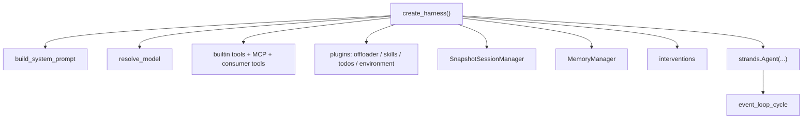

# Strands Harness（Python）设计思想导读（九幕）

> **深潜**：[ARCHITECTURE.md](./ARCHITECTURE.md) · [Part 1–3](./ARCHITECTURE_PART1.md)  
> **源码**: `harness-sdk/strands-py/` · `harness-sdk/harness-py/` · **深潜**: [ARCHITECTURE.md](./ARCHITECTURE.md)

---

## 第 1 幕：源码全景

**一句话**：两个 Python 包叠在一起——**SDK 跑循环**，**Harness 只装配**。

```text
harness-sdk/
├── strands-py/src/strands/
│   ├── agent/agent.py          Agent.__call__ / invoke_async / stream_async
│   ├── event_loop/event_loop.py  event_loop_cycle / recurse_event_loop
│   ├── tools/                  registry / executors / MCP / structured_output
│   ├── hooks/                  类型化生命周期事件
│   ├── session / storage / memory
│   ├── plugins / vended_plugins  skills / offloader / steering / goal
│   ├── multiagent/             Swarm / Graph / A2A
│   ├── models/                 Bedrock / Anthropic / OpenAI / Gemini / Router
│   └── experimental/           bidi / checkpoint / steering
├── harness-py/src/strands_harness/
│   ├── agent.py                create_harness() ← 唯一装配入口
│   ├── prompt.py               HARNESS_CONTRACT
│   ├── tools/                  shell/read/write/edit/web_fetch/subagent/...
│   └── plugins/                todos / environment
├── harness-ts / strands-ts / strands-cli   （本文不展开）
└── team/designs/               跨语言设计提案
```

**易错**：在 `harness-py` 里找 `while True`——没有。循环只在 `strands.event_loop`。

---

## 第 2 幕：状态 vs 执行

| | 状态载体 | 执行 |
|--|----------|------|
| **SDK Agent** | `messages` + `AgentState` + session snapshot | `event_loop_cycle` |
| **Harness** | `./.agent/sessions` · `./.agent/memory` · offload 目录 | 仍是同一个 Agent |
| **子 Agent** | 子实例自己的 messages；默认 **不** 持久 session | 同一 `create_harness` 重建 |

**校正**：`create_harness()` 返回的就是 `strands.Agent`，可以事后再改 `tools` / `hooks`。

---

## 第 3 幕：双层循环

```text
外层：一次 invocation（agent("fix tests")）
  └── 内层：event_loop_cycle（一个 cycle）
        limits（turns / tokens）
        → 模型流式（或跳过：latest 已含 toolUse / 恢复 interrupt）
        → stop_reason == tool_use
              BeforeTools → executor → AfterTools
              recurse_event_loop → 再进 event_loop_cycle
        → end_turn / cancelled / limit_* 停
```

上限：`Limits.turns` / `total_tokens` / `output_tokens`（cycle 边界检查，软限制）。取消：`cancel_signal` 或 `agent.cancel()`。

---

## 第 4 幕：依赖与装配



`agent_kwargs` 里显式的 `system_prompt` / `session_manager` / `memory_manager` **永远压过** harness 糖。

---

## 第 5 幕：工具管线

```text
模型 toolUse 块
  → validate_and_prepare_tools
  → BeforeToolsEvent（可 interrupt / cancel）
  → ToolExecutor（sequential 或 concurrent）
  → 单工具 BeforeToolCall / AfterToolCall
  → 结果合成 user/toolResult 消息
  → recurse
```

Harness 默认工具：`shell` `read` `write` `edit` `web_fetch` `web_search` `programmatic_tool_caller` `subagent`。`subagent` **永远**进 Background Tasks 的 `always` 列表。

---

## 第 6 幕：事件流

| 类型 | 用途 |
|------|------|
| TypedEvent 流 | `StartEvent` / 模型 delta / `ToolResultEvent` / `EventLoopStopEvent` |
| Hook 事件 | `BeforeInvocation` → `BeforeModelCall` → `AfterModelCall` → `BeforeTools` → `AfterTools` → `AfterInvocation` |
| callback_handler | 旧式打印回调（默认 PrintingCallbackHandler） |
| OpenTelemetry | cycle span + 模型/工具 span |

---

## 第 7 幕：Steer vs Follow-up

| 语义 | Strands |
|------|---------|
| 下一次用户输入 | 新 invocation，`messages` 续上 |
| 取消当前 | `cancel_signal` / `agent.cancel()` → `stop_reason="cancelled"` |
| 工具审批 | `interventions`（`"ask"` / `"smart"` / Cedar / HITL）→ Interrupt，恢复后续跑 |
| Checkpoint | `checkpointing=True` 时 `after_model` / `after_tools` 可停、再 resume |

没有 Codewhale 那种「流中途 pending_steers」队列；中途输入要靠 interrupt / 取消 / 下一轮。

---

## 第 8 幕：持久化账本

| 账 | 默认路径 / 组件 |
|----|-----------------|
| Session snapshot | `./.agent/sessions/<id>` · `SnapshotSessionManager` + `LocalFileStorage` |
| Offloaded 大结果 | `<session>/offloaded` 或进程临时目录 |
| Memory markdown | `./.agent/memory` |
| Skills | `./.agent/skills` |
| 无 session | 对话只在 `agent.messages`，进程结束即丢 |

**不自动 resume**：没传 `session={"id": ...}` 就新开。上次 id 在 `agent.session_id`。

---

## 第 9 幕：核心 vs 边界

| 进内核（SDK） | Harness / 可选 |
|---------------|----------------|
| event_loop、hooks、tool registry、session 接口 | 默认工具集、HARNESS_CONTRACT、todos/environment、Exa 搜索 |
| Swarm/Graph/A2A | `subagent` 工厂、Background Tasks 默认策略 |
| 实验：bidi / checkpoint | Cedar 策略包 |

→ [Part 1](./ARCHITECTURE_PART1.md)
