# Harness-SDK (Strands) — Agent 模块级图集（细粒度）

> 源码根：`harness-sdk/strands-py/` · 与 [DIAGRAM_ATLAS.md](./DIAGRAM_ATLAS.md)（全局图）配套。
> **每个重要 Agent 相关模块**至少 1 张图；复杂模块含流程 + 时序/类图。

## 模块索引

| ID | 模块 | 源码锚点 | 图类型 |
|----|------|----------|--------|
| HS-01 | Agent.__call__ 同步入口 | `agent/agent.py` | sequence |
| HS-02 | stream_async 管道 | `agent/agent.py` | flowchart |
| HS-03 | event_loop_cycle | `event_loop/event_loop.py` | flowchart |
| HS-04 | _handle_model_execution | `event_loop/event_loop.py` | sequence |
| HS-05 | 工具执行 ConcurrentToolExecutor | `tools/executors/` | flowchart |
| HS-06 | ToolRegistry | `tools/` | classDiagram |
| HS-07 | SessionManager / Snapshot | `session/` | sequence |
| HS-08 | Checkpoint | `session/checkpoint` | flowchart |
| HS-09 | MemoryManager | `memory/` | flowchart |
| HS-10 | ContextManager + Stash | `experimental/context_manager/` | flowchart |
| HS-11 | ContextOffloader | `vended_plugins/context_offloader/` | sequence |
| HS-12 | HookRegistry | `hooks/` | flowchart |
| HS-13 | Interventions | `interventions/` | flowchart |
| HS-14 | create_harness | `strands_harness/agent.py` | flowchart |
| HS-15 | Subagent / Axis | `tools/subagent.py` | flowchart |
| HS-16 | multiagent Graph/Swarm | `multiagent/` | flowchart |
| HS-17 | Model / stream | `models/ streaming.py` | flowchart |
| HS-18 | Middleware 洋葱 | `_middleware/` | flowchart |
| HS-19 | background_tasks | `background_tasks/` | flowchart |
| HS-20 | telemetry | `telemetry/` | flowchart |
| HS-21 | sandbox | `sandbox/` | flowchart |
| HS-22 | vended_tools / web_fetch | `harness tools/` | sequence |
| HS-23 | types / AgentResult | `types/` | classDiagram |
| HS-24 | storage | `storage/` | flowchart |
| HS-25 | injection / ContextInjector | `injection/` | sequence |
| HS-26 | handlers | `handlers/` | flowchart |
| HS-27 | interrupt.py | `interrupt.py` | stateDiagram |
| HS-28 | limits | `types/limits.py` | flowchart |
| HS-29 | vended_memory_stores | `vended_memory_stores/` | flowchart |
| HS-30 | harness plugins todos/env | `strands_harness/plugins/` | flowchart |
| HS-31 | prompt HARNESS_CONTRACT | `strands_harness/prompt.py` | flowchart |
| HS-32 | models resolve effort | `strands_harness/models.py` | flowchart |

---

## HS-01 Agent.__call__ 同步入口

**源码**：`agent/agent.py`

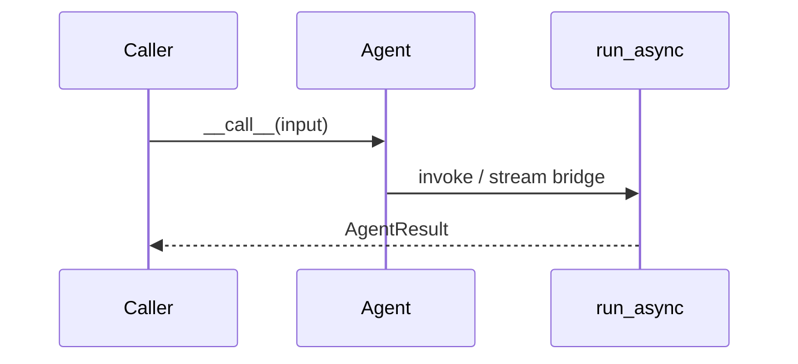

**读图**：并发锁与幂等 token 在 __call__ 边界。

---

## HS-02 stream_async 管道

**源码**：`agent/agent.py`

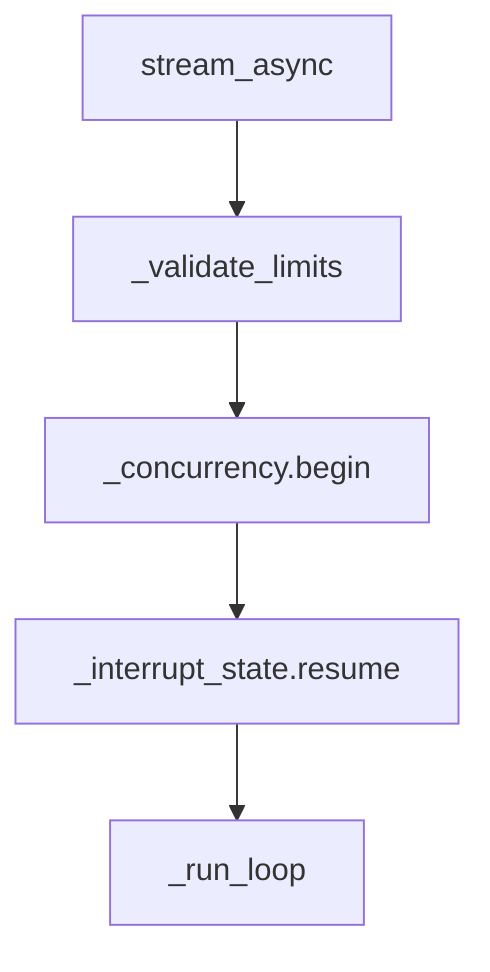

**读图**：cancel_signal 挂载 watcher。

---

## HS-03 event_loop_cycle

**源码**：`event_loop/event_loop.py`

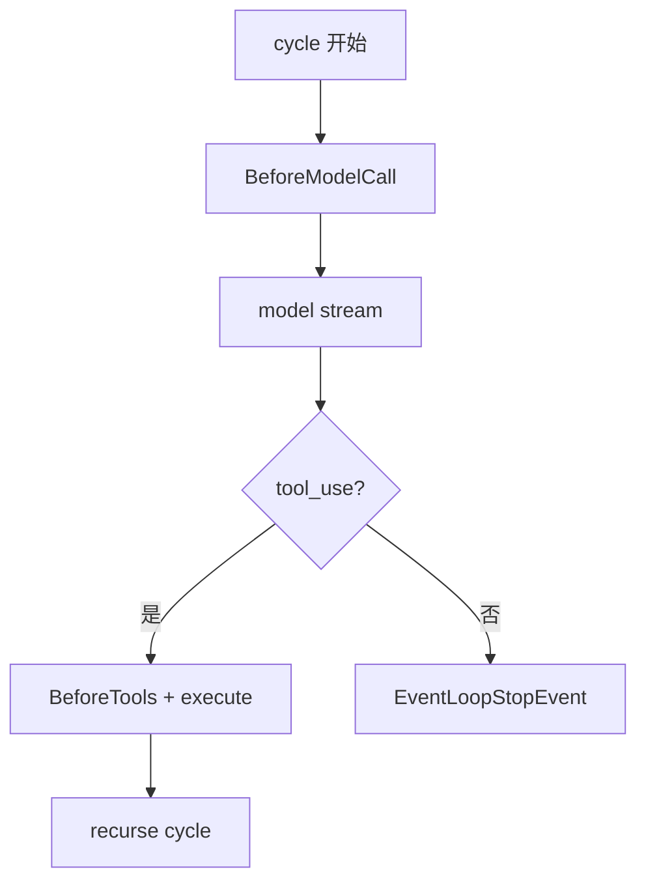

**读图**：async generator；invocation_state 跨 cycle。

---

## HS-04 _handle_model_execution

**源码**：`event_loop/event_loop.py`

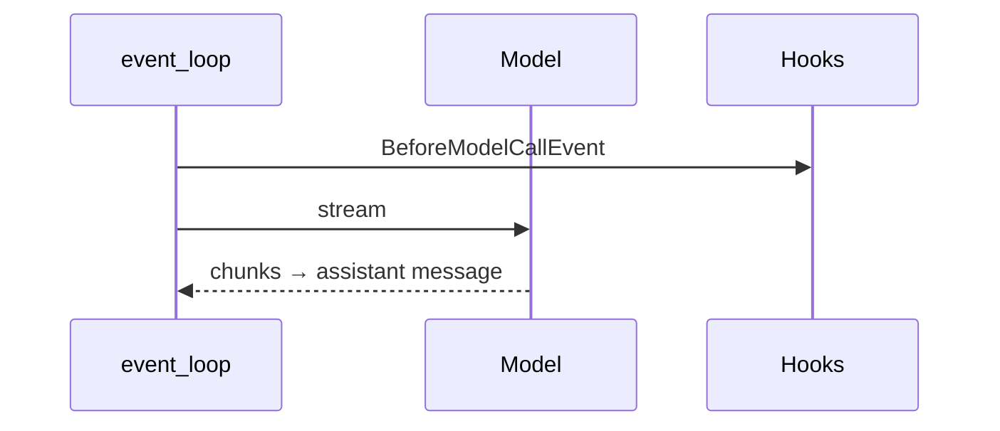

**读图**：ContextWindowOverflow 可触发 reduce 重试。

---

## HS-05 工具执行 ConcurrentToolExecutor

**源码**：`tools/executors/`

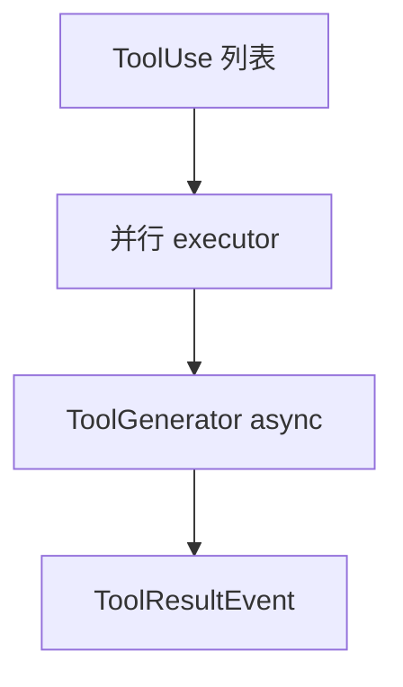

**读图**：背压与并发上限可配置。

---

## HS-06 ToolRegistry

**源码**：`tools/`

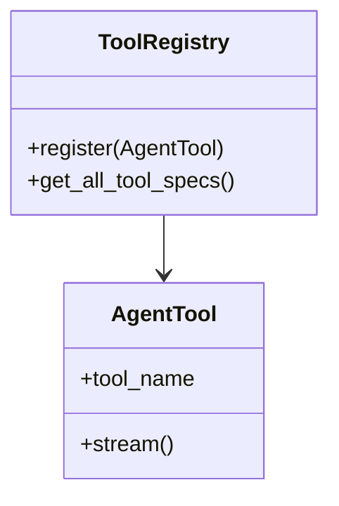

**读图**：builtin + 动态注册。

---

## HS-07 SessionManager / Snapshot

**源码**：`session/`

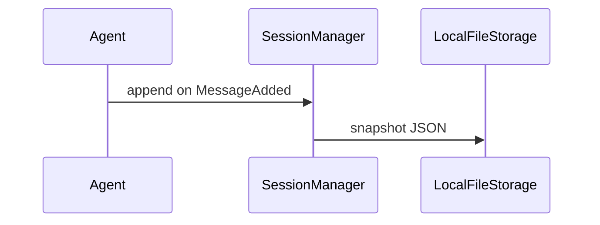

**读图**：跨进程 resume 读 snapshot。

---

## HS-08 Checkpoint

**源码**：`session/checkpoint`

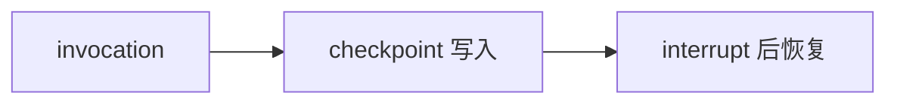

**读图**：与 Session 正交。

---

## HS-09 MemoryManager

**源码**：`memory/`

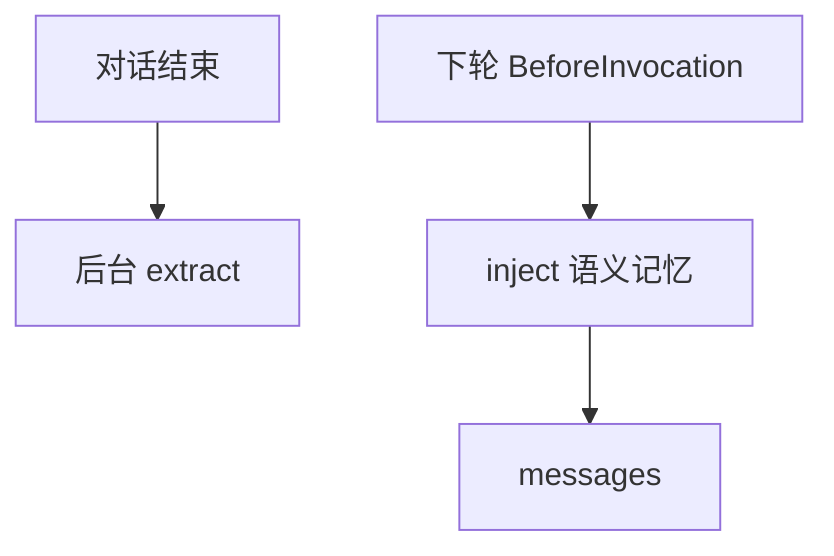

**读图**：只读共享视图防写冲突。

---

## HS-10 ContextManager + Stash

**源码**：`experimental/context_manager/`

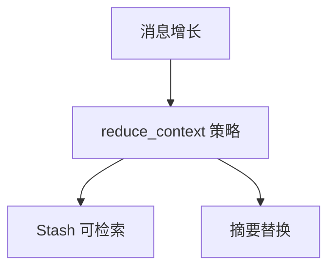

**读图**：设置后 ConversationManager → Null。

---

## HS-11 ContextOffloader

**源码**：`vended_plugins/context_offloader/`

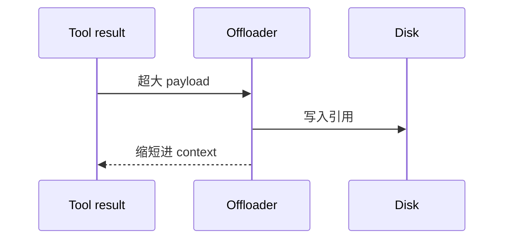

**读图**：插件 init_agent 注册。

---

## HS-12 HookRegistry

**源码**：`hooks/`


**读图**：BeforeModel/BeforeTools/MessageAdded 等。

---

## HS-13 Interventions

**源码**：`interventions/`

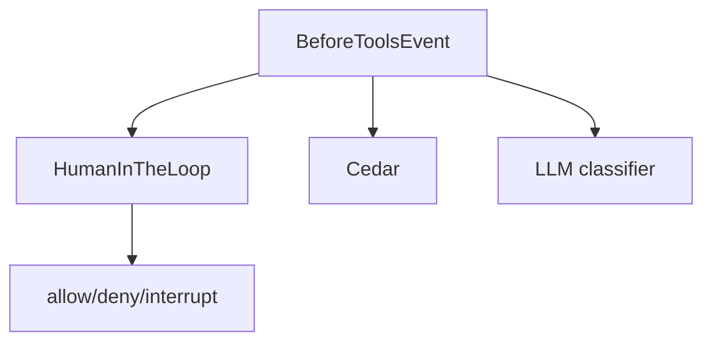

**读图**：harness 字符串语法解析为 Handler。

---

## HS-14 create_harness

**源码**：`strands_harness/agent.py`

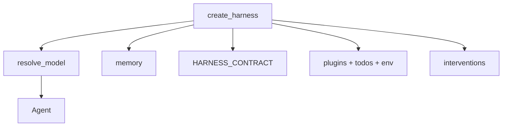

**读图**：意见层一次性组装。

---

## HS-15 Subagent / Axis

**源码**：`tools/subagent.py`

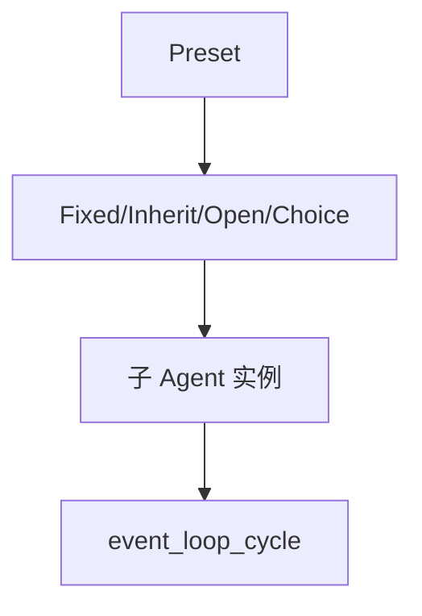

**读图**：上下文分享：none/summary/full。

---

## HS-16 multiagent Graph/Swarm

**源码**：`multiagent/`

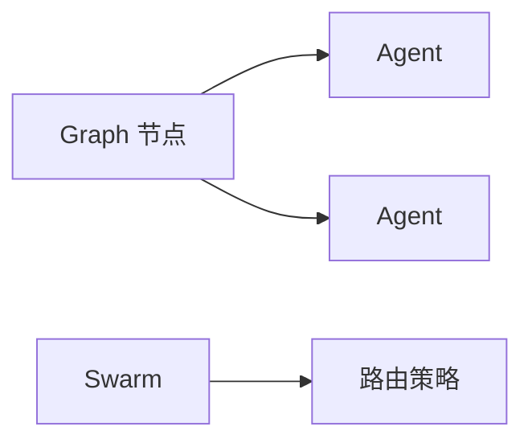

**读图**：节点内仍 Agent.run。

---

## HS-17 Model / stream

**源码**：`models/ streaming.py`

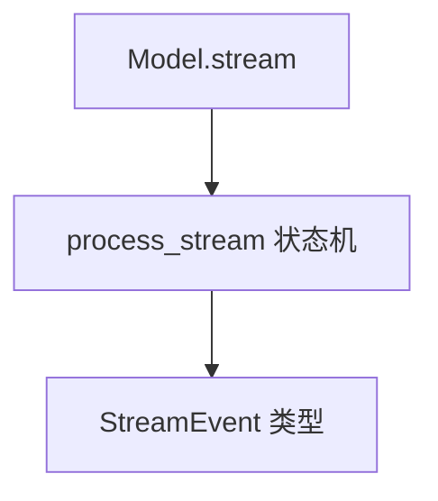

**读图**：Router 多模型。

---

## HS-18 Middleware 洋葱

**源码**：`_middleware/`

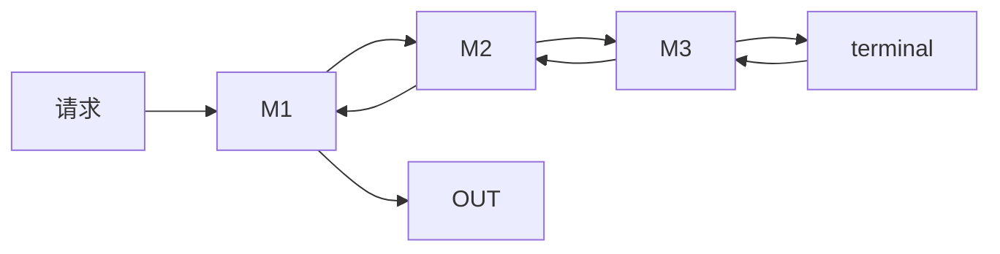

**读图**：AgentStreamStage。

---

## HS-19 background_tasks

**源码**：`background_tasks/`

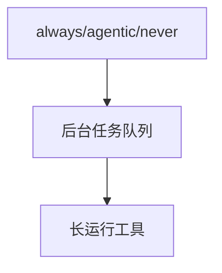

**读图**：策略字典配置。

---

## HS-20 telemetry

**源码**：`telemetry/`

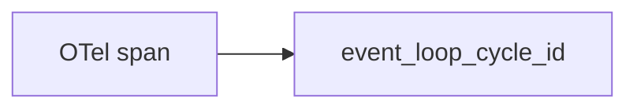

**读图**：与业务消息分离。

---

## HS-21 sandbox

**源码**：`sandbox/`

```mermaid
flowchart TD
    TOOL[工具] --> SB[沙箱策略]
    SB --> EXEC[子进程/限制]
```

**读图**：与 interventions 叠加。

---

## HS-22 vended_tools / web_fetch

**源码**：`harness tools/`

```mermaid
sequenceDiagram
    participant A as Agent
    participant W as web_fetch
    W->>W: URL 策略校验
    W-->>A: 截断正文
```

**读图**：内置工具安全边界。

---

## HS-23 types / AgentResult

**源码**：`types/`

```mermaid
classDiagram
    class AgentResult {
        +stop_reason
        +message
        +interrupts
        +structured_output
    }
    class EventLoopStopEvent
    AgentResult --> EventLoopStopEvent
```

**读图**：stop_reason 枚举驱动分支。

---

## HS-24 storage

**源码**：`storage/`

```mermaid
flowchart LR
    SM[SessionManager] --> LS[LocalFileStorage]
    LS --> JSON[snapshot 文件]
```

**读图**：可换自定义 Storage。

---

## HS-25 injection / ContextInjector

**源码**：`injection/`

```mermaid
sequenceDiagram
    participant BI as BeforeInvocation
    participant I as ContextInjector
    participant A as Agent.messages
    BI->>I: 临时 facts
    I->>A: extend 仅本轮
```

**读图**：不污染持久 session。

---

## HS-26 handlers

**源码**：`handlers/`

```mermaid
flowchart TD
    EV[stream events] --> H[handlers 链]
    H --> UI[CLI/UI 消费]
```

**读图**：与 hooks 区别：对外展示。

---

## HS-27 interrupt.py

**源码**：`interrupt.py`

```mermaid
stateDiagram-v2
    [*] --> Running
    Running --> Interrupted: InterruptException
    Interrupted --> Running: resume payload
    Running --> [*]: end_turn
```

**读图**：与 interventions interrupt 对齐。

---

## HS-28 limits

**源码**：`types/limits.py`

```mermaid
flowchart TD
    T[turn 计数] --> CHK[_check_limits]
    TOK[token 计数] --> CHK
    CHK -->|超限| STOP[limit_* stop]
```

**读图**：Limits 在 cycle 边界检查。

---

## HS-29 vended_memory_stores

**源码**：`vended_memory_stores/`

```mermaid
flowchart LR
    MM[MemoryManager] --> VS[向量/文件 store 插件]
```

**读图**：可选后端。

---

## HS-30 harness plugins todos/env

**源码**：`strands_harness/plugins/`

```mermaid
flowchart TD
    CH[create_harness] --> ENV[environment 注入]
    CH --> TODO[todos 临时任务表]
```

**读图**：每轮 BeforeInvocation 注入。

---

## HS-31 prompt HARNESS_CONTRACT

**源码**：`strands_harness/prompt.py`

```mermaid
flowchart LR
    P[四节契约] --> SYS[system 拼接]
    SYS --> AG[Agent]
```

**读图**：Action/Tools/Safety/Context。

---

## HS-32 models resolve effort

**源码**：`strands_harness/models.py`

```mermaid
flowchart TD
    ID[model id 字符串] --> R[resolve_model]
    R --> EFF[effort 映射]
    EFF --> M[Model 实例]
```

**读图**：auto/off/minimal/.../max。

---


# 附录 A — Strands 包地图

```mermaid
flowchart TB
    subgraph harness_py[strands_harness]
        CH[create_harness]
    end
    subgraph agent[strands.agent]
        AG[Agent]
    end
    subgraph loop[strands.event_loop]
        EL[event_loop_cycle]
    end
    subgraph io[strands.session / memory / tools]
        IO[持久化+工具]
    end
    CH --> AG
    AG --> EL
    AG --> IO
```

```mermaid
sequenceDiagram
    participant H as Harness App
    participant A as Agent
    participant M as MemoryManager
    participant S as SessionManager
    H->>A: prompt
    A->>M: inject
    A->>A: event_loop
    A->>S: snapshot
    A-->>H: result
```

**读图**：一次 invocation 内 Memory 注入在 loop 前；Session 在消息追加时写入。
