# Harness-SDK（Strands）架构图集（全局）

> 配套 [ARCHITECTURE.md](../ARCHITECTURE.md)。**模块级 HS-01…HS-32**：[AGENT_MODULE_DIAGRAMS.md](./AGENT_MODULE_DIAGRAMS.md)。  
> 源码根：`harness-sdk/strands-py`、`harness-sdk/harness-py`。

---

## 图目录

| 编号 | 类型 | 标题 |
|------|------|------|
| G1 | architecture | SDK + Harness 两层 |
| G2 | classDiagram | Agent 与周边组件 |
| G3 | sequence | `agent(prompt)` 端到端 |
| G4 | flowchart | `event_loop_cycle` 决策树 |
| G5 | erDiagram | Session / Checkpoint / Messages |
| M1 | sequence | 单 cycle：模型流 → 工具 |
| M2 | flowchart | Interventions 门卫 |
| M3 | sequence | Interrupt / Resume |
| M4 | flowchart | ContextManager vs ConversationManager |
| M5 | sequence | 子智能体 spawn |
| M6 | flowchart | `create_harness` 组装 |

---

## G1 两层架构

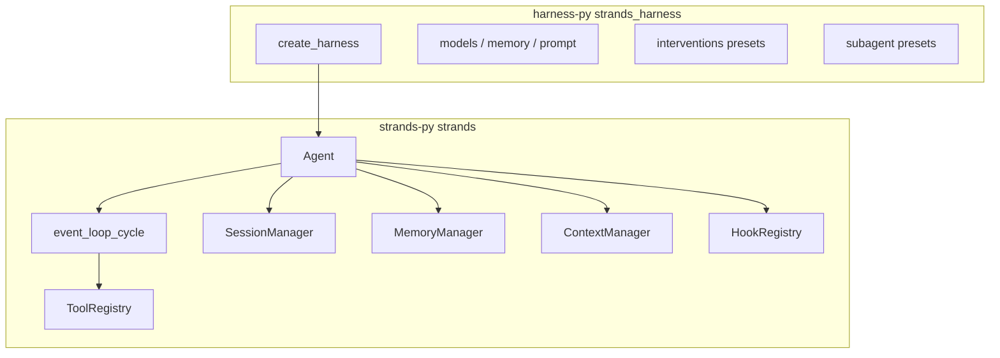

**读图**：Harness 是**意见层**；循环与状态均在 `strands.Agent`。

---

## G2 核心类图

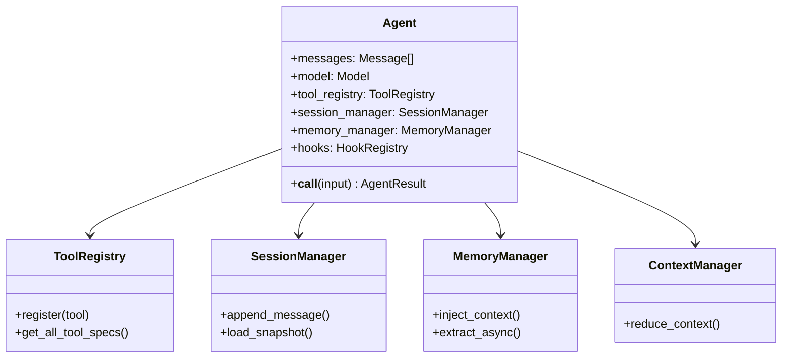

---

## G3 端到端调用时序

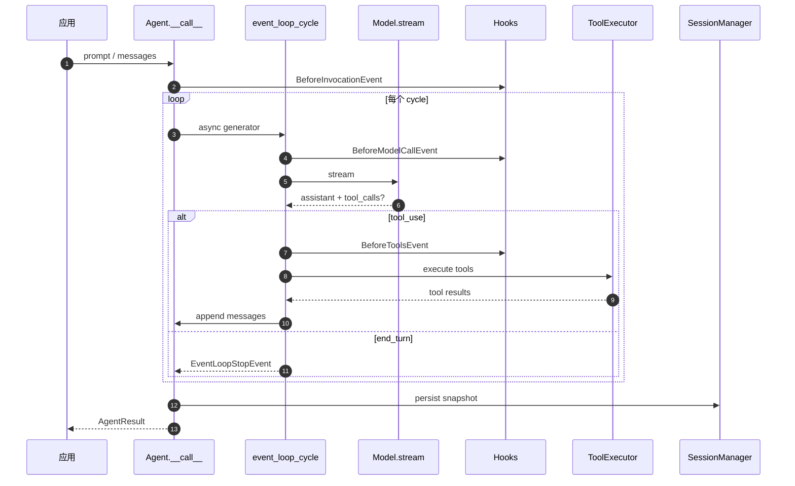

---

## G4 `event_loop_cycle` 决策树

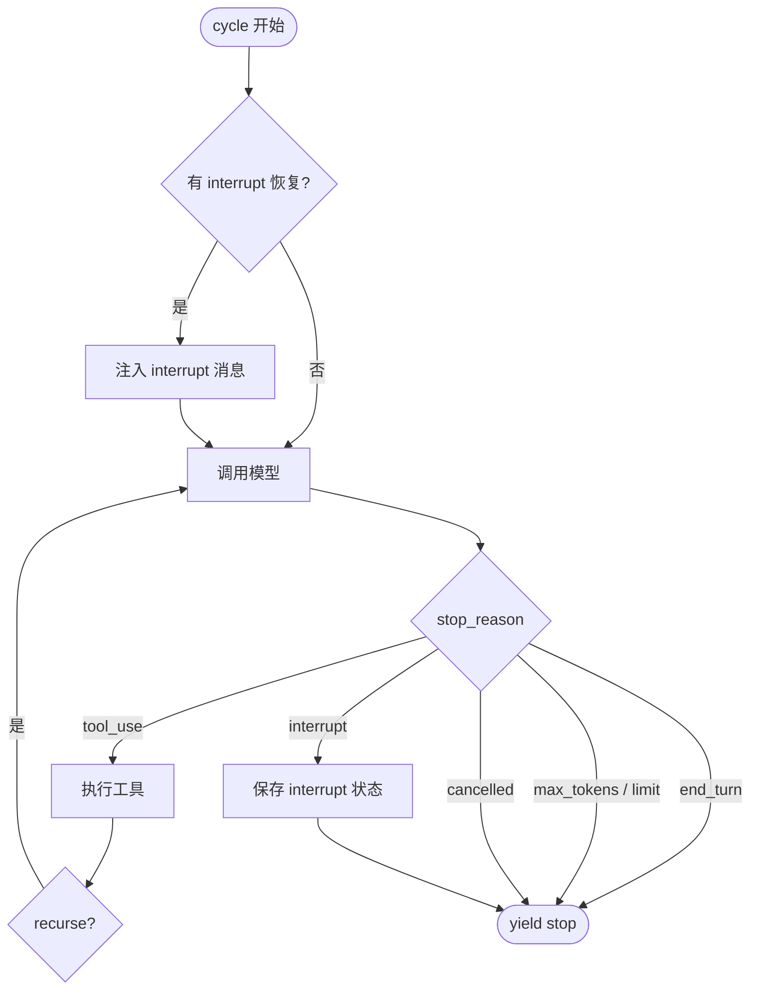

---

## G5 会话与检查点实体

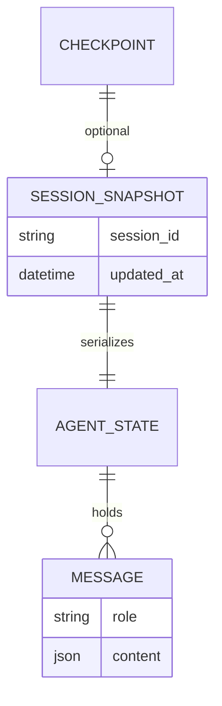

---

## M1 单 Cycle 模型-工具时序

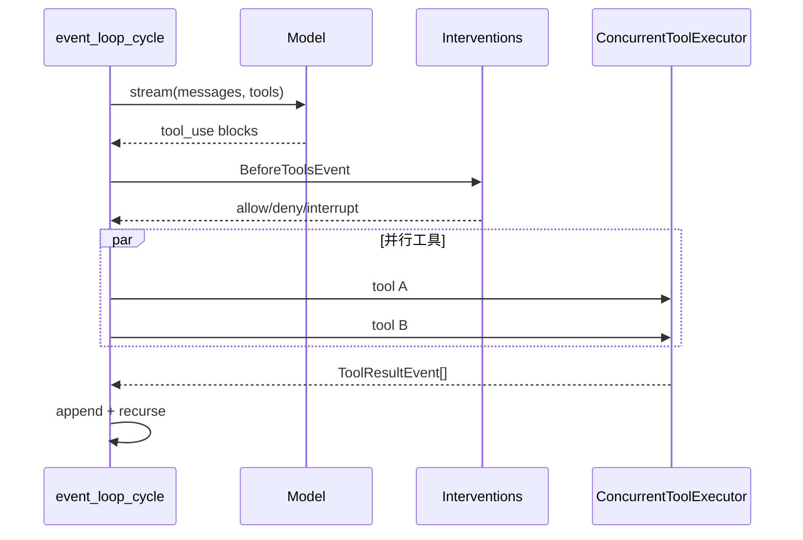

---

## M2 Interventions 流程

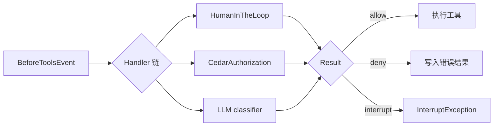

---

## M3 Interrupt / Resume

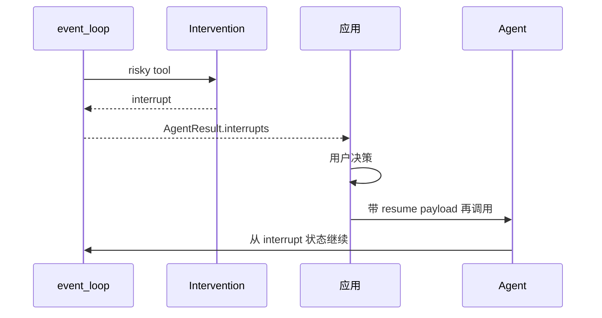

---

## M4 上下文压缩互斥

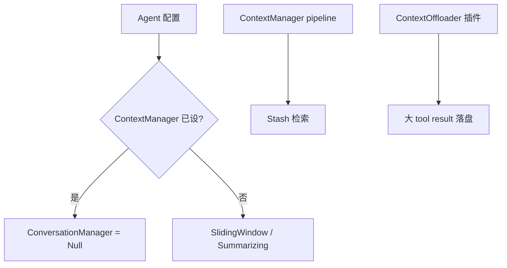

---

## M5 子智能体

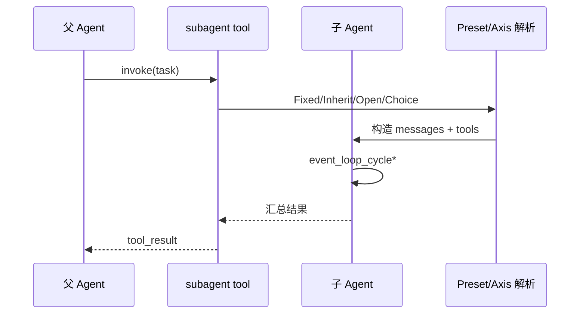

---

## M6 `create_harness` 组装

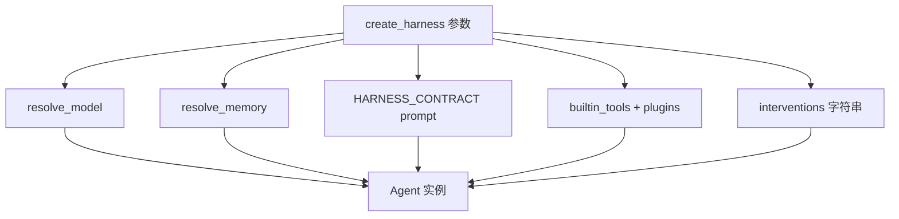

---

## 章节对照

| 图 | ARCHITECTURE |
|----|----------------|
| G1–G3 | §1, §2.1–2.2 |
| G4 | §2.1 |
| G5 | §2.3 |
| M2 | §2.6 |
| M3 | 第三部分 P3.3 |
| M4 | §2.5 |
| M5 | §2.8 |
| M6 | §2.7 |
