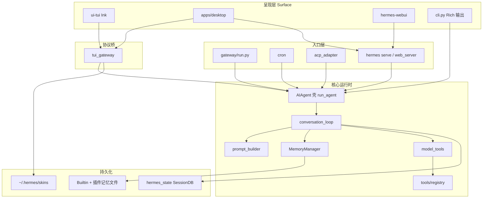
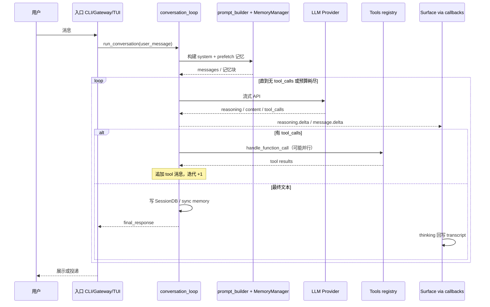

# Hermes Agent 架构全景

> **文档状态**：Canonical（Agent 内核）  
> **Hermes 版本锚点**: 0.19.0 (`v2026.7.20`) · **核对**: 2026-07-22 · 模块地图见 [DOC_MAINTENANCE.md](DOC_MAINTENANCE.md)  
> **Surface 层（CLI/TUI/Desktop/推理流式/Skin/Widget）**: 见 [SURFACE_ARCHITECTURE.md](SURFACE_ARCHITECTURE.md) — v0.18+ 结构升级主文档  
> **使用建议**：Agent 内核以本文件为准；呈现层与 Gateway 事件协议以 `SURFACE_ARCHITECTURE.md` 为准。

> **文档角色**：面向开发者与架构读者的**中文深度总览**——说明**为何这样设计**、**一轮对话在代码里如何走动**；**§10 全项目模块地图**覆盖整仓目录；**§12** 为核心路径**行级**导读；**§13** 为使用/开发最佳实践；与官网英文专题互补。  
> **延伸阅读**：[Architecture（站点）](../website/docs/developer-guide/architecture.md)、[Agent Loop Internals](../website/docs/developer-guide/agent-loop.md)、[Prompt Assembly](../website/docs/developer-guide/prompt-assembly.md)、[Gateway Internals](../website/docs/developer-guide/gateway-internals.md)。  
> **源码根目录**：`hermes-agent/`。

---

## 📋 目录

- [0. 0.19 文档地图（先读这里）](#0-019-文档地图先读这里)
- [1. 项目概述](#1-项目概述)
- [2. 设计思想（Why Hermes is shaped this way）](#2-设计思想why-hermes-is-shaped-this-way)
- [3. 项目能力一览（What it does）](#3-项目能力一览what-it-does)
- [4. 逻辑分层](#4-逻辑分层)
- [5. 核心流程一：单轮对话在 `AIAgent` 内如何走完](#5-核心流程一单轮对话在-aiagent-内如何走完)
- [6. 核心流程二：Prompt 如何拼装、上下文如何被保护](#6-核心流程二prompt-如何拼装上下文如何被保护)
- [7. 核心流程三：Memory 管线（何时读、何时写）](#7-核心流程三memory-管线何时读何时写)
- [8. 核心流程四：工具系统与子代理](#8-核心流程四工具系统与子代理)
- [9. 核心流程五：Gateway（网关）](#9-核心流程五gateway网关)
- [10. Cron / ACP / Batch（简述）](#10-cron--acp--batch简述)
- [11. 全项目模块地图（按目录，覆盖整仓）](#11-全项目模块地图按目录覆盖整仓)
- [12. 官方设计原则表（与实现对应）](#12-官方设计原则表与实现对应)
- [13. 源码导读（该从哪里读起、关键实现落在哪）](#13-源码导读该从哪里读起关键实现落在哪)
- [14. 使用与开发最佳实践](#14-使用与开发最佳实践)
- [15. 关键技术决策](#15-关键技术决策)
- [16. 扩展性设计](#16-扩展性设计)
- [17. 部署架构](#17-部署架构)
- [18. 性能优化策略](#18-性能优化策略)
- [19. 推荐阅读顺序](#19-推荐阅读顺序)
- [20. 修订记录](#20-修订记录)

---

## 0. 0.19 文档地图（先读这里）

v0.18–v0.19 起 Hermes 的**结构变化**主要在呈现层与连接模型，而不是另写一套 Agent 内核：

```text
┌──────────────────────────────────────────────────────────────┐
│  Surface（呈现）  CLI · Ink TUI · Desktop · WebUI            │
│  协议桥          tui_gateway（WS 事件、skin watcher）         │
├──────────────────────────────────────────────────────────────┤
│  入口            Gateway IM / Cron / ACP / hermes serve      │
├──────────────────────────────────────────────────────────────┤
│  内核            AIAgent → conversation_loop → tools/memory  │
└──────────────────────────────────────────────────────────────┘
```

| 你要了解… | 读哪篇 |
|-----------|--------|
| 四 Surface、推理回写、Skin、Widget、Desktop SSH | **[SURFACE_ARCHITECTURE.md](SURFACE_ARCHITECTURE.md)**（Canonical） |
| Agent 内核总览（本文件） | 下文 §2–§11 |
| 主循环细节 / 压缩与路由 pin | [AGENT_LOOP_ARCHITECTURE.md](AGENT_LOOP_ARCHITECTURE.md) §10 |
| IM 网关 + CLI 交互面 | [CLI_GATEWAY_SYSTEM.md](CLI_GATEWAY_SYSTEM.md) |
| 版本差异 | [VERSION_HISTORY.md](VERSION_HISTORY.md) |

**勿再假设**：只有 CLI + Gateway；`run_agent.py` 内含全部主循环；换肤只能重启。

---

## 1. 项目概述

### 1.1 什么是 Hermes Agent？

**Hermes Agent** 是由 [Nous Research](https://nousresearch.com) 开发的**自改进 AI Agent**。它是唯一内置学习循环的 Agent，能够：

- ✅ **从经验中创建 Skills** - 自动将成功的工作流转化为可复用的技能
- ✅ **在使用过程中自我改进 Skills** - 持续优化已有技能
- ✅ **跨会话搜索历史对话** - FTS5 全文搜索 + LLM 总结
- ✅ **建立深度的用户模型** - 个性化记忆与偏好学习
- ✅ **支持多种消息平台** - Telegram、Discord、Slack、WhatsApp 等 23+ 平台
- ✅ **四 Surface 呈现** - CLI / Ink TUI / 原生 Desktop / WebUI，共享 Gateway 事件总线
- ✅ **可在任何环境运行** - $5 VPS、GPU 集群、Serverless（Modal/Daytona）；Desktop 可 SSH 连远程 `hermes serve`

**核心理念**:
> "The self-improving AI agent" —— 通过闭环学习持续进化

### 1.2 核心价值主张

| 维度 | Hermes Agent | 传统 Agent 框架 |
|------|-------------|----------------|
| **学习循环** | ✅ 自动创建和改进 Skills | ❌ 需要手动配置 |
| **跨会话记忆** | ✅ FTS5 全文搜索 + LLM 总结 | ⚠️ 简单的向量检索 |
| **多平台支持** | ✅ 23+ IM/Web 平台 | ❌ 通常只支持 CLI |
| **多 Surface UI** | ✅ CLI + TUI Widget + Desktop + WebUI | ⚠️ 常只有一种 REPL |
| **终端后端** | ✅ 6种（Local/Docker/SSH/Modal/Daytona/Singularity） | ❌ 通常只有 Local |
| **Serverless** | ✅ Modal/Daytona 支持休眠唤醒 | ❌ 需常驻进程 |
| **技能标准** | ✅ 兼容 agentskills.io 开放标准 | ⚠️ 私有格式 |
| **RL 训练** | ✅ Atropos 环境集成 | ❌ 无 |

### 1.3 典型使用场景

**场景 1: 个人生产力助手**
```bash
# CLI 模式
hermes "帮我审查这个 PR 并给出改进建议"

# Gateway 模式（Telegram）
用户: /help 修复认证 bug
Hermes: 正在分析 src/auth/token.py...
```

**场景 2: 自动化运维**
```bash
# Cron 定时任务
hermes cron add --schedule="0 9 * * *" --prompt="检查服务器状态并发送报告"

# 结果自动投递到 Slack
```

**场景 3: 研究助理**
```python
# Batch 批量评估
python batch_runner.py --tasks=research_tasks.jsonl --model=claude-3-opus
```

**场景 4: Serverless 部署**
```yaml
# Modal 配置
@stub.function(cpu=1, memory=512)
def hermes_serverless(prompt: str):
    agent = AIAgent(platform="modal")
    return agent.run_conversation(prompt)
```

---

## 2. 设计思想（Why Hermes is shaped this way）

Hermes 不是「包一层 Chat API」，而是一个**以工具调用为中心、可长期运行、可多通道交付**的运行时。下面几条是贯穿代码库的判断标准，而不是口号。

### 1.1 核心与外壳分离（Platform-agnostic core）

- **一个** `AIAgent`（`run_agent.py`）承担所有「模型 ↔ 工具 ↔ 状态」的编排；CLI、Telegram、Cron、ACP、HTTP API 只负责**如何把用户输入送进来、如何把结果展示/投递出去**。  
- **收益**：行为一致、Bug 只修一处；新渠道只需写适配器 + 会话键策略，不必复制 Agent 逻辑。  
- **代价**：入口层必须处理好**工作目录**（例如网关常用 `MESSAGING_CWD`）、**身份与授权**（谁可以驱动 bot）。

### 1.2 可观测性优先（Observable execution）

- 每次工具调用都通过 **callbacks** 反映到 CLI（spinner、工具前缀输出）或网关（聊天里的进度消息）。  
- **思想**：Agent 是「自动化操作」而非黑盒聊天；用户需要看到**正在执行什么**，才能信任终端/远程沙箱行为。

### 1.3 Prompt 稳定与成本（Prompt stability / cache economics）

- **系统前缀在会话中保持稳定**：不在中途无声地换模型组合、不重载 whole skills 全文、不偷偷改写 system prompt——除非用户显式操作（如 `/model`）或走**正式的压缩管线**。  
- **原因**：Anthropic 等前缀缓存依赖稳定前缀；频繁突变会直接转化为**账单与延迟**。  
- Skills 采用**渐进披露**（索引进 system，正文靠 `read_file` / `skill_view`），是在「上下文长度」与「可调用的程序性知识」之间的工程折中。

### 1.4 松耦合与注册表（Loose coupling）

- 工具、MCP、Memory Provider、Context Engine、插件都通过 **registry / 单例策略 / `check_fn`** 接入，而不是在 `AIAgent` 里写死 import。  
- **收益**：可选能力缺失时降级；测试可以替换模块；社区插件不必改核心分支。

### 1.5 记忆：防混淆优于炫技（Fence > raw injection）

- 外部检索到的记忆经 `MemoryManager` 包进 `<memory-context>`，并带系统注释：**明确告知模型这是背景材料而非用户新输入**（见 `agent/memory_manager.py`）。  
- **单一外部 Memory Provider**：同时只允许一个外部后端 + 内置 Builtin——避免工具 schema 爆炸与写入语义冲突。

### 1.6 子代理 = 隔离执行单元（Delegation as isolation）

- `delegate_task` Spawn **新的** `AIAgent` 实例：干净上下文、独立 `task_id`（终端会话隔离）、受限工具集，父对话只看到**委托与摘要**。  
- **不是**多角色 Crew 编排框架：Hermes 刻意避免「表面多 agent、实则同一上下文搅在一起」；要的是**边界清晰**与可预期的副作用范围。

### 1.7 Profile = 一等租户（Isolation by HERMES_HOME）

- `hermes -p <name>` 切换整棵用户态目录树（配置、会话、记忆、skills、网关 PID）。  
- 代码里**禁止**写死 `~/.hermes`，一律 `get_hermes_home()`——否则 profile 与测试隔离全部失效。

### 1.8 明确的非目标（What Hermes deliberately does not optimize for）

理解一个系统，不能只看它追求什么，也要看它**刻意不追求什么**。Hermes 有几条很明确的非目标：

- **不是纯声明式图编排框架**
  Hermes 的核心不是 StateGraph/Workflow DSL，而是以 `AIAgent` 为中心的工具驱动循环。这样做牺牲了一部分“可视化编排感”，换来更直接的运行时控制。
- **不是默认多角色对话系统**
  它支持 delegation，但不以“多个 agent 一起聊天”作为默认协作范式。重点是边界隔离，而不是角色戏剧性。
- **不是无限上下文聚合器**
  Hermes 更偏向受控注入、渐进披露和压缩，不追求“把所有知识和历史一次性塞进 prompt”。
- **不是 memory-first 产品**
  memory 很重要，但它不是唯一中心。Hermes 的主轴仍然是 tool loop、delegation、gateway、skills、session archive 协同工作。
- **不是零成本抽象层**
  Hermes 在很多地方宁愿保留显式约束，也不愿抽象到读不出真实执行边界。例如 tool parallelism、provider 限制、profile 隔离都偏保守。

这些非目标解释了为什么 Hermes 看起来不像某些“更优雅”的框架：它优先保证的是可运行、可观测、可控，而不是抽象统一感。

---

## 3. 项目能力一览（What it does）

| 维度 | 说明 |
|------|------|
| **统一 Agent 核心** | 同一 `AIAgent` 驱动 CLI、网关、Cron、ACP、批处理等。 |
| **工具优先** | 中央 `tools/registry.py`；终端多后端（本地 / Docker / SSH / Modal / Daytona / Singularity 等）。 |
| **记忆分层** | **三层主模型**: Persistent Memory + Session Search + Optional External Provider；skills / trajectory 属于扩展沉淀机制（详见 [MEMORY_SYSTEM.md](MEMORY_SYSTEM.md)） |
| **网关** | 长驻 `GatewayRunner`，多 IM 适配器、统一会话与投递。 |
| **子代理** | `delegate_task`：独立预算与工具沙箱，限制递归与危险副作用。 |

---

## 4. 逻辑分层

v0.19 起分层是 **Surface → 入口 → 内核 → 持久化**。Surface 不重写 Agent loop，只消费 callback / WS 事件。



详述见 [SURFACE_ARCHITECTURE.md](SURFACE_ARCHITECTURE.md)。

### 4.1 模块协作矩阵

只看目录树很容易知道“文件在哪”，但不容易知道“谁拥有决策权”。下面这张矩阵更适合用来理解职责分工：

| 模块 | 拥有的核心决策 | 不应该负责的事情 | 典型协作对象 |
|------|----------------|------------------|--------------|
| `AIAgent` / `run_agent.py` | 构造、配置、callback 接线；`run_conversation` **转发** | 不把主循环再写回本文件 | `conversation_loop.py`, `prompt_builder.py` |
| `conversation_loop.py` | 模型调用、工具循环、压缩触发、hooks | 不渲染 UI、不投递 IM | `chat_completion_helpers.py`, `tools/*` |
| `prompt_builder.py` | system prompt 结构、上下文文件扫描、skills 索引组装 | 不执行工具、不保存会话 | `run_agent.py`, `skills_*`, context files |
| `MemoryStore` / `memory_tool.py` | built-in persistent memory 的文件读写与冻结快照 | 不做外部 provider 编排 | `run_agent.py` |
| `MemoryManager` | external provider 生命周期、prefetch/sync 聚合 | 不应成为 built-in memory 的唯一真相来源 | `agent/memory_provider.py`, `plugins/memory/*` |
| `model_tools.py` | tool schema 聚合、工具分发、统一调用入口 | 不掌握完整会话生命周期 | `tools/registry.py`, `run_agent.py` |
| `tools/registry.py` | 工具注册和发现机制 | 不做业务流程编排 | `tools/*.py`, `model_tools.py` |
| `tui_gateway` | WS 事件总线、skin watcher、TUI/Desktop session | 不实现 ReAct 主循环 | `ui-tui`, `apps/desktop`, `AIAgent` callbacks |
| `GatewayRunner` | 多平台消息路由、鉴权、会话键、投递义务账本 | 不重写 agent loop | `gateway/platforms/*`, `delivery_ledger.py` |
| `SessionDB` | 会话持久化、FTS5 搜索 | 不决定 prompt 注入策略 | `run_agent.py`, `session_search_tool.py` |

这张表的意义是：以后你要改某个行为时，先判断“谁拥有这个决策”，再去看对应文件，而不是在整仓里盲搜。

---

## 5. 核心流程一：单轮对话在 `AIAgent` 内如何走完

以下为 **`run_conversation()` 内部一轮迭代**的逻辑顺序（与官网 *Turn Lifecycle* 一致）。  
**实现位置（v0.15+）**：`agent/conversation_loop.py`；`run_agent.AIAgent.run_conversation` 仅为薄转发。流式 reasoning / 正文 delta 在 `agent/chat_completion_helpers.py` 发射。

### 5.1 生命周期（每一轮工具循环）

1. **任务标识**：若未提供 `task_id` 则生成（隔离终端会话、缓存键等）。  
2. **用户消息写入历史**：进入 OpenAI 风格 `messages` 列表。  
3. **构建系统提示**：`prompt_builder` 拼装人格、`AGENTS.md` / `.hermes.md`、`SOUL.md`、skills **索引**、模型专用指令等；并与 **MemoryManager** 的记忆提示合并。  
4. **预检压缩（如需要）**：上下文超过阈值时对中段做压缩（`context_compressor` / Context Engine）。阈值受 **route-scoped** `model.context_length` 约束——`/model` 切换后不得沿用旧 pin（见 [AGENT_LOOP_ARCHITECTURE.md](AGENT_LOOP_ARCHITECTURE.md) §10）。  
5. **组装 API 载荷**：按 `api_mode` 转为  
   - `chat_completions`：大体保持 OpenAI 消息列表；  
   - `codex_responses`：转为 Responses 输入项；  
   - `anthropic_messages`：`anthropic_adapter` 转换。  
6. **注入短时提示层**：如预算告警、上下文压力提示（随回合变化，**不**轻易动固定 system 前缀）。  
7. **Anthropic 缓存断点**：若走 Claude，应用 `prompt_caching`；0.19 起可把精确请求字节写入 **api_content sidecar**。  
8. **可中断流式 API 调用**：SSE 中优先 `_fire_reasoning_delta`，再 `_fire_stream_delta`；Surface 经 callback 收到 token。  
9. **解析响应**：  
   - 若有 `tool_calls`：执行工具 → 把 `tool` 消息追加进历史 → **回到步骤 5**；  
   - 若为最终文本：持久化会话、必要时 flush 记忆、返回；TUI/Desktop 将已流过的 reasoning **回写**为 `msg.thinking`。

内部消息必须满足提供商的**角色交替约束**。呈现层见 [SURFACE_ARCHITECTURE.md](SURFACE_ARCHITECTURE.md) §4。

### 5.2 序列图（概念）



### 5.3 迭代预算 `IterationBudget`（`agent/iteration_budget.py`）

- **每个**代理实例（父或子）自有预算；父默认 `max_iterations`（如 90），子代理单独上限（默认 50，可由 `delegation.max_iterations` 配置）。  
- **父子预算相加可以超过父的上限**——设计意图是：委派出去的工作不应简单吞噬父轮数，但也不无限；子代理仍有自己的 cap。  
- **`execute_code` 内程序化工具循环可通过 `refund()` 退回计数**，避免「代码里帮模型多跑了几轮工具」就耗光父预算。

### 5.4 工具并行策略（实现规则摘要）

当同一轮模型返回**多个** tool_call 时，是否并行由 `_should_parallelize_tool_batch()` 决定（简化理解）：

- 若含 **`clarify`** → **整批串行**（必须与人交互）。  
- **`read_file` / `write_file` / `patch`**：仅当解析出的目标路径**互不重叠**时才可与其它安全调用并行；路径不明则保守串行。  
- 下列 **只读、无共享可变会话状态** 的工具可与同类一起并行（节选，以源码为准）：  
  `read_file`, `search_files`, `session_search`, `skill_view`, `skills_list`, `web_search`, `web_extract`, `vision_analyze`，以及文档中列出的 Home Assistant 只读工具等。  
- 不在安全集合里的工具默认**不并行**。  
- 并发上限 **`_MAX_TOOL_WORKERS = 8`**。

终端命令若被启发式判定为**破坏性**（`rm`、`sed -i`、危险重定向等），会走更保守的路径（避免与文件类并行冲突）。

---

## 6. 核心流程二：Prompt 如何拼装、上下文如何被保护

### 6.1 拼装职责划分

- **`agent/prompt_builder.py`**：偏「静态与项目上下文」——人格、平台 hint、skills 索引、仓库内 `AGENTS.md` / `.hermes.md` / `SOUL.md` 等扫描结果。  
- **`MemoryManager`**：偏「动态召回」——把检索结果包装成带围栏的块，避免与对话混淆。  
- **`AIAgent`**：把上述部件合成最终 system，并处理 **Anthropic cache** 与**回合内 ephemeral** 层。

### 6.2 上下文文件安全扫描（设计意图）

`prompt_builder` 对将注入 system 的上下文文件做 **启发式扫描**（可疑 Unicode、常见 injection 句式等），高风险内容**整块替换为 BLOCKED 提示**而非静默采纳。  
这是「允许用户仓库驱动行为」与「防止项目文件反噬系统提示」之间的折中。

### 6.3 Skills：渐进披露

- **索引先进模型**：列出可用 skills 与触发条件，减少无限上下文膨胀。  
- **正文按需读取**：模型通过工具拉取 `SKILL.md`，与 Anthropic Skills 生态兼容思路一致。  
- Slash 技能命令可走 **`skill_commands`**，以 **user 消息**形态注入时，有利于维持 **system 前缀哈希稳定**（利于缓存）。

---

## 7. 核心流程三：Memory 管线（何时读、何时写）

### 7.1 Memory 主模型总览

| 层级 | 载体 | 典型用途 |
|------|------|----------|
| **Persistent Memory** | `MEMORY.md` / `USER.md` | 始终在线的稳定事实、用户偏好、项目约定 |
| **Session Search** | SessionDB (SQLite + FTS5) | 历史会话检索，“以前我们做过什么” |
| **Optional External Provider** | Honcho / Mem0 / Hindsight 等 | 语义召回、更深用户建模、外部持久化 |

**扩展沉淀机制**：
- `skills/`：方法论与可复用工作流
- `trajectory*` / 压缩器：训练与离线分析资产

**详细说明**: 见 [MEMORY_SYSTEM.md](MEMORY_SYSTEM.md) 与 [MEMORY_SYSTEM.md](MEMORY_SYSTEM.md)。

### 7.2 回合内顺序（概念）

```text
prefetch_all(user_message)
  → 外部/Builtin 检索 → 包装为 <memory-context>（非用户话语义）
           ↓
      LLM 回合
           ↓
sync_all(user, assistant) + queue_prefetch（若有）
```

**设计要点**：召回内容**不进用户角色**，而用围栏 + 系统注释；`sanitize_context` 防止模型或 Provider 把围栏标签泄漏进持久化上下文。

---

## 8. 核心流程四：工具系统与子代理

### 8.1 注册链（依赖方向）

```text
tools/registry.py  （无上游依赖）
       ↑
tools/*.py         （import 时 register）
       ↑
model_tools.py     （聚合 schema，handle_function_call）
       ↑
run_agent.py       （循环、并行策略、特例拦截）
```

**意义**：新增工具通常只需「新文件 + register + 必要时加入 toolset」，无需改 Agent 主循环。

### 8.2 `delegate_task` 语义（与 Crew 的差异）

- 子代理 **看不到** 父级完整推理链；父只看到**任务描述 + 返回摘要**。  
- **阻止**：子代理再次 `delegate_task`、`clarify`、`memory` 写共享文件、`send_message` 跨渠道、`execute_code`（避免子代理变脚本生成器刷屏）——见 `DELEGATE_BLOCKED_TOOLS`。  
- **并行子任务**：线程池；**嵌套深度**上限防止无限递归。

---

## 9. 核心流程五：Gateway（网关）

### 9.1 一条消息的路径（文字版）

```text
平台 Adapter 收到消息
  → 构造 MessageEvent
  → GatewayRunner：鉴权（allowlist / 配对）
  → 解析 session key，加载该平台会话历史
  → 构造 AIAgent(platform=..., session_id=...)
  → run_conversation()
  → Delivery：按平台限制分片、媒体、线程回复
```

### 9.2 与 CLI 的差异（设计）

- **身份**：网关必须解决「谁在说话」与**是否允许使用该 bot**。  
- **并发**：多聊天并行；需 **token 锁**（`gateway.status`）防止同 bot token 多 profile 互抢。  
- **后台终端任务**：可选 watcher 向用户推送长命令进度；verbosity 由配置控制。

---

## 10. Cron / ACP / Batch（简述）

- **Cron**：到期作业 → **新 Agent** → 执行 prompt → 投递到指定通道；适合「定时总结、巡检」。  
- **ACP**：IDE 协议入口；`run_conversation` 在线程池跑，会话持久化在 `session_manager`。  
- **Batch / RL**：`batch_runner.py` 与环境模块产出轨迹数据，服务评测与训练管线。

---

## 11. 全项目模块地图（按目录，覆盖整仓）

以下为 **hermes-agent 仓库全量一级/二级版图**：便于按业务域跳转源码。子目录会随版本增减，以实际 `ls` 为准。官网另有 [Directory Structure](../website/docs/developer-guide/architecture.md#directory-structure)（英文）。

### 11.1 仓库根目录：`*.py`（进程级入口与共享内核）

| 模块 | 职责摘要 |
|------|-----------|
| `run_agent.py` | `AIAgent` 壳（~6.7k 行）：构造、提供商、工具、压缩、会话；`run_conversation` 转发至 `conversation_loop.py`。 |
| `cli.py` | `HermesCLI`：交互终端、slash 解析、Rich/prompt_toolkit UI。 |
| `model_tools.py` | 工具 schema 聚合、`handle_function_call`、与各 `tools/*` 对接。 |
| `toolsets.py` | 工具集定义、预设组合；供 CLI/Gateway 启用禁用。 |
| `toolset_distributions.py` | 工具集分发/打包相关逻辑（与发布流程配合）。 |
| `hermes_state.py` | SessionDB（SQLite + FTS）、会话读写与检索。 |
| `hermes_constants.py` | `HERMES_HOME`、`get_hermes_home()`、profile 感知路径。 |
| `hermes_logging.py` | 日志与会话上下文过滤（如按 session id）。 |
| `hermes_time.py` | 时间/时区辅助。 |
| `utils.py` | 通用工具函数（原子写 JSON 等）。 |
| `batch_runner.py` | 批量轨迹/任务并行执行。 |
| `mini_swe_runner.py` | 小型 SWE 评测/运行辅助。 |
| `rl_cli.py` | RL 相关 CLI 入口。 |
| `trajectory_compressor.py` | 轨迹压缩（训练/导出管线）。 |
| `mcp_serve.py` | 以服务端形态暴露 MCP 相关能力（与 `tools/mcp_tool.py` 客户端互补）。 |

### 11.2 `agent/` — Prompt、上下文引擎、适配器、记忆、展示

| 分组 | 文件（节选） | 说明 |
|------|----------------|------|
| **Prompt 与上下文** | `prompt_builder.py`、`prompt_caching.py`、`context_compressor.py`、`context_engine.py`、`context_references.py`、`manual_compression_feedback.py`、`subdirectory_hints.py` | 系统提示拼装、Anthropic 缓存断点、默认压缩、可插拔 Context Engine、上下文引用与人工压缩反馈。 |
| **提供商与消息格式** | `anthropic_adapter.py`、`bedrock_adapter.py`、`gemini_cloudcode_adapter.py`、`google_code_assist.py`、`google_oauth.py`、`copilot_acp_client.py` | 各云/厂商 API 形态转换与辅助客户端。 |
| **模型与路由** | `model_metadata.py`、`models_dev.py`、`smart_model_routing.py`、`usage_pricing.py`、`nous_rate_guard.py`、`rate_limit_tracker.py`、`retry_utils.py` | 上下文长度、registry、路由、计费/限流/重试。 |
| **记忆** | `memory_provider.py`（ABC）、`memory_manager.py` | Provider 契约与「Builtin + 单一外部」编排。 |
| **错误与优化** | `error_classifier.py`、`redact.py` | 失败分类、敏感信息 redact。 |
| **凭证** | `credential_pool.py` | 多密钥池与轮换相关逻辑（支持 Codex 重新认证时在 `auth.py` 中同步更新 `device_code` 源凭证并清除错误标识，防止 401 令牌失效）。 |
| **UX** | `display.py`（KawaiiSpinner 等）、`title_generator.py` | CLI 展示与标题生成。 |
| **Skills** | `skill_commands.py`、`skill_utils.py` | Slash 技能命令与扫描/索引工具。 |
| **其它** | `insights.py`、`trajectory.py`、`auxiliary_client.py` | 侧向 LLM 调用、轨迹辅助等。 |

### 11.3 `tools/` — 工具注册表与具体工具

| 分组 | 说明 |
|------|------|
| **核心** | `registry.py`：AST 扫描 + 动态 import 发现工具；所有 `tools/*.py` 顶层 `registry.register(...)`。 |
| **终端与执行** | `terminal_tool.py`、`code_execution_tool.py`、`process_registry.py`、`interrupt.py`、`approval.py`、`path_security.py`、`environments/*`（`local.py`、`docker.py`、`ssh.py`、`modal.py`、`managed_modal.py`、`daytona.py`、`singularity.py`、`file_sync.py`、`modal_utils.py`）、`env_passthrough.py`、`credential_files.py`。 |
| **文件与检索** | `file_tools.py`、`file_operations.py`、`session_search_tool.py`、`patch_parser.py`、`checkpoint_manager.py`。 |
| **Web / 浏览器** | `web_tools.py`、`browser_tool.py`、`browser_camofox.py`、`browser_providers/*`、`url_safety.py`。 |
| **记忆与 Skills** | `memory_tool.py`、`skills_tool.py`、`skill_manager_tool.py`、`skills_sync.py`、`skills_hub.py`、`skills_guard.py`。 |
| **协作与委派** | `delegate_tool.py`、`mixture_of_agents_tool.py`。 |
| **MCP** | `mcp_tool.py`、`mcp_oauth.py`、`mcp_oauth_manager.py`。 |
| **消息与语音** | `send_message_tool.py`、`tts_tool.py`、`transcription_tools.py`、`voice_mode.py`。 |
| **视觉与多媒体** | `vision_tools.py`、`image_generation_tool.py`。 |
| **自动化** | `cronjob_tools.py`、`homeassistant_tool.py`。 |
| **安全与存储** | `tirith_security.py`、`tool_result_storage.py`。 |
| **其它** | `todo_tool.py`、`web_tools`、`xai_http.py`、`fuzzy_match.py` 等。 |

### 11.4 `gateway/` — 即时通讯网关（长驻进程）

| 模块 | 职责 |
|------|------|
| `run.py` | `GatewayRunner`：主循环、slash、消息派发、与 `AIAgent` 衔接。 |
| `session.py`、`session_context.py` | 网关会话存储与上下文键。 |
| `delivery.py` | 出站投递（分片、媒体）。 |
| `pairing.py` | DM 配对与授权。 |
| `hooks.py`、`builtin_hooks/` | 钩子注册与内置钩子。 |
| `mirror.py` | 跨会话镜像。 |
| `status.py`、`sticker_cache.py` | 令牌锁、状态与贴纸缓存等。 |
| `channel_directory.py`、`display_config.py`、`stream_consumer.py`、`restart.py` | 通道目录、展示配置、流消费、重启逻辑。 |
| `config.py` | 网关侧配置加载。 |
| `platforms/*.py` | **各 IM/Web 适配器**：`telegram`、`discord`、`slack`、`whatsapp`、`signal`、`matrix`、`mattermost`、`feishu`、`wecom`、`weixin`、`sms`、`webhook`、`api_server`、`qqbot`、`bluebubbles`、`dingtalk` 等；`base.py`、`helpers.py` 提供共用基类。 |

### 11.5 `hermes_cli/` — `hermes` 命令行全家桶

**入口**：`main.py`（子命令分发、profile 覆盖 `_apply_profile_override`）。  
**常用模块**：`config.py`（`DEFAULT_CONFIG`、`OPTIONAL_ENV_VARS`）、`commands.py`（`COMMAND_REGISTRY`）、`runtime_provider.py`、`auth.py`、`models.py`、`model_switch.py`、`setup.py`、`skills_config.py`/`tools_config.py`、`skills_hub.py`、`plugins.py`、`gateway.py`、`web_server.py`、`skin_engine.py`、`profiles.py`、`doctor.py`、`logs.py`、`backup.py`、`mcp_config.py` 等。

### 11.6 `plugins/` — 可插拔扩展

| 路径 | 说明 |
|------|------|
| `plugins/memory/*` | 外部记忆后端：**mem0、Honcho、hindsight、holographic、byterover、openviking、retaindb、supermemory** 等；每个子包实现 `MemoryProvider` 契约，由配置 `memory.provider` 单选启用。 |
| `plugins/context_engine/*` | 替换/增强默认上下文压缩引擎（全局仅一个）。 |
| `plugins/example-dashboard/` | 插件示例（Dashboard）。 |

### 11.7 `skills/` 与 `optional-skills/`

- **`skills/`**：捆绑随发行提供的 Skills（agentskills.io 兼容）。  
- **`optional-skills/`**：按需安装的大量官方可选技能（研究、DevOps、安全、MLOps、创意、区块链、邮件、通信等子目录）；**不参与核心运行时**，由用户或 CLI 安装拉取。

### 11.8 `environments/`、`tinker-atropos`、评测与 RL

| 路径 | 说明 |
|------|------|
| `environments/` | RL/评测环境：`agent_loop.py`、`tool_call_parsers/`、`benchmarks/`、`terminal_test_env`、`hermes_swe_env` 等。 |
| `tinker-atropos/` | 与 Atropos 等训练链路集成相关代码（名称以仓库为准）。 |
| `batch_runner.py`、`rl_cli.py`、`trajectory_compressor.py` | 批量任务、RL CLI、轨迹压缩，服务数据生成与实验。 |

### 11.9 `acp_adapter/` — IDE Agent Client Protocol

| 文件 | 说明 |
|------|------|
| `server.py` | ACP 服务端：会话、`run_conversation` 线程池执行、消息回写。 |
| `session.py`、`tools.py`、`events.py`、`permissions.py`、`auth.py`、`entry.py` | 会话持久化、工具暴露、事件与权限。 |

### 11.10 `cron/`

- `scheduler.py`、`jobs.py`：定时作业调度与作业存储（JSON），到期创建 Agent 并投递。

### 11.11 `web/` 与 `website/`

- **`web/`**：自带 Web 控制台/前端（`src/` 组件、页面、主题、i18n）；与网关/API 能力配合使用。  
- **`website/`**：**Docusaurus** 文档站点源码（`docs/` 下用户指南、开发者指南、参考手册）；对外文档以构建站点为准。

### 11.12 `tests/` — 测试分层

- **`tests/conftest.py`**：`HERMES_HOME` 隔离等全局 fixture。  
- **子目录**：`agent/`、`cli/`、`gateway/`、`hermes_cli/`、`run_agent/`、`plugins/`、`integration/`、`e2e/`、`environments/`、`skills/`、`acp/` 等，镜像源码结构。新增功能应在对应子目录补测试。

### 11.13 `scripts/`、`docker/`、`nix/`、`packaging/`

- **`scripts/`**：`install.sh`、`run_tests.sh`、发布与辅助脚本。  
- **`docker/`**：容器化定义。  
- **`nix/`**：Nix 开发/安装路径。  
- **`packaging/`**：如 `homebrew` 等发行打包资源。

### 11.14 `docs/`、`plans/`、杂项

- **`docs/`**：本文件等**仓库内**开发者文档；与 `website/docs` 区分（后者为站点源）。  
- **`plans/`**：内部计划/草案。  
- **根目录其它**：`SECURITY.md`、`LICENSE`、资产图、`build_skills_index.py` 等维护脚本。

### 11.15 与 §13「精读」的关系

- **§11**：全仓**索引**——知道「功能在哪一目录」。  
- **§13**：**最小精读路径**——第一次读代码从 `run_agent.py` → `model_tools.py` → `tools/registry.py` → `gateway/run.py` 深入。  
- 某一子域（仅网关 / 仅 MCP / 仅 Honcho）可在 §11 定位目录后，再结合官网专题纵深阅读。

### 11.16 `ui-tui/`、`tui_gateway/`、`apps/desktop/`（v0.18+ Surface）

> **详述**：[SURFACE_ARCHITECTURE.md](SURFACE_ARCHITECTURE.md)（Canonical，勿在本节重复实现细节）

| 目录 | 职责 |
|------|------|
| **`ui-tui/`** | Ink TUI 应用：`createGatewayEventHandler`、`turnController`（segment / thinking 回写）、`sdk/` Widget 平台、`components/thinking.tsx` |
| **`tui_gateway/`** | Dashboard/TUI WebSocket 桥：`server.py`（`_agent_cbs`、skin watcher）、`ws.py`、`entry.py` |
| **`apps/desktop/`** | Electron Desktop：`electron/main.ts`、SSH transport、`use-message-stream`（reasoning parts）、`AGENTS.md` 工程准则 |
| **`hermes_cli/skin_engine.py`** | 跨 Surface YAML skin 解析；与 `skin_cmd.py`、`display.skin` 配置联动 |
| **`hermes_cli/windows_ssh_runtime.py`** | Desktop SSH 在 Windows 上的 trust boundary |

**事件协议要点**：`thinking.delta`（等待态 spinner 文案）≠ `reasoning.delta`（模型真实推理）；后者在 turn 结束时回写到 transcript 的 `thinking` 字段。

---

## 12. 官方设计原则表（与实现对应）

| 原则 | 在代码中的体现 |
|------|----------------|
| **Prompt stability** | 系统前缀不随回合偷偷重建；缓存断点由 `prompt_caching` 管理。 |
| **Observable execution** | `callbacks`、CLI spinner、网关进度消息。 |
| **Interruptible** | `_api_call_with_interrupt`、工具执行可取消。 |
| **Platform-agnostic core** | 唯一 `AIAgent`；入口仅差异注入。 |
| **Loose coupling** | `registry`、`check_fn`、插件入口。 |
| **Profile isolation** | `HERMES_HOME`、网关锁。 |

---

## 13. 源码导读（该从哪里读起、关键实现落在哪）

**全仓目录索引见 §11。** 下面按 **「第一次读 Hermes 核心路径」** 给出锚点；行号随版本可能漂移，请以仓库当前文件为准。

### 13.1 对话主循环：`AIAgent` + `agent/conversation_loop.py`

> **v0.15.0+**：`run_conversation` 实现已迁至 `agent/conversation_loop.py`；`run_agent.AIAgent.run_conversation` 为薄转发。

- **`class AIAgent`**（`run_agent.py`）：构造、提供商、工具集、会话状态。

```333:339:hermes-agent/run_agent.py
class AIAgent:
    """
    AI Agent with tool calling capabilities.

    This class manages the conversation flow, tool execution, and response handling
    for AI models that support function calling.
    """
```

- **`IterationBudget`**（`agent/iteration_budget.py`）：父子代理各自计数；`execute_code` 可 `refund()`。

```17:24:hermes-agent/agent/iteration_budget.py
class IterationBudget:
    """Thread-safe iteration counter for an agent.

    Each agent (parent or subagent) gets its own ``IterationBudget``.
```

- **并行工具判定**（`agent/tool_dispatch_helpers.py`）：`_should_parallelize_tool_batch()`。

- **`run_conversation`**（`agent/conversation_loop.py`）：单会话完整路径入口。

```495:510:hermes-agent/agent/conversation_loop.py
def run_conversation(
    agent,
    user_message: str,
    system_message: str = None,
    conversation_history: List[Dict[str, Any]] = None,
    ...
```

**阅读建议**：精读 `agent/conversation_loop.py`（~4.5k 行）分段搜索 `_api_call`、`compress`、`handle_function_call`；`run_agent.py`（~5.5k 行）侧重构造与转发，不必按 v0.14 前「单文件 13k 行」方式通读。

### 13.2 工具注册与发现：`tools/registry.py`

- **设计**：各 `tools/*.py` 在模块顶层调用 `registry.register(...)`；`discover_builtin_tools()` 用 AST 判断模块是否包含顶层 `registry.register`，再动态 import，避免手写工具清单。

```1:74:hermes-agent/tools/registry.py
"""Central registry for all hermes-agent tools.

Each tool file calls ``registry.register()`` at module level to declare its
schema, handler, toolset membership, and availability check.  ``model_tools.py``
queries the registry instead of maintaining its own parallel data structures.
...
"""
...
def discover_builtin_tools(tools_dir: Optional[Path] = None) -> List[str]:
    """Import built-in self-registering tool modules and return their module names."""
    ...
```

- **分发**：`model_tools.py` 中 `handle_function_call()`（及 schema 聚合）是唯一对外分发入口；新增工具优先读现有 `tools/*.py` 中的 `registry.register(...)` 样板。

### 13.3 记忆编排：`agent/memory_manager.py`

- **`MemoryManager`**：内置 Provider 固定存在；**第二个外部 Provider 会被拒绝并打日志**，避免工具名冲突与双倍写入语义。

```83:141:hermes-agent/agent/memory_manager.py
class MemoryManager:
    """Orchestrates the built-in provider plus at most one external provider.
    ...
    """

    def add_provider(self, provider: MemoryProvider) -> None:
        """Register a memory provider.
        ...
        Only **one** external (non-builtin) provider is allowed — a second
        attempt is rejected with a warning.
        """
        ...
```

- **`prefetch_all` / `sync_all`**（下文略去行号，见同文件）：回合前召回、回合后同步；单 Provider 失败不阻塞其它 Provider（见 docstring «Failures in one provider don't block others»）。

### 13.4 Prompt 拼装与安全：`agent/prompt_builder.py`

- **上下文注入扫描**：`_CONTEXT_THREAT_PATTERNS`、`_scan_context_content()` —— 将写入 system 的项目文件先做启发式扫描，可疑内容整块替换为 `[BLOCKED: ...]`，降低仓库内恶意/误触 prompt injection 面。

```31:73:hermes-agent/agent/prompt_builder.py
# Context file scanning — detect prompt injection in AGENTS.md, .cursorrules,
# SOUL.md before they get injected into the system prompt.
# ---------------------------------------------------------------------------

_CONTEXT_THREAT_PATTERNS = [
    ...
]

def _scan_context_content(content: str, filename: str) -> str:
    """Scan context file content for injection. Returns sanitized content."""
    ...
```

### 13.5 子代理：`tools/delegate_tool.py`

- 文件头文档说明子 `AIAgent` 的隔离语义与 `DELEGATE_BLOCKED_TOOLS`；修改委派行为应从此文件与 `run_agent.py` 中对 `delegate_task` 的拦截逻辑入手。

### 13.6 网关：`gateway/run.py`

- **`GatewayRunner`**（类定义行号随版本变化）：消息路由、slash 命令、与 `AIAgent` 的衔接；读网关应配合 `gateway/session.py`、具体 `platforms/*.py` 适配器。

### 13.7 贡献者约定全文

仓库根目录 **`AGENTS.md`** 含 slash 命令注册三步、新工具模板、配置迁移、`get_hermes_home()` 纪律、**Prompt 缓存不可破坏**、网关背景任务通知、**不要在工具 schema 里静态互引其它工具名** 等——与本文「最佳实践」互为补充。

---

## 14. 使用与开发最佳实践

以下为 **运维 / 集成 / 二次开发** 可执行清单；条款与 `AGENTS.md`、官网指南一致处不再重复英文原文。

### 14.1 运行与环境

- **虚拟环境**：开发时始终 `source venv/bin/activate` 再跑 Python（见 `AGENTS.md`），避免系统 Python 与依赖漂移。  
- **配置分离**：敏感密钥放 `~/.hermes/.env`，结构化选项放 `config.yaml`；网关可能单独加载 YAML——修改网关行为时确认读的是哪套 loader（CLI `load_cli_config` vs 网关内直接读配置）。

### 14.2 Profile、路径与多实例

- **禁止写死 `~/.hermes`**：任何持久化路径使用 `hermes_constants.get_hermes_home()`；对用户展示用 `display_hermes_home()`。  
- **多租户 / 多机器人**：不同用途使用 `hermes -p <profile>`，每个 profile 独立 `HERMES_HOME`、会话与网关进程。  
- **网关 Bot Token**：适配器连接时使用 `gateway.status` 的 **scoped lock**（见 `AGENTS.md` / Telegram 范式），避免两个 profile 抢同一 token。

### 14.3 Prompt 缓存与上下文纪律（开发二次开发必读）

- **不要**在中途静默修改：历史 system 前缀、toolset、整包重载记忆——否则会击穿 Anthropic 等前缀缓存，成本与延迟激增。  
- **Slash skills**：以 **user 消息**注入技能命令（而非改 system），有利于缓存稳定（见 `AGENTS.md` CLI 一节）。  
- **工具 schema 文案**：不要在描述里硬编码「请调用某某工具」指向**可能未启用**的工具；若必须交叉引用，在 `model_tools.get_tool_definitions()` 里做动态拼接（见 `AGENTS.md` Known Pitfalls）。

### 14.4 记忆与外部 Provider

- **全局仅启用一个外部 Memory Provider**（`memory.provider`）；第二个会被 `MemoryManager.add_provider` 拒绝。  
- builtin 与外部并存时，一侧 prefetch 失败**不应**拖死整轮对话——设计上允许单侧失败（见 `prefetch_all` 的非致命日志）。

### 14.5 网关与自动化

- **授权**：生产环境务必配置 allowlist / DM **配对**，避免任意陌生人驱动你的 Agent。  
- **工作目录**：网关场景留意 **`MESSAGING_CWD`**（默认常为家目录）；需要代理操作特定仓库时显式设置或引导用户 `cd`。  
- **后台终端**：`terminal(background=true)` 时通过 `display.background_process_notifications`（或 `HERMES_BACKGROUND_NOTIFICATIONS`）控制是否刷屏推送。

### 14.6 委派与子代理

- 为子代理单独配置 **`delegation.max_iterations`**，避免复杂子任务耗尽父轮次却又无声失败。  
- 委派用于**任务隔离**（并行研究、独立沙箱），不适合替代清晰的产品内工作流引擎；避免层层嵌套委派（深度上限见 `delegate_tool.py`）。

### 14.7 新增工具（最短路径）

1. 新建 `tools/your_tool.py`，顶层 `registry.register(...)`，`handler` **必须返回 JSON 字符串**。  
2. 在 `toolsets.py` 把工具加入合适 toolset（或核心列表）。  
3. 涉及路径/schema 文案时用 **`display_hermes_home()`** 做 profile 感知。  
4. 状态文件写入 **`get_hermes_home()`** 下，勿写 `Path.home() / ".hermes"`。

### 14.8 测试与安全

- 测试使用 `tests/conftest.py` 对 `HERMES_HOME` 的隔离 fixture，**勿**往真实 `~/.hermes` 写数据。  
- **终端/UI**：不要用 `simple_term_menu`（tmux 重影）；展示循环避免 `\033[K` 与 `prompt_toolkit` 冲突（见 `AGENTS.md`）。

---

## 15. 关键技术决策

### 15.1 为什么选择 Python？

**理由**:
- ✅ 丰富的 AI/ML 生态（LangChain、LlamaIndex）
- ✅ 异步支持（asyncio）
- ✅ 快速原型开发
- ✅ 社区活跃

**权衡**:
- ⚠️ 性能不如 Go/Rust
- ⚠️ GIL 限制（但通过线程池缓解）

### 15.2 为什么选择 Typer？

**理由**:
- ✅ 类型提示自动生成 CLI
- ✅ 简洁的 API
- ✅ 良好的文档生成

**对比**:
- vs Click: Typer 更现代、类型安全
- vs argparse: Typer 更简洁

### 15.3 为什么选择 Rich + prompt_toolkit？

**理由**:
- ✅ Rich: 美观的终端输出（spinner、表格）
- ✅ prompt_toolkit: 强大的交互式输入（自动补全、历史）

**权衡**:
- ⚠️ 两者结合需注意兼容性（见 AGENTS.md）

### 15.4 为什么使用线程池而非纯异步？

**理由**:
- ✅ 工具执行多为 I/O 阻塞（文件、网络）
- ✅ 线程池简单可靠
- ✅ 默认 128 workers 足够并发

**代码体现**:
```python
# environments/agent_loop.py
_tool_executor = concurrent.futures.ThreadPoolExecutor(max_workers=128)

# 在线程池中执行工具
tool_result = await loop.run_in_executor(
    _tool_executor,
    lambda: handle_function_call(...)
)
```

### 15.5 为什么限制单一外部 Memory Provider？

**理由**:
- ✅ 避免工具 schema 爆炸（每个 Provider 暴露不同工具）
- ✅ 避免写入语义冲突（多个 Provider 同时写入）
- ✅ 简化配置与调试

**代码体现**:
```python
# agent/memory_manager.py
def add_provider(self, provider: MemoryProvider):
    if self.external_provider is not None:
        logger.warning("Only one external provider allowed. Ignoring %s", provider)
        return
    self.external_provider = provider
```

---

## 16. 扩展性设计

### 16.1 如何添加自定义工具？

**步骤**:
1. 新建 `tools/my_tool.py`
2. 顶层调用 `registry.register(...)`
3. 加入合适的 toolset（`toolsets.py`）
4. 测试

**示例**:
```python
# tools/my_tool.py
from tools.registry import registry

MY_TOOL_SCHEMA = {
    "name": "my_tool",
    "description": "My custom tool",
    "parameters": {...}
}

def my_tool_handler(arg1: str, arg2: int) -> str:
    """工具处理函数，返回 JSON 字符串"""
    result = {"status": "success", "data": ...}
    return json.dumps(result)

registry.register(
    name="my_tool",
    schema=MY_TOOL_SCHEMA,
    handler=my_tool_handler,
    toolsets=["core"],
)
```

**详细指南**: [TOOLS_SYSTEM.md](TOOLS_SYSTEM.md) 第9节

---

### 16.2 如何开发自定义 Skill？

**步骤**:
1. 创建 Skill 目录 `skills/my-skill/`
2. 编写 `SKILL.md`（含 frontmatter）
3. 可选：添加 `REFERENCE.md`、`scripts/`
4. 测试

**示例**:
```markdown
---
name: my-skill
description: My custom skill
version: 1.0.0
---

# My Skill

Instructions for using this skill...
```

**详细指南**: [SKILLS_SYSTEM.md](SKILLS_SYSTEM.md) 第7节

---

### 16.3 如何开发 Memory Provider 插件？

**步骤**:
1. 创建插件目录 `plugins/memory/my-provider/`
2. 实现 `MemoryProvider` 接口
3. 注册插件
4. 配置启用

**示例**:
```python
# plugins/memory/my-provider/provider.py
from agent.memory_provider import MemoryProvider

class MyProvider(MemoryProvider):
    def prefetch(self, user_message: str) -> str:
        # 检索记忆
        ...
    
    def sync(self, user: str, assistant: str):
        # 同步记忆
        ...
```

**详细指南**: [PLUGINS_SYSTEM.md](PLUGINS_SYSTEM.md) 第5节

---

## 17. 部署架构

### 17.1 单机部署（CLI）

**适用场景**:
- 个人使用
- 开发调试

**架构**:
```
用户 → hermes CLI → AIAgent → LLM
                ↓
          SessionDB (SQLite)
```

**资源需求**:
- CPU: 1 core
- Memory: 512 MB
- Disk: 1 GB

---

### 17.2 Gateway 部署（多平台）

**适用场景**:
- 团队使用
- IM 集成

**架构**:
```
Telegram/Discord/Slack → Gateway → AIAgent → LLM
                                    ↓
                              SessionDB + Memory
```

**资源需求**:
- CPU: 2 cores
- Memory: 2 GB
- Disk: 5 GB

**高可用**:
- ✅ 多实例（不同 profile）
- ✅ Token 锁机制

---

### 17.3 Serverless 部署（Modal/Daytona）

**适用场景**:
- 低频使用
- 成本优化

**架构**:
```
HTTP API → Modal Function → AIAgent → LLM
                           ↓
                     External Memory
```

**优势**:
- ✅ 按使用付费
- ✅ 自动扩缩容
- ✅ 零运维

**代码示例**:
```python
# modal_app.py
@stub.function(cpu=1, memory=512)
def hermes_endpoint(prompt: str):
    agent = AIAgent(platform="modal")
    return agent.run_conversation(prompt)
```

---

### 17.4 混合部署

**架构**:
```
CLI (本地开发)
Gateway (团队 IM)
Serverless (生产 API)
     ↓
共享 External Memory (mem0/Honcho)
```

**优势**:
- ✅ 灵活适配不同场景
- ✅ 统一记忆后端

---

## 18. 性能优化策略

### 18.1 Prompt 缓存优化

**策略**:
- ✅ 保持 system prefix 稳定
- ✅ Skills 渐进披露（索引进 system）
- ✅ Anthropic cache breakpoints

**效果**:
- 💰 成本降低 50-70%
- ⚡ 延迟降低 30-50%

---

### 18.2 工具并行优化

**策略**:
- ✅ 智能并行判定（_should_parallelize_tool_batch）
- ✅ 线程池大小调优（默认 128）
- ✅ 路径冲突检测

**效果**:
- ⚡ 多工具调用加速 2-4x

---

### 18.3 记忆检索优化

**策略**:
- ✅ FTS5 全文搜索（SQLite）
- ✅ 内存缓存（_SKILLS_PROMPT_CACHE）
- ✅ 磁盘快照（Skills index）

**效果**:
- ⚡ 检索速度 < 100ms
- 💾 缓存命中率 > 90%

---

### 18.4 会话持久化优化

**策略**:
- ✅ 异步写入 SessionDB
- ✅ 批量提交
- ✅ WAL 模式（SQLite）

**效果**:
- ⚡ 写入延迟 < 10ms
- 🔒 数据安全

---

## 19. 推荐阅读顺序

1. **[SURFACE_ARCHITECTURE.md](SURFACE_ARCHITECTURE.md)** — v0.18+ 呈现层（必读）  
2. **本文 §0 + §4 + §5 + §11.16** — 内核与 Surface 如何接缝  
3. **`AGENTS.md`**（仓库根目录）  
4. [AGENT_LOOP_ARCHITECTURE.md](AGENT_LOOP_ARCHITECTURE.md)（含 §10 压缩/路由/推理流）  
5. [Agent Loop Internals](../website/docs/developer-guide/agent-loop.md)（英文）  
6. [Prompt Assembly](../website/docs/developer-guide/prompt-assembly.md)  
7. [Provider Runtime](../website/docs/developer-guide/provider-runtime.md)  
8. [Tools Runtime](../website/docs/developer-guide/tools-runtime.md)  
9. [Session Storage](../website/docs/developer-guide/session-storage.md)  
10. [Gateway Internals](../website/docs/developer-guide/gateway-internals.md)  
11. [Memory Provider Plugin](../website/docs/developer-guide/memory-provider-plugin.md)  
12. [VERSION_HISTORY.md](VERSION_HISTORY.md)  

---

## 20. 修订记录

| 日期 | 说明 |
|------|------|
| 2026-04 | 第二版：增补设计思想、单轮生命周期、并行工具规则、记忆/Prompt 管线、网关路径；精简纯目录罗列。 |
| 2026-04 | 第三版：新增 **§13 源码导读**（行级锚点与代码引用）、**§14 使用与开发最佳实践**（可执行清单，对齐 `AGENTS.md`）。 |
| 2026-04 | 第四版：**§11 扩展为全项目模块地图**（根目录、`agent/`、`tools/`、`gateway/`、`hermes_cli/`、`plugins/`、`skills`、`environments`、ACP、Cron、`web`/`website`、`tests`、打包与 `docs` 等）。 |
| 2026-04 | 第五版：**合并 ARCHITECTURE_NEW.md**，新增项目概述、核心技术决策、扩展性设计、部署架构、性能优化策略等章节。 |
| 2026-07 | 第六版：版本锚点升至 **0.19.0**；新增 **§0 文档地图**、**§11.16** Surface 索引；§4/§5 按 Surface + `conversation_loop` 重构；呈现层 Canonical → [SURFACE_ARCHITECTURE.md](SURFACE_ARCHITECTURE.md)。 |
