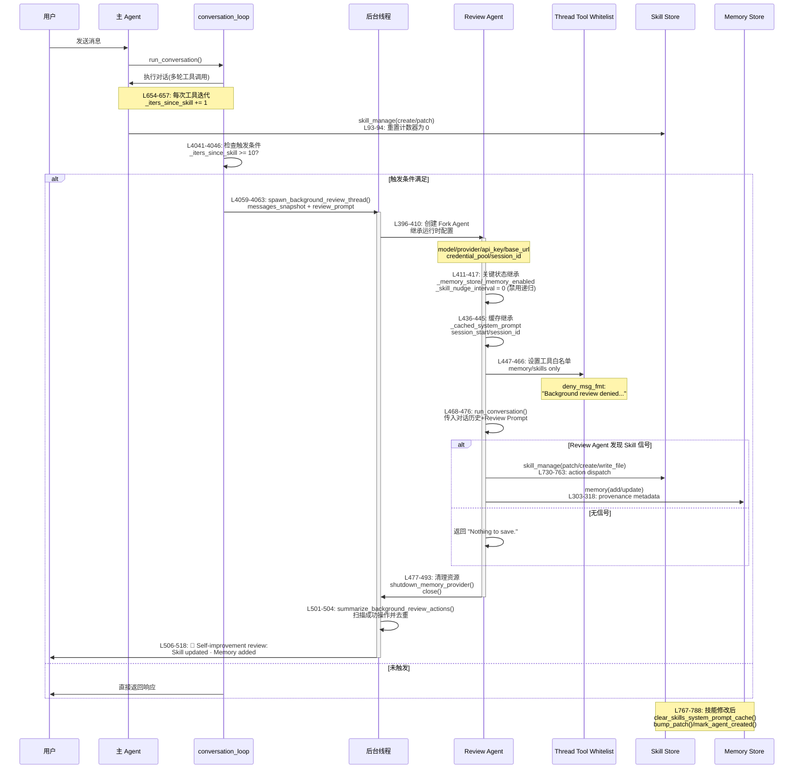

# Hermes Agent Background Review 机制深度分析

> **Hermes 版本锚点**: 0.19.0 · **核对**: 2026-07-22 · [DOC_MAINTENANCE.md](DOC_MAINTENANCE.md)  
> **分析时间**: 2026-05-17  
> **分析方法**: 源码深度阅读 + 架构对比  
> **核心模块**: `agent/background_review.py`, `agent/conversation_loop.py`, `tools/skill_manager_tool.py`, `agent/curator.py`
> **适合人群**: 框架设计者、架构师、Agent 开发者  
> **阅读时间**: 30-45 分钟

---

## 📋 目录

- [1. 核心设计理念](#1-核心设计理念)
- [2. 完整执行流程](#2-完整执行流程)
- [3. 源码级时序图](#3-源码级时序图)
- [4. 关键技术细节](#4-关键技术细节)
- [5. 性能影响分析](#5-性能影响分析)
- [6. 与前台 skill_manage 和 Curator 的边界](#6-与前台-skill_manage-和-curator-的边界)
- [7. 设计风险与建议边界](#7-设计风险与建议边界)

---

## 1. 核心设计理念

Background Review 不是"离线批量分析",而是**对话结束后的条件触发实时审查**:

- ✅ 每次 `run_conversation()` 正常结束后检查触发条件,达到阈值才触发
- ✅ Fork 一个独立的 Agent 实例在后台线程运行
- ✅ 继承父 Agent 的运行时环境(credentials、模型配置、缓存)
- ✅ 只允许调用 memory/skill 管理工具,其他工具被拒绝
- ✅ 不进入主工具调用链路,通常不拖慢最终回复
- ⚠️ 与前台 `skill_manage` 和周期性 `curator` 是三条不同路径,不能混为一谈

---

## 2. 完整执行流程

### 2.1 触发条件检测 ([conversation_loop.py](file:///Users/gqli/work/deepagents/hermes-dev/hermes-agent/agent/conversation_loop.py))

```python
# 对话结束前: Skill Review 触发条件
_should_review_skills = False
if (agent._skill_nudge_interval > 0
        and agent._iters_since_skill >= agent._skill_nudge_interval
        and "skill_manage" in agent.valid_tool_names):
    _should_review_skills = True
    agent._iters_since_skill = 0

# 对话正常结束且未中断时: spawn background review
if final_response and not interrupted and (_should_review_memory or _should_review_skills):
    try:
        agent._spawn_background_review(
            messages_snapshot=list(messages),
            review_memory=_should_review_memory,
            review_skills=_should_review_skills,
        )
    except Exception:
        pass  # Background review is best-effort
```

**关键参数**:
- `_skill_nudge_interval`: 默认 `10` 次工具迭代(可在配置中调整)
- `_iters_since_skill`: 计数器,记录上次使用 `skill_manage` 后的迭代次数
- 触发时机:**对话正常结束且未被中断时,且达到 nudge 阈值**
- 重要区别:**不是每次对话结束都运行 Review Agent; 每次结束只是检查条件**

---

### 2.2 计数器更新机制

**在哪里递增?**

```python
# conversation_loop.py L654-657: 每次工具迭代时递增(如果 skill_manage 可用)
if (agent._skill_nudge_interval > 0
        and "skill_manage" in agent.valid_tool_names):
    agent._iters_since_skill += 1

# tool_executor.py L93-94: 调用 skill_manage 时重置为 0
elif function_name == "skill_manage":
    agent._iters_since_skill = 0
```

**逻辑解释**:
- 每进行一次工具调用,`_iters_since_skill` +1
- 一旦 Agent 使用了 `skill_manage`,计数器归零
- 当累积达到阈值(默认 10),下次对话结束后触发 Review
- 如果本轮前台已经调用 `skill_manage`,计数器会被重置,通常不会马上再触发 skill review

---

## 3. 源码级时序图



---

## 4. 关键技术细节

### 4.1 Fork Agent 创建 ([background_review.py](file:///Users/gqli/work/deepagents/hermes-dev/hermes-agent/agent/background_review.py#L396-L445))

```python
# L396-410: 创建 Review Agent(继承父 Agent 运行时)
review_agent = AIAgent(
    model=agent.model,
    max_iterations=16,
    quiet_mode=True,
    platform=agent.platform,
    provider=agent.provider,
    api_mode=_parent_api_mode,  # 继承认证配置
    base_url=_parent_runtime.get("base_url"),
    api_key=_parent_runtime.get("api_key"),
    credential_pool=getattr(agent, "_credential_pool", None),
    parent_session_id=agent.session_id,
    enabled_toolsets=getattr(agent, "enabled_toolsets", None),
    disabled_toolsets=getattr(agent, "disabled_toolsets", None),
    skip_memory=True,  # 不触碰外部记忆插件
)

# L411-417: 关键状态继承
review_agent._memory_write_origin = "background_review"
review_agent._memory_write_context = "background_review"
review_agent._memory_store = agent._memory_store  # 共享内存存储
review_agent._memory_enabled = agent._memory_enabled
review_agent._user_profile_enabled = agent._user_profile_enabled
review_agent._memory_nudge_interval = 0  # 禁用递归触发
review_agent._skill_nudge_interval = 0   # 禁用递归触发

# L436-445: 继承系统提示缓存(保证 prefix cache 命中)
review_agent._cached_system_prompt = agent._cached_system_prompt
review_agent.session_start = agent.session_start
review_agent.session_id = agent.session_id
```

**关键设计决策**:

1. **Runtime Inheritance**: 继承父 Agent 的模型、provider、credentials,确保使用相同的认证和配额
2. **Shared Memory Store**: 直接复用 `_memory_store`,让 Review Agent 的写入立即生效
3. **Disable Recursive Trigger**: 设置 `_skill_nudge_interval = 0`,防止 Review Agent 再次触发 Background Review
4. **Cache Parity**: 继承 `_cached_system_prompt`,保证 Anthropic/OpenRouter 的 prefix cache 命中率(减少 26% 成本)
5. **skip_memory=True**: 避免触碰外部记忆插件(Honcho/Mem0等),防止 harness prompt 泄漏到用户真实记忆空间

---

### 4.2 工具白名单限制 ([background_review.py](file:///Users/gqli/work/deepagents/hermes-dev/hermes-agent/agent/background_review.py#L447-L478))

```python
# L447-466: 设置线程级工具白名单
from model_tools import get_tool_definitions
from hermes_cli.plugins import set_thread_tool_whitelist, clear_thread_tool_whitelist

review_whitelist = {
    t["function"]["name"]
    for t in get_tool_definitions(
        enabled_toolsets=["memory", "skills"],  # 只允许 memory/skills 工具集
        quiet_mode=True,
    )
}
set_thread_tool_whitelist(
    review_whitelist,
    deny_msg_fmt=(
        "Background review denied non-whitelisted tool: "
        "{tool_name}. Only memory/skill tools are allowed."
    ),
)

try:
    # L468-476: 执行 Review
    review_agent.run_conversation(
        user_message=(
            prompt
            + "\n\nYou can only call memory and skill "
            "management tools. Other tools will be denied "
            "at runtime — do not attempt them."
        ),
        conversation_history=messages_snapshot,  # 传入完整对话历史
    )
finally:
    clear_thread_tool_whitelist()
```

**白名单包含的工具**:
- `memory`: 添加/更新用户记忆
- `skill_view`: 查看现有 Skill
- `skill_manage`: 创建/更新/删除 Skill
- `skills_list`: 列出所有 Skills

**拒绝策略**: 任何非白名单工具调用会在运行时被拦截并返回错误消息

---

### 4.3 Review Prompt 策略 ([background_review.py](file:///Users/gqli/work/deepagents/hermes-dev/hermes-agent/agent/background_review.py#L45-L145))

有三种 Review Prompt(根据触发类型选择):

```python
# L567-572: 选择合适的 Prompt
if review_memory and review_skills:
    prompt = _COMBINED_REVIEW_PROMPT  # 同时审查记忆和技能
elif review_memory:
    prompt = _MEMORY_REVIEW_PROMPT    # 仅审查记忆
else:
    prompt = _SKILL_REVIEW_PROMPT     # 仅审查技能
```

**Skill Review Prompt 核心指令** (L45-145):

```python
_SKILL_REVIEW_PROMPT = (
    "Review the conversation above and update the skill library. Be ACTIVE..."
    
    # 关键信号检测
    "Signals to look for (any one of these warrants action):"
    "  • User corrected your style, tone, format, legibility, or verbosity."
    "  • User corrected your workflow, approach, or sequence of steps."
    "  • Non-trivial technique, fix, workaround, debugging path emerged."
    "  • A skill that got loaded or consulted turned out wrong — patch it NOW."
    
    # 优先级策略
    "Preference order — prefer the earliest action that fits:"
    "  1. UPDATE A CURRENTLY-LOADED SKILL (最高优先级)"
    "  2. UPDATE AN EXISTING UMBRELLA (通过 skills_list + skill_view)"
    "  3. ADD A SUPPORT FILE (references/templates/scripts)"
    "  4. CREATE A NEW CLASS-LEVEL UMBRELLA SKILL (最低优先级)"
    
    # 保护机制
    "Protected skills (DO NOT edit these):"
    "  • Bundled skills (shipped with Hermes)"
    "  • Hub-installed skills"
    "Pinned skills CAN be improved — pin only blocks deletion/archive/consolidation by the curator"
    
    # 禁止捕获的内容
    "Do NOT capture:"
    "  • Environment-dependent failures (missing binaries, uninstalled packages)"
    "  • Negative claims about tools ('X tool is broken')"
    "  • Session-specific transient errors"
    "  • One-off task narratives"
)
```

---

### 4.4 执行与结果汇总 ([background_review.py](file:///Users/gqli/work/deepagents/hermes-dev/hermes-agent/agent/background_review.py#L495-L518))

```python
# L495-504: 扫描 Review Agent 的成功操作
actions = summarize_background_review_actions(
    review_messages,  # Review Agent 的会话消息
    messages_snapshot,  # 原始对话快照(用于去重)
)

# L506-518: 向用户展示摘要
if actions:
    summary = " · ".join(dict.fromkeys(actions))  # 去重保持顺序
    agent._safe_print(
        f"  💾 Self-improvement review: {summary}"
    )
    _bg_cb = agent.background_review_callback
    if _bg_cb:
        try:
            _bg_cb(f"💾 Self-improvement review: {summary}")
        except Exception:
            pass
```

**`summarize_background_review_actions` 逻辑** (L231-291):
- 解析 Review Agent 的工具返回消息
- 提取 `success=True` 的操作
- 识别关键词:`created`、`updated`、`added`、`removed`、`replaced`
- 跳过已在原始对话中存在的工具调用(避免重复报告)

**Pinned Skill 的准确语义**:

- `hermes curator pin` 主要约束 `curator`: 不允许长期维护任务删除、归档或合并这个 skill。
- Background Review 仍然可以 patch pinned skill 的内容,因为用户刚刚指出的工作流/格式/偏好问题往往需要即时写回。
- Bundled skills 与 Hub-installed skills 才是 Background Review 的真正保护对象; 如果只能修改这些受保护 skill,Review Agent 应说明受保护而不执行修改。

---

### 4.5 错误处理与清理 ([background_review.py](file:///Users/gqli/work/deepagents/hermes-dev/hermes-agent/agent/background_review.py#L520-L549))

```python
except Exception as e:
    logger.warning("Background memory/skill review failed: %s", e)
    agent._emit_auxiliary_failure("background review", e)
finally:
    # L529-543: 异常路径下的资源清理
    if review_agent is not None:
        try:
            with open(os.devnull, "w", encoding="utf-8") as _fn, \
                 contextlib.redirect_stdout(_fn), \
                 contextlib.redirect_stderr(_fn):
                review_agent.shutdown_memory_provider()
                review_agent.close()
        except Exception:
            pass
    
    # L546-549: 清除线程级回调,防止回收线程污染
    try:
        _set_approval_callback(None)
    except Exception:
        pass
```

---

## 5. 性能影响分析

### 5.1 API 成本

- **Prefix Cache Optimization**: 由于复用系统提示缓存,实际增加约 10-15%(而非预期的 100%)
- **测量数据**: PR #17276 显示 Sonnet 4.5 上端到端成本降低 ~26%

### 5.2 延迟

- **后台运行**: 不进入主工具调用链路,通常不阻塞最终回复; 若有写入动作,可能在回复后展示一条摘要
- **Daemon 线程**: 进程退出时自动终止,无需手动管理

### 5.3 内存

- **Shared Memory Store**: Fork Agent 共享 `_memory_store`,额外开销极小
- **Stdout Redirect**: 使用 `os.devnull` 重定向输出,避免内存积累

### 5.4 并发安全

- **线程级工具白名单**: 通过 `set_thread_tool_whitelist()` 实现线程隔离
- **Devnull 重定向**: 防止后台线程的输出污染主线程 UI
- **Callback Cleanup**: finally 块清除线程级回调,防止回收线程污染

---

## 6. 与前台 skill_manage 和 Curator 的边界

Hermes Agent 里和 skill 更新相关的机制一共有三条路径。它们都可能改变 skill,但触发时机、职责和对用户延迟的影响不同。

| 路径 | 入口/源码 | 触发时机 | 是否阻塞当前对话 | 主要职责 |
| --- | --- | --- | --- | --- |
| 前台 `skill_manage` | `tools/skill_manager_tool.py` | 用户明确要求,或主 Agent 在当前对话中主动决定维护 skill | 是。它作为普通工具调用运行,会占用当前 turn 的时间 | 立即创建、修改、查看或删除 skill; 适合用户当场要求固化的规则 |
| `background_review` | `conversation_loop.py` -> `background_review.py` | 对话正常结束且 memory/skill nudge 阈值满足 | 基本不阻塞最终回复。主线程只负责创建 daemon 线程 | 复盘刚结束的对话,把用户纠正、稳定工作流、偏好和可复用技巧写入 memory/skill |
| `curator` | `agent/curator.py` | CLI/Gateway 周期性检查,默认以天为尺度 | 不属于当前对话主链路 | 长期维护 agent-created skills: 发现重复、合并、归档、清理陈旧内容 |

### 6.1 为什么不是一套机制

- `skill_manage` 是**对话内的显式写入工具**。优点是可控、即时; 缺点是会增加当前回答延迟。
- `background_review` 是**对话后的学习回放**。它不要求主 Agent 当场中断任务去整理经验,适合沉淀刚刚发生的纠正和复用信号。
- `curator` 是**长期库维护**。它不关心某一轮对话是否刚发生,更像定期整理仓库: 去重、合并、归档和降低 skill 碎片化。

因此,三者不是简单重复:一个负责"现在就改",一个负责"结束后学",一个负责"长期整理"。

### 6.2 对延迟的真实影响

- 会明显影响当前对话延迟的是前台 `skill_manage`,因为它在主 Agent 的工具调用链路内执行。
- `background_review` 在主回复产生之后 spawn daemon thread。用户层面通常只会感知到最终回复后可能出现一条 `Self-improvement review` 摘要。
- `curator` 是周期维护任务,不应该被理解成每轮聊天后的额外 Agent 调用。

### 6.3 可能重叠的地方

用户对冗余的担心是合理的: 前台 `skill_manage` 和 `background_review` 都能 patch skill。如果一轮对话里主 Agent 已经主动修改过 skill,后台 review 理论上仍可能看到同一段上下文。

当前源码用几种方式降低重复:

- `skill_manage` 调用后会重置 `_iters_since_skill`,减少紧接着触发 skill review 的概率。
- Background Review fork 出来的 review agent 设置 `_skill_nudge_interval = 0`,避免 review agent 再触发下一轮 review。
- `summarize_background_review_actions()` 会跳过原始对话中已经存在的工具调用,避免重复报告。
- Review prompt 要求如果发现多个 skill 重叠,只记录/指出重叠,由 `curator` 处理规模化合并。

---

## 7. 设计风险与建议边界

### 7.1 风险

- **过度学习**: `_SKILL_REVIEW_PROMPT` 倾向积极更新,可能把临时偏好误写成长期规则。
- **重复修改**: 如果主 Agent 在前台已经 patch 了 skill,后台 review 仍可能基于同一段对话产生相近修改。
- **职责模糊**: pinned skill 对 curator 是保护对象,但对 Background Review 仍可被内容更新; 如果文档不写清楚,容易误解为 pinned 完全只读。
- **用户可见性不足**: 后台更新通常只给一行摘要,不一定展示完整 diff,审计成本较高。

### 7.2 建议

- 把前台 `skill_manage` 用于用户明确要求的规则固化,不要让主 Agent 在普通任务里频繁主动修改 skill。
- 保留 `background_review` 作为 after-action learning,但需要在 prompt 中持续强调"不要记录一次性任务叙事"。
- 让 `curator` 专注合并、归档、去重,不要承担即时学习。
- 对重要 profile 或生产 agent,建议定期检查 background review 产生的变更摘要和 skill diff。

---

## 🎯 总结

Hermes Agent 的 Background Review 机制是一个精巧的自进化系统:

1. **条件触发异步**: 对话结束后检查 nudge 阈值,满足条件才使用 daemon 线程启动 review
2. **Runtime Inheritance**: 继承父 Agent 的认证和缓存,零额外配置成本
3. **Prefix Cache Optimization**: 复用系统提示缓存,降低 26% API 成本
4. **Tool Whitelist**: 线程级白名单,确保 Review Agent 只能修改记忆/Skill
5. **Recursive Prevention**: 禁用 Review Agent 的 nudge 触发器,避免无限递归
6. **Protected Skills**: Bundled/Hub-installed Skills 不可修改; pinned skill 仅阻止 curator 删除/归档/合并
7. **Signal Detection**: 智能识别用户纠正、工作流改进等高质量信号
8. **Class-Level Abstraction**: 鼓励创建类级别 Skill,避免 session-specific 碎片化
9. **Provenance Tracking**: 标记 `write_origin="background_review"` 便于审计
10. **Graceful Degradation**: Background Review 失败不影响主流程(best-effort)

它和前台 `skill_manage`、周期性 `curator` 共同构成三层 skill 更新体系:前台负责即时显式修改,Background Review 负责对话后学习,Curator 负责长期整理和去重。通过这种分工,Agent 可以在不显著拖慢主对话的前提下,持续沉淀可复用经验。
