# CLI / Gateway 与其它入口（Canonical）

> **文档状态**: Canonical（合并版 · 勿再拆平行文档）  
> **合并日期**: 2026-08-03 · [DOC_MAINTENANCE.md](DOC_MAINTENANCE.md)  
> **来源**: `CLI_SYSTEM.md` + `GATEWAY_SYSTEM.md`（含原 COMPLETE Part）去重收敛；**2026-08-03 补全入口地图**  
> **Hermes 版本锚点**: 0.19.0  
> **相关**: [HITL_APPROVAL_FLOW.md](HITL_APPROVAL_FLOW.md) · [SURFACE_ARCHITECTURE.md](SURFACE_ARCHITECTURE.md) · [AGENT_LOOP_ARCHITECTURE.md](AGENT_LOOP_ARCHITECTURE.md) · [ARCHITECTURE.md](ARCHITECTURE.md)  
> **源码**: `cli.py` · `hermes_cli/` · `gateway/run.py` · `gateway/platforms/` · `acp_adapter/` · `cron/` · `tui_gateway/` · `hermes_cli/web_server.py`

旧路径 [`CLI_SYSTEM.md`](CLI_SYSTEM.md) / [`GATEWAY_SYSTEM.md`](GATEWAY_SYSTEM.md) 仅为跳转 stub。

**文档职责**：入口层「谁把输入送进 `AIAgent`、谁把结果送出」。本文 **深写 CLI + Gateway IM**；其余入口给对照表 + 链出（避免与 SURFACE / ARCHITECTURE 再复制一遍）。

---

## 目录

0. [一句话](#0-一句话) · [全入口地图](#01-全入口地图不止-cli--gateway)
1. [启动与线程模型（CLI / Gateway）](#1-启动与线程模型cli--gateway-深写)
2. [共享内核](#2-共享内核)
3. [CLI](#3-cli入口tui-session)
4. [Gateway 深写：启动 · 实体 · 入站 · 出站](#4-gateway-深写启动--实体--入站--出站)
5. [Cron + ACP](#5-cron--acp)
6. [Kanban worker](#6-kanban-worker)
7. [认证 / Token 锁 / 部署](#7-认证--token-锁--部署)
8. [命令面速查](#8-命令面速查)
9. [与其它文档的边界](#9-与其它文档的边界)
10. [源码锚点](#10-源码锚点)

---

## 0. 一句话

**同一 `AIAgent.run_conversation`；入口只负责 I/O 与身份。** CLI / Gateway 是最常见的两条人机面，但不是全部。

---

## 0.1 全入口地图（不止 CLI / Gateway）

分层（与 [ARCHITECTURE.md](ARCHITECTURE.md) 一致）：

```text
Surface（怎么看）     CLI · Ink TUI · Desktop · WebUI/Dashboard
协议桥               tui_gateway（WS 事件）
入口（怎么进 Agent）  Gateway IM · Cron · ACP · hermes serve · Kanban worker · Batch…
内核                 AIAgent / conversation_loop / tools
```

| 入口 | 用户怎么启动 | Agent 怎么跑 | 和 CLI/GW 的差别 | 详情 |
|------|--------------|--------------|------------------|------|
| **CLI / prompt_toolkit** | `hermes` / `hermes chat` | 每轮 **`threading.Thread`** | 本机 TUI；HITL=`Queue` | 本文 §1.2 · §3 |
| **Gateway IM** | `hermes gateway run` | asyncio + **`run_in_executor`** | 多会话；HITL=`Event` + `/approve` | 本文 §1.3 · §4 |
| **Cron** | `hermes cron …`；到期由调度器拉起 | **新 AIAgent** 或 no_agent 脚本 → 路径 B 投递 | 无 REPL；`cron_mode` HITL | **本文 §5.1** |
| **ACP（IDE）** | `hermes acp` | `ThreadPoolExecutor` → `run_conversation` | 编辑器协议会话 | **本文 §5.2** |
| **Kanban worker** | dispatcher spawn | **子进程** `chat -q` | 每任务独立进程/profile | **本文 §6** |
| **hermes serve / Dashboard** | `hermes serve` / `hermes dashboard` | HTTP+WS → 仍落到 Agent callbacks | WebUI 呈现；可嵌 TUI | [SURFACE](SURFACE_ARCHITECTURE.md) · `web_server.py` |
| **tui_gateway** | Dashboard `--tui` / Desktop 连本地桥 | WS：`reasoning.delta` / `tool.*` / `skin.changed` | **不是**又一个 IM adapter；是 Surface 事件桥 | [SURFACE §3](SURFACE_ARCHITECTURE.md) |
| **Desktop SSH** | Electron → SSH → 远程 `hermes serve --ssh-session-token-file` | 远程 serve 上的 Agent | 第三种连接模式（local / cloud / SSH） | [SURFACE §7](SURFACE_ARCHITECTURE.md) |
| **Batch / RL** | `batch_runner.py` / `rl_cli.py` | 批量轨迹 | 评测/训练，非日常对话 | ARCHITECTURE §10 |
| **Webhook / hooks** | `hermes webhook` / shell hooks | 事件触发后再进 Agent 或脚本 | 外围自动化 | `hermes_cli` 子命令 |

```text
                    ┌──────────── Surface ────────────┐
                    │ CLI │ Ink │ Desktop │ WebUI     │
                    └───────┬───────────┬─────────────┘
                            │           │
                      prompt_toolkit  tui_gateway WS
                            │           │
         ┌──────────────────┼───────────┼──────────────────┐
         ▼                  ▼           ▼                  ▼
      CLI chat          Gateway IM   serve/ACP          Cron / Kanban
         │                  │           │                  │
         └──────────────────┴─────► AIAgent.run_conversation
```

**容易混的三点：**

1. **Gateway IM** ≠ **tui_gateway**：前者是 Telegram 等消息网关；后者是 TUI/Desktop 的 WS 桥。  
2. **`hermes chat -q`**（无 TTY / Kanban）仍是 CLI 入口族，但是 **headless**：没有 PT 主线程审批面板，HITL 行为按非交互规则（常 deny / cron_mode）。  
3. **呈现 Surface** 可以换皮；**入口**决定 cwd、鉴权、投递与线程模型。

下面 §1–§3 写 CLI；**§4 深写 Gateway**；**§5 Cron+ACP**；**§6 Kanban**。

---

## 0.2 CLI vs Gateway IM（深写对照）

| | **CLI / TUI** | **Gateway IM** |
|--|---------------|----------------|
| 进程寿命 | 用户开终端会话 | 7×24 长驻 |
| 主循环 | **主线程** `prompt_toolkit` | **asyncio**（`GatewayRunner.start`） |
| Agent 跑在哪 | **`threading.Thread(daemon=True)`** | **`run_in_executor` 工作线程** |
| 并发 | 单交互会话为主 | 多 `session_key` 并行 |
| 身份 | 本地用户 | allowlist / DM pairing |
| 工作目录 | 当前 cwd | 常 `MESSAGING_CWD` |
| HITL | Agent 线程 `Queue.get`；主线程 `put` | 工作线程 `Event.wait`；IM `/approve` |
| System prompt | `_cached_system_prompt` + SessionDB | 另加 **Agent 实例 LRU** |

HITL **不**重建 system prompt。详见 [HITL_APPROVAL_FLOW.md](HITL_APPROVAL_FLOW.md)。

---

## 1. 启动与线程模型（CLI / Gateway 深写）

### 1.1 总图

```text
┌─────────────────────────── 进程 ───────────────────────────┐
│                                                            │
│  CLI 模式                        Gateway 模式              │
│  ────────                        ────────────              │
│  主线程: prompt_toolkit          主线程/服务: asyncio.run  │
│       │ 画屏 / 键盘 / put             │ GatewayRunner.start │
│       │                               │ 适配器 polling/WS  │
│       ▼                               ▼                    │
│  Agent 线程 (Thread)             executor 工作线程         │
│  run_agent()                     run_sync()                │
│    → run_conversation            → run_conversation        │
│    → tools / HITL get()          → tools / HITL Event.wait │
│                                                            │
│  （都不是子进程；agent loop 也不是协程）                    │
│  ※ Kanban worker / 部分 cron 是「另起进程」再进 CLI 族      │
└────────────────────────────────────────────────────────────┘
```

| 问题 | 答案 |
|------|------|
| Agent loop 是主线程吗？ | **否**（CLI 与 Gateway 皆否） |
| 子线程 / 协程 / 进程？ | 这两条入口里是 **OS 线程**。`run_conversation` 同步。Kanban/部分作业才是 **子进程** |
| 为何单独线程？ | UI/IM 事件循环不能被 LLM/tool/HITL 阻塞 |

### 1.2 CLI 启动链

```text
hermes / hermes chat
  → hermes_cli 分发 → cli.py InteractiveCLI / ChatConsole
  → prompt_toolkit Application 在主线程跑
  → 用户提交一轮消息
       → def run_agent():                 # 闭包，跑在新线程
             set_approval_callback(...)   # threading.local，必须在本线程设
             set_current_session_key(...)
             agent.run_conversation(...)
       → agent_thread = threading.Thread(target=run_agent, daemon=True)
       → agent_thread.start()
       → 主线程 while agent_thread.is_alive():
             盯 _interrupt_queue（/ 新消息打断）
             审批面板仍由主线程收键 → Queue.put
```

要点（`cli.py`）：

- **daemon=True**：关终端时主线程退出即可收割，避免 agent 拖死进程。
- 审批 / sudo / secret 回调用 **`threading.local()`**：主线程 `set_*` 对 agent 线程不可见，故在 `run_agent()` **内**再 `set_approval_callback`。
- HITL：agent 线程 `response_queue.get()` 阻塞；主线程 `_handle_approval_selection` → `put(choice)`。  
  **继续 loop = 当前 tool 返回**，不是另起 agent、也不重建 prompt。

### 1.3 Gateway 启动链

```text
hermes gateway run  （或 systemd / docker）
  → asyncio.run(start_gateway()) 或等价入口
  → GatewayRunner.start()
       · 绑定 _gateway_loop = get_running_loop()
       · 装 faulthandler / liveness
       · 启动各 PlatformAdapter（Telegram/…）
       · adapter.set_message_handler(self._handle_message)
  → 入站消息
       → _handle_message (async，事件循环上)
       → _handle_message_with_agent
       → await _run_in_executor_with_context(run_sync)
            def run_sync():
                agent = _get_or_create_agent(session_key)  # LRU
                return agent.run_conversation(...)
```

要点（`gateway/run.py`）：

- **事件循环线程**只做 I/O、鉴权、投递编排；**禁止**在 loop 上同步跑完整 `run_conversation`。
- Agent 在 **默认 executor 的工作线程**里跑（仍是线程，不是 `multiprocessing`）。
- 同 session 尽量 **复用缓存的 `AIAgent`**，保护 prefix cache / memory / skills 扫描。
- HITL：工作线程 `Event.wait`；用户 IM `/approve` → `resolve_gateway_approval` → `event.set()`。无 notify 时走 pending。见 HITL §6–§7。

启动时序（进程起来 → 可收消息）：

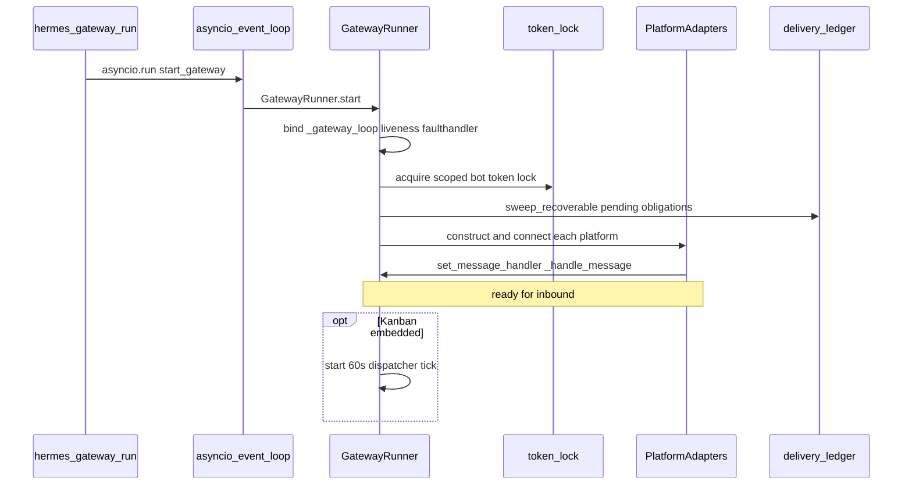

细节步骤、实体、入/出站见 **§4**。Cron / ACP / Kanban 见 **§5–§6**（不再用「一笔带过」）。

### 1.4 子 Agent（对照，非入口）

`delegate_task` 在**当前入口进程内**再开线程池工人跑 **新的** `AIAgent`（one-shot）。见 [MULTI_AGENT_ARCHITECTURE.md](MULTI_AGENT_ARCHITECTURE.md)。

---

## 2. 共享内核

两边最终都进：

```text
AIAgent.run_conversation
  → conversation_loop（LLM ↔ tools）
  → tool_executor / terminal / approval gate
  → SessionDB 增量落盘
```

| 能力 | 文档 |
|------|------|
| Agent 循环细节 | [AGENT_LOOP_ARCHITECTURE.md](AGENT_LOOP_ARCHITECTURE.md) |
| System / ephemeral prompt | [PROMPT_SYSTEM_ARCHITECTURE.md](PROMPT_SYSTEM_ARCHITECTURE.md) |
| Memory 冻结与压缩重建 prompt | [MEMORY_SYSTEM.md](MEMORY_SYSTEM.md)（HITL **不**触发重建） |
| 危险命令审批 | [HITL_APPROVAL_FLOW.md](HITL_APPROVAL_FLOW.md) |
| Skin / 流式 / Desktop WS | [SURFACE_ARCHITECTURE.md](SURFACE_ARCHITECTURE.md) |

---

## 3. CLI：入口、TUI、Session

### 3.1 分层（简）

```text
用户: hermes | hermes <subcommand>
  → hermes_cli/main.py 分发
  → commands / config / profiles
  → 交互: cli.py + Rich + prompt_toolkit + skin
  → AIAgent
```

技术栈：Typer/argparse 子命令面 + Rich + prompt_toolkit；推理流式与 Skin 以 SURFACE 为准。

### 3.2 Profile / 配置

- Profile：`hermes_cli/profiles.py`；隔离 skills / plugins / cron / memories。
- 配置优先级：环境变量 / `.env` → `~/.hermes/config.yaml`（及 profile 覆盖）→ 默认值。
- `.env`：API keys、gateway tokens、memory provider 等。

### 3.3 Slash 与子命令

- **进程外**：`hermes gateway|skills|model|doctor|sessions|…`
- **会话内**：`/model` `/yolo` `/new` `/approve`（Gateway）等——完整表以 `hermes_cli/commands.py` 为准。

### 3.4 Session

- CLI 持有 `session_id`；Agent 侧 `_flush_messages_to_session_db` 增量写。
- 多终端 = 多进程多 session；`hermes sessions` 列表/恢复。
- `/new`：新 session + 常 `invalidate_system_prompt`（与 HITL 无关）。

### 3.5 TUI ↔ ReAct

```text
用户输入
  → 启 agent_thread → run_conversation
  → tool_progress / stream_delta 回调回主线程画 Spinner / 流式
  → 结束 → 主线程展示 final_response、落盘
```

会话内复用 `_cached_system_prompt`；压缩/`/new` 才重建。

### 3.6 SOUL.md

人设在 prompt 构建路径；写法见 Prompt / Memory。CLI 提供编辑与 profile 隔离入口。

---

## 4. Gateway 深写：启动 · 实体 · 入站 · 出站

### 4.0 启动流程（类构造 + 时序）

分两段：**构造**（同步，拿到对象图）与 **`start()`**（async，接上平台）。

#### 4.0.1 构造阶段时序

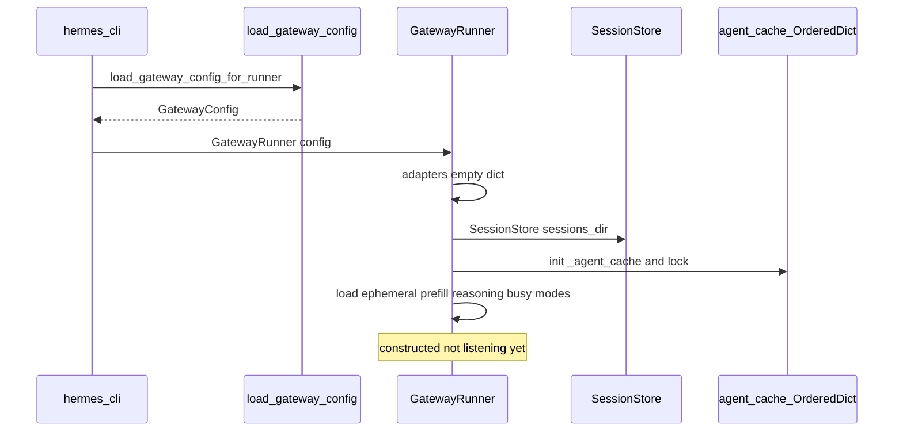

#### 4.0.2 `start()` → 可收消息时序

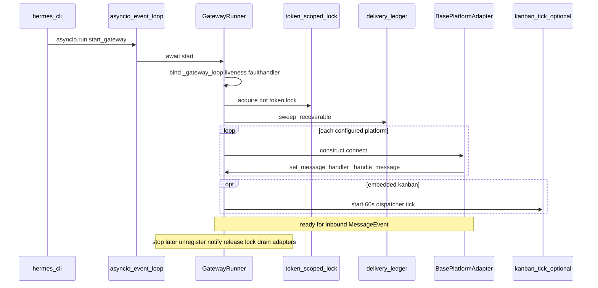

#### 4.0.3 步骤对照（与上图一一对应）

| 步 | 动作 |
|----|------|
| 1 | `load_gateway_config_for_runner` → `GatewayConfig` |
| 2 | `GatewayRunner(config)`：adapters / session_store / `_agent_cache` |
| 3 | `await start()`：绑定 loop、liveness、faulthandler |
| 4 | token scoped lock |
| 5 | `delivery_ledger.sweep_recoverable` |
| 6 | 构造并 connect 各 `BasePlatformAdapter` |
| 7 | `set_message_handler(_handle_message)` |
| 8 | 可选 Kanban 60s tick（§6） |
| 9 | 运行至 stop：释锁、unregister 审批 notify、停 adapter、drain |

---

### 4.1 实体设计与引用关系（类图）

#### 4.1.1 核心类图

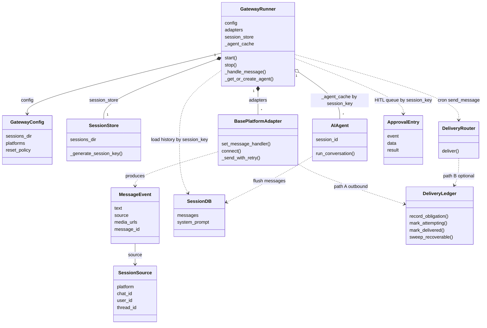

#### 4.1.2 运行时对象引用（谁指向谁）

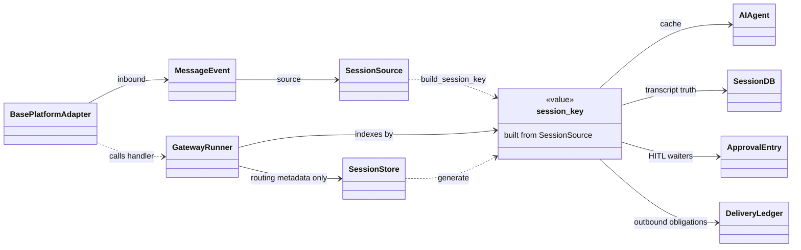

`sessions.json` / SessionStore ≠ transcript；正文只在 SessionDB。

#### 4.1.3 职责表

| 实体 | 定义位置 | 职责 |
|------|----------|------|
| `GatewayConfig` | gateway 配置加载 | sessions_dir、平台凭证、reset 策略 |
| `GatewayRunner` | `gateway/run.py` | 总控：adapter、缓存、鉴权、slash、kanban mixin |
| `BasePlatformAdapter` | `platforms/base.py` | 平台 I/O；归一化入站；路径 A 发送 |
| `MessageEvent` | `platforms/base.py` | 入站归一化 |
| `SessionSource` | 同上 | 平台身份坐标 |
| `session_key` | `build_session_key` / SessionStore | 缓存与隔离主键 |
| `SessionStore` | `gateway/session.py` | 路由/元数据；**不是** messages 权威库 |
| `SessionDB` | `hermes_state.py` | **对话正文** + system_prompt |
| `AIAgent` | `_get_or_create_agent` | 按 key LRU |
| `DeliveryRouter` | `gateway/delivery.py` | 路径 B |
| `delivery_ledger` | `delivery_ledger.py` | 出站义务状态机 |
| `_ApprovalEntry` | `tools/approval.py` | 阻塞式 HITL |

**引用不变量：**

1. Adapter **不**直接持有 Agent；只调 Runner handler，拿回 `final_response` 再 send。  
2. `run_conversation` **不**负责平台 send（路径 A）。  
3. 历史：**Gateway 侧加载**后注入 Agent。  
4. `sessions.json` ≠ transcript；transcript 在 **SessionDB**。

#### 4.1.4 `_message_handler` 详解 · 频繁消息 / 排队 / 插队

**是什么**

```text
Adapter._message_handler  : Optional[Callable[[MessageEvent], Awaitable[...]]]
  ← GatewayRunner.start 时:
       adapter.set_message_handler(self._handle_message)
```

即指向 **`GatewayRunner._handle_message`**（async）。Adapter **不**实现业务逻辑；它只 `await` 这个回调拿返回字符串再 send。

**谁在什么时候调**

| 场景 | 调用方 | 行为 |
|------|--------|------|
| 会话空闲 | `Adapter._process_message_background` | `response = await _message_handler(event)` → 路径 A send |
| `/approve` `/deny` 等 bypass | `handle_message` 内直接 await | 不进 pending，避免审批死锁 |
| clarify 用户作答 | 同上 | 必须进 Runner 解 `Event.wait` |
| `/stop` `/new` 等 | `_dispatch_active_session_command` | 先打断再派发 |

**同 session 已有进行中的 turn 时（用户连发）**

按 `session_key` 一把 **`_active_sessions` 锁**（存的是 `asyncio.Event`，兼 interrupt 信号）。第二封及以后 **默认不立刻再开第二个 Agent**：

```text
handle_message
  if session_key in _active_sessions:
       1) slash bypass / clarify → 直接再调 _message_handler（特殊插队）
       2) else → _busy_session_handler（Runner）或 Adapter 本地排队
       3) return   # 当前 turn 继续跑
  else:
       _start_session_processing → 后台任务里 await _message_handler
```

配置（`display.busy_input_mode` / env `HERMES_GATEWAY_BUSY_INPUT_MODE`）：

| 模式 | 连发时干什么 |
|------|----------------|
| **`interrupt`（默认）** | 可打断当前 Agent turn，用新消息开新逻辑（具体由 busy handler / interrupt 路径执行）；部分场景会 **降级成 queue**（例如已在 draining、子 Agent 忙等） |
| **`queue`** | **不打断**；跟进消息进 **pending FIFO**（硬帽约 **32**；超限 **丢弃**并打日志） |
| **`steer`** | 尽量把跟进当 mid-turn 转向注入；失败则退回 queue |

Adapter 侧还有：

- **`_pending_messages[session_key]`**：每会话 pending 槽；文本可合并（`merge_text`）或进 Runner 的 FIFO overflow
- **photo 突发**：合并进 pending，**不 interrupt**
- **`busy_text_mode=queue` + debounce 窗**：短时连打字先拼再入队
- **当前 turn 结束后**：drain pending → 再起 `_process_message_background`（**不递归爆栈**，用新 task）

**有没有「插队队列」？**

- **有排队**：同 `session_key` 忙时 → pending / FIFO（queue 模式）；不是无限并发多 Agent。  
- **有条件插队**：`/approve` `/deny`、clarify 回答、`interrupt_then_dispatch` 类 slash（`/stop` `/new`）——必须插到 Runner，否则死锁或命令变用户正文。  
- **默认不是「最新消息永远插到队头开跑」**：queue 模式是 FIFO；interrupt 模式是「打断当前再处理新输入」，不是维护一个可任意插队的优先级队列。  
- **跨 session_key**（不同聊天）：互不影响，可并行（各有自己的 Agent 缓存条目）。

频繁连发时常见现象：

1. 旧 turn 还在跑 → 新消息进 pending 或触发 interrupt（看配置）  
2. queue 帽满 → **后续跟进被丢**  
3. interrupt 后旧 `final_response` 可能被 **抑制**（已有更新 pending 时不发过期回复）  
4. 同一 session **不会**故意双开两个 `run_conversation`（靠 `_active_sessions` 防拆裂）

---

#### 4.1.5 `DeliveryRouter` / `delivery_ledger` 是什么？有没有「消息管理器」？

**有入站总控，但不是这两个名字。**

| 角色 | 谁 | 做什么 |
|------|----|--------|
| **入站分发 / 「App 管理器」** | **`GatewayRunner`**（`_handle_message`） | 鉴权、slash、session、调 Agent、把 `final_response` 交回 Adapter |
| **出站（聊回本聊天）** | **`BasePlatformAdapter`**（路径 A） | handler 返回后 `_send_with_retry` 发到原 `chat_id` |
| **出站（多目标 / cron）** | **`DeliveryRouter`**（路径 B） | 按 `origin` / `home` / `telegram:id` / 本地文件 **解析目标再发** |
| **出站防丢账本** | **`delivery_ledger`** | **不是分发器**；给路径 A 最终回复记 pending→attempting→delivered，崩溃可重投 |

```text
入站:  Platform → Adapter → GatewayRunner._handle_message → Agent
                              ▲
                              └── 这才是「消息进 Agent」的唯一总控

出站 A 聊回:  Runner 返回 final_response → Adapter.send      （Router 不参与）
出站 B 另投:  cron / send_message     → DeliveryRouter.deliver → Adapter(s)
旁路账本:     Adapter send 前后       → delivery_ledger 打点（可关；失败不挡发送）
```

**`DeliveryRouter`**：`gateway/delivery.py` 里的路由工具。解决的是「这句话该发到哪个平台/聊天/文件」，典型调用方是 **cron**、显式多目标投递，不是每条 Telegram 闲聊回程。

**`delivery_ledger`**：`gateway/delivery_ledger.py` 里的 **耐久义务表**（写在 `state.db`）。解决的是「Agent 已经生成了最终回复，进程在 ACK 前挂了 → 用户永远收不到」——记一笔义务，启动时 `sweep_recoverable` 再投（`attempting` 带 recovered 标记，至少一次、不静默重复）。它 **不决定发给谁**，只保证「该发出去的最终回复尽量发出去」。

**为什么没有单独的 `MessageManager` 类？**  
入站编排、会话、Agent 缓存已经压在 `GatewayRunner` 上；出站「回本聊天」留给产生事件的 **同一个 Adapter**（对称、少一层转发）。多目标才抽出 `DeliveryRouter`。账本是横切可靠性，不是第三套分发总线。

---

### 4.2 入站流程（细节）

```text
1. 平台 SDK 回调 / poll
2. Adapter 归一化为 MessageEvent(+ SessionSource)
3. 交给 GatewayRunner._handle_message (async, 事件循环)
4. pre_gateway_dispatch（插件可 skip / rewrite / allow）
5. 鉴权：allowlist / pairing（未授权则 pairing 或拒绝）
6. slash 命令短路（/approve /new /model …）——可能不进 Agent
7. 解析/归一 session_key；忙会话策略（interrupt / queue，配置 busy_*）
8. 加载历史（SessionDB）+ 媒体/视觉预处理
9. register_gateway_notify(session_key)（本轮审批卡片）
10. await executor: run_sync → _get_or_create_agent → run_conversation
11. 得到 dict（含 final_response）返回 Adapter
12. Adapter 走路径 A 出站（§4.3）
```

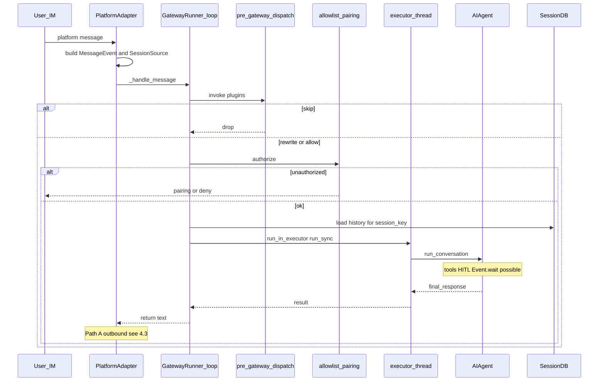

忙会话：同 `session_key` 上已有 in-flight Agent 时，按 `_busy_input_mode` / `_busy_text_mode`（interrupt 注入 / 排队等）处理，避免双开打穿状态。

### 4.3 出站流程（细节）

#### 路径 A — 对话最终回复（最常见）

这里的 **handler** = Gateway 启动时挂上的回调：

```text
adapter.set_message_handler(self._handle_message)
# self = GatewayRunner；即 MessageHandler = GatewayRunner._handle_message
```

Adapter 自己的 `handle_message(event)` 里会：

```text
response = await self._message_handler(event)   # ← 就是上面的 Runner._handle_message
# 返回值通常是最终回复文本（或含媒体标记的字符串）
→ sanitize / 分片 / ledger → _send_with_retry(...)
```

所以「handler 返回之后」= **`GatewayRunner._handle_message`（及其内部 `_handle_message_with_agent` → Agent）已经跑完**，控制权回到 Adapter，再由 Adapter 做路径 A 发送。

```text
Adapter.handle_message
  → await _message_handler(event)     # Runner：鉴权/Agent/… → final_response
  → （handler 返回之后）
       sanitize / 分片 / 解析 MEDIA 标记
       非 ephemeral 且非 slash:
         ledger.record_obligation(pending)
         ledger.mark_attempting
       _send_with_retry(chat_id, content, reply_to, …)
       success → mark_delivered | fail → mark_failed
       可选：图片/文件/语音 API；post_delivery_callback
```

#### 路径 B — DeliveryRouter

```text
cron / send_message / 显式多目标
  → DeliveryRouter.deliver(content, targets)
  → origin | home | platform:id | local file
  → 一般不走「当前 chat 的 Adapter 回程」同一条栈
```

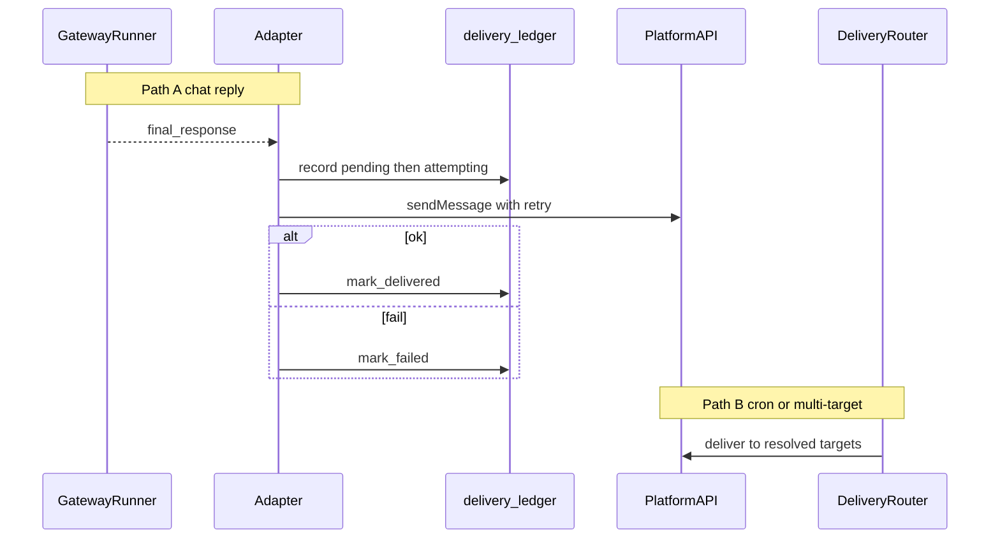

#### 账本状态（重启可恢复）

| 状态 | 含义 |
|------|------|
| `pending` | 未 send → 可重投 |
| `attempting` | 发送中 → 重投带 recovered 标记 |
| `delivered` / `failed` / `abandoned` | 终态或毒丸 |

账本失败 **不得** 阻塞真实发送。启动 `sweep_recoverable()`。

### 4.4 Agent 缓存

```text
_agent_cache: OrderedDict[session_key → (AIAgent, config_signature)]
命中且 signature 未变 → 复用
配置变 / LRU 满 / idle TTL → evict 或新建
```

### 4.5 `tui_gateway` / Desktop（并列，非 IM）

WS 事件桥 + Desktop/SSH serve。见 [SURFACE_ARCHITECTURE.md](SURFACE_ARCHITECTURE.md)。

---

## 5. Cron + ACP

### 5.1 Cron

**入口**：`hermes cron …` 调度；到期调用 `cron/scheduler.py::run_job`。

```text
tick / 手动触发
  → run_job(job)
       · no_agent：只跑脚本，stdout 投递或静默（不建 AIAgent）
       · 否则：new AIAgent(…) → thread pool 跑 run_conversation(prompt)
  → _deliver_result / DeliveryRouter（路径 B）
       deliver: origin | home | telegram:chat:thread | …
  → teardown agent（可 defer 到投递后，避免撕掉 async client）
```

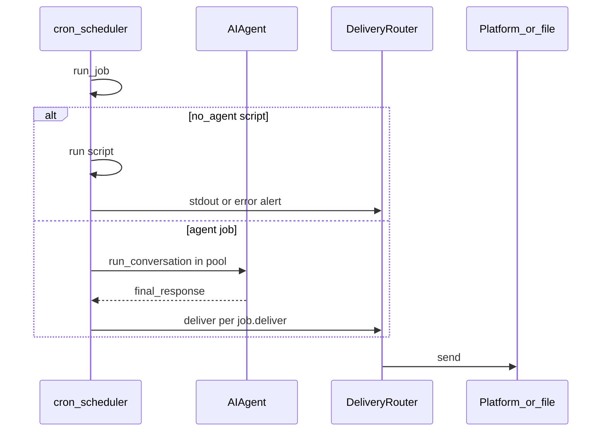

| 点 | 行为 |
|----|------|
| Agent | **每次作业新实例**（不像 Gateway LRU 长聊） |
| HITL | 通常无真人；`approvals.cron_mode` deny/auto |
| 投递 | **路径 B**，不是 Adapter 回程栈 |
| 与 Gateway | 可同机；Gateway 提供平台连接，cron 复用投递目标解析 |

### 5.2 ACP（IDE）

**入口**：`hermes acp` → `acp_adapter/server.py`。

```text
IDE ↔ ACP JSON-RPC/stdio
  → SessionState（ACP 会话，≠ IM session_key）
  → ThreadPoolExecutor(max_workers≈4, prefix acp-agent)
  → AIAgent.run_conversation
  → session_update / 流式回写 IDE
  → cancel / steer / queue：协议层控制 in-flight turn
```

| | Gateway IM | ACP |
|--|------------|-----|
| 客户端 | Telegram 等 | Zed/编辑器 |
| 并发模型 | 每 chat 一缓存 Agent + executor | 进程内线程池多 session |
| 鉴权 | allowlist/pairing | IDE/ACP authenticate |
| 出站 | Adapter send + ledger | ACP session updates（非 IM 账本） |

---

## 6. Kanban worker

Kanban 是 **看板任务编排**，不是第三条「聊天入口」；worker 最终仍走 **headless CLI**（`chat -q`）。

完整状态机 / 熔断见 [KANBAN_MULTIAGENT_DEEP_ANALYSIS.md](KANBAN_MULTIAGENT_DEEP_ANALYSIS.md)。此处只钉启动与引用。

### 6.1 实体

| 实体 | 说明 |
|------|------|
| **Board / tasks** | `hermes_cli/kanban_db.py`（SQLite） |
| **Dispatcher** | Gateway 嵌入 60s tick，或 `hermes kanban dispatch` |
| **Worker** | **子进程**：`hermes -p <profile> chat -q "work kanban task …"` |
| **claim_lock / run_id / worker_pid** | 认领、尝试次数、崩溃检测 |

### 6.2 调度 → spawn 时序

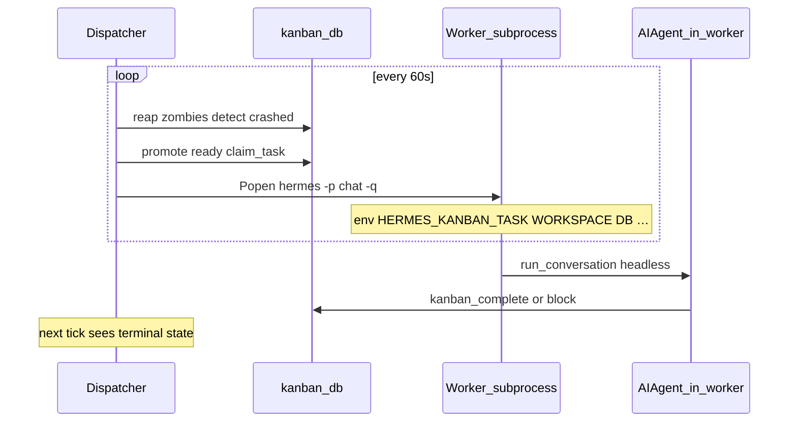

### 6.3 Worker 启动要点

```text
cmd: hermes -p <assignee_profile> [--skills kanban-worker …] chat -q "<prompt>"
env: HERMES_HOME, HERMES_KANBAN_TASK, WORKSPACE, RUN_ID, CLAIM_LOCK, DB, BOARD, PROFILE
start_new_session=True  → 脱离 TTY；日志进 logs/
```

- **进程边界**：每个 running 任务一个 OS 进程（不是 Gateway executor 里的协程）。  
- **HITL**：headless，无 PT 面板；危险命令按非交互/deny 策略。  
- **Hooks**：`kanban_task_claimed` 在 **dispatcher**；`completed`/`blocked` 常在 **worker**（见 Plugins）。

### 6.4 对比

| | `delegate_task` | Kanban worker |
|--|-----------------|---------------|
| 进程 | 同进程线程池 | **子进程** |
| 寿命 | one-shot 随父 turn | 任务级，可崩溃回收再 claim |
| 入口 | 工具调用 | dispatcher spawn CLI |

---

## 7. 认证 · Token 锁 · 部署

### 7.1 认证

- **Allowlist**：配置中的用户/chat 白名单。  
- **DM Pairing**：未知用户配对码 → 写入授权。  
CLI / ACP 本机或 IDE 信任模型，不走同一套 IM pairing。

### 7.2 Token 锁

多 Gateway 实例同 bot token 会互踢。启动抢 **scoped lock**，退出释放（`gateway/status.py` 等）。

### 7.3 部署速查

```bash
hermes gateway run
hermes gateway install
hermes gateway status
hermes doctor
```

Health：`/api/status`（无 secret）。Unit/Docker 以 `hermes gateway install` 生成物为准。

---

## 8. 命令面速查

### 8.1 顶层（摘）

`hermes` / `chat` · `model` · `gateway` · `cron` · `acp` · `setup` · `doctor` · `sessions` · `skills` · `plugins` · `kanban` · …

### 8.2 Gateway 子命令（摘）

`hermes gateway run|start|stop|status|install|…`

### 8.3 会话内 Slash（摘）

| 类 | 例 |
|----|-----|
| Session | `/new` `/sessions` `/title` |
| Config | `/model` `/yolo` |
| Gateway 审批 | `/approve` `/deny` `/approve all` |

---

## 9. 与其它文档的边界

| 主题 | 写哪里 |
|------|--------|
| Gateway **启动/实体/入出站时序** | **本文 §4** |
| Cron / ACP 入口时序 | **本文 §5** |
| Kanban spawn / worker | **本文 §6**；状态机深潜 → `KANBAN_MULTIAGENT_DEEP_ANALYSIS.md` |
| Skin / Desktop / tui_gateway | `SURFACE_ARCHITECTURE.md` |
| HITL | `HITL_APPROVAL_FLOW.md` |
| Agent 内核 | `AGENT_LOOP_ARCHITECTURE.md` |

---

## 10. 源码锚点

| 符号 / 路径 | 说明 |
|-------------|------|
| `cli.py` · `Thread(target=run_agent)` | CLI Agent 线程 |
| `gateway/run.py` · `GatewayRunner.start` / `_handle_message` | 启动与入站 |
| `run_sync` + `_run_in_executor_with_context` | Agent 在 executor |
| `_get_or_create_agent` / `_agent_cache` | Agent LRU |
| `platforms/base.py` · `MessageEvent` / `SessionSource` | 入站实体；路径 A send |
| `gateway/session.py` · `SessionStore` | 会话元数据 |
| `hermes_state.py` · `SessionDB` | 对话正文 |
| `gateway/delivery.py` / `delivery_ledger.py` | 路径 B / 账本 |
| `tools/approval.py` · `_ApprovalEntry` | Gateway HITL |
| `cron/scheduler.py` · `run_job` | Cron |
| `acp_adapter/server.py` · `ThreadPoolExecutor` | ACP |
| `hermes_cli/kanban_db.py` · `gateway/kanban_watchers.py` | Kanban |
| `_default_spawn` · `chat -q` | Worker 子进程 |

---

## 变更摘要

- 2026-08-03：合并 CLI+Gateway；补 Agent 线程；**全入口地图**。  
- 同日补强：Gateway **启动时序**、**实体引用**、**入/出站时序**；独立 **Cron+ACP**、**Kanban worker** 节。  
- 旧 Part2 长抄录不恢复；Kanban 状态机细节仍以 KANBAN 专文为准。

# Hermes‑Agent：GatewayRunner 完整启动链路

## 一、顶层结论

`GatewayRunner` **不会自动后台常驻、不会自己启动**；由 Hermes 的顶层 CLI 入口代码，根据你启动模式，实例化并 `await` 运行。

Hermes 有 2 条最主要启动路径：

1. **网关多渠道模式（Telegram / Discord / Slack …）** → 启动 GatewayRunner
2. **单条对话 CLI 模式（一次性问答）** → **完全不启动 GatewayRunner**，直接新建 `AIAgent`

---

## 二、网关模式完整调用栈（启动 GatewayRunner）

入口文件一般：`main.py` / `cli.py`
伪代码调用链自上而下：

```
CLI 命令:  hermes gateway
    ↓
click / typer cli 装饰器 → gateway() 顶层函数
    ↓
实例化 GatewayRunner
runner = GatewayRunner(
    config,
    channel_definitions = [TelegramChannel(), ...]
)
    ↓
await runner.run()   # 进入网关主循环
```

### GatewayRunner.run () 内部流程

```
class GatewayRunner:
    async def run(self):
        # 1. 逐个启动所有IM渠道适配器
        for ch in self.channels:
            await ch.start(on_message_callback = self._on_incoming_message)

        # 2. 永久常驻等待，进程不退出
        while True:
            await asyncio.sleep(3600)
```

>
> 关键点：
>
>
> - `TelegramChannel` 收到用户消息后，**回调 `self._on_incoming_message`**
> - GatewayRunner 的回调函数内部**直接创建 / 获取会话，调用 AIAgent.run_conversation ()**
> - **没有 MessageBus、没有 inbound 队列，适配器 → GatewayRunner → AIAgent 是回调‑直调用链路**

数据流：

```
Telegram平台 → TelegramChannel接收消息
    ↓
触发回调 _on_incoming_message(raw_text, chat_id)
    ↓
GatewayRunner 根据 chat_id 查找 / 创建 Session
    ↓
session.agent = AIAgent(...)
    ↓
await session.agent.run_conversation(user_message) # 阻塞调用
    ↓
拿到agent回复 → channel.send_response(reply)
```

>
> ⚠️ 阻塞短板：一条长耗时 Agent 任务会卡住当前聊天会话；Hermes 默认**没有会话任务取消机制**，不像 Ohmo‑Bridge 专门做旧任务抢占取消。

---

## 三、非网关模式：不走 GatewayRunner

```
hermes chat "你好"
```

顶层 cli chat 函数，**跳过 GatewayRunner**

```
async def chat_command(prompt):
    agent = AIAgent(...)
    result = await agent.run_conversation(prompt)
    print(result)
```

---

## 四、GatewayRunner 的 3 个核心角色

1. **渠道生命周期管理者**：`channel.start()` / `channel.stop()`，启动关闭各个 IM 适配器
2. **消息回调接收器**：所有渠道收到消息之后统一回调进 GatewayRunner
3. **会话调度器**：维护 `chat_id → Session(AIAgent)` 的内存字典，分发消息给到对应会话 Agent

>
> GatewayRunner ≠ 独立后台服务线程；它就是**主协程本身**，进程主线程就在 `runner.run()` 常驻循环里。
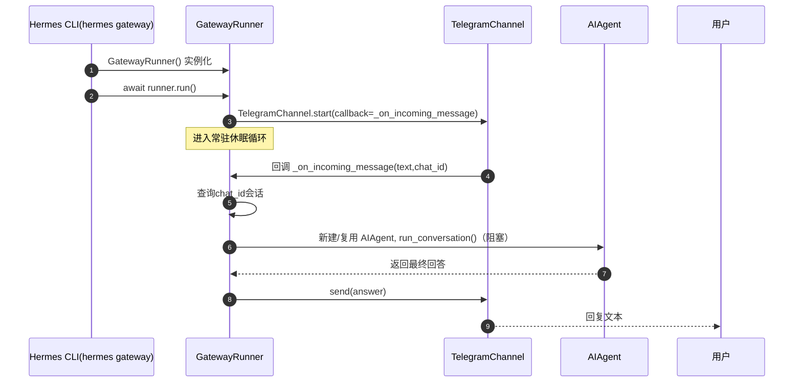
# 核心误区先澄清

**IM 不会主动导入、查找、调用 GatewayRunner。**
真实机制：**GatewayRunner 先把自己的回调函数，交给 IM‑Channel 适配器保存**；适配器收到外部消息后，再反向执行这个回调。

>
> 方向：`GatewayRunner → 注册回调 → IM‑Channel`
> 触发：`IM平台推送消息 → Channel检测消息 → Channel调用已保存的回调 → GatewayRunner`

---

## 一、启动阶段：回调函数注册（绑定过程）

伪代码 `GatewayRunner.run()`

```
async def run(self):
    # 遍历所有开启的IM渠道
    for channel in self.channels:
        # ✅ 关键一步：把GatewayRunner内部方法，作为回调传给Channel
        await channel.start(
            on_incoming_message = self._on_incoming_message
        )

    # 常驻休眠，进程保活
    while True:
        await asyncio.sleep(3600)
```

`TelegramChannel` 适配器内部会把回调存起来：

```
class TelegramChannel:
    def __init__(self):
        self.on_message_callback = None

    async def start(self, on_incoming_message):
        # 保存来自GatewayRunner的函数引用
        self.on_message_callback = on_incoming_message
        
        # 启动长轮询后台协程，持续监听Telegram服务器
        asyncio.create_task(self._long_poll_loop())
```

👉 此刻 `TelegramChannel` **持有 GatewayRunner 方法的引用**，形成单向绑定。

---

## 二、消息到达：IM 适配器反向回调 GatewayRunner

分两种主流 IM 接收模式：

### 模式 A：Long‑polling（长轮询，Telegram/Discord 最常见）

```
async def _long_poll_loop(self):
    while True:
        # 阻塞请求，等待Telegram平台下发新消息
        new_messages = await telegram_api.fetch_updates()
        
        for msg in new_messages:
            chat_id = msg.chat.id
            text = msg.text
            
            # 🎯 适配器主动调用GatewayRunner的回调函数
            await self.on_message_callback(chat_id, text)
```

### 模式 B：Webhook（钉钉 / 企业微信）

Channel 内部启动一个小型 http 服务；平台 POST 消息过来，http handler 收到之后执行回调：

```
async def http_handler(request):
    payload = await request.json()
    chat_id = payload["chat_id"]
    text = payload["content"]
    await self.on_message_callback(chat_id, text)
```

---

## 三、回调进入 GatewayRunner 之后完整链路

```
class GatewayRunner:
    async def _on_incoming_message(self, chat_id: str, user_text: str):
        # 1. 根据chat_id查找内存里已经存在的会话
        session = self.sessions.get(chat_id)
        if session is None:
            # 新建会话，实例AIAgent
            agent = AIAgent(...)
            session = Session(agent)
            self.sessions[chat_id] = session
        
        # 2. 直接阻塞调用Agent，无队列
        result = await session.agent.run_conversation(user_text)
        
        # 3. 通过当前channel发回结果
        await self.send_response(chat_id, result)
```

## 四、完整时序图


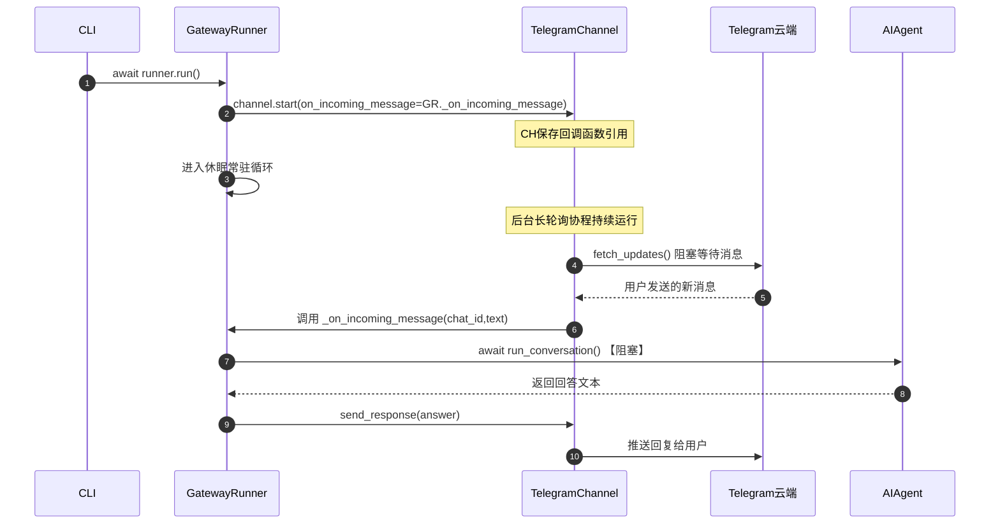
