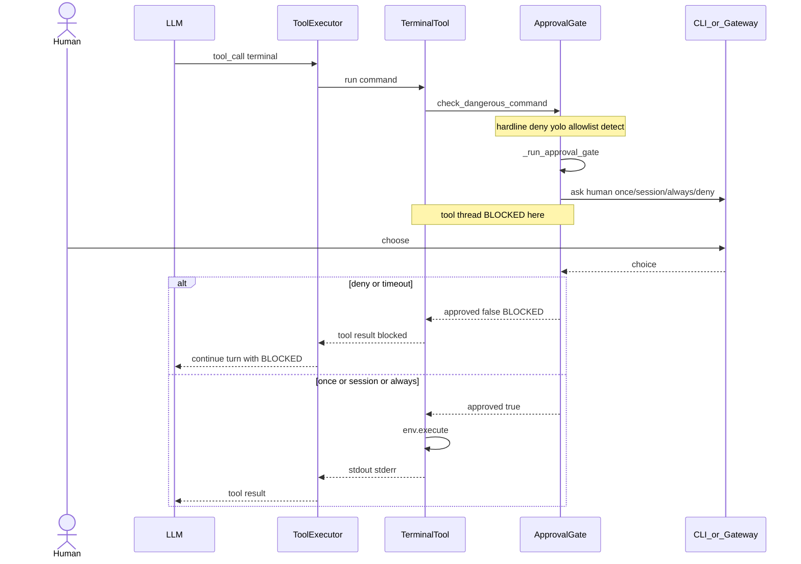
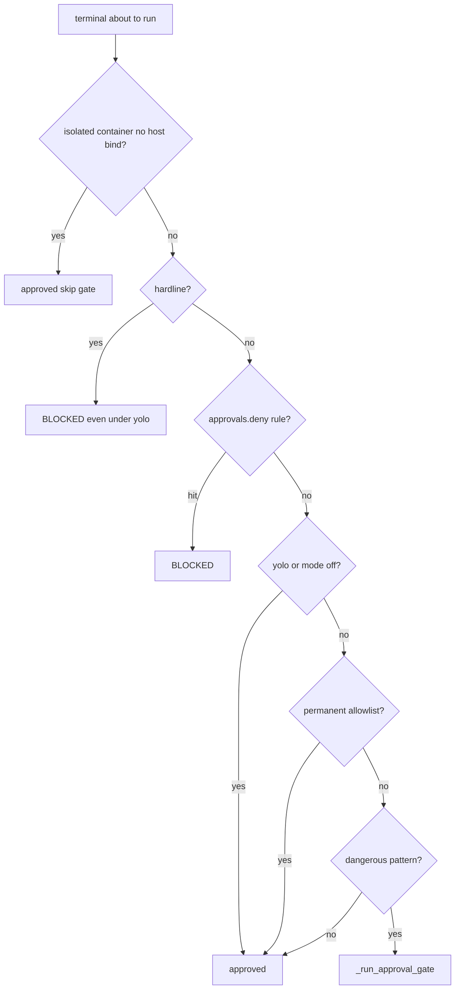
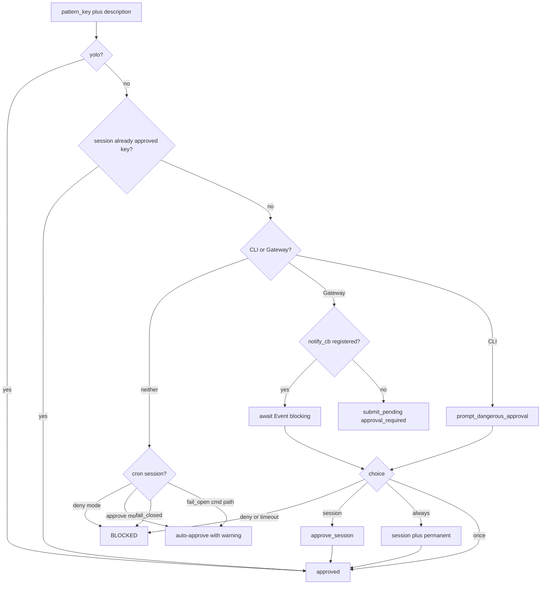
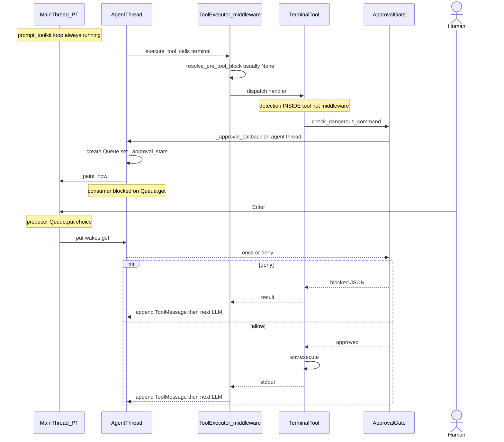
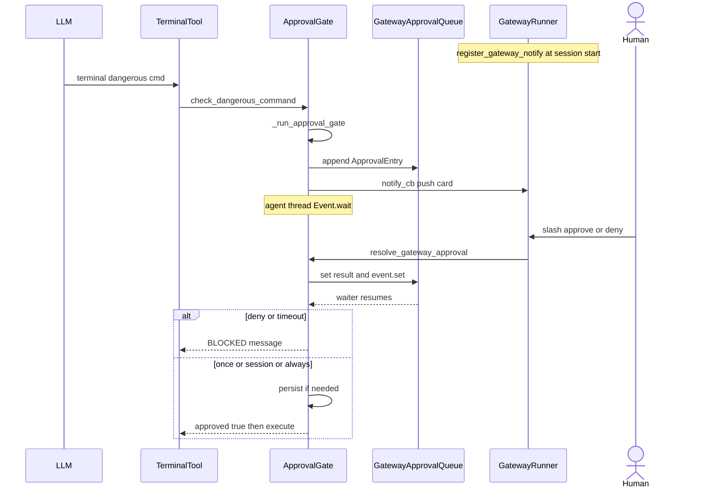
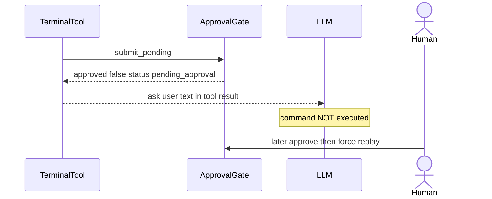

# HITL 审批流程（源码级）

> **文档状态**: Canonical  
> **Hermes 版本锚点**: 0.19.0 · **核对**: 2026-08-03 · [DOC_MAINTENANCE.md](DOC_MAINTENANCE.md)  
> **源码**: `tools/approval.py`（决策核心）、`tools/terminal_tool.py`（命令入口）、`cli.py`（TUI 回调）、`gateway/run.py`（IM `/approve`/`/deny`）、`tools/clarify_tool.py`（澄清 · 另一类 HITL）  
> **相关**: [MULTI_AGENT_ARCHITECTURE.md](MULTI_AGENT_ARCHITECTURE.md) §12 · [AGENT_LOOP_ARCHITECTURE.md](AGENT_LOOP_ARCHITECTURE.md)（interrupt ≠ approval） · [CLI_GATEWAY_SYSTEM.md](CLI_GATEWAY_SYSTEM.md)（CLI 线程 / Gateway executor）  
> **Mermaid 注意**: participant 勿命名为 `Loop`（与 `loop` 关键字冲突）；消息勿含 `()` / `|` / `<br/>`。

---

## 0. 一句话 + 一张总图（人机审批全流程）

**Agent 要执行被判为危险的动作时，工具线程停住问人；人答完再继续执行，或把拒绝写回 tool result。Deny 不结束 turn（那是 interrupt）。**



两条真人交互面（**同一闸门** `_run_approval_gate`，不同 UI）：

| 面 | 人怎么答 | 工具线程 |
|----|----------|----------|
| **CLI / TUI** | 模态：once / session / always / deny | Agent 线程在 `Queue.get` 上阻塞；UI 主线程仍转 |
| **Gateway IM** | `/approve` `/deny` `/always` 或按钮 | `Event.wait` 直到 `resolve_gateway_approval` |

---

## 0.1 CLI：进程没有 pause——是「Agent 线程堵在 Queue 上」

**一句话确认（心智模型）：**

1. Agent loop **实际堵塞在** `response_queue.get()` 上（Agent 线程，**不是**主线程）。
2. 用户在 UI 选 once / deny 等 → 主线程 **`put(choice)`** 进同一队列。
3. Agent **消费到 choice** → **先做完当前工具**（execute 或 BLOCKED）→ conversation while 自然下一轮 LLM。
4. **用户操作线程 = 主线程**（prompt_toolkit）；**Agent loop = 后台 `threading.Thread`**（`threading.Thread(target=run_agent, daemon=True)`，不是协程、不是子进程）。
5. **HITL 不重建 system prompt**——审批只堵工具栈；`invalidate_system_prompt` 是压缩/`/new` 等路径，与审批无关。

很多人以为 CLI 会把整个进程挂起。实际是 **双线程**：

| 线程 | 在干什么 |
|------|----------|
| **主线程** | `prompt_toolkit` 事件循环：画审批面板、收 ↑↓ Enter；审批时 **`put`** |
| **Agent / 工具线程** | `run_conversation` → 执行 `terminal` → `_approval_callback` → **`response_queue.get()` 阻塞** |

```text
主线程 (UI)                         Agent 线程 (loop + tools)
─────────────                       ─────────────────────────
pt app.run() 一直转
  画屏 / 读键盘
                                    LLM → tool_call(terminal)
                                    check_dangerous_command
                                    _run_approval_gate
                                    _approval_callback():
                                      _approval_state = {..., queue}
                                      _paint_now()          ──► 主线程 refresh 画出模态
                                      while True:
                                        queue.get(timeout=1)  ◄── 堵在这里
                                          │
用户 Enter ──► _handle_approval_selection()
               queue.put("once"|"deny"|...)
                                          │
                                        get() 返回
                                      return choice
                                    继续执行 or 返回 BLOCKED
                                    工具结果进 messages
                                    下一轮 LLM（同一 run_conversation）
```

### 暂停卡在哪？

```python
# cli.py · _approval_callback（Agent 线程）
response_queue = queue.Queue()
self._approval_state = {..., "response_queue": response_queue}
self._paint_now()
while True:
    result = response_queue.get(timeout=1)  # ← 真正的「等用户」
    return result
```

```python
# cli.py · Enter（主线程 / pt 回调）
if self._approval_state:
    self._handle_approval_selection()
    # 内部: state["response_queue"].put(chosen)
```

- **没有**把整个进程 `pause`。  
- Agent loop 的**同步调用栈**堵在 tool → gate → callback → `Queue.get`；UI 线程照常转。  
- 用户选完 → `put` → `get` 返回 → **同一条调用栈往下走**：要么 `env.execute`，要么 blocked JSON → tool_executor 写回 ToolMessage → conversation loop **自然进入下一轮 LLM**。

### 「继续 loop」不是另起炉灶

```text
run_conversation 迭代 N:
  API 返回 assistant + tool_calls
  execute_tool_calls
      terminal → _approval_callback 阻塞 ←── 等用户
      …返回后… execute / BLOCKED
      append tool results
  回到循环顶部 → 再调 LLM   ← 仍是同一次 run_conversation
```

**继续 = 阻塞的 tool 调用返回了**，不是审批系统去唤醒一个被暂停的主循环。

并发危险命令会抢 `_approval_lock`，同一时间只弹一扇窗。

---

## 目录

0. [总图](#0-一句话--一张总图人机审批全流程) · [CLI 线程阻塞详解](#01-cli进程没有-pause是agent-线程堵在-queue-上)
1. [概念边界](#1-概念边界)
2. [参与者与入口](#2-参与者与入口)
3. [决策优先级（命令路径）](#3-决策优先级命令路径)
4. [共享闸门 `_run_approval_gate`](#4-共享闸门-_run_approval_gate)
5. [时序：CLI / TUI](#5-时序cli--tui从工具调用开始--含线程与-queue)
6. [时序：Gateway（阻塞式）](#6-时序gateway阻塞式)
7. [时序：Gateway（pending）](#7-时序gatewaypending)
8. [用户选择与持久化](#8-用户选择与持久化)
9. [Smart / YOLO / Cron / 容器跳过](#9-smart--yolo--cron--容器跳过)
10. [Plugin `request_tool_approval`](#10-plugin-request_tool_approval)
11. [子 Agent 上的审批回调](#11-子-agent-上的审批回调)
12. [Clarify：另一类 HITL](#12-clarify另一类-hitl)
13. [Deny 之后](#13-deny-之后)
14. [与其它 Agent 项目的 HITL 对比](#14-与其它-agent-项目的-hitl-对比)

---

## 1. 概念边界

| | **Approval（审批）** | **Interrupt（中断）** | **Clarify（澄清）** |
|--|--|--|--|
| 触发 | 危险命令 / 插件 escalate / MCP elicitation | stop、Ctrl+C、`interrupt_subagent` | 模型主动调 `clarify` |
| 谁在等 | **工具线程**阻塞等人类 | 循环在边界检查标志后退出 | 工具线程等用户回答 |
| 结果 | once / session / always / deny | turn 结束 interrupted | 选项或自由文本回给模型 |
| 源码 | `tools/approval.py` | `AIAgent.interrupt()` | `tools/clarify_tool.py` |

---

## 2. 参与者与入口

```text
LLM tool_call(terminal / 任意工具)
        |
        v
 tool_executor
        |
        +-- terminal --> check_dangerous_command --> _run_approval_gate
        +-- plugin {action: approve} --> request_tool_approval --> 同一 gate
        +-- MCP elicitation --> 同类 prompt
```

| 符号 | 职责 |
|------|------|
| `check_dangerous_command` | hardline → deny 规则 → yolo → permanent → detect → gate |
| `check_all_command_guards` | tirith + dangerous 合并一次问人 |
| `_run_approval_gate` | **唯一**人机闸门 |
| `prompt_dangerous_approval` | CLI 回调或 input |
| `_await_gateway_decision` | Gateway 推送 + Event.wait |
| `resolve_gateway_approval` | `/approve` `/deny` 解阻塞 |
| `set_approval_callback` | CLI/TUI/子 Agent 安装回调 |

---

## 3. 决策优先级（命令路径）



---

## 4. 共享闸门 `_run_approval_gate`



---

## 5. 时序：CLI / TUI（从工具调用开始 · 含线程与 Queue）

### 5.0 检测在哪？中间件还是工具内？

**两条入口，别混：**

| 路径 | 谁触发检测 | 调用点 | 典型场景 |
|------|------------|--------|----------|
| **A. 工具内（最常见）** | `terminal_tool` 调 `_check_all_guards` → `check_dangerous_command` | **handler 内部**、真正 `env.execute` **之前** | shell 危险命令 pattern |
| **B. 中间件 / 插件** | `resolve_pre_tool_block`：plugin `pre_tool_call` 返回 `{action: "approve"}` → `request_tool_approval` | `tool_executor._authorized_dispatch` 里，**还没进** handler | 插件要求任意工具先问人 |

两条最终都进 **`_run_approval_gate`**，CLI 上都进同一个 `_approval_callback` + `Queue`。

中间件栈（简化）：

```text
execute_tool_calls
  → apply_tool_request_middleware / run_tool_execution_middleware
  → _authorized_dispatch
       → resolve_pre_tool_block   ←── 路径 B（插件 approve）可能在这里堵 Queue
       → tool guardrails
       → execute(handler)         ←── 路径 A：terminal 进 handler 后再 _check_all_guards
```

所以：**危险 shell 检测默认不在中间件**；中间件只负责插件 escalate。下面默认画路径 A；路径 B 见 §5.5。

### 5.1 完整调用栈（路径 A：terminal 危险命令）

```text
[Agent 线程]
run_conversation
  → 收到 assistant.tool_calls
  → execute_tool_calls_(sequential|concurrent)
      → _run_agent_tool_execution_middleware
          → _authorized_dispatch
              → resolve_pre_tool_block()     # 无插件 approve 则立刻返回 None
              → execute(terminal_handler)
                  → terminal_tool.terminal_tool(...)
                      → _check_all_guards(command)     # ★ 检测在这里
                          → check_dangerous_command
                          → _run_approval_gate
                          → prompt_dangerous_approval
                          → approval_callback = CLI._approval_callback
                              → Queue.get() 阻塞 ★★
                      → env.execute(command) 或 return BLOCKED JSON
          → 结果字符串回到 tool_executor
      → messages.append(ToolMessage)
  → 下一轮 LLM
```

### 5.2 Queue：谁生产、谁消费？

这是 **线程间交还用户选择** 的队列，不是 tool_call 任务队列。

| 角色 | 线程 | 代码 | 做什么 |
|------|------|------|--------|
| **创建者 + 消费者（阻塞方）** | Agent / 工具线程 | `_approval_callback` | `q = Queue()`；循环 `q.get()` **等待**；拿到字符串后 return |
| **生产者（唤醒方）** | 主线程（prompt_toolkit） | `_handle_approval_selection` | 用户 Enter → `q.put("once"\|"session"\|"always"\|"deny")` |

```text
          Agent 线程                              主线程 (pt)
               |                                      |
               |  _approval_state = { queue: q }      |
               |  _paint_now()  --------------------> | 画出审批面板
               |  q.get()  阻塞 …                     |
               |                                      | 用户 ↑↓ Enter
               |                                      | q.put(choice)
               |  … get() 返回 choice <---------------|
               |  return choice                       |
               v                                      v
```

### 5.3 如何「继续 loop」？

没有单独的 resume。Agent 线程的调用栈从未拆开：

```text
get() 返回
  → _approval_callback return "once"
  → _run_approval_gate return {approved: True}
  → terminal 继续 env.execute（或 deny 时 return blocked JSON）
  → handler return 到 tool_executor
  → ToolMessage 写入 messages
  → execute_tool_calls 结束
  → run_conversation while 循环回到顶部 → 再调一次 LLM
```

**继续 loop = 堵在 `get()` 上的那次 tool 调用终于返回了**，外层 for/while 自然往下跑。

### 5.4 时序图（双线程 + 路径 A）



### 5.5 路径 B（中间件插件 approve）差别

```text
_authorized_dispatch
  → resolve_pre_tool_block
       → request_tool_approval → _run_approval_gate → 同一 _approval_callback / Queue
  → 若 deny：直接返回 error JSON，handler 根本不跑
  → 若 allow：再 execute(handler)
```

对人来说交互一样；只是 **堵点更靠前**（middleware），还没进 `terminal_tool`。详见 §10。

要点：

- TUI 无 callback → deny（避免 stdin 死锁）。
- 子 Agent 线程必须 `initializer=set_approval_callback`（见 §11）。
- 并发危险命令抢 `_approval_lock`，一次只弹一窗。
- 超时默认 `approvals.timeout` → deny。

---

## 6. 时序：Gateway（阻塞式）

### 6.0 和 CLI 同一心智模型，换了同步原语

| | CLI / TUI | Gateway（阻塞式） |
|--|-----------|-------------------|
| **等人** | `queue.Queue.get()` | `threading.Event.wait()`（按 session 排队 `_ApprovalEntry`） |
| **人怎么答** | 主线程面板 Enter | IM：`/approve` `/deny` `/always` 或按钮 |
| **谁唤醒** | UI `put(choice)` | `resolve_gateway_approval` → `entry.result = choice` → `event.set()` |
| **谁堵** | Agent 线程 | 同样是跑 tool 的 Agent 线程 |
| **继续 loop** | tool 返回 → ToolMessage → 下一轮 LLM | **完全一样** |

没有「暂停整个 Gateway 进程」。Gateway 的 async 事件循环继续收消息；**堵的是执行 tool 的那条同步线程**。

### 6.1 交互步骤

```text
session 启动
  → register_gateway_notify(session_key, cb)   # cb: sync→async 推卡片到 IM

危险命令命中
  → _run_approval_gate → _await_gateway_decision
       1. 把 _ApprovalEntry 推进 _gateway_queues[session_key]（FIFO）
       2. notify_cb(approval_data)  → 用户收到审批卡片 / 文案
       3. 循环 Event.wait(1s) + 心跳，直到 set / 超时 / interrupt
          （避免 inactivity watchdog 在等人时杀 agent）

用户 /approve | /deny [reason] | /approve all
  → resolve_gateway_approval(session_key, choice)
       → 弹出队头（或全部）entry.result = choice; event.set()

Agent 线程被唤醒
  → 与 CLI 相同：approved → env.execute；deny/timeout → BLOCKED
  → ToolMessage → run_conversation 下一轮
```

### 6.2 时序图



超时 / `/stop` interrupt → deny（沉默 ≠ 同意）。并行子 Agent 可多条 entry；默认 FIFO 解一条，`/approve all` 一次解完。

---

## 7. 时序：Gateway（pending）

**无** `register_gateway_notify`（或 notify 失败）时：不能堵线程等人（IM 可能永远收不到卡），改为 **非阻塞 pending**：



- 当前 tool **立刻**返回 `pending_approval` JSON（命令未执行）。
- 模型在同一 turn 里看到「请用户批准」类结果，可改口或等。
- 用户稍后批准后走 **force 重放**（不是同一条调用栈上的 `Event.wait` 醒来）。

阻塞式 = CLI 的跨进程/IM 版；pending = 没法同步等人时的 fail-soft 退化。

---

## 8. 用户选择与持久化

| 选择 | 含义 | 状态 |
|------|------|------|
| `once` | 仅此次 | 不写入 |
| `session` | 本 session 同 pattern 免问 | `_session_approved` |
| `always` | session + 永久 allowlist | `approve_permanent` + save |
| `deny` | 拒绝 | BLOCKED；turn 继续 |

---

## 9. Smart / YOLO / Cron / 容器跳过

| 机制 | 行为 |
|------|------|
| `mode: manual` | 默认过人闸门 |
| `mode: smart` | 可先 LLM 再决定是否问人 |
| `mode: off` / yolo | 跳过可恢复层；**不**跳过 hardline / deny 规则 |
| `cron_mode` | cron 无真人 deny 或 auto-approve |
| 隔离容器无 host bind | 跳过 |
| Docker + host bind | 不跳过 |

---

## 10. Plugin `request_tool_approval`

`pre_tool_call` → `{action: "approve"}` → 同一 `_run_approval_gate`。  
非交互非 gateway：**fail-closed**。

---

## 11. 子 Agent 上的审批回调

```text
delegate_tool 子线程 initializer = set_approval_callback(parent_cb)
```

子 Agent terminal 仍可触发审批；clarify 通常被 blocked。

---

## 12. Clarify：另一类 HITL

模型主动提问，**不经过** `_run_approval_gate`。

---

## 13. Deny 之后

```text
tool result BLOCKED → 追加 ToolMessage → 下一轮 LLM 换方案
不是 interrupt；turn 可正常 finalize
```

---

## 14. 与其它 Agent 项目的 HITL 对比

Hermes 的审批是 **工具调用栈内同步阻塞**（CLI=`Queue`，Gateway=`Event`），人答完同一帧继续 execute。其它常见做法：

| 项目 / 模式 | 等人方式 | 状态怎么续 | 和 Hermes 的差别 |
|-------------|---------|------------|------------------|
| **Hermes CLI** | Agent 线程 `Queue.get`；主线程 UI `put` | 调用栈不拆；tool 返回后 loop 自然继续 | — |
| **Hermes Gateway** | Agent 线程 `Event.wait`；IM `/approve` `event.set` | 同上 | 同步原语换了；表面从 TUI 换成 IM |
| **LangGraph / Deep Agents** | `interrupt_on` + `HumanInTheLoopMiddleware`：图节点 `interrupt()`，**checkpoint 落盘** | 进程可退出；之后 `Command(resume=…)` / `graph.invoke(None, config)` **从 checkpoint 恢复** | **持久化中断**：不堵线程等人；适合 server / 多副本。Hermes 是 **进程内堵线程** |
| **OpenAI Assistants / Responses 审批类** | 平台把 run 标成 `requires_action`，客户端轮询或 webhook | 客户端 `submit_tool_outputs` 后续跑 | 运行时在云端；本地不持有阻塞栈 |
| **Claude Computer Use / 部分 IDE Agent** | 危险动作前弹 UI；常在 **工具/编排层** 拦 | 多数仍是同步等 UI，或把拒绝当 tool error | 接近 Hermes CLI；少见 Gateway 式 IM FIFO 队列 |
| **Autogen / Crew 类** | 人当「特殊 Agent」或 `HumanInput` 节点 | 消息进对话图，由编排器下一跳调度 | HITL 是图上的一等节点，不是 tool 内闸门 |

**选型直觉：**

- 本地 TUI / 单进程 IM bot、希望「问完立刻跑同一条命令」→ Hermes 这种 **in-stack gate** 最简单。
- 要跨机器、可重启、多 worker、长时间等人 → LangGraph 式 **checkpoint + resume**（Deep Agents `interrupt_on`）更合适；Hermes **没有**把审批写成可恢复 checkpoint。
- Hermes 的 **Deny ≠ interrupt**：拒绝只是 tool result；真正掐断 turn 是 `/stop` 等 interrupt 路径（见 AGENT_LOOP / MULTI §12）。

```text
Hermes:     tool → gate → [thread blocked] → execute/BLOCKED → next LLM
LangGraph:  node → interrupt() → checkpoint → (later) resume → continue graph
```

---

## 配置速查

```yaml
approvals:
  mode: manual
  timeout: 300
  cron_mode: deny
  deny: []
```

环境：`HERMES_YOLO_MODE`、`HERMES_INTERACTIVE`、`HERMES_GATEWAY_SESSION`、`HERMES_CRON_SESSION`、`HERMES_EXEC_ASK`。

---

## 源码锚点

| 符号 | 文件 |
|------|------|
| `check_dangerous_command` / `_run_approval_gate` | `tools/approval.py` |
| `_await_gateway_decision` / `resolve_gateway_approval` / `_ApprovalEntry` | 同上 |
| `register_gateway_notify` / `unregister_gateway_notify` | 同上 |
| `request_tool_approval` | 同上 |
| `_check_all_guards` / `set_approval_callback` | `tools/terminal_tool.py` |
| CLI `_approval_callback` / `_handle_approval_selection` | `cli.py` |
| `/approve` `/deny` + notify | `gateway/run.py` |
| 子 Agent callback | `tools/delegate_tool.py` |
| Deep Agents `interrupt_on` / HITL middleware | `libs/deepagents` · LangGraph checkpoint resume |
