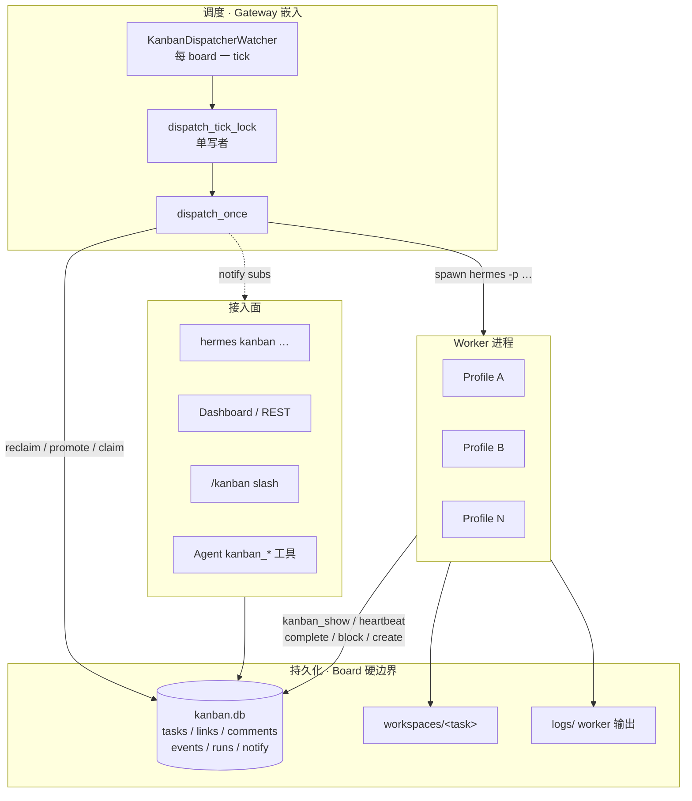
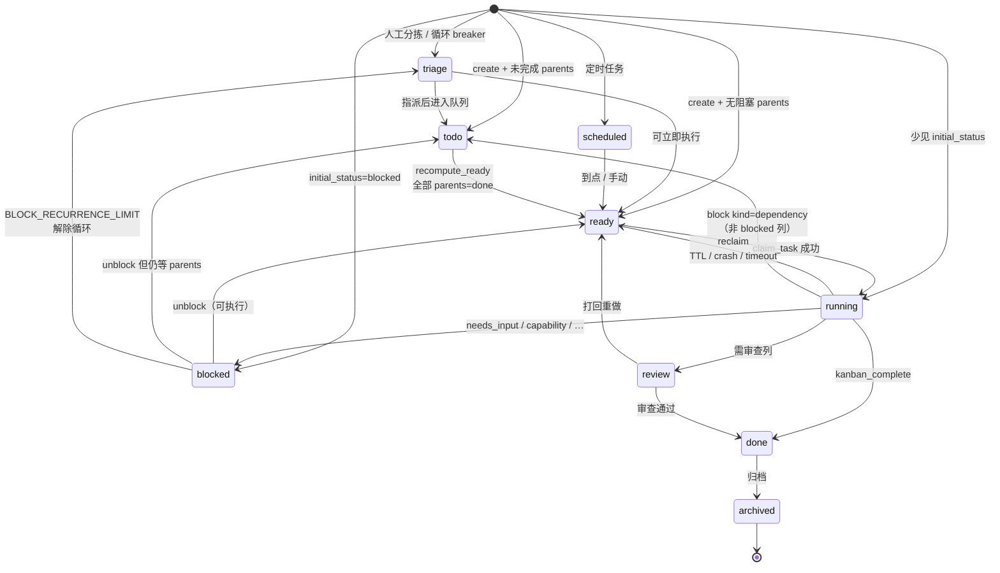
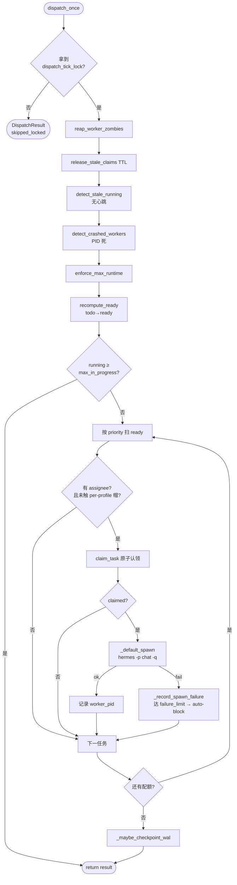
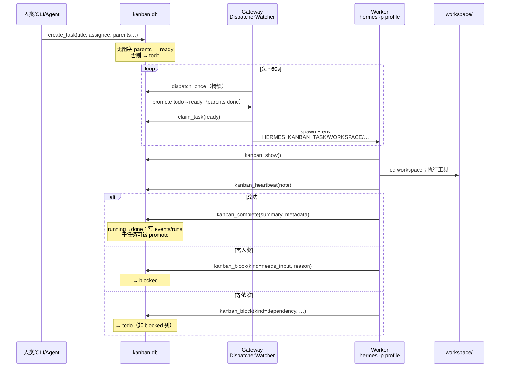
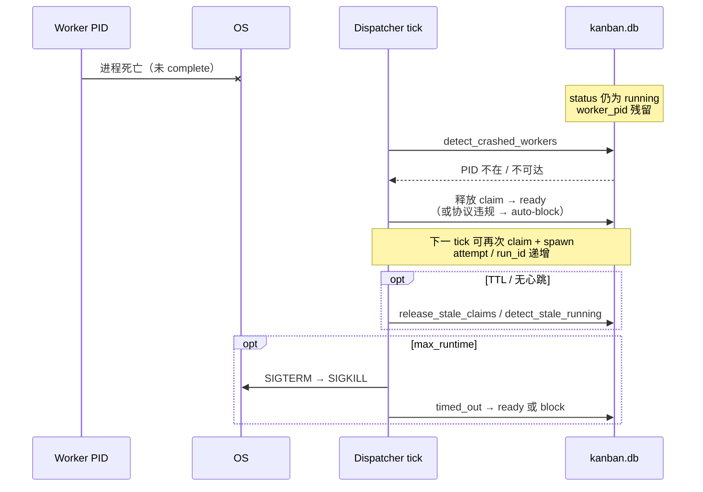
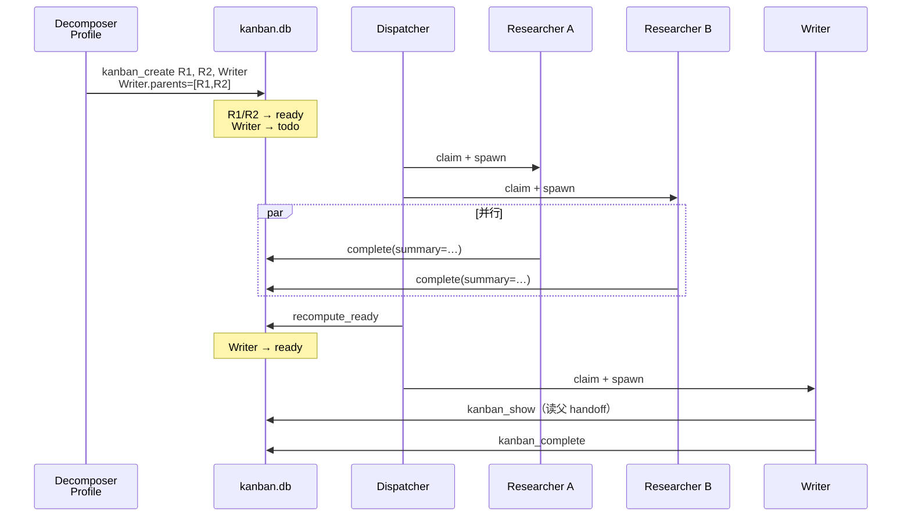
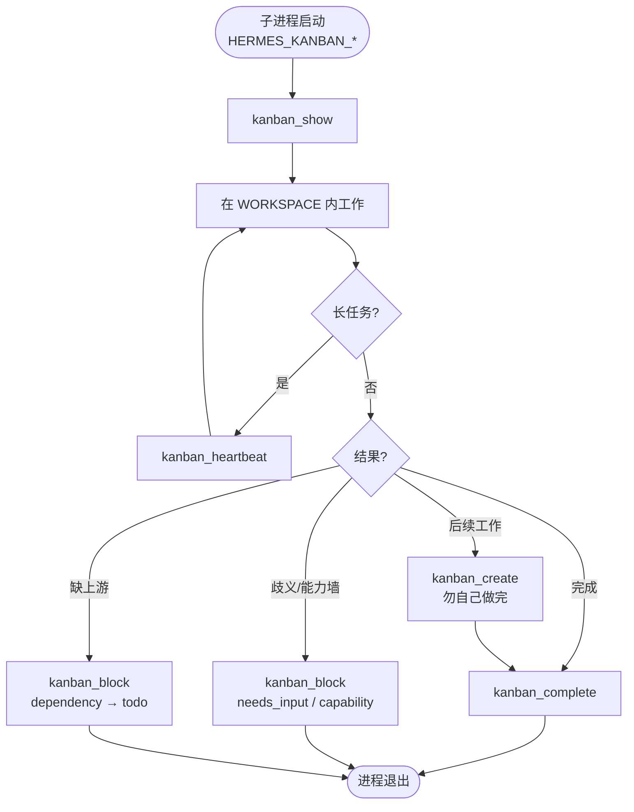
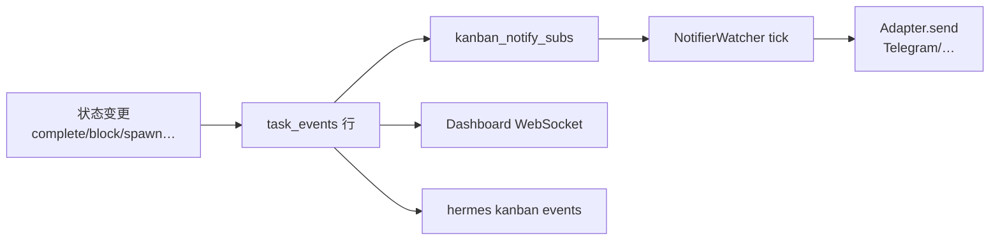
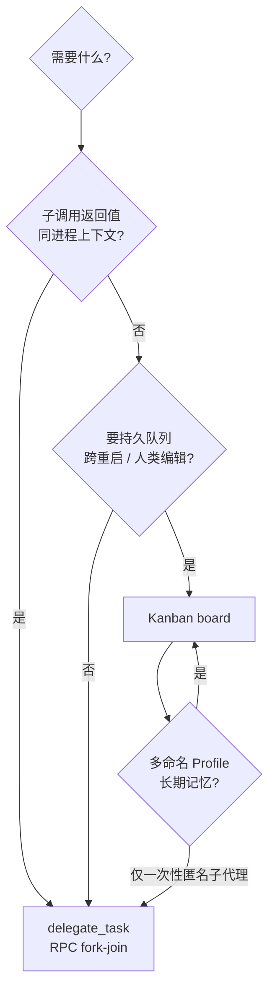

# Hermes Agent Kanban 多 Agent 调度系统深度分析

> **文档角色**: Canonical 技术深潜（架构 + 模块 + 实现细节）  
> **Hermes 版本锚点**: 0.19.0 · **核对**: 2026-08-04 · [DOC_MAINTENANCE.md](DOC_MAINTENANCE.md)  
> **用户向入门**: 官网 [Kanban 功能说明](https://hermes-agent.nousresearch.com/docs/user-guide/features/kanban) · [Kanban 教程](https://hermes-agent.nousresearch.com/docs/user-guide/features/kanban-tutorial)

---

## 一分钟读懂

**Kanban 是什么？** 一块 **持久化的共享看板**（SQLite `kanban.db`）+ 一个 **嵌入 Gateway 的调度器**（每 ~60s tick）+ 多个 **独立 Worker 子进程**（`hermes -p <profile> chat -q`）。任务在 DB 里走状态机；人类 / CLI / Dashboard / Orchestrator Agent 写卡；Dispatcher 认领 `ready` 卡并 spawn Worker；Worker 用 `kanban_*` 工具把结果写回 DB。

**和 `delegate_task` 的区别：** `delegate_task` = 父 Agent 进程内 **RPC（fork → 等返回值）**；Kanban = **消息队列 + 命名 Profile + 可恢复状态**（崩溃 reclaim、人类 unblock、审计行永久保留）。

**三个角色（先分清再读下文）：**

| 角色 | 谁在跑 | 典型能力 |
|------|--------|----------|
| **人类 / CLI / Dashboard** | 你 / `hermes kanban` / Web UI | 建卡、改状态、评论、手动 dispatch |
| **Orchestrator Agent** | 配置了 `kanban` toolset 的 Profile | `kanban_create` 扇出子任务、`kanban_list` 看板 |
| **Worker Agent** | Dispatcher spawn 的子进程 | `kanban_show` → 干活 → `kanban_complete` / `kanban_block` |

---

## 阅读指南（本文怎么读）

| 你想搞清楚… | 先读 | 再读 |
|-------------|------|------|
| 整体设计、边界、数据放哪 | **[§ 整体设计](#整体设计)** · **[§ 模块地图](#模块地图)** | § 设计与方案图示 D.3–D.8 |
| 任务状态怎么变 | [D.4 状态机](#d4-任务状态机流程图) | § 系统架构 → 状态机文字版 |
| Dispatcher 每 60s 做什么 | [D.5 tick 流程](#d5-dispatcher-单-tick-流程图) | § Dispatcher 调度引擎 |
| Worker 子进程怎么启动、环境变量 | § Dispatcher → Worker 启动流程 | `gateway/kanban_watchers.py` |
| Agent 里有哪些 `kanban_*` 工具 | § Worker 工具集 | `tools/kanban_tools.py` |
| Board / workspace / tenant 隔离 | § 数据流与隔离模型 | `hermes_cli/kanban_db.py` 路径函数 |
| 和 Gateway / CLI 的关系 | [CLI_GATEWAY_SYSTEM.md](CLI_GATEWAY_SYSTEM.md) §6 | 本文 § REST API |

**本文结构：** 前半 **设计层**（理念 + 图示 + 架构）；后半 **实现层**（伪代码、配置、API、最佳实践）。图示章节（§D）与后文有少量重复，图示优先建立直觉，后文补细节。

---

## 整体设计

### 问题与方案

| 痛点 | Kanban 方案 |
|------|-------------|
| 多步工作要跨天、跨重启 | 任务状态在 **SQLite**，不是进程内存 |
| 多个「专家 Agent」并行 | 每张 `ready` 卡 spawn **独立子进程** + 命名 Profile |
| 流水线（先研究再写作） | `task_links` **DAG** + `todo→ready` 自动晋级 |
| 人类要中途插手 | `blocked` / comment / unblock；Dashboard 拖拽 |
| 要审计「谁何时做了什么」 | `task_events` + `task_runs` 行级永久记录 |
| 子 Agent 匿名、无记忆 | Worker = **Profile**（独立 `HERMES_HOME`、memory、skills） |

### 分层架构（逻辑视图）

```text
┌─────────────────────────────────────────────────────────────────┐
│ 接入层（Surfaces）                                               │
│  CLI · Dashboard/REST · Gateway /kanban · Telegram 通知          │
└────────────────────────────┬────────────────────────────────────┘
                             │ 读写同一 schema
┌────────────────────────────▼────────────────────────────────────┐
│ 持久化层（Board = 硬边界）                                        │
│  boards/<slug>/kanban.db  ← tasks · links · comments · events    │
│  boards/<slug>/workspaces/ · logs/ · attachments/                │
└────────────────────────────┬────────────────────────────────────┘
                             │
        ┌────────────────────┼────────────────────┐
        │                    │                    │
┌───────▼────────┐  ┌────────▼────────┐  ┌───────▼────────┐
│ 调度层         │  │ Worker 运行时    │  │ 编排辅助       │
│ Gateway 内     │  │ hermes -p …      │  │ decompose /    │
│ Dispatcher     │  │ 子进程 + env     │  │ specify / swarm│
│ ~60s tick      │  │ kanban_* 工具    │  │ (可选 LLM)     │
└────────────────┘  └──────────────────┘  └────────────────┘
```

**唯一真相源：** 每个 Board 一个 `kanban.db`。CLI、Dashboard、Worker、Dispatcher **不各持一份状态**，只通过 `kanban_db` API 改同一库（WAL + `BEGIN IMMEDIATE` + CAS claim）。

**不做的事：**

- 不在父聊天进程里嵌套阻塞式 `delegate_task` 链来完成「车队调度」
- 不把对话 transcript 当任务队列
- 不跨 Board 共享同一个 `kanban.db`（多项目 = 多 Board）

### 核心对象模型

```text
Board（boards/<slug>/）
  └── Task（tasks 表一行）
        ├── status：triage | todo | ready | running | blocked | review | done | archived
        ├── assignee：Profile 名（Worker 身份）
        ├── parents/children：task_links DAG
        ├── workspace：scratch | worktree | dir → 磁盘目录
        ├── Run（task_runs）：每次 claim 一次尝试
        ├── Event（task_events）：审计流
        └── Comment（task_comments）：人类/Agent 线程
```

### 端到端数据流（文字版）

1. **创建**：人类 / Orchestrator / `hermes kanban create` / REST → `create_task()` → 无阻塞 parent 则 `ready`，否则 `todo`
2. **调度**：`KanbanDispatcherWatcher`（Gateway）→ `dispatch_once()` → reclaim 僵尸 → promote → `claim_task`（CAS）→ `subprocess` spawn Worker
3. **执行**：Worker 读 `HERMES_KANBAN_*` → `kanban_show()` 拿上下文 → 在 `HERMES_KANBAN_WORKSPACE` 里用 terminal/file 等工具
4. **写回**：`kanban_complete(summary, metadata)` 或 `kanban_block` → `running→done/blocked` → 子任务可被 promote
5. **通知**：`task_events` → `NotifierWatcher` → Telegram 等；Dashboard WebSocket 同源

时序图见 **[D.6–D.8](#d6-端到端时序创建--调度--worker--完成)**。

### 与 Hermes 其它子系统的关系

| 子系统 | 关系 |
|--------|------|
| **Profile** | `assignee` = Profile 名；spawn 时 `-p` + `HERMES_HOME` 指向该 Profile 目录 |
| **Gateway** | 默认 **嵌入式 Dispatcher**（`kanban.dispatch_in_gateway`）；Notifier 也在 Gateway |
| **Skills** | Worker spawn 常带 `--skills kanban-worker`；任务可附加 `skills` 数组 force-load |
| **Memory** | Worker Profile 可开 memory → 跨任务积累；Orchestrator 常 Stateless |
| **delegate_task** | **互斥用法**：Kanban Worker 不是 delegate 子进程；delegate 子进程 **禁止** `kanban_*` 变异 |
| **Cron** | 可定时 `hermes kanban create`；cron 会话在 `session_search` 里会被降权 |

---

## 模块地图

### 源码目录（按职责）

| 模块 | 路径 | 职责 |
|------|------|------|
| **DB 核心** | `hermes_cli/kanban_db.py` | Schema、Board 路径、`create_task` / `claim_task` / `complete_task` / `dispatch_once`、WAL repair、CAS、事件 |
| **CLI** | `hermes_cli/kanban.py` | `hermes kanban create/list/watch/repair/…` 人类命令行 |
| **Agent 工具** | `tools/kanban_tools.py` | `kanban_show` / `complete` / `block` / `create` / … 注册到 `registry` |
| **Gateway 调度** | `gateway/kanban_watchers.py` | `KanbanDispatcherWatcher`（tick）、`NotifierWatcher`、spawn Worker、singleton lock |
| **Gateway 宿主** | `gateway/run.py` | `GatewayRunner` 混入 watchers mixin，启动时挂 watcher |
| **自动分解** | `hermes_cli/kanban_decompose.py` | 根任务自动扇出（`kanban.auto_decompose`） |
| **Triage 细化** | `hermes_cli/kanban_specify.py` | `triage` 卡 LLM 填 body（REST `/specify`、CLI） |
| **Swarm** | `hermes_cli/kanban_swarm.py` | 多 Worker _lane 相关编排（高级用法） |
| **诊断** | `hermes_cli/kanban_diagnostics.py` | 健康检查、统计 |
| **Worker 停止** | `agent/kanban_stop.py` | Worker 侧优雅停止信号 |
| **Dashboard 插件** | `plugins/kanban/` | REST `/api/plugins/kanban/*`、WebSocket events |
| **Slash** | `gateway/slash_commands.py` | `/kanban …` 聊天内看板操作 |
| **Worker Skill** | `optional-skills/…/kanban-worker`、bundled guidance | Prompt 里写清 Worker 生命周期协议 |

### 关键函数 / 类（读代码入口）

| 符号 | 文件 | 作用 |
|------|------|------|
| `dispatch_once()` | `kanban_db.py` | 单次调度 tick 总入口（reclaim → promote → claim → spawn 结果汇总） |
| `_dispatch_once_locked()` | `kanban_db.py` | 持 `dispatch_tick_lock` 的实际逻辑 |
| `claim_task()` | `kanban_db.py` | `ready→running` CAS + 创建 `task_runs` 行 |
| `complete_task()` / `block_task()` | `kanban_db.py` | Worker 写回；重置 failure 计数、幻觉校验 |
| `recompute_ready()` | `kanban_db.py` | parents 全 `done` 时 `todo→ready` |
| `_default_spawn()` | `kanban_watchers.py` | 拼 `hermes -p … chat -q` + 注入 env |
| `_check_kanban_mode()` | `kanban_tools.py` | 决定是否向模型暴露 lifecycle 工具 |
| `_enforce_worker_task_ownership()` | `kanban_tools.py` | Worker 只能 complete/block 自己的 `HERMES_KANBAN_TASK` |

### 进程与线程模型

```text
Gateway 进程（asyncio 主循环）
  ├─ KanbanDispatcherWatcher：asyncio 定时任务 → 调 dispatch_once（同步 SQLite）
  ├─ NotifierWatcher：读 notify subs → Adapter.send
  └─ 子进程：Worker × N（各是独立 hermes 进程，非 Gateway 线程）

Worker 进程
  ├─ 入口：hermes -p <assignee> chat -q "work kanban task t_xxx"
  ├─ session source 常为 kanban；工具集 = Profile 配置 + kanban lifecycle
  └─ 结束：complete/block 后进程退出；Dispatcher waitpid 回收僵尸
```

**并发帽：** `kanban.max_parallel_jobs`（及 per-profile cap）限制 **同时 running** 的 Worker 数；不是「全局只能跑一个 Agent」。

### 配置键（`config.yaml` → `kanban:`）

| 键 | 默认倾向 | 含义 |
|----|----------|------|
| `dispatch_in_gateway` | `true` | 嵌入式 Dispatcher（推荐） |
| `dispatch_interval_seconds` | `60` | tick 间隔 |
| `failure_limit` | `5` | spawn 连续失败 → auto-block |
| `max_parallel_jobs` | 配置项 | 全局并发 Worker 上限 |
| `auto_decompose` | `true` | 根任务是否自动 LLM 分解（可关，#49638） |
| `orchestrator_profile` | 可选 | 分解/编排用 Profile |
| `default_assignee` | 可选 | 分解时未知 assignee 的落点 |

---

## 📋 概述（详细）

Hermes Agent 的 **Kanban 多 Agent 调度系统**是一个基于 SQLite 的持久化工作队列，支持多个 Profile（Agent）协作处理共享任务。这是 Hermes 区别于其他 Agent 框架的核心特性之一，提供了真正的多 Agent 并行工作能力。

### 目录

- [一分钟读懂](#一分钟读懂) · [阅读指南](#阅读指南本文怎么读) · **[整体设计](#整体设计)** · **[模块地图](#模块地图)**
- [核心设计理念](#-核心设计理念)
- [**设计与方案（图示）**](#-设计与方案图示)
  - [D.1 设计目标](#d1-设计目标) · [D.2 方案支柱](#d2-方案支柱一句话) · [D.3 组件图](#d3-方案组件设计图)
  - [D.4 状态机](#d4-任务状态机流程图) · [D.5 tick](#d5-dispatcher-单-tick-流程图)
  - [D.6–D.8 时序](#d6-端到端时序创建--调度--worker--完成) · [D.9 Worker 流程](#d9-流程图worker-标准生命周期)
  - [D.10 事件](#d10-通知与事件扇出简图) · [D.11 vs delegate](#d11-方案对照何时用-kanban-vs-delegate_task)
- [系统架构](#️-系统架构)（Schema 细节）
- [Dispatcher 调度引擎](#-dispatcher-调度引擎)
- [Worker 工具集](#️-worker-工具集)
- [数据流与隔离模型](#-数据流与隔离模型)
- [事件系统与审计轨迹](#-事件系统与审计轨迹)
- [使用场景深度剖析](#-使用场景深度剖析)
- [配置与部署](#️-配置与部署)
- [REST API 与 Dashboard](#️-rest-api-与-dashboard)
- [安全与健壮性设计](#️-安全与健壮性设计)
- [性能与扩展性](#-性能与扩展性)
- [最佳实践](#-最佳实践)
- [数据库自愈](#数据库自愈019)
- [未来规划](#-未来规划)

---

## 🎯 核心设计理念

### 1. Kanban vs delegate_task

两者看起来相似，但本质不同：

| 维度 | `delegate_task` | Kanban |
|------|-----------------|--------|
| **形态** | RPC 调用（fork → join） | 持久化消息队列 + 状态机 |
| **父任务** | 阻塞直到子任务返回 | 发布后不管（fire-and-forget） |
| **子任务身份** | 匿名子 Agent | 命名 Profile，具有持久记忆 |
| **可恢复性** | 无 — 失败即失败 | Block → Unblock → Re-run；Crash → Reclaim |
| **人类参与** | 不支持 | 随时 Comment / Unblock |
| **每任务 Agent 数** | 一次调用 = 一个子 Agent | N 个 Agent 跨越任务生命周期（重试、审查、跟进） |
| **审计轨迹** | 上下文压缩时丢失 | SQLite 中永久保存的行记录 |
| **协调方式** | 层级式（调用者 → 被调用者） | 对等式 — 任何 Profile 都可读写任何任务 |

**一句话区别：** `delegate_task` 是函数调用；Kanban 是工作队列，每次交接都是一行任何 Profile（或人类）都能看见和编辑的记录。

### 2. 适用场景

Kanban 适用于 `delegate_task` 无法覆盖的工作负载：

- **研究分流（Research Triage）**：并行研究员 + 分析师 + 作家，人类在环
- **定时运维（Scheduled Ops）**：每日简报，持续数周构建日志
- **数字分身（Digital Twins）**：持久命名的助手（`inbox-triage`、`ops-review`），随时间积累记忆
- **工程流水线（Engineering Pipelines）**：分解 → 并行工作树实现 → 审查 → 迭代 → PR
- **舰队工作（Fleet Work）**：一个专家管理 N 个主题（50 个社交账号、12 个监控服务）

---

## 📐 设计与方案（图示）

> 源码锚点：`hermes_cli/kanban_db.py`（状态机 / `dispatch_once`）、`tools/kanban_tools.py`（Worker 工具）、`gateway/kanban_watchers.py`（Gateway 嵌入式 dispatcher + 通知）。  
> 下文图示是对现有实现的设计归纳；细节与伪代码见后文各章。

### D.1 设计目标

| 目标 | 设计取舍 |
|------|----------|
| **可恢复** | 任务状态进 SQLite，不是进程内存；崩溃可 reclaim |
| **对等协作** | 任意 Profile / 人类可读写同一 board（不像 `delegate_task` 的父子 RPC） |
| **命名身份** | Worker = 具名 Profile + 持久记忆，不是匿名 fork |
| **人类在环** | `blocked` / comment / unblock；typed block 区分依赖 vs 真人决策 |
| **审计** | `task_events` / `task_runs` 永久行记录 |
| **隔离** | Board（硬 DB 边界）+ workspace（文件系统）+ Profile secrets |
| **安全并发** | 原子 `claim_task` + board 级 dispatch lock；`max_spawn` 是**全局并发帽** |

### D.2 方案支柱（一句话）

```text
共享 SQLite 看板 = 唯一真相
        │
        ├─ Dispatcher（Gateway 内 60s tick）：回收 → 晋级 → claim → spawn
        ├─ Worker（hermes -p <profile> 子进程）：kanban_* 工具写回状态
        └─ 人类 / CLI / Dashboard / /kanban：同一 schema 上操作
```

**不做的事**：不在父 Agent 内嵌套阻塞式子调用；不把 transcript 当任务队列；不跨 board 共享同一 `kanban.db`。

### D.3 方案组件设计图



### D.4 任务状态机（流程图）

`VALID_STATUSES`：`triage` · `todo` · `scheduled` · `ready` · `running` · `blocked` · `review` · `done` · `archived`。



**Typed block（`VALID_BLOCK_KINDS`）**：

| kind | 落地状态 | 谁解除 |
|------|----------|--------|
| `dependency` | → **`todo`**（走 parent 门闩） | parents `done` 后自动 promote |
| `needs_input` / `capability` | → **`blocked`** | 人类 unblock |
| `transient` | → `blocked`（可重试语义） | 人类或策略性 unblock |
| 未分型 | → `blocked` | 人类 |

### D.5 Dispatcher 单 Tick 流程图

对应 `_dispatch_once_locked`（外层 `dispatch_once` 先抢 board 级非阻塞锁）。



### D.6 端到端时序：创建 → 调度 → Worker → 完成



### D.7 时序：崩溃回收（Crash → Reclaim）



### D.8 时序：多 Agent 流水线（扇出 / 汇合）

典型：decomposer 拆卡 → 并行专家 → 汇合写作者（`parents=[…]`）。



### D.9 流程图：Worker 标准生命周期



### D.10 通知与事件扇出（简图）



### D.11 方案对照：何时用 Kanban vs `delegate_task`



---

## 🏗️ 系统架构

> **已读 [整体设计](#整体设计) / [模块地图](#模块地图)** 可跳过本节的 ASCII 总览，直接看下方 **Schema 与状态机细节**。组件关系图见 **[§D.3](#d3-方案组件设计图)**。

### 整体架构图

```
┌─────────────────────────────────────────────────────────────┐
│                     User Interface Layer                     │
│  ┌──────────┐  ┌──────────┐  ┌──────────┐  ┌──────────┐   │
│  │ CLI      │  │ Dashboard│  │ Gateway  │  │ Telegram │   │
│  │ hermes   │  │ Web UI   │  │ Slash    │  │ Bot      │   │
│  │ kanban   │  │          │  │ /kanban  │  │          │   │
│  └────┬─────┘  └────┬─────┘  └────┬─────┘  └────┬─────┘   │
└───────┼─────────────┼─────────────┼─────────────┼──────────┘
        │             │             │             │
        ▼             ▼             ▼             ▼
┌─────────────────────────────────────────────────────────────┐
│                  Kanban Database Layer                       │
│  ┌──────────────────────────────────────────────────────┐   │
│  │              ~/.hermes/kanban.db                      │   │
│  │  ┌──────────┐ ┌──────────┐ ┌──────────┐ ┌────────┐  │   │
│  │  │ tasks    │ │task_links│ │task_     │ │task_   │  │   │
│  │  │ table    │ │ table    │ │comments  │ │events  │  │   │
│  │  └──────────┘ └──────────┘ └──────────┘ └────────┘  │   │
│  │  ┌──────────┐ ┌──────────┐ ┌──────────┐             │   │
│  │  │task_runs │ │kanban_   │ │board_    │             │   │
│  │  │ table    │ │notify_   │ │metadata  │             │   │
│  │  │          │ │subs      │ │(JSON)    │             │   │
│  │  └──────────┘ └──────────┘ └──────────┘             │   │
│  └──────────────────────────────────────────────────────┘   │
└─────────────────────────────────────────────────────────────┘
        ▲                                     │
        │                                     │
        │         Dispatcher Loop (60s tick)  │
        │                                     │
        ▼                                     │
┌─────────────────────────────────────────────┴──────────────┐
│                    Dispatcher Engine                        │
│  ┌──────────────────────────────────────────────────────┐  │
│  │  1. Reclaim stale claims (TTL expired)               │  │
│  │  2. Detect crashed workers (PID dead)                │  │
│  │  3. Enforce max_runtime timeouts                     │  │
│  │  4. Promote todo→ready (parents done)                │  │
│  │  5. Atomically claim ready tasks                     │  │
│  │  6. Spawn worker subprocesses                        │  │
│  │  7. Record spawn failures & circuit breaker          │  │
│  └──────────────────────────────────────────────────────┘  │
└─────────────────────────────────────────────────────────────┘
        │
        │  Spawn: hermes -p <profile> chat -q "work task t_xxx"
        │  Env: HERMES_KANBAN_TASK, HERMES_KANBAN_WORKSPACE, etc.
        │
        ▼
┌─────────────────────────────────────────────────────────────┐
│                   Worker Processes                           │
│  ┌──────────┐  ┌──────────┐  ┌──────────┐                  │
│  │researcher│  │ writer   │  │reviewer  │                  │
│  │Profile A │  │Profile B │  │Profile C │                  │
│  │          │  │          │  │          │                  │
│  │Tools:    │  │Tools:    │  │Tools:    │                  │
│  │kanban_   │  │kanban_   │  │kanban_   │                  │
│  │show()    │  │complete()│  │comment() │                  │
│  │heartbeat()│ │create()  │  │link()    │                  │
│  └──────────┘  └──────────┘  └──────────┘                  │
└─────────────────────────────────────────────────────────────┘
```

### 核心组件

#### 1. SQLite 数据库 Schema

**主表结构**：

```sql
-- 任务表：核心状态机
CREATE TABLE tasks (
    id                   TEXT PRIMARY KEY,           -- t_<8+ hex chars>
    title                TEXT NOT NULL,
    body                 TEXT,
    assignee             TEXT,                        -- Profile name
    status               TEXT NOT NULL,               -- State machine
    priority             INTEGER DEFAULT 0,
    created_by           TEXT,
    created_at           INTEGER NOT NULL,
    started_at           INTEGER,
    completed_at         INTEGER,
    workspace_kind       TEXT NOT NULL DEFAULT 'scratch',
    workspace_path       TEXT,
    claim_lock           TEXT,                        -- CAS lock
    claim_expires        INTEGER,                     -- TTL timestamp
    tenant               TEXT,                        -- Soft namespace
    result               TEXT,                        -- Final output
    idempotency_key      TEXT,                        -- Dedup key
    consecutive_failures INTEGER NOT NULL DEFAULT 0,  -- Circuit breaker
    worker_pid           INTEGER,                     -- Host-local PID
    last_failure_error   TEXT,
    max_runtime_seconds  INTEGER,                     -- Runtime cap
    last_heartbeat_at    INTEGER,                     -- Liveness signal
    current_run_id       INTEGER,                     -- FK to task_runs
    workflow_template_id TEXT,                        -- v2 forward-compat
    current_step_key     TEXT,
    skills               TEXT,                        -- JSON array
    max_retries          INTEGER                      -- Per-task override
);

-- 依赖关系表：DAG 结构
CREATE TABLE task_links (
    parent_id  TEXT NOT NULL,
    child_id   TEXT NOT NULL,
    PRIMARY KEY (parent_id, child_id)
);

-- 评论表：人类在环沟通
CREATE TABLE task_comments (
    id         INTEGER PRIMARY KEY AUTOINCREMENT,
    task_id    TEXT NOT NULL,
    author     TEXT NOT NULL,
    body       TEXT NOT NULL,
    created_at INTEGER NOT NULL
);

-- 事件表：完整审计轨迹
CREATE TABLE task_events (
    id         INTEGER PRIMARY KEY AUTOINCREMENT,
    task_id    TEXT NOT NULL,
    run_id     INTEGER,                     -- FK to task_runs
    kind       TEXT NOT NULL,               -- Event type
    payload    TEXT,                        -- JSON
    created_at INTEGER NOT NULL
);

-- 运行历史表：多次尝试记录
CREATE TABLE task_runs (
    id                  INTEGER PRIMARY KEY AUTOINCREMENT,
    task_id             TEXT NOT NULL,
    profile             TEXT,
    step_key            TEXT,
    status              TEXT NOT NULL,
    claim_lock          TEXT,
    claim_expires       INTEGER,
    worker_pid          INTEGER,
    max_runtime_seconds INTEGER,
    last_heartbeat_at   INTEGER,
    started_at          INTEGER NOT NULL,
    ended_at            INTEGER,
    outcome             TEXT,
    summary             TEXT,                -- Structured handoff
    metadata            TEXT,                -- JSON
    error               TEXT
);
```

**关键索引**：

```sql
CREATE INDEX idx_tasks_assignee_status ON tasks(assignee, status);
CREATE INDEX idx_tasks_status          ON tasks(status);
CREATE INDEX idx_tasks_tenant          ON tasks(tenant);
CREATE INDEX idx_links_child           ON task_links(child_id);
CREATE INDEX idx_links_parent          ON task_links(parent_id);
CREATE INDEX idx_comments_task         ON task_comments(task_id, created_at);
CREATE INDEX idx_events_task           ON task_events(task_id, created_at);
CREATE INDEX idx_runs_task             ON task_runs(task_id, started_at);
```

#### 2. 任务状态机

```
┌─────────┐
│ triage  │ ← Human idea, needs specification
└────┬────┘
     │ specify (LLM fleshes out)
     ▼
┌─────────┐
│  todo   │ ← Waiting for parents to complete
└────┬────┘
     │ all parents done
     ▼
┌─────────┐
│  ready  │ ← Eligible for dispatch
└────┬────┘
     │ dispatcher claims
     ▼
┌─────────┐
│ running │ ← Worker spawned, claim_lock set
└────┬────┘
     ├─ worker calls complete() ──► ┌────────┐
     ├─ worker calls block() ──────► │blocked │ ──unblock──► ready
     ├─ TTL expires ────────────────► reclaimed ───────────► ready
     ├─ PID dies ──────────────────► crashed ─────────────► ready
     ├─ timeout ───────────────────► timed_out ───────────► ready
     └─ spawn fails N times ──────► gave_up ──────────────► blocked
                                   └────────┘
                                        │
                                        ▼
                                   ┌────────┐
                                   │  done  │ ← Terminal state
                                   └────────┘
```

**状态转换规则**：

- **triage → todo**：通过 `/kanban specify` 或 REST API `/tasks/:id/specify`，辅助 LLM 填充任务详情
- **todo → ready**：所有父任务完成后自动提升（dispatcher 每 60s 检查）
- **ready → running**：Dispatcher 原子性 Claim（CAS），防止竞态条件
- **running → done**：Worker 调用 `kanban_complete()`
- **running → blocked**：Worker 调用 `kanban_block(reason)`，等待人类输入
- **blocked → ready**：人类调用 `/kanban unblock <id>`
- **running → ready**：Claim TTL 过期（默认 15min）且 PID 死亡，或手动 reclaim
- **running → blocked**：连续 spawn 失败达到阈值（默认 5 次），自动熔断

#### 3. 并发控制策略

**WAL 模式 + BEGIN IMMEDIATE + CAS 更新**：

```python
def claim_task(conn, task_id, ttl_seconds=900):
    """Atomically transition ready -> running using CAS."""
    now = int(time.time())
    lock = _claimer_id()  # hostname:random_hex
    expires = now + ttl_seconds
    
    with write_txn(conn):  # BEGIN IMMEDIATE
        # Structural invariant: never promote if parents not done
        undone = conn.execute(
            "SELECT 1 FROM task_links l "
            "JOIN tasks p ON p.id = l.parent_id "
            "WHERE l.child_id = ? AND p.status NOT IN ('done', 'archived')",
            (task_id,)
        ).fetchone()
        
        if undone:
            # Demote back to todo — recompute_ready will fix later
            return None
        
        # CAS update: only one writer can succeed
        cur = conn.execute(
            """
            UPDATE tasks
               SET status        = 'running',
                   claim_lock    = ?,
                   claim_expires = ?,
                   started_at    = COALESCE(started_at, ?)
             WHERE id = ?
               AND status = 'ready'
               AND claim_lock IS NULL
            """,
            (lock, expires, now, task_id)
        )
        
        if cur.rowcount != 1:
            return None  # Lost the race
        
        # Create run record
        run_cur = conn.execute(
            """
            INSERT INTO task_runs (
                task_id, profile, status,
                claim_lock, claim_expires, started_at
            ) VALUES (?, ?, 'running', ?, ?, ?)
            """,
            (task_id, assignee, lock, expires, now)
        )
        
        # Update pointer
        conn.execute(
            "UPDATE tasks SET current_run_id = ? WHERE id = ?",
            (run_cur.lastrowid, task_id)
        )
        
        return get_task(conn, task_id)
```

**关键设计点**：

1. **SQLite WAL 模式**：允许多个读并发，写操作串行化
2. **BEGIN IMMEDIATE**：立即获取写锁，避免死锁
3. **CAS 更新**：`WHERE claim_lock IS NULL` 确保只有一个 Claimer 成功
4. **无重试循环**：失败者直接放弃，无需分布式锁

---

## 🔄 Dispatcher 调度引擎

> 单 tick 流程图与崩溃回收时序见 **[§D.5 / §D.7](#d5-dispatcher-单-tick-流程图)**。

### 1. 调度循环（60s Tick）

Dispatcher 嵌入在 Gateway 进程中运行（默认配置），每 60 秒执行一次调度周期：

```python
def dispatch_once(conn, *, 
                  ttl_seconds=900,
                  max_spawn=None,
                  failure_limit=5):
    """Run one dispatcher tick."""
    
    result = DispatchResult()
    
    # Step 1: Reclaim stale claims (TTL expired)
    result.reclaimed = release_stale_claims(conn)
    
    # Step 2: Detect crashed workers (PID no longer alive)
    result.crashed = detect_crashed_workers(conn)
    
    # Step 3: Enforce runtime caps (SIGTERM + SIGKILL)
    result.timed_out = enforce_max_runtime(conn)
    
    # Step 4: Promote todo -> ready where all parents are done
    result.promoted = recompute_ready(conn)
    
    # Step 5: Count currently running tasks (concurrency cap)
    running_count = count_running_tasks(conn)
    
    # Step 6: Claim and spawn ready tasks
    ready_rows = conn.execute(
        "SELECT id, assignee FROM tasks "
        "WHERE status = 'ready' AND claim_lock IS NULL "
        "ORDER BY priority DESC, created_at ASC"
    ).fetchall()
    
    spawned = 0
    for row in ready_rows:
        # Concurrency limit check
        if max_spawn and running_count + spawned >= max_spawn:
            break
        
        # Skip unassigned or non-spawnable profiles
        if not row["assignee"]:
            continue
        
        # Atomic claim
        claimed = claim_task(conn, row["id"], ttl_seconds=ttl_seconds)
        if claimed is None:
            continue  # Lost the race
        
        # Resolve workspace
        workspace = resolve_workspace(claimed)
        set_workspace_path(conn, claimed.id, str(workspace))
        
        # Spawn worker subprocess
        try:
            pid = _default_spawn(claimed, str(workspace))
            if pid:
                _set_worker_pid(conn, claimed.id, int(pid))
            result.spawned.append((claimed.id, claimed.assignee, workspace))
            spawned += 1
        except Exception as exc:
            # Record failure, check circuit breaker
            auto = _record_spawn_failure(
                conn, claimed.id, str(exc),
                failure_limit=failure_limit
            )
            if auto:
                result.auto_blocked.append(claimed.id)
    
    return result
```

### 2. 僵尸进程回收

Dispatcher 作为父进程，负责回收已完成的 Worker 子进程：

```python
# Non-blocking reap of zombie children
if os.name != "nt":  # Skip on Windows
    try:
        while True:
            try:
                pid, status = os.waitpid(-1, os.WNOHANG)
            except ChildProcessError:
                break
            if pid == 0:
                break
            _record_worker_exit(pid, status)
    except Exception:
        pass
```

**关键点**：

- `os.WNOHANG`：非阻塞模式，没有子进程时立即返回
- `_record_worker_exit`：记录退出状态，区分正常退出与异常崩溃
- 防止僵尸进程累积（`<defunct>` entries）

### 3. Worker 启动流程

```python
def _default_spawn(task, workspace, *, board=None):
    """Fire-and-forget hermes -p <profile> chat -q ... subprocess."""
    
    import subprocess
    
    profile_arg = normalize_profile_name(task.assignee)
    prompt = f"work kanban task {task.id}"
    
    # Build environment
    env = dict(os.environ)
    env["HERMES_HOME"] = resolve_profile_env(profile_arg)
    env["HERMES_KANBAN_TASK"] = task.id
    env["HERMES_KANBAN_WORKSPACE"] = workspace
    env["HERMES_KANBAN_RUN_ID"] = str(task.current_run_id)
    env["HERMES_KANBAN_CLAIM_LOCK"] = task.claim_lock
    env["HERMES_KANBAN_DB"] = str(kanban_db_path(board=board))
    env["HERMES_KANBAN_BOARD"] = resolved_board
    env["HERMES_PROFILE"] = profile_arg
    
    # Build command
    cmd = [
        *_resolve_hermes_argv(),  # ["hermes"] or [sys.executable, "-m", "hermes_cli.main"]
        "-p", profile_arg,
        "--skills", "kanban-worker",  # Auto-load skill
    ]
    
    # Append per-task force-loaded skills
    if task.skills:
        for sk in task.skills:
            if sk != "kanban-worker":  # Dedupe
                cmd.extend(["--skills", sk])
    
    cmd.extend(["chat", "-q", prompt])
    
    # Spawn detached process
    proc = subprocess.Popen(
        cmd,
        env=env,
        start_new_session=True,  # Detach from controlling tty
        stdout=open(log_path, "a"),
        stderr=subprocess.STDOUT,
    )
    
    return proc.pid  # Return PID for crash detection
```

**环境变量注入**：

| 变量 | 用途 |
|------|------|
| `HERMES_KANBAN_TASK` | Worker 识别自己的任务 ID |
| `HERMES_KANBAN_WORKSPACE` | 工作目录路径 |
| `HERMES_KANBAN_DB` | 强制指向正确的 DB 文件 |
| `HERMES_KANBAN_BOARD` | Board slug（防御性冗余） |
| `HERMES_PROFILE` | Comment 工具的默认作者 |
| `HERMES_HOME` | Profile 特定的 config.yaml |

### 4. 故障熔断机制

**统一失败计数器**：

```python
def _record_spawn_failure(conn, task_id, error, *, failure_limit=5):
    """Increment consecutive_failures; auto-block if threshold exceeded."""
    
    now = int(time.time())
    
    with write_txn(conn):
        # Get per-task override or fall through to global config
        row = conn.execute(
            "SELECT consecutive_failures, max_retries FROM tasks WHERE id = ?",
            (task_id,)
        ).fetchone()
        
        current = row["consecutive_failures"] or 0
        per_task_limit = row["max_retries"]
        
        # Determine effective limit
        if per_task_limit is not None:
            effective_limit = per_task_limit
        else:
            effective_limit = failure_limit  # Default: 5
        
        # Increment counter
        new_count = current + 1
        conn.execute(
            "UPDATE tasks SET consecutive_failures = ?, "
            "last_failure_error = ? WHERE id = ?",
            (new_count, _truncate_error(error), task_id)
        )
        
        # Emit event
        _append_event(
            conn, task_id, "spawn_failed",
            {"error": error, "failures": new_count}
        )
        
        # Check circuit breaker
        if new_count >= effective_limit:
            # Auto-block the task
            conn.execute(
                "UPDATE tasks SET status = 'blocked', "
                "claim_lock = NULL, claim_expires = NULL "
                "WHERE id = ?",
                (task_id,)
            )
            
            _append_event(
                conn, task_id, "gave_up",
                {"failures": new_count, "error": error}
            )
            
            return True  # Auto-blocked
    
    return False
```

**重置时机**：

- ✅ 成功完成（`complete_task`）：重置为 0
- ✅ 手动 reclaim（`reclaim_task`）：重置为 0
- ❌ Spawn 成功：不重置（可能后续超时/崩溃）

**设计理由**：防止因临时错误（网络抖动、资源不足）导致无限重试循环。

---

## 🛠️ Worker 工具集

### 1. 工具注册机制

Kanban 工具仅在以下两种情况下出现在 Agent 的 schema 中：

```python
def _check_kanban_mode() -> bool:
    """Task-lifecycle tools available when:
    
    1. HERMES_KANBAN_TASK is set (dispatcher-spawned worker), OR
    2. Current profile has 'kanban' in its toolsets config
       (orchestrator profiles like techlead).
    """
    if os.environ.get("HERMES_KANBAN_TASK"):
        return True
    return _profile_has_kanban_toolset()
```

**隔离原则**：

- 普通聊天会话（`hermes chat`）：**零** Kanban 工具
- Dispatcher 启动的 Worker：仅看到生命周期工具
- Orchestrator Profile：看到路由工具（`kanban_list`、`kanban_create`）

### 2. 核心工具列表

#### 2.1 kanban_show()

```python
@registry.tool(KANBAN_SHOW_SCHEMA, check_fn=_check_kanban_mode)
def handle_kanban_show(args):
    """Show the active kanban task assigned to this worker."""
    
    kb, conn = _connect()
    task_id = _default_task_id(args.get("task_id"))
    
    if not task_id:
        return tool_error("No task ID provided and HERMES_KANBAN_TASK not set")
    
    task = kb.get_task(conn, task_id)
    if not task:
        return tool_error(f"Task {task_id} not found")
    
    # Build comprehensive worker context
    context = kb.build_worker_context(conn, task_id)
    
    return json.dumps({
        "ok": True,
        "task": kb.task_summary_dict(task),
        "worker_context": context,  # Pre-formatted text for LLM
    })
```

**返回内容**：

- 任务标题、描述、优先级、状态
- 父任务的手头信息（summary + metadata）
- 之前的尝试历史（如果这是重试）
- 完整的评论线程
- 预格式化的 `worker_context`（可直接作为 ground truth）

#### 2.2 kanban_complete()

```python
@registry.tool(KANBAN_COMPLETE_SCHEMA, check_fn=_check_kanban_mode)
def handle_kanban_complete(args):
    """Mark the current task done with structured handoff."""
    
    kb, conn = _connect()
    task_id = _default_task_id(args.get("task_id"))
    
    # Enforce worker task ownership
    err = _enforce_worker_task_ownership(task_id)
    if err:
        return err
    
    summary = args.get("summary")
    metadata = args.get("metadata")
    created_cards = args.get("created_cards", [])
    
    try:
        success = kb.complete_task(
            conn, task_id,
            summary=summary,
            metadata=metadata,
            created_cards=created_cards,
        )
    except kb.HallucinatedCardsError as exc:
        return tool_error(
            f"Completion blocked: claimed created_cards that don't exist "
            f"or weren't created by this worker: {', '.join(exc.phantom)}"
        )
    
    if not success:
        return tool_error(f"Failed to complete task {task_id}")
    
    return _ok(summary=summary)
```

**幻觉检测**：

- 验证 `created_cards` 中的每个 ID 是否真实存在
- 验证是否由当前 Worker 的 Profile 创建
- 阻止虚假的任务创建声明

#### 2.3 kanban_block()

```python
@registry.tool(KANBAN_BLOCK_SCHEMA, check_fn=_check_kanban_mode)
def handle_kanban_block(args):
    """Block the current task on a question for the user."""
    
    kb, conn = _connect()
    task_id = _default_task_id(args.get("task_id"))
    
    err = _enforce_worker_task_ownership(task_id)
    if err:
        return err
    
    reason = args.get("reason", "")
    
    success = kb.block_task(conn, task_id, reason=reason)
    if not success:
        return tool_error(f"Failed to block task {task_id}")
    
    return _ok(blocked=True, reason=reason)
```

**使用场景**：

- 缺少凭证（API keys、数据库密码）
- UX 选择（设计风格、颜色方案）
- 付费墙源（需要订阅的内容）
- 同行输出（等待其他任务的成果）

#### 2.4 kanban_heartbeat()

```python
@registry.tool(KANBAN_HEARTBEAT_SCHEMA, check_fn=_check_kanban_mode)
def handle_kanban_heartbeat(args):
    """Send a progress heartbeat during long-running operations."""
    
    kb, conn = _connect()
    task_id = _default_task_id(args.get("task_id"))
    
    err = _enforce_worker_task_ownership(task_id)
    if err:
        return err
    
    note = args.get("note", "")
    
    success = kb.heartbeat_claim(conn, task_id)
    if not success:
        return tool_error("Heartbeat failed — task may have been reclaimed")
    
    # Update last_heartbeat_at on task row
    now = int(time.time())
    conn.execute(
        "UPDATE tasks SET last_heartbeat_at = ? WHERE id = ?",
        (now, task_id)
    )
    
    return _ok(note=note)
```

**最佳实践**：

- 长时间操作（训练、编码、爬取）每几分钟调用一次
- 短时间任务可跳过
- 防止 Dispatcher 误判为僵尸进程

#### 2.5 kanban_comment()

```python
@registry.tool(KANBAN_COMMENT_SCHEMA, check_fn=_check_kanban_mode)
def handle_kanban_comment(args):
    """Add a comment to the task thread without changing state."""
    
    kb, conn = _connect()
    task_id = args.get("task_id")  # Can be foreign task
    
    body = args.get("body", "")
    author = args.get("author") or os.environ.get("HERMES_PROFILE", "unknown")
    
    kb.add_comment(conn, task_id, author, body)
    
    return _ok(comment_added=True)
```

**特殊能力**：

- 可以评论**其他任务**（不受 `_enforce_worker_task_ownership` 限制）
- 用于跨任务信息传递
- 人类可随时查看和回复

#### 2.6 kanban_create()（Orchestrator Only）

```python
@registry.tool(KANBAN_CREATE_SCHEMA, check_fn=_check_kanban_orchestrator_mode)
def handle_kanban_create(args):
    """Fan out child tasks from the current task (orchestrator only)."""
    
    # Reject if called by a worker
    err = _require_orchestrator_tool("kanban_create")
    if err:
        return err
    
    kb, conn = _connect()
    
    title = args.get("title")
    assignee = args.get("assignee")
    body = args.get("body", "")
    parents = args.get("parents", [])
    priority = args.get("priority", 0)
    tenant = args.get("tenant")
    skills = args.get("skills", [])
    
    task_id = kb.create_task(
        conn,
        title=title,
        body=body,
        assignee=assignee,
        parents=parents,
        priority=priority,
        tenant=tenant,
        skills=skills,
    )
    
    return _ok(task_id=task_id)
```

**典型用法**：

```python
# Orchestrator decomposes work
kanban_create(
    title="research ICP funding, NA angle",
    assignee="researcher-a",
    body="focus on seed + series A, North America, AI-adjacent"
)
# → returns {"task_id": "t_r1", ...}

kanban_create(
    title="synthesize findings into launch brief",
    assignee="writer",
    parents=["t_r1", "t_r2"],  # Waits for both researchers
    body="one-pager, 300 words, neutral tone"
)
# → returns {"task_id": "t_w1", ...}
```

### 3. Worker 标准工作流程

> 生命周期流程图见 **[§D.9](#d9-流程图worker-标准生命周期)**；多 Agent 扇出/汇合时序见 **[§D.8](#d8-时序多-agent-流水线扇出--汇合)**。

```
Step 1: Orient
  └─ kanban_show()  # Read task, parent handoffs, comments
  
Step 2: Work
  ├─ cd $HERMES_KANBAN_WORKSPACE
  ├─ Use terminal/file tools to execute
  └─ kanban_heartbeat(note="...")  # Every few minutes
  
Step 3: Handoff
  ├─ If ambiguous → kanban_block(reason="Need decision on X")
  └─ If complete → kanban_complete(
       summary="...",
       metadata={"changed_files": [...], "tests_run": N},
       created_cards=[...]  # Optional verification
     )
```

---

## 📊 数据流与隔离模型

### 1. Board 隔离（硬边界）

```
~/.hermes/kanban/boards/
├── default/
│   ├── kanban.db          # Shared across all profiles
│   ├── workspaces/
│   └── logs/
├── project-alpha/
│   ├── kanban.db          # Isolated board
│   ├── workspaces/
│   └── logs/
└── project-beta/
    ├── kanban.db
    ├── workspaces/
    └── logs/
```

**Board 解析顺序**（优先级从高到低）：

1. `board=` 参数显式传入（CLI `--board`、Dashboard `?board=...`）
2. `HERMES_KANBAN_BOARD` 环境变量（Dispatcher 注入到 Worker）
3. `HERMES_KANBAN_DB` 环境变量（遗留兼容）
4. `<root>/kanban/current` 文件（用户切换记录）
5. `"default"`（默认值）

**Worker 环境注入**：

```python
env["HERMES_KANBAN_DB"] = str(kanban_db_path(board=board))
env["HERMES_KANBAN_WORKSPACES_ROOT"] = str(workspaces_root(board=board))
env["HERMES_KANBAN_BOARD"] = resolved_board
```

**效果**：Worker 无法看到其他 Board 的任务，即使它尝试修改环境变量也无法突破。

### 2. Tenant 隔离（软命名空间）

```sql
-- Tasks table includes optional tenant column
tenant TEXT
```

**用途**：

- 在同一 Board 内为不同业务线划分逻辑边界
- 一个专家团队服务多个客户（workspace-path + memory-key 隔离）
- Dashboard 可按 Tenant 过滤

**示例**：

```bash
hermes kanban create "Review Q3 metrics" \
  --assignee analyst \
  --tenant "acme-corp"
  
hermes kanban list --tenant "acme-corp"
```

### 3. Workspace 隔离

**三种 Workspace 类型**：

```python
VALID_WORKSPACE_KINDS = {"scratch", "worktree", "dir"}
```

| 类型 | 用途 | 路径示例 |
|------|------|----------|
| `scratch` | 临时工作区，任务完成后删除 | `~/.hermes/kanban/workspaces/t_abc123/` |
| `worktree` | Git worktree，用于代码任务 | `~/.hermes/kanban/worktrees/repo-name/t_abc123/` |
| `dir` | 指定现有目录 | `/path/to/existing/dir` |

**Workspace 解析**：

```python
def resolve_workspace(task, *, board=None):
    """Return the workspace path for a task."""
    
    if task.workspace_kind == "dir" and task.workspace_path:
        return Path(task.workspace_path)
    
    if task.workspace_kind == "worktree":
        # Create git worktree under boards/<slug>/worktrees/
        base = worktrees_root(board=board)
        return base / f"{repo_name}/{task.id}"
    
    # Default: scratch space
    base = workspaces_root(board=board)
    return base / task.id
```

---

## 🔍 事件系统与审计轨迹

### 1. 事件类型分类

#### 生命周期事件

| Kind | Payload | When |
|------|---------|------|
| `created` | `{title, assignee, priority}` | Task creation |
| `claimed` | `{lock, expires, run_id}` | Dispatcher claims task |
| `completed` | `{result_len, summary, verified_cards}` | Worker calls complete() |
| `blocked` | `{reason}` | Worker calls block() |
| `unblocked` | `{by}` | Human calls unblock |
| `reclaimed` | `{stale_lock, worker_pid}` | TTL expired or manual reclaim |
| `promoted` | `{from_parents}` | All parents done, todo→ready |
| `reprioritized` | `{old, new}` | Priority changed |

#### Worker 遥测事件

| Kind | Payload | When |
|------|---------|------|
| `spawned` | `{pid}` | Dispatcher successfully started worker |
| `heartbeat` | `{note?}` | Worker called kanban_heartbeat() |
| `crashed` | `{pid, claimer}` | Worker PID no longer alive |
| `timed_out` | `{pid, elapsed, limit, sigkill}` | max_runtime exceeded |
| `spawn_failed` | `{error, failures}` | One spawn attempt failed |
| `gave_up` | `{failures, error}` | Circuit breaker fired (N consecutive failures) |

#### 诊断事件

| Kind | Payload | When |
|------|---------|------|
| `completion_blocked_hallucination` | `{phantom_cards, verified_cards}` | Worker claimed fake created_cards |
| `suspected_hallucinated_references` | `{phantom_refs}` | Summary mentions non-existent task IDs |
| `claim_extended` | `{reason: "pid_alive"}` | Live worker's TTL extended |

### 2. 事件查询接口

**CLI**：

```bash
# Follow single task's event stream
hermes kanban tail t_abc123

# Stream ALL events board-wide
hermes kanban watch --kinds completed,blocked --interval 5

# View attempt history
hermes kanban runs t_abc123 --json
```

**REST API**：

```http
GET /api/plugins/kanban/tasks/:id
# Returns task + comments + events + links

WS /api/plugins/kanban/events?since=<event_id>
# Live stream of task_events rows
```

**Python API**：

```python
from hermes_cli import kanban_db as kb

conn = kb.connect()
events = kb.get_events(conn, task_id="t_abc123", since_id=100)

for ev in events:
    print(f"[{ev.created_at}] {ev.kind}: {ev.payload}")
```

---

## 🎨 使用场景深度剖析

### 场景 1：研究流水线（Research Pipeline）

```
User Request: "Draft a launch post on the ICP funding landscape"

Step 1: Orchestrator Decomposition
  ├─ kanban_create(title="research ICP funding, NA angle", 
  │                assignee="researcher-a",
  │                body="focus on seed + series A, North America")
  │  → t_r1
  ├─ kanban_create(title="research ICP funding, EU angle",
  │                assignee="researcher-b",
  │                body="focus on Series B+, Europe, fintech")
  │  → t_r2
  └─ kanban_create(title="synthesize research into launch post",
                   assignee="writer",
                   parents=["t_r1", "t_r2"],
                   body="one-pager, neutral tone, cite sources inline")
     → t_w1

Step 2: Parallel Research (auto-dispatched)
  ├─ researcher-a works on t_r1
  │  ├─ kanban_show() → reads task
  │  ├─ Searches web, reads reports
  │  └─ kanban_complete(summary="Found 12 NA startups...",
  │                     metadata={"sources": [...]})
  │
  └─ researcher-b works on t_r2
     ├─ kanban_show()
     ├─ Interviews founders
     └─ kanban_complete(summary="EU landscape differs...")

Step 3: Dependency Promotion (automatic)
  └─ Dispatcher detects both t_r1, t_r2 are done
     → Promotes t_w1 from todo → ready

Step 4: Writer Synthesis (auto-dispatched)
  └─ writer works on t_w1
     ├─ kanban_show() → sees parent summaries in worker_context
     ├─ Drafts post
     └─ kanban_complete(summary="Launch post drafted...")

Step 5: Human Review (optional)
  └─ User reviews via Dashboard or CLI
     └─ /kanban comment t_w1 "Great! Add more data on Series A"
```

**关键优势**：

- ✅ 并行研究，互不干扰
- ✅ 自动依赖管理（writers waits for researchers）
- ✅ 结构化手头（summaries + metadata）
- ✅ 完整审计轨迹（谁做了什么，何时做的）

### 场景 2：工程流水线（Engineering Pipeline）

```
User Request: "Refactor the rate limiter to use token bucket algorithm"

Step 1: Tech Lead Decomposition
  ├─ kanban_create(title="design token bucket API",
  │                assignee="architect",
  │                body="Define interface, edge cases")
  │  → t_design
  ├─ kanban_create(title="implement token bucket in limiter.py",
  │                assignee="developer",
  │                parents=["t_design"],
  │                workspace="worktree")  # Git worktree
  │  → t_impl
  └─ kanban_create(title="write tests for new limiter",
                   assignee="qa-engineer",
                   parents=["t_impl"],
                   body="Unit tests + integration tests")
     → t_test

Step 2: Architecture Design
  └─ architect works on t_design
     ├─ kanban_show()
     ├─ Designs API surface
     └─ kanban_complete(
          summary="TokenBucket class with acquire/refill methods",
          metadata={"interface": "class TokenBucket(capacity, refill_rate)"}
        )

Step 3: Implementation (Git Worktree)
  └─ developer works on t_impl
     ├─ kanban_show() → sees design in parent handoff
     ├─ cd $HERMES_KANBAN_WORKSPACE  # Git worktree
     ├─ Implements changes
     ├─ kanban_heartbeat(note="halfway through")
     └─ kanban_complete(
          summary="Refactored limiter.py to token bucket",
          metadata={
            "changed_files": ["limiter.py"],
            "git_branch": "feature/token-bucket-t_impl"
          }
        )

Step 4: Testing
  └─ qa-engineer works on t_test
     ├─ kanban_show() → sees implementation details
     ├─ Writes tests
     └─ kanban_complete(
          summary="Added 14 tests, all pass",
          metadata={"tests_run": 14, "coverage": "92%"}
        )

Step 5: Integration (manual or automated)
  └─ Tech lead merges worktree → main branch
```

**关键优势**：

- ✅ Git worktree 隔离（并行开发不冲突）
- ✅ 角色专业化（architect → developer → QA）
- ✅ 依赖链自动推进
- ✅ 结构化元数据（changed_files、git_branch）

### 场景 3：数字分身（Digital Twin）

```
Setup: Persistent named assistants

Profile: inbox-triage
  Toolsets: [kanban, gateway, memory]
  Skills: [email-processing, priority-classification]
  
Profile: ops-review
  Toolsets: [kanban, gateway, memory]
  Skills: [log-analysis, alert-correlation]

Daily Workflow:

Step 1: Scheduled Task Creation (cron)
  └─ 0 8 * * * hermes kanban create "Daily inbox triage" \
       --assignee inbox-triage \
       --idempotency-key "daily-triage-$(date +%Y-%m-%d)"
       
Step 2: Autonomous Triage (auto-dispatched)
  └─ inbox-triage works on task
     ├─ kanban_show()
     ├─ Reads emails via IMAP tool
     ├─ Classifies urgency
     ├─ Creates follow-up tasks for urgent items
     │  └─ kanban_create(title="Respond to VIP client",
     │                   assignee="sales-agent",
     │                   priority=10)
     └─ kanban_complete(
          summary="Processed 47 emails, 3 urgent items escalated",
          metadata={"processed": 47, "urgent": 3}
        )

Step 3: Memory Accumulation
  └─ Each run builds upon previous knowledge
     ├─ Remembers VIP client preferences
     ├─ Learns email patterns
     └─ Improves classification accuracy over time
```

**关键优势**：

- ✅ 持久身份（同一 Profile 反复执行同类任务）
- ✅ 记忆积累（跨任务学习）
- ✅ 幂等创建（cron 不会重复创建）
- ✅ 自动化程度高（无需人工干预）

---

## ⚙️ 配置与部署

### 1. Gateway 嵌入式 Dispatcher（默认）

```yaml
# config.yaml
kanban:
  dispatch_in_gateway: true        # Run inside gateway process
  dispatch_interval_seconds: 60    # Tick frequency
  failure_limit: 5                 # Circuit breaker threshold
```

**优点**：

- ✅ 无需额外服务
- ✅ Gateway 启动即可用
- ✅ 共享日志和监控

**启动命令**：

```bash
hermes gateway start
```

### 2. 独立 Dispatcher（已弃用）

```bash
# DEPRECATED: Use gateway instead
hermes kanban daemon --failure-limit 5 --pidfile /tmp/kanban.pid
```

**警告**：同时运行 Gateway 嵌入式 Dispatcher 和独立 Daemon 会导致 Claim 竞争，不被支持。

### 3. Systemd 服务（生产部署）

```ini
# /etc/systemd/user/hermes-kanban-dispatcher.service
[Unit]
Description=Hermes Kanban Dispatcher
After=network.target

[Service]
Type=simple
ExecStart=/usr/local/bin/hermes gateway start
Restart=on-failure
RestartSec=10

Environment=HERMES_HOME=/opt/hermes
Environment=PATH=/usr/local/bin:/usr/bin

[Install]
WantedBy=default.target
```

**启用服务**：

```bash
systemctl --user enable hermes-kanban-dispatcher
systemctl --user start hermes-kanban-dispatcher
```

### 4. 多 Board 配置

```bash
# Create separate boards for different projects
hermes kanban boards create project-alpha \
  --name "Project Alpha" \
  --icon "🚀" \
  --color "#FF5733"

hermes kanban boards create project-beta \
  --name "Project Beta" \
  --icon "🔧" \
  --color "#33C4FF"

# Switch active board
hermes kanban boards switch project-alpha

# List all boards
hermes kanban boards list
```

**Board 元数据**（`board.json`）：

```json
{
  "name": "Project Alpha",
  "description": "Main development board for Alpha project",
  "icon": "🚀",
  "color": "#FF5733",
  "created_at": 1714567890,
  "db_path": "/home/user/.hermes/kanban/boards/project-alpha/kanban.db"
}
```

---

## 🔧 REST API 与 Dashboard

### 1. REST 端点

所有路由挂载在 `/api/plugins/kanban/` 下，受 Dashboard 临时会话令牌保护：

| Method | Path | Purpose |
|--------|------|---------|
| `GET` | `/board?tenant=<name>&include_archived=…` | Full board grouped by status |
| `GET` | `/tasks/:id` | Task + comments + events + links |
| `POST` | `/tasks` | Create task (wraps `create_task`) |
| `PATCH` | `/tasks/:id` | Update status/assignee/priority/title/body/result |
| `POST` | `/tasks/bulk` | Bulk apply patch to multiple IDs |
| `POST` | `/tasks/:id/comments` | Append comment |
| `POST` | `/tasks/:id/specify` | Run triage specifier (LLM fleshes out) |
| `POST` | `/links` | Add dependency (parent → child) |
| `DELETE` | `/links?parent_id=…&child_id=…` | Remove dependency |
| `POST` | `/dispatch?max=…&dry_run=…` | Trigger dispatcher manually |
| `GET` | `/config` | Read dashboard preferences |
| `WS` | `/events?since=<event_id>` | Live event stream |

### 2. WebSocket 实时推送

```javascript
const ws = new WebSocket('ws://localhost:8080/api/plugins/kanban/events?since=0');

ws.onmessage = (event) => {
  const evt = JSON.parse(event.data);
  
  switch (evt.kind) {
    case 'completed':
      console.log(`Task ${evt.task_id} completed:`, evt.payload.summary);
      break;
    case 'blocked':
      console.log(`Task ${evt.task_id} blocked:`, evt.payload.reason);
      // Notify human via Slack/Email
      break;
    case 'spawn_failed':
      console.warn(`Spawn failed for ${evt.task_id}:`, evt.payload.error);
      break;
  }
};
```

### 3. Dashboard 功能

**主要视图**：

- **Board View**：按状态分组的看板（Triage、Todo、Ready、Running、Blocked、Done、Archived）
- **Task Detail**：任务详情、评论线程、事件历史、依赖图
- **Live Events**：实时事件流（类似 `hermes kanban watch`）
- **Filters**：按 Assignee、Tenant、Status、Priority 过滤

**交互操作**：

- 拖拽卡片改变状态
- 右键菜单：Assign、Block、Archive、Delete
- 点击卡片查看详情和评论
- 批量操作：Bulk Complete、Bulk Archive

---

## 🛡️ 安全与健壮性设计

### 1. Worker 任务所有权强制

```python
def _enforce_worker_task_ownership(tid: str) -> Optional[str]:
    """Reject worker-driven destructive calls on foreign task IDs.
    
    A process spawned by the dispatcher has HERMES_KANBAN_TASK set
    to its own task id. Tools like kanban_complete/block/heartbeat
    mutate run-lifecycle state, so a buggy or prompt-injected worker
    that passed an explicit task_id for some other task could corrupt
    sibling or cross-tenant runs.
    
    Orchestrator profiles aren't subject to this check — their job
    is routing, and they sometimes legitimately close out child tasks.
    """
    env_tid = os.environ.get("HERMES_KANBAN_TASK")
    if not env_tid:
        return None  # Orchestrator or CLI context
    if tid != env_tid:
        return tool_error(
            f"worker is scoped to task {env_tid}; refusing to mutate "
            f"{tid}. Use kanban_comment to hand off information."
        )
    return None
```

**防护范围**：

- ✅ `kanban_complete()`
- ✅ `kanban_block()`
- ✅ `kanban_heartbeat()`
- ❌ `kanban_comment()`（允许跨任务评论）
- ❌ `kanban_create()`（Orchestrator 专用）

### 2. 幻觉检测（Hallucination Detection）

**Created Cards 验证**：

```python
def _verify_created_cards(conn, completing_task_id, claimed_ids):
    """Partition claimed_ids into (verified, phantom).
    
    A card is "verified" iff:
    1. Row exists in tasks table, AND
    2. Any of:
       - created_by matches completing task's assignee profile
       - created_by matches completing task's ID
       - Card is linked as child of completing task
    """
    
    # Batch fetch existence + created_by
    rows = conn.execute(
        "SELECT id, created_by FROM tasks WHERE id IN (?)",
        tuple(claimed_ids)
    ).fetchall()
    
    found = {r["id"]: r["created_by"] for r in rows}
    
    # Pull linked children
    linked_children = set(child_ids(conn, completing_task_id))
    
    verified = []
    phantom = []
    
    for cid in claimed_ids:
        created_by = found.get(cid)
        if created_by is None:
            phantom.append(cid)  # Doesn't exist
        elif completing_assignee and created_by == completing_assignee:
            verified.append(cid)  # Created by this worker
        elif created_by == completing_task_id:
            verified.append(cid)  # Edge case
        elif cid in linked_children:
            verified.append(cid)  # Explicitly linked
        else:
            phantom.append(cid)  # Exists but not ours
    
    return verified, phantom
```

**Prose 引用扫描**：

```python
def _scan_prose_for_phantom_ids(conn, text):
    """Regex-scan free-form text for t_<hex> references that don't exist."""
    
    matches = re.findall(r"\bt_[a-f0-9]{8,}\b", text)
    
    if not matches:
        return []
    
    # Dedupe
    unique = list(dict.fromkeys(matches))
    
    # Batch check existence
    rows = conn.execute(
        "SELECT id FROM tasks WHERE id IN (?)",
        tuple(unique)
    ).fetchall()
    
    existing = {r["id"] for r in rows}
    
    return [m for m in unique if m not in existing]
```

**触发时机**：

- `complete_task()` 成功后扫描 `summary` 和 `result`
- 发现疑似幻觉引用时发射 `suspected_hallucinated_references` 事件
- **不阻止完成**（advisory only）

### 3. 并发 Claim 防护

**CAS 更新保证原子性**：

```sql
UPDATE tasks
   SET status = 'running',
       claim_lock = :lock,
       claim_expires = :expires
 WHERE id = :task_id
   AND status = 'ready'
   AND claim_lock IS NULL  -- CAS guard
```

**行为**：

- 多个 Dispatcher 实例同时 Claim 同一任务
- SQLite WAL 锁序列化写操作
- 只有一个 Writer 能成功（`rowcount == 1`）
- 失败者观察到 `rowcount == 0`，直接放弃

**无重试循环**：失败者不重试，避免活锁。

### 4. 崩溃检测与恢复

**PID 存活检查**：

```python
def _pid_alive(pid: Optional[int]) -> bool:
    """Check if a host-local PID is still running."""
    if pid is None:
        return False
    try:
        os.kill(pid, 0)  # Signal 0 = check existence
        return True
    except ProcessLookupError:
        return False
    except PermissionError:
        return True  # Exists but we can't signal it
```

**Stale Claim 处理**：

```python
def release_stale_claims(conn):
    """Reset running tasks whose claim has expired."""
    
    now = int(time.time())
    host_prefix = f"{_claimer_id().split(':', 1)[0]}:"
    
    stale = conn.execute(
        "SELECT id, claim_lock, worker_pid, claim_expires "
        "FROM tasks "
        "WHERE status = 'running' AND claim_expires < ?",
        (now,)
    ).fetchall()
    
    for row in stale:
        lock = row["claim_lock"] or ""
        host_local = lock.startswith(host_prefix)
        
        # If host-local and PID still alive → extend TTL
        if host_local and row["worker_pid"] and _pid_alive(row["worker_pid"]):
            new_expires = now + DEFAULT_CLAIM_TTL_SECONDS
            conn.execute(
                "UPDATE tasks SET claim_expires = ? WHERE id = ?",
                (new_expires, row["id"])
            )
            _append_event(conn, row["id"], "claim_extended", {...})
            continue
        
        # Otherwise → reclaim
        _terminate_reclaimed_worker(row["worker_pid"], lock)
        conn.execute(
            "UPDATE tasks SET status = 'ready', claim_lock = NULL, "
            "claim_expires = NULL, worker_pid = NULL WHERE id = ?",
            (row["id"],)
        )
        _append_event(conn, row["id"], "reclaimed", {...})
```

**智能扩展**：

- 如果 Worker PID 仍然存活 → 延长 TTL（而非 reclaim）
- 防止慢速模型在单次 LLM 调用期间被误判为僵尸进程
- `enforce_max_runtime` 和 `detect_crashed_workers` 作为上限

---

## 📈 性能与扩展性

### 1. SQLite WAL 模式性能

**优势**：

- ✅ 多个读并发（Reader 不阻塞 Reader）
- ✅ 写操作串行化（Writer 独占）
- ✅ 写操作不阻塞读操作（WAL 文件分离）
- ✅ 崩溃恢复快速（Checkpoint 机制）

**基准测试**：

```
Single-board, 1000 tasks, concurrent access:
- Read latency: ~0.5ms (P50), ~2ms (P99)
- Write latency: ~1ms (P50), ~5ms (P99)
- Dispatcher tick (claim + spawn 10 tasks): ~50ms
```

### 2. 多 Board 扩展

**隔离保证**：

- 每个 Board 是独立的 SQLite DB
- Dispatcher 每 tick 只处理一个 Board
- 无跨 Board 锁竞争

**建议配置**：

```
Small team (< 5 users): Single "default" board
Medium team (5-20 users): 2-3 boards by project/domain
Large org (> 20 users): Multiple boards + separate Gateway instances
```

### 3. 并发限制

**Gateway 配置**：

```yaml
kanban:
  max_parallel_jobs: 4  # Limit concurrent workers
```

**效果**：

- 最多 4 个 Worker 同时运行
- 超过限制的 Ready 任务排队等待
- 防止资源耗尽（CPU、内存、API 配额）

**动态调整**：

```bash
# Override at runtime
HERMES_KANBAN_MAX_PARALLEL_JOBS=8 hermes gateway start
```

### 4. 数据库维护

**垃圾回收**：

```bash
# Clean up old workspaces, events, logs
hermes kanban gc \
  --event-retention-days 30 \
  --log-retention-days 7
```

**清理策略**：

- 删除已完成任务的 Workspace（保留 Done/Archived 任务的 Workspace）
- 修剪超过保留期的事件记录
- 轮转 Worker 日志文件（单代旋转，保留 `.1` 备份）

---

## 🎓 最佳实践

### 1. Profile 设计

**Worker Profile**：

```yaml
# ~/.hermes/profiles/researcher/config.yaml
name: researcher
model: anthropic/claude-3-opus-20240229
toolsets:
  - terminal
  - file
  - web_search
  - kanban  # Enable kanban lifecycle tools
skills:
  - research-methodology
  - source-evaluation
memory:
  enabled: true
  scope: profile  # Persistent across tasks
```

**Orchestrator Profile**：

```yaml
# ~/.hermes/profiles/techlead/config.yaml
name: techlead
model: openai/gpt-4-turbo-preview
toolsets:
  - kanban  # Enable orchestrator tools (list, create, link)
  - gateway
  - memory
skills:
  - kanban-orchestrator
  - system-design
memory:
  enabled: false  # Stateless routing
```

**关键区别**：

- Worker：拥有执行工具（terminal、file），专注于单一任务
- Orchestrator：只有路由工具，负责任务分解和分配

### 2. 任务设计规范

**好的任务标题**：

```
✅ "Refactor rate limiter to token bucket algorithm"
✅ "Research ICP funding landscape for NA startups (seed-Series A)"
✅ "Write unit tests for new authentication module"

❌ "Fix stuff"
❌ "Do research"
❌ "Test code"
```

**好的任务描述**：

```yaml
body: |
  ## Context
  The current rate limiter uses a simple counter, which doesn't
  handle burst traffic well. We need to switch to token bucket.
  
  ## Requirements
  - Maintain backward compatibility with existing API
  - Support configurable capacity and refill rate
  - Handle edge cases: negative rates, zero capacity
  
  ## Acceptance Criteria
  - [ ] All existing tests pass
  - [ ] New tests cover edge cases
  - [ ] Performance benchmark shows < 5% overhead
  
  ## Resources
  - Current implementation: src/limiter.py
  - Token bucket paper: https://example.com/paper.pdf
```

**不好的任务描述**：

```yaml
body: "Fix the limiter"
```

### 3. 依赖管理

**推荐模式**：

```python
# Linear dependency chain
A → B → C

# Fan-out pattern
    → B
A →
    → C

# Fan-in pattern
A →
    → C
B →

# Diamond pattern
    → B →
A →       → D
    → C →
```

**避免循环依赖**：

```python
# BAD: Circular dependency
A → B → A  # Will deadlock

# GOOD: Break cycle with intermediate task
A → B → C → D
```

### 4. 错误处理

**Worker 侧**：

```python
try:
    # Do work
    result = execute_task()
    
    # Success
    kanban_complete(
        summary="Task completed successfully",
        metadata={"output": result}
    )
except AmbiguityError as e:
    # Need human input
    kanban_block(reason=f"Need decision: {e.question}")
except FatalError as e:
    # Cannot proceed
    kanban_complete(
        summary=f"Task failed: {str(e)}",
        metadata={"error_type": type(e).__name__}
    )
```

**Dispatcher 侧**：

- Spawn 失败自动重试（最多 5 次）
- 超时自动终止（SIGTERM → 5s grace → SIGKILL）
- 崩溃自动 reclaim（PID 消失）
- 连续失败自动 block（熔断）

### 5. 监控与告警

**关键指标**：

```bash
# Board health
hermes kanban stats --json

# Output:
{
  "triage": 5,
  "todo": 12,
  "ready": 3,
  "running": 4,
  "blocked": 2,
  "done": 150,
  "archived": 45,
  "by_assignee": {
    "researcher": {"running": 2, "ready": 1},
    "writer": {"running": 1, "blocked": 1},
    "developer": {"running": 1, "ready": 2}
  }
}
```

**告警规则**：

- `blocked` 任务超过 24 小时 → 通知负责人
- `running` 任务超过 `max_runtime` → 检查 Worker 健康
- `ready` 队列积压超过 10 个 → 增加并发限制
- `spawn_failed` 事件频繁 → 检查 Profile 配置

---

## 数据库自愈（0.19+）

### `hermes kanban repair`

Index 损坏（非整库 page 损坏）时，连接守卫与 CLI 共用同一策略（`hermes_cli/kanban_db.py::repair_db`）：

1. `PRAGMA integrity_check`
2. 仅当错误全部为 **index-scoped** 时可修；否则 fail-closed 返回 `corrupt`
3. **先** `_backup_corrupt_db` 隔离，再在 board flock 下 `REINDEX`
4. 返回结构化 `RepairResult`：`ok` / `corrupt` / `missing`；CLI 据此设 exit code
5. 锁忙（`OperationalError`）不当作损坏，向上抛出

```bash
hermes kanban repair
hermes kanban repair --board <name>
```

### 周期 WAL checkpoint

Dispatcher tick 上周期性 `PRAGMA wal_checkpoint(TRUNCATE)`，控制 WAL 文件膨胀（长跑网关 + 多 worker 写板）。与「崩溃检测 / CAS」互补，不替代备份策略。

FTS5 部分索引损坏：`_db_opens_cleanly` 现会探测 FTS5 读路径，避免「文件能打开但搜索静默坏」。

---

## 🔮 未来规划

### 计划中的功能

1. **Live Status Suffixes**：在 Topic 标题中显示实时状态（如 "🟢 Active"、"⏸️ Paused"）
2. **Topic Title Sync**：自动同步 Topic 标题与会话名称
3. **跨 Board 搜索**：在所有 Board 中搜索任务内容
4. **Task Templates**：预定义的任务模板（快速创建常见任务类型）
5. **批量管理**：批量创建、删除、归档任务
6. **权限管理**：在多用户场景中支持 Board 级别的权限控制
7. **Workflow Engine v2**：基于 `workflow_template_id` 和 `step_key` 的状态机驱动路由
8. **分布式 Dispatcher**：支持多主机共享 Board（需要分布式锁）
9. **高级 analytics**：任务完成时间分布、瓶颈分析、预测性告警

### 可能的改进

1. **智能任务分配**：根据 Profile 历史表现自动选择最佳 Assignee
2. **任务合并**：将相关的任务合并为一个
3. **跨平台迁移**：在不同 Platform 之间迁移任务
4. **任务统计**：每个 Assignee 的活动统计和分析
5. **ML 驱动的优先级**：基于历史数据自动调整任务优先级

---

## 📚 相关文档

- [Kanban 用户指南](https://hermes-agent.nousresearch.com/docs/user-guide/features/kanban)（功能与操作，非实现）
- [Kanban 教程](https://hermes-agent.nousresearch.com/docs/user-guide/features/kanban-tutorial)
- [CLI / Gateway 系统](CLI_GATEWAY_SYSTEM.md) §6 Kanban、Gateway 嵌入式 watcher
- [多 Agent 架构](MULTI_AGENT_ARCHITECTURE.md)（`delegate_task` 对比）
- [Hermes Agent 架构总览](./ARCHITECTURE.md)
- [会话与 Memory](./MEMORY_SYSTEM.md)
- [Kanban v1 设计规范](../docs/hermes-kanban-v1-spec.pdf)
- 源码：`hermes_cli/kanban_db.py` · `tools/kanban_tools.py` · `gateway/kanban_watchers.py` · `plugins/kanban/`

---

## 💡 总结

Hermes Agent 的 Kanban 多 Agent 调度系统是一个**生产级**的多 Agent 协作框架，具有以下核心优势：

✅ **持久化状态**：SQLite-backed，重启不丢失  
✅ **真正的并行**：多个 Worker 同时运行，互不干扰  
✅ **人类在环**：随时 Comment / Block / Unblock  
✅ **完整审计**：所有事件永久记录，可追溯  
✅ **灵活隔离**：Board（硬边界）+ Tenant（软命名空间）+ Workspace  
✅ **健壮性**：CAS 并发控制、崩溃检测、熔断机制  
✅ **可扩展**：多 Board、并发限制、垃圾回收  
✅ **易用性**：CLI + Dashboard + REST API + Telegram  

**适用场景**：

- 复杂的研究项目（并行研究员 + 分析师 + 作家）
- 工程流水线（设计 → 实现 → 测试 → 审查）
- 定时运维（每日简报、周报、月报）
- 数字分身（持久命名的助手，积累记忆）
- 舰队管理（一个专家管理 N 个主题）

**不适用场景**：

- 简单的单次问答（使用普通聊天即可）
- 需要立即返回结果的 RPC 调用（使用 `delegate_task`）
- 跨主机分布式任务（当前仅支持单主机）

开始使用很简单：

```bash
# Initialize board
hermes kanban init

# Create first task
hermes kanban create "My first kanban task" \
  --assignee researcher \
  --body "Research the latest trends in AI agents"

# Start gateway (includes dispatcher)
hermes gateway start

# Watch progress
hermes kanban watch
```

享受高效的多 Agent 协作体验！🚀
