# LangGraph 设计原理与底层框架深度解析

> **文档状态**: 外部框架研读 · **非 Hermes 规范** · 核对 2026-06-10
## 目录

**第一部分：架构全景**
1. [概述](#1-概述)
2. [分层架构设计](#2-分层架构设计)
3. [模块设计与依赖关系](#3-模块设计与依赖关系)

**第二部分：核心抽象**
4. [六大核心抽象](#4-六大核心抽象)
5. [State 与 Channel 设计](#5-state-与-channel-设计)
6. [表达式解析与 Runnable 协议 (LCEL)](#6-表达式解析与-runnable-协议-lcel)

**第三部分：编译与执行**
7. [编译流程：StateGraph 到 Pregel](#7-编译流程stategraph-到-pregel)
8. [执行模型：Super-Step 详解](#8-执行模型super-step-详解)
9. [ReAct Agent 完整执行时序](#9-react-agent-完整执行时序)

**第四部分：持久化与流式**
10. [Checkpoint 持久化系统设计](#10-checkpoint-持久化系统设计)
11. [Streaming 流式输出架构](#11-streaming-流式输出架构)

**第五部分：高级编排**
12. [子图与多 Agent 编排](#12-子图与多-agent-编排)
13. [Command 控制流机制](#13-command-控制流机制)

**第六部分：项目集成**
14. [Deep Agents SDK 中的 LangGraph 集成](#14-deep-agents-sdk-中的-langgraph-集成)

**附录**
- [关键源码文件索引](#附录关键源码文件索引)

---

# 第一部分：架构全景

## 1. 概述

LangGraph 是 LangChain 团队开发的**低层编排框架**，将 Agent 的执行流建模为一张**有状态的有向图**。

| 维度 | 说明 |
|------|------|
| 设计灵感 | Google Pregel 图计算模型（BSP 并行计算） |
| 核心抽象 | 有状态计算图 — 节点是计算步骤，边是控制流 |
| 与 LangChain 关系 | LangChain Agent 编译后就是 LangGraph 图 |
| 适用场景 | 多步推理、工具调用循环、多 Agent 协作、Human-in-the-Loop |

---

## 2. 分层架构设计

### 2.1 分层架构图

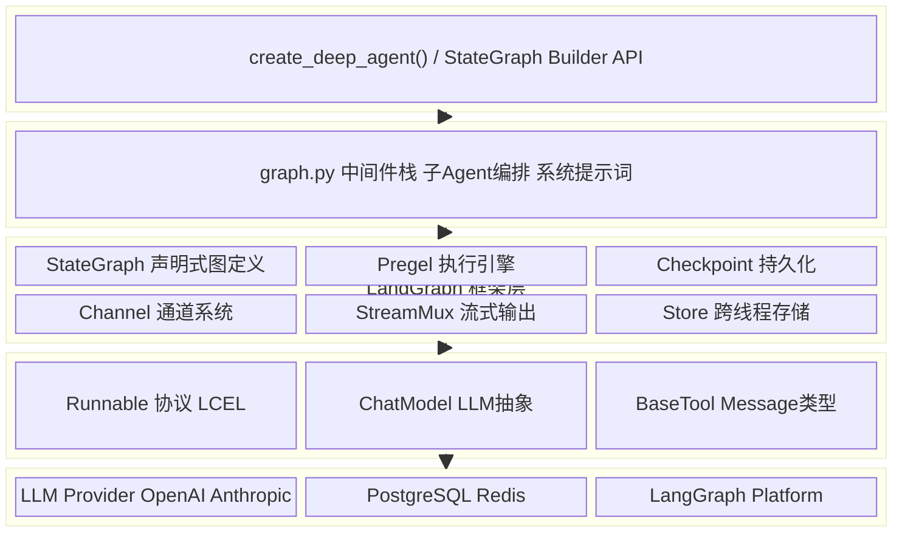

### 2.2 各层职责

| 层级 | 职责 | 关键模块 |
|------|------|---------|
| **用户代码层** | 定义业务逻辑、工具、提示词 | `StateGraph`, `create_deep_agent()` |
| **SDK 层** | 中间件编排、子 Agent、权限、技能 | `graph.py`, `middleware/`, `backends/` |
| **LangGraph 框架层** | 图编译、Pregel 执行、Checkpoint、流式 | `pregel/`, `graph/`, `checkpoint/`, `stream/` |
| **LangChain Core 层** | Runnable 协议、LLM 抽象、消息类型 | `runnables/`, `chat_models/`, `messages/` |
| **基础设施层** | LLM API 调用、数据库存储、部署平台 | OpenAI API, PostgreSQL, LangGraph Cloud |

---

## 3. 模块设计与依赖关系

### 3.1 LangGraph 核心模块依赖图

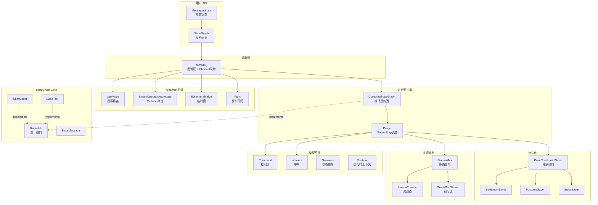

### 3.2 模块职责清单

| 模块 | 源码位置 | 核心职责 |
|------|---------|---------|
| `graph/state.py` | StateGraph | 声明式图定义：添加节点、边、条件路由 |
| `pregel/__init__.py` | Pregel | BSP 执行引擎：Super-Step 调度、Barrier 同步 |
| `channels/` | Channel 系统 | 状态存储与 Reducer 合并：LastValue、BinaryOperatorAggregate |
| `checkpoint/` | 持久化 | Checkpoint 保存/恢复/列举/删除 |
| `stream/` | 流式输出 | StreamMux 多路复用、Transformer 管线、StreamChannel |
| `types.py` | 类型定义 | Command、Interrupt、Checkpointer、Overwrite |
| `config.py` | 配置 | get_config、get_store — 运行时配置访问 |
| `store/` | 跨线程存储 | BaseStore、Item — 持久化键值存储 |
| `runtime.py` | 运行时 | Runtime、get_runtime — 运行时上下文注入 |
| `errors.py` | 错误体系 | GraphRecursionError、GraphInterrupt、NodeError 等 |

---

# 第二部分：核心抽象

## 4. 六大核心抽象

### 4.1 抽象关系总览

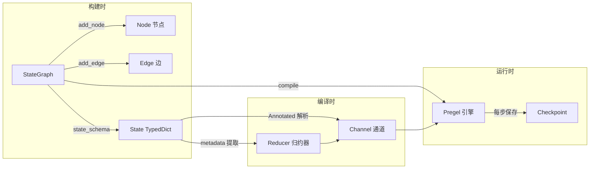

### 4.2 核心抽象对照表

| 抽象 | Pregel 对应 | 生命周期 | 用户可见性 |
|------|------------|---------|-----------|
| **StateGraph** | — | 构建时 | 直接操作 |
| **Node** | Vertex | 构建时定义 运行时执行 | 直接操作 |
| **Edge** | — | 构建时定义 编译时转换 | 直接操作 |
| **State/Reducer** | Message | 编译时解析 运行时生效 | 声明式（TypedDict） |
| **Channel** | Message Channel | 编译时创建 运行时读写 | 不可见（内部） |
| **Pregel** | Pregel Engine | 运行时 | 间接（通过 invoke/stream） |
| **Checkpoint** | Checkpoint | 运行时 | 可查询（get_state） |

---

## 5. State 与 Channel 设计

### 5.1 TypedDict 到 Channel 的映射流程

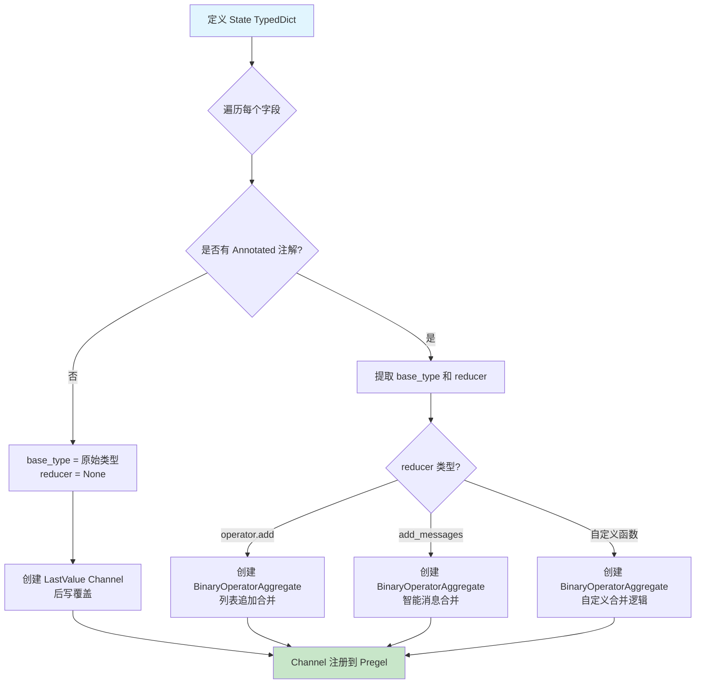

### 5.2 Channel 类型体系

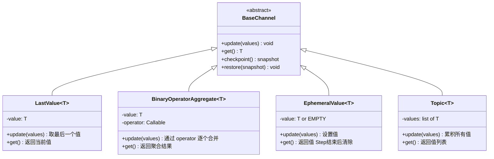

### 5.3 Reducer 并发写入合并示例

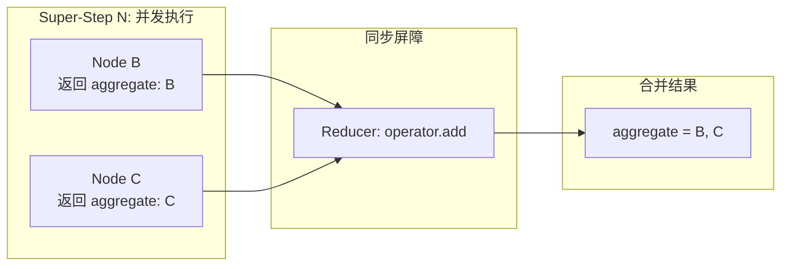

---

## 6. 表达式解析与 Runnable 协议 (LCEL)

### 6.1 LCEL 是什么

LCEL（LangChain Expression Language）是 Python 级的**组合式 API**，通过 `|` 操作符串联计算步骤。所有 LangChain/LangGraph 组件都实现 `Runnable` 协议。

### 6.2 Runnable 协议类图

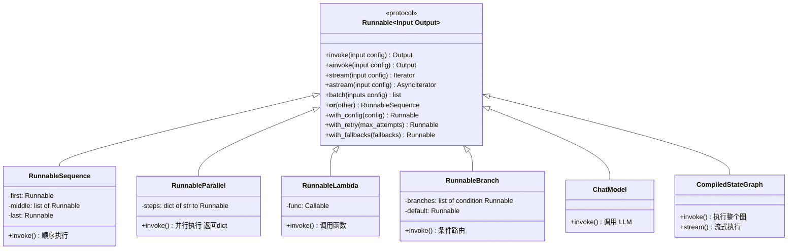

### 6.3 LCEL 组合流程图

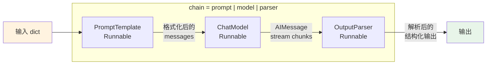

### 6.4 TypedDict 注解解析流程

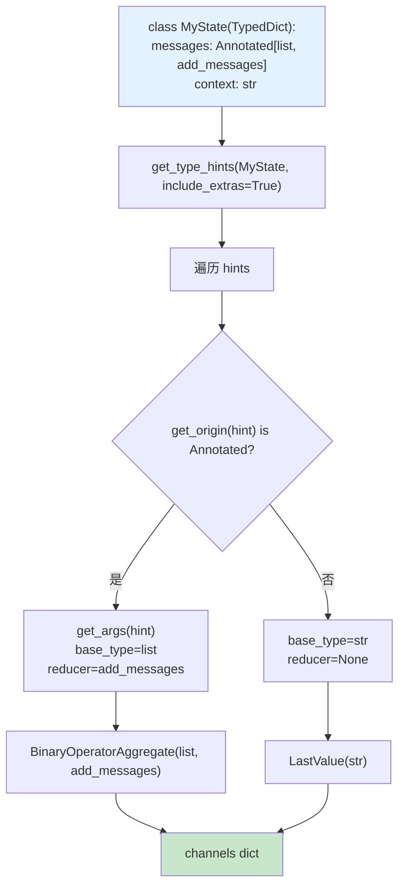

### 6.5 条件边求值流程

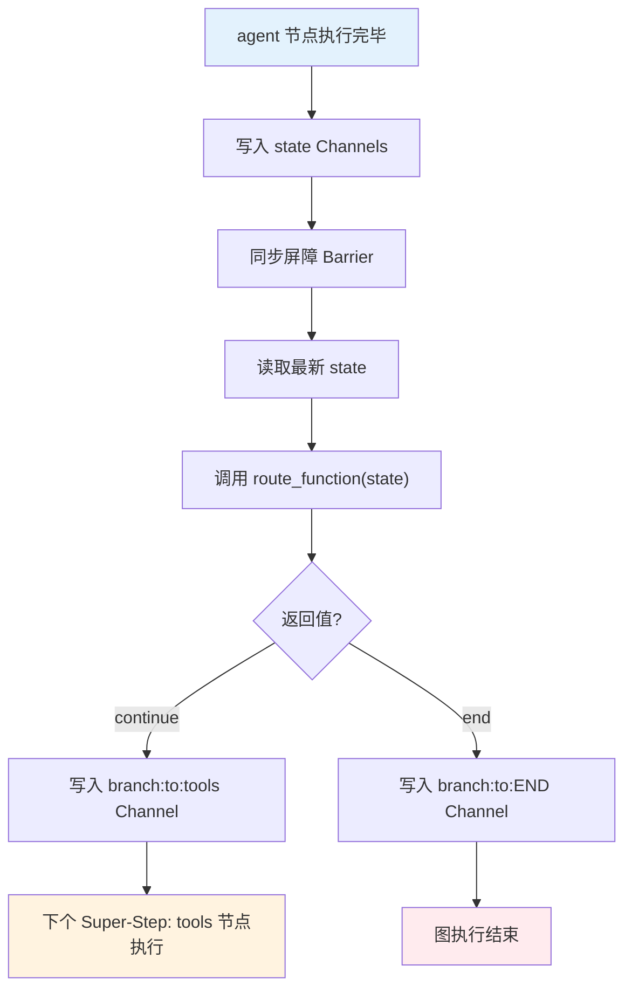

### 6.6 Runnable 嵌套统一性

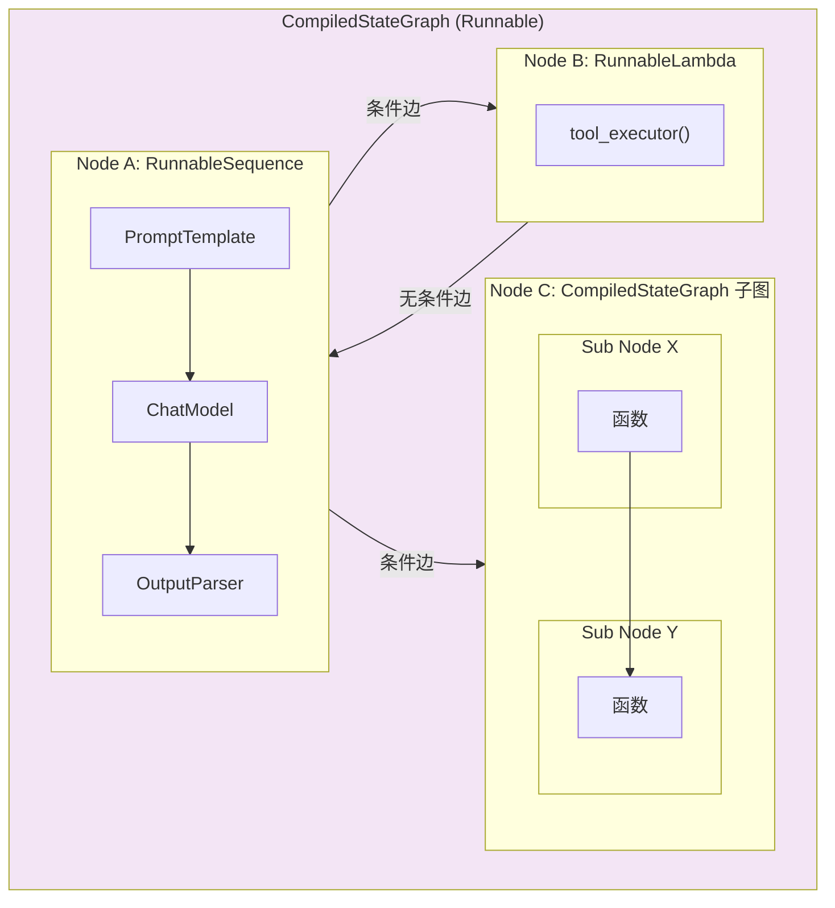

---

# 第三部分：编译与执行

## 7. 编译流程：StateGraph 到 Pregel

### 7.1 编译全流程图

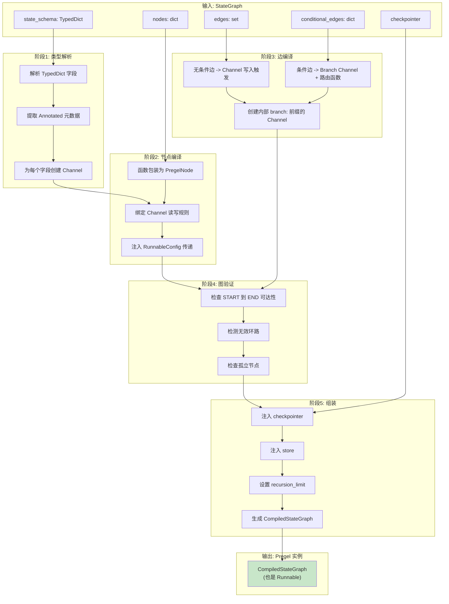

### 7.2 编译前后对比

| 编译前（StateGraph） | 编译后（Pregel） |
|---------------------|-----------------|
| `TypedDict` 字段 | `Channel` 实例 |
| Python 函数 | `PregelNode`（含读写规则） |
| `add_edge("A", "B")` | A 完成后触发 B 的调度 Channel |
| `add_conditional_edges(...)` | `branch:` Channel + 路由函数 |
| `checkpointer=InMemorySaver()` | 注入到 Pregel，每步自动保存 |
| 无 `recursion_limit` | 默认 25，防止无限循环 |

---

## 8. 执行模型：Super-Step 详解

### 8.1 Pregel BSP 执行模型

LangGraph 的 Pregel 引擎基于 **BSP（Bulk Synchronous Parallel）**模型：

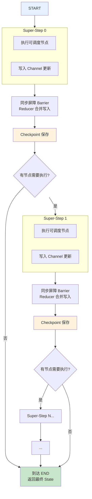

### 8.2 节点调度算法

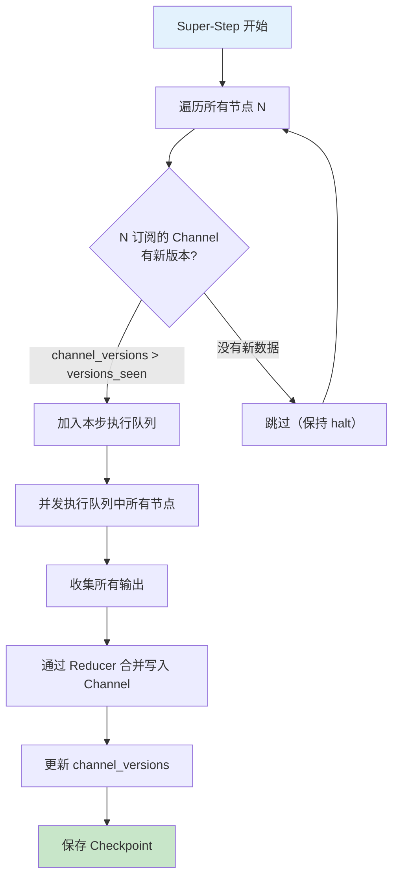

### 8.3 并行扇出/扇入时序图

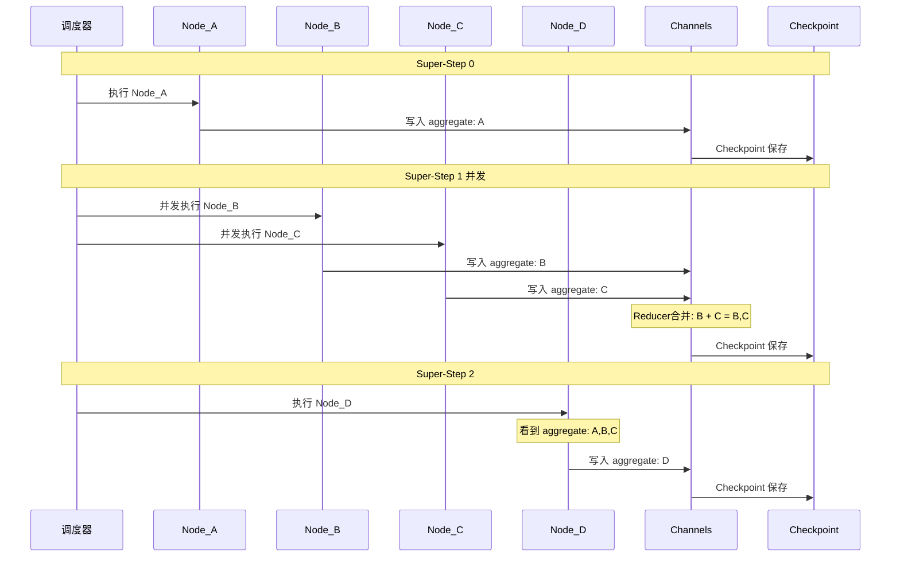

---

## 9. ReAct Agent 完整执行时序

### 9.1 带工具调用的完整时序图

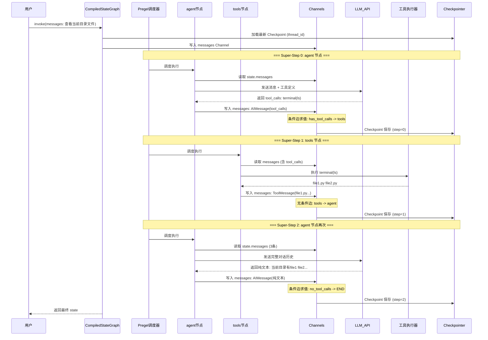

### 9.2 ReAct 循环状态图

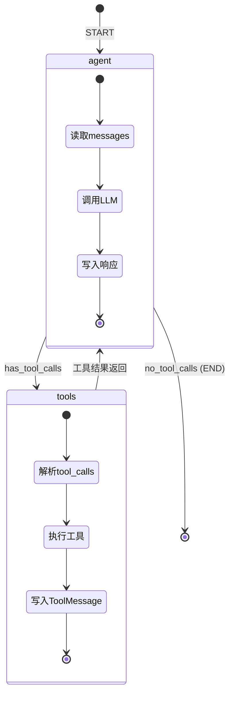

---

# 第四部分：持久化与流式

## 10. Checkpoint 持久化系统设计

### 10.1 Checkpoint 类图

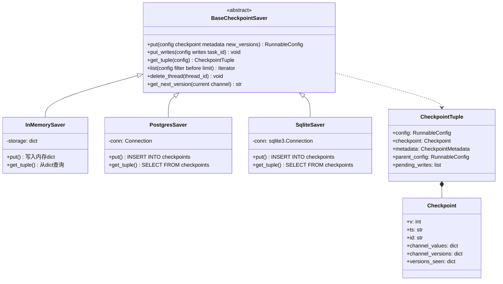

### 10.2 Checkpoint 读写时序图

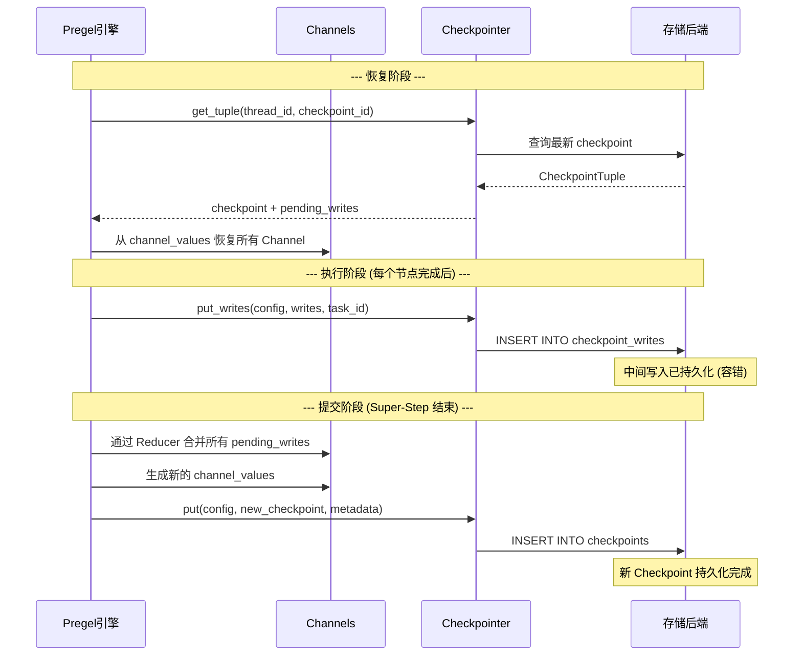

### 10.3 两阶段提交流程图

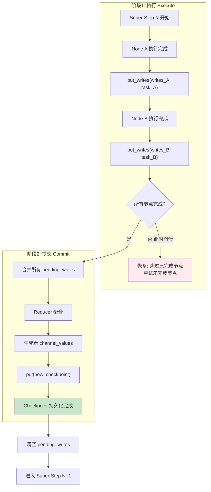

### 10.4 版本向量增量检测

```mermaid
flowchart LR
    subgraph VersionVector["版本向量对比"]
        CV["channel_versions<br/>messages: v3<br/>context: v2"]
        VS["versions_seen[agent]<br/>messages: v2<br/>context: v2"]
    end

    CV --> CMP{"逐字段比较"}
    VS --> CMP

    CMP -->|"messages: v3 > v2"| NEW["有新数据!<br/>调度 agent 节点"]
    CMP -->|"context: v2 == v2"| SKIP["无变化 跳过"]

    style NEW fill:#c8e6c9
    style SKIP fill:#e0e0e0
```

### 10.5 时间旅行与分叉

```mermaid
flowchart LR
    S0["Checkpoint<br/>Step 0<br/>input"] --> S1["Checkpoint<br/>Step 1<br/>agent"]
    S1 --> S2["Checkpoint<br/>Step 2<br/>tools"]
    S2 --> S3["Checkpoint<br/>Step 3<br/>agent"]
    S3 --> S4["Checkpoint<br/>Step 4<br/>END"]

    S2 -->|"update_state<br/>注入新消息"| S2F["Fork<br/>Step 2*"]
    S2F --> S3F["Fork<br/>Step 3*"]
    S3F --> S4F["Fork<br/>Step 4*"]

    style S2F fill:#fff3e0
    style S3F fill:#fff3e0
    style S4F fill:#fff3e0
```

### 10.6 存储后端对比

| 后端 | 持久性 | 性能 | 并发 | 适用场景 |
|------|--------|------|------|---------|
| InMemorySaver | 进程内 | 最快 | 单进程 | 开发测试 |
| SqliteSaver | 文件级 | 中等 | 单写者 | 单机原型 |
| PostgresSaver | 完全持久 | 依赖网络 | 多进程安全 | 生产环境 |
| RedisSaver | 可配置 | 低延迟 | 多进程安全 | 高频读写 |

### 10.7 PostgresSaver 表结构

```mermaid
erDiagram
    checkpoints {
        text thread_id PK
        text checkpoint_ns PK
        text checkpoint_id PK
        text parent_checkpoint_id
        text type
        bytea checkpoint
        jsonb metadata
        timestamptz created_at
    }

    checkpoint_writes {
        text thread_id PK
        text checkpoint_ns PK
        text checkpoint_id PK
        text task_id PK
        int idx PK
        text channel
        text type
        bytea value
    }

    checkpoints ||--o{ checkpoint_writes : "has pending"
```

---

## 11. Streaming 流式输出架构

### 11.1 Streaming 数据流

```mermaid
flowchart LR
    subgraph Engine["Pregel 引擎"]
        PE["产出 ProtocolEvent"]
    end

    subgraph Mux["StreamMux 多路复用"]
        T1["MessageTransformer"]
        T2["SubgraphTransformer"]
        T3["LifecycleTransformer"]
        SEQ["分配 seq 编号"]
    end

    subgraph Channels["StreamChannel"]
        SC1["updates Channel"]
        SC2["messages Channel"]
        SC3["events Channel"]
    end

    subgraph Consumer["消费者"]
        C1["graph.stream(mode=updates)"]
        C2["graph.stream(mode=messages)"]
        C3["graph.astream_events()"]
    end

    PE --> T1 --> T2 --> T3 --> SEQ
    SEQ --> SC1 --> C1
    SEQ --> SC2 --> C2
    SEQ --> SC3 --> C3
```

### 11.2 流模式对比

| stream_mode | 输出内容 | 粒度 | 典型用途 |
|------------|---------|------|---------|
| `updates` | 每个节点的 state 更新 | 节点级 | 追踪 Agent 步骤 |
| `messages` | LLM 输出的 token chunks | Token 级 | 实时打字效果 |
| `events` | 所有内部事件（含子图） | 事件级 | 调试/监控 |
| `custom` | 节点内自定义输出 | 自定义 | 进度通知 |

---

# 第五部分：高级编排

## 12. 子图与多 Agent 编排

### 12.1 子图嵌套执行时序图

```mermaid
sequenceDiagram
    participant User as 用户
    participant Parent as 父图 Pregel
    participant PNode as 父图节点
    participant SubGraph as 子图 Pregel
    participant SubA as 子图 Node_A
    participant SubB as 子图 Node_B
    participant PCP as 父图 Checkpoint
    participant SCP as 子图 Checkpoint

    User->>Parent: invoke(input)

    Note over Parent,SCP: === 父图 Super-Step 0 ===
    Parent->>PNode: 执行 pre_process 节点
    PNode-->>Parent: 返回更新
    Parent->>PCP: Checkpoint step=0

    Note over Parent,SCP: === 父图 Super-Step 1: 子图节点 ===
    Parent->>SubGraph: 将父图 state 传入子图

    Note over SubGraph,SCP: --- 子图 Super-Step 0 ---
    SubGraph->>SubA: 执行 Node_A
    SubA-->>SubGraph: 返回更新
    SubGraph->>SCP: 子图 Checkpoint (checkpoint_ns=sub)

    Note over SubGraph,SCP: --- 子图 Super-Step 1 ---
    SubGraph->>SubB: 执行 Node_B
    SubB-->>SubGraph: 返回更新
    SubGraph->>SCP: 子图 Checkpoint

    SubGraph-->>Parent: 子图输出写回父图 state
    Parent->>PCP: Checkpoint step=1

    Note over Parent,SCP: === 父图 Super-Step 2 ===
    Parent->>PNode: 执行 post_process 节点
    PNode-->>Parent: 返回更新
    Parent->>PCP: Checkpoint step=2

    Parent-->>User: 返回最终结果
```

### 12.2 子图状态共享策略

```mermaid
flowchart TD
    subgraph Strategy1["策略1: 共享 State 同 schema"]
        P1["父图 State"]
        S1["子图 State"]
        P1 <-->|"同名字段自动读写"| S1
    end

    subgraph Strategy2["策略2: 独立 State + 映射"]
        P2["父图 ParentState"]
        CONV1["输入转换函数"]
        S2["子图 SubState"]
        CONV2["输出转换函数"]
        P2 --> CONV1 --> S2
        S2 --> CONV2 --> P2
    end

    subgraph Strategy3["策略3: Command.PARENT"]
        S3["子图节点"]
        CMD["Command(update, goto, graph=PARENT)"]
        P3["父图 state + 路由"]
        S3 --> CMD --> P3
    end
```

---

## 13. Command 控制流机制

### 13.1 Command 工作流程

```mermaid
flowchart TD
    A["节点执行"] --> B{"返回类型?"}
    B -->|"普通 dict"| C["写入 Channel<br/>按正常边路由"]
    B -->|"Command 对象"| D["解析 Command"]
    D --> E["Command.update<br/>写入 state 更新"]
    D --> F["Command.goto<br/>指定下一个节点"]
    D --> G{"Command.graph?"}
    G -->|"None (默认)"| H["在当前图内路由"]
    G -->|"Command.PARENT"| I["向父图发送<br/>ParentCommand"]
    E --> J["合并到 Channel"]
    F --> J
    H --> J
    I --> K["父图处理 ParentCommand"]
```

### 13.2 Command vs 传统边的对比

| 特性 | 传统 Edge | Command |
|------|-----------|---------|
| 定义位置 | 构建时（静态） | 运行时（动态） |
| 状态更新 | 通过节点返回值 | `Command.update` |
| 路由 | `add_conditional_edges` | `Command.goto` |
| 跨图通信 | 不支持 | `Command.graph=PARENT` |
| 灵活性 | 路由逻辑与节点分离 | 路由逻辑在节点内部 |

---

# 第六部分：项目集成

## 14. Deep Agents SDK 中的 LangGraph 集成

### 14.1 集成架构图

```mermaid
graph TB
    subgraph DeepAgents["Deep Agents SDK"]
        GA["graph.py<br/>create_deep_agent()"]

        subgraph MW["中间件栈"]
            M1["TodoMiddleware"]
            M2["FilesystemMiddleware"]
            M3["SubAgentMiddleware"]
            M4["SummarizationMiddleware"]
            M5["SkillsMiddleware"]
            M6["MemoryMiddleware"]
            M7["PermissionMiddleware"]
        end

        subgraph BE["后端"]
            SB["StateBackend<br/>Channel read/send"]
            STB["StoreBackend<br/>BaseStore CRUD"]
        end
    end

    subgraph LG["LangGraph"]
        CSG2["CompiledStateGraph"]
        PR2["Pregel"]
        CH2["Channels"]
        CP2["Checkpoint"]
        ST2["Store"]
        RT2["Runtime"]
    end

    GA --> MW
    MW --> CSG2
    SB -->|"CONFIG_KEY_READ<br/>CONFIG_KEY_SEND"| CH2
    STB -->|"get_store()"| ST2
    M3 -->|"Command"| PR2
    M4 -->|"get_config()"| PR2
    M5 -->|"ToolRuntime"| RT2
    CSG2 --> PR2
    PR2 --> CH2
    PR2 --> CP2

    style GA fill:#e3f2fd
    style CSG2 fill:#c8e6c9
```

### 14.2 StateBackend 数据流

```mermaid
sequenceDiagram
    participant Tool as 文件操作工具
    participant SB as StateBackend
    participant Config as Pregel Config
    participant CH as files Channel
    participant CP as Checkpointer

    Tool->>SB: write(path, content)
    SB->>Config: _get_config()
    Config-->>SB: CONFIG_KEY_READ + CONFIG_KEY_SEND

    SB->>CH: read("files", fresh=False)
    CH-->>SB: 当前 files 快照

    SB->>SB: 构建更新 dict
    SB->>CH: send("files", update)
    Note over CH: Reducer 合并: dict merge

    CH->>CP: Super-Step 结束时自动 Checkpoint
    Note over CP: files 变更随图状态一起持久化
```

### 14.3 中间件与 LangGraph 类型映射

| 中间件 | 使用的 LangGraph 类型 | 用途 |
|--------|---------------------|------|
| SubAgentMiddleware | `Command` | 路由到子 Agent |
| AsyncSubAgentMiddleware | `Command` + `langgraph_sdk` | 远程 Agent 调用 |
| FilesystemMiddleware | `Command`, `Runtime` | 文件操作路由 |
| SummarizationMiddleware | `Command`, `get_config` | 获取 thread_id 做历史压缩 |
| PatchToolCallsMiddleware | `Runtime`, `Overwrite` | 修正工具调用参数 |
| SkillsMiddleware | `Runtime`, `ToolRuntime` | 动态注册技能工具 |
| PermissionMiddleware | `Command` | 权限校验后路由 |

---

## 附录：关键源码文件索引

| 文件路径 | 作用 |
|---------|------|
| `langgraph/graph/state.py` | `StateGraph` 类定义，图构建 API |
| `langgraph/pregel/__init__.py` | `Pregel` 执行引擎核心 |
| `langgraph/channels/` | Channel 实现（`LastValue`, `BinaryOperatorAggregate`, `Topic`） |
| `langgraph/checkpoint/base.py` | `BaseCheckpointSaver`, `CheckpointTuple` 定义 |
| `langgraph/checkpoint/memory.py` | `InMemorySaver` 实现 |
| `langgraph/checkpoint/postgres/` | PostgreSQL Checkpoint 后端 |
| `langgraph/checkpoint/sqlite/` | SQLite Checkpoint 后端 |
| `langgraph/types.py` | `Command`, `Interrupt`, `Checkpointer`, `Overwrite` 等类型 |
| `langgraph/config.py` | `get_config`, `get_store` 运行时配置 |
| `langgraph/store/base.py` | `BaseStore`, `Item` 持久存储抽象 |
| `langgraph/runtime.py` | `Runtime`, `get_runtime` 运行时上下文 |
| `langgraph/stream/` | Streaming v2 实现 (`StreamMux`, `StreamChannel`, `GraphRunStream`) |
| `langgraph/errors.py` | 错误类型体系 |
| `langgraph/graph/message.py` | `add_messages` Reducer 实现 |
| `langchain_core/runnables/base.py` | `Runnable`, `RunnableSequence`, `RunnableParallel` 核心定义 |
| `langchain_core/runnables/branch.py` | `RunnableBranch` 条件分支 |
| `libs/deepagents/deepagents/graph.py` | Deep Agents 对 LangGraph 的封装入口 |
| `libs/deepagents/deepagents/backends/state.py` | 基于 Channel read/send 的文件系统后端 |
| `libs/deepagents/deepagents/backends/store.py` | 基于 BaseStore 的持久文件系统后端 |
