# Memory 系统

> **文档状态**: Canonical（去重重构版 · 勿再拆出平行文档）  
> **Hermes 版本锚点**: 0.19.0 · **核对**: 2026-07-31 · [DOC_MAINTENANCE.md](DOC_MAINTENANCE.md)  
> **重构说明**: 原 Parts 合并稿存在大量跨 Part 重复与错误 API 示例；本版压成单一叙事。  
> **主模型**: Persistent Memory · Session Search · Optional External Provider（「六层」仅附录分析视角）。  
> **源码入口**: `tools/memory_tool.py`, `tools/session_search_tool.py`, `agent/memory_manager.py`, `agent/memory_provider.py`, `hermes_state.py`

---

## 目录

1. [结论：三层主模型](#1-结论三层主模型)
2. [术语约定](#2-术语约定)
3. [Layer A — Persistent Memory](#3-layer-a--persistent-memory)
4. [Layer B — Session Search](#4-layer-b--session-search)
5. [Layer C — Optional External Provider（运行时契约）](#5-layer-c--optional-external-provider运行时契约)
6. [协作、数据流与架构](#6-协作数据流与架构)
7. [使用指南](#7-使用指南)
8. [外部 Provider 参考](#8-外部-provider-参考)
9. [扩展机制（非 memory 主模型）](#9-扩展机制非-memory-主模型)
10. [附录 A：六层扩展视角](#10-附录-a六层扩展视角)
11. [附录 B：演进表述与时序](#11-附录-b演进表述与时序)

---

## 1. 结论：三层主模型

#### 1. 先说结论

当前 Hermes Agent 的 memory 主模型，最适合用 **三层结构** 来理解：

1. **Persistent Memory**
   `MEMORY.md` + `USER.md`，有界、可编辑、每个会话启动时冻结注入。
2. **Session Search**
   `state.db` + SQLite FTS5，对全部历史会话做全文检索，再按需摘要。
3. **Optional External Provider**
   Honcho、Mem0、Hindsight、Holographic、RetainDB、ByteRover、Supermemory 等外部增强层。

这三层是 Hermes 当前源码、官方文档、对外文章都能稳定对齐的主叙事。

**built-in memory** = 第 1 层 **Persistent Memory**（Hermes 自带，非外部插件）：

| | 内容 |
|--|--|
| **文件** | `~/.hermes/memories/MEMORY.md`、`USER.md` |
| **工具** | `memory`（add/replace/… → 立刻写盘） |
| **注入** | 会话启动读入，**冻结**进 system prompt（本轮中途改文件不刷新 prompt） |
| **对比** | Layer B = Session Search（`state.db`）；Layer C = External Provider（可选、附加，**最多一个**，**不能替代** built-in） |

文档里说 “built-in memory 始终保留”，意思是：开外部 provider 时，**MEMORY.md / USER.md 这套仍在**；external 只是加在旁边。

---

#### 2. 为什么不再把“六层”当主模型

过去把 skills、trajectory、compressor、fine-tuning 数据也一起纳入“六层记忆”有分析价值，但它有两个问题：

- 它把 **memory 本体** 和 **学习/训练/技能沉淀机制** 混在了一起。
- 它容易让读者误以为 `trajectory`、`skill_manage`、`compression` 都是同一个 memory 子系统的一部分。

因此，本套文档现在改成：

- **主模型**: 三层 memory
- **扩展机制**: skills、自进化、trajectory、training data

这样既不丢内容，也更贴近当前实现。

---

#### 3. 三层主模型

##### 3.1 Layer A: Persistent Memory

Persistent Memory 是 Hermes 最核心、最稳定的长期记忆层（文档与源码中的 **built-in memory** 即指本层）。

**组成**:

- `~/.hermes/memories/MEMORY.md`
- `~/.hermes/memories/USER.md`

**职责分工**:

- `MEMORY.md`: 环境事实、项目约定、工具 quirks、稳定经验
- `USER.md`: 用户画像、表达偏好、工作习惯、沟通风格

**关键特性**:

- 有明确字符上限，避免 system prompt 失控
- 会话开始时一次性加载
- 当前会话中途写盘后，**不会**刷新已注入的 system prompt
- 使用 `§` 分隔条目，支持多行条目
- 写入前做简单的安全扫描，拦截 prompt injection / exfiltration 模式

**写入时机（不是 `finalize_turn`）**:

Layer A **不在** `finalize_turn` 里批量写入。落盘发生在：

| 时机 | 路径 |
|------|------|
| **主路径** | ReAct 中途模型调用 **`memory` tool** → `tool_executor` → `memory_tool()` → `MemoryStore.save_to_disk()`，**立刻写盘** |
| **旁路** | 手动编辑 `~/.hermes/memories/*.md`；或 background review 等再次调用 `memory` tool |
| **写完后可选** | 成功时 `MemoryManager.notify_memory_tool_write` 可把同一变更**镜像到**外部 provider（Layer C）——这是 C 的旁听，不是 A 的轮末写 |

冻结进 system prompt 的快照只在 **会话启动** `load_from_disk()` 时拍下；中途写盘只更新磁盘，**不**热更新当前会话的 system 片段（见 §4.1 Frozen Snapshot）。

**易混：`finalize_turn` 写的是谁？**

| 调用 | 作用层 | 写什么 |
|------|--------|--------|
| `finalize_turn` → `_sync_external_memory_for_turn` → `sync_all` / `queue_prefetch_all` | **Layer C** | 本轮 user + final assistant 同步到外部 provider |
| `commit_memory_session`（压缩 / `/new` / session 结束） | **Layer C** / context engine | provider `on_session_end` 等，**不是**往 `MEMORY.md` 批量灌 |

一句话：**Layer A = `memory` 工具即时写文件；Layer C 才是轮末 `finalize_turn` sync。**

这层的设计目标不是“存一切”，而是“把最值得一直在线的事实放进上下文”。

##### 3.2 Layer B: Session Search

Session Search 解决的是另一类问题：不是“什么要永远在线”，而是“我们以前有没有聊过这件事”。

**组成**:

- `~/.hermes/state.db`
- SQLite `sessions` / `messages` 表
- FTS5 全文索引
- `session_search` 工具

**典型能力**:

- 搜索过去所有 CLI / gateway 会话
- 过滤当前会话 lineage，避免把当前上下文又搜回来
- 将命中的历史会话做 focused summary 返回给模型

Persistent Memory 和 Session Search 的关系：

- 前者是**精编长期记忆**
- 后者是**完整会话档案库**

##### 3.3 Layer C: Optional External Provider

外部 provider 不是对 built-in memory 的替代，而是附加增强。

**当前主线约束**:

- built-in memory 始终保留
- 额外 external provider 最多只启用一个
- provider 通过统一 `MemoryProvider` 生命周期接入

**主要用途**:

- 语义召回
- 跨会话用户建模
- 更深的 profile / relation / conclusion 抽取
- 第三方持久化与知识图谱

## 2. 术语约定

#### 8. 本套文档的术语约定

为避免后续文档继续混乱，统一采用以下术语：

- **built-in memory**: 与 **Persistent Memory / Layer A** 同义 — Hermes 自带的 `MEMORY.md` + `USER.md` + `memory` tool；不是 Honcho / Mem0 等外部插件
- **Persistent Memory**: 专指 `MEMORY.md` + `USER.md`
- **Session Search**: 专指 `state.db` + FTS5 + `session_search`
- **External Memory Provider**: 专指 Honcho / Mem0 等外部插件（Layer C；附加、最多一个、不替代 built-in）
- **Skills**: 可复用方法论与知识文档，不算 built-in persistent memory
- **Trajectory**: 训练 / RL / 离线分析资产，不算在线 memory 主层

后续章节如果再出现“六层”，默认都表示**扩展分析视角**，不是 Hermes 当前对外主模型。

### 一页对比表


| 维度 | Persistent Memory | Session Search | External Provider |
|------|-------------------|----------------|-------------------|
| **核心载体** | `MEMORY.md` + `USER.md` | `state.db` + FTS5 | 外部 API / 数据库 |
| **是否默认启用** | ✅ 是 | ✅ 是 | ⚠️ 可选 |
| **是否有固定上限** | ✅ 有字符上限 | ❌ 基本无硬上限 | 取决于 provider |
| **注入方式** | 会话启动时冻结注入 system prompt | 按需调用 `session_search` | system block + prefetch + sync |
| **最适合存什么** | 稳定事实、偏好、约定、经验 | 历史任务、过去讨论、一次性上下文 | 更深用户建模、语义召回、知识图谱 |
| **更新时机** | `memory` tool 或手动编辑文件 | 每轮 / 每会话持续归档 | provider 自己的 sync 机制 |
| **当前会话中途写入是否立刻可见** | ❌ 不更新 frozen prompt | ✅ 再查即可取到 | 取决于 provider |
| **设计风险** | 容量有限，需精编 | 检索与摘要有额外成本 | 外部依赖、网络延迟、隐私出站 |

## 3. Layer A — Persistent Memory

> 实现真相源。字符上限、冻结快照、`memory` tool API 以本节为准。

### 3. Built-in Persistent Memory

#### 3.1 载体与路径

当前 built-in persistent memory 的真实载体是：

- `~/.hermes/memories/MEMORY.md`
- `~/.hermes/memories/USER.md`

不是旧文档中写的：

- `~/.hermes/MEMORY.md`
- `~/.hermes/USER.md`
- `PROJECT.md`

这些旧路径需要视为历史表述，不再作为当前实现结论。

#### 3.2 存什么

`MEMORY.md` 用来存：

- 环境事实
- 项目约定
- 工具 quirks
- 稳定经验
- 反复会影响后续行为的背景知识

`USER.md` 用来存：

- 用户身份信息
- 表达风格
- 工作偏好
- 技术水平
- 讨厌什么、希望避免什么

#### 3.3 不存什么

源码里已经把边界写得很明确：

- 不要存 task progress
- 不要存 session outcome
- 不要存临时 TODO
- 不要存大段原始数据

这些内容应该留给 `session_search`，或者沉淀成 skill。

#### 3.4 字符上限与设计动机

默认配置：

- `memory_char_limit = 2200`
- `user_char_limit = 1375`

这不是拍脑袋的限制，而是为了让 built-in memory 始终维持在一个低而稳定的 prompt 成本区间。

Hermes 这里刻意使用 **字符上限** 而不是 token 上限，因为字符数对模型无关，配置和判断都更稳定。

#### 3.5 冻结快照模式

Hermes built-in memory 的关键实现不是“自动热更新”，而是 **frozen snapshot**。

会话启动时：

1. `MemoryStore.load_from_disk()`
2. 读取两个文件
3. 去重
4. 渲染成 system prompt block
5. 存入 `_system_prompt_snapshot`

之后当前会话里：

- `memory` 工具写盘
- live state 会变化
- tool response 会显示最新状态
- 但 system prompt 中的记忆块不会更新

下一个 session 才会重新载入。

这是 Hermes 和很多“边写边注入”系统最本质的差异。

#### 3.6 为什么要冻结

两个主要原因：

- **prefix cache 稳定**
- **避免 prompt 中途漂移**

这让 memory 变成了“下一次会话的 durable context”，而不是“当前回合的 mutable scratchpad”。

#### 3.7 写入安全

由于 built-in memory 会进入 system prompt，所以 Hermes 对写入做了轻量安全扫描。

当前扫描类型包括：

- prompt injection 模式
- 角色劫持模式
- 明显 credential exfiltration 模式
- SSH backdoor / 持久化痕迹
- 不可见 Unicode 字符

这不是一个完整的 DLP/安全网关，但足够说明 Hermes 已经把“记忆是 prompt 注入面”当作真实风险来处理。

#### 3.8 `memory` tool 行为

当前 `memory` tool 支持：

- `add`
- `replace`
- `remove`

不再推荐继续写成旧文档中的 `write_memory`。

`replace` / `remove` 都使用 `old_text` 做唯一子串匹配，而不是要求完整 entry ID。

这有几个工程优点：

- 模型容易学会
- prompt 更短
- 用户手动操作也更自然

同时也带来一个约束：

- 如果子串命中多个条目，会报错，要求更具体

#### 3.9 去重与文件锁

built-in memory 不是“随便改文本文件”，而是做了几层实用保护：

- exact duplicate reject
- 文件级锁，避免并发读改写冲突
- 原子写回
- HERMES_HOME 动态解析，支持 profile-scoped memory

这些细节决定了 Hermes built-in memory 不是一个 demo 功能，而是一个可以长期跑的工程实现。

#### 3.10 built-in memory 生命周期

把 built-in memory 的生命周期拆开看，会更容易理解 frozen snapshot 的真实作用：

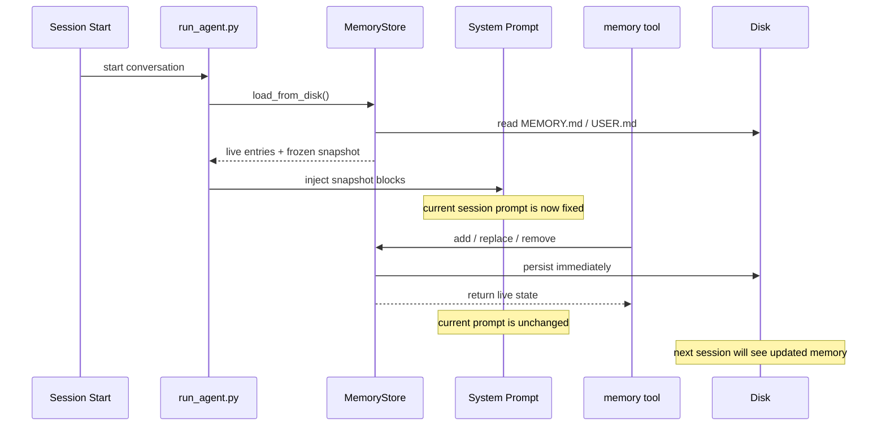

这个时序图说明了 Hermes 的一个关键取舍：

- 写盘是实时的
- prompt 生效是延迟到下一个 session 的

这并不是实现不完整，而是刻意的架构决策。
### 3.1 载体与路径

当前 built-in persistent memory 的真实载体是：

- `~/.hermes/memories/MEMORY.md`
- `~/.hermes/memories/USER.md`

不是旧文档中写的：

- `~/.hermes/MEMORY.md`
- `~/.hermes/USER.md`
- `PROJECT.md`

这些旧路径需要视为历史表述，不再作为当前实现结论。

### 3.2 存什么

`MEMORY.md` 用来存：

- 环境事实
- 项目约定
- 工具 quirks
- 稳定经验
- 反复会影响后续行为的背景知识

`USER.md` 用来存：

- 用户身份信息
- 表达风格
- 工作偏好
- 技术水平
- 讨厌什么、希望避免什么

### 3.3 不存什么

源码里已经把边界写得很明确：

- 不要存 task progress
- 不要存 session outcome
- 不要存临时 TODO
- 不要存大段原始数据

这些内容应该留给 `session_search`，或者沉淀成 skill。

### 3.4 字符上限与设计动机

默认配置：

- `memory_char_limit = 2200`
- `user_char_limit = 1375`

这不是拍脑袋的限制，而是为了让 built-in memory 始终维持在一个低而稳定的 prompt 成本区间。

Hermes 这里刻意使用 **字符上限** 而不是 token 上限，因为字符数对模型无关，配置和判断都更稳定。

### 3.5 冻结快照模式

Hermes built-in memory 的关键实现不是“自动热更新”，而是 **frozen snapshot**。

会话启动时：

1. `MemoryStore.load_from_disk()`
2. 读取两个文件
3. 去重
4. 渲染成 system prompt block
5. 存入 `_system_prompt_snapshot`

之后当前会话里：

- `memory` 工具写盘
- live state 会变化
- tool response 会显示最新状态
- 但 system prompt 中的记忆块不会更新

下一个 session 才会重新载入。

这是 Hermes 和很多“边写边注入”系统最本质的差异。

### 3.6 为什么要冻结

两个主要原因：

- **prefix cache 稳定**
- **避免 prompt 中途漂移**

这让 memory 变成了“下一次会话的 durable context”，而不是“当前回合的 mutable scratchpad”。

### 3.7 写入安全

由于 built-in memory 会进入 system prompt，所以 Hermes 对写入做了轻量安全扫描。

当前扫描类型包括：

- prompt injection 模式
- 角色劫持模式
- 明显 credential exfiltration 模式
- SSH backdoor / 持久化痕迹
- 不可见 Unicode 字符

这不是一个完整的 DLP/安全网关，但足够说明 Hermes 已经把“记忆是 prompt 注入面”当作真实风险来处理。

### 3.8 `memory` tool 行为

当前 `memory` tool 支持：

- `add`
- `replace`
- `remove`

不再推荐继续写成旧文档中的 `write_memory`。

`replace` / `remove` 都使用 `old_text` 做唯一子串匹配，而不是要求完整 entry ID。

这有几个工程优点：

- 模型容易学会
- prompt 更短
- 用户手动操作也更自然

同时也带来一个约束：

- 如果子串命中多个条目，会报错，要求更具体

### 3.9 去重与文件锁

built-in memory 不是“随便改文本文件”，而是做了几层实用保护：

- exact duplicate reject
- 文件级锁，避免并发读改写冲突
- 原子写回
- HERMES_HOME 动态解析，支持 profile-scoped memory

这些细节决定了 Hermes built-in memory 不是一个 demo 功能，而是一个可以长期跑的工程实现。

### 3.10 built-in memory 生命周期

把 built-in memory 的生命周期拆开看，会更容易理解 frozen snapshot 的真实作用：


这个时序图说明了 Hermes 的一个关键取舍：

- 写盘是实时的
- prompt 生效是延迟到下一个 session 的

这并不是实现不完整，而是刻意的架构决策。

## 4. Layer B — Session Search

### 4.1 它解决什么问题

Persistent Memory 解决的是“什么值得一直在线”。

Session Search 解决的是：

- 我们以前讨论过吗
- 上次是怎么做的
- 某个 bug / task / decision 是在哪个 session 里出现的

这是一套“完整档案 + 按需召回”机制。

### 4.2 存储载体

当前会话归档存在：

- `~/.hermes/state.db`

关键表：

- `sessions`
- `messages`
- `messages_fts`

不是旧文档中写的 `hermes_sessions.db`。

### 4.3 运行时角色

SessionDB 主要做三件事：

1. 保存 session 元信息
2. 保存完整消息流
3. 支持 FTS5 搜索

对 Hermes 来说，它既是 history store，也是 `session_search` 的底座。

### 4.4 `session_search` 的工作方式

`session_search()` 的核心流程大致是：

1. 对 query 做 FTS5 搜索
2. 过滤隐藏 source
3. 解析 parent / child session lineage
4. 排除当前活动会话链
5. 对命中的历史 session 做 focused summarization

这里一个很重要的工程点是：

- Hermes 不只是“把匹配片段直接塞回来”
- 它会先按 session 聚合，再摘要

因此它更像“历史会话 recall tool”，而不是“原始数据库 search dump”。

### 4.5 和 built-in memory 的分工

一个简单判断规则：

- 如果事实应该在每次会话都立即生效，用 `memory`
- 如果只是“以后也许要回忆某次讨论”，用 `session_search`

典型例子：

- “用户喜欢简洁回答” -> `USER.md`
- “这个仓库用 tabs, 120 列, Google docstrings” -> `MEMORY.md`
- “上周修过某个 auth bug，具体在第几轮怎么定位” -> `session_search`
- “今天刚跑完一次临时迁移脚本” -> `session_search`

### 4.6 常见失败模式与边界

Session Search 虽然很强，但它不是魔法层。常见的边界和失败模式包括：

- **FTS 命中依赖字面文本**
  如果 query 和历史表述差异太大，初始召回可能不理想。
- **历史很多时，摘要本身有选择性**
  Hermes 不是把原始记录全返回，而是做 focused summary，所以它天然存在信息压缩。
- **当前 lineage 会被主动排除**
  这能避免自我重复，但也意味着“刚刚发生的内容”不该依赖 `session_search` 去拿。
- **它是回忆工具，不是持久偏好层**
  用它替代 built-in memory 会导致每次都要重新搜索历史。

理解这些边界，比记住“它能搜历史会话”更重要。

## 5. Layer C — Optional External Provider（运行时契约）

> 插件细节、配置与自定义见 [§8](#8-外部-provider-参考)。本节只保留与 Agent 运行时的契约。

### 5.1 它是什么

external provider 是 Hermes memory 的第三层，不替代 built-in，只做增强。

当前主线约束很明确：

- built-in memory 始终存在
- external provider 最多一个

### 5.2 为什么只允许一个

源码里这个限制很明确，原因也很务实：

- 避免 tool schema 膨胀
- 避免多个 backend 同时写入导致冲突
- 避免“到底该信谁”的记忆治理问题

所以 Hermes 不是“把所有 provider 全开”，而是“1 个 curated 本地层 + 1 个增强层”。

### 5.3 生命周期

provider 生命周期由 `MemoryManager` 统一编排：

- `initialize()`
- `system_prompt_block()`
- `prefetch()`
- `queue_prefetch()`
- `sync_turn()`
- `get_tool_schemas()`
- `handle_tool_call()`
- `shutdown()`

可选 hook：

- `on_turn_start`
- `on_session_end`
- `on_pre_compress`
- `on_memory_write`
- `on_delegation`

### 5.4 注入与同步时机

在 `run_agent.py` 中，相关时序大致是：

1. 如果配置了 `memory.provider`，初始化 `MemoryManager`
2. system prompt 组装时追加 provider 的 system block
3. 每轮开始前调用 `on_turn_start()`
4. 每轮 API 调用前做一次 `prefetch_all()`
5. 每轮结束后 `sync_all()` + `queue_prefetch_all()`
6. 会话结束时 `on_session_end()`

这套时序让 provider 有机会做：

- 低延迟预取
- 后台写入
- end-of-session 提炼
- session-aware user modeling

### 5.5 built-in 与 provider 的桥接

一个容易忽略但很重要的细节：

当模型调用 built-in `memory` 工具做 `add` / `replace` 时，`run_agent.py` 会把这次写入通过 `on_memory_write()` 通知 external provider。

这意味着：

- built-in memory 不是完全孤立的
- provider 可以选择镜像或吸收这类 durable write

### 5.6 外部存储写入策略：只写问答，不写过程

External Provider 的 `sync_all()` 机制遵循**“最小化语义暴露”**原则。它写入外部存储的内容非常精简：

| 维度 | 写入内容 (External Provider) | 不写入内容 |
|------|---------------------------|------------|
| **核心数据** | ✅ 用户原始消息 (`original_user_message`) <br> ✅ AI 最终文本响应 (`final_response`) | ❌ 工具调用过程 (Tool Calls) <br> ❌ 工具执行结果 (Tool Results) <br> ❌ System Prompt <br> ❌ 中间思考过程 (Thinking/Reasoning) |
| **设计逻辑** | 聚焦“问”与“答”，提取人类可读的语义事实。 | 避免噪音（如几千行代码）、保护隐私、降低 API 成本。 |
| **对比 SessionDB** | 仅同步当前轮次的对话对。 | SessionDB 会归档完整的 `messages` 列表（含所有技术细节）。 |

这种设计让 External Provider 专注于**语义召回**和**用户建模**，而不是成为另一个日志存储库。

### 5.7 为什么 external provider 仍然不应喧宾夺主

从产品视角看，external provider 往往最“高级”，因为它带来了：

- semantic recall
- richer user modeling
- 外部知识图谱或 profile

但从架构视角看，Hermes 故意没有让 provider 成为唯一中心，原因很务实：

- 没有 provider 时，系统仍要能工作
- provider 出问题时，不能把整个 agent 拖死
- 不是所有部署都接受数据出站
- built-in memory 和 session archive 更容易被用户理解和调试

所以 Hermes 的姿态不是：

- “provider 才是真正的 memory”

而是：

- “provider 是第三层增强，不是对前两层的取代”

---

### 6. Prompt 注入与上下文边界

### 6.1 built-in memory 注入点

built-in memory 在 system prompt 组装阶段直接注入：

- `MEMORY.md` block
- `USER.md` block

这是稳定、低延迟、固定成本的上下文。

### 6.2 recalled context 注入点

external provider 的 prefetch 结果不会直接伪装成用户输入，而是经过：

- `sanitize_context()`
- `build_memory_context_block()`

包装成 `<memory-context>` fenced block。

这层 fence 的目的很清楚：

- 不让模型误把 recall context 当成新的 user instruction
- 降低 provider 输出再次污染 prompt 的风险

### 6.3 为什么这很重要

Hermes memory 的核心安全设计，不只是扫描写入内容，还包括：

- 对 recall 结果做 context fencing
- 将“durable memory”和“recalled context”区分处理

这也是 Hermes 相比“把所有记忆直接拼到 prompt 里”的系统更稳的地方。

## 6. 协作、数据流与架构

### 设计目标与非目标

#### 1.1 设计目标

如果只看功能名称，Hermes memory 很容易被误解成“多加几个存储后端”。但从源码上看，它追求的是下面几个更具体的目标：

- **低成本长期上下文**
  让一小部分高价值事实稳定进入 prompt，而不是每轮都做昂贵召回。
- **完整历史可追溯**
  让过去对话可检索、可回顾、可摘要，而不是只保留当前窗口。
- **本地优先但可增强**
  在没有外部依赖时，内建 memory 和 session archive 仍然可用；需要时再接 provider。
- **不把 recall 冒充成 user input**
  这是 Hermes memory 在安全和行为稳定性上的核心底线。
- **不让 memory 侵占全部系统复杂度**
  memory 重要，但它必须和 skills、tool loop、gateway、delegation 保持边界。

#### 1.2 非目标

同样重要的是，Hermes 当前**不追求**下面这些事情：

- **不追求 mid-session 热更新 system prompt**
  built-in memory 设计上就是 next-session-oriented，而不是 mutable prompt store。
- **不追求无限容量**
  `MEMORY.md` / `USER.md` 明确受限，强迫系统做 curated memory 而不是日志堆积。
- **不追求多个外部 provider 叠加**
  工程上优先避免 schema 冲突、治理混乱和双重写入。
- **不把 skill / trajectory 强行当成 memory 主层**
  它们相关，但角色不同。

### MemoryManager 与协作矩阵

#### 2.3 协作矩阵

这套系统最容易误判的地方,是把所有“看起来像记忆”的东西混在一起。下面这张协作矩阵用来区分谁负责什么:

| 组件 | 它真正负责的事 | 它不应该负责的事 | 主要协作对象 |
|------|----------------|------------------|--------------|
| `MemoryStore` | `MEMORY.md` / `USER.md` 的加载、冻结快照、文件级读写 | 外部 provider 生命周期 | `run_agent.py`, `memory_tool.py` |
| `memory` tool | 把长期稳定事实写入 built-in persistent memory | 搜索完整历史会话 | `MemoryStore` |
| `SessionDB` | 会话存档、FTS5 索引、历史检索底座 | system prompt 注入 | `run_agent.py`, `session_search_tool.py` |
| `session_search` | 基于 `state.db` 做历史回忆和 focused summary | 持久写入长期偏好 | `SessionDB` |
| `MemoryManager` | 编排一个 external provider 的 prefetch / sync / hooks | 替代 built-in memory 本体 | `MemoryProvider`, `run_agent.py` |
| external provider | 更深的语义 recall / user modeling / 外部持久化 | 管理 Hermes 全部记忆策略 | `MemoryManager` |

看这张表时,最重要的一条是:

> Hermes 不是一个“统一大 memory 仓库”,而是几套边界清晰、用途不同的记忆机制并行存在。

#### 2.4 MemoryManager 内部架构

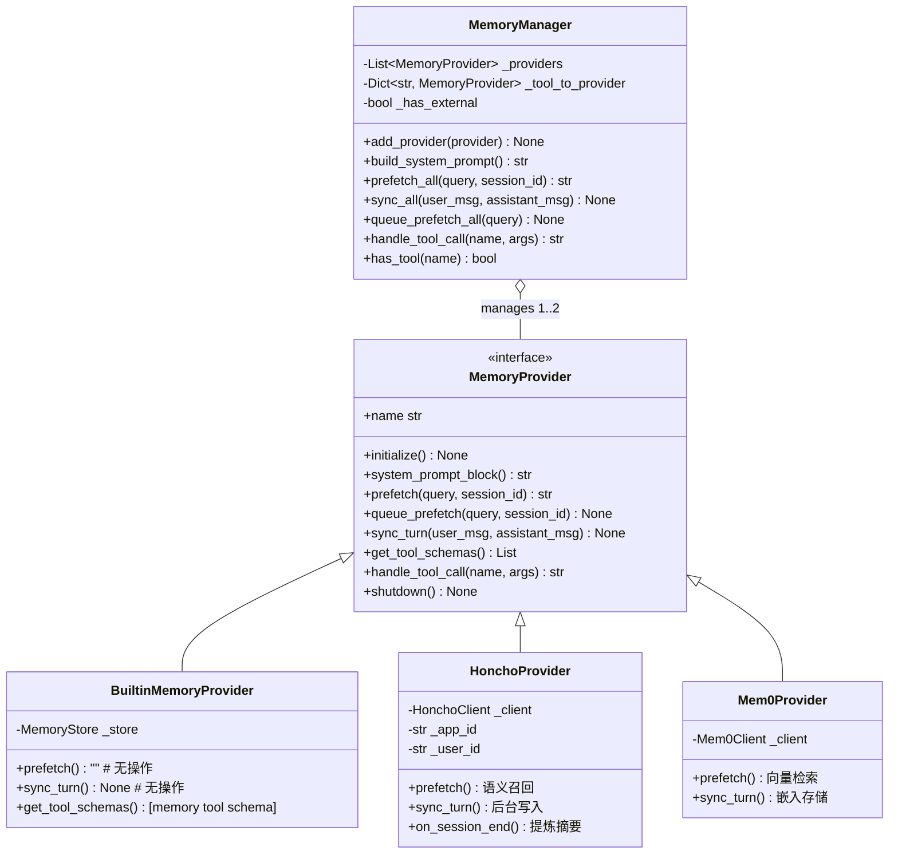

**关键设计约束**:
- ✅ Built-in Provider 始终存在且不可移除
- ✅ 最多允许 **1 个** External Provider(避免工具 schema 冲突)
- ✅ 单 Provider 失败不阻塞其他 Provider
- ✅ Tool name 冲突检测与警告

### 完整数据流向（含压缩、沉淀与第二轮拉取）


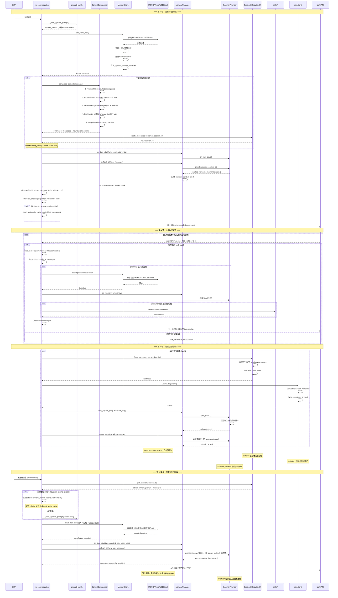

**关键观察**:
1. **写盘是实时的** - `memory` 工具立即更新 `MEMORY.md` / `USER.md`
2. **Prompt 生效是延迟的** - 当前会话仍使用 frozen snapshot，下一轮才重新加载
3. **External Provider 是增强的** - 提供实时语义召回，但不替代 built-in
4. **压缩是主动的** - 上下文超限时触发 ContextCompressor，创建子会话链
5. **沉淀是多路径的** - SessionDB (归档) + Trajectory (训练) + External (向量库) 并行写入
6. **预取是异步的** - `queue_prefetch_all` 在后台 daemon thread 中预热下一轮上下文
7. **缓存是优化的** - Anthropic prefix cache 通过复用 stored system_prompt 保持命中

### 当前实现真正的「层级」与易误判点

#### 7. 当前实现真正的“层级”

如果一定要讲层级，我建议用下面这组更贴近现实的维度，而不是旧的六层官方口径：

| 维度 | 当前实现 |
|------|----------|
| **始终在线长期记忆** | `MEMORY.md` + `USER.md` |
| **历史会话档案** | `state.db` + FTS5 |
| **可选语义增强** | external provider |
| **运行态工作记忆** | 当前 messages / tool loop / context window |
| **方法论沉淀** | skills |
| **训练与离线资产** | trajectories / compressor / RL |

这样更容易避免概念污染。

---

#### 8. 设计优劣势

##### 8.1 优势

- 主层清晰：built-in memory 和 session archive 职责不同
- 本地优先：没有外部 provider 也能工作
- 成本稳定：frozen snapshot 避免每轮重注入
- 安全意识较强：写入扫描 + fenced recall
- 可扩展：provider interface 很清楚

##### 8.2 代价

- built-in memory 不会在当前 session 热更新
- 长期记忆容量刻意受限，需要持续精编
- external provider 只能单选，不能叠加
- 对初学者来说，memory / session_search / skills 边界不直观

---

#### 9. 读源码时最容易误判的点

##### 9.1 不要把 `MemoryManager` 当成 built-in memory 本体

当前 `MemoryManager` 主要是 external provider 编排器。

built-in persistent memory 的核心实现其实是：

- `MemoryStore`
- `memory` tool

##### 9.2 不要把 `session_search` 当成 provider

`session_search` 是 Hermes 核心工具，不属于 external provider 插件体系。

##### 9.3 不要把 skills 当成 built-in memory

skills 可以沉淀经验，但它们不是 `MEMORY.md` / `USER.md` 那套持久记忆文件。

---

## 7. 使用指南

### 1. 日常使用只需要记住三件事

1. **长期稳定事实** 存到 `memory`
2. **历史任务和讨论细节** 用 `session_search`
3. **可复用方法论** 沉淀成 skill

如果把这三件事混在一起，Hermes 的记忆系统就会迅速失真。

---

### 2. `memory` 工具到底应该怎么用

#### 2.1 两个 target

`memory` 工具只操作两个目标：

- `target="memory"`
- `target="user"`

含义分别是：

- `memory`: 你的环境、项目、惯例、教训
- `user`: 用户是谁、怎么沟通、喜欢什么、讨厌什么

#### 2.2 三个 action

当前稳定 action 只有三个：

- `add`
- `replace`
- `remove`

其中：

- `replace` 需要 `old_text`
- `remove` 需要 `old_text`
- `old_text` 是唯一子串，不是完整条目 ID

#### 2.3 最佳实践

好的 memory entry 应该满足：

- 稳定
- 可复用
- 高密度
- 会影响后续行为

例如：

```text
项目 ~/work/api 使用 Go 1.22 + sqlc + chi。测试命令是 `make test`。CI 在 GitHub Actions。
```

而不是：

```text
今天我们看了一个 bug，后来试了几次，感觉可能是数据库或者缓存问题。
```

---

### 3. 什么时候该存 memory

#### 3.1 应主动保存的内容

- 用户表达了稳定偏好
- 用户纠正了 agent
- agent 发现了环境事实
- agent 学到项目约定
- agent 发现了将来还会反复踩到的工具 quirks

#### 3.2 不该存进 memory 的内容

- 临时进度
- 当前任务的中间状态
- 一次性 debug 上下文
- 大段日志
- 已经很容易重新发现的公开事实

#### 3.3 一个简单判断标准

问自己：

> “如果下周开启一个全新会话，这条信息是否仍然值得自动进 prompt？”

如果答案不是明确的“是”，大概率就不该进 memory。

---

### 4. `session_search` 什么时候用

`session_search` 是 Hermes 的“长时会话回忆”，不是 built-in memory 的补丁。

适合它的场景：

- “我们以前修过这个问题吗？”
- “上次那个方案最后为什么放弃了？”
- “某个 session 里提到过哪个路径 / 命令 / 时间点？”
- “最近几次对这个用户的需求变化是什么？”

不适合它的场景：

- 代替 `MEMORY.md` 保存长期偏好
- 保存必须每次都立即在 prompt 里可见的约定

---

### 5. memory vs session_search vs skills

| 需求 | 该用什么 | 原因 |
|------|----------|------|
| 用户偏好 | `memory(target=\"user\")` | 下次会话一开始就要生效 |
| 项目约定 | `memory(target=\"memory\")` | 属于长期稳定背景 |
| 上次任务细节 | `session_search` | 属于历史会话召回 |
| 可复用步骤 / 方法论 | skill | 这是“怎么做”，不是“记住什么” |
| 临时 todo | todo | 这是运行态任务管理，不是持久记忆 |

这是 Hermes memory 最需要反复强调的一张表。

---

### 6. capacity management

#### 6.1 为什么要小而精

Hermes 的 built-in memory 是 system prompt 成本的一部分。

所以 built-in memory 的目标不是“越多越好”，而是：

- 少
- 稳
- 准

#### 6.2 容量满了怎么办

Hermes 当前实现不是自动无限扩容，而是要求 agent 或用户：

1. 看已有条目
2. 找可合并或过时的条目
3. 用 `replace` 做浓缩
4. 再添加新条目

这意味着 memory 本质上是 curated memory，不是 append-only log。

#### 6.3 推荐写法

优先写“密度高”的句子，而不是碎片化条目。

较好：

```text
用户偏好简洁回复；后端常用 Python/FastAPI，前端偏 React/TypeScript；默认先给结论再给细节。
```

较差：

```text
用户喜欢简洁回复。
用户常用 Python。
用户也会用 FastAPI。
用户有时候做前端。
```

---

### 7. 当前 session 中途写 memory 会发生什么

磁盘立即更新；**当前会话 system prompt 不刷新**（tool result 可见新内容）。机制见 [§3 Frozen Snapshot](#35-冻结快照模式)。

### 8. 为什么不热更新 built-in memory

为了 prefix cache 稳定、避免 mid-session prompt 漂移。built-in memory 是 **next-session-oriented**，不是 live scratchpad。细节见 §3。


### 9. external provider 怎么影响日常使用

如果启用了外部 provider：

- 你仍然保留 `MEMORY.md` / `USER.md`
- 你仍然能用 `session_search`
- 只是额外获得更深的 recall / profile / semantic memory 能力

所以对使用者来说，正确心智模型不是：

- “我换成 Honcho 之后 built-in memory 就没了”

而是：

- “我在 built-in memory 之上加了一层增强”

---

### 10. 典型使用模式

#### 10.1 个人开发者

- 长期偏好和项目规则进 `memory`
- 历史 debug 与 task 详情交给 `session_search`
- 常做的任务沉淀成 skill

#### 10.2 长期助手

- `USER.md` 记录沟通风格和偏好
- external provider 负责更深用户建模
- `session_search` 负责完整时序追溯

#### 10.3 团队 / 多入口会话

- `state.db` 提供统一会话归档
- built-in memory 保持稳定共同背景
- external provider 负责跨 session 的 richer profile

---

### 11. 给 prompt / policy 作者的建议

如果你在写 Hermes 的系统提示、agent policy 或技能说明，应该遵守下面的分流规则：

- “记住这个偏好” -> `memory(target="user")`
- “记住这个环境事实 / 约定” -> `memory(target="memory")`
- “我们以前聊过这个吗” -> `session_search`
- “把这套方法沉淀下来” -> `skill_manage`

最差的做法是让 agent 把所有有价值信息都塞进 `memory`。

---

### 12. 常见误区

#### 12.1 “memory 就是所有长期上下文”

不对。Hermes 的长期上下文至少分成：

- curated built-in memory
- session archive
- optional external provider

#### 12.2 “session_search 可以代替 memory”

也不对。`session_search` 是按需 recall，不是始终在线 context。

#### 12.3 “skill 就是另一种 memory”

部分重叠，但角色不同。skill 是方法论资产，不是用户画像或项目背景。

---

### 13. 实战口诀

最后浓缩成一句话：

> **偏好和约定进 memory，历史细节查 session_search，做法沉淀成 skill。**

## 8. 外部 Provider 参考

### MemoryProvider 接口与生命周期

#### 1.1 设计哲学

Hermes 的外部记忆系统采用**插件化架构**,通过 `MemoryProvider` 抽象基类定义统一契约,支持多种后端实现:

```python
## agent/memory_provider.py - 核心抽象
class MemoryProvider(ABC):
    """所有外部 Provider 必须实现的接口"""
    
    @property
    @abstractmethod
    def name(self) -> str:
        """Provider 唯一标识 (e.g. 'mem0', 'honcho')"""
    
    @abstractmethod
    def is_available(self) -> bool:
        """检查配置是否就绪(不发起网络请求)"""
    
    @abstractmethod
    def initialize(self, session_id: str, **kwargs) -> None:
        """会话初始化: 建立连接、创建资源"""
    
    def prefetch(self, query: str, *, session_id: str = "") -> str:
        """回合前召回: 返回要注入的记忆文本"""
        return ""
    
    def queue_prefetch(self, query: str, *, session_id: str = "") -> None:
        """异步队列下一轮的召回任务"""
    
    def sync_turn(self, user_content: str, assistant_content: str, *, session_id: str = "") -> None:
        """回合后同步: 将对话写入后端"""
    
    @abstractmethod
    def get_tool_schemas(self) -> List[Dict[str, Any]]:
        """暴露给 LLM 的工具列表"""
    
    def handle_tool_call(self, tool_name: str, args: Dict[str, Any], **kwargs) -> str:
        """处理工具调用,返回 JSON 字符串"""
```

**关键生命周期**:

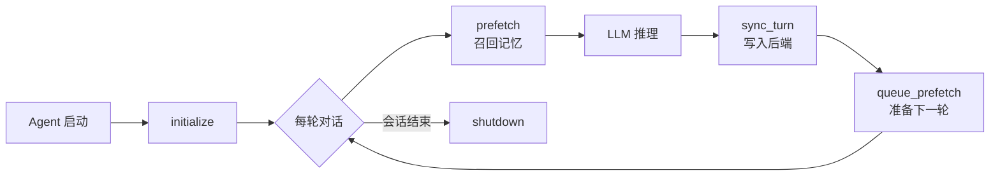

#### 1.2 单一 Provider 限制

```python
## agent/memory_manager.py
class MemoryManager:
    def add_provider(self, provider: MemoryProvider):
        if self.external_provider is not None:
            logger.warning(
                "Only one external provider allowed. Ignoring %s, keeping %s",
                provider.name, self.external_provider.name
            )
            return
        self.external_provider = provider
```

**设计理由**:
- ✅ 避免工具 schema 爆炸(每个 Provider 暴露 3-5 个工具)
- ✅ 避免写入语义冲突(多个后端同时写入同一事实)
- ✅ 简化配置与调试(明确的故障边界)
- ✅ 降低 Token 消耗(只注入一个 Provider 的上下文)

### 2. 官方插件详解

| Provider | 类型 | 存储后端 | 核心能力 | 适用场景 |
|----------|------|---------|---------|----------|
| **mem0** | 向量数据库 | Mem0 Platform API | 服务端 LLM 提取 + 语义搜索 + rerank | 个人使用,注重隐私 |
| **Honcho** | AI 原生记忆 | Honcho Cloud API | 方言推理 + Peer Card + 用户建模 | 深度个性化,跨会话理解 |
| **supermemory** | 知识图谱 | Supermemory API | 容器标签 + 会话导入 + 混合搜索 | 团队协作,项目管理 |
| **hindsight** | 本地向量 | SQLite + Sentence Transformers | 离线运行 + 零依赖 | 完全本地部署 |
| **byterover** | 向量数据库 | ByteRover API | 高性能检索 | 高吞吐场景 |
| **openviking** | 向量数据库 | OpenViking SDK | 开源可自托管 | 企业内网 |
| **retaindb** | 关系型 | SQL-based | 结构化查询 | 需要复杂过滤 |

---

### 3. Mem0 Provider 深度解析

#### 3.1 存储什么?

Mem0 采用**服务端 LLM 提取**策略,不是简单存储原始对话:

```python
## 用户输入
user: "我喜欢用 Python 写后端,前端用 React"
assistant: "好的,已记录您的技术栈偏好"

## Mem0 服务端提取的事实(存储在云端向量库)
facts = [
    {"memory": "用户喜欢用 Python 写后端", "score": 0.95},
    {"memory": "用户使用 React 做前端开发", "score": 0.92}
]
```

**数据模型**:
```json
{
  "id": "mem_abc123",
  "memory": "用户喜欢用 Python 写后端",
  "user_id": "hermes-user",
  "agent_id": "hermes",
  "metadata": {
    "source": "conversation",
    "extracted_at": "2026-04-22T10:30:00Z"
  },
  "embedding": [0.1, 0.2, ...],  // 768维向量
  "created_at": "2026-04-22T10:30:00Z"
}
```

#### 3.2 如何存?

**自动同步(sync_turn)** - 每轮对话后异步发送:
```python
def sync_turn(self, user_content: str, assistant_content: str, *, session_id: str = "") -> None:
    """非阻塞地将对话发送到 Mem0 服务端进行事实提取"""
    def _sync():
        client = self._get_client()
        messages = [
            {"role": "user", "content": user_content},
            {"role": "assistant", "content": assistant_content},
        ]
        # Mem0 服务端会调用 LLM 提取事实并存储
        client.add(messages, filters={"user_id": self._user_id, "agent_id": self._agent_id})
    
    threading.Thread(target=_sync, daemon=True).start()
```

**手动存储(mem0_conclude 工具)** - 用户显式要求记住:
```python
## 用户说: "记住我每周三晚上 8 点有团队会议"
## Agent 调用:
mem0_conclude(conclusion="用户每周三晚上 8 点有团队会议")

## 内部实现(infer=False 表示不经过 LLM 提取,直接存储)
client.add(
    [{"role": "user", "content": conclusion}],
    filters={"user_id": self._user_id, "agent_id": self._agent_id},
    infer=False  # 关键: 绕过服务端提取,原样存储
)
```

#### 3.3 如何取?

**三种召回方式**:

1. **自动召回(prefetch)** - 每轮对话前异步执行:
```python
def queue_prefetch(self, query: str, *, session_id: str = "") -> None:
    """后台线程执行语义搜索,结果缓存到 _prefetch_result"""
    def _run():
        client = self._get_client()
        results = client.search(
            query=query,
            filters={"user_id": self._user_id},  # 只查当前用户
            rerank=self._rerank,  # 启用重排序提升精度
            top_k=5
        )
        # 格式化为一行一行的事实
        lines = [r.get("memory", "") for r in results if r.get("memory")]
        with self._prefetch_lock:
            self._prefetch_result = "\n".join(f"- {l}" for l in lines)
    
    threading.Thread(target=_run, daemon=True).start()
```

2. **全量获取(mem0_profile 工具)** - 获取所有记忆:
```python
def handle_tool_call(self, tool_name: str, args: dict, **kwargs) -> str:
    if tool_name == "mem0_profile":
        memories = client.get_all(filters={"user_id": self._user_id})
        lines = [m.get("memory", "") for m in memories if m.get("memory")]
        return json.dumps({"result": "\n".join(lines), "count": len(lines)})
```

3. **语义搜索(mem0_search 工具)** - 按需检索:
```python
if tool_name == "mem0_search":
    results = client.search(
        query=args["query"],
        filters={"user_id": self._user_id},
        rerank=args.get("rerank", False),
        top_k=min(int(args.get("top_k", 10)), 50)
    )
    items = [{"memory": r["memory"], "score": r["score"]} for r in results]
    return json.dumps({"results": items, "count": len(items)})
```

#### 3.4 性能优化

**电路断路器(Circuit Breaker)**:
```python
_BREAKER_THRESHOLD = 5       # 连续失败 5 次
_BREAKER_COOLDOWN_SECS = 120 # 冷却 120 秒

def _is_breaker_open(self) -> bool:
    if self._consecutive_failures < _BREAKER_THRESHOLD:
        return False
    if time.monotonic() >= self._breaker_open_until:
        self._consecutive_failures = 0  # 重置
        return False
    return True  # 熔断中,跳过 API 调用
```

**效果**: 当 Mem0 API 不可用时,不会阻塞 Agent 主循环,2 分钟后自动重试。

---

### 4. Honcho Provider 深度解析

#### 4.1 存储什么?

Honcho 采用**AI 原生用户建模**,不只是存储事实,而是构建用户的**Peer Card**(同伴卡片):

```python
## Honcho 存储的核心数据结构
peer_card = {
    "peer_id": "user_123",
    "representation": "用户是一位资深 Python 工程师,偏好简洁的代码风格...",
    "card": [
        "喜欢用 FastAPI 构建后端服务",
        "前端技术栈: React + TypeScript",
        "沟通风格: 直接,不喜欢冗长解释",
        "工作时间: 通常在北京时间 9:00-18:00 活跃"
    ],
    "sessions": ["sess_001", "sess_002", ...]  # 关联的会话 ID
}
```

**与 Mem0 的关键区别**:
- Mem0: 存储离散的事实片段 → 语义搜索
- Honcho: 构建连贯的用户画像 → 方言推理(Dialectic Reasoning)

#### 4.2 如何存?

**三层存储策略**:

1. **Session 层** - 每次对话的原始消息:
```python
## plugins/memory/honcho/session.py
def add_message(self, session_key: str, role: str, content: str):
    """将消息添加到 Honcho Session"""
    honcho_session = self.get_or_create(session_key)
    honcho_session.chat(role=role, content=content)
```

2. **Peer 层** - 用户表示(Representation)和卡片(Card):
```python
## 在会话结束时,Honcho 自动更新用户表示
def on_session_end(self, messages: List[Dict]):
    # Honcho 内部会调用 LLM 分析整个会话,更新 peer.representation
    # 这是 Honcho 的核心价值: 持续精炼用户画像
    pass  # 由 Honcho SDK 自动处理
```

3. **Conclusions 层** - 持久化结论:
```python
## 用户显式保存结论
def handle_tool_call(self, tool_name: str, args: dict, **kwargs) -> str:
    if tool_name == "honcho_conclude":
        conclusion = args.get("conclusion", "")
        # 写入 Honcho 的 conclusions 表,永久保存
        honcho.conclusions.create(peer="user", text=conclusion)
        return json.dumps({"result": "Conclusion stored."})
```

#### 4.3 如何取?

**四种召回模式**(recall_mode 配置决定):

**模式 1: Context 模式** - 自动注入上下文:
```python
def prefetch(self, query: str, *, session_id: str = "") -> str:
    """返回两层上下文"""
    # Layer 1: Base context (peer representation + card)
    base_ctx = self._manager.get_prefetch_context(self._session_key)
    # 返回: "## User Representation\n...\n## User Peer Card\n..."
    
    # Layer 2: Dialectic supplement (LLM 推理结果)
    dialectic = self._run_dialectic_depth(query)
    # 返回: "基于历史对话,用户当前可能在解决认证问题..."
    
    return f"{base_ctx}\n\n{dialectic}"
```

**Dialectic Reasoning(方言推理)** - Honcho 的核心创新:
```python
def _run_dialectic_depth(self, query: str) -> str:
    """多轮 LLM 推理,逐步深入理解用户意图"""
    results = []
    for i in range(self._dialectic_depth):  # 默认 1-3 轮
        if i == 0:
            prompt = "Who is this person? What are their preferences?"
        elif i == 1:
            prompt = f"Given prior assessment:\n{results[-1]}\nWhat gaps remain?"
        else:
            prompt = f"Reconcile contradictions between passes:\n{results}"
        
        result = self._manager.dialectic_query(
            self._session_key, 
            prompt,
            reasoning_level="low"  # minimal/low/medium/high/max
        )
        results.append(result)
    
    return results[-1]  # 返回最后一轮的推理结果
```

**模式 2: Tools 模式** - 仅暴露工具,不自动注入:
```python
def system_prompt_block(self) -> str:
    if self._recall_mode == "tools":
        return (
            "# Honcho Memory\n"
            "Active (tools-only mode). Use honcho_profile, honcho_search, "
            "honcho_reasoning to access memory. No automatic injection."
        )
    return ""

def prefetch(self, query: str, *, session_id: str = "") -> str:
    if self._recall_mode == "tools":
        return ""  # 不自动注入任何内容
```

**模式 3: Hybrid 模式** - 两者结合(默认):
```python
## 既自动注入上下文,又暴露工具供主动查询
def system_prompt_block(self) -> str:
    return (
        "# Honcho Memory\n"
        "Active (hybrid mode). Context auto-injected AND tools available."
    )
```

**工具调用示例**:

1. **honcho_profile** - 快速获取用户卡片:
```python
## Agent 调用
honcho_profile(peer="user")

## 返回
{
  "card": [
    "喜欢用 FastAPI 构建后端服务",
    "前端技术栈: React + TypeScript",
    "沟通风格: 直接,不喜欢冗长解释"
  ]
}
```

2. **honcho_search** - 语义搜索原始摘录:
```python
honcho_search(query="authentication bug", max_tokens=800)

## 返回原始会话片段(无 LLM 合成)
{
  "excerpts": [
    "上次我们修复了 token 刷新逻辑,关键是 SECRET_KEY 要持久化...",
    "JWT token 过期时间设置为 1 小时..."
  ]
}
```

3. **honcho_reasoning** - 合成答案(高成本):
```python
honcho_reasoning(
    query="用户之前遇到过哪些认证问题?",
    reasoning_level="medium"  # 控制推理深度
)

## 返回 LLM 合成的答案
{
  "answer": "用户在 2026-04-19 遇到过 JWT token 刷新问题,原因是..."
}
```

4. **honcho_context** - 获取完整会话上下文:
```python
honcho_context(peer="user")

## 返回
{
  "summary": "本次会话讨论了认证 bug 修复",
  "representation": "用户是一位资深 Python 工程师...",
  "card": [...],
  "recent_messages": [...]
}
```

#### 4.4 成本优化

**Cadence 控制**(减少 API 调用频率):
```python
## honcho.json 配置
{
  "contextCadence": 3,      // 每 3 轮调用一次 peer.context()
  "dialecticCadence": 5,    // 每 5 轮调用一次 dialectic reasoning
  "injectionFrequency": "first-turn"  // 只在第一轮注入完整上下文
}
```

**推理级别选择**:
```python
## 根据查询长度自动调整推理深度
def _apply_reasoning_heuristic(self, base: str, query: str) -> str:
    if len(query) < 120:
        return "minimal"  # 短查询用最小推理
    elif len(query) < 400:
        return "low"      # 中等长度用低推理
    else:
        return "medium"   # 长查询用中等推理
```

---

### 5. Supermemory Provider 深度解析

#### 5.1 存储什么?

Supermemory 采用**容器化(Container Tags)**组织记忆,支持多维度分类:

```python
## 数据模型
memory_item = {
    "id": "doc_xyz789",
    "memory": "用户每周三晚上 8 点有团队会议",
    "container_tags": ["hermes", "work-schedule"],  # 容器标签
    "metadata": {
        "source": "hermes",
        "type": "explicit_memory",
        "category": "preference"
    },
    "updated_at": "2026-04-22T10:30:00Z"
}
```

**容器标签系统**:
- `hermes`: 默认容器(所有记忆)
- `work-schedule`: 工作日程
- `tech-stack`: 技术栈偏好
- `project-notes`: 项目笔记

#### 5.2 如何存?

**三种写入方式**:

1. **自动捕获(sync_turn)** - 每轮对话后:
```python
def sync_turn(self, user_content: str, assistant_content: str, *, session_id: str = "") -> None:
    """清理后的对话文本发送到 Supermemory"""
    # 移除 <supermemory-context> 标签,避免污染
    clean_user = _clean_text_for_capture(user_content)
    clean_assistant = _clean_text_for_capture(assistant_content)
    
    # 格式化为结构化对话
    content = (
        f"[role: user]\n{clean_user}\n[user:end]\n\n"
        f"[role: assistant]\n{clean_assistant}\n[assistant:end]"
    )
    
    # 异步发送
    threading.Thread(
        target=lambda: self._client.add_memory(
            content,
            metadata={"source": "hermes", "type": "conversation_turn"},
            entity_context=self._entity_context  # 指导 LLM 提取什么
        )
    ).start()
```

**Entity Context(实体上下文)** - 指导 LLM 提取策略:
```python
_DEFAULT_ENTITY_CONTEXT = (
    "User-assistant conversation. Format: [role: user]...[user:end]\n\n"
    "Only extract things useful in future conversations.\n\n"
    "Remember lasting personal facts, preferences, routines, tools, ongoing projects.\n\n"
    "Do NOT remember temporary intents, one-time tasks, assistant actions.\n\n"
    "When in doubt, store less."
)
```

2. **会话导入(on_session_end)** - 会话结束后批量导入:
```python
def on_session_end(self, messages: List[Dict[str, Any]]) -> None:
    """将整个会话作为一条记录导入 Supermemory"""
    cleaned = [
        {"role": msg["role"], "content": _clean_text_for_capture(msg["content"])}
        for msg in messages
        if msg["role"] in ("user", "assistant")
    ]
    
    # 调用 Supermemory Conversations API
    self._client.ingest_conversation(self._session_id, cleaned)
```

3. **手动存储(supermemory_store 工具)** - 用户显式保存:
```python
def _tool_store(self, args: dict) -> str:
    content = args["content"]
    metadata = {
        "type": _detect_category(content),  # preference/decision/fact/other
        "source": "hermes_tool"
    }
    
    # 可选: 指定容器标签
    container_tag = args.get("container_tag")  # e.g. "work-schedule"
    
    result = self._client.add_memory(
        content,
        metadata=metadata,
        entity_context=self._entity_context,
        container_tag=container_tag
    )
    return json.dumps({"saved": True, "id": result["id"]})
```

#### 5.3 如何取?

**Profile Recall(配置文件召回)** - 自动召回:
```python
def prefetch(self, query: str, *, session_id: str = "") -> str:
    """获取静态事实 + 动态上下文 + 语义搜索结果"""
    profile = self._client.get_profile(query=query[:200])
    
    # Static: 持久化事实(如用户偏好)
    static_facts = profile["static"]  # ["喜欢用 Python", "时区 Asia/Shanghai"]
    
    # Dynamic: 近期上下文(最近几轮对话的摘要)
    dynamic_facts = profile["dynamic"]  # ["正在修复认证 bug"]
    
    # Search: 语义相关记忆
    search_results = profile["search_results"]  # [{"memory": "...", "similarity": 0.85}]
    
    # 格式化为 <supermemory-context> 标签
    return _format_prefetch_context(static_facts, dynamic_facts, search_results)
```

**输出格式**:
```markdown
<supermemory-context>
The following is background context from long-term memory.

### User Profile (Persistent)
- 喜欢用 Python 写后端
- 时区: Asia/Shanghai

### Recent Context
- 正在修复 FastAPI 认证 bug

### Relevant Memories
- [2h ago] [85%] JWT token 刷新逻辑需要持久化 SECRET_KEY
- [1d ago] [72%] 用户偏好使用 pytest 进行测试
</supermemory-context>
```

**工具调用**:

1. **supermemory_search** - 语义搜索:
```python
supermemory_search(query="authentication", limit=5)

## 返回
{
  "results": [
    {"id": "doc_001", "content": "JWT token 刷新...", "similarity": 85},
    {"id": "doc_002", "content": "SECRET_KEY 持久化...", "similarity": 78}
  ],
  "count": 2
}
```

2. **supermemory_profile** - 获取完整画像:
```python
supermemory_profile(query="技术栈偏好")

## 返回
{
  "profile": "## User Profile (Persistent)\n- 喜欢用 Python...",
  "static_count": 5,
  "dynamic_count": 2
}
```

3. **supermemory_forget** - 删除记忆:
```python
## 按 ID 删除
supermemory_forget(id="doc_abc123")

## 按查询删除(删除最匹配的一条)
supermemory_forget(query="过时的项目信息")
```

#### 5.4 多容器管理

**启用自定义容器**:
```json
// supermemory.json
{
  "enable_custom_container_tags": true,
  "custom_containers": ["work-schedule", "tech-stack", "project-notes"],
  "custom_container_instructions": "Use work-schedule for meetings, tech-stack for programming preferences."
}
```

**工具调用时指定容器**:
```python
## 保存到特定容器
supermemory_store(
    content="每周三晚上 8 点团队会议",
    container_tag="work-schedule"
)

## 从特定容器搜索
supermemory_search(
    query="会议安排",
    container_tag="work-schedule"
)
```

---

### 6. Provider 对比总结

| 维度 | Mem0 | Honcho | Supermemory |
|------|------|--------|-------------|
| **存储粒度** | 离散事实片段 | 用户画像(Peer Card) | 容器化记忆 + 会话 |
| **提取方式** | 服务端 LLM 自动提取 | 方言推理(Dialectic) | Entity Context 指导提取 |
| **召回策略** | 语义搜索 + Rerank | 自动注入 + 工具查询 | Profile Recall + 混合搜索 |
| **工具数量** | 3 个(profile/search/conclude) | 5 个(profile/search/reasoning/context/conclude) | 4 个(store/search/forget/profile) |
| **成本控制** | 电路断路器 | Cadence + 推理级别 | 捕获模式(all/everything) |
| **适用场景** | 个人知识管理 | 深度个性化助手 | 团队协作 + 项目管理 |
| **数据所有权** | Mem0 Platform(云端) | Honcho Cloud(云端) | Supermemory API(云端) |
| **离线支持** | ❌ | ❌ | ❌ |

---

### 7. 配置示例

#### Mem0 配置

```yaml
## ~/.hermes/config.yaml
memory:
  provider: mem0

## $HERMES_HOME/mem0.json
{
  "api_key": "mem0_xxx",  // 或环境变量 MEM0_API_KEY
  "user_id": "hermes-user",
  "agent_id": "hermes",
  "rerank": true
}
```

#### Honcho 配置

```yaml
## ~/.hermes/config.yaml
memory:
  provider: honcho

## $HERMES_HOME/honcho.json
{
  "api_key": "honcho_xxx",  // 或环境变量 HONCHO_API_KEY
  "baseUrl": "https://api.honcho.dev",  // 可选,自托管时设置
  "recall_mode": "hybrid",  // context/tools/hybrid
  "contextCadence": 3,
  "dialecticCadence": 5,
  "dialecticDepth": 2,
  "dialecticReasoningLevel": "low",
  "injectionFrequency": "every-turn"  // every-turn/first-turn
}
```

#### Supermemory 配置

```yaml
## ~/.hermes/config.yaml
memory:
  provider: supermemory

## $HERMES_HOME/supermemory.json
{
  "api_key": "supermemory_xxx",  // 或环境变量 SUPERMEMORY_API_KEY
  "container_tag": "hermes",  // 支持 {identity} 模板
  "auto_recall": true,
  "auto_capture": true,
  "max_recall_results": 10,
  "profile_frequency": 50,
  "capture_mode": "all",  // all/everything
  "search_mode": "hybrid",  // hybrid/memories/documents
  "entity_context": "Only extract lasting facts...",  // 自定义提取指导
  "enable_custom_container_tags": true,
  "custom_containers": ["work", "personal"],
  "custom_container_instructions": "Use work for professional context."
}
```

---

### 8. 开发自定义 Provider

#### 步骤 1: 创建插件目录

```bash
mkdir -p plugins/memory/my-provider
touch plugins/memory/my-provider/__init__.py
```

#### 步骤 2: 实现 MemoryProvider 接口

```python
## plugins/memory/my-provider/__init__.py
from agent.memory_provider import MemoryProvider
from typing import Any, Dict, List
import json

class MyProvider(MemoryProvider):
    """自定义 Memory Provider 示例"""
    
    def __init__(self):
        self._api_key = ""
        self._client = None
        self._prefetch_result = ""
    
    @property
    def name(self) -> str:
        return "my-provider"
    
    def is_available(self) -> bool:
        """检查 API Key 是否配置"""
        import os
        return bool(os.environ.get("MY_PROVIDER_API_KEY"))
    
    def initialize(self, session_id: str, **kwargs) -> None:
        """初始化客户端"""
        import os
        self._api_key = os.environ.get("MY_PROVIDER_API_KEY", "")
        # self._client = MyClient(api_key=self._api_key)
    
    def prefetch(self, query: str, *, session_id: str = "") -> str:
        """召回记忆"""
        if not self._prefetch_result:
            return ""
        result = self._prefetch_result
        self._prefetch_result = ""
        return f"## My Provider Memory\n{result}"
    
    def queue_prefetch(self, query: str, *, session_id: str = "") -> None:
        """异步召回"""
        import threading
        def _run():
            try:
                # results = self._client.search(query, limit=5)
                # lines = [r["text"] for r in results]
                # self._prefetch_result = "\n".join(f"- {l}" for l in lines)
                pass
            except Exception as e:
                print(f"Prefetch failed: {e}")
        
        threading.Thread(target=_run, daemon=True).start()
    
    def sync_turn(self, user_content: str, assistant_content: str, *, session_id: str = "") -> None:
        """同步对话"""
        import threading
        def _sync():
            try:
                # self._client.add({
                #     "user": user_content,
                #     "assistant": assistant_content
                # })
                pass
            except Exception as e:
                print(f"Sync failed: {e}")
        
        threading.Thread(target=_sync, daemon=True).start()
    
    def get_tool_schemas(self) -> List[Dict[str, Any]]:
        """暴露工具"""
        return [
            {
                "name": "my_provider_search",
                "description": "Search my provider memory",
                "parameters": {
                    "type": "object",
                    "properties": {
                        "query": {"type": "string"}
                    },
                    "required": ["query"]
                }
            }
        ]
    
    def handle_tool_call(self, tool_name: str, args: Dict[str, Any], **kwargs) -> str:
        """处理工具调用"""
        if tool_name == "my_provider_search":
            # results = self._client.search(args["query"])
            return json.dumps({"results": [], "count": 0})
        raise NotImplementedError(f"Unknown tool: {tool_name}")
    
    def shutdown(self) -> None:
        """清理资源"""
        pass

def register(ctx) -> None:
    """注册 Provider"""
    ctx.register_memory_provider(MyProvider())
```

#### 步骤 3: 激活 Provider

```yaml
## ~/.hermes/config.yaml
memory:
  provider: my-provider
```

---

### 9. 最佳实践

#### 9.1 选择合适的 Provider

**场景 1: 个人使用,注重隐私**
- ✅ 推荐: Builtin Memory + SessionDB
- ❌ 避免: 云端 Provider

**场景 2: 深度个性化,跨会话理解**
- ✅ 推荐: Honcho (方言推理 + 用户建模)
- ✅ 优势: 持续精炼用户画像,理解深层意图

**场景 3: 团队协作,项目管理**
- ✅ 推荐: Supermemory (容器标签 + 会话导入)
- ✅ 优势: 多维度分类,支持团队共享

**场景 4: 简单事实存储**
- ✅ 推荐: Mem0 (服务端提取 + 语义搜索)
- ✅ 优势: 配置简单,开箱即用

#### 9.2 控制记忆大小

**建议**:
- SessionDB: 定期清理旧会话(>30天)
- MEMORY.md: 保持精简,只记录关键点
- External Provider: 设置 retention policy

```bash
## 清理旧会话
hermes cleanup --older-than 30d
```

#### 9.3 监控记忆质量

```bash
## 查看记忆统计
hermes memory stats

## 输出:
## SessionDB: 1,234 sessions, 45,678 messages
## Builtin: MEMORY.md (2.3 KB), USER.md (1.1 KB)
## External: honcho (567 memories)
```

#### 9.4 调试记忆问题

**检查记忆是否正确注入**:
```bash
## 启用调试日志
hermes --log-level DEBUG

## 查看 <memory-context> 内容
grep "<memory-context>" ~/.hermes/logs/latest.log
```

**常见问题**:
- ❌ 记忆未召回 → 检查 API Key 和网络连接
- ❌ 记忆混淆 → 检查 `<memory-context>` 标签是否完整
- ❌ Provider 失败 → 查看日志中的错误信息

## 9. 扩展机制（非 memory 主模型）

> Skills、Curator、Trajectory **不是** Persistent Memory 的子类型。  
> 主模型仍是三层；本节描述与 memory **协同**的进化/沉淀机制。  
> 已删除旧稿中错误的 `memory(action="write")` /「<5KB」示例（与 §3 API 冲突）。

### 本节范围

本文只回答：

- memory 如何与 skills 协作
- 对话如何变成训练资产
- Hermes 所谓“self-improving”在工程上是怎么分层的

---

### 2. Hermes 的"进化"不是单一路径

Hermes 所谓进化，至少有四条不同路径：

1. **Curated Memory 更新**（curated memory = 精选记忆 / 策展记忆）
   - **是什么**: Agent 主动将学到的稳定事实写入 `MEMORY.md` / `USER.md`
   - **作用**: 持久化用户偏好、环境事实、项目约定，改善未来会话的初始上下文
   - **示例**: "用户喜欢简洁代码" → 写入 USER.md → 下次会话自动遵循

2. **Session Archive 增长**（session archive = 会话归档）
   - **是什么**: 每次会话结束后，完整对话自动保存到 `state.db`（SQLite 数据库）
   - **作用**: 积累完整历史，支持按需回忆和搜索过去的对话
   - **示例**: "上次是怎么解决那个 bug 的？" → `session_search` → 找到相关会话

3. **Skill 沉淀**（skill = 技能）
   - **是什么**: Agent 将可复用的方法论保存为独立技能文件（SKILL.md）
   - **作用**: 把"怎么做"抽出来形成可加载资产，避免重复摸索
   - **示例**: "调试 Python import 错误的方法" → 保存为 skill → 下次直接应用

4. **Trajectory / Training Data 积累**（trajectory = 轨迹 / 训练数据）
   - **是什么**: 将会话转换为标准化的 ShareGPT 格式，保存到 JSONL 文件
   - **作用**: 为模型微调、错误分析、性能监控提供训练和研究数据
   - **示例**: 收集 1000 个成功对话 → 微调模型 → 提升整体性能

所以"进化"不是一个按钮，而是多个沉淀面并行发生。

### 5. 进化路径三：Skills

#### 5.1 为什么 skill 不应被混同为 memory

memory 解决的是：

- 记住什么

skill 解决的是：

- 下次怎么做

这两者显然相关，但不是一回事。

#### 5.2 Hermes 当前的工程策略

Hermes 的主线不是“自动无限生成 skills 并自我改写一切”，而是：

- 提供 `skill_manage`
- 提供 `skills_list` / `skill_view`
- 在 prompt 中鼓励 agent 将稳定方法论沉淀成 skill
- 在后台 memory/skill review 节点做机会性检查

这说明 Hermes 确实在朝 self-improving 方向走，但工程姿态更接近：

- 可控沉淀
- 工具显式化
- 允许 review / patch

而不是一个黑箱式“自动学习引擎”。

#### 5.3 什么时候该沉淀成 skill

适合 skill 的内容：

- 固定工作流
- 多步操作套路
- 特定技术栈最佳实践
- 某类任务的稳定模板

不适合 skill 的内容：

- 用户个人偏好
- 一次性 bug 细节
- 临时上下文

---

#### 5.4 Skill Telemetry 系统（底层实现）

**存储位置**: `~/.hermes/skills/.usage.json`

**数据结构**:
```json
{
  "debug-python": {
    "use_count": 15,
    "view_count": 42,
    "patch_count": 3,
    "last_used_at": "2026-05-01T10:30:00+00:00",
    "last_viewed_at": "2026-05-01T11:15:00+00:00",
    "last_patched_at": "2026-04-28T14:20:00+00:00",
    "created_at": "2026-04-15T09:00:00+00:00",
    "state": "active",
    "pinned": false,
    "archived_at": null
  },
  "web-scraping": {
    "use_count": 8,
    "view_count": 20,
    "patch_count": 1,
    "last_used_at": "2026-04-20T16:45:00+00:00",
    "last_viewed_at": "2026-04-25T08:30:00+00:00",
    "last_patched_at": "2026-04-16T12:00:00+00:00",
    "created_at": "2026-04-10T10:00:00+00:00",
    "state": "stale",
    "pinned": false,
    "archived_at": null
  }
}
```

**计数器更新逻辑**:

```python
## tools/skill_usage.py (第 314-336 行)

def bump_view(skill_name: str) -> None:
    """Bump view_count and last_viewed_at. Called from skill_view()."""
    def _apply(rec: Dict[str, Any]) -> None:
        rec["view_count"] = int(rec.get("view_count") or 0) + 1
        rec["last_viewed_at"] = _now_iso()
    _mutate(skill_name, _apply)


def bump_use(skill_name: str) -> None:
    """Bump use_count and last_used_at. Called when a skill is actively used."""
    def _apply(rec: Dict[str, Any]) -> None:
        rec["use_count"] = int(rec.get("use_count") or 0) + 1
        rec["last_used_at"] = _now_iso()
    _mutate(skill_name, _apply)


def bump_patch(skill_name: str) -> None:
    """Bump patch_count and last_patched_at. Called from skill_manage (patch/edit)."""
    def _apply(rec: Dict[str, Any]) -> None:
        rec["patch_count"] = int(rec.get("patch_count") or 0) + 1
        rec["last_patched_at"] = _now_iso()
    _mutate(skill_name, _apply)
```

**原子写入机制**:

```python
## tools/skill_usage.py (第 249-271 行)
def save_usage(data: Dict[str, Dict[str, Any]]) -> None:
    """Write the usage map atomically. Best-effort — errors are logged, not raised."""
    path = _usage_file()
    try:
        path.parent.mkdir(parents=True, exist_ok=True)
        fd, tmp_path = tempfile.mkstemp(
            dir=str(path.parent), prefix=".usage_", suffix=".tmp"
        )
        try:
            with os.fdopen(fd, "w", encoding="utf-8") as f:
                json.dump(data, f, indent=2, sort_keys=True, ensure_ascii=False)
                f.flush()
                os.fsync(f.fileno())  # 确保数据刷到磁盘
            os.replace(tmp_path, path)  # 原子替换
        except BaseException:
            try:
                os.unlink(tmp_path)  # 失败时清理临时文件
            except OSError:
                pass
            raise
    except Exception as e:
        logger.debug("Failed to write %s: %s", path, e, exc_info=True)
```

**设计原则**:
- ✅ **Sidecar 模式**: 遥测数据与 SKILL.md 分离，避免污染用户内容
- ✅ **原子写入**: 使用 tempfile + os.replace 防止损坏
- ✅ **Best-effort**: 失败只记录日志，不影响工具调用
- ✅ **Provenance Filter**: 只追踪 agent-created skills，忽略 bundled/hub skills

---

#### 5.5 写入时机与执行流程

**触发位置**: 同样在主循环的工具调用分支中（[run_agent.py#L9323](file:///Users/gqli/work/deepagents/hermes-agent/run_agent.py#L9323)）

```python
## run_agent.py (第 9320-9324 行)
## Reset nudge counters
if function_name == "memory":
    self._turns_since_memory = 0
elif function_name == "skill_manage":
    self._iters_since_skill = 0  # 重置技能提示计数器
```

**执行流程**:

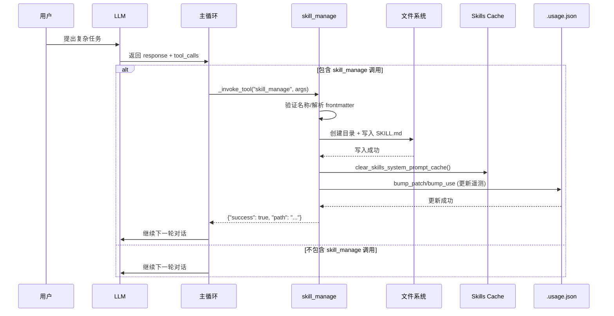

**关键特点**:
- ✅ **同步阻塞**: 工具执行完成后才继续下一轮对话
- ✅ **即时生效**: 写入后立即清除缓存，下次会话就能加载新技能
- ✅ **Agent 自主**: LLM 根据 `SKILLS_GUIDANCE` prompt 决定是否调用
- ✅ **遥测更新**: 同时更新 `.usage.json` 中的计数器

**实际示例**:

```
用户: "帮我调试这个 Python import 错误"

Agent: [执行 8 步调试流程]
       1. read_file("error.log")
       2. terminal("python -c 'import sys; print(sys.path)'")
       3. read_file("__init__.py")
       4. patch(path="__init__.py", ...)
       5. terminal("pytest tests/")
       6. read_file("test_output.log")
       7. patch(path="setup.py", ...)
       8. terminal("pytest tests/ -v")
       
       [成功解决，识别为可复用方法]
       
       {
         "role": "assistant",
         "tool_calls": [{
           "name": "skill_manage",
           "arguments": {
             "action": "create",
             "name": "debug-python-import",
             "content": "---\nname: debug-python-import\ndescription: ...\n---\n\n# Debug Python Import Errors\n\n## Steps\n1. Check error.log...\n..."
           }
         }]
       }

主循环: [执行 skill_manage 工具]
        → 验证名称格式（小写、连字符、≤64字符）
        → 解析 frontmatter
        → 检查同名冲突
        → 创建 ~/.hermes/skills/debug-python-import/
        → 写入 SKILL.md
        → 清除 Skills Cache
        → 更新 .usage.json (created_at, use_count=1)
        → 返回工具结果给 LLM

LLM: "我已将此调试方法保存为技能 'debug-python-import'，下次遇到类似问题可直接使用。"

[下次会话开始时]
→ skills_list() 返回新技能索引
→ skill_view("debug-python-import") 加载完整内容
→ Agent 应用此技能的方法论
```

---

#### 5.6 Skill 沉淀决策流程

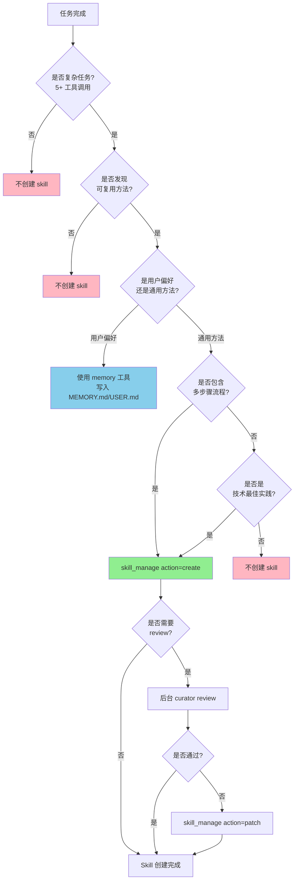

**决策要点**:
1. **复杂度检查**: 至少 5+ 工具调用，确保不是简单任务
2. **可复用性**: 方法是否能应用于未来类似场景
3. **分类判断**: 用户偏好 → memory，通用方法 → skill
4. **流程完整性**: 是否包含明确的步骤序列
5. **Review 机制**: 重要技能可能需要 curator 审核

---

#### 5.7 Skill 沉淀时序图

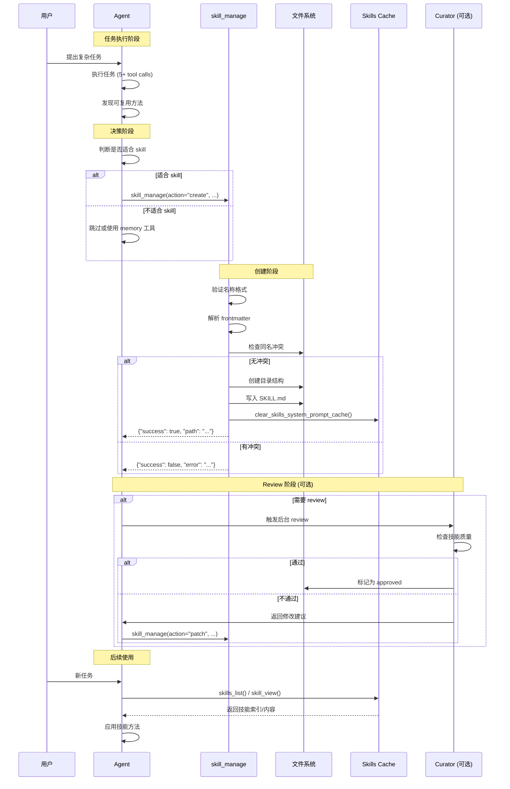

**关键节点说明**:

1. **任务执行阶段**: Agent 在执行复杂任务时识别模式
2. **决策阶段**: 根据复杂度、可复用性、分类进行判断
3. **创建阶段**: 
   - 验证名称（小写、连字符、≤64字符）
   - 解析 frontmatter（name, description, platforms等）
   - 检查冲突（同名技能已存在则失败）
   - 创建目录结构（`~/.hermes/skills/<category>/<name>/`）
   - 写入 SKILL.md
   - 清除缓存（触发 Skills Index 重建）
4. **Review 阶段**: 可选的 curator 审核流程
5. **后续使用**: 通过 `skills_list()` 和 `skill_view()` 加载技能

---

#### 5.8 Skill vs Memory 对比表

| 维度 | Skill | Memory |
|------|-------|--------|
| **解决的问题** | 下次怎么做（程序性记忆） | 记住什么（陈述性记忆） |
| **存储位置** | `~/.hermes/skills/<category>/<name>/SKILL.md` | `~/.hermes/memories/MEMORY.md` / `USER.md` |
| **内容类型** | 工作流、步骤、模板、最佳实践 | 用户偏好、环境事实、项目约定 |
| **容量** | 无限制（每个技能独立文件） | 有限（需保持精简） |
| **加载方式** | 按需加载（`skill_view()`） | 每轮自动注入（prefetch） |
| **更新频率** | 较低（稳定后很少修改） | 中等（持续精编） |
| **适用场景** | 固定工作流、多步操作套路 | 个人偏好、稳定经验 |
| **示例** | "Debug Python 的系统化方法" | "用户喜欢简洁的响应" |

**选择原则**:
- ✅ **问自己**: "这是关于'做什么'还是'怎么做'?"
  - 做什么（what）→ Memory
  - 怎么做（how）→ Skill
- ✅ **问自己**: "这个信息是一次性的还是会重复出现?"
  - 一次性 → Session Archive（state.db）
  - 重复出现 → Skill 或 Memory
- ✅ **问自己**: "这是一个通用的方法论还是个人的偏好?"
  - 通用方法论 → Skill
  - 个人偏好 → Memory

---

#### 5.9 所有进化机制的触发时机对比

| 机制 | 中文含义 | 主要作用 | 效果 | 触发位置 | 是否阻塞主循环 | 触发者 | 代码行号 |
|------|---------|---------|------|---------|--------------|--------|----------|
| **skill_manage** | 技能管理工具 | Agent 主动创建/更新可复用的方法论（SKILL.md） | 下次会话可直接应用该方法，避免重复摸索 | 主循环内（工具调用分支） | ✅ 是（同步） | Agent（LLM） | [run_agent.py#L9323](file:///Users/gqli/work/deepagents/hermes-agent/run_agent.py#L9323) |
| **memory 工具** | 记忆管理工具 | Agent 主动记录用户偏好、环境事实、项目约定 | 下次会话自动遵循这些偏好和事实 | 主循环内（工具调用分支） | ✅ 是（同步） | Agent（LLM） | [run_agent.py#L9321](file:///Users/gqli/work/deepagents/hermes-agent/run_agent.py#L9321) |
| **Session Archive** | 会话归档 | 会话结束后自动保存完整对话到 SQLite 数据库 | 支持通过 `session_search` 搜索过去的解决方案 | 主循环结束后 | ❌ 否（会后） | 运行时（自动） | [run_agent.py#L13613](file:///Users/gqli/work/deepagents/hermes-agent/run_agent.py#L13613) |
| **Trajectory Export** | 轨迹导出 | 将会话转换为 ShareGPT 格式保存到 JSONL 文件 | 为模型微调、错误分析、性能监控提供训练数据 | 主循环结束后 | ❌ 否（会后） | 运行时（自动） | [run_agent.py#L13607](file:///Users/gqli/work/deepagents/hermes-agent/run_agent.py#L13607) |
| **Curator Review** | 策展人审查 / 后台审查 | 定期自动检查并整合相似技能，保持技能库整洁 | 防止技能库膨胀，提升技能质量，节省用户整理时间 | 完全独立 | ❌ 否（异步） | 调度器（定时） | 独立进程 |

**关键结论**:

1. **Skill 和 Memory 的写入**确实在**主循环中**，由 Agent 主动调用工具触发
   - ✅ 同步阻塞：工具执行完成才继续
   - ✅ 即时生效：下次会话就能加载
   - ✅ Agent 自主：LLM 根据 prompt 决定是否调用

2. **Session Archive 和 Trajectory**在**主循环结束后**自动触发，不阻塞响应
   - ❌ 会后执行：不影响当前会话响应速度
   - ❌ 自动触发：无需 Agent 显式调用
   - ✅ 完整保存：包括所有 messages、tool calls、results

3. **Curator Review**是**完全独立的后台进程**，与主循环无关
   - ❌ 独立进程：不与用户交互
   - ❌ 异步执行：不影响当前会话
   - ✅ 定期触发：可配置间隔（默认 24h）

这种设计确保了：
- ✅ **即时反馈**: Skill/Memory 修改后立即生效
- ✅ **用户体验**: 会后操作不阻塞响应
- ✅ **系统稳定性**: 后台任务不影响前台交互

#### 5.7 Curator 自动生命周期管理

**配置文件**: `~/.hermes/config.yaml`

```yaml
curator:
  enabled: true
  interval_hours: 24          # 每 24 小时运行一次
  min_idle_hours: 2           # Agent 空闲至少 2 小时才运行
  stale_after_days: 30        # 30 天未使用标记为 stale
  archive_after_days: 90      # 90 天未使用自动归档
```

**状态机**:

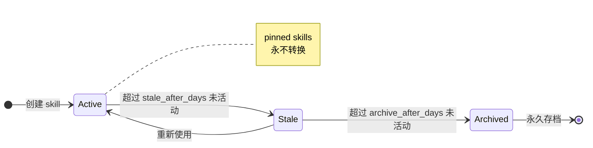

**自动转换逻辑**:

```python
## agent/curator.py (第 215-255 行)
def apply_automatic_transitions(now: Optional[datetime] = None) -> Dict[str, int]:
    """Walk every agent-created skill and move active/stale/archived based on
    the latest real activity timestamp. Pinned skills are never touched."""
    from tools import skill_usage as _u

    if now is None:
        now = datetime.now(timezone.utc)
    stale_cutoff = now - timedelta(days=get_stale_after_days())
    archive_cutoff = now - timedelta(days=get_archive_after_days())

    counts = {"marked_stale": 0, "archived": 0, "reactivated": 0, "checked": 0}

    for row in _u.agent_created_report():
        counts["checked"] += 1
        name = row["name"]
        if row.get("pinned"):
            continue  # Pinned skills 永不转换

        # 获取最新活动时间（use/view/patch 的最新时间）
        last_activity = _parse_iso(row.get("last_activity_at"))
        # 如果从未活动，使用 created_at 作为锚点
        anchor = last_activity or _parse_iso(row.get("created_at")) or now
        if anchor.tzinfo is None:
            anchor = anchor.replace(tzinfo=timezone.utc)

        current = row.get("state", _u.STATE_ACTIVE)

        # 判断是否需要归档
        if anchor <= archive_cutoff and current != _u.STATE_ARCHIVED:
            ok, _msg = _u.archive_skill(name)
            if ok:
                counts["archived"] += 1
        # 判断是否需要标记为 stale
        elif anchor <= stale_cutoff and current == _u.STATE_ACTIVE:
            _u.set_state(name, _u.STATE_STALE)
            counts["marked_stale"] += 1
        # 判断是否需要重新激活
        elif anchor > stale_cutoff and current == _u.STATE_STALE:
            _u.set_state(name, _u.STATE_ACTIVE)
            counts["reactivated"] += 1

    return counts
```

**归档实现**:

```python
## tools/skill_usage.py (第 376-420 行)
def archive_skill(skill_name: str) -> Tuple[bool, str]:
    """Move an agent-created skill directory to ~/.hermes/skills/.archive/."""
    if not is_agent_created(skill_name):
        return False, f"skill '{skill_name}' is bundled or hub-installed; never archive"

    skill_dir = _find_skill_dir(skill_name)
    if skill_dir is None:
        return False, f"skill '{skill_name}' not found"

    archive_root = _archive_dir()  # ~/.hermes/skills/.archive/
    try:
        archive_root.mkdir(parents=True, exist_ok=True)
    except OSError as e:
        return False, f"failed to create archive dir: {e}"

    # 扁平化目录结构（忽略 category 嵌套）
    dest = archive_root / skill_dir.name
    if dest.exists():
        # 如果目标已存在，添加时间戳避免冲突
        dest = archive_root / f"{skill_dir.name}-{datetime.now(timezone.utc).strftime('%Y%m%d%H%M%S')}"

    try:
        shutil.move(str(skill_dir), str(dest))
        set_state(skill_name, STATE_ARCHIVED)
        return True, f"archived to {dest}"
    except OSError as e:
        return False, f"failed to move: {e}"
```

**恢复技能**:

```bash
## CLI 命令
hermes curator restore <skill-name>

## 底层实现
mv ~/.hermes/skills/.archive/<skill-name> ~/.hermes/skills/<skill-name>
```

**设计原则**:
- ✅ **Pinned Skills 保护**: 标记为 pinned 的技能永远不会被自动归档
- ✅ **Provenance Filter**: 只管理 agent-created skills，忽略 bundled/hub skills
- ✅ **可逆操作**: 归档不是删除，可以随时恢复
- ✅ **渐进式降级**: Active → Stale → Archived，给用户多次机会

#### 5.10 三种进化机制的生命周期管理对比

| 机制 | 是否需要过期 | 是否需要错误更正 | 管理方式 |
|------|------------|----------------|---------|
| **Skills** | ✅ 是（避免膨胀） | ✅ 是（方法过时） | Curator Review 自动整理 + 用户手动 pin/unpin |
| **Session Archive** | ❌ 否（永久保存） | ❌ 否（历史记录） | 无需管理，按需搜索 |
| **Curated Memory** | ❌ 否（人工控制） | ✅ 是（事实变更） | Agent 主动更新 + 用户手动编辑 |

**关键差异**:

1. **Skills 需要自动整理**:
   - 原因：Agent 可能创建大量狭窄技能，导致技能库混乱
   - 解决：Curator Review 定期合并相似技能，归档过时技能

2. **Session Archive 不需要管理**:
   - 原因：历史记录永远有价值，存储成本低
   - 解决：通过索引和搜索提高效率，不删除任何数据

3. **Curated Memory 需要人工策展**:
   - 原因：容量有限（<5KB），需要保持高信噪比
   - 解决：Agent 主动更新 + 用户手动编辑，不依赖自动化

#### 6.1 它属于什么层

Trajectory（轨迹）是训练和研究资产，不是在线 recall memory。

它的目标不是改善“当前这次会话”的上下文，而是：

- 生成可分析的对话轨迹
- 为 RL / fine-tuning / evaluation 准备数据

#### 6.2 为什么它不该算进 memory 主模型

因为它既不参与日常 prompt 注入，也不承担用户级 recall。

它更多是：

- 离线资产
- 训练输入
- 研究数据

把它硬塞进“memory 层级”会导致概念膨胀。

#### 6.3 但为什么仍值得放在这里讲

因为 Hermes 的品牌叙事不是“有记忆就够了”，而是：

- 记住
- 复盘
- 沉淀
- 再学习

所以 trajectory 虽不是 memory 主层，但确实是长期进化闭环的一部分。

---

#### 6.4 Trajectory 导出的底层实现

**存储格式**: JSONL（每行一个完整的会话）

**输出文件**:
- `trajectory_samples.jsonl`: 成功完成的会话
- `failed_trajectories.jsonl`: 失败或中断的会话

**触发位置**: 在主循环结束后（[run_agent.py#L13607](file:///Users/gqli/work/deepagents/hermes-agent/run_agent.py#L13607)）

```python
## run_agent.py (第 13607 行)
## Save trajectory if enabled
self._save_trajectory(messages, _summarize_user_message_for_log(user_message), completed)
```

**执行流程**:

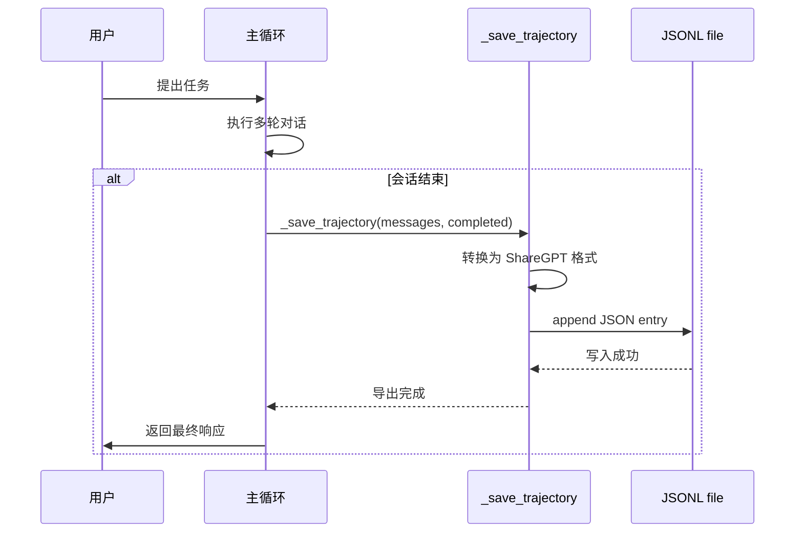

**数据结构**（ShareGPT 格式）:

```json
{
  "conversations": [
    {
      "from": "human",
      "value": "帮我修复这个 Python bug"
    },
    {
      "from": "gpt",
      "value": "<think>\n我需要先查看错误信息...\n</think>\n\n让我检查一下日志。",
      "tool_calls": [
        {
          "id": "call_abc123",
          "type": "function",
          "function": {
            "name": "read_file",
            "arguments": "{\"file_path\": \"error.log\"}"
          }
        }
      ]
    },
    {
      "from": "tool",
      "name": "read_file",
      "content": "Traceback (most recent call last):\n  ...",
      "tool_call_id": "call_abc123"
    },
    {
      "from": "gpt",
      "value": "我找到了问题所在..."
    }
  ],
  "timestamp": "2026-05-01T10:30:00+00:00",
  "model": "claude-3-opus-20240229",
  "completed": true
}
```

**导出逻辑**:

```python
## agent/trajectory.py (第 30-57 行)
def save_trajectory(trajectory: List[Dict[str, Any]], model: str,
                    completed: bool, filename: str = None):
    """Append a trajectory entry to a JSONL file."""
    if filename is None:
        filename = "trajectory_samples.jsonl" if completed else "failed_trajectories.jsonl"

    entry = {
        "conversations": trajectory,
        "timestamp": datetime.now().isoformat(),
        "model": model,
        "completed": completed,
    }

    try:
        with open(filename, "a", encoding="utf-8") as f:
            f.write(json.dumps(entry, ensure_ascii=False) + "\n")
        logger.info("Trajectory saved to %s", filename)
    except Exception as e:
        logger.warning("Failed to save trajectory: %s", e)
```

**调用时机**: 在 `batch_runner.py` 中，每个会话结束后自动调用

```python
## batch_runner.py (简化版)
def run_batch_session(agent, task: str) -> None:
    """Run a single session and save trajectory."""
    messages = []
    
    # 执行会话
    response = agent.run(task, messages=messages)
    
    # 转换为 ShareGPT 格式
    trajectory = agent._convert_to_trajectory_format(messages)
    
    # 保存轨迹
    completed = response.status == "completed"
    save_trajectory(
        trajectory=trajectory,
        model=agent.model_name,
        completed=completed
    )
```

**Scratchpad 转换**:

```python
## agent/trajectory.py (第 16-21 行)
def convert_scratchpad_to_think(content: str) -> str:
    """Convert <REASONING_SCRATCHPAD> tags to <think> tags."""
    if not content or "<REASONING_SCRATCHPAD>" not in content:
        return content
    return content.replace("<REASONING_SCRATCHPAD>", "<think>").replace("</REASONING_SCRATCHPAD>", "</think>")
```

**用途**:
- 📊 **微调数据集**: 用于 SFT（Supervised Fine-Tuning）
- 🧪 **评估基准**: 构建任务特定的 eval suite
- 🔍 **错误分析**: 研究失败模式和改进方向
- 📈 **性能监控**: 追踪 token 使用、成本、成功率等指标

**设计原则**:
- ✅ **完整保留**: 包括 tool calls/results、thinking process
- ✅ **标准化格式**: ShareGPT 兼容，便于与其他框架互操作
- ✅ **增量追加**: JSONL 格式支持流式写入，无需加载整个文件
- ✅ **分离成败**: 成功和失败的轨迹分开存储，便于针对性分析

---

#### 7.1 Curator Review（策展人审查）机制（LLM 驱动的技能整合）

**触发位置**: ❌ **完全独立，不在主循环中**

**审查范围**: ⚠️ **仅针对 Skills（技能），不包括 Session Archive 和 Curated Memory**

> **重要说明**: Curator Review 的职责是**技能库的整理和优化**，不负责 Session Archive 和 Curated Memory 的生命周期管理。
>
> - **Session Archive**: 永久保存，不过期，用户可通过 `session_search` 按需搜索
> - **Curated Memory**: 由 Agent 在对话中主动更新，无自动过期机制
> - **Skills**: 需要定期整理，避免膨胀，因此引入 Curator Review

**触发条件**:
1. **定时触发**: 每 `interval_hours` 小时检查一次（默认 24h）
2. **空闲检测**: Agent 必须空闲至少 `min_idle_hours` 小时（默认 2h）
3. **手动触发**: `hermes curator run --now`

**审查内容**:
- ✅ **技能整合**: 识别相似技能，合并为 umbrella skill
- ✅ **技能归档**: 将过时/狭窄的技能移动到 `.archive/`
- ✅ **技能质量**: 检查技能名称是否过窄（包含 PR 号、具体错误字符串等）
- ❌ **Session Archive**: 不处理（永久保存）
- ❌ **Curated Memory**: 不处理（由 Agent 主动更新）

> **Curator = 策展人 / 管理员**：负责后台自动审查和整合技能的专用 agent。

**执行流程**:

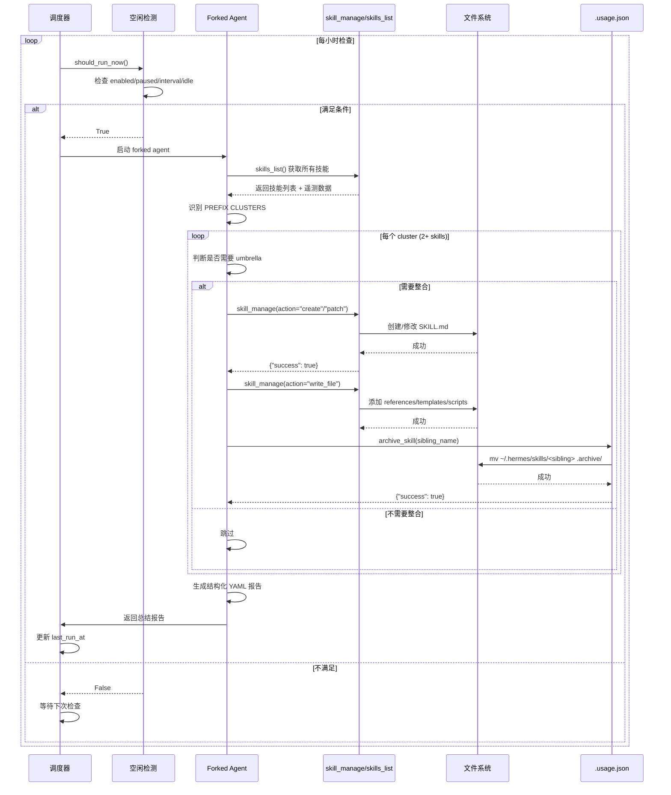

**关键特点**:
- ❌ **独立进程**: 不与用户交互
- ❌ **异步执行**: 不影响当前会话响应速度
- ✅ **定期触发**: 可配置间隔（默认 24h）
- ✅ **空闲检测**: 只在 Agent 空闲 ≥2h 时运行

> （完整 Curator Review 时序见上一节 mermaid，此处不重复。）


**Review Prompt 核心要求**:

```python
## agent/curator.py (第 262-350 行，简化版)
CURATOR_REVIEW_PROMPT = (
    "你是 Hermes 的后台技能 CURATOR。这是一个 UMBRELLA-BUILDING consolidation pass，"
    "不是被动审计，也不是重复查找器。\n\n"
    
    "目标：构建一个 CLASS-LEVEL INSTRUCTIONS AND EXPERIENTIAL KNOWLEDGE 库。"
    "数百个狭窄技能的集合（每个只捕获一次会话的特定 bug）是库的失败 —— "
    "不是特性。\n\n"
    
    "硬性规则:\n"
    "1. 不要触碰 bundled 或 hub-installed skills\n"
    "2. 不要删除任何技能。归档（移动到 .archive/）是最大破坏性操作\n"
    "3. 不要触碰 pinned=yes 的技能\n"
    "4. 不要使用 usage counters 作为跳过整合的理由。基于 CONTENT 判断重叠\n"
    "5. 不要因为 '每个技能有不同的 trigger' 而拒绝整合\n\n"
    
    "工作方法:\n"
    "1. 扫描候选列表，识别 PREFIX CLUSTERS（共享首词或领域关键词的技能）\n"
    "2. 对于每个 2+ 成员的 cluster，问：'这些技能服务的 UMBRELLA CLASS 是什么？'\n"
    "3. 三种整合方式:\n"
    "   a. MERGE INTO EXISTING UMBRELLA — patch 现有技能，添加 labeled section\n"
    "   b. CREATE A NEW UMBRELLA SKILL.md — create 新的 class-level skill\n"
    "   c. DEMOTE TO REFERENCES/TEMPLATES/SCRIPTS — move to support directories\n"
    "4. 标记名称过窄的技能（包含 PR 号、feature codename、具体错误字符串）\n"
    "5. 迭代。一轮整合后，扫描剩余集寻找下一个 umbrella 机会\n"
)
```

**结构化输出格式**:

```yaml
## Curator 必须在响应中包含此 YAML block
consolidations:
  - from: "debug-python-import-error"
    into: "debug-python"
    reason: "Import errors are a subset of general Python debugging"
  - from: "debug-python-type-error"
    into: "debug-python"
    reason: "Type errors belong under the same umbrella"

prunings:
  - name: "fix-pr-12345"
    reason: "Session-specific PR fix, too narrow for a standalone skill"
  - name: "audit-gateway-config-2024"
    reason: "Dated audit artifact, content absorbed into hermes-config umbrella"
```

**解析与执行**:

```python
## agent/curator.py (第 509-587 行)
def _parse_structured_summary(llm_final: str) -> Dict[str, List[Dict[str, str]]]:
    """Extract the structured YAML block from the curator's final response."""
    import re
    match = re.search(r"```ya?ml\s*\n(.*?)\n```", llm_final, re.DOTALL | re.IGNORECASE)
    if not match:
        return {"consolidations": [], "prunings": []}
    
    body = match.group(1)
    try:
        import yaml
        data = yaml.safe_load(body)
    except Exception:
        return {"consolidations": [], "prunings": []}
    
    # 解析 consolidations 和 prunings 列表
    out = {"consolidations": [], "prunings": []}
    # ... 详细解析逻辑 ...
    return out
```

**启发式回退**:

如果 LLM 未能生成有效的 YAML，Curator 会使用工具调用证据进行启发式分类：

```python
## agent/curator.py (第 401-506 行)
def _classify_removed_skills(
    removed: List[str],
    added: List[str],
    after_names: Set[str],
    tool_calls: List[Dict[str, Any]],
) -> Dict[str, List[Dict[str, Any]]]:
    """Split removed into consolidated vs pruned using tool-call evidence.
    
    Heuristic: scan skill_manage tool calls and look for write_file/patch/create/edit
    actions whose target skill references the removed skill's name.
    """
    # ... 详细实现 ...
```

**设计原则**:
- ✅ **LLM 驱动**: 利用 LLM 的语义理解能力识别技能重叠
- ✅ **双重保障**: 结构化 YAML + 启发式回退
- ✅ **非破坏性**: 只归档，不删除，随时可恢复
- ✅ **透明报告**: 每次 review 生成详细的 YAML 报告

---

## 10. 附录 A：六层扩展视角

> **非官方主模型。** 仅用于架构对比；对外叙事请用三层。

### 2.1 六层扩展视角（架构分析用 · 非官方主模型）

> ⚠️ 下图将 skills、compression、trajectory 与 runtime memory **画在同一塔里**，便于和 OpenHarness / deer-flow 对比。**运行时主 API 仍以 §2.2 三层为准。**

Hermes 在**扩展分析**中常用六层叙事,从持久化到训练数据逐层递进:

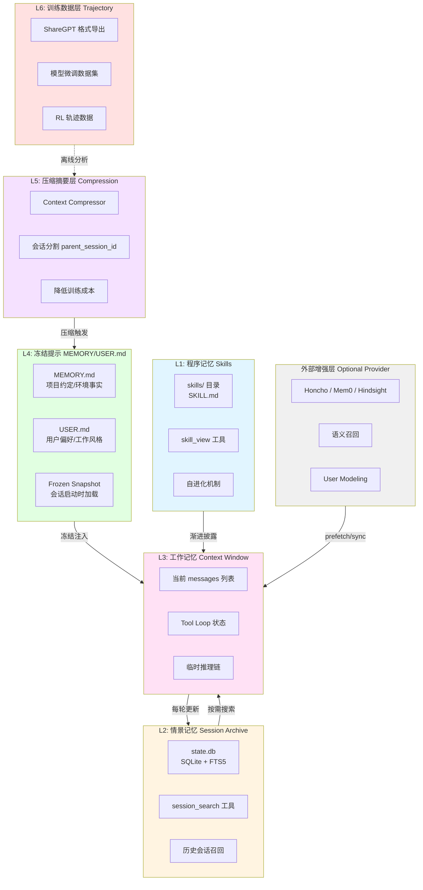

**各层职责**:

| 层级 | 载体 | 读写频率 | 典型用途 | 示例 |
|------|------|---------|---------|------|
| **L1 程序记忆** | `skills/*.md` | 低频写/高频读 | 方法论沉淀、可复用工作流 | `code-review`, `debug-python` |
| **L2 情景记忆** | `state.db` (FTS5) | 每次会话写/按需读 | 完整历史档案、跨会话召回 | "上周修过某个 auth bug" |
| **L3 工作记忆** | `messages` 列表 | 每轮读写 | 当前对话上下文、工具调用链 | 本轮的 reasoning + tool results |
| **L4 冻结提示** | `MEMORY.md`/`USER.md` | 手动写/会话启动读 | 稳定事实、用户偏好、项目约定 | "用户喜欢简洁回答" |
| **L5 压缩摘要** | parent_session_id 链 | 阈值触发 | 降低上下文长度、训练成本控制 | 长会话分割为父子链 |
| **L6 训练数据** | ShareGPT JSONL | 批量导出 | 模型微调、RL 训练 | `trajectory_compressor.py` |
| **External** | Honcho/Mem0 API | 每轮 prefetch/sync | 语义召回、深度用户建模 | 向量数据库检索 |

### 2.2 三层主模型 vs 六层扩展

> **重要澄清**: 正文 §1–§6 聚焦**三层主模型**(Persistent Memory + Session Search + External Provider),这是 Hermes memory 的核心运行时。
>
> L1/L5/L6 属于**扩展沉淀机制**,与 skills/trajectory/compression 专题交叉,在 [§9 扩展机制](#9-扩展机制非-memory-主模型) 中详述。

## 11. 附录 B：演进表述与时序

### 8. 一个更准确的演化时序图

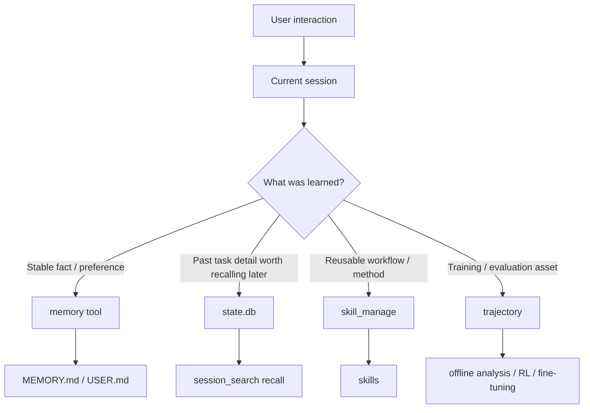

这个图比“六层塔”更忠实于当前工程现实。

---

### 9. 对“Hermes 会自我进化”的准确表述

建议把这个说法写得更稳一些。

可以写：

- Hermes 具备 **持续沉淀经验** 的机制
- 它通过 curated memory（精选记忆）、session archive（会话归档）、skills（技能）和 training assets（训练资产）形成多条学习路径
- 一部分进化由 agent 主动触发，一部分由用户或离线流程显式管理

不建议继续写成：

- “Hermes 有一个统一六层自进化记忆引擎”

因为这会把太多不同子系统强行归到一个抽象里。

---


### 11. 最后给架构对比使用者的结论

如果你在跨框架对比 Hermes memory，最稳妥的说法应该是：

- Hermes 的 **主记忆模型** 是三层：
  built-in persistent memory（内置持久化记忆）、session search（会话搜索）、optional external provider（可选外部提供者）
- Hermes 的 **长期进化机制** 另外包括：
  skills（技能）、curator review（策展人审查 / 后台审查）、trajectory/training assets（轨迹 / 训练资产）

这个表述既能保住 Hermes 的优势，也更经得起源码核对。

