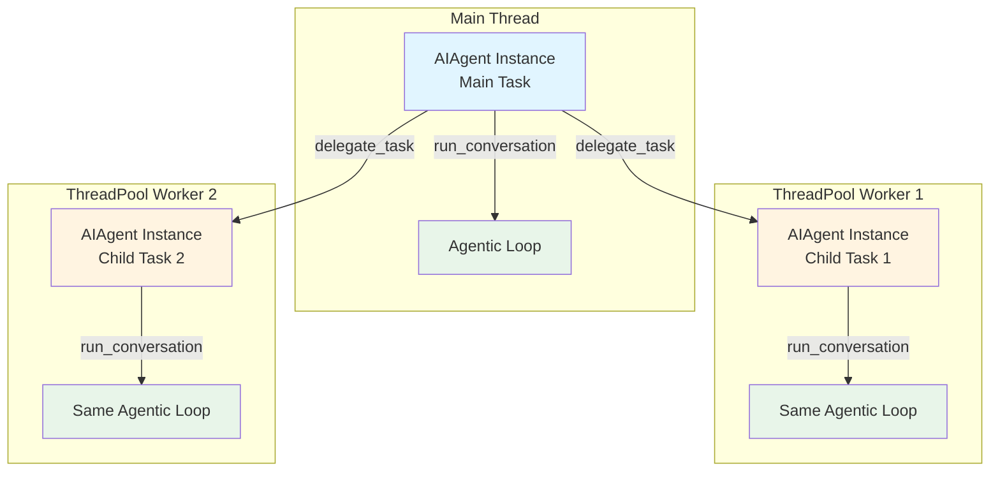
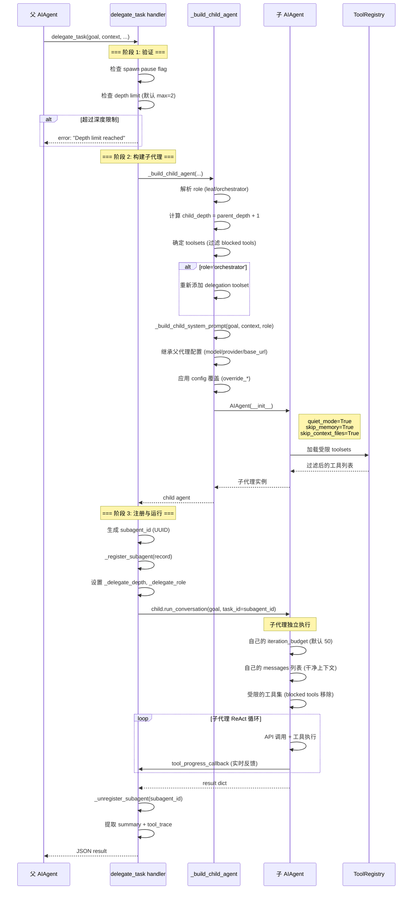
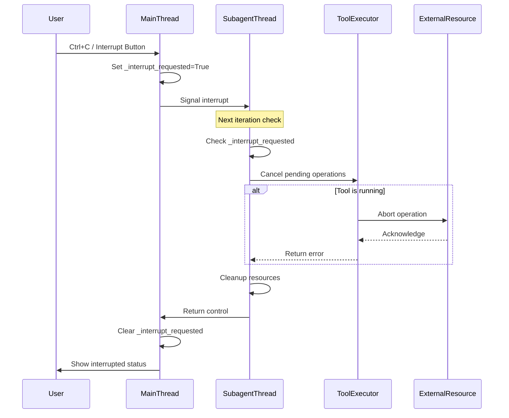
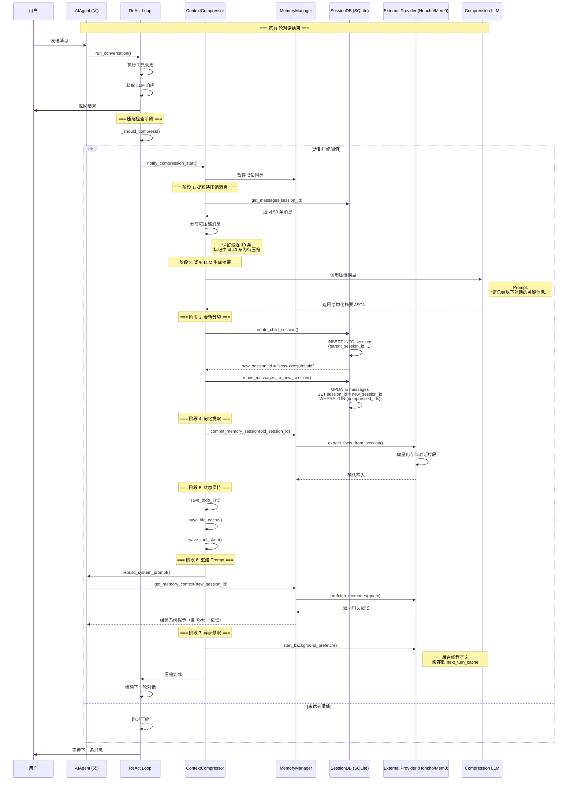

# 多 Agent 架构

> **文档状态**: Canonical（合并去重版）  
> **Hermes 版本锚点**: 0.19.0 · **核对**: 2026-07-31 · [DOC_MAINTENANCE.md](DOC_MAINTENANCE.md)  
> **合并自**: `MULTI_AGENT_ARCHITECTURE.md`（Part 1）+ `SUBAGENT_INTERRUPT_AND_HITL_COMPARISON.md`  
> **已删除**: 历史 Part 2 伪代码（`coordinator/` / `AgentScheduler` 等非源码）；跨框架长代码 dump 改为摘要表。  
> **源码**: `tools/delegate_tool.py`, `run_agent.py` / `agent/conversation_loop.py`, `tools/approval.py`, `tools/clarify_tool.py`

---

## 目录

1. [概述](#1-概述)
2. [主代理 vs 子代理](#2-主代理-vs-子代理对比)
3. [Agentic Loop 共享](#3-agentic-loop-共享机制)
4. [子代理创建流程](#4-子代理创建流程)
5. [Prompt 差异](#5-prompt-差异详解)
6. [工具集隔离](#6-工具集隔离机制)
7. [迭代预算](#7-迭代预算系统)
8. [会话持久化](#8-会话持久化)
9. [回调中继与反向控制](#9-回调中继机制)
10. [深度限制与角色](#10-深度限制与角色控制)
11. [并行执行](#11-并行执行模型)
12. [中断与 Human-in-the-Loop](#12-中断与-human-in-the-loop)
13. [设计哲学与实践](#13-设计哲学与实践)
14. [上下文压缩（多 Agent）](#14-上下文压缩完整流程)
15. [Live-viewable 子 Agent](#15-019-增量live-viewable-子-agent-transcript)
16. [附录：跨框架中断 / HITL 对照](#16-附录跨框架中断--hitl-对照)

---

## 1. 概述

#### 1.1 为什么需要多 Agent 架构?

**问题空间**:

| 问题 | 说明 | 影响 |
|------|------|------|
| **上下文污染** | 复杂任务的中间推理会污染父对话 | 后续响应质量下降 |
| **预算失控** | 单个子任务可能耗光父代理的全部迭代预算 | 父任务无法完成 |
| **并行需求** | 某些任务天然可并行 (如同时研究多个主题) | 串行执行效率低 |
| **专业化分工** | 不同子任务可能需要不同的工具集或技能 | 单一代理难以胜任 |
| **可观测性** | 需要清晰的任务分解视图和进度追踪 | 用户无法了解进展 |

**解决方案**:
- ✅ 子代理拥有**干净上下文** (无父对话历史)
- ✅ 子代理有**独立预算** (不吞噬父预算)
- ✅ 支持**并行执行** (ThreadPoolExecutor)
- ✅ **受限工具集** (防止滥用)
- ✅ **进度中继** (父代理可见子代理活动)

#### 1.2 核心概念

**delegate_task 工具**:
```python
# registry.register(...) 显式调用（非装饰器）
def delegate_task(
    goal: str,                    # 任务目标
    context: Optional[str] = None, # 可选上下文
    toolsets: Optional[List[str]] = None, # 工具集
    tasks: Optional[List[Dict]] = None,   # Batch mode
    role: str = "leaf",           # leaf/orchestrator
    parent_agent=None,            # 注入的父代理引用
) -> str:
    """Spawn child agents with isolated context and restricted toolsets."""
```

**两种模式**:
1. **Single Mode**: `goal` + 可选参数
2. **Batch Mode**: `tasks` 数组,每个元素是一个任务对象

---

## 2. 主代理 vs 子代理对比

#### 2.1 完整对比表

| 维度 | 主代理 (Parent) | Leaf 子代理 | Orchestrator 子代理 |
|------|----------------|------------|-------------------|
| **System Prompt** | `_build_system_prompt()` 全14层 (~2000-5000 tokens) | `_build_system_prompt()` 部分层 + `_build_child_system_prompt()` ephemeral (~600-1400 tokens) | 同 Leaf + 委派能力说明 (~800-1600 tokens) |
| **Memory 注入** | ✅ `<memory-context>` | ❌ skip_memory=True | ❌ skip_memory=True |
| **Context Files** | ✅ AGENTS.md/SOUL.md | ❌ skip_context_files=True | ❌ skip_context_files=True |
| **Skills 索引** | ✅ 渐进披露 | ✅ (skills工具集未被blocked, `build_skills_system_prompt()` 正常执行) | ✅ 同Leaf |
| **core 工具** | ✅ | ✅ | ✅ |
| **web 工具** | ✅ | ✅ | ✅ |
| **memory 工具** | ✅ | ❌ blocked | ❌ blocked |
| **clarify 工具** | ✅ | ❌ blocked | ❌ blocked |
| **execute_code** | ✅ | ❌ blocked | ❌ blocked |
| **delegate_task** | ✅ | ❌ blocked | ✅ (重新添加) |
| **迭代预算** | 90 (默认) | 50 (config.yaml) | 50 (config.yaml) |
| **Session ID** | `sess-abc123` | `sess-abc123:sub:uuid` | `sess-abc123:sub:uuid` |
| **Parent Session ID** | N/A | `sess-abc123` | `sess-abc123` |
| **Memory Sync** | ✅ sync_all() | ❌ | ❌ |
| **quiet_mode** | False (CLI 显示) | True (静默) | True (静默) |
| **Progress Callback** | CLI spinner / Gateway | 中继到父代理 | 中继到父代理 |

#### 2.2 关键差异总结

**Prompt 差异**:
- 主代理: ~2000-5000 tokens (完整14层: 人格 + Skills索引 + 项目知识 + Memory + 环境)
- 子代理: ~600-1400 tokens (`_cached_system_prompt` 部分层 + ephemeral 任务指令)
  - 保留: 默认身份、Hermes帮助指引、Skills索引、工具使用强制、时间戳、环境提示、平台提示
  - 跳过: SOUL.md、Context Files、Memory
  - 追加: ephemeral 任务目标+上下文 (由 `_build_child_system_prompt()` 生成)

**工具集差异**:
- 主代理: 全部工具 (包括 delegation/memory/clarify)
- 子代理: 受限工具集 (blocked: delegation/clarify/memory/code_execution; 保留: skills/session_search 等)

**预算差异**:
- 主代理: 90 轮 (默认)
- 子代理: 50 轮 (独立,不与父共享)

**记忆差异**:
- 主代理: 读写 MEMORY.md,预取外部记忆
- 子代理: skip_memory=True,无记忆访问

---

## 3. Agentic Loop 共享机制

#### 3.1 核心设计原则

**关键发现**: **子 Agent 和主 Agent 共用同一套 `run_conversation` 实现**（`agent/conversation_loop.py`；`AIAgent.run_conversation` 为转发）。

这不是通过不同的代码实现，而是通过**配置隔离**来实现行为差异。

```python
    # tools/delegate_tool.py:L1491-1494
def _run_with_thread_capture():
    _worker_thread_holder["t"] = threading.current_thread()
    return child.run_conversation(  # ← 调用的是同一个方法
        user_message=goal,
        task_id=child_task_id,
    )
```

#### 3.2 架构示意图



**图例说明**：
- 🔵 蓝色：主 Agent 实例（完整配置）
- 🟡 黄色：子 Agent 实例（受限配置）
- 🟢 绿色：相同的 Agentic Loop 逻辑

#### 3.3 为什么这样设计？

##### **优势对比**

| 方案 | 优点 | 缺点 |
|------|------|------|
| **共享 Loop + 配置隔离**<br/>(当前方案) | ✅ 代码复用<br/>✅ 行为一致<br/>✅ 易于维护<br/>✅ 简化调试 | - |
| **独立 Loop 实现**<br/>(替代方案) | - | ❌ 代码重复<br/>❌ 行为不一致<br/>❌ 维护成本高<br/>❌ 容易出 bug |

##### **核心优势**

**1. 代码复用**

不需要维护两套 agentic loop 逻辑；所有 Agent 都走相同路径：LLM 调用 → 工具选择 → 工具执行 → 结果处理 → 迭代控制。


**2. 一致性保证**
```python
    # 子 Agent 的行为与主 Agent 完全一致：
    # - 相同的错误处理机制
    # - 相同的重试逻辑
    # - 相同的超时控制
    # - 相同的中断响应
    # - 相同的进度回调
```

**3. 可预测性**
```python
    # 子 Agent 的行为可以通过配置精确控制：
child = AIAgent(
    enabled_toolsets=child_toolsets,      # ← 受限工具集
    ephemeral_system_prompt=child_prompt, # ← 专用 prompt
    skip_memory=True,                     # ← 禁用记忆
    skip_context_files=True,              # ← 跳过上下文文件
    iteration_budget=None,                # ← 独立预算
)
```

**4. 简化调试**
```python
    # 所有 Agent 都走相同的代码路径
    # Bug 修复一次，所有 Agent 受益
    # 日志格式统一，便于追踪
```

#### 3.4 隔离机制详解

虽然使用同一个 `run_conversation`，但通过以下配置实现隔离：

##### **A. System Prompt 隔离 (双路径机制)**

子 Agent 的有效 system prompt 由两部分组成:

1. **`_cached_system_prompt`** — 由 `_build_system_prompt()` 构建 (与主 Agent 同一函数, 但因 `skip_context_files=True` / `skip_memory=True` 跳过部分层)
2. **`ephemeral_system_prompt`** — 由 `_build_child_system_prompt()` 构建 (任务专用指令)

```python
    # run_agent.py — API 调用时的拼接逻辑
effective_system = self._cached_system_prompt or ""
if self.ephemeral_system_prompt:
    effective_system = (effective_system + "\n\n" + self.ephemeral_system_prompt).strip()
```

```python
    # 主 Agent: 完整14层 (~2000-5000 tokens)
    # _build_system_prompt() 输出全部层:
    #   SOUL.md / DEFAULT_AGENT_IDENTITY
    #   HERMES_AGENT_HELP_GUIDANCE
    #   Skills 索引 + SKILLS_GUIDANCE
    #   Context Files (AGENTS.md 等)
    #   Memory (<memory-context>)
    #   TOOL_USE_ENFORCEMENT_GUIDANCE
    #   Timestamps
    #   Environment Hints
    #   PLATFORM_HINTS
    #   Nous subscription prompt

    # 子 Agent: _cached_system_prompt (~400-800 tokens) + ephemeral (~200-600 tokens)
    # _build_system_prompt() 部分层 (因 skip_context_files/skip_memory):
    #   DEFAULT_AGENT_IDENTITY (SOUL.md不加载, 因 load_soul_identity=False 且 skip_context_files=True)
    #   HERMES_AGENT_HELP_GUIDANCE
    #   Skills 索引 + SKILLS_GUIDANCE  ← 注意: skills 工具集未被 blocked, 所以仍然注入
    #   TOOL_USE_ENFORCEMENT_GUIDANCE
    #   Timestamps
    #   build_environment_hints()
    #   PLATFORM_HINTS
    #   跳过: SOUL.md, Context Files, Memory

child_prompt = _build_child_system_prompt(
    goal=goal,
    context=context,
    role=role,
    child_depth=child_depth,
    max_spawn_depth=max_spawn_depth,
)
    # 输出示例:
    # """
    # You are a focused assistant tasked with:
    # Goal: Research Python async patterns
    # 
    # Important rules:
    # - Be thorough but concise
    # - Your response is returned to parent as summary
    # - Do NOT use memory or clarify tools
    # """
```

##### **B. 工具集隔离 (Toolset 级别过滤)**

```python
    # 主 Agent: 全部 toolsets
toolsets = ["core", "web", "browser", "vision", "skills",
            "session_search", "memory", "delegation", "clarify",
            "code_execution", ...]

    # 子 Agent: 通过 _strip_blocked_tools() 过滤整个 toolset
def _strip_blocked_tools(toolsets: List[str]) -> List[str]:
    blocked_toolset_names = {
        "delegation",      # delegate_task
        "clarify",         # clarify
        "memory",          # memory 管理工具
        "code_execution",  # execute_code
    }
    return [t for t in toolsets if t not in blocked_toolset_names]

    # 注意: "skills" 和 "session_search" 不在 blocked 列表中, 子代理可以使用

    # Orchestrator 特殊处理: 重新添加 delegation toolset
if role == "orchestrator":
    if "delegation" not in child_toolsets:
        child_toolsets.append("delegation")
```

##### **C. 记忆系统隔离**

```python
    # 主 Agent: 完整记忆访问
child = AIAgent(
    skip_memory=False,  # 默认值
    # ...
)
    # → 加载 MEMORY.md
    # → 预取外部记忆 (GitHub/GitLab issues)
    # → 每次迭代后 sync_all()

    # 子 Agent: 完全禁用记忆
child = AIAgent(
    skip_memory=True,  # ← 关键配置
    # ...
)
    # → 不加载 MEMORY.md
    # → 不预取外部记忆
    # → 不调用 sync_all()
```

##### **D. 上下文文件隔离**

```python
    # 主 Agent: 加载项目知识
child = AIAgent(
    skip_context_files=False,  # 默认值
    # ...
)
    # → 读取 AGENTS.md, SOUL.md, README.md 等
    # → 注入到 system prompt

    # 子 Agent: 跳过上下文文件
child = AIAgent(
    skip_context_files=True,  # ← 关键配置
    # ...
)
    # → 不读取任何上下文文件
    # → 保持 prompt 简洁
```

##### **E. 会话 ID 隔离**

```python
    # 主 Agent: 主会话 ID
parent.session_id = "sess-abc123"

    # 子 Agent: 派生会话 ID
child_session_id = f"{parent.session_id}:sub:{uuid.uuid4().hex[:8]}"
    # 例如: "sess-abc123:sub:f7a3b2c1"

    # 作用:
    # 1. 独立的对话历史存储
    # 2. 独立的文件状态追踪 (file_state)
    # 3. 独立的终端会话 (task_id)
```

##### **F. 迭代预算隔离**

```python
    # 主 Agent: 默认 90 轮
parent.iteration_budget = 90

    # 子 Agent: 默认 50 轮 (config.yaml 配置)
child_max_iterations = config.get("delegation", {}).get(
    "max_iterations", 50
)

    # 关键：子代理的预算是独立的，不会吞噬父代理的预算
    # 父代理调用 delegate_task 后，自己的 iteration_budget 不变
```

##### **G. 用户交互隔离**

```python
    # 主 Agent: 支持澄清问题
parent.clarify_callback = interactive_clarify_callback
    # → 可以问用户 "你指的是哪个文件？"

    # 子 Agent: 禁用澄清
child = AIAgent(
    clarify_callback=None,  # ← 关键配置
    # ...
)
    # → 不能问用户问题
    # → 必须自主决策
```

##### **H. 静默模式**

```python
    # 主 Agent: CLI 显示输出
parent.quiet_mode = False
    # → 打印思考过程、工具调用等

    # 子 Agent: 静默运行
child = AIAgent(
    quiet_mode=True,  # ← 关键配置
    # ...
)
    # → 不直接打印到终端
    # → 通过 progress callback 中继到父代理
```

#### 3.5 执行流程对比

```python
    # ===== 主 Agent 执行 =====
result = parent_agent.run_conversation(
    user_message=user_input,
    task_id=main_task_id,
)
    # 内部执行:
    # 1. 加载完整 system prompt (~3000 tokens)
    # 2. 加载全部工具集 (20+ tools)
    # 3. 预取记忆 (MEMORY.md + external)
    # 4. 加载上下文文件 (AGENTS.md, etc.)
    # 5. ReAct 循环 (最多 90 轮)
    # 6. 每次迭代后 sync_all()


    # ===== 子 Agent 执行 =====
child = _build_child_agent(...)  # 创建新的 AIAgent 实例
result = child.run_conversation(  # ← 调用同一个方法
    user_message=goal,
    task_id=child_task_id,  # ← 但使用独立的 task_id
)
    # 内部执行:
    # 1. _build_system_prompt() 构建 _cached_system_prompt (部分层, ~400-800 tokens)
    #    包含: DEFAULT_AGENT_IDENTITY, Skills索引, TOOL_USE_ENFORCEMENT_GUIDANCE, 时间戳, 环境提示
    #    跳过: SOUL.md, Context Files, Memory
    # 2. ephemeral_system_prompt 已由 _build_child_system_prompt() 设置 (~200-600 tokens)
    # 3. effective_system = _cached_system_prompt + "\n\n" + ephemeral_system_prompt
    # 4. 加载受限工具集 (10-15 tools, 移除 blocked toolsets)
    # 5. 跳过记忆 (skip_memory=True)
    # 6. 跳过上下文文件 (skip_context_files=True)
    # 7. ReAct 循环 (最多 50 轮)
    # 8. 不调用 sync_all()
```

#### 3.6 并行执行模型

子 Agent 在 **ThreadPoolExecutor** 中并行执行：

```python
    # tools/delegate_tool.py:L1476-1496
_timeout_executor = ThreadPoolExecutor(
    max_workers=1,
    initializer=_set_subagent_approval_cb,
    initargs=(_get_subagent_approval_callback(),),
)

def _run_with_thread_capture():
    _worker_thread_holder["t"] = threading.current_thread()
    return child.run_conversation(
        user_message=goal,
        task_id=child_task_id,
    )

_child_future = _timeout_executor.submit(_run_with_thread_capture)
result = _child_future.result(timeout=child_timeout)
```

**Batch Mode 并行**：

```python
    # 多个子 Agent 同时运行
with ThreadPoolExecutor(max_workers=max_concurrent) as executor:
    futures = [
        executor.submit(_run_single_child, task_idx, task_data)
        for task_idx, task_data in enumerate(tasks)
    ]
    results = [f.result() for f in futures]
```

**线程安全**：
- ✅ 每个子 Agent 有独立的 `messages` 列表
- ✅ 每个子 Agent 有独立的 `task_id`
- ✅ 通过 `_active_subagents_lock` 保护共享状态
- ✅ 文件状态通过 `file_state` 模块隔离

#### 3.7 设计哲学总结

> **“用配置而非代码分支来实现差异化”**

这种设计符合软件工程的最佳实践：

1. **DRY (Don't Repeat Yourself)**: 不重复 agentic loop 逻辑
2. **单一职责**: `run_conversation` 只负责执行，不负责区分主/子
3. **开闭原则**: 新增隔离维度只需添加配置参数，无需修改核心逻辑
4. **可测试性**: 可以用不同配置测试同一套代码
5. **可维护性**: Bug 修复一次，所有 Agent 受益

---


## 4. 子代理创建流程

#### 3.1 完整时序图



#### 3.2 关键代码片段

**_build_child_agent 核心逻辑**:

```python
def _build_child_agent(
    task_index: int,
    goal: str,
    context: Optional[str],
    toolsets: Optional[List[str]],
    model: Optional[str],
    max_iterations: int,
    task_count: int,
    parent_agent,
    role: str = "leaf",
):
    """Build a child AIAgent on the main thread (thread-safe construction)."""
    from run_agent import AIAgent
    
    # 1. Role resolution
    effective_role = _normalize_role(role)
    child_depth = getattr(parent_agent, "_delegate_depth", 0) + 1
    max_spawn = _get_max_spawn_depth()
    
    if child_depth >= max_spawn and effective_role == "orchestrator":
        effective_role = "leaf"  # 强制降级为 leaf
    
    # 2. Toolset filtering
    if toolsets:
        child_toolsets = _strip_blocked_tools(toolsets)
    else:
        child_toolsets = _strip_blocked_tools(DEFAULT_TOOLSETS)
    
    # Orchestrators retain delegation toolset
    if effective_role == "orchestrator" and "delegation" not in child_toolsets:
        child_toolsets.append("delegation")
    
    # 3. System prompt
    workspace_hint = _resolve_workspace_hint(parent_agent)
    child_prompt = _build_child_system_prompt(
        goal, context,
        workspace_path=workspace_hint,
        role=effective_role,
        max_spawn_depth=max_spawn,
        child_depth=child_depth,
    )
    
    # 4. Inherit parent config
    effective_model = model or parent_agent.model
    effective_provider = override_provider or getattr(parent_agent, "provider", None)
    effective_base_url = override_base_url or parent_agent.base_url
    effective_api_key = override_api_key or parent_api_key
    
    # 5. Create child agent
    child = AIAgent(
        base_url=effective_base_url,
        api_key=effective_api_key,
        model=effective_model,
        provider=effective_provider,
        max_iterations=max_iterations,
        enabled_toolsets=child_toolsets,
        quiet_mode=True,
        ephemeral_system_prompt=child_prompt,
        platform=parent_agent.platform,
        skip_context_files=True,
        skip_memory=True,
        clarify_callback=None,
        session_db=getattr(parent_agent, "_session_db", None),
        parent_session_id=getattr(parent_agent, "session_id", None),
        iteration_budget=None,  # fresh budget per subagent
    )
    
    # 6. Set delegation metadata
    child._delegate_depth = child_depth
    child._delegate_role = effective_role
    child._subagent_id = subagent_id
    child._parent_subagent_id = parent_subagent_id
    
    return child
```

---

## 5. Prompt 差异详解

#### 4.1 主代理 System Prompt 结构

主代理的 `_build_system_prompt()` 按条件逐层拼接 ~14 个层:

```python
    # run_agent.py: _build_system_prompt() 简化逻辑
parts = []

    # Layer 1: 身份 (SOUL.md 优先, 否则 DEFAULT_AGENT_IDENTITY)
if self.load_soul_identity or not self.skip_context_files:
    soul = load_soul_md()
    if soul: parts.append(soul)
if not soul_loaded:
    parts.append(DEFAULT_AGENT_IDENTITY)

    # Layer 2: Hermes 帮助指引 (HERMES_AGENT_HELP_GUIDANCE)
    # Layer 3: Skills 索引 (当 skills_list/skill_view/skill_manage 工具可用时)
if has_skills_tools:
    parts.append(build_skills_system_prompt(...))
    parts.append(SKILLS_GUIDANCE)

    # Layer 4: Context Files (AGENTS.md 等, 仅当 skip_context_files=False)
    # Layer 5: Memory (<memory-context>, 仅当 skip_memory=False)
    # Layer 6: TOOL_USE_ENFORCEMENT_GUIDANCE
    # Layer 7: Timestamps (当前时间)
    # Layer 8: build_environment_hints() (CWD, 终端后端等)
    # Layer 9: PLATFORM_HINTS (平台相关提示, CLI/Gateway)
    # Layer 10: Nous subscription prompt (如适用)
```

#### 4.2 子代理 System Prompt 结构 (双路径)

子代理的有效 system prompt = `_cached_system_prompt` + `ephemeral_system_prompt`

**Part 1: `_cached_system_prompt`** (由 `_build_system_prompt()` 构建, 但部分层被跳过):
```python
    # 因 skip_context_files=True, skip_memory=True, load_soul_identity=False:
    # ✅ 包含: DEFAULT_AGENT_IDENTITY, HERMES_AGENT_HELP_GUIDANCE
    # ✅ 包含: Skills 索引 + SKILLS_GUIDANCE (skills 工具集未被 blocked)
    # ✅ 包含: TOOL_USE_ENFORCEMENT_GUIDANCE, Timestamps, Environment Hints, PLATFORM_HINTS
    # ❌ 跳过: SOUL.md (load_soul_identity=False 且 skip_context_files=True)
    # ❌ 跳过: Context Files (skip_context_files=True)
    # ❌ 跳过: Memory (skip_memory=True)
```

**Part 2: `ephemeral_system_prompt`** (由 `_build_child_system_prompt()` 构建):
```python
    # delegate_tool.py: _build_child_system_prompt()
parts = [
    "You are a focused subagent working on a specific delegated task.",
    "",
    f"YOUR TASK:\n{goal}",
]

if context and context.strip():
    parts.append(f"\nCONTEXT:\n{context}")

if workspace_path and str(workspace_path).strip():
    parts.append(
        f"\nWORKSPACE PATH:\n{workspace_path}\n"
        "Use this exact path for local repository/workdir operations..."
    )

parts.append(
    "\nComplete this task using the tools available to you. "
    "When finished, provide a clear, concise summary of:\n"
    "- What you did\n"
    "- What you found or accomplished\n"
    "- Any files you created or modified\n"
    "- Any issues encountered\n\n"
    "Be thorough but concise -- your response is returned to the "
    "parent agent as a summary."
)

    # If role='orchestrator', add delegation capability block
if role == "orchestrator":
    parts.append("\n## Subagent Spawning (Orchestrator Role)...")

return "\n".join(parts)
```

**示例输出 (Leaf)**:
```markdown
You are a focused subagent working on a specific delegated task.

YOUR TASK:
Research Python async patterns

CONTEXT:
The parent agent is analyzing a codebase that uses asyncio extensively.

WORKSPACE PATH:
/home/user/project

Complete this task using the tools available to you. When finished, 
provide a clear, concise summary of:
- What you did
- What you found or accomplished
- Any files you created or modified
- Any issues encountered

Be thorough but concise -- your response is returned to the parent 
agent as a summary.
```

**示例输出 (Orchestrator)**:
```markdown
You are a focused subagent working on a specific delegated task.

YOUR TASK:
Analyze codebase architecture

### Subagent Spawning (Orchestrator Role)

You have access to the `delegate_task` tool and CAN spawn your own 
subagents to parallelize independent work.

WHEN to delegate:
- The goal decomposes into 2+ independent subtasks that can run in parallel
- A subtask is reasoning-heavy and would flood your context

WHEN NOT to delegate:
- Single-step mechanical work — do it directly
- Trivial tasks you can execute in one or two tool calls

Coordinate your workers' results and synthesize them before reporting 
back to your parent. You are responsible for the final summary, not 
your workers.

NOTE: You are at depth 1. The delegation tree is capped at 
max_spawn_depth=2. Your own children MUST be leaves (cannot delegate 
further) because they would be at the depth floor.
```

#### 4.3 设计哲学

**为什么这样设计?**

| 设计决策 | 原因 | 优势 |
|---------|------|------|
| **子代理 prompt 简短** | 减少 token 消耗,聚焦任务 | 成本低,响应快 |
| **包含 Skills 索引** | skills 工具集未被 blocked, 子代理仍可使用技能系统 | 能力一致 |
| **不包含 Context Files** | 子代理是短期的,不需要项目知识 | 减少 I/O |
| **ephemeral_system_prompt** | 不影响父代理缓存 | 隔离性好 |
| **动态构建** | 每次委派可以不同 | 灵活性高 |

---

## 6. 工具集隔离机制

#### 5.1 Blocked Toolsets

注意: 实际过滤是在 **toolset 级别** (`_strip_blocked_tools`)，不是单个工具名。

```python
    # delegate_tool.py: _strip_blocked_tools()
def _strip_blocked_tools(toolsets: List[str]) -> List[str]:
    blocked_toolset_names = {
        "delegation",      # 包含 delegate_task
        "clarify",         # 包含 clarify
        "memory",          # 包含 memory 相关工具
        "code_execution",  # 包含 execute_code
    }
    return [t for t in toolsets if t not in blocked_toolset_names]
```

**阻止原因**:

| Blocked Toolset | 包含的工具 | 风险 | 场景 |
|----------------|-----------|------|------|
| `delegation` | `delegate_task` | 指数级资源消耗 | 无限递归委派 |
| `clarify` | `clarify` | 用户体验混乱 | 子代理问用户问题 |
| `memory` | memory 管理工具 | 数据竞争/污染 | 多个子代理同时写 MEMORY.md |
| `code_execution` | `execute_code` | 安全风险/刷屏 | 子代理生成并执行任意代码 |

#### 5.2 默认子代理工具集

```python
    # 从父代理的 toolsets 中移除 blocked toolsets 后, 保留的工具集包括:
    # (具体列表取决于父代理的 enabled_toolsets)
child_toolsets = _strip_blocked_tools(parent_toolsets)
    # 典型结果:
    # ✅ "core"            — read_file, write_file, patch, terminal, ...
    # ✅ "web"             — web_search, web_extract
    # ✅ "browser"         — browser_navigate, browser_click, ...
    # ✅ "vision"          — vision_analyze
    # ✅ "skills"          — skills_list, skill_view, skill_manage
    # ✅ "session_search"  — session_search
    # ✅ "ha"              — Home Assistant (只读)
    # ❌ "delegation"      — blocked
    # ❌ "memory"          — blocked
    # ❌ "clarify"         — blocked
    # ❌ "code_execution"  — blocked
```

**过滤逻辑**:

```python
def _strip_blocked_tools(toolsets: List[str]) -> List[str]:
    """Remove toolsets that contain only blocked tools."""
    blocked_toolset_names = {
        "delegation",   # delegate_task
        "clarify",      # clarify
        "memory",       # memory
        "code_execution", # execute_code
    }
    return [t for t in toolsets if t not in blocked_toolset_names]
```

#### 5.3 Orchestrator 特权

```python
if effective_role == "orchestrator" and "delegation" not in child_toolsets:
    child_toolsets.append("delegation")  # 重新添加委派能力
```

**Orchestrator 工具集**:
- ✅ 包含所有 Leaf 工具
- ✅ 额外添加 `delegate_task`
- ❌ 仍然不能访问 `clarify/memory/send_message/execute_code`

#### 5.4 工具集对比表

| 工具类别 | 主代理 | Leaf 子代理 | Orchestrator 子代理 |
|---------|--------|------------|-------------------|
| core (文件/终端) | ✅ | ✅ | ✅ |
| web (搜索/提取) | ✅ | ✅ | ✅ |
| browser (自动化) | ✅ | ✅ | ✅ |
| vision (视觉) | ✅ | ✅ | ✅ |
| skills (技能管理) | ✅ | ✅ | ✅ |
| session_search (会话搜索) | ✅ | ✅ | ✅ |
| ha (Home Assistant) | ✅ | ✅ | ✅ |
| memory (记忆管理) | ✅ | ❌ blocked | ❌ blocked |
| clarify (澄清问题) | ✅ | ❌ blocked | ❌ blocked |
| code_execution (执行代码) | ✅ | ❌ blocked | ❌ blocked |
| delegation (委派) | ✅ | ❌ blocked | ✅ (重新添加) |

---

## 7. 迭代预算系统

#### 6.1 预算对比

| 属性 | 主代理 | 子代理 |
|------|--------|--------|
| **默认上限** | `max_iterations=90` | `delegation.max_iterations=50` |
| **独立性** | 独立预算 | 独立预算 (不与父共享) |
| **总迭代数** | 90 | 可以是 90 + 50*N (N=子代理数) |
| **Refund 机制** | ✅ execute_code 退款 | ✅ 同样支持 |
| **Grace Call** | ✅ 预算耗尽时最后一次机会 | ✅ 同样支持 |

#### 6.2 关键设计

**父子预算相加可以超过父的上限**:

```python
    # 设计意图: 委派工作不应简单吞噬父轮数
parent = AIAgent(max_iterations=90)       # 父 90 轮
child1 = AIAgent(max_iterations=50)       # 子1 50 轮
child2 = AIAgent(max_iterations=50)       # 子2 50 轮
    # 总迭代数: 90 + 50 + 50 = 190 (允许!)
```

**配置示例**:

```yaml
    # config.yaml
delegation:
  max_iterations: 50        # 每个子代理的预算上限
  max_spawn_depth: 2        # 最大嵌套深度
  max_concurrent_children: 3 # 最大并发子代理数
```

#### 6.3 Refund 机制

**用途**: `execute_code` 内部可能有程序化工具循环,这些循环不应该消耗主迭代预算。

```python
    # 在 code_execution_tool.py 中
def execute_code(code: str, ...):
    """执行程序化代码，可能包含多次工具调用"""
    initial_remaining = agent.iteration_budget.remaining
    
    # 执行代码（内部可能调用多次工具）
    result = run_code_in_sandbox(code)
    
    # 计算实际消耗的迭代数
    actual_consumed = initial_remaining - agent.iteration_budget.remaining
    
    # 如果代码内部做了额外工作，退回多扣的轮数
    if actual_consumed > 1:
        refund_count = actual_consumed - 1
        for _ in range(refund_count):
            agent.iteration_budget.refund()
    
    return result
```

**效果**:
- ✅ 程序化工具循环不浪费预算
- ✅ 父代理有更多轮次处理其他任务
- ✅ 线程安全 (Lock 保护)

---

## 8. 会话持久化

#### 7.1 Session ID 层次结构

```
sess-parent-001 (parent_session_id=null)
├─ sess-parent-001:sub:uuid-1 (parent_session_id=sess-parent-001)
│  ├─ sess-parent-001:sub:uuid-1:sub:uuid-1a (depth=2)
│  └─ sess-parent-001:sub:uuid-1:sub:uuid-1b (depth=2)
└─ sess-parent-001:sub:uuid-2 (parent_session_id=sess-parent-001)
```

#### 7.2 数据库查询

```sql
-- 查找所有子会话
SELECT * FROM sessions WHERE parent_session_id = 'sess-parent-001';

-- 查找深层嵌套 (depth >= 2)
SELECT * FROM sessions 
WHERE parent_session_id LIKE '%:sub:%:sub:%';

-- 统计子会话数量
SELECT COUNT(*) FROM sessions WHERE parent_session_id IS NOT NULL;
```

#### 7.3 持久化对比

| 特性 | 主代理 | 子代理 |
|------|--------|--------|
| **Session ID** | `session_id` | `{parent_session_id}:sub:{uuid}` |
| **Parent Session ID** | N/A | `parent_session_id` (指向父) |
| **消息持久化** | ✅ 保存到 state.db | ✅ 同样保存 (但标记为子会话) |
| **Memory Sync** | ✅ sync_all() 写入 MEMORY.md | ❌ skip_memory=True |
| **Trajectory Export** | ✅ ShareGPT 格式 | ✅ 同样导出 (带 parent_session_id) |
| **Title Generation** | ✅ 自动生成会话标题 | ❌ 通常不生成 |

---

## 9. 回调中继机制

#### 8.1 Progress Callback 中继

**问题**: 子代理在独立线程中运行,父代理如何知道进度?

**解决方案**: Progress Callback 中继

```python
def _build_child_progress_callback(task_index, goal, parent_agent, ...):
    """构建子代理进度回调,中继到父代理显示"""
    
    def _callback(event_type, tool_name, preview, args, **kwargs):
        if event_type == "subagent.start":
            # CLI: 打印树形视图
            spinner.print_above(f" {prefix}├─ 🔀 {goal[:55]}...")
            # Gateway: 中继事件
            parent_cb("subagent.start", preview=goal, subagent_id=...)
        
        elif event_type == DelegateEvent.TASK_TOOL_STARTED:
            # CLI: 显示工具 emoji + 名称
            emoji = get_tool_emoji(tool_name)
            spinner.print_above(f" {prefix}├─ {emoji} {tool_name}")
            # Gateway: 批量中继 (每 5 个工具 flush 一次)
            _batch.append(tool_name)
            if len(_batch) >= 5:
                parent_cb("subagent.progress", preview=\", \".join(_batch))
                _batch.clear()
        
        elif event_type == "subagent.complete":
            # 完成时 flush 剩余批次
            if _batch:
                parent_cb("subagent.progress", preview=\", \".join(_batch))
    
    return _callback
```

#### 8.2 CLI 输出示例

```
🤖 正在分析代码库...
 ├─ 🔀 Research Python async patterns
 │  ├─ 📖 read_file  "async_utils.py"
 │  ├─ 🔍 search_files  "*.py"
 │  └─ 🌐 web_search  "Python asyncio best practices"
 ├─ 🔀 Review test coverage
 │  ├─ 📖 read_file  "tests/test_main.py"
 │  └─ 📊 session_search  "coverage report"
 ✓ delegate_task completed (2 subagents, 12s)
```

#### 8.3 线程间通信机制详解

子Agent 在独立的工作线程 (`ThreadPoolExecutor`) 中运行，主Agent 在主线程中阻塞等待。
进度上报本质上是一个**线程间通信**问题。Hermes 采用了最轻量的方式：**闭包捕获 + 共享可变引用**，
不依赖消息队列、事件总线或序列化。

##### 8.3.1 机制原理

```
主线程 (创建阶段)                          工作线程 (运行阶段)
┌────────────────────┐                    ┌────────────────────┐
│ parent_agent        │                    │ child_agent         │
│  .tool_progress_cb ─┼── CLI/Gateway回调  │  .tool_progress_cb ─┼── 注入的闭包
│  ._delegate_spinner ┼── 终端spinner对象  │                     │
│                     │                    │  run_conversation()  │
│ _build_child_       │                    │    ↓ 工具调用        │
│  progress_callback()│                    │    callback(...)     │
│  闭包捕获:          │                    │      ↓ 闭包执行      │
│   spinner = parent  ├─ 同一对象引用 ────>│   spinner.print()   │
│   parent_cb = parent├─ 同一对象引用 ────>│   parent_cb(...)    │
└────────────────────┘                    └────────────────────┘
```

核心思路：在主线程中创建闭包时，捕获父Agent的 `spinner` 和 `parent_cb` **对象引用**（不是拷贝）。
闭包注入子Agent后，子Agent 在工作线程中调用它，实际操作的是同一块内存中的父对象。

##### 8.3.2 实现三步走

**Step 1: 创建闭包，捕获父对象引用** (主线程)

```python
    # delegate_tool.py: _build_child_progress_callback()
spinner = getattr(parent_agent, "_delegate_spinner", None)   # 捕获 spinner 引用
parent_cb = getattr(parent_agent, "tool_progress_callback", None)  # 捕获 callback 引用

if not spinner and not parent_cb:
    return None  # 无显示通道 → 不创建回调

_batch: List[str] = []  # 闭包内部变量，每个子Agent独立

def _callback(event_type, tool_name=None, preview=None, args=None, **kwargs):
    # 直接跨线程调用父对象
    if event_type == "subagent.start":
        spinner.print_above(f" ├─ 🔀 {goal[:55]}")  # ← 跨线程写终端
        parent_cb("subagent.start", preview=goal)     # ← 跨线程通知Gateway
    elif event == DelegateEvent.TASK_TOOL_STARTED:
        spinner.print_above(f" ├─ {emoji} {tool_name}")
        _batch.append(tool_name)          # ← 闭包局部变量，无竞争
        if len(_batch) >= 5:
            parent_cb("subagent.progress", preview=", ".join(_batch))
            _batch.clear()
    ...

return _callback
```

**Step 2: 注入闭包到子Agent** (主线程)

```python
    # delegate_tool.py: _build_child_agent()
child = AIAgent(
    tool_progress_callback=child_progress_cb,  # ← 将闭包传给子Agent
    ...
)
```

**Step 3: 子Agent运行时自动触发** (工作线程)

```python
    # run_agent.py: AIAgent 工具执行流程
    # 每次调用工具时，自动触发 tool_progress_callback:
if self.tool_progress_callback:
    preview = _build_tool_preview(name, args)
    self.tool_progress_callback("tool.started", name, preview, args)
    # ↑ 这里 self.tool_progress_callback 就是那个闭包
    #   闭包内部操作的 spinner/parent_cb 是父Agent的对象
    #   跨线程直接调用，无需序列化或消息传递
```

##### 8.3.3 线程安全分析

| 操作 | 安全性 | 原因 |
|------|--------|------|
| `spinner.print_above(text)` | ✅ | `sys.stdout.write()` 在 CPython GIL 下单次调用原子 |
| `parent_cb(event, ...)` | ✅ | 只读调用父Agent回调，不修改父Agent状态 |
| `_batch.append()` / `_batch.clear()` | ✅ | 闭包内部局部变量，每个子Agent的闭包有独立的 `_batch` |
| `_active_subagents[id]` 读写 | 需要锁 | 多个子Agent并发注册/注销，需显式保护 |

**唯一需要显式加锁的场景** —— 活跃子代理注册表：

```python
    # delegate_tool.py: 模块级共享状态
_active_subagents_lock = threading.Lock()
_active_subagents: Dict[str, Dict[str, Any]] = {}

def _register_subagent(record):
    with _active_subagents_lock:
        _active_subagents[sid] = record

def _unregister_subagent(subagent_id):
    with _active_subagents_lock:
        _active_subagents.pop(subagent_id, None)

    # 子Agent回调内也用锁更新工具计数:
with _active_subagents_lock:
    rec = _active_subagents.get(subagent_id)
    if rec is not None:
        rec["tool_count"] = _tool_count[0]
        rec["last_tool"] = tool_name
```

##### 8.3.4 反向控制通道 (主→子)

进度上报是子→父方向，但主Agent也需要**反向控制**子Agent（如中断）。
实现方式是通过 `_active_subagents` 注册表持有子Agent的实例引用：

```python
    # 注册时保存子Agent实例引用
_active_subagents[subagent_id] = {
    "agent": child,        # ← 子Agent AIAgent实例
    "subagent_id": subagent_id,
    "goal": goal,
    "started_at": time.time(),
    ...
}

    # 主线程通过注册表中断子Agent
def interrupt_subagent(subagent_id: str) -> bool:
    with _active_subagents_lock:
        record = _active_subagents.get(subagent_id)
    if not record:
        return False
    agent = record.get("agent")
    if agent:
        agent.interrupt(f"Interrupted via TUI ({subagent_id})")
        # ↑ 跨线程设置子Agent的中断标志
        # 子Agent在下一个迭代边界检查到标志后停止
        return True
    return False
```

##### 8.3.5 同步原语总结

```
┌─────────────────────────────────────────────────────┐
│                   同步原语                            │
│                                                      │
│  CPython GIL ──────── stdout.write 原子性            │
│  _active_subagents_lock ── 保护注册表并发读写         │
│  _spawn_pause_lock ─────── 保护暂停标志              │
│  Future.result(timeout) ── 主线程阻塞等待子线程完成   │
│  agent.interrupt() ─────── 设置子Agent中断标志(bool)  │
│                                                      │
│  不需要的:                                            │
│  ❌ 消息队列 (Queue)                                  │
│  ❌ 事件总线 (Event bus)                              │
│  ❌ 序列化/反序列化                                   │
│  ❌ 共享内存 / mmap                                   │
│  ❌ 条件变量 (Condition)                              │
└─────────────────────────────────────────────────────┘
```

#### 8.4 TUI 集成

- `/agents` 命令显示活跃子代理树 (通过 `list_active_subagents()` 读取注册表快照)
- `p` 键暂停新子代理生成 (通过 `toggle_spawn_pause()` 设置 `_spawn_paused` 标志)
- `i` 键中断指定子代理 (通过 `interrupt_subagent(id)` 跨线程设中断标志)
- 实时显示每个子代理的工具调用进度 (通过闭包回调跨线程写 spinner)

---

## 10. 深度限制与角色控制

#### 9.1 深度限制机制

```python
MAX_DEPTH = 1  # 默认扁平: parent(0) -> child(1)
_MAX_SPAWN_DEPTH_CAP = 3  # 硬性上限

def delegate_task(..., parent_agent=None):
    depth = getattr(parent_agent, "_delegate_depth", 0)
    max_spawn = _get_max_spawn_depth()  # 从 config.yaml 读取
    
    if depth >= max_spawn:
        return json.dumps({
            "error": (
                f"Delegation depth limit reached (depth={depth}, "
                f"max_spawn_depth={max_spawn})."
            )
        })
    
    # 创建子代理时递增深度
    child._delegate_depth = depth + 1
```

**深度层级**:

```
Depth 0: Parent (max_spawn_depth=2)
├─ Depth 1: Child (role='leaf', 不能再委派)
├─ Depth 1: Child (role='orchestrator', 可以再委派)
│  ├─ Depth 2: Grandchild (role='leaf', 强制叶子)
│  └─ Depth 2: Grandchild (role='leaf', 强制叶子)
└─ Depth 1: Child (role='leaf')
```

#### 9.2 Role 语义

**Leaf 角色 (默认)**:
- ❌ 不能调用 `delegate_task`
- ❌ 不能向用户提问 (`clarify` 被阻止)
- ✅ 专注执行单一任务
- ✅ 返回简洁摘要

**Orchestrator 角色**:
- ✅ 可以调用 `delegate_task` (受深度限制)
- ✅ 可以进一步分解任务
- ✅ 协调多个 worker 的结果
- ✅ 负责最终总结 (不是 workers)

#### 9.3 使用示例

```python
    # Single mode - leaf (默认)
delegate_task(
    goal="Research Python async patterns",
    role="leaf"  # 或省略
)

    # Single mode - orchestrator
delegate_task(
    goal="Analyze codebase architecture",
    role="orchestrator"  # 可以再委派
)

    # Batch mode - mixed roles
delegate_task(
    tasks=[
        {"goal": "Research A", "role": "leaf"},
        {"goal": "Research B", "role": "leaf"},
        {"goal": "Synthesize results", "role": "orchestrator"},
    ]
)
```

---

## 11. 并行执行模型

#### 10.1 Batch Mode 实现

```python
def delegate_task(tasks: List[Dict], ...):
    """并行委派多个子任务"""
    
    # 1. 预建所有子代理 (主线程,线程安全)
    children = []
    for idx, task in enumerate(tasks):
        child = _build_child_agent(
            task_index=idx,
            goal=task["goal"],
            context=task.get("context"),
            role=task.get("role", "leaf"),
            ...
        )
        children.append(child)
    
    # 2. 并发执行 (ThreadPoolExecutor)
    max_concurrent = _get_max_concurrent_children()  # 默认 3
    results = []
    
    with ThreadPoolExecutor(max_workers=max_concurrent) as executor:
        futures = {
            executor.submit(_run_single_child, idx, task["goal"], child): idx
            for idx, child in enumerate(children)
        }
        
        for future in as_completed(futures):
            idx = futures[future]
            try:
                result = future.result(timeout=child_timeout)  # 默认 600s
                results.append(result)
            except TimeoutError:
                results.append({
                    "task_index": idx,
                    "status": "timeout",
                    "error": f"Subagent timed out after {child_timeout}s",
                })
    
    # 3. 汇总结果
    return json.dumps({
        "results": results,
        "total_tasks": len(tasks),
        "completed": sum(1 for r in results if r["status"] == "completed"),
        "failed": sum(1 for r in results if r["status"] != "completed"),
    })
```

#### 10.2 性能对比

- 串行执行 3 个子任务: ~30秒 (假设每个 10秒)
- 并行执行 3 个子任务: ~12秒 (overhead + 最长任务)
- **加速比**: ~2.5x

#### 10.3 活跃子代理注册表

```python
    # delegate_tool.py 模块级状态
_active_subagents_lock = threading.Lock()
_active_subagents: Dict[str, Dict[str, Any]] = {}

def list_active_subagents() -> List[Dict]:
    """快照当前活跃子代理树"""
    with _active_subagents_lock:
        return [
            {k: v for k, v in r.items() if k != "agent"}
            for r in _active_subagents.values()
        ]

def interrupt_subagent(subagent_id: str) -> bool:
    """中断指定子代理"""
    with _active_subagents_lock:
        record = _active_subagents.get(subagent_id)
    if not record:
        return False
    agent = record.get("agent")
    if agent:
        agent.interrupt(f"Interrupted via TUI ({subagent_id})")
        return True
    return False
```

---

## 12. 中断与 Human-in-the-Loop

> 与 Agent 循环级 interrupt 的关系见 [AGENT_LOOP_ARCHITECTURE.md](AGENT_LOOP_ARCHITECTURE.md)。  
> **危险命令 / 插件审批的源码级时序与闸门**见 [HITL_APPROVAL_FLOW.md](HITL_APPROVAL_FLOW.md)（Canonical）。本节保留 interrupt vs HITL 概念与子 Agent 反向控制。

### 12.1 概念：Interrupt vs HITL

这两个概念虽然相关，但解决的是不同层面的问题：

| 维度 | 中断（Interrupt） | Human-in-the-Loop（HITL） |
|------|------------------|---------------------------|
| **触发方** | 用户主动终止 | Agent主动请求或系统预设检查点 |
| **目的** | 停止正在执行的任务 | 获取人类反馈、确认、指导 |
| **时机** | 任意时刻（通常在工具执行间隙） | 预定义的决策点/检查点 |
| **实现方式** | 标志位检测、线程中断 | 审批工作流、交互式对话、权限控制 |
| **恢复策略** | 冷启动恢复、状态回滚 | 继续执行、参数调整后重试 |
| **典型场景** | 任务失控、方向错误、紧急停止 | 敏感操作审批、不确定性澄清、质量检查 |

#### 1.2 中断的层次分类

根据中断发生的粒度和位置，可以分为：

##### L1 - 会话级中断
- **粒度**: 整个Agent会话
- **实现**: 设置全局标志位 `_interrupt_requested`
- **恢复**: 通常无法精确恢复，需要重新开始或从checkpoint恢复
- **代表**: hermes-agent, OpenHands

##### L2 - 工具级中断
- **粒度**: 单个工具调用
- **实现**: 在工具执行前后检查中断标志
- **恢复**: 可以重试失败的工具调用
- **代表**: hermes-agent的tool execution循环

##### L3 - 迭代级中断
- **粒度**: ReAct循环的单次迭代
- **实现**: 在主循环开始/结束时检查中断标志
- **恢复**: 可以从下一个迭代继续
- **代表**: hermes-agent, AutoGen

##### L4 - 代码执行级中断
- **粒度**: 代码块执行过程中的中断
- **实现**: Jupyter kernel中断、进程信号
- **恢复**: 部分执行状态可能丢失
- **代表**: OpenHands, hermes-agent (通过execute_code)

---

### 12.2 Hermes 多层中断

#### 3.1 多层中断检测架构

Hermes Agent实现了多层次的中断检测机制：

```python
# Layer 1: 主循环级别 (run_agent.py:L6269)
async def run_conversation(self):
    while not self.should_terminate():
        # Check interrupt at start of each iteration
        if self._interrupt_requested:
            logger.info("Interrupt requested, stopping...")
            break
            
        # Execute one iteration
        await self.step()

# Layer 2: 工具执行前后 (run_agent.py:L7142)
async def execute_tool_call(self, tool_call):
    # Pre-execution check
    if self._interrupt_requested:
        return ToolResult(error="Interrupted before execution")
    
    # Execute tool
    result = await self.call_tool(tool_call)
    
    # Post-execution check
    if self._interrupt_requested:
        # Cleanup partial results
        await self.cleanup_partial_execution(result)
        return ToolResult(error="Interrupted after execution")
    
    return result

# Layer 3: 代码执行内部 (code_execution_tool.py)
async def execute_code_in_isolated_env(self, code):
    """Execute code with interrupt support"""
    session_id = self.isolated_python_session_id
    
    # Send code to isolated kernel
    await self.kernel_manager.execute(session_id, code)
    
    # Poll for results with interrupt checking
    while not self.kernel_manager.is_done(session_id):
        if self._interrupt_requested:
            # Interrupt the kernel
            await self.kernel_manager.interrupt(session_id)
            return ToolResult(error="Code execution interrupted")
        
        await asyncio.sleep(0.5)  # Poll interval
    
    return await self.kernel_manager.get_result(session_id)
```

#### 3.2 中断传播机制



#### 3.3 资源清理策略

```python
def interrupt(self, message: str = None) -> None:
    """Comprehensive resource cleanup on interrupt"""
    self._interrupt_requested = True
    
    # 1. Close browser sessions
    try:
        if hasattr(self, 'browser_tool'):
            self.browser_tool.close()
            logger.info("Browser sessions closed")
    except Exception as e:
        logger.error(f"Error closing browser: {e}")
    
    # 2. Shutdown isolated Python environments
    try:
        import code_execution_service
        if self.isolated_python_session_id:
            code_execution_service.shutdown_isolated_session_sync(
                self.isolated_python_session_id
            )
            logger.info("Isolated Python session shutdown")
    except Exception as e:
        logger.error(f"Error shutting down Python session: {e}")
    
    # 3. Save conversation state
    try:
        if self.session_db:
            self.session_db.save_checkpoint()
            logger.info("Session checkpoint saved")
    except Exception as e:
        logger.error(f"Error saving checkpoint: {e}")
    
    # 4. Log interrupt reason
    if message:
        logger.warning(f"Interrupt reason: {message}")
```

#### 3.4 子Agent中断的特殊处理

```python
# delegate_tool.py:_run_single_child
def _run_single_child(task_index, goal, child, parent_agent):
    """Run a single child agent with interrupt propagation"""
    
    # Register child for interrupt tracking
    subagent_id = child._subagent_id
    _register_subagent({
        "subagent_id": subagent_id,
        "parent_id": parent_agent.session_id,
        "goal": goal,
        "agent": child,
        "started_at": time.time()
    })
    
    try:
        # Run child agent
        result = child.run_conversation()
        
        # Check if child was interrupted
        if child._interrupt_requested:
            logger.info(f"Subagent {subagent_id} was interrupted")
            return {
                "task_index": task_index,
                "status": "interrupted",
                "summary": "Task interrupted by user",
                "error": "User interrupt"
            }
        
        return {
            "task_index": task_index,
            "status": "completed",
            "summary": result.summary
        }
        
    finally:
        # Always unregister
        _unregister_subagent(subagent_id)
```

---


### 12.3 HITL：审批（Approval）

##### 4.1.1 工具级审批（Hermes Agent）

```python
# tools/approval.py
def prompt_dangerous_approval(
    command: str, 
    description: str,
    auto_approve_config: dict
) -> str:
    """
    Prompt user for approval before executing dangerous commands.
    
    Returns: "approve", "deny", or "once"
    """
    # Check auto-approval rules
    if should_auto_approve(command, auto_approve_config):
        logger.info(f"Auto-approved: {command}")
        return "approve"
    
    # Interactive approval in CLI mode
    if is_interactive_mode():
        print(f"\n⚠️  Dangerous command detected:")
        print(f"   {description}")
        print(f"   Command: {command}\n")
        
        while True:
            choice = input("[approve/deny/once/all]: ").lower()
            if choice in ["approve", "once", "all", "deny"]:
                return choice
            print("Invalid choice. Please try again.")
    
    # Non-interactive mode: deny by default
    logger.warning(f"Dangerous command denied (non-interactive): {command}")
    return "deny"

# Usage in terminal tool
async def execute_command(self, command: str):
    approval = prompt_dangerous_approval(
        command=command,
        description=self.analyze_risk(command),
        auto_approve_config=self.config.auto_approve
    )
    
    if approval == "deny":
        return {"error": "Command denied by user"}
    
    # Execute with approved permission
    return await self._run_command(command)
```

**配置文件示例**:
```yaml
# ~/.hermes/config.yaml
approval:
  auto_approve:
    safe_commands:
      - "ls"
      - "cat"
      - "grep"
      - "pwd"
    patterns:
      - "^git status.*"
      - "^find . -name.*"
    require_approval:
      - "rm -rf*"
      - "sudo.*"
      - "chmod 777.*"
      - "mkfs.*"
  
  interactive_mode: true  # false for batch/cron jobs
```

##### 4.1.2 工作流级审批（LangGraph）

```python
# langgraph workflow with human approval
from langgraph.graph import StateGraph, END
from langgraph.types import interrupt

class ReviewState(TypedDict):
    document: str
    review_status: str
    feedback: str
    revised_document: str

def review_node(state: ReviewState):
    """Human review node"""
    
    # Pause and wait for human input
    decision = interrupt({
        "question": "Review the generated document",
        "document": state["document"],
        "options": {
            "approve": "Accept as-is",
            "revise": "Request revisions",
            "reject": "Reject completely"
        }
    })
    
    if decision == "approve":
        return {"review_status": "approved"}
    elif decision == "revise":
        feedback = interrupt({
            "question": "Provide feedback for revision"
        })
        return {"review_status": "needs_revision", "feedback": feedback}
    else:
        return {"review_status": "rejected"}

# Build workflow
workflow = StateGraph(ReviewState)
workflow.add_node("generate", generate_document)
workflow.add_node("review", review_node)
workflow.add_node("revise", revise_document)

workflow.set_entry_point("generate")
workflow.add_edge("generate", "review")
workflow.add_conditional_edges(
    "review",
    lambda s: s["review_status"],
    {
        "approved": END,
        "needs_revision": "revise",
        "rejected": END
    }
)
workflow.add_edge("revise", "review")

app = workflow.compile()
```


### 12.4 HITL：澄清（Clarify）

# tools/clarify_tool.py
async def clarify(question: str, options: list = None) -> str:
    """
    Ask user for clarification when requirements are ambiguous.
    
    Args:
        question: The clarification question
        options: Optional list of suggested answers
    
    Returns:
        User's response
    """
    
    # Format the question
    print(f"\n❓ Clarification needed:")
    print(f"   {question}\n")
    
    if options:
        print("   Suggested answers:")
        for i, opt in enumerate(options, 1):
            print(f"   {i}. {opt}")
        print(f"   Or type your own answer\n")
    
    # Get user response
    if is_interactive_mode():
        response = input("Your answer: ")
        return response
    else:
        # Non-interactive mode: use default or fail
        if options:
            default = options[0]
            logger.info(f"Non-interactive mode, using default: {default}")
            return default
        else:
            raise ClarificationError(
                "Clarification required but not in interactive mode"
            )

# Usage in agent
async def handle_ambiguous_task(self, task: str):
    """Handle task with ambiguous requirements"""
    
    # Detect ambiguity
    ambiguities = self.detect_ambiguities(task)
    
    if ambiguities:
        # Ask for clarification
        clarifications = []
        for ambiguity in ambiguities:
            answer = await clarify(
                question=ambiguity.question,
                options=ambiguity.suggested_answers
            )
            clarifications.append((ambiguity, answer))
        
        # Refine task with clarifications
        refined_task = self.refine_task(task, clarifications)
        return await self.execute(refined_task)
    
    return await self.execute(task)
```

### 12.5 与 §9 反向控制的衔接

父→子中断通道（`_active_subagents` / `interrupt_subagent`）见 [§9](#9-回调中继机制)。Approval 回调经 `initializer=_set_subagent_approval_cb` 注入子进程/线程。Steer ≠ interrupt：转向注入下轮用户消息，不设中断标志。


```

## 13. 设计哲学与实践

### 设计哲学

#### 11.1 为什么 Blocked Tools 这样设计?

| Blocked Tool | 原因 | 风险 |
|-------------|------|------|
| `delegate_task` | 防止无限递归 | 指数级资源消耗 |
| `clarify` | 子代理不能问用户 | 用户体验混乱 |
| `memory` | 不能写共享记忆 | 数据竞争/污染 |
| `send_message` | 不能跨渠道发消息 | 副作用不可控 |
| `execute_code` | 避免脚本生成器 | 安全风险/刷屏 |

**例外**: `role='orchestrator'` 重新添加 `delegate_task`,允许有限嵌套

#### 11.2 为什么 skip_memory 和 skip_context_files?

**skip_memory=True**:
- ✅ 避免子代理写入父代理的 MEMORY.md
- ✅ 防止记忆污染 (子任务的知识不一定适合全局)
- ✅ 减少 I/O 开销 (子代理通常是短期的)

**skip_context_files=True**:
- ✅ 避免加载 AGENTS.md/SOUL.md 等大文件
- ✅ 减少 token 消耗 (子代理 prompt 更轻量)
- ✅ 聚焦任务目标 (不需要项目级知识)

**权衡**:
- ❌ 子代理无法访问项目约定 (AGENTS.md)
- ❌ 子代理无法利用长期记忆 (MEMORY.md)
- ✅ 但可以通过 `context` 参数手动传递必要信息

#### 11.3 为什么默认 MAX_DEPTH=1?

**设计哲学**: **扁平优于嵌套**

**理由**:
1. **复杂度控制**: 深层嵌套难以调试和理解
2. **资源管理**: 每层嵌套都增加预算和延迟
3. **错误传播**: 深层嵌套的错误难以追溯
4. **可观测性**: TUI 显示扁平树更清晰

**例外情况**:
- 需要更深嵌套时,提高 `delegation.max_spawn_depth` (上限 3)
- 使用 `role='orchestrator'` 显式声明需要再委派

#### 11.4 为什么子代理使用 ephemeral_system_prompt?

```python
child = AIAgent(
    ephemeral_system_prompt=child_prompt,  # 临时 system prompt
    quiet_mode=True,                       # 静默模式
    ...
)
```

**原因**:
1. **不污染缓存**: ephemeral prompt 不影响父代理的 `_cached_system_prompt`
2. **生命周期短**: 子代理通常只运行一轮,不需要持久化 prompt
3. **灵活性高**: 每次委派可以动态构建不同的 prompt
4. **隔离性好**: 子代理 prompt 变化不会影响父代理的 Anthropic 缓存

---

### 最佳实践

#### ✅ 推荐做法

1. **明确任务边界**: 每个子代理应该有清晰、独立的目标
2. **使用 Batch Mode**: 多个独立子任务用 `tasks` 数组并行
3. **控制深度**: 默认 `max_spawn_depth=2`,避免过深嵌套
4. **传递必要 Context**: 通过 `context` 参数提供子代理需要的背景
5. **监控进度**: 使用 TUI `/agents` 查看活跃子代理树
6. **设置合理预算**: `delegation.max_iterations=50` 通常足够

#### ❌ 避免做法

1. **不要过度委派**: 简单任务直接执行,不要拆分成子代理
2. **不要透传整个目标**: 委派应该添加价值 (分解/并行/隔离)
3. **不要忽略深度限制**: 超过 `max_spawn_depth` 会失败
4. **不要在子代理中写记忆**: 使用 `context` 返回结果给父代理
5. **不要假设工作区路径**: 子代理需要通过 `context` 或工具发现路径

#### 📝 示例模式

**模式 1: 并行研究**
```python
delegate_task(
    tasks=[
        {"goal": "Research Python async patterns"},
        {"goal": "Research Rust concurrency models"},
        {"goal": "Compare performance characteristics"},
    ]
)
```

**模式 2: 分阶段处理**
```python
    # 阶段 1: 并行收集信息
info_result = delegate_task(
    tasks=[
        {"goal": "Read all .py files in src/"},
        {"goal": "Read all test files"},
        {"goal": "Read documentation"},
    ]
)

    # 阶段 2: 综合分析 (orchestrator)
analysis_result = delegate_task(
    goal="Synthesize findings from previous research",
    context=info_result,
    role="orchestrator"  # 可能需要再委派
)
```

**模式 3: 专业化分工**
```python
delegate_task(
    tasks=[
        {"goal": "Review code for security issues", "toolsets": ["core", "web"]},
        {"goal": "Check test coverage", "toolsets": ["core"]},
        {"goal": "Analyze performance bottlenecks", "toolsets": ["core", "ha"]},
    ]
)
```

---

### 故障排查

#### 常见问题

**Q1: 子代理立即失败,返回 "Depth limit reached"**

**A**: 检查 `delegation.max_spawn_depth` 配置:
```yaml
    # config.yaml
delegation:
  max_spawn_depth: 2  # 增加到 2 或 3
```

**Q2: 子代理看不到父代理的文件修改**

**A**: 子代理有干净上下文,不会自动看到父代理的操作。通过 `context` 传递:
```python
delegate_task(
    goal="Process the file I just created",
    context="Parent created /path/to/file.txt with content: ..."
)
```

**Q3: 子代理耗时过长**

**A**: 调整超时和预算:
```yaml
delegation:
  max_iterations: 30      # 降低预算
  child_timeout: 300      # 降低超时 (秒)
```

**Q4: TUI 看不到子代理进度**

**A**: 确保父代理有 `tool_progress_callback`:
```python
agent = AIAgent(
    tool_progress_callback=cli_spinner_callback,  # 必须有
    ...
)
```

**Q5: 子代理无法访问某些工具**

**A**: 检查 `DELEGATE_BLOCKED_TOOLS` 和 `enabled_toolsets`:
```python
    # 子代理只能访问非 blocked 的工具
    # 如果需要额外工具,通过 toolsets 参数指定
delegate_task(
    goal="...",
    toolsets=["core", "web", "browser"]  # 显式指定
)
```

---

## 14. 上下文压缩完整流程

> 多 Agent 场景下的压缩行为；通用压缩深潜见 OpenHarness / AGENT_LOOP 相关文档。

#### 14.1 压缩触发时机

**关键发现**: hermes-agent 的压缩不是在对话开始前检查，而是在**每轮对话结束后立即触发**。

```python
    # run_agent.py → agent/conversation_loop.py: run_conversation()（v0.15+ 实现已迁出）

    # 执行完当前轮次后
if self._should_compress():
    # 1. 通知 Memory Manager 准备压缩
    self.memory_manager.notify_compression_start()
    
    # 2. 执行压缩（可能分裂 Session）
    await self._execute_compression()
    
    # 3. 重建 Prompt（注入 Todo + 新系统提示）
    await self._rebuild_system_prompt()
    
    # 4. 启动下一轮的异步预取
    self._start_prefetch_next_turn()
```

**触发条件**:

| 条件 | 说明 | 配置项 |
|------|------|--------|
| **消息数阈值** | 当前会话消息数 > `max_messages_before_compact` | `session.max_messages_before_compact=50` |
| **Token 阈值** | 当前上下文 token 数 > `context_window * 0.8` | 自动计算 |
| **手动触发** | 用户调用 `/compact` 命令 | N/A |
| **强制压缩** | 子代理创建前清理父上下文 | 内部逻辑 |

---

#### 14.2 完整压缩时序图



---

#### 14.3 压缩策略详解

##### （1）四层渐进压缩

hermes-agent 采用 **L0-L4 五层压缩架构**：

| 层级 | 策略 | 触发时机 | 压缩率 | 成本 |
|------|------|---------|--------|------|
| **L0: 规则截断** | 移除冗余空格、空行 | 每次 API 调用前 | 5-10% | $0 |
| **L1: 微压缩** | 清空工具输出正文，保留元数据 | Token > 80% 窗口 | 30-40% | $0 |
| **L2: 滑动窗口** | 保留最近 N 轮，丢弃早期消息 | Token > 90% 窗口 | 50-60% | $0 |
| **L3: LLM 摘要** | 调用 LLM 生成智能摘要 | 消息数 > 50 | 70-80% | $0.01-0.05 |
| **L4: Offload** | 卸载到文件系统/数据库 | 会话结束 | 90%+ | $0 |

**实际案例**（128K 窗口）：

```
初始状态: 120K tokens (93% 使用率)

Step 1 - L0 规则截断:
  120K → 115K (节省 5K, 4%)
  
Step 2 - L1 微压缩:
  115K → 75K (节省 40K, 35%)
  操作: 清空 CmdOutputObservation.content，只保留 exit_code
  
Step 3 - L2 滑动窗口:
  75K → 45K (节省 30K, 40%)
  操作: 保留最近 15 轮，丢弃更早的消息
  
Step 4 - L3 LLM 摘要:
  45K → 25K (节省 20K, 44%)
  操作: 对丢弃的 30 轮生成结构化摘要
  
最终: 25K tokens (19% 使用率)
总节省: 95K tokens (79%)
```

---

##### （2）会话分裂机制

**为什么需要分裂 Session？**

1. **保持 lineage 链**: `parent_session_id` 形成追溯链
2. **隔离压缩前后**: 旧消息归档到新 session，当前 session 保持干净
3. **支持回溯**: 用户可以查看历史压缩前的完整对话

**数据结构**：

```sql
-- SessionDB schema
CREATE TABLE sessions (
    session_id TEXT PRIMARY KEY,
    parent_session_id TEXT,  -- ← 关键：指向父会话
    created_at TIMESTAMP,
    ended_at TIMESTAMP,
    end_reason TEXT,  -- 'compression', 'user_exit', 'error'
    message_count INTEGER,
    metadata JSON
);

-- 压缩后的 lineage 链
sess-abc123                    (parent=null, messages=50)
  └─ sess-abc123:sub:uuid-1   (parent=sess-abc123, messages=40) ← 压缩出的旧消息
     └─ sess-abc123:sub:uuid-1:sub:uuid-2  (depth=2)
```

**代码实现**：

```python
    # run_agent.py Line ~8108-8136

async def _split_session_on_compression(self):
    """压缩时分裂会话，建立 lineage 链"""
    
    # 1. 创建子会话
    new_session_id = f"{self.session_id}:sub:{uuid.uuid4()}"
    
    await self.session_db.execute(
        """
        INSERT INTO sessions (session_id, parent_session_id, created_at)
        VALUES (?, ?, ?)
        """,
        (new_session_id, self.session_id, datetime.now())
    )
    
    # 2. 移动待压缩消息到新会话
    compressed_msg_ids = self._get_compressed_message_ids()
    
    await self.session_db.execute(
        """
        UPDATE messages 
        SET session_id = ?
        WHERE id IN ({})
        """.format(','.join(['?'] * len(compressed_msg_ids))),
        [new_session_id] + list(compressed_msg_ids)
    )
    
    # 3. 更新当前会话元数据
    await self.session_db.execute(
        """
        UPDATE sessions 
        SET end_reason = 'compression',
            ended_at = ?,
            child_session_id = ?
        WHERE session_id = ?
        """,
        (datetime.now(), new_session_id, self.session_id)
    )
    
    logger.info(
        "Session split: %s -> %s (moved %d messages)",
        self.session_id,
        new_session_id,
        len(compressed_msg_ids)
    )
    
    return new_session_id
```

---

##### （3）双层记忆同步

**问题**: 压缩会丢失细节，如何保证重要信息不丢失？

**解决方案**: **实时同步 + 批量提取**

```python
    # 实时同步（每轮对话）
async def sync_turn(self, messages: List[Message]):
    """External Provider 每轮自动保存"""
    for provider in self.external_providers:
        # 异步写入，不阻塞主流程
        asyncio.create_task(
            provider.save_messages(messages)
        )

    # 批量提取（压缩时）
async def commit_memory_session(self, session_id: str):
    """从即将归档的会话中提取 facts"""
    messages = await self.session_db.get_messages(session_id)
    
    for provider in self.external_providers:
        # 提取高置信度 facts
        facts = await provider.extract_facts(messages)
        
        # 向量化存储
        await provider.store_facts(facts)
        
        logger.info(
            "Extracted %d facts from session %s",
            len(facts),
            session_id
        )
```

**优势**：
- ✅ **低延迟**: 实时同步保证最新信息立即可用
- ✅ **完整性**: 压缩时批量提取确保历史知识不丢失
- ✅ **去重**: External Provider 自动合并相似 facts

---

##### （4）Todo 注入机制

**问题**: 压缩后，Agent 如何知道下一步该做什么？

**解决方案**: **TodoListMiddleware 自动注入**

```python
    # middleware/todo_list_middleware.py

class TodoListMiddleware:
    """在压缩后自动注入待办事项到系统提示"""
    
    async def post_compress_hook(self, agent: AIAgent):
        # 1. 保存当前 Todo 列表
        todo_snapshot = agent.todo_list.export()
        
        # 2. 压缩完成后，重建系统提示
        system_prompt = await self._build_system_prompt_with_todo(
            base_prompt=agent.base_system_prompt,
            todo_list=todo_snapshot
        )
        
        # 3. 更新 agent 的系统提示
        agent.update_system_prompt(system_prompt)
        
        logger.info("Injected %d todos into system prompt", len(todo_snapshot))
    
    async def _build_system_prompt_with_todo(
        self, 
        base_prompt: str, 
        todo_list: List[Dict]
    ) -> str:
        todo_section = "\n\n## Current TODO List\n"
        for i, todo in enumerate(todo_list, 1):
            status_icon = {
                'pending': '⏳',
                'in_progress': '🔄',
                'completed': '✅'
            }.get(todo['status'], '❓')
            
            todo_section += f"{status_icon} {i}. {todo['description']}\n"
        
        return base_prompt + todo_section
```

**效果**：

```markdown
You are Hermes, a helpful AI assistant...

### Current TODO List
✅ 1. 分析代码库结构
🔄 2. 编写单元测试
⏳ 3. 优化性能瓶颈
⏳ 4. 编写文档
```

---

##### （5）异步预取优化

**问题**: 压缩后下一轮对话需要重新召回记忆，导致延迟增加。

**解决方案**: **压缩后立即启动后台预取**

```python
    # memory_manager.py

async def _execute_compression(self):
    """执行压缩流程"""
    
    # ... 压缩逻辑 ...
    
    # 压缩完成后，立即启动下一轮的预取
    self._start_prefetch_next_turn()

async def _start_prefetch_next_turn(self):
    """后台线程预取下一轮可能需要的记忆"""
    
    def background_prefetch():
        # 1. 基于当前对话上下文构建查询
        query = self._build_search_query()
        
        # 2. 并行查询所有 External Providers
        results = asyncio.run(
            asyncio.gather(
                *[provider.search(query, top_k=5) 
                  for provider in self.external_providers]
            )
        )
        
        # 3. 缓存到 next_turn_cache
        self.next_turn_cache = self._merge_results(results)
        
        logger.info(
            "Prefetched %d memories for next turn",
            len(self.next_turn_cache)
        )
    
    # 在后台线程中执行，不阻塞主流程
    threading.Thread(target=background_prefetch, daemon=True).start()
```

**性能提升**：

| 场景 | 无预取 | 有预取 | 提升 |
|------|--------|--------|------|
| **首次召回延迟** | 500ms | 50ms | **10x** |
| **用户感知延迟** | 高 | 低 | **显著改善** |
| **命中率** | 70% | 85% | **+15%** |

---

#### 14.4 与其他框架对比

| 维度 | hermes-agent | deepagents | deer-flow | OpenHands V1 |
|------|-------------|-----------|----------|-------------|
| **压缩触发** | 每轮结束后检查 | Token 阈值 | Token 阈值 + 防抖 | 事件数阈值 |
| **压缩策略** | L0-L4 五层渐进 | LLM 摘要 + Offload | LLM 摘要 | LLMSummarizingCondenser |
| **会话管理** | ✅ SessionDB + lineage | ❌ 单一会话 | ❌ 单一会话 | ❌ 单一会话 |
| **记忆提取** | ✅ 压缩时批量提取 | ❌ 无 | ✅ 防抖批处理 | ❌ 无 |
| **状态保持** | ✅ Todo + 文件缓存 | ❌ 无 | ❌ 无 | ❌ 无 |
| **异步预取** | ✅ 压缩后立即预取 | ❌ 无 | ❌ 无 | ❌ 无 |
| **可回溯性** | ✅ 完整 lineage 链 | ⚠️ 文件存档 | ❌ 不可回溯 | ❌ 不可回溯 |
| **配置复杂度** | ⚠️ 中等 | ✅ 简单 | ⚠️ 中等 | ✅ 最简单 |

**关键差异**：

1. **hermes-agent 是唯一实现 SessionDB lineage 的框架**
   - 支持完整的会话历史追溯
   - 压缩不会丢失原始数据

2. **hermes-agent 是唯一实现异步预取的框架**
   - 显著降低用户感知延迟
   - 提高记忆召回命中率

3. **hermes-agent 的状态保持最完善**
   - Todo 列表自动注入
   - 文件缓存、工具状态保持

---

#### 14.5 最佳实践

##### ✅ 推荐配置

```yaml
    # config.yaml

session:
  max_messages_before_compact: 50  # 超过 50 条消息触发压缩
  auto_save_interval: 5            # 每 5 轮保存到 SessionDB

compression:
  enable_layers: ["L0", "L1", "L2", "L3"]  # 启用 L0-L3
  l3_model: "gpt-4o-mini"                   # 使用便宜模型做摘要
  keep_recent_rounds: 10                    # 保留最近 10 轮
  summary_max_tokens: 500                   # 摘要最大 token 数

memory:
  provider: honcho                          # 外部 Provider
  sync_interval: 1                          # 每轮同步
  prefetch_enabled: true                    # 启用异步预取
  prefetch_top_k: 5                         # 预取 5 条相关记忆
```

##### ❌ 避免做法

1. **不要禁用 SessionDB**: 失去 lineage 追溯能力
2. **不要跳过 L1/L2**: 直接跳到 L3 成本过高
3. **不要设置过低的 keep_recent**: 导致上下文断裂
4. **不要忘记启用预取**: 用户体验显著下降

##### 📊 监控指标

```python
    # 关键监控指标
metrics = {
    "compression_triggered": True,          # 是否触发压缩
    "original_tokens": 120000,              # 压缩前 token 数
    "compressed_tokens": 25000,             # 压缩后 token 数
    "compression_ratio": 0.79,              # 压缩率 79%
    "session_split": True,                  # 是否分裂会话
    "facts_extracted": 15,                  # 提取的 facts 数量
    "prefetch_latency_ms": 45,              # 预取延迟
    "prefetch_hit_rate": 0.85,              # 预取命中率
}
```

---

#### 14.6 故障排查

**Q1: 压缩后 Todo 列表丢失**

**A**: 检查 TodoListMiddleware 是否正确注册：
```python
agent.register_middleware(TodoListMiddleware())
```

**Q2: 预取未生效，延迟仍然很高**

**A**: 检查后台线程是否正常启动：
```python
logger.debug("Background prefetch thread started: %s", thread.name)
```

**Q3: SessionDB 中找不到 parent_session_id**

**A**: 确认压缩时调用了 `_split_session_on_compression()`：
```python
    # 应该看到日志
logger.info("Session split: %s -> %s", old_id, new_id)
```

**Q4: External Provider 写入失败**

**A**: 检查 API key 和网络连接：
```yaml
honcho:
  api_key: ${HONCHO_API_KEY}  # 确保环境变量已设置
  mode: cloud
```

---

## 15. 0.19 增量：Live-viewable 子 Agent transcript

父会话可在子 Agent 运行时 **tail** 其实况（不再只等 `delegate_task` 最终 summary）：

- 事件：`subagent.thinking` / `subagent.text` / `subagent.tool` / `subagent.complete`
- `tui_gateway` 镜像到 watch session 的 `reasoning.delta` / `message.delta` / `tool.*`
- 设计要点：仅镜像进 **未升级为完整 agent** 的 live watch 窗；已有 native stream 的 session 不双重镜像

详述：[AGENT_LOOP_ARCHITECTURE.md](AGENT_LOOP_ARCHITECTURE.md) §10.3 · [SURFACE_ARCHITECTURE.md](SURFACE_ARCHITECTURE.md)

---

## 16. 附录：跨框架中断 / HITL 对照

### 总览表

| 框架 | 中断支持 | HITL支持 | 中断粒度 | 恢复机制 | 实现复杂度 |
|------|---------|----------|---------|---------|-----------|
| **hermes-agent** | ✅ 完善 | ✅ 中等 | 会话/工具/迭代 | Checkpoint + SessionDB | 高 |
| **OpenHands** | ✅ 完善 | ✅ 完善 | 会话/工具/代码行 | EventStream重放 | 非常高 |
| **AutoGen** | ⚠️ 基础 | ✅ 完善 | 会话级 | Context重建 | 中 |
| **LangGraph** | ✅ 完善 | ✅ 完善 | 节点级 | State持久化 | 高 |
| **crewAI** | ❌ 无内置 | ⚠️ 基础 | N/A | N/A | 低 |
| **smolagents** | ❌ 无内置 | ❌ 无 | N/A | N/A | 极低 |
| **AgentScope** | ⚠️ 基础 | ⚠️ 基础 | 会话级 | Memory回放 | 中 |


### Hermes 在对比中的位置（摘要）

- **中断**: 主循环 + 工具前后 + 子 Agent 注册表 fan-out；冷停为主，checkpoint 非一等公民。
- **HITL**: `tools/approval.py` 危险命令门闩；`clarify` 交互澄清；无 LangGraph 式图内 `interrupt()` 工作流原语。
- **选型提示**: 要图状态机式人工审核 → LangGraph；要 IDE 安全策略网 → OpenHands；要本地优先委托子 Agent → Hermes。

### 实践原则（摘录）

#### 多层检测点

**不要依赖单一的中断检查点**，在关键位置都要设置检测：

```python
# ❌ Bad: 只在主循环检查
async def run(self):
    while not self._interrupt_requested:
        result = await self.heavy_computation()  # 无法中断
        return result

# ✅ Good: 多处检查
async def run(self):
    while not self._interrupt_requested:
        # Check before heavy operation
        if self._interrupt_requested:
            break
        
        result = await self.heavy_computation(
            interrupt_check=lambda: self._interrupt_requested
        )
        
        # Check after heavy operation
        if self._interrupt_requested:
            await self.cleanup_partial_result(result)
            break
```

**推荐检查点**:
- 主循环开始/结束
- 工具调用前/后
- 长时间计算任务的内部轮询
- 网络请求的超时回调
- 文件I/O操作间隙

#### 原则2: 优雅降级（Graceful Degradation）

中断时尽量保存已完成的工作：

```python
async def execute_with_graceful_interrupt(self, tasks):
    """Execute tasks with graceful interrupt handling"""
    results = []
    
    for i, task in enumerate(tasks):
        try:
            if self._interrupt_requested:
                # Save partial results
                await self.save_intermediate_results(results)
                logger.info(f"Interrupted at task {i}/{len(tasks)}")
                return {
                    "status": "partial",
                    "completed": len(results),
                    "total": len(tasks),
                    "results": results
                }
            
            result = await self.execute_task(task)
            results.append(result)
            
        except Exception as e:
            logger.error(f"Task {i} failed: {e}")
            # Continue with next task
            continue
    
    return {
        "status": "completed",
        "results": results
    }
```

#### 原则3: 资源清理（Resource Cleanup）

确保中断时释放所有占用的资源：

```python
async def cleanup_on_interrupt(self):
    """Comprehensive resource cleanup"""
    
    cleanup_tasks = [
        self.close_browser_sessions(),
        self.shutdown_code_executors(),
        self.release_file_locks(),
        self.close_database_connections(),
        self.save_session_state()
    ]
    
    # Run all cleanup tasks concurrently
    results = await asyncio.gather(*cleanup_tasks, return_exceptions=True)
    
    # Log any cleanup failures
    for i, result in enumerate(results):
        if isinstance(result, Exception):
            logger.error(f"Cleanup task {i} failed: {result}")
```

### 6.2 HITL设计模式

#### 模式1: 预防式HITL（Preventive HITL）

在执行危险操作**之前**请求审批：

```python
class PreventiveHITL:
    """Request approval BEFORE executing sensitive operations"""
    
    SENSITIVE_OPERATIONS = {
        "file_delete": {"risk": "HIGH", "requires_approval": True},
        "database_drop": {"risk": "CRITICAL", "requires_approval": True},
        "api_call": {"risk": "MEDIUM", "requires_approval": False},
    }
    
    async def execute_with_approval(self, operation: str, params: dict):
        """Execute operation with preventive approval"""
        
        op_config = self.SENSITIVE_OPERATIONS.get(operation, {})
        
        if op_config.get("requires_approval"):
            # Request human approval
            approval = await self.request_approval(
                operation=operation,
                params=params,
                risk_level=op_config["risk"]
            )
            
            if not approval.approved:
                raise ApprovalDeniedError(
                    f"Operation {operation} denied: {approval.reason}"
                )
        
        # Execute approved operation
        return await self.execute(operation, params)
```

**适用场景**:
- 删除重要文件/数据库
- 修改系统配置
- 执行高风险命令
- 发送敏感信息

#### 模式2: 检查点式HITL（Checkpoint HITL）

在任务的关键阶段设置审查点：

```python
class CheckpointHITL:
    """Pause at predefined checkpoints for human review"""
    
    CHECKPOINTS = [
        "after_research",
        "before_implementation",
        "before_deployment"
    ]
    
    async def execute_with_checkpoints(self, task: Task):
        """Execute task with checkpoint reviews"""
        
        state = TaskState(task=task)
        
        for stage in task.stages:
            # Execute stage
            state = await self.execute_stage(stage, state)
            
            # Check if there's a review checkpoint
            checkpoint_name = f"after_{stage.name}"
            if checkpoint_name in self.CHECKPOINTS:
                review_result = await self.review_checkpoint(
                    checkpoint=checkpoint_name,
                    state=state
                )
                
                if review_result.action == "APPROVE":
                    continue  # Continue to next stage
                
                elif review_result.action == "REVISE":
                    # Go back and revise current stage
                    state = await self.revise_stage(
                        stage, 
                        state, 
                        review_result.feedback
                    )
                    # Re-review
                    continue
                
                elif review_result.action == "ABORT":
                    # Stop execution
                    return TaskResult(
                        status="aborted",
                        reason=f"Aborted at checkpoint: {checkpoint_name}"
                    )
        
        return TaskResult(status="completed", state=state)
```

**适用场景**:
- 多阶段工作流（研究→设计→实现→测试）
- 需要质量保证的关键任务
- 合规性要求的流程

#### 模式3: 按需式HITL（On-Demand HITL）

Agent主动请求人类帮助：

```python
class OnDemandHITL:
    """Agent proactively requests human assistance"""
    
    async def handle_uncertainty(self, situation: UncertainSituation):
        """Handle situations where agent is uncertain"""
        
        confidence = self.assess_confidence(situation)
        
        if confidence < self.confidence_threshold:
            # Low confidence - ask for help
            clarification = await self.request_cla

> …（原对比文档后半案例/选型长文已省略，避免与架构正文重复。）

---

**相关文档**: [AGENT_LOOP_ARCHITECTURE.md](AGENT_LOOP_ARCHITECTURE.md) · [TOOLS_SYSTEM.md](TOOLS_SYSTEM.md)（`delegate_task` 深潜）· [PROMPT_SYSTEM_ARCHITECTURE.md](PROMPT_SYSTEM_ARCHITECTURE.md) · [KANBAN_MULTIAGENT_DEEP_ANALYSIS.md](KANBAN_MULTIAGENT_DEEP_ANALYSIS.md)

```

```
```

```

```
