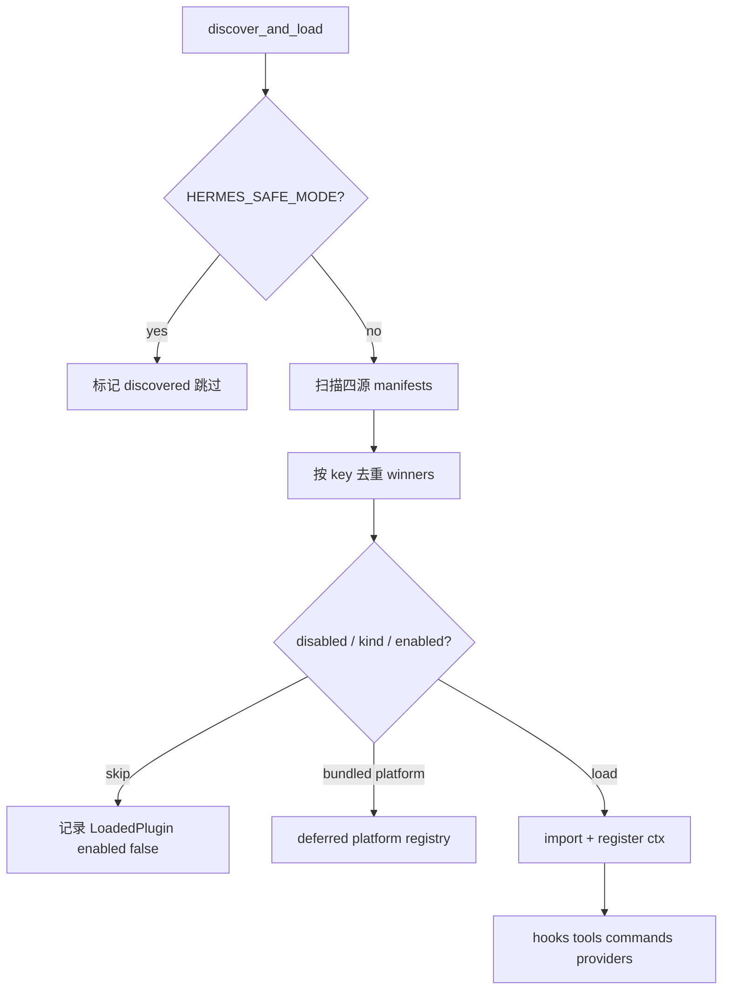

# Plugins 插件系统（Canonical）

> **文档状态**: Canonical · **Hermes**: 0.19.0 · **核对**: 2026-08-03 · [DOC_MAINTENANCE.md](DOC_MAINTENANCE.md)  
> **源码**: `hermes_cli/plugins.py`（`PluginManager` / `PluginContext` / hooks）  
> **相关**: [HITL_APPROVAL_FLOW.md](HITL_APPROVAL_FLOW.md)（`pre_tool_call` → approve）· [TOOLS_SYSTEM.md](TOOLS_SYSTEM.md) · [CLI_GATEWAY_SYSTEM.md](CLI_GATEWAY_SYSTEM.md) · [MEMORY_SYSTEM.md](MEMORY_SYSTEM.md)（exclusive memory provider）

---

## 目录

1. [体系设计与架构](#1-体系设计与架构)
2. [插件开发流程](#2-插件开发流程)
3. [插件配置流程](#3-插件配置流程)
4. [插件加载流程](#4-插件加载流程)
5. [插件执行流程](#5-插件执行流程)
6. [Hook / 注册能力速查](#6-hook--注册能力速查)
7. [源码锚点](#7-源码锚点)

---

## 1. 体系设计与架构

### 1.1 一句话

**插件是进程级全局扩展（微内核 + AOP），不是独立 Agent。**  
`PluginManager` 单例挂在 CLI/Gateway 进程上；主/子 `AIAgent` 在固定生命周期点 `invoke_hook` / `invoke_middleware`，插件被动响应。

```text
┌────────────────── Hermes 进程（CLI 或 Gateway）──────────────────┐
│  PluginManager（全局单例）                                         │
│    hooks / middleware / tools / slash / platforms / …              │
│                         │ invoke_hook / invoke_middleware          │
│              ┌──────────┼──────────┐                               │
│              ▼          ▼          ▼                               │
│         主 AIAgent   子 Agent A  子 Agent B                         │
└────────────────────────────────────────────────────────────────────┘
```

| | Agent | Plugin |
|--|-------|--------|
| LLM 循环 | 有 | 无（挂在宿主循环上） |
| 决策 | 自主 tool/推理 | 观察 / 拦截 / 注入 / 注册能力 |
| 身份 | `session_id` + messages | 无独立会话 |
| 数量 | 可多实例 | Manager 单例；各插件模块一份 |

### 1.2 设计原则

| 原则 | 含义 |
|------|------|
| **Opt-in** | 默认不跑用户/第三方 standalone；显式 `plugins.enabled` |
| **四源发现** | bundled / `~/.hermes/plugins` / 项目 `.hermes/plugins` / pip entry-point |
| **kind 分流** | `standalone` / `backend` / `platform` / `exclusive` / `model-provider` 加载策略不同 |
| **Prompt-cache 友好** | `pre_llm_call` 注入 **user 侧**上下文，不改 `_cached_system_prompt` |
| **Fail-closed 策略** | `pre_tool_call` 的 `approve` 闸门失败 → block（见 HITL） |
| **子 Agent 安全** | 部分 hook（如 `subagent_stop`）回到父线程串行，避免插件作者扛并发 |

### 1.3 插件种类（`plugin.yaml` → `kind`）

| kind | 谁启用 | 加载行为 |
|------|--------|----------|
| **standalone**（默认） | `plugins.enabled` | 显式启用才 `import` + `register()` |
| **backend** | bundled 自动；用户装的仍要 enabled | 如 `image_gen/openai` |
| **platform** | bundled **延迟**注册；用户装的要 enabled | Gateway 首次用该平台才 import |
| **exclusive** | `<category>.provider`（如 memory） | 通用扫描只记清单，由分类 discovery 加载 |
| **model-provider** | providers 自己的 discovery | 通用扫描不二次 import |

### 1.4 能力面（`PluginContext.register_*`）

插件在 `register(ctx)` 里声明自己要挂什么：

- **Hooks** — 生命周期观察/拦截（§6）
- **Middleware** — 可改写请求/包装执行（与 observer hook 分开）
- **Tools** — 进 tool registry，模型可调
- **Slash / CLI commands** — `/foo` 或 `hermes foo`
- **Providers** — image/video/tts/web/browser/secret/…
- **Platform** — Gateway 适配器
- **Context engine** — 替换压缩引擎（全局一个）
- **Skills** — `plugin:name` 显式 `skill_view`（不进 system skills 索引）
- **`ctx.llm`** — 宿主模型，无需自带 Key（能力可用 `plugins.entries.<id>.llm.*` 收紧）

Memory 等 exclusive 后端走 **分类插件树**（`plugins/memory/…`），不靠本 Manager 的 opt-in 列表单独 import。

---

## 2. 插件开发流程

### 2.1 最小骨架（standalone）

```text
my-plugin/
  plugin.yaml      # 清单（必填）
  __init__.py      # 导出 register(ctx)
  my_plugin.py     # 可选：实现
```

**`plugin.yaml`（例）:**

```yaml
name: disk-cleanup
version: "2.0.0"
description: Clean ephemeral session files via hooks
author: hermes
kind: standalone          # 可省略，默认 standalone
provides_hooks:           # 清单声明（文档/introspection）；真正生效靠 register()
  - post_tool_call
  - on_session_end
```

仓库内真实插件可能用 `hooks:` 等别名字段作说明；**解析器认 `provides_hooks` / `provides_tools` 等**（见 `_parse_manifest`）。**运行时以 `register(ctx)` 注册为准。**
**`__init__.py`:**

```python
def register(ctx):
    def on_end(**kwargs):
        # kwargs 随 hook 变化；返回值多数 hook 可忽略
        ...
    ctx.register_hook("on_session_end", on_end)
    # 或: ctx.register_tool(...); ctx.register_command(...)
```

### 2.2 开发步骤

```text
1. 选 kind / 能力：只要 hook？还要 tool / slash / platform？
2. 写 plugin.yaml + register(ctx)
3. 放到发现路径之一：
     · 开发：仓库 plugins/<name>/ 或 ~/.hermes/plugins/<name>/
     · 发布：pip 包 + entry-point 组 hermes_agent.plugins
4. 配置启用（§3）：hermes plugins enable <key>
5. 重启进程或 discover_plugins(force=True)（长驻 Gateway 需 force/重启）
6. hermes plugins list / 打日志验证 hooks 注册
7. 用最小场景测执行路径（§5）
```

### 2.3 常见模式

| 目标 | 做法 |
|------|------|
| 每轮给模型加 RAG 片段 | `pre_llm_call` → `{"context": "..."}` |
| 禁止或升级审批某工具 | `pre_tool_call` → `block` / `approve` |
| 改模型可见的 tool 结果 | `transform_tool_result`（first non-empty wins） |
| 新 IM 平台 | `kind: platform` + `ctx.register_platform` |
| 换记忆后端 | `kind: exclusive` + memory 分类 discovery + `memory.provider` |

### 2.4 不要做的事

- 在 hook 里改 system prompt 缓存字节（破坏 prefix cache；应用 `pre_llm_call`）。
- 假设 hook 在「主线程」——CLI 上常在 **Agent 线程**；Gateway 上常在 **executor 工作线程**（见 CLI_GATEWAY）。
- 覆盖核心 tool 名除非显式 `plugins.entries.<id>.allow_tool_override`。

---

## 3. 插件配置流程

### 3.1 配置落点

```yaml
# ~/.hermes/config.yaml（或当前 profile 覆盖）

plugins:
  enabled:                    # 白名单；缺省/空 = standalone 全不启用
    - disk-cleanup
    - langfuse
  disabled:                   # 显式禁用（优先于 enabled）
    - some-buggy-plugin
  entries:
    disk-cleanup:             # 每插件私有配置（可选）
      # ...
    my-plugin:
      llm:
        # 收紧 ctx.llm 能力
      allow_tool_override: false

# exclusive 示例（不靠 plugins.enabled import）
memory:
  provider: mem0              # 或 honcho / …

# backend 选用（bundled backend 已加载时由工具层选 provider）
# image_gen:
#   provider: openai
```

环境：

| 变量 | 作用 |
|------|------|
| `HERMES_SAFE_MODE=1` | **跳过**全部插件发现 |
| `HERMES_ENABLE_PROJECT_PLUGINS=1` | 允许扫描 `./.hermes/plugins` |

### 3.2 配置 → 生效顺序

```text
编辑 config.yaml / hermes plugins enable <key>
  → 新进程：启动时 discover_and_load 读最新配置
  → 已运行 Gateway：需 restart 或 discover_plugins(force=True)
  → disabled 命中 → 记入 _plugins 但 enabled=False，不 import
  → exclusive / model-provider → 清单可见，加载交给分类系统
```

CLI：`hermes plugins list|enable|disable|…`（以 `hermes_cli` 实际子命令为准）。

### 3.3 解析键（`key`）

- 扁平：`plugins/disk-cleanup/` → key `disk-cleanup`
- 分类：`plugins/image_gen/openai/` → key `image_gen/openai`  
`plugins.enabled` 用 **key**（兼容旧 bare `name`）。

---

## 4. 插件加载流程

### 4.1 谁触发

```text
CLI / Gateway / 其它入口
  → discover_plugins() 或 get_plugin_manager().discover_and_load()
  → 幂等：已 _discovered 且非 force 则直接返回
```

### 4.2 发现扫描（四源）

```text
1. bundled: <repo>/plugins/          （跳过顶层 memory/ context_engine/ model-providers/；
                                       platforms/ 单独再扫一层）
2. user:    ~/.hermes/plugins/
3. project: ./.hermes/plugins/       （需 HERMES_ENABLE_PROJECT_PLUGINS）
4. pip:     entry_points hermes_agent.plugins

同 key 后写覆盖先写：project > user > bundled（实现上 winners 字典后扫描覆盖）
```

清单要求：目录内有 **`plugin.yaml`**，且模块提供 **`register(ctx)`**。

### 4.3 启用判定 → `_load_plugin`

```text
for each winner manifest:
  if in disabled → skip (enabled=False)
  if kind == exclusive → 只记录，不 load
  if kind == model-provider → 只记录，providers 自己 load
  if bundled && backend → _load_plugin
  if bundled && platform → _register_deferred_platform（懒 import）
  else if key in plugins.enabled → _load_plugin
  else → skip (not enabled)
```

**`_load_plugin` 内部（概念）:**

```text
importlib 加载模块
  → PluginContext(manifest, manager)
  → module.register(ctx)
  → ctx.register_* 写入 manager._hooks / _middleware / tool registry / …
  → LoadedPlugin.enabled = True
```

失败：写入 `LoadedPlugin.error`，尽量不拖垮整个发现（具体以源码 try/except 为准）。

### 4.4 加载时序图



---

## 5. 插件执行流程

插件 **没有自己的 run loop**。宿主在固定点调用 Manager。

### 5.1 总路径

```text
Agent / Gateway / ToolExecutor 事件
  → invoke_hook("name", **kwargs)
  或 invoke_middleware("kind", **kwargs)
  或 已注册 tool handler（模型 tool_call → registry）
  或 slash / CLI 分发到 plugin command
```

### 5.2 一轮对话里典型 Hook 序（示意）

```text
on_session_start（会话首次）
  → （用户消息）
  → pre_llm_call          # 可返回 context → 拼进本轮 API user 侧，不写 Session 原文
  → pre_api_request
  → （LLM）
  → post_api_request / api_request_error
  → post_llm_call
  → transform_llm_output  # 可选改最终文本
  → 若有 tool_calls:
       pre_tool_call      # block | approve → HITL | 放行
       （middleware / handler）
       transform_tool_result / transform_terminal_output
       post_tool_call
  → pre_verify（停前校验，可 continue）
  → …
on_session_end / on_session_finalize
```

Gateway 入站额外：`pre_gateway_dispatch`（`skip` / `rewrite` / `allow`）在鉴权与 agent 之前。

审批：`pre_approval_request` / `post_approval_response` **只观察**；要拦工具用 `pre_tool_call`。

### 5.3 `pre_tool_call` → 执行/HITL

```text
tool_executor._authorized_dispatch
  → resolve_pre_tool_block(...)
       · action=block  → 直接 error JSON，handler 不跑
       · action=approve → request_tool_approval → 与危险 shell 同一闸门
       · 其它 → 继续 handler
```

详见 [HITL_APPROVAL_FLOW.md](HITL_APPROVAL_FLOW.md) §5.0 / §10。

### 5.4 Tool 插件执行

```text
register_tool 时写入工具注册表
  → 模型在本轮 tools 列表里看到 schema（受 toolset / 白名单约束）
  → tool_call → 与内置工具同一执行管线（含上述 hook）
```

### 5.5 与线程模型的关系

| 表面 | Hook/tool 通常跑在 |
|------|-------------------|
| CLI | **Agent `threading.Thread`**（不是 PT 主线程） |
| Gateway | **`run_in_executor` 工作线程** |
| 部分 gateway 钩子 | asyncio 循环上（如 `pre_gateway_dispatch`） |

插件若碰 UI/队列，需按表面选对线程；审批回调已由宿主处理。

---

## 6. Hook / 注册能力速查

### 6.1 VALID_HOOKS（摘要）

| Hook | 典型返回 |
|------|----------|
| `pre_llm_call` | `{"context": str}` |
| `pre_tool_call` | `{"action":"block"|"approve", "message", "rule_key"?}` |
| `transform_*` | 替换字符串（first wins） |
| `pre_verify` | `{"action":"continue","message"}` 等 |
| `pre_gateway_dispatch` | `skip` / `rewrite` / `allow` |
| `on_session_*` / `subagent_*` / `pre_approval_*` / `kanban_task_*` | 多为观察 |

完整集合以 `hermes_cli/plugins.py` 中 `VALID_HOOKS` 为准（含 `pre_verify`、`api_request_error`、kanban 等）。

### 6.2 为何不改 System Prompt

```text
System（缓存稳定）  Identity + skills + memory 快照 …
User（每轮可变）    用户输入 + pre_llm_call context
```

中途改 system 会打穿 Anthropic/本地 prefix cache；built-in memory 也是「下轮/压缩再建」模型（见 MEMORY）。

---

## 7. 源码锚点

| 符号 | 文件 |
|------|------|
| `PluginManager.discover_and_load` / `_load_plugin` | `hermes_cli/plugins.py` |
| `PluginContext.register_*` | 同上 |
| `discover_plugins` / `invoke_hook` / `invoke_middleware` | 同上 |
| `resolve_pre_tool_block` | 同上 → HITL |
| 仓库插件示例 | `plugins/disk-cleanup/` |
| Memory exclusive | `plugins/memory/` + MEMORY 文档 |
| Platform 延迟加载 | `PluginManager._register_deferred_platform` |

---

## 变更说明（相对旧稿）

- 按用户五问重排：**架构 → 开发 → 配置 → 加载 → 执行**。
- 删除旧 §8 过时模板长文；开发以最小骨架 + 源码为准。
- Hook 列表与 `kind` 加载规则对齐 0.19 `plugins.py`。
