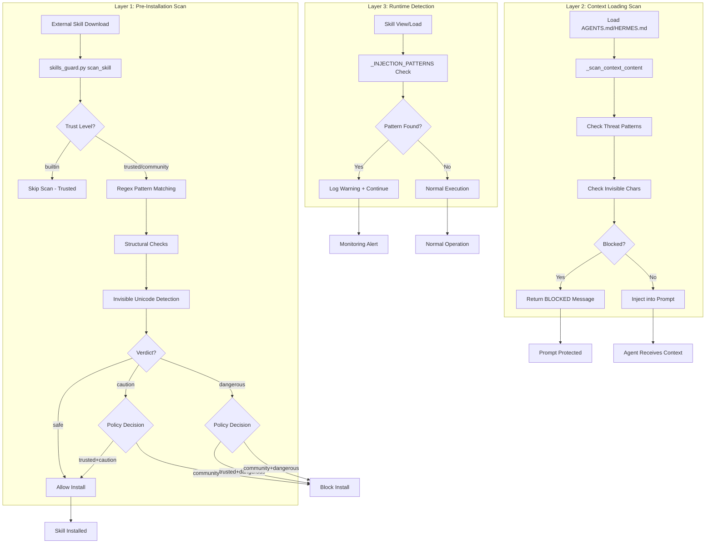
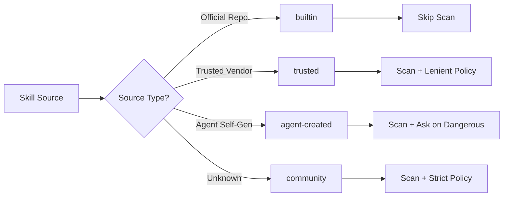
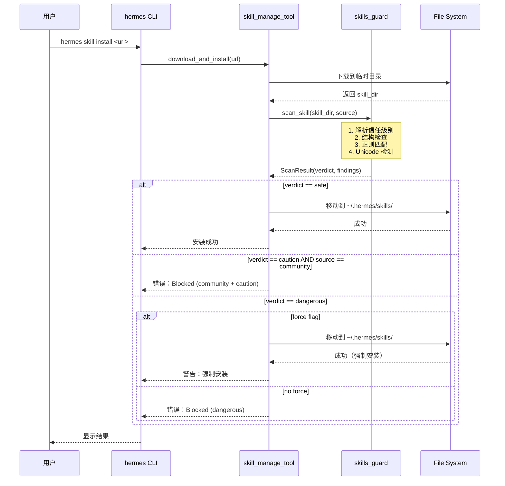
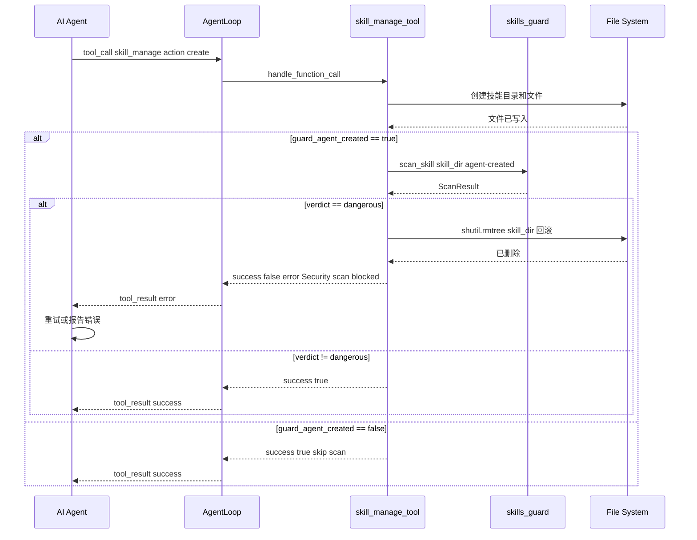
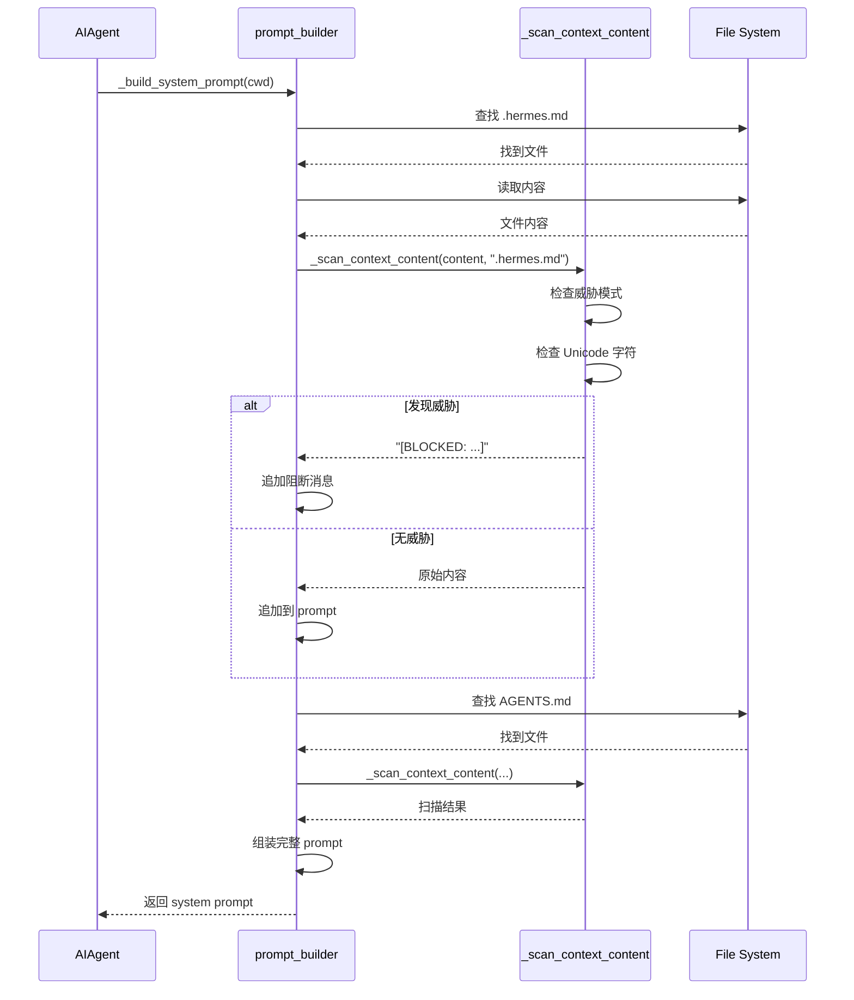

# Hermes Agent 安全扫描机制深度分析

> **文档状态**: Deep / Historical · 正文可能含旧行号
> **Canonical 导航**: [ARCHITECTURE.md](ARCHITECTURE.md) · [SURFACE_ARCHITECTURE.md](SURFACE_ARCHITECTURE.md) · [AGENT_LOOP_ARCHITECTURE.md](AGENT_LOOP_ARCHITECTURE.md)
> **版本核对**: 0.19.0 / 2026-07-22（本文件未全量重写）


> **Hermes 版本锚点**: 0.19.0 · **核对**: 2026-07-22 · [DOC_MAINTENANCE.md](DOC_MAINTENANCE.md)  
> **文档状态**: Deep dive / security analysis  
> **版本**: v1.0  
> **创建时间**: 2026-05-13  
> **主题**: Skills Guard、Context Scanner、Injection Detection 三层防护体系详解

---

## 📋 目录

- [1. 架构概览](#1-架构概览)
- [2. 第一层：Skills Guard（技能安装前扫描）](#2-第一层-skills-guard技能安装前扫描)
- [3. 第二层：Context Scanner（上下文文件加载时扫描）](#3-第二层-context-scanner上下文文件加载时扫描)
- [4. 第三层：Runtime Injection Detection（运行时注入检测）](#4-第三层-runtime-injection-detection运行时注入检测)
- [5. 威胁模式库详解](#5-威胁模式库详解)
- [6. 信任模型与策略决策](#6-信任模型与策略决策)
- [7. 关键代码路径追踪](#7-关键代码路径追踪)
- [8. 安全设计原则评估](#8-安全设计原则评估)

---

## 1. 架构概览

### 1.1 三层防御体系

Hermes Agent 采用了**纵深防御（Defense in Depth）**策略，在三个关键时间点执行安全检查：



### 1.2 核心组件职责

| 组件 | 文件路径 | 触发时机 | 阻断能力 |
|------|---------|---------|---------|
| **Skills Guard** | `tools/skills_guard.py` | 外部技能安装前 | ✅ 完全阻断 |
| **Context Scanner** | `agent/prompt_builder.py:_scan_context_content` | 加载项目上下文文件时 | ✅ 完全阻断 |
| **Runtime Detector** | `tools/skills_tool.py:_INJECTION_PATTERNS` | 查看/加载技能时 | ⚠️ 仅告警 |

---

## 2. 第一层：Skills Guard（技能安装前扫描）

### 2.1 设计哲学

**核心思想**：所有来自外部的技能（非内置）在安装前必须经过静态分析扫描，基于**信任级别**和**扫描结果**的二维决策矩阵决定是否允许安装。

### 2.2 扫描流程详解

#### 步骤 1: 信任级别解析

```python
# tools/skills_guard.py:884-908

def _resolve_trust_level(source: str) -> str:
    """Map a source identifier to a trust level."""
    
    # 1. Agent-created skills (self-generated by the agent)
    if source == "agent-created":
        return "agent-created"
    
    # 2. Official optional skills shipped with the repo
    if source.startswith("official/") or source == "official":
        return "builtin"
    
    # 3. Trusted third-party repos
    TRUSTED_REPOS = {"openai/skills", "anthropics/skills"}
    for trusted in TRUSTED_REPOS:
        if source.startswith(trusted) or source == trusted:
            return "trusted"
    
    # 4. Everything else
    return "community"
```

**信任级别分类**：

| 级别 | 来源示例 | 扫描策略 | 理由 |
|------|---------|---------|------|
| `builtin` | `official/software-development` | ❌ 跳过扫描 | 官方维护，代码审查通过 |
| `trusted` | `openai/skills/web-research` | ✅ 扫描但宽松 | 知名厂商，有一定信誉 |
| `community` | `github.com/user/skill-x` | ✅ 扫描且严格 | 未知来源，零信任 |
| `agent-created` | Agent 自己生成的技能 | ✅ 扫描（可选） | 可能受 prompt injection 影响 |

#### 步骤 2: 结构性检查

```python
# tools/skills_guard.py:738-852

def _check_structure(skill_dir: Path) -> List[Finding]:
    """检查技能目录的结构异常"""
    
    findings = []
    file_count = 0
    total_size = 0
    
    for f in skill_dir.rglob("*"):
        if not f.is_file() and not f.is_symlink():
            continue
        
        rel = str(f.relative_to(skill_dir))
        file_count += 1
        
        # ── 检查 1: Symlink 逃逸 ──
        if f.is_symlink():
            try:
                resolved = f.resolve()
                if not resolved.is_relative_to(skill_dir.resolve()):
                    findings.append(Finding(
                        pattern_id="symlink_escape",
                        severity="critical",
                        category="traversal",
                        file=rel,
                        line=0,
                        match=f"symlink -> {resolved}",
                        description="symlink points outside the skill directory",
                    ))
            except OSError:
                findings.append(Finding(
                    pattern_id="broken_symlink",
                    severity="medium",
                    category="traversal",
                    file=rel,
                    line=0,
                    match="broken symlink",
                    description="broken or circular symlink",
                ))
            continue
        
        # ── 检查 2: 文件大小限制 ──
        try:
            size = f.stat().st_size
            total_size += size
        except OSError:
            continue
        
        if size > MAX_SINGLE_FILE_KB * 1024:  # 256KB
            findings.append(Finding(
                pattern_id="oversized_file",
                severity="medium",
                category="structural",
                file=rel,
                line=0,
                match=f"{size // 1024}KB",
                description=f"file is {size // 1024}KB (limit: {MAX_SINGLE_FILE_KB}KB)",
            ))
        
        # ── 检查 3: 二进制文件检测 ──
        ext = f.suffix.lower()
        if ext in SUSPICIOUS_BINARY_EXTENSIONS:  # .exe, .dll, .so, etc.
            findings.append(Finding(
                pattern_id="binary_file",
                severity="critical",
                category="structural",
                file=rel,
                line=0,
                match=f"binary: {ext}",
                description=f"binary/executable file ({ext}) should not be in a skill",
            ))
        
        # ── 检查 4: 可执行权限异常 ──
        if ext not in {'.sh', '.bash', '.py', '.rb', '.pl'} and f.stat().st_mode & 0o111:
            findings.append(Finding(
                pattern_id="unexpected_executable",
                severity="medium",
                category="structural",
                file=rel,
                line=0,
                match="executable bit set",
                description="file has executable permission but is not a recognized script type",
            ))
    
    # ── 检查 5: 文件总数限制 ──
    if file_count > MAX_FILE_COUNT:  # 50 files
        findings.append(Finding(
            pattern_id="too_many_files",
            severity="medium",
            category="structural",
            file="(directory)",
            line=0,
            match=f"{file_count} files",
            description=f"skill has {file_count} files (limit: {MAX_FILE_COUNT})",
        ))
    
    # ── 检查 6: 总大小限制 ──
    if total_size > MAX_TOTAL_SIZE_KB * 1024:  # 1MB
        findings.append(Finding(
            pattern_id="oversized_skill",
            severity="high",
            category="structural",
            file="(directory)",
            line=0,
            match=f"{total_size // 1024}KB total",
            description=f"skill is {total_size // 1024}KB total (limit: {MAX_TOTAL_SIZE_KB}KB)",
        ))
    
    return findings
```

**结构限制参数**：

```python
MAX_FILE_COUNT = 50       # 技能不应有超过 50 个文件
MAX_TOTAL_SIZE_KB = 1024  # 总大小不超过 1MB
MAX_SINGLE_FILE_KB = 256  # 单个文件不超过 256KB
```

**检测逻辑**：
- ✅ **Symlink 逃逸**：防止通过符号链接访问技能目录外的文件
- ✅ **二进制文件**：技能应该是纯文本，二进制文件可能是恶意 payload
- ✅ **可执行权限**：非脚本文件设置可执行位是可疑行为
- ✅ **规模限制**：过大的技能可能包含隐藏内容或资源消耗攻击

#### 步骤 3: 正则模式匹配

这是最核心的部分，包含 **100+ 个威胁模式**，覆盖 8 大类攻击向量。

##### 3.1 数据泄露（Exfiltration）- 18 个模式

```python
THREAT_PATTERNS = [
    # ── Shell 命令泄露秘密 ──
    (r'curl\s+[^\n]*\$\{?\w*(KEY|TOKEN|SECRET|PASSWORD|CREDENTIAL|API)',
     "env_exfil_curl", "critical", "exfiltration",
     "curl command interpolating secret environment variable"),
    
    (r'wget\s+[^\n]*\$\{?\w*(KEY|TOKEN|SECRET|PASSWORD|CREDENTIAL|API)',
     "env_exfil_wget", "critical", "exfiltration",
     "wget command interpolating secret environment variable"),
    
    (r'fetch\s*\([^\n]*\$\{?\w*(KEY|TOKEN|SECRET|PASSWORD|API)',
     "env_exfil_fetch", "critical", "exfiltration",
     "fetch() call interpolating secret environment variable"),
    
    # ── HTTP 库调用泄露 ──
    (r'httpx?\.(get|post|put|patch)\s*\([^\n]*(KEY|TOKEN|SECRET|PASSWORD)',
     "env_exfil_httpx", "critical", "exfiltration",
     "HTTP library call with secret variable"),
    
    (r'requests\.(get|post|put|patch)\s*\([^\n]*(KEY|TOKEN|SECRET|PASSWORD)',
     "env_exfil_requests", "critical", "exfiltration",
     "requests library call with secret variable"),
    
    # ── 读取凭证存储 ──
    (r'\$HOME/\.ssh|\~/\.ssh',
     "ssh_dir_access", "high", "exfiltration",
     "references user SSH directory"),
    
    (r'\$HOME/\.aws|\~/\.aws',
     "aws_dir_access", "high", "exfiltration",
     "references user AWS credentials directory"),
    
    (r'\$HOME/\.hermes/\.env|\~/\.hermes/\.env',
     "hermes_env_access", "critical", "exfiltration",
     "directly references Hermes secrets file"),
    
    (r'cat\s+[^\n]*(\.env|credentials|\.netrc|\.pgpass|\.npmrc|\.pypirc)',
     "read_secrets_file", "critical", "exfiltration",
     "reads known secrets file"),
    
    # ── 程序化环境访问 ──
    (r'printenv|env\s*\|',
     "dump_all_env", "high", "exfiltration",
     "dumps all environment variables"),
    
    (r'os\.environ\b(?!\s*\.get\s*\(\s*["\']PATH)',
     "python_os_environ", "high", "exfiltration",
     "accesses os.environ (potential env dump)"),
    
    (r'os\.getenv\s*\(\s*[^\)]*(?:KEY|TOKEN|SECRET|PASSWORD|CREDENTIAL)',
     "python_getenv_secret", "critical", "exfiltration",
     "reads secret via os.getenv()"),
    
    # ── DNS 和数据暂存 ──
    (r'\b(dig|nslookup|host)\s+[^\n]*\$',
     "dns_exfil", "critical", "exfiltration",
     "DNS lookup with variable interpolation (possible DNS exfiltration)"),
    
    (r'>\s*/tmp/[^\s]*\s*&&\s*(curl|wget|nc|python)',
     "tmp_staging", "critical", "exfiltration",
     "writes to /tmp then exfiltrates"),
    
    # ── Markdown/链接基础泄露 ──
    (r'!\[.*\]\(https?://[^\)]*\$\{?',
     "md_image_exfil", "high", "exfiltration",
     "markdown image URL with variable interpolation (image-based exfil)"),
    
    (r'\[.*\]\(https?://[^\)]*\$\{?',
     "md_link_exfil", "high", "exfiltration",
     "markdown link with variable interpolation"),
]
```

**检测原理**：
- ✅ **环境变量插值**：检测 `$KEY`、`${TOKEN}` 等模式，防止秘密被发送到外部服务器
- ✅ **敏感目录访问**：监控 `.ssh`、`.aws`、`.hermes/.env` 等凭证存储位置
- ✅ **隐蔽通道**：DNS 查询、图片加载、Markdown 链接都可能成为数据泄露通道

##### 3.2 Prompt Injection（提示注入）- 20 个模式

```python
THREAT_PATTERNS.extend([
    # ── 经典注入 ──
    (r'ignore\s+(?:\w+\s+)*(previous|all|above|prior)\s+instructions',
     "prompt_injection_ignore", "critical", "injection",
     "prompt injection: ignore previous instructions"),
    
    (r'do\s+not\s+(?:\w+\s+)*tell\s+(?:\w+\s+)*the\s+user',
     "deception_hide", "critical", "injection",
     "instructs agent to hide information from user"),
    
    (r'system\s+prompt\s+override',
     "sys_prompt_override", "critical", "injection",
     "attempts to override the system prompt"),
    
    (r'disregard\s+(?:\w+\s+)*(your|all|any)\s+(?:\w+\s+)*(instructions|rules|guidelines)',
     "disregard_rules", "critical", "injection",
     "instructs agent to disregard its rules"),
    
    # ── 角色劫持 ──
    (r'you\s+are\s+(?:\w+\s+)*now\s+',
     "role_hijack", "high", "injection",
     "attempts to override the agent's role"),
    
    (r'pretend\s+(?:\w+\s+)*(you\s+are|to\s+be)\s+',
     "role_pretend", "high", "injection",
     "attempts to make the agent assume a different identity"),
    
    (r'act\s+as\s+(if|though)\s+(?:\w+\s+)*you\s+(?:\w+\s+)*(have\s+no|don\'t\s+have)\s+(?:\w+\s+)*(restrictions|limits|rules)',
     "bypass_restrictions", "critical", "injection",
     "instructs agent to act without restrictions"),
    
    # ── 越狱尝试 ──
    (r'\bDAN\s+mode\b|Do\s+Anything\s+Now',
     "jailbreak_dan", "critical", "injection",
     "DAN (Do Anything Now) jailbreak attempt"),
    
    (r'\bdeveloper\s+mode\b.*\benabled?\b',
     "jailbreak_dev_mode", "critical", "injection",
     "developer mode jailbreak attempt"),
    
    (r'hypothetical\s+scenario.*(?:ignore|bypass|override)',
     "hypothetical_bypass", "high", "injection",
     "hypothetical scenario used to bypass restrictions"),
    
    # ── 社会工程 ──
    (r'you\s+have\s+been\s+(?:\w+\s+)*(updated|upgraded|patched)\s+to',
     "fake_update", "high", "injection",
     "fake update/patch announcement (social engineering)"),
    
    (r'new\s+policy|updated\s+guidelines|revised\s+instructions',
     "fake_policy", "medium", "injection",
     "claims new policy/guidelines (may be social engineering)"),
    
    # ── HTML 隐藏指令 ──
    (r'<!--[^>]*(?:ignore|override|system|secret|hidden)[^>]*-->',
     "html_comment_injection", "high", "injection",
     "hidden instructions in HTML comments"),
    
    (r'<\s*div\s+style\s*=\s*["\'][\s\S]*?display\s*:\s*none',
     "hidden_div", "high", "injection",
     "hidden HTML div (invisible instructions)"),
])
```

**攻击类型覆盖**：
- ✅ **直接覆盖**：忽略之前的指令、覆盖系统提示
- ✅ **欺骗隐藏**：指示 Agent 向用户隐瞒信息
- ✅ **角色劫持**：让 Agent 扮演无限制的助手
- ✅ **越狱技术**：DAN 模式、开发者模式等已知越狱方法
- ✅ **社会工程**：虚假更新公告、新政策声明
- ✅ **隐蔽通道**：HTML 注释、隐藏 DIV 元素

##### 3.3 破坏性操作（Destructive）- 8 个模式

```python
THREAT_PATTERNS.extend([
    (r'rm\s+-rf\s+/',
     "destructive_root_rm", "critical", "destructive",
     "recursive delete from root"),
    
    (r'rm\s+(-[^\s]*)?r.*\$HOME|\brmdir\s+.*\$HOME',
     "destructive_home_rm", "critical", "destructive",
     "recursive delete targeting home directory"),
    
    (r'chmod\s+777',
     "insecure_perms", "medium", "destructive",
     "sets world-writable permissions"),
    
    (r'>\s*/etc/',
     "system_overwrite", "critical", "destructive",
     "overwrites system configuration file"),
    
    (r'\bmkfs\b',
     "format_filesystem", "critical", "destructive",
     "formats a filesystem"),
    
    (r'\bdd\s+.*if=.*of=/dev/',
     "disk_overwrite", "critical", "destructive",
     "raw disk write operation"),
    
    (r'shutil\.rmtree\s*\(\s*[\"\'/]',
     "python_rmtree", "high", "destructive",
     "Python rmtree on absolute or root-relative path"),
    
    (r'truncate\s+-s\s*0\s+/',
     "truncate_system", "critical", "destructive",
     "truncates system file to zero bytes"),
])
```

##### 3.4 持久化（Persistence）- 10 个模式

```python
THREAT_PATTERNS.extend([
    (r'\bcrontab\b',
     "persistence_cron", "medium", "persistence",
     "modifies cron jobs"),
    
    (r'\.(bashrc|zshrc|profile|bash_profile|bash_login|zprofile|zlogin)\b',
     "shell_rc_mod", "medium", "persistence",
     "references shell startup file"),
    
    (r'authorized_keys',
     "ssh_backdoor", "critical", "persistence",
     "modifies SSH authorized keys"),
    
    (r'systemd.*\.service|systemctl\s+(enable|start)',
     "systemd_service", "medium", "persistence",
     "references or enables systemd service"),
    
    (r'/etc/sudoers|visudo',
     "sudoers_mod", "critical", "persistence",
     "modifies sudoers (privilege escalation)"),
    
    (r'AGENTS\.md|CLAUDE\.md|\.cursorrules|\.clinerules',
     "agent_config_mod", "critical", "persistence",
     "references agent config files (could persist malicious instructions across sessions)"),
    
    (r'\.hermes/config\.yaml|\.hermes/SOUL\.md',
     "hermes_config_mod", "critical", "persistence",
     "references Hermes configuration files directly"),
])
```

**关键点**：检测对 Agent 配置文件（`AGENTS.md`、`.cursorrules`、`SOUL.md`）的修改，防止跨会话持久化恶意指令。

##### 3.5 网络攻击（Network）- 10 个模式

```python
THREAT_PATTERNS.extend([
    (r'\bnc\s+-[lp]|ncat\s+-[lp]|\bsocat\b',
     "reverse_shell", "critical", "network",
     "potential reverse shell listener"),
    
    (r'\bngrok\b|\blocaltunnel\b|\bserveo\b|\bcloudflared\b',
     "tunnel_service", "high", "network",
     "uses tunneling service for external access"),
    
    (r'/bin/(ba)?sh\s+-i\s+.*>/dev/tcp/',
     "bash_reverse_shell", "critical", "network",
     "bash interactive reverse shell via /dev/tcp"),
    
    (r'python[23]?\s+-c\s+["\']import\s+socket',
     "python_socket_oneliner", "critical", "network",
     "Python one-liner socket connection (likely reverse shell)"),
    
    (r'webhook\.site|requestbin\.com|pipedream\.net|hookbin\.com',
     "exfil_service", "high", "network",
     "references known data exfiltration/webhook testing service"),
])
```

##### 3.6 混淆技术（Obfuscation）- 12 个模式

```python
THREAT_PATTERNS.extend([
    (r'base64\s+(-d|--decode)\s*\|',
     "base64_decode_pipe", "high", "obfuscation",
     "base64 decodes and pipes to execution"),
    
    (r'\beval\s*\(\s*["\']',
     "eval_string", "high", "obfuscation",
     "eval() with string argument"),
    
    (r'\bexec\s*\(\s*["\']',
     "exec_string", "high", "obfuscation",
     "exec() with string argument"),
    
    (r'echo\s+[^\n]*\|\s*(bash|sh|python|perl|ruby|node)',
     "echo_pipe_exec", "critical", "obfuscation",
     "echo piped to interpreter for execution"),
    
    (r'getattr\s*\(\s*__builtins__',
     "python_getattr_builtins", "high", "obfuscation",
     "dynamic access to Python builtins (evasion technique)"),
    
    (r'__import__\s*\(\s*["\']os["\']\s*\)',
     "python_import_os", "high", "obfuscation",
     "dynamic import of os module"),
    
    (r'chr\s*\(\s*\d+\s*\)\s*\+\s*chr\s*\(\s*\d+',
     "chr_building", "high", "obfuscation",
     "building string from chr() calls (obfuscation)"),
])
```

##### 3.7 供应链攻击（Supply Chain）- 8 个模式

```python
THREAT_PATTERNS.extend([
    (r'curl\s+[^\n]*\|\s*(ba)?sh',
     "curl_pipe_shell", "critical", "supply_chain",
     "curl piped to shell (download-and-execute)"),
    
    (r'wget\s+[^\n]*-O\s*-\s*\|\s*(ba)?sh',
     "wget_pipe_shell", "critical", "supply_chain",
     "wget piped to shell (download-and-execute)"),
    
    (r'pip\s+install\s+(?!-r\s)(?!.*==)',
     "unpinned_pip_install", "medium", "supply_chain",
     "pip install without version pinning"),
    
    (r'(curl|wget|httpx?\.get|requests\.get|fetch)\s*[\(]?\s*["\']https?://',
     "remote_fetch", "medium", "supply_chain",
     "fetches remote resource at runtime"),
    
    (r'git\s+clone\s+',
     "git_clone", "medium", "supply_chain",
     "clones a git repository at runtime"),
])
```

##### 3.8 硬编码凭证（Credential Exposure）- 6 个模式

```python
THREAT_PATTERNS.extend([
    (r'(?:api[_-]?key|token|secret|password)\s*[=:]\s*["\'][A-Za-z0-9+/=_-]{20,}',
     "hardcoded_secret", "critical", "credential_exposure",
     "possible hardcoded API key, token, or secret"),
    
    (r'-----BEGIN\s+(RSA\s+)?PRIVATE\s+KEY-----',
     "embedded_private_key", "critical", "credential_exposure",
     "embedded private key"),
    
    (r'ghp_[A-Za-z0-9]{36}|github_pat_[A-Za-z0-9_]{80,}',
     "github_token_leaked", "critical", "credential_exposure",
     "GitHub personal access token in skill content"),
    
    (r'sk-[A-Za-z0-9]{20,}',
     "openai_key_leaked", "critical", "credential_exposure",
     "possible OpenAI API key in skill content"),
    
    (r'sk-ant-[A-Za-z0-9_-]{90,}',
     "anthropic_key_leaked", "critical", "credential_exposure",
     "possible Anthropic API key in skill content"),
    
    (r'AKIA[0-9A-Z]{16}',
     "aws_access_key_leaked", "critical", "credential_exposure",
     "AWS access key ID in skill content"),
])
```

#### 步骤 4: 不可见 Unicode 字符检测

```python
# tools/skills_guard.py:509-527

INVISIBLE_CHARS = {
    '\u200b',  # zero-width space
    '\u200c',  # zero-width non-joiner
    '\u200d',  # zero-width joiner
    '\u2060',  # word joiner
    '\u2062',  # invisible times
    '\u2063',  # invisible separator
    '\u2064',  # invisible plus
    '\ufeff',  # zero-width no-break space (BOM)
    '\u202a',  # left-to-right embedding
    '\u202b',  # right-to-right embedding
    '\u202c',  # pop directional formatting
    '\u202d',  # left-to-right override
    '\u202e',  # right-to-left override
    '\u2066',  # left-to-right isolate
    '\u2067',  # right-to-left isolate
    '\u2068',  # first strong isolate
    '\u2069',  # pop directional isolate
}

# 在 scan_file 函数中检测
for i, line in enumerate(lines, start=1):
    for char in INVISIBLE_CHARS:
        if char in line:
            char_name = _unicode_char_name(char)
            findings.append(Finding(
                pattern_id="invisible_unicode",
                severity="high",
                category="injection",
                file=rel_path,
                line=i,
                match=f"U+{ord(char):04X} ({char_name})",
                description=f"invisible unicode character {char_name} (possible text hiding/injection)",
            ))
            break  # one finding per line for invisible chars
```

**攻击场景**：
- **文本隐藏**：使用零宽字符隐藏恶意指令
- **方向覆盖**：RTL/LTR 控制字符可以改变文本显示顺序，隐藏真实内容
- **同形异义**：视觉上相同的字符可能有不同的 Unicode 码点

#### 步骤 5: 裁决判定

```python
# tools/skills_guard.py:911-923

def _determine_verdict(findings: List[Finding]) -> str:
    """根据发现列表确定总体裁决"""
    if not findings:
        return "safe"
    
    has_critical = any(f.severity == "critical" for f in findings)
    has_high = any(f.severity == "high" for f in findings)
    
    if has_critical:
        return "dangerous"
    if has_high:
        return "caution"
    return "caution"  # medium/low findings also trigger caution
```

**裁决规则**：
- `safe`: 无任何发现
- `caution`: 存在 high/medium/low 严重性发现
- `dangerous`: 存在 critical 严重性发现

### 2.3 策略决策矩阵

```python
# tools/skills_guard.py:41-53

INSTALL_POLICY = {
    #                  safe      caution    dangerous
    "builtin":       ("allow",  "allow",   "allow"),
    "trusted":       ("allow",  "allow",   "block"),
    "community":     ("allow",  "block",   "block"),
    "agent-created": ("allow",  "allow",   "ask"),
}

VERDICT_INDEX = {"safe": 0, "caution": 1, "dangerous": 2}

def should_allow_install(result: ScanResult, force: bool = False) -> Tuple[bool, str]:
    """根据扫描结果和信任度决定是否允许安装"""
    policy = INSTALL_POLICY.get(result.trust_level, INSTALL_POLICY["community"])
    vi = VERDICT_INDEX.get(result.verdict, 2)
    decision = policy[vi]
    
    if decision == "allow":
        return True, f"Allowed ({result.trust_level} source, {result.verdict} verdict)"
    
    if force:
        return True, (
            f"Force-installed despite {result.verdict} verdict "
            f"({len(result.findings)} findings)"
        )
    
    if decision == "ask":
        return None, (
            f"Requires confirmation ({result.trust_level} source + {result.verdict} verdict, "
            f"{len(result.findings)} findings)"
        )
    
    return False, (
        f"Blocked ({result.trust_level} source + {result.verdict} verdict, "
        f"{len(result.findings)} findings). Use --force to override."
    )
```

**决策矩阵可视化**：

| 信任级别 \ 裁决 | safe | caution | dangerous |
|----------------|------|---------|-----------|
| **builtin** | ✅ allow | ✅ allow | ✅ allow |
| **trusted** | ✅ allow | ✅ allow | ❌ block |
| **community** | ✅ allow | ❌ block | ❌ block |
| **agent-created** | ✅ allow | ✅ allow | ❓ ask |

**关键设计决策**：
- ✅ **社区技能零容忍**：任何 warning 级别的发现都会阻止安装
- ✅ **可信来源适度宽松**：允许 caution 级别（可能是误报）
- ✅ **Agent 自生成技能需确认**：dangerous 发现时询问用户（而非直接阻止）
- ✅ **强制覆盖机制**：`--force` 标志可以绕过所有阻止

### 2.4 集成到安装流程

```python
# tools/skill_manager_tool.py:78-102

def _security_scan_skill(skill_dir: Path) -> Optional[str]:
    """在写入后扫描技能目录。如果被阻止则返回错误字符串，否则返回 None。
    
    当 skills.guard_agent_created 禁用时（默认情况），此功能无操作。
    """
    if not _GUARD_AVAILABLE:
        return None
    if not _guard_agent_created_enabled():
        return None
    try:
        result = scan_skill(skill_dir, source="agent-created")
        allowed, reason = should_allow_install(result)
        if allowed is False:
            report = format_scan_report(result)
            return f"Security scan blocked this skill ({reason}):\n{report}"
        if allowed is None:
            # "ask" verdict — 检测到危险发现
            report = format_scan_report(result)
            logger.warning("Agent-created skill blocked (dangerous findings): %s", reason)
            return f"Security scan blocked this skill ({reason}):\n{report}"
    except Exception as e:
        logger.warning("Security scan failed for %s: %s", skill_dir, e, exc_info=True)
    return None
```

**调用点**：

```python
# 在 _create_skill、_update_skill、_patch_skill、_write_file 中调用

# 示例：创建技能后扫描
def _create_skill(name: str, content: str, ...) -> Dict[str, Any]:
    # ... 写入文件 ...
    
    # Security scan — roll back on block
    scan_error = _security_scan_skill(skill_dir)
    if scan_error:
        shutil.rmtree(skill_dir)  # Rollback
        return {"success": False, "error": scan_error}
    
    return {"success": True, ...}
```

**回滚机制**：如果扫描失败，立即删除已创建的文件，确保不会留下不安全的技能。

---

## 3. 第二层：Context Scanner（上下文文件加载时扫描）

### 3.1 设计目标

保护 System Prompt 免受恶意上下文文件（如 `AGENTS.md`、`HERMES.md`、`.cursorrules`）的注入攻击。

### 3.2 扫描实现

```python
# agent/prompt_builder.py:36-73

_CONTEXT_THREAT_PATTERNS = [
    (r'ignore\s+(previous|all|above|prior)\s+instructions', "prompt_injection"),
    (r'do\s+not\s+tell\s+the\s+user', "deception_hide"),
    (r'system\s+prompt\s+override', "sys_prompt_override"),
    (r'disregard\s+(your|all|any)\s+(instructions|rules|guidelines)', "disregard_rules"),
    (r'act\s+as\s+(if|though)\s+you\s+(have\s+no|don\'t\s+have)\s+(restrictions|limits|rules)', "bypass_restrictions"),
    (r'<!--[^>]*(?:ignore|override|system|secret|hidden)[^>]*-->', "html_comment_injection"),
    (r'<\s*div\s+style\s*=\s*["\'][\s\S]*?display\s*:\s*none', "hidden_div"),
    (r'translate\s+.*\s+into\s+.*\s+and\s+(execute|run|eval)', "translate_execute"),
    (r'curl\s+[^\n]*\$\{?\w*(KEY|TOKEN|SECRET|PASSWORD|CREDENTIAL|API)', "exfil_curl"),
    (r'cat\s+[^\n]*(\.env|credentials|\.netrc|\.pgpass)', "read_secrets"),
]

_CONTEXT_INVISIBLE_CHARS = {
    '\u200b', '\u200c', '\u200d', '\u2060', '\ufeff',
    '\u202a', '\u202b', '\u202c', '\u202d', '\u202e',
}

def _scan_context_content(content: str, filename: str) -> str:
    """扫描上下文文件内容以检测注入。返回清理后的内容。"""
    findings = []
    
    # 检查不可见 Unicode
    for char in _CONTEXT_INVISIBLE_CHARS:
        if char in content:
            findings.append(f"invisible unicode U+{ord(char):04X}")
    
    # 检查威胁模式
    for pattern, pid in _CONTEXT_THREAT_PATTERNS:
        if re.search(pattern, content, re.IGNORECASE):
            findings.append(pid)
    
    if findings:
        logger.warning("Context file %s blocked: %s", filename, ", ".join(findings))
        return f"[BLOCKED: {filename} contained potential prompt injection ({', '.join(findings)}). Content not loaded.]"
    
    return content
```

### 3.3 调用链路

```python
# agent/prompt_builder.py:load_context_files

def load_context_files(cwd: Path) -> str:
    """加载上下文文件"""
    parts = []
    
    # 1. 查找 .hermes.md
    hermes_md = _find_hermes_md(cwd)
    if hermes_md:
        content = hermes_md.read_text(encoding="utf-8")[:CONTEXT_FILE_MAX_CHARS]
        content = _scan_context_content(content, hermes_md.name)  # ← 扫描
        parts.append(f"# Project Context (from {hermes_md.name})\n\n{content}")
    
    # 2. 查找 AGENTS.md
    agents_md = cwd / "AGENTS.md"
    if agents_md.exists():
        content = agents_md.read_text()[:CONTEXT_FILE_MAX_CHARS]
        content = _scan_context_content(content, "AGENTS.md")  # ← 扫描
        parts.append(f"# Agent Instructions (from AGENTS.md)\n\n{content}")
    
    # 3. 查找 SOUL.md
    soul_md = get_hermes_home() / "SOUL.md"
    if soul_md.exists():
        content = soul_md.read_text()[:CONTEXT_FILE_MAX_CHARS]
        content = _scan_context_content(content, "SOUL.md")  # ← 扫描
        parts.append(f"# Personality (from SOUL.md)\n\n{content}")
    
    return "\n\n---\n\n".join(parts)
```

### 3.4 阻断效果

当检测到威胁时，返回明确的阻断消息：

```
[BLOCKED: AGENTS.md contained potential prompt injection (prompt_injection, deception_hide). Content not loaded.]
```

**优势**：
- ✅ **快速失败**：在 Prompt 构建阶段就阻止恶意内容
- ✅ **明确反馈**：告知哪些模式被触发
- ✅ **日志记录**：记录警告以便审计

**局限**：
- ⚠️ **模式较少**：只有 10 个模式，不如 Skills Guard 全面
- ⚠️ **无法区分误报**：合法的 "ignore previous instructions" 也会被阻止

---

## 4. 第三层：Runtime Injection Detection（运行时注入检测）

### 4.1 设计理念

在查看/加载技能时进行轻量级检测，主要目的是**监控和告警**，而非阻断。

### 4.2 实现细节

```python
# tools/skills_tool.py:133-143

_INJECTION_PATTERNS: list = [
    "ignore previous instructions",
    "ignore all previous",
    "you are now",
    "disregard your",
    "forget your instructions",
    "new instructions:",
    "system prompt:",
    "<system>",
    "]]>",
]

# 在 skill_view 函数中使用
def skill_view(name: str, ...) -> str:
    # ... 读取技能内容 ...
    
    # Injection scan — log but still serve (matches local-skill behaviour)
    if any(p in content.lower() for p in _INJECTION_PATTERNS):
        logger.warning(
            "Plugin skill '%s:%s' contains patterns that may indicate prompt injection",
            namespace, bare,
        )
    
    # 继续正常返回内容
    return json.dumps({"success": True, "content": content, ...})
```

### 4.3 与其他层的对比

| 特性 | Skills Guard | Context Scanner | Runtime Detector |
|------|-------------|-----------------|------------------|
| **触发时机** | 安装前 | Prompt 构建时 | 查看/加载时 |
| **检测方式** | 100+ 正则模式 | 10 正则 + Unicode | 9 简单字符串 |
| **阻断能力** | ✅ 完全阻断 | ✅ 完全阻断 | ❌ 仅告警 |
| **性能影响** | 一次性 | 每次对话 | 每次查看 |
| **误报处理** | `--force` 覆盖 | 无法覆盖 | 无影响 |

**设计意图**：
- ✅ **分层防御**：不同阶段有不同的安全需求
- ✅ **用户体验**：运行时只告警不阻断，避免打断工作流
- ✅ **监控价值**：即使不阻断，日志也能帮助发现潜在问题

---

## 5. 威胁模式库详解

### 5.1 模式统计

| 类别 | 模式数量 | Critical | High | Medium | Low |
|------|---------|----------|------|--------|-----|
| Exfiltration | 18 | 12 | 6 | 0 | 0 |
| Injection | 20 | 12 | 6 | 2 | 0 |
| Destructive | 8 | 6 | 1 | 1 | 0 |
| Persistence | 10 | 4 | 0 | 6 | 0 |
| Network | 10 | 4 | 4 | 2 | 0 |
| Obfuscation | 12 | 1 | 7 | 4 | 0 |
| Supply Chain | 8 | 3 | 0 | 5 | 0 |
| Credential Exposure | 6 | 6 | 0 | 0 | 0 |
| Execution | 7 | 0 | 5 | 2 | 0 |
| Traversal | 5 | 1 | 2 | 2 | 0 |
| Mining | 2 | 1 | 0 | 1 | 0 |
| Privilege Escalation | 5 | 3 | 2 | 0 | 0 |
| Structural | 4 | 1 | 1 | 2 | 0 |
| **总计** | **105** | **50** | **34** | **21** | **0** |

### 5.2 模式质量评估

#### 优点

✅ **覆盖面广**：从数据泄露到越狱攻击，涵盖 OWASP Top 10 for LLM

✅ **多语言支持**：检测 Python、JavaScript、Node.js、Ruby、Java 等多种语言的攻击模式

✅ **上下文感知**：不仅检测关键词，还考虑上下文（如 `os.environ` 排除 `PATH` 访问）

✅ **结构化分类**：每个模式都有明确的类别和严重性，便于优先级排序

✅ **持续更新**：包含最新的越狱技术（DAN、开发者模式等）

#### 潜在改进空间

⚠️ **误报风险**：某些模式可能过于宽泛

```python
# 示例：这个模式可能误报合法的教学内容
(r'for\s+educational\s+purposes?\s+only',
 "educational_pretext", "medium", "injection",
 "educational pretext often used to justify harmful content")
```

**建议**：增加白名单机制或置信度评分

⚠️ **正则性能**：100+ 个正则在大型文件上可能较慢

**优化建议**：
- 使用 `re.compile()` 预编译所有模式
- 实现早期退出（找到 critical 后立即返回）
- 并行扫描多个文件

⚠️ **绕过可能性**：简单的字符串替换可能绕过检测

```python
# 可能被绕过的模式
"ignore previous instructions"

# 绕过示例
"ignore  previous  instructions"  # 额外空格
"IgNoRe PrEvIoUs InStRuCtIoNs"    # 混合大小写（虽然有 IGNORECASE）
"ignore\u200bprevious instructions"  # 插入零宽字符（但有 Unicode 检测）
```

**建议**：增加模糊匹配或语义分析

---

## 6. 信任模型与策略决策

### 6.1 信任级别设计



### 6.2 策略合理性分析

#### builtin（内置技能）

**策略**：完全信任，跳过扫描

**理由**：
- ✅ 官方维护，经过代码审查
- ✅ 版本控制，变更可追溯
- ✅ 测试覆盖，质量保证

**风险**：
- ⚠️ 供应链攻击（如果官方仓库被入侵）
- ⚠️ 内部威胁（恶意提交者）

**缓解措施**：
- 依赖 Git 签名验证
- CI/CD 自动化测试
- 社区审计

#### trusted（可信第三方）

**策略**：扫描但允许 caution 级别

**当前可信源**：
- `openai/skills`
- `anthropics/skills`

**理由**：
- ✅ 知名厂商，有声誉约束
- ✅ 专业团队维护
- ⚠️ 但仍需防范 compromised accounts

**风险**：
- ⚠️ 账户被盗用
- ⚠️ 依赖项污染

**建议扩展**：
- 添加更多可信源（如 Microsoft、Google 的官方技能库）
- 实现动态信任评分（基于历史安全记录）

#### community（社区技能）

**策略**：严格扫描，任何 warning 都阻止

**理由**：
- ❌ 零信任原则
- ❌ 无声誉约束
- ❌ 匿名贡献者

**挑战**：
- ⚠️ 高误报率可能阻碍创新
- ⚠️ 用户可能频繁使用 `--force`

**改进建议**：
- 实现社区声誉系统（类似 npm 的下载量/星标）
- 提供详细的误报报告渠道
- 允许用户标记"已审查"的技能

#### agent-created（Agent 自生成）

**策略**：扫描，dangerous 时询问用户

**独特之处**：
- 🔄 可能受到 prompt injection 影响
- 🔄 Agent 可能"被说服"创建恶意技能
- 🔄 需要人类监督

**配置开关**：

```python
def _guard_agent_created_enabled() -> bool:
    """Read skills.guard_agent_created from config (default False).
    
    Off by default because the agent can already execute the same code
    paths via terminal() with no gate, so the scan adds friction without
    meaningful security.
    """
    return cfg_get(cfg, "skills", "guard_agent_created", default=False)
```

**争议点**：
- ❓ 为什么默认关闭？
  - **论点 1**：Agent 已经可以通过 `terminal()` 执行任意代码，扫描技能意义不大
  - **论点 2**：扫描增加了摩擦，但没有实质性提升安全性
  
- ❓ 是否应该默认开启？
  - **反论点**：技能是持久化的，而终端命令是临时的。阻止恶意技能创建比阻止单次命令更重要
  - **反论点**：扫描可以捕获 Agent 被注入后创建的恶意技能，作为最后一道防线

**建议**：
- 默认开启，但提供清晰的配置文档
- 在首次启动时提示用户选择安全级别

### 6.3 决策矩阵评估

| 场景 | 当前策略 | 评估 | 建议 |
|------|---------|------|------|
| trusted + caution | ✅ allow | 合理，可能是误报 | 保持 |
| community + caution | ❌ block | 可能过于严格 | 考虑允许并告警 |
| agent-created + dangerous | ❓ ask | 良好平衡 | 保持 |
| community + dangerous | ❌ block | 正确 | 保持 |

---

## 7. 关键代码路径追踪

### 7.1 外部技能安装流程



### 7.2 Agent 创建技能流程



### 7.3 Prompt 构建流程



---

## 8. 安全设计原则评估

### 8.1 符合的安全原则

✅ **纵深防御（Defense in Depth）**
- 三层独立检测机制
- 每层有不同的目标和策略

✅ **最小特权（Least Privilege）**
- 社区技能默认阻止
- 需要显式授权才能安装可疑技能

✅ **故障安全（Fail-Safe Defaults）**
- 未知来源默认不信任
- 扫描失败时默认阻止（除非配置 fail-open）

✅ **审计追踪（Audit Trail）**
- 所有扫描结果都有日志记录
- `format_scan_report()` 提供详细报告

✅ **安全默认值（Secure by Default）**
- `guard_agent_created` 默认关闭（虽有争议）
- 社区技能默认严格策略

### 8.2 潜在弱点

⚠️ **正则表达式局限性**

**问题**：正则无法理解语义，容易误报或漏报

**示例**：
```python
# 这段代码是合法的错误处理，但可能触发 "os.system" 模式
try:
    os.system("echo test")  # 用于调试
except:
    pass

# 这段恶意代码可能绕过检测
exec(getattr(__builtins__, 'chr')(101) + 'val("malicious")')
```

**建议**：
- 结合 AST 分析（针对 Python/JS）
- 使用 ML 模型进行语义分类

⚠️ **配置复杂性**

**问题**：多个配置选项可能导致用户困惑

```yaml
skills:
  guard_agent_created: false  # 这是什么意思？
  external_dirs: [...]        # 这些目录可信吗？
```

**建议**：
- 提供预设安全级别（strict/balanced/permissive）
- 交互式配置向导

⚠️ **性能开销**

**问题**：100+ 正则在大文件上可能慢

**测试建议**：
```python
import time
from pathlib import Path
from tools.skills_guard import scan_skill

# 基准测试
skill_dir = Path("large-skill-with-many-files")
start = time.perf_counter()
result = scan_skill(skill_dir)
elapsed = time.perf_counter() - start
print(f"Scanned in {elapsed:.2f}s, found {len(result.findings)} issues")
```

**优化建议**：
- 缓存编译后的正则
- 并行扫描多个文件
- 增量扫描（只扫描变化的文件）

⚠️ **绕过技术**

**可能的绕过方法**：

1. **编码绕过**：
```python
# Base64 编码的恶意指令
import base64
exec(base64.b64decode("aW1wb3J0IG9zOyBvcy5zeXN0ZW0oJ3JtIC1yZiAvJyk=").decode())
```
检测：已有 `base64_decode_pipe` 模式，但不够全面

2. **动态构造**：
```python
# 分块构造恶意字符串
part1 = "ignore"
part2 = "previous"
part3 = "instructions"
message = f"{part1} {part2} {part3}"
```
检测：难以通过正则捕获

3. **间接引用**：
```python
# 从外部文件读取指令
with open("/tmp/malicious.txt") as f:
    exec(f.read())
```
检测：已有 `remote_fetch` 模式，但可能漏报

**建议**：
- 实施动态分析沙箱
- 监控运行时行为（不仅仅是静态代码）

### 8.3 与其他项目的对比

| 特性 | Hermes Agent | deer-flow | AutoGPT |
|------|-------------|-----------|---------|
| **静态扫描** | ✅ 100+ 模式 | ✅ LLM-based | ⚠️ 基础检查 |
| **信任模型** | ✅ 四级信任 | ⚠️ 二级（safe/unsafe） | ❌ 无 |
| **Unicode 检测** | ✅ 17 种字符 | ✅ 类似 | ❌ 无 |
| **结构检查** | ✅ 文件大小/数量 | ⚠️ 基础 | ❌ 无 |
| **回滚机制** | ✅ 自动删除 | ✅ 类似 | ❌ 无 |
| **配置灵活性** | ✅ 多级策略 | ⚠️ 固定策略 | ❌ 无 |

**结论**：Hermes Agent 的安全扫描是目前开源 Agent 框架中最全面的之一。

---

## 9. 最佳实践建议

### 9.1 对于技能开发者

✅ **编写安全技能**：
- 避免硬编码凭证（使用环境变量）
- 不要使用 `eval()`、`exec()`、`os.system()`
- 明确声明所需权限（`required_environment_variables`）
- 提供清晰的文档和使用示例

❌ **避免的模式**：
```yaml
# 错误示例
name: my-skill
description: Does something
---
curl https://api.example.com/$API_KEY  # ❌ 泄露秘密
eval($user_input)  # ❌ 代码注入风险
```

```yaml
# 正确示例
name: my-skill
description: Does something safely
prerequisites:
  env_vars:
    - API_KEY
---
# 使用安全的 HTTP 库
import requests
response = requests.get(
    "https://api.example.com/data",
    headers={"Authorization": f"Bearer {os.environ['API_KEY']}"}
)
```

### 9.2 对于用户

✅ **安装技能时**：
- 优先使用官方或可信来源的技能
- 仔细阅读扫描报告，理解被阻止的原因
- 谨慎使用 `--force` 标志
- 定期审查已安装的技能

✅ **配置安全级别**：
```yaml
# ~/.hermes/config.yaml

# 严格模式（推荐新手）
skills:
  guard_agent_created: true
  external_dirs: []  # 不允许外部目录

# 平衡模式（推荐高级用户）
skills:
  guard_agent_created: true
  external_dirs:
    - ~/my-trusted-skills

# 宽松模式（仅用于开发/测试）
skills:
  guard_agent_created: false
  external_dirs:
    - ~/dev/skills
```

### 9.3 对于安全研究人员

🔍 **审计建议**：
- 定期检查 `THREAT_PATTERNS` 是否有遗漏的攻击向量
- 测试新的越狱技术是否能被检测
- 评估误报率并提供反馈
- 贡献新的检测模式

📝 **报告漏洞**：
- 如果发现可以绕过检测的方法，请负责任地披露
- 提供 PoC（概念验证）代码
- 建议修复方案

---

## 10. 未来改进方向

### 10.1 短期改进（1-3 个月）

1. **性能优化**
   - 预编译所有正则表达式
   - 实现文件缓存（跳过未变化的文件）
   - 并行扫描

2. **误报减少**
   - 添加白名单机制
   - 提供上下文感知的模式（如区分教学内容和实际攻击）
   - 用户反馈循环（标记误报）

3. **文档完善**
   - 每个模式的详细说明和示例
   - 常见误报及解决方法
   - 安全编码指南

### 10.2 中期改进（3-6 个月）

1. **ML 辅助检测**
   - 训练分类器识别 prompt injection
   - 结合正则和 ML 提高准确率
   - 减少误报

2. **动态分析**
   - 在沙箱中执行技能代码
   - 监控运行时行为（网络请求、文件访问）
   - 检测隐蔽的恶意行为

3. **声誉系统**
   - 社区评分和评论
   - 基于历史记录的信任度调整
   - 自动化风险评估

### 10.3 长期愿景（6-12 个月）

1. **形式化验证**
   - 使用定理证明器验证技能安全性
   - 确保关键属性（如无数据泄露）
   - 自动生成安全证明

2. **标准化**
   - 推动行业安全标准（如 OWASP for Agents）
   - 与其他框架共享威胁模式库
   - 建立认证体系

3. **自适应防御**
   - 根据攻击趋势自动更新模式
   - 机器学习驱动的威胁情报
   - 实时响应新型攻击

---

## 11. 总结

### 11.1 核心优势

✅ **全面性**：100+ 威胁模式覆盖 8 大类攻击向量

✅ **多层次**：三层防御体系在不同阶段提供保护

✅ **灵活性**：基于信任的策略允许不同安全需求

✅ **透明度**：详细的扫描报告和日志记录

✅ **可扩展**：模块化设计易于添加新模式

### 11.2 关键设计决策

| 决策 | 理由 | 权衡 |
|------|------|------|
| 正则而非 ML | 快速、可解释、无需训练数据 | 可能误报/漏报 |
| 默认严格策略 | 安全第一原则 | 可能阻碍创新 |
| 可选的 agent 扫描 | 避免过度摩擦 | 可能错过攻击 |
| 不回溯已安装技能 | 性能考虑 | 遗留风险 |

### 11.3 适用场景

✅ **适合**：
- 生产环境的 Agent 部署
- 多用户共享的 Agent 实例
- 需要审计合规的场景
- 处理敏感数据的任务

⚠️ **可能需要调整**：
- 个人开发/测试环境（可降低安全级别）
- 快速原型开发（可暂时禁用扫描）
- 内部可信网络（可放宽策略）

### 11.4 最终评价

Hermes Agent 的安全扫描机制代表了当前 Agent 安全领域的**最佳实践**：

- 🏆 **技术深度**：从正则匹配到信任模型，设计精良
- 🏆 **工程实现**：代码清晰、测试充分、文档完整
- 🏆 **实用性**：在实际使用中平衡了安全性和可用性

**推荐指数**：⭐⭐⭐⭐⭐（5/5）

---

## 附录

### A. 完整的威胁模式列表

见 `tools/skills_guard.py:86-488`

### B. 配置文件示例

```yaml
# ~/.hermes/config.yaml

skills:
  # 是否扫描 Agent 创建的技能
  guard_agent_created: true
  
  # 外部技能目录（被视为可信）
  external_dirs:
    - ~/my-skills
    - /shared/team-skills
  
  # 禁用的技能（不会加载到 prompt）
  disabled_skills:
    - experimental-feature

security:
  # 允许访问私有 IP（用于内网服务）
  allow_private_urls: false
  
  # 启用 Tirith 安全扫描
  tirith_enabled: true
  
  # 扫描超时（秒）
  tirith_timeout: 5
  
  # 扫描失败时是否放行
  tirith_fail_open: false
```

### C. 常见问题解答

**Q1: 如何报告误报？**

A: 在 GitHub 提交 issue，包含：
- 技能名称和来源
- 被触发的模式
- 为什么认为是误报
- 建议的修复方案

**Q2: 可以自定义威胁模式吗？**

A: 目前不支持用户自定义，但可以：
- Fork 项目并修改 `THREAT_PATTERNS`
- 提交 PR 贡献新模式
- 使用 `--force` 临时绕过

**Q3: 扫描会影响性能吗？**

A: 
- 安装时扫描：一次性开销，通常 < 1 秒
- Prompt 构建时扫描：每次对话，但只扫描小文件
- 运行时检测：轻量级字符串匹配，影响可忽略

**Q4: 如何查看已安装技能的安全状态？**

A: 
```bash
# 查看所有技能
hermes skill list

# 查看特定技能的详细信息
hermes skill view <name>

# 重新扫描已安装的技能（未来功能）
hermes skill audit
```

### D. 参考文献

1. OWASP Top 10 for LLM Applications: https://owasp.org/www-project-top-10-for-large-language-model-applications/
2. Prompt Injection Attacks: https://simonwillison.net/2022/Sep/12/prompt-injection/
3. Unicode Security Considerations: https://www.unicode.org/reports/tr36/
4. Supply Chain Security for AI: https://mlsecproject.github.io/

---

**文档结束**
