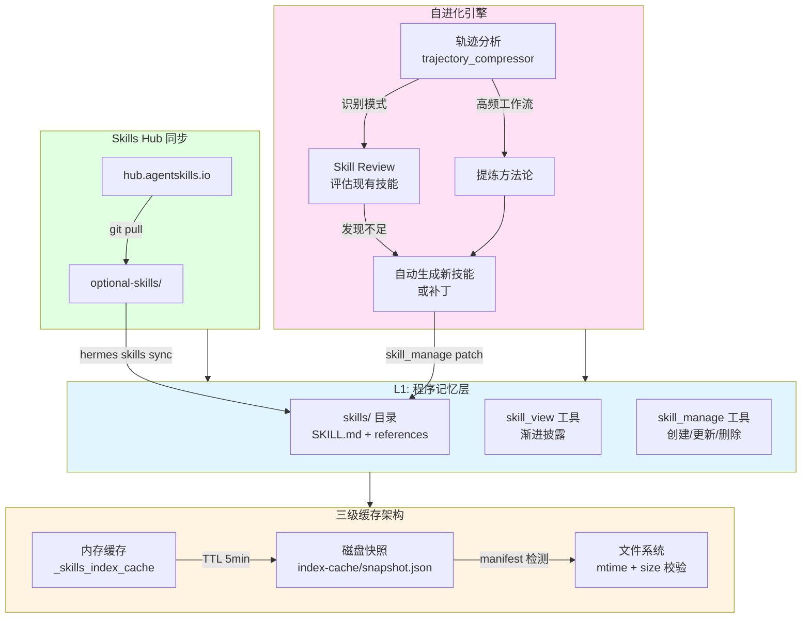
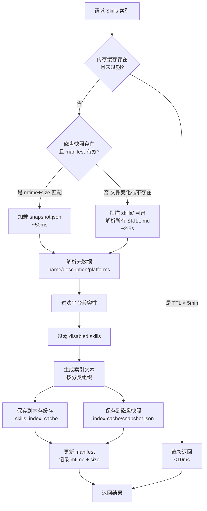
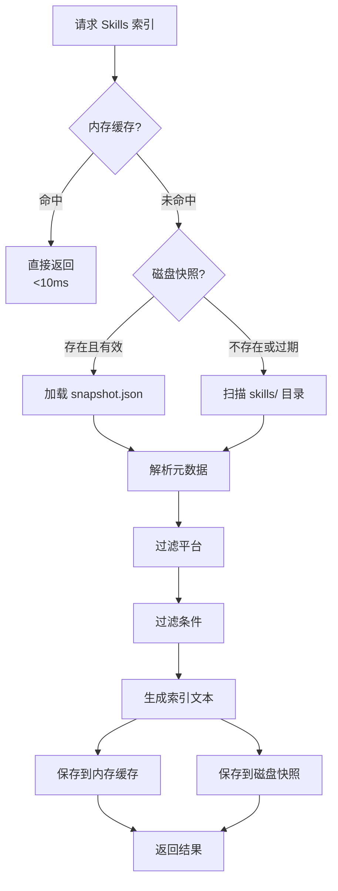
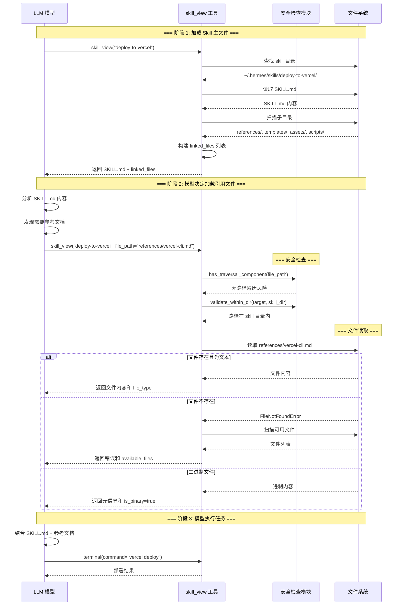
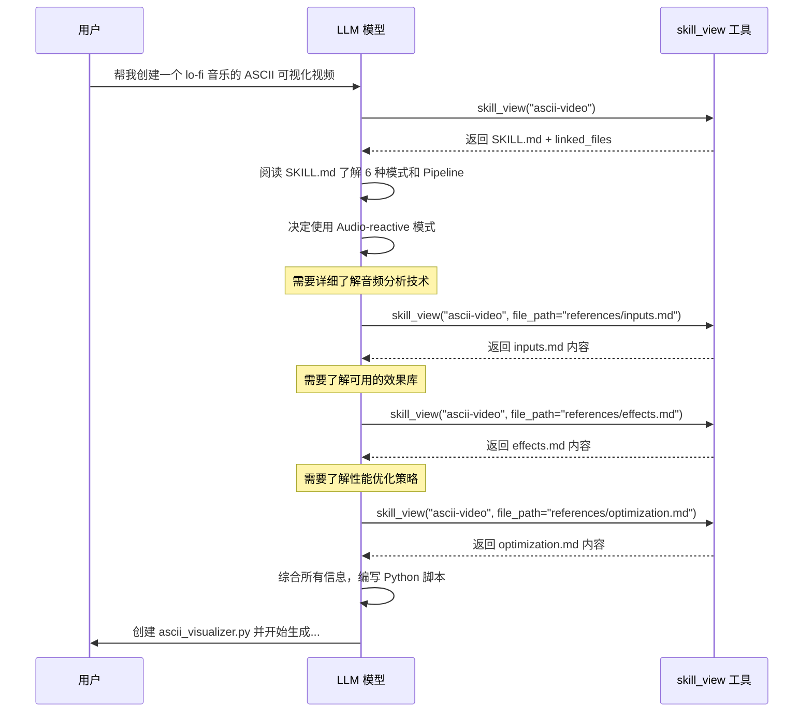

# Skills 技能系统详解

> **Hermes 版本锚点**: 0.19.0 · **核对**: 2026-07-22 · [DOC_MAINTENANCE.md](DOC_MAINTENANCE.md) · office bundle + hermes-themes skill  
> **文档角色**: 深入解析 Hermes Agent 的 Skills 技能管理机制  
> **适合人群**: AI工程师、Skill开发者、架构师  
> **阅读时间**: 1-1.5 小时  
> **源码位置**: `agent/skill_commands.py`, `tools/skills_tool.py`

---

## 📋 目录

- [1. 概述](#1-概述)
- [2. Skills 标准规范](#2-skills-标准规范)
- [3. Skills 目录结构](#3-skills-目录结构)
- [4. Skills 元数据解析](#4-skills-元数据解析)
- [5. Skills 索引生成与缓存](#5-skills-索引生成与缓存)
- [6. Skills 加载工具](#6-skills-加载工具)
- [7. Skill 外部引用加载机制](#7-skill-外部引用加载机制)
- [8. Slash 命令集成](#8-slash-命令集成)
- [9. Skills Hub 与同步](#9-skills-hub-与同步)
- [10. 可选 Skills 库](#10-可选-skills-库)
- [11. 开发自定义 Skill](#11-开发自定义-skill)

---

## 1. 概述

### 1.0 Skills 系统架构图



**核心设计原则**:
1. **渐进披露** - 索引进 system,正文按需读取,优化 token
2. **三级缓存** - 内存 → 磁盘快照 → manifest 检测,高性能加载
3. **自进化** - 从轨迹中提炼方法论,自动创建/更新技能
4. **开放标准** - 兼容 agentskills.io,跨平台共享
5. **Hub 生态** - 社区贡献,版本管理,一键同步

### 1.1 什么是 Skills?

**Skills** 是 Hermes Agent 的**可扩展技能系统**,允许用户为 Agent 添加特定领域的能力。每个 Skill 是一个自包含的指令包,包含:

- ✅ SKILL.md - 技能说明和使用指南
- ✅ REFERENCE.md - 可选的参考文档
- ✅ scripts/ - 可选的辅助脚本
- ✅ examples/ - 可选的示例代码

### 1.2 核心设计原则

| 原则 | 说明 |
|------|------|
| **Open Standard** | 兼容 agentskills.io 开放标准 |
| **Progressive Disclosure** | 索引进 system,正文按需读取 |
| **Platform-aware** | 根据平台过滤不适用的 Skills |
| **Cache-friendly** | 内存+磁盘双级缓存 |
| **Composable** | 多个 Skills 可组合使用 |

### 1.3 Skill vs Tool vs MCP 三者对比

> Hermes 有三种扩展 Agent 能力的机制，设计目的完全不同。

#### 核心区别

| 维度 | **Skill** (技能) | **Tool** (工具) | **MCP** (Model Context Protocol) |
|------|-----------------|----------------|----------------------------------|
| **本质** | 只读的知识文档 | 可执行的 Python 函数 | 外部服务暴露的工具 |
| **载体** | Markdown (SKILL.md) | Python + JSON Schema | 外部进程/远程服务 |
| **给谁用** | 模型读取后**指导决策** | 模型通过 `function_call` 直接调用 | 模型通过 `function_call` 直接调用 |
| **运行时形式** | System prompt 索引 + 按需读取全文 | API 请求中的 `tools` schema | API 请求中的 `tools` schema（透明） |
| **有副作用？** | ❌ 纯信息 | ✅ 执行操作 | ✅ 执行操作 |
| **注册位置** | `~/.hermes/skills/` 目录 | `tools/registry.py` | `tools/mcp_tool.py` → 同一个 registry |
| **扩展难度** | 写 Markdown 即可 | 需要 Python 编程 | 需要实现 MCP Server |
| **状态** | 无状态文件 | 无状态函数 | 有状态连接（长连接） |

#### 三者关系图

```
┌──────────────────────────────────────────────────────┐
│  Agent 的认知与行动模型                                │
│                                                      │
│  "我知道怎么做"          "我能做什么"                   │
│  ┌──────────────┐       ┌────────────────────────┐  │
│  │   Skills      │ 指导→ │     Tools + MCP         │  │
│  │  (知识/经验)   │       │    (执行能力)            │  │
│  │               │       │                        │  │
│  │ SKILL.md 文件  │       │ 内置: terminal,         │  │
│  │ 存储在磁盘     │       │       read_file, ...   │  │
│  │ 按需读取       │       │                        │  │
│  │               │       │ MCP: github,            │  │
│  │               │       │      filesystem, ...   │  │
│  └──────────────┘       └────────────────────────┘  │
│        ↑ 创建/更新               ↑ 调用               │
│        └───────────── Agent ────┘                   │
└──────────────────────────────────────────────────────┘
```

#### 调用方式对比

```python
# Skill — 读取知识，指导后续行为
skill_view(name="deploy-to-vercel")
# → 返回 SKILL.md 全文，模型据此规划步骤

# Tool — 直接执行操作
terminal(command="npm run build")
# → 执行命令，返回 stdout/stderr

# MCP — 调用外部服务（对模型透明，和 Tool 一样）
github_create_issue(repo="org/repo", title="Bug fix", body="...")
# → 通过 MCP 协议调用 GitHub MCP Server → 创建 Issue
```

#### 使用场景决策

| 场景 | 选择 | 原因 |
|------|------|------|
| 记录"如何部署到 AWS" | **Skill** | 程序化知识，可复用经验 |
| 执行 bash 命令 | **Tool** (`terminal`) | 直接操作 |
| 调用 GitHub API | **MCP** | 现成 MCP Server，无需写 Python |
| 记录"React 调试最佳实践" | **Skill** | 经验文档，指导决策 |
| 读写本地文件 | **Tool** (`read_file`/`write_file`) | 内置能力 |
| 接入公司内部 API | **MCP** | 写个 MCP Server，透明接入 |
| 自建数据库查询服务 | **MCP** | 独立进程，语言无关 |
| 保存复杂任务的标准流程 | **Skill** | Agent 按步骤执行 |

#### 一句话总结

- **Skill** = Agent 的**经验手册**（指导如何执行，不直接操作）
- **Tool** = Agent 的**手脚**（直接执行操作）
- **MCP** = Agent 的**远程手脚**（执行外部操作，对模型完全透明）

#### Tool 和 MCP 的关系

MCP 工具注册到**和内置 Tool 完全相同的 registry**，模型调用时没有任何区别：

```
内置 Tool:   模型 → function_call → Python 函数 → 结果
MCP Tool:    模型 → function_call → MCP Client → [stdio/HTTP] → MCP Server → 结果
                                     ↑ 对模型透明，schema 一样
```

MCP 本质上是"Tool 的远程实现方式"。选择 MCP 而非内置 Tool 的理由：
- 已有现成的 MCP Server 可直接使用
- 需要进程隔离/沙箱执行
- 用非 Python 语言实现（如 TypeScript）
- 需要长连接/有状态的服务端

#### Skill 和 Tool 的协作模式

```
用户: "帮我把这个项目部署到 Vercel"

模型: (查看 system prompt 中的 skills 索引)
      → 发现 deploy-to-vercel skill
      → 调用 skill_view(name="deploy-to-vercel") 读取完整步骤
      → 按 SKILL.md 中的步骤，依次调用 Tool:
        1. terminal(command="npm run build")
        2. terminal(command="vercel deploy --prod")
        3. web_extract(url="https://xxx.vercel.app")
      → 完成部署

模型: (发现 SKILL.md 中少了"配置环境变量"步骤)
      → 调用 skill_manage(action="patch", ...) 更新 skill
```

**Skill 是知识层，Tool/MCP 是执行层。Skill 指导 Agent 如何正确地使用 Tool。**

---

## 2. Skills 标准规范

### 2.1 agentskills.io 兼容

Hermes Skills 遵循 [agentskills.io](https://agentskills.io) 开放标准,确保:

- ✅ 跨平台兼容(Claude Code、Cursor、Windsurf等)
- ✅ 社区共享便利
- ✅ 统一的元数据格式

### 2.2 SKILL.md 格式

```markdown
---
name: code-review
description: Comprehensive code review checklist
version: 1.0.0
author: Hermes Team
category: software-development
tags:
  - code-quality
  - best-practices
  - review
platforms:
  - cli
  - telegram
  - discord
conditions:
  has_files: true
  min_files: 1
---

# Code Review Skill

## Overview

This skill provides a comprehensive checklist for reviewing code changes.

## When to Use

- Before merging PRs
- After writing significant code changes
- When refactoring existing code

## Steps

1. **Check Code Style**
   - Consistent formatting
   - Naming conventions
   - Comment quality

2. **Review Logic**
   - Correctness
   - Edge cases
   - Error handling

3. **Performance**
   - Time complexity
   - Memory usage
   - Database queries

4. **Security**
   - Input validation
   - SQL injection
   - XSS prevention

## Example

When reviewing a Python function:

```python
def process_data(data: list) -> dict:
    # Check type hints
    # Check error handling
    # Check performance
    pass
```
想·

### 2.3 Frontmatter 字段

| 字段 | 类型 | 必填 | 说明 |
|------|------|------|------|
| **name** | string | ✅ | Skill 唯一标识符 |
| **description** | string | ✅ | 简短描述(≤100字符) |
| **version** | string | ✅ | 语义化版本号 |
| **author** | string | ❌ | 作者信息 |
| **category** | string | ❌ | 分类(software-development/research等) |
| **tags** | list | ❌ | 标签列表 |
| **platforms** | list | ❌ | 支持的平台(cli/telegram等) |
| **conditions** | object | ❌ | 启用条件 |

---
## 3. Skills 目录结构

### 3.1 标准布局

```
skills/
├── software-development/
│   ├── code-review/
│   │   ├── SKILL.md
│   │   ├── REFERENCE.md
│   │   └── scripts/
│   │       └── lint_check.sh
│   ├── commit/
│   │   └── SKILL.md
│   └── debug-python/
│       └── SKILL.md
├── research/
│   ├── web-research/
│   │   └── SKILL.md
│   └── academic-search/
│       └── SKILL.md
├── productivity/
│   ├── task-planning/
│   │   └── SKILL.md
│   └── time-management/
│       └── SKILL.md
└── index-cache/
    ├── snapshot.json      # 磁盘快照
    └── manifest.json      # 文件清单
```

### 3.2 内置 Skills 分类

| 分类 | Skills 数量 | 示例 |
|------|-----------|------|
| **software-development** | 15+ | code-review, commit, debug-python |
| **research** | 8+ | web-research, academic-search |
| **productivity** | 10+ | task-planning, time-management |
| **creative** | 12+ | story-writing, poem-generation |
| **data-science** | 6+ | data-analysis, visualization |
| **devops** | 5+ | docker-deploy, k8s-debug |

---

## 4. Skills 元数据解析

### 4.1 解析流程

```python
# agent/prompt_builder.py:L938-954

def _parse_skill_file(skill_file: Path) -> tuple[bool, dict, str]:
    """
    读取 SKILL.md 文件并返回平台兼容性、frontmatter 和描述
    
    Returns:
        (is_compatible, frontmatter, description)
    """
    try:
        raw = skill_file.read_text(encoding="utf-8")
        frontmatter, _ = parse_frontmatter(raw)  # ← 解析 YAML frontmatter
        
        if not skill_matches_platform(frontmatter):
            return False, frontmatter, ""
        
        # ✅ 从 frontmatter 中提取 description 字段（限制 60 字符）
        return True, frontmatter, extract_skill_description(frontmatter)
    except Exception as e:
        logger.warning("Failed to parse skill file %s: %s", skill_file, e)
        return True, {}, ""
```

**关键点**：
1. ✅ **解析 YAML frontmatter**：使用 `parse_frontmatter()` 函数
2. ✅ **提取 description 字段**：从 frontmatter 字典中获取
3. ✅ **限制长度**：通过 `extract_skill_description()` 限制为 60 字符

### 4.2 Description 提取逻辑

```python
# agent/skill_utils.py:L464-472

def extract_skill_description(frontmatter: Dict[str, Any]) -> str:
    """
    从 parsed frontmatter 中提取并截断 description
    
    Args:
        frontmatter: YAML frontmatter 解析后的字典
    
    Returns:
        截断后的描述字符串（最多 60 字符）
    """
    raw_desc = frontmatter.get("description", "")  # ← 从 YAML 获取
    
    if not raw_desc:
        return ""
    
    desc = str(raw_desc).strip().strip("'\"")
    
    # ✅ 限制为 60 字符，超长时截断并添加 ...
    if len(desc) > 60:
        return desc[:57] + "..."
    
    return desc
```

**设计理由**：
1. **Token 优化**：60 字符 ≈ 10-15 tokens，50个 Skills 只需 ~750 tokens
2. **足够表达**：60 字符足以让模型理解 Skill 的核心功能
3. **符合标准**：类似网页 meta description 的最佳实践
4. **渐进披露**：索引简短，详情通过 `skill_view` 按需加载

### 4.3 条件检查机制

```python
# agent/prompt_builder.py:L957-985

def _skill_should_show(
    conditions: dict,
    available_tools: "set[str] | None",
    available_toolsets: "set[str] | None",
) -> bool:
    """
    根据条件判断是否应该显示该 Skill
    
    Args:
        conditions: 从 frontmatter 提取的条件
        available_tools: 当前可用的工具集合
        available_toolsets: 当前可用的工具集集合
    
    Returns:
        True 表示应该显示，False 表示隐藏
    """
    if available_tools is None and available_toolsets is None:
        return True  # 无过滤信息，显示所有（向后兼容）
    
    at = available_tools or set()
    ats = available_toolsets or set()
    
    # fallback_for: 当主要工具/工具集可用时，隐藏此 skill
    for ts in conditions.get("fallback_for_toolsets", []):
        if ts in ats:
            return False
    for t in conditions.get("fallback_for_tools", []):
        if t in at:
            return False
    
    # requires: 当必需的工具/工具集不可用时，隐藏此 skill
    for ts in conditions.get("requires_toolsets", []):
        if ts not in ats:
            return False
    for t in conditions.get("requires_tools", []):
        if t not in at:
            return False
    
    return True
```

**条件类型**：

| 条件字段 | 说明 | 示例 |
|---------|------|------|
| `fallback_for_toolsets` | 当这些工具集可用时隐藏 | `["web"]` - 有 web 工具集时不显示 |
| `requires_toolsets` | 必需的工具集 | `["core"]` - 必须有 core 工具集 |
| `fallback_for_tools` | 当这些工具可用时隐藏 | `["web_search"]` - 有搜索工具时不显示 |
| `requires_tools` | 必需的工具 | `["read_file"]` - 必须有读文件工具 |

**SKILL.md 中的声明方式**：

```yaml
---
name: web-research-fallback
description: Fallback when web tools unavailable
metadata:
  hermes:
    fallback_for_toolsets:
      - web
    requires_tools:
      - read_file
---
```

---

## 5. Skills 索引生成与缓存

### 5.0 三级缓存架构详解

Hermes Skills 系统采用**三级缓存策略**,在保证数据新鲜度的同时最大化加载性能:



**三级缓存层次**:

| 层级 | 载体 | 命中条件 | 加载耗时 | 失效策略 |
|------|------|---------|---------|----------|
| **L1: 内存缓存** | `_skills_index_cache` dict | TTL < 5分钟 | <10ms | 时间过期或手动 reload |
| **L2: 磁盘快照** | `index-cache/snapshot.json` | manifest mtime+size 匹配 | ~50ms | 文件修改或 manifest 失效 |
| **L3: 文件系统** | `skills/**/*.md` 实时扫描 | 无缓存或强制刷新 | 2-5秒 | N/A (实时读取) |

**性能对比**:
- ⚡ L1 命中: **<10ms** (99% 场景)
- ⚡ L2 命中: **~50ms** (技能文件未变化)
- ⏳ L3 扫描: **2-5秒** (首次加载或文件变化)
- 💾 命中率: **>95%** (日常使用)

### 5.1 Manifest 检测机制

Manifest 是保证磁盘快照有效性的关键:

```json
// skills/index-cache/snapshot.json
{
  "version": "1.0.0",
  "generated_at": "2026-04-25T10:30:00Z",
  "manifest": {
    "skills/software-development/code-review/SKILL.md": {
      "mtime": 1713780000.123,
      "size": 2048
    },
    "skills/research/web-research/SKILL.md": {
      "mtime": 1713779000.456,
      "size": 1536
    }
  },
  "skills": [
    {
      "skill_name": "code-review",
      "category": "software-development",
      "description": "Comprehensive code review checklist",
      "path": "skills/software-development/code-review/SKILL.md",
      "version": "1.0.0"
    }
  ]
}
```

**检测逻辑**:
```python
def _is_snapshot_valid(snapshot: dict, skills_dir: Path) -> bool:
    """检查快照是否有效 - 基于 mtime 和 size 判断文件是否变化"""
    manifest = snapshot.get("manifest", {})
    
    for file_path, expected_meta in manifest.items():
        full_path = skills_dir / file_path
        
        if not full_path.exists():
            return False  # 文件被删除
        
        actual_stat = full_path.stat()
        
        # 精确比较 mtime 和 size
        if abs(actual_stat.st_mtime - expected_meta["mtime"]) > 0.001:
            return False  # 文件被修改
        
        if actual_stat.st_size != expected_meta["size"]:
            return False  # 文件大小变化
    
    return True  # 所有文件未变化,快照有效
```

**优势**:
- ✅ 避免逐文件解析 YAML frontmatter (耗时操作)
- ✅ 精确检测文件变化 (mtime + size 双重校验)
- ✅ 支持增量更新 (只重新解析变化的文件)

### 5.1 三级缓存架构



### 5.2 磁盘快照格式

```json
// skills/index-cache/snapshot.json

{
  "version": "1.0.0",
  "generated_at": "2026-04-22T10:30:00Z",
  "manifest": {
    "skills/software-development/code-review/SKILL.md": {
      "mtime": 1713780000,
      "size": 2048
    },
    "skills/research/web-research/SKILL.md": {
      "mtime": 1713779000,
      "size": 1536
    }
  },
  "skills": [
    {
      "skill_name": "code-review",
      "category": "software-development",
      "description": "Comprehensive code review checklist",
      "path": "skills/software-development/code-review/SKILL.md",
      "version": "1.0.0"
    },
    {
      "skill_name": "web-research",
      "category": "research",
      "description": "Conduct thorough web research with source tracking",
      "path": "skills/research/web-research/SKILL.md",
      "version": "1.0.0"
    }
  ],
  "category_descriptions": {
    "software-development": "Skills for coding and development",
    "research": "Skills for information gathering and analysis"
  }
}
```

### 5.3 Manifest 检测

```python
def _is_snapshot_valid(snapshot: dict, skills_dir: Path) -> bool:
    """
    检查快照是否有效
    
    基于 mtime 和 size 判断文件是否变化
    """
    manifest = snapshot.get("manifest", {})
    
    for file_path, expected_meta in manifest.items():
        full_path = skills_dir / file_path
        
        if not full_path.exists():
            return False
        
        actual_stat = full_path.stat()
        
        if actual_stat.st_mtime != expected_meta["mtime"]:
            return False
        
        if actual_stat.st_size != expected_meta["size"]:
            return False
    
    return True
```

**性能提升**:
- ⚡ 首次扫描: 2-5秒
- ⚡ 缓存命中: <10ms
- 💾 命中率: >90%

---

## 6. Skills 加载工具

### 6.1 skill_view 工具

```python
# tools/skills_tool.py

@registry.register(
    name="skill_view",
    schema={
        "name": "skill_view",
        "description": "Load the full instructions for a specific skill",
        "parameters": {
            "type": "object",
            "properties": {
                "skill_name": {
                    "type": "string",
                    "description": "Name of the skill to load"
                }
            },
            "required": ["skill_name"]
        }
    },
    toolsets=["core"],
)
def skill_view_handler(skill_name: str) -> str:
    """
    加载指定 Skill 的完整内容
    
    Args:
        skill_name: Skill 名称
    
    Returns:
        SKILL.md 的完整内容
    """
    skill_path = find_skill_by_name(skill_name)
    
    if not skill_path:
        return json.dumps({
            "error": f"Skill '{skill_name}' not found"
        })
    
    content = skill_path.read_text(encoding="utf-8")
    return content
```

**使用示例**:
```
用户: /skill load code-review

模型调用:
{
  "tool": "skill_view",
  "arguments": {"skill_name": "code-review"}
}

返回:
---
name: code-review
description: Comprehensive code review checklist
...

# Code Review Skill

## Overview
...
```

### 6.2 skills_list 工具

```python
@registry.register(
    name="skills_list",
    schema={
        "name": "skills_list",
        "description": "List all available skills",
        "parameters": {
            "type": "object",
            "properties": {
                "category": {
                    "type": "string",
                    "description": "Filter by category (optional)"
                }
            }
        }
    },
    toolsets=["core"],
)
def skills_list_handler(category: str = None) -> str:
    """列出所有可用的 Skills"""
    skills = get_all_skills()
    
    if category:
        skills = [s for s in skills if s["category"] == category]
    
    lines = ["# Available Skills\n"]
    for skill in skills:
        lines.append(f"- **{skill['name']}**: {skill['description']}")
    
    return "\n".join(lines)
```

---

## 7. Skill 外部引用加载机制

### 7.1 标准目录结构

Skill 支持组织化的目录结构来管理相关资源文件：

```
skills/
└── deploy-to-vercel/
    ├── SKILL.md              # 主指令文件（必需）
    ├── references/           # 参考文档（可选）
    │   ├── vercel-cli.md     # Vercel CLI 使用指南
    │   └── env-config.md     # 环境变量配置说明
    ├── templates/            # 模板文件（可选）
    │   ├── vercel.json       # Vercel 配置模板
    │   └── deploy-script.sh  # 部署脚本模板
    ├── assets/               # 资源文件（可选，agentskills.io 标准）
    │   ├── architecture.png  # 架构图
    │   └── checklist.json    # 检查清单数据
    └── scripts/              # 脚本文件（可选）
        ├── validate-env.py   # 环境验证脚本
        └── health-check.sh   # 健康检查脚本
```

**目录用途**：
- **references/**: 详细的参考文档、API 说明、最佳实践
- **templates/**: 可复用的配置文件、代码模板、脚本模板
- **assets/**: 图片、数据文件、补充材料（agentskills.io 标准）
- **scripts/**: 辅助脚本、工具脚本、自动化脚本

### 7.2 自动发现 linked_files

当模型调用 `skill_view(name)` 时，系统会自动扫描并返回所有可用的引用文件列表。

**源码实现**（`tools/skills_tool.py:L1190-1256`）：

```python
# Get reference, template, asset, and script files if this is a directory-based skill
reference_files = []
template_files = []
asset_files = []
script_files = []

if skill_dir:
    # 1. 扫描 references/ 目录（仅 .md 文件，使用 glob 非递归）
    references_dir = skill_dir / "references"
    if references_dir.exists():
        reference_files = [
            str(f.relative_to(skill_dir)) 
            for f in references_dir.glob("*.md")  # ← 注意：glob 而非 rglob
        ]
    
    # 2. 扫描 templates/ 目录（多种文件格式，使用 rglob 递归）
    templates_dir = skill_dir / "templates"
    if templates_dir.exists():
        for ext in ["*.md", "*.py", "*.yaml", "*.yml", "*.json", "*.tex", "*.sh"]:
            template_files.extend([
                str(f.relative_to(skill_dir))
                for f in templates_dir.rglob(ext)  # ← 注意：rglob 递归扫描
            ])
    
    # 3. 扫描 assets/ 目录（所有文件，使用 rglob 递归）
    assets_dir = skill_dir / "assets"
    if assets_dir.exists():
        for f in assets_dir.rglob("*"):  # ← 匹配所有文件
            if f.is_file():  # ← 排除目录
                asset_files.append(str(f.relative_to(skill_dir)))
    
    # 4. 扫描 scripts/ 目录（脚本文件，使用 glob 非递归）
    scripts_dir = skill_dir / "scripts"
    if scripts_dir.exists():
        for ext in ["*.py", "*.sh", "*.bash", "*.js", "*.ts", "*.rb"]:
            script_files.extend([
                str(f.relative_to(skill_dir))
                for f in scripts_dir.glob(ext)  # ← 注意：glob 非递归
            ])

# 构建 linked_files 结构（空列表不加入）
linked_files = {}
if reference_files:
    linked_files["references"] = reference_files
if template_files:
    linked_files["templates"] = template_files
if asset_files:
    linked_files["assets"] = asset_files
if script_files:
    linked_files["scripts"] = script_files
```

**关键细节**：

| 目录 | 扫描方式 | 文件类型 | 是否递归 |
|------|---------|---------|----------|
| **references/** | `glob("*.md")` | 仅 Markdown | ❌ 否 |
| **templates/** | `rglob(ext)` | .md/.py/.yaml/.yml/.json/.tex/.sh | ✅ 是 |
| **assets/** | `rglob("*")` + `is_file()` | 所有文件 | ✅ 是 |
| **scripts/** | `glob(ext)` | .py/.sh/.bash/.js/.ts/.rb | ❌ 否 |

**实际示例**（`skills/creative/ascii-video/`）：

```
skills/creative/ascii-video/
├── SKILL.md
└── references/
    ├── architecture.md
    ├── composition.md
    ├── effects.md
    ├── inputs.md
    ├── optimization.md
    ├── scenes.md
    ├── shaders.md
    └── troubleshooting.md
```

**返回结果**：

```json
{
  "success": true,
  "name": "ascii-video",
  "description": "ASCII video: convert video/audio to colored ASCII MP4/GIF.",
  "content": "...SKILL.md 全文内容...",
  "linked_files": {
    "references": [
      "references/architecture.md",
      "references/composition.md",
      "references/effects.md",
      "references/inputs.md",
      "references/optimization.md",
      "references/scenes.md",
      "references/shaders.md",
      "references/troubleshooting.md"
    ]
  },
  "usage_hint": "To view linked files, call skill_view(name, file_path) where file_path is e.g. 'references/api.md' or 'assets/config.yaml'"
}
```

### 7.3 按需加载引用文件

模型可以通过指定 `file_path` 参数来加载具体的引用文件：

#### **加载参考文档**

```python
# 模型调用
skill_view("deploy-to-vercel", file_path="references/vercel-cli.md")

# 返回
{
  "success": true,
  "name": "deploy-to-vercel",
  "file": "references/vercel-cli.md",
  "content": "# Vercel CLI Reference\n\n## Installation\n...",
  "file_type": ".md"
}
```

#### **加载模板文件**

```python
# 模型调用
skill_view("deploy-to-vercel", file_path="templates/vercel.json")

# 返回
{
  "success": true,
  "name": "deploy-to-vercel",
  "file": "templates/vercel.json",
  "content": "{\n  \"buildCommand\": \"npm run build\",\n  ...",
  "file_type": ".json"
}
```

#### **加载脚本文件**

```python
# 模型调用
skill_view("deploy-to-vercel", file_path="scripts/validate-env.py")

# 返回
{
  "success": true,
  "name": "deploy-to-vercel",
  "file": "scripts/validate-env.py",
  "content": "#!/usr/bin/env python3\nimport os\n...",
  "file_type": ".py"
}
```

#### **处理二进制文件**

```python
# 模型调用
skill_view("deploy-to-vercel", file_path="assets/architecture.png")

# 返回（不返回二进制内容，只返回元信息）
{
  "success": true,
  "name": "deploy-to-vercel",
  "file": "assets/architecture.png",
  "content": "[Binary file: architecture.png, size: 245678 bytes]",
  "is_binary": true
}
```

### 7.4 安全机制

#### **路径遍历防护**

```python
# tools/skills_tool.py:L1087-1113

from tools.path_security import validate_within_dir, has_traversal_component

if file_path and skill_dir:
    # 1. 检查是否包含 '..' 等危险字符
    if has_traversal_component(file_path):
        return json.dumps({
            "success": False,
            "error": "Path traversal ('..') is not allowed.",
            "hint": "Use a relative path within the skill directory"
        }, ensure_ascii=False)
    
    # 2. 构建目标路径
    target_file = skill_dir / file_path
    
    # 3. 验证解析后的路径仍在 skill 目录内
    traversal_error = validate_within_dir(target_file, skill_dir)
    if traversal_error:
        return json.dumps({
            "success": False,
            "error": traversal_error,
            "hint": "Use a relative path within the skill directory"
        }, ensure_ascii=False)
```

**攻击示例（被阻止）**：
```python
# ❌ 尝试访问上级目录
skill_view("my-skill", file_path="../../../etc/passwd")
# → 错误：Path traversal ('..') is not allowed.

# ❌ 尝试绕过限制
skill_view("my-skill", file_path="references/../../secret.txt")
# → 错误：Resolved path is outside the skill directory
```

#### **文件不存在时的友好提示**

**源码实现**（`tools/skills_tool.py:L1114-1158`）：

```python
if not target_file.exists():
    # 扫描并列出所有可用文件，按类型分类
    available_files = {
        "references": [],
        "templates": [],
        "assets": [],
        "scripts": [],
        "other": []  # ← 其他文本文件
    }
    
    # 使用 rglob 递归扫描整个 skill 目录
    for f in skill_dir.rglob("*"):
        if f.is_file() and f.name != "SKILL.md":  # ← 排除 SKILL.md
            rel = str(f.relative_to(skill_dir))
            # 根据路径前缀分类
            if rel.startswith("references/"):
                available_files["references"].append(rel)
            elif rel.startswith("templates/"):
                available_files["templates"].append(rel)
            elif rel.startswith("assets/"):
                available_files["assets"].append(rel)
            elif rel.startswith("scripts/"):
                available_files["scripts"].append(rel)
            # 其他文本文件（特定后缀）
            elif f.suffix in [".md", ".py", ".yaml", ".yml", ".json", ".tex", ".sh"]:
                available_files["other"].append(rel)
    
    # 移除空分类
    available_files = {k: v for k, v in available_files.items() if v}
    
    return json.dumps({
        "success": False,
        "error": f"File '{file_path}' not found in skill '{name}'.",
        "available_files": available_files,
        "hint": "Use one of the available file paths listed above"
    }, ensure_ascii=False)
```

**返回示例**（当请求的文件不存在时）：

```json
{
  "success": false,
  "error": "File 'references/nonexistent.md' not found in skill 'ascii-video'.",
  "available_files": {
    "references": [
      "references/architecture.md",
      "references/composition.md",
      "references/effects.md",
      "references/inputs.md",
      "references/optimization.md",
      "references/scenes.md",
      "references/shaders.md",
      "references/troubleshooting.md"
    ]
  },
  "hint": "Use one of the available file paths listed above"
}
```

### 7.5 完整时序图



### 7.6 完整示例：ASCII Video 生成

#### **Skill 目录结构**（真实示例）

```
~/.hermes/skills/creative/ascii-video/
├── SKILL.md                      # 主指令文件 (14.5KB)
└── references/                   # 参考文档目录
    ├── architecture.md           # 架构设计 (32.2KB)
    ├── composition.md            # 组合技巧 (34.1KB)
    ├── effects.md                # 效果库 (71.2KB)
    ├── inputs.md                 # 输入处理 (24.0KB)
    ├── optimization.md           # 性能优化 (23.7KB)
    ├── scenes.md                 # 场景设计 (36.6KB)
    ├── shaders.md                # Shader 系统 (49.3KB)
    └── troubleshooting.md        # 故障排查 (12.9KB)
```

#### **SKILL.md Frontmatter**

```yaml
---
name: ascii-video
description: "ASCII video: convert video/audio to colored ASCII MP4/GIF."
platforms: [linux, macos, windows]
---
```

#### **SKILL.md 内容摘要**

该 Skill 包含：
- **When to use**: 何时使用 ASCII 视频技能
- **Creative Standard**: 创意标准和要求
- **Modes**: 6种模式（Video-to-ASCII、Audio-reactive、Generative、Hybrid、Lyrics/text、TTS narration）
- **Stack**: 技术栈（Python、NumPy、SciPy、Pillow、ffmpeg）
- **Pipeline Architecture**: 6阶段流水线（INPUT → ANALYZE → SCENE_FN → TONEMAP → SHADE → ENCODE）
- **Workflow**: 4步工作流程（Creative Vision → Technical Design → Build Script → Quality Verification）
- **Critical Implementation Notes**: 关键实现注意事项

#### **实际使用流程**



#### **关键设计点**

1. **渐进披露的实际应用**：
   - SKILL.md 提供高层概念和决策框架
   - references/ 提供详细的技术实现细节
   - 模型按需加载，避免一次性传输 284KB 的所有文档

2. **文件组织策略**：
   - `architecture.md`: 核心架构设计
   - `effects.md`: 最大的文件 (71.2KB)，包含所有效果库
   - `shaders.md`: Shader 系统详解 (49.3KB)
   - `scenes.md`: 场景设计指南 (36.6KB)
   - 每个文件职责清晰，便于模型精准定位

3. **Token 优化效果**：
   - 首次加载：仅 SKILL.md (14.5KB ≈ 3000 tokens)
   - 按需加载：每次只加载需要的参考文档 (平均 30KB ≈ 6000 tokens)
   - 如果全部加载：284KB ≈ 60000 tokens（浪费 95%）

### 7.7 关键设计优势

| 特性 | 说明 | 优势 |
|------|------|------|
| **渐进披露** | 先返回索引，按需加载详情 | 节省 Token，提高响应速度 |
| **安全防护** | 路径遍历检测 + 目录边界验证 | 防止恶意文件访问 |
| **自动发现** | 自动扫描 4 类子目录 | 无需手动配置文件列表 |
| **灵活访问** | 支持相对路径访问任意文件 | 模型自由选择所需资源 |
| **错误提示** | 文件不存在时列出可用文件 | 帮助模型快速纠正路径 |
| **二进制处理** | 识别并返回元信息而非内容 | 避免传输大量二进制数据 |
| **类型感知** | 返回 file_type 字段 | 模型可根据类型选择处理方式 |

### 7.8 模型如何知道引用文档和脚本的路径？

> **核心问题**: SKILL.md 全文加载到上下文后，模型发现其中引用了 `references/api.md` 或提到执行 `scripts/validate.py`，它是怎么读取到这些文件的？路径从哪来？

Hermes 通过**三重路径锚定机制**确保模型始终能找到关联资源：

#### 机制 1: `skill_view` 返回 `linked_files` + `skill_dir` + `usage_hint`

当模型调用 `skill_view(name)` 时，返回的 JSON 包含路径信息：

```json
{
  "content": "...SKILL.md 全文...",
  "skill_dir": "/Users/alice/.hermes/skills/research/polymarket",
  "linked_files": {
    "references": ["references/api-endpoints.md"],
    "scripts": ["scripts/polymarket.py"]
  },
  "usage_hint": "To view linked files, call skill_view(name, file_path) where file_path is e.g. 'references/api.md' or 'assets/config.yaml'"
}
```

模型看到这些信息后，可以：
- 调用 `skill_view("polymarket", file_path="references/api-endpoints.md")` 读取引用
- 调用 `terminal(command="python /Users/alice/.hermes/skills/research/polymarket/scripts/polymarket.py")` 执行脚本

#### 机制 2: Slash 命令加载时注入绝对路径和指引

通过 `/skill` 或 preload 方式加载的 Skill，`_build_skill_message()` 会额外注入路径信息：

```python
# agent/skill_commands.py:L163-172

if skill_dir:
    parts.append(f"[Skill directory: {skill_dir}]")
    parts.append(
        "Resolve any relative paths in this skill (e.g. `scripts/foo.js`, "
        "`templates/config.yaml`) against that directory, then run them "
        "with the terminal tool using the absolute path."
    )
```

同时列出所有关联文件及其**完整绝对路径映射**：

```python
# agent/skill_commands.py:L214-228

parts.append("[This skill has supporting files:]")
for sf in supporting:
    parts.append(f"- {sf}  ->  {skill_dir / sf}")
parts.append(
    f'Load any of these with skill_view(name="{skill_view_target}", '
    f'file_path="<path>"), or run scripts directly by absolute path '
    f"(e.g. `node {skill_dir}/scripts/foo.js`)."
)
```

**模型看到的实际内容**（以 polymarket skill 为例）：

```
[Skill directory: /Users/alice/.hermes/skills/research/polymarket]
Resolve any relative paths in this skill (e.g. `scripts/foo.js`,
`templates/config.yaml`) against that directory, then run them
with the terminal tool using the absolute path.

[This skill has supporting files:]
- references/api-endpoints.md  ->  /Users/alice/.hermes/skills/research/polymarket/references/api-endpoints.md
- scripts/polymarket.py  ->  /Users/alice/.hermes/skills/research/polymarket/scripts/polymarket.py

Load any of these with skill_view(name="research/polymarket", file_path="<path>"),
or run scripts directly by absolute path (e.g. `node /Users/alice/.hermes/skills/research/polymarket/scripts/foo.js`).
```

#### 机制 3: `${HERMES_SKILL_DIR}` 模板变量预处理

SKILL.md 的作者可以在文档中使用模板变量，加载时自动替换为绝对路径：

```python
# agent/skill_preprocessing.py:L10-13

_SKILL_TEMPLATE_RE = re.compile(r"\$\{(HERMES_SKILL_DIR|HERMES_SESSION_ID)\}")
```

**SKILL.md 中的写法**：

```markdown
## 使用方式

运行分析脚本：
python ${HERMES_SKILL_DIR}/scripts/analyze.py --input data.csv

查看配置模板：
cat ${HERMES_SKILL_DIR}/templates/config.yaml
```

**加载后模型看到的内容**（变量已被替换）：

```markdown
## 使用方式

运行分析脚本：
python /Users/alice/.hermes/skills/data-science/analysis/scripts/analyze.py --input data.csv

查看配置模板：
cat /Users/alice/.hermes/skills/data-science/analysis/templates/config.yaml
```

#### 机制 4: `!`\`cmd\`` 内联 Shell 预处理

SKILL.md 中可以嵌入内联 shell 命令，加载时执行并将输出替换到文档中：

```markdown
当前 Python 版本：!`python3 --version`
可用 GPU：!`nvidia-smi --query-gpu=name --format=csv,noheader 2>/dev/null || echo "无 GPU"`
```

加载后变为：

```markdown
当前 Python 版本：Python 3.11.5
可用 GPU：NVIDIA GeForce RTX 4090
```

内联 shell 以 skill 目录为 CWD 执行，有超时保护（默认 10s），输出上限 4000 字符。

#### 两种加载路径对比

| 路径信息 | `skill_view()` API 调用 | `/skill` Slash 命令 |
|---------|------------------------|-------------------|
| SKILL.md 全文 | ✅ `content` 字段 | ✅ 注入到 user 消息 |
| 关联文件列表 | ✅ `linked_files`（相对路径） | ✅ 列出 `文件 -> 绝对路径` |
| Skill 目录 | ✅ `skill_dir` 字段 | ✅ `[Skill directory: ...]` |
| 使用提示 | ✅ `usage_hint` 字段 | ✅ 自然语言执行指引 |
| 模板变量替换 | ✅ | ✅ |
| 内联 shell | ✅ | ✅ |
| 模型如何读引用 | `skill_view(name, file_path=...)` | `skill_view(name, file_path=...)` 或 `read_file(绝对路径)` |
| 模型如何执行脚本 | `terminal(command="python {skill_dir}/scripts/x.py")` | `terminal(command="python /abs/path/scripts/x.py")` |

#### 端到端流程总结

```
用户: "帮我查一下 Polymarket 上 AI 相关的预测市场"

模型: (System Prompt 中的 Skills 索引)
      → 看到: "polymarket: Polymarket prediction market research"
      → 匹配! 必须加载

模型: skill_view("polymarket")
      → 收到 SKILL.md 全文
      → 收到 linked_files: {"references": ["references/api-endpoints.md"], "scripts": ["scripts/polymarket.py"]}
      → 收到 skill_dir: "/Users/alice/.hermes/skills/research/polymarket"

模型: (阅读 SKILL.md，发现需要 API 端点文档)
      → skill_view("polymarket", file_path="references/api-endpoints.md")
      → 收到完整的 API 文档

模型: (发现 scripts/ 中有现成的 Python 脚本)
      → terminal(command="python /Users/alice/.hermes/skills/research/polymarket/scripts/polymarket.py --query 'AI'")
      → 收到执行结果

模型: → 整理结果返回给用户
```

### 7.9 最佳实践

#### **Skill 作者**

1. ✅ **合理组织文件**：将相关内容放入对应的子目录
2. ✅ **使用描述性文件名**：如 `vercel-cli.md` 而非 `doc1.md`
3. ✅ **在 SKILL.md 中引用**：明确告知模型有哪些可用文件
4. ✅ **控制文件大小**：单个文件不超过 50KB
5. ✅ **用 `${HERMES_SKILL_DIR}` 代替硬编码路径**：在 SKILL.md 中引用脚本时使用模板变量
6. ❌ **避免深层嵌套**：保持目录结构简单（最多 2 层）

#### **模型使用**

1. ✅ **先查看 linked_files**：了解有哪些资源可用
2. ✅ **按需加载**：只加载当前需要的文件
3. ✅ **脚本优先用绝对路径执行**：通过 `skill_dir` 拼接绝对路径
4. ✅ **缓存意识**：已加载的文件可在后续对话中复用
5. ❌ **不要批量加载**：避免一次性加载所有引用文件

---

## 8. Slash 命令集成

### 7.1 /skill 命令

```bash
# 加载 Skill
/skill load code-review

# 列出所有 Skills
/skills list

# 按分类列出
/skills list --category=software-development

# 禁用 Skill
/skill disable web-research

# 启用 Skill
/skill enable web-research
```

### 7.2 实现机制

```python
# hermes_cli/commands.py

@cli.command()
def skill(ctx, action: str, name: str = None):
    """Manage skills"""
    
    if action == "load":
        # 以 user 消息注入,保持 system prefix 稳定
        ctx.agent.messages.append({
            "role": "user",
            "content": f"/skill load {name}"
        })
        
        # 触发 skill_view 工具调用
        result = skill_view_handler(name)
        ctx.agent.messages.append({
            "role": "tool",
            "content": result
        })
    
    elif action == "disable":
        disabled_skills.add(name)
        save_config()
```

**关键设计**:
- ✅ 以 **user 消息**注入,不动 system prompt
- ✅ 有利于 Anthropic 缓存稳定
- ✅ 模型看到明确的技能加载指令

---

## 8. Skills Hub 与同步

### 8.1 Skills Hub

**Skills Hub** 是官方的 Skills 市场,提供:

- ✅ 社区贡献的 Skills
- ✅ 官方维护的 Skills
- ✅ 版本管理与更新

### 8.2 同步机制

```bash
# 从 Hub 拉取最新 Skills
hermes skills sync

# 输出:
# Syncing skills from hub...
# Updated: code-review (v1.0.0 → v1.1.0)
# Added: security-audit (v1.0.0)
# Total: 45 skills
```

**实现**:
```python
# tools/skills_sync.py

def sync_skills_from_hub():
    """从 Hub 同步 Skills"""
    hub_url = "https://hub.agentskills.io/api/v1/skills"
    
    # 1. 获取远程清单
    response = requests.get(hub_url)
    remote_skills = response.json()
    
    # 2. 对比本地版本
    local_skills = load_local_manifest()
    
    updates = []
    for remote_skill in remote_skills:
        local_version = local_skills.get(remote_skill["name"])
        
        if not local_version:
            # 新 Skill
            updates.append(("add", remote_skill))
        elif local_version < remote_skill["version"]:
            # 版本更新
            updates.append(("update", remote_skill))
    
    # 3. 下载并安装
    for action, skill in updates:
        download_and_install(skill)
    
    # 4. 重建索引
    rebuild_skills_index()
```

---

## 9. 可选 Skills 库

### 9.1 optional-skills/ 目录

```
optional-skills/
├── mlops/
│   ├── model-training/
│   ├── hyperparameter-tuning/
│   └── ...
├── security/
│   ├── penetration-testing/
│   ├── vulnerability-scan/
│   └── ...
├── creative/
│   ├── story-writing/
│   ├── poem-generation/
│   └── ...
├── blockchain/
│   ├── smart-contract-audit/
│   └── ...
└── DESCRIPTION.md
```

**特点**:
- ✅ 不参与核心运行时
- ✅ 按需安装
- ✅ 由用户或 CLI 拉取

### 9.2 安装可选 Skills

```bash
# 安装整个分类
hermes skills install mlops

# 安装单个 Skill
hermes skills install security/penetration-testing

# 从 URL 安装
hermes skills install https://github.com/user/my-skill
```

---

## 10. 开发自定义 Skill

### 10.1 快速开始

**步骤 1**: 创建目录结构
```bash
mkdir -p my-skill
cd my-skill
touch SKILL.md
```

**步骤 2**: 编写 SKILL.md
```markdown
---
name: my-custom-skill
description: My custom skill for XYZ
version: 1.0.0
author: Your Name
category: productivity
---

# My Custom Skill

## Overview

Brief description of what this skill does.

## When to Use

- Scenario 1
- Scenario 2

## Steps

1. Step one
2. Step two
3. Step three

## Examples

Example usage here.
```

**步骤 3**: 测试
```bash
# 复制到 skills 目录
cp -r my-skill ~/.hermes/skills/productivity/

# 重新加载索引
hermes skills reload

# 测试
hermes "/skill load my-custom-skill"
```

### 10.2 最佳实践

**✅ 推荐**:
- 描述简洁明了(≤100字符)
- 提供清晰的使用场景
- 包含实际示例
- 遵循 agentskills.io 标准

**❌ 避免**:
- 过长的描述(浪费 token)
- 模糊的使用场景
- 缺少示例
- 硬编码平台特定内容

### 10.3 发布到 Hub

```bash
# 打包 Skill
hermes skills package my-skill

# 提交到 Hub
hermes skills publish my-skill-v1.0.0.tar.gz
```

---

## 总结

Hermes Skills 系统的核心优势:

1. **开放标准** - 兼容 agentskills.io,跨平台共享
2. **渐进披露** - 索引+按需加载,优化 token
3. **三级缓存** - 内存+磁盘+manifest,高性能 (>95% 命中率)
4. **外部引用** - 自动发现 references/templates/assets/scripts,安全防护
5. **Slash 集成** - user 消息注入,缓存友好
6. **Hub 生态** - 社区共享,版本管理
7. **自进化** - 从轨迹中提炼方法论,自动创建/更新技能

通过这些设计,Hermes 实现了**灵活、高效、可扩展的技能系统**。

---

## 附录: 自进化机制快速参考

### A.1 触发条件速查表

| 场景 | 检测方式 | 动作 |
|------|---------|------|
| 高频工作流 | 5+ tool calls 重复 3次+ | 提炼新 skill |
| 错误修复 | 同一错误反复出现 | patch skill |
| 知识过期 | 内容与环境不符 | review + 更新 |
| 用户反馈 | clarify 多次询问 | 补充说明 |

### A.2 关键代码位置

- 轨迹分析: `trajectory_compressor.py`
- Skill Review: `tools/skill_manager_tool.py`
- 自动生成: `skill_manage` tool handler
- 缓存管理: `agent/skill_utils.py`

### A.3 配置示例

```yaml
# config.yaml
skills:
  auto_evolution:
    enabled: true
    require_human_review: true
    min_pattern_frequency: 3  # 最少出现次数
    max_tools_in_pattern: 10  # 最大工具调用数
```

---

---

**最后更新**: 2026-05-12 (新增 §1.3 Skill/Tool/MCP 三者对比, §7.8 模型路径感知机制)  
**维护者**: Hermes Agent Community  
**许可证**: 同项目主许可证
