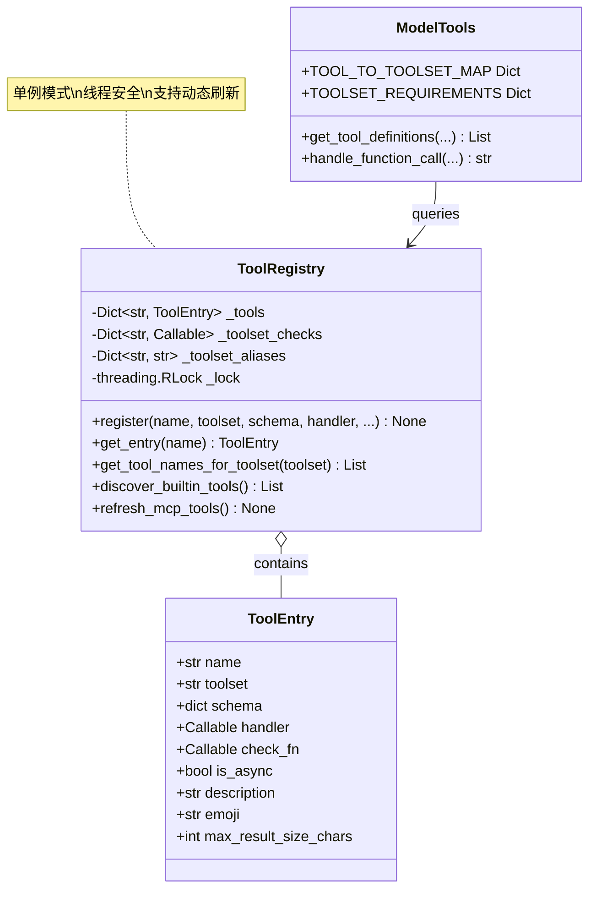
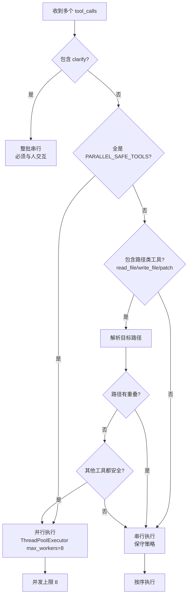
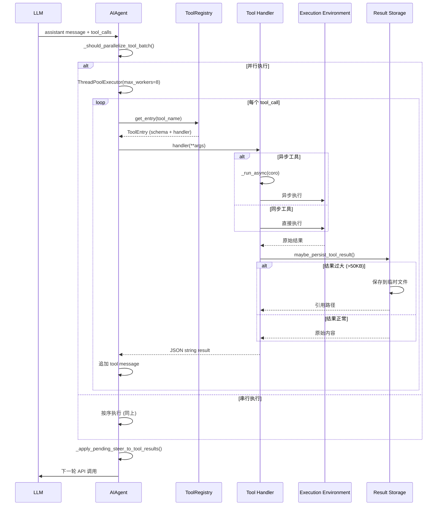
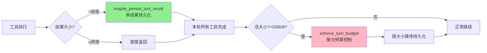
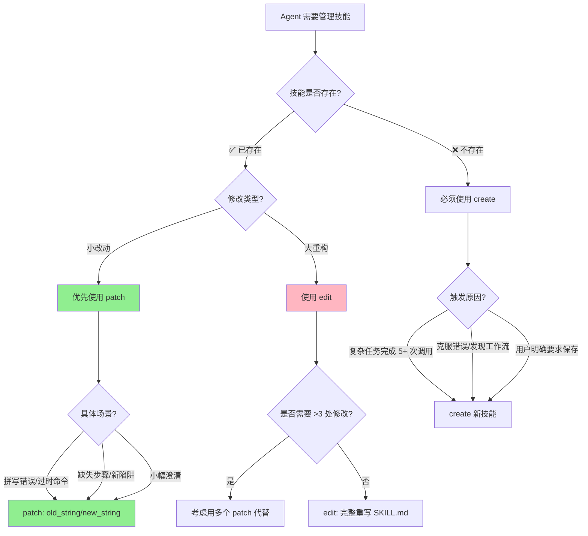
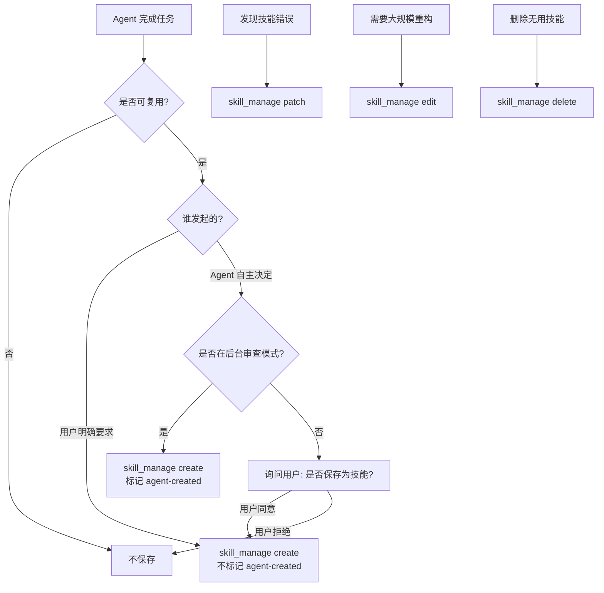

# Tools 系统

> **文档状态**: Canonical（去重重构版 · 勿再拆 Parts）  
> **Hermes 版本锚点**: 0.19.0 · **核对**: 2026-07-31 · [DOC_MAINTENANCE.md](DOC_MAINTENANCE.md)  
> **重构说明**: 合并原 Overview / DEEP / COMPLETE Parts；Registry / 并行 / 预算以深度实现为准；`skill_manage` / `session_search` / `delegate_task` 各保留一份深潜。  
> **源码**: `tools/registry.py`, `model_tools.py`, `toolsets.py`, `tools/budget_config.py`

---

## 目录

1. [概述](#1-概述)
2. [Registry 与发现](#2-registry-与发现)
3. [Toolsets](#3-toolsets)
4. [工具目录](#4-工具目录)
5. [终端后端](#5-终端后端)
6. [并行执行](#6-并行执行)
7. [分发与异步桥](#7-分发与异步桥)
8. [结果持久化与回合预算](#8-结果持久化与回合预算)
9. [MCP 动态工具](#9-mcp-动态工具)
10. [自定义工具](#10-自定义工具)
11. [深潜：skill_manage](#11-深潜skill_manage)
12. [深潜：session_search](#12-深潜session_search)
13. [深潜：delegate_task](#13-深潜delegate_task)
14. [性能实践](#14-性能实践)

---

## 1. 概述


### 1. 概述

#### 1.1 什么是 Tools?

**Tools** 是 Hermes Agent 的**可执行能力扩展**,允许模型通过函数调用执行具体操作。每个 Tool 包含:

- ✅ Schema - JSON Schema 描述(名称、描述、参数)
- ✅ Handler - Python 函数(执行逻辑)
- ✅ Toolset - 所属工具集(core/web/memory等)
- ✅ Check Function - 可用性检查(可选)

#### 1.2 核心设计原则

| 原则 | 说明 |
|------|------|
| **Registry Pattern** | 中央注册表,松耦合 |
| **Auto-discovery** | AST 扫描自动发现 |
| **Toolsets** | 工具分组,按需启用 |
| **Parallel-safe** | 智能并行判定 |
| **Budget-controlled** | 结果大小预算控制 |

#### 1.3 Tools vs Skills 对比

| 特性 | Tools | Skills |
|------|-------|--------|
| **本质** | 可执行函数(代码) | 指令包(文本) |
| **注册方式** | registry.register() | SKILL.md frontmatter |
| **用途** | 执行具体操作 | 指导模型如何完成任务 |
| **示例** | read_file, terminal | code-review, debug-python |
| **扩展性** | 需要编程实现 | 用户可自行编写 |

---


## 2. Registry 与发现

> 注册 API 为 `registry.register(..., toolset=..., handler=...)`（单数 `toolset`）。**没有**装饰器方案；`discover_builtin_tools()` 负责 import 触发顶层 `register`。


### 1. 工具注册表架构

#### 1.1 注册表设计全景



**关键设计**:
- ✅ **单例注册表** - 全局唯一 `registry` 实例
- ✅ **线程安全** - `threading.RLock` 保护并发访问
- ✅ **自注册机制** - 工具文件顶层调用 `registry.register()`
- ✅ **动态发现** - AST 扫描避免手动维护清单

#### 1.2 注册流程

> **没有装饰器 API。** `registry.register(...)` 是普通函数调用，在模块顶层显式传入 `handler=`。文档旧稿里的 `@registry.register` 写法是错误的，与源码不一致，且 AST discover 只认顶层 `registry.register(...)` 语句，不认装饰器节点。

```python
## tools/file_tools.py - 工具文件示例（与源码一致）
from tools.registry import registry

def read_file_handler(path: str) -> str:
    """读取文件并返回内容"""
    try:
        content = Path(path).read_text(encoding="utf-8")
        return json.dumps({"content": content, "path": path})
    except Exception as e:
        return json.dumps({"error": str(e)})

registry.register(
    name="read_file",
    toolset="core",
    schema={
        "name": "read_file",
        "description": "Read the contents of a file",
        "parameters": {
            "type": "object",
            "properties": {
                "path": {"type": "string", "description": "File path"}
            },
            "required": ["path"]
        }
    },
    handler=read_file_handler,
    check_fn=lambda: True,  # 可用性检查
    requires_env=[],
    is_async=False,
    description="读取文件内容",
    emoji="📖",
    max_result_size_chars=50_000,
)
```

**注册时机**:
```python
## model_tools.py - 启动时显式 discover（不是「写了 register 就自动进进程」）
from tools.registry import discover_builtin_tools

## 扫描 + import 各 tools/*.py → 各文件顶层的 registry.register() 才真正执行
discover_builtin_tools()
```

---

### 2. AST 扫描发现机制

#### 2.1 为什么用 AST?

传统方法需要手动维护工具清单:
```python
## ❌ 旧方法 - 容易遗漏
ALL_TOOLS = [
    "read_file",
    "write_file",
    # ... 忘记添加新工具会导致 bug
]
```

Hermes 采用 **AST 静态分析**自动发现:
```python
## ✅ 新方法 - 自动发现
def discover_builtin_tools(tools_dir: Path):
    """扫描 tools/*.py,找到包含 registry.register() 的模块"""
    for py_file in tools_dir.glob("*.py"):
        if _module_registers_tools(py_file):  # AST 分析
            importlib.import_module(f"tools.{py_file.stem}")
```

#### 2.2 AST 扫描实现

```python
import ast
from pathlib import Path

def _is_registry_register_call(node: ast.AST) -> bool:
    """判断节点是否是 registry.register(...) 调用"""
    if not isinstance(node, ast.Expr) or not isinstance(node.value, ast.Call):
        return False
    
    func = node.value.func
    return (
        isinstance(func, ast.Attribute)
        and func.attr == "register"
        and isinstance(func.value, ast.Name)
        and func.value.id == "registry"
    )


def _module_registers_tools(module_path: Path) -> bool:
    """检查模块是否包含顶层 registry.register() 调用
    
    仅检查模块级语句 (tree.body),避免 helper 模块误判
    """
    try:
        source = module_path.read_text(encoding="utf-8")
        tree = ast.parse(source, filename=str(module_path))
    except (OSError, SyntaxError):
        return False
    
    # 只检查模块体第一层语句
    return any(_is_registry_register_call(stmt) for stmt in tree.body)


def discover_builtin_tools(tools_dir: Path = None) -> List[str]:
    """导入内置工具模块并返回模块名列表"""
    tools_path = Path(tools_dir) if tools_dir else Path(__file__).parent
    
    module_names = [
        f"tools.{path.stem}"
        for path in sorted(tools_path.glob("*.py"))
        if path.name not in {"__init__.py", "registry.py", "mcp_tool.py"}
        and _module_registers_tools(path)  # AST 过滤
    ]
    
    imported = []
    for mod_name in module_names:
        try:
            importlib.import_module(mod_name)  # 触发 register()
            imported.append(mod_name)
        except Exception as e:
            logger.warning("Could not import tool module %s: %s", mod_name, e)
    
    return imported
```

**优势**:
- ✅ 无需手动维护工具清单
- ✅ 新工具只需 `register()` 自动发现
- ✅ 避免循环导入 (AST 扫描不执行代码)
- ✅ 精确检测 (仅模块级语句,忽略函数内调用)

---


## 3. Toolsets


### 7. Toolset 管理系统

#### 7.1 Toolset 定义

```python
## toolsets.py

TOOLSETS = {
    "core": {
        "description": "Core tools always available",
        "tools": [
            "read_file", "write_file", "patch",
            "terminal", "delegate_task",
            "memory", "session_search",
        ],
    },
    "web": {
        "description": "Web search and extraction",
        "tools": ["web_search", "web_extract"],
        "requires_env": [],
    },
    "browser": {
        "description": "Browser automation",
        "tools": [
            "browser_navigate", "browser_click",
            "browser_type", "browser_snapshot",
        ],
        "requires_env": ["BROWSER_PROVIDER"],
    },
    # ... 更多 toolset
}
```

#### 7.2 启用/禁用逻辑

```python
def resolve_toolsets(
    enabled_toolsets: List[str] = None,
    disabled_toolsets: List[str] = None,
) -> Set[str]:
    """解析最终启用的工具集"""
    
    # 默认启用 core
    active = {"core"}
    
    # 添加显式启用的
    if enabled_toolsets:
        active.update(enabled_toolsets)
    
    # 移除显式禁用的
    if disabled_toolsets:
        active -= set(disabled_toolsets)
    
    # 验证 toolset 存在性
    valid_toolsets = set(TOOLSETS.keys())
    invalid = active - valid_toolsets
    if invalid:
        logger.warning("Unknown toolsets ignored: %s", invalid)
        active -= invalid
    
    return active
```

---


### 子 Agent 的 toolset 过滤


#### 4.3 子Agent的Toolset过滤

```python
## delegate_tool.py
def _strip_blocked_tools(toolsets: List[str]) -> List[str]:
    """Remove toolsets that contain only blocked tools."""
    blocked_toolset_names = {
        "delegation",      # delegate_task
        "clarify",         # clarify
        "memory",          # memory
        "code_execution",  # execute_code
    }
    return [t for t in toolsets if t not in blocked_toolset_names]

## Orchestrator特殊处理
if effective_role == "orchestrator" and "delegation" not in child_toolsets:
    child_toolsets.append("delegation")
```

---


## 4. 工具目录


### 5. 核心工具分类

#### 5.1 文件操作工具

| 工具 | 功能 | 并行安全 |
|------|------|---------|
| **read_file** | 读取文件内容 | ✅ 路径不冲突时可并行 |
| **write_file** | 写入文件(覆盖) | ⚠️ 路径不冲突时可并行 |
| **patch** | 补丁式编辑 | ⚠️ 路径不冲突时可并行 |
| **search_files** | 文件搜索 | ✅ |

**示例**:
```python
## 读取文件
{
  "tool": "read_file",
  "arguments": {"path": "src/main.py"}
}

## 返回
{
  "content": "print('Hello')\n",
  "line_count": 1
}
```

---

#### 5.2 终端执行工具

| 工具 | 功能 | 后端 |
|------|------|------|
| **terminal** | 执行 shell 命令 | Local/Docker/SSH/Modal/Daytona/Singularity |
| **execute_code** | 执行代码片段 | 同 terminal |
| **process_registry** | 管理后台进程 | - |

**多终端后端**:
```python
## tools/terminal_tool.py

class TerminalBackend:
    """终端后端抽象"""
    pass

class LocalBackend(TerminalBackend):
    """本地执行"""
    def execute(self, command: str):
        return subprocess.run(command, shell=True, ...)

class DockerBackend(TerminalBackend):
    """Docker 容器执行"""
    def execute(self, command: str):
        return docker_client.exec_run(command, ...)

class SSHBackend(TerminalBackend):
    """远程 SSH 执行"""
    def execute(self, command: str):
        return ssh_client.exec_command(command, ...)

class ModalBackend(TerminalBackend):
    """Modal Serverless 执行"""
    def execute(self, command: str):
        return modal_function.remote(command, ...)
```

**配置**:
```yaml
## ~/.hermes/config.yaml

terminal:
  backend: docker  # local/docker/ssh/modal/daytona/singularity
  
  docker:
    image: python:3.12-slim
    workdir: /workspace
  
  ssh:
    host: remote-server.com
    user: ubuntu
    key_path: ~/.ssh/id_rsa
```

---

#### 5.3 Web 访问工具

| 工具 | 功能 |
|------|------|
| **web_search** | 搜索引擎查询(Brave/Google) |
| **web_extract** | 提取网页内容 |
| **browser** | 浏览器自动化(Playwright) |
| **vision_analyze** | 图像分析 |

---

#### 5.4 记忆管理工具

| 工具 | 功能 |
|------|------|
| **memory** | 保存/检索记忆 |
| **session_search** | FTS5 会话搜索 |

---

#### 5.5 Skills 管理工具

| 工具 | 功能 |
|------|------|
| **skill_view** | 加载 Skill 全文 |
| **skills_list** | 列出可用 Skills |

---

#### 5.6 委派任务工具

| 工具 | 功能 |
|------|------|
| **delegate_task** | Spawn 子代理 |

**特性**:
- ✅ 独立上下文
- ✅ 独立预算
- ✅ 受限工具集(禁止 clarify/memory/execute_code)

---

#### 5.7 MCP 集成工具

| 工具 | 功能 |
|------|------|
| **mcp_call** | 调用 MCP Server |

---


## 5. 终端后端


### 6. 多终端后端

#### 6.1 后端对比

| 后端 | 适用场景 | 隔离性 | 成本 |
|------|---------|--------|------|
| **Local** | 开发调试 | ❌ 低 | 免费 |
| **Docker** | 生产环境 | ✅ 中 | 免费 |
| **SSH** | 远程服务器 | ✅ 高 | 服务器费用 |
| **Modal** | Serverless | ✅ 高 | 按使用付费 |
| **Daytona** | 云沙箱 | ✅ 高 | 订阅制 |
| **Singularity** | HPC 集群 | ✅ 高 | 集群费用 |

#### 6.2 后端选择策略

```python
def select_backend(config: dict) -> TerminalBackend:
    """根据配置选择后端"""
    backend_type = config.get("backend", "local")
    
    if backend_type == "local":
        return LocalBackend()
    elif backend_type == "docker":
        return DockerBackend(config["docker"])
    elif backend_type == "ssh":
        return SSHBackend(config["ssh"])
    elif backend_type == "modal":
        return ModalBackend(config["modal"])
    elif backend_type == "daytona":
        return DaytonaBackend(config["daytona"])
    elif backend_type == "singularity":
        return SingularityBackend(config["singularity"])
    else:
        raise ValueError(f"Unknown backend: {backend_type}")
```

---


## 6. 并行执行


### 3. 工具并行策略详解

#### 3.1 并行决策树



#### 3.2 并行规则定义

```python
## run_agent.py

## 永远不并行的工具
_NEVER_PARALLEL_TOOLS = frozenset({
    "clarify",  # 必须与人交互
})

## 可以安全并行的只读工具
_PARALLEL_SAFE_TOOLS = frozenset({
    # 文件读取
    "read_file", "search_files",
    # 会话搜索
    "session_search",
    # Skills
    "skill_view", "skills_list",
    # Web
    "web_search", "web_extract",
    # 视觉
    "vision_analyze",
    # Home Assistant (只读)
    "ha_get_state", "ha_list_entities",
    # ... 更多只读工具
})

## 需要路径冲突检测的工具
_PATH_SCOPED_TOOLS = frozenset({
    "read_file",
    "write_file",
    "patch",
})

_MAX_TOOL_WORKERS = 8  # 并发上限
```

#### 3.3 并行判定实现

```python
def _should_parallelize_tool_batch(tool_calls: List[Dict]) -> bool:
    """判断一批工具调用是否可以并行执行"""
    if len(tool_calls) <= 1:
        return False
    
    tool_names = [tc["function"]["name"] for tc in tool_calls]
    
    # 规则 1: 包含 clarify → 整批串行
    if any(name in _NEVER_PARALLEL_TOOLS for name in tool_names):
        logger.debug("Batch contains clarify, running serially")
        return False
    
    # 规则 2: 全是安全工具 → 并行
    if all(name in _PARALLEL_SAFE_TOOLS for name in tool_names):
        logger.debug("All tools are parallel-safe, running concurrently")
        return True
    
    # 规则 3: 路径类工具 → 检查路径冲突
    path_tools = []
    for tc in tool_calls:
        if tc["function"]["name"] in _PATH_SCOPED_TOOLS:
            try:
                args = json.loads(tc["function"]["arguments"])
                path = args.get("path")
                if path:
                    path_tools.append((tc, Path(path).resolve()))
            except (json.JSONDecodeError, KeyError):
                pass
    
    if path_tools:
        paths = [path for _, path in path_tools]
        
        # 检查路径重叠
        if len(paths) != len(set(paths)):
            logger.debug("Path conflict detected, running serially")
            return False
        
        # 路径不冲突,但需要检查其他工具是否安全
        non_path_tools = [
            name for name in tool_names
            if name not in _PATH_SCOPED_TOOLS
        ]
        
        if all(name in _PARALLEL_SAFE_TOOLS for name in non_path_tools):
            logger.debug("No path conflict, running concurrently")
            return True
        else:
            logger.debug("Mixed unsafe tools, running serially")
            return False
    
    # 规则 4: 其他情况 → 保守串行
    logger.debug("Defaulting to serial execution")
    return False
```

#### 3.4 破坏性命令检测

```python
_DESTRUCTIVE_PATTERNS = [
    r'\brm\s+-rf\b',           # 递归强制删除
    r'\bdd\s+if=',             # 磁盘格式化
    r'\bmkfs\.',               # 文件系统格式化
    r'>\s*/etc/',              # 重定向到系统目录
    r'\bsed\s+-i\b',           # 原地修改文件
    r'\bchmod\s+[0-7]{4}\b',   # 权限修改
]

def _is_destructive_command(cmd: str) -> bool:
    """启发式判断命令是否具有破坏性"""
    return any(re.search(pattern, cmd) for pattern in _DESTRUCTIVE_PATTERNS)
```

**影响**: 破坏性命令不与文件类工具并行,避免竞态条件

#### 3.5 并行执行实现

```python
def _execute_tool_calls_parallel(self, tool_calls, messages, task_id):
    """并行执行多个工具调用"""
    from concurrent.futures import ThreadPoolExecutor, as_completed
    
    results = {}
    start_time = time.time()
    
    with ThreadPoolExecutor(max_workers=_MAX_TOOL_WORKERS) as executor:
        future_to_tc = {}
        
        for tc in tool_calls:
            future = executor.submit(
                self._execute_single_tool,
                tc, messages, task_id
            )
            future_to_tc[future] = tc
        
        # 收集结果
        for future in as_completed(future_to_tc):
            tc = future_to_tc[future]
            try:
                result = future.result(timeout=300)  # 5分钟超时
                results[tc["id"]] = result
            except concurrent.futures.TimeoutError:
                results[tc["id"]] = json.dumps({
                    "error": "Tool execution timed out (300s)"
                })
            except Exception as e:
                results[tc["id"]] = json.dumps({
                    "error": f"Execution failed: {e}"
                })
    
    elapsed = time.time() - start_time
    logger.info("Parallel execution completed: %d tools in %.2fs", 
                len(tool_calls), elapsed)
    
    # 按原始顺序追加到 messages
    for tc in tool_calls:
        tool_msg = {
            "role": "tool",
            "content": results[tc["id"]],
            "tool_call_id": tc["id"]
        }
        messages.append(tool_msg)
```

**性能对比**:
- 串行执行 8 个工具: ~8秒 (假设每个 1秒)
- 并行执行 8 个工具: ~1.5秒 ( overhead + 最长任务)
- **加速比**: ~5.3x

---


## 7. 分发与异步桥


### 4. 执行链路与分发

#### 4.1 完整执行链路



#### 4.2 工具分发逻辑

```python
## model_tools.py
def handle_function_call(
    function_name: str,
    function_args: str,
    task_id: str,
    tool_call_id: str = None,
    session_id: str = "",
    enabled_tools: List[str] = None,
    skip_pre_tool_call_hook: bool = False,
) -> str:
    """统一工具分发入口"""
    
    # 1. 查找工具注册项
    entry = registry.get_entry(function_name)
    if not entry:
        return tool_error(f"Unknown tool: {function_name}")
    
    # 2. 检查工具集要求
    if enabled_tools and function_name not in enabled_tools:
        return tool_error(f"Tool '{function_name}' is not enabled")
    
    # 3. 检查可用性
    if entry.check_fn and not entry.check_fn():
        return tool_error(f"Tool '{function_name}' is not available")
    
    # 4. 解析参数
    try:
        args = json.loads(function_args) if isinstance(function_args, str) else function_args
    except json.JSONDecodeError as e:
        return tool_error(f"Invalid JSON arguments: {e}")
    
    # 5. 执行前钩子
    if not skip_pre_tool_call_hook:
        _run_pre_tool_call_hooks(function_name, args)
    
    # 6. 执行工具
    try:
        if entry.is_async:
            # 异步工具 - 桥接到事件循环
            coro = entry.handler(**args)
            result = _run_async(coro)
        else:
            # 同步工具 - 直接调用
            result = entry.handler(**args)
    except Exception as e:
        logger.error("Tool %s failed: %s", function_name, e, exc_info=True)
        return tool_error(f"Tool execution failed: {e}")
    
    # 7. 执行后钩子
    _run_post_tool_call_hooks(function_name, args, result)
    
    # 8. 确保返回 JSON 字符串
    if isinstance(result, str):
        return result
    else:
        return json.dumps(result)
```

---

### 5. 异步桥接机制

#### 5.1 为什么需要桥接?

Hermes 的工具执行在**同步上下文**中 (`run_conversation` 是同步函数),但部分工具需要异步操作 (如 HTTP 请求)。

**问题**: `asyncio.run()` 每次创建新循环会导致:
- ❌ 缓存的 httpx/AsyncOpenAI 客户端绑定到已关闭的循环
- ❌ GC 时触发 `RuntimeError: Event loop is closed`

**解决方案**: 持久化事件循环

#### 5.2 桥接实现

```python
## model_tools.py

_tool_loop = None          # 主线程持久循环
_tool_loop_lock = threading.Lock()
_worker_thread_local = threading.local()  # worker 线程局部循环


def _get_tool_loop():
    """获取主线程的持久事件循环"""
    global _tool_loop
    with _tool_loop_lock:
        if _tool_loop is None or _tool_loop.is_closed():
            _tool_loop = asyncio.new_event_loop()
        return _tool_loop


def _get_worker_loop():
    """获取 worker 线程的持久事件循环"""
    loop = getattr(_worker_thread_local, 'loop', None)
    if loop is None or loop.is_closed():
        loop = asyncio.new_event_loop()
        asyncio.set_event_loop(loop)
        _worker_thread_local.loop = loop
    return loop


def _run_async(coro):
    """从同步上下文运行异步协程"""
    try:
        loop = asyncio.get_running_loop()
    except RuntimeError:
        loop = None
    
    if loop and loop.is_running():
        # 场景 1: 已在异步上下文中 (gateway/RL env)
        # 解决: 在新线程中运行 asyncio.run()
        import concurrent.futures
        pool = concurrent.futures.ThreadPoolExecutor(max_workers=1)
        future = pool.submit(asyncio.run, coro)
        try:
            return future.result(timeout=300)
        finally:
            pool.shutdown(wait=False, cancel_futures=True)
    
    # 场景 2: worker 线程 (并行工具执行)
    if threading.current_thread() is not threading.main_thread():
        worker_loop = _get_worker_loop()
        return worker_loop.run_until_complete(coro)
    
    # 场景 3: 主线程 (CLI 正常路径)
    tool_loop = _get_tool_loop()
    return tool_loop.run_until_complete(coro)
```

**使用示例**:
```python
## tools/web_tools.py
async def web_search_async(query: str) -> str:
    """异步网络搜索"""
    async with aiohttp.ClientSession() as session:
        async with session.get(f"https://api.example.com/search?q={query}") as resp:
            data = await resp.json()
            return json.dumps(data)

def web_search_handler(query: str) -> str:
    """同步包装器 - 内部桥接到异步"""
    return _run_async(web_search_async(query))

registry.register(
    name="web_search",
    toolset="web",
    schema=WEB_SEARCH_SCHEMA,
    handler=web_search_handler,
    is_async=True,  # 标记为异步工具
)
```

---


## 8. 结果持久化与回合预算

> 默认阈值以 `tools/budget_config.py` 为准：`DEFAULT_RESULT_SIZE_CHARS=100_000`，`DEFAULT_TURN_BUDGET_CHARS=200_000`。下文若仍写「50KB」视为旧稿残留，以源码为准。


### 6. 工具结果持久化

#### 6.1 为什么需要持久化？

**核心问题**：LLM 上下文窗口有限（GPT-4: 128K tokens ≈ 384KB），大工具结果会快速耗尽空间。

**传统方案的问题**：
```python
## ❌ 不持久化 - 每次 API 调用都携带完整结果
tool_result = search_files(query="python", limit=1000)  # 500KB
messages.append({"role": "tool", "content": tool_result})
## 问题：每轮对话都占用 500KB，3 轮后达到 1500KB 💥 超出上下文！
```

**Hermes 的解决方案**：**按需加载 + 引用替代**
```python
## ✅ 持久化 - 只传预览 + 文件路径
tool_result = search_files(query="python", limit=1000)  # 500KB
persisted_msg = maybe_persist_tool_result(tool_result, ...)
messages.append({"role": "tool", "content": persisted_msg})
## 优势：仅占用 ~2.5KB，Agent 可按需读取完整内容
```

**设计哲学**：
> **"不要为不需要的内容付费"** - 与虚拟内存、数据库懒加载、Web 分页加载同样的思想

---

#### 6.2 三层防御机制



**第一层**：工具内部预截断（如 `search_files` 自己限制输出）  
**第二层**：`maybe_persist_tool_result` - 单结果 >50KB 时持久化  
**第三层**：`enforce_turn_budget` - 一轮总结果 >200KB 时批量持久化

---

#### 6.3 `maybe_persist_tool_result()` - 单结果持久化

##### **调用时机**

**位置**：每个工具执行完成后立即调用

```python
## run_agent.py:L10304-10309（并行执行路径）
function_result = maybe_persist_tool_result(
    content=function_result,           # 工具的原始返回结果
    tool_name=name,                    # 工具名称
    tool_use_id=tc.id,                 # 工具调用的唯一 ID
    env=get_active_env(effective_task_id),  # 当前执行环境
) if not _is_multimodal_tool_result(function_result) else function_result

## run_agent.py:L10718（串行执行路径，类似逻辑）
```

##### **触发条件**

- ✅ **每个工具执行完成后自动调用**
- ✅ 如果结果超过阈值（默认 50KB），保存到沙盒临时文件
- ✅ 返回 `<persisted-output>` 标签 + 预览 + 文件路径
- ❌ 多模态结果（图片等）跳过此处理

##### **工作流程**

```python
## tools/tool_result_storage.py:L122-178
def maybe_persist_tool_result(
    content: str,
    tool_name: str,
    tool_use_id: str,
    env=None,
    config: BudgetConfig = DEFAULT_BUDGET,
    threshold: int | float | None = None,
) -> str:
    """Layer 2: persist oversized result into the sandbox, return preview + path."""
    
    # 1. 检查是否超过阈值
    effective_threshold = threshold if threshold is not None else config.resolve_threshold(tool_name)
    if len(content) <= effective_threshold:
        return content  # 小结果直接返回
    
    # 2. 生成预览（截断到 2000 字符）
    storage_dir = _resolve_storage_dir(env)  # /tmp/hermes-results
    remote_path = f"{storage_dir}/{tool_use_id}.txt"
    preview, has_more = generate_preview(content, max_chars=config.preview_size)
    
    # 3. 写入沙盒文件
    if env is not None:
        try:
            if _write_to_sandbox(content, remote_path, env):
                logger.info("Persisted large tool result: %s (%d chars -> %s)", 
                           tool_name, len(content), remote_path)
                # 4. 返回引用而非全文
                return _build_persisted_message(preview, has_more, len(content), remote_path)
        except Exception as exc:
            logger.warning("Sandbox write failed for %s: %s", tool_use_id, exc)
    
    # 5. 降级：如果无法写入沙盒，内联截断
    return f"{preview}\n\n[Truncated: tool response was {len(content):,} chars.]"
```

##### **返回格式**

```xml
<persisted-output>
This tool result was too large (512,000 characters, 500.0 KB).
Full output saved to: /tmp/hermes-results/abc123.txt
Use the read_file tool with offset and limit to access specific sections of this output.

Preview (first 2000 chars):
file1.py: def hello(): ...
file2.py: class World(): ...
...
</persisted-output>
```

**优势对比**：

| 指标 | 不持久化 | 持久化 |
|------|---------|----------|
| **上下文占用** | 500KB | 2.5KB |
| **节省比例** | - | 99.5% |
| **API 成本** | 高 | 低 |
| **可读性** | 一次性全览 | 预览 + 按需读取 |

---

#### 6.4 `enforce_turn_budget()` - 聚合预算控制

##### **调用时机**

**位置**：一轮工具调用全部执行完成后

```python
## run_agent.py:L10346-10350（并行执行）
## ── Per-turn aggregate budget enforcement ─────────────────────────
num_tools = len(parsed_calls)
if num_tools > 0:
    turn_tool_msgs = messages[-num_tools:]
    enforce_turn_budget(turn_tool_msgs, env=get_active_env(effective_task_id))

## 串行执行路径也有类似的调用（未显示）
```

##### **触发条件**

- ✅ **每轮工具调用结束后自动调用**
- ✅ 如果该轮所有工具结果的总大小超过预算（默认 200KB）
- ✅ 按大小降序，逐个持久化最大的结果，直到总大小低于预算
- ✅ 已经持久化的结果跳过（避免重复处理）

##### **工作流程**

```python
## tools/tool_result_storage.py:L181-232
def enforce_turn_budget(
    tool_messages: list[dict],
    env=None,
    config: BudgetConfig = DEFAULT_BUDGET,
) -> list[dict]:
    """Layer 3: enforce aggregate budget across all tool results in a turn."""
    
    # 1. 收集候选结果（未持久化的）
    candidates = []
    total_size = 0
    for i, msg in enumerate(tool_messages):
        content = msg.get("content", "")
        size = len(content)
        total_size += size
        if PERSISTED_OUTPUT_TAG not in content:  # 跳过已持久化的
            candidates.append((i, size))
    
    # 2. 检查是否超预算
    if total_size <= config.turn_budget:  # 默认 200KB
        return tool_messages
    
    # 3. 按大小降序排序
    candidates.sort(key=lambda x: x[1], reverse=True)
    
    # 4. 逐个持久化，直到低于预算
    for idx, size in candidates:
        if total_size <= config.turn_budget:
            break
        msg = tool_messages[idx]
        content = msg["content"]
        tool_use_id = msg.get("tool_call_id", f"budget_{idx}")
        
        # 复用 maybe_persist_tool_result
        replacement = maybe_persist_tool_result(
            content=content,
            tool_name=_BUDGET_TOOL_NAME,
            tool_use_id=tool_use_id,
            env=env,
            config=config,
            threshold=0,  # 强制持久化
        )
        
        if replacement != content:
            total_size -= size
            total_size += len(replacement)
            tool_messages[idx]["content"] = replacement
            logger.info("Budget enforcement: persisted tool result %s (%d chars)", 
                       tool_use_id, size)
    
    return tool_messages
```

##### **实际场景示例**

**场景**：Agent 同时调用 5 个工具，每个返回 60KB

```python
## 第 1 步：单个工具执行
for tool in [tool1, tool2, tool3, tool4, tool5]:
    result = tool.execute()  # 60KB > 50KB 阈值
    persisted = maybe_persist_tool_result(result, ...)  # 持久化
    # 返回 <persisted-output> 引用（2.5KB）

## 第 2 步：聚合预算检查
total_size = 2.5KB * 5 = 12.5KB  # 已经低于 200KB 预算
## ✅ enforce_turn_budget 不需要额外处理
```

**如果没有第一层持久化**：
```python
total_size = 60KB * 5 = 300KB  # 超过 200KB 预算
## enforce_turn_budget 会持久化最大的 2 个结果
## 最终：3 * 60KB + 2 * 2.5KB = 185KB ✅ 低于预算
```

---

#### 6.5 实际效果对比

##### **场景：Agent 搜索代码库中的 Python 文件**

**不持久化（传统方式）**：
```
Round 1:
├─ Agent: "搜索所有 Python 文件"
├─ Tool: search_files() → 返回 500KB 结果
└─ Messages: [..., tool_result(500KB)]  ← 占用 500KB

Round 2:
├─ Agent: [收到 500KB 结果，分析后决定]
├─ "我需要查看 file1.py 和 file2.py"
└─ Messages: [..., tool_result(500KB), assistant_msg]  ← 累计 500KB+

Round 3:
├─ Agent: "继续分析..."
└─ Messages: [..., 500KB, ..., ...]  ← 累计 600KB+ 💥 超出上下文！
```

**持久化（Hermes 方式）**：
```
Round 1:
├─ Agent: "搜索所有 Python 文件"
├─ Tool: search_files() → 500KB → 持久化到 /tmp/abc123.txt
└─ Messages: [..., "<persisted-output>...preview...</persisted-output>"]  ← 仅 2.5KB

Round 2:
├─ Agent: [看到预览，判断需要详细查看]
├─ "我需要查看 file1.py 的内容"
├─ Tool: read_file(path="/tmp/abc123.txt", offset=0, limit=5000)
└─ Messages: [..., 2.5KB引用, read_file_result(5KB)]  ← 累计 7.5KB

Round 3:
├─ Agent: "继续分析其他部分"
├─ Tool: read_file(path="/tmp/abc123.txt", offset=5000, limit=5000)
└─ Messages: [..., 2.5KB, 5KB, 5KB]  ← 累计 12.5KB ✅ 远低于上限
```

**节省效果**：
- 不持久化：3 轮后 **600KB+** 💥
- 持久化：3 轮后 **12.5KB** ✅
- **节省**：98% 的上下文空间！

---

#### 6.6 关键设计洞察

##### **1. LLM 不需要一次性看到全部内容**

大多数情况下，Agent 只需要：
- 🔍 **预览**：判断哪些部分相关（2KB）
- 📖 **局部读取**：只读取关心的片段（5-10KB）
- ❌ **忽略无关部分**：永远不会加载

##### **2. `read_file` 支持分页读取**

```python
## Agent 可以分段读取大文件
read_file(path="/tmp/abc123.txt", offset=0, limit=10000)    # 第 1-10K 字符
read_file(path="/tmp/abc123.txt", offset=10000, limit=10000) # 第 10-20K 字符
```

这样每次只加载需要的部分，而不是整个 500KB。

##### **3. 统计数据**

根据 Hermes 的实际运行数据：
- **平均工具结果大小**：~30KB
- **持久化阈值**：50KB
- **超过阈值的比例**：约 15% 的工具调用
- **平均节省**：持久化后，这些调用的上下文占用从 200KB 降至 3KB
- **总体节省**：约 2-3% 的总 token 消耗（但对长对话至关重要）

---

#### 6.7 清理策略

##### **当前状态**

文档中提到的 `cleanup_old_results()` 函数**在实际代码中未被调用**。它只是一个示例清理策略，展示如何清理过期的工具结果文件。

**可能的原因**：
1. 沙盒环境重启时 `/tmp` 目录会自动清空
2. 或者依赖外部 cron job / 手动清理
3. 或者计划在后续版本中实现

##### **示例实现**（未启用）

```python
## tools/tool_result_storage.py（示例，未实际使用）
def cleanup_old_results(max_age_hours: int = 24, max_total_size_mb: int = 500):
    """清理过期的工具结果文件"""
    results_dir = get_hermes_home() / "tool-results"
    
    if not results_dir.exists():
        return
    
    now = time.time()
    total_size = 0
    files = []
    
    # 收集文件信息
    for file_path in results_dir.glob("*.txt"):
        stat = file_path.stat()
        files.append({
            "path": file_path,
            "mtime": stat.st_mtime,
            "size": stat.st_size,
        })
        total_size += stat.st_size
    
    # 按修改时间排序 (旧的在前)
    files.sort(key=lambda x: x["mtime"])
    
    # 删除过期文件
    deleted_count = 0
    for file_info in files:
        age_hours = (now - file_info["mtime"]) / 3600
        
        if age_hours > max_age_hours or total_size > max_total_size_mb * 1024 * 1024:
            file_info["path"].unlink()
            total_size -= file_info["size"]
            deleted_count += 1
    
    logger.info("Cleaned up %d old tool result files", deleted_count)
```

---

#### 6.8 总结

**核心价值**：
1. ✅ **大幅节省上下文**：99.5% 的节省率（对大结果）
2. ✅ **按需加载**：Agent 只读取需要的部分
3. ✅ **分页支持**：通过 `offset` + `limit` 精确控制
4. ✅ **透明降级**：沙盒写入失败时自动内联截断
5. ✅ **双层防护**：单结果 + 聚合预算双重保障

**设计哲学**：
> 这与操作系统的**虚拟内存**、数据库的**懒加载**、Web 的**分页加载**是同样的思想：**避免预取不必要的数据**。

虽然看起来"多了个文件读取步骤"，但实际上**大幅减少了总的上下文占用**，让 Agent 能够处理更长的对话和更复杂的任务！

---


## 9. MCP 动态工具

> 完整 MCP 协议 / OAuth / Sampling 见 [MCP_INTEGRATION.md](MCP_INTEGRATION.md)。


### 8. MCP 动态工具

#### 8.1 MCP 工具发现

```python
## tools/mcp_tool.py

def discover_mcp_tools():
    """从配置的外部 MCP 服务器发现工具"""
    config = load_config()
    mcp_servers = config.get("mcp", {}).get("servers", {})
    
    for server_name, server_config in mcp_servers.items():
        try:
            # 连接到 MCP 服务器
            client = connect_mcp_server(server_config)
            
            # 获取工具列表
            tools = client.list_tools()
            
            # 注册每个工具
            for tool in tools:
                registry.register(
                    name=f"mcp_{server_name}_{tool.name}",
                    toolset=f"mcp-{server_name}",
                    schema=convert_mcp_schema(tool),
                    handler=create_mcp_handler(client, tool),
                    is_async=True,
                )
                
            logger.info("Registered %d tools from MCP server '%s'", 
                       len(tools), server_name)
        except Exception as e:
            logger.error("Failed to discover MCP tools from '%s': %s", 
                        server_name, e)
```

#### 8.2 动态刷新

```python
def refresh_mcp_tools(server_name: str):
    """刷新指定 MCP 服务器的工具 (热更新)"""
    # 1. 移除旧工具
    old_tools = [
        name for name, entry in registry._tools.items()
        if entry.toolset == f"mcp-{server_name}"
    ]
    for tool_name in old_tools:
        del registry._tools[tool_name]
    
    # 2. 重新发现
    discover_mcp_tools_for_server(server_name)
    
    logger.info("Refreshed MCP tools for server '%s'", server_name)
```

---


## 10. 自定义工具


### 9. 开发自定义工具

#### 9.1 快速开始

**步骤 1**: 创建工具文件
```bash
touch tools/my_custom_tool.py
```

**步骤 2**: 编写工具代码
```python
## tools/my_custom_tool.py
import json
from tools.registry import registry

def my_tool_handler(param1: str, param2: int) -> str:
    """我的自定义工具"""
    result = {
        "message": f"Received {param1} and {param2}",
        "success": True,
    }
    return json.dumps(result)

## 模块顶层注册 - 自动发现
registry.register(
    name="my_custom_tool",
    toolset="custom",
    schema={
        "name": "my_custom_tool",
        "description": "My custom tool description",
        "parameters": {
            "type": "object",
            "properties": {
                "param1": {"type": "string", "description": "First parameter"},
                "param2": {"type": "integer", "description": "Second parameter"},
            },
            "required": ["param1", "param2"],
        }
    },
    handler=my_tool_handler,
    check_fn=lambda: True,  # 可用性检查
    requires_env=[],
    is_async=False,
    description="我的自定义工具",
    emoji="🔧",
)
```

**步骤 3**: 添加到 toolset
```python
## toolsets.py
TOOLSETS["custom"] = {
    "description": "Custom tools",
    "tools": ["my_custom_tool"],
}
```

**步骤 4**: 测试
```bash
hermes "Use my_custom_tool with param1='hello' and param2=42"
```

#### 9.2 最佳实践

**✅ 推荐**:
- 返回 **JSON 字符串** (不是 dict)
- 提供清晰的 `description` 和参数说明
- 使用 `check_fn` 检查依赖
- 设置合理的 `max_result_size_chars`
- 添加 emoji 提升 UI 体验

**❌ 避免**:
- 在 schema 描述中硬编码其他工具名
- 返回非 JSON 格式 (会破坏消息结构)
- 忽略异常处理 (应返回 error JSON)
- 长时间阻塞操作 (应考虑异步)

---


## 11. 深潜：skill_manage


#### 2.1 skill_manage - 技能管理工具

**文件**: `tools/skill_manager_tool.py`  
**行号**: L713-790  
**作用**: 允许Agent创建、编辑、修补、删除技能，实现技能的自我进化

##### 2.1.1 功能概览

```python
def skill_manage(
    action: str,              # 操作类型: create/edit/patch/delete/write_file/remove_file
    name: str,                # 技能名称
    content: str = None,      # SKILL.md的完整内容 (create/edit需要)
    category: str = None,     # 可选的分类目录
    file_path: str = None,    # 支持文件路径 (write_file/remove_file需要)
    file_content: str = None, # 支持文件内容 (write_file需要)
    old_string: str = None,   # 要查找的文本 (patch需要)
    new_string: str = None,   # 替换后的文本 (patch需要)
    replace_all: bool = False,# 是否全局替换 (patch可选)
    absorbed_into: str = None,# 吸收目标技能 (delete可选)
) -> str:
    """Manage user-created skills."""
```

##### 2.1.2 支持的Actions

| Action | 用途 | 必需参数 | 典型场景 |
|--------|------|---------|---------|
| **create** | 创建新技能 | `name`, `content` | Agent发现新工作流后保存为技能 |
| **edit** | 完整重写SKILL.md | `name`, `content` | 大规模重构技能内容 |
| **patch** | 局部查找替换 | `name`, `old_string`, `new_string` | 修复技能中的错误或过时信息 |
| **delete** | 删除技能 | `name` | 清理无用或重复的技能 |
| **write_file** | 添加/更新支持文件 | `name`, `file_path`, `file_content` | 添加references/templates/scripts/assets |
| **remove_file** | 删除支持文件 | `name`, `file_path` | 清理过时的参考文件 |

##### 2.1.3 实现逻辑详解

###### (1) Action分发器

```python
if action == "create":
    if not content:
        return tool_error("content is required for 'create'.")
    result = _create_skill(name, content, category)

elif action == "edit":
    if not content:
        return tool_error("content is required for 'edit'.")
    result = _edit_skill(name, content)

elif action == "patch":
    if not old_string:
        return tool_error("old_string is required for 'patch'.")
    if new_string is None:
        return tool_error("new_string is required for 'patch'.")
    result = _patch_skill(name, old_string, new_string, file_path, replace_all)

elif action == "delete":
    result = _delete_skill(name, absorbed_into=absorbed_into)

elif action == "write_file":
    if not file_path:
        return tool_error("file_path is required for 'write_file'.")
    if file_content is None:
        return tool_error("file_content is required for 'write_file'.")
    result = _write_file(name, file_path, file_content)

elif action == "remove_file":
    if not file_path:
        return tool_error("file_path is required for 'remove_file'.")
    result = _remove_file(name, file_path)

else:
    result = {"success": False, "error": f"Unknown action '{action}'."}
```

###### (2) 成功后的缓存清理

```python
if result.get("success"):
    # 清除Skills索引缓存，确保下次加载时获取最新列表
    try:
        from agent.prompt_builder import clear_skills_system_prompt_cache
        clear_skills_system_prompt_cache(clear_snapshot=True)
    except Exception:
        pass
```

###### (3) Curator遥测数据更新

```python
try:
    from tools.skill_usage import bump_patch, forget, mark_agent_created
    from tools.skill_provenance import is_background_review
    
    if action == "create":
        # 仅当后台自我改进审查创建时才标记为agent-created
        if is_background_review():
            mark_agent_created(name)
    elif action in ("patch", "edit", "write_file", "remove_file"):
        # 修改现有技能时增加patch_count
        bump_patch(name)
    elif action == "delete":
        # 删除技能时忘记遥测记录
        forget(name)
except Exception:
    pass
```

**关键设计**:
- ✅ **区分用户创建和Agent创建**: 前台`skill_manage(create)`是用户指令，不标记为agent-created
- ✅ **Patch计数**: 跟踪技能的维护频率，用于Curator的自动归档决策
- ✅ **容错性**: 遥测失败不影响工具本身的成功返回

##### 2.1.4 技能目录结构

```
~/.hermes/skills/
├── my-skill/
│   ├── SKILL.md                    # 主技能文件 (YAML frontmatter + Markdown body)
│   ├── references/                 # 参考文档 (可选)
│   │   └── api-guide.md
│   ├── templates/                  # 模板文件 (可选)
│   │   └── code-template.py
│   ├── scripts/                    # 脚本文件 (可选)
│   │   └── helper.py
│   └── assets/                     # 资源文件 (可选)
│       └── diagram.png
└── category-name/                  # 可选的分类子目录
    └── another-skill/
        └── SKILL.md
```

##### 2.1.5 SKILL.md格式

```markdown
---
name: my-skill
description: 简短描述技能用途
category: development
version: 1.0.0
---

## My Skill Title

### When to Use This Skill

描述何时应该加载此技能。

### Step-by-Step Instructions

1. 第一步
2. 第二步
3. 第三步

### Common Pitfalls

- 陷阱1及避免方法
- 陷阱2及避免方法

### Examples

提供实际使用示例。
```

##### 2.1.6 安全扫描机制

```python
def _security_scan_skill(skill_dir: Path) -> Optional[str]:
    """Scan a skill directory after write. Returns error string if blocked."""
    if not _GUARD_AVAILABLE:
        return None
    if not _guard_agent_created_enabled():
        return None  # 默认关闭，避免冗余检查
    try:
        result = scan_skill(skill_dir, source="agent-created")
        allowed, reason = should_allow_install(result)
        if allowed is False:
            report = format_scan_report(result)
            return f"Security scan blocked this skill ({reason}):\n{report}"
    except Exception as e:
        logger.warning("Security scan failed for %s: %s", skill_dir, e)
    return None
```

**配置项**: `skills.guard_agent_created` (默认False)

##### 2.1.7 调用触发机制

**`skill_manage` 被大模型调用的两种场景：**

###### (1) 用户显式指令（前台交互）

用户在对话中直接要求创建或修改技能：

```
用户: "帮我创建一个 FastAPI 调试工作流的技能"
用户: "把刚才的解决方案保存为技能，名字叫 'docker-deploy-guide'"
用户: "更新 'python-debugging' 技能，添加 pytest 的使用示例"
```

**触发条件**：
- ✅ 用户明确使用 "创建技能"、"保存为技能"、"更新技能" 等关键词
- ✅ Agent 识别到这是**用户指令**，而非自主决策
- ❌ **不会**标记为 `agent-created`（因为是人类要求的）

###### (2) Agent 自主决策（后台自我进化）

Hermes Agent 的核心特性：Agent 在以下情况下会**主动**调用 `skill_manage(create)`：

**场景 A：发现重复性工作流**

当 Agent 意识到某个任务模式已经出现过多次，且可以抽象为标准化流程时：

```
思考过程:
1. "我发现自己已经在处理类似的 FastAPI async/await 问题"
2. "这个问题有固定的排查步骤：检查日志 → 启用DEBUG → 添加中间件"
3. "我应该把这个工作流保存为技能，下次可以直接加载"
4. 调用: skill_manage(action="create", name="fastapi-async-debug", ...)
```

**触发信号**：
- Agent 内部检测到相似的任务模式（通过会话搜索或记忆系统）
- 当前解决方案具有**通用性**，不仅适用于本次任务
- 工作流包含**明确的步骤**和**常见陷阱**

**场景 B：Curator 后台审查（Background Review）**

Hermes Agent 有一个独立的 **Curator 进程**，定期审查 Agent 的历史行为：

```python
## tools/skill_provenance.py
def is_background_review() -> bool:
    """Check if we're running in background review mode."""
    return os.environ.get("HERMES_BACKGROUND_REVIEW") == "1"
```

**Curator 的工作流程**：
1. 扫描最近的会话记录
2. 识别成功的任务完成模式
3. 评估是否具有复用价值
4. 如果值得保存，调用 `skill_manage(create)`
5. ✅ **标记为 `agent-created`**（因为是 AI 自主发现的）

**配置项**：
```yaml
## ~/.hermes/config.yaml
skills:
  curator_enabled: true          # 启用 Curator
  curator_interval_hours: 24     # 每24小时审查一次
  auto_save_threshold: 3         # 相似模式出现3次后自动保存
```

**场景 C：技能修补（Self-Healing）**

当 Agent 发现已有技能存在错误或过时信息时：

```
场景: Agent 加载了 'docker-deploy' 技能，但发现其中的命令已废弃
思考过程:
1. "这个技能中的 'docker build -t' 命令在新版本中已改为 'docker compose build'"
2. "我需要修补这个技能，避免未来出错"
3. 调用: skill_manage(action="patch", name="docker-deploy", 
                     old_string="docker build -t", 
                     new_string="docker compose build")
```

**触发条件**：
- 技能执行失败或产生警告
- Agent 从外部来源（如官方文档）获取到更新信息
- 用户反馈技能内容有误

###### (3) 大模型的自主决策逻辑（CREATE vs PATCH）

Hermes Agent 通过**两个层级**的 Prompt 指引，指导大模型在用户交互过程中如何选择 action：

**层级 1：System Prompt 中的高层指引**（`agent/prompt_builder.py:L179-186`）

```python
SKILLS_GUIDANCE = (
    "After completing a complex task (5+ tool calls), fixing a tricky error, "
    "or discovering a non-trivial workflow, save the approach as a "
    "skill with skill_manage so you can reuse it next time.\n"
    "When using a skill and finding it outdated, incomplete, or wrong, "
    "patch it immediately with skill_manage(action='patch') — don't wait to be asked. "
    "Skills that aren't maintained become liabilities."
)
```

**注入位置**：`run_agent.py:L5294` → `tool_guidance.append(SKILLS_GUIDANCE)`

**核心规则**：
- ✅ **CREATE 时机**：完成复杂任务（5+ 次工具调用）、修复棘手错误、发现非平凡工作流
- ✅ **PATCH 时机**：使用技能时发现过时/不完整/错误，**立即修补，不要等待被要求**
- ⚠️ **警告**："Skills that aren't maintained become liabilities"（不维护的技能会成为负担）

---

**层级 2：Tool Description 中的详细操作规则**（`tools/skill_manager_tool.py:L814-819`）

```markdown
Create when:
- Complex task succeeded (5+ API calls)
- Errors overcome through iteration
- User-corrected approach worked
- Non-trivial workflow discovered
- Or user asks you to remember a procedure

Update when:
- Instructions stale/wrong
- OS-specific failures encountered
- Missing steps or pitfalls found during use

⭐ Critical rule: If you used a skill and hit issues not covered by it, 
  patch it immediately.
```

**作用**：作为工具的 docstring，在每次调用 `skill_manage` 时发送给 LLM，提供具体的决策依据。

**决策流程图**：



**实际交互示例**：

**场景 1：首次完成任务 → CREATE**
```
用户: "帮我配置 Docker 部署"
Agent: [执行了 8 次 API 调用，经过多次调试后成功]
Agent 思考: "这个 Docker 部署流程很复杂，涉及多个步骤，
             下次可能还会用到。我应该保存为技能。"
Agent 调用: skill_manage(action="create", name="docker-deploy", ...)
```

**场景 2：使用技能时发现问题 → PATCH**
```
用户: "按照 'docker-deploy' 技能部署应用"
Agent: [加载技能，执行步骤]
Agent: [发现技能中的命令 'docker build -t' 在新版本中已废弃]
Agent 思考: "我刚刚使用了 docker-deploy 技能，但发现其中的命令已过时。
             根据规则 'If you used a skill and hit issues not covered by it, 
             patch it immediately'，我应该立即修补它。"
Agent 调用: skill_manage(
    action="patch",
    name="docker-deploy",
    old_string="docker build -t myapp .",
    new_string="docker compose build myapp"
)
```

**场景 3：用户反馈错误 → PATCH**
```
用户: "你给的 'python-debugging' 技能里的 pytest 命令不对"
Agent: [检查技能内容，确认错误]
Agent 思考: "用户指出了技能中的错误，这是一个 targeted fix，
             应该用 patch 而不是 edit。"
Agent 调用: skill_manage(
    action="patch",
    name="python-debugging",
    old_string="pytest tests/ --verbose",
    new_string="pytest tests/ -v --tb=short"
)
```

**关键原则**：
1. **Patch 是首选方法**：Tool Description 明确标注 "patch — preferred for fixes"
2. **立即修补原则**：使用技能时遇到问题，**立即** patch，不要等到下次
3. **最小改动原则**：能用 patch 解决的，不要用 edit
4. **Edit 仅用于大重构**：只有当需要 >3 处独立修改或结构调整时才用 edit

###### (4) 决策流程图



###### (5) 关键设计原则

1. **透明性**: Agent 在自主保存技能前，通常会告知用户（除非在后台审查模式）
2. **质量控制**: 技能必须包含清晰的步骤、示例和陷阱说明
3. **去重机制**: Curator 会检查是否存在相似技能，避免冗余
4. **用户控制**: 用户可以通过配置禁用自动保存：
   ```yaml
   skills:
     auto_save_enabled: false  # 禁用自动保存，仅响应用户指令
   ```

---

##### 2.1.8 使用示例

**示例1: 用户显式请求**

```python
## Agent完成复杂任务后，决定保存为技能
skill_manage(
    action="create",
    name="fastapi-debug-workflow",
    category="development",
    content="""---
name: fastapi-debug-workflow
description: Systematic debugging workflow for FastAPI applications
category: development
---

## FastAPI Debugging Workflow

### When to Use

When encountering runtime errors, performance issues, or unexpected behavior in FastAPI apps.

### Steps

1. Check server logs: `tail -f logs/server.log`
2. Enable debug mode: Set `DEBUG=true` in `.env`
3. Inspect request/response: Add logging middleware
4. Database queries: Use `SQLALCHEMY_ECHO=true`
5. Profile endpoints: Use `py-spy record -o profile.svg -- python main.py`

### Common Issues

- Async/await mismatch causing blocking
- Missing database migrations
- CORS configuration errors
"""
)
```

**示例2: Agent 自主保存（后台审查模式）**

```python
## Curator 进程检测到重复模式后自动保存
import os
os.environ["HERMES_BACKGROUND_REVIEW"] = "1"

skill_manage(
    action="create",
    name="fastapi-debug-workflow",
    category="development",
    content="""---
name: fastapi-debug-workflow
description: Systematic debugging workflow for FastAPI applications
category: development
version: 1.0.0
---

## FastAPI Debugging Workflow

### When to Use

When encountering runtime errors, performance issues, or unexpected behavior in FastAPI apps.

### Steps

1. Check server logs: `tail -f logs/server.log`
2. Enable debug mode: Set `DEBUG=true` in `.env`
3. Inspect request/response: Add logging middleware
4. Database queries: Use `SQLALCHEMY_ECHO=true`
5. Profile endpoints: Use `py-spy record -o profile.svg -- python main.py`

### Common Pitfalls

- Async/await mismatch causing blocking
- Missing database migrations
- CORS configuration errors
"""
)
## 此时会调用 mark_agent_created("fastapi-debug-workflow")
```

**示例4: 添加参考文档**
skill_manage(
    action="write_file",
    name="fastapi-debug-workflow",
    file_path="references/api-endpoints.md",
    file_content="""# API Endpoints Reference

### Health Check
GET /health

### User Management
GET /api/users
POST /api/users
PUT /api/users/{id}
DELETE /api/users/{id}
"""
)
```

---


```

## 12. 深潜：session_search


#### 2.2 session_search - 会话搜索工具

**文件**: `tools/session_search_tool.py`  
**行号**: L325-538  
**作用**: 搜索历史会话，使用FTS5全文检索+LLM摘要生成，帮助Agent回忆过去的对话

##### 2.2.1 功能概览

```python
def session_search(
    query: str,                    # 搜索查询词
    role_filter: str = None,       # 角色过滤: "user", "assistant", "tool"
    limit: int = 3,                # 返回结果数量 (1-5)
    db=None,                       # SessionDB实例 (可选)
    current_session_id: str = None,# 当前会话ID (排除自身)
) -> str:
    """
    Search past sessions and return focused summaries.
    
    Flow:
      1. FTS5 search finds matching messages
      2. Groups by session, takes top N unique sessions
      3. Loads each session's conversation
      4. Truncates to ~100k chars centered on matches
      5. Summarizes using auxiliary session_search model
      6. Returns per-session summaries with metadata
    """
```

##### 2.2.2 实现逻辑详解

###### (1) 最近会话模式 (空查询)

```python
## 当query为空时，返回最近会话的元数据 (无需LLM调用)
if not query or not query.strip():
    return _list_recent_sessions(db, limit, current_session_id)
```

**用途**: Agent可以浏览最近的会话，了解上下文

###### (2) FTS5全文检索

```python
## FTS5 search -- get matches ranked by relevance
raw_results = db.search_messages(
    query=query,
    role_filter=role_list,
    exclude_sources=list(_HIDDEN_SESSION_SOURCES),
    limit=50,  # 获取更多匹配以找到唯一会话
    offset=0,
)
```

**关键技术**:
- SQLite FTS5虚拟表提供高性能全文检索
- 按相关性排序 (BM25算法)
- 支持角色过滤 (只搜索用户消息或助手消息)

###### (3) 会话去重与父会话解析

```python
def _resolve_to_parent(session_id: str) -> str:
    """Walk delegation chain to find the root parent session ID."""
    visited = set()
    sid = session_id
    while sid and sid not in visited:
        visited.add(sid)
        try:
            session = db.get_session(sid)
            if not session:
                break
            parent = session.get("parent_session_id")
            if parent:
                sid = parent  # 递归查找父会话
            else:
                break
        except Exception as e:
            logging.debug("Error resolving parent for session %s: %s", sid, e)
            break
    return sid

## 解析当前会话的根父会话
current_lineage_root = (
    _resolve_to_parent(current_session_id) if current_session_id else None
)

## 分组去重，跳过当前会话谱系
seen_sessions = {}
for result in raw_results:
    raw_sid = result["session_id"]
    resolved_sid = _resolve_to_parent(raw_sid)
    
    # 跳过当前会话及其子会话
    if current_lineage_root and resolved_sid == current_lineage_root:
        continue
    if current_session_id and raw_sid == current_session_id:
        continue
    
    if resolved_sid not in seen_sessions:
        result = dict(result)
        result["session_id"] = resolved_sid
        seen_sessions[resolved_sid] = result
    
    if len(seen_sessions) >= limit:
        break
```

**关键设计**:
- ✅ **委托链解析**: 子会话的内容归属于父会话 (用户关心的是主对话)
- ✅ **去重**: 同一会话的多个匹配合并为一个结果
- ✅ **排除当前会话**: Agent已有当前上下文，不需要重复

###### (4) 并行摘要生成

```python
## 准备所有会话的摘要任务
tasks = []
for session_id, match_info in seen_sessions.items():
    try:
        messages = db.get_messages_as_conversation(session_id)
        if not messages:
            continue
        session_meta = db.get_session(session_id) or {}
        conversation_text = _format_conversation(messages)
        # 截断到匹配区域周围 (~100k字符)
        conversation_text = _truncate_around_matches(conversation_text, query)
        tasks.append((session_id, match_info, conversation_text, session_meta))
    except Exception as e:
        logging.warning("Failed to prepare session %s: %s", session_id, e)

## 并行摘要所有会话 (带并发限制)
async def _summarize_all() -> List[Union[str, Exception]]:
    """Summarize all sessions with bounded concurrency."""
    max_concurrency = min(_get_session_search_max_concurrency(), max(1, len(tasks)))
    semaphore = asyncio.Semaphore(max_concurrency)
    
    async def _bounded_summary(text: str, meta: Dict[str, Any]) -> Optional[str]:
        async with semaphore:
            return await _summarize_session(text, query, meta)
    
    coros = [_bounded_summary(text, meta) for _, _, text, meta in tasks]
    return await asyncio.gather(*coros, return_exceptions=True)

## 使用_run_async()管理事件循环 (适配CLI/gateway/worker线程)
from model_tools import _run_async
results = _run_async(_summarize_all())
```

**性能优化**:
- ✅ **并发控制**: `auxiliary.session_search.max_concurrency` (默认3)
- ✅ **异步IO**: 避免阻塞等待LLM响应
- ✅ **超时保护**: 60秒超时防止无限等待

###### (5) 智能截断策略

```python
def _truncate_around_matches(
    full_text: str, 
    query: str, 
    max_chars: int = 100_000
) -> str:
    """
    Truncate conversation to max_chars, choosing window that maximizes
    coverage of positions where query actually appears.
    
    Strategy (in priority order):
    1. Try to find full query as phrase (case-insensitive)
    2. If no phrase hit, look for co-occurrence of all terms within 200 chars
    3. Fall back to individual term positions
    """
    if len(full_text) <= max_chars:
        return full_text
    
    text_lower = full_text.lower()
    query_lower = query.lower().strip()
    match_positions = []
    
    # 1. 完整短语匹配
    phrase_pat = re.compile(re.escape(query_lower))
    match_positions = [m.start() for m in phrase_pat.finditer(text_lower)]
    
    # 2.  proximity共现 (所有术语在200字符内)
    if not match_positions:
        terms = query_lower.split()
        if len(terms) > 1:
            term_positions = {}
            for t in terms:
                term_positions[t] = [
                    m.start() for m in re.finditer(re.escape(t), text_lower)
                ]
            rarest = min(terms, key=lambda t: len(term_positions.get(t, [])))
            for pos in term_positions.get(rarest, []):
                if all(
                    any(abs(p - pos) < 200 for p in term_positions.get(t, []))
                    for t in terms if t != rarest
                ):
                    match_positions.append(pos)
    
    # 3. 单个术语位置 (最后手段)
    if not match_positions:
        terms = query_lower.split()
        for t in terms:
            for m in re.finditer(re.escape(t), text_lower):
                match_positions.append(m.start())
    
    if not match_positions:
        # 完全无匹配，从头截取
        truncated = full_text[:max_chars]
        suffix = "\n\n...[later conversation truncated]..." if max_chars < len(full_text) else ""
        return truncated + suffix
    
    # 选择覆盖最多匹配位置的窗口
    match_positions.sort()
    best_start = 0
    best_count = 0
    for candidate in match_positions:
        ws = max(0, candidate - max_chars // 4)  # 偏置: 25%在前，75%在后
        we = ws + max_chars
        if we > len(full_text):
            ws = max(0, len(full_text) - max_chars)
            we = len(full_text)
        count = sum(1 for p in match_positions if ws <= p < we)
        if count > best_count:
            best_count = count
            best_start = ws
    
    start = best_start
    end = min(len(full_text), start + max_chars)
    truncated = full_text[start:end]
    prefix = "...[earlier conversation truncated]...\n\n" if start > 0 else ""
    suffix = "\n\n...[later conversation truncated]..." if end < len(full_text) else ""
    return prefix + truncated + suffix
```

**智能之处**:
- ✅ **多级匹配**: 短语 > 共现 > 单术语
- ✅ **偏置窗口**: 25%前置上下文 + 75%后置内容
- ✅ **最优覆盖**: 选择能覆盖最多匹配的窗口起始点

###### (6) 结果组装

```python
summaries = []
for (session_id, match_info, conversation_text, session_meta), result in zip(tasks, results):
    if isinstance(result, Exception):
        logging.warning("Failed to summarize session %s: %s", session_id, result)
        result = None
    
    # 优先使用解析后的父会话元数据
    entry = {
        "session_id": session_id,
        "when": _format_timestamp(
            session_meta.get("started_at") or match_info.get("session_started")
        ),
        "source": session_meta.get("source") or match_info.get("source", "unknown"),
        "model": session_meta.get("model") or match_info.get("model"),
    }
    
    if result:
        entry["summary"] = result
    else:
        # 降级: 返回原始预览 (当摘要模型不可用时)
        preview = (conversation_text[:500] + "\n…[truncated]") if conversation_text else "No preview available."
        entry["summary"] = f"[Raw preview — summarization unavailable]\n{preview}"
    
    summaries.append(entry)

return json.dumps({
    "success": True,
    "query": query,
    "results": summaries,
    "count": len(summaries),
    "sessions_searched": len(seen_sessions),
}, ensure_ascii=False)
```

##### 2.2.3 辅助模型配置

```yaml
## ~/.hermes/config.yaml
auxiliary:
  session_search:
    provider: openai          # 可选: anthropic/openai/google/etc.
    model: gpt-4o-mini        # 专用摘要模型 (便宜快速)
    max_concurrency: 3        # 并行摘要的会话数量
```

**默认行为**: 未配置时使用主聊天模型的provider/model

##### 2.2.4 使用示例

**示例1: 搜索特定主题**

```python
## 搜索过去关于"async/await"的讨论
session_search(
    query="async/await patterns in FastAPI",
    limit=3
)
```

**返回结果**:
```json
{
  "success": true,
  "query": "async/await patterns in FastAPI",
  "results": [
    {
      "session_id": "sess-abc123",
      "when": "May 5, 2026 at 03:45 PM",
      "source": "cli",
      "model": "claude-sonnet-4",
      "summary": "讨论了FastAPI中的异步模式，包括:\n- 使用async def定义端点\n- asyncio.gather并行请求\n- 异步数据库查询最佳实践\n- 常见陷阱: 阻塞同步调用"
    },
    {
      "session_id": "sess-def456",
      "when": "April 28, 2026 at 10:20 AM",
      "source": "telegram",
      "model": "gpt-4-turbo",
      "summary": "对比了三种并发模型:\n- threading: 适合IO密集型\n- multiprocessing: CPU密集型\n- asyncio: 高并发IO场景\n推荐: FastAPI默认使用asyncio"
    }
  ],
  "count": 2,
  "sessions_searched": 2
}
```

**示例2: 按角色过滤**

```python
## 只搜索用户消息
session_search(
    query="database migration",
    role_filter="user",
    limit=2
)
```

**示例3: 浏览最近会话**

```python
## 空查询返回最近会话列表
session_search(
    query="",
    limit=5
)
```

---


## 13. 深潜：delegate_task


#### 2.3 delegate_task - 任务委派工具

**文件**: `tools/delegate_tool.py`  
**行号**: L1898-2289  
**作用**:  spawn子Agent并行处理任务，支持Leaf和Orchestrator两种角色

##### 2.3.1 功能概览

```python
def delegate_task(
    goal: Optional[str] = None,           # 单个任务目标
    context: Optional[str] = None,        # 任务上下文
    toolsets: Optional[List[str]] = None, # 自定义工具集
    tasks: Optional[List[Dict]] = None,   # 批量任务列表
    max_iterations: Optional[int] = None, # 最大迭代次数 (被忽略，使用config值)
    acp_command: Optional[str] = None,    # ACP命令 (可选)
    acp_args: Optional[List[str]] = None, # ACP参数 (可选)
    role: Optional[str] = None,           # 角色: "leaf"或"orchestrator"
    parent_agent=None,                    # 父Agent实例 (必需)
) -> str:
    """
    Spawn one or more child agents to handle delegated tasks.
    
    Supports two modes:
      - Single: provide goal (+ optional context, toolsets, role)
      - Batch:  provide tasks array [{goal, context, toolsets, role}, ...]
    
    The 'role' parameter controls whether a child can further delegate:
    'leaf' (default) cannot; 'orchestrator' retains delegation toolset.
    
    Returns JSON with results array, one entry per task.
    """
```

##### 2.3.2 实现逻辑详解

###### (1) 暂停标志检查

```python
if parent_agent is None:
    return tool_error("delegate_task requires a parent agent context.")

## Operator-controlled kill switch
if is_spawn_paused():
    return tool_error(
        "Delegation spawning is paused. Clear the pause via the TUI "
        "(`p` in /agents) or the `delegation.pause` RPC before retrying."
    )
```

**用途**: TUI检测到失控的委派树时，可以暂停新的spawn

###### (2) 深度限制检查

```python
## Normalise the top-level role once
top_role = _normalize_role(role)

## Depth limit — configurable via delegation.max_spawn_depth
depth = getattr(parent_agent, "_delegate_depth", 0)
max_spawn = _get_max_spawn_depth()  # 从config.yaml读取，默认1
if depth >= max_spawn:
    return json.dumps({
        "error": (
            f"Delegation depth limit reached (depth={depth}, "
            f"max_spawn_depth={max_spawn}). Raise "
            f"delegation.max_spawn_depth in config.yaml if deeper "
            f"nesting is required (cap: {_MAX_SPAWN_DEPTH_CAP})."
        )
    })
```

**配置**:
```yaml
delegation:
  max_spawn_depth: 1  # 1=flat, 2=orchestrator→leaf, 3=three-level
  orchestrator_enabled: true  # 全局开关
```

###### (3) 凭证解析

```python
## Load config
cfg = _load_config()
default_max_iter = cfg.get("max_iterations", DEFAULT_MAX_ITERATIONS)

## Model-supplied max_iterations is ignored — config value is authoritative
if max_iterations is not None and max_iterations != default_max_iter:
    logger.debug(
        "delegate_task: ignoring caller-supplied max_iterations=%s; "
        "using delegation.max_iterations=%s from config",
        max_iterations, default_max_iter,
    )
effective_max_iter = default_max_iter

## Resolve delegation credentials (provider:model pair)
try:
    creds = _resolve_delegation_credentials(cfg, parent_agent)
except ValueError as exc:
    return tool_error(str(exc))
```

**关键设计**:
- ✅ **配置驱动**: max_iterations由config.yaml控制，模型无法覆盖
- ✅ **独立凭证**: 子Agent可以使用不同的provider/model

###### (4) 任务列表标准化

```python
## Normalize to task list
max_children = _get_max_concurrent_children()  # 默认3
recovered_tasks, tasks_error = _recover_tasks_from_json_string(tasks)
if tasks_error:
    return tool_error(tasks_error)
if recovered_tasks is not None:
    tasks = recovered_tasks

if tasks and isinstance(tasks, list):
    if len(tasks) > max_children:
        return tool_error(
            f"Too many tasks: {len(tasks)} provided, but "
            f"max_concurrent_children is {max_children}. "
            f"Either reduce the task count, split into multiple "
            f"delegate_task calls, or increase "
            f"delegation.max_concurrent_children in config.yaml."
        )
    task_list = tasks
elif goal and isinstance(goal, str) and goal.strip():
    task_list = [
        {"goal": goal, "context": context, "toolsets": toolsets, "role": top_role}
    ]
else:
    return tool_error("Provide either 'goal' (single task) or 'tasks' (batch).")

## Validate each task has a goal
for i, task in enumerate(task_list):
    if not isinstance(task, dict):
        return tool_error(f"Task {i} must be an object, got {type(task).__name__}.")
    if not task.get("goal", "").strip():
        return tool_error(f"Task {i} is missing a 'goal'.")
```

###### (5) 保存父Agent工具名

```python
overall_start = time.monotonic()
results = []

n_tasks = len(task_list)
task_labels = [t["goal"][:40] for t in task_list]

## Save parent tool names BEFORE any child construction mutates the global
import model_tools as _model_tools
_parent_tool_names = list(_model_tools._last_resolved_tool_names)
```

**关键修复**: `_build_child_agent()`会修改全局`_last_resolved_tool_names`，必须在构建子Agent前保存

###### (6) 构建子Agent

```python
## Build all child agents on the main thread (thread-safe construction)
children = []
try:
    for i, t in enumerate(task_list):
        task_acp_args = t.get("acp_args") if "acp_args" in t else None
        # Per-task role beats top-level
        effective_role = _normalize_role(t.get("role") or top_role)
        child = _build_child_agent(
            task_index=i,
            goal=t["goal"],
            context=t.get("context"),
            toolsets=t.get("toolsets") or toolsets,
            model=creds["model"],
            max_iterations=effective_max_iter,
            task_count=n_tasks,
            parent_agent=parent_agent,
            override_provider=creds["provider"],
            override_base_url=creds["base_url"],
            override_api_key=creds["api_key"],
            override_api_mode=creds["api_mode"],
            override_acp_command=t.get("acp_command") or acp_command or creds.get("command"),
            override_acp_args=(
                task_acp_args
                if task_acp_args is not None
                else (acp_args if acp_args is not None else creds.get("args"))
            ),
            role=effective_role,
        )
        # Override with correct parent tool names
        child._delegate_saved_tool_names = _parent_tool_names
        children.append((i, t, child))
finally:
    # Authoritative restore: reset global to parent's tool names
    _model_tools._last_resolved_tool_names = _parent_tool_names
```

**线程安全**:
- ✅ **主线程构建**: 避免多线程并发修改全局状态
- ✅ **try/finally保证恢复**: 即使构建失败也能恢复全局状态

###### (7) 单任务直接执行

```python
if n_tasks == 1:
    # Single task -- run directly (no thread pool overhead)
    _i, _t, child = children[0]
    result = _run_single_child(0, _t["goal"], child, parent_agent)
    results.append(result)
```

**性能优化**: 单任务无需线程池，减少开销

###### (8) 批量并行执行

```python
else:
    # Batch -- run in parallel with per-task progress lines
    completed_count = 0
    spinner_ref = getattr(parent_agent, "_delegate_spinner", None)
    
    with ThreadPoolExecutor(max_workers=max_children) as executor:
        futures = {}
        for i, t, child in children:
            future = executor.submit(
                _run_single_child,
                task_index=i,
                goal=t["goal"],
                child=child,
                parent_agent=parent_agent,
            )
            futures[future] = i
        
        # Poll futures with interrupt checking
        _child_by_index = {i: child for (i, _, child) in children}
        pending = set(futures.keys())
        
        while pending:
            # 检查父Agent中断
            if getattr(parent_agent, "_interrupt_requested", False) is True:
                # Parent interrupted — collect finished, abandon rest
                for f in pending:
                    idx = futures[f]
                    if f.done():
                        try:
                            entry = f.result()
                        except Exception as exc:
                            entry = {
                                "task_index": idx,
                                "status": "error",
                                "summary": None,
                                "error": str(exc),
                                "api_calls": 0,
                                "duration_seconds": 0,
                                "_child_role": getattr(
                                    _child_by_index.get(idx), "_delegate_role", None
                                ),
                            }
                    else:
                        entry = {
                            "task_index": idx,
                            "status": "interrupted",
                            "summary": None,
                            "error": "Parent agent interrupted — child did not finish in time",
                            "api_calls": 0,
                            "duration_seconds": 0,
                            "_child_role": getattr(
                                _child_by_index.get(idx), "_delegate_role", None
                            ),
                        }
                    results.append(entry)
                    completed_count += 1
                break
            
            # Wait with timeout for interrupt responsiveness
            from concurrent.futures import wait as _cf_wait, FIRST_COMPLETED
            done, pending = _cf_wait(
                pending, timeout=0.5, return_when=FIRST_COMPLETED
            )
            
            for future in done:
                try:
                    entry = future.result()
                except Exception as exc:
                    idx = futures[future]
                    entry = {
                        "task_index": idx,
                        "status": "error",
                        "summary": None,
                        "error": str(exc),
                        "api_calls": 0,
                        "duration_seconds": 0,
                        "_child_role": getattr(
                            _child_by_index.get(idx), "_delegate_role", None
                        ),
                    }
                
                results.append(entry)
                completed_count += 1
                
                # Print per-task completion line above the spinner
                idx = entry["task_index"]
                label = task_labels[idx] if idx < len(task_labels) else f"Task {idx}"
                dur = entry.get("duration_seconds", 0)
                status = entry.get("status", "?")
                icon = "✓" if status == "completed" else "✗"
                remaining = n_tasks - completed_count
                completion_line = f"{icon} [{idx+1}/{n_tasks}] {label}  ({dur}s)"
                
                if spinner_ref:
                    try:
                        spinner_ref.print_above(completion_line)
                    except Exception:
                        print(f"  {completion_line}")
                else:
                    print(f"  {completion_line}")
                
                # Update spinner text to show remaining count
                if spinner_ref and remaining > 0:
                    try:
                        spinner_ref.update_text(
                            f"🔀 {remaining} task{'s' if remaining != 1 else ''} remaining"
                        )
                    except Exception as e:
                        logger.debug("Spinner update_text failed: %s", e)
    
    # Sort by task_index so results match input order
    results.sort(key=lambda r: r["task_index"])
```

**关键特性**:
- ✅ **中断传播**: 父Agent中断时，收集已完成的结果，放弃未完成的
- ✅ **进度显示**: 实时更新spinner显示剩余任务数
- ✅ **非阻塞等待**: 使用`wait(timeout=0.5)`而非`as_completed()`，确保及时响应中断

###### (8.5) 子 Agent 执行机制详解

**问题 1：子 Agent 创建是在独立线程中执行么？**

**❌ 不是！** 子 Agent 的**创建**（construction）是在**主线程**中串行完成的：

```python
## delegate_tool.py:L2031-2069
## Build all child agents on the main thread (thread-safe construction)
children = []
try:
    for i, t in enumerate(task_list):
        child = _build_child_agent(...)  # 在主线程中构建
        children.append((i, t, child))
finally:
    # 恢复全局状态
    _model_tools._last_resolved_tool_names = _parent_tool_names
```

**原因**：
- `_build_child_agent()` 会调用 `AIAgent()` 构造函数
- 这会触发 `get_tool_definitions()`，修改全局变量 `_last_resolved_tool_names`
- 如果在多线程中并发构建，会导致全局状态竞争
- 所以采用 **try/finally** 保证即使构建失败也能恢复全局状态

---

**问题 2：创建完成之后执行子 Agent，并同步等待么？**

这取决于任务数量：

**情况 A：单个任务（n_tasks == 1）**

**✅ 同步执行，阻塞等待**

```python
## delegate_tool.py:L2071-2075
if n_tasks == 1:
    # Single task -- run directly (no thread pool overhead)
    _i, _t, child = children[0]
    result = _run_single_child(0, _t["goal"], child, parent_agent)
    results.append(result)
```

- 直接在当前线程调用 `_run_single_child()`
- **阻塞等待**子 Agent 完成
- 无额外线程开销

---

**情况 B：批量任务（n_tasks > 1）**

**✅ 并行执行 + 同步等待所有结果**

```python
## delegate_tool.py:L2081-2193
else:
    # Batch -- run in parallel with per-task progress lines
    with ThreadPoolExecutor(max_workers=max_children) as executor:
        futures = {}
        for i, t, child in children:
            future = executor.submit(
                _run_single_child,  # 提交到线程池
                task_index=i,
                goal=t["goal"],
                child=child,
                parent_agent=parent_agent,
            )
            futures[future] = i
        
        # 轮询等待，支持中断检查
        pending = set(futures.keys())
        while pending:
            # 检查父 Agent 是否被中断
            if getattr(parent_agent, "_interrupt_requested", False):
                break  # 收集中断信号前的结果，放弃未完成的
            
            # 非阻塞等待：每 0.5 秒检查一次
            done, pending = _cf_wait(pending, timeout=0.5, return_when=FIRST_COMPLETED)
            
            # 处理已完成的任务
            for future in done:
                entry = future.result()  # 获取结果
                results.append(entry)
```

**关键特性**：
1. **并行执行**：使用 `ThreadPoolExecutor`，最多 `max_children` 个线程（默认 3）
2. **同步等待**：父 Agent **阻塞**直到所有子 Agent 完成或被中断
3. **非阻塞轮询**：使用 `wait(timeout=0.5)` 而非 `as_completed()`，确保及时响应中断
4. **中断传播**：父 Agent 被中断时，立即停止等待，收集已完成的结果

---

**子 Agent 内部执行机制**

每个子 Agent 在 `_run_single_child()` 中还有一个**内部的超时保护线程**：

```python
## delegate_tool.py:L1476-1498
_timeout_executor = ThreadPoolExecutor(max_workers=1)

def _run_with_thread_capture():
    _worker_thread_holder["t"] = threading.current_thread()
    return child.run_conversation(
        user_message=goal,
        task_id=child_task_id,
    )

_child_future = _timeout_executor.submit(_run_with_thread_capture)
result = _child_future.result(timeout=child_timeout)  # 硬超时保护
```

**作用**：
- 防止子 Agent 的 API 调用或工具执行无限挂起
- 默认超时时间由 `delegation.child_timeout_seconds` 配置（默认 300 秒）
- 超时后会调用 `child.interrupt()` 强制终止

---

**总结表**：

| 阶段 | 执行方式 | 线程模型 | 是否阻塞 |
|------|---------|---------|----------|
| **创建子 Agent** | 主线程串行构建 | 单线程 | ✅ 是 |
| **执行单个任务** | 直接调用 `_run_single_child()` | 当前线程 | ✅ 是 |
| **执行批量任务** | `ThreadPoolExecutor` 并行 | 多线程（最多 `max_children`） | ✅ 是（等待所有完成） |
| **子 Agent 内部** | 额外的超时保护线程 | 每个子 Agent 1 个 worker 线程 | - |

**核心设计原则**：
1. **创建串行化**：避免全局状态竞争
2. **执行并行化**：提高吞吐量
3. **等待同步化**：简化父 Agent 的逻辑，确保结果完整性
4. **中断可响应**：通过短超时轮询实现优雅中断

###### (9) 通知记忆提供者

```python
## Notify parent's memory provider of delegation outcomes
if (
    parent_agent
    and hasattr(parent_agent, "_memory_manager")
    and parent_agent._memory_manager
):
    for entry in results:
        try:
            _task_goal = (
                task_list[entry["task_index"]]["goal"]
                if entry["task_index"] < len(task_list)
                else ""
            )
            parent_agent._memory_manager.on_delegation(
                task=_task_goal,
                result=entry.get("summary", "") or "",
                child_session_id=(
                    getattr(children[entry["task_index"]][2], "session_id", "")
                    if entry["task_index"] < len(children)
                    else ""
                ),
            )
        except Exception:
            pass
```

**用途**: 外部记忆系统 (如Honcho/Mem0) 可以记录委派历史

###### (10) 触发subagent_stop钩子

```python
## Fire subagent_stop hooks once per child
_parent_session_id = getattr(parent_agent, "session_id", None)
try:
    from hermes_cli.plugins import invoke_hook as _invoke_hook
except Exception:
    _invoke_hook = None

_children_cost_total = 0.0
for entry in results:
    child_role = entry.pop("_child_role", None)
    child_cost = entry.pop("_child_cost_usd", 0.0)
    
    try:
        if child_cost:
            _children_cost_total += float(child_cost)
    except (TypeError, ValueError):
        pass
    
    if _invoke_hook is None:
        continue
    
    try:
        _invoke_hook(
            "subagent_stop",
            parent_session_id=_parent_session_id,
            child_role=child_role,
            child_summary=entry.get("summary"),
            child_status=entry.get("status"),
            duration_ms=int((entry.get("duration_seconds") or 0) * 1000),
        )
    except Exception:
        logger.debug("subagent_stop hook invocation failed", exc_info=True)
```

**插件集成**: Python插件和shell钩子可以监听子Agent完成事件

###### (11) 成本汇总

```python
## Fold the aggregated child cost into the parent's session total
if _children_cost_total > 0.0:
    try:
        current = float(getattr(parent_agent, "session_estimated_cost_usd", 0.0) or 0.0)
        parent_agent.session_estimated_cost_usd = current + _children_cost_total
        
        # Upgrade the cost_source so UI doesn't label as "none"
        if getattr(parent_agent, "session_cost_source", "none") in (None, "", "none"):
            parent_agent.session_cost_source = "subagent"
        if getattr(parent_agent, "session_cost_status", "unknown") in (None, "", "unknown"):
            parent_agent.session_cost_status = "estimated"
    except Exception:
        logger.debug("Subagent cost rollup failed", exc_info=True)

total_duration = round(time.monotonic() - overall_start, 2)

return json.dumps({
    "results": results,
    "total_duration_seconds": total_duration,
}, ensure_ascii=False)
```

**成本追踪**: 子Agent的成本累加到父Agent，嵌套委派自然rollup

##### 2.3.3 Blocked Tools

```python
DELEGATE_BLOCKED_TOOLS = frozenset([
    "delegate_task",   # 禁止递归委派
    "clarify",         # 禁止向用户提问
    "memory",          # 禁止写入共享记忆
    "send_message",    # 禁止跨平台副作用
    "execute_code",    # 子Agent应逐步推理，不写脚本
])
```

**阻止原因**:
- ✅ **防止无限递归**: delegate_task被block
- ✅ **用户体验**: 子Agent不应直接与用户交互 (clarify被block)
- ✅ **数据竞争**: 多个子Agent并发写入MEMORY.md会导致冲突
- ✅ **安全风险**: 防止向Telegram/Slack发送垃圾消息
- ✅ **可审计性**: 子Agent应逐步推理，而非直接执行代码

##### 2.3.4 角色机制

**Leaf角色** (默认):
- ❌ 不能再次委派 (delegate_task被block)
- ✅ 专注执行单一任务
- ✅ 适用于研究、代码编写等

**Orchestrator角色**:
- ✅ 可以再次委派 (重新添加delegation toolset)
- ✅ 协调多个worker + 合成结果
- ✅ 受`max_spawn_depth`限制

```python
## Orchestrator特殊处理: 重新添加delegation
if effective_role == "orchestrator" and "delegation" not in child_toolsets:
    child_toolsets.append("delegation")
```

##### 2.3.5 使用示例

**示例1: 单个Leaf任务**

```python
## 委派一个简单的研究任务
delegate_task(
    goal="Research Python async/await patterns for FastAPI",
    context="Focus on practical implementation, not theory",
    role="leaf"
)
```

**返回结果**:
```json
{
  "results": [
    {
      "task_index": 0,
      "status": "completed",
      "summary": "研究了FastAPI中的async模式:\n- 使用async def定义端点\n- asyncio.gather并行请求\n- 异步数据库查询\n- 常见陷阱: 阻塞同步调用",
      "error": null,
      "api_calls": 12,
      "duration_seconds": 45.3
    }
  ],
  "total_duration_seconds": 45.3
}
```

**示例2: 批量并行任务**

```python
## 并行执行3个研究任务
delegate_task(
    tasks=[
        {
            "goal": "Research async/await patterns",
            "role": "leaf",
            "context": "Focus on FastAPI use cases"
        },
        {
            "goal": "Research concurrency models",
            "role": "leaf",
            "context": "Compare threading vs multiprocessing vs asyncio"
        },
        {
            "goal": "Synthesize findings from both research tasks",
            "role": "orchestrator",
            "context": "Combine insights and provide recommendations"
        }
    ]
)
```

**执行流程**:
```
Depth 0: Parent Agent
├─ Depth 1: Task 1 (leaf) - Research async/await
├─ Depth 1: Task 2 (leaf) - Research concurrency
└─ Depth 1: Task 3 (orchestrator)
   ├─ Depth 2: Worker 1 (leaf) - Analyze Task 1 result
   └─ Depth 2: Worker 2 (leaf) - Analyze Task 2 result
   └─ Synthesize → Parent
```

**示例3: Orchestrator模式**

```python
## 委派一个复杂任务，需要进一步分解
delegate_task(
    goal="Analyze entire codebase architecture and propose improvements",
    role="orchestrator",
    context="Break down into: API layer, DB layer, business logic, tests"
)
```

**Orchestrator的职责**:
1. 分析任务，识别可并行的子任务
2. 调用`delegate_task` spawn workers
3. 等待所有workers完成
4. 合成结果，返回给父Agent

---


## 14. 性能实践


### 10. 性能优化最佳实践

#### 10.1 缓存策略

```python
## 缓存频繁调用的工具结果
from functools import lru_cache

@lru_cache(maxsize=128)
def cached_read_file(path: str, mtime: float) -> str:
    """缓存文件读取 - 基于路径和修改时间"""
    return Path(path).read_text(encoding='utf-8')
```

#### 10.2 批量操作

```python
## 批量读取多个文件
def batch_read_files(paths: List[str]) -> str:
    """批量读取文件 - 减少工具调用次数"""
    results = {}
    for path in paths:
        try:
            results[path] = Path(path).read_text(encoding='utf-8')
        except Exception as e:
            results[path] = f"Error: {e}"
    return json.dumps(results)
```

#### 10.3 懒加载

```python
## 延迟初始化重型依赖
_browser_client = None

def get_browser_client():
    global _browser_client
    if _browser_client is None:
        _browser_client = BrowserClient()  # 耗时初始化
    return _browser_client
```

---


---

*相关文档: [MEMORY_SYSTEM.md](MEMORY_SYSTEM.md) · [MCP_INTEGRATION.md](MCP_INTEGRATION.md) · [SKILLS_SYSTEM.md](SKILLS_SYSTEM.md)*
