# VideoAgent / VibeVoice / Pixelle-Video 项目设计方案分析

> **文档状态**: Deep / Historical · 正文可能含旧行号
> **Canonical 导航**: [ARCHITECTURE.md](ARCHITECTURE.md) · [SURFACE_ARCHITECTURE.md](SURFACE_ARCHITECTURE.md) · [AGENT_LOOP_ARCHITECTURE.md](AGENT_LOOP_ARCHITECTURE.md)
> **版本核对**: 0.19.0 / 2026-07-22（本文件未全量重写）

> **文档状态**: 外部项目对比 · **非 Hermes 规范** · 核对 2026-07-22
## 目录

1. [三项目总览对比](#1-三项目总览对比)
2. [VideoAgent — 多模态视频智能 Agent](#2-videoagent--多模态视频智能-agent)
3. [VibeVoice — 前沿语音 AI 模型](#3-vibevoice--前沿语音-ai-模型)
4. [Pixelle-Video — AI 短视频生成引擎](#4-pixelle-video--ai-短视频生成引擎)
5. [三项目架构对比图](#5-三项目架构对比图)

---

## 1. 三项目总览对比

| 维度 | VideoAgent | VibeVoice | Pixelle-Video |
|------|-----------|-----------|---------------|
| **定位** | 多模态视频理解/编辑/重混 Agent | 语音基础模型（TTS + ASR） | AI 短视频自动化生成引擎 |
| **核心能力** | 自然语言驱动的视频工作流编排 | 语音合成、语音识别、实时流式 TTS | 主题→脚本→图片→视频 全链路 |
| **架构风格** | Multi-Agent + LLM 动态规划 | 深度学习模型（Transformer + Diffusion） | Pipeline 服务 + Web/API 层 |
| **LLM 角色** | 核心大脑：意图分析、图规划、反思 | 骨干网络：Qwen2 作为 backbone | 辅助工具：生成文案和图像提示词 |
| **技术栈** | PyTorch + Claude/GPT + 多种 ML 工具 | PyTorch + Transformers + vLLM | FastAPI + Streamlit + ComfyUI |
| **来源** | HKUDS（港大数据科学） | Microsoft Research | 开源社区 |
| **Python** | ≥3.10 | ≥3.10 | ≥3.11 |

---

## 2. VideoAgent — 多模态视频智能 Agent

### 2.1 项目概述

VideoAgent 是一个**多模态视频智能框架**，用户通过自然语言描述目标，系统自动：
- **理解**视频（QA、摘要、检索）
- **编辑**视频（裁剪、拼接、节奏剪辑）
- **重混/创作**（配音、解说、新闻播报、相声改编、MV 风格）

### 2.2 分层架构

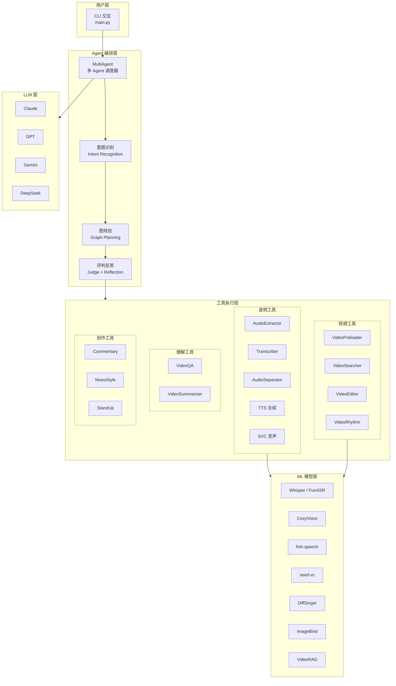

### 2.3 核心执行流程

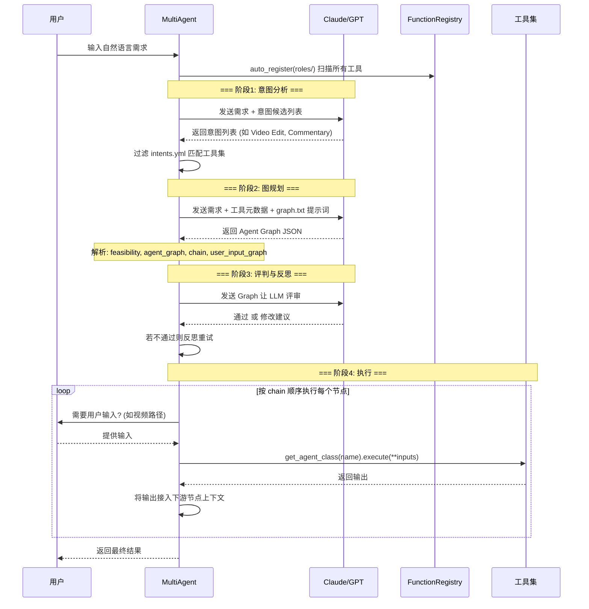

### 2.4 模块设计

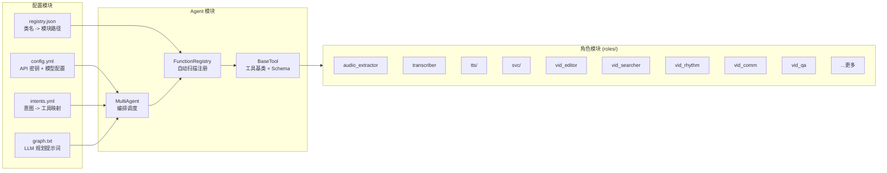

### 2.5 关键设计特点

| 设计点 | 实现方式 |
|--------|---------|
| **动态工具发现** | `FunctionRegistry.auto_register()` 自动扫描 `roles/` 目录 |
| **Schema 驱动** | 每个 `BaseTool` 定义 Pydantic `InputSchema`/`OutputSchema` |
| **LLM 规划** | Claude 生成 JSON Agent Graph（节点+边+用户输入图） |
| **自反思** | Judge 阶段验证规划可行性，失败则反思重试 |
| **动态加载** | `registry.json` + `importlib` 按需加载工具模块 |
| **意图分层** | `intents.yml` 将高级意图映射到有序工具链 |

---

## 3. VibeVoice — 前沿语音 AI 模型

### 3.1 项目概述

VibeVoice 是 Microsoft 开发的**开源语音 AI 模型系列**，包含三条产品线：

| 模型 | 规模 | 功能 | 特点 |
|------|------|------|------|
| **VibeVoice-TTS** | 1.5B | 长文本多说话人 TTS | ~90分钟，≤4说话人，64K 上下文 |
| **VibeVoice-ASR** | 7B | 语音识别+说话人分离+时间戳 | ≤60分钟，50+语言 |
| **VibeVoice-Realtime** | 0.5B | 实时流式 TTS | ~200ms 首音延迟，单说话人 |

> 注意：TTS 生成代码因滥用问题已从仓库移除，仅保留权重和文档。

### 3.2 模型架构

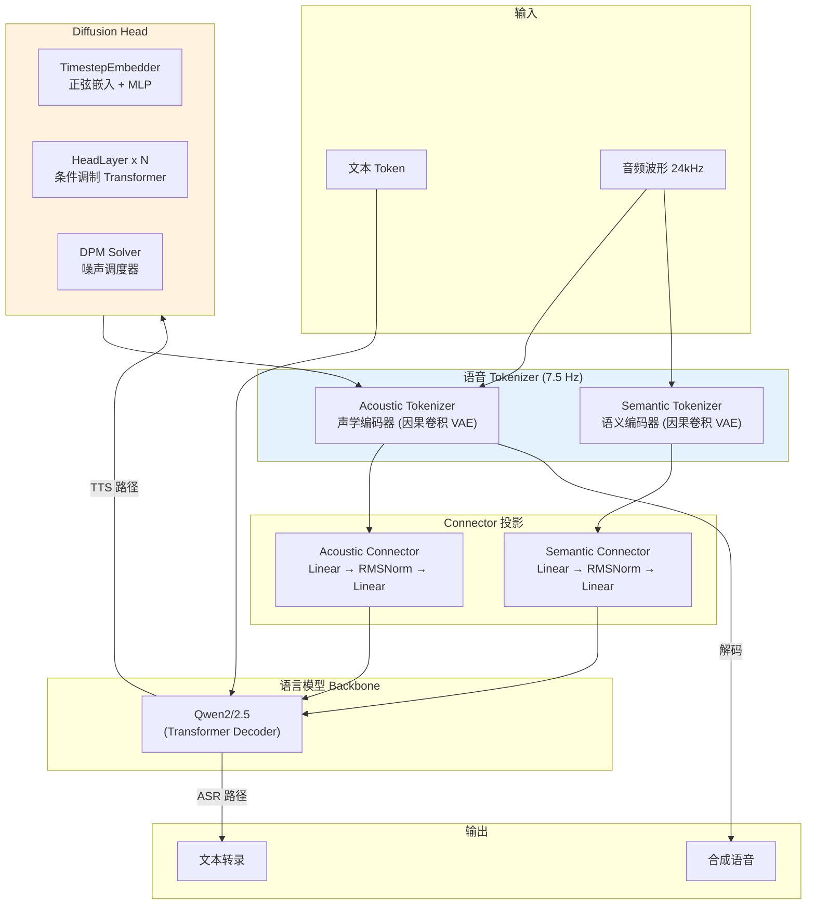

### 3.3 三条产品线的架构差异

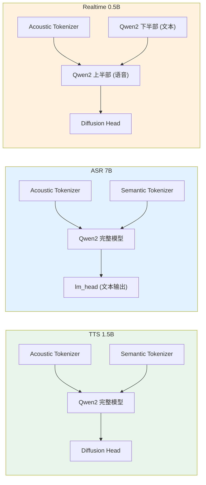

**关键差异**：

| 对比维度 | TTS | ASR | Realtime |
|---------|-----|-----|---------|
| 语音 Tokenizer | 声学 + 语义 | 声学 + 语义 | 仅声学 |
| Backbone | 完整 Qwen2 | 完整 Qwen2 | 分裂 Qwen2（上下两段） |
| 输出头 | Diffusion Head | lm_head（文本） | Diffusion Head |
| 上下文长度 | 64K | 32K | 8K |
| 流式支持 | 否 | 否 | 是（窗口式） |

### 3.4 TTS Pipeline 流程

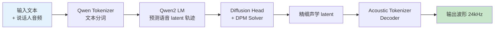

### 3.5 ASR Pipeline 流程

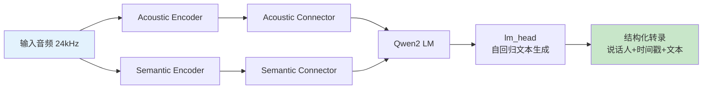

### 3.6 核心模块设计

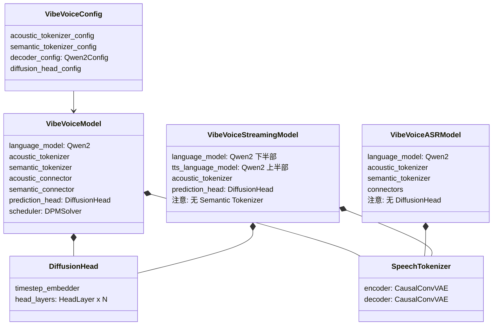

### 3.7 vLLM 推理插件

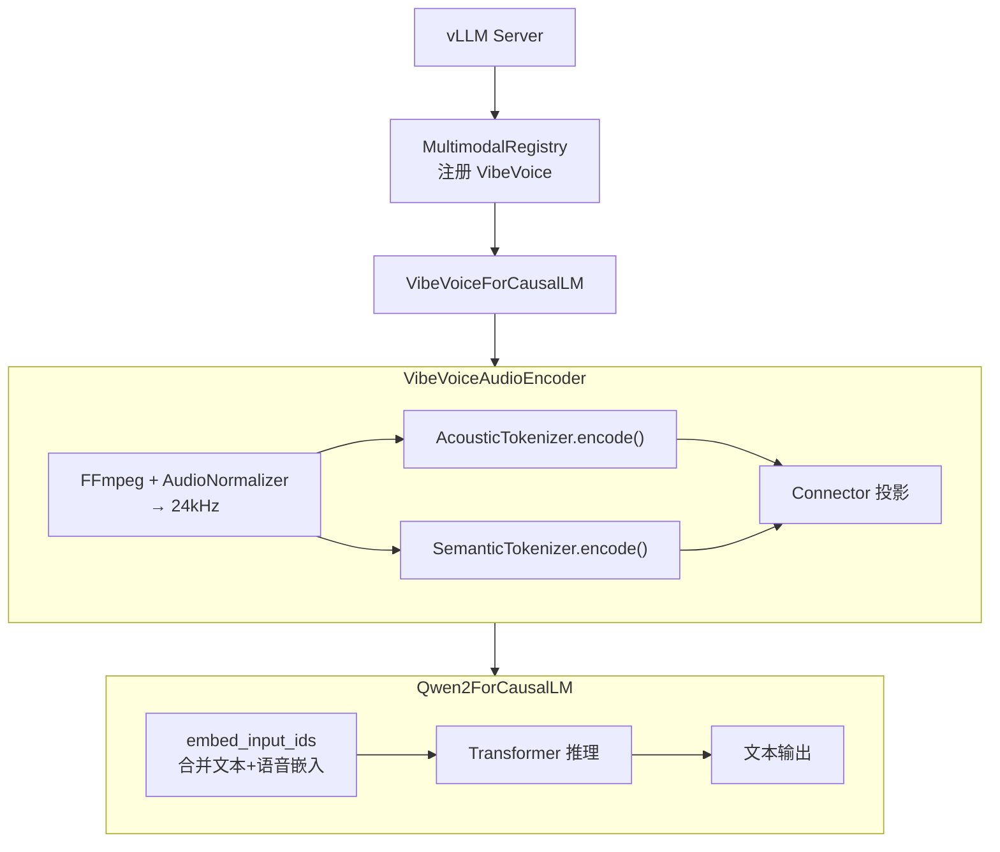

---

## 4. Pixelle-Video — AI 短视频生成引擎

### 4.1 项目概述

Pixelle-Video 是一个 **AI 短视频自动化生成引擎**：用户提供主题或脚本，系统自动完成：
- **文案生成**（LLM 分段旁白）
- **图像/视频生成**（ComfyUI 工作流）
- **TTS 语音合成**（Edge-TTS / ComfyUI TTS）
- **HTML 模板渲染**（Playwright）
- **视频拼接+BGM 混合**（ffmpeg/MoviePy）

### 4.2 分层架构

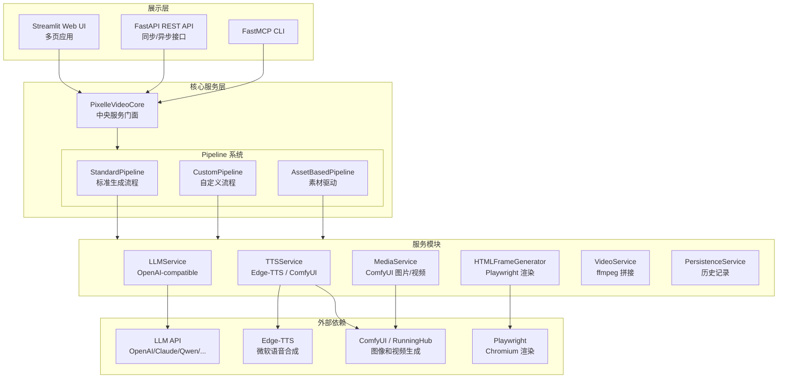

### 4.3 标准 Pipeline 流程

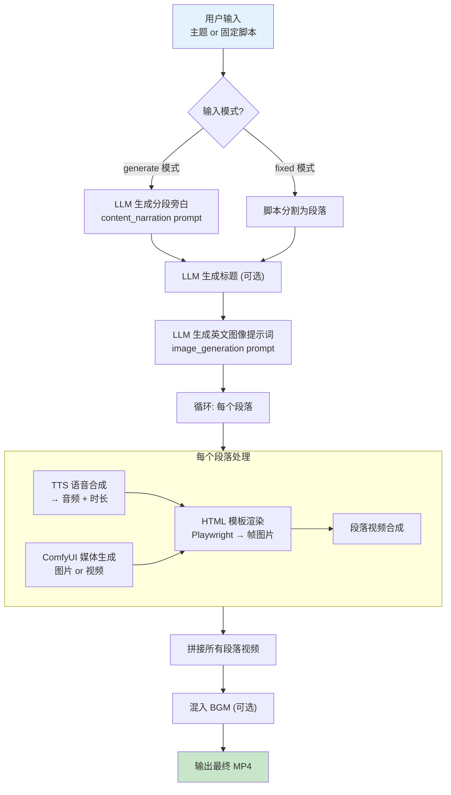

### 4.4 API 设计

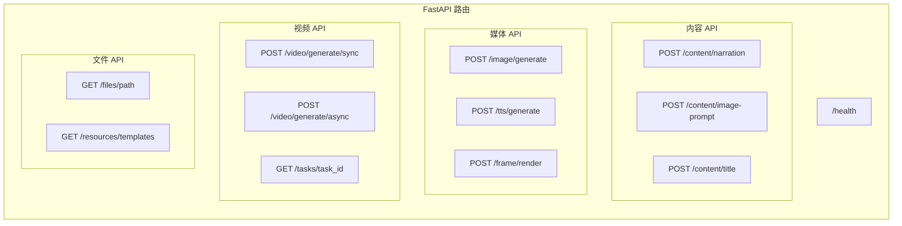

### 4.5 模板系统

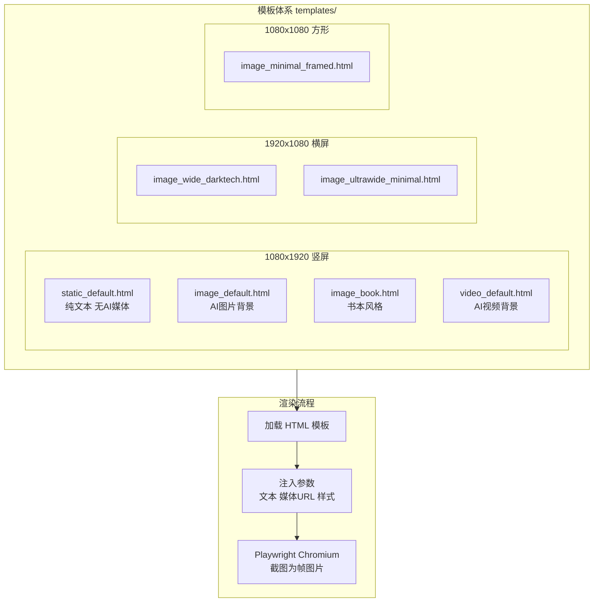

### 4.6 配置系统

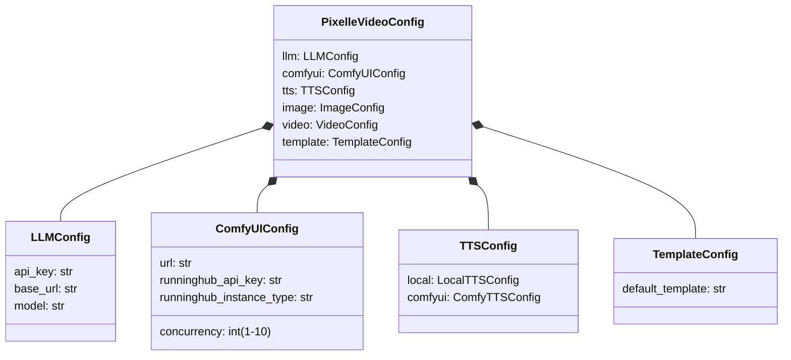

---

## 5. 三项目架构对比图

### 5.1 架构风格对比

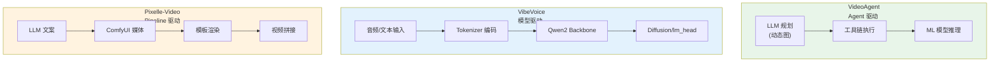

### 5.2 技术栈对比

| 维度 | VideoAgent | VibeVoice | Pixelle-Video |
|------|-----------|-----------|---------------|
| **入口** | CLI (`main.py`) | Python API / vLLM Server | Web UI + REST API + CLI |
| **LLM 用途** | 意图分析 + 图规划 + 反思 | 作为模型 backbone | 文案 + 图像提示词生成 |
| **媒体处理** | MoviePy + ffmpeg + 自有工具链 | PyTorch 模型推理 | ComfyUI 工作流 |
| **语音** | CosyVoice / fish-speech / DiffSinger / seed-vc | 自有 TTS/ASR 模型 | Edge-TTS / ComfyUI TTS |
| **视频理解** | VideoRAG + ImageBind + Gemini | 不涉及 | 不涉及 |
| **部署** | 本地 CLI | vLLM / Transformers / Gradio | Docker / Streamlit / FastAPI |
| **配置** | YAML (`config.yml`) | JSON (`configs/`) | YAML (`config.yaml`) |
| **并发** | 串行执行 chain | vLLM 批量推理 | AsyncIO + TaskManager |

### 5.3 数据流对比

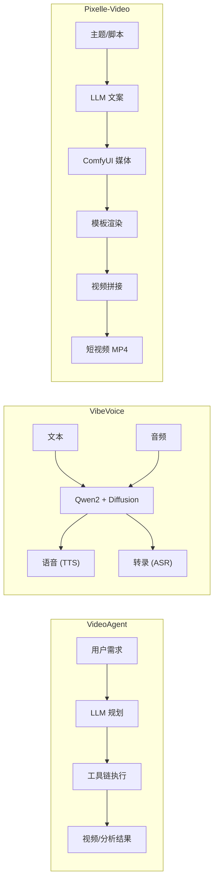

### 5.4 适用场景

| 场景 | 推荐项目 | 原因 |
|------|---------|------|
| 视频内容理解和问答 | VideoAgent | 支持 VideoRAG + MLLM QA |
| 视频智能剪辑（节奏/解说） | VideoAgent | 多工具链编排 |
| 高质量语音合成 | VibeVoice | 专业级 TTS 模型 |
| 语音识别+说话人分离 | VibeVoice | 支持 50+ 语言 + 时间戳 |
| 批量短视频生产 | Pixelle-Video | 模板化 Pipeline + 并发 |
| 图文类短视频（解说/科普） | Pixelle-Video | HTML 模板 + TTS + 自动化 |
| 实时对话语音 | VibeVoice Realtime | 200ms 延迟流式 TTS |
