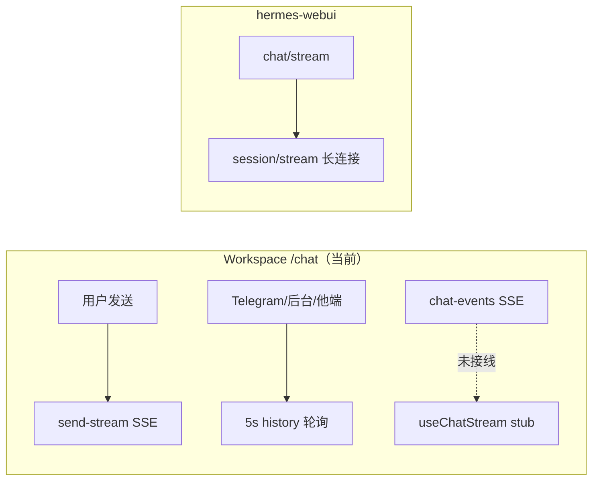

# Workspace Chat 为何感觉慢？与 WebUI 怎么选

> **核对日期**: 2026-07-22  
> **Surface 架构**: [SURFACE_ARCHITECTURE.md](SURFACE_ARCHITECTURE.md)  
> **结论**: **纯聊天体验** 优先 **hermes-webui** 或 **ui-tui**；**Workspace** 适合多面板编排（Swarm、文件、Conductor、Content Studio），主 Chat 页被动更新偏慢是 **已知架构缺口**，不是 Gateway 本身慢。

---

## 1. 一句话对比

| 产品 | 路径 | 定位 | 聊天实时性 |
|------|------|------|------------|
| **hermes-webui** | `hermes-dev/hermes-webui` | 专注 Web/手机聊天 | ⭐⭐⭐⭐⭐ |
| **ui-tui** | `hermes-agent/ui-tui` | 终端交互 | ⭐⭐⭐⭐⭐ |
| **Hermes Dashboard** | `:9119` `hermes dashboard` | Kanban / 技能 / 内嵌 TUI | ⭐⭐⭐⭐（PTY 不同 UX） |
| **Hermes Workspace** | `:3000` `/chat` | 全栈编排壳 | ⭐⭐⭐ 自己发送 OK；**旁观/跨渠道慢** |

Atlas 社区数据（2026-05）：**nesquena/hermes-webui ~15.2k★** vs **outsourc-e/hermes-workspace ~5.9k★** — WebUI 在「聊天入口」心智上更占优；Workspace 仍是官方多能力工作台，但 Chat 不是其最强项。

---

## 2. Workspace `/chat` 慢的根本原因

### 2.1 自己发消息（通常还行）

```text
浏览器 POST /api/send-stream
  → Workspace Node 代理
  → Gateway POST /api/sessions/{id}/chat/stream
  → SSE 回传 → useStreamingMessage → chat-store
```

主动发送走 **真 SSE**；但 UI 还有 rAF 文本平滑、50ms 逐字揭示，观感略慢于原始 token。

### 2.2 被动更新（慢的主因）

| 机制 | 现状 |
|------|------|
| `useChatStream` | **空实现 stub**（历史遗留，未接 `/api/chat-events`） |
| 历史同步 | React Query `GET /api/history` **每 5s** 轮询 |
| `connectionState` | store 默认 `disconnected` 且 **从未更新** → 无法降到 30s 备份间隔 |
| 工具卡片 | `send-stream` 内 **800ms** 轮询 session messages（上游无 live `tool.*` SSE） |
| 等待态兜底 | 5s history refetch、5s active-run poll |

**关键文件**：

- `hermes-workspace/src/hooks/use-chat-stream.ts` — stub
- `hermes-workspace/src/screens/chat/hooks/use-realtime-chat-history.ts` — 注释写「SSE 为主」，实际只靠轮询
- `hermes-workspace/src/screens/chat/chat-screen.tsx` — `historyRefetchInterval: 5_000`
- `hermes-workspace/src/routes/api/chat-events.ts` — **已实现**，但 Gateway 子面板用，**主 Chat 未订阅**

### 2.3 架构示意



---

## 3. hermes-webui 为什么更「跟手」

- 每轮 `EventSource('api/chat/stream?stream_id=…')`
- 会话级 `/api/session/stream` 收跨轮事件
- 实现见 `hermes-webui/api/streaming.py`、`static/messages.js`
- 文档：`hermes-dev/hermes-webui/ARCHITECTURE.md`

---

## 4. 选型建议

| 你的目标 | 推荐 |
|----------|------|
| 日常聊天、手机浏览器 | **hermes-webui** |
| 最低延迟、键盘党 | **`hermes chat` / ui-tui** |
| Kanban、定时任务、技能管理 | **Dashboard `:9119`** |
| Content Studio、Swarm、文件树、Conductor | **Workspace `:3000`**（接受 Chat 5s 级被动延迟） |
| API / 自动化 | **Gateway `:8642`** 直连 `chat/stream` |

---

## 5. 修复方向（给开发者）

若要让 Workspace Chat 追上 WebUI：

1. 恢复 `useChatStream` → 订阅 `GET /api/chat-events?sessionKey=…`
2. 在连接成功时 `setConnectionState('connected')`，把 history 轮询降到 30s 备份
3. 减少被动场景对 5s `GET /api/history` 的依赖
4. 可选：工具进度改消费 Gateway 事件而非 800ms DB 轮询

**Inventory**: `hermes-workspace/FEATURES-INVENTORY.md` §1.1、§5.2

---

## 6. 本地端口（Content Studio 栈）

见 `hermes-dev/PORTS.md`：Gateway `8642`、Dashboard `9119`、Workspace `3000`。
