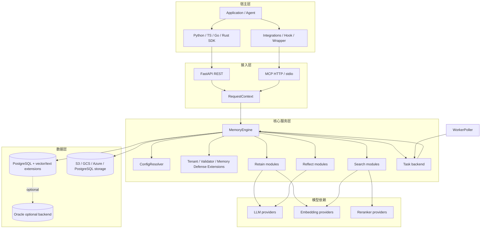

# Hindsight 架构导读（源码级完整版）

> **适用对象**：需要理解 Hindsight 设计、接入 Hindsight、评审生产架构，或准备修改源码的工程师。  
> **源码基线**：`../hindsight`，提交 `fb11ddfea`（2026-10-08）。  
> **官方文档**：https://hindsight.vectorize.io 负责 API、安装和配置的用户契约；本文负责源码结构和运行机制。

## 目录

1. [定位与边界](#1-定位与边界)
2. [核心心智模型](#2-核心心智模型)
3. [整体运行时架构](#3-整体运行时架构)
4. [三条核心管线](#4-三条核心管线)
5. [Retain：从输入到事实](#5-retain从输入到事实)
6. [Recall：从问题到证据](#6-recall从问题到证据)
7. [Reflect：从证据到回答](#7-reflect从证据到回答)
8. [Consolidation 与知识层](#8-consolidation-与知识层)
9. [异步任务与 Worker](#9-异步任务与-worker)
10. [数据模型和持久化](#10-数据模型和持久化)
11. [配置、租户和安全](#11-配置租户和安全)
12. [部署、容量和故障模式](#12-部署容量和故障模式)
13. [扩展与集成](#13-扩展与集成)
14. [源码阅读和修改方法](#14-源码阅读和修改方法)
15. [架构评价与适用边界](#15-架构评价与适用边界)

---

## 1. 定位与边界

### 1.1 Hindsight 解决什么问题

Hindsight 的目标不是保存完整聊天记录，而是让 Agent 能在多次交互后**学习、检索、修正和使用长期知识**。一个输入可能同时产生：

- 原始 document/chunk，用于溯源；
- 原子事实，用于精确检索；
- 实体和实体关联，用于多跳查询；
- 向量和全文搜索字段，用于不同查询形态；
- 后台 observation，用于低成本复用；
- mental model 或 knowledge page，用于可策展知识。

它把记忆当作一个独立服务层，而不是把一段 summary 直接塞回宿主 Agent 的 prompt。

### 1.2 Hindsight 不负责什么

| 不负责 | 由谁负责 |
|---|---|
| Agent 主循环、工具执行、任务计划 | 宿主 Agent / 框架 |
| 业务数据的最终权威性 | 业务系统和调用方 |
| 让所有事实天然正确 | 输入策略、抽取模型、来源、人工治理 |
| 跨所有 Bank 的默认全局查询 | 调用方编排或显式配置 |
| 为任意数据库自动提供高可用 | 部署者的 PostgreSQL/Oracle、备份和基础设施 |
| 解决所有 prompt injection | Memory Defense + 宿主安全策略 + 工具权限 |

### 1.3 与三类相邻方案的区别

| 方案 | 保存粒度 | 取回方式 | 是否有派生知识 | 典型缺点 |
|---|---|---|---|---|
| 聊天历史 | message | 最近窗口 | summary | 长期、跨会话和多跳能力弱 |
| 传统 RAG | document chunk | 向量 top-k | 通常没有 | 专名、时间和关系查询容易漏召回 |
| 知识图谱 | entity/triple | graph query | 依 pipeline | 文本上下文和自然语言综合成本高 |
| Hindsight | source + fact + entity + observation | semantic + keyword + graph + temporal + rerank | consolidation、mental model | 存储、LLM 和维护复杂度更高 |

Hindsight 并不是完全替代前三者：它内部仍使用文档、向量和图，而是将这些策略组合为一个面向 Agent 记忆的产品抽象。

---

## 2. 核心心智模型

### 2.1 Bank：最小隔离单元

Bank 可以代表一个用户、一个 Agent 实例、一个项目、一个工作区或其他共享信任边界。它不是进程，也不是数据库；它是所有核心操作的必填逻辑范围。

```text
Deployment
  ├─ Tenant A
  │   ├─ Bank: user-123
  │   └─ Bank: project-x
  └─ Tenant B
      └─ Bank: user-456
```

Bank 影响：

- facts/documents/entities/links 的可见范围；
- disposition、background/mission 和 bank-level config；
- mental models、directives、knowledge base；
- operation、audit 和 webhook 的归属；
- consolidation 与 freshness 的统计。

### 2.2 四种记忆层

```text
source layer       documents / chunks / attachments
fact layer         world / experience / opinion memory_units
consolidated layer observation + observation_history
curated layer      mental_models + knowledge_pages + directives
```

**证据优先级不是绝对真理排序**：mental model 适合快速读取，observation 适合跨事实概括，raw fact 适合溯源；Reflect 应根据问题和来源质量继续取证，而不是盲信最高层摘要。

### 2.3 Retain、Recall、Reflect 的契约

| 操作 | 语义 | 是否主要读 DB | 是否调用 LLM | 是否适合在线请求 |
|---|---|---:|---:|---:|
| retain | 学习/摄取 | 写 + 读实体/去重 | 是（抽取） | 小批量适合，大文档推荐异步 |
| recall | 检索证据 | 是 | query/embedding/rerank 可能调用 | 适合在线 |
| reflect | 基于记忆回答 | 是 | 是，多轮工具调用 | 适合在线，但必须设预算 |
| consolidate | 事实巩固 | 是 | 是 | 推荐 Worker |

### 2.4 事实类型

- **world**：关于外部世界、用户、他人、组织或事件的事实；
- **experience**：Bank 所代表的 Agent 自己做过的事情或经历；
- **opinion**：带置信度的观点/判断；
- **observation**：由事实集合巩固而成的派生知识。

分类依赖 Bank 的“说话者/主体”语义和 retain context；仅看第一人称代词会误分类。

---

## 3. 整体运行时架构

### 3.1 组件图



### 3.2 同步请求和后台任务的分工

同步路径只应承担调用者需要立即知道的部分：输入校验、权限、必要的抽取/检索/回答和最小持久化。consolidation、图维护、向量维护、mental model refresh、导入导出和 webhook 由 operation + Worker 完成。

这带来一个关键语义：**retain 成功不代表所有派生索引已经完成**。调用方需要关注返回的 operation、freshness 和失败状态。

### 3.3 API 入口

核心 REST 资源包括：

- `/banks`：Bank 创建、更新、删除、alias、profile、config、stats；
- `/banks/{bank_id}/memories`：retain、list、get、update、delete、dry-run extraction、recall；
- `/banks/{bank_id}/reflect`：反思回答；
- `/documents`、`/chunks`、`/attachments`：来源与文件；
- `/entities`、`/graph`：实体和图；
- `/observations`、`/mental-models`、`/knowledge-base`、`/directives`：高层知识；
- `/operations`：异步状态、cancel、retry、delete；
- `/transfer`、`/export`、`/import`、`/webhooks`、`/audit-logs`：运维和治理。

完整路由实现位于 `hindsight-api-slim/hindsight_api/api/http.py`，不应把这份源码路由表当作永远不变的稳定 API 清单；客户端契约以 OpenAPI 和官方文档为准。

---

## 4. 三条核心管线

### 4.1 Pipeline A：Retain

```text
content / file / attachment
  → canonicalize & validate
  → Memory Defense block/redact
  → document + chunk
  → LLM fact extraction
  → fact type / time / context
  → entity extraction + resolution
  → embeddings
  → memory_units + links + unit_entities
  → async consolidation / graph / vector maintenance
```

### 4.2 Pipeline B：Recall

```text
query
  → query analyzer（entities / dates / tags）
  → semantic + keyword + graph + temporal retrieval
  → RRF / interleave fusion
  → cross-encoder / fallback
  → recency + temporal + proof boosts
  → min-score / fact-type / tag filters
  → token budget + response
```

### 4.3 Pipeline C：Reflect

```text
question + optional context
  → reflect agent
  → search/read mental models
  → search/read observations
  → recall raw facts
  → expand entities/chunks/links
  → verify source IDs
  → done(answer, citations, structured output)
```

Reflect 不是 Recall 的“更大 top-k”；它拥有自己的工具 schema、循环上限、失败语义和 disposition/directive 注入。

---

## 5. Retain：从输入到事实

### 5.1 输入形态

Retain 可处理文本、批量内容、结构化 content blocks、文档和多模态 attachment。`retain/attachment_content.py` 与 `attachment_store.py` 负责规范化和存储；不能假设所有输入最终都是字符串。

每条 item 可携带：

- `content`；
- `context`（说话者、场景、Agent 身份）；
- `event_date` / occurred range；
- `document_id`；
- metadata、tags；
- image/file attachment。

### 5.2 Chunking

Chunking 同时受 token 上限、LLM 提示结构、附件归属和抽取质量影响。chunk 是抽取和溯源边界，不是最终记忆粒度：一个 chunk 可产生多条 facts，一条 fact 也应保留其来源 chunk。

### 5.3 Fact extraction

`fact_extraction.py` 使用配置的 retain LLM 产生结构化 facts，至少要处理：

- 文本中的事实边界；
- world / experience 类型；
- 事件时间与时间范围；
- 相关实体；
- 来源 chunk 和附件；
- 过度泛化、重复和无事实内容。

严格 structured output、provider retry、语言覆盖和 token budget 都是配置项。dry-run extraction 允许在不写入的情况下观察 chunk 和候选 facts，适合调试和评估。

### 5.4 Entity 与 Link

事实写入前后会解析实体 canonical name，关联 `unit_entities`，并创建/维护 `memory_links`。实体解析解决检索召回和图扩展的入口问题，但不替代事实本身；回答仍应能够回到 fact/document/chunk。

### 5.5 Embedding 与持久化

写入的事实通常需要 embedding；query recall 也需要 query embedding。Embedding provider、维度、batch、并发和输入长度必须一致。持久化阶段要考虑：

- 重试或客户端重放造成的重复；
- document/content hash；
- operation replay metadata；
- 部分事实成功、部分事实失败；
- provider 失败后是否可恢复。

### 5.6 Retain 的重要取舍

| 选择 | 好处 | 成本/风险 |
|---|---|---|
| 写入即抽事实 | 读取更轻、结构更稳定 | 写入有 LLM 延迟和成本 |
| 只保存原文 | 简单、便宜 | 每次 recall/reflect 需重复理解 |
| 异步 consolidation | 不阻塞用户请求 | freshness 有延迟 |
| 保存来源和历史 | 可解释、可修正 | 表和维护复杂 |

---

## 6. Recall：从问题到证据

### 6.1 Query analysis

`query_analyzer.py` 和 `temporal_extraction.py` 将自然语言查询拆成：

- 语义表达；
- 关键词/专名；
- 实体线索；
- 时间表达、问题日期和时间窗口；
- fact type、tags 等过滤。

时间不是仅用于排序，也可能改变候选集合。`question_date` 对“最近”“去年”等相对表达尤其重要。

### 6.2 四路检索

| 检索臂 | 数据/实现 | 适合 |
|---|---|---|
| Semantic | embedding + vector index | 同义改写、概念相似 |
| Keyword | BM25/full text | 专名、版本号、API、精确术语 |
| Graph | entity/link expansion | 多跳关系、相关实体 |
| Temporal | event/occurred/mentioned dates | 过去、期间、最近发生 |

四路结果可以有不同 top-k、过滤和失败策略。一个结果只需在某一路出现也可能进入最终候选。

### 6.3 Fusion

默认核心思路是 Reciprocal Rank Fusion（RRF）：不同臂的 rank 转换成可比较的贡献，再去重合并。对于 consolidation/dedup 等需要保证各臂头部都进入候选的场景，也存在 interleave 策略。

融合的优点是无需让 semantic、BM25、graph、temporal 的原始分数同尺度；缺点是 rank-based 分数会损失原始置信度，因此后续还需要 rerank 和业务 boost。

### 6.4 Rerank 与最终分数

Cross-encoder 或外部 reranker 对候选和 query 做相关性判断。最终排序可能组合：

- reranker score；
- RRF/interleave rank；
- recency；
- temporal proximity；
- proof count；
- fact type、tag、时间硬过滤。

reranker 超时/不可用时，配置可以 fallback 到 RRF 或 interleave，使 recall fail open；生产必须同时监控质量和降级率。

### 6.5 Recall 返回什么

Recall 结果不仅是 `text`：还可包含 fact type、event dates、document/chunk、tags、entity、attachment、每个检索臂的分数、RRF rank、reranker 和最终分数。`include_chunks`、`include_entities` 和 token budgets 控制响应大小。

### 6.6 与传统 RAG 的差异

传统 RAG 往往是：query embedding → vector top-k → 拼 prompt。Hindsight recall 是：query parse → four arms → fusion → rerank → temporal/proof/recency scoring → token budget。它的实现成本更高，但专名、关系、时间和可解释性更完整。

---

## 7. Reflect：从证据到回答

### 7.1 工具驱动循环

`engine/reflect/agent.py` 使用 native tool calling。Reflect agent 不预先把全部 mental models 放入 prompt，而是按需搜索和读取，以控制初始上下文大小。

典型循环：

1. 解析问题、mission/background、disposition、directives；
2. 搜索相关 mental models；
3. 读取候选页面；
4. 搜索 observations；
5. raw recall 取得 facts；
6. expand 事实的实体、相邻事实、chunks 和来源；
7. 对证据冲突做判断；
8. 调用 `done`，返回回答和经过验证的引用。

### 7.2 为什么需要 Reflect

Recall 解决“哪些 facts 相关”，但不能自然完成：

- 跨多条事实的综合；
- 新旧事实冲突；
- 对话语气和 disposition；
- 结构化 response schema；
- 继续取证或停止的决策。

Reflect 将这些决策显式建模为工具调用循环，同时通过 max iterations、wall timeout、max context tokens 和 max output tokens 控制成本。

### 7.3 Disposition 与 Directives

Disposition 通常有 skepticism、literalism、empathy 三类 1–5 特质。它主要改变 reflect 的解释和回答方式，不应改变 recall 的事实排序。

Directives 是显式行为规则；它们与 facts 分离，避免“规则”被当作“用户事实”。反思时必须按可见 scope 装载 directives。

### 7.4 失败语义

Reflect 不应把以下情况伪装成正常回答：

- provider 没有产生可解析 tool call；
- recall/expand 工具抛出基础设施错误；
- agent 循环耗尽但没有 done；
- response schema 无法满足。

`ReflectNoAnswerError`、`ReflectToolCallError` 和 `ReflectToolExecutionError` 明确区分这些情况，mental model refresh 也不应在失败时覆盖旧页面。

### 7.5 Reflect 与引用

回答引用必须来自实际工具返回的 memory/source IDs。Mental model 和 observation 是可读的派生层，但回答需要能回到 raw facts，避免引用不存在、引用未检索内容或把 prompt 中的外部文本当成 Bank 证据。

---

## 8. Consolidation 与知识层

### 8.1 Consolidation

Retain 之后 Worker 选择需要巩固的 world/experience facts，读取已有 observations 和来源，调用 consolidation LLM 进行：

- 合并相同或近似知识；
- 更新陈旧 observation；
- 处理新事实对旧结论的反驳；
- 细化规律、偏好和关系；
- 记录来源与历史。

Consolidation 不是简单按时间做 summary，而是一个需要去重、冲突和 provenance 的派生写入流程。

### 8.2 Freshness 与失败恢复

Bank freshness 至少需要区分：

- 最近一次 memory write；
- pending consolidation 数；
- 最近一次 consolidation；
- mental model 是否落后于 source watermark；
- graph/vector maintenance 是否完成。

失败时保留原始 facts；已有 observation/mental model 不应被错误的空答案或错误状态覆盖。失败 operation 应可观察、可重试、可人工处理。

### 8.3 Mental Models

Mental model 是一个可配置的知识页面，通常绑定 query/trigger/fact types/tags 等配置。Refresh 会排除正在生成的页面，防止页面把旧内容当作自己的新证据；保存成功后更新 watermark 和 history。

### 8.4 Knowledge Base

Knowledge base 将页面、文件夹和节点组织成主题树，适合控制面或用户策展。它是面向阅读/管理的上层，不取代 raw fact store，也不应丢失 source IDs、历史和 Bank scope。

---

## 9. 异步任务与 Worker

### 9.1 Task backend

操作先写入 `async_operations`，再由 `WorkerPoller` claim。Worker 负责：

- 事务性认领和租约；
- stage/progress；
- retry_count 和退避；
- stuck task 监控；
- 取消与终态写入；
- parent/child operation 聚合；
- 错误信息和 result metadata；
- webhook delivery。

### 9.2 典型任务

- batch retain；
- file/document retain；
- consolidation；
- graph maintenance；
- vector index maintenance；
- mental model refresh；
- bank/document export、import、clone；
- webhook delivery。

### 9.3 为什么使用数据库队列

数据库队列让 operation 状态、业务数据和结果元数据保持一致，部署上不必强依赖独立消息中间件；代价是 Worker claim、锁、批量任务、清理和数据库负载都需要认真设计。高吞吐场景仍需评估 PostgreSQL queue contention 和外部 provider 限流。

### 9.4 父子任务语义

批量任务可拆成 child operations。父操作只有在所有 child 完成、失败或取消后才进入终态；失败优先于取消，并聚合最有代表性的错误消息。这样客户端不必逐个理解子任务，但运维仍能追踪具体失败项。

---

## 10. 数据模型和持久化

核心关系见 [DATA_MODEL.md](./DATA_MODEL.md)。简化为：

```text
Bank
 ├─ Documents ─ Chunks ─ MemoryUnits
 ├─ MemoryUnits ─ UnitEntities ─ Entities
 ├─ MemoryUnits ─ MemoryLinks ─ MemoryUnits
 ├─ Observations ─ Sources / History
 ├─ MentalModels ─ History / Refresh state
 ├─ KnowledgePages / Directives
 └─ AsyncOperations / Webhooks / AuditLogs
```

### 10.1 PostgreSQL 能力

当前 slim API 的主要持久化是 PostgreSQL，依赖的扩展/后端可包括：

- pgvector；
- pgvectorscale/pg_diskann、vchord、ScaNN 等向量索引选项；
- native full text、vchord BM25、pg_textsearch、pgroonga、pg_search 等文本检索选项；
- trigram/entity indexes；
- schema 级租户隔离。

扩展选择会影响 migration、DDL、索引维护、召回分数和运维方式，不能只修改一个环境变量而不验证 migration 和查询实现。

### 10.2 迁移与后端抽象

Alembic migrations 是 schema 的历史真相；`engine/schema.py`、`engine/db/`、`engine/sql/` 和 `engine/memories/` 把数据库访问分层。Memory store 自己拥有 memory/document/chunk/entity 等表，普通模块不得绕过 store 直接拼这些表名。

### 10.3 一致性边界

- source 和 fact 的写入可属于一次 retain operation；
- embedding、link、graph index、observation 是不同阶段；
- read replica 会引入可见性延迟；
- operation 状态是可观测事实，但不能替代对 memory/freshness 的检查；
- transfer 需要处理 ID、source、history 和 attachment 的关联。

---

## 11. 配置、租户和安全

### 11.1 配置层级

```text
environment / static deployment config
  → tenant config
  → bank config
  → request options
  → resolved operation config
```

不可变的部署配置包括 database URL、端口、worker 等；可配置项可能覆盖 LLM、retain chunk、recall budget、reflect defaults 等。`ConfigResolver` 负责合并，不能在业务模块中各自实现一套优先级。

### 11.2 认证和授权

HTTP/MCP transport 构造 `RequestContext`，TenantExtension 做身份到租户/schema 的映射，MemoryEngine 在 Bank 和 operation 层执行权限检查。MCP 已认证或内部 Worker 请求可以使用对应标记跳过重复认证，但不能绕过 Bank/scope 约束。

### 11.3 Tag scope

Tag scope 是 Bank 内部的进一步隔离层，影响读、写、mental model/directive、knowledge node、export 和 Bank-wide 操作。所有新功能必须回答：它如何处理 scoped read、scoped write、delete、async retry 和 background callback。

### 11.4 Memory Defense 与审计

Memory Defense 在 retain 前 block 或 redact 污染、敏感和恶意内容；Audit log/LLM request/operation 记录用于运营和合规，但要避免在日志中输出原文、附件或密钥。安全说明见 [SECURITY.md](./SECURITY.md)。

---

## 12. 部署、容量和故障模式

### 12.1 容量瓶颈

| 瓶颈 | 现象 | 优先调节 |
|---|---|---|
| LLM | retain/reflect/consolidation 排队、429 | per-operation cap、retry、model、batch |
| Embedding | recall/retain 延迟 | batch、并发、输入长度、provider |
| Reranker | recall 尾延迟 | candidate cap、timeout、fallback |
| PostgreSQL | connection wait、慢查询、锁 | pool、index、query、read replica |
| Worker | backlog 增长 | slots、任务拆分、stuck task |
| Object storage | 文件 retain 失败 | timeout、权限、重试、大小限制 |
| Event loop/CPU | API latency 抖动 | worker processes、CPU model、阻塞代码 |

### 12.2 必备监控

- API liveness/readiness；
- DB pool、query latency、migration state；
- LLM/embedding/reranker latency、error、retry、token；
- recall 每个 arm 的耗时和降级率；
- async operation pending/processing/failed/stuck；
- consolidation backlog 和 freshness；
- vector/text index health；
- audit/webhook failure；
- tenant/Bank 级别的异常访问和拒绝。

### 12.3 故障模式

**retain 成功但 recall 不到**：先检查 Bank、scope、fact filters、read replica、embedding、index 和 budget。  
**recall 变慢**：看 query analysis、四个 arm、fusion、rerank 和序列化阶段，不要盲目增加 API workers。  
**consolidation 积压**：先看 provider 429、DB 慢查询和 Worker slot，再扩容。  
**reflect 空答案**：区分空 Bank 和 tool/provider 基础设施错误，不能把后者当作真实无证据。  
**跨租户数据**：按安全事故处理，立即保存 context/schema/Bank/audit 信息并阻断流量。

详细运行手册见 [OPERATIONS.md](./OPERATIONS.md)。

---

## 13. 扩展与集成

### 13.1 接入形态

1. 直接 REST：最透明，适合服务端 Agent；
2. SDK：把 request/response 映射为语言对象；
3. MCP：让支持 MCP 的宿主把 memory 作为工具；
4. LLM wrapper：在每次模型调用前后自动 recall/retain；
5. Hook/integration：对 coding agent、框架和 workflow 提供宿主特定生命周期。

### 13.2 选择建议

| 需求 | 推荐 |
|---|---|
| 需要精细控制 retain/recall 时机 | REST/SDK |
| Agent 已有 MCP 工具循环 | MCP |
| 不能大改现有 LLM 调用 | wrapper |
| 宿主有稳定事件/hook 生命周期 | integration |
| 需要离线/单机开发 | embedded/local MCP |

### 13.3 集成的责任边界

集成层负责把宿主事件映射为 Hindsight 操作：会话开始/结束、用户消息、Agent 输出、工具结果、代码变更等。它不应把所有 prompt、工具密钥和未授权上下文无差别 retain；应定义事件过滤、Bank 命名、tags、失败重试和隐私策略。

仓库内集成位于 `hindsight-integrations/`，本目录 [INTEGRATIONS.md](./INTEGRATIONS.md) 提供分类入口。

---

## 14. 源码阅读和修改方法

### 14.1 建议阅读顺序

1. `hindsight-api-slim/README.md`：运行和能力摘要；
2. `engine/interface.py`：公共 MemoryEngine interface；
3. `engine/memory_engine.py`：初始化、授权、三个核心入口和 operation；
4. `engine/retain/`：写入；
5. `engine/search/` + `engine/memories/pg/recall.py`：读取；
6. `engine/reflect/`：回答；
7. `engine/consolidation/`：巩固；
8. `worker/` + `engine/task_backend.py`：异步；
9. `config.py` + `config_resolver.py`：配置；
10. Alembic 和 system tests：真实契约。

### 14.2 改动前要回答的十个问题

1. 这是 source、fact、derived 还是 presentation 层改动？
2. 同步和异步两条路径是否都覆盖？
3. Bank、tenant、tag scope 是否覆盖？
4. PostgreSQL 和可选 Oracle/backend 是否受影响？
5. read replica、重试、取消和幂等是否安全？
6. operation 失败和父子聚合会怎样？
7. attachment、document、chunk、history 是否保持溯源？
8. recall 分数、trace、response model 是否兼容？
9. LLM/tool/provider 不可用时如何降级？
10. 是否需要 migration、SDK/OpenAPI、control plane、integration 和测试更新？

### 14.3 按目标定位

| 目标 | 首查 |
|---|---|
| 新 API | `api/http.py`、`response_models.py`、OpenAPI tests |
| 改抽取 | `retain/fact_extraction.py`、prompts、structured output |
| 改搜索 | `search/retrieval.py`、`fusion.py`、`reranking.py` |
| 改 Reflect | `reflect/agent.py`、`tools.py`、`tools_schema.py` |
| 改 consolidation | `consolidation/consolidator.py`、`memories/pg/consolidation.py` |
| 新后台任务 | `task_backend.py`、`MemoryEngine.execute_task`、`worker/poller.py` |
| 新 DB 字段 | Alembic + models/store + transfer |
| 多租户 | `extensions/tenant.py`、`RequestContext`、schema helpers |

---

## 15. 架构评价与适用边界

### 15.1 主要优点

- 把事实、原文、实体、图、时间和派生知识放在同一记忆契约下；
- Recall 不是单一向量臂，对专名、时间和多跳查询更稳健；
- Reflect 把分层取证和回答生成分开，支持可验证引用；
- operation/Worker 让巩固和维护不阻塞在线请求；
- HTTP/MCP/SDK/integration 解耦宿主 Agent；
- 配置、tenant extension、tag scope 和 audit 为生产化提供明确插槽。

### 15.2 主要成本

- retain、consolidation、embedding、rerank 多次调用模型，成本和延迟高于裸 RAG；
- 数据库 schema、迁移、索引、队列和历史较复杂；
- 需要维护事实抽取、实体解析、图、时间和多种降级路径；
- observations/mental models 有陈旧和错误传播风险，必须保留来源和刷新策略；
- 多租户和 tag scope 的正确性需要持续测试，不是配置一个 Bank ID 就完成。

### 15.3 适合使用

- 有跨会话、跨文档、时间和多跳记忆需求的 Agent；
- 希望把记忆作为独立服务供多个宿主共享；
- 需要可解释来源、后台巩固、控制面和生产运维；
- 能接受 PostgreSQL、LLM provider 和维护成本。

### 15.4 不一定适合

- 只需要短对话窗口；
- 只有静态文档问答且不需要持续学习；
- 极端低延迟/零外部模型调用场景；
- 不愿维护数据库、索引、Worker 和数据生命周期治理的原型。

---

**相关文档**：[DATA_MODEL.md](./DATA_MODEL.md) · [CODE_MAP.md](./CODE_MAP.md) · [OPERATIONS.md](./OPERATIONS.md) · [SECURITY.md](./SECURITY.md) · [ARCHITECTURE.md](./ARCHITECTURE.md)
