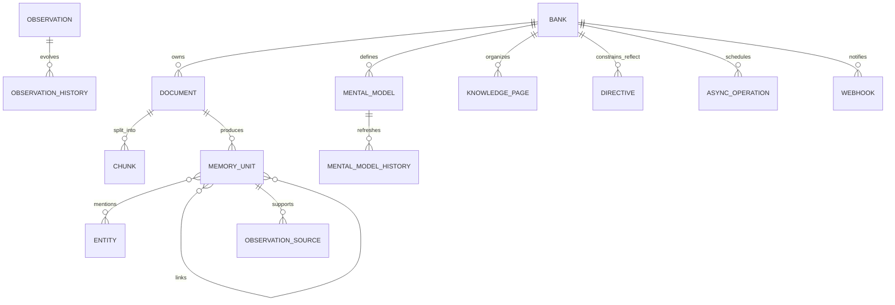

# Hindsight 数据模型与一致性

> 目标：解释“数据存在哪里、为什么拆成这些表、一个事实如何从输入走到回答”。表名来自 `hindsight-api-slim/hindsight_api/models.py`、Alembic 初始迁移和后续迁移；最新版本持续演进，以下以架构关系为主，不把每个迁移字段硬编码成 API 契约。

## 1. 逻辑实体关系

## 2. 核心对象

### 2.1 Bank

`banks` 是逻辑上的记忆空间。它包含名称、背景/mission、disposition 和更新时间等 Bank 级元数据。Bank 级配置由 `config_resolver.py` 解析，最终与全局环境配置、租户配置合并。

**不要把 Bank 等同于用户**：可以按用户、Agent、项目、团队、工作区或业务租户建模；关键是一个 Bank 内的事实应共享信任和检索边界。

### 2.2 Document / Chunk / Attachment

- `documents`：retain 的原始输入及其稳定文档 ID、hash、时间。
- `chunks`：长文本被切分后交给 LLM 抽取和 embedding 的单元；保留 chunk index、内容、hash 等溯源信息。
- `file_storage` / `document_attachments` / `attachments`：文件或图片等多模态内容的存储与关联。附件可以被抽取事实引用，但不应把二进制内容直接塞进 `memory_units`。

Document 是证据源；MemoryUnit 是从证据源抽取出的可检索语义单元。删除 Document 会影响其下游记忆和附件的可见性，具体级联以迁移与操作实现为准。

### 2.3 MemoryUnit

`memory_units` 是 Hindsight 的事实主表。典型字段包括：

| 字段 | 作用 |
|---|---|
| `id` | 事实 ID，回答引用和后续维护的稳定标识 |
| `bank_id` | Bank 隔离键 |
| `document_id` / `chunk_id` | 原始证据位置 |
| `text` | 规范化后的事实文本 |
| `context` | 说话人、场景等抽取上下文 |
| `event_date` | 事件或事实的时间锚点 |
| `occurred_start/end` | 事件区间，支持时间查询 |
| `mentioned_at` | 被提及的时间 |
| `fact_type` | `world`、`experience`、`opinion`、`observation` 等 |
| `metadata` / `tags` | 业务过滤和扩展元数据 |
| `embedding` | 语义检索向量 |
| `search_vector` | 关键词/全文检索结构 |
| `proof_count`、状态/巩固字段 | 证据强度、后台处理状态 |

**类型语义**：

- `world`：关于用户、组织、外部世界的事实。
- `experience`：Bank 所代表的 Agent 自己做过或经历过的事情。
- `opinion`：带置信度的判断/观点，不应被当作无条件客观事实。
- `observation`：由多条事实巩固得到的较高层知识，带来源和历史。

类型由抽取上下文和 Bank 语义确定，不应简单依据文本里是否出现“我”。

### 2.4 Entity / UnitEntity / Cooccurrence

- `entities`：Bank 范围内规范化的实体（人、组织、地点、产品等），维护 canonical name、首次/最近出现时间和 mention count。
- `unit_entities`：事实与实体的多对多关系。
- `entity_cooccurrences`：实体在事实中共同出现的统计，用于图和实体导航。

实体解析解决“同名、别名、大小写、轻微变体”问题。实体图不是独立真相库：其边最终仍需回到事实或事实间的 link 才能解释。

### 2.5 MemoryLink

`memory_links` 表示事实间的有向关系，含 `from_unit_id`、`to_unit_id`、`link_type`、可选 entity 和 weight。它用于：

- 图检索的邻接扩展；
- 通过时间/实体/语义关联补全多跳问题；
- consolidation 和 curation 的上下文扩展；
- 维护事实之间的可追溯关系。

链接创建和图维护是写入后的重要阶段；图故障不应静默伪装成“没有记忆”。

## 3. 高层知识对象

### 3.1 Observations

Observation 是对事实集合的巩固结果，仍以 memory unit 的一种 fact type 或配套历史/来源结构体现。巩固过程会尝试合并、修正、反驳、细化旧 observation；`observation_sources` 记录其依据，`observation_history` 保留演化轨迹。

Observation 的关键性质：

- 不是对每条消息做一次摘要，而是跨事实的可复用知识；
- 可能过期或被新事实推翻，因此有 freshness、source 和历史；
- reflect 优先使用，但原始事实仍是最终可回溯证据；
- consolidation 失败应保留原始 facts，不应以失败结果覆盖现有 observation。

### 3.2 Mental Models

Mental Model 是由用户或系统配置的“知识页/模型”。它通常有一个查询或触发条件，refresh 时重新调用 reflect，从 Bank 的事实/observations 生成结构化或自然语言内容。相关表包括 `mental_models`、`mental_model_history`、版本/刷新状态字段。

与 observation 的差异：

| | Observation | Mental Model |
|---|---|---|
| 产生方式 | 后台按事实巩固 | 配置的页面/查询按需刷新 |
| 作用 | 低成本的中间知识层 | 用户可策展的主题知识层 |
| 更新粒度 | 随新事实 consolidation | 按触发器、手动或异步 refresh |
| 来源 | 多条事实及 observation | 配置 query + 检索/reflect 结果 |

### 3.3 Knowledge Base

Knowledge Base 是文件夹、页面和节点组成的可组织树，适合把 mental models/反思结果按主题策展。它不是另一个底层事实库；页面内容仍应通过 source IDs、query、history 与 Bank 记忆关联。

### 3.4 Directives

Directives 是 reflect 的行为约束或工作规则，可是 Bank 级或 tag scope。它们改变回答如何解释证据、遵循何种策略，而不是把规则伪装成事实。Directives 的可见性和可写性也必须经过 tag scope 检查。

## 4. AsyncOperation 与 Webhook

`async_operations` 持久化后台任务的生命周期：pending、processing、completed、failed、cancelled 等状态，含 retry count、progress、错误和结果元数据。批量任务可以有 parent/child operation，父任务在子任务全部结束后聚合状态和结果。

`webhooks` 与 delivery 记录用于把 consolidation 或 operation 状态通知外部系统。投递失败应有可重试记录，不能用同步 API 请求持有长时间网络调用。

## 5. 索引与搜索字段

Hindsight 的数据库不是“只有一列 vector”：

| 结构 | 目的 |
|---|---|
| vector index | semantic arm；可配置 pgvector、vchord、pgvectorscale、ScaNN 等后端 |
| text search / BM25 | keyword arm；支持 native、vchord、pg_textsearch、pgroonga、pg_search 等选项 |
| date indexes | event/occurred/mentioned 时间过滤和排序 |
| bank/type/tag indexes | Bank 隔离、事实类型、标签过滤 |
| entity trigram / graph indexes | 实体解析、图导航和邻接查询 |
| operation/queue indexes | Worker claim、状态、过期与维护 |

具体 index DDL 由 Alembic migration 决定，部署更换向量或文本扩展时必须执行对应迁移和索引健康检查。

## 6. 写入、删除和历史原则

1. 先写 source，再写 derived memory；任何 derived 记录都应能追溯到 Bank 和来源。
2. 同步 retain 返回成功不等于 consolidation、graph maintenance、vector maintenance 全部完成；这些可能是后台 operation。
3. 删除 memory 需要考虑 link、entity membership、observation source、history 和 mental model freshness。
4. retraction/curation 应优先记录失效或修订关系，而不是破坏审计所需的全部历史。
5. Bank export/import 必须携带足够的 IDs、source、历史和配置，避免只导出文本造成引用断裂。
