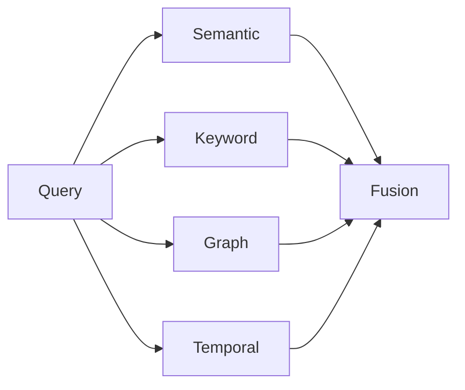
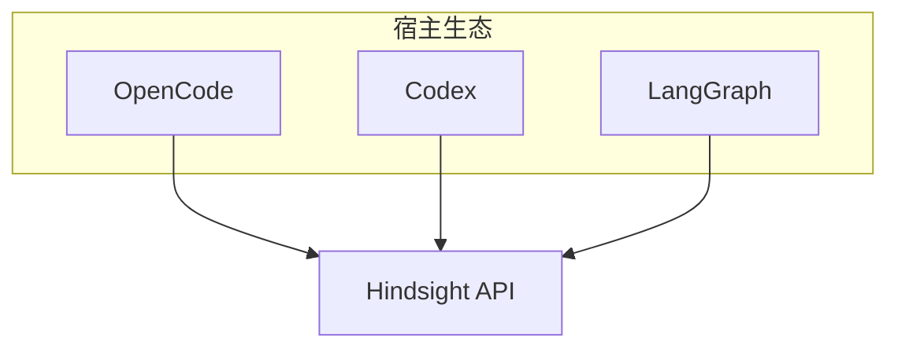

# Hindsight 设计思想导读（九幕）

> **深潜**：[ARCHITECTURE_GUIDE.md](./ARCHITECTURE_GUIDE.md)（图、表、模块、流程）  
> **官方叙事**：[Why Hindsight?](https://hindsight.vectorize.io/)

---

## 第一幕：Agent 缺的不是上下文窗口，是「世界模型」

聊天模型每轮只能看见 **prompt 里的字**。你把历史贴进去，只是在 **重复叙述**，没有在 **结构化**：

- 谁是谁（实体）
- 何时发生（时间）
- 信念如何随证据演变（巩固）

Hindsight 的 retain 不是 `messages.append`，而是 **抽事实 → 挂实体 → 连图**。

```text
对话文本  ──retain──►  facts (world | experience)
                         │
                         ▼
                    entities + links
```

---

## 第二幕：为什么单一向量检索不够

问句类型决定检索器：

| 问句 | 单靠 embedding 的问题 |
|------|------------------------|
| Where does Alice work? | 需要 Google→地点 **图跳** |
| What did she do last spring? | 需要 **时间解析** |
| Who is Dr. Chen? | 需要 **专名 BM25** |

故 recall **固定四路并行**，再 RRF + rerank——这是产品核心，不是可选插件。



---

## 第三幕：三层记忆，越往上越「便宜读」

| 层 | 谁生产 | reflect 怎么用 |
|----|--------|----------------|
| Mental model | 你定义问题，后台刷新 | **先搜**（整页答案） |
| Observation | consolidation 自动 | 其次 |
| Raw fact | retain 自动 | 兜底核实 |

设计意图：**把 LLM 合成挪到后台**，在线路径尽量读「已写好」的层。

---

## 第四幕：reflect 不是 recall 的加长版

- **recall**：检索器 + 排序，给宿主拼 prompt。
- **reflect**：带 disposition 的 **取证 Agent**，必须引用真实 memory id。

Disposition **故意不影响 recall**，避免「检索也被性格扭曲」。

---

## 第五幕：Bank 是信任边界

一 Bank = 一隔离宇宙。多租户、多用户、多 Agent 实例靠 **客户端映射 bank_id**，服务端 **不做跨 Bank JOIN**。

这与「全局向量库混存所有用户 chunk」形成对比——**合规与可删除性**更清晰。

---

## 第六幕：写入贵、读取分层

| 路径 | 成本 |
|------|------|
| retain + 抽事实 | LLM + embedding |
| consolidation | 后台 LLM |
| recall | DB + rerank（可无生成） |
| read mental model | **纯 DB 读** |

高吞吐场景：**API 水平扩 + Worker 扩 consolidation**，而非加大单次 prompt。

---

## 第七幕：服务化而非框架化



Hindsight **不竞争** Agent 循环；它竞争的是「记忆做得准不准、稳不稳」。集成表见 [INTEGRATIONS.md](./INTEGRATIONS.md)。

---

## 第八幕：可观测与可运营

- Control Plane：人看 Bank、图、文档、试 recall
- Worker stage：`retain.facts.llm` 等阶段指标
- LLM trace：排障抽事实失败

面向 **Fortune 500 / 长运行生产**，而非 demo 脚本。

---

## 第九幕：与 RAG、Plan、聊天记忆怎么共存

| 能力 | 建议 |
|------|------|
| 文档库问答 | 仍可 RAG；**会话学到的** 用 Hindsight retain |
| Codex Plan Mode | 计划审批在 Codex；**执行后经验** retain 到 Bank |
| OpenCode plan Agent | 计划 md 在仓库；**跨会话偏好** 进 Hindsight |
| 聊天 summary | 可 retain 摘要文本，但 **不如事实层可检索** |

---

**下一步**：打开 [ARCHITECTURE_GUIDE.md §7–§9](./ARCHITECTURE_GUIDE.md#§7-retain-管线) 对照源码走读。
