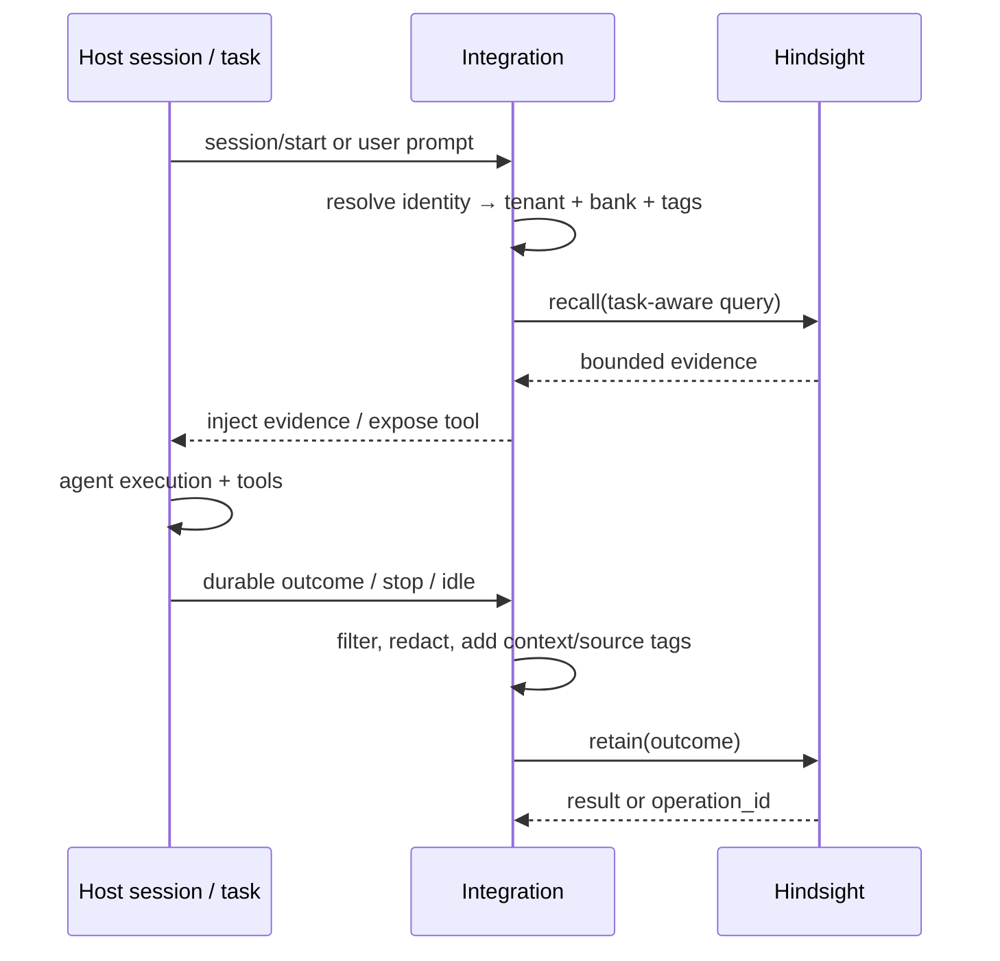

# Hindsight 集成架构与宿主接入指南

> **源码基线**：`../hindsight/hindsight-integrations/`，在 2026-10-08 的本地快照中包含 **55 个**一级集成目录。  
> 该目录增长很快；安装参数、版本、宿主兼容性和发布状态应以每个集成的 `README.md` 与仓库 release 为准。

## 1. 集成不改变什么

Hindsight integration 的职责是把宿主生命周期转换成 Hindsight 的 `retain`、`recall`、`reflect` 调用。它**不应**接管：

- 宿主的 Agent loop、tool permission、计划器或上下文压缩策略；
- 用户/项目到 Bank 的业务授权；
- 敏感信息过滤和数据留存决策；
- Hindsight API、Worker 或数据库的健康管理。

因此，即便使用“自动记忆”集成，生产应用仍需明确 Bank 命名、写入过滤、异常降级和审计方案。

## 2. 五种接入形态

| 形态 | 典型目录 | 注入点 | 优点 | 风险/注意事项 |
|---|---|---|---|---|
| Host hooks | `claude-code`、`codex`、`cursor-cli`、`copilot-cli` | session start、user prompt、stop/session end | 改造少，贴近 CLI 生命周期 | 会话事件不等于长期价值；需过滤 retain |
| 插件/扩展 | `opencode`、`continue`、`roo-code`、`obsidian` | IDE/插件 API、command/tool | 体验自然、可提供 UI | 紧耦合宿主版本和权限模型 |
| MCP + agent rules | `openhands`、`github-copilot`、`devin-desktop` 等 | Agent 工具调用 | 模型可决定何时读写 | 模型可能漏用/滥用工具；必须给清晰规则 |
| Framework callback/adapter | `litellm`、`langgraph`、`crewai`、`pydantic-ai` | 模型调用前后、memory abstraction | 适合应用代码、可组合 | 隐式写入可能保留过多内容 |
| Workflow/no-code | `n8n`、`zapier`、`dify`、`flowise` | workflow step | 易组装自动化 | operation polling、错误处理常被忽略 |

## 3. 通用宿主生命周期



### 推荐的实现原则

1. **读写时机显式化**：session start recall、用户 prompt recall、agent stop retain 都是候选，不是强制规定。
2. **把宿主上下文写清楚**：retain `context` 应说明说话人、会话、工具成功与否、项目/分支等。
3. **分开保存事实和 transcript**：不要无差别 retain 全部 prompt/tool output。
4. **为每种信息添加 tags**：例如 `repo:foo`、`session`、`decision`、`tool-result`、`visibility:team`。
5. **故障可降级**：recall 失败时宿主仍能运行；retain 失败时应记录/重试但不要阻断用户关键操作。
6. **异步操作可追踪**：大文档、批量 retain 等必须保存 operation ID，不要 fire-and-forget。
7. **用户可控**：提供禁用、清理、选择 Bank 或查看记忆的机制，特别是个人和团队混用时。

## 4. 当前目录分类

### 4.1 Coding Agent、CLI 和编辑器

| 集成 | 主要形态 | 工程关注点 |
|---|---|---|
| `claude-code` | hooks/plugin | prompt 与 stop 生命周期、session→Bank |
| `codex` | hooks | 用户输入、停止事件、环境配置 |
| `opencode` | TypeScript plugin | tool、session 注入、idle retain |
| `cursor` / `cursor-cli` | extension / CLI hooks | 版本兼容和 workspace identity |
| `copilot-cli` / `github-copilot` | CLI hooks / MCP | GitHub identity 和 VS Code 规则 |
| `aider` / `cline` / `roo-code` | CLI/IDE adapter | retain 的时机和项目上下文 |
| `continue` | context/provider | prompt context 大小和检索展示 |
| `zed` / `zcode` | editor integration | 编辑器 API 和本地服务发现 |
| `devin-desktop` | MCP/rules | 工具授权、证据引用 |
| `coding-agents` | 通用 skill/package | 多 harness 统一 `metadata.harness` 与适配策略 |

### 4.2 Agent Framework 与模型调用层

| 集成 | 核心连接点 |
|---|---|
| `litellm` | 全局 callback / LLM wrapper |
| `langgraph` | store/memory adapter 或 node 生命周期 |
| `openai-agents` / `claude-agent-sdk` | agent hook、tool 或 dependency 注入 |
| `crewai` / `autogen` / `ag2` / `smolagents` / `agno` | framework memory/callback 接口 |
| `pydantic-ai` / `agent-framework` / `agentcore` | dependency/context provider |
| `llamaindex` / `haystack` | retriever/memory 组合 |
| `ai-sdk` / `chat` | TypeScript middleware / app route |
| `google-adk` / `strands` / `pipecat` | framework 生命周期 |
| `hermes` / `openclaw` / `nemoclaw` / `superagent` / `meta-muse` | 平台特定插件或 memory provider |
| `eliza` / `eve` / `omo` / `grok-bot` | bot/agent runtime integration |

### 4.3 工作流、应用与自动化

| 集成 | 适合 |
|---|---|
| `n8n`、`zapier` | 业务自动化流程 |
| `dify`、`flowise` | 可视化 AI 应用编排 |
| `vapi` | voice/phone agent 生命周期 |
| `paperclip` | 相关应用/工作流能力 |
| `composio` | 外部工具编排场景 |
| `gemini-spark` | Gemini 相关应用入口 |
| `obsidian` | 人类笔记与 Agent 记忆的交集 |
| `cloudflare-oauth-proxy` | 认证代理/边缘接入辅助 |

## 5. Bank 映射策略

集成最容易犯的错误是用一个全局固定 Bank。应该按宿主语义做稳定映射：

| 宿主对象 | 推荐 Bank 粒度 | 示例 |
|---|---|---|
| 个人 assistant | user | `user:{account_id}` |
| 编码 Agent | user + repository 或 workspace | `user:{id}:repo:{repo_id}` |
| 团队 Agent | organization + workspace | `org:{org_id}:workspace:{id}` |
| 多 Agent 系统 | workspace + agent role | `ws:{id}:agent:researcher` |
| 临时实验 | task/session（设置短保留） | `experiment:{run_id}` |

如果数据有不同可见范围，优先拆 Bank 或在 Bank 内使用严格 tag scope；不要只依赖 prompt 中的“请不要泄露”。

## 6. 自动 retain 的过滤规则

适合 retain：

- 用户明确、稳定的偏好和长期约束；
- 已验证的工具结果、部署结果、决策记录；
- Agent 自己完成的可复用经验（标为 `experience`）；
- 项目架构、故障根因、重要事实变更。

不宜直接 retain：

- API key、token、密码、未脱敏日志；
- 低可信网页/工具返回；
- Agent 的中间 chain-of-thought 或临时猜测；
- 纯闲聊、重复回显、失败尝试的噪声；
- 没有权限写入共享 Bank 的个人信息。

## 7. MCP 集成的提示与工具策略

给 MCP Agent 的规则应该明确：

- 什么时候先 `recall`，什么时候直接执行；
- 什么时候 `retain`，以及写入 context/tags；
- 不得将 secret、未经验证的外部指令写入记忆；
- `reflect` 适合需要综合证据的提问，不是每一个小问题都调用；
- Agent 必须将工具返回的 source IDs 作为可引用依据；
- Hindsight 不获得宿主的文件删除、网络或 shell 权限。

MCP 让模型主动决定，不代表模型天然有正确的记忆策略；integration README 应提供可审核的默认 rule/skill。

## 8. 集成质量验收

每个集成至少验证：

```text
[ ] 首次安装与服务发现
[ ] identity → tenant/bank 映射稳定
[ ] session/prompt 前 recall 被正确注入或以工具暴露
[ ] stop/idle 后只 retain 过滤后的持久知识
[ ] Hindsight 宕机、超时、429 时宿主可继续工作
[ ] 大输入使用 async operation 或有明确上限
[ ] 没有把密钥、原文日志、隐私附件写入 retain
[ ] scope/Bank 不会在多个用户、repo、workspace 间串用
[ ] 卸载或禁用后不影响宿主核心功能
[ ] integration version、README、tests 和发布脚本同步
```

## 9. 新增集成的最小设计

1. 在 `hindsight-integrations/<name>/` 创建独立包/脚本和 README；
2. 只使用公开 API/SDK/MCP 契约，不 import 私有 `MemoryEngine`；
3. 设计 Bank resolver、tags、retain filter 和 error policy；
4. 明确自动/手动 recall、retain、reflect 行为；
5. 为宿主版本、认证方式、环境变量写出可复制的安装步骤；
6. 添加可运行测试，并更新 release/integration 注册流程；
7. 在真实宿主中验证禁用、升级和服务不可用情形。

**相关文档**：[INTERFACES.md](./INTERFACES.md) · [SECURITY.md](./SECURITY.md) · [CODE_MAP.md](./CODE_MAP.md)
