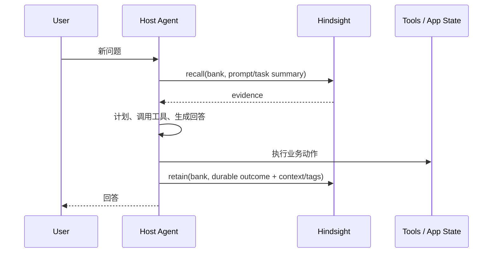

# Hindsight 接口面、调用时机与集成契约

> 本文给出架构层面的接口说明，而非替代 OpenAPI schema。精确字段、必填项、状态码和 SDK 类型请以当前服务的 `/docs`、OpenAPI 生成物及 `hindsight-docs/docs/developer/api/` 为准。

## 1. 接入方式

| 接入面 | 适合场景 | 连接特性 | 调用方责任 |
|---|---|---|---|
| REST API | 后端服务、自研 Agent | HTTP，最完整资源面 | 鉴权、Bank 选择、重试、operation 轮询 |
| SDK | Python/TS/Go/Rust 应用 | 对 REST 的类型化包装 | 版本兼容、异常处理、超时 |
| MCP | 已有工具调用循环的 Agent | HTTP MCP 或本地 stdio MCP | 工具权限、模型工具使用策略 |
| LLM wrapper | 不愿重写 LLM 调用链 | 自动 read/write 生命周期 | 选择 Bank、过滤可 retain 内容 |
| Host integration | CLI/IDE/框架生命周期明确 | hooks/plugins/callbacks | session→Bank 映射、隐私和失败降级 |

无论哪种方式，最终都是对 Bank 范围内的 retain、recall、reflect 和资源管理 API 的调用。

## 2. 核心操作

### 2.1 Retain

```text
POST /banks/{bank_id}/memories
```

概念输入：

```json
{
  "items": [
    {
      "content": "用户 Alice 偏好用 Python 处理数据分析。",
      "context": "用户在 2026-10-08 的对话中陈述；不是 Agent 自己的经历。",
      "event_date": "2026-10-08T00:00:00Z",
      "metadata": {"source": "chat"},
      "tags": ["profile", "preference"]
    }
  ],
  "async": false
}
```

架构关键点：

- `content` 也可能是结构化 blocks 或附件，不限于纯字符串；
- `context` 决定抽取主体、world/experience 分类和可解释性；
- `document_id` 用于幂等、更新、来源追踪和文档管理；
- `async=true` 只表示此次 retain 的主要工作通过 operation 执行，不代表调用方可忽略最终状态；
- 输入会经过 Tenant/tag scope/Memory Defense/operation validator；
- 返回值关注 accepted/written/blocked/failed、memory/document IDs、operation ID 和后续任务信息。

**什么时候 retain**：用户明确陈述持久偏好、稳定事实、Agent 完成的行动、工具成功结果、经过过滤的项目决策。  
**什么时候不要 retain**：密钥、临时推测、未确认外部内容、原始隐私数据、无业务价值的每个 token。

### 2.2 Recall

```text
POST /banks/{bank_id}/memories/recall
```

概念输入：

```json
{
  "query": "Alice 在数据分析任务中偏好什么语言？",
  "budget": "mid",
  "fact_type": ["world"],
  "tags": ["profile"],
  "include_entities": true,
  "include_chunks": false,
  "enable_trace": false
}
```

Recall 返回的是证据集合而不是最终对话答案。调用方应将选中的 facts 与原问题一同传给自己的模型，或直接使用 reflect。

主要控制项：

| 控制项 | 作用 |
|---|---|
| `budget` | 控制候选、检索和 token 消耗的档位 |
| `max_tokens` | 控制事实/chunk 返回体积 |
| `fact_type` | world、experience、observation 等类型过滤 |
| `question_date` | 解释相对时间表达 |
| tags / tag groups | 业务/授权范围过滤 |
| `include_entities` | 把实体上下文加入响应 |
| `include_chunks` | 返回原始来源片段，成本更高 |
| `min_scores` | 对 semantic、keyword、reranker/final 等分数设门槛 |
| `enable_trace` | 调试检索臂、融合、重排时使用，不宜默认开 |

### 2.3 Reflect

```text
POST /banks/{bank_id}/reflect
```

概念输入：

```json
{
  "query": "基于已知偏好，应该推荐什么数据分析实现方案？请说明证据。",
  "budget": "mid",
  "context": "当前任务需要在一周内交付原型。",
  "max_tokens": 1200,
  "response_schema": {"type": "object"}
}
```

Reflect 内部会自主搜索 mental models、observations、raw facts，并在必要时 expand。外部调用方仍应：

- 设置在线延迟和成本预算；
- 对结构化 schema 做客户端验证；
- 区分“无事实支持的回答”与“工具/模型失败”；
- 展示或保存 response 中的 source/citation 信息；
- 不让 reflect 直接获得不受宿主控制的外部工具权限。

## 3. 资源管理 API 的角色

| 资源 | 架构作用 | 典型管理动作 |
|---|---|---|
| Banks | 隔离、配置、人格、统计 | 创建、alias、config、profile、clone、delete |
| Documents / chunks | 来源和重处理边界 | list、get、update、reprocess、delete、export |
| Memories | 事实的维护和证据入口 | list、get、update、history、delete、recall |
| Entities / graph | 实体导航和关系诊断 | list、get、graph、regenerate |
| Observations | consolidation 产物和 freshness | list、scope、history、failed recovery |
| Mental models | 可策展知识、refresh | create、update、dry run、refresh、history、clear |
| Knowledge base | 页面树和面向用户组织 | folders、pages、search、tree、export |
| Directives | reflect 行为约束 | create、update、scope、delete |
| Operations | 后台可靠性接口 | list、status、cancel、retry、delete |
| Webhooks / audit | 集成、合规和排障 | CRUD、deliveries、stats |

## 4. 宿主 Agent 的推荐生命周期



推荐的“读在前、写在后”只是默认模式：

- 对长任务，可在子任务开始时 recall，在关键决策和结果时 retain；
- 对 coding agent，可在 session start recall、idle/stop retain；
- 对高风险任务，要在人类确认或业务系统成功后再 retain；
- 对快速聊天，不要每轮机械 retain，否则会放大噪声和成本。

## 5. Bank 命名与 tags 设计

### Bank 命名

| 模式 | 示例 | 适用 |
|---|---|---|
| per user | `user:42` | 私人 assistant |
| per workspace | `org:acme:workspace:ml` | 团队知识 |
| per agent | `project:x:agent:planner` | 多 Agent 分工 |
| per project + branch | `repo:foo:branch:main` | 代码 Agent，隔离实验 |

不要把不受信任的原始用户输入直接当作 Bank ID；使用稳定、校验后的服务端标识。

### tags

Tags 用于业务分类、检索过滤和细粒度 scope，例如：`profile`、`decision`、`incident`、`repo:foo`、`visibility:team`。避免把 tags 当作唯一租户边界；真正的租户隔离应由 RequestContext/TenantExtension/Bank authorization 完成。

## 6. 异步调用模式

```text
POST async retain/import/export/refresh
  → receive operation_id
  → GET /banks/{bank_id}/operations/{operation_id}
  → completed | failed | cancelled
  → retrieve result metadata / delivery status
```

客户端需要：

1. 保存 operation ID，避免页面刷新后丢失；
2. 轮询或接收 webhook；
3. 根据 status 和 error_message 展示可行动错误；
4. 对 retry/cancel 进行权限和幂等控制；
5. 在任务完成后再依赖其派生数据做关键决策。

## 7. 版本与兼容性

- 不要解析 human-readable error text 作为稳定接口；使用状态码、错误类型和 response schema；
- SDK/Client 应与 API 的 OpenAPI 版本协同升级；
- 新字段需要保持 unknown-field/optional-field 兼容；
- feature flag、LLM provider 和数据库 extension 可能改变运行能力，不应仅凭 API 成功就假设所有检索臂可用；
- Integration 不要依赖某一个 prompt 文案；应依赖明确 Hook/MCP/SDK 契约。
