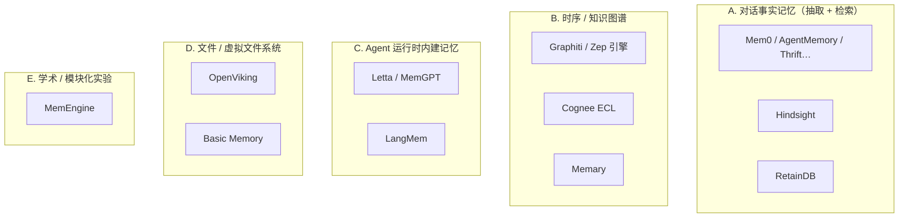
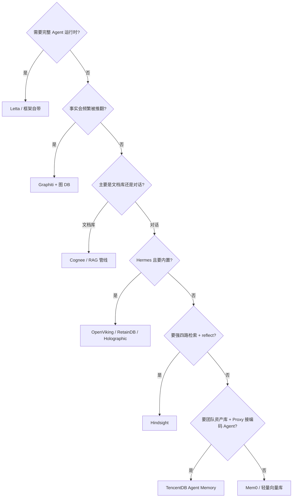

# Agent 长期记忆：开源/独立项目全景

> **定位**：与 [Hindsight](https://github.com/vectorize-io/hindsight) 同类的 **独立记忆层 / 记忆服务**（非完整 Agent 框架为主）。  
> **Hermes 列**：指 [Hermes Agent Memory Providers](https://hermes-agent.nousresearch.com/docs/user-guide/features/memory-providers) 是否 **内置或插件目录一键接入**（`hermes memory setup`）。  
> **维护**：表格随生态变化；发现遗漏可对照文末 **Curated 列表** 与 GitHub 搜索关键词。  
> **最后整理**：2026-10

---

## 1. 是不是「同类」？

**是同一产品类别的一个子集**，但内部范式并不相同。建议先按 **记忆范式** 分桶，再选仓库：



| 桶 | 你要解决的问题 | 典型 API 形态 |
|----|----------------|---------------|
| **A** | 跨会话记住「用户是谁、发生过什么」 | `add` / `search` 或 `retain` / `recall` |
| **B** | 事实会 **过期/被推翻**，要多跳图推理 | 图 DB + 时间有效区间 |
| **C** | 要 **整套有状态 Agent**，而不只是库 | Agent Server + memory blocks |
| **D** | 人要读、要 Git 同步的「知识目录」 | 文件树 / Markdown / MCP |
| **E** | 论文复现、教学模块 | 多记忆类型组合实验 |

**不算同类（但常一起用）**：纯向量 RAG（LlamaIndex 文档索引）、框架内置 `checkpointer`（LangGraph 会话状态）、ChatGPT「记忆」闭源产品。

---

## 2. 主对比表（你提供的 12 项 + 扩展）

### 2.1 核心清单

| 项目 | 仓库 | License | 核心范式 | 存储特点 | Hermes |
|------|------|---------|----------|----------|--------|
| **Mem0** | [mem0ai/mem0](https://github.com/mem0ai/mem0) | Apache-2.0 | 对话事实抽取 + 多信号检索（语义/BM25/实体，2026 算法升级） | 可插拔向量库，图可选；Cloud + OSS | ✅ 插件目录 |
| **Cognee** | [topoteretes/cognee](https://github.com/topoteretes/cognee) | Apache-2.0 | ECL 流水线 **GraphRAG**（文档/代码 → 图+向量） | SQLite / LanceDB / Kuzu / Neo4j 等 | ✅ 插件 |
| **Graphiti** | [getzep/graphiti](https://github.com/getzep/graphiti) | Apache-2.0 | **双时序**知识图谱（事实 `valid_at`/`invalid_at`） | Neo4j / FalkorDB / Kuzu 等 | ❌ 需自接 |
| **Hindsight** | [vectorize-io/hindsight](https://github.com/vectorize-io/hindsight) | MIT | 事实 + 实体图 + **四路 recall**（语义+BM25+图+时间）+ 巩固层 | 内嵌 **Postgres(pgvector)** 或外置 PG / Oracle | ✅ 插件目录 |
| **OpenViking** | [volcengine/OpenViking](https://github.com/volcengine/OpenViking) | **AGPL-3.0** | **虚拟目录树**分层知识库 | 目录树 + 向量 | ✅ **内置** |
| **AgentMemory** | [rohitg00/agentmemory](https://github.com/rohitg00/agentmemory) | MIT | 对话事实向量记忆 | 极简栈；含 LongMemEval 脚本 | ❌ |
| **RetainDB** | [retained/retaindb](https://github.com/retained/retaindb) | MIT | **结构化实体事实 CRUD** | 事实为主、向量为辅 | ✅ **内置** |
| **Holographic** | [holographicai/holographic](https://github.com/holographicai/holographic) | MIT | 本地向量记忆 | 内置 embedding，免外部向量库 | ✅ **内置** |
| **Supermemory** | [supermemoryai/supermemory](https://github.com/supermemoryai/supermemory) | Apache-2.0 | 网页/笔记 **第二大脑** | 抓取 + 语义检索 | ✅ 插件目录 |
| **MemEngine** | [nuster1128/MemEngine](https://github.com/nuster1128/MemEngine) | MIT | 学术向模块化记忆 | episodic/semantic/procedural 等一体实现 | ❌ |
| **LangMem** | [langchain-ai/langmem](https://github.com/langchain-ai/langmem) | MIT | 三层记忆（情景/语义/程序） | 独立 SDK，可脱离 LangGraph | ❌ |
| **Thrift** | [YohadH/thrift-memory](https://github.com/YohadH/thrift-memory) | MIT | 极简低成本记忆 | JSONL 本地 + 强制 token 预算 | ❌ |
| **TencentDB Agent Memory** | [TencentCloud/TencentDB-Agent-Memory](https://github.com/TencentCloud/TencentDB-Agent-Memory) | MIT | **分层 L0–L3** + **Mermaid 短期卸载**；v2 **四类团队资产**（Chat Memory / Skill / Wiki / CodeGraph）+ **LLM Proxy** | 默认 SQLite + 文件；可选 TCVDB / 试验性 MongoDB | △ 插件（`memory_tencentdb`）非 Hermes 内置五选一 |

**说明（Hindsight 一行）**：官方表述为 **语义 + BM25 + 图遍历 + 时间** 并行融合（RRF + rerank），并有 spreading activation / 动态权重；不单是「衰减」单一路径。

### 2.2 常见「第四梯队」与框架邻接项

| 项目 | 仓库 | License | 与上表关系 | Hermes |
|------|------|---------|------------|--------|
| **Letta** | [letta-ai/letta-code](https://github.com/letta-ai/letta-code) | Apache-2.0 | **有状态 Agent 运行时**（MemGPT 后继），非纯记忆库 | ❌（自有 memory blocks） |
| **Letta AI Memory SDK** | [letta-ai/ai-memory-sdk](https://github.com/letta-ai/ai-memory-sdk) | — | Letta 记忆块的 **轻量 SDK** 封装 | ❌ |
| **Zep（商业）** | [getzep/zep](https://github.com/getzep/zep) | — | 托管/context lake；**自托管开源核心 ≈ Graphiti + 图 DB** | ❌ |
| **Memary** | [kingjulio8238/Memary](https://github.com/kingjulio8238/Memary) | MIT | 类人记忆流 + **Neo4j/FalkorDB** 图 | ❌ |
| **Basic Memory** | [basicmachines-co/basic-memory](https://github.com/basicmachines-co/basic-memory) | AGPL-3.0 | **Markdown + MCP**，Obsidian 友好 | ❌ |
| **OpenMemory** | Mem0 子项目 | — | Mem0 生态的本地 MCP 记忆服务 | ❌ |
| **Honcho** | Plastic Labs | — | 跨会话 **用户建模** + dialectic | ✅ 插件目录 |
| **Byterover** | — | — | Hermes **内置** 五选一 | ✅ **内置** |
| **TencentDB Agent Memory** | 上表 | MIT | **团队 Memory Hub** + Proxy 零改协议接入编码 Agent；插件线主攻 OpenClaw 长上下文 | 见 [TENCENTDB_AGENT_MEMORY.md](./TENCENTDB_AGENT_MEMORY.md) | △ Hermes 插件目录 |
| **Mnemoverse** | — | — | 托管 MCP 记忆 | ❌ |
| **Memori** | （见 awesome 列表） | — | 实体抽取 + 提升 + 多 Agent 同步 | ❌ |

### 2.3 Hermes 当前接入方式（汇总）

```text
Hermes 内置 memory.provider（无需 plugins install）:
  openviking | holographic | retaindb | byterover

插件目录（hermes plugins install <name>）示例:
  hindsight | mem0 | supermemory | honcho | cognee | memory_tencentdb …

激活方式: memory.provider  in config.yaml（不是 plugins.enable）
```

来源：[Memory Providers | Hermes Agent](https://hermes-agent.nousresearch.com/docs/user-guide/features/memory-providers)

---

## 3. 范式对比（设计侧重点）

| 维度 | Mem0 / AgentMemory | Hindsight | Graphiti / Zep 引擎 | Cognee | OpenViking | RetainDB | TencentDB | Letta |
|------|-------------------|-----------|---------------------|--------|------------|----------|-------|
| **首要目标** | 低摩擦 `add/search` | 长程 benchmark + 生产 API | **事实随时间失效** | 语料 → 可查询图 | **分层文件知识** | 显式事实 CRUD | **团队资产 + 长任务降 Token** | **Stateful Agent** |
| **图** | 可选 / 实体链接 | ✅ 实体链接扩展 | ✅ 核心 | ✅ 核心 | 树结构 | 弱 | **CodeGraph**（代码调用） | 块+归档 |
| **时间** | 2026+ 时间推理 | ✅ 独立检索臂 | ✅ bi-temporal | 依流水线 | 弱 | 依 schema | L0 原文 + 分层召回 | 会话时间线 |
| **巩固/摘要** | 云侧优化 / 累加式 ADD | observations + mental models | 图边更新 | 图构建 | 目录组织 | 用户维护 | L0→L3 + Mermaid 卸载 | sleep-time / blocks |
| **部署** | 向量库即可 | PG 一体镜像 | **必须图 DB** | 多后端 | 服务+AGPL | 轻服务 | Core/Hub/Proxy 或 npm 插件 | Agent 栈 |
| **宿主耦合** | 库 / 云 API | **HTTP/MCP/50+ 集成** | 库 + 图运维 | Python 管线 | Hermes 内置 | Hermes 内置 | **OpenClaw 插件 + LLM Proxy** | 替换宿主 |

### 3.1 优劣势（选型用）

| 选型 | 更合适 | 不太合适 |
|------|--------|----------|
| **Hindsight** | 要强检索、要 reflect/disposition、要 Docker 一体、要编码 Agent 官方集成多 | 只想几行 Python 塞 Qdrant、不能跑 PG |
| **Mem0** | 最快接入、Cloud 省心、Hermes/Crew 生态 | 要完全自控巩固算法、要强图时序语义 |
| **Graphiti** | 事实版本化、合规审计「何时为真」 | 不想运维 Neo4j/FalkorDB |
| **Cognee** | 整库文档/代码吃进去做 GraphRAG | 只要对话 turn 记忆 |
| **OpenViking** | Hermes 默认、虚拟 FS 心智 | AGPL、非事实抽取路线 |
| **RetainDB** | 要 CRUD 事实、Hermes 内置 | 要自动 LLM 抽取叙事 |
| **Letta** | 记忆由 Agent **自编辑**、要完整产品 | 只要无状态 sidecar 记忆 |
| **Thrift / AgentMemory** | 实验、预算极简 | 生产多策略检索 |
| **TencentDB Agent Memory** | OpenClaw 长 Session、团队 Wiki/CodeGraph/Skill 面板、Proxy 接 Claude Code | 只要 Mem0 式两行 Python、不要 Node/面板运维 |

---

## 4. GitHub 上还有更多吗？

**有，而且持续增加。** 独立「Agent Memory」仓库没有官方总表，常用聚合来源：

| 来源 | 链接 | 说明 |
|------|------|------|
| **awesome-agent-memory** | [mnemoverse/awesome-agent-memory](https://github.com/mnemoverse/awesome-agent-memory) · [cxxz/awesome-agent-memory](https://github.com/cxxz/awesome-agent-memory) | 分类清单（Letta/Zep/Graphiti/Memary/Basic Memory…） |
| **论文** | Mem0 arXiv:2504.19413 · Zep/Graphiti arXiv:2501.13956 · Hindsight arXiv:2512.12818 | 对照 benchmark 声明 |
| **GitHub 搜索** | `agent memory`, `long-term memory llm`, `memgpt`, `graphiti`, `topic:memory` | 需自行甄别：库 vs 论文代码 vs 废弃 fork |

### 4.1 检索关键词（找「同类」新项目）

```text
agent memory layer | long-term memory | conversational memory
temporal knowledge graph | graphiti | mem0
memory bank | memory provider | hermes memory
```

### 4.2 易混淆（通常 **不是** 独立记忆产品）

| 名称 | 实际是什么 |
|------|------------|
| LangGraph `Store` / `checkpointer` | 框架状态与 KV，非 Mem0 类事实层 |
| Redis / pgvector 裸用 | 存储，无抽取与巩固 |
| ChatGPT Memory / Claude Projects | 闭源、宿主内建 |
| 仅 RAG 管道 | 无跨会话用户模型 |

---

## 5. 与 Hindsight 文档的交叉引用

| 主题 | 文档 |
|------|------|
| Hindsight 内部架构 | [ARCHITECTURE_GUIDE.md](./ARCHITECTURE_GUIDE.md) |
| TencentDB Agent Memory 解读 | [TENCENTDB_AGENT_MEMORY.md](./TENCENTDB_AGENT_MEMORY.md) |
| 设计动机九幕 | [DESIGN_THINKING_SERIES.md](./DESIGN_THINKING_SERIES.md) |
| Hermes 集成细节 | [hindsight-integrations/hermes/README.md](../../hindsight/hindsight-integrations/hermes/README.md) |
| 全宿主集成 | [INTEGRATIONS.md](./INTEGRATIONS.md) |

---

## 6. 选型流程图



---

**免责声明**：Star 数、License、Hermes 内置名单以各项目 **当前 README 与 Hermes 官方文档** 为准；AGPL（OpenViking/Basic Memory）与 MIT/Apache 在商用分发上约束不同，选型时请法务评审。
