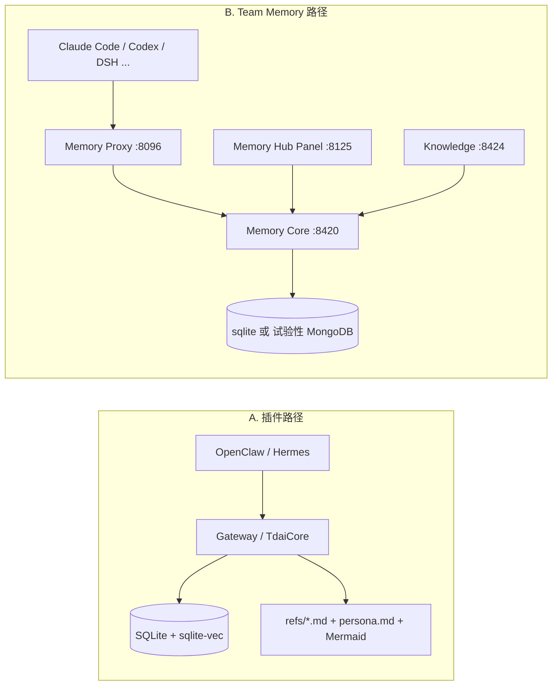
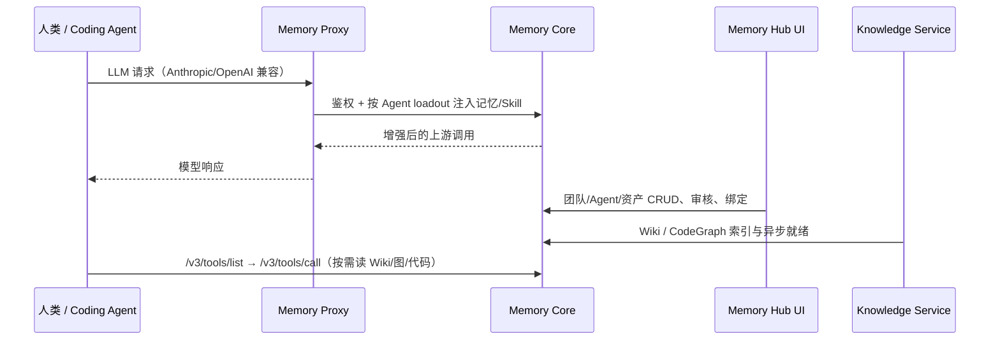

# TencentDB Agent Memory 详细解读

> **仓库**：[TencentCloud/TencentDB-Agent-Memory](https://github.com/TencentCloud/TencentDB-Agent-Memory)（MIT）  
> **npm 插件**：[`@tencentdb-agent-memory/memory-tencentdb`](https://www.npmjs.com/package/@tencentdb-agent-memory/memory-tencentdb)  
> **文档站**：https://tencentcloud.github.io/TencentDB-Agent-Memory/  
> **在 deepagents 中的位置**：与 [Hindsight](./ARCHITECTURE_GUIDE.md)、[MEMORY_LANDSCAPE](./MEMORY_LANDSCAPE.md) 同类的 **Agent 记忆层**；v2 起同时覆盖 **团队记忆中枢（Memory Hub）** 与 **四类可治理资产**。  
> **说明**：官方仓库存在 **插件主线**（OpenClaw/Hermes 侧车）与 **Team Memory v2**（`memory-core` + `memory-hub` + `proxy`）两条交付路径，下文分节说明；端口与 API 以 [INSTALL_CN](https://github.com/TencentCloud/TencentDB-Agent-Memory/blob/main/INSTALL_CN.md) / `feat/server_team` 分支 README 为准。

---

## 1. 一句话定位

**TencentDB Agent Memory = 符号化短期记忆 + 分层长期记忆 +（v2）团队可共享、可配装的记忆资产库。**

- 对 **单 Agent / OpenClaw**：装插件即可自动 **捕获 → 抽取 → 召回**，并用 **Mermaid 任务画布** 做上下文卸载，降低长程任务 Token。
- 对 **多 Agent / 编码助手团队**：通过 **Proxy** 把 Claude Code、Codex、DeepSeek Harness 等指到同一套 **Memory Core**，在 **Memory Hub 面板** 管理 Chat Memory、Skill、Wiki、CodeGraph，并按 Agent **负载（loadout）** 注入。

设计口号（README）：*Memory 不是为了让 AI 存下所有东西，而是为了让人不必重复所有事情。*

---

## 2. 两条产品线（怎么选）

| 维度 | **A. OpenClaw / Hermes 插件** | **B. Team Memory（三件套）** |
|------|------------------------------|------------------------------|
| **入口** | `openclaw plugins install @tencentdb-agent-memory/memory-tencentdb` | `deploy/global-images/start-all.sh` |
| **核心进程** | 插件内 **Gateway**（Hermes 默认 `:8420`） | **memory-core** `:8420` + **Panel** `:8125` + **Knowledge** `:8424` + **proxy** `:8096` |
| **Agent 接入** | OpenClaw `memory` 槽位；Hermes `memory_tencentdb` | **改 LLM base URL** 到 Proxy（无需插件/MCP） |
| **数据默认落盘** | `~/.openclaw/memory-tdai/`（文档约定） | Docker volume + Hub 元数据 |
| **团队资产** | 以单用户/单空间为主 | Chat Memory / Skill / Wiki / CodeGraph + ACL |
| **典型用户** | 个人长会话、OpenClaw 生态 | 一人公司多角色 Agent、Claude Code 团队记忆 |



**Memory Core 部署形态**（插件与云服务共用 Gateway 思路，见 `README.deployment.md`）：

| 模式 | 存储 | 场景 |
|------|------|------|
| **Standalone** | SQLite + 本地文件 | 开发、sidecar、Docker 一体 |
| **Service** | TCVDB + COS + Redis 队列 | 多租户、K8s 多副本 |

---

## 3. 四大记忆资产（v2 Team Memory）

官方将「可复用经验」从聊天日志里拆成 **Memory Assets**，统一注册、版本化、权限化，再 **绑定到 Agent**：

| 资产 | 解决什么问题 | 典型内容 |
|------|--------------|----------|
| **Chat Memory** | 跨会话「认识人」 | 偏好、事实、决策、交互史；L0→L3 金字塔 |
| **Skill** | 可执行 SOP，不是一段 prompt | 步骤、边界、校验、资源文件；可审核后团队共享 |
| **Wiki**（LLM-Wiki） | 文档结构化 + 链图 | 产品/设计/运维文档；受 Karpathy「LLM Wiki」思路启发 |
| **CodeGraph** | 代码符号与调用关系 | 文件、符号、调用链、变更影响面（基于 [codegraph](https://github.com/colbymchenry/codegraph)） |

与「聊天历史仓 / 纯 RAG」对比（官方表意）：

| 能力 | 聊天历史 | 标准 RAG | TencentDB Agent Memory |
|------|:--------:|:--------:|:----------------------:|
| 跨会话用户理解 | △ | △ | ✅ Chat Memory |
| 蒸馏可执行经验 | — | — | ✅ Skill |
| 文档结构与关系 | — | △ chunk | ✅ Wiki + 链图 |
| 代码调用与影响 | — | △ 文本匹配 | ✅ CodeGraph |
| 归属 / 版本 / 状态 | — | — | ✅ |
| 团队共享与 Agent 配装 | — | — | ✅ |

**可见性模型**（团队边界）：

| 级别 | 含义 |
|------|------|
| `private` | 仅 Owner，连团队管理员也不可读 |
| `team` | 团队成员可读；Owner/Admin 可管 |
| `restricted` | User / Role / Agent ACL |
| `agent` | 面向同团队内 Agent 定向装备 |

---

## 4. 短期记忆：分层卸载 + 符号化（Mermaid）

长任务里 Token 主要耗在 **工具输出**（搜索、代码、报错）。TencentDB 的做法是 **Context Offloading + 符号图谱**：

| 层 | 存储 | Agent 侧看到什么 |
|----|------|------------------|
| 底层 | `refs/*.md` | 完整工具原文（不进上下文） |
| 中层 | `jsonl` | 步骤级摘要 |
| 顶层 | **Mermaid 画布**（带 `node_id`） | 任务状态拓扑，数百 token 级 |

**推理路径**：Agent 在顶层 Mermaid 上推理 → 需要核对时用 `node_id` / grep → 拉回 `refs` 原文。  
OpenClaw 需额外：`plugins.slots.contextEngine = memory-tencentdb` +（推荐）`after-tool-call` 补丁脚本，才能把工具结果稳定卸载。

**压缩触发**（插件配置，`openclaw.plugin.json`）：`offload.mildOffloadRatio` / `aggressiveCompressRatio` / `offload.mmdMaxTokenRatio` 等，按上下文窗口比例渐进压缩。

---

## 5. 长期记忆：L0 → L3 异步管线

与 Hindsight 的 retain/recall 类似，强调 **生成与召回都分层**，避免「扁平向量堆」：

| 层 | 内容 | 主要用途 |
|----|------|----------|
| **L0 Conversation** | 原始对话 | 溯源措辞、时间、证据 |
| **L1 Atom** | 事实/偏好/约束/事件 | 精确召回可执行信息 |
| **L2 Scenario** | 项目/场景知识块 | 快速恢复工作上下文 |
| **L3 Persona** | 长期画像与稳定模式 | 日常偏好与宏观判断 |

**召回策略**：平时用 L2/L3 做 **渐进式披露**；需要细节时 **BM25 + 向量 + RRF** 回落到 L1/L0；并有条数、字符预算、`recall.timeoutMs` 上限，避免记忆撑爆上下文。

**Skill 分层（Roadmap 方向）**：从 Conversation 轨迹 → Scenario 模式 → Persona 级可挂载 Skill/SOP（与 Hermes Skill 代码有复用关系，见官方 Acknowledgements）。

**白盒调试**：L2 为 Markdown、L3 为 `persona.md`、短期为 Mermaid；链路 **Persona → Scenario → Atom → Conversation**（或 **画布 → jsonl → refs**）可人工走读。插件默认目录：`~/.openclaw/memory-tdai/`。

---

## 6. Team Memory 运行时：谁调谁



**Proxy 价值**：**协议不变、零改 Agent 代码**——把 `ANTHROPIC_BASE_URL`（或等价）指到 `http://127.0.0.1:8096/...` 即可；记忆与 Skill 在请求链路上注入，而不是把整个 Wiki/CodeGraph 灌进 system prompt。

**Knowledge 按需**：文档进 Wiki、仓库进 CodeGraph；Agent 先 `list` 再 `call`，只有真正需要时才拉页面或影响路径。

---

## 7. 集成矩阵

| 宿主 | 方式 | 备注 |
|------|------|------|
| **OpenClaw** | npm 插件 + `memory` 槽位 | 可抢占内置 `memory-core`；短期压缩要 `contextEngine` 槽 |
| **Hermes** | 插件目录 `memory_tencentdb` + Gateway 子进程 | **非** Hermes 内置五 provider；需手动链插件或 Docker `hermes-memory` |
| **Claude Code / CodeBuddy** | Proxy + Panel 选 Team/Agent | `INSTALL_CN` 有 admin / 业务用户分层说明 |
| **Codex / DeepSeek Harness / OpenCode** | `agents/*` 文档 + Proxy | 见仓库 `agents/README.md` |
| **任意 OpenAI/Anthropic 兼容客户端** | [Generic Proxy 指南](https://github.com/TencentCloud/TencentDB-Agent-Memory/blob/main/INSTALL.md) | 社区可 PR 官方适配 |

**Agent 工具（插件）**：`tdai_memory_search`、`tdai_conversation_search`。

---

## 8. 与 Hindsight / Mem0 / OpenViking 对照

| 维度 | **TencentDB Agent Memory** | **Hindsight** | **Mem0** | **OpenViking** |
|------|---------------------------|---------------|----------|----------------|
| **核心隐喻** | 分层文件 + DB；团队 **资产库** | Bank + 图 + 四路 recall + reflect | 事实抽取 + 多信号检索 | 虚拟目录树 |
| **短期上下文** | **Mermaid 卸载**（强项） | 宿主/compaction 为主 | 依赖宿主 | 分层 FS |
| **长期结构** | L0–L3 + Persona 文件 | Facts + entities + observations | 向量/图可选 | 目录层级 |
| **代码/文档** | **CodeGraph + Wiki**（v2） | 集成侧为主，非内置图代码库 | 非核心 | 文件即知识 |
| **团队治理** | Hub：ACL、loadout、审核 | Bank 隔离、多集成 | Cloud/多租户产品 | Hermes 内置 |
| **默认存储** | SQLite（+ TCVDB 服务态） | Postgres/pgvector | 可插拔向量库 | 服务 + AGPL |
| **宿主耦合** | **插件 + HTTP Proxy 双轨** | HTTP/MCP/大量官方集成 | SDK 最广 | Hermes 默认 |

**选型提示**：

- 要 **OpenClaw 长任务降 Token** + 本地零配置：优先看 TencentDB **插件 + offload**。
- 要 **reflect / disposition / 论文级长程 benchmark 叙事**：优先 [Hindsight](./ARCHITECTURE_GUIDE.md)。
- 要 **Hermes 开箱内置、虚拟 FS**：OpenViking / RetainDB 等见 [MEMORY_LANDSCAPE](./MEMORY_LANDSCAPE.md)。
- 要 **一人公司多 Agent + 文档/代码/Skill 统一面板**：TencentDB **Team Memory v2** 差异化最明显。

---

## 9. 官方 Benchmark（自述，需独立复现）

插件路径在 **连续长 Session** 上宣称（非单轮清空上下文）：

| 能力 | Benchmark | 相对变化（官方） |
|------|-----------|------------------|
| 短期 | WideSearch | Token −61.38%，成功率 +51.52%（相对） |
| 短期 | SWE-bench（50 任务/Session） | Token −33.09%，成功率 +9.93% |
| 短期 | AA-LCR | Token −30.98%，成功率 +7.95% |
| 长期 | PersonaMem | 48% → **76%** |

Team Memory README 单独列出 PersonaMem **+59%** 作为长期理解代表项。

---

## 10. 限制与 Roadmap（阅读官方 issue 前须知）

- Wiki / CodeGraph **异步构建**，需等 `ready`；公网 HTTPS 仓库优先，私有库/SSH 仍在完善。
- Hub **手动绑定**资产到 Agent 为主；全自动路由仍在迭代。
- **MongoDB 后端**：试验特性，与 sqlite **不自动迁移**。
- Roadmap 常见项：便携记忆导入导出、自动 Skill 生成、可视化调试大盘、Codex Plan 模式等（见仓库 `ROADMAP.md`）。

---

## 11. 推荐阅读顺序

```text
本页 §2–§6（产品线 + 资产 + 分层）
  → 官方 README（Team）或 README_CN（插件叙事）
  → INSTALL_CN.md（三件套与 Claude Code 一键命令）
  → Memory Core / Knowledge / Proxy 的 v3 OpenAPI（仓库内 *-api-*.md）
  → 对照 MEMORY_LANDSCAPE.md 选型
```

---

## 12. 链接

| 资源 | URL |
|------|-----|
| GitHub | https://github.com/TencentCloud/TencentDB-Agent-Memory |
| 安装（中文） | https://github.com/TencentCloud/TencentDB-Agent-Memory/blob/main/INSTALL_CN.md |
| npm | https://www.npmjs.com/package/@tencentdb-agent-memory/memory-tencentdb |
| 同类全景 | [MEMORY_LANDSCAPE.md](./MEMORY_LANDSCAPE.md) |
| Hindsight 主文档 | [ARCHITECTURE_GUIDE.md](./ARCHITECTURE_GUIDE.md) |

---

**免责声明**：分支（`main` vs `feat/server_team`）、默认端口与 API 版本随发布演进；生产选型请以当时仓库 README / CHANGELOG 为准。Benchmark 为厂商自述，deepagents 文档未独立复现。
