# Microsoft Agent Framework — 架构文档（第1部分）

> **核心架构、Agent.run、Handoff、Workflow 概念、内置 Prompt** · 合并版 2026-08-05
> 合并自 AGENT_FRAMEWORK_ARCHITECTURE_ANALYSIS + PYTHON_GUIDE + GLOSSARY

## 本卷目录

- **第1章 核心架构与源码解读**（原 `AGENT_FRAMEWORK_ARCHITECTURE_ANALYSIS.md`）
- **第2章 Python 开发指南**（原 `AGENT_FRAMEWORK_PYTHON_GUIDE.md`）
- **附录 A 术语表**（原 `GLOSSARY.md`）

---


<!-- ===== 第1章 核心架构与源码解读 | 原 AGENT_FRAMEWORK_ARCHITECTURE_ANALYSIS.md ===== -->

> **版本**: 2.3（2026-07-25）· **唯一深度文档**（实体、流程、Handoff、**运行时 Prompt**、Hosting 均已合并）  
> **源码根目录**: `agent-framework/python/packages/core/agent_framework/`  
> **官方文档**: [learn.microsoft.com/agent-framework](https://learn.microsoft.com/en-us/agent-framework/)

**阅读顺序**：§0 → §1.5 → §4–§6 → §10.6 → §11.0 → **§19 Prompt 手册** → §20 → §18

---

## §0 阅读导航

### 0.1 一句话心智模型

```text
用户代码
  ├── agent.run()         → _prepare_run_context → client.get_response → FunctionInvocationLayer loop
  ├── workflow.run()      → Runner superstep → AgentExecutor → agent.run()
  └── Hosting             → AgentState.get_or_create_session → agent.run() → set_session

共享底座：ContextProvider 管道、三层 Middleware、Compaction、Skills、OpenTelemetry
```

### 0.2 章节索引

| 章节 | 内容 | 关键源码 |
|------|------|----------|
| §1 | 分层抽象、五元关系、**§1.3 继承/引用类图**、**§1.5 MAF vs CrewAI 编排** | — |
| §2 | Agent 实体 | `_agents.py` |
| §3 | ChatClient + Tool Loop 配置 | `_tools.py`, `_clients.py` |
| §4 | **AgentSession / SessionContext 深度** | `_sessions.py` |
| §5–§6 | `agent.run`、Tool Loop 源码 | `_agents.py`、`_tools.py` |
| §7 | **ContextProvider 全量手册** | `_sessions.py`、`_compaction.py`、`_skills.py` |
| §8 | Middleware vs Provider | `_middleware.py` |
| §9 | **Compaction 压缩详解** | `_compaction.py` |
| §10 | **Workflow 与 Orchestration**（§10.6 Workflow/Orchestrator 概念） | `_workflows/_workflow.py` |
| §19 | **运行时 Prompt 参考手册**（内置字符串全文 + 中英对照） | `_magentic.py`、`_skills.py`、`_group_chat.py` |
| §20 | **Orchestrator 类实现详解** | `_base_group_chat_orchestrator.py` 等 |
| §11 | **Handoff 详解**（§11.0 总览 + 执行时机 + Demo） | `_handoff.py`、`_agent_executor.py` |
| §17 | **Mixin 每层新增能力** | `_agents.py`、`_tools.py`、`_middleware.py` |
| §18 | **协作图集**（时序 / 流程） | 全文 |
| §12 | Hosting | `hosting/_state.py` |
| §13 | Tools / Message / Skills | `_tools.py`, `_skills.py` |
| §14 | 三条执行路径 | — |
| §1.5 | **MAF vs CrewAI 多 Agent 编排原理** | — |
| §15 | 框架对比（摘要，详见 §1.5） | — |
| §16 | 源码索引 + 术语 | — |

### 0.3 双 Loop（最易混淆）

| | **Tool Loop** | **Workflow Runner** |
|--|---------------|---------------------|
| 文件 | `_tools.py` `FunctionInvocationLayer` | `_runner.py` `run_until_convergence` |
| 循环单位 | 一次 LLM HTTP（可能含 tool_calls） | 一个 **superstep** |
| 默认上限 | `max_iterations=40` | `Workflow.max_iterations`（默认 100） |
| 关系 | Workflow 节点内仍调 `agent.run()`，内部再走 Tool Loop | |

### 0.4 端到端时序（agent.run + 工具）

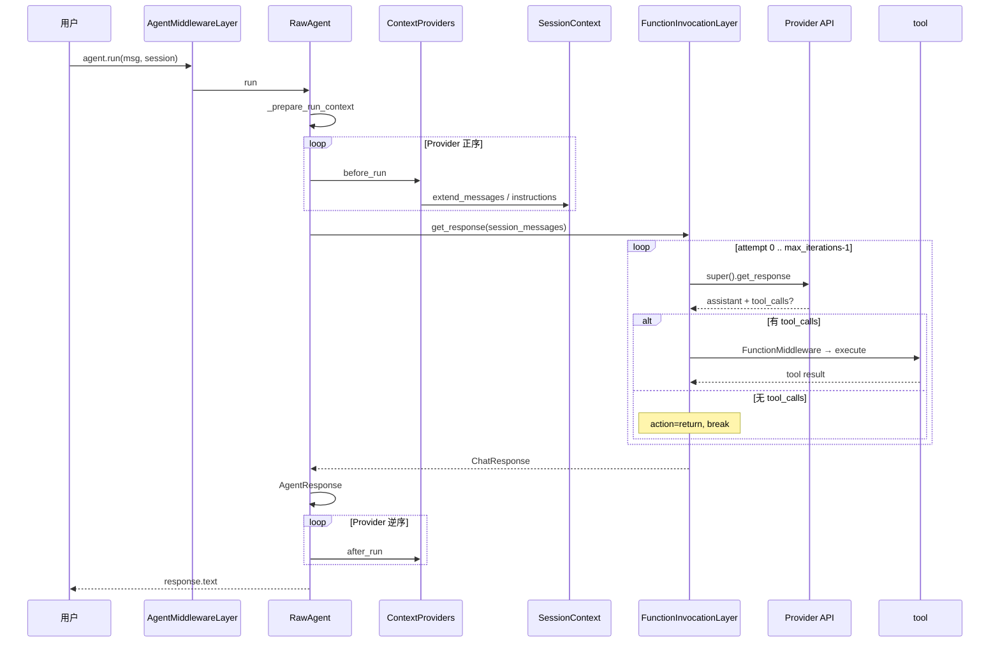
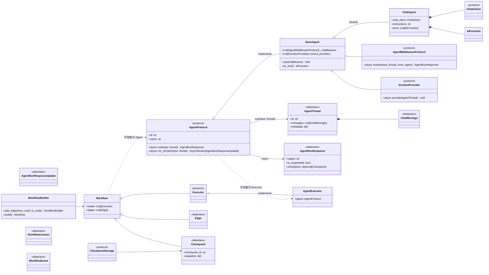
### 0.5 分层架构

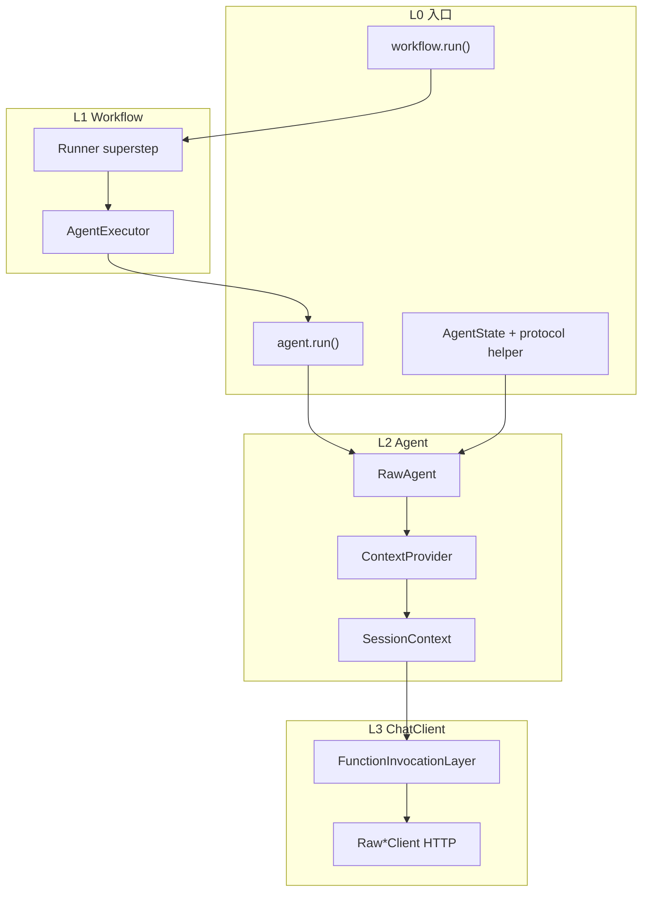

---

## §1 分层抽象与五元关系

### 1.1 五元分工

| 实体 | 管什么 | 不管什么 |
|------|--------|----------|
| **Agent** | `instructions`、工具、`run()` 生命周期 | Workflow 图拓扑 |
| **ChatClient** | HTTP + Tool Loop | 多轮持久化（除非 service 侧） |
| **AgentSession** | `session_id` + `state` + `service_session_id` | 不持有 Provider（在 Agent 上） |
| **Workflow** | 图、superstep、checkpoint | 节点内 ReAct（仍 `agent.run`） |
| **AgentState** | `session_id → AgentSession` | HTTP Server |

口诀：**Hosting 存会话 → Workflow 排图 → Agent 拼上下文 → ChatClient 跑 Tool Loop**。

### 1.2 Monorepo 包

```text
python/packages/
  core/agent_framework/     # import agent_framework
  openai/                   # OpenAIChatCompletionClient
  foundry/                  # FoundryChatClient
  orchestrations/           # HandoffBuilder, SequentialBuilder…
  hosting/                  # AgentState（alpha，无 HTTP Server）
  hosting-responses/        # responses_to_run / from_run
  foundry_hosting/          # ResponsesHostServer
```

### 1.3 继承与引用：类图 + 实体图

下面用两种图分开画，避免把 **继承（is-a，一个对象）** 和 **引用（has-a，两个对象）** 混在一起。

#### 1.3.0 先读这句（继承方向）

**`AgentMiddlewareLayer` 不继承 `Agent`；是 `Agent` 继承 `AgentMiddlewareLayer`。**

源码（`_agents.py`）：

```python
class Agent(
    AgentMiddlewareLayer,      # 父类 ①
    AgentTelemetryLayer,       # 父类 ②
    RawAgent,                  # 父类 ③
):
    ...
```

| 说法 | 对错 |
|------|------|
| `Agent` 继承 `AgentMiddlewareLayer` | ✅ |
| `AgentMiddlewareLayer` 继承 `Agent` | ❌ |
| `agent = Agent(...)` 只 new **一个** 对象 | ✅ |
| `AgentMiddlewareLayer` 是 `Agent` 里的子字段/子组件 | ❌（是 **父类 Mixin**） |
| 图里「子类在上、父类在下」 | ✅（见下图 1a） |

**Python MRO**（方法查找顺序，与 `super()` 一致）：

```text
Agent → AgentMiddlewareLayer → AgentTelemetryLayer → RawAgent → BaseAgent → object
```

因此 `await agent.run()` 时，**先**进入 `AgentMiddlewareLayer.run()`，再 `super().run()` 传到 `AgentTelemetryLayer` → `RawAgent`。Middleware 在 **外面**（先拦截），不是 Agent 内部嵌套的小对象。

---

#### 1.3.1 三种关系对照（不要混）

| 关系 | 英文 | 画法 | 几个对象 | 例子 |
|------|------|------|----------|------|
| **继承** | is-a | 类图 `--\|>` | **1 个**（多重继承叠在一起） | `Agent` 继承 `RawAgent` |
| **引用** | has-a | 实体图 `-->` | **2+ 个** | `RawAgent.client` → `ChatClient` |
| **super() 委托** | — | 流程图 / 时序 | 仍在 **同一对象** 内 | `Middleware.run` → `super().run()` → `RawAgent.run` |

**图例**

| 符号 | 含义 |
|------|------|
| `A --\|> B` | **继承**：`A` 子类 → `B` 父类（箭头指向父类）；同一对象 |
| `A --> B : client` | **引用**：`A` 的字段指向 **另一个** 对象 `B` |
| `A ..> B : super()` | **调用**：`A` 的方法里 `super()` 委托给父类 `B` 的同名方法 |

---

#### 图 1a — Agent 继承链（竖向，定义时）

**子类在上、父类在下**；箭头 **从子类指向父类（向下 ↓）**，读作「`Agent` 继承自 `AgentMiddlewareLayer`」。

> 若用 `↑` 会把方向画反（看起来像父类继承子类）。UML 类图也常把父类画在上面；这里为了突出「你 new 的是最外层 `Agent`」，才把子类放在上面，但 **箭头语义不变：永远子 → 父**。

```text
Agent                          ← 子类（最外层，你 new 的类型名）
  │
  │ 继承自（子 → 父，向下）
  ▼
AgentMiddlewareLayer           ← 父类；Agent middleware（run 先经过这层）
  │
  ▼
AgentTelemetryLayer            ← 父类；OpenTelemetry trace
  │
  ▼
RawAgent                       ← 父类；run / _prepare_run_context / client.get_response
  │
  ▼
BaseAgent                      ← 父类；session、default_options 等基座
```
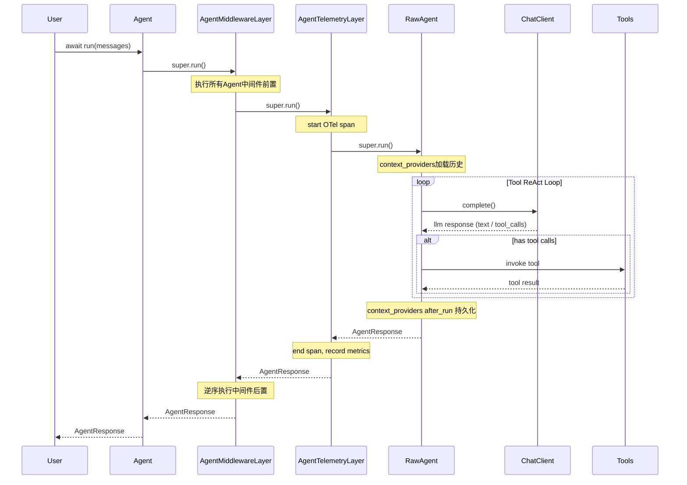
## 逐个类职责区分

1. **BaseAgent（最小底座，抽象，不能直接实例化）**
    - 继承：`SerializationMixin`
    - 能力：agent id /name/description、context_providers、middleware 存储、session 创建、as_tool () 能力
    - 缺失：**没有实现 run ()**，必须子类实现
    - 定位：所有 Agent 的最小公共基类
2. **RawAgent（裸核心实现，无横切层）**
    - 继承：`BaseAgent`
    - 能力：封装 ChatClient、tools、指令、默认 chat options，实现完整 run/stream 主循环（LLM 请求 + tool call loop）
    - 缺失：**没有遥测、没有全局 agent 中间件包装**
    - 使用场景：追求极致性能，不需要 tracing / 全局 agent middleware
3. **AgentMiddlewareLayer（Mixin，中间件管道）**
    - 独立 Mixin，不继承 BaseAgent
    - 职责：拦截 run，组装并执行 agent 级中间件链，call_next 向下转发
4. **AgentTelemetryLayer（Mixin，可观测埋点）**
    - 独立 Mixin，不继承 BaseAgent
    - 职责：OpenTelemetry span 创建、属性填充、异常埋点，包裹 run 生命周期
5. **Agent（对外标准推荐类）**
    - 多重继承：`AgentMiddlewareLayer, AgentTelemetryLayer, RawAgent`
    - 能力：RawAgent 全部核心能力 + 中间件拦截 + 完整遥测追踪
    - 日常业务代码默认使用
## 一、各个父类职责

表格

| 类 | 类型 | 核心职责 |
| --- | --- | --- |
| `AgentMiddlewareLayer` | Mixin 混入类 | **中间件洋葱壳**，重写 `run()` / `run_stream()`，实现中间件链式拦截，**最外层调用入口** |
| `AgentTelemetryLayer` | Mixin 混入类 | 可观测埋点层，埋点 trace、metrics，在中间件内层、RawAgent 外层 |
| `RawAgent[OptionsCoT]` | 抽象基类 | **真实业务抽象层**，定义抽象方法 `_run_core()` / `_run_stream_core()`，留给业务子类实现真正 agent 逻辑 |
| `Generic[OptionsCoT]` | 泛型基类 | 绑定泛型参数`OptionsCoT`，Agent 运行配置参数类型 |

>
> ⚠️关键点：全部是**多继承 Mixin 模式，不是组合**；三层是层层包装，洋葱模型。
>
>
> - AgentMiddlewareLayer、AgentTelemetryLayer：**重写 run/run_stream，用 super () 向上委托调用**
> - RawAgent：定义抽象核心逻辑，没有实现 run，定义`_run_core`下划线私有抽象方法

## 二、`agent.run()`完整调用链（非流式）

```
user_code: await agent.run(request)
```

### MRO 洋葱执行顺序（由外→内）

1. **AgentMiddlewareLayer.run()**【最外层】
   - 遍历注册的 middleware 列表，洋葱中间件链式执行
   - 中间件全部执行完，执行 `super().run(request)` → 向上交给下一层
2. **AgentTelemetryLayer.run()**
   - 开启 telemetry span、记录入参、异常捕获埋点
   - 执行 `super().run(request)`
3. **RawAgent.run()`
>
> RawAgent 实现了 run ()，内部调用抽象 `_run_core()`

```
async def run(self, request):
    # 公共预处理逻辑
    return await self._run_core(request)
```
4. **子类实现的 `_run_core(request)`**

>
> 👉真正 Agent 业务逻辑在这里，**不是 run，是 _run_core**

### 流式版本 run_stream () 完全一样链路

`run_stream()`:
`AgentMiddlewareLayer.run_stream()` → `AgentTelemetryLayer.run_stream()` → `RawAgent.run_stream()` → `_run_stream_core()`

## 三、MRO 关键坑点（Mixin 多继承）

1. `super()`**不是调用直接父类，是沿着 MRO 列表往后找**

```
MRO列表：
Agent
→ AgentMiddlewareLayer
→ AgentTelemetryLayer
→ RawAgent
→ Generic
→ object
```

- AgentMiddlewareLayer 内部 `super().run()` 不会调用 object，而是 MRO 下一个：AgentTelemetryLayer.run
- AgentTelemetryLayer 内部 `super().run()` 落到 RawAgent.run ()

2. RawAgent**没有重写 super 链上层的 run，它提供 run 的基础实现，并且定义抽象`_run_core`**

>
> 所有自定义 Agent，**不要重写 run ()，必须实现 `async def _run_core(self, request)`**
> 如果重写 run，会直接打断中间件 + 遥测整个链路，中间件、埋点全部失效。

## 四、类关系 Mermaid 图


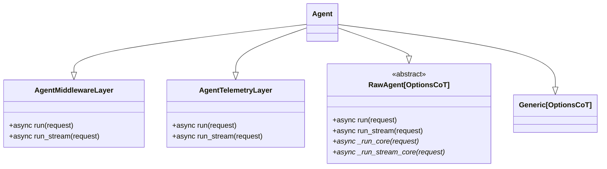


## 五、对比：继承 vs 组合

1. **全部是多继承 Mixin，没有组合！**

- AgentMiddlewareLayer / AgentTelemetryLayer 不是 Agent 的成员变量，是父类；
- 不是 `self.middleware_layer.run()`，是 MRO super 链式调用；

>
> 这是 MAF 非常核心设计：**用多继承做横向切面（中间件、遥测），而不是装饰器 / 组合对象**
## ✅ 继承 vs 组合 判定

1. **Agent ← AgentMiddlewareLayer / AgentTelemetryLayer / RawAgent：继承（多重继承 Mixin）is-a**
2. **RawAgent ← BaseAgent：单继承 is-a**
3. **RawAgent 内部持有 self.client/self.tools/self.context_providers：组合 has-a**（ChatClient、工具、上下文提供者是组合注入，不是继承）
4. **AgentMiddlewareLayer / AgentTelemetryLayer 和 BaseAgent：无继承关系，作为 Mixin 混入 Agent**

## ✅ 简易继承树

```
SerializationMixin
    ↓
BaseAgent
    ↓
RawAgent
AgentMiddlewareLayer     AgentTelemetryLayer        ← 两个独立Mixin
    ↘           ↓           ↙
         Agent（多重继承合并三层能力）
```
等价写法（**父类在上**，箭头仍 **子类指父类、向下**）：

```text
BaseAgent
  ▲
  │ 继承自
RawAgent
  ▲
  │ 继承自
AgentTelemetryLayer
  ▲
  │ 继承自
AgentMiddlewareLayer
  ▲
  │ 继承自
Agent                    ← 子类在最下，也是你 new 的类型
```

两种排版只是上下颠倒；**继承方向都是 `Agent` → … → `BaseAgent`（子 → 父）**。

**常见误解**（对照上表）：

| 误解 | 实际 |
|------|------|
| 这是 **调用链**，运行时依次 new 五个对象 | 只有 **一个** `Agent` 实例；`super()` 在同一对象内跳父类方法 |
| `AgentMiddlewareLayer` 是 Agent 的 **组合/包裹组件** | 是 **父类**，通过多重继承合并进同一实例 |
| 竖向 `↑` 表示子类继承父类 | **错**；子在上、父在下时应 **`↓`（子指父）** |
| 箭头表示 `Agent` **调用** `MiddlewareLayer` | 箭头只表示 **类定义时的继承**，不是 `run()` 运行时调用图 |

---

#### 图 1b — Agent 侧：Mermaid 类图

`Agent(...)` 只 **new 一次**，类型上同时具备 Middleware、Telemetry、RawAgent 的能力。

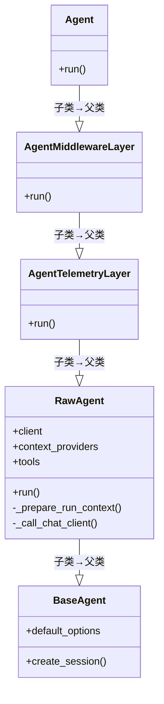

Mermaid 中 `--|>` **三角在父类一侧**，箭头从子类指向父类，与上图 1a 的 `↓` 语义一致。

**`run()` 的 `super()` 顺序**（从外到内，与 MRO 一致）：

```text
await agent.run()
  → AgentMiddlewareLayer.run()     # 最外：Agent middleware 洋葱
       super().run()
  → AgentTelemetryLayer.run()      # OpenTelemetry span
       super().run()
  → RawAgent.run()                 # _prepare_run_context → self.client.get_response()
```

---

#### 图 2a — ChatClient 继承链（竖向，定义时）

箭头 **子类 → 父类，向下 ↓**（同图 1a 约定）。

```text
OpenAIChatCompletionClient     ← 子类（你 new 的 Client）
  │
  ▼ 继承自
FunctionInvocationLayer        ← 父类；Tool Loop（重写 get_response）
  │
  ▼
ChatMiddlewareLayer            ← 父类；每轮 LLM 的 chat middleware
  │
  ▼
ChatTelemetryLayer             ← 父类；OpenTelemetry
  │
  ▼
RawOpenAIChatCompletionClient  ← 父类；单次 HTTP
```

**`FunctionInvocationLayer` 不是** `ChatClient` 旁边挂的第三个对象，而是 Client 类的 **父类 Mixin**（与 Agent 侧同理）。

---

#### 图 2b — ChatClient 侧：Mermaid 类图

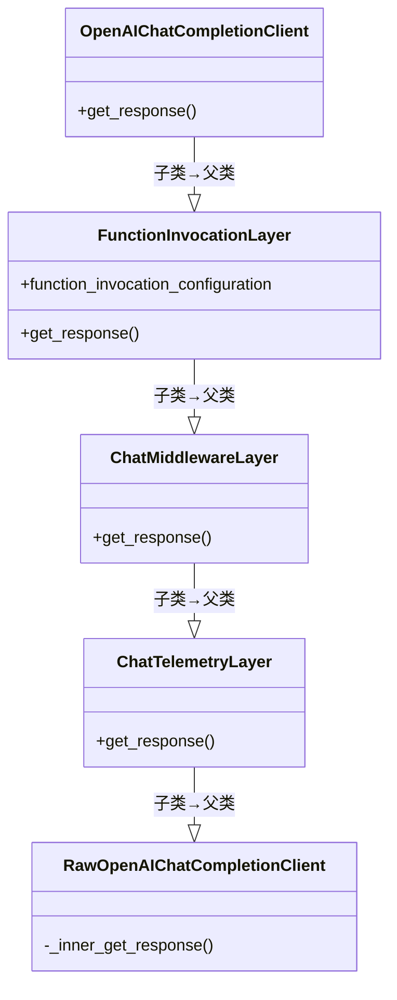

**`get_response()` 的 `super()` 顺序**：

```text
client.get_response()
  → FunctionInvocationLayer.get_response()   # 最外：Tool Loop
       super().get_response()  （循环内每轮）
  → ChatMiddlewareLayer.get_response()
  → ChatTelemetryLayer.get_response()
  → RawOpenAIChatCompletionClient._inner_get_response()   # HTTP
```

---

#### 图 3 — 跨对象引用（运行时实体关系）

> 完整 **run 生命周期**（含 Provider 管道、SessionContext）见 **图 4**。

这里才是 **两个独立对象**：`Agent` 实例通过字段 **`self.client`** 引用 `ChatClient` 实例（`BaseAgent.__init__` 里 `self.client = client`，`_agents.py` ~827）。

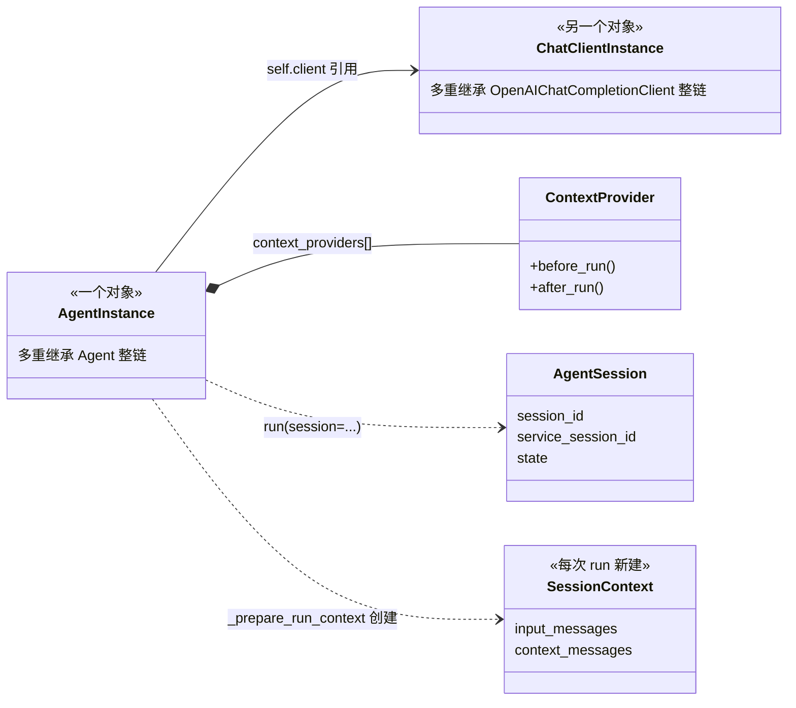

**一次 `agent.run(session=s)` 时的对象个数**

| 对象 | 几个 | 说明 |
|------|------|------|
| `Agent` | 1 | 你 `agent = Agent(client=...)` 的那个 |
| `ChatClient` | 1 | `agent.client` 指向它；**不是** Agent 内部的子对象 Layer |
| `AgentSession` | 0 或 1 | 多轮时传入同一个 |
| `SessionContext` | 1 | **每次** `run()` 新建，不跨 run |
| `ContextProvider` | N | 挂在 Agent 上，不单独 new |

---

#### 图 4 — 继承 + 引用 + 调用（总览，含 Session / Provider）

下图把 **§1.3 图 1–3** 合成一张：**竖向 `super()` = 继承链内委托**；**虚线 = 引用或参数**；**方框 = 本次 run 新建或管道实体**。

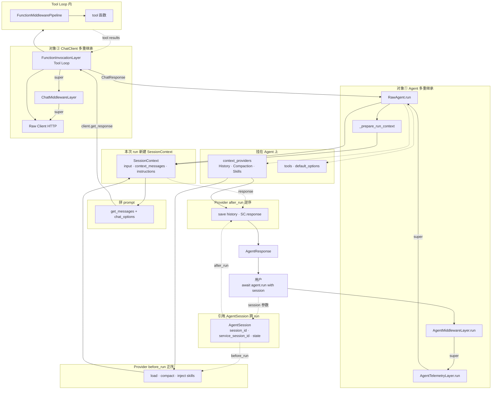

**图中实体与关系类型**

| 实体 | 关系类型 | 生命周期 | 在图中的位置 |
|------|----------|----------|--------------|
| `Agent` 实例 | 多重继承（对象①） | 应用持有 | `OBJ_AGENT` |
| `AgentMiddlewareLayer` 等 | 继承 Mixin，非独立对象 | 同 Agent | `super()` 竖链 |
| `ChatClient` 实例 | **引用** `self.client`（对象②） | 构造时注入 | `OBJ_CLIENT` |
| `AgentSession` | **引用/参数** `run(session=...)` | **跨 run** 复用 | `REF_SESSION` |
| `context_providers[]` | **组合** 挂在 Agent | 与 Agent 同寿 | `REF_AGENT` |
| `SessionContext` | **每次 run 新建** | 仅本次 `run()` | `PER_RUN` |
| `HistoryProvider` 等 | Provider 管道 | `before_run` / `after_run` | `PIPE_BEFORE` / `PIPE_AFTER` |
| `@tool` | Tool Loop 执行 | 单次 tool call | `TOOL_EXEC` |

**一次 `agent.run(session=s)` 时的对象个数**（与图 3 对照，图 4 补全流程）

| 对象 | 几个 | 说明 |
|------|------|------|
| `Agent` | 1 | 对象①；含整条继承链 |
| `ChatClient` | 1 | 对象②；`agent.client` |
| `AgentSession` | 0 或 1 | 无 session 时 Provider 可能临时建一个；多轮传同一个 `s` |
| `SessionContext` | 1 | **每次** `run()` 新建 |
| `ContextProvider` | N | 挂在 Agent，不 per-run new |
| `AgentResponse` | 1 | `after_run` 前写入 `SC.response` |

**读图口诀**

1. **类图 `--|>` / 竖向 `↓`（图 1a）**：箭头 **从子类指向父类**；不是 `AgentMiddlewareLayer` 继承 `Agent`。
2. **对象① 内 `super()`**：同一 Agent 实例内的父类委托，不会 new 多个 Layer。
3. **`AgentSession` / `SessionContext`**：`Session` **跨 run**；`SessionContext` **仅本次 run**；Provider 通过两者读写历史（`session.state` + `SC.extend_messages`）。
4. **横向 `self.client`**：从对象①跳到对象②；`get_messages()` 的结果作为 `messages` 传入。
5. **Tool Loop** 在对象② 的 `FunctionInvocationLayer` 内；对象① 通常只调 **一次** `get_response()`，循环在 Client 内部完成。
6. **`after_run` 逆序**：在 `AgentResponse` 就绪后，Provider 持久化（如 `HistoryProvider.save_messages`）。

---

### 1.4 与 CrewAI 对照（实体级速查）

> 多 Agent **编排原理**的深度对比见 **§1.5**（图 + superstep vs Task 链 + 同步委托）。

| MAF | CrewAI | 说明 |
|-----|--------|------|
| `Agent.instructions` | `role` + `goal` + `backstory` | 人设建模 |
| `AgentSession` + `HistoryProvider` | **无对等 Session**；上下文见下节 | 不是「CrewAI 没有 Memory 类」 |
| `Workflow` + Handoff | `Crew` + hierarchical delegate | 多 Agent |
| `FunctionInvocationLayer` | `AgentExecutor` Flow | 单 Task 内 ReAct |
| Handoff 消息边 | `DelegateWorkTool` 同步 `execute_task` | 委派 |

#### CrewAI 的「隐式 Memory」指什么？

对照表里这一句容易误解：**CrewAI 有显式的 `Memory` 类**（`memory/unified_memory.py`），但 **没有 MAF 的 `AgentSession` + `HistoryProvider` 这种「多轮对话句柄 + 历史管道」**。

CrewAI 的上下文分三层：

| 层次 | CrewAI | 开发者是否手动传 session |
|------|--------|--------------------------|
| **同一次 kickoff 的 Task 链** | `Task.context` 把上游输出拼进下游 prompt（`crew._get_context`） | 否，声明 Task 依赖即可 |
| **单个 Task 内** | `AgentExecutor` 内 `messages` 在 ReAct/tool loop 里累积 | 否，框架内部 |
| **跨 kickoff** | `Crew(memory=True)` → `Memory.recall` / `extract_memories` + `remember` | 否，开 `memory=True` 后自动注入/写入 |

```python
# CrewAI：无 session 对象；memory=True 时 task 前 recall、task 后 save
crew = Crew(agents=[...], tasks=[...], memory=True)

# MAF：显式 session + HistoryProvider 管对话历史
session = agent.create_session()
await agent.run("hi", session=session)
await agent.run("follow up", session=session)
```

`memory=True` 时 recall 注入点（`agent/core.py` `_retrieve_memory_context`）：用 `task.description` 作 query，`unified_memory.recall()` 结果 **append 到 task_prompt**，不是 MAF 那种 `get_messages()` 加载完整 chat history。

**一句话**：「隐式」= **没有 Session 句柄、对话链路由框架在 kickoff/Task/Executor 里自动串**；跨 run 的长期记忆是 **可选的向量 `Memory`**，不等于 MAF 的 `HistoryProvider`。

### 1.5 多 Agent 编排原理对比（MAF vs CrewAI）

两者都做「多 Agent 协作」，但 **编排模型、运行时边界、路由机制完全不同**。不要套用 CrewAI 的 `Crew.kickoff → Task 循环` 去理解 MAF 的 `workflow.run → superstep`。

#### 1.5.1 编排范式

| 维度 | **MAF** | **CrewAI** |
|------|---------|------------|
| **编排单元** | `Workflow` 图（`Executor` 节点 + 边） | `Crew`（`agents[]` + `tasks[]` + `Process`） |
| **谁驱动下一步** | Runner **superstep** 投递消息；Handoff 时 **当前 Agent 调 tool** 自选目标 | `Crew.kickoff` 内 **Task 顺序/for 循环**；hierarchical 时 **Manager** 决定委托谁 |
| **单 Agent 内循环** | `FunctionInvocationLayer` Tool Loop（LLM↔tool） | `AgentExecutor` 内层 Flow（ReAct / plan） |
| **多 Agent 切换** | Workflow **换 Executor 节点**（消息边） | Manager **`DelegateWorkTool` → `worker.execute_task()`**（同步嵌套） |
| **用户工作流层** | 你的 FastAPI / 脚本直接 `workflow.run()` | 可选顶层 `Flow`（`@start`/`@listen`），内嵌 `crew.kickoff()` |

```text
MAF（图 + superstep）:
  workflow.run(msg)
    → start HandoffAgentExecutor.execute()     # superstep 0 之前
    → agent.run() → Tool Loop
    → send_message(target=B)                   # 排队，本 superstep 结束才投递
    → superstep N+1 → B 的 HandoffAgentExecutor → agent.run()

CrewAI（Task 链 + 同步委托）:
  crew.kickoff(inputs)
    → prepare_kickoff（可选 CrewPlanner）
    → for task in tasks:
         Manager.execute_task(task)
           → DelegateWorkTool → Worker.execute_task(task)
                → AgentExecutor.invoke() → 内层 Flow.kickoff()
```

#### 1.5.2 路由与控制流

| | **MAF Handoff** | **CrewAI hierarchical** |
|---|-----------------|-------------------------|
| **路由信号** | LLM 调 `handoff_to_{id}`（伪装成 tool） | Manager LLM 调 `DelegateWorkTool` |
| **路由执行** | `_AutoHandoffMiddleware` 截断 → Workflow `send_message` | Manager 进程内 **直接 await** Worker |
| **下一 Agent 何时跑** | **下一 superstep**（消息投递后） | **同一 Task 执行栈内**立即嵌套 |
| **对话共享** | `_full_conversation` + `_cache` 广播给所有参与者 | `Task.context` 拼上游输出；Worker 独立 `execute_task` |
| **中心化程度** | 去中心化（每个 Agent 自选 handoff 目标） | 中心化（Manager 统一调度 Task） |

#### 1.5.3 状态与会话

| | **MAF** | **CrewAI** |
|---|---------|------------|
| **多轮对话句柄** | 显式 `AgentSession` + `HistoryProvider` | 无对等 Session；kickoff/Task 内自动串 |
| **跨 kickoff 记忆** | `HistoryProvider` / `MemoryContextProvider` | `Crew(memory=True)` 向量 recall |
| **Handoff 特殊要求** | `require_per_service_call_history_persistence=True` | 无（无 middleware 截断 tool 路径） |

#### 1.5.4 嵌套子 Agent

| 模式 | **MAF** | **CrewAI** |
|------|---------|------------|
| **同进程工具化** | `agent.as_tool()` → 父 Tool Loop 内 `await` 子 `run()` | 无一等对等物；靠 Delegate 或自定义 tool |
| **图级协作** | `HandoffBuilder` / `SequentialBuilder` | `Crew` + `Process.sequential` / `hierarchical` |
| **并行** | `ConcurrentBuilder`、fan-out 边 | `Process` 无内置并行 Task（需 Flow 或自定义） |

#### 1.5.5 选型直觉

- **MAF**：需要 **显式图**、**checkpoint/superstep**、**去中心化 handoff**、**Hosting + Session** 的生产 Agent 服务。
- **CrewAI**：需要 **Task 声明式流水线**、**Manager 集中调度**、**Crew.planning**、与 **用户 Flow** 快速搭业务阶段。

详见 **§11**（Handoff 执行时机）、**§10**（Workflow superstep）、CrewAI 侧 `crewAI/docs/CREWAI_ARCHITECTURE_ANALYSIS.md` §0。

---

## §2 Agent 实体

> **继承 vs 引用**：`Agent` 与 `AgentMiddlewareLayer` 等是 **父类 Mixin**（§1.3）；`self.client` 才是 **另一个对象** 的引用。详见 §1.3.0–§1.3.1。

### 2.1 构造参数

| 参数 | 说明 |
|------|------|
| `client` | **必填** `BaseChatClient` |
| `name` | 日志、Handoff `handoff_to_{id}` |
| `instructions` | → `default_options["instructions"]` |
| `tools` | 默认工具；`run(tools=...)` 可覆盖 |
| `context_providers` | **顺序有意义**（before 正序 / after 逆序） |
| `middleware` | `AgentMiddleware[]` |
| `require_per_service_call_history_persistence` | Handoff **必须 True** |

### 2.2 `as_tool()` vs Handoff

```python
# 同进程嵌套：父 Tool Loop 内 await 子 agent.run()
research_tool = researcher.as_tool(name="research")

# 图消息边：HandoffBuilder，不走 as_tool
workflow = HandoffBuilder().participants([a, b]).build()
```

`as_tool(propagate_session=True)` 可把父 `session` 传给子 Agent。

---

## §3 ChatClient 与 Tool Loop 配置

> `FunctionInvocationLayer` 是 `OpenAIChatCompletionClient` 的 **父类 Mixin**，不是独立对象。继承链见 **§1.3 图 2a / 2b**。

### 3.1 `FunctionInvocationConfiguration`（`_tools.py` ~1329）

| 字段 | 默认 | 含义 |
|------|------|------|
| `max_iterations` | 40 | LLM 往返上限 |
| `max_consecutive_errors_per_request` | 3 | 连续工具失败中止 |
| `max_function_calls` | None | 总 tool 调用预算 |
| `enabled` | True | False 则单次 LLM |

### 3.2 一次 `agent.run` 与 `get_response` 的关系

用户只调一次 `client.get_response()`，但 `FunctionInvocationLayer` **内部**循环最多 40 次 HTTP。

---

## §4 AgentSession 与 SessionContext（深度）

### 4.1 为什么需要两个「Session」概念

| | `AgentSession` | `SessionContext` |
|---|----------------|------------------|
| **比喻** | 银行账户（长期） | 单次取款凭条（一次交易） |
| **生命周期** | 跨多次 `agent.run()` | **仅一次** `run()` |
| **谁创建** | `agent.create_session()` / Hosting `get_or_create_session` | `_prepare_session_and_messages` 每次新建 |
| **谁持有** | 应用 / `AgentState` SessionStore | 框架在单次 run 栈上 |
| **序列化** | `to_dict()` / `from_dict()` | 不持久化 |

**口诀**：`AgentSession` = 多轮句柄 + Provider 私有状态仓库；`SessionContext` = 本轮拼 prompt 的工作台。

### 4.2 AgentSession 字段与用途

**`_sessions.py` ~967**

| 字段 | 类型 | 作用 |
|------|------|------|
| `session_id` | `str` | 客户端 UUID；History 存储键 |
| `service_session_id` | `str \| ServiceSessionId` | OpenAI Responses / Foundry 的 conversation id；run 后可能更新 |
| `state` | `dict[str, Any]` | `state[provider.source_id]` 存各 Provider 私有数据 |

```python
session = agent.create_session()
# InMemoryHistoryProvider 默认: session.state["in_memory"]["messages"] = [...]
await agent.run("你好", session=session)
await agent.run("继续", session=session)  # 同一 session_id，History after_run 已写入
```

Hosting：`AgentState.set_session` **必须在 run 后**调用——`service_session_id`、Provider state 可能在 run 中被 mutate。

### 4.3 SessionContext 字段与 API

**`_sessions.py` ~177** — 每次 `run()` 新建，Provider 通过它贡献上下文：

| 字段 / 方法 | 读写 | 说明 |
|-------------|------|------|
| `input_messages` | 框架写，Provider 只读 | 本轮用户输入 |
| `context_messages` | Provider `extend_messages` | `source_id → Message[]`，保 Provider 顺序 |
| `instructions` | `extend_instructions` | 追加 system 片段 |
| `tools` | `extend_tools` | 追加工具 |
| `middleware` | `extend_middleware` | 仅 Chat/Function middleware |
| `metadata` | 任意 Provider 读写 | 跨 Provider 传参 |
| `response` | `after_run` 时只读 | 框架填入 `AgentResponse` |
| `get_messages(...)` | 合并输出 | context 顺序 + 可选 input/response |

`extend_messages` 会 **copy** 消息并写入 `_attribution`（`source_id`、`source_type`），便于审计与 `store_context_from` 过滤。

### 4.4 二者在 run 中的协作

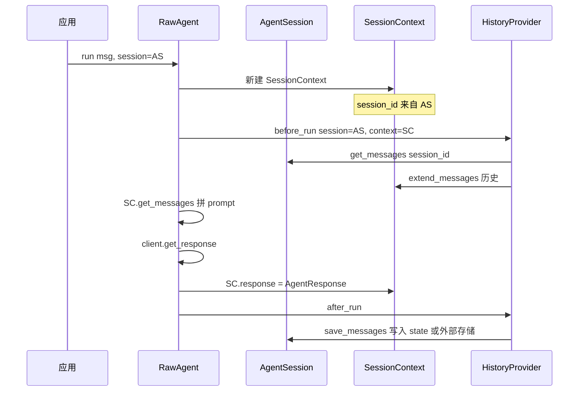

### 4.5 service_session_id 与双轨历史

| 模式 | 行为 |
|------|------|
| **本地 HistoryProvider** | 消息在 `session.state` 或外部 DB；`service_session_id` 可选 |
| **Client `STORES_BY_DEFAULT=True`** | LLM 服务端持历史；`conversation_id` 写入 `service_session_id` |
| **`store=False` 强制本地** | 即使 Client 默认服务端存，也走 HistoryProvider 注入 |

`is_local_history_conversation_id`：Handoff per-service-call 路径用 sentinel id，区分本地持久化与服务端历史。

---

## §5 核心流程：`agent.run` 源码解读

### 5.1 入口：`RawAgent.run`（`_agents.py` 993–1071）

```python
# 非流式路径
async def _run_non_streaming():
    ctx = await _prepare_run_context(...)      # 拼 SessionContext + chat_options
    response = await self._call_chat_client(ctx, stream=False)  # → Tool Loop
    return await self._parse_non_streaming_response(ctx, response)  # → after_providers
```

流式：`run(stream=True)` → `_parse_streaming_response`，`after_run` 在流结束 `_post_hook` 执行。

**注意**：`AgentMiddlewareLayer` 在更外层包裹 `run()`，整次 run 先过 Agent middleware 洋葱。

### 5.2 `_prepare_run_context`（~1268–1479）

按执行顺序拆解：

| 步骤 | 源码位置 | 动作 |
|------|----------|------|
| 1 | 1268–1274 | `normalize_messages(messages)` → `input_messages` |
| 2 | 1280–1292 | `_merge_options`；解析 `store` / `service_stores_history` |
| 3 | 1297–1308 | 有 `session` 且无 HistoryProvider 且无 service 历史 → **自动注入** `InMemoryHistoryProvider` |
| 4 | 1310–1318 | 无 session 但有 Provider → 创建临时 `AgentSession` |
| 5 | 1314–1338 | `require_per_service_call_history_persistence` + HistoryProvider → 解析 per-service-call 中间件 |
| 6 | 1340+ | 调 `_prepare_session_and_messages` → **Provider before_run** |
| 7 | 后续 | MCP tools 合并、conversation_id、middleware 注入 `client_kwargs` |

**`store` 语义**（1287–1292）：

- `store=False`：强制本地 HistoryProvider 注入，即使用户 Client 默认服务端存历史
- `store=True`：强制服务端存历史
- 未设置：跟 `client.STORES_BY_DEFAULT`

### 5.3 `_prepare_session_and_messages`（1481–1563）— Provider 管道核心

```python
session_context = SessionContext(
    session_id=provider_session.session_id if provider_session else None,
    service_session_id=provider_session.service_session_id if provider_session else None,
    input_messages=input_messages or [],
    options=options or {},
)

per_service_call_history_required = (
    self.require_per_service_call_history_persistence and bool(self._get_history_providers())
)

# before_run：正序；Handoff 场景跳过 HistoryProvider（由 per-service-call 中间件负责）
for provider in self.context_providers:
    if per_service_call_history_required and isinstance(provider, HistoryProvider):
        continue
    if isinstance(provider, HistoryProvider) and not provider.load_messages:
        continue
    await provider.before_run(
        agent=self,
        session=provider_session,
        context=session_context,
        state=provider_session.state.setdefault(provider.source_id, {}),
    )

# Provider 贡献合并进 chat_options
if session_context.tools:
    chat_options.setdefault("tools", []).extend(session_context.tools)
if session_context.instructions:
    combined = "\n".join(session_context.instructions)
    chat_options["instructions"] = f"{chat_options.get('instructions', '')}\n{combined}".strip()
```

**Handoff 关键**：`require_per_service_call_history_persistence=True` 时，**once-per-run** 路径上的 `HistoryProvider.before_run` **被跳过**；历史 load/save 改由 **per-service-call Function/Chat middleware** 在 Tool Loop **每一轮 LLM 后**执行，保证换 Agent 时上下文已落盘。

### 5.4 `_call_chat_client`（1089–1115）

```python
return self.client.get_response(
    messages=context["session_messages"],       # SessionContext.get_messages(include_input=True)
    stream=...,
    options=context["chat_options"],
    compaction_strategy=context["compaction_strategy"],
    tokenizer=context["tokenizer"],
    function_invocation_kwargs=context["function_invocation_kwargs"],
    client_kwargs=context["client_kwargs"],     # 含 session、Provider 注入的 middleware
)
```

### 5.5 `_parse_non_streaming_response`（1117–1147）

1. 给 `response.messages` 补 `author_name`
2. 若 `response.conversation_id` 非本地 sentinel → 写 `session.service_session_id`
3. 构建 `AgentResponse`
4. `session_context._response = agent_response`
5. **`await self._run_after_providers(session=..., context=session_context)`**

### 5.6 `_run_after_providers`（526–558）

```python
for provider in reversed(self.context_providers):   # 逆序！
    if per_service_call_history_required and isinstance(provider, HistoryProvider):
        continue   # 同 before_run，Handoff 时跳过
    await provider.after_run(agent=self, session=..., context=..., state=...)
```

逆序保证：后注册 Provider 的 save 先执行时，仍能看到完整 `context.response`。

---

## §6 核心流程：Tool Loop 源码解读

### 6.1 入口：`FunctionInvocationLayer.get_response`（`_tools.py` ~2528+）

若 `function_invocation_configuration.enabled == False`，直接 `super().get_response()` 一次，无循环。

### 6.2 非流式主循环 `_get_response`（2614–2700+）

```python
errors_in_a_row = 0
prepped_messages = list(messages)
fcc_messages = []          # function call content 累积
max_iterations = config.get("max_iterations", 40)

for attempt_idx in range(attempt_start, max_iterations):
    # ① 审批 replay（response=None 时处理 pending approval）
    approval_result = await _process_function_requests(response=None, ...)
    if approval_result["action"] == "stop":
        break

    # ② 调 LLM（ChatMiddleware → RawClient HTTP）
    response = await super_get_response(messages=prepped_messages, options=mutable_options, ...)

    # ③ 更新 conversation_id / continuation state
    _update_continuation_state(filtered_kwargs, response, session=invocation_session, ...)

  if response.conversation_id is not None:
        prepped_messages = []   # 服务端已持历史，清空本地重复

    # ④ 执行 tool_calls
    result = await _process_function_requests(response=response, fcc_messages=fcc_messages, ...)
    if result["action"] == "return":      # 无 tool_calls 或已完成
        return response
    if result["action"] == "stop":
        break
    # else: CONTINUE — tool results 已 append 到 fcc_messages / prepped_messages
```

**关键点**：

- `_process_function_requests` 既处理 **审批** 又处理 **tool 执行**
- `action == "return"`：模型给出最终文本，结束 Loop
- `conversation_id` 存在时清空 `prepped_messages`，避免与服务端历史重复
- `max_function_calls` 触顶后设 `tool_choice="none"` 强制模型收束

### 6.3 工具执行链

```text
_process_function_requests
  → _execute_function_calls
    → FunctionMiddlewarePipeline.execute   # 含 Handoff _AutoHandoffMiddleware
      → FunctionTool.invoke / @tool 函数
```

### 6.4 Handoff 是什么？（为何在 Function 层「截断」）

> **本章完整详解见 §11.0**。本节在 Tool Loop 上下文中给出最短路径；读完 §6 后建议直接跳 §11.0。

#### 6.4.1 一句话

**Handoff = 多 Agent 里的「转接」**：当前 Agent 用 `handoff_to_*` 表达「该专家接了」，Workflow 在下一 superstep 换执行者；对模型像调 tool，对框架是路由信号。

#### 6.4.2 为何在 Function 层截断

正常 tool：`LLM → 执行函数 → result 回 messages → 再调 LLM`。  
Handoff tool 若走此路径会嵌套 `agent.run()` 或得到空 result，故 `_AutoHandoffMiddleware` 注入合成 result 并 `raise MiddlewareTermination`，终止 Tool Loop，把路由交给 Workflow。

```python
# orchestrations/_handoff.py:130-152
class _AutoHandoffMiddleware(FunctionMiddleware):
    async def process(self, context, call_next):
        if context.function.name not in self._handoff_functions:
            await call_next()
            return
        context.result = FunctionTool.parse_result({
            HANDOFF_FUNCTION_RESULT_KEY: self._handoff_functions[context.function.name]
        })
        raise MiddlewareTermination(result=context.result)
```

**心智模型**：Handoff 对 LLM 像调 tool，对框架是路由信号；**截断 = 不让它变成普通 tool 的副作用**。

详见 **§11.0**（两层分工、Executor 时机、对话广播、Demo）。

---

## §7 ContextProvider 全量手册

> **独立深度文档**：[SESSION_CONTEXT_AND_PROVIDERS.md](./ARCHITECTURE_PART2.md)（SessionContext 属性、每个 Provider 的 before/after_run、Skills/MCP 注入路径）。  
> 下文保留摘要；实现细节以独立文档为准。

### 7.1 管道总览

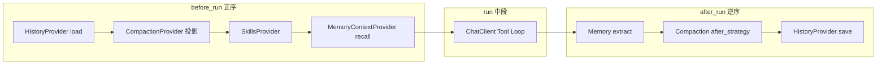

| Provider | 文件 | before_run | after_run | 沉淀位置 |
|----------|------|------------|-----------|----------|
| `InMemoryHistoryProvider` | `_sessions.py` | `get_messages` → SC | `save_messages` input+output | `session.state[source_id].messages` |
| `FileHistoryProvider` | `_sessions.py` | 同上 | 同上 | 每 session 一个 JSONL 文件 |
| `CompactionProvider` | `_compaction.py` | `before_strategy` 标注 `_excluded` | 可选 `after_strategy` 压 storage | storage **保留全量**；LLM 只见 included |
| `SkillsProvider` | `_skills.py` | 注入 `<skills>` + tools | — | 磁盘 `SKILL.md` 只读 |
| `MemoryContextProvider` | `_harness/_memory.py` | `MEMORY.md` + topic 文件 recall | extract + consolidate | `MemoryStore` 目录树 |

**注册顺序**：`[history, compaction, skills, memory]` — Compaction **必须**在 History **之后**。

### 7.2 HistoryProvider — 对话历史沉淀

**职责**：跨 run 的 **完整消息列表**（chat transcript），不是语义向量记忆。

**before_run**（`_sessions.py` ~573）：

```text
history = await get_messages(session_id, state=state)
context.extend_messages(self, history)
```

**after_run**（~585）收集：

| 来源 | 旗标 |
|------|------|
| 其他 Provider 的 context | `store_context_messages` / `store_context_from` |
| 用户本轮输入 | `store_inputs`（默认 True） |
| 模型输出 | `store_outputs`（默认 True） |

→ `save_messages(session_id, messages_to_store, state=state)`

**InMemoryHistoryProvider**：`session.state[source_id]["messages"]` 存 `Message` 列表；适合 dev/单进程。

**FileHistoryProvider**：`{root}/{session_id}.jsonl` 一行一条消息；适合持久化/审计。

**skip_excluded**：load 时跳过带 `_excluded` 的消息（Compaction 标注）；storage 仍含 excluded 供审计。
```python
await agent.run()
 1. AgentMiddlewareLayer.run()
 2. AgentTelemetryLayer.run()
 3. RawAgent.run()
    3.1 ✅ 按顺序执行所有 context_providers.before_run()
        → HistoryProvider.before_run() 【读磁盘/存储，加载历史进内存上下文】
    3.2 执行核心 LLM + Tool ReAct Loop 【纯内存，追加user/assistant/tool messages】
        → 这里就是你说的 llm loop（写内存）
    3.3 ✅ 按**逆序**执行所有 context_providers.after_run()
        → HistoryProvider.after_run() 【收集本轮增量消息，写入持久化】
 4. TelemetryLayer 后置
 5. MiddlewareLayer 后置
return response
```
```python
1. 外部调用: await agent.run(prompt, session=AgentSession)
    └─ RawAgent.run()
        2. 框架新建【SessionContext】（单次run临时内存容器）✅tool缓存本体
        3. 遍历 context_providers，执行 before_run()
            HistoryProvider.before_run(session, context)
                → 读磁盘(jsonl)
                → 历史消息写入 context.context_messages
        4. 内部 ReAct / Tool‑Loop 开始
            while True:
                读取 context.context_messages → 拼装上下文发给LLM
                收到assistant消息(可能带tool_call) → append进 context.context_messages
                如果有工具调用：执行工具 → tool‑result消息 append进 context.context_messages
                ↺ 回到循环头部
            # ==========整个tool loop期间没有任何磁盘IO，全部操作SessionContext内存==========
        5. tool‑loop结束，遍历 context_providers，逆序执行 after_run()
            HistoryProvider.after_run(session, context)
                → 读取 context.context_messages
                → diff出本轮run新增消息
                → add_message()写入磁盘(jsonl)
        6. run结束，SessionContext 对象销毁；AgentSession（session_id）保留，供下次run使用
```
# SessionContext `__init__` 源码参数完整解析

你贴出的就是**真实最新 SessionContext 构造签名**，先注意一个语法关键点：
`*,` 代表：**之后所有参数强制要求关键字传参，禁止位置参数调用**。

```
def __init__(
    self,
    *,
    session_id: str | None = None,
    service_session_id: str | ServiceSessionId | None = None,
    input_messages: list[Message],
    context_messages: dict[str, list[Message]] | None = None,
    instructions: list[str] | None = None,
    tools: list[Any] | None = None,
    middleware: dict[str, list[MiddlewareTypes]] | None = None,
    options: dict[str, Any] | None = None,
    metadata: dict[str, Any] | None = None,
):
```

## 参数总览速查表

表格

| 参数 | 默认值 | 必填 | 核心作用 |
| --- | --- | --- | --- |
| `session_id` | None | ❌ | 会话唯一标识，来自上层 AgentSession |
| `service_session_id` | None | ❌ | 框架内部服务层会话 ID |
| `input_messages` | 无默认 | ✅ **必填** | 本次 run 用户原始输入消息快照，只读为主 |
| `context_messages` | None | ❌ | **tool‑loop 运行时消息缓冲区（最核心）** |
| `instructions` | None | ❌ | 动态追加系统提示词 / 指令 |
| `tools` | None | ❌ | 本轮 run 临时生效工具列表 |
| `middleware` | None | ❌ | 本轮上下文中间件钩子集合 |
| `options` | None | ❌ | 本轮 run 运行时配置参数 |
| `metadata` | None | ❌ | 自定义附加元数据，provider/middleware 传数据 |

---

## 逐个字段深度详解 + 读写时机 & 修改者

### 1. `session_id: str | None`

- **初始化时机**：`RawAgent.run()` 创建 SessionContext 时，从你传入的 `AgentSession` 取出 session_id 赋值
- **读时机**
   - `before_run`：HistoryProvider 读取该 id，去磁盘加载历史消息
   - `after_run`：HistoryProvider 读取该 id，用来持久化保存增量消息
- **写时机**：**run 全程几乎只读，运行期一般不会被修改**

### 2. `service_session_id: str | ServiceSessionId | None`

框架内部使用，用于遥测、后端服务会话绑定；业务层代码极少操作。

### 3. `input_messages: list[Message]`（必填字段，无默认值）

>
> **本次调用的原始输入快照**

1. 初始化：`agent.run("你的问题")`，框架自动把字符串 prompt 封装成 `Message(role="user")` 放入这个列表
2. 👉 **设计意图：只读快照，记录本次请求进来长什么样**
3. 读写时机：
   - 创建时一次性写入；
   - `before_run` / tool‑loop / `after_run` **一般不会追加、修改这个列表**
   - LLM 请求上下文**不从这里取消息**，消息合并源是 `context_messages`

>
> ❗区分重点：
>
>
> - `input_messages` = 用户输入快照（静态）
> - `context_messages` = 完整动态对话缓冲区（历史 + 本轮输入 + tool 往返）

### 4. `context_messages: dict[str, list[Message]] | None = None`

# 最重要字段 —— tool‑loop 的内存缓存本体

数据结构定义：

```
dict[source_id: str, list[Message]]
```

- `source_id`：消息来源分组标识字符串
   - HistoryProvider 默认分组 key：`"history"`
   - RAG 上下文、系统提示插件可以使用其他独立 source_id

#### 完整生命周期数据流

1. **初始化阶段 (RawAgent.run)**：初始值 = `None`
2. **before_run（ContextProvider 阶段）【写】**
   - HistoryProvider.before_run () 读取磁盘历史消息
   - 把历史列表赋值：`context.context_messages["history"] = 历史消息`
   - 同时，**把 input_messages 里面的用户提问追加进 `context_messages["history"]`**
3. **Tool‑Loop 循环【读 + 写，高频】**

>
> 👉 **所有 tool 来回产生的缓存全部保存在这里！！**
- **读**：框架内部函数 `_flatten_messages()`，合并所有 source_id 下全部消息，拼装完整上下文发给 LLM
- **写**：
   - assistant 消息 (带 / 不带 tool_calls) → append 进 `context_messages["history"]`
   - tool_result 返回消息 → append 进 `context_messages["history"]`
4. **after_run 阶段【读】**
   - HistoryProvider 读取 `context_messages["history"]`
   - 和 before_run 加载的历史快照对比 diff，筛选本轮 run 新增消息，写入磁盘持久化
   - after_run **不会修改 context_messages**，只读
5. run 结束销毁 SessionContext，这块内存缓冲区全部丢弃

>
> 崩溃丢消息根源：tool‑loop 中途异常，永远不会走到 after_run，`context_messages` 内新增消息无持久化。

### 5. `instructions: list[str] | None = None`

动态系统指令，ContextProvider 可以在 before_run 往这里追加系统提示文本；
LLM 发送请求时框架会把 instructions 转换成 system message 合并进上下文。
生命周期：单次 run 内有效。

### 6. `tools: list[Any] | None = None`

**本轮 run 临时工具集合**
优先级高于 agent 全局注册的 tool_registry；
你可以在 before_run 阶段动态注入只生效这一轮的工具；tool‑loop 执行工具时读取此字段。

### 7. `middleware: dict[str, list[MiddlewareTypes]] | None = None`

本轮上下文局部中间件，字典 key 为钩子阶段名称，value 对应中间件列表；
用于给单次 run 追加临时中间件，不和 Agent 全局中间件冲突。

### 8. `options: dict[str, Any] | None = None`

单次 run 运行时选项覆盖，例如动态修改：`max_tool_iterations`、llm 温度、超时等参数。

### 9. `metadata: dict[str, Any] | None = None`

自由自定义 KV 存储，无框架内置逻辑；
**ContextProvider ↔ Middleware 之间传递临时标记数据的通信容器**；
run 结束即销毁，不会自动持久化。
### 7.3 MemoryContextProvider — MEMORY.md 与话题文件（experimental）

**与 History 区别**：

| | HistoryProvider | MemoryContextProvider |
|---|-----------------|----------------------|
| 存什么 | 逐条对话 Message | 提取后的事实/偏好（topic 文件 + `MEMORY.md` 索引） |
| 注入方式 | `extend_messages` 全量历史 | `MEMORY.md` 指针 + 选中 topic 内容 + 可选 recent_turns |
| after_run | save 原始 messages | **extract** 新记忆 + 定期 **consolidate** 合并 topic |

**文件沉淀结构**（`MemoryStore`）：

```text
memory_root/
  MEMORY.md              # 索引：topic 指针行
  topics/
    user_prefs.md
    project_context.md
  transcripts/           # 可选 JSONL  transcript 供 extract
```

**after_run 逻辑概要**：

1. 按 `history_message_filter` 过滤本轮 messages → 写入 transcript
2. LLM **extraction**：从 transcript 抽 `max_extractions` 条 → `remember` 进 topic
3. 达 `consolidation_interval` + `consolidation_min_sessions` → **consolidation** 合并 topic（可用更便宜 `consolidation_client`）

### 7.4 SkillsProvider

**before_run**：扫描 `SKILL.md` → system 内 `<skills>` 广告块 + `load_skill` / `read_skill_resource` / `run_skill_script` 工具（默认需审批）。

### 7.5 Provider 与 Handoff 特殊路径

`require_per_service_call_history_persistence=True` 时：

- **once-per-run** 的 `HistoryProvider.before_run/after_run` **跳过**
- **per-service-call middleware** 在 Tool Loop **每轮 LLM 后** load/save
- 原因：Handoff 用 `MiddlewareTermination` 短路 tool，服务端看不到 synthetic handoff result，必须本地每轮对齐

详见 §11.4。

---

## §8 Middleware 与 Provider 对比

### 8.1 对比表

| | ContextProvider | Middleware |
|---|-----------------|------------|
| 钩子 | `before_run` / `after_run` | `process(ctx, call_next)` |
| 粒度 | 整次 run 各 1 次 | Agent 1 次；Chat 每轮 LLM；Function 每 tool |
| 改什么 | `SessionContext` | 执行链，可 `context.result` 短路 |
| 典型 | History、Compaction、Skills | 重试、审批、Handoff |

### 8.2 调用栈时间线

```text
AgentMiddleware（最外）
  → RawAgent.run
       → Provider.before_run × N
       → client.get_response
            → FunctionInvocationLayer loop
                 → ChatMiddleware × 每轮
                 → FunctionMiddleware × 每 tool
       → Provider.after_run × N（逆序）
```

### 8.3 Provider 注入 Middleware

`SessionContext.extend_middleware(source_id, [ChatMiddleware, ...])` — **禁止** `AgentMiddleware`（`_sessions.py` 369–370）。

### 8.4 决策树

```text
改送进 LLM 的 messages/instructions/tools，且 run 头尾各一次？
  → ContextProvider
拦截执行（鉴权、重试、审批、Handoff）？
  → AgentMiddleware / ChatMiddleware / FunctionMiddleware
```

**反模式**：在 ChatMiddleware 里 load history；Compaction 排在 History 之前。

---

## §9 Compaction 压缩详解

### 9.1 设计哲学（ADR-0019）

- **标注 + 投影**：在 Message 上标 `_excluded=True`，LLM 只见 `project_included_messages`
- **Storage 不删**：HistoryProvider 仍存全量（含 excluded），可审计、可恢复
- **双阶段**：`before_strategy`（进模型前）+ 可选 `after_strategy`（持久化后压 storage）

### 9.2 before_run 流程

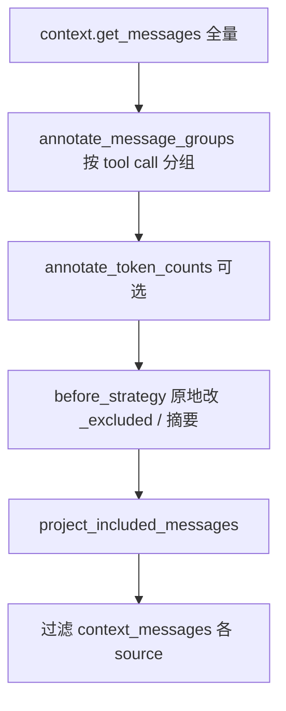

```python
# CompactionProvider.before_run 核心
all_messages = context.get_messages()
annotate_message_groups(all_messages)
await self.before_strategy(all_messages)   # 不删对象，只标注
projected = project_included_messages(all_messages)
# 从 context_messages 去掉 excluded 的 id
```

### 9.3 策略一览

| 策略 | 触发条件 | 动作 |
|------|----------|------|
| `ToolResultCompactionStrategy` | token 超 budget 比例 | 折叠旧 tool group 为摘要 Message |
| `TruncationStrategy` | 仍超 budget | 删最老 non-system group |
| `ContextWindowCompactionStrategy` | 组合 | 50% budget tool 折叠 → 80% budget 截断 |
| `SlidingWindowStrategy` | 条数/组数 | 保留最近 N 组 |
| `SummarizationStrategy` | 配置 | LLM 摘要旧对话 |

### 9.4 after_strategy

`CompactionProvider.after_run` 从 `session.state[history_source_id]` 取 History 存的 messages，跑 `after_strategy`，**写回 storage**——下一轮 load 已是压缩后的全量。

### 9.5 与 nanobot 对比

| | MAF | nanobot |
|---|-----|---------|
| 机制 | `_excluded` 标注 + 投影 | `last_consolidated` cursor |
| 存储 | History 全量含 excluded | `history.jsonl` 追加 |
| 触发 | Provider `before_run` | 独立 consolidate 步骤 |

---

## §10 Workflow 与 Orchestration 顶层设计

### 10.1 三层概念

| 层 | 类型 | 职责 |
|----|------|------|
| **Workflow** | `Workflow` + `WorkflowBuilder` | 图：Executor 节点 + 边 + 共享 state |
| **Runner** | `run_until_convergence` | Pregel **superstep**：批量投递消息 |
| **Orchestration** | `*Builder` in `orchestrations/` | 高层模式一键建图 |

```text
Orchestration Builder.build()  →  Workflow 图
workflow.run()                 →  Runner superstep 循环
AgentExecutor 节点             →  agent.run()  →  Tool Loop
```

### 10.2 superstep 与 Tool Loop 正交

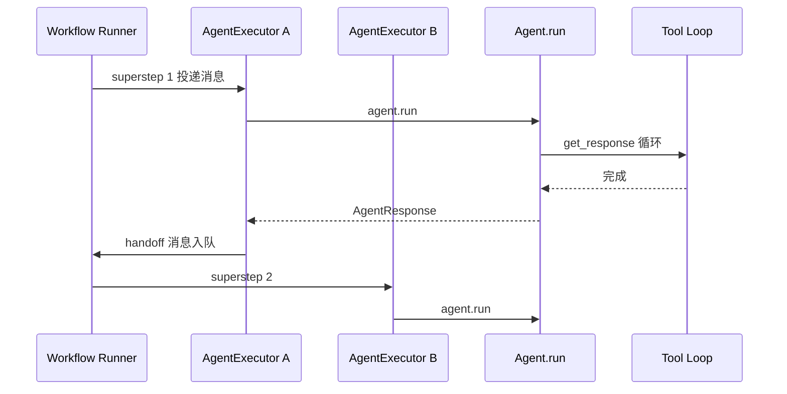

### 10.3 Orchestration Builders 对比

| Builder | 路由谁决定 | 典型拓扑 | 与 Handoff 区别 |
|---------|------------|----------|-----------------|
| `SequentialBuilder` | 图固定顺序 | A→B→C 链 | 无运行时路由 |
| `ConcurrentBuilder` | 扇出扇入 | A∥B→merge | 并行检索 |
| `HandoffBuilder` | **Agent 自己**调 `handoff_to_*` | 全连接 specialists | 去中心化 |
| `GroupChatBuilder` | **Orchestrator** 选下一发言者 | 星型 | 中心化 vs Handoff 去中心 |
| `MagenticBuilder` | Magentic 协调器 | 复杂任务分解 | 研究型多 Agent |

**包**：`agent_framework_orchestrations`；samples：`python/samples/03-workflows/orchestrations/`。

### 10.4 Checkpoint / HITL

- `CheckpointStorage`：每 superstep `commit()` 后可持久化；支持 resume
- `RequestInfoExecutor`：暂停等人工输入（`request_info` 事件）

### 10.5 Runner 核心循环

```python
# _runner.py run_until_convergence
while iteration < max_iterations:
    yield superstep_started
    await _run_iteration()      # 各 Executor 处理消息队列
    state.commit()
    create_checkpoint_if_enabled()
    yield superstep_completed
    if not has_messages():
        break
```

    if not has_messages():
        break


### 10.6 Workflow 与 Orchestrator：是类还是概念？

两者 **都是真实 Python 类**，同时也在文档里作为 **架构角色** 使用。不要和 CrewAI 的 `Crew` / `Flow` 混为一谈。

#### 10.6.1 `Workflow` —— 有类，是运行时对象

| | 说明 |
|---|------|
| **类** | `agent_framework._workflows._workflow.Workflow` |
| **如何得到** | `WorkflowBuilder(...).add_edge(...).build()` 或各 `*Builder.build()`（内部仍用 `WorkflowBuilder`） |
| **职责** | 持有 **Executor 图** + **边** + **Runner**；`workflow.run()` 驱动 superstep |
| **不是** | 不是 Agent 的子类；不是「抽象流程图」配置文件 |

```python
# 概念：build 产出可 run 的对象
workflow: Workflow = HandoffBuilder().participants([a, b]).with_start_agent(a).build()
result = await workflow.run("用户问题")
```

**体现方式**：

```text
WorkflowBuilder.build()
  → Workflow(executors={id: Executor}, edge_groups=[...], start_executor=...)
  → 内部 Runner.run_until_convergence()
  → 每个 superstep：drain_messages → Executor.execute(handler)
```

单 Agent 路径 **没有** `Workflow` 实例；只有 `workflow.run()` 入口才会创建并执行它。

#### 10.6.2 Orchestrator —— 角色名 + 多个具体 Executor 类

「Orchestrator」在 MAF 里 **不是** 一个统一的基类名，而是指 **Workflow 图中负责调度、不直接干活的节点**：

| 编排 | Orchestrator 实现类 | 文件 | 干什么 |
|------|---------------------|------|--------|
| **GroupChat** | `GroupChatOrchestrator`（函数 selector） | `_group_chat.py` | `selection_func(state)` 选下一发言者 |
| **GroupChat** | `AgentBasedGroupChatOrchestrator` | `_group_chat.py` | 用 **Manager Agent** + JSON 结构化输出选发言者 |
| **Magentic** | `MagenticOrchestrator` | `_magentic.py` | Facts/Plan/Progress ledger，选下一参与者 |
| **Concurrent** | `ConcurrentDispatcher` / Aggregator | `_concurrent.py` | 扇出扇入（调度型节点，非对话 orchestrator） |
| **Sequential** | `input-conversation` / `complete` 等适配节点 | `_sequential.py` | 管道节点，不算「智能 orchestrator」 |
| **Handoff** | **无** 中央 Orchestrator | `_handoff.py` | 路由 decentralized，各 `HandoffAgentExecutor` 自选 handoff |

```text
GroupChat 拓扑（星型）:

        ┌── Agent A
        │
User ──►│ Orchestrator ──► 选 B 发言
        │
        └── Agent B

Handoff 拓扑（无中央 orchestrator）:

User ──► Agent A ──handoff_to_B──► Agent B
         （全连接边仅用于 broadcast 同步 cache）
```

#### 10.6.3 与 Agent / AgentExecutor 的关系

```text
Workflow
  └── Executor 节点（图上的「算子」）
        ├── HandoffAgentExecutor   → 包装 Agent，含 handoff 逻辑
        ├── AgentExecutor          → 普通 Agent 包装
        ├── GroupChatOrchestrator  → 调度器（可内嵌 Manager Agent）
        ├── MagenticOrchestrator   → Magentic 调度器
        └── 自定义 @executor 函数节点
```

**AgentExecutor** 把 `Agent.run()` 嵌进 Workflow；**Orchestrator 类 Executor** 通常 **不** 等价于业务 Agent，而是跑调度逻辑（或再调一个 Manager `Agent.run()`）。

#### 10.6.4 一句话区分

| 词 | 是什么 |
|----|--------|
| **Workflow** | 可 `run()` 的 **图执行引擎类** |
| **WorkflowBuilder** | 拼图的 **工厂** |
| **Executor** | 图上 **节点** 的基类 |
| **Orchestrator** | 架构角色：图中 **负责「下一步谁干」的 Executor**（多种具体类） |
| **Agent** | 调 LLM 的 **业务智能体**（可被 Executor 包装） |

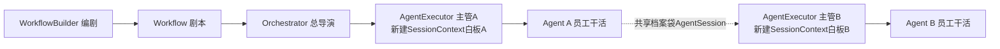
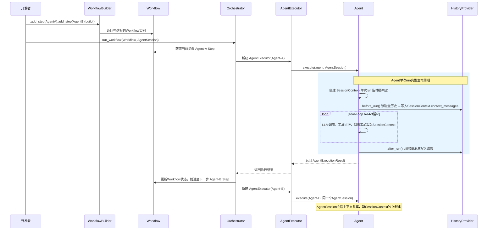
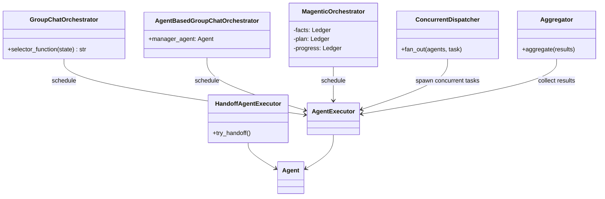
**图张什么样，看用了哪个 Builder**（Sequential 链 / Concurrent 扇出 / Handoff mesh / GroupChat·Magentic 星型）。

**WorkflowBuilder 只负责造出 Workflow；Orchestrator 只负责运行 Workflow。Builder 和 Orchestrator 从头到尾没有任何直接关系。**
整个过程拆分为**完全独立的两个阶段：建造阶段、运行阶段**。

## 冲突的两套模型

### 模型 1：我上一轮讲的【理想化业界通用编排模型（错误套用到 MAF）】

>
> 假想：`Orchestrator` 是**Workflow 外面独立的顶层导演引擎**，Workflow 只是一份被动的剧本清单，外部 Orchestrator 读取剧本然后驱动它执行。

```
Orchestrator(顶层调度引擎) → 驱动 → Workflow(纯剧本)
```

❌ **这个架构并不是 MAF 源码的真实实现，就是你看到冲突的根本原因。**

### 模型 2：你截图 PPT（MAF 源码真实定义，权威）

>
> 原文：**「Orchestrator」 在 MAF 里不是一个统一的基类名，而是指 Workflow 图中负责调度、不直接干活的节点**

```
Workflow = 一张有向执行图（Graph）
    ├─ Agent节点（干活节点，内部运行AgentExecutor）
    └─ Orchestrator调度节点（内嵌在Workflow图内部！！）
```

✅ Orchestrator**不是 Workflow 外面的引擎，而是 Workflow 图里面的其中一类节点**。

---

# 重新纠正：WorkflowBuilder / Workflow / Orchestrator 在 MAF 里面真实关系

## 1. WorkflowBuilder（建造器）

链式 API，**往 Workflow 图里面添加各种各样节点**：

- 可以添加普通 `AgentNode`（业务 Agent）
- 也可以添加调度节点：`GroupChatOrchestrator` / `MagenticOrchestrator` / `ConcurrentDispatcher`

调用 `.build()` 生成最终的 `Workflow`（一张完整的节点有向图）。

>
> ✨关键点：**Orchestrator 调度节点是被 Builder 添加进 Workflow 图内部的内容，而不是 Workflow 的外部调用者**

## 2. Workflow

Workflow 本质 = **由多个节点构成的执行图 Graph**，而不是一份简单线性步骤列表。
Workflow 图里面可以包含：

表格

| 节点类型 | 示例 | 职责 |
| --- | --- | --- |
| 干活节点 | AgentNode | 内部启动 AgentExecutor 运行 Agent，执行业务任务 |
| 调度节点 (Orchestrator 角色) | GroupChatOrchestrator | MagenticOrchestratorConcurrentDispatcher不干活，专门负责选下一跳、调度其他 Agent 节点 |

>
> Orchestrator 属于 Workflow 图内部的一个节点成员，不是 Workflow 的上级。

## 3. 谁驱动 Workflow 图跑起来？

MAF 有一个底层通用**Workflow 运行时引擎（非常轻薄，只负责图跳转，不带任何业务调度决策逻辑）**

- 这个底层引擎**没有智能选人能力**，它只负责：运行当前节点、拿到节点返回的`next_node_id`，然后跳转到下一个节点。
- **所有多‑Agent 调度、选下一个 Agent 的业务决策，全部交给 Workflow 图内部的 Orchestrator 节点自己完成！**
#### 10.6.5 各 Orchestrator 实现原理（详解）

清单、初始化流程图、引用关系、GroupChat / Magentic 状态机与对照表 → **[Part 3 第11章](./ARCHITECTURE_PART3.md)**（§2.1–§2.6、§5–§8）。

---

## §11 Handoff 与多 Agent 设计

### 11.0 Handoff 详解（本章首选）

本节合并 Handoff 的完整叙事：**是什么 → 两层分工 → 实现 → Executor 时机 → 对话同步 → 多轮用户输入 → 历史约束 → 可运行 Demo → 选型**。

#### 11.0.1 Handoff 是什么？解决什么问题？

**Handoff = 多 Agent 协作里的「转接」**：当前 Agent 判断「这事不归我管」，把对话交给另一个专家 Agent 继续，而不是自己硬答或让父 Agent 代劳。

| 类比 | 没有 Handoff | 有 Handoff |
|------|--------------|------------|
| 客服 | 固定流水线 A→B→C，或经理替专员打电话（`as_tool()`） | 一线说「转退款组」，调度系统转接 |
| 技术 | `SequentialBuilder` 写死顺序 | 当前 Agent **自己**选 `handoff_to_*` |
| 运行时 | 嵌套在一个 `agent.run()` 里 | Workflow **换 Executor 节点**（superstep） |

**与 CrewAI hierarchical**：CrewAI 是 Manager **同步** `DelegateWorkTool` → `worker.execute_task()`（同一 kickoff 调用栈）；MAF 是 Workflow **消息边** + 下一 superstep 另一个 `agent.run()`。编排原理对比见 **§1.5**。

#### 11.0.2 两层分工：Agent 层 vs Workflow 层

Handoff 横跨 **两个 Loop**（见 §0.3），职责必须分开：

```text
┌─────────────────────────────────────────────────────────────┐
│ Workflow 层（Runner / HandoffAgentExecutor）                 │
│  · 谁该跑：should_respond + superstep 消息投递               │
│  · 对话共享：_cache / _full_conversation / broadcast       │
│  · 路由：send_message(target_id=B) → 下一 superstep          │
│  · 用户多轮：request_info → workflow.run(responses=...)      │
└───────────────────────────┬─────────────────────────────────┘
                            │ 每个节点内
┌───────────────────────────▼─────────────────────────────────┐
│ Agent 层（单次 agent.run / Tool Loop）                       │
│  · LLM 决策：输出 handoff_to_{target_id} 或普通 tool        │
│  · Function 层：_AutoHandoffMiddleware 截断 handoff tool    │
│  · 产出：AgentResponse（含合成 function_result）            │
└─────────────────────────────────────────────────────────────┘
```

**一句话**：Agent 层负责「我决定转给谁」；Workflow 层负责「真的换人去跑」。

#### 11.0.3 实现：把「转接」伪装成 tool

`HandoffBuilder.build()` 为每个参与者 **克隆 Agent** 并（`_handoff.py` `HandoffAgentExecutor._prepare_agent_with_handoffs`）：

1. 注册合成工具 `handoff_to_{target_id}`（函数体 `pass`，`approval_mode="never_require"`）
2. 追加 `_AutoHandoffMiddleware` 到 `agent.middleware`
3. 设 `allow_multiple_tool_calls=False`（禁止一次 handoff 多个目标）
4. 包装为 `HandoffAgentExecutor`，挂到 **全连接** Workflow 图（fan-out 边用于 broadcast）

模型输出示例：

```text
tool_call: handoff_to_refund_agent()
```

**没有**在 tool 函数里 `await refund_agent.run()`——那是 `as_tool()` 的路径。

#### 11.0.4 Function 层截断（`_AutoHandoffMiddleware`）

Tool Loop 正常路径：`LLM → 执行 @tool → result → 再调 LLM`。

若 handoff 走普通路径的问题：

| # | 问题 |
|---|------|
| 1 | `@tool` 函数体是 `pass`，无有意义 result |
| 2 | 若在函数里 `await other_agent.run()`，会在 **当前 Agent 的 Tool Loop 内嵌套**，绕开 Workflow 广播与 superstep |

截断逻辑（`_handoff.py:130-152`）：

```python
class _AutoHandoffMiddleware(FunctionMiddleware):
    async def process(self, context, call_next):
        if context.function.name not in self._handoff_functions:
            await call_next()
            return
        context.result = FunctionTool.parse_result({
            HANDOFF_FUNCTION_RESULT_KEY: self._handoff_functions[context.function.name]
        })
        raise MiddlewareTermination(result=context.result)
```

| 步骤 | 发生的事 |
|------|----------|
| 1 | LLM 发出 `handoff_to_B` |
| 2 | Middleware 拦截，**不** `call_next()`，tool 函数体永不执行 |
| 3 | 注入合成 `function_result`：`{"handoff_to": "B的id"}` |
| 4 | `MiddlewareTermination` → 当前 `agent.run()` / Tool Loop 结束 |
| 5 | `HandoffAgentExecutor._is_handoff_requested(response)` 解析 payload |
| 6 | `ctx.send_message(..., target_id=B, should_respond=True)` 入队 |
| 7 | **下一 superstep** B 的 Executor 跑 `agent.run()` |

#### 11.0.5 `HandoffAgentExecutor._run_agent_and_emit` 逐步

覆写基类（`_handoff.py:349-436`），单次「活跃 Agent 跑完」的完整逻辑：

```text
1. [start agent 首次] _broadcast_messages(_cache) 初始化全员 cache
2. _full_conversation.extend(_cache)              累积跨 handoff 的「干净」对话
3. _should_terminate()? → return
4. agent.run(_cache) → AgentResponse
5. _cache.clear()
6. clean_conversation_for_handoff(response)       去掉 function_call/result 给用户看的副本
7. _full_conversation.extend(cleaned)
8. _broadcast_messages(cleaned, should_respond=False)  同步给其他 Executor
9. _is_handoff_requested(response)?
     ├─ 是 → _cache.append(handoff_message)       保留 tool result 供本 Agent 下次 run 对齐
     │        send_message(target, should_respond=True)
     │        emit handoff_sent 事件 → return
     └─ 否 → autonomous_mode? 递归 _run_agent_and_emit
              否则 request_info(HandoffAgentUserRequest) 等用户
```

**检测 handoff**（`_is_handoff_requested`，~484-528）：读 `response.messages[-1]` 里 `type=="function_result"` 的 payload，查找 key `handoff_to`（`HANDOFF_FUNCTION_RESULT_KEY`）。Middleware 截断导致正常 messages 里可能缺 tool call/result 配对，故 handoff 时把含 result 的 **整条 message** 写入 `_cache`，保证该 Agent 下次 `run` 历史合法。

#### 11.0.6 `HandoffAgentExecutor` 何时执行？

`build()` **不执行**，只创建 Executor 并连边。`agent.run()` 由 **`should_respond`** + **superstep 投递** 触发（详见 **§11.2**）。

| # | 时机 | 谁跑 | 条件 |
|---|------|------|------|
| 1 | 首次输入 | `is_start_agent=True` | `workflow.run(message)` → `start_executor.execute`（superstep 0 **之前**） |
| 2 | Handoff | 目标 Executor | 上一 Agent `send_message(should_respond=True, target_id=...)` → **下一 superstep** |
| 3 | 广播 | 其他参与者 | `should_respond=False` → 只 `extend(_cache)` |
| 4 | 用户回复 | 上次活跃 Executor | `request_info` 后 `workflow.run(responses=...)` → `handle_response` |

**关键先后**：

- A 的 `agent.run()` 在 middleware 截断后 **同一 handler 内** 结束。
- B 的 `agent.run()` 在 **消息 drain + edge 投递之后**（下一 superstep）才开始。
- `ctx.send_message` 入队（`_runner_context.py`）；`drain_messages` 在 `_run_iteration`（`_runner.py`）。

#### 11.0.7 用户多轮：`request_info` 循环

专家 Agent 若不 handoff、需要追问用户：

```text
workflow.run("初始问题")
  → … agent 回复 …
  → request_info 事件（HandoffAgentUserRequest）
  → WorkflowRunState.IDLE_WITH_PENDING_REQUESTS

workflow.run(responses={request_id: HandoffAgentUserRequest.create_response("用户补充")})
  → handle_response → broadcast 用户消息 → _run_agent_and_emit
```

脚本化示例见 `handoff_simple.py` 的 `scripted_responses` 循环。

#### 11.0.8 为何必须 `require_per_service_call_history_persistence=True`

`HandoffBuilder.build()` 校验所有 participant（`_handoff.py:948-965`）。

原因链：

```text
MiddlewareTermination 短路 handoff tool
  → 服务端 conversation API 从未看到这次 tool call/result
  → 若仅在 run 结束由 HistoryProvider save 一次
  → 本地 history 含服务端不知道的 function_result
  → 下一 turn call/result 错位
```

因此 Handoff 路径上 **once-per-run** 的 `HistoryProvider.before_run` 被跳过（§5、§7.5），改由 **per-service-call** 的 Chat/Function middleware 在 **每一轮 LLM 后** 落盘，换 Agent 时本地与服务端对齐。

#### 11.0.9 可运行 Demo 与测试

| 用途 | 路径 | 说明 |
|------|------|------|
| **最完整 Handoff** | `python/samples/03-workflows/orchestrations/handoff_simple.py` | 4 Agent 分诊 + 多轮 `responses=` + 各 specialist 工具 |
| Autonomous handoff | `handoff_autonomous.py` | `.with_autonomous_mode()` |
| HITL + checkpoint | `handoff_with_tool_approval_checkpoint_resume.py` | 工具审批 + 恢复 |
| Workflow as Agent | `agents/handoff_workflow_as_agent.py` | 整图 `as_agent()` |
| 端到端 UI | `samples/05-end-to-end/ag_ui_workflow_handoff/` | FastAPI + React + 审批 |
| 单 Agent 冒烟（**非**多 Agent） | `python/examples/mytest/debug_quick.py` | OpenAI 兼容网关，无 Workflow |
| 无 LLM 单测 | `packages/orchestrations/tests/test_handoff.py` | mock 全流程 |

运行 Handoff sample（需 Foundry）：

```bash
cd agent-framework/python
uv sync
# FOUNDRY_PROJECT_ENDPOINT / FOUNDRY_MODEL + az login
uv run python samples/03-workflows/orchestrations/handoff_simple.py
```

五种 Orchestration Builder 索引：`python/samples/03-workflows/orchestrations/README.md`（§10.3）。

#### 11.0.10 选型对照

| | `as_tool()` | Handoff | CrewAI delegate |
|---|-------------|---------|-----------------|
| 谁决定 | **父** Agent | **当前** Agent | **Manager** |
| 执行位置 | 父 Tool Loop 内 `await` 子 run | Workflow 换节点 | 同栈 `execute_task` |
| 对话共享 | 默认隔离 session | `_full_conversation` 广播 | `Task.context` |
| 典型场景 | 研究子任务、工具化专家 | 客服转专家、动态路由 | 集中式 Task 调度 |

| | Handoff | GroupChat |
|---|---------|-----------|
| 下一发言者 | 当前 Agent 调 `handoff_to_*` | Orchestrator / selector 中央选 |
| 控制流 | 去中心化 | 中心化 |

#### 11.0.11 端到端时序（总览）

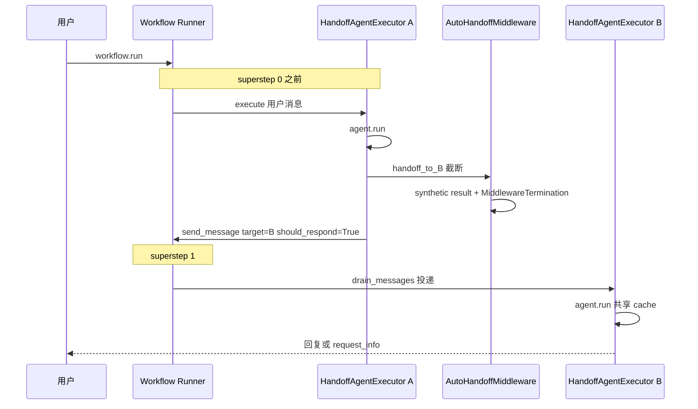

---

### 11.1 三种多 Agent 模式

| 模式 | 机制 | 会话 | 适用 |
|------|------|------|------|
| **`agent.as_tool()`** | 父 Tool Loop 内 `await` 子 `agent.run()` | 默认隔离；`propagate_session=True` 共享 | 同进程嵌套专家 |
| **HandoffBuilder** | Workflow 图 + `handoff_to_{id}` + 消息边 | 每节点可绑 `AgentSession`；**共享对话** | 动态路由客服/专家 |
| **Sequential / Concurrent** | 固定图拓扑 | 节点独立或合并 state | 流水线/并行 |

与 CrewAI 编排差异见 **§1.5**。

### 11.2 `HandoffAgentExecutor` 何时执行？

`HandoffAgentExecutor` **不在** `HandoffBuilder.build()` 时执行——那时只创建实例、挂到 Workflow 全连接图上。真正跑 `agent.run()` 由 **Workflow Runner 按消息 + `should_respond` 标志** 驱动。

#### 11.2.1 核心规则

```python
# _agent_executor.py — 基类 handler（HandoffAgentExecutor 未覆写）
@handler
async def run(self, request: AgentExecutorRequest, ctx):
    self._cache.extend(request.messages)
    if request.should_respond:
        await self._run_agent_and_emit(ctx)   # HandoffAgentExecutor 覆写此方法
```

**只有 `should_respond=True` 时才调用 `agent.run()`**；`False` 时只更新 `_cache`，用于多 Agent 对话同步。

#### 11.2.2 四个执行时机

| # | 时机 | 谁执行 | 触发条件 | 源码路径 |
|---|------|--------|----------|----------|
| 1 | **首次用户输入** | `is_start_agent=True` 的 Executor | `workflow.run(message)` | `_workflow.py` `start_executor.execute(message)` → `from_str`/`from_messages` → `_run_agent_and_emit` |
| 2 | **Handoff 转接** | 目标 Agent 的 Executor | 上一 Agent `_is_handoff_requested` 后 `send_message(..., should_respond=True, target_id=...)` | **下一 superstep** 消息投递后 |
| 3 | **广播同步** | 其他参与者 Executor | `send_message(should_respond=False)` | 只 `extend(_cache)`，**不跑** Agent |
| 4 | **用户回复** | 上次活跃的 Executor | `request_info` 暂停后 `workflow.run(responses=...)` | `handle_response` → `_run_agent_and_emit` |

#### 11.2.3 superstep 与 handoff 的先后

```text
workflow.run("我要退款")
  │
  ├─ [superstep 0 之前] start HandoffAgentExecutor A.execute(用户消息)
  │     → A._run_agent_and_emit → agent.run()
  │     → LLM 输出 handoff_to_B → Middleware 截断 → A 的 run 结束
  │     → broadcast 给其他 Executor（should_respond=False，只写 cache）
  │     → send_message(should_respond=True, target=B)  ← 消息入队
  │
  └─ [superstep 1] Runner.drain_messages → 经 edge 投递到 B
        → B.run(request) → should_respond=True → B._run_agent_and_emit → agent.run()
```

要点：

- **A 的 `agent.run()` 在 middleware 截断 handoff tool 后立即结束**（同一 handler 调用内）。
- **B 的 `agent.run()` 要等到当前 superstep 结束、消息投递后**（下一 superstep）才开始。
- 事件（`output`、`handoff_sent`）在 handler 内实时 `add_event`；**跨 Executor 消息**在 superstep 边界批量投递（`_runner_context.send_message` 入队 → `_run_iteration` `drain_messages`）。

#### 11.2.4 Autonomous mode 例外

若开启 `autonomous_mode` 且无 handoff，**同一 `_run_agent_and_emit` 内递归**再次调用自身（不等 superstep），用于长任务多轮自驱，直到 handoff / 终止条件 / `request_info`。

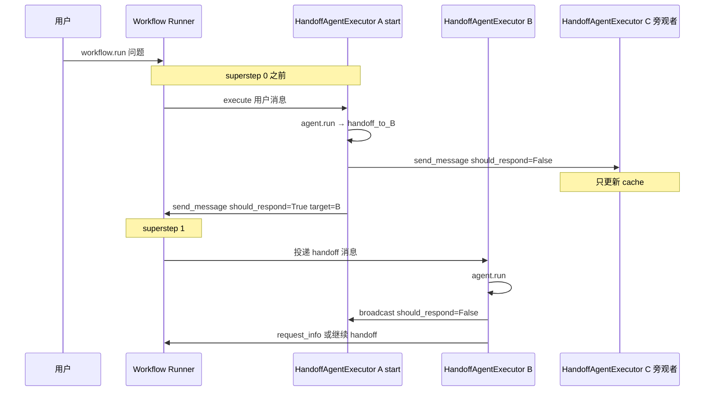

### 11.3 Handoff 流程（源码级）

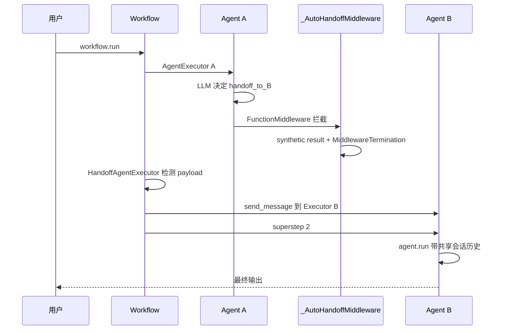

**build 阶段**（`_handoff.py`）：

1. `participants([agent_a, agent_b, ...])`
2. 每 agent 克隆 + 注册 `handoff_to_{target_id}` 工具
3. 注入 `_AutoHandoffMiddleware`
4. 校验 `require_per_service_call_history_persistence=True`

### 11.4 为何必须 per-service-call history

Handoff tool 被 `MiddlewareTermination` 短路 → **服务端 API 看不到这次 tool call 的真实执行**。若只在 run 结束 save 一次，本地 history 与服务端 conversation 会 **call/result 错位**。因此每轮 LLM 后必须本地持久化，换 Agent 时历史一致。

展开说明与校验逻辑见 **§11.0.8**；Agent 层跳过 once-per-run History 的路径见 **§5**、**§7.5**。

### 11.5 Handoff vs GroupChat

| | Handoff | GroupChat |
|---|---------|-----------|
| 下一发言者 | 当前 Agent 调 tool 自选 | Orchestrator 中央调度 |
| 控制流 | 去中心化 | 中心化 |
| 源码注释 | `_handoff.py` 头部 | `_group_chat.py` |

### 11.6 与 CrewAI delegate 对比

| | MAF Handoff | CrewAI hierarchical |
|---|-------------|---------------------|
| 调度者 | 当前 Agent 自选 `handoff_to_*` | Manager 统一执行每个 Task |
| 切换方式 | Workflow superstep 换 Executor | 同步 `DelegateWorkTool` → `execute_task` |
| 执行边界 | 两个独立 `agent.run()`，中间 superstep | 同一 kickoff 调用栈内嵌套 |
| 对话传递 | `_full_conversation` 广播 + per-service-call history | `Task.context` 拼 prompt |

完整编排原理对比见 **§1.5**；各类 **Orchestrator 实现详解** 见 **§20**。

---
# 核心误区一次性解开

>
> **WorkflowRunner ≠ Orchestrator！二者是完全不同层级的东西**
> PPT 原文 `Handoff无中央Orchestrator`，指**没有独立做调度决策的业务节点**，**底层传送带 WorkflowRunner 永远存在，所有 Workflow 运行都离不开它**。

## 1、WorkflowRunner 到底是什么

### 定义（底层通用运行时引擎，基础设施）

它是**不带任何业务智能决策的、纯机械的 Workflow 图跳转驱动器（传送带）**。
无论你跑 GroupChat / Magentic / Concurrent / Handoff 任何模式，Workflow 启动运行的时候一定会有 `WorkflowRunner`。

它只负责 4 件纯机械工作，**绝对不会自己决定下一个 Agent 是谁**：

1. 管理全局会话 `AgentSession`
2. 维护 `superstep`（超级步数）、消息队列、消息投递
3. 接收**当前节点返回的下一跳节点 ID (next_id)**
4. 根据返回的 next_id，跳转执行下一个 Workflow 节点

>
> 比喻：WorkflowRunner = 一条自动化传送带；传送带本身不知道下一站去哪，**目的地必须由当前正在运行的节点告诉它**。

## 2、Orchestrator（调度节点）又是什么

Orchestrator 是**Workflow 图内部、一个专门用来做「选下一跳」业务决策的特殊节点**，它是可选组件。

- 中心化模式（GroupChat、Magentic）：Workflow 图中**放入这个独立调度节点**。由 Orchestrator 节点算出下一个 Agent，把 next_id 交给 WorkflowRunner，Runner 再跳转。
- Handoff 去中心化模式：Workflow 图**不放置任何 Orchestrator 调度节点**。**决策逻辑下沉到干活 Agent 自己身上**，`HandoffAgentExecutor‑A` 自己算出下一跳 target=B，返回 next_id 给 Runner。

# 两条执行链路对比

## 链路 A｜中心化（GroupChat，有 Orchestrator 调度节点）

```
WorkflowRunner(传送带)
        ↓执行
GroupChatOrchestrator（调度节点，做出选人决策：下一个Agent‑A）
        ↓返回next_id=A
WorkflowRunner(传送带) →跳转到→ Agent‑A节点
```

👉**决策人：Orchestrator 节点；跳转搬运：WorkflowRunner**

## 链路 B｜去中心化 Handoff（无中央 Orchestrator）【你的时序图就是这条】

```
WorkflowRunner(传送带)
        ↓执行
HandoffAgentExecutor‑A（干活Agent自己做出handoff决策，target=B）
        ↓返回next_id=B
WorkflowRunner(传送带) →跳转到→ Agent‑B节点
```

👉**决策人：AgentExecutor‑A 本身；跳转搬运：WorkflowRunner**

>
> 这里「没有中央 Orchestrator」的含义：**不存在单独一个节点专门负责调度选人**，并不是废掉底层 Runner 传送带。

# 逐行拆解你这张 Handoff 时序图

1. 用户发起 `workflow.run(问题)` →唤醒底层`WorkflowRunner`
2. superstep0 之前：Runner 机械的把用户消息投递，执行 `HandoffAgentExecutor‑A`
3. Agent A 执行 `agent.run()`，**Agent 内部 LLM 自主判断 `handoff_to_B`**
>
> ⚠️调度决策在这里诞生！没有外部调度节点参与
4. Agent‑A 发送广播消息给旁观者 C：`send_message should_respond=False`；Agent‑C 仅更新本地缓存，不会启动执行
5. Agent‑A 返回指令给 WorkflowRunner：`should_respond=True target=B`
6. Runner 进入 superstep1，**完全按照收到的指令，机械投递 handoff 消息给 Agent‑B**，启动 B 的执行

>
> 全程 Runner 没有任何判断、没有干预路由，只做消息搬运。

# WorkflowRunner VS Orchestrator 对照表

表格

| 项目 | WorkflowRunner | Orchestrator 调度节点（GroupChatOrchestrator/MagenticOrchestrator） |
| --- | --- | --- |
| 层级 | 底层 Workflow 运行时基础设施（传送带） | Workflow 图内的业务节点（决策者） |
| 是否必须存在 | ✅任何 Workflow 运行都必须有 Runner | ❌可选；Handoff 模式下不存在 |
| 职责 | 消息投递、superstep 计数、节点跳转、会话管理 | **做出选下一跳 Agent 的调度决策** |
| 会不会选 Agent | ❌永远不会，只能被动接收 next_id | ✅核心工作就是决定下一个执行者是谁 |

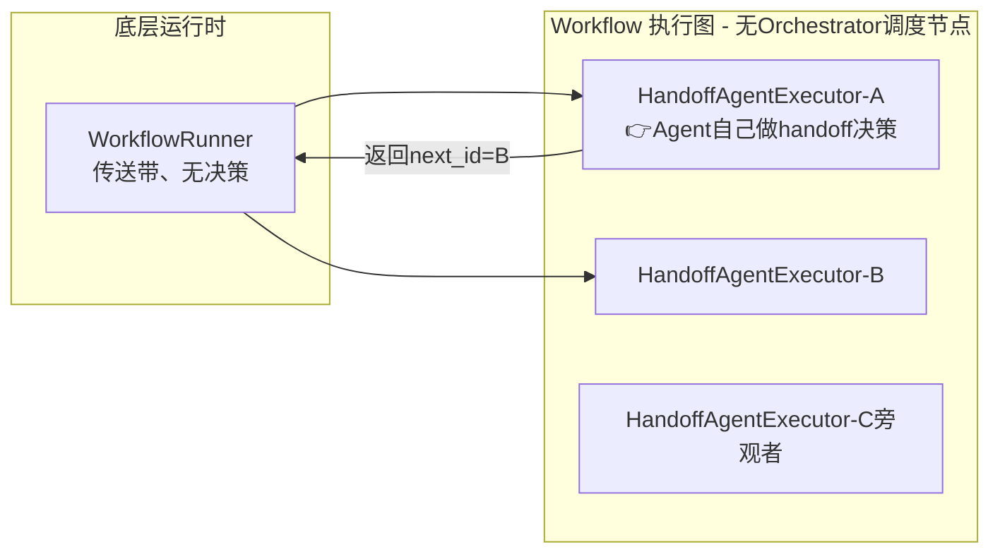
## §12 Hosting

### 12.1 分层（Hosting 包不含 HTTP Server，ADR-0027）

```text
你的 FastAPI / Functions     ← 路由、鉴权
Protocol Helper              ← responses_to_run / from_run
AgentState + SessionStore    ← session_id → AgentSession
Agent.run()                  ← 业务
```

### 12.2 选型

| 模式 | 包 | 谁管 HTTP |
|------|-----|-----------|
| Foundry Hosted | `foundry_hosting` | 平台 |
| 自托管 + helper | `hosting`, `hosting-responses` | 你 |
| Azure Functions | `azurefunctions` | Functions |
| Durable Task | `durabletask` | Worker |

### 12.3 `AgentState` 五步

```python
state = AgentState(agent, session_store=store)
session = await state.get_or_create_session(session_id)  # get 返回副本
result = await (await state.get_target()).run(messages, session=session)
await state.set_session(session_id, session)  # post-run 必须
```

Responses continuation：每轮 mint 新 `response_id` 时 `set_session(new_id, session)` 支持分支。

---

## §13 Tools / Message / Skills

### Message

`Message` + `Role`；内容块：`TextContent`, `FunctionCallContent`, `FunctionResultContent`…

### `@tool`

```python
@tool
def search(query: str) -> str:
    """Search the web."""
```

生成 `FunctionTool`，schema 从类型注解 + docstring 推导。

### Skills（experimental）

`SkillsProvider` 从目录加载 `SKILL.md`，注入 system `<skills>` 块（`_skills.py`）。

---

## §14 三条执行路径

**A — 单 Agent**

```python
session = agent.create_session()
await agent.run("Hi", session=session)
await agent.run("Follow up", session=session)
```

**B — Workflow**

```python
workflow = HandoffBuilder().participants([a, b]).build()
async for event in workflow.run("task"): ...
```

**C — Hosting**

```python
session = await state.get_or_create_session(request.session_id)
result = await agent.run(messages, session=session)
await state.set_session(request.session_id, session)
```

---

## §15 框架对比

| 框架 | 多 Agent 编排 | 单 Agent 内循环 | 编排运行时 |
|------|---------------|-----------------|------------|
| **MAF** | `Workflow` 图 + Handoff 消息边 | `FunctionInvocationLayer` Tool Loop | Pregel **superstep** |
| **CrewAI** | `Crew` Task 链 + Manager 委托 | `AgentExecutor` 内层 Flow | `kickoff` 同步 for 循环 |
| **deepagents** | SubAgent tool | LangGraph P01 | 图节点 |
| **nanobot** | subagent tool | Bus + Runner | 消息总线 |

**MAF vs CrewAI 深度对比**（编排范式、路由、状态、嵌套模式）：见 **§1.5**。

本 monorepo 最接近：**deepagents**（P01 middleware + 图）；分层最像 **pi**。

---

## §16 源码索引与术语

### 16.1 源码索引

| 主题 | 路径 | 关键符号 |
|------|------|----------|
| Agent run | `_agents.py` | `RawAgent.run`, `_prepare_run_context`, `_prepare_session_and_messages` |
| after_providers | `_agents.py` ~526 | `_run_after_providers` |
| Session | `_sessions.py` | `AgentSession`, `SessionContext`, `HistoryProvider` |
| Tool Loop | `_tools.py` ~2614 | `FunctionInvocationLayer._get_response` |
| Middleware | `_middleware.py` | `AgentMiddlewareLayer` |
| Compaction | `_compaction.py` | `CompactionProvider.before_run` |
| Workflow | `_workflows/_runner.py` | `run_until_convergence` |
| Handoff | `orchestrations/_handoff.py` | `_AutoHandoffMiddleware`, `HandoffBuilder`, `HandoffAgentExecutor` |
| AgentExecutor | `_workflows/_agent_executor.py` | `run` handler, `should_respond`, `_run_agent_and_emit` |
| Magentic | `orchestrations/_magentic.py` | `ORCHESTRATOR_*_PROMPT`, `MagenticOrchestrator` |
| GroupChat Orchestrator | `orchestrations/_group_chat.py` | `GroupChatOrchestrator`, `AgentBasedGroupChatOrchestrator` |
| Workflow 类 | `_workflows/_workflow.py` | `Workflow`, `WorkflowBuilder` |
| Hosting | `hosting/_state.py` | `AgentState` |
| 运行时 Prompt | `_magentic.py`, `_skills.py`, `_group_chat.py` | §19 |

### 16.2 易混术语

| 术语 | 含义 |
|------|------|
| **AgentSession** | 多轮句柄，跨 `run()` |
| **SessionContext** | 单次 `run()` 上下文袋 |
| **Tool Loop** | `FunctionInvocationLayer` 内 LLM↔tool 循环 |
| **superstep** | Workflow Runner 一轮批量投递 |
| **Handoff** | 多 Agent 转接；Agent 层发信号、Workflow 层换节点（§11.0） |
| **HandoffAgentExecutor** | Handoff Workflow 节点；`should_respond=True` 时才 `agent.run()`（§11.0、§11.2） |
| **should_respond** | `AgentExecutorRequest` 标志；`False` 只写 cache 不跑 Agent |
| **Workflow** | 可 `run()` 的图执行引擎类（`WorkflowBuilder.build()` 产出）；见 §10.6 |
| **Orchestrator** | 图中负责「下一步谁干」的 Executor 角色（多种具体类）；实现详解 **§20** |
| **Plan 模式** | 仅 Magentic 内置 Facts/Plan/Replan；非全局；见 §19.1 |
| **service_session_id** | Provider/LLM 侧 conversation id |

### 16.3 本地可运行

**单 Agent 冒烟**（OpenAI 兼容，非多 Agent）：

```bash
cd agent-framework/python && uv sync
uv run python examples/mytest/debug_quick.py
```

**多 Agent Handoff 完整 demo**（需 `FOUNDRY_*` + `az login`）：

```bash
uv run python samples/03-workflows/orchestrations/handoff_simple.py
```

Samples 总览：`python/samples/01-get-started/` … `05-end-to-end/`；编排索引：`03-workflows/orchestrations/README.md`；Hosting：`04-hosting/`。

---

## §17 Agent / ChatClient 继承层：每层提供什么、为何多层

### 17.1 为何用 Mixin 而不是单一巨类

| 原因 | 说明 |
|------|------|
| **可选能力** | 只要 HTTP？用 `Raw*Client`。要 Tool Loop？加 `FunctionInvocationLayer` |
| **横切分离** | Telemetry、Middleware、Tool Loop 各管一事，可单独测试 |
| **Provider 组合** | OpenAI / Foundry / Anthropic 只实现最内层 Raw HTTP |
| **洋葱调用** | 外层 `super()` 委托内层，符合中间件模式 |

### 17.2 Agent 侧各层能力

| 层（MRO 从外到内） | 新增能力 | 若不继承则缺什么 |
|-------------------|----------|------------------|
| **`Agent`** | 对外类型名；文档推荐入口 | — |
| **`AgentMiddlewareLayer`** | `AgentMiddleware` 管道；把 Chat/Function middleware 转发给 `client_kwargs` | 无法 `run(middleware=[...])` 拦截整次 run |
| **`AgentTelemetryLayer`** | OpenTelemetry span、token/duration 指标 | 无可观测性 |
| **`RawAgent`** | `run`、`_prepare_run_context`、Provider 管道、`self.client` 调用 | 无 Agent 执行逻辑 |
| **`BaseAgent`** | `context_providers`、`default_options`、`create_session()` | 无会话与配置基座 |

用 `RawAgent` 可去掉 Middleware + Telemetry（高级/测试场景）。

### 17.3 ChatClient 侧各层能力

| 层（MRO 从外到内） | 新增能力 | 若不继承则缺什么 |
|-------------------|----------|------------------|
| **`OpenAIChatCompletionClient`** 等 | 对外类型 + Provider 配置 | — |
| **`FunctionInvocationLayer`** | **Tool Loop**；`max_iterations`；Function middleware 管道；tool 审批 replay | 只能单次 HTTP，需自己解析 tool_calls |
| **`ChatMiddlewareLayer`** | 每轮 LLM 的 Chat middleware（重试、改 options） | 无 per-LLM 拦截 |
| **`ChatTelemetryLayer`** | 每次 model call 的 trace/usage | 无 LLM 级遥测 |
| **`Raw*Client`** | `_inner_get_response` → HTTP；Provider 协议 | 无 SDK |

### 17.4 层数 vs 一次调用的关系

```text
一次 agent.run()：
  AgentMiddleware     → 1 次 process 链
  AgentTelemetry      → 1 次 trace 包裹
  RawAgent            → 1 次 Provider 管道 + 1 次 client.get_response 入口
  FunctionInvocation  → 内部 N 次 super().get_response（Tool Loop）
       每次 super 经过 ChatMiddleware + ChatTelemetry + Raw HTTP
```

**不是** 每层各 new 一个对象；是 **同一实例** 上 MRO 跳方法。

---

## §18 协作图集（合并恢复）

> 下图与 §0.4、§1.3 图 4、§4.4、§7.1、§9.2、§10.2、§11.2 互补；渲染失败时检查边标签是否含括号。

### 18.1 单 Agent 完整 run（含 Provider）

见 **§0.4** 时序图（`agent.run` + Tool Loop + Provider 正逆序）。

### 18.2 Provider 管道与 History/Memory 沉淀

见 **§7.1** flowchart 与 **§4.4** Session 协作时序。

### 18.3 Compaction 标注投影

见 **§9.2** flowchart。

### 18.4 三层入口总览

```mermaid
flowchart TB
    subgraph E1["入口 A：单 Agent"]
        A1["agent.run"]
    end
    subgraph E2["入口 B：Workflow"]
        W1["workflow.run"]
        W2["Runner superstep"]
        W3["AgentExecutor"]
    end
    subgraph E3["入口 C：Hosting"]
        H1["AgentState"]
        H2["protocol helper"]
    end
    CORE["共享：Agent.run → Provider → ChatClient Tool Loop"]
    A1 --> CORE
    W1 --> W2 --> W3 --> CORE
    H1 --> H2 --> CORE
```

### 18.5 多 Agent 模式选型

```mermaid
flowchart TD
    Q{"需要多 Agent?"}
    Q -->|否| SA["单 agent.run"]
    Q -->|是| Q2{"路由方式?"}
    Q2 -->|固定顺序/并行| SEQ["Sequential / Concurrent Builder"]
    Q2 -->|Agent 自选下一专家| HO["HandoffBuilder"]
    Q2 -->|中央主持讨论| GC["GroupChatBuilder"]
    Q2 -->|父调子同步| AT["agent.as_tool"]
```

### 18.6 Memory 与 History 双轨沉淀

```mermaid
flowchart LR
    subgraph History["HistoryProvider"]
        H1["Message 列表"]
        H2["session.state 或 JSONL"]
    end
    subgraph Memory["MemoryContextProvider"]
        M1["extract 事实"]
        M2["MEMORY.md + topics/"]
    end
    RUN["agent.run"]
    RUN -->|after_run save messages| History
    RUN -->|after_run extract| Memory
    RUN -->|before_run load| History
    RUN -->|before_run recall| Memory
```

### 18.7 ClassDiagram：run 期实体引用

见 **§1.3 图 3、图 4**。

---

## §19 运行时 Prompt 参考手册（中英对照）

> **独立文档**：[RUNTIME_PROMPTS.md](./ARCHITECTURE_PART2.md)（运行时 Prompt 五类分类，中文要点）。  
> 下文保留摘要索引；详细原文见独立文档。

### 19.0 速查索引

| # | Prompt | 用于 | 可覆盖？ |
|---|--------|------|----------|
| 19.4.1 | `ORCHESTRATOR_TASK_LEDGER_FACTS` | Magentic plan 第 1 步 | `StandardMagenticManager(task_ledger_facts_prompt=...)` |
| 19.4.2 | `ORCHESTRATOR_TASK_LEDGER_PLAN` | Magentic plan 第 2 步 | `task_ledger_plan_prompt` |
| 19.4.3 | `ORCHESTRATOR_TASK_LEDGER_FULL` | 合并写入 chat_history | `task_ledger_full_prompt` |
| 19.4.4 | `ORCHESTRATOR_TASK_LEDGER_FACTS_UPDATE` | Magentic replan | `task_ledger_facts_update_prompt` |
| 19.4.5 | `ORCHESTRATOR_TASK_LEDGER_PLAN_UPDATE` | Magentic replan | `task_ledger_plan_update_prompt` |
| 19.4.6 | `ORCHESTRATOR_PROGRESS_LEDGER` | 每轮内循环 JSON | `progress_ledger_prompt` |
| 19.4.7 | `ORCHESTRATOR_FINAL_ANSWER` | 终稿 | `final_answer_prompt` |
| 19.5 | GroupChat Manager JSON 指令 | 选发言者 | 改 `_invoke_agent` 内字符串或子类 |
| 19.6 | Handoff tool / autonomous | 转接 / 自驱 | `.add_handoff(..., description=)` / `autonomous_mode_prompt` |
| 19.7 | `DEFAULT_SKILLS_INSTRUCTION_PROMPT` | Skills 广告 | `SkillsProvider` 构造参数 |
| 19.2 | 单 Agent 组装 | 每次 `agent.run` | `instructions` + Provider |

### 19.1 有没有 Plan 模式？

**有，但不是全局开关**——只有 **Magentic** 编排内置完整的 Facts → Plan → Progress 规划循环；其他 Builder **没有** 与 CrewAI `Crew.planning=True` 对等的「kickoff 前给每个 Task 注入计划」。

| 能力 | MAF | CrewAI（对照） |
|------|-----|----------------|
| **Kickoff 前 Task 级计划** | ❌ 无内置 | ✅ `Crew.planning` + `CrewPlanner` |
| **多 Agent 编排级计划** | ✅ **MagenticBuilder**（Facts/Plan/Replan/Progress ledger） | ❌（Manager 委托无独立 plan 文档） |
| **人工审计划** | ✅ `MagenticBuilder.with_plan_review(True)` → `request_info` | 需自建 |
| **Handoff / Sequential / Concurrent** | ❌ 无框架级 plan prompt | Sequential 靠固定 Task 顺序 |
| **GroupChat** | ❌ 无 plan；只有「选下一发言者」 | — |
| **单 Agent** | ❌ 无内置 plan；可用 `instructions` / Skills / 自建 Provider | `planning_config` → AgentExecutor 内 Plan-and-Execute |

```python
# MAF 唯一内置「计划 + 执行 + 重规划」编排
workflow = (
    MagenticBuilder(participants=[researcher, writer], manager_agent=manager)
    .with_plan_review(enable=True)   # 可选：人审计划
    .build()
)
```

**结论**：问「MAF 有没有 plan」→ **有，在 Magentic 里**；Handoff/GroupChat 等是 **路由/调度** 模式，不是 plan 模式。
# Magentic 模式完整详解（MAF Microsoft‑Agent‑Framework）

>
> 起源：基于 AutoGen Magentic‑One，**中心化 Supervisor（项目经理）架构**，属于 Workflow 图内的一类 Orchestrator 调度节点Microsoft ...。

## 一、核心定位一句话

**Magentic = 带深度规划能力的中心化项目经理模式**
Workflow 图内部存在一个独立调度节点 `MagenticOrchestrator`（账本管理器）；它不是普通业务 Agent，专门负责：**动态生成计划、跟踪进度、分配专家 Agent 干活、检查结果、失败重规划、判断任务何时结束**。

>
> 和你之前学过 4 种多 Agent 关系全景：

1. **Handoff**：去中心化，干活 Agent 自己决定传给谁；无调度节点
2. **GroupChat**：中心化调度节点，但是**只选人轮流发言，几乎没有任务规划**
3. **Magentic**：中心化调度节点，**强规划、账本追踪、重规划纠错（项目经理）**
4. **as_tool 主子 Agent**：不需要 Workflow，主 Agent 在 tool‑loop 内部嵌套调用子 Agent

## 二、两大核心账本 Ledger（Magentic 灵魂）

MagenticOrchestrator 内部维护两份结构化账本，LLM 每次决策都读写账本，这是它和 GroupChatOrchestrator**最本质区别**Microsoft：

### 1. Task‑Ledger 任务账本（计划）

记录顶层目标、拆解后的子任务清单、已知事实、待验证信息、解题方案计划。

>
> 相当于项目经理写出来的项目计划书。

### 2. Progress‑Ledger 进度账本（状态）

每次专家 Agent 干完活，调度器更新进度账本，包含 5 个关键判断字段：

- `task_complete`：整体任务是否完成？
- `is_progress_being_made`：有没有取得进展？
- `is_in_loop`：是否陷入循环卡死？（防死循环）
- `next_speaker`：下一个该派谁执行
- `instruction`：给到下一个 Agent 的详细任务指令

>
> 相当于项目周报，项目经理复盘当前状态，决定下一步动作。

## 三、完整执行循环流程

```mermaid
flowchart LR
    U[用户任务] --> O[MagenticOrchestrator<br/>调度节点=项目经理]
    O -->|1.首次生成 Task‑Ledger计划书| W1[专家Agent‑A执行子任务]
    W1 -->|返回执行结果| O
    O -->|2.更新 Progress‑Ledger进度账本，复盘| JUDGE{任务完成?}
    JUDGE --否--> O
    JUDGE --否，需要换人--> W2[专家Agent‑B]
    W2 --> O
    JUDGE --是--> END[任务结束返回结果]
```

### 分步执行时序

1. WorkflowRunner（底层传送带）启动，首先执行 `MagenticOrchestrator`
2. Orchestrator LLM 拿到用户目标，**第一次规划 → Task‑Ledger**
3. 根据账本，选出专家 Agent，返回`next_id`交给 WorkflowRunner，Runner 跳转执行专家
4. 专家 Agent 完成子任务，控制权回到 Orchestrator 调度节点
5. Orchestrator 读取全部历史消息，更新**Progress‑Ledger**，做三件判断：
   - ✅任务全部做完？结束流程
   - ⚠️卡住、循环、进展停滞？重新规划 Task‑Ledger，调整方案
   - 🔁还没做完：指派下一位专家，下发详细指令
6. 循环往复直到判定任务完成

>
> ⚠️关键点：**专家 Agent 永远不会直接传给另一个专家 Agent，所有执行结束必须回到 Orchestrator 项目经理节点**。

```mermaid
flowchart LR
    subgraph WorkflowRunner[底层 WorkflowRunner 传送带]
    end
    subgraph Workflow Graph
        O[MagenticOrchestrator<br/>账本存储]
        A[专家Agent‑A]
        B[专家Agent‑B]
    end

    U[用户目标] --> WorkflowRunner --> O
    O --1. LLM生成初始TaskLedger(Plan)--> WorkflowRunner --> A
    A --子任务结果--> WorkflowRunner --> O
    O --2. LLM复盘生成ProgressLedger<br/>✅进展正常，沿用旧Plan--> WorkflowRunner --> B
    B --结果返回--> WorkflowRunner --> O
    O --3.检测卡住，LLM输出updated_plan<br/>👉触发重规划，新Plan覆盖旧计划--> WorkflowRunner --> A
    O --4. task_complete=True--> END[任务结束]
```
```python
1. 你调用 runner.run("调研人工智能教育现状")
    ↓
2. WorkflowRunner 跳到 MagenticOrchestrator.run()
    ↓
3. MagenticOrchestrator → StandardMagenticManager.decide()
    ↓
4. Manager拼接【内置项目经理系统Prompt + 用户问题 + 参与者列表】
    ↓
5. Manager调用LLM，生成初始TaskLedger（Plan）+ ProgressLedger
    ↓
6. Orchestrator保存账本，得到 next_speaker = research_expert
    ↓
7. WorkflowRunner 跳转 → research_expert.run(任务指令) 【工人Agent开始干活】
    ↓
8. 工人返回结果消息，控制权强制回到 MagenticOrchestrator
    ↓
9. 再次调用 Manager.decide()，带上【工人结果+历史账本】复盘，生成新进度账本，可触发重规划
    ↓ 循环往复
```
```mermaid
flowchart LR
    U[用户任务]-->WR[WorkflowRunner]
    WR-->MO[MagenticOrchestrator<br/>调度外壳，非Agent]
    MO-->SM[StandardMagenticManager<br/>规划大脑组件，非Agent]
    subgraph LLM调用生成Plan
        SM1[拼接内置项目经理系统提示词]
        SM2[拼接对话历史+账本+参与者列表]
        SM3[调用 llm_client 请求大模型<br/>JSON结构化输出]
        SM --> SM1 --> SM2 --> SM3
    end
    SM3-->DEC[MagenticDecision<br/>TaskLedger + ProgressLedger]
    DEC-->MO
    MO--返回jump_to指令-->WR
    WR-->WA[Worker‑Agent<br/>执行子任务]
    WA--结果消息返回-->WR
    WR-->MO
```

## 四、MagenticOrchestrator vs GroupChatOrchestrator（极易混淆）

表格

| 对比维度 | MagenticOrchestrator（项目经理） | GroupChatOrchestrator（群聊主持人） |
| --- | --- | --- |
| 核心工作 | 任务拆解、生成计划、账本追踪、失败重规划、防循环 | 简单轮流选人发言，**无规划逻辑** |
| 状态记忆 | Task‑Ledger + Progress‑Ledger 双账本 | 只维护简单参与者列表，没有任务计划账本 |
| Agent 指令 | 下发**详细子任务指令**给选中 Agent | 只点名字：轮到你发言，不分配任务 |
| 适用任务 | **开放复杂任务，解决方案事前未知，需要迭代探索** | 头脑风暴、多专家辩论评审，平等对话 |
| 架构 | 中心化 Supervisor 项目经理模式 | 平等委员会轮询模式 |

>
> 微软官方文档原话提示：如果只需要简单协调，不需要复杂规划，优先选 GroupChat，不要选 MagenticMicrosoft ...。

## 五、Magentic vs as‑tool 主子 Agent（两种主‑从方案的区别）

表格

| 项目 | Magentic（Workflow 图调度节点） | as_tool (Agent‑as‑Tool) |
| --- | --- | --- |
| 架构载体 | 必须 Workflow + WorkflowRunner，Orchestrator 是 Workflow 图内独立节点 | 不需要 Workflow，主 Agent 单次 run 内部 tool‑loop 嵌套调用子 Agent |
| 控制权流转 | 主调度节点执行→退出；专家执行→回到调度节点；**两次独立 run，SessionContext 白板每次换新** | Master 全程不退出 run，同步阻塞等待子 Agent 返回结果，Master 白板全程保留 |
| 主角色身份 | MagenticOrchestrator（调度节点，项目经理） | Master 业务 Agent（普通 Agent，把子 Agent 包装成工具） |
| 循环边界 | 可以跨超多轮 superstep 长周期任务 | 单次 agent.run 内部嵌套调用；超时后循环终止 |

## 六、Magentic vs Handoff

表格

| Magentic 中心化 | Handoff 去中心化 |
| --- | --- |
| 所有 Agent 执行完必须回到调度节点；项目经理决定下家 | Agent 干完活，**自己直接指定下一跳 Agent**，不存在项目经理；不返回调度节点 |
| Workflow 图必须内置 MagenticOrchestrator 调度节点 | Workflow 图**没有任何调度节点**，全部是干活 Agent 节点 |

## 七、MAF Magentic 最简伪代码

```
from agent_framework import Agent, WorkflowBuilder
from agent_framework.workflows.orchestrations import MagenticOrchestrator

# 1. 定义多个专家子Agent
web_surfer = Agent(name="网页浏览专家", ...)
coder = Agent(name="代码专家", ...)

# 2. 创建Magentic调度节点（项目经理）
orchestrator = MagenticOrchestrator(
    participants=[web_surfer, coder]
)

# 3. WorkflowBuilder构建Workflow图
builder = WorkflowBuilder()
builder.add_orchestrator_node("manager", orchestrator)
builder.add_agent_node("web", web_surfer)
builder.add_agent_node("code", coder)

workflow = builder.build()

# 4. WorkflowRunner启动运行
runner = WorkflowRunner(workflow)
await runner.run("深度调研并分析2026年新能源行业数据，输出调研报告")
```

## 八、选型指南：什么时候选 Magentic
### 19.2 单 Agent：运行时 Prompt 如何组装

每次 `agent.run()` 在 `_prepare_session_and_messages` 中合并（**正序** `before_run`）：

```text
最终发给 ChatClient 的 system / instructions
  = Agent.default_options["instructions"]     # 构造时传入的 instructions
  + ContextProvider 贡献的 instructions       # Skills、Memory 等 extend_instructions
  + run(options=...) 运行时覆盖               # 若传入

messages（对话体）
  = HistoryProvider 加载的历史
  + Compaction 投影后的子集
  + Memory recall 注入（若有）
  + 本轮 input_messages（用户输入）
```

| 来源 | 注入位置 | 典型内容 |
|------|----------|----------|
| `Agent(instructions=...)` | `chat_options["instructions"]` | 角色、行为约束 |
| `SkillsProvider` | `session_context.instructions` → 合并进 instructions | `<available_skills>` XML |
| `MemoryContextProvider` | messages 或 instructions | `MEMORY.md` / topic recall |
| `HistoryProvider` | `session_context.messages` | 完整 chat 历史 |
| `CompactionProvider` | 过滤后的 messages | 压缩后可见子集 |
| Tool schema | `chat_options["tools"]` | `@tool` / handoff 合成工具 |

**Handoff 特例**：participant Agent 额外获得合成工具 `handoff_to_{id}`，**无**框架级 handoff 系统 prompt；靠各 Agent 自己的 `instructions` + tool description。

### 19.3 各编排 Builder 的 Prompt 策略

| Builder | 框架注入的 Prompt | 参与者 Agent 的 instructions |
|---------|-------------------|------------------------------|
| **Sequential** | 无额外 LLM prompt；管道适配节点 | 各自 `instructions`；共享 conversation messages |
| **Concurrent** | 无；Aggregator 可选 LLM 汇总 | 各自 `instructions` |
| **Handoff** | 无；`handoff_to_*` 的 **tool description** 默认 `Handoff to the {id} agent.` | 各自 `instructions`（如 triage 路由说明） |
| **GroupChat（函数 selector）** | 无 LLM；`selection_func` 纯代码 | 各自 `instructions` |
| **GroupChat（Agent Manager）** | 每次调度前注入 **§19.5** 的 JSON 指令 user 消息 | Manager Agent 的 `instructions` + 结构化输出 schema |
| **Magentic** | Manager 多轮 **§19.4** 内置 prompt；给参与者的 `instruction_or_question` | 各自 `instructions`；参与者收到 Manager 写的 assistant 指导消息 |

### 19.4 Magentic 内置 Prompt（完整原文 + 中文译文）

定义于 `orchestrations/_magentic.py`（约 L106–253）。`StandardMagenticManager` 在 `plan` / `replan` / `create_progress_ledger` / `prepare_final_answer` 中调用；均可通过构造参数覆盖。

#### 19.4.1 `ORCHESTRATOR_TASK_LEDGER_FACTS_PROMPT`

**占位符**：`{task}`  
**调用时机**：`manager.plan()` 第 1 次 LLM（facts 调查）

**英文原文**：

```text
Below I will present you a request.

Before we begin addressing the request, please answer the following pre-survey to the best of your ability.
Keep in mind that you are Ken Jennings-level with trivia, and Mensa-level with puzzles, so there should be
a deep well to draw from.

Here is the request:

{task}

Here is the pre-survey:

    1. Please list any specific facts or figures that are GIVEN in the request itself. It is possible that
       there are none.
    2. Please list any facts that may need to be looked up, and WHERE SPECIFICALLY they might be found.
       In some cases, authoritative sources are mentioned in the request itself.
    3. Please list any facts that may need to be derived (e.g., via logical deduction, simulation, or computation)
    4. Please list any facts that are recalled from memory, hunches, well-reasoned guesses, etc.

When answering this survey, keep in mind that "facts" will typically be specific names, dates, statistics, etc.
Your answer should use headings:

    1. GIVEN OR VERIFIED FACTS
    2. FACTS TO LOOK UP
    3. FACTS TO DERIVE
    4. EDUCATED GUESSES

DO NOT include any other headings or sections in your response. DO NOT list next steps or plans until asked to do so.
```

**中文译文**：

```text
下面我将呈现一个请求。

在开始处理该请求之前，请尽你所能完成以下预调查。
请记住：你拥有肯·詹宁斯级别的常识储备，以及门萨级别的解谜能力，应当有深厚的知识可挖。

请求如下：

{task}

预调查如下：

    1. 列出请求本身已给出的具体事实或数据（可能没有）。
    2. 列出可能需要查阅的事实，以及具体可在何处查阅（请求中可能已指明权威来源）。
    3. 列出可能需要推导的事实（逻辑演绎、仿真、计算等）。
    4. 列出凭记忆、直觉、合理推理得出的内容。

作答时请记住：「事实」通常是具体人名、日期、统计等。
请使用以下标题组织回答：

    1. 已知或已核实的事实（GIVEN OR VERIFIED FACTS）
    2. 需要查阅的事实（FACTS TO LOOK UP）
    3. 需要推导的事实（FACTS TO DERIVE）
    4. 有依据的猜测（EDUCATED GUESSES）

不要添加其他标题或章节。在被要求之前，不要列出下一步或计划。
```

#### 19.4.2 `ORCHESTRATOR_TASK_LEDGER_PLAN_PROMPT`

**占位符**：`{team}`（参与者 id + description 列表）  
**调用时机**：`manager.plan()` 第 2 次 LLM（在 facts 消息之后）

**英文原文**：

```text
Fantastic. To address this request we have assembled the following team:

{team}

Based on the team composition, and known and unknown facts, please devise a short bullet-point plan for addressing the
original request. Remember, there is no requirement to involve all team members. A team member's particular expertise
may not be needed for this task.
```

**中文译文**：

```text
很好。为完成该请求，我们组建了以下团队：

{team}

请根据团队构成以及已知与未知事实，为原始请求制定简短的 bullet 计划。
记住：不必让所有团队成员都参与；某些成员的专业能力可能与本任务无关。
```

#### 19.4.3 `ORCHESTRATOR_TASK_LEDGER_FULL_PROMPT`

**占位符**：`{task}`、`{team}`、`{facts}`、`{plan}`  
**调用时机**：`plan()` / `replan()` 末尾，格式化为一条 **assistant** 消息写入 `chat_history`（`author_name=magentic_manager`）

**英文原文**：

```text
We are working to address the following user request:

{task}


To answer this request we have assembled the following team:

{team}


Here is an initial fact sheet to consider:

{facts}


Here is the plan to follow as best as possible:

{plan}
```

**中文译文**：

```text
我们正在处理以下用户请求：

{task}


为回答该请求，我们组建了以下团队：

{team}


供参考的初始事实表：

{facts}


请尽量按以下计划执行：

{plan}
```

#### 19.4.4 `ORCHESTRATOR_TASK_LEDGER_FACTS_UPDATE_PROMPT`

**占位符**：`{task}`、`{old_facts}`  
**调用时机**：`manager.replan()` 第 1 次 LLM

**英文原文**：

```text
As a reminder, we are working to solve the following task:

{task}

It is clear we are not making as much progress as we would like, but we may have learned something new.
Please rewrite the following fact sheet, updating it to include anything new we have learned that may be helpful.

Example edits can include (but are not limited to) adding new guesses, moving educated guesses to verified facts
if appropriate, etc. Updates may be made to any section of the fact sheet, and more than one section of the fact
sheet can be edited. This is an especially good time to update educated guesses, so please at least add or update
one educated guess or hunch, and explain your reasoning.

Here is the old fact sheet:

{old_facts}
```

**中文译文**：

```text
提醒：我们仍在解决以下任务：

{task}

显然进展不如预期，但我们可能学到了新东西。
请重写下面的事实表，纳入任何可能有帮助的新信息。

例如：添加新猜测、在合适时将猜测升级为已核实事实等。
可编辑事实表的任意章节，且可同时编辑多个章节。
这是更新「有依据的猜测」的好时机——请至少新增或更新一条猜测并说明理由。

旧事实表如下：

{old_facts}
```

#### 19.4.5 `ORCHESTRATOR_TASK_LEDGER_PLAN_UPDATE_PROMPT`

**占位符**：`{team}`  
**调用时机**：`manager.replan()` 第 2 次 LLM（在更新 facts 之后）

**英文原文**：

```text
Please briefly explain what went wrong on this last run
(the root cause of the failure), and then come up with a new plan that takes steps and includes hints to overcome prior
challenges and especially avoids repeating the same mistakes. As before, the new plan should be concise, expressed in
bullet-point form, and consider the following team composition:

{team}
```

**中文译文**：

```text
请简要说明上一轮出了什么问题（失败根因），然后制定新计划：
步骤应能克服先前困难，尤其避免重复同样错误。
与之前一样，新计划应简洁、bullet 形式，并考虑以下团队构成：

{team}
```

#### 19.4.6 `ORCHESTRATOR_PROGRESS_LEDGER_PROMPT`

**占位符**：`{task}`、`{team}`、`{names}`（合法 next_speaker 列表）  
**调用时机**：`MagenticOrchestrator` 每轮 **内循环**；要求 **纯 JSON** 输出（解析失败最多重试 3 次）

**英文原文**：

```text
Recall we are working on the following request:

{task}

And we have assembled the following team:

{team}

To make progress on the request, please answer the following questions, including necessary reasoning:

    - Is the request fully satisfied? (True if complete, or False if the original request has yet to be
      SUCCESSFULLY and FULLY addressed)
    - Are we in a loop where we are repeating the same requests and or getting the same responses as before?
      Loops can span multiple turns, and can include repeated actions like scrolling up or down more than a
      handful of times.
    - Are we making forward progress? (True if just starting, or recent messages are adding value. False if recent
      messages show evidence of being stuck in a loop or if there is evidence of significant barriers to success
      such as the inability to read from a required file)
    - Who should speak next? (select from: {names})
    - What instruction or question would you give this team member? (Phrase as if speaking directly to them, and
      include any specific information they may need)

Please output an answer in pure JSON format according to the following schema. The JSON object must be parsable as-is.
DO NOT OUTPUT ANYTHING OTHER THAN JSON, AND DO NOT DEVIATE FROM THIS SCHEMA:

{
    "is_request_satisfied": {
        "reason": string,
        "answer": boolean
    },
    "is_in_loop": {
        "reason": string,
        "answer": boolean
    },
    "is_progress_being_made": {
        "reason": string,
        "answer": boolean
    },
    "next_speaker": {
        "reason": string,
        "answer": string (select from: {names})
    },
    "instruction_or_question": {
        "reason": string,
        "answer": string
    }
}
```

**中文译文（问题含义）**：

| 评估项 | 含义 |
|--------|------|
| `is_request_satisfied` | 原始请求是否已**完整且成功**解决 |
| `is_in_loop` | 是否在重复相同请求/响应（可跨多轮，含反复滚动等） |
| `is_progress_being_made` | 是否在推进（刚起步也算；卡住、读不到关键文件等为 false） |
| `next_speaker` | 下一参与者（必须从 `{names}` 中选） |
| `instruction_or_question` | **直接对该成员说的话**（当作面对面对话，含其所需信息） |

`instruction_or_question.answer` → assistant 消息（Manager 署名）→ 参与者的 `additional_instruction`。

#### 19.4.7 `ORCHESTRATOR_FINAL_ANSWER_PROMPT`

**占位符**：`{task}`  
**调用时机**：`is_request_satisfied=true` 时 `prepare_final_answer()`

**英文原文**：

```text
We are working on the following task:
{task}

We have completed the task.

The above messages contain the conversation that took place to complete the task.

Based on the information gathered, provide the final answer to the original request.
The answer should be phrased as if you were speaking to the user.
```

**中文译文**：

```text
我们正在处理的任务：
{task}

任务已完成。

以上消息为完成任务过程中的全部对话。

请根据收集的信息，对原始请求给出最终答案。
答案应使用对用户说话的口吻。
```

#### 19.4.8 Plan 人工审核（`with_plan_review`）

无固定 prompt 字符串。`MagenticPlanReviewRequest` 经 `request_info` 发给人类；批准 / 修订由 `handle_plan_review_response` 处理。

### 19.5 GroupChat Agent Manager 调度 Prompt

**文件**：`_group_chat.py` `AgentBasedGroupChatOrchestrator._invoke_agent`（约 L508–540）  
**消息角色**：append 为 **user** 消息（在 Manager 的 `agent.run` 之前）  
**结构化输出**：`response_format=AgentOrchestrationOutput`

**英文原文**（参与者列表动态拼接）：

```text
Decide what to do next. Respond with a JSON object of the following format:
{
  "terminate": <true|false>,
  "reason": "<explanation for the decision>",
  "next_speaker": "<name of the next participant to speak (if not terminating)>",
  "final_message": "<optional final message if terminating>"
}
If not terminating, here are the valid participant names (case-sensitive) and their descriptions:
<name>: <description>
...
```

**中文译文**：

```text
决定下一步怎么做。请用以下 JSON 格式回复：
{
  "terminate": <true|false>,
  "reason": "<决策理由>",
  "next_speaker": "<下一发言者名称（未结束时必填）>",
  "final_message": "<结束时的可选结语>"
}
若未结束，以下为合法参与者名称（区分大小写）及描述：
<name>: <description>
...
```

**解析失败重试 prompt**（`retry_attempts` 未用尽时）：

```text
Your input could not be parsed due to an error: {ex}. Please try again.
```

**中文**：你的输入因错误无法解析：{ex}。请重试。

**注意**：Manager `Agent` 的 `instructions` **由开发者编写**，框架无默认 system prompt。

### 19.6 Handoff 相关 Prompt

| 类型 | 英文默认 | 中文 | 位置 |
|------|----------|------|------|
| 合成 tool 名 | `handoff_to_{target_id}` | — | `_handoff.py` `get_handoff_tool_name` |
| tool description | `Handoff to the {target_id} agent.` | 将对话转接给 `{target_id}` 代理 | `_create_handoff_tool`；可用 `.add_handoff(..., description="...")` 覆盖 |
| Autonomous mode | `User did not respond. Continue assisting autonomously.` | 用户未回复。请继续自主协助。 | `_AUTONOMOUS_MODE_DEFAULT_PROMPT`；`HandoffBuilder.with_autonomous_mode(prompt=...)` 可覆盖 |

Handoff **无**框架级 system instructions；路由靠各 Agent 的 `instructions` + handoff tool schema。

### 19.7 SkillsProvider 默认系统 Prompt

**文件**：`_skills.py` `DEFAULT_SKILLS_INSTRUCTION_PROMPT`（约 L1789）

**占位符**：`{skills}`（XML 技能列表）、`{resource_instructions}`、`{runner_instructions}`

**英文原文**：

```text
You have access to skills containing domain-specific knowledge and capabilities.
Each skill provides specialized instructions, reference documents, and assets for specific tasks.

<available_skills>
{skills}
</available_skills>

When a task aligns with a skill's domain, follow these steps in exact order:
- Use `load_skill` to retrieve the skill's instructions.
- Follow the provided guidance.
{resource_instructions}
{runner_instructions}
Only load what is needed, when it is needed.
```

**`RESOURCE_INSTRUCTIONS` 插入块（英文）**：

```text
- Use `read_skill_resource` to read any referenced resources, using the name exactly as listed
   (e.g. `"style-guide"` not `"style-guide.md"`, `"references/FAQ.md"` not `"FAQ.md"`).
```

**`SCRIPT_RUNNER_INSTRUCTIONS` 插入块（英文）**：

```text
- Use `run_skill_script` to run referenced scripts, using the name exactly as listed.
- Pass script arguments inside `args` as a JSON object
 (e.g. `args: {"length": 24}`), not as top-level tool parameters.
```

**中文译文（主模板）**：

```text
你可使用技能（skills），其中包含领域专用知识与能力。
每个技能为特定任务提供说明、参考文档与资源。

<available_skills>
{skills}
</available_skills>

当任务与某技能领域匹配时，请严格按以下顺序操作：
- 使用 `load_skill` 获取该技能的说明。
- 遵循所提供的指导。
{resource_instructions}
{runner_instructions}
仅在需要时加载所需内容。
```

**中文（资源块）**：使用 `read_skill_resource` 读取引用的资源，名称必须与列表完全一致（如 `"style-guide"` 而非 `"style-guide.md"`）。

**中文（脚本块）**：使用 `run_skill_script` 运行脚本；参数放在 `args` JSON 对象中，不要作为 tool 顶层参数。

### 19.8 Prompt 组装时序（单 Agent vs Magentic）

```mermaid
sequenceDiagram
    participant U as 用户/调用方
    participant W as Workflow
    participant O as MagenticOrchestrator
    participant M as Manager LLM
    participant P as Participant Agent

  Note over U,P: 单 Agent
    U->>P: agent.run(messages)
    P->>P: Provider before_run → 合并 instructions + messages
    P->>P: ChatClient Tool Loop

  Note over U,P: Magentic
    U->>W: workflow.run(task)
    W->>O: MagenticOrchestrator
    O->>M: FACTS prompt → PLAN prompt
    M-->>O: task ledger
    opt plan_review
        O->>U: request_info 审计划
    end
    loop 内循环
        O->>M: PROGRESS_LEDGER JSON
        M-->>O: next_speaker + instruction
        O->>P: 参与者 agent.run（带 instruction 消息）
    end
```

---

## §20 Orchestrator 类实现详解

> **独立文档**：[ORCHESTRATOR_IMPLEMENTATION.md](./ARCHITECTURE_PART3.md)（实现原理、状态机、完整运行时流程图）。  
> 源码包：`agent_framework_orchestrations`。下文保留摘要；详细拆解见独立文档。

### 20.0 类谱系总览

```text
Executor (core)
├── BaseGroupChatOrchestrator (ABC)     ← GroupChat / Magentic 共用底座
│   ├── GroupChatOrchestrator           ← selection_func（纯代码选发言者）
│   ├── AgentBasedGroupChatOrchestrator ← Manager Agent + JSON 选发言者
│   └── MagenticOrchestrator            ← Manager 做 Facts/Plan/Progress
├── _DispatchToAllParticipants          ← Concurrent 扇出（非 *Orchestrator 命名）
├── _AggregateAgentConversations        ← Concurrent 默认扇入
├── _CallbackAggregator                 ← Concurrent 自定义汇总
├── _InputToConversation                ← Sequential 输入归一化（管道节点）
└── HandoffAgentExecutor                ← 非 Orchestrator；去中心化路由（§11）

伴生（非 Executor）：
  StandardMagenticManager / MagenticManagerBase  ← Magentic 的 LLM「大脑」
  ParticipantRegistry                            ← 参与者 id → description
```

| 类 | Builder | 图拓扑 | 是否调 LLM |
|----|---------|--------|-----------|
| `GroupChatOrchestrator` | `GroupChatBuilder(selection_func=...)` | 星型双向边 | ❌（仅 selection_func） |
| `AgentBasedGroupChatOrchestrator` | `GroupChatBuilder(orchestrator_agent=...)` | 星型双向边 | ✅ Manager Agent |
| `MagenticOrchestrator` | `MagenticBuilder` | 星型双向边 | ✅ 经 `StandardMagenticManager` |
| `_DispatchToAllParticipants` | `ConcurrentBuilder` | fan-out → fan-in | ❌ |
| `_InputToConversation` | `SequentialBuilder` | 链式 | ❌ |
| `HandoffAgentExecutor` | `HandoffBuilder` | 全连接 mesh | ✅ 参与者 Agent，无中央调度 |

---

### 20.1 `ParticipantRegistry`（伴生）

**文件**：`_base_group_chat_orchestrator.py:86-124`

| 字段 | 含义 |
|------|------|
| `_participants` | `OrderedDict[id, description]` |
| `_agents` | 哪些是 `AgentExecutor` / `AgentApprovalExecutor` |

**用途**：Orchestrator 路由时区分 **Agent 参与者**（发 `AgentExecutorRequest`）与 **自定义 Executor**（发 `GroupChatRequestMessage`）。

---

### 20.2 `BaseGroupChatOrchestrator`（抽象底座）

**文件**：`_base_group_chat_orchestrator.py:130+`  
**继承**：`Executor` + `ABC`

#### 20.2.1 职责

所有「中央调度、多轮对话」模式的 **共享基础设施**：会话历史、轮次、广播、路由、终止、checkpoint。

#### 20.2.2 核心状态

| 成员 | 类型 | 作用 |
|------|------|------|
| `_full_conversation` | `list[Message]` | Orchestrator 维度的完整对话 |
| `_round_index` | `int` | 调度轮次（每选一次发言者 +1） |
| `_max_rounds` | `int \| None` | 最大轮次 |
| `_termination_condition` | `Callable[[list[Message]], bool \| Awaitable[bool]]` | 自定义终止 |
| `_participant_registry` | `ParticipantRegistry` | 参与者元数据 |

#### 20.2.3 入口 Handlers（Workflow start）

| Handler | 输入类型 | 行为 |
|---------|----------|------|
| `handle_str` | `str` | 包装为 user `Message` → `_handle_messages` |
| `handle_message` | `Message` | → `_handle_messages` |
| `handle_messages` | `list[Message]` | → `_handle_messages` |
| `handle_participant_response` | `AgentExecutorResponse \| GroupChatResponseMessage` | 发 `group_chat` 事件 → `_handle_response` |

子类 **必须实现**：`_handle_messages`、`_handle_response`。

#### 20.2.4 共享路由（双信封模式）

```python
# Agent 参与者
AgentExecutorRequest(messages=..., should_respond=True/False)

# 自定义 Executor 参与者
GroupChatRequestMessage(additional_instruction=..., metadata=...)
GroupChatParticipantMessage(messages=...)  # 广播同步用
```

- **`_broadcast_messages_to_participants`**：`should_respond=False`，全员同步 cache
- **`_send_request_to_participant`**：`should_respond=True`，点名让某参与者 `agent.run()`

#### 20.2.5 终止机制（两层）

1. **`termination_condition(conversation)`** → 合成 assistant 完成消息 → `yield_output`
2. **`max_rounds`** → 达上限同样 `yield_output`

#### 20.2.6 Checkpoint

`on_checkpoint_save` / `on_checkpoint_restore` 经 `OrchestrationState` 序列化 `_full_conversation`、`_round_index`；子类可覆写 `_snapshot_pattern_metadata`。

---

### 20.3 `GroupChatOrchestrator`（函数 selector）

**文件**：`_group_chat.py:96-252`  
**构造**：`selection_func: GroupChatSelectionFunction` — `(GroupChatState) -> str | Awaitable[str]`

#### 20.3.1 状态机

```text
_handle_messages:
  append 用户消息 → 检查 termination
  → next = selection_func(GroupChatState(round, participants, conversation))
  → broadcast 全员
  → send_request(next_speaker)
  → round++

_handle_response:
  append 参与者回复（clean_conversation_for_handoff）
  → termination? / max_rounds?
  → next = selection_func(...)
  → broadcast（排除刚发言者）
  → send_request(next)
  → round++
```

#### 20.3.2 与 LLM

**完全不调用 LLM**。`selection_func` 可以是 round-robin、关键词、外部规则。

#### 20.3.3 图拓扑（`GroupChatBuilder.build`）

```text
start = orchestrator
for p in participants:
    edge(orchestrator ↔ p)   # 双向
```

参与者回复沿 `participant → orchestrator` 边触发 `handle_participant_response`。

---

### 20.4 `AgentBasedGroupChatOrchestrator`（Manager Agent）

**文件**：`_group_chat.py:282-565`  
**构造**：内嵌 `Agent` + `AgentSession`；id = `resolve_agent_id(agent)`

#### 20.4.1 与 `GroupChatOrchestrator` 的差异

| | `GroupChatOrchestrator` | `AgentBasedGroupChatOrchestrator` |
|---|----------------------|-----------------------------------|
| 选发言者 | `selection_func` | `Agent.run` + `AgentOrchestrationOutput` JSON |
| 额外状态 | 无 | `_cache`（自上次 Manager 调用以来的消息） |
| 终止 | condition / max_rounds | 同上 + Manager 可 `terminate: true` |

#### 20.4.2 `_invoke_agent` 核心逻辑

1. `current_conversation = _cache.copy()`；`_cache.clear()`
2. Append **调度 prompt**（user 消息，§19.5 JSON 格式 + 参与者列表）
3. `agent.run(messages=conversation, options={response_format: AgentOrchestrationOutput})`
4. 解析 JSON → `terminate` / `next_speaker` / `final_message`
5. 失败时按 `retry_attempts` 重试

#### 20.4.3 `_handle_messages` / `_handle_response`

与 GroupChat 类似，但 **选发言者** 改为 `await _invoke_agent()`，若 `terminate` 则 `_check_agent_terminate_and_yield` 直接结束。

#### 20.4.4 设计要点

- Manager **有自己的 `AgentSession`**，与参与者 session 隔离
- `_append_messages` 同时写 `_cache` 和 `_full_conversation`（Manager 只看 cache 片段 + session 内历史）
- 参与者回复经 `clean_conversation_for_handoff` 去掉 tool 内容，避免 API 空消息错误

---

### 20.5 `MagenticOrchestrator` + `StandardMagenticManager`

#### 20.5.1 职责拆分

| 组件 | 类型 | 职责 |
|------|------|------|
| **`MagenticOrchestrator`** | `Executor` | 外/内循环、发 request、stall 检测、HITL plan review、final yield |
| **`StandardMagenticManager`** | 普通对象（非 Executor） | 调 LLM：plan / replan / progress_ledger / final_answer |
| **`MagenticContext`** | 数据类 | `task`, `chat_history`, `stall_count`, `reset_count` |

Orchestrator **委托** Manager 做所有 LLM 推理；自己只管 Workflow 消息边。

#### 20.5.2 `MagenticOrchestrator` 状态

| 成员 | 作用 |
|------|------|
| `_magentic_context` | 任务与全局 chat_history |
| `_task_ledger` | 合并后的 Facts+Plan assistant 消息 |
| `_progress_ledger` | 每轮 JSON 评估结果 |
| `_require_plan_signoff` | 是否人审计划 |
| `_terminated` | 完成后拒绝新输入 |

#### 20.5.3 执行阶段

```text
_handle_messages（仅支持单条非空 user 任务）:
  MagenticContext(task=...)
  → manager.plan() → task_ledger
  → [可选] request_info plan_review → return
  → chat_history.append(task_ledger)
  → _run_inner_loop

_handle_response:
  chat_history.extend(参与者消息)
  → broadcast 其他参与者
  → _run_inner_loop

_run_inner_loop_helper（内循环，每轮一次）:
  检查 round/reset 上限
  → manager.create_progress_ledger()  # JSON
  → satisfied? → _prepare_final_answer → 结束
  → stall/loop? → stall_count++ → 超阈 → _reset_and_replan
  → instruction_msg 写入 chat_history
  → _send_request_to_participant(next, additional_instruction=...)

_reset_and_replan（外循环）:
  context.reset() → 广播 MagenticResetSignal 给参与者
  → manager.replan()
  → [可选] plan_review
  → _run_outer_loop → _run_inner_loop
```

#### 20.5.4 `StandardMagenticManager` 方法

| 方法 | LLM 调用次数 | 产出 |
|------|-------------|------|
| `plan` | 2（facts + plan） | 合并 `task_ledger` Message |
| `replan` | 2（facts update + plan update） | 新 task_ledger |
| `create_progress_ledger` | 1（JSON，可重试 3 次） | `MagenticProgressLedger` |
| `prepare_final_answer` | 1 | 最终 user -facing Message |

每次 `_complete` **新建 session**（`agent.create_session()`），避免 Manager 多轮 prompt 污染同一 service history。

#### 20.5.5 与 GroupChat Orchestrator 的继承关系

`MagenticOrchestrator` **覆写** `_handle_messages` / `_handle_response`，**不走** 基类默认的 selection 路径；但仍复用：

- `_broadcast_messages_to_participants`
- `_send_request_to_participant`
- `_check_round_limit`（`max_rounds` 来自 `manager.max_round_count`）
- checkpoint 基础设施

固定 id：`"magentic_orchestrator"`。

---

### 20.6 Concurrent 调度节点（非 *Orchestrator 命名）

**文件**：`_concurrent.py`

#### 20.6.1 `_DispatchToAllParticipants`（id=`dispatcher`）

| Handler | 行为 |
|---------|------|
| `from_str` / `from_message` / `from_messages` | 包装为 `AgentExecutorRequest(should_respond=True)` |
| `from_request` | 原样 `send_message`（fan-out 边投递到所有参与者） |

**无状态、无 LLM、无循环**。start_executor。

#### 20.6.2 `_AggregateAgentConversations`（id=`aggregator`）

| 输入 | `list[AgentExecutorResponse]`（fan-in） |
| 行为 | 每个参与者取最后一条 assistant → 合并为一个 `AgentResponse` → `yield_output` |
| 失败 | 无人回复 assistant → `RuntimeError` |

#### 20.6.3 `_CallbackAggregator`

包装用户回调 `(results) -> Any` 或 `(results, ctx) -> Any`；返回值 `yield_output`。

#### 20.6.4 图拓扑

```text
dispatcher --fan-out--> [agent1, agent2, agent3]
[agent1, agent2, agent3] --fan-in--> aggregator
```

同一 superstep 内并行；**无** 多轮 Orchestrator 循环。

---

### 20.7 Sequential 管道节点（非 Orchestrator）

**文件**：`_sequential.py`

#### `_InputToConversation`（id=`input-conversation`）

将 `str` / `Message` / `list[Message]` 归一化为 `list[Message]` 发给下游。

**链式拓扑**：

```text
input-conversation → agent1 → agent2 → ... → agentN
```

无中央节点；顺序由 **边** 固定。参与者是 `AgentExecutor` 或自定义 `Executor`。

---

### 20.8 `HandoffAgentExecutor`（对照：非 Orchestrator）

**文件**：`_handoff.py:200+`

| | Orchestrator 类 | `HandoffAgentExecutor` |
|---|----------------|------------------------|
| 调度 | 中央节点选下一发言者 | **无**；当前 Agent 自调 `handoff_to_*` |
| 图 | 星型或 dispatcher | 全连接 mesh（仅 broadcast） |
| 继承 | `BaseGroupChatOrchestrator` | `AgentExecutor` |

实现详见 §11.0。

---

### 20.9 选型与扩展指南

| 需求 | 选用 | 扩展方式 |
|------|------|----------|
| 固定轮流发言 | `GroupChatOrchestrator` + round-robin `selection_func` | 自定义 `selection_func` |
| LLM 智能选发言者 | `AgentBasedGroupChatOrchestrator` | 定制 Manager `instructions` |
| 复杂任务规划 + 重规划 | `MagenticOrchestrator` | 自定义 `MagenticManagerBase` 或覆盖 prompt |
| 并行独立分析 | `ConcurrentBuilder` | `with_aggregator(callback)` |
| 固定流水线 | `SequentialBuilder` | 插入自定义 `Executor` 节点 |
| 动态转接 | `HandoffBuilder` | `.add_handoff(source, targets)` |
| 全新调度逻辑 | 继承 `BaseGroupChatOrchestrator` | 实现 `_handle_messages` / `_handle_response`；`GroupChatBuilder(orchestrator=...)` |

#### 自定义 Orchestrator 最小模板

```python
class MyOrchestrator(BaseGroupChatOrchestrator):
    async def _handle_messages(self, messages, ctx):
        self._append_messages(messages)
        # ... 你的首轮调度 ...
        await self._send_request_to_participant("worker_a", ctx)

    async def _handle_response(self, response, ctx):
        msgs = self._process_participant_response(response)
        self._append_messages(msgs)
        # ... 根据回复决定下一步 ...
        await self._send_request_to_participant("worker_b", ctx)
        self._increment_round()
```

---

### 20.10 事件与可观测性

| 类 | 发出的事件类型 |
|----|----------------|
| `GroupChatOrchestrator` / `AgentBased...` | `group_chat`（`GroupChatRequestSentEvent` / `GroupChatResponseReceivedEvent`） |
| `MagenticOrchestrator` | `magentic_orchestrator`（`PLAN_CREATED` / `REPLANNED` / `PROGRESS_LEDGER_UPDATED`） |
| 全部 | `request_info`（HITL：plan review、GroupChat/Sequential approval） |
| Concurrent / Sequential | 主要 `output` / `executor_invoked` |

---

## 总结

MAF 核心链路：**Agent.run → Provider 拼 SessionContext → 一次 get_response → FunctionInvocationLayer 内 Tool Loop → after_providers 逆序持久化**。多 Agent 靠 **Workflow superstep** 叠在上一层。读源码时先分清：**这一轮是 Tool Loop 的一次 HTTP，还是 Workflow 的一个 superstep**。

---


<!-- ===== 第2章 Python 开发指南 | 原 AGENT_FRAMEWORK_PYTHON_GUIDE.md ===== -->

> **主文档（架构 + 实体 + 源码解读）**：[AGENT_FRAMEWORK_ARCHITECTURE_ANALYSIS.md](./ARCHITECTURE_PART1.md)

本文仅保留 **类图、debug_quick、Compaction vs nanobot** 等补充材料。核心流程请读主文档 §5–§6。

---

## debug_quick 入口

```bash
cd agent-framework/python && uv sync
uv run python examples/mytest/debug_quick.py
```

路径：`python/examples/mytest/debug_quick.py`

---

## 类图（Mixin 顺序）

### Agent 侧

```mermaid
classDiagram
    direction TB
    class BaseAgent {
        +context_providers
        +default_options
    }
    class RawAgent {
        +run()
        -_prepare_run_context()
    }
    class AgentMiddlewareLayer
    class AgentTelemetryLayer
    class Agent
    BaseAgent <|-- RawAgent
    RawAgent <|-- AgentMiddlewareLayer
    AgentMiddlewareLayer <|-- AgentTelemetryLayer
    AgentTelemetryLayer <|-- Agent
```

### ChatClient 侧

```text
FunctionInvocationLayer → ChatMiddlewareLayer → ChatTelemetryLayer → Raw*Client
```

---

## Compaction vs nanobot

| | MAF `CompactionProvider` | nanobot Consolidator |
|---|--------------------------|----------------------|
| 机制 | 消息 `_excluded` 标注 + 投影 | `last_consolidated` cursor + `history.jsonl` |
| Storage | 全量保留（可审计） | JSONL 追加 |
| 触发 | `before_run` | 独立 consolidate 步骤 |

详见主文档 §9；ADR：[0019-python-context-compaction-strategy.md](./decisions/0019-python-context-compaction-strategy.md)

---

## 相关

- [README.md](./README.md) — 文档索引
- [GLOSSARY.md](./ARCHITECTURE_PART1.md) — 术语表

---


<!-- ===== 附录 A 术语表 | 原 GLOSSARY.md ===== -->

> 消歧：官方文档、AG-UI、ChatKit 与 Core API 用词不一致时的对照。

---

## A

| 术语 | 含义 | 备注 |
|------|------|------|
| **Agent** | 绑定了 ChatClient、instructions、tools 的可执行单元 | Python 公开类；旧名 `ChatAgent` |
| **AgentResponse** | `agent.run()` 返回值 | 含 `.text`、messages、usage；ADR-0001 |
| **AgentSession** | 多轮会话句柄 | Core 首选术语 |
| **AgentState** | Hosting 中 Agent + SessionStore 的组合 | `agent-framework-hosting` |
| **AIAgent** | .NET 抽象基类 | 实现多为 `ChatClientAgent` |

---

## C

| 术语 | 含义 | 备注 |
|------|------|------|
| **ChatClient** | LLM 调用抽象；内含 Tool Loop 层 | `BaseChatClient` |
| **ChatCompletionClient** | 走 `/chat/completions` 的 OpenAI 兼容客户端 | 适合 proxy |
| **ChatClientAgent** | .NET 基于 IChatClient 的 Agent 实现 | 对应 Python `Agent` |
| **Checkpoint** | Workflow superstep 持久化快照 | 可 resume / time-travel |
| **Compaction** | 上下文压缩 | `CompactionProvider`；非 CrewAI 式 emergency only |
| **ContextProvider** | run 前后钩子（历史、记忆、skills） | 可多个叠加 |
| **Crew** | ❌ MAF 无此概念 | CrewAI 术语；MAF 用 Workflow/Orchestration |

---

## F

| 术语 | 含义 | 备注 |
|------|------|------|
| **Foundry** | Microsoft Foundry（原 Azure AI Foundry 能力线） | `FoundryChatClient` |
| **Foundry Hosted Agents** | 平台托管 Agent 进程 | `foundry-hosting` 包 |
| **FunctionInvocationLayer** | ChatClient 最外 mixin；实现 Tool Loop | `_tools.py` |
| **FunctionMiddleware** | 单次工具调用中间件 | 与 Agent/Chat Middleware 并列 |

---

## H

| 术语 | 含义 | 备注 |
|------|------|------|
| **Handoff** | Agent 动态移交 | `HandoffBuilder`；`_AutoHandoffMiddleware` 截断；详见主文档 **§11.0** |
| **Harness** | 预置 Todo/Memory/Skills 等的 Agent 工厂 | `create_harness_agent()` |
| **HITL** | Human-in-the-loop | Workflow 或 tool approval |

---

## I

| 术语 | 含义 | 备注 |
|------|------|------|
| **instructions** | Agent 系统级指令字符串 | 近似 CrewAI role+goal+backstory 合体 |
| **InvocationsHostServer** | Foundry 无状态/调用式托管 | 对比 ResponsesHostServer |

---

## M

| 术语 | 含义 | 备注 |
|------|------|------|
| **MAF** | Microsoft Agent Framework | 本仓库 |
| **Message** | 对话消息 | 旧名 `ChatMessage` |
| **MCP** | Model Context Protocol | 工具与上下文协议 |

---

## O

| 术语 | 含义 | 备注 |
|------|------|------|
| **Orchestrations** | 高层多 Agent 构建器包 | Sequential、Handoff、Magentic 等 |

---

## R

| 术语 | 含义 | 备注 |
|------|------|------|
| **Responses API** | OpenAI 新对话 API | `OpenAIChatClient`；Hosting 常用 |
| **RawAgent** | 无 Telemetry/Middleware 包装的 Agent | 扩展点 |

---

## S

| 术语 | 含义 | 备注 |
|------|------|------|
| **Session** | 通常指 `AgentSession` | Hosting 里别与 HTTP session 混淆 |
| **SessionStore** | `id → AgentSession` 映射 | Hosting；get 返回副本 |
| **Skills** | 目录化技能包（SKILL.md） | `@experimental` |
| **Superstep** | Workflow Runner 一轮调度 | 对比 Tool Loop 的 iteration |
| **service_session_id** | Provider 侧会话 ID | 如 `previous_response_id` |

---

## T

| 术语 | 含义 | 备注 |
|------|------|------|
| **Thread** | ⚠️ 多义 | AG-UI/ChatKit 的 UI 会话快照；**Core 用 AgentSession** |
| **Tool Loop** | LLM ↔ 工具 迭代 | `FunctionInvocationLayer`；默认最多 40 轮 |

---

## W

| 术语 | 含义 | 备注 |
|------|------|------|
| **Workflow** | 图编排引擎 | Pregel 风格；含 AgentExecutor 节点 |

---

## 易混对照

| 说法 A | 说法 B | 关系 |
|--------|--------|------|
| Thread (ChatKit) | AgentSession (Core) | 不同层；集成时做映射 |
| Conversation | AgentSession + HistoryProvider | 持久化靠 Provider |
| Sub-agent | Workflow 节点 / Handoff | MAF 无 CrewAI 式 coworker |
| Plan (CrewAI) | Harness Todo / Magentic | 不同机制 |
| Memory (CrewAI EncodingFlow) | MemoryContextProvider / Foundry memory | 不同实现 |
| Hosting package | Web framework | Hosting **不含** HTTP server |

---

## 相关文档

- [完整架构与源码解读](./ARCHITECTURE_PART1.md)

---

