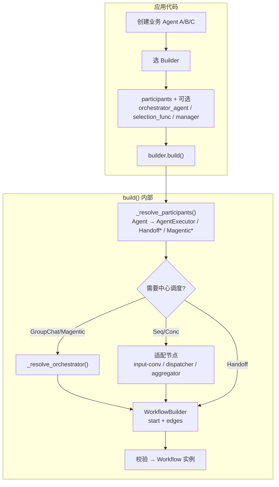
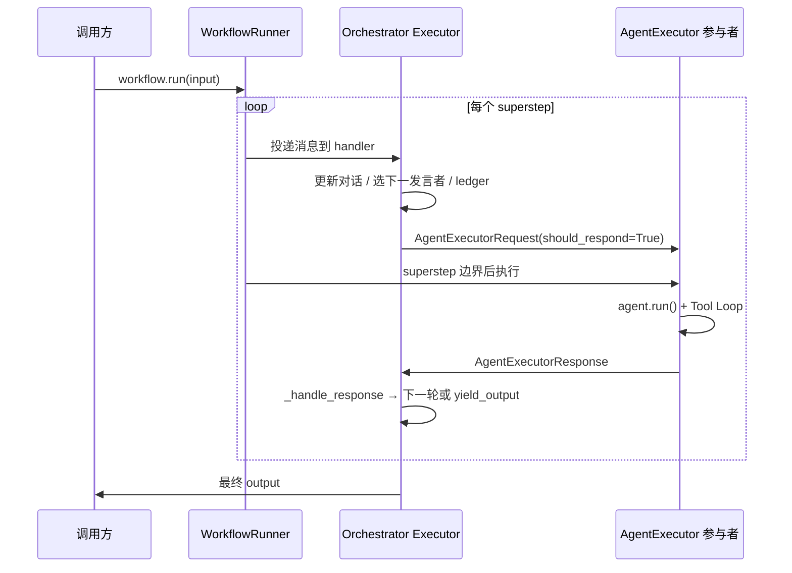
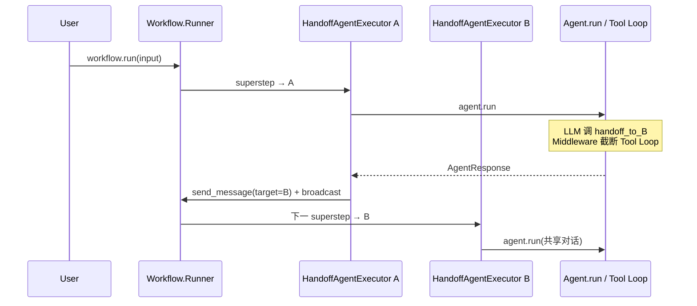
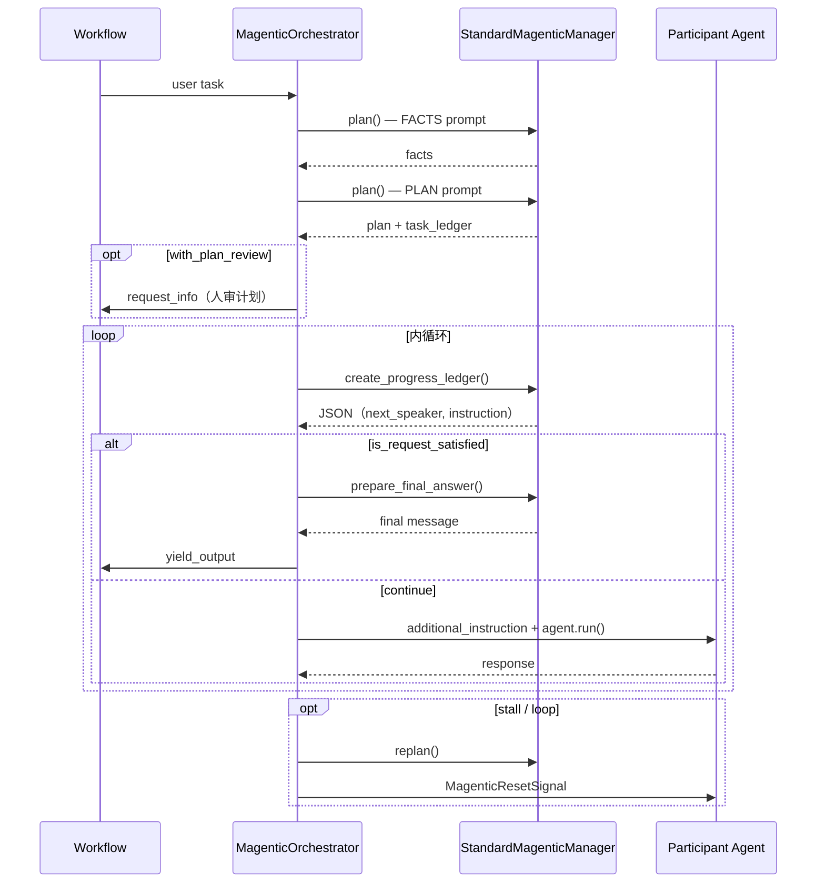

# Microsoft Agent Framework — 架构文档（第3部分）

> **Workflow、编排、Hosting、Providers、评测** · 合并版 2026-08-05（2026-08-12 增补第11章 §2.1–§2.6：Builder/Executor 清单、初始化流程、引用关系、各 Orchestrator 原理）  
> 合并自 WORKFLOW + ORCHESTRATOR + HOSTING + PROVIDERS + EVALUATION + FAQS

## 本卷目录

- **第10章 Workflow 引擎**（原 `WORKFLOW_ENGINE.md`）
- **第11章 Orchestrator 实现**（原 `ORCHESTRATOR_IMPLEMENTATION.md`；含 **§2.1–§2.6 清单与原理总览**、§5–§8 各 Orchestrator 详解）
- **第12章 Hosting 全栈**（原 `HOSTING_STACK.md`）
- **第13章 Providers 参考**（原 `PROVIDERS_REFERENCE.md`）
- **第14章 Evaluation**（原 `EVALUATION.md`）
- **附录 B .NET FAQ**（原 `FAQS.md`）

---


<!-- ===== 第10章 Workflow 引擎 | 原 WORKFLOW_ENGINE.md ===== -->

> **源码**：`packages/core/agent_framework/_workflows/`  
> **编排模式**：`packages/orchestrations/` → [ORCHESTRATOR_IMPLEMENTATION.md](./ARCHITECTURE_PART3.md)

---

## 1. 核心结论

| 概念 | 类 / 函数 | 作用 |
|------|-----------|------|
| **Workflow** | `Workflow` | 可 `run()` 的图运行时；持有 Executor 图 + Runner |
| **WorkflowBuilder** | `WorkflowBuilder` | 声明节点、边，`.build()` → `Workflow` |
| ***Builder** | `HandoffBuilder` 等 | 高层模式，内部仍用 `WorkflowBuilder` |
| **Executor** | `Executor` | 图节点；`@handler` 处理消息 |
| **Runner** | `RunnerImpl.run_until_convergence` | Pregel **superstep** 循环 |
| **AgentExecutor** | `AgentExecutor` | 包装 `agent.run()` 的 Executor |

**与 Tool Loop 正交**：一个 superstep 内 `AgentExecutor` 可能触发多轮 LLM+tool（Tool Loop）。

---

## 2. 类关系

```text
WorkflowBuilder.build()
  → Workflow(executors, edge_groups, state, checkpoint_storage, ...)
  → workflow.run() 创建 RunnerContext + RunnerImpl

RunnerImpl
  ├── _executors: dict[id, Executor]
  ├── _edge_runners: 每条边一个 EdgeRunner
  ├── _state: State（共享可变状态，superstep 末 commit）
  └── _ctx: RunnerContext（消息队列 + 事件 + checkpoint）
```

---

## 3. Runner superstep 原理

**文件**：`_runner.py` `run_until_convergence`

```text
superstep 0 之前: start executor 可能先跑（checkpoint 记为 superstep 0 结束态）

while iteration < max_iterations:
  yield superstep_started
  await _run_iteration()     # 并发跑所有 edge runners 投递消息
  iteration++
  state.commit()             # 提交本 superstep 的状态变更
  create_checkpoint_if_enabled()
  yield superstep_completed
  if not has_messages(): break

若仍有消息且达 max_iterations → WorkflowConvergenceException
```

### 3.1 `_run_iteration` 投递语义

- 同一 source 到**多个** target：**并发**投递
- 同一 source 到**同一** target 的多条消息：**保序**
- 不同 source 到同一 target：可能交错（Python 无真并行）

### 3.2 与 Handoff 的关系

`HandoffAgentExecutor` 在 handoff tool 时 `send_message` 入队 → **下一 superstep** 目标 Executor 才 `agent.run(should_respond=True)`。

---

## 4. Executor 基类

**文件**：`_executor.py`

| 能力 | 机制 |
|------|------|
| 输入类型 | `@handler` 方法第一个参数类型 |
| 输出类型 | `WorkflowContext[T]` 泛型 → `ctx.send_message` |
| Workflow 输出 | `WorkflowContext[..., O]` → `ctx.yield_output` |
| HITL | `RequestInfoMixin` → `ctx.request_info` 暂停 |

**Handler 注册**：`@handler` 装饰器扫描；Runner 按消息类型路由到对应 handler。

**状态**：`on_checkpoint_save` / `on_checkpoint_restore` 序列化 Executor 私有字段。

---

## 5. AgentExecutor

**文件**：`_agent_executor.py`

**作用**：把 Workflow 消息信封转成 `agent.run()`。

| 消息类型 | 行为 |
|----------|------|
| `AgentExecutorRequest` | `should_respond=True` → `agent.run(messages, session=...)` |
| 广播同步 | `should_respond=False` → 只更新 cache，不跑 LLM |

**与 SessionContext**：Workflow 层的 session 由 `AgentExecutor` 持有的 `AgentSession` 管理；每次 `agent.run` 仍走完整 Provider 管道。

---

## 6. Checkpoint

**文件**：`_checkpoint.py`, `CheckpointStorage`

| 时机 | 行为 |
|------|------|
| superstep 0 前 | 若已有消息且非 resume，创建初始 checkpoint |
| 每 superstep 结束 | `create_checkpoint_if_enabled()` |
| resume | `workflow.run(checkpoint_id=...)` 恢复 Executor 状态 + 消息队列 |

**图签名**：`graph_signature_hash` 防止拓扑变更后误恢复。

---

## 7. HITL：`request_info`

**文件**：`_request_info_mixin.py`

```text
Executor.ctx.request_info(request)
  → Runner 暂停，yield RequestInfoEvent
  → 调用方 workflow.run(responses={request_id: response})
  → 同一 Executor handler 收到 response，继续
```

用于：工具审批、Handoff 用户回复、Magentic plan review、GroupChat approval。

---

## 8. WorkflowBuilder API 要点

| API | 作用 |
|-----|------|
| `add_edge(source, target)` | 有向边 |
| `set_start_executor(id)` | 入口节点 |
| `with_checkpointing(storage)` | 启用持久化 |
| `build()` | 校验图 + 创建 `Workflow` |

Orchestration `*Builder.build()` 内部：创建 Orchestrator + Participant `AgentExecutor` + 星型/链式/全连接边。

---

## 9. 事件流

| 事件 | 时机 |
|------|------|
| `superstep_started` / `superstep_completed` | 每 superstep |
| `executor_invoked` | Executor handler 开始 |
| `output` | `yield_output` |
| `request_info` | HITL 暂停 |
| `group_chat` / `magentic_orchestrator` | 编排专用 |

---

## 10. 与 Declarative 的关系

YAML 工作流由 `WorkflowFactory` 生成同一套 `Workflow` / `Executor` 图。见 [声明式工作流章节](#声明式工作流yaml)。

---

## 11. 示例

`python/samples/03-workflows/` — 含 checkpoint resume、approval、streaming events。

---

## 12. 源码索引

| 文件 | 内容 |
|------|------|
| `_workflow.py` | `Workflow.run` |
| `_workflow_builder.py` | 建图 |
| `_runner.py` | superstep |
| `_runner_context.py` | 消息队列、事件 |
| `_edge_runner.py` | 边投递 |
| `_agent_executor.py` | Agent 节点 |
| `_checkpoint.py` | 持久化 |

---

<!-- ===== 声明式工作流（原 DECLARATIVE_WORKFLOWS） ===== -->

> **包**：`agent-framework-declarative`（`packages/declarative/`）  
> **稳定性**：Workflow YAML = **stable**；Agent YAML = **experimental**

---

## 1. 作用

用 **YAML/JSON** 声明 Agent 与 Workflow，无需手写 `WorkflowBuilder` Python 代码。适合：

- 低代码集成（Power Platform 风格）
- CI 管理的流程版本
- HTTP/MCP 步骤与 Agent 步骤混编

---

## 2. 入口类

| 类 | 作用 |
|----|------|
| `WorkflowFactory` | `create_workflow_from_yaml_path` → `Workflow` |
| `AgentFactory` | `create_agent_from_yaml_path` → `Agent`（experimental） |
| `WorkflowState` | Declarative 工作流共享状态 |
| `ProviderTypeMapping` | YAML 里的 provider 类型 → Python 实现 |

```python
from agent_framework.declarative import WorkflowFactory

factory = WorkflowFactory(
    http_request_handler=...,   # 可选
    mcp_tool_handler=...,       # 可选
)
workflow = factory.create_workflow_from_yaml_path("workflow.yaml")
async for event in workflow.run("input"):
    ...
```

---

## 3. Workflow 执行器类型（`_workflows/_executors_*.py`）

| Executor | 文件 | 作用 |
|----------|------|------|
| Agent | `_executors_agents.py` | 调声明式 Agent |
| Function tool | `_executors_tools.py` | 本地函数 |
| HTTP | `_executors_http.py` | `HttpRequestAction` |
| MCP | `_executors_mcp.py` | `InvokeMcpTool` |
| Control flow | `_executors_control_flow.py` | 分支/循环 |
| External input | `_executors_external_input.py` | 等人输入 |
| Graph | `_graph_executors.py` | 图节点组合 |

**Handler 注入**：

- `DefaultHttpRequestHandler` / 自定义 `HttpRequestHandler`
- `DefaultMCPToolHandler` / 自定义 `MCPToolHandler`

Declarative MCP **不是** `Agent.mcp_tools` 路径，而是 Workflow 图上的 **InvokeMcpTool** 节点，经 handler 发 MCP `tools/call`。

---

## 4. 状态与 PowerFx

- `WorkflowState`：键值状态，步骤间传递
- `_powerfx_functions.py`：表达式求值（YAML 内引用字段）

---

## 5. 与 Core Workflow 的关系

```text
YAML → DeclarativeLoader → WorkflowFactory
  → 实例化 Core Executor 子类
  → WorkflowBuilder.build()
  → 与手写 Python 相同的 Runner / superstep / checkpoint
```

SessionContext / Provider：**仅 Agent 型步骤**在 `agent.run` 时走 Provider 管道；HTTP/MCP 步骤不经过 SessionContext。

---

## 6. 错误类型

| 异常 | 含义 |
|------|------|
| `DeclarativeLoaderError` | YAML 解析/加载 |
| `ProviderLookupError` | provider 类型未注册 |
| `DeclarativeWorkflowError` | 建图失败 |
| `DeclarativeActionError` | 单步执行失败 |

---

## 7. 示例与测试

- `packages/declarative/tests/workflows/http_request.yaml`
- `tests/test_workflow_samples_integration.py`

---

## 8. 源码索引

| 路径 | 内容 |
|------|------|
| `_loader.py` | YAML 加载 |
| `_workflows/_declarative_builder.py` | 图构建 |
| `_workflows/_factory.py` | `WorkflowFactory` |
| `_models.py` | 声明式模型 |

---


<!-- ===== 第11章 Orchestrator 实现 | 原 ORCHESTRATOR_IMPLEMENTATION.md ===== -->

> **源码包**：`agent_framework_orchestrations`  
> **单 Agent 上下文（SessionContext / SkillsProvider）**：[SESSION_CONTEXT_AND_PROVIDERS.md](./ARCHITECTURE_PART2.md)  
> **Prompt 分类**：[RUNTIME_PROMPTS.md](./ARCHITECTURE_PART2.md)（五类：主 prompt / Recall / 历史 / 用户 / 编排）  
> **Workflow superstep 底座**：[WORKFLOW_ENGINE.md](./ARCHITECTURE_PART3.md)

---

## 1. 核心结论（先读）

| 问题 | 答案 |
|------|------|
| Orchestrator 是什么？ | **角色名** + 若干 `Executor` 子类，挂在 `Workflow` 图上，由 Runner **superstep** 驱动 |
| 是否都调 LLM？ | **否**。`GroupChatOrchestrator`、Concurrent dispatcher 不调 LLM；Magentic / Agent Manager 才调 |
| Handoff 有 Orchestrator 吗？ | **无**。`HandoffAgentExecutor` 是去中心化 mesh，靠 `handoff_to_*` 工具自路由 |
| 与 CrewAI 差异 | MAF = **图 + superstep**；CrewAI = Task 链 + Manager 委托 |

所有 Orchestrator **都是 `Executor` 子类**，不直接等于 `Agent`；参与者通常是 `AgentExecutor`（包装 `Agent.run`）。

---

## 2. 类谱系总览

```text
Executor (core)
├── BaseGroupChatOrchestrator (ABC)     ← GroupChat / Magentic 共用底座
│   ├── GroupChatOrchestrator           ← selection_func（纯代码选发言者）
│   ├── AgentBasedGroupChatOrchestrator ← Manager Agent + JSON 选发言者
│   └── MagenticOrchestrator            ← Manager 做 Facts/Plan/Progress
├── _DispatchToAllParticipants          ← Concurrent 扇出（非 *Orchestrator 命名）
├── _AggregateAgentConversations        ← Concurrent 默认扇入
├── _CallbackAggregator                 ← Concurrent 自定义汇总
├── _InputToConversation                ← Sequential 输入归一化（管道节点）
└── HandoffAgentExecutor                ← 非 Orchestrator；去中心化路由

伴生（非 Executor）：
  StandardMagenticManager / MagenticManagerBase  ← Magentic 的 LLM「大脑」
  ParticipantRegistry                            ← 参与者 id → description
```

| 类 | Builder | 图拓扑 | 是否调 LLM |
|----|---------|--------|-----------|
| `GroupChatOrchestrator` | `GroupChatBuilder(selection_func=...)` | 星型双向边 | ❌ |
| `AgentBasedGroupChatOrchestrator` | `GroupChatBuilder(orchestrator_agent=...)` | 星型双向边 | ✅ Manager Agent |
| `MagenticOrchestrator` | `MagenticBuilder` | 星型双向边 | ✅ 经 `StandardMagenticManager` |
| `_DispatchToAllParticipants` | `ConcurrentBuilder` | fan-out → fan-in | ❌ |
| `_InputToConversation` | `SequentialBuilder` | 链式 | ❌ |
| `HandoffAgentExecutor` | `HandoffBuilder` | 全连接 mesh | ✅ 参与者 Agent，无中央调度 |

---

## 2.1 心智模型：Builder → Workflow → Executor

```text
*Builder.build()  →  Workflow（图执行引擎）
                      └── 节点全是 Executor（及子类）
                      └── 边 / 拓扑由该 Builder 的 wiring 决定
```

| 词 | 是什么 |
|----|--------|
| **Builder** | 拼图工厂；`build()` 产出 `Workflow` |
| **Workflow** | 可 `run()` 的图：节点字典 + 边 + Runner + checkpoint |
| **Executor** | 图上任意节点基类 |
| **Orchestrator** | 角色名：负责「下一步谁干」的那类 Executor（可选） |
| **Agent** | 调 LLM 的业务智能体；通常被 `AgentExecutor` 包装进图 |

**图张什么样，看用了哪个 Builder**（同一 `AgentExecutor` 在 Sequential 是链、在 GroupChat 是星型叶节点）。

单 Agent 路径没有 `Workflow`，也没有 Orchestrator，只有 `agent.run()`。

---

## 2.2 Orchestrator 完整清单

真正以 Orchestrator 命名、做**多轮中央选人**的，都挂在 `BaseGroupChatOrchestrator`：

| 类 | 选人方式 | Orchestrator 调 LLM？ | 包 |
|----|----------|----------------------|-----|
| **`BaseGroupChatOrchestrator`** | 抽象底座（广播/终止/信封） | — | `orchestrations` |
| **`GroupChatOrchestrator`** | `selection_func(GroupChatState)` | ❌ | 同上 |
| **`AgentBasedGroupChatOrchestrator`** | Manager Agent → `AgentOrchestrationOutput` JSON | ✅ | 同上 |
| **`MagenticOrchestrator`** | Progress ledger（经 `StandardMagenticManager`） | ❌（Manager 调） | 同上 |

**调度型但不叫 Orchestrator：**

| 类 | 作用 |
|----|------|
| `_DispatchToAllParticipants` | Concurrent 扇出 |
| `_AggregateAgentConversations` / `_CallbackAggregator` | Concurrent 聚合 |
| `_InputToConversation` | Sequential 入口规范化 |

**明确没有中央 Orchestrator：** `HandoffBuilder`（各 `HandoffAgentExecutor` 自调 `handoff_to_*`）。

---

## 2.3 Executor 完整清单

### Core（`agent_framework._workflows`）

| 类 | 作用 |
|----|------|
| **`Executor`** | 节点基类（+ `RequestInfoMixin`） |
| **`AgentExecutor`** | 包装业务 `Agent` → `agent.run()` |
| **`FunctionExecutor`** | `@executor` 函数节点 |
| **`WorkflowExecutor`** | 子 Workflow 嵌套 |
| **`WorkflowAgent`** | 把整个 Workflow **当成一个 Agent**（反向包装） |

### Orchestrations 包

| 类 | 作用 |
|----|------|
| **`HandoffAgentExecutor`** | Agent + handoff tool + 对话广播 |
| **`MagenticAgentExecutor`** | Magentic 参与者（ledger / instruction） |
| **`AgentApprovalExecutor`** | Agent + HITL 审批内嵌子图 |
| **`AgentRequestInfoExecutor`** | 向宿主要信息 / 审批 |
| GroupChat / Magentic Orchestrator | 见 §2.2（**也是 Executor**） |
| Seq/Conc 适配节点 | `_InputToConversation`、dispatcher、aggregator |

### 扩展包

| 类 | 包 | 作用 |
|----|-----|------|
| **`A2AExecutor`** | a2a | 远程 A2A Agent |
| **`DeclarativeActionExecutor`** 等 | declarative | YAML 声明式动作节点 |

---

## 2.4 Builder → 图形状

| Builder | start | 参与者节点 | 有中央 Orchestrator？ |
|---------|-------|------------|----------------------|
| **SequentialBuilder** | `_InputToConversation` | `AgentExecutor` 链 | ❌ |
| **ConcurrentBuilder** | dispatcher | `AgentExecutor` 并行 | ❌（调度=dispatcher） |
| **HandoffBuilder** | start 的 `HandoffAgentExecutor` | 全员 `HandoffAgentExecutor` | ❌（去中心） |
| **GroupChatBuilder** | Orchestrator | `AgentExecutor` | ✅ |
| **MagenticBuilder** | `MagenticOrchestrator` | `MagenticAgentExecutor` | ✅ |
| **WorkflowBuilder** | 任意 | 任意 | 可选 |

---

## 2.5 初始化流程图



要点：Agent 先造好再被包装成 Executor；Orchestrator **也是** build 时造的一个 Executor；`build()` 产出的是 **`Workflow`**，不是 Orchestrator。

---

## 2.6 引用关系

```text
Application
  Agent instances ──────────────────────────┐
  *Builder ──build()──► Workflow            │ wraps
                         │                  ▼
                         │   AgentExecutor ──► Agent
                         │   HandoffAgentExecutor ──► Agent (+ handoff tools)
                         │   MagenticAgentExecutor ──► Agent
                         │   BaseGroupChatOrchestrator
                         │     ├─ GroupChatOrchestrator → selection_func
                         │     ├─ AgentBased… → Manager Agent（独立 session）
                         │     └─ MagenticOrchestrator → MagenticManager
                         │              └─ StandardMagenticManager → Agent
                         └── edges: Orchestrator ↔ Participant（组合，非继承）

反向: WorkflowAgent(BaseAgent) ──持有──► Workflow
```

| 从 → 到 | 关系 |
|---------|------|
| Builder → Workflow | `build()` 创建 |
| Workflow → Executor | 持有节点字典 |
| AgentExecutor → Agent | 组合 / 包装 |
| Orchestrator → Manager Agent | GroupChat/Magentic 可选内嵌 |
| Orchestrator ↔ Participant | **边**（消息），不是继承 |
| WorkflowAgent → Workflow | 整图当 Agent |
| WorkflowExecutor → 子 Workflow | 嵌套图 |

---

## 3. 运行时总流程（Workflow superstep）

### 3.1 有 Orchestrator（GroupChat / Magentic 星型）



### 3.2 无 Orchestrator（Handoff 去中心）



**与单 Agent 的区别**：Tool Loop 发生在 **参与者 `AgentExecutor` 内部**；Orchestrator（若有）只在 superstep 之间做路由、广播、终止判断。换 Agent = 下一 **superstep**；同一 Agent 连续调 tool = 同一次 `agent.run` 内的 Tool Loop。

---

## 4. `ParticipantRegistry`（伴生）

**文件**：`_base_group_chat_orchestrator.py`

| 字段 | 含义 |
|------|------|
| `_participants` | `OrderedDict[id, description]` |
| `_agents` | 哪些是 `AgentExecutor` / `AgentApprovalExecutor` |

**用途**：路由时区分 **Agent 参与者**（发 `AgentExecutorRequest`）与 **自定义 Executor**（发 `GroupChatRequestMessage`）。

---

## 5. `BaseGroupChatOrchestrator`（抽象底座）

**文件**：`_base_group_chat_orchestrator.py`  
**继承**：`Executor` + `ABC`

### 5.1 职责与原理

把「多轮中央调度」的公共设施抽出来；子类 **只实现两个钩子**：

| 钩子 | 时机 |
|------|------|
| `_handle_messages` | 工作流入门（用户任务） |
| `_handle_response` | 某参与者回了 `AgentExecutorResponse` |

共性循环骨架：

```text
用户任务 / 参与者回复
  → append 到 _full_conversation
  → 终止检查（condition / max_rounds）
  → 【子类】决定 next_speaker（及可选 instruction）
  → broadcast（同步 cache）+ send_request（点名 should_respond=True）
  → round++
  → 等下一 superstep 的参与者响应
```

子类差异 = **「怎么选 next_speaker」+「有没有计划/ledger」**。

所有「中央调度、多轮对话」模式的 **共享基础设施**：会话历史、轮次、广播、路由、终止、checkpoint。

### 5.2 核心状态

| 成员 | 类型 | 作用 |
|------|------|------|
| `_full_conversation` | `list[Message]` | Orchestrator 维度的完整对话 |
| `_round_index` | `int` | 调度轮次（每选一次发言者 +1） |
| `_max_rounds` | `int \| None` | 最大轮次 |
| `_termination_condition` | `Callable[[list[Message]], bool \| Awaitable[bool]]` | 自定义终止 |
| `_participant_registry` | `ParticipantRegistry` | 参与者元数据 |

### 5.3 入口 Handlers

| Handler | 输入类型 | 行为 |
|---------|----------|------|
| `handle_str` | `str` | 包装为 user `Message` → `_handle_messages` |
| `handle_message` | `Message` | → `_handle_messages` |
| `handle_messages` | `list[Message]` | → `_handle_messages` |
| `handle_participant_response` | `AgentExecutorResponse \| GroupChatResponseMessage` | 发 `group_chat` 事件 → `_handle_response` |

子类 **必须实现**：`_handle_messages`、`_handle_response`。

### 5.4 共享路由（双信封模式）

```python
# Agent 参与者
AgentExecutorRequest(messages=..., should_respond=True/False)

# 自定义 Executor 参与者
GroupChatRequestMessage(additional_instruction=..., metadata=...)
GroupChatParticipantMessage(messages=...)  # 广播同步用
```

- **`_broadcast_messages_to_participants`**：`should_respond=False`，全员同步 cache
- **`_send_request_to_participant`**：`should_respond=True`，点名让某参与者 `agent.run()`

### 5.5 终止机制（两层）

1. **`termination_condition(conversation)`** → 合成 assistant 完成消息 → `yield_output`
2. **`max_rounds`** → 达上限同样 `yield_output`

### 5.6 Checkpoint

`on_checkpoint_save` / `on_checkpoint_restore` 经 `OrchestrationState` 序列化 `_full_conversation`、`_round_index`。

---

## 6. `GroupChatOrchestrator`（函数 selector）

**文件**：`_group_chat.py`  
**构造**：`selection_func: (GroupChatState) -> str | Awaitable[str]`  
**Orchestrator 调 LLM？** ❌

### 6.0 实现原理

选人逻辑 **完全在调用方函数里**（round-robin、关键词、外部规则均可）。Orchestrator **自己不跑 Agent**；只读 `GroupChatState`（`current_round` / `participants` / `conversation`），返回 participant id。未知 id → `RuntimeError`。

**适用**：规则清晰、要可控、不想为调度再花一次 LLM。

### 6.1 状态机

```text
_handle_messages:
  append 用户消息 → 检查 termination
  → next = selection_func(GroupChatState(round, participants, conversation))
  → broadcast 全员
  → send_request(next_speaker)
  → round++

_handle_response:
  append 参与者回复（clean_conversation_for_handoff）
  → termination? / max_rounds?
  → next = selection_func(...)
  → broadcast（排除刚发言者）
  → send_request(next)
  → round++
```

### 6.2 与 LLM

**完全不调用 LLM**。`selection_func` 可以是 round-robin、关键词、外部规则。

### 6.3 图拓扑

```text
start = orchestrator
for p in participants:
    edge(orchestrator ↔ p)   # 双向
```

---

## 7. `AgentBasedGroupChatOrchestrator`（Manager Agent）

**文件**：`_group_chat.py`  
**构造**：内嵌 `Agent` + 独立 `AgentSession`；id = `resolve_agent_id(agent)`  
**Orchestrator 调 LLM？** ✅ 每次选人前调一次 Manager

### 7.0 实现原理

循环形状与 §6 **同构**（广播 → 点名 → 等回复 → 再选），差异只在把 `selection_func` 换成 `_invoke_agent()`：

```text
_cache：自上次 Manager 调用以来的新消息
  → 拼上调度 prompt（要求结构化决策）
  → agent.run(..., response_format=AgentOrchestrationOutput)
  → 解析 JSON: terminate / reason / next_speaker / final_message
  → terminate=true → yield final_message（或合成结束语）
  → 否则 send_request(next_speaker)
```

```python
class AgentOrchestrationOutput(BaseModel):
    terminate: bool
    reason: str
    next_speaker: str | None
    final_message: str | None
```

**适用**：需要语义选人，又不想要 Magentic 计划账本。

### 7.1 与函数 selector 的差异

| | `GroupChatOrchestrator` | `AgentBasedGroupChatOrchestrator` |
|---|----------------------|-----------------------------------|
| 选发言者 | `selection_func` | `Agent.run` + `AgentOrchestrationOutput` JSON |
| 额外状态 | 无 | `_cache`（自上次 Manager 调用以来的消息） |
| 终止 | condition / max_rounds | 同上 + Manager 可 `terminate: true` |

### 7.2 `_invoke_agent` 核心逻辑

1. `current_conversation = _cache.copy()`；`_cache.clear()`
2. Append **调度 prompt**（user 消息，见 [RUNTIME_PROMPTS.md §5.5](./ARCHITECTURE_PART2.md#55-groupchat-manageruser-指令块)）
3. `agent.run(messages=conversation, options={response_format: AgentOrchestrationOutput})`
4. 解析 JSON → `terminate` / `next_speaker` / `final_message`
5. 失败时按 `retry_attempts` 重试

### 7.3 设计要点

- Manager **有自己的 `AgentSession`**，与参与者 session 隔离
- 参与者回复经 `clean_conversation_for_handoff` 去掉 tool 内容，避免 API 空消息错误

---

## 8. `MagenticOrchestrator` + `StandardMagenticManager`

### 8.1 职责拆分（关键）

| 组件 | 类型 | 职责 |
|------|------|------|
| **`MagenticOrchestrator`** | `Executor` | 外/内循环、发 request、stall 检测、HITL plan review、final yield |
| **`StandardMagenticManager`** | 普通对象（**非** Executor） | 调 LLM：plan / replan / progress_ledger / final_answer |
| **`MagenticContext`** | 数据类 | `task`, `chat_history`, `stall_count`, `reset_count` |

Orchestrator **不直接**调 LLM；大脑在 Manager。

### 8.1b 两层循环原理

```text
外循环（规划）
  manager.plan() → task_ledger
  [可选] 人审计划 require_plan_signoff（request_info）
  → 进入内循环

内循环（每轮一次；等参与者回来再跑）
  manager.create_progress_ledger()
    → satisfied? → prepare_final_answer → 结束
    → stall/loop? → stall_count++ → 超阈值 → reset + replan → 再进外/内
    → 否则：instruction 写入 chat_history
         → send_request(next_speaker, additional_instruction=...)
```

Progress ledger 关键字段：`is_request_satisfied`、`is_in_loop` / `is_progress_being_made`、`next_speaker`、`instruction_or_question`。

**适用**：复杂、长程、要显式计划与进度评估的研究型多 Agent。

### 8.2 完整执行阶段

```text
_handle_messages（仅支持单条非空 user 任务）:
  MagenticContext(task=...)
  → manager.plan()                    # 2 次 LLM：facts + plan
  → task_ledger
  → [可选] request_info plan_review → return
  → chat_history.append(task_ledger)
  → _run_inner_loop

_handle_response:
  chat_history.extend(参与者消息)
  → broadcast 其他参与者
  → _run_inner_loop

_run_inner_loop_helper（内循环，每轮一次）:
  检查 round/reset 上限
  → manager.create_progress_ledger()  # 1 次 LLM，JSON
  → satisfied? → prepare_final_answer → 结束
  → stall/loop? → stall_count++ → 超阈 → _reset_and_replan
  → instruction_msg 写入 chat_history
  → _send_request_to_participant(next, additional_instruction=...)

_reset_and_replan（外循环）:
  context.reset() → 广播 MagenticResetSignal 给参与者
  → manager.replan()                # 2 次 LLM：facts update + plan update
  → [可选] plan_review
  → _run_outer_loop → _run_inner_loop
```

### 8.3 Magentic 运行时序图



### 8.4 `StandardMagenticManager` 方法

| 方法 | LLM 调用次数 | 产出 |
|------|-------------|------|
| `plan` | 2 | 合并 `task_ledger` Message |
| `replan` | 2 | 新 task_ledger |
| `create_progress_ledger` | 1（JSON，可重试 3 次） | `MagenticProgressLedger` |
| `prepare_final_answer` | 1 | 最终 user-facing Message |

每次 `_complete` **新建 session**（`agent.create_session()`），避免 Manager 多轮 prompt 污染同一 service history。

固定 Orchestrator id：`"magentic_orchestrator"`。

### 8.5 三个 Orchestrator 对照总表

| | GroupChat（函数） | GroupChat（Agent） | Magentic |
|--|-------------------|---------------------|----------|
| 选人 | `selection_func` | Manager Agent JSON | Progress ledger |
| Orchestrator 调 LLM | ❌ | ✅ 每轮选人前 | ❌（Manager 调） |
| 有计划文档 | ❌ | ❌ | ✅ task_ledger |
| Stall/Replan | ❌ | ❌ | ✅ |
| HITL | 通用 approval 可选 | 同上 | **计划审批** 一等公民 |
| 入口约束 | 多消息 OK | 多消息 OK | **单条任务** |
| 图拓扑 | 星型 | 星型 | 星型 |
| 参与者包装 | `AgentExecutor` | `AgentExecutor` | `MagenticAgentExecutor` |

---

## 9. Concurrent 调度节点

**文件**：`_concurrent.py`

### 9.1 `_DispatchToAllParticipants`（id=`dispatcher`）

| Handler | 行为 |
|---------|------|
| `from_str` / `from_message` / `from_messages` | 包装为 `AgentExecutorRequest(should_respond=True)` |
| `from_request` | 原样 `send_message`（fan-out） |

**无状态、无 LLM、无循环**。

### 9.2 `_AggregateAgentConversations`（id=`aggregator`）

fan-in 各参与者最后一条 assistant → 合并 `AgentResponse` → `yield_output`。

### 9.3 图拓扑

```text
dispatcher --fan-out--> [agent1, agent2, agent3]
[agent1, agent2, agent3] --fan-in--> aggregator
```

同一 superstep 内并行；**无** 多轮 Orchestrator 循环。

---

## 10. Sequential 管道节点

**文件**：`_sequential.py`

```text
input-conversation → agent1 → agent2 → ... → agentN
```

`_InputToConversation` 将 `str` / `Message` / `list[Message]` 归一化后发给下游。无中央节点。

---

## 11. `HandoffAgentExecutor`（对照：非 Orchestrator）

| | Orchestrator 类 | `HandoffAgentExecutor` |
|---|----------------|------------------------|
| 调度 | 中央节点选下一发言者 | **无**；当前 Agent 自调 `handoff_to_*` |
| 图 | 星型或 dispatcher | 全连接 mesh（仅 broadcast） |
| 继承 | `BaseGroupChatOrchestrator` | `AgentExecutor` |

**执行时机**（详见主文档 §11）：

1. `build()` 不执行 agent
2. `should_respond=True` 才 `agent.run()`
3. start agent 在 superstep 0 之前
4. handoff 目标在 **下一 superstep**

---

## 12. 选型与扩展

| 需求 | 选用 | 扩展方式 |
|------|------|----------|
| 固定轮流发言 | `GroupChatOrchestrator` + round-robin | 自定义 `selection_func` |
| LLM 智能选发言者 | `AgentBasedGroupChatOrchestrator` | 定制 Manager `instructions` |
| 复杂任务规划 + 重规划 | `MagenticOrchestrator` | 自定义 `MagenticManagerBase` 或覆盖 prompt |
| 并行独立分析 | `ConcurrentBuilder` | `with_aggregator(callback)` |
| 固定流水线 | `SequentialBuilder` | 插入自定义 `Executor` 节点 |
| 动态转接 | `HandoffBuilder` | `.add_handoff(source, targets)`（**无**中央 Orchestrator） |
| 全新调度逻辑 | 继承 `BaseGroupChatOrchestrator` | 实现 `_handle_messages` / `_handle_response` |

**一句话选型**：规则选人 → 函数 GroupChat；语义选人轻量 → AgentBased；要计划+进度+卡死重规划 → Magentic；Agent 自己转接 → Handoff。

### 自定义 Orchestrator 最小模板

```python
class MyOrchestrator(BaseGroupChatOrchestrator):
    async def _handle_messages(self, messages, ctx):
        self._append_messages(messages)
        await self._send_request_to_participant("worker_a", ctx)

    async def _handle_response(self, response, ctx):
        msgs = self._process_participant_response(response)
        self._append_messages(msgs)
        await self._send_request_to_participant("worker_b", ctx)
        self._increment_round()
```

---

## 13. 事件与可观测性

| 类 | 发出的事件类型 |
|----|----------------|
| `GroupChatOrchestrator` / `AgentBased...` | `group_chat` |
| `MagenticOrchestrator` | `magentic_orchestrator`（`PLAN_CREATED` / `REPLANNED` / `PROGRESS_LEDGER_UPDATED`） |
| 全部 | `request_info`（HITL：plan review、approval） |
| Concurrent / Sequential | 主要 `output` / `executor_invoked` |

---

## 14. 示例代码位置

| 编排 | Sample |
|------|--------|
| Sequential | `python/samples/03-workflows/orchestrations/sequential_*.py` |
| Concurrent | `python/samples/03-workflows/orchestrations/concurrent_*.py` |
| Handoff | `python/samples/03-workflows/orchestrations/handoff_simple.py` |
| GroupChat | `python/samples/03-workflows/orchestrations/group_chat_*.py` |
| Magentic | `python/samples/03-workflows/orchestrations/magentic_*.py` |
| 索引 | `python/samples/03-workflows/orchestrations/README.md` |

---


<!-- ===== 第12章 Hosting 全栈 | 原 HOSTING_STACK.md ===== -->

> **原则**（ADR-0027）：Hosting 包**不含 HTTP Server**；你的 FastAPI/Functions 负责路由，框架提供 **状态 + 协议转换**。

---

## 1. 分层

```text
你的 HTTP 层（FastAPI / Azure Functions / Telegram bot）
  ↓
Protocol Helper（responses_to_run / mcp_to_run / a2a_to_run）
  ↓
AgentState 或 WorkflowState + SessionStore / CheckpointStorage
  ↓
agent.run() 或 workflow.run()   ← 完整 SessionContext + Tool Loop
```

---

## 2. 核心类型（`hosting` 包）

### 2.1 `SessionStore`

- `session_id → AgentSession` 纯存储
- `get()` 返回 **深拷贝**（支持 Responses 分支 continuation）
- **不**负责创建 session

### 2.2 `AgentState`

```python
state = AgentState(agent, session_store=store)
session = await state.get_or_create_session(session_id)  # 首次 create_session
result = await (await state.get_target()).run(messages, session=session)
await state.set_session(session_id, session)  # post-run 必须写回
```

| 方法 | 作用 |
|------|------|
| `get_or_create_session` | 无则 `target.create_session()` |
| `get_target` | 解析 Agent 实例 |
| `set_session` | 持久化 run 后变更的 `session.state` |

**原理**：Hosting 不绕过 Provider；每次 HTTP 请求 = 一次完整 `agent.run`，SessionContext 仍单次构建。

### 2.3 `WorkflowState`

- 包装 `Workflow` target
- Checkpoint 用 core `CheckpointStorage`
- App 自管 `session_id → checkpoint_id` 游标

---

## 3. Protocol Helper 包

| 包 | 函数 | 协议 |
|----|------|------|
| `hosting-responses` | `responses_to_run`, `responses_from_run` | OpenAI Responses API |
| `hosting-mcp` | `mcp_to_run`, `mcp_from_run` | MCP Server 托管 Agent |
| `hosting-a2a` | `a2a_to_run` | Agent-to-Agent |
| `hosting-telegram` | Telegram 通道适配 | Telegram Bot |

**数据流**（以 Responses 为例）：

```text
HTTP body → responses_to_run() → list[Message] + ChatOptions
  → agent.run(...)
  → responses_from_run(AgentResponse) → HTTP JSON
```

---

## 4. MCP Hosting 模式

**文件**：`samples/04-hosting/mcp/`

| 组件 | 作用 |
|------|------|
| `AgentMCPTool` | 从一个 Agent 派生单个 MCP tool schema + 执行 |
| `WorkflowMCPTool` | 从 Workflow 起始 Executor 派生 |
| `mcp_to_run` / `mcp_from_run` | 参数 ↔ messages 转换 |

与 `Agent.mcp_tools`（Agent 作 **Client**）方向相反：这里是 Agent 作 **Server** 被外部 MCP Client 调用。

---

## 5. Foundry Hosted

**包**：`foundry_hosting`

- 平台托管 HTTP；本地代码部署 Agent 定义
- `ResponsesHostServer` 等（见 samples `foundry-hosted-agents/`）

---

## 6. Azure Functions / Durable Task

| 包 | 模式 |
|----|------|
| `azurefunctions` | HTTP trigger → `AgentState` |
| `durabletask` | 长运行编排，Worker 内 `workflow.run` + checkpoint |

见 `features/durable-agents/README.md`。

---

## 7. Session 隔离（ADR-0031）

- 多租户：`session_id` 必须由认证层映射到用户
- Tool approval 映射：`ToolApprovalIdMap` 存在 `session.state`
- `service_session_id` 不是用户授权边界

---

## 8. 与 SessionContext 的关系

| 层 | Hosting 是否持久化 |
|----|-------------------|
| `AgentSession.state` | ✅ `set_session` 写回 |
| `SessionContext` | ❌ 每次 run 新建 |

Provider 的 `after_run` 更新 `session.state` → Hosting `set_session` 落库 → 下次 `get_or_create_session` 加载。

---

## 9. 示例索引

`python/samples/04-hosting/README.md`

| 目录 | 主题 |
|------|------|
| `af-hosting/local_responses/` | 自托管 Responses |
| `mcp/` | MCP Server |
| `a2a/` | A2A |
| `foundry-hosted-agents/` | Foundry |

---

## 10. 源码索引

| 文件 | 内容 |
|------|------|
| `hosting/agent_framework_hosting/_state.py` | `AgentState`, `SessionStore` |
| `hosting-responses/` | Responses 转换 |
| `hosting-mcp/` | MCP 转换 |

---

## 7. Samples 与 ADR（原 `AGENT_FRAMEWORK_HOSTING.md`）

`python/samples/04-hosting/README.md` — 选型表与可运行示例

| 子目录 | 主题 |
|--------|------|
| `af-hosting/local_responses/` | 自托管 Responses |
| `af-hosting/local_telegram/` | Telegram |
| `mcp/` | MCP Server |
| `a2a/` | A2A |
| `foundry-hosted-agents/` | Foundry 托管 |

**相关 ADR**（`docs/decisions/`）：

- [0027-hosting-channels.md](./decisions/0027-hosting-channels.md)
- [0030-hosted-platform-context-agentserver-2.0.md](./decisions/0030-hosted-platform-context-agentserver-2.0.md)
- [0031-hosted-per-user-session-storage-isolation.md](./decisions/0031-hosted-per-user-session-storage-isolation.md)
- [0026-hosted-session-identity-context.md](./decisions/0026-hosted-session-identity-context.md)

---


<!-- ===== 第13章 Providers 参考 | 原 PROVIDERS_REFERENCE.md ===== -->

> **模式**：每个 provider 包导出 `*ChatClient`，实现 `SupportsChatGetResponse` + 可选 `Supports*` mixin（web search、shell、hosted MCP 等）。  
> **不在此列**：`orchestrations`、`hosting`、`declarative`（见各自文档）。

---

## 1. 共同架构

```text
你的代码: Agent(client=OpenAIChatClient(), ...)
  → RawAgent.run
  → client.get_response (可能经 FunctionInvocationLayer 包装)
  → Provider HTTP/SDK
```

| Mixin | 能力 |
|-------|------|
| `SupportsChatGetResponse` | 必须；`get_response` / streaming |
| `SupportsWebSearchTool` | `get_web_search_tool()` — Harness 可自动挂载 |
| `SupportsShellTool` | `get_shell_tool()` + ShellEnvironmentProvider |
| `SupportsMCPTool` | Hosted MCP 配置 |
| `SupportsFileSearchTool` | 文件检索 |
| `SupportsCodeInterpreterTool` | 代码解释器 |
| `SupportsImageGenerationTool` | 图像生成 |

**SessionContext 无关**：Provider 包只实现 **ChatClient**；上下文增强仍靠 `ContextProvider`。

---

## 2. 包一览

| 包 | 主 Client | 典型用途 |
|----|-----------|----------|
| `openai` | `OpenAIChatClient` | OpenAI / Azure OpenAI；Responses、hosted MCP |
| `anthropic` | `AnthropicChatClient` | Claude API |
| `claude` | Claude 扩展客户端 | Anthropic 补充能力 |
| `gemini` | `GeminiChatClient` | Google Gemini |
| `mistral` | `MistralChatClient` | Mistral |
| `ollama` | `OllamaChatClient` | 本地 Ollama |
| `bedrock` | `BedrockChatClient` | AWS Bedrock |
| `foundry` | `FoundryChatClient` | Azure AI Foundry Agent Service |
| `foundry_local` | 本地 Foundry 推理 | 离线/边缘 |
| `github_copilot` | Copilot API | IDE 集成场景 |
| `copilotstudio` | Copilot Studio | 企业 bot |

---

## 3. OpenAI 包要点

**路径**：`packages/openai/`

| 能力 | 说明 |
|------|------|
| Chat Completions | 标准对话 |
| Responses API | `store`、conversation、hosted tools |
| Hosted MCP | `mcp_server_tool_call` Content 类型 |
| 本地 MCP | 样本 `client_with_local_mcp.py` — 与 core `MCPStreamableHTTPTool` 配合 |

```python
from agent_framework.openai import OpenAIChatClient
from agent_framework import Agent, MCPStreamableHTTPTool

agent = Agent(
    client=OpenAIChatClient(),
    tools=MCPStreamableHTTPTool(name="...", url="..."),
)
```

---

## 4. Foundry 包要点

**路径**：`packages/foundry/`

| 能力 | 说明 |
|------|------|
| `FoundryChatClient` | 项目 endpoint + model deployment |
| Tool approval | 与 Foundry 门户集成 |
| Evals | `FoundryEvals` 实现 `Evaluator` 协议 |
| Hosted MCP | `foundry_chat_client_with_hosted_mcp.py` |

---

## 5. 记忆与检索扩展包

| 包 | 作用 |
|----|------|
| `mem0` | Mem0 后端适配 |
| `redis` | Redis session/缓存 |
| `azure-cosmos` | Cosmos DB 持久化 |
| `azure-cosmos-memory` | Cosmos 记忆 |
| `azure-ai-search` | RAG / vector search |
| `azure-contentunderstanding` | 文档理解 |

这些通常以 **自定义 HistoryProvider / MemoryStore / ContextProvider** 或 ChatClient 扩展形式接入，而非替换 `Agent.run` 主路径。

---

## 6. UI / 协议包

| 包 | 作用 |
|----|------|
| `ag-ui` | AG-UI 事件流协议（审批 UI、streaming） |
| `chatkit` | ChatKit 集成 |
| `a2a` | Agent-to-Agent 消息格式 |
| `devui` | 开发调试 UI |

---

## 7. 工具与沙箱

| 包 | 作用 |
|----|------|
| `tools`（`agent-framework-tools`） | `LocalShellTool`、`DockerShellTool` — Harness `shell_executor` |
| `hyperlight` | 轻量沙箱 |
| `purview` | 数据治理 |
| `monty` / `lab` | 实验集成 |

---

## 8. 选型建议

| 场景 | 推荐 |
|------|------|
| 本地开发 OpenAI 兼容 | `openai` 或 `ollama` |
| Azure 企业 | `foundry` + `foundry_hosting` |
| AWS | `bedrock` |
| 需要 hosted MCP | `openai` / `foundry` + 对应 sample |
| 仅要 MCP Client | core `MCP*Tool` + 任意 `SupportsChatGetResponse` |

---

## 9. 示例索引

`python/samples/02-agents/providers/` — 按目录分 provider。

---

## 10. 与 SessionContext 的关系

Provider 包 **不修改** `SessionContext`。唯一交叉点：

- ChatClient 的 `get_response` 收到已合并的 `messages` + `tools` + `instructions`
- Hosted tool 结果以 `Content` 类型回到 Tool Loop

详见 [SESSION_CONTEXT_AND_PROVIDERS.md](./ARCHITECTURE_PART2.md)。

---


<!-- ===== 第14章 Evaluation | 原 EVALUATION.md ===== -->

> **模块**：`packages/core/agent_framework/_evaluation.py`  
> **阶段**：`ExperimentalFeature.EVALS`  
> **ADR**：[0023-foundry-evals-integration.md](./decisions/0023-foundry-evals-integration.md)

---

## 1. 作用

**Provider 无关**的 Agent / Workflow 评测编排：

- 跑测试 query → 收集 `AgentResponse` → 转成 `EvalItem` → 交给 `Evaluator`
- 支持 **本地**（无 API）与 **云端**（Foundry Evals）

**不经过 SessionContext 特殊路径**：评测调用普通 `agent.run()`，Provider 行为与生产一致。

---

## 2. 核心类型

| 类型 | 作用 |
|------|------|
| `EvalItem` | 单次评测单元（query、response、conversation、metadata） |
| `Evaluator` | 协议：`evaluate(items) → EvalResults` |
| `LocalEvaluator` | 本地 check 函数组合 |
| `EvalResults` | 聚合结果；`raise_for_status()` |
| `ConversationSplitter` | 多轮对话拆成 query/response 对 |

---

## 3. 入口函数

```python
from agent_framework import evaluate_agent, LocalEvaluator, keyword_check

results = await evaluate_agent(
    agent=agent,
    queries=["What is 2+2?"],
    evaluators=LocalEvaluator(keyword_check("4")),
)
results.raise_for_status()
```

| 函数 | 作用 |
|------|------|
| `evaluate_agent` | 对 Agent 跑 queries 或评估已有 `responses` |
| `evaluate_workflow` | 对 Workflow 跑任务 |
| `evaluator` | 装饰器注册自定义 Evaluator |

---

## 4. 内置 Local Checks

| Check | 作用 |
|-------|------|
| `keyword_check` | 输出含关键词 |
| `tool_called_check` | 是否调用某工具 |
| `tool_call_args_match` | 工具参数匹配 |
| `tool_calls_present` | 工具调用存在性 |

---

## 5. Foundry 云端

```python
from agent_framework.foundry import FoundryEvals

evals = FoundryEvals(project_client=client, model="gpt-4o")
results = await evaluate_agent(agent=agent, queries=[...], evaluators=evals)
```

Foundry 门户查看 dashboard、对比 run。

---

## 6. 与 History / Memory 的关系

评测可配置：

- `expected_output` — 标准答案对比
- `expected_tool_calls` — 工具正确性
- `num_repetitions` — 一致性（同 query 跑 N 次）

多轮：通过 `ConversationSplitter` 决定评「最后一轮」还是「每轮」。

---

## 7. 源码索引

| 文件 | 内容 |
|------|------|
| `_evaluation.py` | 全部核心 API |
| `foundry` 包 | `FoundryEvals` 实现 |

---

## 8. 测试

`packages/core/tests/` 中含 evaluation 相关单测；Foundry 集成需网络与凭据。

---


<!-- ===== 附录 B .NET FAQ | 原 FAQS.md ===== -->

### How do I get access to nightly builds?

Nightly builds of the Agent Framework are available [here](https://github.com/orgs/microsoft/packages?repo_name=agent-framework).

To download nightly builds follow the following steps:

1. You will need a GitHub account to complete these steps.
1. Create a GitHub Personal Access Token with the `read:packages` scope using these [instructions](https://docs.github.com/en/authentication/keeping-your-account-and-data-secure/managing-your-personal-access-tokens#creating-a-personal-access-token-classic).
1. If your account is part of the Microsoft organization then you must authorize the `Microsoft` organization as a single sign-on organization.
    1. Click the "Configure SSO" next to the Personal Access Token you just created and then authorize `Microsoft`.
1. Use the following command to add the Microsoft GitHub Packages source to your NuGet configuration:

    ```powershell
    dotnet nuget add source --username GITHUBUSERNAME --password GITHUBPERSONALACCESSTOKEN --store-password-in-clear-text --name GitHubMicrosoft "https://nuget.pkg.github.com/microsoft/index.json"
    ```

1. Or you can manually create a `NuGet.Config` file.

    ```xml
    <?xml version="1.0" encoding="utf-8"?>
    <configuration>
      <packageSources>
        <add key="nuget.org" value="https://api.nuget.org/v3/index.json" protocolVersion="3" />
        <add key="GitHubMicrosoft" value="https://nuget.pkg.github.com/microsoft/index.json" />
      </packageSources>
    
      <packageSourceMapping>
        <packageSource key="nuget.org">
          <package pattern="*" />
        </packageSource>
        <packageSource key="GitHubMicrosoft">
          <package pattern="*nightly"/>
        </packageSource>
      </packageSourceMapping>
    
      <packageSourceCredentials>
        <GitHubMicrosoft>
          <add key="Username" value="<Your GitHub Id>" />
          <add key="ClearTextPassword" value="<Your Personal Access Token>" />
        </GitHubMicrosoft>
      </packageSourceCredentials>
    </configuration>
    ```

    * If you place this file in your project folder make sure to have Git (or whatever source control you use) ignore it.
    * For more information on where to store this file go [here](https://learn.microsoft.com/en-us/nuget/reference/nuget-config-file).
1. You can now add packages from the nightly build to your project.
    * E.g. use this command `dotnet add package Microsoft.Agents.AI --version 0.0.1-nightly-250731.6-alpha`
1. And the latest package release can be referenced in the project like this:
    * `<PackageReference Include="Microsoft.Agents.AI" Version="*-*" />`

For more information see: <https://docs.github.com/en/packages/working-with-a-github-packages-registry/working-with-the-nuget-registry>

---

