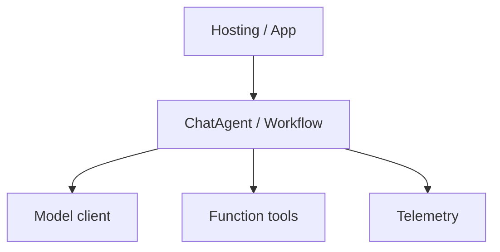

# Microsoft Agent Framework 设计思想导读（九幕）

> **深潜**：[ARCHITECTURE.md](./ARCHITECTURE.md) · [ARCHITECTURE_PART1–3](./ARCHITECTURE_PART1.md)  
> **对照**：[CROSS_AGENT_CONCEPT_MAP.md](../../docs/agent-doc-template/CROSS_AGENT_CONCEPT_MAP.md)  
> **Pi**：[pi/docs/DESIGN_THINKING_SERIES.md](../../pi/docs/DESIGN_THINKING_SERIES.md)

---

## 第 1 幕：源码全景

**一句话**：**Python / .NET 双实现** + `samples/` 分层示例 + **Workflow graph** 与 **Chat Agent** 两条产品线。

```text
agent-framework/
├── python/packages/     ChatAgent、Workflow、Foundry hosting
├── dotnet/              对称 API
├── docs/                本导读 + ARCHITECTURE 分章
└── python/samples/      04-hosting steerable、workflows、…
```

→ [ARCHITECTURE.md](./ARCHITECTURE.md) · [docs/decisions/](./decisions/)

---

## 第 2 幕：状态 vs 执行

| 模式 | 状态载体 | 执行 |
|------|----------|------|
| **Chat Agent** | `Agent` 定义 + thread history | `run` / streaming `run` |
| **Workflow** | `WorkflowRunState`、checkpoint | graph 节点逐步执行 |
| **Foundry hosting** | 远端 session + 持久化 | 长运行 resilient loop |

**校正**：Workflow 的「循环」是 **图遍历**，不是 Pi 式 LLM tool inner loop；Chat Agent 才接近 Pi Loop。

→ [ARCHITECTURE_PART1 §3](./ARCHITECTURE_PART1.md)

---

## 第 3 幕：双层循环

**Chat Agent**：
```text
Runner.run（外层：多轮用户消息 / session）
  └── 单轮内：model → function tools → 再 model
```

**Workflow**：
```text
外层：workflow run 生命周期
内层：每个 agent 节点内的 tool 循环
```

→ [ARCHITECTURE_PART2](./ARCHITECTURE_PART2.md)

---

## 第 4 幕：依赖与装配



Foundry：`04-hosting` 样本展示远端 agent + session store。

→ [python/samples/README.md](../python/samples/README.md)

---

## 第 5 幕：工具管线

```text
model requests function_call
  → schema 校验（Pydantic / .NET 类型）
  → 可选 approval gate
  → 执行用户函数
  → 结果 item 回注 thread
```

MCP、Code interpreter、Hosted tools 在 samples 与 ADR 中分述。

→ [ARCHITECTURE_PART2 工具章](./ARCHITECTURE_PART2.md)

---

## 第 6 幕：事件流

| 类型 | 用途 |
|------|------|
| **Streaming updates** | UI 增量 |
| **RunItem** | 统一 run 产出物 |
| **OpenTelemetry** | 生产可观测 |

Workflow 另有节点级 `WorkflowEvent`。

→ [ARCHITECTURE_PART3](./ARCHITECTURE_PART3.md)

---

## 第 7 幕：Steering vs Follow-up

**权威样本**：`steerable_long_running_agent`

| 语义 | Agent Framework |
|------|-----------------|
| 运行中第二条输入 | steerable 会话：合并或排队（见 ADR-0035） |
| turn 后再跑 | 新 `run` + session history |
| 长运行恢复 | Foundry checkpoint + `IDLE_WITH_PENDING_REQUESTS` |

```text
第二条输入到达活跃 steerable 会话
  → WorkflowRunState.IDLE_WITH_PENDING_REQUESTS
  → 下一轮 run 消费 pending
```

→ [decisions/0035-foundry-hosting-resilient-long-running-agents.md](./decisions/0035-foundry-hosting-resilient-long-running-agents.md)

---

## 第 8 幕：持久化 Harness

| 账 | 场景 |
|----|------|
| **In-memory thread** | 本地 dev |
| **Foundry session store** | 托管长会话 |
| **Workflow checkpoint** | 图状态恢复 |
| **ADR 持久化策略** | 各 hosting 模式分述 |

无单一 JSONL 文件格式——对比 Pi/Codex 时用 **概念映射**（thread items ≈ ResponseItem）。

→ [ARCHITECTURE_PART3 持久化](./ARCHITECTURE_PART3.md)

---

## 第 9 幕：最小核心 + 边界

| 边界 | Agent Framework |
|------|-----------------|
| **Workflows** | 多节点编排、Magentic |
| **Foundry** | 云托管、resilient agents |
| **Handoff / Agent-as-tool** | 多 agent 组合 |
| **Steerable sample** | 产品级中途输入 |

**样本入口**：`python/samples/04-hosting/foundry-hosted-agents/responses/steerable_long_running_agent/`

→ [README.md](./README.md)

---

## 阅读路径

```text
DESIGN_THINKING_SERIES → ARCHITECTURE Part I → steerable sample → ADR-0035
```
