# MetaGPT 架构与源码精读（合并主文档）

> **目标**：读完后能解释「一轮 `Team.run` 里谁调谁」、Message 如何编码 SOP、默认 CLI 为何是 RoleZero+MGX，并能按路径打开源码。  
> **体量说明**：本文合并 PART1/2、SOP、Action 走读、ATLAS 全文，并附 **源码注解篇**（与 `MetaGPT/metagpt/` 对照）。**本目录唯一 Markdown 文档**；交互图解见 [diagrams/](./diagrams/README.md)。  
> **源码根**: [`MetaGPT/metagpt/`](../../MetaGPT/metagpt/)  
> **延伸阅读**：[类图 / 循环 / 消息传递总览](./CLASS_DIAGRAM_AND_RUNTIME.md) · [**Plan + Message + Loop（一篇）**](./PLAN_MODE.md) · [ReAct / `_think` / WritePRD](./REACT_THINK_ACT_AND_WRITEPRD.md)（**非** Plan 表专题） · [角色 Prompt 中文](./ROLE_PROMPTS_ZH.md) · [TeamLeader 端到端](./TEAMLEADER_E2E_SOFTWARE_COMPANY.md)

---

## 如何用这个文档弄懂设计和源码

| 阶段 | 做什么 | 读哪里 |
|------|--------|--------|
| 1. 心智 | 记住三层 Loop、双路线（SOP vs RoleZero） | 下节 + PART1 §1 |
| 2. 结构 | 类图、五模块、Message 字段语义 | PART1 §3–§4 |
| 3. 运行时 | Team.run → publish → observe → react → Action | PART1 §5–§7 + **源码注解篇** |
| 4. 默认路径 | MGX、Leader、RoleZero 命令环 | PART2 + 源码注解 MGX/RoleZero |
| 5. 可选 SOP | watch 链、WritePRD 分支 | SOP 专章 + Action 走读 |
| 6. 查表 | Memory/Loop/多 Agent 矩阵 | ATLAS 全文 |

建议打开 IDE 并排：`team.py`、`environment/base_env.py`、`roles/role.py`、`environment/mgx/mgx_env.py`、`roles/di/role_zero.py`。

---


---

# 分卷原文：ARCHITECTURE_PART1.md


# MetaGPT — 架构文档（第 1 部分）

> **版本**: 1.0（2026-09-09）· **源码**: `MetaGPT/metagpt/`  
> **体例参照**: [agent-framework/docs/ARCHITECTURE_PART1.md](../../agent-framework/docs/ARCHITECTURE_PART1.md)  
> **导读**: 「DESIGN_THINKING_SERIES.md」（见下文同卷分节） · **专题**: 「ARCHITECTURE_PART2.md」（见下文同卷分节） · **全维度**: 「ARCHITECTURE_ATLAS.md」（见下文同卷分节）

---

## 目录

- [§0 阅读导航](#0-阅读导航)
- [§1 项目定位与分层](#1-项目定位与分层)
  - [1.1 项目定位](#11-项目定位)
  - [1.2 四层模型](#12-四层模型)
  - [1.3 共享 Context](#13-共享-context)
- [§2 包地图与模块设计](#2-包地图与模块设计)
  - [2.1 metagpt 顶层结构](#21-metagpt-顶层结构)
  - [2.2 依赖与装配](#22-依赖与装配)
- [§3 核心实体与类图](#3-核心实体与类图)
  - [3.1 Message ER](#31-message-er)
  - [3.2 核心类图](#32-核心类图)
  - [3.3 RoleReactMode](#33-rolereactmode)
- [§4 Agent 设计 — 五大核心模块](#4-agent-设计--五大核心模块)
  - [4.1 模块总览](#41-模块总览)
  - [4.2 Environment 消息总线](#42--environment--消息总线)
  - [4.3 watch / cause_by](#43--watch--cause_by--sop-边)
  - [4.4 Role.react](#44--rolereact--内层循环)
  - [4.5 Action](#45--action--原子-llm-任务)
  - [4.6 ProjectRepo + CostManager](#46--projectrepo--costmanager)
- [§5 Team.run 外层循环](#5-teamrun--外层公司循环)
- [§6 Role 内层 observe / think / act](#6-role-内层--observe--think--act)
- [§7 端到端时序与示例](#7-端到端时序与示例)
- [§8 特点与优势](#8-特点与优势)
- [§9 边界与非目标](#9-边界与非目标)
- [附录 A 源码速查](#附录-a源码速查)

---

## §0 阅读导航

> **总控篇（MAF 体例：§0 导航 + §17–§26 分模块 + §28 索引）**: 「ARCHITECTURE.md」（见下文同卷分节）  
> **校正**: 当前 `software_company.py` 默认 hire 为 TeamLeader + RoleZero 系（PM/Architect/Engineer2/DataAnalyst），经典 PM→Architect→Engineer 链需 `use_fixed_sop` 等显式配置。模块级说明以 COMPLETE §17+ 为准，本卷侧重类图与时序。

### 0.1 一句话心智模型

```text
Code = SOP(Team)

Team.hire(roles) → Team.invest(budget) → Team.run(idea)
  → env.publish_message(用户需求)     # cause_by = UserRequirement
  → loop n_round:
        env.run()  # 所有非 idle Role 并行
          Role: observe(watch 过滤) → react → publish_message
          Action.run() → AIMessage(cause_by=Action类名)
  → env.archive() → ProjectRepo git 归档
```

### 0.2 章节索引

| 章节 | 内容 | 关键源码 |
|------|------|----------|
| §1 | 项目定位与四层模型 | `team.py` |
| §2 | 包地图与模块设计 | `metagpt/` 树 |
| §3 | 核心实体与类图 | `schema.py`, `roles/role.py` |
| §4 | Agent 设计五大模块 | Role / Action / Environment |
| §5 | Team.run 外层循环 | `team.py`, `environment/` |
| §6 | Role 内层 react 循环 | `roles/role.py` |
| §7 | 端到端时序与示例 | `software_company.py` |
| §8 | 特点与优势 | — |
| §9 | 边界与非目标 | — |

### 0.3 两条哲学路径

| | **固定 SOP** | **RoleZero（默认 DI）** |
|--|--------------|-------------------------|
| 边 | `cause_by` → `watch` 订阅链 | LLM 命令块 → `tool_execution_map` |
| 可预测性 | 高 | 低 |
| 灵活性 | 低 | 高 |
| 典型 Role | 经典 PM / Architect | Engineer2, TeamLeader |

---

## §1 项目定位与分层

### 1.1 项目定位

**MetaGPT** 用 **软件公司隐喻** 编码多 Agent 协作：

1. **SOP 即消息图** — `cause_by` 标注产出 Action，下游 `watch` 订阅
2. **Environment 即总线** — 不硬编码 `if pm_done then architect()`
3. **产物落盘** — 大文件进 ProjectRepo，消息只带引用
4. **预算即投资** — `Team.invest` = LLM 花费上限
5. **MGX 中枢** — 默认 TeamLeader 统一路由与人机接口

### 1.2 四层模型

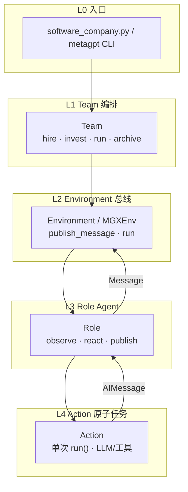

| 实体 | 持有 | 不负责 |
|------|------|--------|
| **Team** | Environment、预算 | 单 Role 内部 think 细节 |
| **Environment** | `roles` 字典、全局 `history` | Action 实现 |
| **Role** | `msg_buffer`、`memory`、`watch` | 跨 Role 路由（MGX 例外） |
| **Action** | 单次 `run()` | 消息路由 |

### 1.3 共享 Context

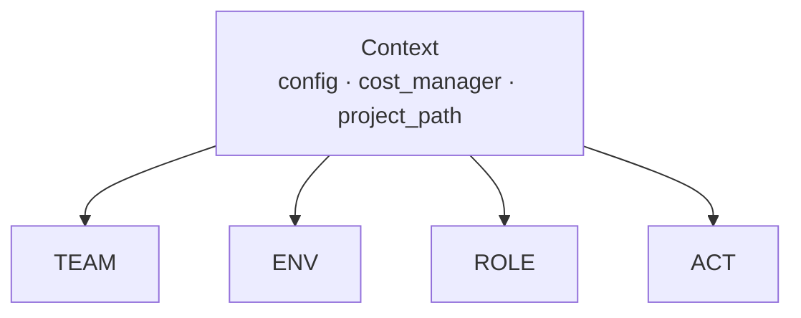
# MetaGPT `Environment` vs `MGXEnv` 源码关系（基于 `geekan/MetaGPT` / FoundationAgents 仓库）

>
> 文件位置：
>
>
> - 老环境：`metagpt/environment/base_env.py` → **`Environment`**
> - MGX 新环境：`metagpt/environment/mgx/mgx_env.py` → **`MGXEnv`**

## 一句话结论

**`Environment` 是旧版单进程内存消息总线；`MGXEnv` 是 2.x 新增的下一代事件驱动环境，继承自同一套 `ExtEnv` 抽象，用来替换老 `Environment`，兼容原有 Role/Team 上层 API，底层通信模型重做。**
`MGX` = MetaGPT X，是他们商业化产品代号，`MGXEnv` 就是为 MGX 产品配套的开源环境实现。

## 1. 类继承关系

```
ExtEnv (顶层抽象环境基类，gym风格step/reset/observe)
├── Environment（旧版，base_env.py）
└── MGXEnv（新版mgx事件总线，mgx_env.py）
```

两者**平级，不是 MGXEnv 继承 Environment**，都直接继承 `ExtEnv`，对外暴露几乎一致的接口：

- `.publish_message()`
- `.observe()`
- `.add_role()`
- `.reset()`

所以上层 `Team` / `Role` 代码几乎不用改，通过 `use_mgx=True/False` 切换用哪套实现，做到向后兼容。

## 2. 底层通信模型核心差异（源码最大区别）

### Environment（旧，use_mgx=False）

- 存储：**进程内内存字典**，一个全局消息列表
- 通信模型：广播式消息池，所有 Role 读取同一个消息池，全部消息都存在内存 history 里
- 消息分发：角色自己轮询、过滤自己关心的消息
- 限制：只能**单机单进程**，没有消息标签、没有事件订阅、无法分布式；消息只是简单文本 / 对象存入列表
- 特点：实现简单，早期 MetaGPT 软件公司 SOP 默认环境

### MGXEnv（新，use_mgx=True，2.x 默认开启）

- 存储：**事件队列 + 订阅 watch 标签机制（pub/sub）**
- 消息：每条消息带元数据 `sender, receiver, tags, timestamp, msg_id`
- 分发：Role 注册自己关心的`tag`，MGXEnv 按标签**定向投递**，不再全量广播
- 扩展性设计：预留接入外部 broker（Redis / WebSocket），目标支持**分布式多 Agent 跨进程 / 跨机器**
- 可观测：事件可序列化、可回放、日志完整；适合 MGX 商业平台的追踪、断点恢复

>
> 老 Environment：所有人看同一个公告板；MGXEnv：订阅制消息网关，只推送你订阅的事件

## 3. 代码切换逻辑（Team 源码）

```
# MetaGPT内部Team创建环境伪代码
if use_mgx:
    env = MGXEnv()
else:
    env = Environment()
```

`generate_repo()` 软件公司流水线可以一键切换两套环境，Role、Action、SOP 完全复用。

## 4. 关键坑（结合你前面看到仓库休眠的背景）

1. **FoundationAgents/MetaGPT 仓库虽然代码里保留 MGXEnv，但 MGX 后续重心全部转移到商业产品 Atoms，开源仓库里 MGXEnv 的分布式能力没有继续完善**；开源版本 MGXEnv 仍然是单机内存事件队列，只是模型改成订阅式，并没有真正打通 Redis / 远端 Broker。
2. MGXEnv 只是**环境 / 消息总线层**，**没有改动 PM / 架构 / 开发 / QA 角色、SOP、Artifact 文档生成逻辑**；SOP 上层代码完全不变，只换底层消息分发。
3. 老 `Environment` 代码不再维护，仅保留做兼容；新功能开发都在 MGXEnv 分支，但开源分支不再投入大量迭代。

## 5. Mermaid 简图

预览

查看代码

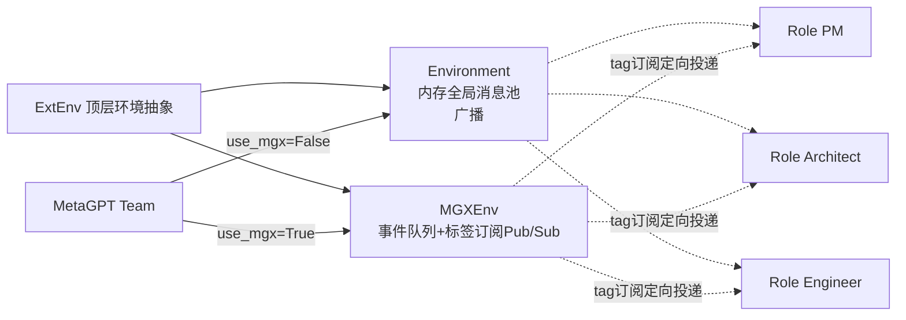

豆包

你的 AI 助手，助力每日工作学习

## 6. 选型判断

- 学习 MetaGPT 原生 SOP、跑 Demo：`use_mgx=False`，老 Environment，代码简单好读，调试直观
- 想研究订阅式事件总线、多角色消息路由：看 MGXEnv 源码
- 想做分布式多 Agent：**不要指望开源仓库里 MGXEnv，这部分是商业 MGX/Atoms 闭包能力**
---

## §2 包地图与模块设计

### 2.1 `metagpt/` 顶层结构

| 目录/文件 | 职责 |
|-----------|------|
| `team.py` | Team 编排器 |
| `software_company.py` | CLI 入口 `generate_repo()` |
| `context.py` | 共享 Context、LLM 工厂 |
| `schema.py` | Message、MessageQueue、Task |
| `environment/` | 消息总线（base、mgx、software、…） |
| `roles/` | Role 定义（经典 + `di/` RoleZero） |
| `actions/` | 原子 Action（WritePRD、WriteCode、…） |
| `memory/` | Role 记忆（按 cause_by 索引） |
| `strategy/` | Planner、经验检索 |
| `tools/` | Editor、Browser、Terminal、… |
| `utils/project_repo.py` | 产物目录树 |
| `utils/cost_manager.py` | Token 预算 |

### 2.2 依赖与装配

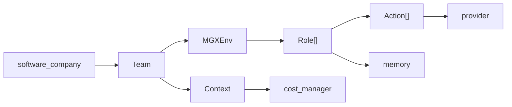

---

## §3 核心实体与类图

### 3.1 Message ER

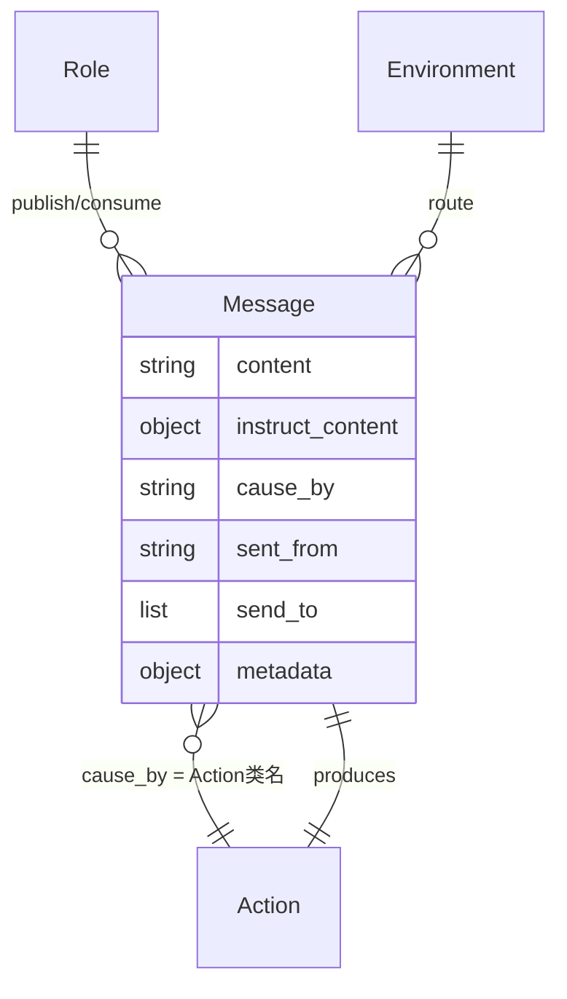

| 字段 | 给谁看 | 典型内容 |
|------|--------|----------|
| **content** | LLM 自然语言 | 摘要、说明 |
| **instruct_content** | 结构化下游 | 文件路径、PRD 字段 |
| **cause_by** | **SOP 边键** | `WritePRD`, `WriteDesign` |
| **send_to** | 路由 | `<all>` / Role 名 |

### 3.2 核心类图

> **扩展版**（**§2.0 单图总类图**、Environment 平级、全 Role 含 Edward、Loop、MGX）：[CLASS_DIAGRAM_AND_RUNTIME.md](./CLASS_DIAGRAM_AND_RUNTIME.md#20-核心领域总类图单图--2126-合并)

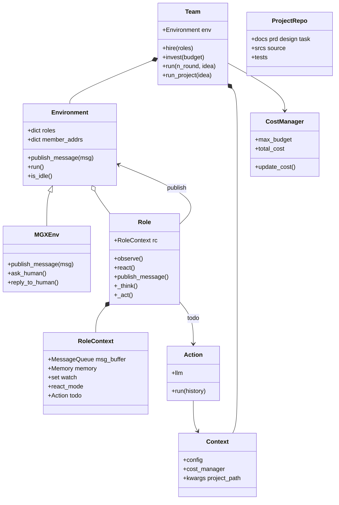

### 3.3 RoleReactMode

| 模式 | 行为 |
|------|------|
| **by_order** | 固定 Action 列表顺序 |
| **react** | LLM 动态选 Action |
| **plan_and_act** | Planner 子任务 DAG |

---

## §4 Agent 设计 — 五大核心模块

MetaGPT 的「Agent」= **Role**；「工具」= **Action** 或 RoleZero 的 **命令工具**。

### 4.1 模块总览

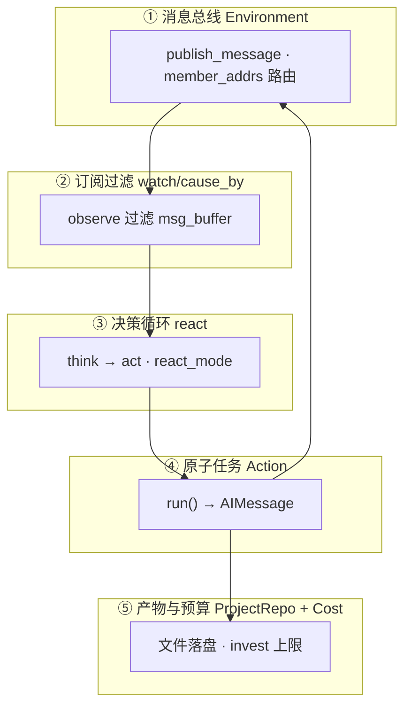

### 4.2 ① Environment — 消息总线

**`publish_message`**（`environment/base_env.py`）：

1. 遍历 `member_addrs`，`is_send_to(message, addrs)` → `role.put_message`
2. 追加 `env.history`（调试 Memory）

**MGXEnv 增强**：所有常规消息先 `send_to.add(TeamLeader)`，Leader 再 `publish_team_message` 派活。

### 4.3 ② watch / cause_by — SOP 边

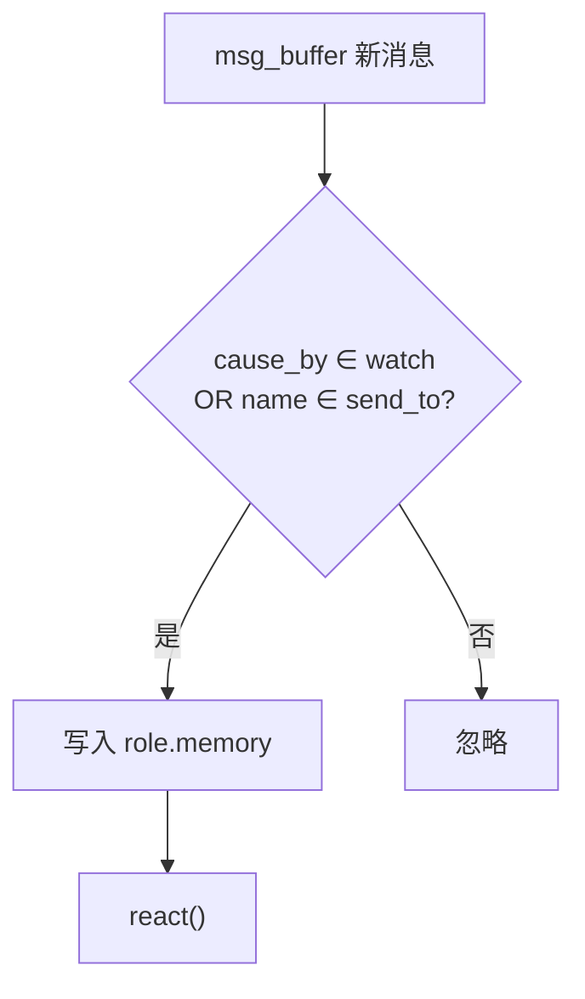

**经典链**：

```text
UserRequirement → PM (watch: UserRequirement) → WritePRD
  → Architect (watch: WritePRD) → WriteDesign
  → Engineer (watch: WriteTasks) → WriteCode
```

### 4.4 ③ Role.react — 内层循环

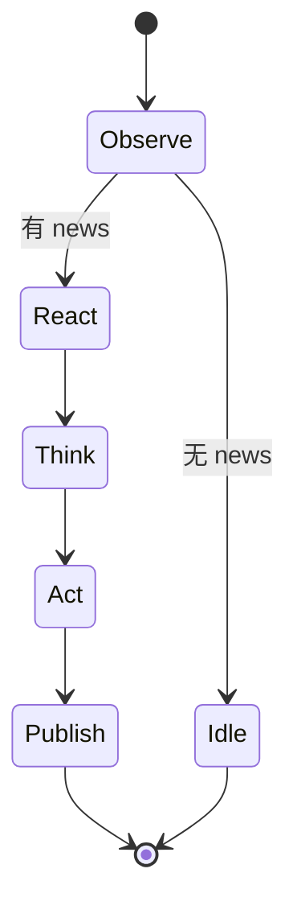

| `react_mode` | 路径 |
|--------------|------|
| react / by_order | `_react()` → `_think()` → `_act()` × `max_react_loop` |
| plan_and_act | `_plan_and_act()` → Planner DAG |

### 4.5 ④ Action — 原子 LLM 任务

- 基类：`actions/action.py`
- 结构化输出：`actions/action_node.py`
- 产出：`AIMessage(cause_by=self)`（`role.py` `_act`）

### 4.6 ⑤ ProjectRepo + CostManager

**ProjectRepo** 目录：

```text
ProjectRepo/
├── docs/     prd, system_design, task, …
├── srcs/     源代码
├── tests/    测试
└── resources/
```

**CostManager**：`Team.invest` 设 `max_budget`；每轮 `_check_balance()` → `NoMoneyException`。

---

## §5 Team.run — 外层公司循环

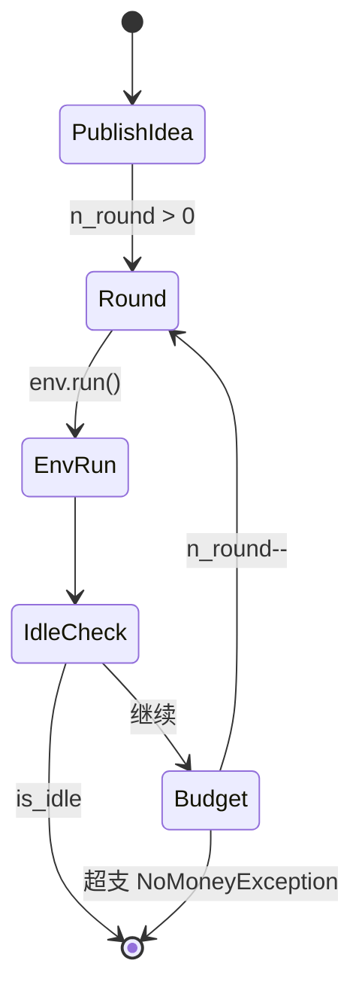

**关键**：一轮 `env.run()` = **并行** 执行所有非 idle Role — 不是严格轮流。

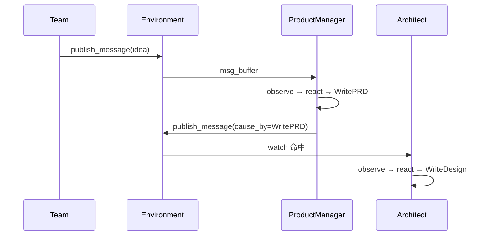

---

## §6 Role 内层 — observe / think / act

### 6.1 Role.run() 流程

```text
Role.run()
  → _observe()     # 从 msg_buffer 取消息，watch 过滤 → rc.news
  → if 无 news: return (idle)
  → react()        # 按 react_mode
  → publish_message(rsp)
```

### 6.2 _think() 选 Action

| 情况 | 行为 |
|------|------|
| 单 Action | state = 0 |
| BY_ORDER | 顺序递增 state |
| REACT | LLM 从 history 选 state 索引 |

### 6.3 RoleZero 变体

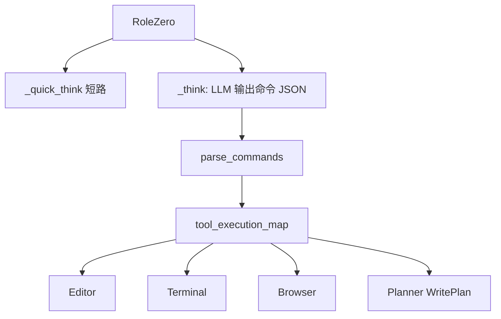

- `observe_all_msg_from_buffer=True` — 全量 awareness，但仍只对 watch 消息 react
- 现代 DI 角色均继承 RoleZero：PM、Architect、Engineer2、TeamLeader

### 6.4 TeamLeader（MGX 中枢）

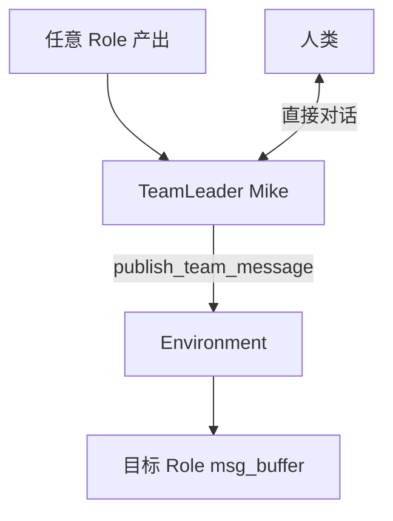

---

## §7 端到端时序与示例

### 7.1 默认 software_company 路径

> **完整逐步说明（含 `_observe` 过滤、`publish_team_message`、多轮 `env.run`）**见专文 [**TEAMLEADER_E2E_SOFTWARE_COMPANY.md**](./TEAMLEADER_E2E_SOFTWARE_COMPANY.md)。  
> 下图强调 **默认 RoleZero 路径**：用户消息 **只有 Mike 会先 react**；PM 由 Leader **派活**；**不是**固定 SOP 的 `WritePRD` watch 链。

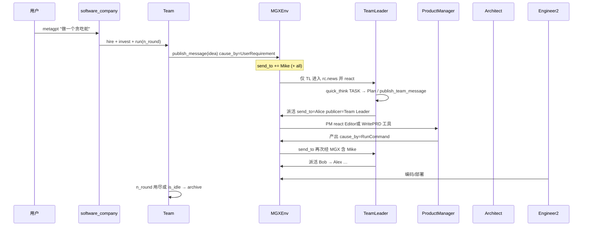

### 7.2 示例：固定 SOP vs RoleZero

**固定 SOP**（`use_fixed_sop=True`）：

```text
UserRequirement → WritePRD → WriteDesign → WriteTasks → WriteCode
（每步由 watch 链触发，可预测）
```

**RoleZero**（默认）：

```text
需求 → TeamLeader 理解 → 派活 Engineer2
Engineer2: react 循环内选 Terminal/Editor/Browser 命令
Planner 维护 DAG + AskReview
```

### 7.3 入口源码

| 入口 | 路径 |
|------|------|
| CLI | `setup.py` → `metagpt.software_company:app` |
| 主函数 | `metagpt/software_company.py` `generate_repo()` |

```python
# 概念流程（非逐字源码）
company = Team(context=ctx)          # use_mgx=True → MGXEnv
company.hire([TeamLeader, ProductManager, Architect, Engineer2, DataAnalyst])
company.invest(investment)
asyncio.run(company.run(n_round, idea))
```

---

## §8 特点与优势

### 8.1 设计特点

| 特点 | 说明 |
|------|------|
| **SOP = 消息订阅图** | 改 Action 类名即改边；可视化强 |
| **公司隐喻** | PM/架构/工程角色清晰，教学友好 |
| **产物驱动** | ProjectRepo 树，非聊天历史扛全文 |
| **并行 tick** | 一轮 env.run 多 Role 同时跑 |
| **MGX 中枢** | 人类只对话 Leader；减少 Role 私下串话 |
| **双路径共存** | 固定 SOP 与 RoleZero 可切换 |
| **预算模型** | invest + cost_manager，贴近「公司现金流」 |

### 8.2 相对优势（选型场景）

| 场景 | 为何选 MetaGPT |
|------|----------------|
| **文档驱动软件生成** | PRD → 设计 → 任务 → 代码流水线成熟 |
| **多 Agent 教学** | Role/Action/Environment 概念干净 |
| **SOP 可编码** | watch/cause_by 比硬编码 if 链可维护 |
| **工作区产物** | 天然 git 归档，非纯字符串输出 |
| **RoleZero 演进** | 从固定链升级到命令式工具，不推翻总线 |

### 8.3 与 OpenManus / Codex 对照

| 维度 | MetaGPT | OpenManus | Codex |
|------|---------|-----------|-------|
| 协作 | 消息总线 | PlanningFlow | Session + spawn |
| 多 Agent | 一等公民 | 可选 | spawn_agent |
| 产物 | ProjectRepo | 工具字符串 | patch |
| 预算 | Team.invest | 无 | token/审批 |

---

## §9 边界与非目标

| MetaGPT 擅长 | 不擅长 |
|--------------|--------|
| 多 Agent SOP 教学 | 单会话低延迟 tool loop |
| 文档驱动软件生成 | 统一权限/沙箱 harness |
| 角色分工显式化 | 事件溯源多端同步 |
| 批任务式公司运转 | 交互式 steer 细粒度 |

---

## 附录 A：源码速查

| 概念 | 路径 |
|------|------|
| Team | `MetaGPT/metagpt/team.py` |
| Environment | `MetaGPT/metagpt/environment/base_env.py` |
| MGXEnv | `MetaGPT/metagpt/environment/mgx/mgx_env.py` |
| Role | `MetaGPT/metagpt/roles/role.py` |
| RoleZero | `MetaGPT/metagpt/roles/di/role_zero.py` |
| TeamLeader | `MetaGPT/metagpt/roles/di/team_leader.py` |
| Action | `MetaGPT/metagpt/actions/action.py` |
| Message | `MetaGPT/metagpt/schema.py` |
| ProjectRepo | `MetaGPT/metagpt/utils/project_repo.py` |
| CostManager | `MetaGPT/metagpt/utils/cost_manager.py` |
| 入口 | `MetaGPT/metagpt/software_company.py` |

---

**下一卷**: 「ARCHITECTURE_PART2.md」（见下文同卷分节） — SOP 消息总线深潜、记忆与 Planner


---

# 分卷原文：ARCHITECTURE_PART2.md


# MetaGPT — 架构文档（第 2 部分）

> **专题深潜**: SOP 消息总线 · MGX · RoleZero · 记忆与 Planner  
> **第 1 部分**: 「ARCHITECTURE_PART1.md」（见下文同卷分节）

---

## 目录

- [§1 SOP 即发布-订阅图](#1-sop-即发布-订阅图)
- [§2 MGXEnv 与 TeamLeader](#2-mgxenv-与-teamleader)
  - [2.1 经典 vs MGX](#21-经典-vs-mgx)
  - [2.2 TeamLeader 时序](#22-teamleader-时序)
  - [2.3 TeamLeader 特殊行为](#23-teamleader-特殊行为)
- [§3 instruct_content](#3-instruct_content--机器可读边)
- [§4 RoleZero 命令循环](#4-rolezero-命令循环)
- [§5 记忆分层](#5-记忆分层)
- [§6 Planner 与 plan_and_act](#6-planner-与-plan_and_act)
- [§7 与 OpenManus PlanningFlow 对照](#7-与-openmanus-planningflow-对照)
- [§8 心智模型（五句）](#8-心智模型五句)

---

## §1 SOP 即发布-订阅图

### 1.1 一句话

MetaGPT 的 SOP **不是** `if pm_done then architect()`，而是：

**Action 完成 → `cause_by` 标签 → 下游 Role `watch` 命中 → observe → react**

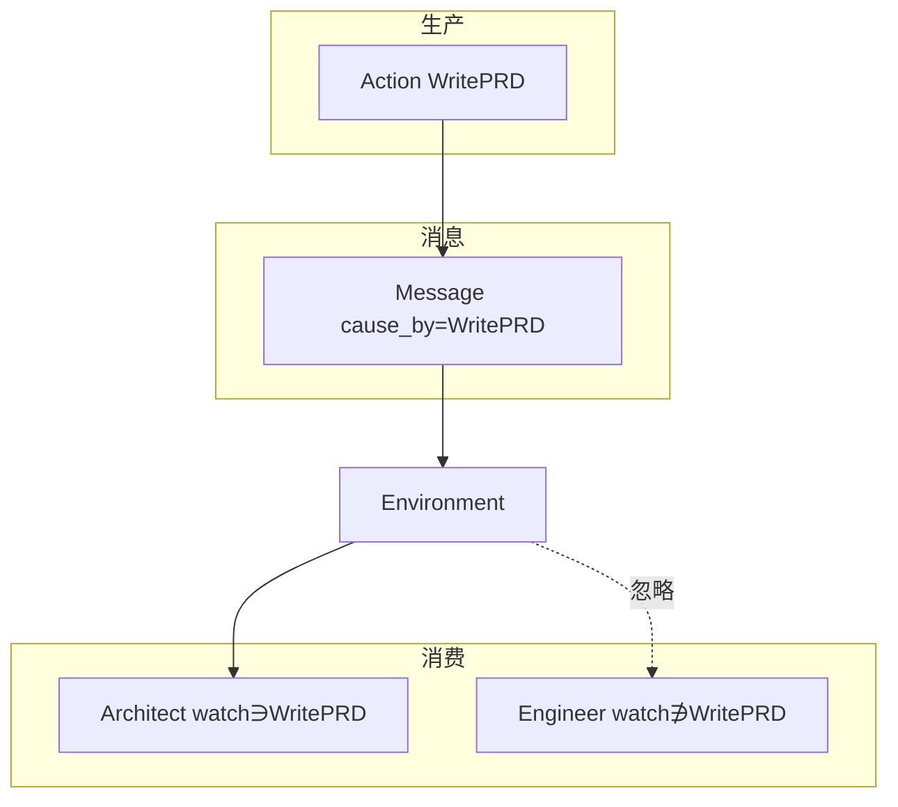

### 1.2 经典软件公司流水线

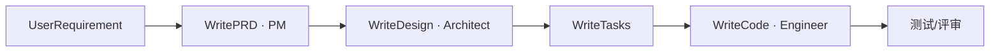

| 下游 Role | watch 包含 | 触发后 Action |
|-----------|------------|---------------|
| ProductManager | UserRequirement | WritePRD |
| Architect | WritePRD | WriteDesign |
| Engineer | WriteTasks, WriteCode | WriteCode |

→ 专文 「SOP_AND_MESSAGE_BUS.md」（见下文同卷分节）

---

## §2 MGXEnv 与 TeamLeader

### 2.1 经典 vs MGX

| 对比 | 经典 Environment | MGXEnv（默认 CLI） |
|------|------------------|-------------------|
| 路由 | 按 `send_to` 直接投递 | 发布时 **`send_to += Mike`**；组员产出同样 **先回 Leader** |
| **谁被唤醒去 `react`** | **`watch(cause_by)` 链**：PM 产出 `WritePRD` → Architect 自动 observe | **星型调度**：只有 **`name in send_to`**（多为 Leader 的 `publish_team_message`）或 Leader 本人；**组员消息默认不会唤醒另一组员** |
| 协作形态 | 对等 **topic + watch**（像 pub/sub 触发下游） | **Hub-and-spoke**：Mike **处理 + 转发**（`Plan` + `publish_team_message`） |
| 人介入 | 分散 | Leader 统一 `ask_human` / `reply_to_human` |
| 默认 | `use_fixed_sop` + `use_mgx=False` 才接近上栏 | **`use_mgx=True` + RoleZero** |

**两层不要混叫「pub/sub」**：

1. **传输层**：`publish_message` 仍把消息放进各 Role 的 `msg_buffer`（公开模式还带 `<all>`），人人可能**看见**历史（RoleZero 的 `observe_all_msg_from_buffer` 还会写入 memory）。
2. **执行层**：是否跑 `_react` 只看 `_observe` 筛出的 `rc.news`（`watch` 或 **`self.name in send_to`**）。默认下 **Alice 不会因 Bob 的消息而开工**，只会因 **Mike 点名 `send_to=Alice`** 或（fixed SOP 时）`watch(UserRequirement)` / `watch(WritePRD)`。

因此你的说法成立：**默认不是组员之间的 pub/sub 唤醒，而是 TeamLeader 中枢转发**；代码里的「消息总线」主要指 **投递与日志**，不是 **对等事件驱动流水线**。

### 2.2 TeamLeader 时序

> 默认 `software_company`（RoleZero + MGX）：组员产出经 `publish_message` 时 **MGX 会 `send_to += Mike`**，由 Leader 再派下一棒；**不是** `cause_by=WriteDesign` 自动触发 Engineer。逐步说明见 [TEAMLEADER_E2E_SOFTWARE_COMPANY.md](./TEAMLEADER_E2E_SOFTWARE_COMPANY.md)。

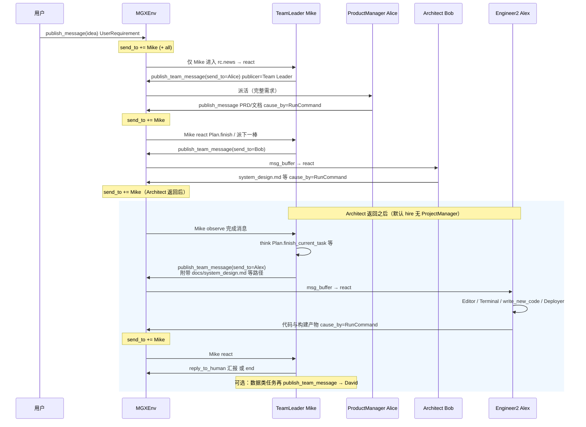

### 2.3 TeamLeader 特殊行为

- `publish_message` 覆盖：正常运行时 `send_to="no one"`（由 MGXEnv 接管）
- `publish_team_message(content, send_to)` — 显式派活
- `max_react_loop=3` — 短循环协调者

---

## §3 instruct_content — 机器可读边

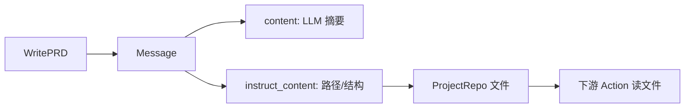

| 原则 | 原因 |
|------|------|
| 大产物落盘 | 消息总线不扛 MB 正文（RFC 135） |
| instruct_content 传引用 | 下游确定性读文件 |
| content 保留协作感 | 自然语言给人/模型 |

---

## §4 RoleZero 命令循环

### 4.1 与固定 SOP 对照

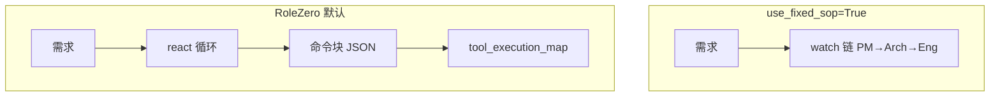

### 4.2 tool_execution_map 典型命令

| 命令 | 工具 |
|------|------|
| Editor | 文件编辑 |
| Terminal | Shell |
| Browser | 网页 |
| Plan | Planner WritePlan |
| RoleZero | 自省/规划 |

### 4.3 经验与长期记忆

| 组件 | 用途 |
|------|------|
| `exp_cache` + BM25 | 工具推荐 |
| `RoleZeroLongTermMemory` | 向量检索溢出 |
| `working_memory` | Planner 暂存，任务结束清空 |

---

## §5 记忆分层

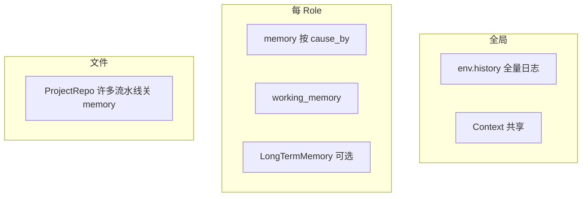

| 记忆 | 用途 |
|------|------|
| Role.memory | `get_by_actions(watch)` |
| env.history | 调试/审计 |
| 文件产物 | 权威真相（许多 Role 关 memory） |

---

## §6 Planner 与 plan_and_act

**`react_mode=plan_and_act`**：

```text
Planner 生成任务 DAG
  → 对每个 task: _act_on_task()
  → working_memory 暂存中间态
  → 任务结束清空
```

RoleZero 内置 Planner + `AskReview` 人机评审。

---

## §7 与 OpenManus PlanningFlow 对照

| | MetaGPT SOP | OpenManus PlanningFlow |
|--|-------------|------------------------|
| 计划存储 | 消息 + 文件 + Planner | PlanningTool 内存 dict |
| 步骤执行 | Role.react | executor.run() 整圈 ReAct |
| 路由 | watch / Leader | `[AGENT]` 文本标签 |
| 并行 | env.run 多 Role | 通常单 executor 逐步 |

---

## §8 心智模型（五句）

1. **SOP = 消息上的有向边** — `cause_by` → `watch`。  
2. **一轮 = 并行 tick** — 不是单线程剧本。  
3. **大内容在仓库** — 消息是索引。  
4. **MGX 加了一个 hub** — TeamLeader 过滤与派活。  
5. **RoleZero 是第二条哲学** — 命令式工具而非固定链。

---

**返回**: 「ARCHITECTURE.md」（见下文同卷分节） · 「README.md」（见下文同卷分节）


---

# 分卷原文：SOP_AND_MESSAGE_BUS.md


# MetaGPT SOP 与消息总线导读

> **定位**：讲清 **`watch` / `cause_by` / `publish_message`** 如何编码 SOP，以及固定流水线与 MGX 中枢的差异。  
> **阅读时间**：~20 分钟  
> **循序渐进**：「DESIGN_THINKING_SERIES.md」（见下文同卷分节）

---

## 目录

- [1. 一句话](#1-一句话)
- [2. 消息总线拓扑](#2-消息总线拓扑)
- [3. 经典软件公司 SOP](#3-经典软件公司-sop固定链)
- [4. observe 过滤逻辑](#4-observe-过滤逻辑概念)
- [5. MGX 中枢](#5-mgx-中枢如何改变总线)
- [6. instruct_content](#6-instruct_content--机器可读边)
- [7. RoleZero](#7-rolezerosop-变成命令-react)
- [8. 与 OpenManus 对照](#8-与-openmanus-planningflow-对照)
- [9. 心智模型](#9-心智模型五句)
- [相关文档](#相关文档)

---

## 1. 一句话

MetaGPT 的 SOP **不是**硬编码 `if pm_done then architect()`，而是 **发布-订阅**：Action 完成时打上 `cause_by` 标签，下游 Role 的 `watch` 集合决定是否 **observe 到** 这条消息。

---

## 2. 消息总线拓扑

```mermaid
flowchart TB
    subgraph 生产
        A1["Action X"]
        A2["Action Y"]
    end
    subgraph 消息
        M["Message<br/>cause_by=X"]
    end
    subgraph 消费
        R1["Role watch 含 X"]
        R2["Role watch 不含 X"]
    end

    A1 --> M
    M --> ENV["Environment.publish_message"]
    ENV -->|匹配 send_to| R1
    ENV -.->|忽略| R2
```

| 原语 | 作用 |
|------|------|
| `publish_message` | 广播到匹配地址的 Role `msg_buffer` |
| `put_message` | 仅推进自己 buffer |
| `is_send_to` | `<all>` 或点名 Role |

---

## 3. 经典软件公司 SOP（固定链）

```mermaid
flowchart LR
    UR["UserRequirement"] --> PRD["WritePRD<br/>PM"]
    PRD --> DES["WriteDesign<br/>Architect"]
    DES --> TASK["WriteTasks<br/>PM/PMgr"]
    TASK --> CODE["WriteCode<br/>Engineer"]
    CODE --> QA["测试/评审可选"]
```

| 下游 Role | watch 包含 | 触发后 Action |
|-----------|------------|---------------|
| ProductManager | UserRequirement | WritePRD |
| Architect | WritePRD | WriteDesign |
| Engineer | WriteTasks, … | WriteCode |

**一轮 env.run()** 内：多个 Role 可能 **同时** 被唤醒（若多条消息同时满足 watch），但典型 SOP 是 **链式因果**。

---

## 4. observe 过滤逻辑（概念）

```mermaid
flowchart TD
    IN["msg_buffer 新消息"] --> W{"cause_by ∈ watch?"}
    W -->|是| MEM["写入 role.memory"]
    W -->|否| DROP["忽略"]
    MEM --> REACT["react() 可选取 todo Action"]
```

**易错**：`watch` 是 **Action 类名字符串**，不是 Role 名；改 Action 类名会破坏 SOP 边。

---

## 5. MGX 中枢如何改变总线

```mermaid
sequenceDiagram
    participant PM as ProductManager
    participant TL as TeamLeader
    participant ENV as MGXEnv
    participant AR as Architect

    PM->>TL: 产出 PRD 消息（经 Leader 路由策略）
    TL->>ENV: publish_team_message → Architect
    ENV->>AR: msg_buffer
    Note over TL: 人类也可只与 Leader 对话
```

| 模式 | 消息路径 |
|------|----------|
| 经典 Environment | Role → ENV → 目标 Role |
| MGXEnv | Role → **TeamLeader** → ENV → 目标 Role |

**设计意图**：单点协调、减少 Role 间「私下对话」；Leader 用自然语言派活（RoleZero）。

---

## 6. instruct_content — 机器可读边

```mermaid
flowchart LR
    ACT["WritePRD Action"] --> MSG["Message"]
    MSG --> C["content: 摘要给 LLM"]
    MSG --> I["instruct_content: 路径/结构体"]
    I --> REPO["ProjectRepo 文件"]
    REPO --> NEXT["下游 Action 读文件"]
```

| 原则 | 原因 |
|------|------|
| 大产物落盘 | 消息总线不扛 MB 级正文 |
| instruct_content 传引用 | 下游 Action 确定性读文件 |
| content 给人/模型读 | 保留自然语言协作感 |

---

## 7. RoleZero：SOP 变成命令 REACT

固定 `watch` 链 **退居二线**；Engineer2 等用 **命令块** 调工具：

```mermaid
flowchart TB
    LZ["RoleZero.react 循环"] --> PARSE["解析命令"]
    PARSE --> MAP["tool_execution_map"]
    MAP --> T1["Editor"]
    MAP --> T2["Terminal"]
    MAP --> T3["Browser"]
    MAP --> PL["Planner WritePlan"]
```

| | 固定 SOP | RoleZero |
|--|----------|----------|
| 边 | `cause_by` 订阅 | LLM 选命令 |
| 计划 | Action 顺序 | Planner DAG + AskReview |
| 经验 | 无 | exp_cache + BM25 工具推荐 |

---

## 8. 与 OpenManus PlanningFlow 对照

| | MetaGPT SOP | OpenManus PlanningFlow |
|--|-------------|------------------------|
| 计划存储 | 消息 + 文件 + Planner | PlanningTool 内存 dict |
| 步骤执行 | Role.react | executor.run() 整圈 ReAct |
| 路由 | watch / Leader | `[AGENT]` 文本标签 |
| 并行 | env.run 多 Role | 通常单 executor 逐步 |

---

## 9. 心智模型（五句）

1. **SOP = 消息上的有向边** — `cause_by` → `watch`。  
2. **一轮 = 并行 tick** — 不是单线程剧本。  
3. **大内容在仓库** — 消息是索引。  
4. **MGX 加了一个 hub** — TeamLeader 过滤与派活。  
5. **RoleZero 是第二条哲学** — 命令式工具而非固定链。

---

## 相关文档

| 文档 | 内容 |
|------|------|
| 「DESIGN_THINKING_SERIES.md」（见下文同卷分节） | 总览 |
| [官方 multi_agent_101](https://docs.deepwisdom.ai/main/en/) | 教程 |


---

# 分卷原文：ACTION_EXECUTION_WALKTHROUGH.md


# Action 是什么、如何执行（源码走读）

> **源码根**: [`MetaGPT/metagpt/`](../../MetaGPT/metagpt/)  
> **配套**: 「ARCHITECTURE_COMPLETE §6–§9」（见下文同卷分节） · 「SOP_AND_MESSAGE_BUS」（见下文同卷分节）

---

## 1. 结论先行

| 问题 | 答案 |
|------|------|
| **Action 是不是 SOP 专属？** | **不完全是。** Action 是 MetaGPT 里「**可执行的 LLM 步骤单元**」的基类；**固定 SOP** 用「多个具名 Action + `watch`/`cause_by`」编排；**RoleZero** 仍挂一个占位 Action（`RunCommand`），但真正执行的是 **`tool_execution_map`**。 |
| **SOP 在代码里是什么？** | 不是 `if pm_done: architect()`，而是 **`Message.cause_by` + `Role._watch`**：上游 Action 完成后 `publish_message`，下游 `observe` 过滤到相关消息再 `react`。 |
| **谁调用 `Action.run`？** | 经典路径：**只有** `Role._act()` → `await self.rc.todo.run(self.rc.history)`。RoleZero 默认路径：**不调用** `RunCommand.run`（未实现），而是 `_act` 里 `parse_commands` + `_run_commands`。 |

---

## 2. 从 `Team.run` 到一次 Action

### 2.1 外层：轮次与并行 Role

```text
Team.run(n_round, idea)
  → run_project: env.publish_message(Message(content=idea))   # 通常 cause_by=UserRequirement
  → loop:
       env.run()   # 一轮：所有非 idle 的 Role.run() 并行 gather
       n_round--
```

关键文件：

- [`team.py`](../../MetaGPT/metagpt/team.py) — `run` / `run_project`
- [`environment/base_env.py`](../../MetaGPT/metagpt/environment/base_env.py) — `publish_message`（按 `member_addrs` 投递到 `role.put_message`）、`run`（`asyncio.gather` 各 Role）

### 2.2 中层：单个 Role 的一轮

```text
Role.run(with_message?)
  → put_message（可选）
  → _observe()
       msg_buffer.pop_all()
       过滤: n.cause_by in rc.watch OR self.name in n.send_to
       rc.news / memory 更新
  → 若无 news: return（idle）
  → react()
  → set_todo(None)
  → publish_message(rsp)   # 把 AIMessage 送回 Environment
```

关键文件：[`roles/role.py`](../../MetaGPT/metagpt/roles/role.py) — `run`、`_observe`、`publish_message`

### 2.3 内层：`react()` 选策略

| `react_mode` | 入口 | 选下一步做什么 |
|--------------|------|----------------|
| `REACT` | `_react()` | `_think()` 用 LLM 选 `state`（对应 `actions[i]`） |
| `BY_ORDER` | `_react()` | `_think()` 每次 `state+1`，按 `set_actions` 顺序 |
| `PLAN_AND_ACT` | `_plan_and_act()` | `Planner` 维护任务队列，子类实现 `_act_on_task` |

公共执行体（经典）：

```text
_react():
  while actions_taken < max_react_loop:
    has_todo = await _think()
    if not has_todo: break
    rsp = await _act()
```

`_act()`（经典）：

```python
response = await self.rc.todo.run(self.rc.history)
# 封装 AIMessage(cause_by=self.rc.todo, ...)
self.rc.memory.add(msg)
return msg
```

`_set_state(i)` 会把 **`rc.todo = actions[i]`**（`i < 0` 则 `todo=None`）。

---

## 3. `Action` 类本身

文件：[`actions/action.py`](../../MetaGPT/metagpt/actions/action.py)

| 职责 | 说明 |
|------|------|
| 上下文 | `ContextMixin`：`config`、`project_path` |
| LLM | `set_llm` / `aask`；`prefix` 作为 system prompt |
| 结构化输出 | 可选 `ActionNode`：`run()` 走 `_run_action_node` → `node.fill` |
| 默认 `run` | 子类必须实现（或带 `node`） |

Role 在 `set_actions` 时会 **`_init_action`**：把 Role 的 `context`、`llm`、`prefix` 注入每个 Action 实例。

**示例** — [`actions/write_prd.py`](../../MetaGPT/metagpt/actions/write_prd.py) 的 `WritePRD.run(...)`：读 requirement、写 `ProjectRepo`、返回 `AIMessage` 或路径字符串。完成 PM 这一步后，消息上的 **`cause_by=WritePRD`**，Architect 若 `_watch({WritePRD})` 就会在下一轮 `observe` 到。

---

## 4. 路径 A：固定 SOP（`use_fixed_sop=True`）

典型配置：[`roles/product_manager.py`](../../MetaGPT/metagpt/roles/product_manager.py)

```python
if self.use_fixed_sop:
    self.set_actions([PrepareDocuments(...), WritePRD])
    self._watch([UserRequirement, PrepareDocuments])
    self.rc.react_mode = RoleReactMode.BY_ORDER
```

| 步骤 | 发生了什么 |
|------|------------|
| 1 | 用户 idea → `UserRequirement` 消息进 PM 的 buffer |
| 2 | PM `observe` → `react` → `BY_ORDER` → 先 `PrepareDocuments.run` |
| 3 | PM `publish_message` → `cause_by=PrepareDocuments` |
| 4 | PM 仍 watch `PrepareDocuments`，下一轮再 `react` → `WritePRD.run` |
| 5 | `cause_by=WritePRD` → Architect（watch `WritePRD`）被唤醒 → `WriteDesign`… |

**注意**：`ProductManager` 继承 `RoleZero`，但 `use_fixed_sop=True` 时 `_think` / `_act` **委托给** `Role._think` / `Role._act`（见 `role_zero.py` 里 `if self.use_fixed_sop: return await super()._act()`）。

`Architect` / `Engineer` 里注释掉的 `set_actions` + `_watch` 只有在你把 **`use_fixed_sop=True`** 并启用对应 `__init__` 块时，才走这条链；**默认 CLI 的 Architect/Engineer2 不走此链**。

### 4.1 时序（固定 SOP）

```mermaid
sequenceDiagram
    participant U as User/Team
    participant E as Environment
    participant PM as ProductManager
    participant A as WritePRD Action
    participant AR as Architect

    U->>E: publish(UserRequirement)
    E->>PM: put_message
    PM->>PM: observe → react BY_ORDER
    PM->>A: todo.run(history)
    A-->>PM: AIMessage(cause_by=PrepareDocuments)
    PM->>E: publish_message
    E->>PM: put_message (watch)
    PM->>A: WritePRD.run
    PM->>E: publish(cause_by=WritePRD)
    E->>AR: put_message (watch WritePRD)
    AR->>AR: observe → react → WriteDesign...
```

---

## 5. 路径 B：RoleZero 默认（现代 CLI）

文件：[`roles/di/role_zero.py`](../../MetaGPT/metagpt/roles/di/role_zero.py)

初始化时：

```python
self.set_actions([RunCommand])   # 占位，满足 rc.todo 与 cause_by 约定
self.tool_execution_map = { "Plan.*", "Editor.*", "Browser.*", ... }
```

| 阶段 | 与经典 Action 的差异 |
|------|----------------------|
| `_react` | 进入时 `_set_state(0)`；可 `_quick_think` 短路；循环内还会再 `_observe` |
| `_think` | **LLM 输出命令文本**（非选 `actions` 下标）；`return True` 只要 `rc.todo` 存在（即 `RunCommand`） |
| `_act` | `parse_commands` → `_run_commands` → 工具函数；**不** `await RunCommand.run()` |
| 出站消息 | `cause_by=RunCommand`（或 `QUICK_THINK_TAG` 等），**不是** `WritePRD` 这类业务 Action |

因此：**RoleZero 的「一步」在语义上仍是 ReAct，但「Act」= 工具调用，不是 SOP 表里的下一个 Action 类。**

`Architect` 默认：领域 `instruction` + `tools=["Editor:...", "Terminal:..."]`，`set_actions([WriteDesign])` 主要给 **`use_fixed_sop`** 或文档/兼容用；正常运行时 **WriteDesign.run 不会被 `_act` 自动调用**。

### 5.1 时序（RoleZero）

```mermaid
sequenceDiagram
    participant E as Environment
    participant R as RoleZero (e.g. Architect)
    participant LLM as LLM
    participant T as tool_execution_map

    E->>R: put_message (news)
    R->>R: observe
    R->>R: _react: _set_state(0) → todo=RunCommand
    R->>LLM: _think (cmd_prompt + tools)
    LLM-->>R: command_rsp (text)
    R->>R: parse_commands
    loop each command
        R->>T: e.g. Editor.write / Terminal.run_command
        T-->>R: output
    end
    R->>E: publish AIMessage(cause_by=RunCommand)
```

---

## 6. 第三条线：Action 同时注册为 Tool

[`ProductManager._update_tool_execution`](../../MetaGPT/metagpt/roles/product_manager.py)：

```python
wp = WritePRD()
self.tool_execution_map.update(tool2name(WritePRD, ["run"], wp.run))
```

[`@register_tool`](../../MetaGPT/metagpt/actions/write_prd.py) 让 `WritePRD` 可被推荐器暴露给 LLM。

含义：

- **`use_fixed_sop=False`**：PM 像 RoleZero 一样发命令，但可以把 **`WritePRD.run` 当工具** 调一次，等价于手动触发 SOP 里的一步。
- **`use_fixed_sop=True`**：走 BY_ORDER + `super()._act()`，**直接** `WritePRD.run(history)`。

同一份业务逻辑（`WritePRD.run`）可以挂在 **SOP 状态机** 或 **工具表** 上，这是 MetaGPT 从经典迁到 RoleZero 的桥接方式。

---

## 7. `cause_by` 与执行的关系

| 环节 | `cause_by` 作用 |
|------|-----------------|
| Action 完成后 | `AIMessage(cause_by=WritePRD)` 等 → 订阅方 `watch` 匹配 |
| RoleZero 工具轮 | `UserMessage(..., cause_by=RunCommand)` 记工具输出；出站 `RunCommand` |
| 路由 | `Environment` **不解析** `cause_by`；只按 `send_to` / addresses 投递 |
| 过滤 | **Role._observe** 用 `cause_by in watch` 决定是否进入 `rc.news` |

所以：**执行**靠 `rc.todo.run` 或 `tool_execution_map`；**编排**靠消息上的 `cause_by` + `watch`（SOP）或 Leader/人类指令（MGX）。

---

## 8. 与 `PLAN_AND_ACT` 的关系

[`Role._plan_and_act`](../../MetaGPT/metagpt/roles/role.py) 不经过 `_think` 选 Action 下标，而是：

```text
planner.update_plan(goal) → while current_task: _act_on_task(task) → process_task_result
```

具体「任务 → 哪个 Action」由 **子类** 实现（如带 Planner 的 Engineer 变体）。这是 **单 Role 内** 的计划执行，和 **多 Role SOP 总线** 是两层机制。

RoleZero 另有一套 **`Planner` 工具**（`Plan.append_task` 等在 `tool_execution_map`），在 `_think` 的 prompt 里展示 `plan_status`，与 `RoleReactMode.PLAN_AND_ACT` 可并存概念，但实现入口不同。

---

## 9. 阅读顺序建议

1. 本文 §2–§5（执行链）
2. [`roles/role.py`](../../MetaGPT/metagpt/roles/role.py) — `run` / `_observe` / `_think` / `_act` / `_react`
3. 任选一条业务 Action — e.g. [`write_prd.py`](../../MetaGPT/metagpt/actions/write_prd.py)
4. [`role_zero.py`](../../MetaGPT/metagpt/roles/di/role_zero.py) — `set_plan_and_tool`、`_think`、`_act`、`_react`
5. 「SOP_AND_MESSAGE_BUS」（见下文同卷分节） — `member_addrs`、MGX 改写

---

## 10. 常见误解

| 误解 | 事实 |
|------|------|
| 「每个 Role 都在跑自己的 Action 列表」 | 默认 RoleZero 只挂 **RunCommand**；列表在 `tool_execution_map`。 |
| 「`set_actions([WriteDesign])` 就会跑设计」 | 仅 **`use_fixed_sop` + 经典 `_act`** 或 **显式把 Action 注册进 tools** 才会跑。 |
| 「Action = Tool」 | **经典**：Action 是第一步抽象；**RoleZero**：Tool 是执行体，Action 多是 **消息类型标记**（`RunCommand`）或 **可选 SOP 步骤**。 |
| 「Environment 会按 SOP 调度下一个 Role」 | Environment 只 **路由消息**；「下一步谁干活」由 **谁 watch 了这条 `cause_by`** 决定。 |


---

# 分卷原文：ARCHITECTURE_ATLAS.md


# MetaGPT — 架构概念图谱（全维度）

> **定位**：按 Session/Memory/Loop/Tool/队列/多 Agent/Plan 等维度逐项展开；**诚实标注有/无**。  
> **前置**：「ARCHITECTURE_PART1.md」（见下文同卷分节） · 「ARCHITECTURE_PART2.md」（见下文同卷分节）  
> **源码**: `MetaGPT/metagpt/`

---

## 目录

- [0. 全维度能力矩阵](#0-全维度能力矩阵)
- [1. 端到端全景](#1-端到端全景)
- [2. Session 与会话身份](#2-session-与会话身份)
- [3. Memory 与对话历史](#3-memory-与对话历史)
- [4. 长短期记忆](#4-长短期记忆)
- [5. 压缩 Compaction](#5-压缩-compaction)
- [6. Loop 双层结构](#6-loop-双层结构)
- [7. Tool 管线](#7-tool-管线)
- [8. Skill](#8-skill)
- [9. Sandbox 与执行隔离](#9-sandbox-与执行隔离)
- [10. 多 Turn](#10-多-turn)
- [11. 队列与中途输入](#11-队列与中途输入)
- [12. 多 Agent](#12-多-agent)
- [13. Plan 与任务规划](#13-plan-与任务规划)
- [14. App / Gateway / 客户端](#14-app--gateway--客户端)
- [15. 长时任务](#15-长时任务)
- [16. 缓存](#16-缓存)
- [17. 跨框架对照](#17-跨框架对照)
- [18. 源码目录地图：每个文件夹负责什么](#18-源码目录地图每个文件夹负责什么)
- [19. 从源码看完整模块交互](#19-从源码看完整模块交互)

---

## 0. 全维度能力矩阵

| 维度 | MetaGPT | 实现锚点 | 说明 |
|------|---------|----------|------|
| **Session** | ⚠️ 隐喻 | `Team.run(n_round)` | 无 chat Session ID；「一轮公司日」 |
| **短期 Memory** | ✅ | `Role.memory`, `env.history` | 消息列表 + cause_by 索引 |
| **长期 Memory** | ⚠️ 可选 | `LongTermMemory`, `ProjectRepo` | 向量存储可选；文件为主 |
| **压缩** | ❌ 框架级 | — | 大内容落盘，消息只带引用 |
| **外层 Loop** | ✅ | `Team.run` → `env.run()` | n_round 公司循环 |
| **内层 Loop** | ✅ | `Role.react` | think→act × max_react_loop |
| **Tool** | ✅ | RoleZero `tool_execution_map` | Editor/Terminal/Browser… |
| **Skill** | ⚠️ | `metagpt/learn/` | 非 OpenCode Skills 体系 |
| **Sandbox** | ⚠️ | 工具自行执行 | 无统一沙箱 harness |
| **多 Turn** | ✅ | n_round + 多 react | 异步多轮 |
| **队列** | ✅ | `MessageQueue` / msg_buffer | 非 mid-turn chat inject |
| **多 Agent** | ✅ 核心 | Team + Environment | 并行 Role tick |
| **Plan** | ✅ | Planner, `plan_and_act` | WritePlan + DAG |
| **App 层** | ⚠️ | `software_company.py` CLI | Typer 入口 |
| **Gateway** | ❌ | — | 无 IM/API Gateway |
| **长时任务** | ⚠️ | n_round + budget | 无 checkpoint 恢复 |
| **缓存** | ⚠️ | `exp_cache`, BM25 | 经验检索，非 prompt cache |

---

## 1. 端到端全景

```mermaid
flowchart TB
    subgraph ENTRY["入口"]
        CLI["metagpt CLI / software_company.py"]
    end

    subgraph TEAM["Team 编排层"]
        HIRE["hire(roles)"]
        INV["invest(budget)"]
        RUN["run(n_round, idea)"]
    end

    subgraph BUS["Environment 消息总线"]
        PUB["publish_message"]
        ROUTE["member_addrs 路由"]
        MGX["MGXEnv → TeamLeader 中枢"]
    end

    subgraph ROLES["并行 Role 层"]
        R1["ProductManager"]
        R2["Architect"]
        R3["Engineer2 / RoleZero"]
    end

    subgraph ACT["Action / Tool 层"]
        A1["WritePRD"]
        A2["WriteDesign"]
        A3["Terminal / Editor"]
    end

    subgraph ARTIFACT["持久化产物"]
        REPO["ProjectRepo 文件树"]
        GIT["git archive"]
    end

    CLI --> HIRE --> INV --> RUN
    RUN --> PUB --> MGX --> ROUTE
    ROUTE --> R1 & R2 & R3
    R1 --> A1 --> PUB
    R2 --> A2 --> PUB
    R3 --> A3 --> PUB
    A1 & A2 & A3 --> REPO --> GIT
```

```text
generate_repo(idea)
  → Team(context) + MGXEnv
  → hire([TeamLeader, PM, Architect, Engineer2, ...])
  → invest(budget)  # CostManager.max_budget
  → publish_message(UserRequirement)
  → for round in n_round:
        if env.is_idle: break
        check budget → NoMoneyException
        await env.run()  # 所有非 idle Role 并行
  → env.archive()
```

---

## 2. Session 与会话身份

MetaGPT **没有** OpenCode/Codex 式 Session ID，用以下身份层级：

```mermaid
erDiagram
    Team ||--|| Environment : owns
    Team ||--|| Context : shares
    Environment ||--o{ Role : contains
    Role ||--|| RoleContext : rc
    Role ||--o{ Message : publishes

    Team {
        float investment
        int n_round
        bool use_mgx
    }

    Environment {
        dict roles
        Memory history
    }

    RoleContext {
        MessageQueue msg_buffer
        Memory memory
        set watch
        string react_mode
    }
```

| 概念 | 等价于其他框架 | 持久化 |
|------|----------------|--------|
| **Team.run 一轮** | 外层 Turn | 否 |
| **Role.run 一次** | Agent 单次 react | 否 |
| **project_path** | 工作区 Session | ✅ 磁盘 |
| **role_id** | 长期记忆键 | ⚠️ LTM 可选 |

---

## 3. Memory 与对话历史

```mermaid
flowchart TB
    subgraph 总线记忆
        ENVH["env.history<br/>全量审计"]
    end

    subgraph Role记忆
        BUF["msg_buffer 收件箱"]
        MEM["role.memory<br/>watch 过滤后"]
        WM["working_memory<br/>Planner 暂存"]
    end

    subgraph 文件记忆
        REPO["ProjectRepo<br/>PRD/设计/代码"]
    end

    PUB["publish_message"] --> ENVH
    PUB --> BUF
    BUF -->|observe| MEM
    ACT["Action 产出"] --> REPO
    REPO -->|instruct_content 引用| NEXT["下游 Action"]
```

| 存储 | 内容 | 谁读 |
|------|------|------|
| `msg_buffer` | 待处理消息 | `_observe` |
| `memory` | 已观察消息 | `_think` / Action |
| `env.history` | 全部广播 | 调试 |
| `ProjectRepo` | 文件全文 | Action 读盘 |

---

## 4. 长短期记忆

```mermaid
flowchart LR
    subgraph STM["短期"]
        MEM["Role.memory 消息列表"]
        WM["working_memory 任务内"]
    end

    subgraph LTM["长期（可选）"]
        LTMEM["LongTermMemory / RoleZeroLongTermMemory"]
        STORE["MemoryStorage / Chroma RAG"]
        OBS["find_news：_observe 去重"]
        RAG["溢出时 RAG retrieve（get）"]
    end

    subgraph 文件LTM["文件型长期"]
        REPO["ProjectRepo"]
        REQ["docs/requirements.txt"]
    end

    MEM --> LTMEM
    LTMEM --> STORE
    LTMEM --> OBS
    LTMEM --> RAG
    ACT["WritePRD"] --> REPO
```

| 类型 | 类/路径 | 默认 |
|------|---------|------|
| **STM** | `memory/memory.py` Memory | ✅ 所有 Role |
| **LTM** | `longterm_memory.py` | ⚠️ RoleZero 可选 |
| **工作集** | `working_memory` | plan_and_act 时 |
| **权威长期** | ProjectRepo 文件 | ✅ 流水线核心 |

**设计原则（RFC 135）**：消息带 **引用**，不带 MB 正文。

---

## 5. 压缩 Compaction

> **读这一节先分清两层**：`memory.storage` **会不会把旧消息改成摘要**（存档） vs **本次 LLM 请求带多少历史**（推理窗口）。MetaGPT 默认 **不做前者**，主要靠 **后者 + 落盘** 控 token。

| | MetaGPT |
|--|---------|
| **对话 Compaction** | ❌ 无 SummarizationMiddleware；`Memory.storage` 默认 **append，不**把旧条替换成摘要 |
| **控上下文（主路径）** | **产物落盘**（`ProjectRepo`）+ 消息 **路径 / `instruct_content` 引用**；下游 Action / `Editor.read` 按需读片段 |
| **控上下文（RoleZero）** | 调 LLM 时常用 `memory.get(memory_k)`，默认 **最近 200 条**（滑动窗口）；**不等于** storage 被压缩 |
| **storage 增长** | 列表持续累积；可 `enable_memory=False` 少记；权威全文在 **仓库文件** |
| **可选 API 截断** | `llm_config.compress_type`（默认 `NO_COMPRESS`）：**仅**发 API 前裁消息，**不改** memory |
| **可选 LTM** | `RoleZeroLongTermMemory`：`count > memory_k` 时旧消息 **迁入 RAG**；`get(k)` 时 **`rag_engine.retrieve` 拼到前面**（默认 CLI 常关） |

**勿混淆 `find_news`（两处含义不同）**：

| API | 作用 | 是否向量 |
|-----|------|----------|
| `Memory.find_news` | `_observe`：从 buffer 里筛 **尚未处理** 的消息 | 否 |
| `LongTermMemory.find_news` | 在 STM news 上再用 `search_similar` **去掉与 LTM 过像的消息** | 是（去重过滤） |
| `RoleZeroLongTermMemory.get` | 溢出后 **检索相关长期记忆** 拼进本次上下文 | 是（RAG retrieve） |

```mermaid
flowchart LR
    BIG["大文档 PRD/设计"] --> DISK["ProjectRepo"]
    DISK --> REF["Message 路径 / instruct_content"]
    REF --> LLM["下游读片段 → 进本次 prompt"]

    CHAT["memory.storage"] -->|存档不摘要| GROW["持续增长或关闭 memory"]
    GROW --> WIN["memory.get(memory_k)"]
    WIN --> LLM
```

**其它「像压缩」、非全局 Compaction**：`parse_editor_result` 缩短旧 Editor 输出在 prompt 中的展示；`RoleZero._end` 的 `SUMMARY_PROMPT` 仅 **给用户** 看总结，不写回压缩 history；经典 `SummarizeCode` 是 **代码域** 摘要。

---

## 6. Loop 双层结构

```mermaid
flowchart TB
    subgraph OUTER["外层 Team 循环"]
        O1["publish_message(idea)"]
        O2["for round in n_round"]
        O3["env.run() 并行 Role"]
        O4["is_idle / budget check"]
        O1 --> O2 --> O3 --> O4
        O4 -->|继续| O2
    end

    subgraph INNER["内层 Role.react"]
        I1["_observe"]
        I2["_think 选 Action"]
        I3["_act 执行"]
        I4["publish_message"]
        I1 --> I2 --> I3 --> I4
        I4 -->|max_react_loop| I1
    end

    subgraph RZ["RoleZero 内层"]
        Z1["LLM 命令 JSON"]
        Z2["tool_execution_map"]
        Z1 --> Z2 --> Z1
    end

    O3 --> INNER
    INNER --> RZ
```

| Loop | 单位 | 上限 |
|------|------|------|
| **公司轮** | `env.run()` | `n_round` |
| **Role react** | think+act | `max_react_loop`（RZ: 50） |
| **Action** | 单次 `run()` | Action 内部 |

---

## 7. Tool 管线

### 7.1 经典 Action vs RoleZero 命令

```mermaid
flowchart TB
    subgraph 经典["固定 SOP Action"]
        WA["WritePRD.run()"]
        WB["WriteCode.run()"]
    end

    subgraph RZ["RoleZero 工具"]
        PARSE["parse_commands"]
        MAP["tool_execution_map"]
        E["Editor"]
        T["Terminal"]
        B["Browser"]
        PARSE --> MAP --> E & T & B
    end

    LLM["LLM"] --> 经典
    LLM --> RZ
```

### 7.2 时序（RoleZero）

```mermaid
sequenceDiagram
    participant R as RoleZero
    participant L as LLM
    participant M as tool_execution_map
    participant T as Terminal

    R->>L: history + tool schemas
    L-->>R: command JSON block
    R->>M: parse_commands
    M->>T: execute
    T-->>R: output string
    R->>R: memory.add(observation)
```

**源码**: `roles/di/role_zero.py`, `tools/`

---

## 8. Skill

| | MetaGPT |
|--|---------|
| **Skill 框架** | `metagpt/learn/` 技能加载 |
| **Context 注入** | 非 OpenCode Context Source |
| **与 Action** | 可封装为 Action 或 Role 能力 |
| **渐进披露** | ⚠️ 弱于 Codex/Pi Skills |

---

## 9. Sandbox 与执行隔离

```mermaid
flowchart TB
    ENG["Engineer2 / RoleZero"] --> TERM["Terminal 工具"]
    TERM --> HOST["宿主机 Shell"]
    NOTE["无统一容器沙箱 harness"]
```

| 层级 | 状态 |
|------|------|
| Docker 沙箱 | ❌ 框架内置 |
| 命令执行 | Terminal 工具直跑 |
| 权限审批 | ❌ |
| 工作区隔离 | `project_path` 目录 |

---

## 10. 多 Turn

```mermaid
sequenceDiagram
    participant T as Team
    participant E as Environment
    participant R as Role

    loop n_round 公司日
        T->>E: run()
        par 并行
            E->>R: Role.run × N
        end
        R->>E: publish_message
        Note over E: 消息触发下游 watch
    end
```

| Turn 类型 | 含义 |
|-----------|------|
| **公司轮** | `n_round` 一次 `env.run()` |
| **Role react 轮** | `_react` 内多次 think/act |
| **用户多轮对话** | 经 TeamLeader `ask_human`（MGX） |

---

## 11. 队列与中途输入

```mermaid
flowchart TB
    PUB["publish_message"] --> ENV["Environment"]
    ENV -->|is_send_to| BUF["Role.msg_buffer<br/>MessageQueue"]
    BUF -->|下次 Role.run| OBS["_observe"]

    HUMAN["人类消息"] --> TL["TeamLeader"]
    TL --> PUB
```

| 机制 | 语义 | 限制 |
|------|------|------|
| `msg_buffer` | 异步收件箱 | **非** mid-turn inject |
| `put_message` | 测试/直灌 | 下次 observe |
| MGX `ask_human` | 人机循环 | 经 Leader |
| steer 式插队 | ❌ | 无 Provider Turn 边界概念 |

**与 nanobot/deer-flow inject 对照**：MetaGPT 是 **buffer 下次消费**，不是运行中改 LLM 流。

---

## 12. 多 Agent

```mermaid
flowchart TB
    subgraph 固定SOP["固定 SOP 链"]
        UR["UserRequirement"] --> PM["PM"] --> AR["Architect"] --> EN["Engineer"]
    end

    subgraph MGX["MGX 星型"]
        ANY["任意 Role"] --> TL["TeamLeader"]
        TL --> TARGET["目标 Role"]
    end

    subgraph 并行["一轮 env.run"]
        R1["Role A react"]
        R2["Role B react"]
        R3["Role C react"]
    end
```

| 模式 | 路由 | 隔离 |
|------|------|------|
| 经典 | `send_to` + `watch` | 各 Role memory |
| MGX | TeamLeader 中枢 | 同上 |
| 并行 tick | 同轮多 Role 同时 run | 共享 ProjectRepo |

**默认阵容**: TeamLeader, ProductManager, Architect, Engineer2, DataAnalyst

---

## 13. Plan 与任务规划

```mermaid
flowchart TB
    subgraph plan_and_act["react_mode=plan_and_act"]
        PL["Planner 生成 DAG"]
        T1["task 1 → _act_on_task"]
        T2["task 2"]
        PL --> T1 --> T2
    end

    subgraph RZPlan["RoleZero Planner"]
        WP["WritePlan 命令"]
        AR["AskReview 人机评审"]
        ST["plan_status 注入 prompt"]
    end
```

| 组件 | 路径 | 作用 |
|------|------|------|
| **Planner** | `strategy/` | 任务分解 |
| **WritePlan** | `actions/di/` | RoleZero 计划命令 |
| **working_memory** | RoleContext | 计划暂存 |
| **WriteTasks** | 经典 SOP | 任务文件落盘 |

---

## 14. App / Gateway / 客户端

```mermaid
flowchart LR
    USER["用户 / CI"] --> CLI["metagpt Typer CLI"]
    CLI --> GEN["generate_repo()"]
    GEN --> TEAM["Team 内存编排"]
    TEAM --> DISK["ProjectRepo 磁盘"]

    GW["Gateway / Web API"] -.->|不存在| X["❌"]
```

| 层 | 有/无 |
|----|-------|
| CLI (`software_company.py`) | ✅ |
| Web UI | ⚠️ 社区/扩展 |
| API Gateway | ❌ |
| 多租户 | ❌ |

---

## 15. 长时任务

```mermaid
stateDiagram-v2
    [*] --> Running: run_project
    Running --> Round: env.run
    Round --> Running: 非 idle
    Running --> Idle: is_idle
    Running --> Broke: NoMoneyException
    Idle --> Archive: git archive
    Archive --> [*]
    Broke --> [*]
```

| 能力 | 状态 |
|------|------|
| 多小时 n_round | ✅ |
| checkpoint 恢复 | ❌ |
| 中断续跑 | ❌ |
| 预算耗尽停止 | ✅ `CostManager` |

---

## 16. 缓存

```mermaid
flowchart LR
    subgraph 经验缓存
        EXP["exp_cache"]
        BM25["BM25ToolRecommender"]
    end

    LLM["LLM 调用"] --> EXP
    EXP --> BM25 --> RZ["RoleZero 工具推荐"]

    PROMPT["Prompt cache"] -.->|无| NA["❌ Epoch 体系"]
```

| 类型 | MetaGPT |
|------|---------|
| 工具推荐缓存 | ✅ exp_cache + BM25 |
| LLM 响应缓存 | ❌ |
| Provider prompt cache | ❌ 非设计目标 |
| 文件缓存 | Git / ProjectRepo |

---

## 17. 跨框架对照

| 维度 | MetaGPT | OpenCode | OpenManus | Codex |
|------|---------|----------|-----------|-------|
| Session | Team 轮次 | SessionV2 | 无 | Thread |
| 压缩 | 落盘替代 | compaction | 尾截断 | 摘要/切窗 |
| 队列 | msg_buffer | steer/queue | reject | mailbox |
| 多 Agent | 核心 | subagent | Flow | spawn |
| Plan | Planner | todowrite | PlanningFlow | update_plan |
| Sandbox | 弱 | 权限 | Daytona | 四层 |
| Gateway | ❌ | ❌ | ❌ | app-server |


---

## 18. 源码目录地图：每个文件夹负责什么

> 本节不是按“概念”猜测，而是按 `MetaGPT/metagpt/` 当前源码目录整理。路径是源码事实；表中的“作用”是对类、注册表和调用关系的归纳。`examples/`、`tests/`、`docs/` 不属于运行时包，因此单独列在 18.6。

### 18.1 运行时核心目录总览

```mermaid
flowchart TB
    ENTRY["startup.py / software_company.py"] --> TEAM["team.py\nTeam 编排"]
    TEAM --> ENV["environment/\n消息环境"]
    ENV --> ROLE["roles/ + base/\n角色与生命周期"]
    ROLE --> ACT["actions/\n任务动作"]
    ROLE --> MEM["memory/\n记忆与检索"]
    ROLE --> LLM["provider/\nLLM 适配"]
    ACT --> TOOLS["tools/\n外部能力"]
    ACT --> REPO["utils/project_repo.py\n文件产物"]
    ROLE --> STRATEGY["strategy/\n规划与搜索"]
    ACT --> RAG["rag/ + document_store/\n文档检索"]
    TEAM --> CONFIG["configs/ + config2.py\n配置"]
    ENV --> EXT["ext/\n实验/领域扩展"]
```

| 目录 | 封装的功能 | 主要源码锚点 | 是否主链路 |
|---|---|---|---|
| `base/` | 可序列化基类、Role/Environment 抽象、环境动作/观察协议 | `base_role.py`, `base_env.py`, `base_serialization.py`, `base_env_space.py` | ✅ |
| `actions/` | 一次可执行的业务动作；负责组 prompt、调用 LLM/工具、返回 `ActionOutput` | `action.py`, `action_node.py`, `action_graph.py` | ✅ |
| `roles/` | PM、Architect、Engineer、QA 等角色；组合 watch、Action、react 模式 | `role.py`, `engineer.py`, `product_manager.py` | ✅ |
| `environment/` | Agent/Role 间消息发布、订阅、路由，以及软件/游戏/仿真环境 | `base_env.py`, `mgx/mgx_env.py`, `software/software_env.py` | ✅ |
| `team.py` | 创建角色、投资预算、启动 Team/Environment、跑 `n_round` | `team.py` | ✅ |
| `memory/` | Role 短期消息、RoleZero 工作记忆、长期记忆及存储抽象 | `memory.py`, `brain_memory.py`, `longterm_memory.py` | ✅ |
| `provider/` | 统一 LLM 抽象、不同厂商 API、流式/重试/费用统计 | `base_llm.py`, `openai_api.py`, `llm_provider_registry.py` | ✅ |
| `tools/` | 搜索、浏览器、翻译、TTS/T2I、审核、工具注册与 schema | `tool_registry.py`, `search_engine.py`, `web_browser_engine.py` | ✅ |
| `strategy/` | Planner、ToT、Solver、经验检索、搜索空间和思考指令 | `planner.py`, `tot.py`, `solver.py` | ⚠️ 按功能启用 |
| `rag/` | 文档解析、切分、召回、排序、RAG Engine 与工厂 | `interface.py`, `schema.py`, `engines/`, `retrievers/` | ⚠️ 按功能启用 |
| `document_store/` | Chroma/FAISS/LanceDB/Milvus/Qdrant 等向量库适配 | `base_store.py`, `*_store.py` | ⚠️ 按配置启用 |
| `configs/` | Pydantic/YAML 配置模型：LLM、浏览器、搜索、Embedding、工作区等 | `llm_config.py`, `workspace_config.py` | ✅ |
| `prompts/` | Prompt 常量、模板及 DI Prompt 片段 | `prompts/`, `prompts/di/` | ✅ |
| `utils/` | 文件/项目仓库、Git、序列化、token、网络、成本、解析、渲染等基础设施 | `project_repo.py`, `file_repository.py`, `cost_manager.py` | ✅ |
| `exp_pool/` | 经验池：经验 schema、序列化、评分、检索上下文和管理 | `manager.py`, `schema.py`, `scorers/` | ⚠️ RoleZero/实验链路 |
| `learn/` | Skill 的加载、管理及内置学习能力 | `skill_manager.py`, `skill_loader.py` | ⚠️ |
| `skills/` | Skill 资源目录；目前主要由具体 skill 子目录提供资产/脚本 | `SummarizeSkill/`, `WriterSkill/` | ⚠️ |
| `management/` | 管理类能力的薄封装，目前不是 Team 主调度器 | 目录内模块 | ⚠️ |
| `ext/` | 面向具体研究/产品场景的扩展，不应与核心抽象混淆 | `aflow/`, `android_assistant/`, `sela/`, `spo/` | ❌ 可选 |

### 18.1.1 核心二级目录索引（避免“只看到一级目录”）

| 路径 | 封装功能 |
|---|---|
| `actions/di/` | 数据分析/交互式分析 Action：计划、代码、Notebook 执行和人工复核 |
| `actions/requirement_analysis/{requirement,trd,framework}/` | 需求原文处理、TRD/接口分析、框架评估与编写 |
| `environment/{api,mgx,software}/` | 环境 API、MGX 协作环境、软件研发环境 |
| `environment/{android,minecraft,stanford_town,werewolf}/` | Android、Minecraft、Stanford Town、狼人杀四类领域环境；其中 Minecraft 的 `mineflayer/` 是随项目带入的外部运行资产，不属于 MetaGPT 通用抽象 |
| `exp_pool/{context_builders,perfect_judges,scorers,serializers}/` | 经验池上下文拼装、完美评判、打分、序列化 |
| `provider/{bedrock,postprocess,zhipuai}/` | Bedrock 专属适配、模型响应后处理、智谱专属适配 |
| `prompts/di/` | Data Interpreter / RoleZero 的 Prompt 资产 |
| `rag/{benchmark,engines,factories,parsers,prompts,rankers,retrievers}/` | RAG 基准、引擎、构造工厂、解析器、Prompt、排序器、召回器 |
| `roles/di/` | Data Interpreter 与 RoleZero 角色实现 |
| `tools/{libs,swe_agent_commands}/` | 工具内部可复用库、SWE Agent 命令定义 |
| `skills/SummarizeSkill/`、`skills/WriterSkill/` | Skill 资源包及其主题子能力；不是 Python Role/Action 类 |
| `ext/android_assistant/{actions,prompts,roles,utils}/` | Android Assistant 的场景级动作、Prompt、角色、工具 |
| `ext/cr/{actions,utils}/` | CR 场景动作与辅助代码 |
| `ext/stanford_town/{actions,memory,plan,prompts,reflect,roles,utils}/` | Stanford Town 的行为、记忆、计划、反思和角色实现 |
| `ext/werewolf/{actions,roles}/` | 狼人杀场景动作与角色 |
| `ext/aflow/`、`ext/sela/`、`ext/spo/` | AFlow 优化/基准、SELA 实验流水线、SPO 应用扩展；它们是研究/应用子系统，不是基础 Team 层 |

> `ext/` 下还有大量 `data/`、`scripts/`、`static_dirs/` 等资产目录：它们保存基准数据、脚本或前端/场景资源，不是新的 Agent 调度层。源码分析时应先区分“Python 包目录”和“数据/脚本/外部依赖目录”。

### 18.2 `actions/`：动作不是 Role，Action 是“做一件事”

`actions/` 的所有具体类大多继承 `Action`，输入来自 Role 的上下文/消息，输出通常是字符串、结构化对象或 `ActionOutput`。它不负责全局调度，也不等于工具。

| 子目录/文件组 | 功能 | 代表源码 |
|---|---|---|
| 根目录 | PRD、设计、编码、测试、研究、总结、对话等业务动作 | `write_prd.py`, `write_code.py`, `write_test.py`, `research.py`, `talk_action.py` |
| `di/` | Data Interpreter/数据分析动作：写计划、写分析代码、执行 Notebook、复核 | `write_plan.py`, `write_analysis_code.py`, `execute_nb_code.py`, `ask_review.py` |
| `requirement_analysis/` | 需求分析流水线：图片转文本、TRD、接口检测、评估、框架编写 | `evaluate_action.py`, `requirement/`, `trd/`, `framework/` |
| `action_node.py` | 把 Pydantic schema/字段约束转成结构化 LLM 输出节点 | `ActionNode` |
| `action_graph.py` | 多个 ActionNode 的依赖/执行图 | `ActionGraph` |
| `action_output.py` | 标准化 Action 结果、内容和结构化输出 | `ActionOutput` |
| `action_outcls_registry.py` | 输出类注册，便于从响应反序列化为目标模型 | `ActionOutclsRegistry` |

典型调用方向：

```text
Role._react()
  → Role._act()
  → Action.run()/Action._aask()
  → LLM.predict()/aask()
  → ActionOutput
  → Role.publish_message() 或 ProjectRepo 写文件
```

### 18.3 `environment/`：消息总线和领域环境是两层东西

| 子目录 | 封装内容 | 关键区别 |
|---|---|---|
| 根目录 | `BaseEnvironment` 的实现入口及环境公共接口 | 负责成员、历史、发布/消费，不是 LLM |
| `mgx/` | `MGXEnv`，面向软件研发协作的中枢环境 | 可把 TeamLeader 等中枢角色放到路由中 |
| `software/` | 软件公司/研发环境 | 将研发角色的消息协作与项目产物结合 |
| `api/` | Environment 的 API 适配 | 暴露环境能力，不是通用 Gateway |
| `android/` | Android 交互环境、屏幕/图标定位和动作空间 | 外部设备环境 |
| `minecraft/` | Minecraft 环境、扩展环境和进程监控 | 游戏/仿真环境 |
| `stanford_town/` | Stanford Town 社会仿真环境及 action/observation space | 研究型仿真 |
| `werewolf/` | 狼人杀环境、角色状态和动作空间 | 多 Agent 游戏环境 |

`Environment` 的核心不是简单的 list：它维护 Role 成员、消息历史和地址/订阅关系；Role 通过 `publish_message` 发消息，其他 Role 在下一次 `observe` 时按 `watch`/路由接收。

### 18.4 `provider/`、`tools/`、`document_store/`、`rag/`：四种外部能力不要混为一谈

| 模块 | 解决的问题 | 不负责什么 |
|---|---|---|
| `provider/` | “如何调用模型”：OpenAI、Anthropic、Gemini、Bedrock、Ollama、DashScope 等适配 | 不决定 Role 做什么，也不负责消息路由 |
| `tools/` | “模型/Action 如何调用外部世界”：搜索、浏览器、翻译、TTS、图像、审核、工具注册 | 不保存完整对话历史 |
| `rag/` | “如何把文档变成可检索上下文”：解析、切分、召回、排序、生成 | 不等同于长期记忆 |
| `document_store/` | “向量放在哪里”：各向量数据库的 CRUD/检索适配 | 不负责上层检索策略 |

`rag/` 下的职责可按流水线理解：

```text
parsers/ → engines/ → retrievers/ → rankers/
             ↑            ↓
          factories     document_store/*
```

`prompts/` 是 prompt 资产；`provider/` 才是模型调用边界；`tools/` 是外部动作边界；三者的依赖方向不同。

> **专题深潜**（调用链、与 MGX/RoleZero 关系、易混点）：[EXTERNAL_AND_COGNITIVE_MODULES.md](./EXTERNAL_AND_COGNITIVE_MODULES.md) §一。

### 18.5 `strategy/`、`memory/`、`exp_pool/`、`learn/`：认知增强层

| 目录 | 主要模块 | 运行时位置 |
|---|---|---|
| `memory/` | `Memory` 保存消息；`BrainMemory` 做工作记忆；`LongTermMemory` 接长期存储；`RoleZeroMemory` 服务 RoleZero | Role 的 observe/think/action 之间 |
| `strategy/` | `Planner` 维护任务计划；`ToT` 搜索候选思路；`Solver`/`SearchSpace` 组织求解 | Action/Role 内部或独立实验 |
| `exp_pool/` | `ExperiencePoolManager` 管理经验；`context_builders` 组 prompt 上下文；`scorers`/`perfect_judges` 评估；`serializers` 序列化 | RoleZero/实验增强，不是所有 Role 默认开启 |
| `learn/` | Skill 加载与管理，以及搜索/Embedding/T2I/TTS 等学习能力的包装 | 按配置或 Action 调用 |

因此，“Memory、Plan、经验、Skill”不是四个同义词：

```text
Memory = 发生过什么
Plan = 接下来要做什么
Experience = 过去哪些做法值得复用
Skill = 可被加载的能力/提示/执行单元
```

> **专题深潜**（Memory vs Plan vs exp_pool vs Skill、默认 CLI 走哪些）：[EXTERNAL_AND_COGNITIVE_MODULES.md](./EXTERNAL_AND_COGNITIVE_MODULES.md) §二–§三。**Plan 模式完整详解（MGX）**：[PLAN_MODE.md](./PLAN_MODE.md)。四套对照简表：[CLASS_DIAGRAM_AND_RUNTIME.md §2.7](./CLASS_DIAGRAM_AND_RUNTIME.md#27-plan-模式辨析最容易混在一起的四件事)。

### 18.6 `utils/`、`configs/`、`ext/` 及根目录文件

| 路径/文件 | 封装功能 |
|---|---|
| `utils/file_repository.py`, `project_repo.py` | 文件树、文档/资源仓库、项目产物读写；`ProjectRepo` 是研发流程的文件型长期状态 |
| `utils/git_repository.py` | Git 初始化、提交、分支/归档等项目操作 |
| `utils/graph_repository.py`, `di_graph_repository.py`, `visual_graph_repo.py` | 图/依赖图/可视化图存储 |
| `utils/serialize.py`, `recovery_util.py` | Message/Action/Role 等对象序列化与恢复辅助 |
| `utils/token_counter.py`, `cost_manager.py` | token 估算、LLM 成本累计、预算控制 |
| `utils/repair_llm_raw_output.py`, `custom_decoder.py`, `sanitize.py` | LLM 原始输出修复、JSON 解码和安全清理 |
| `utils/ahttp_client.py`, `async_helper.py`, `proxy_env.py`, `redis.py`, `s3.py` | HTTP/异步、代理、Redis、S3 等基础连接器 |
| `utils/mermaid*.py`, `highlight.py`, `parse_html.py`, `read_document.py` | Mermaid/HTML/文档读取和展示 |
| `configs/` | 只描述配置模型和默认值；真正的运行状态在 Team/Role/Environment/Memory |
| `ext/aflow/` | AFlow 类自动化/实验扩展；`ext/sela/` | 研究实验/运行器；`ext/spo/` | SPO 应用；`ext/stanford_town/`、`ext/werewolf/` | 场景封装；`ext/android_assistant/`、`ext/cr/` | 领域扩展 |
| `context.py`, `context_mixin.py` | 全局 Context 和可注入 Context 行为 |
| `schema.py`, `document.py` | 跨模块共享的 Message/文档等数据模型 |
| `team.py` | Team 生命周期、Role 注册、预算和 `run` 入口 |
| `subscription.py` | 订阅/事件相关协议 |
| `repo_parser.py` | 代码仓库解析 |
| `software_company.py`, `startup.py` | 示例/CLI 启动入口，不是底层调度抽象 |

### 18.7 `examples/`、`tests/`、`docs/` 不应被误读成核心模块

```text
MetaGPT/examples/  → 可运行样例：DI、RAG、Android、Stanford Town、狼人杀等
MetaGPT/tests/     → 单测、集成测试、mock、测试数据
MetaGPT/docs/      → 项目使用文档和设计说明
MetaGPT/config/    → 项目级配置样例
```

它们展示或验证核心模块，但不会被 `metagpt` 运行时自动注册成一个“内置 Agent”。

### 18.8 Hook？——没有统一中间件，只有扩展点清单

MetaGPT **没有** Cursor/LangChain 式的全局 Hook 链或 `hooks.json`。可插拔能力分散在：

- 消息 **`watch` / `cause_by`**（经典 SOP）
- **`role_raise_decorator` / `serialize_decorator`**（Role.run / Team.run）
- **`utils/report.py` Reporter**（`set_report_fn`、`METAGPT_REPORTER_URL`）
- **`@exp_cache`**（`llm_cached_aask`）
- **子类** `_update_tool_execution`、`MGXEnv.ask_human` 覆写、`SubscriptionRunner` 回调
- **注册表** `tool_registry`、`mark_as_readable` / `mark_as_writeable`（ExtEnv）

完整说明与对照表：[HOOKS_AND_EXTENSION_POINTS.md](./HOOKS_AND_EXTENSION_POINTS.md)。

### 18.9 按源码阅读的推荐顺序

如果要理解“一个需求如何变成代码”，不要从 300 多个文件逐个平读，建议沿这条调用链（原 §18.8）：

```text
software_company.py / startup.py
  → team.py: Team.run()
  → environment/base_env.py: Environment.run()/publish_message()
  → roles/role.py: Role.run()/react()/observe()/act()
  → actions/action.py: Action.run()/aask()
  → provider/base_llm.py: predict()/acompletion()
  → utils/project_repo.py: 产物落盘
  → environment: publish_message()
```

再按功能补读：

```text
Plan       → strategy/planner.py + actions/di/write_plan.py
Memory     → memory/memory.py + memory/longterm_memory.py
RAG        → rag/interface.py + rag/engines/ + document_store/
RoleZero   → roles/di/role_zero.py + memory/role_zero_memory.py + tools/tool_registry.py
多 Agent    → team.py + environment/base_env.py + roles/role.py
```

---

## 19. 从源码看完整模块交互

### 19.1 一次软件研发 Team 的真实数据流

```mermaid
sequenceDiagram
    participant U as 用户/CLI
    participant T as Team
    participant E as Environment
    participant R as Role
    participant A as Action
    participant L as Provider/LLM
    participant P as ProjectRepo

    U->>T: idea + n_round + budget
    T->>E: hire(Role) / invest(budget)
    T->>E: publish_message(UserRequirement)
    loop 每个 round
        E->>R: observe()：从 msg_buffer 取匹配消息
        R->>R: _think()：选择待执行 Action
        R->>A: _act()
        A->>L: aask(prompt)
        L-->>A: 文本/结构化响应
        A-->>R: ActionOutput
        R->>P: 写 PRD/设计/代码等产物
        R->>E: publish_message(带 cause_by / send_to)
    end
    T->>E: archive()
```

### 19.2 四条状态流必须分开

| 状态流 | 载体 | 典型更新者 | 典型消费者 |
|---|---|---|---|
| 消息流 | `Environment.history`、Role `msg_buffer`、Role `memory` | `publish_message`、`observe` | Role `_think`/Action |
| 业务产物流 | `ProjectRepo`、Git、文档/代码文件 | Action、Role、工具 | 后续 Action/人类 |
| 模型调用流 | Provider 请求/响应、token/cost | Action/LLM | Retry、CostManager、日志 |
| 认知控制流 | Planner、ToT、经验池、Skill | Role/Action/Strategy | 下一步动作选择 |

最容易产生的误解是：`Action` 输出一段文本，不代表它已经写入 `Memory`；通常需要 Role 发布为 `Message`，或显式写入 `ProjectRepo`。同样，写进 `ProjectRepo` 也不等于自动进入所有 Role 的上下文；下游通常通过消息中的 `instruct_content`、文件路径或显式读取获得它。

### 19.3 源码事实与概念边界

- `MetaGPT/metagpt/` 是一个可扩展框架，不是只有一个固定流水线；不同 Role、Environment、Action 会组合出不同流程。
- `ext/`、`examples/`、`tests/` 中的能力不能直接推断为所有 Team 默认启用。
- `document_store/`、`rag/`、`LongTermMemory`、`exp_pool` 都是可选增强，不是 `Team.run()` 必经步骤。
- 目录存在不代表运行时一定实例化；应以入口、导入、配置和具体 Role 的构造函数为准。
- 本文把“文件夹职责”与“模块交互”分开：前者回答“代码放在哪里/封装什么”，后者回答“运行时谁调用谁”。

---

**返回**: 「README.md」（见下文同卷分节）

---

# 源码注解篇（与仓库对照）

## A.1 `Team.run` — 公司外层循环

```python
# team.py L123-138
    async def run(self, n_round=3, idea="", send_to="", auto_archive=True):
        """Run company until target round or no money"""
        if idea:
            self.run_project(idea=idea, send_to=send_to)

        while n_round > 0:
            if self.env.is_idle:
                logger.debug("All roles are idle.")
                break
            n_round -= 1
            self._check_balance()
            await self.env.run()

            logger.debug(f"max {n_round=} left.")
        self.env.archive(auto_archive)
        return self.env.history
```


语义：`idea` → `publish_message`；每轮 `_check_balance` 后 `env.run()`；idle 或 `n_round` 用尽后 `archive`。

## A.2 `Environment.publish_message` — 路由真相

```python
# environment/base_env.py L175-211
    def publish_message(self, message: Message, peekable: bool = True) -> bool:
        """
        Distribute the message to the recipients.
        In accordance with the Message routing structure design in Chapter 2.2.1 of RFC 116, as already planned
        in RFC 113 for the entire system, the routing information in the Message is only responsible for
        specifying the message recipient, without concern for where the message recipient is located. How to
        route the message to the message recipient is a problem addressed by the transport framework designed
        in RFC 113.
        """
        logger.debug(f"publish_message: {message.dump()}")
        found = False
        # According to the routing feature plan in Chapter 2.2.3.2 of RFC 113
        for role, addrs in self.member_addrs.items():
            if is_send_to(message, addrs):
                role.put_message(message)
                found = True
        if not found:
            logger.warning(f"Message no recipients: {message.dump()}")
        self.history.add(message)  # For debug

        return True

    async def run(self, k=1):
        """处理一次所有信息的运行
        Process all Role runs at once
        """
        for _ in range(k):
            futures = []
            for role in self.roles.values():
                if role.is_idle:
                    continue
                future = role.run()
                futures.append(future)

            if futures:
                await asyncio.gather(*futures)
            logger.debug(f"is idle: {self.is_idle}")
```


**设计点**：Environment **不解析** `cause_by`；只按 `member_addrs` + `is_send_to` 投递到 `role.put_message`。SOP 边在 Role `_observe` 里用 `watch` 过滤。

## A.3 `Role.run` — 单 Role 一轮

```python
# roles/role.py L530-554
    async def run(self, with_message=None) -> Message | None:
        """Observe, and think and act based on the results of the observation"""
        if with_message:
            msg = None
            if isinstance(with_message, str):
                msg = Message(content=with_message)
            elif isinstance(with_message, Message):
                msg = with_message
            elif isinstance(with_message, list):
                msg = Message(content="\n".join(with_message))
            if not msg.cause_by:
                msg.cause_by = UserRequirement
            self.put_message(msg)
        if not await self._observe():
            # If there is no new information, suspend and wait
            logger.debug(f"{self._setting}: no news. waiting.")
            return

        rsp = await self.react()

        # Reset the next action to be taken.
        self.set_todo(None)
        # Send the response message to the Environment object to have it relay the message to the subscribers.
        self.publish_message(rsp)
        return rsp
```


**设计点**：无 `news` 则 **idle**（不参与本轮 gather）；`react()` 结束后 **必须** `publish_message` 才能把结果送回总线。

## A.4 `Role._act` — 谁调用 Action.run

```python
# roles/role.py L381-397
    async def _act(self) -> Message:
        logger.info(f"{self._setting}: to do {self.rc.todo}({self.rc.todo.name})")
        response = await self.rc.todo.run(self.rc.history)
        if isinstance(response, (ActionOutput, ActionNode)):
            msg = AIMessage(
                content=response.content,
                instruct_content=response.instruct_content,
                cause_by=self.rc.todo,
                sent_from=self,
            )
        elif isinstance(response, Message):
            msg = response
        else:
            msg = AIMessage(content=response or "", cause_by=self.rc.todo, sent_from=self)
        self.rc.memory.add(msg)

        return msg
```


## A.5 `MGXEnv.publish_message` — 默认中枢逻辑

```python
# environment/mgx/mgx_env.py L24-62
    def publish_message(self, message: Message, user_defined_recipient: str = "", publicer: str = "") -> bool:
        """let the team leader take over message publishing"""
        message = self.attach_images(message)  # for multi-modal message

        tl = self.get_role(TEAMLEADER_NAME)  # TeamLeader's name is Mike

        if user_defined_recipient:
            # human user's direct chat message to a certain role
            for role_name in message.send_to:
                if self.get_role(role_name).is_idle:
                    # User starts a new direct chat with a certain role, expecting a direct chat response from the role; Other roles including TL should not be involved.
                    # If the role is not idle, it means the user helps the role with its current work, in this case, we handle the role's response message as usual.
                    self.direct_chat_roles.add(role_name)

            self._publish_message(message)
            # # bypass team leader, team leader only needs to know but not to react (commented out because TL doesn't understand the message well in actual experiments)
            # tl.rc.memory.add(self.move_message_info_to_content(message))

        elif message.sent_from in self.direct_chat_roles:
            # if chat is not public, direct chat response from a certain role to human user, team leader and other roles in the env should not be involved, no need to publish
            self.direct_chat_roles.remove(message.sent_from)
            if self.is_public_chat:
                self._publish_message(message)

        elif publicer == tl.profile:
            if message.send_to == {"no one"}:
                # skip the dummy message from team leader
                return True
            # message processed by team leader can be published now
            self._publish_message(message)

        else:
            # every regular message goes through team leader
            message.send_to.add(tl.name)
            self._publish_message(message)

        self.history.add(message)

        return True
```


**读代码时抓住分支**：`user_defined_recipient` 直聊、`publicer==tl.profile` Leader 放行、否则 **send_to 加 TeamLeader**。

## A.6 `RoleZero` 初始化 — 为何只有 RunCommand

```python
# roles/di/role_zero.py L105-135
        assert self.react_mode == "react"

        # Roughly the same part as DataInterpreter.set_plan_and_tool
        self._set_react_mode(react_mode=self.react_mode, max_react_loop=self.max_react_loop)
        if self.tools and not self.tool_recommender:
            self.tool_recommender = BM25ToolRecommender(tools=self.tools, force=True)
        self.set_actions([RunCommand])

        # HACK: Init Planner, control it through dynamic thinking; Consider formalizing as a react mode
        self.planner = Planner(goal="", working_memory=self.rc.working_memory, auto_run=True)

        return self

    @model_validator(mode="after")
    def set_tool_execution(self) -> "RoleZero":
        # default map
        self.tool_execution_map = {
            "Plan.append_task": self.planner.plan.append_task,
            "Plan.reset_task": self.planner.plan.reset_task,
            "Plan.replace_task": self.planner.plan.replace_task,
            "RoleZero.ask_human": self.ask_human,
            "RoleZero.reply_to_human": self.reply_to_human,
        }
        if self.config.enable_search:
            self.tool_execution_map["SearchEnhancedQA.run"] = SearchEnhancedQA().run
        self.tool_execution_map.update(
            {
                f"Browser.{i}": getattr(self.browser, i)
                for i in [
                    "click",
                    "close_tab",
```

## A.7 `Plan` 与任务 DAG（schema.py）

```python
# schema.py L457-522
class Task(BaseModel):
    task_id: str = ""
    dependent_task_ids: list[str] = []  # Tasks prerequisite to this Task
    instruction: str = ""
    task_type: str = ""
    code: str = ""
    result: str = ""
    is_success: bool = False
    is_finished: bool = False
    assignee: str = ""

    def reset(self):
        self.code = ""
        self.result = ""
        self.is_success = False
        self.is_finished = False

    def update_task_result(self, task_result: TaskResult):
        self.code = self.code + "\n" + task_result.code
        self.result = self.result + "\n" + task_result.result
        self.is_success = task_result.is_success


class TaskResult(BaseModel):
    """Result of taking a task, with result and is_success required to be filled"""

    code: str = ""
    result: str
    is_success: bool


@register_tool(
    include_functions=[
        "append_task",
        "reset_task",
        "replace_task",
        "finish_current_task",
    ]
)
class Plan(BaseModel):
    """Plan is a sequence of tasks towards a goal."""

    goal: str
    context: str = ""
    tasks: list[Task] = []
    task_map: dict[str, Task] = {}
    current_task_id: str = ""

    def _topological_sort(self, tasks: list[Task]):
        task_map = {task.task_id: task for task in tasks}
        dependencies = {task.task_id: set(task.dependent_task_ids) for task in tasks}
        sorted_tasks = []
        visited = set()

        def visit(task_id):
            if task_id in visited:
                return
            visited.add(task_id)
            for dependent_id in dependencies.get(task_id, []):
                visit(dependent_id)
            sorted_tasks.append(task_map[task_id])

        for task in tasks:
            visit(task.task_id)

        return sorted_tasks
```


## A.8 默认入口 `software_company.hire`

```python
# software_company.py L43-72
    if not recover_path:
        company = Team(context=ctx)
        company.hire(
            [
                TeamLeader(),
                ProductManager(),
                Architect(),
                Engineer2(),
                # ProjectManager(),
                DataAnalyst(),
            ]
        )

        # if implement or code_review:
        #     company.hire([Engineer(n_borg=5, use_code_review=code_review)])
        #
        # if run_tests:
        #     company.hire([QaEngineer()])
        #     if n_round < 8:
        #         n_round = 8  # If `--run-tests` is enabled, at least 8 rounds are required to run all QA actions.
    else:
        stg_path = Path(recover_path)
        if not stg_path.exists() or not str(stg_path).endswith("team"):
            raise FileNotFoundError(f"{recover_path} not exists or not endswith `team`")

        company = Team.deserialize(stg_path=stg_path, context=ctx)
        idea = company.idea

    company.invest(investment)
    asyncio.run(company.run(n_round=n_round, idea=idea))
```


---


## 第 9 篇 端到端全流程（默认 CLI + MGX）

### 9.1 从 `idea` 到仓库产物

```mermaid
sequenceDiagram
    participant U as 用户
    participant T as Team
    participant E as MGXEnv
    participant TL as TeamLeader
    participant PM as ProductManager RZ
    participant AR as Architect RZ
    participant EX as Engineer2 RZ

    U->>T: generate_repo(idea)
    T->>E: publish_message UserRequirement
    E->>TL: 路由至 Leader
    TL->>E: publish_team_message 派活
    par env.run 一轮
        E->>PM: put_message
        E->>AR: put_message
        E->>EX: put_message
    end
    PM->>PM: observe react tools/可选 WritePRD
    PM->>E: publish_message
    E->>TL: 再经 Leader 或直投
    AR->>AR: Editor/Terminal 改设计
    EX->>EX: Plan+Editor 写代码
    T->>T: n_round-- 直到 idle 或预算耗尽
    T->>E: archive git
```

### 9.2 固定 SOP 链（对照）

```mermaid
sequenceDiagram
    participant E as Environment
    participant PM as PM fixed SOP
    participant A as WritePRD
    participant AR as Architect
    participant D as WriteDesign

    E->>PM: UserRequirement
    PM->>PM: PrepareDocuments
    PM->>A: WritePRD.run
    PM->>E: cause_by=WritePRD
    E->>AR: watch hit
    AR->>D: WriteDesign.run
```

### 9.3 WritePRD 决策流（业务 Action 范式）

```mermaid
flowchart TD
    START[加载 requirement + 历史 PRD] --> BUG{已有代码且 BUG?}
    BUG -->|是| FIX[_handle_bugfix → FixBug → Engineer]
    BUG -->|否| REL{与旧 PRD 相关?}
    REL -->|是| MERGE[REFINED_PRD_NODE 合并]
    REL -->|否| NEW[WRITE_PRD_NODE 新建]
    MERGE --> OUT[WritePRDOutput + 落盘]
    NEW --> OUT
```

### 9.4 Plan DAG（单 Role 内，非公司总线）

```mermaid
classDiagram
    class Plan {
        +goal: str
        +tasks: Task[]
        +task_map
        +current_task_id
        +add_tasks()
        +finish_current_task()
    }
    class Task {
        +task_id
        +dependent_task_ids
        +instruction
        +is_finished
    }
    Plan o-- Task
    Task --> Task : depends
```

`WritePlan` 产出 JSON 任务列表 → `Plan._topological_sort` → 线性执行 `current_task`。与 **Message SOP** 并存，互不替代。

### 9.5 三种编排对照

| 模型 | 边 | 调度 |
|------|-----|------|
| Message SOP | cause_by → watch | Environment + observe |
| Plan DAG | dependent_task_ids | Planner + RoleZero Plan 工具 |
| ActionGraph | ActionNode 边 | 单次 Action 内 fill 顺序（非主链） |

### 9.6 源码阅读顺序（强制）

```text
software_company.py → team.py → environment/base_env.py → mgx_env.py
→ roles/role.py → roles/di/role_zero.py → actions/action.py → schema.py
→ utils/project_repo.py → strategy/planner.py
```

### 9.7 图解（HTML）

| 图 | 路径 |
|----|------|
| 四层 | diagrams/metagpt-four-layer.architecture.html |
| Team.run | diagrams/metagpt-team-run.sequence.html |
| Role react | diagrams/metagpt-role-react.sequence.html |
| SOP | diagrams/metagpt-sop-watch.workflow.html |
| MGX | diagrams/metagpt-environment-bus.sequence.html |
| RoleZero | diagrams/metagpt-rolezero.workflow.html |

