# MetaGPT 类图、继承引用与运行时循环（总览）

> **源码根**: [`MetaGPT/metagpt/`](../../MetaGPT/metagpt/)  
> **关联**: [ARCHITECTURE.md](./ARCHITECTURE.md) §3–§7 · [TEAMLEADER_E2E_SOFTWARE_COMPANY.md](./TEAMLEADER_E2E_SOFTWARE_COMPANY.md) · [diagrams/](./diagrams/README.md)（Archify 交互图）

---

## 1. 五模块与依赖方向

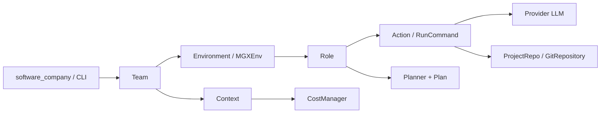

| 模块 | 主文件 | 职责 |
|------|--------|------|
| **Team** | `team.py` | 雇佣 Role、预算、`run(n_round)`、`run_project(idea)` |
| **Environment** | `environment/base_env.py` | `roles`、`member_addrs`、`publish_message`、`run()` |
| **MGXEnv** | `environment/mgx/mgx_env.py` | Leader 门控发布、`ask_human` / `reply_to_human` |
| **Role** | `roles/role.py` | `observe` → `react` → `publish_message` |
| **Action** | `actions/action.py` | 单步业务 LLM / 落盘 |
| **Message** | `schema.py` | `cause_by` / `send_to` / `instruct_content` |
| **Context** | `context.py` | `config`、`cost_manager`、`kwargs.project_path` |

---

## 2. 继承与实现关系

### 2.0 核心领域总类图（单图 · §2.1–2.6 合并）

| 版本 | 说明 | 链接 |
|------|------|------|
| **Archify 分层版（推荐阅读）** | 三层区域：编排 / 运行时 / 角色池；主路径清晰 | [metagpt-core-domain.architecture.html](./diagrams/metagpt-core-domain.architecture.html) · [JSON](./diagrams/metagpt-core-domain.architecture.json) |
| **Mermaid 枚举版（保留）** | 全类继承与组合关系，字段最全，略密 | 下文 Mermaid |

> Archify 图 **不替换** Mermaid；二者互补。`actions/` 另有 40+ `Action` 子类见 `metagpt/actions/`。

```mermaid
classDiagram
    direction TB

    %% ─── §2.6 Team 与 Context ───
    class Team {
        +env ExtEnv
        +investment float
        +use_mgx bool
        +hire() run() run_project()
    }
    class Context {
        +config Config
        +cost_manager CostManager
        +kwargs AttrDict
    }
    class Config
    class CostManager {
        +max_budget total_cost
    }
    class AttrDict

    %% ─── §2.1 环境层（MGX 与 Environment 平级）───
    class BaseEnvironment {
        <<abstract>>
    }
    class ExtEnv {
        +roles dict
        +member_addrs
        +publish_message()
        +run()
        +history Memory
    }
    class Environment {
        经典消息总线
    }
    class MGXEnv {
        Leader门控发布
        +ask_human()
        +reply_to_human()
    }

    %% ─── Mixins / 序列化 ───
    class BaseSerialization
    class SerializationMixin
    class ContextMixin {
        +context Context
        +llm BaseLLM
    }
    class BaseLLM {
        <<abstract provider>>
    }

    %% ─── §2.3 Role 运行时组合 ───
    class BaseRole {
        <<abstract>>
        +run() react() is_idle
    }
    class RoleReactMode {
        <<enumeration>>
        react by_order plan_and_act
    }
    class Role {
        +name profile goal
        +RoleContext rc
        +addresses set
        +_observe _think _act _react
        +publish_message()
    }
    class RoleContext {
        +msg_buffer MessageQueue
        +memory Memory
        +working_memory Memory
        +watch set
        +todo Action
        +news list
        +react_mode RoleReactMode
        +env BaseEnvironment
    }
    class MessageQueue
    class Memory
    class RoleZeroLongTermMemory

    %% ─── §2.2 RoleZero 支（name 为默认）───
    class RoleZero {
        Zero · RoleZero
        +planner Planner
        +tool_execution_map
        +command_rsp
        +editor Editor
        +browser Browser
        +use_fixed_sop
    }
    class TeamLeader {
        Mike · Team Leader
    }
    class ProductManager {
        Alice · Product Manager
    }
    class Architect {
        Bob · Architect
    }
    class ProjectManager {
        Eve · Project Manager
    }
    class Engineer2 {
        Alex · Engineer2
    }
    class DataAnalyst {
        David · DataAnalyst
    }
    class SWEAgent {
        Swen · Issue Solver
    }

    %% ─── §2.2 经典 Role 支 ───
    class Engineer {
        Alex · Engineer classic
    }
    class QaEngineer {
        Edward · QaEngineer
    }
    class DataInterpreter {
        David · DataInterpreter
    }
    class Researcher {
        David · Researcher
    }
    class Assistant {
        Lily · Assistant
    }
    class Teacher {
        Lily · Teacher
    }
    class TutorialAssistant {
        Stitch · Tutorial
    }
    class InvoiceOCRAssistant {
        Stitch · Invoice OCR
    }
    class Searcher {
        Alice · Searcher
    }
    class Sales {
        John Smith · Sales
    }
    class CustomerService {
        Xiaomei · CS
    }

    %% ─── §2.5 Plan / Planner ───
    class Planner {
        +plan Plan
        +update_plan()
    }
    class Plan {
        +tasks Task[]
        +current_task
    }
    class Task {
        +task_id assignee instruction
        +dependent_task_ids
    }
    class TaskResult

    %% ─── §2.4 Action 与 §2.5 Message ───
    class Action {
        +run() llm prefix
    }
    class ActionNode {
        +fill()
    }
    class ActionOutput
    class UserRequirement
    class RunCommand
    class PrepareDocuments
    class WritePRD
    class WriteDesign
    class WriteTasks
    class WriteCode
    class WritePlan
    class WriteTest
    class Message {
        +content instruct_content
        +cause_by sent_from send_to
    }
    class UserMessage
    class AIMessage
    class SystemMessage

    %% ─── §2.6 产物与 Git ───
    class ProjectRepo {
        +docs DocFileRepositories
        +srcs tests resources
    }
    class DocFileRepositories
    class FileRepository
    class GitRepository

    %% ─── RoleZero 工具（组合）───
    class Editor
    class Browser
    class Terminal

    %% ─── 继承：环境 ───
    BaseEnvironment <|-- ExtEnv
    ExtEnv <|-- Environment
    ExtEnv <|-- MGXEnv
    BaseSerialization <|-- SerializationMixin
    SerializationMixin <|-- MGXEnv

    %% ─── 继承：Role ───
    BaseRole <|.. Role
    BaseSerialization <|-- Role
    ContextMixin <|-- Role
    Role <|-- RoleZero
    RoleZero <|-- TeamLeader
    RoleZero <|-- ProductManager
    RoleZero <|-- Architect
    RoleZero <|-- ProjectManager
    RoleZero <|-- Engineer2
    RoleZero <|-- DataAnalyst
    RoleZero <|-- SWEAgent
    Role <|-- Engineer
    Role <|-- QaEngineer
    Role <|-- DataInterpreter
    Role <|-- Researcher
    Role <|-- Assistant
    Role <|-- Teacher
    Role <|-- TutorialAssistant
    Role <|-- InvoiceOCRAssistant
    Role <|-- Searcher
    Role <|-- Sales
    Sales <|-- CustomerService
    Memory <|-- RoleZeroLongTermMemory

    %% ─── 继承：Action / Message ───
    BaseSerialization <|-- Action
    ContextMixin <|-- Action
    Action <|-- UserRequirement
    Action <|-- RunCommand
    Action <|-- PrepareDocuments
    Action <|-- WritePRD
    Action <|-- WriteDesign
    Action <|-- WriteTasks
    Action <|-- WriteCode
    Action <|-- WritePlan
    Action <|-- WriteTest
    Message <|-- UserMessage
    Message <|-- AIMessage
    Message <|-- SystemMessage

    %% ─── 组合：Team / Env / Role ───
    Team *-- Context : context
    Team o-- ExtEnv : env
    Context *-- Config
    Context *-- CostManager
    Environment o-- Role : roles
    MGXEnv o-- Role : roles
    ExtEnv *-- Memory : history
    Role *-- RoleContext : rc
    RoleContext *-- MessageQueue
    RoleContext *-- Memory : memory
    RoleContext *-- Memory : working_memory
    RoleContext --> RoleReactMode
    RoleContext o-- BaseEnvironment
    Role --> Action : todo actions
    RoleZero *-- Planner
    RoleZero o-- Editor
    RoleZero o-- Browser
    Planner *-- Plan
    Plan o-- Task
    Planner ..> TaskResult
    ContextMixin o-- BaseLLM : llm
    ContextMixin o-- Context
    Action ..> ActionOutput : may return
    Action ..> Message : via Role._act
    WritePRD ..> ActionNode : fill
    WritePRD ..> ProjectRepo : save
    Action ..> ProjectRepo
    Team ..> ProjectRepo : project_path
    ProjectRepo *-- DocFileRepositories
    ProjectRepo *-- FileRepository
    ProjectRepo o-- GitRepository
    Environment ..> Context : shared
```

| 图例 | 含义 |
|------|------|
| `Team o-- ExtEnv` | `use_mgx=True` 时为 `MGXEnv`，否则为 `Environment`，**二者平级** |
| `RoleContext.watch` | 经典 SOP 订阅 `cause_by`；默认 RoleZero 组员常为空，靠 `send_to` 点名 |
| 虚线 `..>` | 产出、落盘、可选类型（非拥有关系） |
| `*--` / `o--` | 组合 / 聚合 |

---

### 2.1 环境层（注意：MGX **不**继承经典 Environment）

> 分图 · 见 [§2.0](#20-核心领域总类图单图--2126-合并)

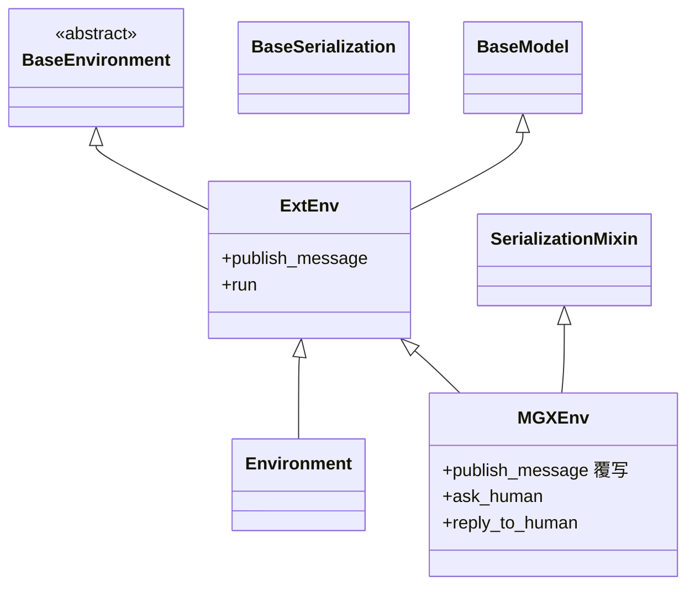

| 类 | 父类 | 说明 |
|----|------|------|
| `ExtEnv` | `BaseEnvironment`, `BaseModel` | 环境抽象 + API 注册表 |
| `Environment` | `ExtEnv` | 经典内存总线，`publish_message` 按 `is_send_to` 投递 |
| `MGXEnv` | `ExtEnv`, `SerializationMixin` | **与 `Environment` 平级**；覆写 `publish_message` 做 Leader 路由 |

### 2.2 Role 层

> 分图 · 全量单图见 [§2.0](#20-核心领域总类图单图--2126-合并)

图中 **「类 · name」** 为 `roles/*.py` 里默认的 `name` 字段（运行时可改）。`Role` 基类默认 `name=""`。

#### 2.2.1 继承树（RoleZero 支）

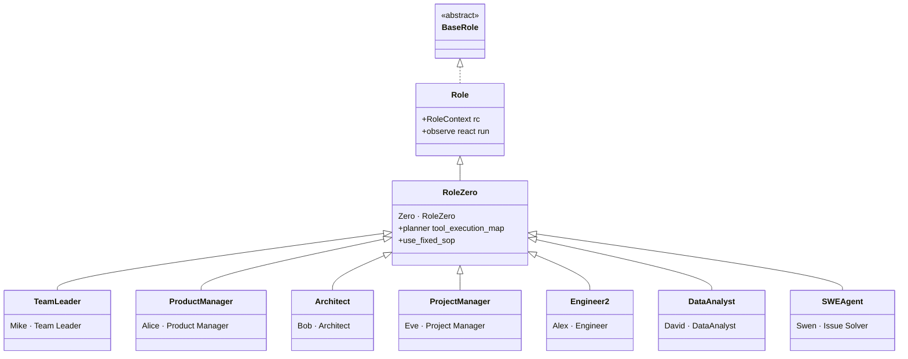

#### 2.2.2 继承树（经典 `Role` 直子类）

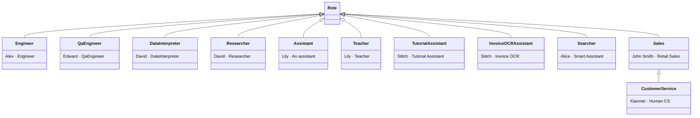

#### 2.2.3 角色名录（`metagpt/roles/` 全部具体 Role）

| 类 | 默认 name | profile（摘要） | 继承 | 源码 |
|----|-----------|-----------------|------|------|
| `TeamLeader` | **Mike** | Team Leader | `RoleZero` | `roles/di/team_leader.py` |
| `ProductManager` | **Alice** | Product Manager | `RoleZero` | `roles/product_manager.py` |
| `Architect` | **Bob** | Architect | `RoleZero` | `roles/architect.py` |
| `ProjectManager` | **Eve** | Project Manager | `RoleZero` | `roles/project_manager.py` |
| `Engineer2` | **Alex** | Engineer | `RoleZero` | `roles/di/engineer2.py` |
| `DataAnalyst` | **David** | DataAnalyst | `RoleZero` | `roles/di/data_analyst.py` |
| `SWEAgent` | **Swen** | Issue Solver | `RoleZero` | `roles/di/swe_agent.py` |
| `RoleZero` | Zero | RoleZero | `Role` | `roles/di/role_zero.py` |
| `Engineer` | **Alex** | Engineer | `Role` | `roles/engineer.py` |
| `QaEngineer` | **Edward** | QaEngineer | `Role` | `roles/qa_engineer.py` |
| `DataInterpreter` | **David** | DataInterpreter | `Role` | `roles/di/data_interpreter.py` |
| `Researcher` | **David** | Researcher | `Role` | `roles/researcher.py` |
| `Assistant` | **Lily** | An assistant | `Role` | `roles/assistant.py` |
| `Teacher` | **Lily** | `{language} Teacher` | `Role` | `roles/teacher.py` |
| `TutorialAssistant` | **Stitch** | Tutorial Assistant | `Role` | `roles/tutorial_assistant.py` |
| `InvoiceOCRAssistant` | **Stitch** | Invoice OCR Assistant | `Role` | `roles/invoice_ocr_assistant.py` |
| `Searcher` | **Alice** | Smart Assistant | `Role` | `roles/searcher.py` |
| `Sales` | **John Smith** | Retail Sales Guide | `Role` | `roles/sales.py` |
| `CustomerService` | **Xiaomei** | Human customer service | `Sales` | `roles/customer_service.py` |

> 注意：多个类共用默认名 **Alex** / **David** / **Alice** / **Lily** / **Stitch** 时，**同一 `Team` 里不要重复 hire 同名**，否则 `env.roles[name]` 会覆盖。

#### 2.2.4 常见组队

| 场景 | hire 列表（name） | 说明 |
|------|-------------------|------|
| **默认 CLI** `software_company` | Mike, Alice, Bob, Alex(Engineer2), David(DataAnalyst) | 无 Eve、**无 Edward** |
| **Chainlit** `ui_with_chainlit/app.py` | Alice, Bob, **Eve**, Alex(Engineer×n_borg), **Edward** | 经典 `Engineer` + **`QaEngineer`**，无 Mike |
| **固定 SOP 测试** `run_mgx_env.py` | Mike + Alice/Bob/Eve + Engineer 或 Engineer2 + David | `use_fixed_sop` 切换 |
| **Data Interpreter 示例** | 单 `DataInterpreter`(David) | 非多角色公司 |

**默认 `software_company` 路径**：Mike → 派 Alice / Bob / Alex / David（RoleZero + MGX）。  
**经典 QA 链**：需在 hire 中显式加入 **`QaEngineer`(Edward)**，并通常配合 `Engineer` + `use_mgx=False` 或 Chainlit 式组队。

#### 2.2.5 MGX 下 hire 经典 `Role`（不继承 `RoleZero`）会不会炸？

**不会因为「没继承 RoleZero」而报错或无法实例化。** 类型上 `Team.hire(roles: list[Role])`，`MGXEnv.add_roles` 也只要求 `Role`；框架**没有**「MGX 只能挂 RoleZero」的运行时检查。

官方测试里就曾在 **同一 `MGXEnv`** 里挂经典 `Engineer`：

```15:31:MetaGPT/tests/metagpt/environment/mgx_env/run_mgx_env.py
async def main(requirement="", enable_human_input=False, use_fixed_sop=False, allow_idle_time=30):
    if use_fixed_sop:
        engineer = Engineer(n_borg=5, use_code_review=False)
    else:
        engineer = Engineer2()
    env = MGXEnv()
    env.add_roles([TeamLeader(), ProductManager(use_fixed_sop=use_fixed_sop), ... engineer, DataAnalyst()])
```

真正要关心的是 **协作语义是否对得上**，不是继承关系：

| 维度 | 经典 `Role`（如 `Engineer` / `QaEngineer`） | 默认 MGX + `RoleZero` 组员 |
|------|---------------------------------------------|----------------------------|
| **被谁唤醒** | `rc.watch`（`cause_by` 匹配）**或** `self.name in msg.send_to` | 主要靠 Mike `publish_team_message(..., send_to="Alice")` 点名 |
| **出站消息** | `publish_message` → MGX **再塞给 Mike** | 同上 |
| **自动 SOP 链** | 在 **经典 `Environment`** 下，A 的 `WritePRD` 产出可让 B `_watch` 接棒 | 默认 **不会** 仅靠 `cause_by` 链式唤醒；要 Mike 派活，或 `use_fixed_sop=True` + 整队按固定 Action 跑 |
| **上下文** | 默认只把 **news** 写入 memory | `RoleZero` 常开 `observe_all_msg_from_buffer=True`，buffer 里别的消息也会进 memory |

**容易踩坑的组合**（能跑，但经常「没人动」或链断）：

1. **Mike + RoleZero PM + 经典 `Engineer`**：PM 用命令/工具产出的 `cause_by` 往往是 `RunCommand`，不是 `WriteTasks`；`Engineer` 的 `_watch([WriteTasks, ...])` **对不上**，除非 Mike 明确 `send_to` 点到 **Alex**，且消息里带齐路径/需求。
2. **指望 `_watch` 自动接棒**：在 MGX 里组员回传仍会经 Mike；下一棒若没人被 `send_to` 点名，经典角色 **idle**，不会像 Chainlit 经典 env 那样自动流转。
3. **要完整 QA**：hire **`QaEngineer`(Edward)** + 经典 **`Engineer`**，并更稳妥地用 **`use_mgx=False`**（或自己保证每步都由 Leader/人类点名），见上表 Chainlit 场景。

**实用结论**：

- **可以**在 MGX 里 hire 经典角色；仓库用 `run_mgx_env.py` 的 **`use_fixed_sop=True` + `Engineer`** 就是刻意混编。
- **默认 `software_company` 不 hire 经典池**，不是因为技术禁止，而是 **Leader 派活 + RoleZero 工具** 与 **watch 链 SOP** 两套编排；要经典链请 **`use_fixed_sop`**、**`use_mgx=False`**，或像 Chainlit 那样组一队经典角色。

### 2.3 RoleContext 与组合（非继承）

> 分图 · 见 [§2.0](#20-核心领域总类图单图--2126-合并)

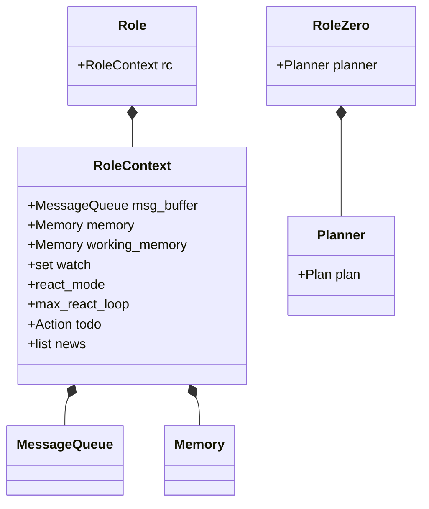

### 2.4 Action 与消息

> 分图 · 见 [§2.0](#20-核心领域总类图单图--2126-合并)

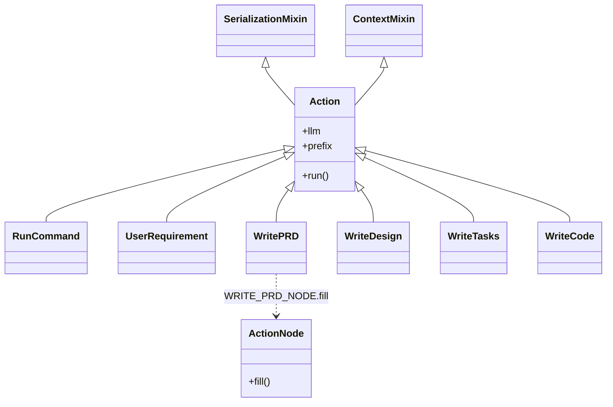

`actions/` 下约有 **50+** `Action` 子类；软件流水线常见边：`UserRequirement` → `WritePRD` → `WriteDesign` → `WriteTasks` → `WriteCode`。

### 2.5 Message 与 Plan

> 分图 · 见 [§2.0](#20-核心领域总类图单图--2126-合并)

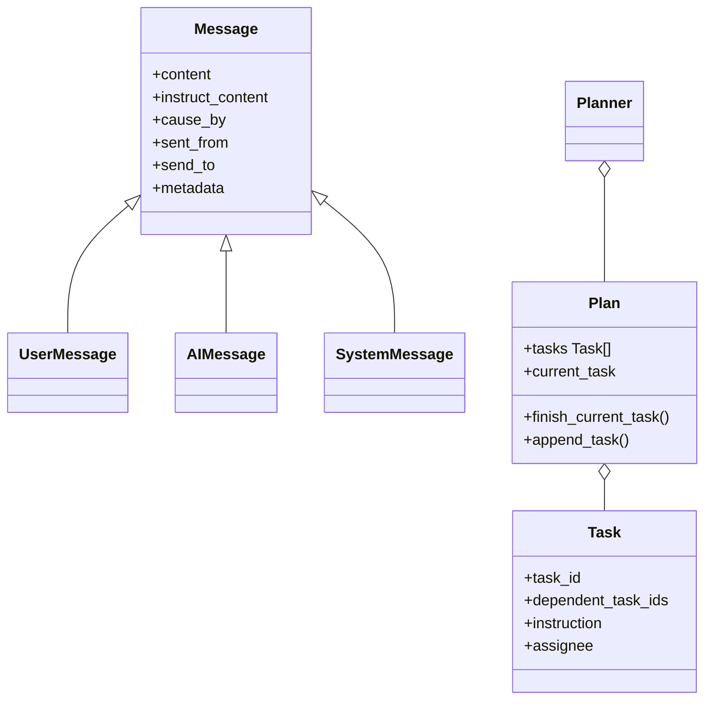

| 路由字段 | 作用 |
|----------|------|
| **cause_by** | 字符串化 Action 类名；**经典 SOP 的 `watch` 订阅键** |
| **send_to** | `set[str]`，含 `MESSAGE_ROUTE_TO_ALL` 或 Role 名 |
| **instruct_content** | Pydantic 结构化载荷（路径、PRD 字段等） |

### 2.6 Team 与 Context

> 分图 · 见 [§2.0](#20-核心领域总类图单图--2126-合并)

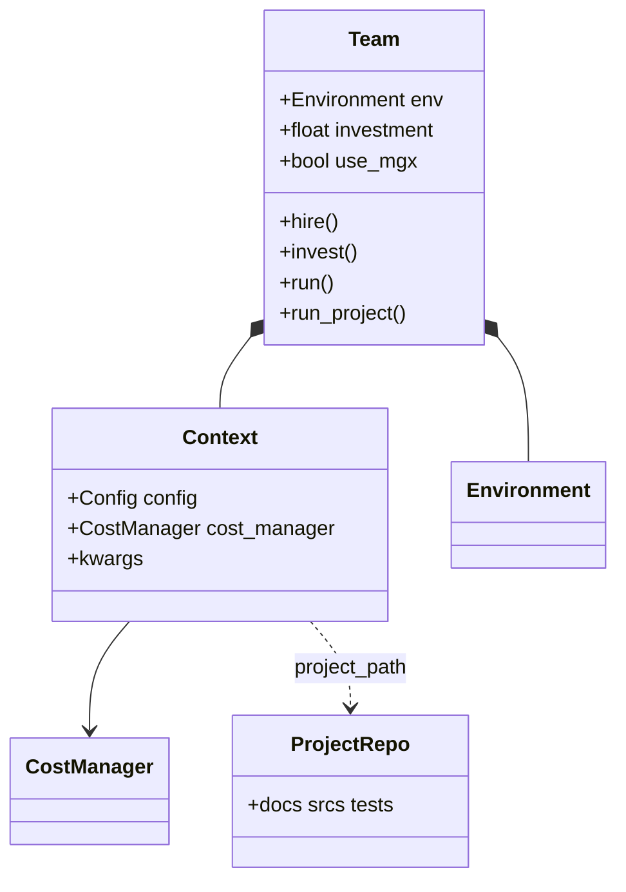

`Team.__init__`：`use_mgx=True`（默认）→ `MGXEnv`；`use_mgx=False` → `Environment`。

---

## 2.7 Plan 模式辨析（最容易混在一起的四件事）

> **默认 ③ 全文（Plan + Message + Loop + 示例）**：[PLAN_MODE.md](./PLAN_MODE.md)。下文保留 **①②④ 简表**。

读 MetaGPT 时「Plan」可能指 **四套互不替代的东西**。默认 `metagpt "做 xxx"` 用的是 **③**，不是 ①，也通常不是 ④。

### 对照表

| # | 名字 | 是什么 | 谁在用 | 和 `Role.react()` 的关系 |
|---|------|--------|--------|---------------------------|
| **①** | **`RoleReactMode.plan_and_act`** | 一种 **react 模式**：先整表规划，再 **按 Task 逐个执行**，带 `AskReview` | 主要是 **`DataInterpreter`**（`react_mode="plan_and_act"` 默认） | `react()` → **`_plan_and_act()`**，**不是**每步 `_think` 选 Action |
| **②** | **`Planner` + `WritePlan` Action** | ① 里的 **规划引擎**：LLM 输出 JSON 任务列表 → 写入 **`schema.Plan`** | 被 ① 调用；也可单独 `TeamLeader.planner.update_plan(goal=...)`（示例脚本） | 只在 ① 开头 `update_plan()`，或人工调 API |
| **③** | **`schema.Plan` + `Plan.*` 工具命令** | 内存里的 **任务 DAG**（`Task` + `dependent_task_ids` + `current_task`） | **所有 `RoleZero`**（Mike/Alice/Bob/Alex…） | `react_mode` 仍是 **`react`**；每轮 `_think` 里 LLM 可发 **`Plan.append_task` / `finish_current_task`** 等 |
| **④** | **`WriteTasks` Action（项目经理）** | 经典 SOP：**把排期写进仓库** `docs/...`（`ProjectRepo`），给 Engineer 读 | **`ProjectManager`(Eve)**，`use_fixed_sop` 链 | 属于 **`by_order` / watch 链** 的一步 Action，**不是** `schema.Plan` 对象 |

---

### ① `plan_and_act` 模式在干什么（单 Role 内闭环）

适用角色：`DataInterpreter` 等 **直接继承 `Role`**、且 `self._set_react_mode("plan_and_act")` 的类。  
**默认软件公司五人组不是这个模式。**

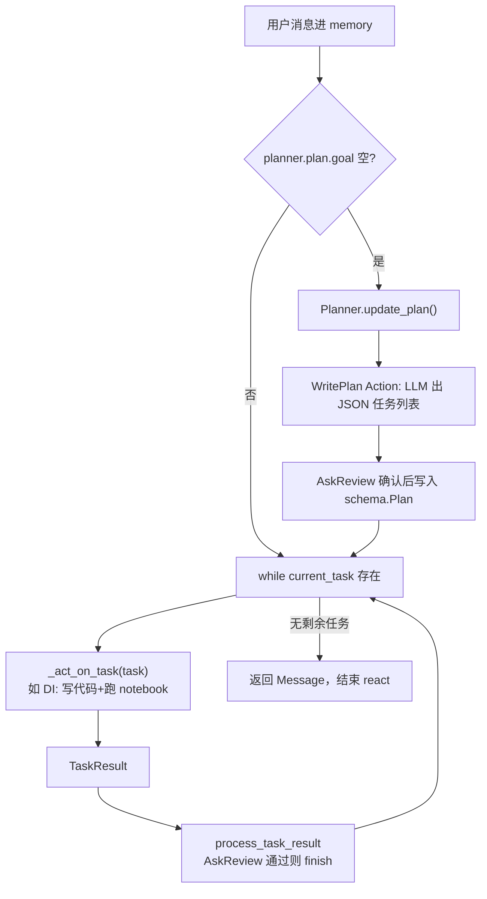

核心代码路径（`roles/role.py`）：

```text
react() 当 react_mode == plan_and_act
  → _plan_and_act()
       → 若无 goal：planner.update_plan()  # 内部 WritePlan + 人审
       → while planner.current_task:
            task_result = await _act_on_task(current_task)
            await planner.process_task_result(task_result)
```

特点：

- **规划一次（可修订）**，再 **按当前 Task 执行**；执行逻辑由子类实现 `_act_on_task`。
- 和 **ReAct**（`react_mode="react"`）不同：ReAct 是 **多轮 `_think`→`_act`**，没有「先填满 Plan 再 while 任务」这一层外壳。

`DataInterpreter` 还可切 **`react_mode="react"`**：走 `_think`（是否继续）+ `_act`（写代码），**不用** `_plan_and_act` 外壳。

---

### ③ RoleZero 的 Plan（默认 CLI 实际在用的「计划」）

`RoleZero` 初始化时 **总会** 挂一个 `Planner(plan=Plan(goal=""))`，但 **`react_mode` 固定为 `react`**（见 `role_zero.py` `assert self.react_mode == "react"`）。

因此 Mike / Alice 的「计划」是：

- **对象**：`self.planner.plan`（`schema.Plan`）
- **更新方式**：不是走 ① 的 `_plan_and_act()`，而是在 **`_act` 执行工具** 时调用  
  `Plan.append_task` / `finish_current_task` / `replace_task` / `reset_task`（映射在 `tool_execution_map`）
- **展示给 LLM**：`CMD_PROMPT` 里的 `{plan_status}`、`{current_task}`（`get_plan_status`）

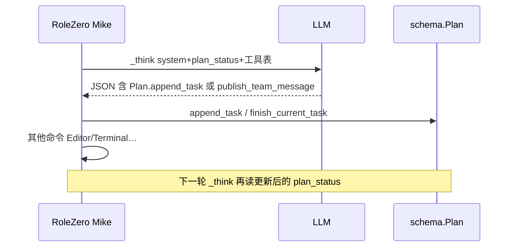

和 **①** 的差别：

| | plan_and_act (①) | RoleZero + Plan 工具 (③) |
|--|------------------|---------------------------|
| 外层循环 | `_plan_and_act` 包住全部任务 | `_react` 里多轮 think/act |
| 规划 Action | **`WritePlan`** 专用 LLM | 常 **`Plan.append_task`** 与别的命令 **同一 JSON 数组** |
| 人审 | `Planner.ask_review` 内置 | 主要靠 `RoleZero.ask_human` / Leader 对话 |
| 任务执行 | `_act_on_task` 子类实现 | **工具**（Editor、WritePRD.run…） |

**TeamLeader** 的 `Planner` 还用于：**拆给全队的任务表**（assignee=Alice/Bob…），和 **Mike 自己的 react 轮次** 绑在一起，但仍然属于 ③，不是 ①。

---

### ④ `WriteTasks`（项目排期文件）≠ `schema.Plan`

- **`ProjectManager`** 在经典 SOP 里执行 **`WriteTasks.run`** → 读设计文档 → LLM 生成任务 breakdown → **保存到 `ProjectRepo` 的 task 文档**（给 **`Engineer`** 读路径）。
- 这是 **仓库里的 markdown/json 产物**，和内存里的 **`schema.Plan`** 没有自动同步。
- 默认 CLI **不 hire Eve**；Engineer2 更多读 **system_design** + Leader 派活，而不是 Eve 的 `WriteTasks` 文件。

---

### 和文档 §3.3「L3 内层」怎么对应

| 你在代码里看到的 | 对应本节 |
|------------------|----------|
| `RoleReactMode.PLAN_AND_ACT` | **①** |
| `Planner.update_plan` / `WritePlan` | **②**（服务于 ①） |
| `Plan.finish_current_task` in command JSON | **③** |
| `WriteTasks` / `project_schedule` | **④** |

**一句话**：  
- **`plan_and_act`** = 「先 `WritePlan` 填表，再 while 做任务」的 **Role 模式**（DI 典型）。  
- **默认公司** = **RoleZero 的 react**，Plan 只是 **think/act 里可改的任务 DAG + 提示词里的 plan_status**，外加可选的 **④ 仓库排期**（要 Eve + 经典 SOP 才有）。

---

## 3. 三层嵌套循环（完整 Loop）

### 3.1 总览

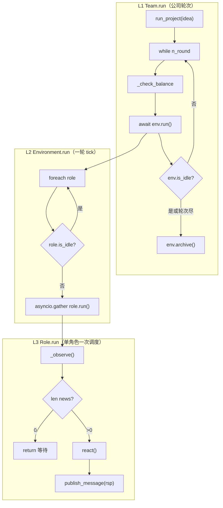

**`is_idle`（Role）**：`not rc.news and not rc.todo and msg_buffer.empty()`  
**`is_idle`（Env）**：所有 Role 均 idle。

### 3.2 L3 内层：`react` 两种形态

#### A. 经典 `Role`（`react` / `by_order` / `plan_and_act`）

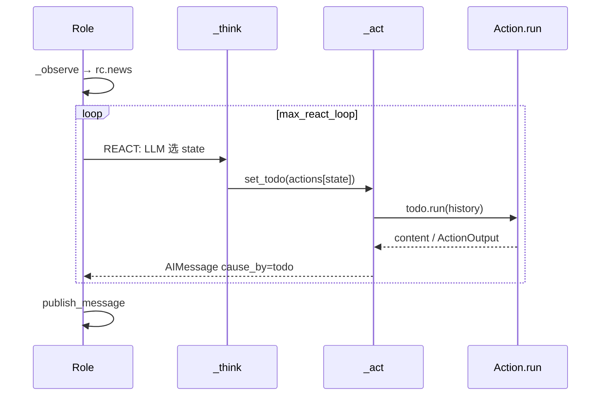

#### B. `RoleZero`（默认组员 + Leader）

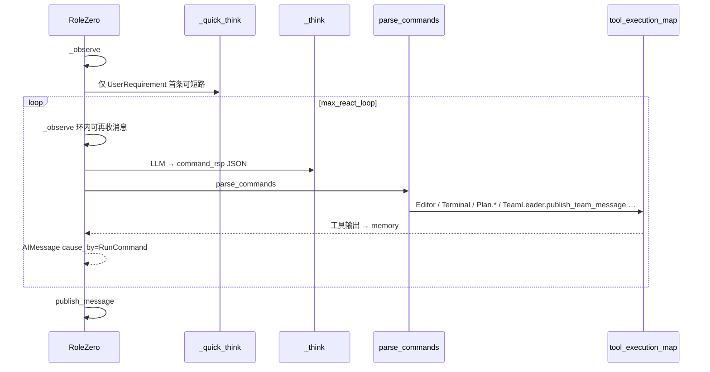

`use_fixed_sop=True` 时：`RoleZero._think/_act` **委托** `Role` 父类，走 **Action 列表 + `BY_ORDER`/`REACT`**，与上节 A 一致。

---

## 4. 消息传递：投递 vs 唤醒

### 4.1 经典 `Environment.publish_message`

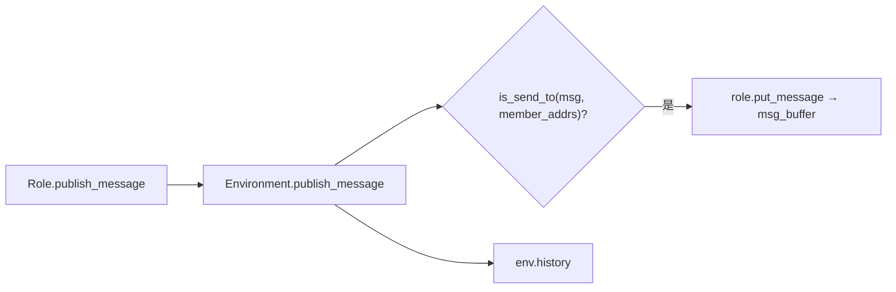

**唤醒（`_observe`）**：

```text
rc.news = [ n for n in buffer
            if (n.cause_by in rc.watch or self.name in n.send_to)
            and n not in old_messages ]
```

**经典 SOP（对等 watch 链）**：

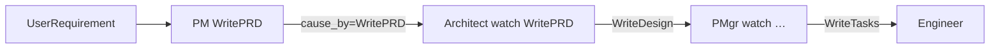

### 4.2 `MGXEnv`：Hub-and-spoke（默认 CLI）

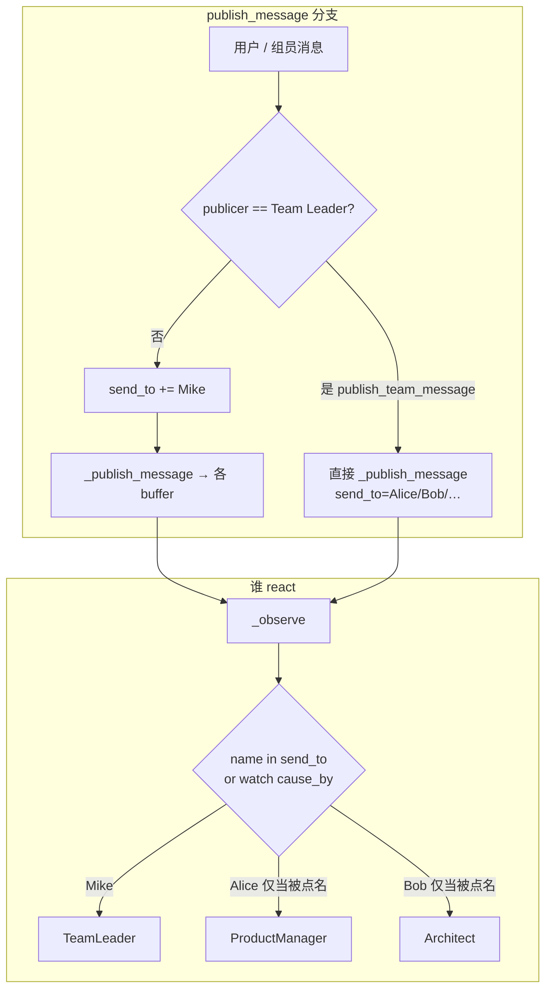

要点：

| 现象 | 含义 |
|------|------|
| buffer 里大家可能都有副本 | **传输层**（常带 `<all>`） |
| 组员 **不会** 因组员 `RunCommand` 产出自动 react | **执行层** 无 watch 则不唤醒 |
| 组员产出后 `send_to += Mike` | **回到 Leader 再转发** |

详见 [TEAMLEADER_E2E_SOFTWARE_COMPANY.md](./TEAMLEADER_E2E_SOFTWARE_COMPANY.md) §7。

### 4.3 `Role.run` 末尾出站

```text
react() 得到 Message
  → publish_message(rsp)
  → TeamLeader 覆写：非 quick 时 send_to 由参数指定或 "no one"
  → 普通 Role：env.publish_message(rsp) → MGX 再加 Mike
```

---

## 5. 默认 CLI 一轮数据流（简化编号）

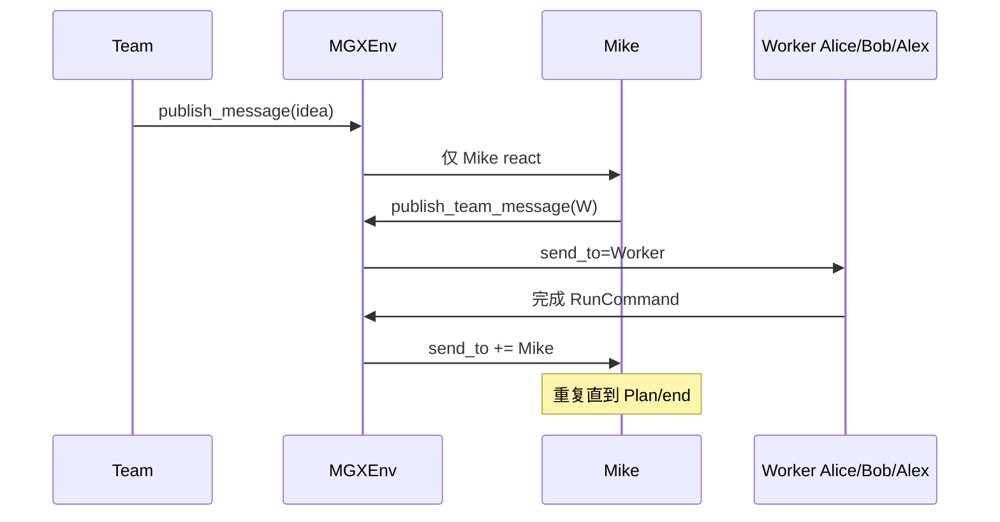

---

## 6. 与 Archify 图解对照

| 主题 | 文档章节 | HTML 图 |
|------|----------|---------|
| 四层模型 | §1 | [metagpt-four-layer.architecture.html](./diagrams/metagpt-four-layer.architecture.html) |
| Team 外层循环 | §3.1 L1 | [metagpt-team-run.sequence.html](./diagrams/metagpt-team-run.sequence.html) |
| Role observe/react | §3.2 L3 | [metagpt-role-react.sequence.html](./diagrams/metagpt-role-react.sequence.html) |
| 消息总线 + watch | §4.1 | [metagpt-message-bus.dataflow.html](./diagrams/metagpt-message-bus.dataflow.html) |
| Environment tick | §4.1 | [metagpt-environment-bus.sequence.html](./diagrams/metagpt-environment-bus.sequence.html) |
| 经典 SOP 边 | §4.1 | [metagpt-sop-watch.workflow.html](./diagrams/metagpt-sop-watch.workflow.html) |
| RoleZero vs fixed SOP | §3.2 B | [metagpt-rolezero.workflow.html](./diagrams/metagpt-rolezero.workflow.html) |
| E2E idea | §5 | [metagpt-e2e-idea.sequence.html](./diagrams/metagpt-e2e-idea.sequence.html) |

> **注意**：部分 Archify 图仍含「WritePRD watch 直链」表述；**默认 `software_company`** 以本文 §4.2 **Leader 转发** 为准。

---

## 7. 源码速查表

| 概念 | 路径 |
|------|------|
| Team | `metagpt/team.py` |
| Environment / run | `metagpt/environment/base_env.py` |
| MGXEnv | `metagpt/environment/mgx/mgx_env.py` |
| Role / observe / react | `metagpt/roles/role.py` |
| RoleZero | `metagpt/roles/di/role_zero.py` |
| TeamLeader | `metagpt/roles/di/team_leader.py` |
| Action 基类 | `metagpt/actions/action.py` |
| ActionNode.fill | `metagpt/actions/action_node.py` |
| Message / Plan / Task | `metagpt/schema.py` |
| Planner | `metagpt/strategy/planner.py` |
| Memory | `metagpt/memory/memory.py` |
| ProjectRepo | `metagpt/utils/project_repo.py` |
| CLI 入口 | `metagpt/software_company.py` |
| is_send_to | `metagpt/utils/common.py` |

---

**维护**：`Role`/`MGXEnv`/`Team` 公共 API 变更时同步更新类图与 §3 循环描述。
