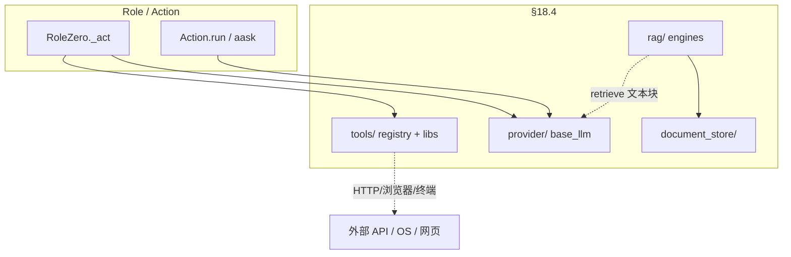

# MetaGPT §18.4 / §18.5 详解：外部能力层与认知增强层

> 对应 [ARCHITECTURE.md](./ARCHITECTURE.md) **§18.4**（`provider` / `tools` / `rag` / `document_store`）与 **§18.5**（`memory` / `strategy` / `exp_pool` / `learn`）。  
> 主链路（Team → Env → Role → Action）见 [CLASS_DIAGRAM_AND_RUNTIME.md](./CLASS_DIAGRAM_AND_RUNTIME.md)；**Plan 模式详解（MGX）**见 [PLAN_MODE.md](./PLAN_MODE.md)；四套对照简表见 CLASS_DIAGRAM §2.7；上下文「压缩」见 [ARCHITECTURE.md §5](./ARCHITECTURE.md#5-压缩-compaction)。

---

## 一、§18.4 四种外部能力（边界与调用链）

这四块都接触「模型之外的世界」，但**依赖方向与生命周期不同**。不要与 `prompts/`（静态文案）、`memory/`（对话状态）、`ProjectRepo`（研发产物文件）混用。

### 1.1 总览对照

| 目录 | 一句话 | 典型入口 | 默认软件公司是否必经 |
|------|--------|----------|----------------------|
| `provider/` | 把 `aask`/`acompletion` 接到各厂商 API | `Role`/`Action` 上的 `self.llm` | ✅ 每轮 LLM |
| `tools/` | 可注册、带 schema 的外部动作（浏览器、终端、搜索…） | `tool_registry` → RoleZero `tool_execution_map` | ✅ RoleZero 组员 |
| `rag/` | 文档 → 切块 → 检索 →（可选）排序 → 拼上下文 | `SimpleEngine`、`RoleZeroLongTermMemory` | ⚠️ 按场景 |
| `document_store/` | 向量/索引的**存储后端** | 被 `rag/retrievers` 引用 | ⚠️ 随 RAG 配置 |



### 1.2 `provider/` — 模型调用边界

**职责**

- `LLMConfig` + `llm_provider_registry`：按配置实例化 `OpenAILLM`、`AnthropicLLM` 等。
- `BaseLLM.aask` / `acompletion`：统一消息格式、重试、费用（`cost_manager`）、超时。
- **可选** `compress_messages(compress_type)`：仅在**发往 API 前**裁历史以 fit token；**不修改** `memory.storage`（见 ARCHITECTURE §5）。

**不负责**

- Role 选哪个 Action、MGX 路由、Plan 更新、工具执行。

**调用链（最常见）**

```text
RoleZero._think → llm.aask(req, system_msgs=...)
Action._aask    → self.llm.aask(...)
```

`Context` 注入 `cost_manager`；`Team.invest` 设预算，超支在 `Team._check_balance` 抛 `NoMoneyException`。

### 1.3 `tools/` — 外部动作边界

**职责**

- `@register_tool`：把类/函数登记为带 **JSON schema** 的命令名（如 `Editor.write`、`TeamLeader.publish_team_message`）。
- `tools/libs/`：Browser、Editor、Terminal、SearchEnhancedQA 等实现。
- `BM25ToolRecommender`：按当前上下文从 `Role.tools` 列表里**推荐**子集 schema 进 prompt（不是执行器）。

**RoleZero 绑定方式**

```text
set_tool_execution() → tool_execution_map["Editor.write"] = self.editor.write
_think  → recommend_tools() → 写入 SYSTEM_PROMPT 的 available_commands
_act    → parse_commands → _run_commands → tool_execution_map
```

**与 `actions/` 的区别**

| | `actions/` | `tools/` |
|--|------------|----------|
| 编排 | SOP、`watch`、`cause_by` | RoleZero 命令 JSON |
| 产出 | `ActionOutput`、常写 `ProjectRepo` | 字符串/副作用，结果进 `memory` 作 UserMessage |
| 典型 | `WritePRD`, `WriteCode` | `Terminal.run_command`, `Browser.goto` |

固定 SOP 的 `WritePRD` **内部**仍用 `Action.aask`（走 provider），**不**经过 `tool_execution_map`；RoleZero 可把 `WritePRD.run` **注册为工具** 桥接两条路径。

### 1.4 `rag/` — 文档检索流水线

**职责（目录内分工）**

```text
parsers/     读 PDF/HTML/Markdown 等 → 文本块
factories/   组装 retriever / ranker / engine
engines/     SimpleEngine：add_objs + retrieve +（可选）生成
retrievers/  从 document_store 或 BM25 等取候选
rankers/     LLM / 规则重排
prompts/     RAG 专用 prompt 片段
```

**典型用法**

1. **示例 / 知识库问答**：`SimpleEngine.from_objs(...)`，用户问题 → retrieve → LLM 生成答案。
2. **RoleZero 长期记忆**（可选）：`RoleZeroLongTermMemory` 在 `memory_k` 溢出时 `rag_engine.add_objs`，`get(k)` 时 `retrieve(query)` 把相关旧消息** prepend** 到短期列表（见 §二 memory）。

**不负责**

- 替代 `ProjectRepo` 存 PRD/设计全文；不自动订阅 `Environment` 消息。

### 1.5 `document_store/` — 向量存哪儿

**职责**

- `ChromaStore`、`FAISSStore`、`MilvusStore` 等：embedding 写入、相似度查询的**适配层**。
- 被 `rag/retrievers` 配置引用，例如 `ChromaRetrieverConfig(persist_path=..., collection_name=...)`.

**与 `rag/` 的关系**

```text
rag/retrievers  →  检索策略（top_k、过滤）
document_store  →  物理存储与查询 API
```

改存储后端一般只动 `document_store/*` + retriever 配置，不动 Role 代码。

### 1.6 四者易混点（速查）

| 误解 | 实际 |
|------|------|
| RAG = 长期记忆 | RAG 是**通用检索管线**；LTM 是 **memory/** 里可选实现，**可以**用 RAG 引擎当后端 |
| tools = provider | tools 调外部世界；provider 只调 LLM |
| document_store 会做切块 | 切块在 **rag/parsers**；store 只存向量/元数据 |
| prompts 在 provider 里 | `prompts/` 是仓库内字符串资产；provider 只传 `system_msgs` / `messages` |

---

## 二、§18.5 认知增强层（Memory / Plan / 经验 / Skill）

这四类都影响「Agent 怎么想」，但**数据形态与挂载点**不同：

```text
Memory     = 发生过什么（消息序列 + 可选 LTM）
Plan       = 接下来要做什么（schema.Plan 任务 DAG）
Experience = 过去哪些 LLM 调用值得复用（exp_pool 向量库）
Skill      = 可加载的 YAML 能力描述（learn/skill_loader）
```

### 2.1 `memory/` — 在 observe / think / act 之间

| 类 | 作用 | 默认 CLI |
|----|------|----------|
| `Memory` | `storage` 列表 + `cause_by` 索引；`get(k)` 最近 k 条 | ✅ 所有 Role |
| `BrainMemory` | 工作记忆变体 | 部分场景 |
| `LongTermMemory` | `MemoryStorage` 持久化 + `find_news` 时用 `search_similar` **过滤**与历史过像的新消息 | ⚠️ 非默认 MGX 主路径 |
| `RoleZeroLongTermMemory` | 超 `memory_k` 迁一条到 RAG；`get` 时 retrieve 拼接 | ⚠️ `config.role_zero.enable_longterm_memory` |

**与 MGX / RoleZero**

- `_observe`：`msg_buffer` → 筛 `news` → `memory.add_batch`（RoleZero 常 `observe_all_msg_from_buffer`）。
- `_think`：`memory.get(memory_k)` 进 LLM（默认 **200**），不是全量 storage。
- **无**把旧消息 summarize 回写 storage 的 Compaction（§5）。

### 2.2 `strategy/` — 规划与搜索（含 Plan 的两种用法）

| 模块 | 作用 | 与默认 MGX 的关系 |
|------|------|-------------------|
| **`Planner` + `schema.Plan`** | 维护 `goal`、`tasks[]`、`current_task`；`update_plan` 走 **`WritePlan` Action** + `AskReview` | RoleZero：**不**走 `update_plan` 外壳，用 **`Plan.*` 工具命令**（见 CLASS_DIAGRAM §2.7 ③） |
| `plan_and_act` | `Role._plan_and_act`：`while current_task` + `_act_on_task` | **DataInterpreter** 等，不是 software_company 五人组 |
| `experience_retriever` | 给 RoleZero prompt 塞 **few-shot 命令示例**（Dummy/BM25/Simple） | TeamLeader / Engineer2 等可配 |
| `task_type.py` | DataAnalyst 任务类型描述进 system prompt | David |
| **`tot.py` / `solver.py` / `search_space.py`** | Tree-of-Thoughts、搜索空间求解 | **实验/独立 Action**，非主 CLI 链 |
| `thinking_command.py` | 思考指令辅助 | 按引用 |

**MGX 下 Mike 的「计划」**：`self.planner.plan` + `Plan.append_task` / `finish_current_task` + **`TeamLeader.publish_team_message`**（派活不读 `assignee` 自动路由）。详见 [PLAN_MODE.md](./PLAN_MODE.md)（含 Message 走查）；MGX 路由细节见 [TEAMLEADER_E2E_SOFTWARE_COMPANY.md](./TEAMLEADER_E2E_SOFTWARE_COMPANY.md)。

### 2.3 `exp_pool/` — 经验池（缓存「好的 LLM 回合」）

**目的**：对**指定函数**（尤其是 `RoleZero.llm_cached_aask`）做「相似请求 → 复用历史完美响应」，减少重复推理、稳定命令 JSON。

**组件**

| 子目录 | 作用 |
|--------|------|
| `manager.py` | `ExperienceManager`：CRUD，底层仍是 **`rag.SimpleEngine` + Chroma** |
| `decorator.py` | `@exp_cache`：读池 → 未命中则执行函数 → scorer/judge 合格则写入 |
| `context_builders/` | 如 `RoleZeroContextBuilder`：从 `req` 抽检索/query 字段 |
| `serializers/` | 如 `RoleZeroSerializer`：trim 长消息再入库 |
| `scorers/` / `perfect_judges/` | 评判这次输出是否值得存 |

**开关**（`config.exp_pool`）

- `enabled` / `enable_read` / `enable_write`：全关时 `@exp_cache` **直通**原函数。
- 默认软件公司：**不保证开启**；文档 §16 写的是能力存在时的行为。

**与 memory / RAG 的区别**

| | memory | exp_pool | rag/（文档） |
|--|--------|----------|--------------|
| 存什么 | 对话 Message | 一次 LLM 调用的 req/rsp 经验 | 文档块 / 自定义 RAGObject |
| 谁消费 | 每个 Role 每轮 think | 被 `@exp_cache` 装饰的函数 | retrieve → prompt |
| 是否对话历史 | ✅ | ❌（按函数+序列化 key） | ❌ |

### 2.4 `learn/` — Skill 与轻量学习能力包装

| 文件 | 作用 |
|------|------|
| `skill_loader.py` | 读 YAML Skill（name、parameters、examples）→ 供 Action/配置加载 |
| `google_search.py` | 搜索能力封装（与 `tools/search_engine` 有重叠，偏 learn 插件式） |
| `text_to_embedding.py` | 文本向量化 |
| `text_to_image.py` / `text_to_speech.py` | 多模态生成包装 |

**运行时**：不是 Team 启动自动加载；由**具体 Action、配置或 examples** 引用。与仓库根下 `skills/SummarizeSkill/` 等资源目录配合（见 ARCHITECTURE 目录表）。

**与 `tools/`**：`learn` 偏「能力描述 + 薄封装」；`tools` 偏「RoleZero 可执行命令 + registry」。

---

## 三、默认 `software_company`（MGX）走哪些模块

```text
必经：provider/  tools/（RoleZero）  memory/Memory  strategy/Planner+Plan（命令工具）
      utils/project_repo  environment/mgx  roles/di/*

按配置：exp_pool（llm_cached_aask）  role_zero LTM（rag+document_store）
通常不经：strategy/tot  learn/skill_loader  完整 RAG 问答链（除非单独做 RAG 示例）
经典 SOP 才重：actions/* + WriteTasks 文件排期（④，非 schema.Plan）
```

---

## 四、源码阅读顺序（补 18.8）

```text
§18.4 外部能力
  provider/base_llm.py → configs/llm_config.py
  tools/tool_registry.py → tools/libs/editor.py
  rag/engines/simple.py → rag/retrievers/* → document_store/chroma_store.py

§18.5 认知增强
  memory/memory.py → memory/role_zero_memory.py
  strategy/planner.py → schema.py Plan/Task
  roles/di/role_zero.py（Planner + exp_cache）
  exp_pool/decorator.py → manager.py
  learn/skill_loader.py
```

---

**维护**：`metagpt/` 下上述包公共 API 变更时同步更新本节与 ARCHITECTURE §18.4–18.5 链接。
