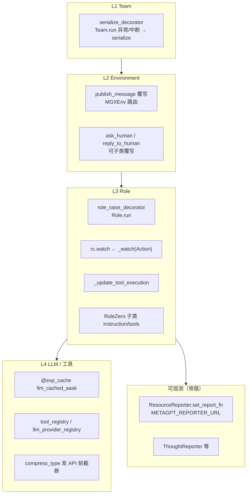

# MetaGPT：没有统一 Hook 框架，扩展点在哪

> 若你期待的是 **Cursor `hooks.json` / LangChain Middleware / 一条可插拔的 before-think-after-act 链**，MetaGPT **主仓库里没有这套抽象**。  
> 扩展靠 **子类覆写、装饰器、注册表、消息 `watch`、Reporter 回调、可选 `exp_cache`** 等分散机制完成。  
> 相关主链路见 [CLASS_DIAGRAM_AND_RUNTIME.md](./CLASS_DIAGRAM_AND_RUNTIME.md)；外部能力与认知层见 [EXTERNAL_AND_COGNITIVE_MODULES.md](./EXTERNAL_AND_COGNITIVE_MODULES.md)。

---

## 1. 结论对照（先读）

| 你找的「Hook」 | MetaGPT 里有没有 |
|----------------|------------------|
| 全局 Middleware 链（按顺序插 before/after LLM） | ❌ 无 |
| 统一 `on_message` / `on_tool_call` 注册 API | ❌ 无 |
| **消息驱动「订阅」**（`watch` + `cause_by`） | ✅ 经典 SOP |
| **Role 生命周期装饰器**（`run` 外包一层） | ✅ `role_raise_decorator` |
| **Team 中断落盘** | ✅ `serialize_decorator` |
| **UI/遥测回调** | ✅ `utils/report.py` Reporter |
| **LLM 调用拦截/经验复用** | ✅ `@exp_cache`（可选） |
| **环境能力注册**（仿真/游戏） | ✅ `mark_as_readable` / `mark_as_writeable` |
| **子类扩展命令表** | ✅ `_update_tool_execution` |
| **远程人机通道覆写** | ✅ `MGXEnv.ask_human` 等（注释约定 subclass） |
| **定时触发 + 回调** | ✅ `subscription.SubscriptionRunner`（非默认 Team） |

---

## 2. 扩展点地图（相对默认 MGX 软件公司）



---

## 3. 按机制分类详解

### 3.1 消息「钩子」：`watch` + `cause_by`（经典 SOP）

**不是函数 Hook，是总线上的事件订阅。**

```text
Role A 执行 Action → Message.cause_by = "WritePRD"
Role B._observe()  → news 中 cause_by ∈ B.rc.watch 的进入 react
```

- 配置：`Role._watch([WritePRD, WriteDesign, ...])`（如 `Engineer`）。
- **MGX 默认**：组员多靠 `send_to` 点名，**`watch` 链常被 Leader 派活替代**（见 [TEAMLEADER_E2E_SOFTWARE_COMPANY.md](./TEAMLEADER_E2E_SOFTWARE_COMPANY.md)）。
- 扩展方式：hire 不同 Role、改 `_watch`、或换 `Environment` 而非 `MGXEnv`。

### 3.2 生命周期装饰器

| 装饰器 | 挂在 | 行为 |
|--------|------|------|
| `role_raise_decorator` | `Role.run` | 异常时删掉 `latest_observed_msg` 便于重试；KeyboardInterrupt 序列化提示 |
| `serialize_decorator` | `Team.run` | 异常/中断后调用 `Team.serialize()` 落盘恢复点 |

源码：`metagpt/utils/common.py`。

**没有**在 `_think` / `_act` / `Action.run` 上挂通用 before/after 列表；要插逻辑只能 **子类覆写** 这些方法。

### 3.3 Reporter：UI / 外部系统回调（最接近「观测 Hook」）

`metagpt/utils/report.py`：

- `ResourceReporter` / `ThoughtReporter` / `EditorReporter` / `TerminalReporter` 等：在命令执行、流式 LLM、浏览器、终端等节点 **`report` / `async_report`**。
- **全局替换发送逻辑**：`ResourceReporter.set_report_fn(fn)`、`set_async_report_fn(fn)`。
- 默认 URL：`METAGPT_REPORTER_URL` 环境变量；为空则 **多数 report 直接 no-op**。

RoleZero 示例：`async with ThoughtReporter(enable_llm_stream=True)` 包住 `llm.aask`。

**用途**：接 Chainlit、自建 Dashboard、日志管道——**不改 Role 业务逻辑**。

### 3.4 `exp_cache`：包在单次 LLM 调用外的装饰器

- 位置：`metagpt/exp_pool/decorator.py`，典型挂在 `RoleZero.llm_cached_aask`。
- 开启 `config.exp_pool.enabled` 时：相似 `req` **读经验池**；否则执行原函数，再经 scorer/judge **可选写入**。
- **不是**全对话压缩；是 **可插拔的 LLM 调用短路**（见 [EXTERNAL_AND_COGNITIVE_MODULES.md §2.3](./EXTERNAL_AND_COGNITIVE_MODULES.md)）。

### 3.5 子类扩展点（RoleZero / Env）

| 扩展点 | 类 | 典型用途 |
|--------|-----|----------|
| `_update_tool_execution()` | `RoleZero` 子类 | 往 `tool_execution_map` 加命令（`TeamLeader.publish_team_message`） |
| `instruction` / `tools` / `experience_retriever` | 各 DI Role | 改 prompt 与推荐工具 |
| `publish_message` 覆写 | `TeamLeader` | `publicer=profile` 走 MGX 放行逻辑 |
| `MGXEnv.ask_human` / `reply_to_human` | 注释 **NOTE: Can be overwritten in remote setting** | 远程 UI、飞书、自定义 HITL |
| `use_fixed_sop` | RoleZero | `_think/_act` 委托经典 `Role` Action 链 |

### 3.6 注册表（声明式扩展，非运行时 Hook 链）

| 注册表 | 目录 | 扩展什么 |
|--------|------|----------|
| `register_tool` | `tools/tool_registry.py` | 新工具命令名 + schema |
| `llm_provider_registry` | `provider/` | 新 LLM 后端 |
| `mark_as_readable` / `mark_as_writeable` | `environment/base_env.py` | ExtEnv（Minecraft、Android…）读写 API |
| Action 子类 | `actions/` | 新 SOP 步骤（新 `cause_by` 名） |

### 3.7 `SubscriptionRunner`：触发器 + 回调（并行模式）

`metagpt/subscription.py`：

```text
async for msg in trigger():   # 外部事件源
    resp = await role.run(msg)
    await callback(resp)       # 你的 Hook
```

与 `Team` + `Environment.publish_message` **不是同一条编排**；适合 Searcher、定时任务等 **单 Role 管道**，不是默认 software_company。

### 3.8 Provider 层「截断」而非 Hook

`LLMConfig.compress_type`（`compress_msg_config.py`）：在 `BaseLLM.aask` 里 **发 API 前**裁消息列表，**不写回** `memory`（见 ARCHITECTURE §5）。这是 **配置项**，不是可注册回调。

---

## 4. 和「Hook 设计」最接近的三种集成方式

若要在 MetaGPT 上挂自己的逻辑，实践中三选一（或组合）：

1. **观测旁路**：`set_report_fn` + `METAGPT_REPORTER_URL`，或包一层自定义 `Team`/`Role` 子类只覆写 `run`/`publish_message`。
2. **编排旁路**：不用 MGX，自建 `Environment` + `_watch` 链；或用 `SubscriptionRunner` 的 `callback`。
3. **LLM 旁路**：`exp_cache` 或自定义 `RoleZero` 覆写 `llm_cached_aask` / `_think`（侵入性最大）。

**没有**官方「注册 `HookRegistry.add('after_act', fn)`」入口。

---

## 5. 源码索引

| 主题 | 路径 |
|------|------|
| Role.run 装饰器 | `metagpt/roles/role.py`, `metagpt/utils/common.py` |
| Team.run 序列化 | `metagpt/team.py` |
| Reporter | `metagpt/utils/report.py` |
| exp_cache | `metagpt/exp_pool/decorator.py`, `metagpt/roles/di/role_zero.py` |
| MGX 人机 | `metagpt/environment/mgx/mgx_env.py` |
| ExtEnv API 注册 | `metagpt/environment/base_env.py` |
| 订阅回调 | `metagpt/subscription.py` |
| 消息订阅 | `metagpt/roles/role.py` `_watch`, `_observe` |

---

## 6. 与其它框架对照（便于迁移预期）

| 框架 | Hook / 扩展形态 |
|------|-----------------|
| **MetaGPT** | 分散：watch、装饰器、Reporter、子类、注册表 |
| **AgentScope** | 有 Middleware 目录（本 monorepo `docs/agentscope/MIDDLEWARE_CATALOG.md` 另述） |
| **Codex / Cursor 类** | compaction、steer、hooks.json 等（见 `docs/codex-architecture/`） |

在 MetaGPT 文档里写「Hook 设计」时，应明确写成 **「扩展点清单」**，避免读者以为存在未文档化的隐藏 Hook 包。

---

**维护**：新增 Reporter、`exp_pool` 或 Env 覆写约定时同步更新本节。
