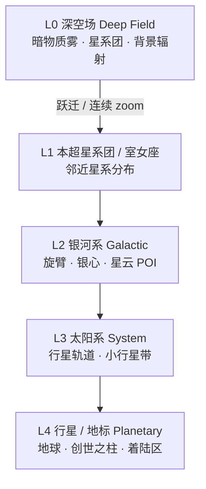
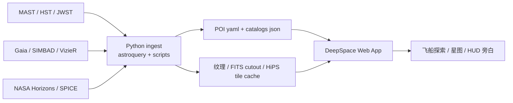
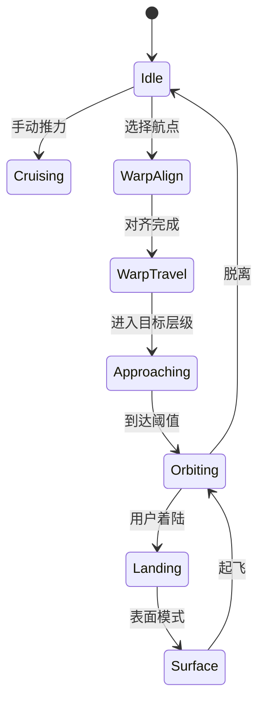

# 深空场 DeepSpace Field — 宇宙探索 Web 应用设计方案

> 版本：0.2 | 2026-06  
> 关联：`hermes-dev`（工程宿主）· `agency-agents-zh`（多角色叙事/任务编排，可选）  
> 状态：**创作 + 技术方案**（待评审后进入 MVP 实现）

---

## 0. 一句话愿景

**一个人驾驶飞船，从可交互的「深空场」出发，沿真实天文尺度逐级 zoom-in，飞向银河系、太阳系、地球，再抵达创生之柱、人马座 A* 等标志性天体——在浏览器里完成一场可着陆、可叙事的宇宙漫游。**

「真实」指：**尺度、相对位置、轨道运动、已知物理现象**尽量贴近公开天文数据；视觉上在 Web 性能边界内追求**电影感沉浸**，而非科研级全宇宙 N-body 仿真。

**数据原则**：POI 不是人工拍脑袋列清单，而是从 Hubble / Webb / Gaia / NASA / ESA / CDS 等公开档案中抽取、筛选、烘焙。本文前一版的地球、创生之柱、人马座 A* 等只是第一批示例；最终宇宙目录应由真实观测数据驱动。

**v1 决策**：第一版先做 **真实太阳系探索**，把太阳、经典九大行星（八大行星 + 冥王星/矮行星标注）与主要卫星做扎实；深空只保留 **5 个 Hubble/Webb 旗舰观测目标** 作为向外探索样板。先追求“可信、可解释、可飞达”，再扩展全宇宙目录。

---

## 1. 创作定位（先定调，再定技术）

### 1.1 体验关键词

| 维度 | 目标 |
|------|------|
| **情绪** | 孤独、敬畏、探索欲；类似《星际穿越》+《无人深空》的「点到点航行」 |
| **节奏** | 宏观巡航（分钟级）→ 中观接近（秒～十秒）→ 微观着陆（交互） |
| **认知** | 玩家始终知道「我在哪一层宇宙」：深空场 / 本星系群 / 银河系 / 猎户臂 / 太阳系 / 行星 |
| **真实性边界** | 位置与距离用真实数据；暗物质「可见化」为艺术化体积雾；黑洞用 GR 透镜近似 |

### 1.2 不是什么

- 不是硬科幻模拟器（不要求广义相对论数值解、不跑全宇宙暗物质粒子仿真）
- 不是纯 slideshow（必须有连续 3D 飞行与手动/自动导航）
- 不是一次性宣传片（要可重复探索、可扩展 POI 目录）

### 1.3 核心用户故事

```text
作为探索者，我打开深空场，
看到暗物质丝状结构中的星系团与银河盘面，
我选择「太阳系」作为航点，
飞船自动曲率跃迁式加速（视觉过渡），
减速进入内太阳系，掠过木星环，
最终着陆地球（或切换第一人称地表环视），
途中 HUD 告诉我距离、ETA、当前宇宙层级。
```

---

## 2. 宇宙层级模型（解决「尺度混乱」的根方案）

浏览器无法同时渲染「全宇宙 + 地球表面」在同一精度。采用 **层级宇宙（Layered Universe）+ 无缝过渡**：



| 层级 | 代表内容 | 空间单位 | 典型 POI |
|------|----------|----------|----------|
| **L0 深空场** | 全向星空、暗物质丝、遥远星系点精灵 | Mpc / Gpc 逻辑单位 | Hubble Deep Field 方向 |
| **L1 星系际** | 本星系群、M31、M87 | kpc～Mpc | 仙女座、室女座星系团 |
| **L2 银河** | 银河系盘、旋臂、银心 | kpc | **人马座 A***、**创生之柱**（M16）、猎户座大星云 |
| **L3 太阳系** | 八大行星、轨道、太阳 | AU | 太阳、木星、土星环、**地球** |
| **L4 行星/地标** | 行星表面或星云局部体积 | km～AU 局部 | 地球大气层、月球、创生之柱柱体特写 |

**过渡手法（电影化，非物理真实跃迁）：**

1. **Hyperspace Tunnel**（0.8～2s）：屏幕边缘拉伸 + 粒子流，掩盖切换 LOD 资产
2. **Scale Morph**：相机 FOV 变化 + 深度缓冲精度切换 + 天空盒交叉淡入
3. **Anchor Lock**：始终以「目标天体」为焦点，避免用户迷失方向

---

## 2.5 真实宇宙还原：数据源与开源底座

### 2.5.1 总体策略

深空场分成两条流水线：

1. **科学数据流水线**：从真实天文档案查询目标、坐标、距离、观测图像、光谱/滤镜信息，烘焙成 `content/poi/*.yaml` 与 `public/astro-assets/*`。
2. **实时渲染流水线**：用 Web 3D 引擎把这些数据转成可飞行场景；大尺度用点云/HiPS/LOD，小尺度用体积云、PBR 行星、黑洞透镜等近景 shader。



### 2.5.2 权威数据源（优先级）

| 数据 | 推荐来源 | 用途 | 接入方式 |
|------|----------|------|----------|
| Hubble / Webb 原始与高级产品 | [MAST](https://archive.stsci.edu/home) / STScI | HST/JWST 观测目标、滤镜、图像产品 | `astroquery.mast.Observations` / MAST HTTPS API |
| Hubble Source Catalog | MAST HSC | HST 视场内源表 | `astroquery.mast.Catalogs` |
| Gaia 恒星 | ESA Gaia DR3 / Lactea 数据结构 | 银河星场、恒星颜色/亮度/自行 | 离线抽样 + 多分辨率 LOD |
| 星云/深空对象元数据 | SIMBAD / VizieR / NED | M16、M31、M87、SMACS、Carina 等坐标与距离 | `astroquery.simbad` / VizieR |
| 太阳系天体 | NASA Horizons / NAIF SPICE | 行星、卫星、航天器位置 | 离线 ephemeris JSON |
| 全天图/巡天 | Aladin Lite / HiPS surveys | 真实天区底图、缩放浏览 | HiPS tile + Aladin Lite 参考实现 |

### 2.5.3 可复用开源项目

| 项目 | 角色 | 采用方式 |
|------|------|----------|
| [`cds-astro/aladin-lite`](https://github.com/cds-astro/aladin-lite/) | 浏览器天文 HiPS 可视化 | 作为“科学星图模式”的参考/嵌入层；用于对照真实天区 |
| [`vccvisualization/lactea`](https://github.com/vccvisualization/lactea) | Gaia 大星表 WebGPU 多分辨率可视化 | 借鉴 Gaia 星场 LOD、光谱保真思路；Phase 2 可接入子集 |
| WorldWide Telescope WebGL Engine | 天文巡天/宇宙浏览 | 作为 POI 验证与 sky survey 可视化参考 |
| OpenSpace / Celestia / Stellarium | 开源宇宙浏览与星图经验 | 不直接照搬 UI，借鉴坐标系、星历、目录组织 |
| `spiceypy` / NAIF SPICE | 高精度太阳系星历 | 数据预处理脚本使用，不放浏览器 runtime |
| `astroquery` / `astropy` | 天文数据查询与 FITS/WCS 处理 | 构建 `scripts/ingest_*`，把观测产品变成 Web 资产 |

### 2.5.4 Google 开源技术使用点

| Google OSS | 用在何处 | 价值 |
|------------|----------|------|
| [Filament](https://github.com/google/filament) | PBR 参考、glTF 资产查看、未来 WebGPU/wasm 渲染实验 | 高质量真实材质、IBL、glTF 管线 |
| [Draco](https://github.com/google/draco) | 飞船、行星地形、近景网格压缩 | 大幅减少 GLB 体积 |
| [model-viewer](https://github.com/google/model-viewer) | 资产审阅/AR 展示页，不作为主引擎 | 快速预览飞船、探测器模型 |
| Basis Universal / KTX2（Google 生态广泛使用） | 行星贴图、星云纹理压缩 | 减少 8K/16K 纹理下载体积 |

主渲染仍建议使用 **React Three Fiber + Three.js**，因为它与 `hermes-dev` 现有 Playground 经验一致；Google 技术作为资产压缩、PBR 参考和可选高质量渲染分支。

### 2.5.5 数据还原流程（每个真实 POI）

```text
1. 选题发现
   - 从 JWST/Hubble 新闻稿、MAST HLSP、观测热榜、经典天体目录中筛选

2. 坐标确认
   - SIMBAD/NED/VizieR 查 RA/Dec、距离、所属星座、红移等

3. 观测产品检索
   - MAST 查询 HST/JWST 观测
   - 过滤 productType=SCIENCE / preview / drizzled image / HLSP

4. Web 资产烘焙
   - FITS → tone map → WebP/AVIF/KTX2
   - WCS → 局部天区坐标
   - 多波段滤镜 → false-color 材质说明

5. 场景映射
   - 远景：sky billboard / HiPS tile
   - 中景：point sprites + depth slices
   - 近景：程序化体积云 / 粒子 / shader

6. 旁白与科学标签
   - 明确区分「观测事实」与「艺术化可视化」
```

---

## 3. 内容目录：v1 太阳系优先 + 5 个深空旗舰 POI

### 3.1 v1 主场：真实太阳系

第一版不是先铺全宇宙，而是先把太阳系做成可信的“宇宙入口”。太阳系必须支持真实轨道/压缩轨道切换、目标点击前往、环绕查看与科学信息面板。

| ID | 名称 | 分类 | v1 要求 | 视觉重点 |
|----|------|------|---------|----------|
| `sun` | 太阳 | 恒星 | 太阳系中心、光照、日冕可视化 | 耀斑、日冕、体积光 |
| `mercury` | 水星 | 行星 | 真实轨道、表面坑洼 | 灰色岩质表面 |
| `venus` | 金星 | 行星 | 厚大气、温室效应说明 | 黄色云层、不透明大气 |
| `earth` | 地球 | 行星 | 大气、云、夜侧城市光、月球轨道 | 蓝色海洋、大气辉光 |
| `mars` | 火星 | 行星 | 极冠、两颗卫星 | 红色地表、薄大气 |
| `jupiter` | 木星 | 行星 | 大红斑、伽利略卫星 | 条纹、风暴、巨大尺度 |
| `saturn` | 土星 | 行星 | 环系统、Titan/Enceladus | 宽大环系 |
| `uranus` | 天王星 | 行星 | 倾斜自转轴、淡环 | 青绿色、横躺旋转 |
| `neptune` | 海王星 | 行星 | Triton、深蓝大气 | 深蓝色、风暴感 |
| `pluto` | 冥王星 | 矮行星/经典第九行星 | 明确标注 dwarf planet | 心形 Tombaugh Regio |

**产品口径**：界面可使用“经典九大行星”帮助用户理解，但科学面板必须说明：现代天文学中冥王星是矮行星。

### 3.2 v1 主要卫星清单

| 主体 | v1 卫星 | 备注 |
|------|---------|------|
| 地球 | Moon | 地月系统是 Phase 0 垂直切片核心 |
| 火星 | Phobos, Deimos | 小型不规则卫星 |
| 木星 | Io, Europa, Ganymede, Callisto | 伽利略卫星必须做 |
| 土星 | Titan, Enceladus, Rhea, Iapetus | Titan 与 Enceladus 优先 |
| 天王星 | Miranda, Ariel, Umbriel, Titania, Oberon | 第一版可低精模型 |
| 海王星 | Triton | 逆行轨道说明 |
| 冥王星 | Charon | 双星感；Nix/Hydra 后续扩展 |

### 3.3 太阳系真实度要求

| 要素 | v1 要求 |
|------|--------|
| 轨道 | 使用 NASA Horizons / SPICE 离线烘焙，默认教学压缩显示；保留真实 AU 数值 |
| 尺度 | 提供“真实比例 / 教学压缩 / 电影飞行”三种模式 |
| 材质 | 优先 NASA / USGS / JPL / Hubble / Juno / Cassini / New Horizons 公开图像 |
| 科学面板 | 半径、质量、轨道周期、自转周期、卫星数、数据来源 |
| HUD | 当前目标、真实距离、压缩距离、ETA、所属系统、来源标记 |

### 3.4 v1 深空旗舰 POI（只做 5 个，质量优先）

| ID | 名称 | 来源 | 为什么保留 | 可视化方式 |
|----|------|------|------------|------------|
| `smacs-0723` | SMACS 0723 深场 | JWST | 代表早期宇宙、引力透镜、深场观测 | 深场星系云 + lens arcs |
| `carina-nebula` | 船底座星云 Cosmic Cliffs | JWST | 代表 JWST 首批图像和恒星形成 | 近红外尘埃边缘 + 体积云 |
| `eagle-nebula` | 创生之柱 / 鹰状星云 M16 | Hubble + JWST | 公众认知强，可做 Hubble/Webb 对比 | 柱体体积云 + 波段切换 |
| `stephans-quintet` | 斯蒂芬五重星系 | JWST + Hubble | 星系相互作用和潮汐结构 | 多星系 billboard + tidal tail 粒子 |
| `sagittarius-a` | 人马座 A* | EHT / NASA / ESO | 银河中心黑洞，连接太阳系所在银河位置 | 吸积盘 + 简化透镜 |

### 3.5 后续深空候选库（v1 之后）

| ID | 名称 | 来源 | 层级 | 为什么值得做 | 可视化方式 |
|----|------|------|------|--------------|------------|
| `carina-nebula` | 船底座星云 Cosmic Cliffs | JWST / Hubble | L2/L4 | JWST 代表性首批图像，恒星形成区 | 体积云 + 近红外尘埃边缘 |
| `stephans-quintet` | 斯蒂芬五重星系 | JWST / Hubble | L1/L2 | 星系相互作用，适合展示引力潮汐 | 多星系 billboard + tidal tail 粒子 |
| `smacs-0723` | SMACS 0723 深场 | JWST | L0/L1 | 引力透镜、早期宇宙深场 | 深场星系云 + lens arcs |
| `southern-ring` | 南环星云 NGC 3132 | JWST / Hubble | L2/L4 | 行星状星云，双星演化 | 壳层体积雾 + 中心双星 |
| `tarantula-nebula` | 蜘蛛星云 30 Doradus | JWST / Hubble | L2/L4 | 大麦哲伦云恒星形成区 | 高密度 young stars + 气体丝 |
| `orion-nebula` | 猎户座大星云 M42 | Hubble / 地面巡天 | L2/L4 | 近邻恒星育婴室，公众熟悉 | 星云云层 + 原行星盘点位 |
| `andromeda` | 仙女座星系 M31 | Hubble PHAT / 巡天 | L1 | 邻近大星系，可从银河外飞行 | 盘面 LOD + 恒星点云 |
| `whirlpool` | 涡状星系 M51 | Hubble | L1/L2 | 旋涡结构清晰 | 旋臂材质 + star-forming knots |
| `m87` | M87 / M87* | Hubble / EHT | L1/L2 | 椭圆星系 + 黑洞喷流 | 星系晕 + relativistic jet |
| `crab-nebula` | 蟹状星云 M1 | Hubble / Chandra | L2/L4 | 超新星遗迹、脉冲星 | 多波段壳层 + pulsar 闪烁 |
| `eagle-nebula` | 鹰状星云 M16 / 创生之柱 | Hubble / JWST | L2/L4 | 经典 HST + JWST 对比 | 柱体体积云 + 波段切换 |
| `jupiter-aurora` | 木星极光 | Hubble / Juno | L3/L4 | 行星磁场与极光 | 极区发光 shader |

### 3.6 数据生成优先级

| 优先级 | 选择标准 | 例子 |
|--------|----------|------|
| P0 | 太阳系核心闭环 | 太阳、地球、月球、轨道系统 |
| P1 | 完整经典九行星与主要卫星 | 木星系统、土星环、冥王星/Charon |
| P2 | 5 个深空旗舰 POI | SMACS 0723、创生之柱、人马座 A* |
| P3 | 更大真实宇宙目录 | Gaia 全量星场、更多 Hubble/Webb 目标 |

### 3.7 每个 POI 的标准数据包

```yaml
# content/poi/earth.yaml 示例
id: earth
name: 地球 Earth
layer: L4
parent: solar-system
ephemeris:
  source: nasa-horizons  # 或简化开普勒
  body_id: 399
visual:
  radius_km: 6371
  albedo_texture: textures/earth_8k.webp
  atmosphere: true
observations:
  primary_archive: nasa-visible-earth
  references:
    - https://visibleearth.nasa.gov/
  products:
    - type: texture
      path: textures/earth_8k.webp
narrative:
  zh: "第三颗岩石行星，已知唯一存在生命的世界。"
  en: "The third rocky planet, the only known abode of life."
landing:
  enabled: true
  sites:
    - id: pacific
      name: 太平洋上空
      lat: 0
      lon: -160
```

---

## 4. 飞行与导航：玩法设计

### 4.1 控制模式

| 模式 | 输入 | 用途 |
|------|------|------|
| **巡航 Cruise** | WASD + 鼠标 / 双摇杆 | L0～L2 自由飞行 |
| **航点锁定 Lock** | 点击星图 POI →「前往」 | 自动对齐 + 加速 |
| **轨道 Orbit** | 到达后空格切换 | 环绕目标（行星/黑洞） |
| **着陆 Land** | 进入 L4 后按 F | 减速至「表面环视」相机 |

### 4.2 导航 UI（星图 + HUD）

```text
┌─────────────────────────────────────────────────────────┐
│ 深空场 > 银河系 > 太阳系          速度 0.42c(视觉)  ETA 12s │
├──────────────────────────┬──────────────────────────────┤
│                          │  [星图 Starmap]              │
│     3D 视口               │  ○ 深空场                    │
│     （飞船准星）           │  ● 银河系 ← 当前              │
│                          │  ○ 创生之柱                   │
│                          │  ○ 太阳系 → [设为航点]        │
├──────────────────────────┴──────────────────────────────┤
│ 距离目标: 4.2 ly (显示) | 真实: 缩放层级 3/5              │
└─────────────────────────────────────────────────────────┘
```

**距离显示规则：**

- 每层使用**该层有意义的单位**（ly / AU / km），避免 L0 显示「距地球 0 km」
- 可选「真实比例 / 教学比例」切换（教学比例压缩轨道便于看见结构）

### 4.3 飞行状态机



---

## 5. 视觉与「真实感」策略

### 5.1 三层渲染预算

| 对象类型 | 技术 | 说明 |
|----------|------|------|
| 恒星/遥远星系 | **Instanced Points + HDR bloom** | 数十万物体，仅亮度与色温 |
| 行星/飞船/近景 | **PBR Mesh + 大气散射 shader** | 地球、木星、飞船 |
| 星云/暗物质 | **Volume Raymarch / 3D noise** | 创生之柱、暗物质丝 |
| 黑洞 | **Gravitational lens post-process** | 屏幕空间扭曲 + 吸积盘粒子 |

### 5.2 暗物质：如何「看见」

真实暗物质不发光。设计上提供 **两种解释模式**（HUD 可切换）：

1. **科学模式**：仅显示星系运动异常提示（「若无暗物质，边缘恒星轨道过快」——文字 + 轨道对比 ghost 线）
2. **深空场模式（默认）**：艺术化 **淡蓝紫色体积雾 + 纤维状 noise**，标注 *Visualization — not direct observation*

### 5.3 黑洞：人马座 A* / M87*

- **吸积盘**：粒子环 + 多色 temperature gradient
- **透镜**：基于屏幕 UV 扭曲的简化 Einstein ring（参考 EHT 2019 视觉语言）
- **禁止**：不展示「进入视界内部」的伪科学细节（可选彩蛋：屏幕 glitch + 时间 dilation 字幕）

### 5.4 创生之柱

- L2 银河地图上为 **M16 区域标记**
- 进入 L4：**体积云 raymarch** 柱体 + 背光恒星（参考 Hubble/Webb 配色：琥珀柱 + 青蓝 young stars）
- 可缓慢穿越柱间缝隙（「飞船」缩小到适合星云内尺度）

### 5.5 美术方向板（Art Direction）

| 元素 | 参考 | 实现 |
|------|------|------|
| 色调 | 深空蓝黑 `#020408`、星云琥珀/青 | 全局 color grading LUT |
| 飞船 | 极简 NASA-punk，无武器 | 低多边形 cockpit + 外部第三人称切换 |
| UI | 《星际公民》星图 + 《Outer Wilds》简洁 | 半透明 HUD，中文优先 |
| 音效 | 真空中的低频 rumble + 无线电 static | Web Audio，跃迁 whoosh |

---

## 6. 技术架构（推荐方案）

### 6.1 三方案对比

| 方案 | 栈 | 优点 | 缺点 | 建议 |
|------|-----|------|------|------|
| **A. R3F 纯前端** | React + Three.js + R3F + Drei | 与 Hermes Playground 同栈，部署简单 | 大数据/物理在客户端 | **MVP 首选** |
| **B. 原生 Three + WebGPU** | three/webgpu + TSL | 体积云/粒子更强 | 生态较新、团队曲线陡 | Phase 3 升级 |
| **C. Unity WebGL** | Unity export | 美术上限高 | 包体大、与 hermes 栈割裂 | 不推荐作第一版 |

**推荐：方案 A**，项目路径建议 `hermes-dev/deepspace-field/`（独立 Vite 应用，可被 Hermes WebUI iframe 或独立域名托管）。

### 6.2 模块架构

```text
deepspace-field/
├── src/
│   ├── app/                 # React 路由、布局
│   ├── universe/
│   │   ├── UniverseManager.ts    # 层级切换、尺度
│   │   ├── layers/               # L0～L4 场景实现
│   │   └── poi/                    # POI 注册表
│   ├── flight/
│   │   ├── FlightController.ts   # 输入 → 速度/姿态
│   │   ├── WarpSystem.ts         # 跃迁过渡
│   │   └── LandingSequence.ts
│   ├── render/
│   │   ├── shaders/              # 大气、透镜、星云
│   │   └── post/                 # bloom, lens, film grain
│   ├── data/
│   │   ├── ephemeris/            # Horizons/SPICE 烘焙结果
│   │   ├── catalogs/             # Gaia/SIMBAD/NED/POI 索引
│   │   └── hips/                 # 可选 HiPS tile manifest
│   └── ui/
│       ├── Starmap.tsx
│       ├── HUD.tsx
│       └── NarrativePanel.tsx    # agency 旁白
├── content/poi/*.yaml
├── public/textures/
├── public/astro-assets/
├── scripts/
│   ├── ingest_mast.py            # HST/JWST 查询与下载
│   ├── bake_fits.py              # FITS/WCS → Web 纹理
│   ├── bake_gaia_subset.py       # Gaia/HYG → LOD 点云
│   └── bake_horizons.py          # 太阳系星历
└── docs/
```

### 6.3 关键依赖

**前端 runtime**

```json
{
  "three": "^0.175",
  "@react-three/fiber": "^9",
  "@react-three/drei": "^10",
  "@react-three/postprocessing": "^3",
  "aladin-lite": "^3",
  "zustand": "^5",
  "leva": "^0.10",
  "yaml": "^2"
}
```

**数据烘焙脚本**

```txt
astroquery
astropy
numpy
pillow
reproject
spiceypy
```

**资产工具链**

| 工具 | 用途 |
|------|------|
| Google Draco | GLB 网格压缩 |
| KTX2 / Basis Universal | 行星与星云纹理压缩 |
| Google Filament tools | glTF/PBR 资产审阅与 IBL 参考 |
| model-viewer | 飞船/探测器模型预览页 |

### 6.4 数据来源（真实感基础）

| 数据 | 来源 | 用途 |
|------|------|------|
| HST/JWST 观测 | MAST / STScI | POI 图像、滤镜、观测说明 |
| 深空图像 | HLA / HLSP / MAST Preview | 深场背景、星云纹理 |
| 行星位置 | NASA Horizons / SPICE | 太阳系 L3 |
| 恒星目录 | Gaia DR3 / HYG 子集 / Lactea 思路 | 银河星场 |
| 星系位置 | NED / SIMBAD / VizieR | L0/L1 星系分布 |
| 巡天天图 | Aladin Lite / HiPS surveys | 科学星图模式 |
| 行星纹理 | NASA Visible Earth / NASA Solar System | 行星近景 |

**离线预处理**：构建脚本把 MAST / Gaia / Horizons / SIMBAD 查询结果烘焙为 `catalogs/*.json`、`poi/*.yaml`、`textures/*.ktx2`。运行时优先零网络依赖；“科学星图模式”可实时调用 Aladin Lite / HiPS。

### 6.5 真实数据摄取目录

```text
data-raw/
  mast/
    jwst/carina-nebula/
    hst/pillars-creation/
  gaia/
    gaia-dr3-subset.parquet
  horizons/
    planets-2026-2030.json

public/astro-assets/
  jwst/carina-nebula/carina-f444w.webp
  hst/pillars-creation/hst-visible.webp
  poi-index.json
```

摄取脚本必须保留 `metadata.json`，记录 `archive_url`、观测 ID、滤镜、授权说明、生成命令，避免未来无法追溯图像来源。

---

## 7. 与 `agency-agents-zh` 的协作（叙事层）

`agency-agents-zh` 提供多角色 SOP 模版，适合作为 **深空场任务编排层**（非 3D 引擎）：

| Agent 角色 | 职责 | 触发 |
|------------|------|------|
| **Navigator 领航员** | 解析用户「去创生之柱」，返回 POI id + 跃迁脚本 | 星图语音/文字指令 |
| **Science Officer 科学官** | 抵达 POI 后生成 HUD 旁白（真实参数） | `Approaching` 状态 |
| **Mission Archivist 档案员** | 记录用户访问过的 POI，生成探索日志 Markdown | 着陆完成 |

集成方式：

```text
深空场 Web App  --postMessage-->  Hermes / agency API
                <--JSON--         { poi, narrative, quest }
```

MVP 可先用**静态 YAML 旁白**；Phase 2 接 agency 流式生成。

---

## 8. 性能与平台目标

| 指标 | 目标 |
|------|------|
| 首屏 | < 3s（纹理 progressive load） |
| 帧率 | 1080p @ 60fps（RTX 2060 / M1）；30fps 降级档 |
| 包体 | 初始 < 15MB（纹理 CDN 分包） |
| 移动端 | Phase 2；MVP 桌面 Chrome/Safari |

降级策略：关闭体积云 →  billboard 星云；instancing 上限；post-processing 档位。

---

## 9. 分阶段路线图

### Phase 0 — 太阳系垂直切片：太阳 → 地球 → 月球（1 周）

- [ ] 独立 Vite/R3F 应用骨架
- [ ] 太阳、地球、月球三体场景
- [ ] NASA/Horizons 或静态 ephemeris 烘焙格式
- [ ] 教学压缩比例 + 真实距离 HUD
- [ ] 点击地球/月球 → 自动飞行 → 环绕目标
- [ ] 地球大气、云层、夜侧城市光初版
- [ ] POI yaml + 科学面板最小闭环

### Phase 1 — 完整真实太阳系（3～4 周）

- [ ] 太阳 + 水金地火木土天海 + 冥王星（矮行星标注）
- [ ] 主要卫星清单：月球、火卫一/二、伽利略卫星、Titan、Enceladus、Triton、Charon 等
- [ ] 土星环、木星大红斑、天王星倾斜轴、冥王星心形区域等关键特征
- [ ] 行星/卫星真实参数面板：半径、质量、轨道周期、自转周期、卫星数、来源
- [ ] 真实比例 / 教学压缩 / 电影飞行三模式
- [ ] 任意行星/主要卫星可点击前往并环绕
- [ ] 太阳系星图、目标搜索、HUD 距离/ETA

### Phase 2 — 5 个 Hubble / Webb 深空旗舰 POI（2～3 周）

- [ ] 创生之柱体积云场景
- [ ] SMACS 0723 深场
- [ ] 船底座星云 Cosmic Cliffs
- [ ] 斯蒂芬五重星系
- [ ] 人马座 A* 黑洞场景
- [ ] Hubble vs Webb 波段切换 UI（可解释 false-color）
- [ ] `ingest_mast.py` 查询 HST/JWST 目标并生成 `metadata.json`
- [ ] `bake_fits.py` 把 FITS/preview 转为 WebP/KTX2
- [ ] 明确标注观测事实 vs 可视化增强
- [ ] agency-agents-zh 动态旁白
- [ ] 探索日志导出

### Phase 3 — 开源科学引擎升级（持续）

- [ ] WebGPU 体积云
- [ ] Gaia/Lactea 风格多分辨率星场
- [ ] SPICE 高精度航天器/行星轨迹
- [ ] 多人同屏（BroadcastChannel / WS，复用 Hermes Playground 模式）
- [ ] VR（WebXR）可选

---

## 9.5 v1 验收标准

第一版做到下面这些，才算达成当前目标：

1. 用户打开页面后，首先看到的是**真实太阳系科学地图**，不是随机星空背景。
2. 太阳、八大行星、冥王星和主要卫星均可见，且有清晰层级关系。
3. 行星/卫星轨道来自 NASA Horizons / SPICE 或同等可信的离线烘焙数据。
4. 用户能点击任意行星或主要卫星，飞船自动前往并进入环绕视角。
5. 地球、木星、土星、冥王星至少有明显辨识特征。
6. HUD 同时显示真实距离与压缩显示距离，避免误导用户。
7. 每个天体的科学面板有参数、来源、观测/纹理出处。
8. 深空只做 5 个旗舰 POI，但每个都必须有真实观测来源、科学说明和可视化边界说明。
9. 应用明确区分：真实轨道/观测数据、艺术化飞行效果、可视化增强。
10. 整体体验更像“太阳系版 Google Earth + 宇宙航点探索”，不是太空射击或纯科幻游戏。

---

## 10. 示例：一次完整会话（脚本）

```text
[开场]
屏幕：Hubble 深空场风格，暗蓝丝状雾缓慢流动。
旁白：「这是深空场。你看到的每一个光点，都可能是一个星系。
      暗物质不可见——此刻你看到的是引力留下的形状。」

[用户点击星图：银河系]
系统：对齐银心… 跃迁 1.5s …
旁白：「我们进入银河系。你的位置：猎户臂边缘，距银心约 2.6 万光年。」

[用户点击：人马座 A*]
视觉：吸积盘亮起，星光边缘弯曲。
旁白：「银河系中心的大质量黑洞，质量约为太阳 400 万倍。」

[用户点击：太阳系 → 地球]
跃迁 → 内太阳系行星轨道可见 → 接近地球 → 按 F 着陆
旁白：「第三颗行星。海洋覆盖 71%。」
HUD：高度 120km，速度 7.8km/s 轨道速度（教育标注）

[结束]
解锁日志：「首次抵达地球」→ 写入 localStorage / 可选同步 Hermes profile
```

---

## 11. 风险与对策

| 风险 | 对策 |
|------|------|
| 尺度跨度过大导致 float 精度问题 | 每层独立坐标系 + 相机 relative to target anchor |
| 「真实」预期过高 | 启动页明确 Visualization / Educational 声明 |
| 纹理版权 | 仅用 NASA/ESA 公共领域 + 自研 procedural |
| 开发范围爆炸 | 严格 POI yaml 驱动，新天体 = 新 yaml + 资产包 |

---

## 12. 下一步行动（评审后）

1. 确认 MVP POI 列表（§3.1 是否增减）
2. 在 `hermes-dev/deepspace-field/` 初始化 Vite + R3F 脚手架
3. 实现 `UniverseManager` + 地球单 POI 垂直切片
4. 美术：飞船概念图 1 张 + 地球大气 1 个 shader
5. （可选）agency-agents-zh 定义 Navigator / Science Officer 两个角色 yaml

---

## 附录 A：与 Hermes Playground 的关系

| | Hermes Playground | 深空场 DeepSpace Field |
|---|-------------------|------------------------|
| 世界 | 社交 RPG 训练场 | 宇宙探索模拟 |
| 栈 | R3F + 程序化几何 | R3F + 天文数据 + shader |
| 多人 | 已有 WS | Phase 3 复用同一 relay 模式 |
| 入口 | `/playground` | 建议 `/deepspace` 或独立站 |

二者可共享：`playground-environment` 的引擎组织经验、WS 多人协议、Hermes WebUI 嵌入。

---

## 附录 B：参考资源

- [NASA Eyes on the Solar System](https://eyes.nasa.gov/) — 交互与轨道参考
- [Three.js examples: webgl_lensflares, misc_volume_instancing](https://threejs.org/examples/)
- Hubble/Webb 创生之柱公开影像（STScI）
- EHT M87* / Sgr A* 科学可视化新闻稿
- 电影参考：《星际穿越》Gargantua 镜头语言（非物理复制）
