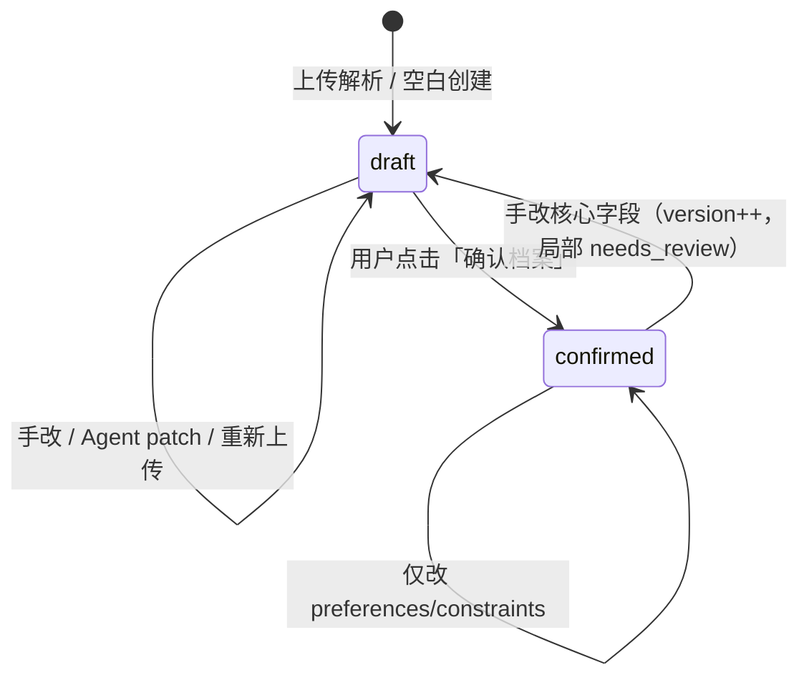

# JobCome 档案与简历编辑设计

| 项 | 内容 |
|---|---|
| 版本 | **1.0** |
| 日期 | 2026-09-03 |
| 状态 | **M1 冻结候选** |
| 关联 | [MVP-产品方案.md](MVP-产品方案.md) §4.1、§5.1、§8 · [实体与模型设计.md](实体与模型设计.md) · [简历解析与导出.md](简历解析与导出.md) |

本文专门回答：

1. **Profile 是什么、字段怎么设计？**（求职真相源）
2. **用户怎么编辑简历？**（页面、交互、与 Agent 的关系）
3. **导出的「简历格式」长什么样？**（模板、ResumeDraft、拔高稿）

---

## 1. 三层数据模型（核心）

JobCome **不是**「在线 Word 编辑器」。简历相关数据分三层，职责严格分开：

```text
┌─────────────────────────────────────────────────────────────────┐
│  Layer 1 — Profile（真相源）                                     │
│  表：jc_profile.payload → ProfilePayload JSON                    │
│  含义：用户确认过的事实 + 待确认草稿 + STAR 素材库                │
│  编辑：核对页 / ProfileEditor 手改；Agent 通过 profile_patch      │
└────────────────────────────┬────────────────────────────────────┘
                             │ confirm + version++
                             ▼
┌─────────────────────────────────────────────────────────────────┐
│  Layer 2 — ResumeDraft（展示稿 / 拔高稿）                        │
│  表：jc_resume_draft.sections + elevation_map                    │
│  含义：按模板排好版的「可投递段落」；含拔高后的 bullet           │
│  生成：Writer 任务（档位）或 Agent 建议；用户可在预览区微调       │
└────────────────────────────┬────────────────────────────────────┘
                             │ Reviewer 通过
                             ▼
┌─────────────────────────────────────────────────────────────────┐
│  Layer 3 — Export（文件）                                        │
│  表：jc_export_job + TOS 上的 pdf/docx                           │
│  含义：从 ResumeDraft + template 渲染出的下载物                  │
│  不可反解析回编辑器；要改就回 Layer 1/2                           │
└─────────────────────────────────────────────────────────────────┘
```

| 层 | 用户感知 | 能否直接改 PDF |
|----|----------|----------------|
| Profile | 「我的档案」「经历是不是写对了」 | ❌ |
| ResumeDraft | 「拔高预览」「这版简历读起来亮不亮」 | ❌ |
| Export | 「下载 PDF/Word」 | ❌（需回上层改） |

**MVP 单活跃 Profile**：一个用户（或访客 Session）同时只有一份主档案 `prof_xxx`。

---

## 2. Profile 设计（Layer 1）

### 2.1 存什么

`jc_profile` 行级字段：

| 列 | 含义 |
|----|------|
| `id` | `prof_` 前缀 |
| `user_id` / `guest_session_id` | 属主 |
| `owner_kind` | `guest` \| `user` |
| `status` | `draft` → `confirmed` |
| `version` | 每次「确认档案」或重大合并 +1 |
| `locale` | 默认 `zh-CN`；导出可另选 `en` |
| `payload` | **ProfilePayload** JSON（见下） |
| `contact_name` | 反规范化，列表/合并冲突展示用 |
| `confirmed_at` | 用户点「确认档案」时间 |

嵌套 JSON 定义见代码 `schemas/profile_payload.py`，与 MVP §5.1 一一对应。

### 2.2 ProfilePayload 结构图

```text
ProfilePayload
├── contact          姓名、邮箱、手机、城市、链接(github/linkedin/…)
├── summary          一句话简介（可空，确认前常 needs_review）
├── experiences[]    工作经历（核心）
│     ├── id, company, title
│     ├── start_date, end_date   格式 YYYY-MM
│     ├── location
│     ├── highlights[]           每条一句成就 bullet（编辑主战场）
│     ├── skills[]               本条经历关联技能
│     └── confidence             confirmed | needs_review | inferred
├── education[]
├── skills[]         全局技能（name, level, evidence[] 指向 exp/proj id）
├── projects[]
├── star_stories[]   面试素材库（S/T/A/R），不一定出现在一页简历上
├── constraints      禁止出现的公司/关键词；必须保留的表述
├── preferences      目标岗位、行业、薪资、远程（供 Fit/JD，不必上简历）
└── meta             source_file, created_at, confirmed_at
```

### 2.3 confidence 语义（编辑 UI 必显）

| 值 | 来源 | UI |
|----|------|-----|
| `confirmed` | 用户手改并保存，或核对页勾选确认 | 正常样式 |
| `needs_review` | 解析不确定 | **黄底 +「待确认」徽章** |
| `inferred` | LLM 推测 | **橙底 +「系统推测，请核实」** |

规则（冻结）：

- 解析结果默认 `needs_review` 或 `inferred`，**不能**自动变成 `confirmed`
- `status=confirmed` 的 Profile 仍允许编辑，但改字段后该字段 confidence 降为 `needs_review`（除非用户显式「标记为已确认」）
- **未 `confirm` 的 Profile 不能导出终稿**（可拔高预览）

### 2.4 Profile 生命周期



API：

| 动作 | 接口 | 效果 |
|------|------|------|
| 读取 | `GET /profiles/{id}` | 返回 `ProfilePublic` |
| 全量保存 | `PATCH /profiles/{id}` | `payload` + 可选 `expected_version` 乐观锁 |
| 局部补丁 | `PATCH /profiles/{id}` body `{ patches: [...] }` | Agent / 表单字段级更新 |
| 确认 | `POST /profiles/{id}/confirm` | `status=confirmed`, `version++`, `confirmed_at` |
| 重新上传 | `POST /profiles/{id}/sources` | 新 `ProfileSource`，异步解析，可选合并策略 |

### 2.5 PATCH 协议（手改与 Agent 统一入口）

所有写入走 `ProfileService.apply_patch`，避免编辑器与 Agent 双写冲突。

```json
{
  "expected_version": 3,
  "patches": [
    {
      "op": "replace",
      "path": "/experiences/0/highlights/1",
      "value": "负责订单核心链路，QPS 10w+",
      "source": "user",
      "confidence": "confirmed"
    }
  ]
}
```

| 字段 | 说明 |
|------|------|
| `path` | JSON Pointer，如 `/contact/name`、`/experiences/{id}/highlights/0` |
| `source` | `user` \| `agent` \| `ingest` |
| `confidence` | 补丁可显式带；缺省时 user→confirmed，ingest→needs_review |

冲突：`expected_version` 不匹配 → `409`，前端提示刷新合并。

---

## 3. 用户编辑简历：页面与交互

### 3.1 两个编辑入口（同一 Profile）

| 页面 | 路径 | 侧重点 |
|------|------|--------|
| **档案核对** | `/profile/:id` | 上传后首次核对；左表单右原文件预览 |
| **简历 Agent 页** | `/resume-agent` | 日常编辑 + 拔高预览 + Agent 对话 |

两者共用 **`ProfileEditor` 组件** 和同一套 `PATCH` API，不重复业务逻辑。

### 3.2 档案核对页 `/profile/:id`（W1）

```text
┌──────────────────────────────────────────────────────────────────┐
│  待确认 12 项          [ 确认档案 ]  （主按钮，未清完可二次确认）      │
├────────────────────────────┬─────────────────────────────────────┤
│  ProfileEditor（分段）      │  原文件预览                          │
│  ┌─ 联系方式 ─────────┐   │  PDF iframe / 图片                   │
│  ├─ 简介 ─────────────┤   │  或解析摘要（无预览时）                 │
│  ├─ 工作经历 ▼ ──────┤   │                                      │
│  │  · 公司 A [待确认]  │   │                                      │
│  ├─ 教育 ─────────────┤   │                                      │
│  ├─ 技能 ─────────────┤   │                                      │
│  └─ 项目 ─────────────┘   │                                      │
└────────────────────────────┴─────────────────────────────────────┘
```

交互要点：

- 顶栏 **待确认计数** = payload 内 `confidence != confirmed` 的字段数
- 每段可 **折叠**；经历/教育支持 **拖拽排序**（改数组顺序，id 不变）
- 经历块：**公司、职位、时间** 一行；**highlights** 动态列表（增删 bullet）
- 保存：**失焦自动保存** 或 段尾「保存」→ `PATCH` debounce 500ms
- 「确认档案」：弹窗摘要 → `POST .../confirm` → 可进入拔高/导出流程

### 3.3 简历 Agent 页 `/resume-agent`（W1–W2）

三栏布局（桌面 ≥1280px）；窄屏上下堆叠。

```text
┌────────────────────────────────────────────────────────────────────────────┐
│  [保守|标准|拔高]   [预览刷新]     [导出 PDF] [导出 Word]  ← 访客导出 disabled   │
├──────────────────┬─────────────────────────┬───────────────────────────────┤
│ ProfileEditor    │ ElevatedPreview         │ ResumeAgentChat               │
│ 320–400px        │ flex                    │ 360px                         │
│                  │                         │                               │
│ 同核对页表单      │ 渲染当前 ResumeDraft     │ DeerFlow 多轮（登录后）        │
│ 访客可编辑        │ 与 PDF 版式一致          │ 访客：登录蒙层                 │
│                  │ 差异句高亮 elevation_map │ MCP: profile_patch            │
└──────────────────┴─────────────────────────┴───────────────────────────────┘
```

| 区域 | 行为 |
|------|------|
| **左 ProfileEditor** | 改的是 **真相源**；保存后中栏提示「预览已过期，点击刷新」 |
| **中 ElevatedPreview** | 只读 HTML（与导出同源模板）；显示拔高句 + 「需在面试圆场」标记 |
| **右 Agent** | 对话改稿 → `profile_patch` → SSE 推左栏刷新；不直接改 PDF |

档位切换（保守 / 标准 / 拔高）：

- 触发 `POST /profiles/{id}/elevate?level=elevated`（单次 Writer，非 chat）
- 返回新 `ResumeDraft` id → 中栏加载预览
- **访客可用**；导出须登录

### 3.4 ProfileEditor 组件结构（前端）

```text
apps/web/components/profile/
├── ProfileEditor.tsx           # 容器：拉 profile、debounce patch、version 冲突
├── ProfileSectionNav.tsx       # 左侧锚点：联系/简介/经历/…
├── ContactSection.tsx
├── SummarySection.tsx
├── ExperienceList.tsx
│   └── ExperienceCard.tsx      # highlights 用 BulletListEditor
├── EducationList.tsx
├── SkillsSection.tsx
├── ProjectList.tsx
├── StarStoriesSection.tsx      # 折叠，标注「面试素材，默认不出现在一页简历」
├── PreferencesSection.tsx      # 目标岗，供 JD/Fit
├── ConfidenceBadge.tsx
└── fields/
    ├── MonthPicker.tsx         # YYYY-MM
    ├── BulletListEditor.tsx
    └── LinkListEditor.tsx
```

表单：`react-hook-form` + `zod`，schema 与 `ProfilePayload` 对齐（可用 `zod` 从 OpenAPI 生成）。

### 3.5 访客 vs 登录（编辑权限）

| 能力 | 访客 | 登录用户 |
|------|------|----------|
| 上传、解析、手改 Profile | ✅ | ✅ |
| 拔高预览、换档位 | ✅ | ✅ |
| Agent 多轮对话 | ❌ | ✅ |
| 导出 PDF/Word | ❌ | ✅ |
| 确认后 version 冻结语义 | 同左 | 同左 |

数据在服务端 `GuestSession` 下，非 localStorage。

---

## 4. ResumeDraft 设计（Layer 2）

### 4.1 与 Profile 的分工

| | Profile | ResumeDraft |
|---|---------|-------------|
| 目的 | 事实与素材 | 投递用排版稿 |
| 经历 bullet | 偏原始、可短 | 拔高后、动词开头、可量化 |
| STAR | 完整 S/T/A/R | 一般不直接上简历 |
| 改动的追溯 | confidence | elevation_map |

一份 Profile 可有多份 `ResumeDraft`：

- `job_id=null` → **通用简历**（M1 主路径）
- `job_id=job_xxx` → **针对性 Variant**（W3+ Package）

### 4.2 sections JSON 结构（冻结）

`jc_resume_draft.sections` 是 **渲染器只吃的结构**，由 Writer 从 Profile 生成，也可人工在预览区微调后写回。

```json
{
  "locale": "zh-CN",
  "header": {
    "name": "张三",
    "headline": "高级后端工程师 · 8 年经验",
    "contact_line": "上海 · a@b.com · +86 138**** · github.com/xxx"
  },
  "summary": "8 年后端经验，熟悉高并发订单与中间件治理……",
  "experience_blocks": [
    {
      "id": "exp_1",
      "company": "某某科技",
      "title": "高级后端工程师",
      "date_range": "2021.03 – 2024.06",
      "location": "上海",
      "bullets": [
        "主导订单核心链路重构，P99 降至 200ms 量级",
        "带领 5 人小组完成支付对账系统 0 差错上线"
      ]
    }
  ],
  "education_blocks": [
    {
      "id": "edu_1",
      "school": "某某大学",
      "degree_line": "本科 · 计算机科学",
      "date_range": "2015 – 2019"
    }
  ],
  "skills_block": {
    "title": "技能",
    "content": "Go · Java · Kafka · MySQL · K8s"
  },
  "project_blocks": [],
  "section_order": ["summary", "experience", "education", "skills", "projects"]
}
```

英文模板增加 `experience_blocks` 页数，由模板控制分页而非改 schema。

### 4.3 elevation_map

```json
{
  "field_path": "experience_blocks[0].bullets[0]",
  "source_text": "参与订单服务开发",
  "written_text": "主导订单核心链路设计与性能优化，P99 降至 200ms 量级",
  "needs_defense": true
}
```

- 预览区：`needs_defense` 句加 ⚠️「面试需能圆场」
- Reviewer：无 Profile 证据支撑的 `written_text` → 阻断导出

### 4.4 拔高档位对 Writer 的约束

| 档位 | Writer 行为 |
|------|-------------|
| `conservative` | 理顺语病、补全量化**已有**事实 |
| `standard` | 成果导向、动词升级（负责→主导） |
| `elevated` | 允许适度拔高；**必须**写 elevation_map |

默认档位：用户 `UserMeta.default_elevation_level`，新用户 `elevated`。

---

## 5. 简历版式 / 导出格式（Layer 3）

### 5.1 模板清单（M1）

| template_id | 语言 | 页数 | 适用 |
|-------------|------|------|------|
| `zh-one-page-v1` | 中文 | 1 × A4 | 国内社招默认 |
| `en-two-page-v1` | 英文 | 2 × A4 | 外企 / 英文岗 |

模板文件：

```text
jobcome/templates/resume/
├── zh-one-page-v1.html      # Jinja2 + 内联 CSS
├── en-two-page-v1.html
├── zh-one-page-v1.docx      # docxtpl
└── en-two-page-v1.docx
```

渲染：`ResumeRenderEngine` 读 `sections` + `template_id` → Playwright PDF / docxtpl DOCX（见 [简历解析与导出.md](简历解析与导出.md)）。

### 5.2 中文版式规范（`zh-one-page-v1`）

```text
┌────────────────────────────────────────────  A4 边距 18mm ───┐
│  张三                                                          │
│  高级后端工程师 · 8 年经验                                        │
│  上海 · email · phone · GitHub                                  │
├────────────────────────────────────────────────────────────────┤
│  个人简介                                                       │
│  2–3 行，11pt                                                    │
├────────────────────────────────────────────────────────────────┤
│  工作经历                                                       │
│  某某科技 · 高级后端工程师              2021.03 – 2024.06 · 上海  │
│    • bullet 1                                                   │
│    • bullet 2  （每段最多 4 bullet，超出 Writer 应合并）           │
├────────────────────────────────────────────────────────────────┤
│  教育背景                                                       │
│  某某大学 · 本科 · 计算机              2015 – 2019              │
├────────────────────────────────────────────────────────────────┤
│  技能                                                           │
│  Go · Kafka · …  （单行或两列，模板 CSS 控制）                     │
└────────────────────────────────────────────────────────────────┘
```

排版参数（冻结便于调版）：

| 项 | zh-one-page |
|----|-------------|
| 正文字号 | 10.5–11pt |
| 姓名 | 18–20pt 加粗 |
| 段间距 | 经历块之间 8–10pt |
| 字体 | 思源黑体 / Noto Sans SC（模板 embed 或系统回退） |
| 颜色 | 纯黑 #111；链接 #2563eb |

### 5.3 英文版式（`en-two-page-v1`）

- Page1：Summary + Experience（近 10 年优先）
- Page2：Earlier Experience（可压缩）+ Education + Skills + Projects
- 日期右对齐美式：`Mar 2021 – Jun 2024`
- 动词过去式开头 bullet

### 5.4 什么进简历、什么不进（产品规则）

| Profile 字段 | 默认上简历 |
|--------------|------------|
| contact, summary | ✅ |
| experiences | ✅（最近 3–4 段，Writer 可建议压缩） |
| education | ✅ |
| skills | ✅（聚合一行或分组） |
| projects | ⚪ 有空间则展示，一页纸优先砍 project |
| star_stories | ❌（面试库用，导出时不渲染） |
| preferences, constraints | ❌ |

Writer + 模板共同遵守；Reviewer 检查「简历出现但 Profile 无证据」的句子。

---

## 6. 端到端用户流程

```text
1. 上传 PDF/DOCX/图片
      ↓ parse（见 简历解析与导出.md）
2. 跳转 /profile/:id 或 /resume-agent
      ↓ 核对，改 highlights / 待确认项
3. 点击「确认档案」→ status=confirmed
      ↓
4. 选档位 → 拔高 → 生成 ResumeDraft → 中栏预览
      ↓ 可选：登录后 Agent 多轮改 Profile
5. Reviewer 通过
      ↓
6. 导出 PDF / Word → TOS → CDN 下载链接
```

时间目标：步骤 1–6 **< 15 分钟**（MVP 验收）。

---

## 7. API 摘要（编辑相关）

| 方法 | 路径 | 说明 |
|------|------|------|
| POST | `/profiles/upload` | 创建 profile + source，异步解析 |
| GET | `/profiles/{id}` | 含完整 payload |
| PATCH | `/profiles/{id}` | 手改 / patch 列表 |
| POST | `/profiles/{id}/confirm` | 确认档案 |
| POST | `/profiles/{id}/elevate` | 生成 ResumeDraft，`?level=` |
| GET | `/profiles/{id}/elevate/preview` | 当前档位最新 draft + HTML 预览 |
| PATCH | `/resume-drafts/{id}` | 微调 sections（高级，M2） |
| POST | `/profiles/{id}/export` | body: `{ format, locale, template_id }` |

---

## 8. 与 Agent / MCP 的边界

| 操作 | 谁做 |
|------|------|
| 改 Profile 字段 | MCP `profile_patch` → ProfileService |
| 拔高生成 Draft | Skill `resume-writer` 或 `POST /elevate` |
| 审稿 | `resume-reviewer` 或内置 Reviewer |
| 导出文件 | **JobCome API only**，DeerFlow 不碰 TOS |

Agent 对话**不**直接编辑 `sections` JSON；先改 Profile，再触发重新 elevate。

---

## 9. 实现对照（当前仓库）

| 项 | 状态 |
|----|------|
| `ProfilePayload` Pydantic | ✅ `schemas/profile_payload.py` |
| `Profile` ORM | ✅ `models/profile.py` |
| `ResumeDraft` ORM | ✅ `models/resume.py`（`sections` schema 本文 §4.2） |
| `ProfileService` / Editor API | ⏸ W1 |
| HTML/DOCX 模板文件 | ⏸ W2 |
| `ProfileEditor` 前端 | ⏸ W1 |

---

## 10. 相关文档

- [MVP-产品方案.md](MVP-产品方案.md) §5.1 Schema 示例
- [实体与模型设计.md](实体与模型设计.md)
- [前端架构与鉴权.md](前端架构与鉴权.md)
- [简历解析与导出.md](简历解析与导出.md)
