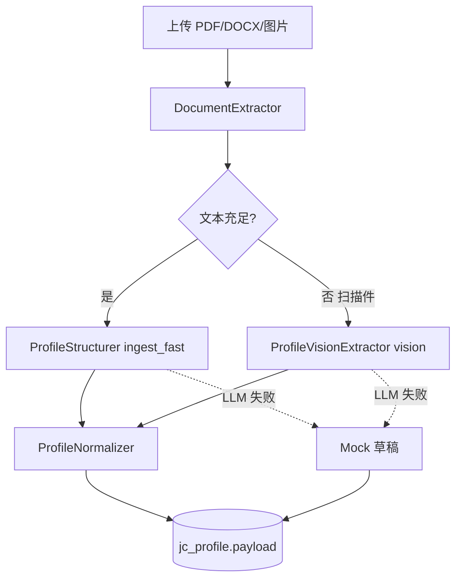
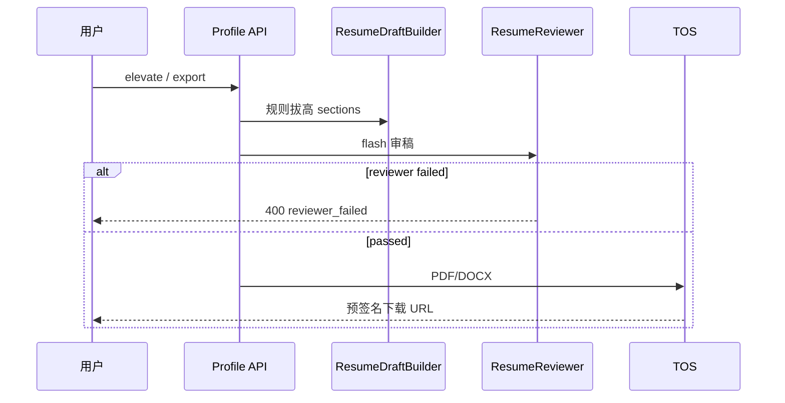
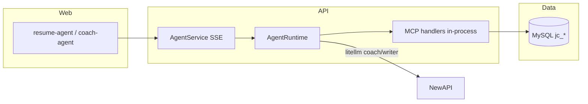

# JobCome 模型与流程设计

| 版本 | 1.0 |
| 日期 | 2026-09-03 |

## 1. LLM 路由（进程内 failover）

```text
业务代码 / Agent Runtime
        │
        ▼
 jobcome.llm.router（litellm SDK）
        │  deploy/llm/routing.yaml
        ▼
 YuAI NewAPI（真实 model slug）
```

| scenario | 用途 | 调用方 |
|----------|------|--------|
| `ingest_fast` | 简历文本 → Profile JSON | `ProfileStructurer` |
| `vision` | 扫描件 / 图片 OCR | `ProfileVisionExtractor` |
| `writer` | 拔高改稿（Agent writer） | Agent `resume-writer` |
| `coach` | 模拟面、多轮辅导 | Agent `resume-coach` / `coach-*` |
| `flash` | 导出前审稿 | `ResumeReviewer` |

Failover：同 scenario 内按 YAML 顺序尝试；失败/超时自动切下一模型。

环境变量（默认链）：

- `YUAI_API_BASE` / `YUAI_API_KEY` — 文本模型
- `YUAI_VISION_API_BASE` / `YUAI_VISION_API_KEY` — vision（可同网关）

**不强制** LiteLLM proxy；可选 `deploy/litellm/` 仅作集中观测。

## 2. 简历入库流程



## 3. 拔高与导出



## 4. Agent + MCP



- **Skill**：`skills/public/*/SKILL.md`（系统 prompt）
- **MCP**：`jobcome.mcp.handlers`（进程内）+ `python -m jobcome.mcp.server`（DeerFlow stdio）
- **配置**：`deploy/deerflow/extensions_config.json`

| Skill | scenario | MCP tools |
|-------|----------|-----------|
| resume-coach | coach | profile_get, profile_patch |
| resume-writer | writer | profile_get |
| resume-reviewer | flash | profile_get |
| coach-mock | coach | profile_get, bank_search |
| coach-archive | coach | profile_get, interview_save |
| coach-answer | coach | bank_search, answer_save_attempt |

## 5. 面试飞轮 API

| 端点 | 说明 |
|------|------|
| `GET /coach/profiles/{id}/bank` | 题库搜索 |
| `POST /coach/profiles/{id}/interviews` | 归档真面 |
| `POST /coach/questions/{id}/attempts` | 保存练习 |
| `POST /coach/mock/sessions` | 创建模拟面 |

前端：`/bank`、`/mock`、`/coach-agent`。

## 6. 鉴权与合并

- Cookie 会话；访客可上传，登录后 `export` / Agent。
- 注册/登录若双方各有档案 → `merge_conflict` → `POST /auth/resolve-merge`。
- 邮箱验证：`/auth/resend-verification`；改密：`/auth/change-password`。

## 7. 相关文档

- [Skill与MCP-集成清单.md](./Skill与MCP-集成清单.md)
- [deploy/llm/routing.example.yaml](../deploy/llm/routing.example.yaml)
