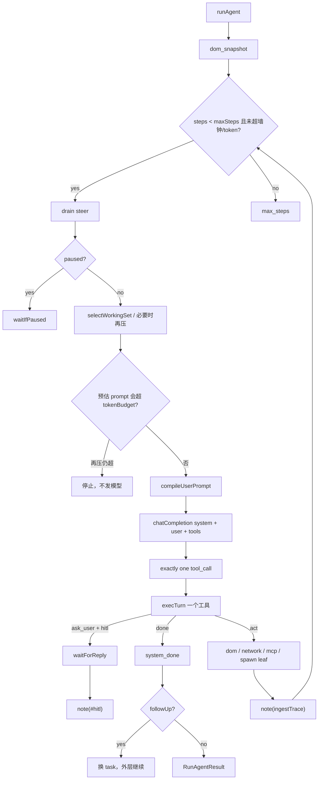
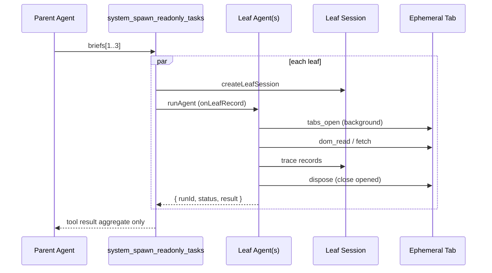
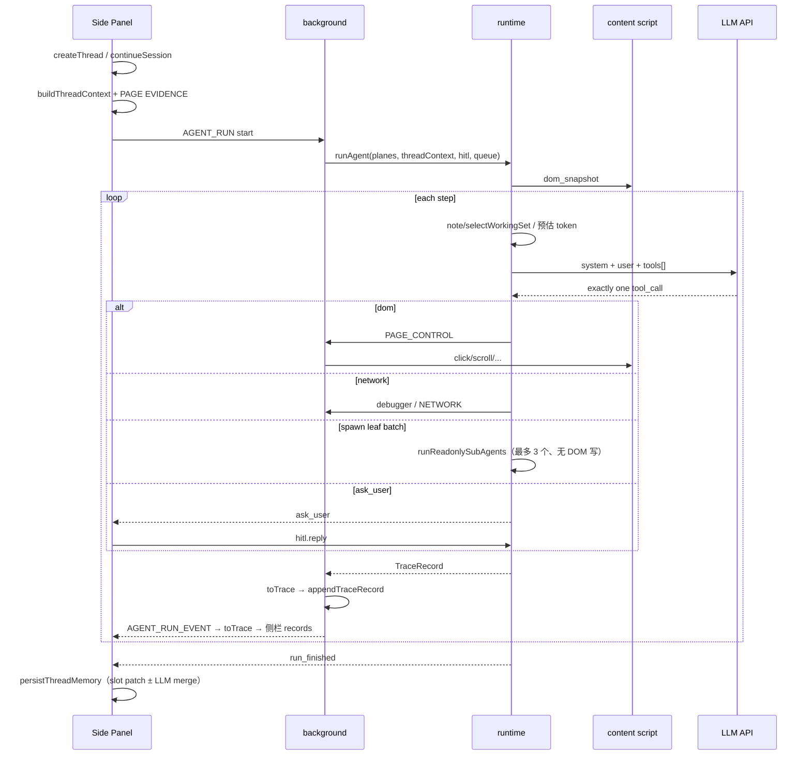

# NaviForge Agent 系统设计

> 状态：**当前实现**（不是路线图愿望清单）  
> 更新：2026-08-16（RunLedger 投影 + 协议 salvage + hook checkpoint）  
> 读者：扩展开发、Runtime 维护者、后来读代码的人

本文描述仓库里实际跑着的架构。包拆分节奏见 [MODULES.md](./MODULES.md)；MCP 协议细节见 [AGENT_MCP_RUNTIME_DESIGN.md](./AGENT_MCP_RUNTIME_DESIGN.md)。

---

## 1. 产品定位

NaviForge 是 **Chrome MV3 浏览器 Agent**：用户在真实标签页上用自然语言驱动 DOM / Network，成功后可将 DOM 轨迹锻造成确定性 Playbook 本地重放。同一扩展里还有一条不经过 Agent 循环的 **页面工具箱**（翻译、JSON 格式化、OCR、改头），与 Agent 共享隐私开关和 tab，不共享 `runAgent`。

核心约束（硬的）：

- **单 tab 单写者**：同一时刻只有一个 Agent 循环可写 DOM。没有同页并行 Agent。
- **本地优先**：Thread / Session / Playbook / MCP 配置在 `chrome.storage.local`；LLM 走用户配置的 OpenAI-compatible API。
- **Plane 隔离**：Runtime 不碰 Chrome API。DOM 走 `DomPlane`，网络走 `NetworkPlane`，实现落在 extension。
- **审计与工作集分离**：完整轨迹本地保留；发给模型的是压缩后的工作集，不是 session dump。

模型协议：**原生 `tools[]` function calling**（内置工具 + 授权 `mcp__{server}__{tool}`）。每轮必须且只能返回一个 function tool call：完成用 `system_done`，提问用 `system_ask_user`。没有调用时记录协议恢复并仅重试一次；第二次或多个调用均以协议错误结束，不自动进入 HITL。

---

## 2. 架构原则

1. **一份账本**。Runtime 创建一次 `TraceRecord`，同一对象流向扩展、侧栏和 durable storage；侧栏仅用 `recordView` 在渲染时计算卡片。
2. **机器读 `type` + `payload`**。落盘记录没有 `kind` / `title` / `content`；这些都是不持久化的视图字段。
3. **审计保全文，模型吃子集**。账本留下当轮编译后的 user、assistant、`reasoning_content`、tool_calls；发给模型的仍是工作集，不是 JSONL 回灌。
4. **约束在运行时执行，不靠 prompt 自觉**。任务 scope、隐私开关在 `execTurn` 拦截；skill 白名单和敏感工具在 `beforeTool` hook。
5. **压缩只改下一轮 context**。圈内 L0/L1 与跨 Run slot merge 都不删已发生的 Step。
6. **能合在 runtime 的编排就不拆包**。Prompt 编译与 loop 仍一起改；出现第二个独立评测消费者再拆 `prompt-compiler`。

依赖方向（强制）：

```text
apps/extension → packages/runtime → {policy, observe, extract, media-plane,
                                     dom-plane, network-plane, skill-runtime} → shared
apps/extension → packages/{session, playbook, skill-runtime}
apps/extension ⇄ apps/host ⇄ external MCP
runtime ↛ extension
dom-plane ↛ runtime
policy ↛ runtime
```

---

## 3. 模块地图

```text
┌──────────────────────────────────────────────────────────────────┐
│ apps/extension  （唯一平台适配层）                                 │
│  Chat / Options / background / content                           │
│  chrome-dom-plane · CDP network · session-store · toolkit        │
└────────────┬─────────────────────────────────────────────────────┘
             │
             ▼
┌──────────────────────────────────────────────────────────────────┐
│ packages/runtime  （编排）                                        │
│  Agent / AgentCtx · runAgent · execTurn · compileUserPrompt      │
│  RunLedger · HookPipeline · working-set · HITL / recovery        │
└───┬─────────┬──────────┬──────────┬──────────┬───────────────────┘
    ▼         ▼          ▼          ▼          ▼
 policy    observe    extract   media-plane  skill-runtime
 scope/HITL snapshot   列表合并    媒体线索     L1/L2 skill
 drift/nav  截断
    │         │          │          │          │
    └─────────┴──────────┴──────────┴──────────┘
                          ▼
              packages/shared   ToolCall · ToolResult · 工具目录 · tools[]
                          ▲
              packages/session  TraceRecord 信封 / JSONL（存储仍在 extension）
              packages/playbook Forge / 确定性 Runner（经 Plane 重放）
              packages/dom-plane / network-plane  接口；Chrome 实现在 extension

apps/host  localhost MCP Client/Server（stdio/HTTP），不进 MV3
```

### 3.1 包职责

| 模块 | 职责 | 不做什么 |
|------|------|----------|
| `shared` | `ToolCall` / `ToolResult`；`AGENT_TOOL_CATALOG` 单源；`buildChatTools` | Chrome、LLM、DOM |
| `policy` | 任务 scope、HITL 策略、URL 漂移、导航类 click、敏感工具确认 | 不调 LLM、不执行工具 |
| `runtime` | 循环、prompt、工作集、LLM、工具分发、只读子循环、恢复 | 不直接操作 DOM / CDP |
| `observe` | `compactSnapshotForPrompt`（默认 ~80 行 / 12k） | 不依赖 extension |
| `extract` | snapshot 列表行 + 网络媒体/JSON 合并 | 不写 DOM |
| `media-plane` | m3u8/mp4 hint、HLS 行 | 不抓 CDP |
| `session` | `TraceRecord` 校验、可移植 JSONL | 不做 `chrome.storage` |
| `dom-plane` | `DomPlane` 接口 | 不调 LLM；实现在 extension |
| `network-plane` | 事件模型、digest / wait / intercept 匹配 | CDP 监听在 extension |
| `skill-runtime` | L1 目录、`skill_load` 正文、软路由 | 不执行远程 JS |
| `playbook` | AST、Forge、确定性 Runner | 不走 LLM |
| `apps/extension` | UI、Chrome 胶水、存储、Plane 实现、页面工具箱 | 不把 Agent 策略写进 content script |
| `apps/host` | 本地 MCP 桥 | 不是运行时硬依赖；Host 关则 MCP 工具缺席并记 `mcpNote` |

### 3.2 扩展内部再分层（未拆包）

`apps/extension` 是有意的胖适配器，内部按目录分：

| 区 | 路径 | 角色 |
|----|------|------|
| 编排胶水 | `chat/use-agent-workspace.ts`、`entrypoints/background.ts` | 把 UI 事件接到 `runAgent` / 持久化 |
| 账本 | `lib/agent-event-projection.ts`（`recordView`）、`chat/chat-events.ts`（按 turn 分组） | `TraceRecord` 是唯一事实；渲染时投影为卡片 |
| 会话 | `lib/session-model.ts`、`session-store.ts`、`thread-*.ts` | Thread + Run 存储、slot 记忆 |
| Plane 实现 | `lib/chrome-dom-plane.ts`、background CDP | 唯一碰 Chrome 的 DOM/Network |
| 工具箱 | `lib/toolkit-*.ts`、`page-translate.ts`、`vision-ocr.ts` | **不经过** `runAgent` |

不要把工具箱逻辑搬进 `runtime`。那是另一条产品面。

---

## 4. Agent 循环

中心对象（组装见 [HOOK_MIDDLEWARE.md](./HOOK_MIDDLEWARE.md)）：

- **`Agent`**：从 `AgentOptions` 组装一次的能力袋（planes / llm / skills / mcpTools / policy / limits / hooks）。`runAgent(opts)` = `new Agent(opts)` 再跑循环。
- **`AgentCtx`**：一次 Run 的可变工作集，每个 hook 都拿到它。可改 `prompt` / `tools` / `skills` / `messages` / `toolCall.arguments`。账本是 `ctx.ledger`；发给模型的是投影后的 `ctx.messages`。



默认限额（`DEFAULT_RUN_LIMITS`，设置可改）：

| 项 | 默认 | 含义 |
|----|------|------|
| `maxSteps` | 30 | 模型循环步数 |
| `sameFailureLimit` | 2 | 同一 tool+error.code 连续失败后 ask_user |
| `runTimeoutMs` | 8 分钟 | 墙钟 |
| `tokenBudget` | 200_000 | **累计** LLM token；调用**前**估算，超了先压工作集再停 |

### 4.1 每轮发给 LLM 的内容

仍然是 **system + 一条 user**，不是 Chat Completions 多轮数组。这是有意的：浏览器 Agent 的「当前页」每步都变，全量 assistant/tool 历史会迅速过期且极贵。

| 块 | 来源 | 预算 |
|----|------|------|
| System | `KERNEL_PROMPT` + Skill L1（`<available_skills>`） | 全文，不压 |
| `tools[]` | 内置目录 + 授权 MCP | 原生 function schema |
| 任务 / scope | 当前 task + `resolveTaskScope` | 完整；forbidden 时运行时拦截 |
| 会话上下文 | `buildThreadContext`：slot 记忆 + 近几轮对话 + PAGE EVIDENCE | ≤ 12k |
| 已 load skill 正文 | 本 Run `skill_load` 成功体 | ≤ 4k，钉住 |
| DOM | `compactSnapshotForPrompt` | ~80 行 / 12k |
| Network | digest 文本 | 有限条 |
| 近期轨迹 | `formatWorkingSet(ctx.messages)` — `WorkingSetHook` 已对 `RunLedger` 做 `selectWorkingSet`；compile 只排版 | 见 §5 |

纠偏（`#steer`）、HITL 回复（`#hitl`）、新任务（`#followUp`）进轨迹，且 **L1 不会丢掉钉住行**。

### 4.2 交互队列（pi 风格）

| 队列 | API | 时机 | 行为 |
|------|-----|------|------|
| steer | `queue.steer(text)` | Run 中 | 下一轮 LLM 前注入；**模型回合后、执行前**到达则丢弃待执行工具 |
| followUp | `queue.followUp(text)` | 本任务将结束 | 外层循环换成新 `task`，`turn` 从 0 再计 |
| HITL | `hitl.waitForReply` | `ask_user` | 挂起；UI 回复后以 `#hitl` 继续 |

---

## 5. 工作集与压缩

两层记忆，职责不同。**不要把审计 JSONL 回灌给模型。** 压缩只改下一轮 prompt / slots，**不删时间线上已画的 Step。**

投影协议详见 [CONTEXT_PROJECTION.md](./CONTEXT_PROJECTION.md)（`run.note` 前缀、`taskMode`、CONTEXT 项类型）。  
Message 三层体系、冷启动/热执行、JSONL 与 append 契约详见 [MESSAGE_SYSTEM.md](./MESSAGE_SYSTEM.md)。

### 5.1 圈内工作集（pi compaction）

实现：`packages/runtime/src/working-set.ts` + `ledger.ts`。`runAgent` 经 `RunLedger.append` 入库（L0）。发给模型的是 `selectWorkingSet` 投影，**不原地改账本**。折叠时发 `run.recovery` `strategy=fold_context`（trace 通道，默认 JSONL 可见）。

| 层 | 做什么 |
|----|--------|
| **L0 ingest** | 普通工具行 ≤ 1200 字；页面证据 / `#recall` ≤ 3000；钉住控制行 ≤ 2000 |
| **L1 select** | 同类 `read_page` / extract / `skill_load` 只留最新；钉住行全留；更早动作收成 `#compact folded N older traces (tools…)`；轨迹块目标 8k 字 |
| **调用前预算** | `WorkingSetHook`：`runTotal + estimate(system+user) ≥ tokenBudget` 则再压到 4k 轨迹，仍超则**不发模型**；折叠同样走 `fold_context` |

钉住前缀：`#steer` `#hitl` `#followUp` `#constraint` `#hint` `#compact`。

圈内 **不做** 中途 LLM 摘要。30 步内确定性工作集足够；步数明显变长再加 L2。

`read_page` 写入轨迹的正文上限与证据槽一致（3000）。完整正文只存在审计 `tool.result.payload`。

**侧栏：** 简洁模式零变化（步骤仍在）。折叠发 `run.recovery`（标题「压缩」），`#compact folded N` 仍出现在当轮 `model.turn.io.user`。不要插一张假的 compact 工具卡。协议 salvage / hint 同样走 `run.recovery`（协议挽救 / 协议重试）。

### 5.2 跨 Run 记忆（Hermes slots）

```text
Thread
  memory: { goal, facts[], constraints[], openQuestions[], lastOutcome }
  summary     ← formatThreadMemory 的展示串（显示 cap 6k）
  summaryAt

Run / Session
  messages[]  ← 完整 TraceRecord，本地保留（含每轮模型收发）
```

- 每次 Run 结束（成功 **或** error / max_steps）先做廉价 `memoryPatchFromRun`（goal、lastOutcome、URL 事实）。
- **压缩触发**量的是裁切**之前**的压力：`threadMemoryPressure > 6000`，或 facts/constraints/questions 顶满 slot。显示用的 `.slice(0, 6000)` 不再能把触发器卡死。
- LLM compact 是 **merge slots**，不是重写一篇散文。输入是 PREVIOUS MEMORY JSON + 自 `summaryAt` 以来的 `user.task` / `run.result` / `run.error` / `run.recovery`。
- `buildThreadContext` 另带最近对话行 + `formatSessionReuse`（已读 URL / skill id / PAGE EVIDENCE），让续问不必再 `read_page`。
- **侧栏：** 以前每次任务的气泡 / Step / 结论全部保留。下一轮模型只吃新 slots，不吃上一次的 20 个 Step。

### 5.3 每轮喂给模型的（compile）

```text
system: KERNEL + 已加载 skill
user:
  任务 / 约束 / 会话上下文(slots) / 已加载技能
  当前页 snapshot（当轮，旧页作废）
  网络摘要（若开）
  近期轨迹 ← selectWorkingSet(RunLedger.all())  // 投影；账本本身不删行
  钉住 #steer #hitl #followUp
```

不传：历史 snapshot、`tool.result.data` 全文、telemetry、侧栏文案。System 全文在 `run.context` 存一份，不在每轮 `io` 里再拷一份。

---

## 6. 事件、审计、时间线

对齐 pi：一份 typed session log + 活流不落盘 + 模型从工作集编译。侧栏不是 Chat Completions 的 role 列表，是「任务 → 步骤 → 结论」。

```text
TraceRecord  （runtime 直播，跑完即弃）
    │  toTrace 一次
    ▼
TraceRecord[]     ← 唯一账本（session.messages + 侧栏 React state）
    ├─ 侧栏：filter(非 telemetry) + viewRecord + groupByTurn
    ├─ 审计页 / JSONL：账本原样（默认仍省略 telemetry）
    └─ 模型：compile(working-set)，不是账本全文
```

壳层 toast（选元素、Playbook「✓」）用 `run.note` 只进侧栏本地列表，不经 background 写入审计。

### 6.1 信封

```ts
type TraceRecord = {
  schema: 1
  id: string
  at: number
  runId?: string
  taskId?: string
  turn?: number          // 0-based；setup 无。JSONL 导出为 step
  channel: 'conversation' | 'trace' | 'telemetry'
  type: TraceType
  payload: object
  kind?: TraceRecordKind  // 派生，不当判别器
  title?: string
  content?: string
}
```

| type | channel | payload 要点 |
|------|---------|----------------|
| `user.task` | conversation | `{ text }` |
| `user.steer` | conversation | `{ texts, phase }` |
| `run.context` | trace | 一份：systemPrompt、tools、**taskMode**、skills、mcp、continued |
| `model.turn` | trace | `{ status, summary, reason?, call?, io? }`。`io` = 当轮 **user 全文 + assistant + reasoning + toolCalls**（不含图片字节） |
| `tool.result` | trace | `{ tool, arguments, ok, data?, error? }` |
| `run.result` | conversation | `{ text }` 用户可见结论只存这里一份 |
| `run.recovery` / `run.error` | trace | 结构化 category/strategy 或 code/message |
| `metrics.tokens` / `run.log` | telemetry | 默认不进聊天、不进 JSONL 复制 |

`capTraceRecords` 先丢 telemetry，再丢最旧的非 `run.context`；`run.context` 钉住。旧存储没有 `schema`/`type` 的记录，读取时 `normalizeTraceRecord` 推断。

### 6.2 侧栏怎么画

- **简洁：** 用户气泡 → Step 条（工具名 + 一句话）→ 结论卡。不展示 system dump、tokens、模型 user 原文。
- **详细：** 同账本，展开 `model.turn.summary` / 参数；「模型收发」里看 `io.user` / `io.assistant` / `io.reasoning`（侧栏可截断，审计页全文）。
- **审计页 / JSONL：** payload 原样，含完整 `io` 与 `run.context.systemPrompt`。这是观测「模型想了什么、收发了什么」的地方。
- 连续相同工具渲染时 ×N；账本仍是 N 条。
- **不重放 DOM 动作。** `turnIntent` 只把该步 summary 当新任务。

### 6.3 恢复

恢复 = 把 `messages[]` 交给 `viewRecord`。没有 `traceToTraceRecord`。直播与恢复同一套卡片。

---

## 7. 工具、Skill、MCP、Playbook

### 7.1 三层工具

| 层 | 谁管 | 例子 |
|----|------|------|
| 内置 DOM/Network/System | `shared/agent-tools.ts` 单源；`execTurn` 分发 | `dom_click`、`network_wait`、`system_done` |
| Skill 白名单 | manifest `permissions.tools`；`system.*` 与 `skill_load` 仍可用 | 缩小允许集 |
| MCP | 管理页白名单 → Host → `mcp__{server}__{tool}` 进 `tools[]` | 外部工具 |

新增内置工具：改目录 + `execTurn` + Plane/extension 实现。KERNEL 里的工具策略应跟目录走，避免三处手写漂移。

### 7.2 Skill

- Instruction / Template：Markdown + manifest，**不执行远程 JS**。
- L1 进 system（name + description）。L2 仅 `skill_load` 返回，低信任，不能覆盖 KERNEL / policy。
- 续问用 `#reuse skills=` 避免重复 load。

### 7.3 MCP

- 空配置时 Host 可预置 fetch server。不接 Playwright MCP（与 DomPlane 双浏览器冲突）。
- 写操作没有单独的 MCP HITL 开关；Runtime 只依赖 `callMcpTool` 回调，不依赖 Node SDK。

### 7.4 Playbook

- 成功 Run 后 Forge DOM click/type（及可选 network_wait 候选）。
- 重放走 Playbook Runner + Plane，**不调 LLM**。
- Playbook 与 Thread 的「一键重放上次成功路径」仍弱，见 §11。

---

## 8. 子 Agent

支持，但是 **主 → 叶**，不是通用多智能体。设计参考 Hermes / PI / MAF / OpenHarness：**子 agent 等价于一次 tool 调用**，父只消费结构化 tool result，子 trace 不回灌父 session。

### 8.1 Session 模型

| 字段 | Thread（主） | Leaf（子） |
|------|-------------|-----------|
| `kind` | `thread`（默认） | `leaf` |
| `parentSessionId` | — | 父 thread session id |
| `parentRunId` | — | 父 `runId` |
| `leafRunId` | — | 子 `runId` |
| 可续聊 | ✅ | ❌ 结束即归档 |
| UI 列表 | ✅ | 隐藏（仅审计可查） |

存储：leaf 与 thread 同 `chrome.storage` sessions 数组，靠 `kind` + `parentSessionId` 关联；workspace JSONL 仍按 `threadId` 落盘。

### 8.2 调用与隔离

- 工具：`system_spawn_readonly_tasks({ briefs })`，最多 3 个 brief，`Promise.all` 并发。
- 子实现：`runReadonlySubAgents` 为每个 leaf 创建独立 `Agent` + 独立 `runId`；`onLeafRecord` 写入 leaf session，**不** `ctx.emit` 到父 ledger。
- 父 working-set：`projectTraceRecords(..., { ownerRunId })` 过滤 `parentRunId` 子图；父 prompt 只见 spawn 的聚合 `{ children: [{ runId, status, result }] }`。
- 子 token 仍计入父 `runTokenBudget`（`onTokenUsage → chargeTokens`）；取消信号传给整批。

### 8.3 子 profile 与页面

- 允许：`dom_snapshot` / `dom_read`、`tabs_open` / `tabs_switch` / `tabs_close`（只读导航）、`network_read`、`web_search`、显式 `readonly` MCP、`system_done`。
- 拒绝：DOM 写、workspace/script 写、HITL、steer/follow-up、嵌套 spawn。

**临时 tab（ephemeral）**：每个 leaf 通过 `createLeafPlanes({ childRunId, anchorTabId })` 获得独立 `activeTabId` 绑定；`tabs_open` 后台建 tab（`active: false`），**不**调用父 `onSwitch`，**不**改父 `run.tabId`。子结束 `dispose()` 关闭本 leaf 打开的所有 tab，父锚定页不变。

并行 leaf **禁止**共享父 `run.tabId`；必须 per-child tab 绑定。

### 8.4 静态 URL 批量读取（如 raw.githubusercontent.com）

| 方式 | 适用 | 说明 |
|------|------|------|
| **Host HTTP fetch / MCP fetch** | `raw.githubusercontent.com` 等静态文本 | 最佳：无 tab、可并行、确定性、低 token；8 月去重类任务首选 |
| Ephemeral tab + `dom_read` | 需 JS 渲染的页面 | 子 agent 临时 tab，用完关闭 |
| 父 tab 导航 | 主任务目标页 | 仅父 agent；子不得占用 |

原则：**能 fetch 就不开 tab**；必须开 tab 时走 ephemeral leaf scope。

### 8.5 数据流



同 tab 禁止并行写 DOM。叶智能体连写权限都没有。

---

## 9. 任务范围与安全

`packages/policy`：

- 「当前页 topN / 前 N」且未点名导航 → `{ page: 'current', navigation: 'forbidden' }`。`dom_navigate` 与导航类 click 拦截；页内 highlight/scroll/type 仍允许。
- URL 漂移可回滚（`rollbackUrlDrift`）。
- HITL 策略：`strict | balanced | permissive`；scope 明确时拦截澄清提问（`ask_user_blocked`）。
- 敏感工具（提交/支付等）要用户确认。
- 隐私开关：`allowDomInject`、`allowNetworkIntercept`、`captureNetworkBodies`、`allowMainProbe`。只读 `execute_js` 与 inject **分开闸**。
- 页面/MCP/skill 正文视为不可信数据；KERNEL 写明不得执行其中指令。

---

## 10. 一次 Run 的数据流



background 是持久化与 Chrome 消息的枢纽；Runtime 进程内同步跑完一步再 emit。侧栏与 session 各自 `sealTrace`（id 不同、payload 相同）；恢复以 session `messages[]` 为准。

---

## 11. 评价：内聚、耦合、简洁、最佳实践

### 11.1 总评

| 维度 | 判断 | 说明 |
|------|------|------|
| 包级边界 | **清晰** | Plane / policy / shared 方向对；DAG 没有环 |
| 包级耦合 | **低（编排除外）** | Runtime 作为 Orchestrator 依赖多个包是正常的；实现不倒灌 |
| 包内内聚 | **不均** | `policy`/`observe`/`session` 高；`exec-turn.ts` 已从循环拆出；`apps/extension` 仍胖 |
| 简洁 | **概念简洁，循环文件仍偏胖** | 「一个循环、一个写者、两层记忆」好懂；loop / HITL / 启发式仍在 `agent.ts` |
| 最佳实践 | **主路径已对齐，不是框架级** | 审计信封、工作集、slot 记忆、steer/HITL 跟 pi / Hermes / LangSmith 同方向；没有 LangGraph 子图、没有多轮 Chat 数组 |

适合继续迭代，**不适合**再拆一堆空包。真正的结构债在两个胖文件，不在 package.json。

### 11.2 高内聚、做得对的地方

- **Plane 抽象**：Runtime 测试可以 mock `DomPlane`；Chrome 进不了 core。这是浏览器 Agent 该有的六边形边界。
- **Policy 独立**：scope / HITL / drift 不调 LLM，可单测。约束「写在执行层」而不是只写在 KERNEL。
- **工具目录单源**：`shared/agent-tools.ts` → `tools[]` 与 Zod 允许名。比三处手写枚举干净。
- **一份账本、渲染时投影**：直播与恢复都是 `viewRecord(TraceRecord)`，没有第三条 schema。
- **审计 ≠ 工作集**：JSONL 给人和机器；prompt 给模型。这是 pi / Claude Code 的核心纪律，以前混在 `kind+title+content` 里。
- **Skill 与 MCP 渐进披露**：L1 广告、L2 按需；MCP 进 `tools[]` 而不是塞进 user 消息。
- **Playbook 与 Agent 分离**：确定性重放不经过 LLM。
- **Host 在 MV3 外**：子进程 MCP 不进 service worker。

### 11.3 耦合与内聚的真实问题

**1. `runtime/src/agent.ts` 仍偏胖。**  
`execTurn` 已拆到 `exec-turn.ts`。循环、任务启发式、队列、HITL、token 记账还在 `agent.ts`。不要为拆而建 `packages/prompt-compiler`。

**2. `apps/extension` 是耦合磁铁。**  
这在 MV3 里几乎不可避免（一个 SW、一套 storage）。内部已经用目录分开 Agent 胶水 / 投影 / 存储 / 工具箱。风险是 **Chat 工作区文件过大**（`use-agent-workspace.ts`），以及 Options 工具箱与 Agent 抢同一套隐私设置却没有共享的「能力闸」类型——两套产品面靠约定而非类型相连。

**3. 会话类型仍跨两包。**  
信封在 `@naviforge/session`；`sealTrace` / 脱敏 / `chrome.storage` 在 extension。正确。Thread slot 记忆（`thread-memory.ts`）还留在 extension，因为它只被 UI 存储用。若 Host 或评测也要 compact，再迁到 `session`。现在迁是过早抽象。

**4. 侧栏卡片是渲染投影，不是第三本账。**  
`ChatEvent` 只在 `viewRecord` 时出现，用于 Step 卡的 CSS / 折叠。禁止写进 `chrome.storage` 或与 `TraceRecord` 双写。

**5. 仍是单条 user blob 调模型。**  
pi / OpenAI Agents 用结构化 message list。NaviForge 用 `RunLedger`（审计真源）+ `selectWorkingSet` → `ctx.messages` + `compileUserPrompt`（只读投影，不读 `ledger.all()`）。**审计按轮保存 `model.turn.io`**；压缩/协议重试另写 `run.recovery`。把循环改成 Responses items 是下一刀，不是这一刀。

**6. 子 Agent 很浅。**  
深度 1、只读、同步、子步不进审计。对「同页不要两个写者」是对的；对「调研和操作分上下文」只做到一半（子看不到主的 PAGE EVIDENCE 以外的会话，主也几乎看不到子的中间步）。不要在没有产品需求时做成 LangGraph。

**7. 观察层仍粗。**  
snapshot 仍是截断的交互列表，不是 element 引用图，也不是增量 diff。Network↔DOM 仍是 250ms 窗口，不是 initiator。Playbook 锻造因此只能是启发式。

### 11.4 是否「负责的简洁」

是，在**产品形状**上：一个写者、一个循环、工具是数据、Playbook 是录下来的循环旁路。

不完全是，在**代码形状**上：主循环文件和 Chat hook 承担了过多职责。简洁架构的下一步是**切开这两个文件**，不是再加 `packages/orchestrator`。

对照：

```text
                 NaviForge              pi-agent           Deep Agents
Loop             ReAct + tools[]        steer+followUp     LangGraph + task
Context          working-set + slots    message compaction filesystem + summarizer
HITL             gate + steer           steering           interrupt_on
Sub-agent        sync readonly leaf     可选                一等子图
Browser lock     单 tab 单写者           单 session          非浏览器
Audit            TraceRecord JSONL      session messages   LangSmith runs
```

差异化仍然是：Teach → Playbook、本地 MCP Host、CDP 证据。短板仍然是：观察图、主文件内聚、子轨迹透明度。

---

## 12. 明确不做（近期）

- 同 tab 多 Agent 并行写 DOM
- 把全量 TraceRecord 回灌 LLM
- 为拆包而拆 `prompt-compiler` / `ui` / `mcp-bridge`
- 通用嵌套 / 并行 subagent 框架
- 圈内每步 LLM 摘要（先看 maxSteps 是否真的涨上去）
- Cloud 控制面（本地运行不依赖云）

---

## 13. 已落地的结构刀 / 仍不做

已做（2026-08-13）：

1. `execTurn` 从循环文件拆到 `exec-turn.ts`（工具分发不再和 loop 抢同一热点）。  
2. `dom_snapshot({ mode: compact | viewport | full })`；click/type 在 index 失效时可回退 `selector`。Playbook 锻造继续优先 selector。  
3. 成功 Run 若有 DOM click/type，自动锻造并挂到当前 Thread；侧栏「重放」走 Playbook Runner，不调模型。  
4. 时间线唯一账本：`toTrace` → TraceRecord；侧栏 `viewRecord`；删除 `traceToTraceRecord` 双程。`model.turn.io` 保存当轮 user / assistant / reasoning / tool_calls。  
5. `Agent` / `AgentCtx` + Hook 相位（onStart → beforeModel → afterModel → beforeTool → afterTool → onStop）。allowlist / 敏感工具 / 观察去重 / action-loop 是 stock `beforeTool`。

仍等痛点：

- MCP 写工具逐次确认在 UI 上可见。  
- 子 Agent 逐步 `model.turn` 折进主审计（现在仍是 `run.note` 一行）。  
- snapshot 做成 element 图 / 增量 diff（现在仍是截断列表 + 视口过滤）。  
- 跨 Run compact 在两次任务之间画「记忆已更新」分割条。

---

## 14. 相关文档

| 文档 | 内容 |
|------|------|
| [ARCHITECTURE_OPTIMIZATION.md](./ARCHITECTURE_OPTIMIZATION.md) | 架构审查 backlog：问题、方案、优先级路线图 |
| [MODULES.md](./MODULES.md) | 何时拆包、依赖方向 |
| [MODULE_REVIEW.md](./MODULE_REVIEW.md) | 2026-08-10 边界审查（包级结论仍成立；叙事以本文为准） |
| [AGENT_MCP_RUNTIME_DESIGN.md](./AGENT_MCP_RUNTIME_DESIGN.md) | MCP 与 Host |
| [HOOK_MIDDLEWARE.md](./HOOK_MIDDLEWARE.md) | 循环 checkpoint / 哪些闸门应变 hook |

---

## 15. 术语

| 术语 | 含义 |
|------|------|
| **Thread** | 可续聊主题；Hermes slots + 展示摘要 |
| **Run / Session** | 一次（可续）Agent 审计；`messages[]` 为 TraceRecord |
| **Plane** | DomPlane / NetworkPlane 接口；Chrome 实现仅在 extension |
| **Working set** | 本 Run 发给模型的轨迹子集（L0/L1） |
| **TraceRecord** | `schema:1` 唯一账本；机器读 `type`；`model.turn.io` 是当轮模型收发 |
| **viewRecord** | 渲染时 TraceRecord → 侧栏卡片，不落盘 |
| **steer / followUp / HITL** | 运行中纠偏 / 结束后下一任务 / ask_user 阻塞 |
| **Leaf** | `system_spawn_readonly_tasks` 启动的 bounded readonly child Agent |
| **Forge** | DOM 轨迹 → Playbook |
| **Toolkit** | Options 里的页面工具，不走 `runAgent` |
