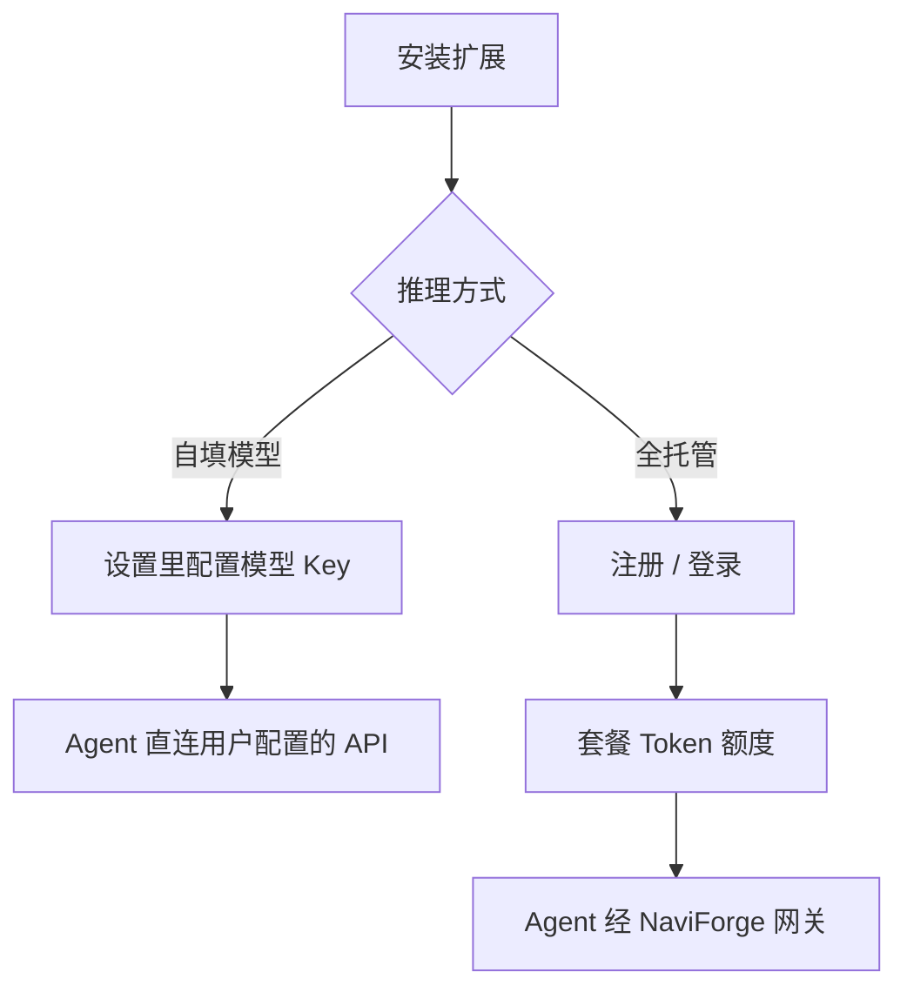

# NaviForge 商业化与账号体系设计

面向海内外普通用户。**两种推理方式并存**；登录系统为独立迭代（本文定边界，不替代实现）。

---

## 1. 核心产品规则（已定）

| 模式 | 谁用 | 要不要登录 | 模型从哪来 | 谁付钱 |
|------|------|------------|------------|--------|
| **自填模型（BYOK）** | 极客、已有 Key、隐私敏感用户 | **不需要** | 用户自己在设置里配 Base URL / Model / API Key | 用户直接向模型厂商付费 |
| **全托管（Hosted）** | 不想折腾的普通用户 | **必须注册登录** | NaviForge 网关（用户不选底层模型） | 订阅 + 套餐内 Token；超额升级或加购 |

**长期并存**，不隐藏、不删除自填模型能力。全托管是增量收入，不是替代 BYOK。



---

## 2. 收入结构

| 优先级 | 来源 | 适用用户 |
|--------|------|----------|
| **主** | 全托管订阅 + Token 额度 | 已登录 Hosted 用户 |
| **辅** | 扩展页 AdSense | 所有用户（BYOK / Hosted 均可展示） |
| **间接** | BYOK 用户规模 | 口碑、商店排名；本身不向用户收 Token |

代码已预留：AdSense（`ads-config.ts`）、OCR WebP 压缩（降低托管成本）。

---

## 3. 扩展内 UI 形态（未来实现）

### 3.1 设置 → 模型

顶部增加 **推理方式** 切换（持久化 `chrome.storage.local`）：

- **使用我自己的模型**（默认，与现状一致）
  - 保留现有：多模型配置、OCR 模型、API Key、Web 搜索 Key 等
- **使用 NaviForge 全托管**
  - 未登录：只显示「登录 / 注册」按钮，不可选 Hosted 跑 Run
  - 已登录：显示套餐名、本月 Token 已用/总量、升级入口
  - **不展示** 底层厂商 Model ID（由网关路由）；用户只感知「NaviForge 模型」

### 3.2 Agent 跑之前

```ts
type InferenceMode = 'byok' | 'hosted'

if (mode === 'hosted') {
  if (!session) throw '请先登录以使用全托管'
  if (quota.remaining <= 0) throw '本月额度已用完，请升级套餐'
  llm = hostedLlmFromSession(session) // baseURL = 你的网关, apiKey = accessToken
} else {
  llm = profileToLlmConfig(activeProfile) // 现有逻辑
}
```

BYOK 与 Hosted **共用同一套 Agent / 工具盘 / 截图**，仅 `LlmConfig` 来源不同。

---

## 4. 登录与扩展同步

### 4.1 仅全托管需要账号

- BYOK：**永不强制登录**。
- Hosted：注册 / 登录后才有 `accessToken` 和配额。

### 4.2 扩展侧存储

```ts
type InferenceMode = 'byok' | 'hosted'

type AuthSession = {
  accessToken: string
  refreshToken?: string
  expiresAt: number
  user: { id: string; email: string; plan: PlanId }
  quota?: {
    usedTokens: number
    limitTokens: number
    periodEnd: string
  }
}
```

另存：`inferenceMode: InferenceMode`（默认 `'byok'`）。

### 4.3 同步流程

1. 用户在控制台选「全托管」→ 未登录则 `launchWebAuthFlow` 打开你的登录页
2. 回调写入 `AuthSession`
3. `chrome.storage.onChanged` → 侧栏 / Agent 刷新账户与配额展示
4. `alarms` 定期 `refreshToken` + `GET /v1/me/quota`
5. 用户切回「自填模型」→ 立即走本地 Key，**不删 session**（下次切 Hosted 仍登录）

推荐入口：控制台「账户」页 + `https://your-domain/login?source=extension`。

---

## 5. 全托管网关（你的服务端）

1. 校验 JWT → `userId` + `plan`
2. 扣减套餐 Token 额度
3. 后端选型（DeepSeek / 豆包等），对用户不可见
4. 记录：`input_tokens`, `output_tokens`, `feature`（agent / ocr / vision）
5. OpenAI-compatible 流式响应

扩展请求：`Authorization: Bearer <accessToken>` 或专用 API key 字段。

### 套餐草案（仅 Hosted）

| 套餐 | 月费（示意） | 月 Token | 说明 |
|------|-------------|----------|------|
| Free | $0 | 50k–100k | 试用全托管 |
| Plus | $9.99 | 500k | 全工具 + OCR |
| Pro | $19.99 | 2M | 高步数、Playbook 等 |

超额：停服提示升级，或小额加购包。大陆可单独 RMB + 微信/支付宝。

**BYOK 用户不参与上述套餐**（除非自愿注册看统计，一般无此需求）。

---

## 6. 用量统计（仅 Hosted + 已登录）

```
GET /v1/me/quota
GET /v1/me/usage?days=30
```

控制台「账户」页（Hosted 模式下突出）：

- 本月 Token 进度环
- 近 30 天曲线
- Agent / OCR / 看图拆分

BYOK 用户可在本地看 Run 日志与 `tokenBudget`（现有能力），**不上报到你服务器**（除非用户显式 opt-in，默认不做）。

---

## 7. 广告

- Agent 侧栏、控制台、截图工作室：**iframe 嵌入你服务器上的广告页**（MV3 不能在扩展 CSP 里加载 AdSense 脚本）
- 配置：`AD_EMBED_BASE_URL` in `apps/extension/src/lib/ads-config.ts`
- 模板：`docs/store-assets/ads/*.html` 部署到服务器后填入 AdSense
- BYOK 与 Hosted 用户均可展示（注意 AdSense / Chrome 扩展政策）

---

## 8. 实施阶段（不再「砍掉 BYOK」）

| 阶段 | 内容 |
|------|------|
| **现在** | BYOK 完整可用；广告位、WebP OCR、工作区文件大小 |
| **M1** | 推理方式切换 UI；登录 / 注册；Hosted 网关 + 配额 |
| **M2** | 订阅支付、账户统计页、套餐升级 |
| **M3** | 团队席、加购包、大陆支付 |

**不做：** 隐藏自填模型、未登录禁止 BYOK、强制全员托管。

---

## 9. 独立需求拆分

### 后端（你的服务）

- 注册 / 登录 / refresh
- `/v1/chat` 推理网关 + 计量
- `/v1/me`、`/v1/quota`、`/v1/usage`
- 订阅 webhook（Stripe / 国内支付）

### 扩展（另开任务）

- `InferenceMode` 切换与存储
- `AuthSession` + `launchWebAuthFlow`
- Hosted 跑 Run 前 quota 检查
- 账户页 UI（登录态、配额、升级）
- **保留并继续维护** 现有模型配置页（BYOK）

---

## 10. 相关文件

| 文件 | 用途 |
|------|------|
| `apps/extension/src/lib/inference-mode.ts` | 推理方式类型与默认值 |
| `apps/extension/src/lib/compliance.ts` | 隐私政策 URL |
| `apps/extension/src/lib/ads-config.ts` | AdSense |
| `apps/extension/src/lib/vision-ocr.ts` | WebP 压缩（托管降本） |
| `docs/PRIVACY_POLICY.md` | 需区分：BYOK 直连厂商 vs Hosted 经 NaviForge |
