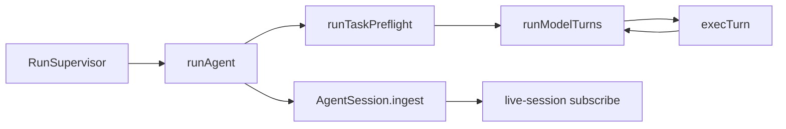

# NaviForge 架构审查：框架对照与整改记录

> **日期**：2026-08-17（**与 OPTIMIZATION_PLAN §1 同步**）  
> **对照基线**：Pi Agent、`hermes-dev/hermes-agent`、OpenHarness、MAF（Microsoft Agent Framework）  
> **执行清单**：[OPTIMIZATION_PLAN.md](./OPTIMIZATION_PLAN.md)（O-01～O-20 状态列）  
> **详细 backlog**：[ARCHITECTURE_OPTIMIZATION.md](./ARCHITECTURE_OPTIMIZATION.md)  
> **设计权威**：[AGENT_SYSTEM_DESIGN.md](./AGENT_SYSTEM_DESIGN.md)

本文将架构审查归纳为五类问题，并记录已落地整改与仍待项。**胖文件行数为仓库实测值**；勾选状态以 OPTIMIZATION_PLAN 为准。

---

## 1. 设计冗余与缺陷

### 1.1 胖文件热点

| 文件 | 原问题 | 现状（2026-08-17 实测） |
|------|--------|-------------------------|
| `packages/runtime/src/agent.ts` | 预检 + 模型循环 + HITL 全塞一处 | ~628 行；`model-turns.ts`、`PreflightHook` |
| `apps/extension/.../workspace-composition.ts` | React + 会话 + 运行胶水 | ~687 行；`workspace-run-wire.ts` 等子模块；`use-agent-workspace.ts` 为 6 行 shim |
| `packages/runtime/src/tools/builtin-handlers.ts` | 工具 handler 堆积 | registry ~391 行；`handlers/dom.ts` 等 |
| `packages/runtime/src/exec-turn.ts` | 全工具分发 | ~265 行；ToolRegistry |
| `apps/extension/.../content.ts` | MV3 巨石 | ~1574 行；`page-control-listener.ts`、`selector-resolver.ts` |

### 1.2 工具面重叠（DOM 读）

**问题**：`dom_read_page`、`dom_extract_content`、`dom_extract_dom`、`page_to_markdown` 与 `dom_snapshot` 职责交叉，模型选择方差大。

**整改（2026-08-17）**：

- 引入 **`dom_read`** 统一 catalog 入口（`mode`: `body | list | dom | markdown`）。
- **`builtin-tool-resolver.ts`**：catalog 元工具解析为内部 handler（如 `dom_read_page`）；**不进** `AGENT_TOOL_CATALOG`（39 个 model-facing id）。
- `KERNEL_PROMPT` 决策表 + `self-check` 覆盖。

**对照**：OpenHarness / smolagents 倾向更少、更正交的工具面；browser-use 用单一 `extract` 族。

### 1.3 Trace 双轨

**问题**：Runtime 直播类型、Session 持久化类型、`agent-event-projection` 三处同构字段，易漂移。

**整改**：

- `@naviforge/session/trace-view.ts`：`projectTraceView` 为投影单源。
- `appendUniqueRecords` / `capSessionRecords` 在 `session-records.ts`。
- Extension 投影层：`RecordView = TraceView`；`localizeView` 只覆盖 `title`，**无 `kind` 字段**。

### 1.4 Hook vs 内联启发式

**问题**：`isPageReadTask`、列表 preflight 曾写在 `agent.ts`。

**整改**：`runTaskPreflight()` 迁入 `turn-pipeline.ts`；CI 禁止 `agent.ts` 再出现 page-read preflight 分支。

**待做**：剩余启发式完全 stock-hook 化 — 列表/读页 hint 已迁 `task-classifier.ts` + `TaskHintHook`；action-loop 已封装 `loop-gate-state.ts`。

---

## 2. 模型实体不合理之处

### 2.1 三层「会话」概念

| 实体 | 职责 | 整改 |
|------|------|------|
| `TraceRecord` | 审计账本（全量） | 保持；`RunLedger` + compaction 喂模型 |
| `AgentSession`（`@naviforge/session`） | 持久化 + `ingest` | `ingest()` 避免双写 |
| `TabWorkspace` / `live-session` | UI 订阅态 | Pi 风格 facade；**仅 `records`**，已删并行 `logs[]` |

### 2.2 队列模型

**问题**：`followUps: string[]` 与 `QueuedTask` 并行。

**整改**：移除 string followUps；队列统一 `QueuedTask`（id + text）。

### 2.3 Thread 记忆

**问题**：类型在 `session`，compact 算法曾在 extension shim。

**整改**：`thread-compaction.ts` 迁入 `@naviforge/session`；extension `thread-memory` shim 已删。

### 2.4 显示派生字段

**问题**：历史会话曾在 storage 写入 `kind` / `title` / `content`。

**状态（2026-08-17）**：新记录 **不落盘** 派生字段（`AGENT_SYSTEM_DESIGN` §2）；UI 经 `projectTraceView` + `variant` 渲染。旧会话迁移见 ARCHITECTURE Phase 2 §6。

---

## 3. 边界不合理 / 不够简洁

### 3.1 Extension 直调 Runtime

**原则**：MV3 适配可厚，Agent 循环不可与 React 绑死。

**整改**：

- 禁止 extension 调用 `runAgent`（`check-boundaries.mjs`）。
- 唯一运行入口：`RunSupervisor` → `host-bridge` → `runHostPollTask`。

### 3.2 双写会话

**整改**：`LiveSession` + `ChromeSessionManager` 单写 `AgentSession`；UI `appendLocal` 经 session bridge。

### 3.3 Toolkit vs Agent 能力门

**问题**：翻译/OCR 等与 Agent 共享隐私开关，类型分散。

**状态**：`shared/capability-gates.ts` + `agent-limits.ts` 已建；Toolkit 与 Agent 共用 `loadToolkitCapabilityGates()`（background 截图/翻译、options toolkit-panel）。

### 3.4 Plane 边界（保留，勿破）

```
runtime ──(interface)──► dom-plane / network-plane
extension ──(impl)──► Chrome APIs
host ──(impl)──► MCP stdio
```

---

## 4. 应使用的设计模式（重构映射）

| 模式 | 成熟框架参考 | NaviForge 落点 |
|------|--------------|----------------|
| **Facade** | Pi `AgentSession.subscribe` | `live-session.ts`, `chrome-session-manager.ts` |
| **Supervisor** | Pi run owner | `run-supervisor.ts` |
| **Pipeline** | MAF middleware chain | `turn-pipeline` → `runModelTurns` → `execTurn` |
| **Projector** | CQRS read model | `trace-view.ts`, `agent-event-projection.ts` |
| **Strategy** | Tool resolver | `builtin-tool-resolver.ts`（`dom_read` / `workspace` / `network_read`） |
| **Hook / Middleware** | Hermes hooks | `HookPipeline`, `builtin-hooks.ts` |
| **Compaction** | Pi / Hermes memory | `thread-compaction`, `WorkingSetHook` |

### 4.1 目标循环（当前）



---

## 5. 为兼容保留的存在（退役条件）

| 兼容层 | 用途 | 状态 |
|--------|------|------|
| 内部读 handler（`dom_read_page` 等） | Playbook / resolver / 历史 trace | **保留** registry 层；catalog 已用 `dom_read` |
| storage 旧 `kind/title/content` | 旧 UI / 导出 | Phase 2 迁移；新记录不落盘 |
| `migrateTokenBudget` | 旧 settings 字段 | 已收敛 |
| MCP Cursor `mcp-servers.json` | 导入格式 | 共享 `parseMcpServersJson`；O-20 部分 |
| ~~`session-controller.ts`~~ | append/cap 薄封装 | **已删** |
| ~~`followUps: string[]`~~ | 旧队列 API | **已删** |
| ~~`AGENT_TOOL_ALIASES`~~ | catalog 隐藏别名 | **已删**；由 resolver 替代 |

---

## 6. 与成熟框架差距（优化后目标）

| 维度 | Pi | Hermes | NaviForge 目标 |
|------|-----|--------|----------------|
| 会话 API | `AgentSession` facade | Session + slots | ✅ `live-session` + `AgentSession` |
| 工具面 | 少而正交 | Skills + tools | 🔄 catalog 39；`dom_read` 已收敛；长期 ~15 |
| 审计 vs 上下文 | 全量 trace + compaction | Compressor | ✅ `RunLedger` + `WorkingSetHook` |
| 运行入口 | 单 run owner | — | ✅ `RunSupervisor` |
| 子 Agent | 受限 profile | 并行 readonly | ✅ `READONLY_RUN_PROFILE` + `dom_read` |

**明确不做**（与 AGENT_SYSTEM_DESIGN §12 一致）：同 tab 多 Agent 并行写 DOM、全量 trace 回灌 LLM、为对齐而拆 `prompt-compiler` 新 package。

---

## 7. 本轮四项「建议后续」完成情况

| 建议 | 状态 |
|------|------|
| 从 `agent.ts` 抽 `runModelTurns` | ✅ `packages/runtime/src/model-turns.ts` |
| `dom.read` 工具收敛 | ✅ 模型侧 4 个别名隐藏；统一 `dom_read` |
| 删 `session-controller`，仅留 `appendUniqueRecords` | ✅ 已删 controller；`live-session` 直调 session 工具函数 |
| 架构分析写入本文档 | ✅ 本文件 |

---

## 8. 门禁

```bash
cd naviforge && npm run check   # 含 check-boundaries.mjs + check-trace-kind.sh
```

断言（脚本 / self-check）：

- `AGENT_TOOL_IDS` 不含 `dom_read_page` 等内部 handler id。
- `agent.ts` 委托 `runTaskPreflight` / `runModelTurns`。
- Extension 无 `runAgent(` 调用。
- runtime/chat 不对 persisted record 分支 `message.kind`（`check-trace-kind.sh`）。

---

## 9. 相关文档

| 文档 | 关系 |
|------|------|
| [OPTIMIZATION_PLAN.md](./OPTIMIZATION_PLAN.md) | **执行清单** O-01～O-20：问题→方案→排期 |
| [ARCHITECTURE_OPTIMIZATION.md](./ARCHITECTURE_OPTIMIZATION.md) | 详细 backlog 与 Phase 路线图 |
| [AGENT_SYSTEM_DESIGN.md](./AGENT_SYSTEM_DESIGN.md) | 实现叙事权威 |
| [HOOK_MIDDLEWARE.md](./HOOK_MIDDLEWARE.md) | Hook 相位与 preflight 迁入依据 |
