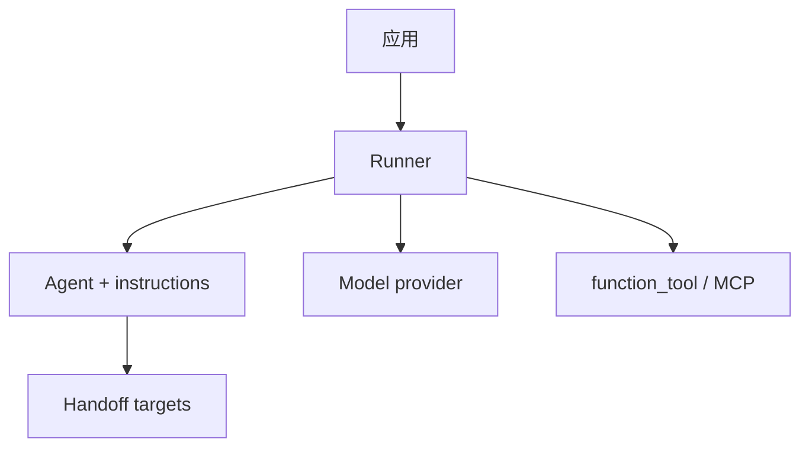

# OpenAI Agents Python SDK 设计思想导读（九幕）

> **深潜**：[OPENAI_AGENTS_SDK_ARCHITECTURE_INDEX.md](./OPENAI_AGENTS_SDK_ARCHITECTURE_INDEX.md)  
> **Rollout / Session**：[ROLLOUT_AND_SESSION_EXAMPLES.md](./ROLLOUT_AND_SESSION_EXAMPLES.md)  
> **Codex MA 对比**：[FULL_LIFECYCLE_SEQUENCE.md](../../docs/codex-architecture/FULL_LIFECYCLE_SEQUENCE.md)

---

## 第 1 幕：源码全景

**一句话**：`Runner` 编排 + `run_internal/run_loop.py` 执行 + `Agent` 声明式定义 + Handoff 边。

```text
src/agents/
├── run.py                 公开 Runner API
├── run_internal/
│   ├── run_loop.py        核心循环（~1900 行）
│   ├── session_persistence.py
│   └── items.py           RunItem 流
├── agent.py               Agent、Handoff
├── tools/                 function_tool、MCP
└── memory/session.py      Session 接口
```

→ [OPENAI_AGENTS_SDK_ARCHITECTURE_INDEX.md](./OPENAI_AGENTS_SDK_ARCHITECTURE_INDEX.md)

---

## 第 2 幕：状态 vs 执行

| | RunState / Session | run_loop |
|--|---------------------|----------|
| **持有** | items、current_agent、handoff 栈 | 单步 model / tool 决策 |
| **API** | `Runner.run` 传入 session | `_run_single_turn` 等内部 |
| **恢复** | `session_persistence`、run_state 序列化 | 无状态步骤函数 |

→ [OPENAI_AGENTS_SDK_ARCHITECTURE_PART1 §3](./OPENAI_AGENTS_SDK_ARCHITECTURE_PART1.md)

---

## 第 3 幕：双层循环

**外层**：`Runner.run` — 多轮直到无 tool、无 handoff、或达 `max_turns`  
**内层**：单轮内 **model 采样 → 并行/串行 tool 执行 → 结果 items 回注**

```text
Runner.run(agent, input, session=...)
  while needs_another_turn:
    run_loop single turn
      model.stream
      for each tool_call: execute
      if handoff: switch current_agent
  return RunResult
```

→ `run_internal/run_loop.py`

---

## 第 4 幕：依赖与装配



Handoff = **图上的边**；`Agent.as_tool()` = 把另一 agent 包装成 tool（与 Codex delegate 对照见 FULL_LIFECYCLE）。

→ [OPENAI_AGENTS_SDK_ARCHITECTURE_PART2](./OPENAI_AGENTS_SDK_ARCHITECTURE_PART2.md)

---

## 第 5 幕：工具管线

```text
tool_call from model
  → FunctionTool 包装（schema + async fn）
  → 可选 human approval
  → 执行 → ToolCallOutputItem
  → 追加到 run items → 下一轮 model
```

MCP、Computer use、Hosted tools 在 Part2 分述。

→ [OPENAI_AGENTS_SDK_ARCHITECTURE_PART2 §工具](./OPENAI_AGENTS_SDK_ARCHITECTURE_PART2.md)

---

## 第 6 幕：事件流

| 类型 | 说明 |
|------|------|
| `RunItemStreamEvent` | 流式 UI |
| `MessageOutputItem` | assistant 文本 |
| `ToolCallItem` / `ToolCallOutputItem` | 工具轨迹 |
| `HandoffCallItem` | agent 切换 |

`Runner.run_streamed` 消费同一 item 抽象。

→ [OPENAI_AGENTS_SDK_ARCHITECTURE_PART1 §6](./OPENAI_AGENTS_SDK_ARCHITECTURE_PART1.md)

---

## 第 7 幕：Steering vs Follow-up

SDK **无** Pi 式 `steer()` / `followUp()` 一等 API；等价模式：

| 意图 | SDK 做法 |
|------|----------|
| **新用户消息** | 再次 `Runner.run(..., session=同一 session)` |
| **运行中注入** | 应用层取消 run + 新 input（或 Realtime 通道） |
| **长会话** | `InMemorySession` / `OpenAIConversationsSession` + limit |

```python
session = InMemorySession(session_id="chat_001")
await Runner.run(agent, "你好", session=session)
await Runner.run(agent, "继续刚才的话题", session=session)
```

→ [OPENAI_AGENTS_SDK_ARCHITECTURE_INDEX 示例](./OPENAI_AGENTS_SDK_ARCHITECTURE_INDEX.md)

---

## 第 8 幕：持久化 Harness

| 账 | 实现 |
|----|------|
| **Session items** | `memory/session.py` 接口 |
| **run_state** | 可序列化恢复（见 session_persistence） |
| **ROLLOUT 示例** | 与 Codex rollout 概念对齐的示例文档 |

```text
Session.append(items from run)
  → 下次 run 前注入 history
  → optional trim (SessionSettings.limit)
```

→ [ROLLOUT_AND_SESSION_EXAMPLES.md](./ROLLOUT_AND_SESSION_EXAMPLES.md) · `run_internal/session_persistence.py`

---

## 第 9 幕：最小核心 + 边界

| 边界 | SDK |
|------|-----|
| **Handoff** | 多 agent 路由（≈ Codex MA V2） |
| **Agent-as-tool** | 子 agent 作 function |
| **MCP** | 外部工具服务 |
| **Realtime** | 低延迟语音/流（独立栈） |
| **Tracing** | OpenAI tracing 集成 |

**与 Codex**：Codex 是 Rust 本地 harness + Rollout 三真相；SDK 是 **库级 Runner + Session items**，部署形态由应用决定。

→ [OPENAI_AGENTS_SDK_ARCHITECTURE_PART3.md](./OPENAI_AGENTS_SDK_ARCHITECTURE_PART3.md)

---

## 阅读路径

```text
DESIGN_THINKING_SERIES → ARCHITECTURE_INDEX → run_loop 源码 → ROLLOUT 示例
```
