    xz、
# OpenAI Agents Python SDK 架构深度分析

> **版本**: v1.0  
> **最后更新**: 2026-04-29  
> **分析对象**: openai-agents-python (OpenAI Agents SDK)  
> **文档类型**: 完整实现深潜（由浅入深）  
> **参考**: Hermes Agent 文档结构 + OpenHarness Memory 深度分析

---

## 目录导读

本文档从**架构总览**出发，逐层深入到每个核心模块的设计细节。建议按以下顺序阅读：

1. **[架构总览](#1-架构总览)** — 理解整体设计理念和模块关系
2. **[Agent 核心定义](#2-agent-核心定义)** — Agent 数据结构、字段、配置
3. **[Prompt 体系](#3-prompt-体系)** — System Prompt、动态 Prompt、Sandbox Prompt 的完整链路
4. **[Agent Loop 运行循环](#4-agent-loop-运行循环)** — 端到端执行流程、Turn/Step 模型
5. **[Handoff 多 Agent 协作](#5-handoff-多-agent-协作)** — 主子 Agent 切换、历史传递
6. **[Tool 工具系统](#6-tool-工具系统)** — FunctionTool、MCP、ComputerTool、ToolSearch
7. **[Guardrail 护栏系统](#7-guardrail-护栏系统)** — 输入/输出/工具护栏
8. **[Memory / Session 记忆系统](#8-memorysession-记忆系统)** — 会话持久化、压缩、多后端
9. **[Sandbox Memory 系统](#9-sandbox-memory-系统)** — 两阶段记忆生成、Prompt 模板、文件布局
10. **[Skill 技能加载系统](#10-skill-技能加载系统)** — 技能发现、加载、Prompt 注入
11. **[Tracing 追踪系统](#11-tracing-追踪系统)** — Span、Trace、处理器
12. **[Model 模型层](#12-model-模型层)** — 多提供商、重试、流式
13. **[Streaming 流式输出](#13-streaming-流式输出)** — 事件系统
14. **[RunState 序列化](#14-runstate-序列化)** — 中断恢复、版本化
15. **[Sandbox 沙箱运行时](#15-sandbox-沙箱运行时)** — Capability 体系、Docker/Unix
16. **[端到端流程图](#16-端到端流程图)** — 完整 Mermaid 序列图
17. **[与 Hermes/OpenHarness 对比](#17-与-hermesopenharness-对比)** — 设计差异

---

## 1. 架构总览

### 1.1 设计理念

OpenAI Agents SDK 采用 **"Agent-as-Loop + Handoff-as-Routing"** 的核心架构：

- **Agent 是配置，不是进程**: 每个 Agent 是一个声明式数据结构（`@dataclass`），描述了模型、Prompt、工具和护栏
- **Runner 是引擎**: `Runner.run()` 是唯一的执行入口，负责驱动 Agent Loop
- **Handoff 实现路由**: 多 Agent 协作通过工具调用形式的 Handoff 实现，而非消息传递
- **Session 实现记忆**: 会话历史通过 Protocol 抽象解耦，支持多后端

```
┌─────────────────────────────────────────────────────────┐
│                    用户代码入口                           │
│         Runner.run(agent, input, session=...)            │
└──────────────────────┬──────────────────────────────────┘
                       ↓
┌─────────────────────────────────────────────────────────┐
│                   run.py (Runner)                        │
│  • 公共 API 层: run / run_sync / run_streamed           │
│  • 组装 RunConfig、RunState、RunContext                  │
│  • 委托给 run_internal/                                 │
└──────────────────────┬──────────────────────────────────┘
                       ↓
┌─────────────────────────────────────────────────────────┐
│              run_internal/run_loop.py                     │
│  Agent Loop 核心循环                                     │
│  ┌─────────────────────────────────────────────────┐    │
│  │ while current_turn < max_turns:                 │    │
│  │   1. turn_preparation → 准备模型输入            │    │
│  │   2. get_new_response → 调用 LLM               │    │
│  │   3. turn_resolution → 解析输出                 │    │
│  │   4. tool_execution → 执行工具调用              │    │
│  │   5. 判断: final_output / handoff / continue    │    │
│  └─────────────────────────────────────────────────┘    │
└──────────────────────┬──────────────────────────────────┘
                       ↓
┌────────────┬────────────┬────────────┬─────────────────┐
│  Agent     │  Session   │  Tools     │  Guardrails     │
│  定义      │  记忆      │  执行      │  护栏           │
└────────────┴────────────┴────────────┴─────────────────┘
```

### 1.2 核心模块一览

| 模块 | 源码位置 | 职责 |
|------|----------|------|
| **Agent** | `agent.py` | Agent 声明式定义（name, instructions, tools, handoffs, guardrails） |
| **Runner** | `run.py` | 公共执行 API，编排整个运行流程 |
| **RunLoop** | `run_internal/run_loop.py` | Agent Loop 核心循环实现 |
| **TurnPreparation** | `run_internal/turn_preparation.py` | 每轮开始前的输入准备 |
| **TurnResolution** | `run_internal/turn_resolution.py` | LLM 响应解析、RunItem 生成 |
| **ToolExecution** | `run_internal/tool_execution.py` | 工具调用执行和结果收集 |
| **ToolPlanning** | `run_internal/tool_planning.py` | 工具规划和 approval 逻辑 |
| **SessionPersistence** | `run_internal/session_persistence.py` | Session 读写、合并、回滚 |
| **Guardrails** | `run_internal/guardrails.py` | 输入/输出护栏执行 |
| **Approvals** | `run_internal/approvals.py` | 工具审批处理 |
| **Streaming** | `run_internal/streaming.py` | 流式事件分发 |
| **Tool** | `tool.py` | FunctionTool、ComputerTool、MCPTool 等 |
| **Handoff** | `handoffs/__init__.py` | Agent 间切换的声明和执行 |
| **HandoffHistory** | `handoffs/history.py` | Handoff 历史嵌套和映射 |
| **Prompt** | `prompts.py` | Prompt 模板/动态 Prompt |
| **Lifecycle** | `lifecycle.py` | RunHooks / AgentHooks 生命周期回调 |
| **Session** | `memory/session.py` | Session Protocol 定义 |
| **SQLiteSession** | `memory/sqlite_session.py` | SQLite 后端实现 |
| **CompactionSession** | `memory/openai_responses_compaction_session.py` | 压缩感知 Session |
| **ConversationsSession** | `memory/openai_conversations_session.py` | OpenAI Conversations API Session |
| **Model** | `models/interface.py` | 模型抽象接口 |
| **OpenAIResponses** | `models/openai_responses.py` | Responses API 模型实现 |
| **OpenAIChatCompletions** | `models/openai_chatcompletions.py` | Chat Completions 模型实现 |
| **MCP** | `mcp/server.py`, `mcp/manager.py` | MCP 服务器管理 |
| **Tracing** | `tracing/` | 分布式追踪 |
| **RunState** | `run_state.py` | 运行状态序列化/反序列化（中断恢复） |
| **RunConfig** | `run_config.py` | 运行配置 |
| **RunContext** | `run_context.py` | 运行上下文（用户自定义状态） |
| **Items** | `items.py` | RunItem 类型体系 |
| **StreamEvents** | `stream_events.py` | 流式事件类型 |
| **Sandbox** | `sandbox/` | 沙箱运行时、Capability 体系 |
| **SandboxMemory** | `sandbox/memory/` | 两阶段记忆生成 |
| **Skills** | `sandbox/capabilities/skills.py` | 技能加载和 Prompt 注入 |

### 1.3 源码目录结构

```
src/agents/
├── __init__.py                    # 包公共 API 导出
├── agent.py                       # Agent / AgentBase 定义
├── run.py                         # Runner 公共入口
├── run_config.py                  # RunConfig 运行配置
├── run_context.py                 # RunContextWrapper 运行上下文
├── run_state.py                   # RunState 状态序列化（3305 行）
├── prompts.py                     # Prompt / DynamicPromptFunction
├── items.py                       # RunItem 类型体系
├── tool.py                        # Tool 基类和 FunctionTool
├── tool_context.py                # ToolContext 工具上下文
├── guardrail.py                   # InputGuardrail / OutputGuardrail
├── lifecycle.py                   # RunHooks / AgentHooks
├── result.py                      # RunResult / RunResultStreaming
├── stream_events.py               # StreamEvent 类型
├── model_settings.py              # ModelSettings
│
├── run_internal/                  # 内部运行逻辑
│   ├── run_loop.py                # Agent Loop 核心（1905 行）
│   ├── run_steps.py               # SingleStepResult 结构
│   ├── turn_preparation.py        # Turn 准备
│   ├── turn_resolution.py         # LLM 响应解析（1911 行）
│   ├── tool_execution.py          # 工具执行（2329 行）
│   ├── tool_planning.py           # 工具规划（682 行）
│   ├── streaming.py               # 流式事件分发
│   ├── session_persistence.py     # Session 持久化（633 行）
│   ├── guardrails.py              # 护栏执行
│   ├── approvals.py               # 审批处理
│   ├── items.py                   # 输入项规范化
│   └── oai_conversation.py        # OpenAI 会话跟踪
│
├── memory/                        # Session/记忆系统
│   ├── session.py                 # Session Protocol
│   ├── session_settings.py        # SessionSettings
│   ├── sqlite_session.py          # SQLite 实现
│   ├── openai_conversations_session.py
│   ├── openai_responses_compaction_session.py
│   └── util.py
│
├── models/                        # 模型层
│   ├── interface.py               # Model 抽象接口
│   ├── openai_responses.py        # Responses API
│   ├── openai_chatcompletions.py  # Chat Completions API
│   ├── multi_provider.py          # 多提供商路由
│   └── ...
│
├── mcp/                           # MCP 协议支持
│   ├── server.py                  # MCPServer
│   └── manager.py                 # MCPServerManager
│
├── handoffs/                      # Handoff 系统
│   ├── __init__.py                # Handoff 声明和执行
│   └── history.py                 # 历史嵌套/映射
│
├── tracing/                       # 追踪系统
│   ├── spans.py                   # Span 实现
│   ├── traces.py                  # Trace 实现
│   ├── processors.py              # 后端处理器
│   └── ...
│
├── sandbox/                       # 沙箱运行时
│   ├── capabilities/              # Capability 体系
│   │   ├── capability.py          # Capability 基类
│   │   ├── capabilities.py        # 默认 Capability 集
│   │   ├── shell.py               # Shell 能力
│   │   ├── filesystem.py          # 文件系统能力
│   │   ├── memory.py              # Memory 能力
│   │   ├── skills.py              # Skills 能力（753 行）
│   │   └── tools/                 # 沙箱工具
│   ├── memory/                    # 沙箱记忆系统
│   │   ├── manager.py             # SandboxMemoryGenerationManager
│   │   ├── phase_one.py           # Phase 1 提取
│   │   ├── phase_two.py           # Phase 2 整合
│   │   ├── prompts.py             # Prompt 模板加载
│   │   ├── storage.py             # 存储层
│   │   ├── rollouts.py            # Rollout 数据结构
│   │   └── prompts/               # Prompt Markdown 模板
│   │       ├── memory_consolidation_prompt.md   # Phase 2 整合 Prompt
│   │       ├── memory_read_prompt.md            # 记忆读取 Prompt
│   │       ├── rollout_extraction_prompt.md     # Phase 1 提取 Prompt
│   │       └── rollout_extraction_user_message.md
│   └── ...
│
├── extensions/                    # 扩展
│   ├── memory/                    # 扩展 Session 后端（Redis/MongoDB/SQLAlchemy/Dapr）
│   ├── models/                    # 扩展模型（LiteLLM/AnyLLM）
│   ├── sandbox/                   # 扩展沙箱（E2B/Modal/Vercel/Cloudflare/...）
│   └── ...
│
├── realtime/                      # 实时 Agent
├── voice/                         # 语音管道
└── repl.py                        # REPL 交互
```

### 1.4 系统架构设计

为了能够清晰地表达整个 SDK 的组件拓扑结构，以及各核心子系统之间的分层协作关系，下图展示了 OpenAI Agents SDK 的系统架构：


```mermaid
graph TB
    subgraph Client [用户与应用层]
        Code["用户应用代码 (Python)"]
    end

    subgraph Entry [入口与编排层]
        Runner["Runner (run.py)"]
        AgentRunner["AgentRunner (run.py)"]
        RunConfig["RunConfig (运行全局配置)"]
        RunState["RunState (运行状态序列化与恢复)"]
        RunContext["RunContextWrapper (上下文状态共享)"]
    end

    subgraph CoreLoop [Agent Loop 核心循环]
        RunLoop["run_loop.py (核心控制循环)"]
        TurnPrep["turn_preparation.py (每轮输入构建)"]
        TurnResolve["turn_resolution.py (LLM 响应与流分发解析)"]
        Streaming["streaming.py (流式事件分发)"]
    end

    subgraph Memory [记忆与会话层]
        SessionProto["Session Protocol (memory/session.py)"]
        SQLiteSession["SQLiteSession (SQLite 持久化后端)"]
        CompactionSession["OpenAIResponsesCompactionSession (自动感知压缩)"]
        SessionPersist["session_persistence.py (会话持久化与回滚)"]
    end

    subgraph Exec [执行与工具层]
        ToolExec["tool_execution.py (多态工具执行)"]
        ToolPlanning["tool_planning.py (工具规划与安全审查)"]
        FunctionTool["FunctionTool (普通 Python 函数封装)"]
        MCPServer["MCPServer (Model Context Protocol 接入)"]
        ComputerTool["ComputerTool (OS 键鼠/截图控制)"]
    end

    subgraph SandboxEnv [沙箱 Capability 系统]
        SandboxRuntime["SandboxRuntime (沙箱运行时)"]
        CapFilesystem["Filesystem Capability (文件隔离读写)"]
        CapShell["Shell Capability (安全 Shell 执行)"]
        CapSkills["Skills Capability (运行时动态技能加载)"]
        SandboxMemory["SandboxMemory (两阶段 Rollout 记忆整合)"]
    end

    subgraph Guard [安全与审查层]
        Guardrails["guardrails.py (三层护栏执行器)"]
        InputGuard["InputGuardrail (输入安全过滤)"]
        OutputGuard["OutputGuardrail (输出合规过滤)"]
        ToolGuard["ToolGuardrail (工具参数动态校验)"]
        Approvals["approvals.py (用户确认与中断中断处理)"]
    end

    subgraph ModelLayer [模型与底座通信层]
        ModelInterface["Model (模型抽象接口)"]
        OpenAIResponses["OpenAIResponses (基于 Responses API)"]
        OpenAIChat["OpenAIChatCompletions (基于 ChatCompletions)"]
    end

    subgraph Trace [监控与可观测性]
        Tracing["tracing/ (分布式 Tracing 链路跟踪)"]
    end

    %% 连接拓扑
    Code -->|初始化并启动| Runner
    Runner -->|委派给| AgentRunner
    AgentRunner -->|读取/更新历史| SessionPersist
    SessionPersist -->|调用抽象接口| SessionProto
    SessionProto -->|实现| SQLiteSession
    SessionProto -->|实现| CompactionSession
    
    AgentRunner -->|启动循环| RunLoop
    RunLoop -->|1. Turn 准备与 Prompt 拼接| TurnPrep
    RunLoop -->|2. 首轮执行| Guardrails
    RunLoop -->|3. 底座调用| ModelInterface
    RunLoop -->|4. 实体解析与分流| TurnResolve
    RunLoop -->|5. 工具/沙箱分发| ToolExec
    
    TurnPrep -->|安全配置与工具规划| ToolPlanning
    TurnResolve -->|用户确认中断| Approvals
    
    ToolExec --> FunctionTool
    ToolExec --> MCPServer
    ToolExec --> ComputerTool
    
    RunLoop --> SandboxRuntime
    SandboxRuntime --> CapFilesystem
    SandboxRuntime --> CapShell
    SandboxRuntime --> CapSkills
    SandboxRuntime --> SandboxMemory
    
    Guardrails --> InputGuard
    Guardrails --> OutputGuard
    Guardrails --> ToolGuard
    
    ModelInterface --> OpenAIResponses
    ModelInterface --> OpenAIChat
    
    RunLoop -.->|上下文更新| RunContext
    RunLoop -.->|异常中断快照保存| RunState
    RunLoop -.->|分发流式输出事件| Streaming
    RunLoop -.->|Span 链路注入| Tracing
```
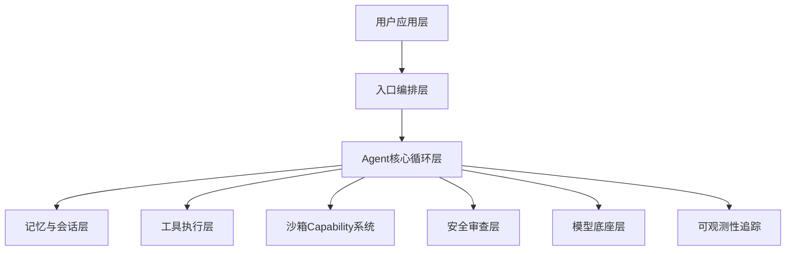
```mermaid
graph TD
    A[用户应用层] --> B[入口编排层]
    B --> C[Agent核心循环层]

    C --> D[记忆与会话层]
    C --> E[工具执行层]
    C --> F[沙箱Capability系统]
    C --> G[安全审查层]
    C --> H[模型底座层]
    C --> I[可观测性追踪]
```

```mermaid
%%{init: { 'graph':{'nodeSpacing':12, 'rankSpacing':45} }}%%
graph TD
    subgraph Client["1. 用户应用层"]
        Code["Python 用户代码"]
    end

    subgraph Entry["2. 入口编排层"]
        Runner["Runner run.py"]
        AgentRunner["AgentRunner"]
        RunConfig["RunConfig 全局配置"]
        RunState["RunState 状态序列化"]
        RunContext["RunContextWrapper 上下文"]
    end

    subgraph CoreLoop["3. Agent 核心循环"]
        RunLoop["run_loop.py 主循环"]
        TurnPrep["turn_preparation 轮次准备"]
        TurnResolve["turn_resolution LLM解析"]
        Streaming["streaming 流式分发"]
    end

    subgraph Memory["4. 记忆会话层"]
        SessionProto["Session Protocol"]
        SQLiteSession["SQLiteSession 持久化"]
        CompactionSession["CompactionSession 自动压缩"]
        SessionPersist["session_persistence 会话持久化"]
    end

    subgraph Exec["5. 工具执行层"]
        ToolExec["tool_execution 工具执行"]
        ToolPlanning["tool_planning 安全审查"]
        FunctionTool["FunctionTool"]
        MCPServer["MCPServer"]
        ComputerTool["ComputerTool"]
    end

    subgraph SandboxEnv["6. 沙箱系统"]
        SandboxRuntime["SandboxRuntime"]
        CapFilesystem["Filesystem Cap"]
        CapShell["Shell Cap"]
        CapSkills["Skills Cap"]
        SandboxMemory["SandboxMemory"]
    end

    subgraph Guard["7. 安全审查层"]
        Guardrails["guardrails 三层护栏"]
        InputGuard["InputGuardrail"]
        OutputGuard["OutputGuardrail"]
        ToolGuard["ToolGuardrail"]
        Approvals["approvals 用户确认"]
    end

    subgraph ModelLayer["8. 模型底座层"]
        ModelInterface["Model 抽象接口"]
        OpenAIResponses["OpenAIResponses API"]
        OpenAIChat["ChatCompletions API"]
    end

    subgraph Trace["9. 可观测层"]
        Tracing["tracing 分布式链路"]
    end

    %% 主干连线
    Code --> Runner
    Runner --> AgentRunner
    AgentRunner --> SessionPersist
    AgentRunner --> RunLoop

    RunLoop --> TurnPrep
    RunLoop --> Guardrails
    RunLoop --> ModelInterface
    RunLoop --> TurnResolve
    RunLoop --> ToolExec
    RunLoop --> SandboxRuntime
    RunLoop -.-> RunContext
    RunLoop -.-> RunState
    RunLoop -.-> Streaming
    RunLoop -.-> Tracing

    TurnPrep --> ToolPlanning
    TurnResolve --> Approvals
    ToolExec --> FunctionTool
    ToolExec --> MCPServer
    ToolExec --> ComputerTool
    SessionPersist --> SessionProto
    SessionProto --> SQLiteSession
    SessionProto --> CompactionSession
    Guardrails --> InputGuard
    Guardrails --> OutputGuard
    Guardrails --> ToolGuard
    ModelInterface --> OpenAIResponses
    ModelInterface --> OpenAIChat
    SandboxRuntime --> CapFilesystem
    SandboxRuntime --> CapShell
    SandboxRuntime --> CapSkills
    SandboxRuntime --> SandboxMemory
```
#### 设计架构核心层次职责：
1. **用户与应用层**：开发者通过定义声明式的 `Agent` 并传递给 `Runner.run()` 发起执行。
2. **入口与编排层**：负责配置的解析 (`RunConfig`)、会话追踪器的绑定 (`OpenAIServerConversationTracker`) 以及追踪句柄的初始化。同时它也管理中断状态的恢复与 `RunState` 对象的反序列化。
3. **Agent Loop 核心循环**：执行核心的 ReAct 循环（Turn-based）。通过在非流式或流式队列中驱动 `run_single_turn` / `run_single_turn_streamed`，直至产出最终的结构化输出或由于用户确认而中断。
4. **记忆与会话层**：这是与底座模型和上下文管理直接相关的部分。它定义了抽象的 `Session` 协议，允许不同的后端读取历史，并在每轮结束后使用 `save_result_to_session` 进行追加，同时支持根据 token 限制调用 OpenAI Responses API 执行长上下文压缩。
5. **执行与工具层**：包含所有与外部系统交互的工具实体。工具通过 `tool_planning.py` 进行规划决策，并在 `tool_execution.py` 中执行。
6. **沙箱 Capability 系统**：针对代码执行和 OS 控制代理，`SandboxRuntime` 在运行时为 Agent 挂载相应的独立 Capability。其中 `Skills Capability` 会读取 `SKILL.md` 并将技能说明动态拼装进 System Prompt 中。
7. **安全与审查层**：管理输入、输出及工具执行前拦截护栏。对于高危工具或 MCP 动作，会生成 `ToolApprovalItem` 并抛出中断信号，退回 `RunState` 等待用户输入。

---

## 2. Agent 核心定义

### 2.1 AgentBase 基类

`AgentBase` 是所有 Agent 的基类（被 `Agent` 和 `RealtimeAgent` 继承）：

```python
@dataclass
class AgentBase(Generic[TContext]):
    name: str                              # Agent 名称
    handoff_description: str | None        # 作为 handoff 目标时的描述
    tools: list[Tool]                      # 工具列表
    mcp_servers: list[MCPServer]           # MCP 服务器列表
    mcp_config: MCPConfig                  # MCP 配置
```

### 2.2 Agent 完整定义

`Agent` 继承 `AgentBase`，包含所有可配置字段：

```python
@dataclass
class Agent(AgentBase[TContext]):
    # === Prompt 配置 ===
    instructions: str | Callable | None     # 系统提示词（静态字符串或动态函数）
    prompt: Prompt | DynamicPromptFunction   # OpenAI Prompt 模板

    # === 模型配置 ===
    model: str | Model                      # 模型名称或实例
    model_settings: ModelSettings            # 模型参数（temperature, top_p 等）

    # === 输出配置 ===
    output_type: type | None                # 结构化输出类型（Pydantic 模型）
    output_guardrails: list[OutputGuardrail] # 输出护栏
    reset_tool_choice: bool                 # 输出后是否重置 tool_choice

    # === 路由配置 ===
    handoffs: list[Agent | Handoff]         # Handoff 目标列表
    handoff_description: str                # 被 handoff 时的描述

    # === 护栏配置 ===
    input_guardrails: list[InputGuardrail]  # 输入护栏

    # === 生命周期 ===
    hooks: AgentHooks | None                # Agent 级别生命周期钩子

    # === 高级配置 ===
    tool_use_behavior: ToolUseBehavior      # 工具调用行为策略
    stop_at_tools: StopAtTools | None       # 在指定工具处停止
```

### 2.3 instructions 动态生成

`instructions` 支持三种形式：

```python
# 1. 静态字符串
agent = Agent(name="helper", instructions="You are a helpful assistant.")

# 2. 同步函数
def get_instructions(ctx, agent):
    return f"Today is {date.today()}"
agent = Agent(name="helper", instructions=get_instructions)

# 3. 异步函数
async def get_instructions(ctx, agent):
    rules = await load_rules()
    return f"Follow these rules: {rules}"
agent = Agent(name="helper", instructions=get_instructions)
```

---

## 3. Prompt 体系

### 3.1 三层 Prompt 架构

```
┌─────────────────────────────────────────────────────┐
│ Layer 1: System Prompt (agent.instructions)          │
│ • 静态字符串 / 动态函数生成                           │
│ • 包含 Handoff 描述、工具说明、输出格式约束            │
│ 注入时机: 每轮 Turn 开始前                            │
└─────────────────────┬───────────────────────────────┘
                      ↓
┌─────────────────────────────────────────────────────┐
│ Layer 2: Prompt Template (agent.prompt)               │
│ • OpenAI Prompt API (id + version + variables)       │
│ • 支持动态 Prompt 函数                                │
│ 注入时机: 发送给模型时作为 prompt 参数                 │
└─────────────────────┬───────────────────────────────┘
                      ↓
┌─────────────────────────────────────────────────────┐
│ Layer 3: Sandbox Capabilities Instructions           │
│ • Memory 读取 Prompt (memory_read_prompt.md)         │
│ • Skills 列表 Prompt                                 │
│ • Shell/Filesystem 使用说明                           │
│ 注入时机: Sandbox 运行时准备阶段                       │
└─────────────────────────────────────────────────────┘
```

### 3.2 Sandbox 主 Agent Prompt 结构（完整示例）

当使用 Sandbox 模式运行时，实际发送给模型的系统指令由多个部分组装而成：

```markdown
# 基础 Prompt（sandbox/instructions/prompt.md）
你是一个在终端助手环境中运行的通用计算机使用 Agent。你需要做到精确、安全且有帮助。

你的能力：
- 接收用户提示和由框架提供的其他上下文
- 通过流式传输思考和回复与用户沟通
- 发出函数调用来运行终端命令和应用补丁

# 个性
你的默认个性和语气是简洁、直接且友好的...

# AGENTS.md 规范
工作区通常包含 AGENTS.md 文件...

# 任务执行
你是一个编码 Agent。请持续工作直到查询被完全解决...

# 验证你的工作
如果代码库有测试或具备构建或运行的能力，考虑使用它们来验证...

# 工具指南
## Shell 命令
使用 shell 时，优先使用 `rg` 或 `rg --files`...
```

```markdown
# Memory Prompt（当 Memory Capability 启用时追加）
## 记忆
你可以访问一个包含先前运行指导的记忆文件夹...

决策边界：是否应该为新用户查询使用记忆？
- 仅在请求明显是自包含的情况下跳过记忆...
- 在以下任一情况为真时默认使用记忆：
  - 查询提到了 MEMORY_SUMMARY 中的工作区/仓库/模块/路径/文件
  - 用户询问先前的上下文/一致性/之前的决策
  - 任务是模糊的...

记忆布局（从通用到具体）：
- {memory_dir}/memory_summary.md（已在下方提供）
- {memory_dir}/MEMORY.md（可搜索注册表；主要查询文件）
- {memory_dir}/skills/<skill-name>/（技能文件夹）
- {memory_dir}/rollout_summaries/（每次运行的回顾）

快速记忆传递（适用时）：
1. 浏览下方的 MEMORY_SUMMARY 并提取任务相关关键词
2. 使用这些关键词搜索 {memory_dir}/MEMORY.md
3. 仅当 MEMORY.md 直接指向运行回顾/技能时，打开最相关的 1-2 个文件

========= MEMORY_SUMMARY 开始 =========
{memory_summary}
========= MEMORY_SUMMARY 结束 =========
```

```markdown
# Skills Prompt（当 Skills Capability 启用时追加）
## 技能
技能是存储在 `SKILL.md` 文件中的一组本地指令。
以下是可以使用的技能列表：

| 名称 | 描述 | 路径 |
|------|-------------|------|
| $code-review | 代码审查技能 | /workspace/.agents/skills/code-review/SKILL.md |
| ...          | ...                | ... |

### 如何使用技能
- 发现：上面的列表是本会话中可用的技能
- 触发规则：如果用户命名了一个技能（使用 `$SkillName` 或纯文本）或者任务明显匹配技能的描述，你必须使用该技能
- 如何使用技能（渐进式披露）：
  1) 打开其 `SKILL.md`。仅阅读足以遵循工作流程的内容
  2) 如果指向额外文件夹如 `references/`，仅加载需要的文件
  3) 如果存在 `scripts/`，优先运行它们
  4) 如果存在 `assets/` 或模板，重用它们
```

### 3.3 Memory Phase 1 提取 Agent Prompt

Phase 1 是 **Memory Writing Agent**，负责从原始 rollout 中提取可复用的记忆：

```markdown
## 记忆写入 Agent：Phase 1（运行提取）

你的工作：将原始的运行记录转换为有用的原始记忆和运行总结。

目标是帮助未来的 Agent：
- 深入理解用户而无需重复指令
- 用更少的工具调用和推理 token 解决类似任务
- 重用经过验证的工作流程和验证清单
- 避免已知的陷阱和失败模式

## 全局安全规则
- 原始运行记录是不可变的证据。永远不要编辑原始运行记录。
- 仅基于证据：不要编造事实
- 脱敏机密：永远不要存储令牌/密钥/密码

## 无操作/最小信号门控
在返回输出之前，问自己：
"未来的 Agent 是否会因为我在这里写的内容而表现得更好？"
如果否 → 返回所有空字段

## 什么算作高信号记忆
1. 稳定的用户操作偏好
2. 高杠杆的程序性知识
3. 可靠的任务映射和决策触发器
4. 关于用户环境的持久证据

## 任务结果分类
结果标签：成功 | 部分完成 | 失败 | 不确定

## 交付物
返回恰好一个 JSON 对象，包含以下键：
- `rollout_summary`（字符串）
- `rollout_slug`（字符串）
- `raw_memory`（字符串）
```

### 3.4 Memory Phase 2 整合 Agent Prompt

Phase 2 是 **Memory Consolidation Agent**，负责将所有原始记忆整合为结构化的记忆文件系统：

```markdown
## 记忆写入 Agent：Phase 2（整合）

你的工作：将原始记忆和运行总结整合到一个本地的、基于文件的"Agent 记忆"文件夹中，以支持渐进式披露。

文件夹结构（在 {{ memory_root }}/ 下）：
- memory_summary.md   ← 始终加载到系统 Prompt
- MEMORY.md           ← 主要查询入口（grep 关键词）
- raw_memories.md     ← 临时文件：Phase 1 输出合并
- skills/             ← 可复用的技能/流程
- rollout_summaries/  ← 每次运行的详细回顾

## 什么算作高信号记忆
1) 稳定的用户操作偏好
2) 防止浪费探索的决策触发器
3) 故障防护：症状 -> 原因 -> 修复
4) 项目/任务地图：真相所在之处
5) 工具怪癖和可靠的快捷方式
6) 经过验证的重现计划
```

---

## 4. Agent Loop 运行循环

### 4.1 核心循环模型

Agent Loop 是一个 **Turn-based** 循环，每个 Turn 包含一次 LLM 调用和后续的工具执行：

```
┌──────────────────────────────────────────────────────────┐
│                    Agent Loop (run_loop.py)                │
│                                                          │
│  ┌────────────────────────────────────────────────────┐  │
│  │ for turn in range(max_turns):                      │  │
│  │                                                    │  │
│  │   ┌─────────────────────────────┐                  │  │
│  │   │ 1. Turn Preparation        │                  │  │
│  │   │ • 解析 agent.instructions   │                  │  │
│  │   │ • 获取 MCP 工具             │                  │  │
│  │   │ • 组装 system_prompt       │                  │  │
│  │   │ • 准备 input items         │                  │  │
│  │   │ • 触发 on_agent_start hook │                  │  │
│  │   └──────────┬──────────────────┘                  │  │
│  │              ↓                                     │  │
│  │   ┌─────────────────────────────┐                  │  │
│  │   │ 2. Input Guardrails        │                  │  │
│  │   │ • 仅在第一轮 + 起始 Agent   │                  │  │
│  │   │ • 并行执行所有输入护栏      │                  │  │
│  │   │ • 失败时抛出 Tripwire       │                  │  │
│  │   └──────────┬──────────────────┘                  │  │
│  │              ↓                                     │  │
│  │   ┌─────────────────────────────┐                  │  │
│  │   │ 3. LLM Call               │                   │  │
│  │   │ • get_new_response()       │                  │  │
│  │   │ • 触发 on_llm_start hook   │                  │  │
│  │   │ • model.get_response()     │                  │  │
│  │   │ • 触发 on_llm_end hook     │                  │  │
│  │   └──────────┬──────────────────┘                  │  │
│  │              ↓                                     │  │
│  │   ┌─────────────────────────────┐                  │  │
│  │   │ 4. Turn Resolution        │                   │  │
│  │   │ • 解析 ModelResponse       │                  │  │
│  │   │ • 提取 tool_calls          │                  │  │
│  │   │ • 提取 handoffs            │                  │  │
│  │   │ • 提取 final_output        │                  │  │
│  │   │ • 生成 RunItems            │                  │  │
│  │   └──────────┬──────────────────┘                  │  │
│  │              ↓                                     │  │
│  │   ┌──────────────────────────────────────────┐     │  │
│  │   │ 5. Decision Branch                      │     │  │
│  │   │                                          │     │  │
│  │   │  [Final Output?] ──→ Output Guardrails  │     │  │
│  │   │       ↓ yes              ↓ pass          │     │  │
│  │   │    Return RunResult   Return RunResult   │     │  │
│  │   │                                          │     │  │
│  │   │  [Handoff?] ──→ Execute Handoff         │     │  │
│  │   │       ↓                                  │     │  │
│  │   │    Switch Agent, Reset Loop              │     │  │
│  │   │                                          │     │  │
│  │   │  [Tool Calls?] ──→ Tool Execution       │     │  │
│  │   │       ↓                                  │     │  │
│  │   │    Append Results, Continue Loop          │     │  │
│  │   │                                          │     │  │
│  │   │  [Approval Needed?] ──→ Interrupt        │     │  │
│  │   │       ↓                                  │     │  │
│  │   │    Return RunState for Resume             │     │  │
│  │   └──────────────────────────────────────────┘     │  │
│  └────────────────────────────────────────────────────┘  │
│                                                          │
│  if turn >= max_turns: raise MaxTurnsExceeded            │
└──────────────────────────────────────────────────────────┘
```

### 4.2 SingleStepResult 结构

每次 LLM 调用产生一个 `SingleStepResult`：

```python
@dataclass
class SingleStepResult:
    original_input: str | list[TResponseInputItem]
    model_response: ModelResponse
    pre_step_items: list[RunItem]       # 本步骤前已有的 items
    new_step_items: list[RunItem]       # 本步骤新产生的 items
    next_step_agent: Agent | None       # handoff 目标 Agent
    next_step_handoff: Handoff | None   # handoff 对象
    final_output: Any | None            # 最终输出
    interruptions: list[ToolApprovalItem] | None  # 审批中断
```

### 4.3 Turn 计数规则

- **只有实际的 LLM 调用才增加 Turn 计数**
- 从 RunState 恢复（resume）不增加 Turn
- Input Guardrails 仅在 **第一轮 + 起始 Agent** 执行
- 超过 `max_turns` 抛出 `MaxTurnsExceeded` 异常

### 4.4 流式与非流式对齐

`run_loop.py` 提供两套并行实现：

- `run_single_turn()` — 非流式，等待完整响应
- `run_single_turn_streamed()` — 流式，通过 `asyncio.Queue` 分发事件

两者的行为语义严格对齐：相同的 Turn 准备、相同的工具执行、相同的护栏检查。

---

## 5. Handoff 多 Agent 协作

### 5.1 Handoff 机制

Handoff 是 OpenAI Agents SDK 实现多 Agent 协作的核心机制。本质上，**Handoff 被表示为一个特殊的工具调用**：

```python
@dataclass(frozen=True)
class Handoff(Generic[THandoffInput]):
    tool_name: str                      # 工具名称（默认 "transfer_to_{agent_name}"）
    tool_description: str               # 工具描述
    input_json_schema: dict | None      # 可选的输入 schema
    on_invoke_handoff: Callable          # 调用时的回调
    agent_name: str                     # 目标 Agent 名称
    input_filter: Callable | None       # 输入过滤器

# 简写形式
agent.handoffs = [specialist_agent]  # 自动包装为 Handoff
```

### 5.2 Handoff 执行流程

```
┌────────────────────────────────────────────────────────────┐
│  当前 Agent (Agent A)                                       │
│                                                            │
│  1. LLM 返回 tool_call: "transfer_to_agent_b"             │
│  2. turn_resolution 识别为 Handoff                          │
│  3. 执行 on_invoke_handoff 回调                             │
│  4. 构建 HandoffInputData:                                  │
│     • input_history: 原始输入                               │
│     • pre_handoff_items: Handoff 前的所有 items             │
│     • new_items: 当前 turn 产生的 items                     │
│  5. 应用 input_filter (如果配置)                             │
│  6. 触发 on_handoff hook                                    │
│  7. 切换 current_agent = Agent B                            │
│  8. 继续 Loop                                               │
└────────────────────────────────────────────────────────────┘
```

### 5.3 历史传递策略

Handoff 时的历史传递通过 `HandoffInputData` 和 `input_filter` 控制：

```python
@dataclass(frozen=True)
class HandoffInputData:
    input_history: str | tuple[TResponseInputItem, ...]  # 原始输入
    pre_handoff_items: tuple[RunItem, ...]               # 之前的 items
    new_items: tuple[RunItem, ...]                       # 当前 turn 的 items
```

内置过滤器在 `extensions/handoff_filters.py`：

- `remove_all_tools` — 移除所有工具调用/输出
- `keep_only_handoff_messages` — 仅保留消息类 items

嵌套历史通过 `handoffs/history.py` 中的 `nest_handoff_history` 实现，将之前 Agent 的对话嵌套为一个 "prior conversation transcript" 包装。

### 5.4 主子 Agent Prompt 示例

**主 Agent（路由器）Prompt：**
```
你是一个客户服务路由器。根据用户的请求，将他们转移到适当的专家：

- 对于账单问题，使用 transfer_to_billing_agent
- 对于技术问题，使用 transfer_to_tech_agent
- 对于一般问题，直接回答
```

**子 Agent（专家）Prompt：**
```
你是一名账单专家。你帮助客户解决账单问题、退款和支付问题。你可以访问账单系统工具。
```

当发生 Handoff 时，子 Agent 接收到的输入包括完整的对话历史（或经过 `input_filter` 过滤的版本）。

---

## 6. Tool 工具系统

### 6.1 工具类型体系

```
Tool（基类）
├── FunctionTool          # 函数工具 — 最常用，包装 Python 函数
├── ComputerTool          # 计算机使用工具 — 控制键鼠/截屏
├── MCPTool               # MCP 工具 — 通过 MCP 服务器提供
├── HostedTool            # 托管工具 — OpenAI 服务端工具（web_search 等）
├── FileSearchTool        # 文件搜索工具
├── CodeInterpreterTool   # 代码解释器工具
├── ImageGenerationTool   # 图像生成工具
├── ToolSearchTool        # 工具搜索工具 — 动态发现工具
├── LocalShellTool        # 本地 Shell 工具 — 沙箱命令执行
└── CustomTool            # 自定义工具 — 用户定义的工具类型
```

### 6.2 FunctionTool 生成流程

```python
# 用户定义
@function_tool
def get_weather(city: str) -> str:
    """Get weather for a city."""
    return f"Sunny in {city}"

# SDK 内部生成
FunctionTool(
    name="get_weather",
    description="Get weather for a city.",
    params_json_schema={
        "type": "object",
        "properties": {"city": {"type": "string"}},
        "required": ["city"]
    },
    on_invoke_tool=...,       # 包装后的调用函数
    strict_json_schema=True,  # 严格模式
)
```

### 6.3 工具执行流程

```
tool_planning.py                    tool_execution.py
┌─────────────────┐              ┌─────────────────┐
│ 1. 规划阶段     │              │ 2. 执行阶段     │
│ • 匹配工具名称  │   ────→      │ • 解析参数      │
│ • 检查 approval │              │ • 构建 ToolCtx  │
│ • 分类工具类型  │              │ • 调用工具函数  │
│ • 判断是否中断  │              │ • 处理错误      │
└─────────────────┘              │ • 收集结果      │
                                 │ • 触发 hook     │
                                 └─────────────────┘
```

### 6.4 ToolContext

`ToolContext` 继承 `RunContextWrapper`，提供工具调用的上下文信息：

```python
@dataclass
class ToolContext(RunContextWrapper[TContext]):
    tool_name: str                              # 工具名
    tool_call_id: str                           # 调用 ID
    tool_arguments: str                         # 原始参数 JSON
    tool_call: ResponseFunctionToolCall | None  # 原始工具调用对象
    tool_namespace: str | None                  # MCP 命名空间
    agent: AgentBase | None                     # 当前 Agent
    run_config: RunConfig | None                # 运行配置
```

---

## 7. Guardrail 护栏系统

### 7.1 三层护栏

```
┌─────────────────────────────────────────────────┐
│ Input Guardrail（输入护栏）                       │
│ • 时机: 第一轮、起始 Agent                        │
│ • 并行执行所有护栏                                │
│ • 失败抛出 InputGuardrailTripwireTriggered       │
│ • 与 LLM 调用并行运行                            │
└──────────────────┬──────────────────────────────┘
                   ↓
┌─────────────────────────────────────────────────┐
│ Output Guardrail（输出护栏）                      │
│ • 时机: Agent 产生 final_output 后               │
│ • 检查最终输出是否合规                             │
│ • 失败抛出 OutputGuardrailTripwireTriggered      │
└──────────────────┬──────────────────────────────┘
                   ↓
┌─────────────────────────────────────────────────┐
│ Tool Guardrail（工具护栏）                        │
│ • 时机: 工具调用前                                │
│ • 检查工具调用参数是否合规                         │
│ • 可以修改、拒绝或允许工具调用                     │
└─────────────────────────────────────────────────┘
```

### 7.2 定义方式

```python
@dataclass
class InputGuardrail(Generic[TContext]):
    guardrail_function: Callable         # 检查函数
    name: str | None                     # 护栏名称

@dataclass
class OutputGuardrail(Generic[TContext]):
    guardrail_function: Callable         # 检查函数
    name: str | None                     # 护栏名称

# 返回值
@dataclass
class GuardrailFunctionOutput:
    output_info: Any                     # 自定义信息
    tripwire_triggered: bool             # 是否触发拦截
```
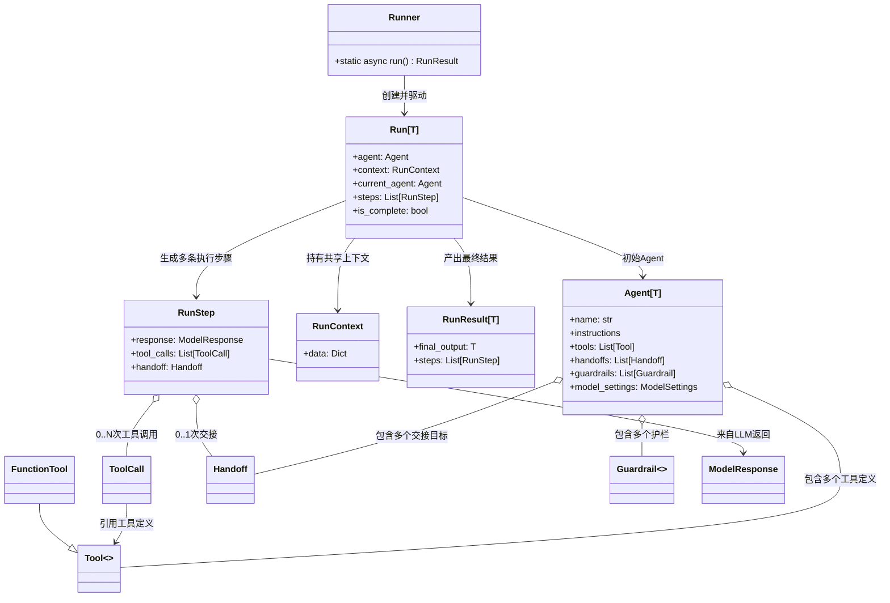
```mermaid
classDiagram
    class Agent["Agent[T]"]{
        +name: str
        +instructions
        +tools: List[Tool]
        +handoffs: List[Handoff]
        +guardrails: List[Guardrail]
        +model_settings: ModelSettings
    }

    class Runner["Runner"]{
        +static async run() RunResult
    }

    class Run["Run[T]"]{
        +agent: Agent
        +context: RunContext
        +current_agent: Agent
        +steps: List[RunStep]
        +is_complete: bool
    }

    class RunContext["RunContext"]{
        +data: Dict
    }

    class RunResult["RunResult[T]"]{
        +final_output: T
        +steps: List[RunStep]
    }

    class RunStep["RunStep"]{
        +response: ModelResponse
        +tool_calls: List[ToolCall]
        +handoff: Handoff
    }

    class Tool["Tool<<Abstract>>"]
    class FunctionTool["FunctionTool"]
    class ToolCall["ToolCall"]
    class Handoff["Handoff"]
    class Guardrail["Guardrail<<Abstract>>"]
    class ModelResponse["ModelResponse"]

    Runner --> Run : 创建并驱动
    Run --> Agent : 初始Agent
    Run --> RunContext : 持有共享上下文
    Run --> RunResult : 产出最终结果
    Run --> RunStep : 生成多条执行步骤

    Agent o-- Tool : 包含多个工具定义
    Agent o-- Handoff : 包含多个交接目标
    Agent o-- Guardrail : 包含多个护栏

    RunStep --> ModelResponse : 来自LLM返回
    RunStep o-- ToolCall : 0..N次工具调用
    RunStep o-- Handoff : 0..1次交接

    ToolCall --> Tool : 引用工具定义
    FunctionTool --|> Tool
```
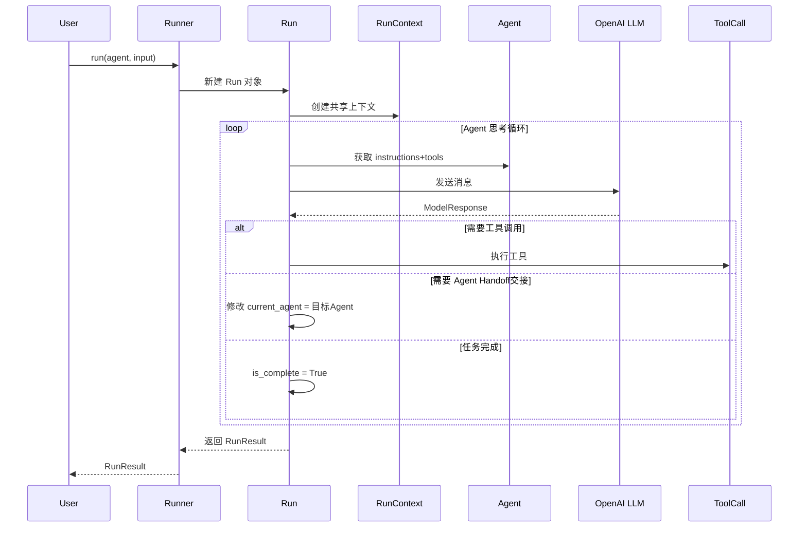
```mermaid
sequenceDiagram
    participant User
    participant Runner
    participant Run
    participant RunContext
    participant Agent
    participant OpenAI LLM

    User->>Runner: run(agent, input)
    Runner->>Run: 新建 Run 对象
    Run->>RunContext: 创建共享上下文
    loop Agent 思考循环
        Run->>Agent: 获取 instructions+tools
        Run->>OpenAI LLM: 发送消息
        OpenAI LLM-->>Run: ModelResponse
        alt 需要工具调用
            Run->>ToolCall: 执行工具
        else 需要 Agent Handoff交接
            Run->>Run: 修改 current_agent = 目标Agent
        else 任务完成
            Run->>Run: is_complete = True
        end
    end
    Run-->>Runner: 返回 RunResult
    Runner-->>User: RunResult   
```

```mermaid
classDiagram
    direction TB
%% ====================== 1.静态配置层 无状态模板 ======================
    class Agent["Agent[T]"]{
        +name: str
        +instructions: str
        +tools: List[Tool]
        +handoffs: List[Handoff]
        +guardrails: List[Guardrail]
        +model_settings: ModelSettings
    }
    class ModelSettings["ModelSettings"]{
        +temperature: float
        +max_tokens: int
    }

    class Tool["Tool<<Abstract>>"]
    class FunctionTool["FunctionTool"]
    class Handoff["Handoff"]
    class Guardrail["Guardrail<<Abstract>>"]

    FunctionTool --|> Tool
    Agent o-- Tool : 聚合 0..N
    Agent o-- Handoff : 聚合 0..N
    Agent o-- Guardrail : 聚合 0..N
    Agent *-- ModelSettings : 包含模型配置

%% ====================== 2.执行引擎层 ======================
    class Runner["Runner"]{
        +static async run() RunResult
    }
    class SessionRunner["SessionRunner"]{
        +static async run(session:SessionABC) RunResult
    }

%% ====================== 3.单次运行时对象 ======================
    class Run["Run[T]"]{
        +agent: Agent
        +context: RunContext
        +current_agent: Agent
        -_run_items: List[RunItem]
        +messages: List[TResponseInputItem]
        +steps: List[RunStep]
        +is_complete: bool
    }
    class RunContext["RunContext"]{
        +data: Dict[str, Any]
    }
    class RunStep["RunStep"]{
        +response: ModelResponse
        +tool_calls: List[ToolCall]
    }
    class ToolCall["ToolCall"]
    class ModelResponse["ModelResponse"]
    class RunResult["RunResult[T]"]{
        +final_output: T
        +steps: List[RunStep]
    }

%% 运行时对象关系
    Runner --> Run : 创建驱动无状态运行
    SessionRunner --> Run : 创建运行 + 载入会话历史
    Run --> RunContext : 持有共享上下文
    Run o-- RunStep : 生成多条执行步骤
    RunStep --> ModelResponse : 来自LLM返回
    RunStep o-- ToolCall : 0..N次工具调用
    ToolCall --> Tool : 引用工具定义
    Runner ..> RunResult : run() 返回执行结果

%% ====================== 4.RunItem 运行时内存条目(不可序列化) ======================
    class RunItem["RunItem<<Abstract>>"]
    class MessageRunItem["MessageRunItem"]
    class ToolCallRunItem["ToolCallRunItem"]
    class ToolOutputRunItem["ToolOutputRunItem"]
    class HandoffRunItem["HandoffRunItem"]

    MessageRunItem --|> RunItem
    ToolCallRunItem --|> RunItem
    ToolOutputRunItem --|> RunItem
    HandoffRunItem --|> RunItem

    ToolCallRunItem --> Tool
    HandoffRunItem --> Handoff
    Run *-- RunItem : 私有运行时条目队列

%% ====================== 5.TResponseInputItem 序列化存储条目 ======================
    class BaseItem["BaseItem<<Abstract>>"]
    class TResponseInputItem["TResponseInputItem ‹Union›"]
    class MessageItem["MessageItem"]
    class ToolCallItem["ToolCallItem"]
    class ToolOutputItem["ToolOutputItem"]
    class HandoffItem["HandoffItem"]

    MessageItem --|> BaseItem
    ToolCallItem --|> BaseItem
    ToolOutputItem --|> BaseItem
    HandoffItem --|> BaseItem
    TResponseInputItem ..> BaseItem : 联合所有条目子类

%% 核心双向转换关系：运行时对象 ⇋ 序列化数据
    MessageRunItem <--> MessageItem
    ToolCallRunItem <--> ToolCallItem
    ToolOutputRunItem <--> ToolOutputItem
    HandoffRunItem <--> HandoffItem

%% ====================== 6.Session会话记忆模块(新版架构，废弃Storage+Manager) ======================
    class SessionABC["SessionABC <<Protocol>>"]{
        +session_id: str
        +user_id: str
        +messages: List[TResponseInputItem]
        +metadata: Dict[str,Any]
    }
    class InMemorySession["InMemorySession"]
    class SQLiteSession["SQLiteSession"]
    class AsyncSQLiteSession["AsyncSQLiteSession"]
    class RedisSession["RedisSession"]
    class OpenAIConversationsSession["OpenAIConversationsSession"]
    class OpenAIResponsesCompactionAwareSession["OpenAIResponsesCompactionAwareSession<<Marker‑Interface>>"]
    class OpenAIResponsesCompactionSession["OpenAIResponsesCompactionSession"]{
        -underlying_session: SessionABC
    }

%% 所有会话实现顶层协议
    InMemorySession ..|> SessionABC
    SQLiteSession ..|> SessionABC
    AsyncSQLiteSession ..|> SessionABC
    RedisSession ..|> SessionABC
    OpenAIConversationsSession ..|> SessionABC
    OpenAIResponsesCompactionSession ..|> SessionABC
    OpenAIResponsesCompactionSession ..|> OpenAIResponsesCompactionAwareSession

%% 装饰器组合关系：压缩会话包装底层会话实例
    OpenAIResponsesCompactionSession *-- SessionABC
    SessionRunner --> SessionABC : 读写会话记忆
    SessionABC *-- TResponseInputItem : 持久化存储消息链

%% ====================== 7.Tracing链路追踪模块 ======================
    class TraceStorage["TraceStorage<<Abstract>>"]
    class Trace["Trace"]
    class TraceSpan["TraceSpan"]

    Trace *-- TraceSpan : 一条追踪包含多个跨度节点
    Trace --> TraceStorage : 落地追踪数据
```
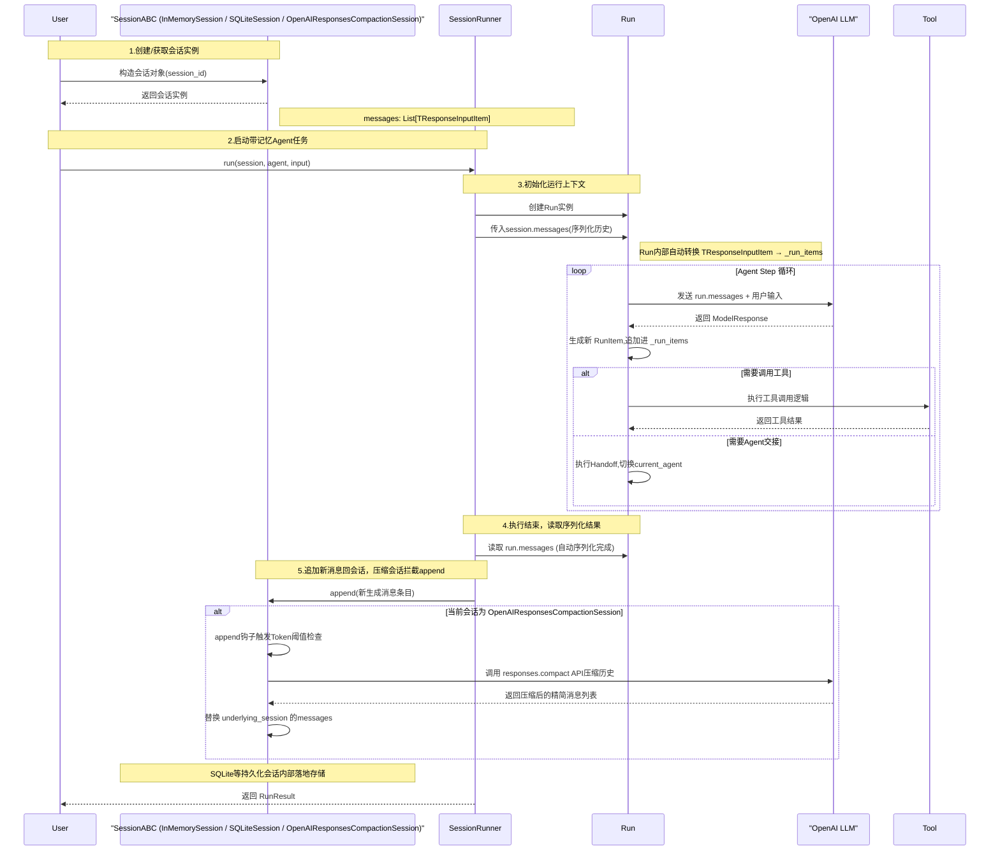
```mermaid
sequenceDiagram
    participant User
    participant SessionABC as "SessionABC (InMemorySession / SQLiteSession / OpenAIResponsesCompactionSession)"
    participant SessionRunner
    participant Run
    participant OpenAI_LLM as "OpenAI LLM"
    participant Tool

    Note over User,SessionABC: 1.创建/获取会话实例
    User->>SessionABC: 构造会话对象(session_id)
    SessionABC-->>User: 返回会话实例
    Note right of SessionABC: messages: List[TResponseInputItem]

    Note over User,SessionRunner: 2.启动带记忆Agent任务
    User->>SessionRunner: run(session, agent, input)

    Note over SessionRunner,Run: 3.初始化运行上下文
    SessionRunner->>Run: 创建Run实例
    SessionRunner->>Run: 传入session.messages(序列化历史)
    Note right of Run: Run内部自动转换 TResponseInputItem → _run_items

    loop Agent Step 循环
        Run->>OpenAI_LLM: 发送 run.messages + 用户输入
        OpenAI_LLM-->>Run: 返回 ModelResponse
        Run->>Run: 生成新 RunItem,追加进 _run_items

        alt 需要调用工具
            Run->>Tool: 执行工具调用逻辑
            Tool-->>Run: 返回工具结果
        else 需要Agent交接
            Run->>Run: 执行Handoff,切换current_agent
        end
    end

    Note over SessionRunner,Run: 4.执行结束，读取序列化结果
    SessionRunner->>Run: 读取 run.messages (自动序列化完成)

    Note over SessionRunner,SessionABC: 5.追加新消息回会话，压缩会话拦截append
    SessionRunner->>SessionABC: append(新生成消息条目)

    alt 当前会话为 OpenAIResponsesCompactionSession
        SessionABC->>SessionABC: append钩子触发Token阈值检查
        SessionABC->>OpenAI_LLM: 调用 responses.compact API压缩历史
        OpenAI_LLM-->>SessionABC: 返回压缩后的精简消息列表
        SessionABC->>SessionABC: 替换 underlying_session 的messages
    end

    Note over SessionABC,SessionABC: SQLite等持久化会话内部落地存储

    SessionRunner-->>User: 返回 RunResult
```
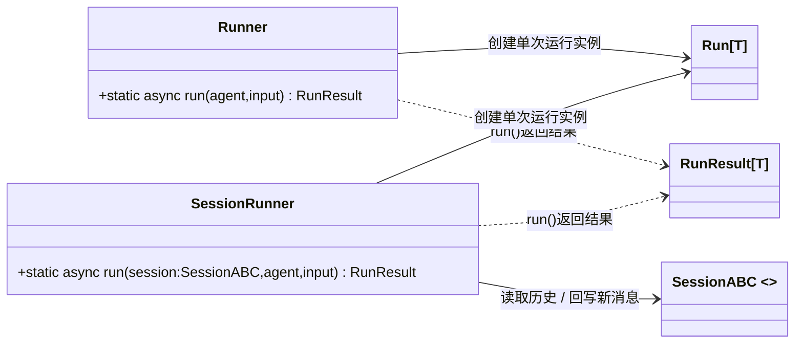
```mermaid
classDiagram
    direction LR
    class Runner{
        +static async run(agent,input) RunResult
    }
    class SessionRunner{
        +static async run(session:SessionABC,agent,input) RunResult
    }
    class Run["Run[T]"]
    class RunResult["RunResult[T]"]
    class SessionABC["SessionABC <<Protocol>>"]

    %% 关键：SessionRunner 不是 Runner 的子类！！只是独立的另一个执行入口
    Runner --> Run : 创建单次运行实例
    Runner ..> RunResult : run()返回结果

    SessionRunner --> Run : 创建单次运行实例
    SessionRunner --> SessionABC : 读取历史 / 回写新消息
    SessionRunner ..> RunResult : run()返回结果
```
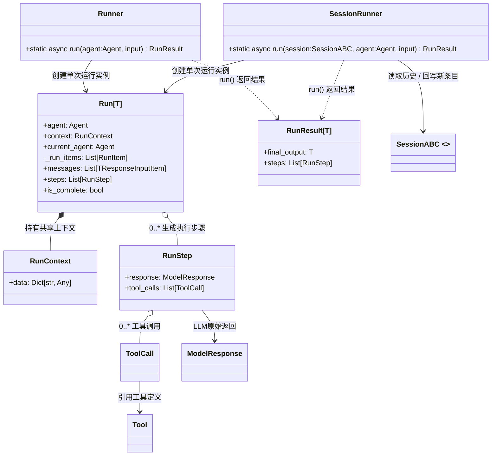
```mermaid
classDiagram
direction TB

%% ====================== 2.执行引擎层 ======================
class Runner["Runner"]{
+static async run(agent:Agent, input) RunResult
}
class SessionRunner["SessionRunner"]{
+static async run(session:SessionABC, agent:Agent, input) RunResult
}

%% ====================== 3.单次运行时对象 ======================
class Run["Run[T]"]{
+agent: Agent
        +context: RunContext
                  +current_agent: Agent
                                  -_run_items: List[RunItem]
                                               +messages: List[TResponseInputItem]
                                                          +steps: List[RunStep]
                                                                  +is_complete: bool
}
class RunContext["RunContext"]{
+data: Dict[str, Any]
}
class RunStep["RunStep"]{
+response: ModelResponse
           +tool_calls: List[ToolCall]
}
class ToolCall["ToolCall"]
class ModelResponse["ModelResponse"]
class RunResult["RunResult[T]"]{
+final_output: T
               +steps: List[RunStep]
}

%% ====================== 依赖协议（上下文） ======================
class SessionABC["SessionABC <<Protocol>>"]

%% ============ 关系连线（UML语义严格） ============
%% Runner 新建 Run，函数返回 RunResult
Runner --> Run : 创建单次运行实例
Runner ..> RunResult : run() 返回结果

%% SessionRunner 创建Run；读写会话；返回结果
SessionRunner --> Run : 创建单次运行实例
SessionRunner --> SessionABC : 读取历史 / 回写新条目
SessionRunner ..> RunResult : run() 返回结果

%% Run内部聚合关系
Run *-- RunContext : 持有共享上下文
Run o-- RunStep : 0..* 生成执行步骤

%% RunStep下属元素
RunStep --> ModelResponse : LLM原始返回
RunStep o-- ToolCall : 0..* 工具调用
ToolCall --> Tool : 引用工具定义
```
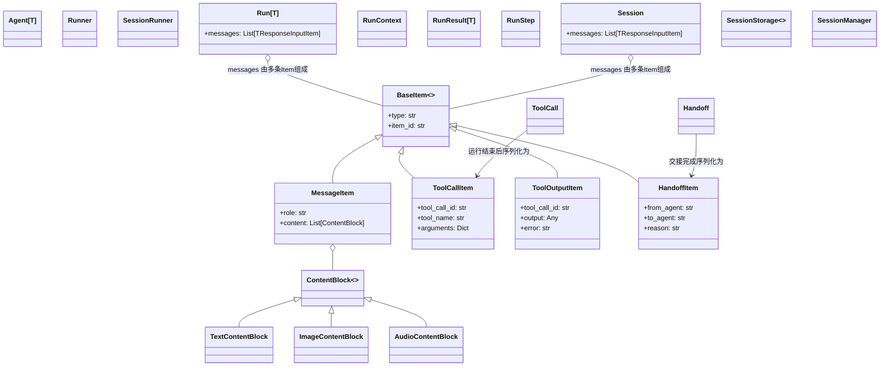
```mermaid
classDiagram
    %% ========== BaseItem & Item家族 ==========
    class BaseItem["BaseItem<<Abstract>>"]{
        +type: str
        +item_id: str
    }

    class MessageItem["MessageItem"]{
        +role: str
        +content: List[ContentBlock]
    }
    class ToolCallItem["ToolCallItem"]{
        +tool_call_id: str
        +tool_name: str
        +arguments: Dict
    }
    class ToolOutputItem["ToolOutputItem"]{
        +tool_call_id: str
        +output: Any
        +error: str
    }
    class HandoffItem["HandoffItem"]{
        +from_agent: str
        +to_agent: str
        +reason: str
    }

    class ContentBlock["ContentBlock<<Union>>"]
    class TextContentBlock
    class ImageContentBlock
    class AudioContentBlock

    BaseItem <|-- MessageItem
    BaseItem <|-- ToolCallItem
    BaseItem <|-- ToolOutputItem
    BaseItem <|-- HandoffItem

    ContentBlock <|-- TextContentBlock
    ContentBlock <|-- ImageContentBlock
    ContentBlock <|-- AudioContentBlock
    MessageItem o-- ContentBlock

    %% ========== 原有核心对象 ==========
    class Agent["Agent[T]"]
    class Runner["Runner"]
    class SessionRunner["SessionRunner"]
    class Run["Run[T]"]{
        +messages: List[TResponseInputItem]
    }
    class RunContext["RunContext"]
    class RunResult["RunResult[T]"]
    class RunStep["RunStep"]
    class ToolCall["ToolCall"]
    class Handoff["Handoff"]

    %% Session记忆存储
    class Session["Session"]{
        +messages: List[TResponseInputItem]
    }
    class SessionStorage["SessionStorage<<Abstract>>"]
    class SessionManager["SessionManager"]

    %% 关联关系
    Run o-- BaseItem : messages 由多条Item组成
    Session o-- BaseItem : messages 由多条Item组成

    ToolCall --> ToolCallItem : 运行结束后序列化为
    Handoff --> HandoffItem : 交接完成序列化为
```
1. 业务顶层（静态配置层，无状态）
   作用：定义 Agent 角色、能力、限制，可全局复用
- Agent：基础文本智能体模板
- SandboxAgent：沙箱文件/命令执行智能体
- RealtimeAgent：WebSocket实时语音智能体
- ModelSettings：LLM参数配置（温度、最大Token等）
- Tool（抽象）/ FunctionTool：工具定义（静态）
- Handoff：Agent交接规则定义（静态）
- Guardrail：输入输出护栏校验规则（静态）
2. 执行引擎层（调度入口）
- Runner：普通无状态运行入口
- SessionRunner：带持久记忆的运行入口
3. 单次运行时核心层（有状态、单次任务）
   一次 Run = 一次完整 Agent 对话任务生命周期
- Run：单次运行总容器
- RunContext：单次运行全局共享上下文（临时KV）
- RunStep：单轮LLM执行步骤
- ModelResponse：LLM原始返回结构体
- RunResult：单次运行最终结果
4. 运行时条目模型（RunItem 体系 —— 核心执行模型）
   特点：持有真实 Tool/Handoff 对象、不可序列化、仅内存运行
- RunItem（抽象基类）
- MessageRunItem：运行时消息
- ToolCallRunItem：运行时工具调用（含 Tool 实例）
- ToolOutputRunItem：运行时工具返回结果
- HandoffRunItem：运行时Agent交接（含 Handoff 实例）
5. 存储/传输条目模型（TResponseInputItem 体系 —— 持久化模型）
   特点：纯数据、可JSON序列化、用于API/Session存储
- BaseItem（抽象基类）
- TResponseInputItem：联合类型别名（4种Item的Union）
- MessageItem：对话消息存储项
- ToolCallItem：工具调用记录（仅工具名，无实例）
- ToolOutputItem：工具结果记录
- HandoffItem：Agent交接历史记录
6. 记忆存储层（Memory / Session 完整体系）
- Session：会话主体（存储完整 TResponseInputItem 消息链）
- SessionStorage（抽象）
- InMemorySessionStorage：内存存储
- SqliteSessionStorage：本地文件持久化
- RedisSessionStorage：分布式持久化
- SessionManager：会话管理层入口
7. 可观测追踪层
- Trace：追踪总链路
- TraceSpan：单步追踪跨度
- TraceStorage：追踪存储抽象

---
二、核心双向转换规则（全网最关键逻辑）
1. RunItem → TResponseInputItem（运行时 → 存储/API）
   丢失对象引用，降级为纯数据
- ToolCallRunItem.tool（对象实例） → ToolCallItem.tool_name（字符串）
- HandoffRunItem.handoff（对象实例） → HandoffItem.from/to_agent（名字）
2. TResponseInputItem → RunItem（存储 → 运行时）
   依靠当前Agent实例反向找回对象引用
- 根据 tool_name 从 agent.tools 匹配 Tool 实例
- 根据 agent 名称匹配 Handoff 配置

---
三、生命周期终极数据流（完整闭环无遗漏）
1. Session.messages(TResponseInputItem) 从磁盘/Redis加载历史记忆
2. 框架将 TResponseInputItem 批量转为 RunItem
3. 存入 Run._run_items（私有运行时列表）
4. LLM 推理、执行工具、触发交接，不断新增 RunItem
5. Run.messages 属性动态转换：RunItem → TResponseInputItem
6. 新 Item 写入 Session.messages，持久化落库


```mermaid
classDiagram
    direction TB

%% ========== 静态配置层 ==========
    class Agent
    class ModelSettings
    class Tool
    class FunctionTool
    class Handoff
    class Guardrail

    FunctionTool --|> Tool
    Agent *-- ModelSettings
    Agent *-- Tool
    Agent *-- Handoff
    Agent *-- Guardrail

%% ========== 执行引擎层 ==========
    class Runner
    class SessionRunner

%% ========== 运行时核心层 ==========
    class Run
    class RunContext
    class RunStep
    class ModelResponse
    class RunResult
    class SessionABC["SessionABC <<Protocol>>"]

    Runner --> Run
    SessionRunner --> Run
    SessionRunner --> SessionABC : 依赖会话协议

    Run *-- RunContext
    Run *-- RunStep
    RunStep *-- ModelResponse
    Run *-- RunResult

%% ========== RunItem 完整继承树 ==========
    class RunItem
    class MessageRunItem
    class ToolCallRunItem
    class ToolOutputRunItem
    class HandoffRunItem

    MessageRunItem --|> RunItem
    ToolCallRunItem --|> RunItem
    ToolOutputRunItem --|> RunItem
    HandoffRunItem --|> RunItem

    ToolCallRunItem --> Tool
    HandoffRunItem --> Handoff
    Run *-- RunItem

%% ========== 存储 Item 完整继承树 ==========
    class BaseItem
    class TResponseInputItem
    class MessageItem
    class ToolCallItem
    class ToolOutputItem
    class HandoffItem

    MessageItem --|> BaseItem
    ToolCallItem --|> BaseItem
    ToolOutputItem --|> BaseItem
    HandoffItem --|> BaseItem

%% RunItem ↔ 存储Item 双向一一映射
    MessageRunItem <--> MessageItem
    ToolCallRunItem <--> ToolCallItem
    ToolOutputRunItem <--> ToolOutputItem
    HandoffRunItem <--> HandoffItem

    Run .. TResponseInputItem

%% ========== 【修复补齐：完整SessionABC实现层，无遗漏】 ==========
    class InMemorySession
    class SQLiteSession
    class AsyncSQLiteSession
    class RedisSession
    class SQLAlchemySession
    class MongoDBSession
    class OpenAIConversationsSession
    class OpenAIResponsesCompactionAwareSession["OpenAIResponsesCompactionAwareSession <<Marker‑Interface>>"]
    class OpenAIResponsesCompactionSession

%% 所有存储会话全部实现顶层协议 SessionABC
    InMemorySession ..|> SessionABC
    SQLiteSession ..|> SessionABC
    AsyncSQLiteSession ..|> SessionABC
    RedisSession ..|> SessionABC
    SQLAlchemySession ..|> SessionABC
    MongoDBSession ..|> SessionABC
    OpenAIConversationsSession ..|> SessionABC

%% 压缩会话：既是SessionABC，同时实现标记接口
    OpenAIResponsesCompactionSession ..|> SessionABC
    OpenAIResponsesCompactionSession ..|> OpenAIResponsesCompactionAwareSession

%% 【核心包装器组合关系】压缩会话持有底层会话
    OpenAIResponsesCompactionSession *-- SessionABC : underlying_session(被包装会话)

%% 会话内部存储消息条目
    SessionABC *-- TResponseInputItem

%% ========== 链路追踪体系 ==========
    class Trace
    class TraceSpan
    class TraceStorage

    Trace *-- TraceSpan
    Trace --> TraceStorage
```
# 1、RunItem、BaseItem 分别存储在哪

## RunItem（运行时对象，内存执行模型，不可序列化）

- **存放位置：`Run` 的私有字段 `‑_run_items: List[RunItem]`**
- 生命周期：**仅本次 Run 执行期间存活，执行结束后 Run 对象销毁就消失**
- 拥有子类：`MessageRunItem / ToolCallRunItem / ToolOutputRunItem / HandoffRunItem`
- 特点：对象内部**持有真实 Tool、Handoff 实例引用，可以执行逻辑**

>
> `Run.messages` 是一个**只读计算属性（getter）**
>
>
> ```
> Run.messages = [ RunItem → TResponseInputItem 转换后的列表 ]
> ```
>
>
> 👉 你**不能修改 Run.messages**；真正的数据源永远是 `_run_items`

## BaseItem（序列化数据模型，可持久化）

- `TResponseInputItem` 是所有序列化条目的联合类型；`BaseItem` 是抽象父类
- **存放位置：`SessionABC.messages: List[TResponseInputItem]`**
- 存储介质：内存 / SQLite / Redis 等会话持久化层
- 子类：`MessageItem / ToolCallItem / ToolOutputItem / HandoffItem`
- 特点：**纯数据，没有工具实例，不能执行任何逻辑，仅用于网络传输、存储**

## 双向转换边界

```
SessionABC(BaseItem/TResponseInputItem) → 【SessionRunner传给Run】 → Run内部转成 RunItem → _run_items
RunItem →（Run.messages getter自动转换）→ TResponseInputItem → SessionRunner读取 → SessionABC.append()
```

# 2、Run 内部 LLM‑Loop（Agent Step 循环）到底用什么数据发给大模型

**发送给 OpenAI LLM 的，永远是序列化数据 `TResponseInputItem`**，而不是 RunItem 对象。

执行流程：

1. 每一轮循环开始
2. Run 读取自身 `.messages`（getter 将 `_run_items` 实时转为 `List[TResponseInputItem]`）
3. 将这份序列化条目数组打包，作为上下文发给 LLM
4. LLM 返回 `ModelResponse`
5. Run **解析响应，新建对应的 RunItem，追加进私有列表 `_run_items`**

>
> 一句话：
>
>
> - 内存执行、工具操作、Agent 切换：用 **RunItem**
> - 发给 LLM 的请求报文：用 **TResponseInputItem (BaseItem 子类)**

# 3、SessionRunner 写入会话 (SessionABC.append) 的准确时机

## ✅ 官方真实写入时机

**等整个 Run 的完整 Agent‑Step 循环全部执行完毕，Run 已经执行完成之后，才一次性写入。**

时序节点：

1. SessionRunner 启动，创建 Run，载入历史消息
2. Run 进入循环，反复和 LLM、工具交互
    - 👉 **循环中途不会往 Session 写任何东西！会话不会实时更新**
3. Run 执行完毕，退出循环
4. SessionRunner 读取 `Run.messages` 获取全部新增序列化条目
5. **SessionRunner → SessionABC.append()**，追加本轮所有新产生的历史
6. 如果会话是 `OpenAIResponsesCompactionSession`，append 钩子触发 token 检查、上下文压缩

>
> ❌ 误区：并不是每一步 step 结束就保存；**一轮 SessionRunner.run () 对应一次写入**

# 4、简化流程图（文字版）

```
User → SessionRunner.run(session,agent,input)
        ↓
        创建Run，加载历史TResponseInputItem → Run内部转为RunItem存入 _run_items
        ↓
        loop Step:
            Run.messages(getter) → TResponseInputItem → send to LLM
            LLM → ModelResponse → 生成新RunItem → push _run_items
        end loop
        ↓
        Run执行结束
        ↓
        SessionRunner读取Run.messages，拿到新增条目
        ↓
        SessionRunner调用 SessionABC.append(新条目)   ←【唯一写入时机】
        ↓
        可选：CompactionSession触发压缩
        ↓
        返回RunResult给User
```
# 一、先逐条判断你的理解，标出对错

>
> SESSIONRUNNER 只是封装了读写 session 的方法，TResponseInputItem 列表不在 sessionrunner 中
> ✅ **完全正确**
> `SessionRunner` 只是调度器，**不存储任何对话消息**，跑完即释放；它只负责：从 Session 读出历史 → 传给 Run → Run 跑完之后，把新消息写回 Session。

>
> 而是在 run 中，run 既有 BaseItem 也有 RunItem
> ❌ **这里是最大误区！Run 并不保存两份独立列表**

- Run **唯一持久存储的数据：私有字段 `_run_items: List[RunItem]`**（运行时对象，一直保存在 Run 对象生命周期内）
- `run.messages` 只是**只读 Getter（计算属性）**
  每次你访问 `.messages`，它会**实时遍历 `_run_items`，调用每个 RunItem 的 `.to_input_item()` 方法，临时生成一份 `List[TResponseInputItem]`（BaseItem）**
- 这份生成出来的 BaseItem 列表**不会存到 Run 里面**，用完就丢弃，没有副本留存。

>
> 运行期间只追加 BaseItem 和 RunItem？
> ❌ **循环执行过程，只追加 RunItem！！完全不会手动追加 BaseItem**
> LLM 返回结果后，Run 只会新建 `RunItem`，`append(_run_items)`；BaseItem 不会被追加保存。

>
> 发送给大模型也用的 BaseItem
> ✅ **完全正确**
> OpenAI Responses API 只能接收纯 JSON 序列化结构（也就是 BaseItem / `TResponseInputItem`），不能发送内存对象 RunItem。

# 二、核心灵魂问题：既然发给 LLM 只用 BaseItem，RunItem 到底干什么？

一句话结论：
**BaseItem = 事后记录、序列化报文、存储用的纯数据；RunItem = 执行引擎干活时真正操作、可执行、带对象引用的运行时实体。**

## 举一个工具调用最直观例子

### ToolCallItem（BaseItem，纯数据）

只保存静态信息：

- `item_id`
- 工具名称 `tool_name`
- 参数 `arguments`

>
> **没有任何执行能力！没有 Tool 对象引用，不能调用函数。仅仅一条日志记录。**

### ToolCallRunItem（RunItem，运行时对象）

除了上面所有数据，额外携带：

1. **对原始 `Tool` 对象实例的直接引用**
2. 工具执行状态标记（未执行 / 执行中 / 成功 / 失败）
3. 执行返回结果缓存、异常报错堆栈
4. `.execute()` 方法，Agent 引擎就是调用这个方法去运行工具逻辑

👉 **真正干活执行工具的是 RunItem，不是 BaseItem。BaseItem 只是干完活之后，用来存进数据库的 “记账凭证”。**

同理 Handoff：

- `HandoffItem`：仅记录发生过一次 Agent 交接（纯日志）
- `HandoffRunItem`：持有目标 Agent 实例引用，Run 依靠它切换 `current_agent`

## 两套模型分工对照表

表格

| 对象 | RunItem（内存运行时） | BaseItem / TResponseInputItem（序列化数据） |
| --- | --- | --- |
| 存储位置 | Run._run_items（唯一数据源） | SessionABC.messages |
| 生命周期 | 和 Run 绑定，单次任务结束销毁 | 持久保存在会话，可以跨多次 Run 调用 |
| 是否带对象引用 | ✅ 持有 Tool / Handoff / Agent 实例引用 | ❌纯 JSON 数据，无任何对象引用 |
| 能否执行工具、切换 Agent | ✅可以执行逻辑 | ❌不能执行任何操作 |
| 发给 LLM | ❌禁止直接发送 | ✅唯一可发送给 OpenAI 的报文格式 |
| 用途 | Agent 内部 Step 循环，执行全部业务逻辑 | API 传输、会话持久化保存 |

# 三、完整数据流全链路（一步一步）

```
1. User → SessionRunner.run(session, agent, input)
    SessionRunner读取 SessionABC.messages → List[TResponseInputItem] (BaseItem)

2. 创建 Run 对象
    Run构造函数遍历传入的BaseItem列表
        每个BaseItem → .to_run_item() →生成RunItem
        全部存入私有 _run_items
    ✅【原始BaseItem列表到此被丢弃！Run不会保存它】

3. LLM Step循环开始（循环全程）
    ├─访问 run.messages → getter遍历 _run_items，临时转换成 BaseItem列表
    ├─临时生成的BaseItem报文发送 OpenAI LLM
    ├─LLM返回 ModelResponse
    └─Run解析响应，新建 RunItem，append进 _run_items
    ❗循环全程：**只新增RunItem，不会生成、保存BaseItem**

4. 循环结束，Run执行完成

5. SessionRunner读取 run.messages
    getter再次把全部 _run_items →转回 BaseItem(TResponseInputItem)
    SessionRunner提取本轮新增出来的消息条目
    SessionRunner调用 session.append(新BaseItem条目)
    写入会话持久化存储
```

# 四、一张图理清边界

```
SessionABC（磁盘/内存存储）
    ↓  BaseItem(TResponseInputItem)
SessionRunner（调度转发，无消息缓存）
    ↓ 传给Run构造器
Run
 └─唯一数据源： _run_items: List[RunItem]  ←【运行时干活本体】
        ↓(getter实时转换)
    临时生成 BaseItem →发给LLM（用完扔掉）
```

# 五、最核心的设计目的，为什么不只用一套对象？

1. **序列化隔离**：运行时不能把带 Tool 对象引用的 RunItem 直接存数据库；对象引用无法 JSON 序列化。
2. **状态隔离**：工具调用中途产生的临时运行状态（异常、执行进度）**不需要持久化到会话历史**，跑完 Run 就丢弃。
3. **解耦**：持久化历史日志（BaseItem）和 Agent 执行引擎（RunItem）可以独立演化修改。
   在 `Run` 对象**内部，并不存在一份独立、持久存放的 `List[TResponseInputItem]` 数组**。
   `TResponseInputItem` 只是 **RunItem 的实时投影（计算视图）**。

## 1、Run 的真实存储结构

```
Run
└──‑_run_items: List[RunItem]   ✅ 唯一真实数据源（私有字段）
```

`run.messages` 是一个只读属性（getter），伪代码逻辑：

```
@property
def messages(self) -> list[TResponseInputItem]:
    return [item.to_input_item() for item in self._run_items]
```

- 每次访问 `.messages`，都会**遍历一遍 `_run_items`，现场调用转换函数生成全新的 TResponseInputItem 列表**
- 生成出来的列表用完之后没有保存，属于临时对象；下次再访问又重新生成一份新的
- Run 从来不会把这份投影结果存起来，没有 `self._messages: List[TResponseInputItem]` 备份字段

>
> 投影 = 不存储原始副本，需要的时候由源数据实时算出视图

## 2、双向转换完整边界

### 方向 1：会话加载 → Run（初始化阶段）

```
SessionABC.messages (持久化的 TResponseInputItem)
    → Run 构造函数遍历
    → 每个 TResponseInputItem.to_run_item()
    → 生成 RunItem，存入 _run_items
👉 到此，原始传入的 TResponseInputItem 列表就被丢弃了。Run不再持有它。
```

### 方向 2：Run → LLM 请求（循环每一轮）

```
访问 run.messages
    → 投影：_run_items →实时生成 TResponseInputItem
    → 把这份临时列表发送给 OpenAI LLM
👉 发送完毕临时列表直接抛弃，Run内部丝毫没有新增BaseItem副本。
👉 执行完LLM，只追加 RunItem 进 _run_items。
```

### 方向 3：执行结束 → 回写 Session

```
SessionRunner 读取 run.messages
    → 再次投影生成 TResponseInputItem 列表
    → 筛选本轮新增条目
    → session.append(新的 TResponseInputItem)
👉 写入会话持久层，保存下来。
```

## 3、两套对象生命周期对比

表格

| 实体 | 是否真实存储在 Run | 性质 |
| --- | --- | --- |
| `_run_items: List[RunItem]` | ✅ 永久保存于 Run 生命周期内 | 数据源本体 |
| `messages → List[TResponseInputItem]` | ❌ 无存储，实时计算投影视图 | 临时视图，用完即弃 |

## 4、一句话澄清最容易踩坑的误区

>
> “Run 里面同时保存 RunItem 和 TResponseInputItem 两份消息列表”
> ❌ 错误。
> “Run 只存 RunItem；TResponseInputItem 是访问 messages 属性时，临时投影生成出来的视图。”
> ✅ 正确。
# 1、RunItem 的变更：只加不减？

## Run 的生命周期内（单次 `SessionRunner.run()` / `Runner.run()`）

✅ **`_run_items` 列表是单向追加、只增不减，不会删除、不会修改历史旧条目**
Agent 每一步产生的事件（LLM 回复、工具调用、工具返回、agent 交接）都会新建一个 RunItem，`append` 进列表。

>
> 单次 Run 执行期间，**Run 本身永远不会主动删减 `_run_items`**。
> Run 对象内部没有 “裁剪历史、压缩” 的能力。

>
> ⚠️关键点：**上下文压缩不会修改当前正在运行的 Run 对象和它的 `_run_items`！**
> RunItem 存活范围仅限**本次单次运行**；压缩发生在**会话 Session 层，两次 Run 任务之间**。

---

# 2、OpenAIResponsesCompactionSession 压缩完整流程（两次 Run 间隙）

## 压缩发生时机

>
> 在**上一轮 SessionRunner.run () 已经完全结束**，新的一轮 run () 还没有启动之前。

### 完整步骤

1. 第一轮 Run 执行完毕，SessionRunner 调用 `session.append(一批新的 TResponseInputItem)`
2. `OpenAIResponsesCompactionSession` 是装饰器（wrapper），拦截 append 调用
3. 把底层被包装会话 `underlying_session.messages`（类型：`List[TResponseInputItem]`）全部取出
4. 统计全部消息 Token 数量，如果超过阈值
5. 调用 OpenAI 接口 `responses.compact`
    - 请求入参：当前全部历史 `List[TResponseInputItem]`
    - LLM 返回：**压缩精简后的新的 `List[TResponseInputItem]`**
6. CompactionSession 用这份压缩后的条目，**完全替换 underlying_session.messages**
7. 旧的长历史被丢弃，会话现在保存精简后的序列化条目

>
> 💡非常重要的隔离边界
>
>
> - 压缩**只修改 SessionABC 里持久化的 `TResponseInputItem`（BaseItem 序列化数据）**
> - **不会、也不可能修改上一次 Run 里面已经销毁的 RunItem；RunItem 早就随着 Run 对象生命周期结束被释放了**
> - 压缩产出物永远是序列化条目，**不会生成任何 RunItem**

当你下一次调用 `SessionRunner.run(session,...)`：

- Session 读出**已经压缩好的 `TResponseInputItem`**
- Run 构造器再把它们反向转换生成一批全新的 RunItem，放入新 Run 的`_run_items`

---

# 3、RunItem 全部官方子类

```
RunItem (抽象基类 Abstract)
├─ MessageRunItem        # 用户消息 / 助手消息
├─ ToolCallRunItem       # 发起一次工具调用
├─ ToolOutputRunItem     # 工具返回结果
└─ HandoffRunItem        # Agent交接事件
```

一共 4 个子类，没有别的。

# 4、压缩之后生成的 item 是什么类型？

压缩接口 `responses.compact` 返回的对象，**仍然是序列化层条目：`TResponseInputItem`（BaseItem 子类）**
类型只能是：

- `MessageItem`（最常见，压缩后的摘要助手消息）

>
> 压缩不会产出 ToolCallItem / ToolOutputItem / HandoffItem，压缩逻辑一般会把过往一长串工具交互合并成一条文字摘要消息。

---

# 5、分层总结表

表格

| 对象 | RunItem | TResponseInputItem(BaseItem) |
| --- | --- | --- |
| 是否会被压缩直接修改 | ❌不可能。压缩碰不到 RunItem | ✅压缩操作的目标对象 |
| 生命周期 | 单次 Run 运行期间，执行结束销毁 | 持久保存在 Session，可以跨多次 Run，可被压缩裁剪替换 |
| 能否删减历史 | Run 内部：只追加，不删减 | Session 层：压缩可以整体替换历史列表 |
| 压缩输出产物 | 不会生成 RunItem | 生成新的 TResponseInputItem |

# 6、数据流简图展示压缩边界

```
第一轮 Run( _run_items 只追加 )
      ↓结束
SessionRunner.append → CompactionSession
      ↓token超限
responses.compact → 返回压缩后 List[TResponseInputItem]
      ↓替换底层会话消息
underlying_session.messages = 压缩后的精简条目

——————分割线（两次任务之间）——————

第二轮 SessionRunner.run()
        ↓
        读取压缩后的TResponseInputItem → 新建一批RunItem存入新Run._run_items
```
## 5、对应到时序图上需要修改的点

1. 删除所有描述「Run 内部保存 BaseItem 列表」的文字
2. 发给 LLM 那一步标注清楚：**由_run_items 实时投影生成 TResponseInputItem**
3. Run 执行过程循环里，**只追加 RunItem**，没有追加 BaseItem 动作。
# 示例：压缩前后 Session 中 `messages`（items）的变化

## 👉 压缩前（session 存储的数据）

`session.get_items()` 返回 7 条序列化条目 `List[TResponseInputItem]`

```
[
  {"role":"user","content":"写一个快速排序"},
  {"role":"assistant","content":"好的，我开始生成代码"},
  {"type":"tool_call","tool_name":"code_exec","arguments":{"code":"def quicksort..."}},
  {"type":"tool_output","tool_name":"code_exec","content":"代码报错：索引越界"},
  {"role":"assistant","content":"发现越界bug，我修改边界条件"},
  {"type":"tool_call","tool_name":"code_exec","arguments":{"code":"def quicksort(...) 修正版"}},
  {"type":"tool_output","tool_name":"code_exec","content":"执行成功，排序结果 [1,3,5]"}
]
```

7 条明细，包含**多轮工具调用 + 工具返回的完整轨迹**。

此时：

- 这些明细全部保存在底层会话（InMemorySession / SQLiteSession）
- 如果你现在启动一次新的 `Runner.run(session=...)`，Run 构造器会把上面 7 条全部转回 7 个 RunItem 放进 `_run_items`。

## 触发压缩条件

本轮任务跑完，`Runner` 调用 `session.add_items([新追加的条目])`
`OpenAIResponsesCompactionSession` 判断达到触发阈值（条目数量≥10 /token 超限）→ 执行压缩。

## 👉 压缩之后（session 存储的数据）

`session.get_items()` 现在**只剩下 1‑2 条摘要消息**，原来 7 条明细全部消失：

```
[
  {
    "role": "assistant",
    "content": "历史摘要：用户要求实现快速排序，第一次代码执行出现索引越界错误，修复边界条件后代码运行成功，得到排序结果 [1,3,5]。"
  }
]
```

✅ 现在 Session 里面**不再存有那两次 tool_call /tool_output 的明细记录**。
明细已经被丢弃。

# 3 个非常关键的后果

1. **下一次新 Run 启动时，你再也拿不到之前工具交互明细**
    - Run 只能读到那条摘要消息，生成一个 `MessageRunItem`
    - **没有任何 ToolCallRunItem、ToolOutputRunItem**
    - Agent 失去精确的历史工具交互细节，只能依靠 LLM 的摘要文本记忆。
2. **压缩只会修改 Session 持久层，不会改变刚刚结束的 Run**

```
Run（已经跑完，即将被垃圾回收）→ _run_items：7条完整RunItem（明细还在内存）
    ↓ Run对象销毁后就没了
Session → 被压缩成1条摘要（明细永久丢失）
```

Run 结束之后内存释放，你如果没有自己把 RunItem 持久化到别的日志库，明细轨迹就彻底丢失。

---

## 8. Memory/Session 记忆系统

### 8.0 双重 Session 的区别与边界

在 OpenAI Agents SDK 中存在两种完全不同的 “Session” 概念，理解它们的区别与生命周期边界对于理清状态流和记忆提取至关重要：

| 维度 | **Conversation Session** (对话会话) | **Sandbox Session** (沙箱会话) |
| :--- | :--- | :--- |
| **所属模块** | `memory/session.py` (及各类 Session 后端) | `sandbox/session/` (及 Docker/Cloudflare 容器后端) |
| **生命周期** | **长生命周期 (Long-lived)**<br/>在数据库中永久存在，支持在未来的 `Runner.run` 中重复加载。 | **短生命周期 (Run-scoped)**<br/>随单次 `Runner.run` 的拉起而创建，任务结束时被物理销毁。 |
| **持久化内容** | 对话消息、大模型的 ToolCall 事件以及工具运行输出历史（`TResponseInputItem` 列表）。 | 沙箱内的磁盘文件、临时运行日志（Rollout JSONL 文件）、已加载的 Skills。 |
| **何时关闭** | 基本上没有所谓的物理“关闭”。单次 Run 结束时，会将数据 Flush 进 SQLite/Redis，但会话数据不会被抹除，可以被后续运行再次开启。 | 当本次 `Runner.run()` 执行完毕（无论是正常返回最终结果、还是异常退出、或是超出轮次限制）时，该沙箱容器会立即被物理关闭并销毁。 |
| **与两阶段 Memory 的关系** | 不直接参与。但在本次运行退出前，可能会触发 `run_compaction()` 对历史消息进行 Token 压缩。 | **两阶段 Memory 提取的唯一触发器**。在 Sandbox Session 销毁前的一刻，触发 `pre_stop_hook`，拉起 Phase 1 & 2 进行记忆提取和整合。 |
| **关闭后还能再次开启吗** | **能**。通过传入相同的 `session_id` 即可重新加载该会话历史。 | **不能**。实例被销毁后无法再次唤醒。下次运行将新建一个全新的沙箱实例，但该实例会读取上一次由 Phase 2 整合好的 `memory_summary.md` 记忆文件。 |

### 8.1 设计架构

OpenAI Agents SDK 的 Session 系统采用 **Protocol 模式**，定义最小接口，支持多后端：

```
┌─────────────────────────────────────────────────────┐
│          Session Protocol (session.py)                │
│  session_id: str                                     │
│  session_settings: SessionSettings | None            │
│  get_items(limit?) → list[TResponseInputItem]        │
│  add_items(items) → None                             │
│  pop_item() → TResponseInputItem | None              │
│  clear_session() → None                              │
└──────────────────┬──────────────────────────────────┘
                   ↓ 实现
┌──────────┬──────────────┬────────────────────────────┐
│ SQLite   │ OpenAI Conv. │ OpenAI Responses Compaction │
│ Session  │ Session      │ Session                    │
└──────────┴──────────────┴────────────────────────────┘
       ↓ 扩展后端 (extensions/memory/)
┌──────────┬───────────┬───────────┬──────────┬────────┐
│ Redis    │ MongoDB   │ SQLAlchemy│ Dapr     │ Async  │
│ Session  │ Session   │ Session   │ Session  │ SQLite │
└──────────┴───────────┴───────────┴──────────┴────────┘
```

### 8.2 Session Protocol

```python
@runtime_checkable
class Session(Protocol):
    session_id: str
    session_settings: SessionSettings | None = None

    async def get_items(self, limit: int | None = None
                       ) -> list[TResponseInputItem]: ...
    async def add_items(self, items: list[TResponseInputItem]) -> None: ...
    async def pop_item(self) -> TResponseInputItem | None: ...
    async def clear_session(self) -> None: ...
```

### 8.3 Session 读写时机

```
┌─────────────────────────────────────────────────────────┐
│  Runner.run(agent, input, session=my_session)            │
│                                                         │
│  ┌─────────── 读取阶段 ──────────────────────┐           │
│  │ prepare_input_with_session()              │           │
│  │ 1. session.get_items(limit) → 历史       │           │
│  │ 2. 合并: history + new_input              │           │
│  │ 3. 如有 session_input_callback:           │           │
│  │    callback(history, new_input) → merged  │           │
│  │ 4. 去重: deduplicate_input_items          │           │
│  │ 5. 规范化: normalize_input_items_for_api  │           │
│  │ 6. 分离: items_to_save (仅新增部分)       │           │
│  └───────────────┬───────────────────────────┘           │
│                  ↓                                       │
│  ┌─────────── 保存阶段（每轮 Turn 结束后）─────┐         │
│  │ save_result_to_session()                    │         │
│  │ 1. 收集新产生的 RunItems                    │         │
│  │ 2. 转换为 TResponseInputItem               │         │
│  │ 3. session.add_items(new_items)             │         │
│  │ 4. 如果支持 compaction:                     │         │
│  │    session.run_compaction(args)             │         │
│  └─────────────────────────────────────────────┘         │
│                                                         │
│  ┌─────────── 回滚机制 ──────────────────────┐           │
│  │ rewind_session_items()                    │           │
│  │ • 当 Guardrail 触发时回滚已保存的 items   │           │
│  │ • 逐条 session.pop_item() 撤回            │           │
│  └───────────────────────────────────────────┘           │
└─────────────────────────────────────────────────────────┘
```

### 8.4 SQLiteSession 实现细节

```python
class SQLiteSession(SessionABC):
    def __init__(self, session_id: str, db_path: str | Path = "sessions.db"):
        # 建表: sessions(session_id, item_order, item_data)
        # 使用 aiosqlite 异步操作

    async def get_items(self, limit=None):
        # SELECT item_data FROM sessions
        # WHERE session_id = ? ORDER BY item_order ASC
        # LIMIT ? (if limit)

    async def add_items(self, items):
        # INSERT INTO sessions (session_id, item_order, item_data)
        # item_order 递增

    async def pop_item(self):
        # SELECT + DELETE 最后一条

    async def clear_session(self):
        # DELETE FROM sessions WHERE session_id = ?
```

### 8.5 OpenAI Responses Compaction Session

这是一个支持 **自动压缩** 的 Session 实现：

```python
class OpenAIResponsesCompactionSession(SessionABC):
    """当上下文过长时自动调用 OpenAI API 进行压缩。"""

    async def run_compaction(self, args=None):
        # 检查是否达到压缩阈值
        # 调用 OpenAI Responses API 的 compaction 功能
        # 用压缩后的内容替换原有历史
        # 模式: "previous_response_id" | "input" | "auto"
```
### 8.6 与 OpenHarness/Hermes 的记忆加载机制对比

#### **OpenHarness: 启发式搜索 + 按需加载**

**从哪加载？**
```
{project_dir}/.openharness/memory/
├── MEMORY.md          # 主索引文件（入口点）
├── topics/            # 主题记忆文件
│   ├── auth.md
│   ├── deployment.md
│   └── ...
└── sessions/          # 会话归档
```

**如何加载？**

**Step 1: 搜索相关记忆** (`find_relevant_memories`)
```python
# src/openharness/memory/search.py
def find_relevant_memories(query: str, cwd: str, max_results: int = 5):
    """
    通过关键词匹配和加权评分检索相关记忆
    
    算法:
    1. 对查询分词 (tokenize)
    2. 遍历所有记忆文件
    3. 计算相关性得分:
       - Metadata (标题+描述) 命中: 权重 2x
       - Body (正文) 命中: 权重 1x
    4. 按得分降序排序，返回 top-5
    """
    tokens = _tokenize(query)
    scored = []
    for header in scan_memory_files(cwd, max_files=100):
        meta = f"{header.title} {header.description}".lower()
        body = header.body_preview.lower()
        
        meta_hits = sum(1 for t in tokens if t in meta)
        body_hits = sum(1 for t in tokens if t in body)
        score = meta_hits * 2.0 + body_hits
        
        if score > 0:
            scored.append((score, header))
    
    scored.sort(key=lambda item: (-item[0], -item[1].modified_at))
    return [header for _, header in scored[:max_results]]
```

**Step 2: 加载入口点文件** (`load_memory_prompt`)
```python
# src/openharness/memory/memdir.py
def load_memory_prompt(cwd: str | Path):
    """
    将 MEMORY.md 内容注入系统 Prompt
    
    只加载 MEMORY.md（主索引），不加载全部主题文件
    Agent 可以根据需要自行读取 topics/ 下的具体文件
    """
    memory_dir = get_project_memory_dir(cwd)
    entrypoint = get_memory_entrypoint(cwd)  # MEMORY.md
    
    lines = [
        "# Memory",
        f"- Persistent memory directory: {memory_dir}",
        "- Use this directory to store durable project context",
        "",
        *MEMORY_POLICY_LINES,
    ]
    
    if entrypoint.exists():
        raw = entrypoint.read_text(encoding="utf-8")
        view = truncate_entrypoint_content(raw, max_lines=200, max_bytes=MAX_ENTRYPOINT_BYTES)
        content = view.content.strip()
        if content:
            lines.extend(["", "## MEMORY.md", "```md", content, "```"])
    
    return "\n".join(lines)
```

---

#### **Hermes Agent: 全量预取 + 冻结快照**

**从哪加载？**
```
~/.hermes/memory/
├── MEMORY.md          # 通用记忆（Agent 个人笔记）
└── USER.md            # 用户画像（who the user is）
```

**如何加载？**

**Step 1: Session 启动时加载** (`load_from_disk`)
```python
# tools/memory_tool.py
class MemoryStore:
    def __init__(self, memory_char_limit=2200, user_char_limit=1375):
        self.memory_entries: List[str] = []
        self.user_entries: List[str] = []
        # 冻结快照：用于系统 Prompt 注入
        self._system_prompt_snapshot: Dict[str, str] = {"memory": "", "user": ""}
    
    def load_from_disk(self):
        """
        从磁盘加载所有记忆条目，并捕获冻结快照
        
        关键设计:
        - 一次性加载全部内容到内存
        - 创建不可变的 snapshot（用于系统 Prompt）
        - session 中的修改不影响 snapshot（保持 prefix cache 稳定）
        """
        mem_dir = get_memory_dir()
        
        # 读取全部条目
        self.memory_entries = self._read_file(mem_dir / "MEMORY.md")
        self.user_entries = self._read_file(mem_dir / "USER.md")
        
        # 去重
        self.memory_entries = list(dict.fromkeys(self.memory_entries))
        self.user_entries = list(dict.fromkeys(self.user_entries))
        
        # 捕获冻结快照（之后不再改变）
        self._system_prompt_snapshot = {
            "memory": self._render_block("memory", self.memory_entries),
            "user": self._render_block("user", self.user_entries),
        }
```

**Step 2: 构建系统 Prompt** (`format_for_system_prompt`)
```python
# agent/system_prompt.py
def build_system_prompt_parts(agent):
    volatile_parts = []
    
    if agent._memory_store:
        # 注入冻结快照（不是实时状态）
        if agent._memory_enabled:
            mem_block = agent._memory_store.format_for_system_prompt("memory")
            if mem_block:
                volatile_parts.append(mem_block)
        
        if agent._user_profile_enabled:
            user_block = agent._memory_store.format_for_system_prompt("user")
            if user_block:
                volatile_parts.append(user_block)
    
    return {"volatile": "\n\n".join(volatile_parts)}

# MemoryStore.format_for_system_prompt 返回冻结快照
def format_for_system_prompt(self, target: str) -> Optional[str]:
    """
    返回加载时捕获的快照，NOT 实时状态
    
    这样设计的原因:
    - 保持系统 Prompt 在整个 session 中字节级稳定
    - 最大化 LLM API 的 prefix cache 命中率
    - session 中的记忆写入不会触发 prompt 重建
    """
    block = self._system_prompt_snapshot.get(target, "")
    return block if block else None
```

**输出示例**:
```
══════════════════════════════════════
MEMORY (your personal notes) [45% — 990/2,200 chars]
══════════════════════════════════════
User prefers TypeScript over JavaScript§
Project uses FastAPI backend§
Deployment target is AWS Lambda
```

---

#### **核心差异对比**

| 维度 | OpenHarness | Hermes Agent |
|------|-------------|--------------|
| **加载策略** | 启发式搜索 + 按需加载 | 全量预取 + 冻结快照 |
| **搜索算法** | Token 匹配 + 加权评分（metadata 2x, body 1x） | 无搜索，全部加载 |
| **加载时机** | 每轮对话前动态检索 | Session 启动时一次性加载 |
| **更新机制** | 实时读取最新文件 | 冻结快照（session 内不变） |
| **存储结构** | MEMORY.md + topics/*.md（分层） | MEMORY.md + USER.md（扁平列表） |
| **容量控制** | 截断 entrypoint（≤200 行或 ≤MAX_BYTES） | 字符限制（Memory 2200, User 1375） |
| **Prefix Cache** | ⚠️ 可能不稳定（每次检索结果不同） | ✅ 高度稳定（snapshot 不变） |
| **Token 效率** | ✅ 高（只加载相关记忆） | ❌ 低（加载全部，即使不相关） |
| **实现复杂度** | 中等（需要搜索算法） | 简单（直接读取） |

---

#### **为什么 Hermes 选择“全量加载”？**

1. **Prefix Cache 优化**: 
   - 冻结快照确保系统 Prompt 在 session 内字节级稳定
   - 最大化 OpenAI/Codex API 的缓存命中率
   - 降低 API 成本和延迟

2. **简化设计**:
   - 不需要维护搜索索引
   - 不需要复杂的评分算法
   - 代码更易理解和调试

3. **容量限制**:
   - Memory 仅 2200 字符（约 500-700 tokens）
   - User 仅 1375 字符（约 300-400 tokens）
   - 总开销可控

4. **外部 Provider 补充**:
   - Hermes 支持插件式 Memory Provider（如 Holographic、Honcho）
   - 这些 Provider 可以实现智能检索
   - 内置 MemoryStore 作为轻量级后备

---

| 维度 | OpenAI Agents SDK | OpenHarness | Hermes |
|------|-------------------|-------------|--------|
| **记忆层级** | 2 层（Session + Sandbox Memory） | 4 层（L0-L3） | 2 层（MemoryStore + Providers） |
| **压缩策略** | Compaction Session（API 级别） | 三层渐进压缩（字符串→摘要→LLM） | 字符限制 + 外部 Provider |
| **存储格式** | JSON items 列表 | MEMORY.md + JSON 快照 | MEMORY.md + USER.md（§ 分隔） |
| **读取时机** | 每轮 Turn 开始前 | 每轮对话前动态检索 | Session 启动时一次性加载 |
| **写入时机** | 每轮 Turn 结束后 | Session 启动时/结束时 | 工具调用实时更新 |
| **搜索机制** | 无内建搜索（全量加载） | find_relevant_memories 启发式搜索 | 无搜索，全量预取 |
| **持久化** | SQLite/Redis/MongoDB/... | 文件系统（MEMORY.md） | 文件系统（原子写入） |
| **Prefix Cache** | ✅ 稳定（Compaction） | ⚠️ 可能不稳定 | ✅ 高度稳定（冻结快照） |

---

## 9. Sandbox Memory 系统

### 9.1 两阶�## 15. Sandbox 沙箱运行时

OpenAI Agents SDK 的沙箱运行时（Sandbox Runtime）是为了防范 Agent 自主运行代码、执行 Shell 或读写文件时的安全风险而设计的。它将“环境隔离能力”与“智能体能力扩展”通过 **Capability 插件体系** 进行了高度解耦，并引入了严密的生命周期管理和状态恢复机制。

---

### 15.1 组件架构与依赖关系

在设计上，沙箱子系统由运行时编排、会话生命周期管理、能力插件适配器和审计追踪适配器构成。以下是核心组件的类依赖拓扑图：

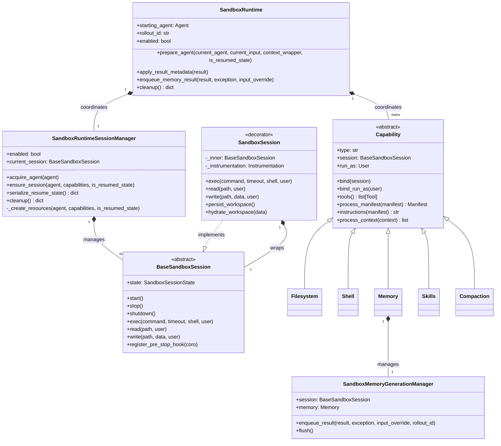
```mermaid
classDiagram
    class SandboxRuntime {
        +starting_agent: Agent
        +rollout_id: str
        +enabled: bool
        +prepare_agent(current_agent, current_input, context_wrapper, is_resumed_state)
        +apply_result_metadata(result)
        +enqueue_memory_result(result, exception, input_override)
        +cleanup() dict
    }

    class SandboxRuntimeSessionManager {
        +enabled: bool
        +current_session: BaseSandboxSession
        +acquire_agent(agent)
        +ensure_session(agent, capabilities, is_resumed_state)
        +serialize_resume_state() dict
        +cleanup() dict
        -_create_resources(agent, capabilities, is_resumed_state)
    }

    class BaseSandboxSession {
        <<abstract>>
        +state: SandboxSessionState
        +start()
        +stop()
        +shutdown()
        +exec(command, timeout, shell, user)
        +read(path, user)
        +write(path, data, user)
        +register_pre_stop_hook(coro)
    }

    class SandboxSession {
        <<decorator>>
        -_inner: BaseSandboxSession
        -_instrumentation: Instrumentation
        +exec(command, timeout, shell, user)
        +read(path, user)
        +write(path, data, user)
        +persist_workspace()
        +hydrate_workspace(data)
    }

    class Capability {
        <<abstract>>
        +type: str
        +session: BaseSandboxSession
        +run_as: User
        +bind(session)
        +bind_run_as(user)
        +tools() list[Tool]
        +process_manifest(manifest) Manifest
        +instructions(manifest) str
        +process_context(context) list
    }

    class SandboxMemoryGenerationManager {
        +session: BaseSandboxSession
        +memory: Memory
        +enqueue_result(result, exception, input_override, rollout_id)
        +flush()
    }

    SandboxRuntime "1" *-- "1" SandboxRuntimeSessionManager : coordinates
    SandboxRuntimeSessionManager "1" *-- "many" BaseSandboxSession : manages
    SandboxSession ..|> BaseSandboxSession : implements
    SandboxSession "1" *-- "1" BaseSandboxSession : wraps
    SandboxRuntime "1" *-- "many" Capability : coordinates
    Capability <|-- Filesystem
    Capability <|-- Shell
    Capability <|-- Memory
    Capability <|-- Skills
    Capability <|-- Compaction
    
    Memory "1" *-- "1" SandboxMemoryGenerationManager : manages
```

#### 核心设计模式：Decorator（装饰器）审计追踪模式
`SandboxSession` 类本质上是具体物理沙箱会话（继承自 `BaseSandboxSession`）的装饰器包装器：
* **核心职责**：它不实现具体的容器或子进程操作，而是持有内部具体的 `_inner: BaseSandboxSession` 实例。
* **审计拦截**：通过装饰器 `@instrumented_op`，拦截对核心 IO 操作（`exec`, `read`, `write`, `start`, `stop`, `shutdown` 等）的调用。
* **事件发布**：在操作执行前后，采集高精度时间戳，封装为不可变的 `SandboxSessionStartEvent` 和 `SandboxSessionFinishEvent` 事件，发布至 `Instrumentation` 总线中。这保证了模型在沙箱内的一切敏感行为均能以结构化日志（如 stdout/stderr 字节流、系统退出码）导出至外部监控 Sink（如日志或审计追踪系统）。

---

### 15.2 核心模块职责分工

#### 1. SandboxRuntime（沙箱运行时管理器）
* **编排中心**：它是 Runner 外部生命周期与沙箱内部环境交互的唯一门面。在执行 `Runner.run()` 时，`SandboxRuntime` 判断是否启用沙箱模式。
* **Agent 动态增强**：
  1. 调用 `prepare_agent()` 克隆该智能体绑定的 Capabilities 列表。
  2. 获取关联的隔离 Sandbox 会话。
  3. 执行 `prepare_sandbox_input()` 和 `prepare_sandbox_agent()`，将 Capabilities 中提供的特殊 `Tool` 集合动态绑定至 Agent，同时根据 Capabilities 的声明和沙箱内文件树（Grep 等）动态拼接和增强 System Prompt。

#### 2. SandboxRuntimeSessionManager（会话资源管理器）
* **多智能体沙箱共存与隔离**：负责维护当前 Run 下所有 Agent 与其物理沙箱会话资源（`_SandboxSessionResources`）的映射关系。
* **并发执行保护**：内置 `_SandboxConcurrencyGuard`，使用线程锁 `threading.Lock` 保护每个 `SandboxAgent` 实例。如果一个正在运行中的 `SandboxAgent` 实例在另一个并发 Run 中被强行复用，会立即抛出 `RuntimeError`，以避免物理沙箱文件的读写冲突。
* **增量 Manifest 更新**：当复用处于 `Running` 状态的 live 会话时，如果 Capability 动态添加了新的 Manifest 条目，`SessionManager` 会通过 `_diff_live_session_entries()` 提取差异，校验并确保根路径、环境变量、用户组等核心配置未发生偏移，然后调用 `_apply_entry_batch()` 增量下发新文件/目录，避免了全量重新部署的开销。

#### 3. BaseSandboxSession（隔离会话抽象类）
* **物理隔离底座**：统领物理沙箱的动作执行。核心子类包括：
  * `DockerSandboxSession`（本地 Docker 隔离）
  * `UnixLocalSandboxSession`（本地独立子进程隔离，安全性低，开销小）
  * `CloudflareSandboxSession` / `E2BSandboxSession`（远程托管隔离环境）
* **绝对路径限制与 confinement 检查**：
  * 沙箱为防止大模型通过绝对路径遍历或软链接绕出隔离空间，在执行 IO 前调用 `_validate_remote_path_access()`。
  * 它会在沙箱启动时向容器中下发辅助脚本 `resolve_workspace_path`，在沙箱内部物理执行路径解析。若解析出的绝对真实路径超出了 Manifest 定义的 `root` 或 `extra_path_grants` 授权范围，会抛出 `InvalidManifestPathError`，从根本上杜绝路径穿越提权漏洞。
* **PTY（伪终端）多级交互**：
  * 支持交互式命令行。通过 `pty_exec_start()` 与 `pty_write_stdin()` 持续向沙箱内正在运行的进程交互输入流，并流式回收字符终端（TTY）的实时显示数据。

#### 4. Capability（能力插件基类）
* **能力解耦适配器**：将沙箱环境的“操作原子”转换为 LLM “可理解的工具和指令”。
* **生命周期钩子**：
  * `bind(session)`：与特定的隔离会话绑定。
  * `process_manifest(manifest)`：在会话实例化前，允许插件向 Manifest 挂载必要的系统文件或配置。
  * `instructions(manifest)`：返回一段指导性 prompt，动态拼接进 System Prompt 中。
  * `process_context(context)`：允许在 LLM 交互前拦截并剪枝/提炼上下文。

#### 5. SandboxMemoryGenerationManager（记忆合并管理器）
* **两阶段并行提炼**：
  - 绑定于 Sandbox 会话的 `pre_stop_hook`。当沙箱即将销毁时，被动激活。
  - 在 `flush()` 中，它负责为所有累积的 Rollout 会话日志并行拉起 Phase 1（提炼）和 Phase 2（整合）智能体，并将结果写回 `MEMORY.md`。

---

### 15.3 Capability 标准插件清单

| 插件类名 | 属性说明与工作流 | 注入的 Tools 实例 | 注入的 Prompt 职责 |
| :--- | :--- | :--- | :--- |
| **Filesystem** | 挂载本地/远程文件读写规则。 | `read_file`, `write_file`, `apply_patch`, `view_image` | 规范文件编辑格式（Diff 补丁优先），指导大模型如何通过局部 patch 修改代码，避免重写大文件引发 Token 浪费。 |
| **Shell** | 注入进程执行能力，控制执行超时。 | `run_command` (或带交互的 PTY 执行) | 描述当前沙箱的操作系统架构、可用编译器、命令执行的安全隔离级别及重定向规则。 |
| **Memory** | 提取前序运行经验，实现渐进式披露。 | `read_memory`, `search_memory` | 预先在 System Prompt 注入轻量级的 `memory_summary.md` 概要，引导 LLM 在需要时去 Grep 详细的 `MEMORY.md`，减小上下文窗口常驻开销。 |
| **Skills** | 管理 `./agents/skills` 技能目录。 | 无（通过 Prompt 动态链接） | 扫描所有已授权技能（如 `$credit-note-fixer`），在 Prompt 中渲染为结构化的技能索引表。在大模型提出调用请求时，将技能对应的 Prompt 段动态拼装至上下文。 |
| **Compaction** | 上下文自适应剪枝压缩。 | `compact_context` | 为大模型提供一个主动清理历史会话的工具。在检测到即将触发 Token 阈值时，自动提取关键状态并用 CompactionItem 替换历史段落。 |

---

### 15.4 沙箱生命周期状态机

物理沙箱的生命周期与 Runner 的 ReAct 循环生命周期严格对齐，其状态变迁如下图所示：

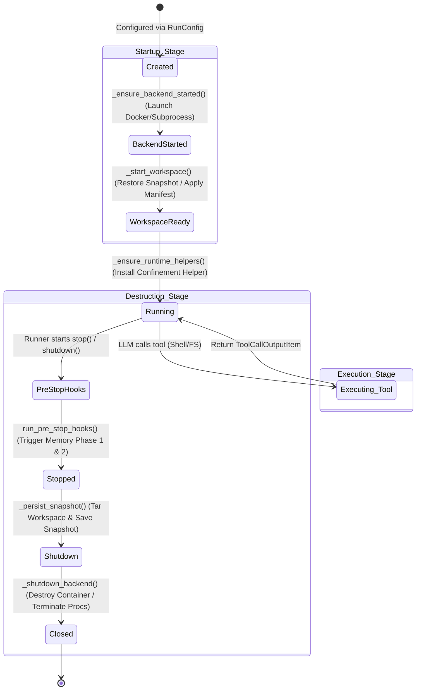
```mermaid
stateDiagram-v2
    [*] --> Created : Configured via RunConfig
    
    state Startup_Stage {
        Created --> BackendStarted : _ensure_backend_started() (Launch Docker/Subprocess)
        BackendStarted --> WorkspaceReady : _start_workspace() (Restore Snapshot / Apply Manifest)
        WorkspaceReady --> Running : _ensure_runtime_helpers() (Install Confinement Helper)
    }

    state Execution_Stage {
        Running --> Executing_Tool : LLM calls tool (Shell/FS)
        Executing_Tool --> Running : Return ToolCallOutputItem
    }

    state Destruction_Stage {
        Running --> PreStopHooks : Runner starts stop() / shutdown()
        PreStopHooks --> Stopped : run_pre_stop_hooks() (Trigger Memory Phase 1 & 2)
        Stopped --> Shutdown : _persist_snapshot() (Tar Workspace & Save Snapshot)
        Shutdown --> Closed : _shutdown_backend() (Destroy Container / Terminate Procs)
    }

    Closed --> [*]
```

#### 生命周期阶段详解：
1. **Created (配置期)**：基于 `SandboxRunConfig` 实例化相关客户端，此时尚未分配任何物理资源。
2. **BackendStarted (容器/进程启动)**：根据客户端类型拉起具体的隔离边界（例如创建 Docker 容器，并分配临时的 `session_id`）。
3. **WorkspaceReady (环境就绪期)**：
   - 检查 `SnapshotSpec` 是否有历史快照。若有，则将快照归档 tar 包解压还原至沙箱。
   - 解析并下发 Manifest 声明的文件、Git 仓及用户账号（`provision_manifest_accounts`）。
4. **Running (运行期)**：大模型在 ReAct 循环中发出工具调用，指令在沙箱内隔离执行，`SandboxSession` 记录细粒度的审计追踪日志。
5. **PreStopHooks (销毁预备期)**：Agent 运行结束，触发 pre-stop hooks，主要是 `SandboxMemoryGenerationManager.flush()` 开始异步提炼运行日志。
6. **Stopped (状态持久化期)**：在物理销毁前，将排除挂载点（Mounts）后的整个沙箱 workspace 打包成 tar 归档，并写回 snapshot 存储。
7. **Shutdown & Closed (资源回收)**：强制关闭沙箱内残存进程，物理销毁容器，关闭套接字及底层文件描述符连接。

---

### 15.5 挂载与存储管理机制

为支持 Agent 访问海量数据或与已有存储设施联动，沙箱设计了精细的挂载与存储隔离机制：

#### 1. 挂载实体（Mount Entries）
Manifest 支持声明多种类型的 Mount 实体，包括本地目录挂载（`LocalDir`）、Git 仓库挂载（`GitRepo`）以及对象存储挂载（`S3Mount`, `GCSMount`, `R2Mount`, `AzureBlobMount` 等）。

#### 2. 挂载策略（Mount Strategies）
* **`InContainerMountStrategy` (容器内挂载策略)**：
  - **rclone 模式**：对于云端对象存储，沙箱会在容器内部拉起 `rclone mount` 守护进程，借助 `fuse` 或 `nfs` 协议将远端存储桶虚拟化挂载到工作空间。
  - **特定协议代理**：利用 `mount-s3`（AWS S3）或 `blobfuse2`（Azure Blob）实现更高效率的文件流式按需读取。
* **`DockerVolumeMountStrategy` (Docker 卷挂载策略)**：
  - 在 Docker 容器创建前，由宿主机 Docker Daemon 直接将 Volume 卷或绑定目录挂载至容器指定路径。

#### 3. 存储隔离与持久化跳过（Mount Exclusion Policy）
* **挂载点排除**：由于挂载目录（如数 TB 的 S3 桶）的数据极其庞大且属于外部资源，沙箱的持久化核心 `_native_snapshot_requires_tar_fallback()` 在生成 Snapshot 归档时，会主动调用 `_persist_workspace_skip_relpaths()`。
* **排除列表**：挂载路径及显式注册的跳过路径（`register_persist_workspace_skip_path`）会被写入排除规则列表，在打包 tar 时直接排除这些目录的物理数据，仅保留空的挂载锚点。

---

### 15.6 状态持久化与恢复机制

在长周期或人机协同的异步任务中，物理沙箱需要支持“暂停/恢复”能力。这是通过 Sandbox Session 状态序列化实现的。

#### 1. Session 状态序列化格式
在 Sandbox 正常结束运行前，`SandboxRuntimeSessionManager` 会通过 `serialize_resume_state()` 将当前沙箱的连接信息和 Manifest 配置状态打包为 dict 结构，最终持久化于 Runner 的 `RunState.sandbox` 负载中：

```json
{
  "backend_id": "docker_local",
  "current_agent_key": "Sandbox engineer",
  "current_agent_name": "Sandbox engineer",
  "session_state": {
    "session_id": "8fa2b18c-3084-482a-a957-c357db5b6f00",
    "manifest": {
      "root": "/workspace",
      "extra_path_grants": [{"path": "/tmp", "read_only": false}],
      "environment": {"PYTHONPATH": "/workspace/repo"}
    },
    "workspace_root_ready": true,
    "exposed_ports": [8080]
  },
  "sessions_by_agent": {
    "Sandbox engineer": {
      "agent_name": "Sandbox engineer",
      "session_state": { ... }
    }
  }
}
```

#### 2. 沙箱会话恢复时序（Session Resume Resolution）

当 Runner 使用包含上述 Payload 的 `RunState` 恢复运行时，沙箱的重建决策逻辑如下：

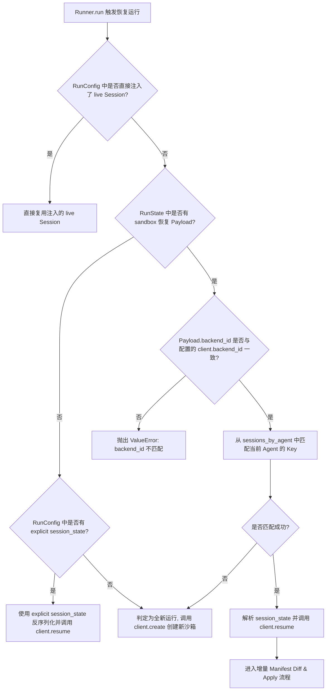
```mermaid
flowchart TD
    A[Runner.run 触发恢复运行] --> B{RunConfig 中是否直接注入了 live Session?}
    B -->|是| C[直接复用注入的 live Session]
    B -->|否| D{RunState 中是否有 sandbox 恢复 Payload?}
    
    D -->|否| E{RunConfig 中是否有 explicit session_state?}
    E -->|是| F[使用 explicit session_state 反序列化并调用 client.resume]
    E -->|否| G[判定为全新运行, 调用 client.create 创建新沙箱]
    
    D -->|是| H{Payload.backend_id 是否与配置的 client.backend_id 一致?}
    H -->|否| I[抛出 ValueError: backend_id 不匹配]
    H -->|是| J[从 sessions_by_agent 中匹配当前 Agent 的 Key]
    
    J --> K{是否匹配成功?}
    K -->|否| G
    K -->|是| L[解析 session_state 并调用 client.resume]
    L --> M[进入增量 Manifest Diff & Apply 流程]
```

通过这一层决策树，沙箱子系统实现了对“内存镜像状态恢复”（`session_state` 级）和“磁盘物理文件恢复”（`SnapshotSpec` 级）的精准分离，确保在大模型复杂长任务的中断恢复中，物理文件的修改痕迹与内存上下文能够严密无缝地对接。─ SKILL.md            # 技能入口
    │       ├── scripts/            # 辅助脚本
    │       └── templates/          # 模板
    └── phase_two_selection.json    # Phase 2 选择状态


### 9.3 存取时机

| 事件 | 操作 | 说明 |
|------|------|------|
| **Agent Turn 开始** | 读取 `memory_summary.md` | 注入系统 Prompt |
| **Agent 运行中** | 按需读取 `MEMORY.md` + `rollout_summaries/` | Agent 决定是否查询 |
| **Agent Turn 结束** | 写入 rollout payload 到 `{rollout_id}.jsonl` | 追加到 JSONL |
| **Session 关闭 (flush)** | 触发 Phase 1 → Phase 2 | 后台异步执行 |
| **Phase 1 完成** | 写入 `raw_memories/{id}.md` + `rollout_summaries/{id}_{slug}.md` | 每个 rollout 独立 |
| **Phase 2 完成** | 更新 `MEMORY.md` + `memory_summary.md` + `phase_two_selection.json` | 全局整合 |

### 9.4 SandboxMemoryGenerationManager

核心管理器，负责后台记忆生成：

```python
class SandboxMemoryGenerationManager:
    """管理沙箱 Session 的后台记忆生成。
    
    工作流:
    1. 运行期间: enqueue_result() 将运行结果追加到 rollout JSONL
    2. Session 关闭时: flush() 触发
       a. 对每个 rollout 文件运行 Phase 1
       b. 运行一次 Phase 2 整合
    """
    
    # 关键方法
    async def enqueue_result(result, *, rollout_id): ...
    async def flush(): ...           # 由 session.register_pre_stop_hook 注册
    async def _process_rollout_file(file): ...  # Phase 1
    async def _run_phase_two(): ...  # Phase 2
```

### 9.5 Rollout 概念详解

#### **什么是 Rollout？**

**Rollout = Agent 每次运行的完整交互记录**

它是一个 JSONL 格式的文件，记录了 Agent 单次执行的完整轨迹，类似于：
- **飞行记录仪（黑匣子）**: 记录每次飞行的完整数据
- **Git Commit**: 每次代码变更的快照
- **实验日志**: 科学实验的完整过程记录

#### **Rollout 的作用**

Rollout 是 **Memory 生成的原始素材**，通过两阶段流水线处理转化为可复用的知识和经验。

**关键特性**:
1. ✅ **不可变性**: Raw rollouts 是不可变的证据，永远不要编辑
2. ✅ **追加写入**: 每次运行追加到 JSONL 文件
3. ✅ **元数据丰富**: 包含终端状态、轮次计数、Token 使用量等
4. ✅ **记忆源头**: 所有长期记忆都来源于 rollout 的分析和提炼

#### **Rollout 数据格式**

每条 Rollout 是一个 JSONL 记录：

```json
{
  "updated_at": "2026-04-29T01:00:00Z",
  "rollout_id": "session-001",
  "input": "用户输入内容",
  "output": [
    {"type": "message", "content": "Agent 回复"},
    {"type": "function_call", "name": "shell", "arguments": "..."},
    {"type": "function_call_output", "output": "命令输出"}
  ],
  "terminal_metadata": {
    "terminal_state": "completed",
    "turn_count": 5,
    "usage": {"input_tokens": 1000, "output_tokens": 500}
  }
}
```
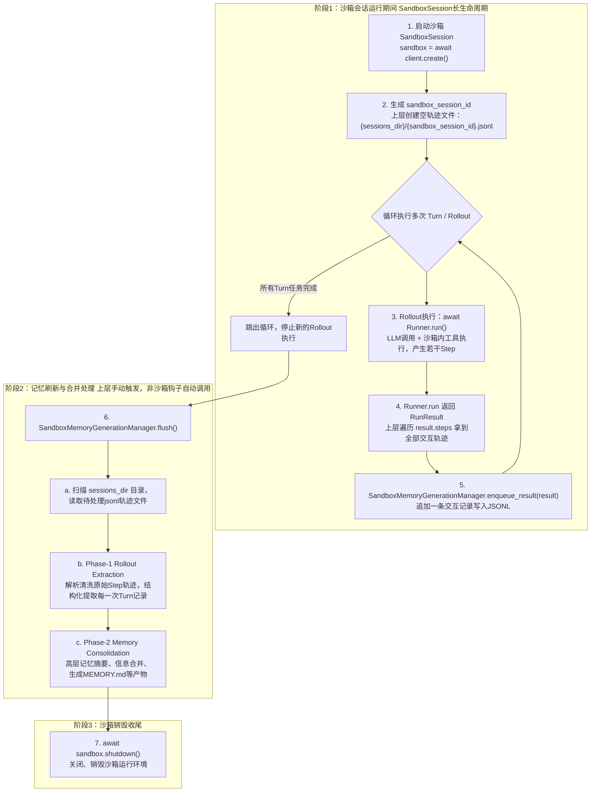
```mermaid
flowchart TD
   subgraph "阶段1：沙箱会话运行期间 SandboxSession长生命周期"
      A["1. 启动沙箱 SandboxSession<br>sandbox = await client.create()"] --> B["2. 生成 sandbox_session_id<br>上层创建空轨迹文件：{sessions_dir}/{sandbox_session_id}.jsonl"]

      B --> C{"循环执行多次 Turn / Rollout"}
      C --> D["3. Rollout执行：await Runner.run()<br>LLM调用 + 沙箱内工具执行，产生若干Step"]
      D --> E["4. Runner.run 返回 RunResult<br>上层遍历 result.steps 拿到全部交互轨迹"]
      E --> F["5. SandboxMemoryGenerationManager.enqueue_result(result)<br>追加一条交互记录写入JSONL"]
      F --> C

      C --所有Turn任务完成--> G["跳出循环，停止新的Rollout执行"]
   end

   subgraph "阶段2：记忆刷新与合并处理 上层手动触发，非沙箱钩子自动调用"
      G --> H["6. SandboxMemoryGenerationManager.flush()"]
      H --> H1["a. 扫描 sessions_dir 目录，读取待处理jsonl轨迹文件"]
      H1 --> H2["b. Phase‑1 Rollout Extraction<br>解析清洗原始Step轨迹，结构化提取每一次Turn记录"]
      H2 --> H3["c. Phase‑2 Memory Consolidation<br>高层记忆摘要、信息合并、生成MEMORY.md等产物"]
   end

   subgraph "阶段3：沙箱销毁收尾"
      H3 --> I["7. await sandbox.shutdown()<br>关闭、销毁沙箱运行环境"]
   end
```
#### **Rollout 的完整生命周期**

```
┌─────────────────────────────────────────────────────────┐
│ 阶段 1: 沙箱会话创建（Agent 运行期间）
├─────────────────────────────────────────────────────────┤
│
│ 1. SandboxSession 启动
│    ↓
│    生成 sandbox_session_id (UUID)
│    创建空 JSONL 文件: {sessions_dir}/{sandbox_session_id}.jsonl
│
│ 2. Agent Turn / Rollout 循环执行
│    ↓
│    每次 Runner.run()：LLM 调用 + 沙箱内工具执行
│    ↓
│    上层拿到 RunResult → SandboxMemoryGenerationManager.enqueue_result()
│    ↓
│    追加单条交互记录到 JSONL:
│    {
│      "updated_at": "...",
│      "input": "用户输入",
│      "output": [LLM回复, 工具调用, ...],
│      "terminal_metadata": {...}
│    }
│
│ 3. 多次 Turn / Rollout 累积
│    ↓
│    JSONL 文件不断增长
│    每条记录代表一次完整的 Agent‑环境交互
│
└──────────────────────┬──────────────────────────────────┘
                       ↓ 【所有Turn任务全部完成】
┌─────────────────────────────────────────────────────────┐
│ 阶段 2: 上层手动触发记忆刷新（非沙箱自动钩子）
├─────────────────────────────────────────────────────────┤
│
│ 4. 上层调度代码手动调用 SandboxMemoryGenerationManager.flush()
│    ↓
│    a. 扫描 sessions_dir 找到所有未处理的 sandbox_session 文件
│    b. 对每个jsonl轨迹文件，启动 Phase 1 提取流程
│    c. 全部Phase‑1完成后，统一执行一次 Phase 2 整合
│    ↓
│ 5. await sandbox.shutdown() 关闭销毁沙箱
│
└──────────────────────┬──────────────────────────────────┘
                       ↓
┌─────────────────────────────────────────────────────────┐
│ 阶段 3: Phase 1 - Rollout Extraction（提取）
├─────────────────────────────────────────────────────────┤
│
│ 6. 读取原始 sandbox_session JSONL
│    ↓
│    加载 {sessions_dir}/{sandbox_session_id}.jsonl 的全部内容
│
│ 7. 调用 Phase 1 Agent
│    ↓
│    Agent: sandbox‑memory‑phase‑one
│    Model: 可配置 (phase_one_model)
│    Prompt: rollout_extraction_prompt.md
│
│ 8. Phase 1 Agent 分析并输出结构化产物
│    ↓
│    {
│      "rollout_summary": "详细的运行回顾",
│      "rollout_slug": "文件名安全的描述标签",
│      "raw_memory": "结构化原始记忆"
│    }
│
│ 9. 写入 Phase 1 产物到宿主机记忆目录
│    ↓
│    memories/raw_memories/{sandbox_session_id}.md
│    memories/rollout_summaries/{id}_{slug}.md
│
└──────────────────────┬──────────────────────────────────┘
                       ↓ (所有会话文件的 Phase 1 完成后)
┌─────────────────────────────────────────────────────────┐
│ 阶段 4: Phase 2 - Memory Consolidation（整合）
├─────────────────────────────────────────────────────────┤
│
│ 10. 构建 Phase 2 输入上下文
│     ↓
│     合并所有 raw_memories/*.md
│     读取选择元数据 (phase_two_selection.json)
│
│ 11. 调用 Phase 2 Agent
│     ↓
│     Agent: sandbox‑memory‑phase‑two
│     Model: 可配置 (phase_two_model)
│     Prompt: memory_consolidation_prompt.md
│     工具: shell + filesystem (读写沙箱文件系统)
│
│ 12. Phase 2 Agent 执行高层记忆整合
│     ↓
│     • 读取所有 raw_memories 和 rollout_summaries
│     • 更新 MEMORY.md（完整记忆索引库）
│     • 更新 memory_summary.md（精简摘要，注入系统提示词）
│     • 可选: 创建/更新 skills/ 能力库
│
│ 13. 写入 Phase 2 处理状态
│     ↓
│     memories/phase_two_selection.json
│     记录哪些 sandbox_session 会话已经完成记忆合并
│
└──────────────────────┬──────────────────────────────────┘
                       ↓
┌─────────────────────────────────────────────────────────┐
│ 阶段 5: 下次 Agent 运行时加载复用长期记忆
├─────────────────────────────────────────────────────────┤
│
│ 14. 新 SandboxSession 启动
│     ↓
│     读取 memory_summary.md → 注入本次会话的系统 Prompt
│
│ 15. Agent 运行中按需查询历史记忆
│     ↓
│     • 始终加载: memory_summary.md
│     • 按需搜索: MEMORY.md (grep 关键词检索)
│     • 深入查看: rollout_summaries/ (摘要详情，按需读取)
│
│ 16. 记忆循环闭环
│     ↓
│     新 sandbox_session 产生轨迹 → Phase 1提取 → Phase 2合并 → 更新长期记忆库
│
└─────────────────────────────────────────────────────────┘

```
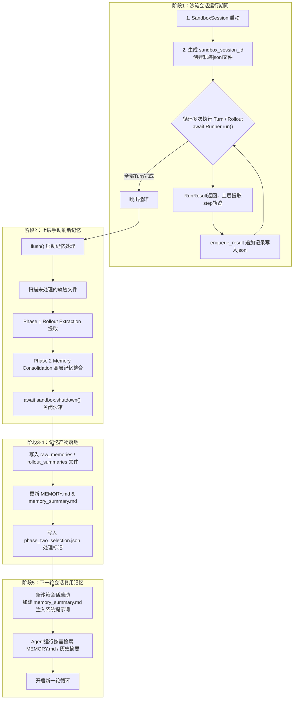
```mermaid
flowchart TD
    subgraph "阶段1：沙箱会话运行期间"
        A["1. SandboxSession 启动"] --> B["2. 生成 sandbox_session_id<br/>创建轨迹jsonl文件"]
        B --> C{"循环多次执行 Turn / Rollout<br/>await Runner.run()"}
        C --> D["RunResult返回，上层提取step轨迹"]
        D --> E["enqueue_result 追加记录写入jsonl"]
        E --> C
        C --全部Turn完成--> F["跳出循环"]
    end

    subgraph "阶段2：上层手动刷新记忆"
        F --> G["flush() 启动记忆处理"]
        G --> H["扫描未处理的轨迹文件"]
        H --> I["Phase 1 Rollout Extraction 提取"]
        I --> J["Phase 2 Memory Consolidation 高层记忆整合"]
        J --> K["await sandbox.shutdown() 关闭沙箱"]
    end

    subgraph "阶段3‑4：记忆产物落地"
        K --> L["写入 raw_memories / rollout_summaries 文件"]
        L --> M["更新 MEMORY.md & memory_summary.md"]
        M --> N["写入 phase_two_selection.json 处理标记"]
    end

    subgraph "阶段5：下一轮会话复用记忆"
        N --> O["新沙箱会话启动<br/>加载 memory_summary.md 注入系统提示词"]
        O --> P["Agent运行按需检索 MEMORY.md / 历史摘要"]
        P --> Q["开启新一轮循环"]
    end
```
### 9.6 Memory 读取 Prompt 的渐进式设计

Memory 读取采用 **Quick Memory Pass** 策略，避免加载过多内容：

```
1. 始终加载: memory_summary.md（≤15000 tokens，注入系统 Prompt）
2. 按需查询: MEMORY.md（Agent 用 grep/搜索关键词）
3. 深入查看: rollout_summaries/（仅当 MEMORY.md 指向时）
4. 预算控制: ≤4-6 次搜索步骤
```

---

## 10. Skill 技能加载系统

### 10.1 设计理念

Skills 系统实现了 **渐进式加载（Progressive Disclosure）**：

- 技能列表（名称 + 描述 + 路径）始终在 Prompt 中
- 技能详细内容（SKILL.md）按需加载
- 支持 **Eager 模式**（预加载）和 **Lazy 模式**（按需加载）

### 10.2 技能定义结构

```python
class SkillEntry(BaseModel):
    """单个技能条目"""
    name: str                       # 技能名称（如 "$code-review"）
    description: str                # 简短描述
    source: SkillSource             # 来源路径
    skill_files: list[SkillFile]    # 包含的文件列表
    load_mode: Literal["eager", "lazy"]  # 加载模式

class SkillSource(BaseModel):
    """技能来源信息"""
    path: str                       # SKILL.md 所在目录
    type: Literal["local", "remote"]

class SkillFile(BaseModel):
    """技能包含的文件"""
    path: str                       # 相对路径
    content: str | None             # eager 模式下预加载的内容
```

### 10.3 技能加载流程

```
┌─────────────────────────────────────────────────────┐
│ Sandbox Runtime 启动                                 │
│                                                     │
│ 1. Skills Capability 初始化                          │
│    → 扫描 workspace 中的 SKILL.md 文件              │
│    → 构建 SkillEntry 列表                            │
│                                                     │
│ 2. instructions() 方法生成 Prompt                    │
│    → 生成技能列表表格                                │
│    → 生成 "How to use skills" 说明                   │
│    → 注入系统 Prompt                                 │
│                                                     │
│ 3. 运行时按需加载                                    │
│    → Agent 识别到匹配的技能                          │
│    → 读取 SKILL.md                                   │
│    → 按需加载 references/、scripts/ 等               │
└─────────────────────────────────────────────────────┘
```

### 10.4 Skill Prompt 注入内容

```markdown
## 技能

技能是存储在 `SKILL.md` 文件中的一组本地指令。
以下是技能列表：

| 名称 | 描述 | 路径 |
|------|-------------|------|
| $code-change-verification | 运行验证栈 | /workspace/.agents/skills/.../SKILL.md |
| $implementation-strategy | 决定兼容性边界 | /workspace/.agents/skills/.../SKILL.md |

### 如何使用技能
- 发现：上面的列表是可用的技能
- 触发规则：如果用户命名了一个技能（$SkillName 或纯文本）或者任务匹配，你必须使用该技能
- 如何使用（渐进式披露）：
  1) 打开 SKILL.md。仅阅读足以遵循工作流程的内容
  2) 如果指向额外文件夹，仅加载需要的文件
  3) 如果存在 scripts/，优先运行它们
  4) 如果存在 assets/ 或模板，重用它们
- 上下文卫生：
  - 保持上下文小
  - 避免深度引用追踪
  - 当存在变体时，仅选择相关文件
```

### 10.5 Lazy 模式的 load_skill 工具

在 Lazy 模式下，Skills Capability 还注册一个 `load_skill` 工具：

```python
def tools(self) -> list[Tool]:
    if self._lazy_skills:
        return [self._build_load_skill_tool()]
    return []

# Agent 调用 load_skill("$code-review") 
# → 将技能文件复制到 workspace
# → Agent 可以读取 SKILL.md
```

---

## 11. Tracing 追踪系统

### 11.1 架构

```
Trace (整次运行)
└── AgentSpan (每个 Agent)
    ├── TurnSpan (每轮 Turn)
    │   ├── LLM Call
    │   ├── ToolSpan (每次工具调用)
    │   └── GuardrailSpan
    └── HandoffSpan (切换 Agent)
```

### 11.2 核心组件

```python
# tracing/create.py — 创建 Span 的工厂函数
def agent_span(name, ...) -> Span: ...
def turn_span(name, ...) -> Span: ...
def task_span(name, ...) -> Span: ...

# tracing/processor_interface.py — 处理器接口
class TracingProcessor(Protocol):
    def on_trace_start(self, trace): ...
    def on_trace_end(self, trace): ...
    def on_span_start(self, span): ...
    def on_span_end(self, span): ...
    def shutdown(self): ...
    def force_flush(self): ...
```

---

## 12. Model 模型层

### 12.1 模型抽象接口

```python
class Model(ABC):
    @abstractmethod
    async def get_response(
        self,
        system_instructions: str | None,
        input: str | list[TResponseInputItem],
        model_settings: ModelSettings,
        tools: list[Tool],
        output_schema: AgentOutputSchemaBase | None,
        handoffs: list[Handoff],
        tracing: ModelTracing,
        *,
        previous_response_id: str | None = None,
        prompt: ResponsePromptParam | None = None,
    ) -> ModelResponse: ...

    @abstractmethod
    async def stream_response(
        self,
        ...,  # 同上参数
    ) -> AsyncIterator[TResponseStreamEvent]: ...
```

### 12.2 模型提供商

```
Model（抽象接口）
├── OpenAIResponsesModel    # Responses API（默认）
├── OpenAIChatCompletionsModel  # Chat Completions API
├── LitellmModel            # LiteLLM（扩展包，支持 100+ 提供商）
├── AnyLLMModel             # 任意 LLM（扩展包）
└── MultiProvider            # 多提供商路由
```

### 12.3 ModelSettings

```python
@dataclass
class ModelSettings:
    temperature: float | None = None
    top_p: float | None = None
    frequency_penalty: float | None = None
    presence_penalty: float | None = None
    max_tokens: int | None = None
    tool_choice: ToolChoice | None = None    # "auto" | "none" | "required" | specific
    parallel_tool_calls: bool | None = None
    truncation: TruncationStrategy | None = None
    store: bool | None = None
    reasoning: ReasoningConfig | None = None
    extra_query: dict | None = None
    extra_body: dict | None = None
    extra_headers: dict | None = None
```

---

## 13. Streaming 流式输出

### 13.1 事件类型

```python
# stream_events.py
@dataclass
class RawResponsesStreamEvent:         # 原始 API 响应事件
    data: ResponseStreamEvent
    type: str = "raw_response_event"

@dataclass
class RunItemStreamEvent:              # RunItem 事件
    item: RunItem
    name: str                          # 事件名称

@dataclass
class AgentUpdatedStreamEvent:         # Agent 切换事件
    new_agent: Agent
    type: str = "agent_updated"

# 事件名称:
# "message_output_created" | "handoff_requested" | "handoff_occured"
# "tool_called" | "tool_output" | "reasoning_item_created"
# "mcp_approval_requested" | "mcp_approval_response" | "mcp_list_tools"
# "tool_search_called" | "tool_search_output_created"
```

### 13.2 流式使用

```python
async with Runner.run_streamed(agent, input) as result:
    async for event in result.stream_events():
        if event.type == "raw_response_event":
            # 处理原始流式 token
            print(event.data, end="", flush=True)
        elif event.type == "run_item_stream_event":
            if event.name == "tool_called":
                print(f"Calling tool: {event.item.raw_item.name}")
```

---

## 14. RunState 序列化

### 14.1 设计目的

RunState 支持 **中断恢复**（Interrupt & Resume）：

- 当需要用户审批工具调用时，运行中断
- 将完整状态序列化为 JSON
- 用户审批后，从 JSON 恢复并继续

### 14.2 序列化格式

```python
CURRENT_SCHEMA_VERSION = "1.9"

class RunState:
    """可序列化的运行状态，支持中断后恢复。"""
    
    # 序列化内容:
    # - schema_version
    # - current_agent_name
    # - original_input
    # - all_generated_items (所有 RunItems)
    # - model_responses
    # - current_turn
    # - usage
    # - interruptions (审批项)
    # - ... 其他元数据
    
    def to_json(self) -> str: ...
    @classmethod
    def from_json(cls, json_str: str) -> RunState: ...
```

### 14.3 Resume 流程

```python
# 1. 运行被中断
result = await Runner.run(agent, input)
if result.interruptions:
    run_state = result.state
    
    # 2. 序列化保存
    state_json = run_state.to_json()
    
    # 3. 用户审批
    approvals = get_user_approvals(result.interruptions)
    
    # 4. 恢复运行
    result = await Runner.run(
        agent, input,
        run_state=RunState.from_json(state_json),
        approved_tool_calls=approvals
    )
```
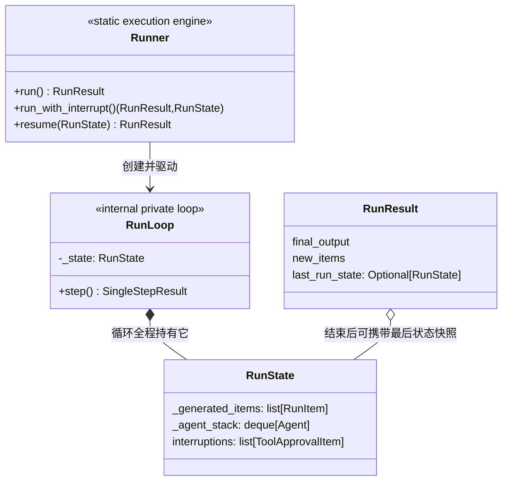
```mermaid
classDiagram
    class Runner{
        <<static execution engine>>
        +run() RunResult
        +run_with_interrupt() (RunResult,RunState)
        +resume(RunState) RunResult
    }
    class RunLoop{
        <<internal private loop>>
        -_state: RunState
        +step() SingleStepResult
    }
    class RunState{
        _generated_items: list[RunItem]
        _agent_stack: deque[Agent]
        interruptions: list[ToolApprovalItem]
    }
    class RunResult{
        final_output
        new_items
        last_run_state: Optional[RunState]
    }
    Runner --> RunLoop : 创建并驱动
    RunLoop *-- RunState : 循环全程持有它
    RunResult o-- RunState : 结束后可携带最后状态快照
```
---

## 15. Sandbox 沙箱运行时

### 15.1 沙箱设计架构与组件依赖

OpenAI Agents SDK 的沙箱运行时（Sandbox Runtime）是为了防范 Agent 自主运行代码、执行 Shell 或读写文件时的安全风险而设计的。它将“环境隔离能力”与“智能体能力扩展”通过 **Capability 插件体系** 进行了高度解耦。

以下是沙箱子系统的核心组件依赖关系类图：

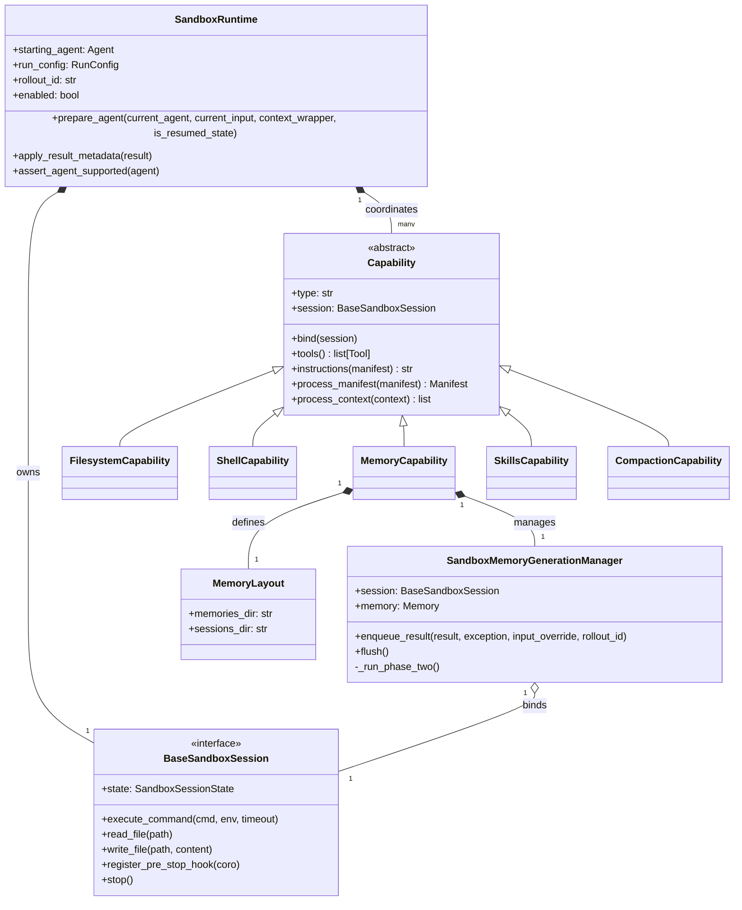
```mermaid
classDiagram
    class SandboxRuntime {
        +starting_agent: Agent
        +run_config: RunConfig
        +rollout_id: str
        +enabled: bool
        +prepare_agent(current_agent, current_input, context_wrapper, is_resumed_state)
        +apply_result_metadata(result)
        +assert_agent_supported(agent)
    }

    class BaseSandboxSession {
        <<interface>>
        +state: SandboxSessionState
        +execute_command(cmd, env, timeout)
        +read_file(path)
        +write_file(path, content)
        +register_pre_stop_hook(coro)
        +stop()
    }

    class Capability {
        <<abstract>>
        +type: str
        +session: BaseSandboxSession
        +bind(session)
        +tools() list[Tool]
        +instructions(manifest) str
        +process_manifest(manifest) Manifest
        +process_context(context) list
    }

    class SandboxMemoryGenerationManager {
        +session: BaseSandboxSession
        +memory: Memory
        +enqueue_result(result, exception, input_override, rollout_id)
        +flush()
        -_run_phase_two()
    }

    class MemoryLayout {
        +memories_dir: str
        +sessions_dir: str
    }

    SandboxRuntime "1" *-- "1" BaseSandboxSession : owns
    SandboxRuntime "1" *-- "many" Capability : coordinates
    Capability <|-- FilesystemCapability
    Capability <|-- ShellCapability
    Capability <|-- MemoryCapability
    Capability <|-- SkillsCapability
    Capability <|-- CompactionCapability
    
    MemoryCapability "1" *-- "1" MemoryLayout : defines
    MemoryCapability "1" *-- "1" SandboxMemoryGenerationManager : manages
    SandboxMemoryGenerationManager "1" o-- "1" BaseSandboxSession : binds
```

---

### 15.2 核心模块职责分工

#### 1. SandboxRuntime（运行时管理器）
* **职责**：整个沙箱子系统的外部编排器。在单次 `Runner.run()` 启动时，判断是否启用沙箱。如果启用，则拉起一个 `BaseSandboxSession`。
* **Agent 组装**：通过 `prepare_agent` 方法，遍历挂载的 Capabilities，依次为当前的 Agent 动态注入专有工具和拼接 System Prompt 增强包。

#### 2. BaseSandboxSession（隔离会话接口）
* **职责**：代表了沙箱物理运行时的统一抽象接口。它规定了环境具备读写文件、执行 Shell 命令的元能力，以及生命周期钩子的注册。
* **运行时实现**：
  * **Docker Sandbox**：在本地 Docker 容器中执行命令，具有最高级别的本地网络和文件隔离安全性。
  * **Local Subprocess Sandbox**：在本地独立进程（Unix）中运行命令，开销小但不具备物理级安全防范。
  * **Cloud / Cloudflare Sandbox (扩展)**：在远程云端轻量级 VM（如 E2B）或边缘隔离容器中执行。

#### 3. Capability（能力扩展插件）
* **职责**：将“沙箱会话”转化为“大模型可用工具与指令”的适配器。所有 Capability 都继承基类 `Capability`，并实现以下核心方法：
  * `tools()`：返回一组 `Tool` 实例（如 Filesystem 能力返回 `apply_patch`，Shell 能力返回 `run_command`），这些工具将被注入到 Agent 中供 LLM 调用。
  * `instructions()`：返回一个 Markdown 指令段落，将该能力的详细使用守则（如“优先使用 rg 检索文件”）合并进 System Prompt。

#### 4. SandboxMemoryGenerationManager（沙箱记忆管理器）
* **职责**：在 Sandbox 运行周期内拦截并记录所有的交互事件片段。在沙箱实例销毁前，由 pre-stop hook 触发，独立运行 Phase 1 与 Phase 2 Agent，完成记忆提炼，实现记忆文件系统的迭代升级。

---

### 15.3 Capability 标准插件清单

| 插件类名 | Capability 类型 | 注入的 Tools 实例 | 注入的 Prompt 职责 |
| :--- | :--- | :--- | :--- |
| **Filesystem** | `filesystem` | `read_file`, `write_file`, `apply_patch` 等 | 告诉 Agent 怎么在容器里安全地修改文件并遵循编码规范。 |
| **Shell** | `shell` | `run_command` 等 | 告诉 Agent 本机环境细节、编译器位置以及执行指令的最佳实践。 |
| **Memory** | `memory` | `read_memory`, `search_memory` 等 | 注入 `memory_summary.md` 概要，引导 LLM 对 `MEMORY.md` 执行渐进式 Grep。 |
| **Skills** | `skills` | 无（动态关联） | 扫描 `./agents/skills/` 目录，把发现的可用技能名和描述格式化为表格拼入系统指令。 |
| **Compaction** | `compaction` | `compact_context` 等 | 在上下文窗口濒临撑爆时，提供自动提炼压缩的方法。 |

---

### 15.4 沙箱生命周期状态机

```
【Runner 启动】
    ↓
 [创建 SandboxRuntime] ──→ 启动 BaseSandboxSession (拉起物理容器)
    ↓
 [绑定 Capabilities] ──→ 调用 cap.bind(session) 
    ↓
 [构建 Prompt & Tools] ──→ 提取 cap.instructions() 与 cap.tools() 并注入 Agent
    ↓
【ReAct 运行循环】──→ LLM 调用沙箱注入的工具 ──→ 沙箱容器物理执行命令
    ↓
【任务运行结束】
    ↓
 [触发 pre_stop_hook] ──→ 激活 SandboxMemoryGenerationManager.flush()
    ↓
 [执行 Phase 1 & 2] ──→ 两阶段 Agent 启动，提炼 rollout 记录并覆盖写回磁盘记忆文件
    ↓
 [物理销毁 Sandbox] ──→ 停止并销毁物理容器 ──→ 【Runner 退出】
```

---

---

## 16. 端到端流程图

### 16.1 完整个生命周期端到端时序图

**⚠️ 重要说明**：以下时序图完整展示了从用户调用 `Runner.run()` 开始，加载会话、拉起安全沙箱容器、在 ReAct 循环中执行 Turn 决策与工具、处理 Guardrails 校验以及审批中断、直到沙箱容器销毁前触发“两阶段 Memory 提炼”的整个生命周期时序流程。

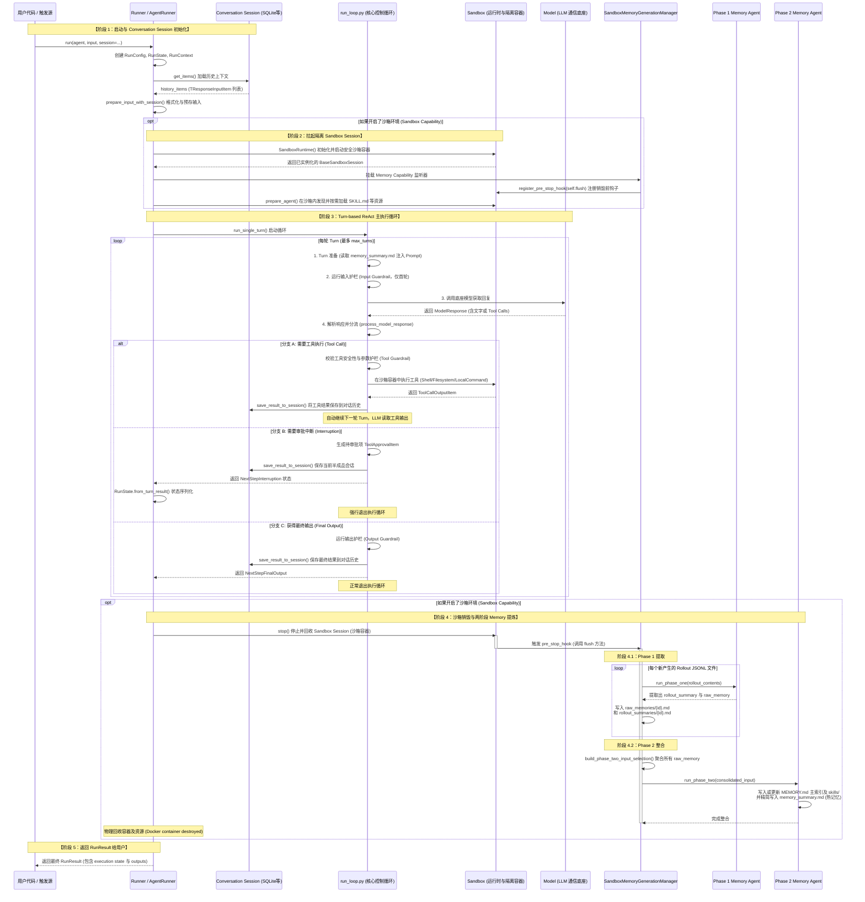
```mermaid
sequenceDiagram
    participant User as 用户代码 / 触发源
    participant Runner as Runner / AgentRunner
    participant Session as Conversation Session (SQLite等)
    participant RunLoop as run_loop.py (核心控制循环)
    participant Sandbox as Sandbox (运行时与隔离容器)
    participant Model as Model (LLM 通信底座)
    participant MemoryMgr as SandboxMemoryGenerationManager
    participant Phase1Agent as Phase 1 Memory Agent
    participant Phase2Agent as Phase 2 Memory Agent
    
    %% 1. 初始化
    Note over User,Session: 【阶段 1：启动与 Conversation Session 初始化】
    User->>Runner: run(agent, input, session=...)
    Runner->>Runner: 创建 RunConfig, RunState, RunContext
    Runner->>Session: get_items() 加载历史上下文
    Session-->>Runner: history_items (TResponseInputItem 列表)
    Runner->>Runner: prepare_input_with_session() 格式化与预存输入
    
    %% 2. 沙箱创建
    opt 如果开启了沙箱环境 (Sandbox Capability)
        Note over Runner,Sandbox: 【阶段 2：拉起隔离 Sandbox Session】
        Runner->>Sandbox: SandboxRuntime() 初始化并启动安全沙箱容器
        Sandbox-->>Runner: 返回已实例化的 BaseSandboxSession
        Runner->>MemoryMgr: 挂载 Memory Capability 监听器
        MemoryMgr->>Sandbox: register_pre_stop_hook(self.flush) 注册销毁前钩子
        Runner->>Sandbox: prepare_agent() 在沙箱内发现并按需加载 SKILL.md 等资源
    end
    
    %% 3. 执行循环
    Note over Runner,Model: 【阶段 3：Turn-based ReAct 主执行循环】
    Runner->>RunLoop: run_single_turn() 启动循环
    
    loop 每轮 Turn (最多 max_turns)
        RunLoop->>RunLoop: 1. Turn 准备 (读取 memory_summary.md 注入 Prompt)
        RunLoop->>RunLoop: 2. 运行输入护栏 (Input Guardrail，仅首轮)
        RunLoop->>Model: 3. 调用底座模型获取回复
        Model-->>RunLoop: 返回 ModelResponse (含文字或 Tool Calls)
        RunLoop->>RunLoop: 4. 解析响应并分流 (process_model_response)
        
        alt 分支 A: 需要工具执行 (Tool Call)
            RunLoop->>RunLoop: 校验工具安全性与参数护栏 (Tool Guardrail)
            RunLoop->>Sandbox: 在沙箱容器中执行工具 (Shell/Filesystem/LocalCommand)
            Sandbox-->>RunLoop: 返回 ToolCallOutputItem
            RunLoop->>Session: save_result_to_session() 将工具结果保存到对话历史
            Note over RunLoop: 自动继续下一轮 Turn，LLM 读取工具输出
            
        else 分支 B: 需要审批中断 (Interruption)
            RunLoop->>RunLoop: 生成待审批项 ToolApprovalItem
            RunLoop->>Session: save_result_to_session() 保存当前半成品会话
            RunLoop-->>Runner: 返回 NextStepInterruption 状态
            Runner->>Runner: RunState.from_turn_result() 状态序列化
            Note over RunLoop: 强行退出执行循环
            
        else 分支 C: 获得最终输出 (Final Output)
            RunLoop->>RunLoop: 运行输出护栏 (Output Guardrail)
            RunLoop->>Session: save_result_to_session() 保存最终结果到对话历史
            RunLoop-->>Runner: 返回 NextStepFinalOutput
            Note over RunLoop: 正常退出执行循环
        end
    end
    
    %% 4. 沙箱销毁与内存提取
    opt 如果开启了沙箱环境 (Sandbox Capability)
        Note over Runner,Phase2Agent: 【阶段 4：沙箱销毁与两阶段 Memory 提炼】
        Runner->>Sandbox: stop() 停止并回收 Sandbox Session (沙箱容器)
        activate Sandbox
        Sandbox->>MemoryMgr: 触发 pre_stop_hook (调用 flush 方法)
        deactivate Sandbox
        
        activate MemoryMgr
        Note over MemoryMgr: 阶段 4.1：Phase 1 提取
        loop 每个新产生的 Rollout JSONL 文件
            MemoryMgr->>Phase1Agent: run_phase_one(rollout_contents)
            Phase1Agent-->>MemoryMgr: 提取出 rollout_summary 与 raw_memory
            MemoryMgr->>MemoryMgr: 写入 raw_memories/{id}.md <br/>和 rollout_summaries/{id}.md
        end
        
        Note over MemoryMgr: 阶段 4.2：Phase 2 整合
        MemoryMgr->>MemoryMgr: build_phase_two_input_selection() 聚合所有 raw_memory
        MemoryMgr->>Phase2Agent: run_phase_two(consolidated_input)
        Phase2Agent->>Phase2Agent: 写入或更新 MEMORY.md 主索引及 skills/<br/>并精简写入 memory_summary.md (热记忆)
        Phase2Agent-->>MemoryMgr: 完成整合
        deactivate MemoryMgr
        
        Note over Runner: 物理回收容器及资源 (Docker container destroyed)
    end
    
    %% 5. 退出返回
    Note over Runner,User: 【阶段 5：返回 RunResult 给用户】
    Runner-->>User: 返回最终 RunResult (包含 execution state 与 outputs)
```

---

### 16.2 ReAct 运行循环与 Session 交互时序图

**⚠️ 重要说明**：以下时序图展示了在**同步 (Sync) 模式**下运行时，模型调用循环与 `Session` 读写的核心交互逻辑。所有类名与方法调用（如 `prepare_input_with_session`, `run_single_turn`, `save_result_to_session`）均源自真实的 Python 源码。

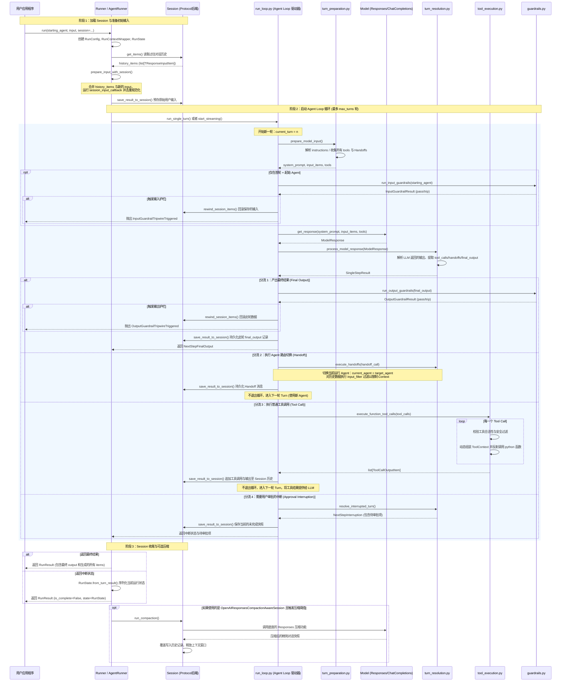
```mermaid
sequenceDiagram
    participant User as 用户应用程序
    participant Runner as Runner / AgentRunner
    participant Session as Session (Protocol后端)
    participant RunLoop as run_loop.py (Agent Loop 驱动器)
    participant TurnPrep as turn_preparation.py
    participant Model as Model (Responses/ChatCompletions)
    participant TurnResolve as turn_resolution.py
    participant ToolExec as tool_execution.py
    participant Guardrails as guardrails.py
    
    %% ========== 阶段 1：Session 初始化与历史加载 ==========
    Note over User,Session: 阶段 1：加载 Session 与准备初始输入
    User->>Runner: run(starting_agent, input, session=...)
    Runner->>Runner: 创建 RunConfig, RunContextWrapper, RunState
    Runner->>Session: get_items() 读取过往对话历史
    Session-->>Runner: history_items (list[TResponseInputItem])
    Runner->>Runner: prepare_input_with_session()
    Note over Runner: 合并 history_items 与新的 input，<br/>运行 session_input_callback 并去重规范化
    Runner->>Session: save_result_to_session() 预存原始用户输入
    
    %% ========== 阶段 2：Agent 核心 ReAct 循环 ==========
    Note over Runner,Guardrails: 阶段 2：启动 Agent Loop 循环 (最多 max_turns 轮)
    Runner->>RunLoop: run_single_turn() 或者 start_streaming()
    
    rect rgb(240, 248, 255)
        Note over RunLoop: 开始新一轮：current_turn = n
        
        %% 2.1 Turn 准备
        RunLoop->>TurnPrep: prepare_model_input()
        TurnPrep->>TurnPrep: 解析 instructions / 收集所有 tools 与 Handoffs
        TurnPrep-->>RunLoop: system_prompt, input_items, tools
        
        %% 2.2 输入安全校验 (仅首轮执行)
        opt 仅在首轮 + 起始 Agent
            RunLoop->>Guardrails: run_input_guardrails(starting_agent)
            Guardrails-->>RunLoop: InputGuardrailResult (pass/trip)
            alt 触发输入护栏
                RunLoop->>Session: rewind_session_items() 回滚保存的输入
                RunLoop-->>User: 抛出 InputGuardrailTripwireTriggered
            end
        end
        
        %% 2.3 模型通信
        RunLoop->>Model: get_response(system_prompt, input_items, tools)
        Model-->>RunLoop: ModelResponse
        
        %% 2.4 响应解析
        RunLoop->>TurnResolve: process_model_response(ModelResponse)
        TurnResolve->>TurnResolve: 解析 LLM 返回的输出、提取 tool_calls/handoffs/final_output
        TurnResolve-->>RunLoop: SingleStepResult
        
        %% 2.5 决策分支分流
        alt 分流 1：产出最终结果 (Final Output)
            RunLoop->>Guardrails: run_output_guardrails(final_output)
            Guardrails-->>RunLoop: OutputGuardrailResult (pass/trip)
            alt 触发输出护栏
                RunLoop->>Session: rewind_session_items() 回滚此轮数据
                RunLoop-->>User: 抛出 OutputGuardrailTripwireTriggered
            end
            RunLoop->>Session: save_result_to_session() 持久化此轮 final_output 记录
            RunLoop-->>Runner: 返回 NextStepFinalOutput
            
        else 分流 2：执行 Agent 路由切换 (Handoff)
            RunLoop->>TurnResolve: execute_handoffs(handoff_call)
            Note over RunLoop,TurnResolve: 切换当前运行 Agent：current_agent = target_agent<br/>对历史数据执行 input_filter 过滤以限制 Context
            RunLoop->>Session: save_result_to_session() 持久化 Handoff 消息
            Note over RunLoop: 不退出循环，进入下一轮 Turn (使用新 Agent)
            
        else 分流 3：执行普通工具调用 (Tool Call)
            RunLoop->>ToolExec: execute_function_tool_calls(tool_calls)
            loop 每一个 Tool Call
                ToolExec->>ToolExec: 校验工具合法性与安全过滤
                ToolExec->>ToolExec: 动态组装 ToolContext 并反射调用 python 函数
            end
            ToolExec-->>RunLoop: list[ToolCallOutputItem]
            RunLoop->>Session: save_result_to_session() 追加工具调用与输出至 Session 历史
            Note over RunLoop: 不退出循环，进入下一轮 Turn，将工具结果提供给 LLM
            
        else 分流 4：需要用户审批的中断 (Approval Interruption)
            RunLoop->>TurnResolve: resolve_interrupted_turn()
            TurnResolve-->>RunLoop: NextStepInterruption (包含待审批项)
            RunLoop->>Session: save_result_to_session() 保存当前的未完成快照
            RunLoop-->>Runner: 返回中断状态与待审批项
        end
    end
    
    %% ========== 阶段 3：会话收尾与长上下文压缩 ==========
    Note over Runner,Session: 阶段 3：Session 收尾与可选压缩
    alt 返回最终结果
        Runner-->>User: 返回 RunResult (包含最终 output 和生成的所有 items)
    else 返回中断状态
        Runner->>Runner: RunState.from_turn_result() 序列化当前运行状态
        Runner-->>User: 返回 RunResult (is_complete=False, state=RunState)
    end
    
    opt 如果使用的是 OpenAIResponsesCompactionAwareSession 且触发压缩阈值
        Runner->>Session: run_compaction()
        Session->>Model: 调用底座的 Responses 压缩功能
        Model-->>Session: 压缩后的精简对话快照
        Session->>Session: 覆盖写入历史记录，释放上下文窗口
    end
```

---

### 16.3 异步事件流式时序图 (Streaming Loop)

当用户调用 `Runner.run_streamed()` 时，Runner 会在后台拉起异步 ReAct 循环，并将 LLM 生成的 Chunk 以及中间状态以事件队列的形式异步推送给用户程序。

```mermaid
sequenceDiagram
    participant User as 用户应用程序
    participant Runner as Runner
    participant AgentRunner as AgentRunner
    participant RunLoop as run_loop.py (Streaming 驱动)
    participant Model as Model (Stream API)
    participant StreamQueue as streamed_result._event_queue (事件队列)
    
    User->>Runner: run_streamed(starting_agent, input, session=...)
    Runner->>AgentRunner: run_streamed(...)
    AgentRunner->>AgentRunner: 准备 Session 历史，组装初始状态
    AgentRunner->>RunLoop: start_streaming()
    Note over RunLoop: 开启异步后台任务运行循环：asyncio.create_task(run_single_turn_streamed)
    RunLoop-->>AgentRunner: 返回 RunResultStreaming (包含事件队列引用)
    AgentRunner-->>User: 返回 RunResultStreaming 给用户
    
    par 后台 Agent 运行与 Stream 产生
        RunLoop->>Model: stream_response_with_retry() 开启流式响应
        loop 持续接收 SSE 块与事件
            Model-->>RunLoop: 接收到文本/工具调用 Chunk
            RunLoop->>StreamQueue: put_nowait(RunItemStreamEvent / ContentChunk)
        end
        RunLoop->>RunLoop: 提取出完整 Tool Calls 或 Final Output
        alt 属于普通工具调用
            RunLoop->>RunLoop: 执行工具，生成 ToolOutputItem
            RunLoop->>StreamQueue: put_nowait(RunItemStreamEvent(ToolOutputItem))
            Note over RunLoop: 继续后台流式下一轮
        else 属于 Final Output
            RunLoop->>StreamQueue: put_nowait(QueueCompleteSentinel)
        end
    and 前端用户代码消费 Stream 事件
        loop 用户遍历 result.stream()
            User->>StreamQueue: 读取下一个事件 (await queue.get())
            StreamQueue-->>User: 返回 StreamEvent (如 ContentChunk, ToolCall 等)
            Note over User: 实时更新前端 UI 或输出到控制台
        end
    end
```

---

### 16.4 中断与恢复协作时序图 (Interruption & Resume Flow)

对于高危工具调用（如 Shell 命令执行、大额转账、MCP 敏感操作），SDK 支持在工具规划时中断执行，保存完整的运行状态快照，等待用户介入审核后恢复。

```mermaid
sequenceDiagram
    participant User as 用户代码 / 审批界面
    participant Runner as Runner / AgentRunner
    participant Session as Session (Protocol后端)
    participant RunLoop as run_loop.py (循环控制)
    participant Approvals as approvals.py (审批校验)
    participant ToolExec as tool_execution.py (工具执行)
    
    %% ========== 阶段 1：中断触发 ==========
    Note over User,RunLoop: 阶段 1：工具需要审批引发中断
    RunLoop->>Approvals: 规划工具执行，检测到需要审批的工具 (如: MCPServer/Shell)
    Approvals-->>RunLoop: 发现未审批项，生成 ToolApprovalItem(is_approved=False)
    RunLoop->>RunLoop: 中断当前 Turn 的执行
    RunLoop->>Session: save_result_to_session() 保存当前的未完成会话快照
    RunLoop-->>Runner: 返回 NextStepInterruption 结果
    Runner->>Runner: 组装 RunState (包括 current_agent, generated_items 等)
    Runner-->>User: 返回 RunResult (is_complete=False, state=RunState, interruptions=[...])
    
    %% ========== 阶段 2：用户审批与恢复运行 ==========
    Note over User,Session: 阶段 2：用户审批并传递 RunState 恢复执行
    User->>User: 用户查看待审批项 (例如批准 shell 命令的执行)
    User->>User: 更新状态：RunState.interruptions[0].is_approved = True (或更新参数/拒绝)
    
    User->>Runner: run(starting_agent, input=RunState, session=...)
    Runner->>Runner: 检测到输入为 RunState，进入恢复流程
    Runner->>Session: get_items() 加载最近的会话状态
    Runner->>RunLoop: 传入 RunState，调用 run_single_turn() 恢复
    
    RunLoop->>RunLoop: 识别到恢复状态 (resuming_turn=True)
    RunLoop->>Approvals: 检查传入状态中的 approvals 状态
    
    alt 审批通过 (Approved)
        RunLoop->>ToolExec: execute_tools_and_side_effects() 真正执行该工具
        ToolExec-->>RunLoop: ToolCallOutputItem (工具实际输出)
        RunLoop->>Session: save_result_to_session() 持久化工具结果
        Note over RunLoop: 自动继续下一轮 ReAct 循环 (LLM 会读取到工具实际执行后的输出)
    else 审批被拒绝 (Rejected)
        RunLoop->>RunLoop: 产生拒绝占位符消息 (REJECTION_MESSAGE)
        RunLoop->>Session: save_result_to_session() 持久化拒绝信息
        Note over RunLoop: 继续下一轮 ReAct 循环 (LLM 会获知工具被人类拒绝执行)
    end
```

---

### 16.5 关键流程说明:

1. **Session 读取与输入准备时机**:
   - `Runner.run()` 开始时：在 `AgentRunner.run()` 方法内首先调用 `prepare_input_with_session()`。
   - `prepare_input_with_session()` 会内部调用 `session.get_items()` 读取历史对话。
   - 把历史对话与用户本次输入进行去重和格式化（转换为 `TResponseInputItem` 格式），若启用 OpenAI 服务端会话管理，则通过 `OpenAIServerConversationTracker` 将其发送到底座。

2. **Session 写入与持久化时机**:
   - 每轮 Turn 结束后：在 `run_loop.py` 执行完工具调用或获得模型响应后，立即调用 `save_result_to_session()`。
   - 如果发生 Guardrail 触发：会在 `save_result_to_session()` 之后调用 `rewind_session_items(count)`，通过不断执行 `session.pop_item()` 自动回滚本轮写入的历史。

3. **长上下文自动压缩 (Compaction) 触发时机**:
   - 如果 Session 后端实现了 `OpenAIResponsesCompactionAwareSession` 接口。
   - 在任务正常完成退出前，Runner 会判断当前会话 Token 是否触发压缩阈值。
   - 若触发，执行 `session.run_compaction()` 向模型发送压缩请求，并用压缩结果重写 Session 对话历史。

4. **沙箱 Rollout 记忆提取时机** (仅在 Sandbox 模式开启时):
   - 在整个会话彻底关闭或触发钩子时，`SandboxMemoryGenerationManager.flush()` 将被调用。
   - 它先对当前会话生成的 JSONL 记录执行 Phase 1 (Rollout 提取)，提取出 `raw_memory` 碎片。
   - 随后执行 Phase 2 (记忆整合)，将 raw_memories 融合成标准的 `MEMORY.md` 索引并更新 `memory_summary.md` 以注入后续的运行周期。

---

### 16.4 Sandbox Memory 生成序列图（基于真实源码）

**⚠️ 重要说明**：以下时序图展示 Sandbox Memory 系统的真实工作流程，所有方法名均可在 `sandbox/memory/` 目录中找到。

```mermaid
sequenceDiagram
    participant Agent as Agent Run
    participant Mgr as SandboxMemoryGenerationManager
    participant Storage as SandboxMemoryStorage
    participant P1 as Phase 1 Agent (sandbox-memory-phase-one)
    participant P2 as Phase 2 Agent (sandbox-memory-phase-two)
    
    %% 运行期间
    Note over Agent,Storage: 【阶段 1】Rollout 写入
    Agent->>Mgr: enqueue_result(result, rollout_id)
    Mgr->>Storage: write rollout JSONL ({sessions_dir}/{rollout_id}.jsonl)
    Note over Mgr: 每次 Turn 结束后追加一条记录
    
    %% Session 关闭时
    Note over Agent,Storage: 【阶段 2】Session 关闭触发
    Agent->>Mgr: flush() (pre_stop_hook 注册)
    
    %% Phase 1: Rollout Extraction
    Note over Mgr,Storage: 【阶段 3】Phase 1 - Rollout Extraction
    Mgr->>Storage: scan unprocessed rollouts
    loop 每个 rollout 文件
        Mgr->>Storage: read rollout JSONL
        Mgr->>P1: run_phase_one(rollout_contents, terminal_metadata)
        Note over P1: Prompt: rollout_extraction_prompt.md
        P1-->>Mgr: RolloutExtractionArtifacts<br/>{rollout_summary, rollout_slug, raw_memory}
        Mgr->>Storage: write raw_memories/{id}.md
        Mgr->>Storage: write rollout_summaries/{id}_{slug}.md
    end
    
    %% Phase 2: Memory Consolidation
    Note over Mgr,Storage: 【阶段 4】Phase 2 - Memory Consolidation
    Mgr->>Storage: build_phase_two_input_selection()
    Mgr->>Storage: rebuild_raw_memories()
    Mgr->>P2: run_phase_two(consolidated_input)
    Note over P2: Prompt: memory_consolidation_prompt.md<br/>Tools: shell + filesystem
    P2->>Storage: update MEMORY.md (主索引)
    P2->>Storage: update memory_summary.md (始终注入 Prompt)
    Mgr->>Storage: write phase_two_selection.json
    
    %% 完成
    Note over Agent,Storage: 【阶段 5】下次运行时使用
    Mgr-->>Agent: Memory 已更新，下次启动时自动加载
```

**关键流程说明**:

1. **Rollout 写入时机**:
   - 每次 Turn 结束后：`SandboxMemoryGenerationManager.enqueue_result()` 追加到 JSONL
   - 格式：每条记录包含 `updated_at`, `input`, `output`, `terminal_metadata`

2. **Phase 1 触发时机**:
   - Session 关闭时：`flush()` 扫描所有未处理的 rollout 文件
   - 对每个 rollout 运行 `sandbox-memory-phase-one` Agent
   - 输出：`raw_memories/{id}.md` + `rollout_summaries/{id}_{slug}.md`

3. **Phase 2 触发时机**:
   - 所有 Phase 1 完成后执行一次
   - 运行 `sandbox-memory-phase-two` Agent（有 shell/filesystem 工具）
   - 更新：`MEMORY.md` + `memory_summary.md` + `phase_two_selection.json`

4. **下次运行时使用**:
   - Memory Capability 的 `instructions()` 方法读取 `memory_summary.md`
   - 注入到系统 Prompt 中
   - Agent 可以按需搜索 `MEMORY.md` 和 `rollout_summaries/`

---

## 17. 与 Hermes/OpenHarness 对比

### 17.1 架构对比

| 维度 | OpenAI Agents SDK | Hermes Agent | OpenHarness |
|------|-------------------|--------------|-------------|
| **核心理念** | Agent-as-Config + Runner-as-Engine | 学习循环 + SOUL 人格 | 四层记忆 + 三层压缩 |
| **Agent 定义** | Python dataclass（声明式） | YAML/Config + SOUL.md | Engine + State |
| **多 Agent** | Handoff（工具调用形式） | Delegation（委托模式） | 无原生支持 |
| **记忆系统** | Session Protocol + Sandbox Memory | Memory Providers + Honcho | 四层记忆模型 |
| **工具系统** | Tool 多态（Function/MCP/Computer/...） | Toolsets + Skills | 工具定义 |
| **护栏** | Input/Output/Tool Guardrails | 无原生护栏 | 无原生护栏 |
| **序列化** | RunState（JSON，版本化） | Session Storage | Session Archiver |
| **追踪** | Tracing（Span/Trace） | Trajectory Format | 无 |
| **沙箱** | Capability 插件体系（Docker/Unix/云） | Nix 环境 | 无 |

### 17.2 记忆系统对比

| 维度 | OpenAI Agents SDK | Hermes | OpenHarness |
|------|-------------------|--------|-------------|
| **层级** | Session (L0) + Sandbox Memory (L1-L2) | Memory Providers | L0-L3 四层 |
| **压缩** | OpenAI Compaction API | Context Compression | 三层渐进压缩 |
| **写入格式** | JSONL rollouts → Markdown | Honcho/Provider 格式 | MEMORY.md + JSON |
| **读取策略** | Quick Memory Pass（4-6 步） | 按需检索 | 启发式搜索 |
| **整合** | 两阶段 LLM Agent 驱动 | 无自动整合 | POST_COMPACT Hook |
| **个性化** | memory_summary.md 注入 Prompt | SOUL.md 人格文件 | local_rules/rules.md |

### 17.3 Prompt 构建对比

| 维度 | OpenAI Agents SDK | Hermes | OpenHarness |
|------|-------------------|--------|-------------|
| **System Prompt** | agent.instructions + Capability 注入 | SOUL + Prompt Assembly | PromptBuilder 四层组装 |
| **动态 Prompt** | 函数式 + Prompt API | Context Engine Plugin | 无 |
| **Memory Prompt** | memory_read_prompt.md 模板 | Memory Provider Plugin | 分层注入 |
| **Skill Prompt** | 列表表格 + 使用说明 | Skills 文档引用 | 无 |

---

## 18. 多 Agent 协作策略全景对比

### 18.1 主流框架的多 Agent 实现策略

不同项目采用了不同的多 Agent 协作范式，以下是基于源码分析的完整对比：

#### **1. OpenAI Agents SDK - Handoff（工具调用式路由）**

**核心机制**: 将 Handoff 包装为特殊工具调用

**实现方式**:
```python
# 定义 Handoff
triage_agent = Agent(
    name="triage",
    instructions="根据语言路由到合适的专家",
    handoffs=[french_agent, spanish_agent, english_agent],
)

# 执行时 LLM 返回 tool_call: "transfer_to_french_agent"
# Runner 识别并切换到 french_agent
```

**关键特性**:
- ✅ **同一 Loop 内切换**: 不创建新进程，在现有循环中切换 `current_agent`
- ✅ **历史传递控制**: 通过 `input_filter` 过滤传递给下一个 Agent 的历史
- ✅ **声明式配置**: Handoff 作为 Agent 的属性声明
- ✅ **嵌套历史**: 支持 `nest_handoff_history` 将之前对话打包
- ❌ **串行执行**: 不支持并行运行多个 Agent

**适用场景**: 简单路由、专家分工、语言切换

---

#### **2. Hermes Agent - Delegation（主从委派 + 上下文隔离）**

**核心机制**: `delegate_task` 工具创建子 Agent

**两种模式**:
- **Single Mode**: 单个任务委派 (`goal` + 可选参数)
- **Batch Mode**: 并行多个子任务 (`tasks` 数组)

**关键设计**:
```python
delegate_task(
    goal="Research async/await patterns",
    context="Focus on FastAPI use cases",
    toolsets=["web", "core"],
    role="leaf",  # leaf/orchestrator
)
```

**核心优势**:
- ✅ **共享 Agentic Loop**: 子 Agent 和主 Agent 使用相同的 `run_conversation` 方法
- ✅ **配置隔离**: 通过不同配置实现行为差异（非代码重复）
- ✅ **上下文隔离**: 子 Agent 无父对话历史 (`skip_memory=True`, `skip_context_files=True`)
- ✅ **独立预算**: 子 Agent 有独立的迭代预算 (50轮 vs 90轮)
- ✅ **工具集限制**: blocked: delegation/clarify/memory/code_execution; 保留: skills/session_search
- ✅ **角色控制**: `leaf` (不能再委派) / `orchestrator` (可继续委派)
- ✅ **深度限制**: `max_spawn_depth=2`,防止过深嵌套
- ✅ **并行执行**: ThreadPoolExecutor 并行运行子 Agent
- ✅ **进度中继**: 子 Agent 的 progress callback 中继到父 Agent
- ✅ **Prompt 差异**: 
  - 主代理: ~2000-5000 tokens (完整14层)
  - 子代理: ~600-1400 tokens (部分层 + ephemeral 任务指令)

**适用场景**: 复杂任务分解、并行研究、专业化分工

---

#### **3. MetaGPT - Team + Environment（环境消息总线）**

**核心机制**: `Team` 类管理多个 `Role`,通过 `Environment` 进行消息传递

**实现方式**:
```python
team = Team()
team.hire([ProductManager, Architect, Engineer])  # 雇佣角色
await team.run(n_round=3, idea="开发一个待办应用")
```

**关键设计**:
- ✅ **SOP (标准操作流程)**: 定义角色间的协作流程
- ✅ **消息总线**: 所有 Role 通过 Environment 发布/订阅消息
- ✅ **回合制执行**: `env.run()` 每轮让所有活跃 Role 执行一次
- ✅ **预算管理**: `investment` 控制总成本
- ✅ **状态持久化**: Team 可序列化/反序列化
- ❌ **串行回合**: 不支持真正的并行执行

**适用场景**: 软件开发流水线、标准化协作流程

---

#### **4. AutoGen - GroupChat + Orchestrator（群组聊天 + 编排器）**

**核心机制**: 多种编排策略

**编排模式**:
- **RoundRobinGroupChat**: 轮流发言
- **SpeakerSelectionMethod**: LLM 动态选择下一个发言者
- **Semantic Router**: 基于语义路由到合适的 Worker Agent

**关键设计**:
- ✅ **Orchestrator 模式**: Admin Agent 决定谁发言
- ✅ **Topic 路由**: 基于话题自动路由消息
- ✅ **Closure Agent**: 对外暴露统一接口
- ✅ **灵活拓扑**: 支持链式、星型、网状等多种结构
- ⚠️ **有限并行**: 主要依赖顺序对话

**适用场景**: 讨论/辩论/协作、动态角色选择

---

#### **5. FastAgent - Coordinator（中心化协调器）**

**核心机制**: `AgentCoordinator` 统一管理多 Agent

**关键设计**:
- ✅ **资源集中管理**: GroundingClient, RecordingManager, Kanban 共享
- ✅ **工作流引擎**: 事件驱动的工作流调度
- ✅ **Kanban 状态同步**: 所有 Agent 共享任务看板
- ✅ **生命周期管理**: 统一的 Agent 注册/注销
- ⚠️ **工作流驱动**: 并行能力依赖工作流定义

**适用场景**: GUI 自动化、工作流编排

---

#### **6. LangGraph (examples/async-subagent-server) - Supervisor（监督者模式）**

**核心机制**: Supervisor Agent 通过工具调用管理异步子 Agent

**实现方式**:
```python
supervisor = create_react_agent(
    system_prompt="You are a research supervisor...",
    subagents=[researcher_subagent],
)
```

**关键设计**:
- ✅ **异步任务管理**: start/check/update/cancel/list 异步任务
- ✅ **状态追踪**: Supervisor 不直接执行,只监控子 Agent 状态
- ✅ **Checkpointer**: 支持中断恢复
- ✅ **真正并行**: 异步并发执行子 Agent

**适用场景**: 后台研究、长时任务、需要状态监控的场景

---

#### **7. gbrain - Job Queue（任务队列协议）**

**核心机制**: Postgres-native 任务队列作为通用 Agent 编排协议

**关键设计**:
- ✅ **跨平台协议**: 任何平台都可提交/监控/控制 Agent
- ✅ **实时事件**: pg LISTEN/NOTIFY 实现秒级事件推送
- ✅ **结构化进度**: 标准化的进度更新协议
- ✅ **Token 计费**: 精确的 Token 消耗追踪
- ✅ **Inbox 机制**: Agent 间消息传递带已读回执
- ✅ **队列调度**: 支持优先级、暂停/恢复

**适用场景**: 跨平台 Agent 管理、生产环境任务调度

---

### 18.2 策略对比总结表

| 项目 | 核心策略 | 通信方式 | 上下文处理 | 并行能力 | 适用场景 |
|------|---------|---------|-----------|---------|---------|
| **OpenAI SDK** | Handoff (工具调用) | 同一 Loop 内切换 | 可过滤传递 | ❌ 串行 | 简单路由/专家分工 |
| **Hermes** | Delegation (主从委派) | 回调中继 | 完全隔离 | ✅ ThreadPool | 复杂任务分解/并行研究 |
| **MetaGPT** | Team + Environment | 消息总线 | 共享环境 | ❌ 回合制 | 软件开发流水线 |
| **AutoGen** | GroupChat + Orchestrator | 群组聊天 | 共享对话历史 | ⚠️ 有限 | 讨论/辩论/协作 |
| **FastAgent** | Coordinator | 共享资源 | 共享 Kanban | ⚠️ 工作流驱动 | GUI 自动化/工作流 |
| **LangGraph** | Supervisor | 异步任务 API | 独立 Session | ✅ 异步并发 | 后台研究/长时任务 |
| **gbrain** | Job Queue | Postgres 队列 | 完全隔离 | ✅ 队列调度 | 跨平台 Agent 管理 |

---

### 18.3 设计哲学差异

| 项目 | 设计哲学 | 核心理念 |
|------|---------|----------|
| **OpenAI SDK** | Agent-as-Config | Agent 是声明式配置,Handoff 是路由 |
| **Hermes** | Isolation-first | 子 Agent 必须干净上下文 + 独立预算 |
| **MetaGPT** | SOP-driven | 标准化流程驱动多角色协作 |
| **AutoGen** | Conversation-centric | 以对话为核心的多 Agent 交互 |
| **FastAgent** | Resource-sharing | 共享基础设施降低复杂度 |
| **LangGraph** | Async-supervision | 监督者不执行,只监控 |
| **gbrain** | Protocol-universal | 任务队列作为通用编排原语 |

---

### 18.4 选择建议

**选择 Handoff (OpenAI SDK) 如果**:
- 需要简单的专家路由
- 不需要并行执行
- 希望保持单一会话历史

**选择 Delegation (Hermes) 如果**:
- 需要真正的上下文隔离
- 需要并行执行多个子任务
- 需要精细的预算控制
- 子任务可能需要进一步委派

**选择 Team (MetaGPT) 如果**:
- 有标准化的协作流程 (SOP)
- 需要角色间的有序协作
- 适合软件开发等流水线场景

**选择 GroupChat (AutoGen) 如果**:
- 需要动态的角色选择
- 以对话为中心的协作
- 需要灵活的拓扑结构

**选择 Supervisor (LangGraph) 如果**:
- 需要监控长时运行的子任务
- 需要异步并发
- 需要中断恢复能力

**选择 Job Queue (gbrain) 如果**:
- 需要跨平台统一管理
- 生产环境的任务调度
- 需要精确的成本追踪

---

## 附录 A: 关键代码路径索引

| 功能 | 入口 | 核心实现 |
|------|------|----------|
| 运行 Agent | `Runner.run()` | `run.py` → `run_internal/run_loop.py` |
| 流式运行 | `Runner.run_streamed()` | `run.py` → `run_internal/run_loop.py` |
| 工具执行 | RunLoop Step 5 | `run_internal/tool_execution.py` |
| Handoff | RunLoop Step 5 | `handoffs/__init__.py` → `run_loop.py` |
| Session 读取 | RunLoop 初始化 | `run_internal/session_persistence.py` |
| Session 写入 | RunLoop Turn 结束 | `run_internal/session_persistence.py` |
| 输入护栏 | RunLoop Step 2 | `run_internal/guardrails.py` |
| 输出护栏 | RunLoop Step 5 | `run_internal/guardrails.py` |
| Memory 读取 | Capability.instructions() | `sandbox/capabilities/memory.py` |
| Memory 生成 | Session flush | `sandbox/memory/manager.py` |
| Phase 1 提取 | MemoryManager._process | `sandbox/memory/phase_one.py` |
| Phase 2 整合 | MemoryManager._run_phase_two | `sandbox/memory/phase_two.py` |
| Skill 加载 | Capability.instructions() | `sandbox/capabilities/skills.py` |
| 状态序列化 | RunResult.state | `run_state.py` |

## 附录 B: 文件行数统计（核心模块）

| 文件 | 行数 | 说明 |
|------|------|------|
| `run_state.py` | 3305 | RunState 序列化/反序列化 |
| `tool_execution.py` | 2329 | 工具执行引擎 |
| `run_loop.py` | 1905 | Agent Loop 核心 |
| `turn_resolution.py` | 1911 | LLM 响应解析 |
| `tool.py` | 1938 | Tool 类型体系 |
| `run.py` | 1862 | Runner 公共 API |
| `agent.py` | 942 | Agent 定义 |
| `result.py` | 927 | RunResult |
| `items.py` | 852 | RunItem 类型 |
| `skills.py` | 753 | Skill 加载系统 |
| `tool_planning.py` | 682 | 工具规划 |
| `session_persistence.py` | 633 | Session 持久化 |
| `memory_consolidation_prompt.md` | 818 | Phase 2 Prompt |
| `rollout_extraction_prompt.md` | 562 | Phase 1 Prompt |
| **总计（核心）** | **~20,000+** | |

---

**维护者**: Deep Agents Community  
**反馈渠道**: GitHub Issues
