    # OpenAI Agents Python SDK 完整架构设计文档（第一部分）

> **版本**: v0.17.2  
> **分析时间**: 2026-05-13  
> **分析方法**: 源码深度阅读（非官方文档推测）  
> **源码路径**: `/Users/gqli/work/deepagents/openai-agents-python/src/agents`

---

## 📋 目录

- [第1章：核心设计理念](#第1章核心设计理念)
- [第2章：整体架构](#第2章整体架构)
- [第3章：运行时流程](#第3章运行时流程)
- [第4章：核心模块详解](#第4章核心模块详解)
- [第5章：多Agent协作机制](#第5章多agent协作机制)
- [第6章：工具系统](#第6章工具系统)
- [第7章：Session、Rollout 与 RunItem 生命周期](#第7章sessionrollout-与-runitem-生命周期)
  - [7.1 三者职责对比](#71-三者职责对比)
  - [7.2 Session 完整生命周期](#72-session-完整生命周期)
  - [7.3 Rollout 完整生命周期](#73-rollout-完整生命周期)
  - [7.4 单次 Run 内的三套列表](#74-单次-run-内的三套列表)
  - [7.5 RunItem 类型系统与使用场景](#75-runitem-类型系统与使用场景)
  - [7.6 端到端时序与源码锚点](#76-端到端时序与源码锚点)

---

## 第1章：核心设计理念

### 1.1 设计哲学

OpenAI Agents Python SDK 采用 **Run-based Execution Model**（基于运行的执行模型），核心理念包括：

1. **事件溯源（Event Sourcing）**：所有交互记录为 `RunItem` 列表，支持会话恢复和审计
2. **流式优先（Streaming-first）**：原生支持 streaming，通过事件队列实时推送
3. **弱引用模式（Weak Reference）**：避免内存泄漏，使用 `weakref.ReferenceType[Agent]`
4. **分层抽象**：Runner → Agent → Tool 三层清晰分离

### 1.2 三层抽象架构

```
┌─────────────────────────────────────┐
│  Layer 1: Runner (执行驱动层)       │
│  - run() / run_sync()               │
│  - start_streaming()                │
│  - 控制整个生命周期                  │
└──────────────┬──────────────────────┘
               │
┌──────────────▼──────────────────────┐
│  Layer 2: Agent (智能体层)          │
│  - instructions                     │
│  - tools / handoffs                 │
│  - guardrails                       │
└──────────────┬──────────────────────┘
               │
┌──────────────▼──────────────────────┐
│  Layer 3: Tool (工具执行层)         │
│  - FunctionTool                     │
│  - MCPTool                          │
│  - ComputerTool / ShellTool         │
└─────────────────────────────────────┘
```

### 1.3 关键设计决策

| 决策点 | 选择 | 理由 |
|--------|------|------|
| 执行模型 | Run-based | 支持中断、恢复、审计 |
| 状态管理 | 不可变 RunState | 线程安全，易于调试 |
| 通信方式 | 事件队列 (asyncio.Queue) | 流式输出，实时响应 |
| Agent 引用 | 弱引用 (weakref) | 避免循环引用导致内存泄漏 |
| 错误处理 | 分层异常体系 | 精确区分 ModelBehaviorError / UserError |

---

## 第2章：整体架构

### 2.1 模块依赖图

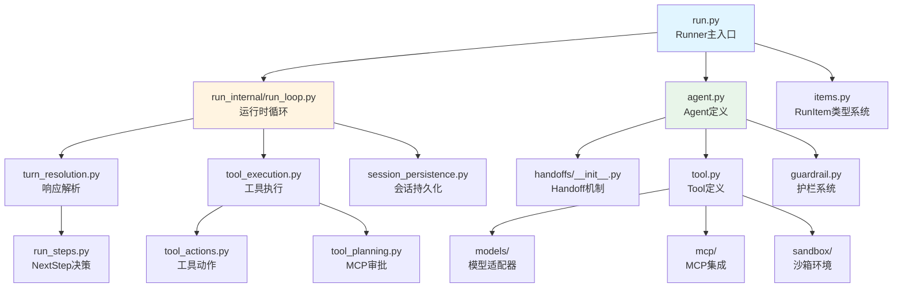

### 2.2 核心目录结构

```
src/agents/
├── run.py                      # Runner 主入口（~500行）
├── agent.py                    # Agent 数据模型（~300行）
├── items.py                    # RunItem 类型系统（~400行）
├── tool.py                     # Tool 定义（~2000行）
├── stream_events.py            # 流式事件定义（63行）
│
├── run_internal/               # 运行时内部实现
│   ├── run_loop.py             # 主循环逻辑（~1921行）
│   ├── turn_resolution.py      # 响应解析（~1965行）
│   ├── tool_execution.py       # 工具执行（~2376行）
│   ├── session_persistence.py  # 会话持久化（~30KB）
│   ├── tool_actions.py         # 工具动作（~33KB）
│   ├── tool_planning.py        # MCP审批规划（~24KB）
│   └── model_retry.py          # 模型重试（~25KB）
│
├── handoffs/                   # Handoff 机制
│   └── __init__.py             # Handoff 定义（~200行）
│
├── models/                     # 模型适配器
│   ├── openai_chat_completions.py
│   ├── openai_responses.py
│   └── ...
│
├── mcp/                        # MCP 集成
│   ├── server.py
│   └── client.py
│
├── sandbox/                    # 沙箱环境
│   ├── local_shell.py
│   └── daytona.py
│
└── tracing/                    # 追踪系统
    ├── spans.py
    └── processors.py
```

### 2.3 关键文件职责矩阵

| 文件 | 行数 | 核心职责 | 关键类/函数 |
|------|------|----------|-------------|
| `run.py` | ~500 | Runner 主入口 | `Runner.run()`, `Runner.run_sync()` |
| `run_loop.py` | 1921 | 运行时循环 | `start_streaming()`, `run_single_turn()` |
| `turn_resolution.py` | 1965 | 响应解析 | `process_model_response()`, `execute_tools_and_side_effects()` |
| `tool_execution.py` | 2376 | 工具执行 | `execute_function_tool_calls()`, `function_needs_approval()` |
| `agent.py` | ~300 | Agent 定义 | `Agent` dataclass |
| `items.py` | ~400 | 类型系统 | `RunItem`, `MessageOutputItem`, `ToolCallItem` |
| `tool.py` | ~2000 | Tool 定义 | `FunctionTool`, `ComputerTool`, `ShellTool` |
| `stream_events.py` | 63 | 事件定义 | `StreamEvent`, `RunItemStreamEvent` |

---

## 第3章：运行时流程

### 3.1 完整执行流程图

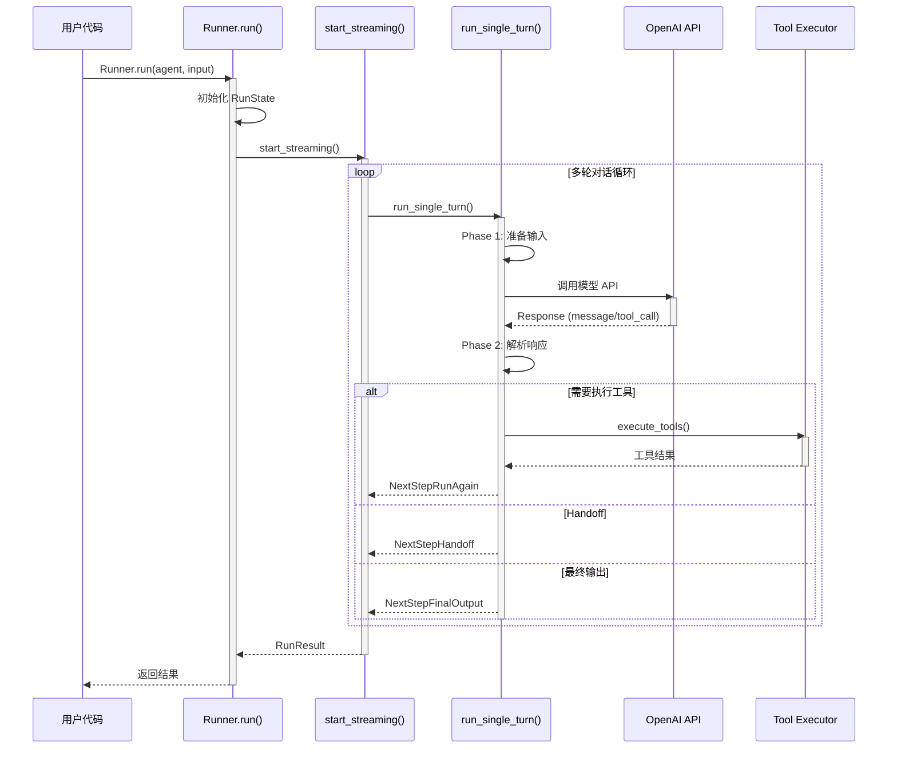

### 3.2 单轮执行详细流程

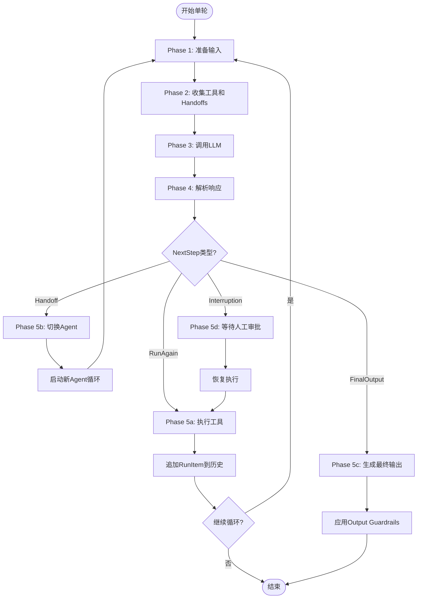

### 3.3 核心循环伪代码

基于 `run_internal/run_loop.py` 的 `start_streaming()` 函数（第400-1399行）：

> **💡 关于 `continue` 的说明**:
> - ✅ `continue` 是**正确的**，它表示“继续下一轮循环”
> - ✅ 在 `NextStepRunAgain`、`NextStepHandoff`、`NextStepInterruption` 情况下，都需要继续循环
> - ✅ 只有在 `NextStepFinalOutput` 情况下才使用 `break` 退出循环
> - ✅ 这符合 Agent Loop 的设计：多轮对话直到生成最终输出

### Session 与 Rollout 读写（概要）

> 完整生命周期、类型转换与 RunItem 子类分工见 **[第7章](#第7章sessionrollout-与-runitem-生命周期)**。

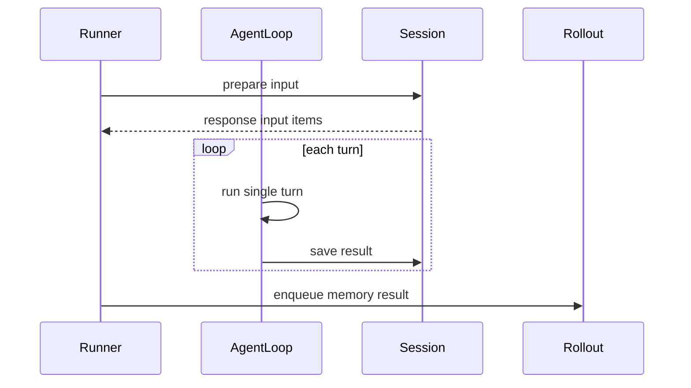

**关键点（基于 `run.py` / `session_persistence.py` 源码）**:

| 存储 | 写入时机 | 存储类型 | 用途 |
|------|----------|----------|------|
| **Session** | 每 Turn 增量 + Run 开始前写用户输入 | `TResponseInputItem`（**不是** `RunItem`） | 跨 `Runner.run()` 的多轮对话上下文 |
| **Rollout** | **整次 `run()` 的 `finally` 块**写一次 | JSONL segment | Sandbox `Memory` 的长期记忆提取（Phase-1/2） |

- Session 持久化路径：`RunItem` → `run_item_to_input_item()` → `session.add_items()`
- `ToolApprovalItem` 经转换返回 `None`，**不会**进入 Session
- Rollout **不是**每个 Turn 写一次；旧版文档「每 Turn 写 Rollout」的描述与当前源码不符
- Rollout 写入仅在 Sandbox + Memory 启用时发生

```python
async def start_streaming(
    starting_input: str | list[TResponseInputItem],
    streamed_result: RunResultStreaming,
    starting_agent: Agent[TContext],
    max_turns: int | None,
    hooks: RunHooks[TContext],
    context_wrapper: RunContextWrapper[TContext],
    run_config: RunConfig,
    session: Session | None = None,  # ← Session 对象
    rollout_id: str | None = None,   # ← Rollout ID
    ...
):
    """主循环：协调多轮对话"""
    
    current_turn = 0
    current_agent = starting_agent
    
    while True:
        current_turn += 1
        
        # ========== 终止条件检查 ==========
        if max_turns and current_turn > max_turns:
            raise MaxTurnsExceeded(f"Max turns ({max_turns}) exceeded")
        
        # ========== Phase 1: 准备输入 ==========
        prepared_input = await prepare_input_with_session(
            original_input=starting_input,
            current_items=streamed_result.items,
            session=session,
        )
        # ↑ 内部逻辑:
        #   1. 从 Session 读取历史: session.get_items()
        #   2. 合并历史 + 新输入
        #   3. 去重和规范化
        
        # ========== Phase 2: 收集工具和 Handoffs ==========
        all_tools = await get_all_tools(current_agent, context_wrapper)
        handoffs = await get_handoffs(current_agent, context_wrapper)
        
        # 构建工具 schema
        tool_schemas = build_tool_schemas(all_tools + handoffs)
        
        # ========== Phase 3: 调用 LLM ==========
        model_response = await get_new_response(
            agent=current_agent,
            input_items=prepared_input,
            tools=tool_schemas,
            model_settings=current_agent.model_settings,
        )
        
        # 发送原始响应事件
        await emit_event(RawResponsesStreamEvent(data=model_response))
        
        # ========== Phase 4: 解析响应 ==========
        processed_response = process_model_response(
            response=model_response,
            tools=all_tools,
            handoffs=handoffs,
        )
        
        # ========== Phase 5: 根据 NextStep 类型处理 ==========
        
        if isinstance(processed_response.next_step, NextStepRunAgain):
            # ===== 情况1: 需要执行工具 =====
            tool_results = await execute_tools_and_side_effects(
                function_calls=processed_response.function_calls,
                tools=all_tools,
                context_wrapper=context_wrapper,
            )
            
            # 将工具结果添加到历史
            for result in tool_results:
                item = ToolCallOutputItem(
                    raw_item=result.output,
                    agent=current_agent,
                )
                streamed_result.items.append(item)
                await emit_event(RunItemStreamEvent(
                    name="tool_output",
                    item=item,
                ))
            
            # ✅ 写入 Session: 保存本轮生成的所有 RunItems
            await save_result_to_session(
                session=session,
                original_input=starting_input,
                generated_items=[],
                new_items=processed_response.new_items + tool_results,
                response_id=model_response.response_id,
                store_setting=run_config.store_setting,
            )
            # ↑ 内部逻辑:
            #   1. 将 RunItem 转换为 TResponseInputItem: item.to_input_item()
            #   2. 追加到 Session: session.add_items(input_items)
            
            # Rollout 不在每 Turn 写入；见 run.py finally → enqueue_memory_result()
            
            # 继续下一轮
            continue
            
        elif isinstance(processed_response.next_step, NextStepHandoff):
            # ===== 情况2: Handoff 到其他 Agent =====
            handoff_step = processed_response.next_step
            new_agent = await handoff_step.on_invoke_handoff(
                context_wrapper,
                handoff_step.input_json,
            )
            
            # 发送 Agent 更新事件
            await emit_event(AgentUpdatedStreamEvent(new_agent=new_agent))
            
            # ✅ 写入 Session: 保存 Handoff 记录
            await save_result_to_session(
                session=session,
                original_input=starting_input,
                generated_items=processed_response.new_items,
                new_items=[handoff_step.handoff_output_item],
                response_id=model_response.response_id,
                store_setting=run_config.store_setting,
            )
            
            # 切换到新 Agent
            current_agent = new_agent
            continue
            
        elif isinstance(processed_response.next_step, NextStepFinalOutput):
            # ===== 情况3: 生成最终输出 =====
            final_step = processed_response.next_step
            
            # 应用 Output Guardrails
            if current_agent.output_guardrails:
                validated_output = await apply_output_guardrails(
                    output=final_step.output,
                    guardrails=current_agent.output_guardrails,
                    context_wrapper=context_wrapper,
                )
            else:
                validated_output = final_step.output
            
            # ✅ 写入 Session: 保存最终输出
            await save_result_to_session(
                session=session,
                original_input=starting_input,
                generated_items=processed_response.new_items,
                new_items=[final_step.final_output_item],
                response_id=model_response.response_id,
                store_setting=run_config.store_setting,
            )
            
            # 设置最终结果
            streamed_result.final_output = validated_output
            streamed_result.is_complete = True
            break
            
        elif isinstance(processed_response.next_step, NextStepInterruption):
            # ===== 情况4: 需要人工审批 =====
            interruption_step = processed_response.next_step
            
            # ✅ 写入 Session: 保存中断前的状态
            await save_result_to_session(
                session=session,
                original_input=starting_input,
                generated_items=processed_response.new_items,
                new_items=interruption_step.interruptions,
                response_id=model_response.response_id,
                store_setting=run_config.store_setting,
            )
            
            # 暂停执行，等待外部输入
            streamed_result.is_waiting_for_input = True
            await emit_event(interruption_step.event)
            
            # 等待恢复信号
            await wait_for_resume()
            continue
```

### 3.4 NextStep 决策系统详解

#### **核心概念**

`NextStep` 是 **Agent 运行时循环的决策结果**，用于告诉主循环下一步应该做什么。

它是一个**联合类型（Union Type）**，包含 4 种可能的下一步动作：

```python
# src/agents/run_internal/run_steps.py:181
next_step: NextStepHandoff | NextStepFinalOutput | NextStepRunAgain | NextStepInterruption
```

---

#### **4 种 NextStep 类型**

##### **1. NextStepRunAgain - 继续下一轮对话**

```python
@dataclass
class NextStepRunAgain:
    pass  # ← 无参数，表示“再跑一轮”
```

**触发条件**：
- LLM 调用了工具，需要执行后再次调用 LLM
- 工具执行完成，但还没有最终答案

**示例场景**：
```
用户: “帮我查一下今天的天气”
LLM: 调用 get_weather(city="Beijing") 工具
→ NextStepRunAgain()  # 执行工具后，再问 LLM 如何回复
```

---

##### **2. NextStepFinalOutput - 输出最终结果**

```python
@dataclass
class NextStepFinalOutput:
    output: Any  # ← 最终输出内容
```

**触发条件**：
- LLM 给出了最终答案（没有工具调用）
- 所有工具执行完毕，可以生成最终回复

**示例场景**：
```
LLM: “今天北京的天气是晴天，气温 25°C”
→ NextStepFinalOutput(output="今天北京的天气是晴天，气温 25°C")
```

---

##### **3. NextStepHandoff - 切换到另一个 Agent**

```python
@dataclass
class NextStepHandoff:
    new_agent: Agent[Any]  # ← 要切换到的目标 Agent
```

**触发条件**：
- 当前 Agent 调用了 handoff 工具
- 需要将任务交给更专业的 Agent

**示例场景**：
```
客服 Agent: “这个问题需要技术支持，我帮你转接...”
→ NextStepHandoff(new_agent=tech_support_agent)
```

---

##### **4. NextStepInterruption - 等待人工审批**

```python
@dataclass
class NextStepInterruption:
    interruptions: list[ToolApprovalItem]  # ← 等待审批的工具列表
```

**触发条件**：
- 工具配置了 `approval_required=True`
- 需要用户手动批准才能执行

**示例场景**：
```
LLM: 调用 delete_database() 工具（需要审批）
→ NextStepInterruption(interruptions=[delete_database_approval])
# 暂停运行，等待用户点击“批准”或“拒绝”
```

---

#### **完整决策流程图**

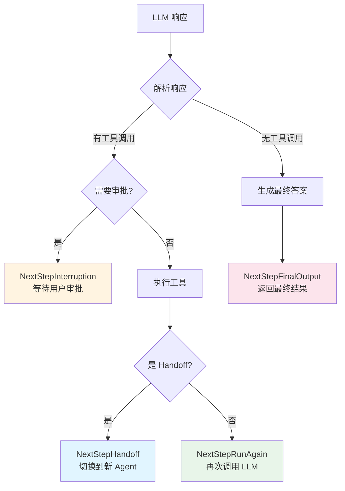

---

#### **主循环处理逻辑**

```python
# src/agents/run_internal/run_loop.py
while True:
    result = await run_single_turn(...)
    
    if isinstance(result.next_step, NextStepRunAgain):
        current_turn += 1
        continue  # ← 继续循环
    
    elif isinstance(result.next_step, NextStepFinalOutput):
        streamed_result.final_output = result.next_step.output
        break  # ← 退出循环
    
    elif isinstance(result.next_step, NextStepHandoff):
        current_agent = result.next_step.new_agent
        continue  # ← 用新 Agent 继续
    
    elif isinstance(result.next_step, NextStepInterruption):
        streamed_result.interruptions = result.next_step.interruptions
        return result  # ← 返回给用户审批
```

---

#### **设计模式分析**

这是一个典型的 **状态机（State Machine）** 设计：

| 组件 | 角色 |
|------|------|
| `SingleStepResult` | 状态容器 |
| `next_step` | 状态转移指令 |
| `run_loop.py` | 状态机引擎 |
| 4 种 NextStep | 4 种状态转移方向 |

**优点**：
- ✅ **解耦** - 决策逻辑（`turn_resolution.py`）与执行逻辑（`run_loop.py`）分离
- ✅ **可扩展** - 新增状态只需添加新的 NextStep 类型
- ✅ **可测试** - 每个状态转移可以独立测试
- ✅ **清晰** - 一眼就能看出下一步要做什么

---

### 3.5 关键数据结构流转

```
用户输入 (str | list[TResponseInputItem])
    ↓
prepare_input_with_session ← Session.get_items() 读出历史
    ↓
Run 内循环产生 RunItem（generated_items / session_items）
    ├─ MessageOutputItem / ToolCallItem / ToolCallOutputItem / ...
    ↓
save_result_to_session: RunItem → TResponseInputItem → Session.add_items()
    ↓
RunResult (final_output, new_items: list[RunItem], ...)
    ↓
[Sandbox] run() finally → Rollout JSONL（整次 run 一条 segment）
```

详见 [7.4 单次 Run 内的三套列表](#74-单次-run-内的三套列表)。
## 一、RunHooks（全局 Run 级别钩子）

```
class MyRunHooks(RunHooks):
```

全部可重写 async 方法：

表格

| 钩子方法 | 触发时机 | 参数说明 |
| --- | --- | --- |
| `on_agent_start` | **任意 Agent 开始执行前**（每次切换 Agent 都会触发） | `(context: RunContextWrapper, agent: Agent)` |
| `on_agent_end` | **任意 Agent 产出最终输出结束后** | `(context: RunContextWrapper, agent: Agent, output)` |
| `on_llm_start` | 任意一次 LLM 模型请求发出**之前** | `(context: RunContextWrapper, agent: Agent)` |
| `on_llm_end` | 任意一次 LLM 模型响应返回**之后** | `(context: RunContextWrapper, agent: Agent, response)` |
| `on_tool_start` | **任意 Agent 调用工具执行之前**（Shell/File/MCP 等） | `(context: RunContextWrapper, agent: Agent, tool)` |
| `on_tool_end` | **任意 Agent 工具执行完成、拿到返回结果之后** | `(context: RunContextWrapper, agent: Agent, tool, result)` |
| `on_handoff` | Agent‑to‑Agent 交接发生瞬间（A→B） | `(context: RunContextWrapper, from_agent: Agent, to_agent: Agent)` |

>
> RunHooks 没有 `on_start` / `on_end`；**整条 Run 任务开始 / 结束没有独立回调**。整条 Run 结束只能靠你 `await Runner.run()` 返回之后写后置代码。

## 二、AgentHooks（绑定到单个 Agent 实例）

```
agent.hooks = MyAgentHooks()
```

可重写 async 回调：

表格

| 钩子方法 | 触发时机 | 参数 |
| --- | --- | --- |
| `on_start` | **当前这个 Agent 被启动执行之前** | `(context: RunContextWrapper, agent: Agent)` |
| `on_end` | **当前 Agent 产出最终结果结束** | `(context: RunContextWrapper, agent: Agent, output)` |
| `on_llm_start` | 该 Agent 发起一次 LLM 调用前 | `(context: RunContextWrapper, agent: Agent)` |
| `on_llm_end` | 该 Agent 一次 LLM 调用完成后 | `(context: RunContextWrapper, agent: Agent, response)` |
| `on_tool_start` | **该 Agent 即将调用工具** | `(context: RunContextWrapper, agent: Agent, tool)` |
| `on_tool_end` | **该 Agent 工具调用完成** | `(context: RunContextWrapper, agent: Agent, tool, result)` |
| `on_handoff` | **当前 Agent 是交接的目标方（别人把任务交给我）** | `(context: RunContextWrapper, agent: Agent, source: Agent)` |

>
> ⚠️ AgentHooks 的 `on_handoff` 和 RunHooks 的 `on_handoff` 参数不一样：
>
>
> - RunHooks: `(ctx, from_agent, to_agent)` —— 看到转出 + 转入双方
> - AgentHooks: `(ctx, myself, source_agent)` —— 我是接收方，source 是谁转过来

# 三、一张对比表

表格

| 维度 | RunHooks | AgentHooks |
| --- | --- | --- |
| 挂载位置 | Runner.run(hooks=…) | agent.hooks = … |
| 生效范围 | 整条 run 内**所有 agent 全局可见** | **仅当前单个 agent** |
| 交接回调参数 | from、to 双方 | 只收到来源 agent |
| 适合场景 | 全局日志追踪、全链路埋点、全局记忆钩子、监控所有工具调用 | Agent‑专属校验、单 Agent 前置初始化、Agent 结束时局部记忆落地 |
---

## 第4章：核心模块详解

### 4.1 Agent 数据模型

基于 `src/agents/agent.py`（第1-200行）：

```python
@dataclass
class Agent(Generic[TContext]):
    """Agent 是可执行的核心单元"""
    
    # === 基本标识 ===
    name: str
    """Agent 名称，用于日志和追踪"""
    
    instructions: str | Callable[[RunContextWrapper[TContext]], MaybeAwaitable[str]]
    """系统提示词，可以是静态字符串或动态生成的函数"""
    
    # === 模型配置 ===
    model: str | Model | None = None
    """使用的模型（字符串名称或 Model 实例）"""
    
    model_settings: ModelSettings = field(default_factory=ModelSettings)
    """模型参数（temperature, top_p, max_tokens等）"""
    
    # === 能力配置 ===
    tools: list[Tool] = field(default_factory=list)
    """可用的工具列表"""
    
    mcp_servers: list[MCPServer] = field(default_factory=list)
    """MCP 服务器列表（用于动态工具发现）"""
    
    handoffs: list[Handoff[Any, Agent[Any]] | Agent[Any]] = field(default_factory=list)
    """可转移到的其他 Agent 或 Handoff 定义"""
    
    output_type: type[TContext] | AgentOutputSchemaBase | None = None
    """期望的输出类型（用于结构化输出）"""
    
    # === 护栏系统 ===
    input_guardrails: list[InputGuardrail[TContext]] = field(default_factory=list)
    """输入验证护栏（在调用 LLM 之前执行）"""
    
    output_guardrails: list[OutputGuardrail[TContext]] = field(default_factory=list)
    """输出验证护栏（在生成最终输出后执行）"""
    
    # === 生命周期钩子 ===
    hooks: AgentHooks[TContext] | None = None
    """Agent 级别的钩子（on_start, on_end等）"""
    
    # === 高级配置 ===
    tool_use_behavior: ToolUseBehavior = "run_llm_again"
    """工具使用行为（是否立即再次调用 LLM）"""
    
    reset_tool_choice: bool | None = None
    """是否在每次调用后重置 tool_choice"""
    
    retries: int | RetryConfig | None = None
    """重试配置"""
    
    tool_error_function: ToolErrorFunction | None = None
    """工具错误处理函数"""
    
    trace_include_sensitive_data: bool = True
    """是否在追踪中包含敏感数据"""
```

#### Agent 的关键方法

```python
class Agent:
    def clone(self, **overrides: Any) -> Agent[TContext]:
        """创建 Agent 的浅拷贝，允许覆盖特定字段"""
        # 使用 dataclasses.replace() 实现
        return replace(self, **overrides)
    
    async def get_system_prompt(self, context: RunContextWrapper[TContext]) -> str:
        """获取系统提示词（支持动态生成）"""
        if callable(self.instructions):
            return await _coro.maybe_await(self.instructions(context))
        return self.instructions
    
    def get_all_tools(self) -> list[Tool]:
        """获取所有可用工具（包括 MCP 动态工具）"""
        # 合并静态工具和 MCP 工具
        return self.tools + self._mcp_tools_cache
```

### 4.2 RunItem 类型系统

基于 `src/agents/items.py`（第1-200行）：

```python
@dataclass
class RunItemBase(Generic[T], abc.ABC):
    """所有运行时对象的基类"""
    
    agent: Agent[Any]
    """产生此项的 Agent"""
    
    raw_item: T
    """原始的 OpenAI API 响应对象"""
    
    _agent_ref: weakref.ReferenceType[Agent[Any]]
    """Agent 的弱引用（避免内存泄漏）"""
    
    @property
    def agent_name(self) -> str:
        return self.agent.name

# === 具体类型 ===

@dataclass
class MessageOutputItem(RunItemBase[ResponseOutputMessage]):
    """LLM 输出的消息"""
    type: Literal["message_output_item"] = "message_output_item"

@dataclass
class ToolCallItem(RunItemBase[ResponseFunctionToolCall]):
    """工具调用请求"""
    type: Literal["tool_call_item"] = "tool_call_item"

@dataclass
class ToolCallOutputItem(RunItemBase[dict[str, Any]]):
    """工具调用结果"""
    type: Literal["tool_call_output_item"] = "tool_call_output_item"
    output: Any
    """工具的返回值"""

@dataclass
class HandoffCallItem(RunItemBase[ResponseFunctionToolCall]):
    """Handoff 调用请求"""
    type: Literal["handoff_call_item"] = "handoff_call_item"

@dataclass
class HandoffOutputItem(RunItemBase[dict[str, Any]]):
    """Handoff 调用结果"""
    type: Literal["handoff_output_item"] = "handoff_output_item"
    source_agent: Agent[Any]
    target_agent: Agent[Any]

@dataclass
class ReasoningItem(RunItemBase[ResponseReasoningItem]):
    """推理过程（仅某些模型支持）"""
    type: Literal["reasoning_item"] = "reasoning_item"
```

#### RunItem 与 Session 的关系（易混淆点）

**Session 里存的不是 `RunItem`，而是 `TResponseInputItem`。**

```python
# memory/session.py — Session 协议
async def add_items(self, items: list[TResponseInputItem]) -> None: ...

# run_internal/session_persistence.py — 持久化前转换
for run_item in new_run_items:
    converted = run_item_to_input_item(run_item, ...)
    if converted is None:  # ToolApprovalItem 在此被跳过
        continue
await session.add_items(items_to_save)
```

| 层级 | 类型 | 作用 |
|------|------|------|
| Run 运行时 | `RunItem` | 带 `agent`、`type`、`raw_item` 的结构化事件 |
| Session 存储 | `TResponseInputItem` | 扁平 dict/Pydantic，直接作为 Responses API input |
| 读出 | `TResponseInputItem` | `get_items()` → 下次 run 拼入 `prepared_input` |

#### RunItem 的设计要点

1. **泛型设计**：`RunItemBase[T]` 中的 `T` 对应不同的 OpenAI API 响应类型
2. **弱引用**：`_agent_ref` 使用 `weakref.ReferenceType` 避免循环引用；`release_agent()` 可主动释放
3. **类型标记**：每个子类有唯一的 `type` 字段；框架用 `isinstance` / `item.type` 分支，而非解析 dict 的 `"type"`
4. **与 Session 分工**：`RunItem` 是**单次 run 的运行时事件模型**；跨 run 记忆走 Session，不走 `RunItem` 直存

#### 子类分工（为何不只用一个 dict）

子类存在是因为框架需要在 **API 线格式之外** 携带控制面信息，且部分类型 **故意不可** 写入 Session：

| RunItem 子类 | 框架用途 | 进 Session？ |
|--------------|----------|-------------|
| `MessageOutputItem` | 助手文本；`ItemHelpers.text_message_outputs()` | ✅ |
| `ToolCallItem` / `ToolCallOutputItem` | 工具链；`output` 保留 Python 对象，`raw_item` 为模型可见字符串 | ✅ |
| `HandoffCallItem` / `HandoffOutputItem` | 多 Agent；后者含 `source_agent` / `target_agent` | ✅（handoff 时 Session 可记全量） |
| `ToolApprovalItem` | HITL；`to_input_item()` 抛错；在 `RunResult.interruptions` | ❌ |
| `ReasoningItem` | 推理块；可 strip id 再持久化 | ✅（策略相关） |
| `ToolSearchCallItem` / `ToolSearchOutputItem` | 自定义 `to_input_item()`，去掉 replay 非法字段 | ✅ |
| `MCP*Item` | MCP 列表/审批生命周期 | 视类型 |
| `CompactionItem` | 上下文压缩摘要 | ✅ |

**调用方何时需要关心 RunItem：**

- 只要 `final_output` + `session` → 可忽略 `new_items`
- 流式 UI → `RunItemStreamEvent`（`tool_called`、`handoff_occured` 等）
- 工具审批 → `result.interruptions: list[ToolApprovalItem]`
- 审计 / 按 Agent 归因 → 遍历 `result.new_items`，读 `item.agent`、`item.tool_name`

```python
class ItemHelpers:
    @staticmethod
    def text_message_outputs(items: list[RunItem]) -> str:
        """拼接所有 MessageOutputItem 的文本"""
        ...

    @staticmethod
    def tool_call_outputs(items: list[RunItem]) -> list[ToolCallOutputItem]:
        """提取所有工具调用结果"""
        return [item for item in items if isinstance(item, ToolCallOutputItem)]
```

`RunResult.to_input_list(mode="preserve_all"|"normalized")` 将 `new_items` 转回 input 列表；handoff 过滤后若与 Session 不一致，用 `mode="normalized"` 对齐模型真实所见（`_model_input_items`）。

### 4.3 NextStep 决策系统

基于 `src/agents/run_internal/run_steps.py`：

```python
# === NextStep 的四种类型 ===

@dataclass
class NextStepRunAgain:
    """继续执行，需要再次调用 LLM"""
    pass

@dataclass
class NextStepHandoff:
    """转移到另一个 Agent"""
    new_agent: Agent[Any]
    input_json: str
    on_invoke_handoff: Callable[..., Awaitable[Agent[Any]]]

@dataclass
class NextStepFinalOutput:
    """生成最终输出"""
    output: Any

@dataclass
class NextStepInterruption:
    """暂停执行，等待人工干预"""
    event: StreamEvent
    resume_token: str

# === ProcessedResponse：解析后的响应 ===

@dataclass
class ProcessedResponse:
    """模型响应的处理结果"""
    
    next_step: NextStep
    """下一步行动决策"""
    
    function_calls: list[ResponseFunctionToolCall]
    """需要执行的函数调用"""
    
    handoff_calls: list[ResponseFunctionToolCall]
    """Handoff 调用"""
    
    message_outputs: list[ResponseOutputMessage]
    """消息输出"""
```

#### 决策逻辑流程

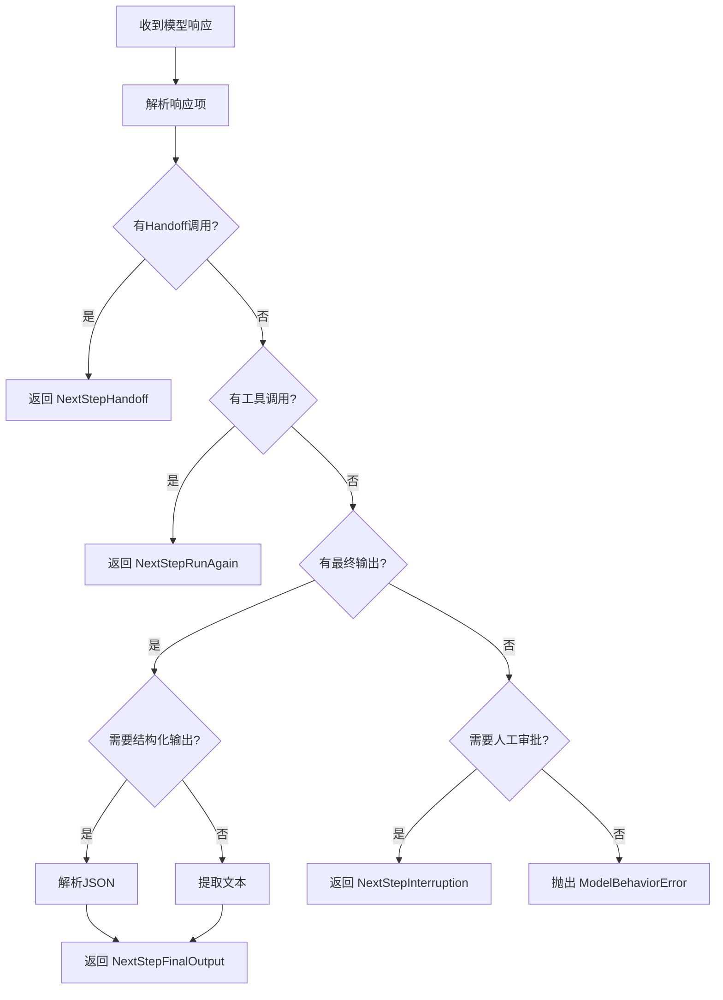

---

## 第5章：多Agent协作机制

### 5.1 Handoff 架构总览

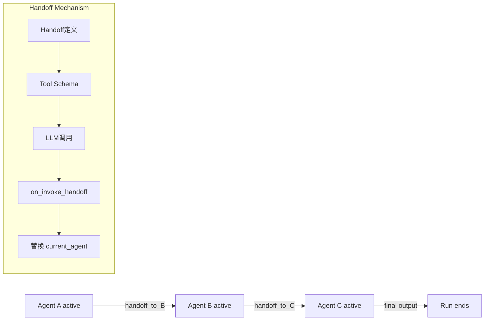

> Handoff 是控制权转移，不是函数调用栈。目标 Agent 处理完后不会自动返回上一个 Agent；如果需要“返回”，必须显式配置反向 handoff，或改用 `Agent.as_tool()` 让 manager Agent 保持控制权。

### 5.2 Handoff 的三种创建方式

#### 方式1：直接传递 Agent 对象

```python
from agents import Agent, Runner

researcher = Agent(name="Researcher", instructions="...")
writer = Agent(name="Writer", instructions="...", handoffs=[researcher])

# Writer 可以转移给 Researcher
result = await Runner.run(writer, "写一篇关于AI的文章")
```

#### 方式2：使用 `handoff()` 函数创建

```python
from agents import Agent, handoff, RunContextWrapper

def create_handoff_with_filter():
    """创建带输入过滤器的 Handoff"""
    return handoff(
        agent=researcher,
        input_filter=lambda data: {
            "query": data.get("query", ""),
            "max_depth": 3,  # 限制搜索深度
        },
    )

writer = Agent(
    name="Writer",
    handoffs=[create_handoff_with_filter()],
)
```

#### 方式3：动态 Handoff（基于上下文）

```python
from agents import Agent, handoff, RunContextWrapper

async def dynamic_handoff_creator(
    context: RunContextWrapper,
    args: dict,
) -> Agent:
    """根据上下文动态决定转移到哪个 Agent"""
    if args.get("task_type") == "code":
        return code_reviewer
    elif args.get("task_type") == "docs":
        return documentation_writer
    else:
        return general_assistant

coordinator = Agent(
    name="Coordinator",
    handoffs=[
        handoff(
            tool_name="delegate_task",
            on_invoke_handoff=dynamic_handoff_creator,
        )
    ],
)
```

### 5.3 Handoff 执行流程

基于 `src/agents/handoffs/__init__.py` 和 `run_internal/turn_resolution.py`：

```python
@dataclass
class Handoff(Generic[TContext, TAgent]):
    """Handoff 定义"""
    
    tool_name: str
    """工具名称（LLM 调用的函数名）"""
    
    tool_description: str
    """工具描述（帮助 LLM 理解何时使用）"""
    
    input_json_schema: dict[str, Any]
    """输入参数的 JSON Schema"""
    
    on_invoke_handoff: Callable[[RunContextWrapper[Any], str], Awaitable[TAgent]]
    """执行 Handoff 时的回调函数"""
    
    agent_name: str
    """目标 Agent 的名称"""
    
    input_filter: HandoffInputFilter | None = None
    """输入过滤器（可选）"""
    
    nest_handoff_history: bool | None = None
    """是否嵌套 Handoff 历史（默认 True）"""


async def execute_handoffs(
    *,
    public_agent: Agent[TContext],
    original_input: str | list[TResponseInputItem],
    new_response: ModelResponse,
    pre_step_items: list[RunItem],
    new_step_items: list[RunItem],
    handoff_calls: list[ResponseFunctionToolCall],
    handoffs: list[Handoff[Any, Agent[Any]]],
    hooks: RunHooks[TContext],
    context_wrapper: RunContextWrapper[TContext],
    run_config: RunConfig,
) -> SingleStepResult:
    """执行 Handoff 调用"""
    
    # 1. 查找对应的 Handoff 定义
    handoff_lookup = {h.tool_name: h for h in handoffs}
    
    results = []
    for call in handoff_calls:
        handoff_def = handoff_lookup.get(call.name)
        if not handoff_def:
            raise ModelBehaviorError(f"Unknown handoff: {call.name}")
        
        # 2. 解析输入参数
        try:
            input_args = json.loads(call.arguments)
        except json.JSONDecodeError:
            raise ModelBehaviorError(f"Invalid handoff arguments: {call.arguments}")
        
        # 3. 应用输入过滤器
        if handoff_def.input_filter:
            input_args = handoff_def.input_filter(input_args)
        
        # 4. 调用 on_invoke_handoff 获取目标 Agent
        with handoff_span(handoff_def.agent_name):
            target_agent = await handoff_def.on_invoke_handoff(
                context_wrapper,
                json.dumps(input_args),
            )
        
        # 5. 创建 HandoffOutputItem
        handoff_output = HandoffOutputItem(
            agent=public_agent,
            raw_item=call,
            source_agent=public_agent,
            target_agent=target_agent,
        )
        results.append(handoff_output)
        
        # 6. 触发钩子
        await hooks.on_handoff(
            context_wrapper,
            from_agent=public_agent,
            to_agent=target_agent,
        )
    
    # 7. 返回结果（包含新的 Agent）
    return SingleStepResult(
        original_input=original_input,
        new_response=new_response,
        pre_step_items=pre_step_items,
        new_step_items=new_step_items + results,
        next_step=NextStepHandoff(
            new_agent=target_agent,
            input_json=json.dumps(input_args),
            on_invoke_handoff=handoff_def.on_invoke_handoff,
        ),
    )
```

### 5.4 Handoff 历史管理

```python
def nest_handoff_history(
    items: list[RunItem],
    source_agent: Agent[Any],
    target_agent: Agent[Any],
) -> list[RunItem]:
    """嵌套 Handoff 历史
    
    当从一个 Agent 转移到另一个时，可以选择性地：
    1. 保留完整历史（默认）
    2. 只保留最近 N 条消息
    3. 清空历史（全新开始）
    """
    
    # 策略1：保留完整历史
    return items
    
    # 策略2：只保留最近 N 条
    # return items[-10:]
    
    # 策略3：清空历史
    # return []
```

#### 历史管理策略对比

| 策略 | 优点 | 缺点 | 适用场景 |
|------|------|------|----------|
| 保留完整历史 | 上下文完整 | Token 消耗大 | 简单任务链 |
| 截断历史 | 平衡上下文和成本 | 可能丢失重要信息 | 中等复杂度任务 |
| 清空历史 | Token 最少 | 无上下文 | 完全独立的任务 |

---

## 第6章：工具系统

### 6.1 Tool 类型层次

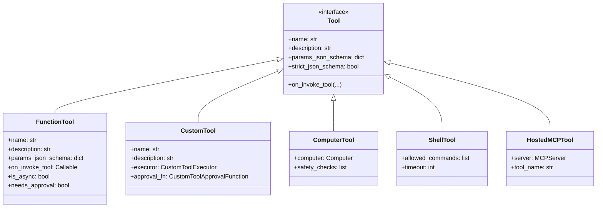

### 6.2 FunctionTool 详解

基于 `src/agents/tool.py`（第200-800行）：

```python
@dataclass
class FunctionTool:
    """基于 Python 函数的工具"""
    
    name: str
    """工具名称（LLM 调用的函数名）"""
    
    description: str
    """工具描述（帮助 LLM 理解用途）"""
    
    params_json_schema: dict[str, Any]
    """参数的 JSON Schema"""
    
    strict_json_schema: bool = True
    """是否使用严格 JSON Schema（推荐 True）"""
    
    on_invoke_tool: Callable[[RunContextWrapper[Any], str], Awaitable[str]]
    """执行工具的函数"""
    
    is_async: bool = False
    """是否是异步函数"""
    
    needs_approval: bool = False
    """是否需要人工审批"""
    
    failure_error_function: ToolErrorFunction | None = None
    """错误处理函数"""
    
    timeout_seconds: float | None = None
    """超时时间（秒）"""
    
    tool_origin: ToolOrigin | None = None
    """工具来源（function/mcp/agent_as_tool）"""
```

#### FunctionTool 的创建方式

**方式1：使用装饰器**

```python
from agents import function_tool, RunContextWrapper

@function_tool
def search_web(query: str, max_results: int = 10) -> str:
    """搜索网络
    
    Args:
        query: 搜索关键词
        max_results: 最大返回结果数
    """
    # 实际搜索逻辑
    results = perform_search(query, max_results)
    return json.dumps(results)
```

**方式2：手动创建**

```python
from agents import FunctionTool, RunContextWrapper
import json

async def search_web_impl(
    context: RunContextWrapper,
    args_json: str,
) -> str:
    """工具实现"""
    args = json.loads(args_json)
    query = args["query"]
    max_results = args.get("max_results", 10)
    
    results = await perform_async_search(query, max_results)
    return json.dumps(results)

search_tool = FunctionTool(
    name="search_web",
    description="搜索网络获取最新信息",
    params_json_schema={
        "type": "object",
        "properties": {
            "query": {"type": "string", "description": "搜索关键词"},
            "max_results": {"type": "integer", "default": 10},
        },
        "required": ["query"],
    },
    on_invoke_tool=search_web_impl,
    is_async=True,
)
```

**方式3：从 Pydantic 模型自动生成**

```python
from pydantic import BaseModel, Field
from agents import function_tool_from_pydantic

class SearchParams(BaseModel):
    query: str = Field(description="搜索关键词")
    max_results: int = Field(default=10, ge=1, le=100)

@function_tool_from_pydantic(SearchParams)
def search_web(params: SearchParams) -> str:
    """搜索网络"""
    results = perform_search(params.query, params.max_results)
    return json.dumps(results)
```

### 6.3 工具执行流程

基于 `src/agents/run_internal/tool_execution.py`（第1500-2000行）：

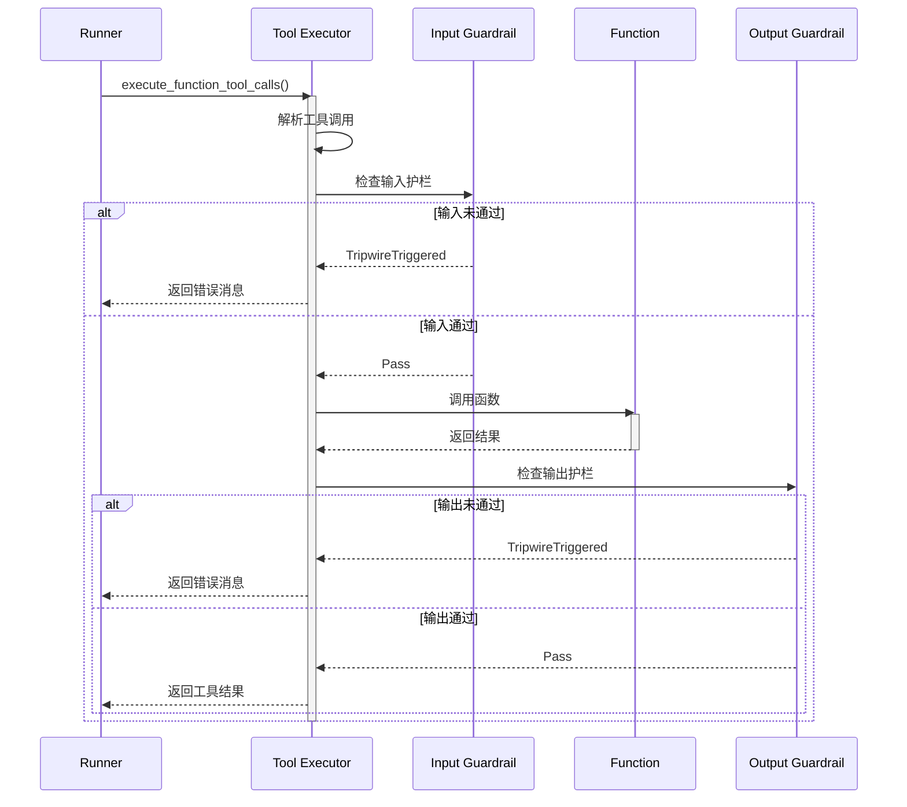

#### 工具执行的核心代码

```python
async def execute_function_tool_calls(
    *,
    calls: list[ResponseFunctionToolCall],
    tools: list[Tool],
    context_wrapper: RunContextWrapper[TContext],
    run_config: RunConfig,
) -> list[FunctionToolResult]:
    """执行函数工具调用"""
    
    # 1. 构建工具查找表
    tool_lookup = build_function_tool_lookup_map(tools)
    
    results = []
    for call in calls:
        # 2. 查找对应的工具
        lookup_key = get_function_tool_lookup_key_for_call(call)
        tool = tool_lookup.get(lookup_key)
        
        if not tool:
            # 工具不存在，返回错误
            error_msg = f"Unknown tool: {call.name}"
            results.append(FunctionToolResult(
                tool_call=call,
                output=error_msg,
                error=ModelBehaviorError(error_msg),
            ))
            continue
        
        # 3. 检查是否需要审批
        if tool.needs_approval:
            approval_needed = await function_needs_approval(
                tool=tool,
                call=call,
                context_wrapper=context_wrapper,
            )
            if approval_needed:
                # 暂停执行，等待审批
                results.append(FunctionToolResult(
                    tool_call=call,
                    output=None,
                    requires_approval=True,
                ))
                continue
        
        # 4. 执行工具
        try:
            if tool.timeout_seconds:
                # 带超时执行
                output = await asyncio.wait_for(
                    tool.on_invoke_tool(context_wrapper, call.arguments),
                    timeout=tool.timeout_seconds,
                )
            else:
                # 正常执行
                output = await tool.on_invoke_tool(
                    context_wrapper,
                    call.arguments,
                )
            
            results.append(FunctionToolResult(
                tool_call=call,
                output=output,
                error=None,
            ))
            
        except asyncio.TimeoutError:
            # 超时错误
            error_msg = f"Tool execution timed out after {tool.timeout_seconds}s"
            results.append(FunctionToolResult(
                tool_call=call,
                output=error_msg,
                error=ToolTimeoutError(error_msg),
            ))
            
        except Exception as e:
            # 其他错误
            error_msg = await handle_tool_error(
                tool=tool,
                context_wrapper=context_wrapper,
                error=e,
            )
            results.append(FunctionToolResult(
                tool_call=call,
                output=error_msg,
                error=e,
            ))
    
    return results
```

### 6.4 特殊工具类型

#### ComputerTool（计算机操作）

```python
from agents import ComputerTool, Computer

# 创建 Computer 实例
computer = Computer(
    environment="mac",  # 或 "windows", "linux"
    dimensions=(1920, 1080),
)

# 创建 ComputerTool
computer_tool = ComputerTool(
    computer=computer,
    safety_checks=[
        "confirm_before_destructive_action",
        "require_approval_for_shell_commands",
    ],
)

# 添加到 Agent
agent = Agent(
    name="DesktopAssistant",
    tools=[computer_tool],
)
```

#### ShellTool（命令行执行）

```python
from agents import ShellTool

shell_tool = ShellTool(
    allowed_commands=["ls", "cat", "grep"],
    blocked_commands=["rm", "sudo", "dd"],
    timeout=30,  # 30秒超时
    working_directory="/tmp",
)

agent = Agent(
    name="DevOpsAssistant",
    tools=[shell_tool],
)
```

#### HostedMCPTool（MCP 协议工具）

```python
from agents import HostedMCPTool, MCPServer

# 连接到 MCP 服务器
server = MCPServer(
    name="filesystem",
    transport="stdio",
    command="npx",
    args=["-y", "@modelcontextprotocol/server-filesystem", "/workspace"],
)

# 自动发现工具
mcp_tools = await server.list_tools()

agent = Agent(
    name="FileExplorer",
    mcp_servers=[server],
)
```

---

## 第7章：Session、Rollout 与 RunItem 生命周期

本章基于 `memory/`、`run_internal/session_persistence.py`、`run.py`、`sandbox/memory/rollouts.py` 源码，说明多轮对话如何读写，以及 `RunItem` 在运行时的角色。**Session 与 Rollout 职责不同，不可混用。**

---

### 7.1 三者职责对比

| 维度 | Session | Rollout | RunItem |
|------|---------|---------|---------|
| **目的** | 多轮对话上下文（下次 `Runner.run` 喂给模型） | Sandbox 长期记忆提取的轨迹日志 | 单次 run 内的结构化事件 |
| **存储形态** | `TResponseInputItem` | JSONL（`{rollout_id}.jsonl`） | 内存 dataclass（`agent` + `raw_item`） |
| **作用域** | 任意 `Runner.run(session=...)` | 仅 `RunConfig(sandbox=...)` + `Memory` capability | 单次 run；可进 `RunState` 做 HITL 恢复 |
| **典型写入时机** | 每 Turn 增量 + run 开始前写用户输入 | **整次 `run()` 结束**（`finally`） | Turn 执行中累积，再经转换写入 Session |

---

### 7.2 Session 完整生命周期

#### 7.2.1 接口与实现

```python
# memory/session.py
class Session(Protocol):
    session_id: str
    async def get_items(self, limit: int | None = None) -> list[TResponseInputItem]: ...
    async def add_items(self, items: list[TResponseInputItem]) -> None: ...
    async def pop_item(self) -> TResponseInputItem | None: ...
    async def clear_session(self) -> None: ...
```

常见实现：`SQLiteSession`（本地 SQLite）、`OpenAIConversationsSession`（服务端会话）、`OpenAIResponsesCompactionSession`（带 compaction）。

#### 7.2.2 多轮读：Run 开始

每次 `Runner.run(input, session=session)` 调用 `prepare_input_with_session()`（`session_persistence.py`）：

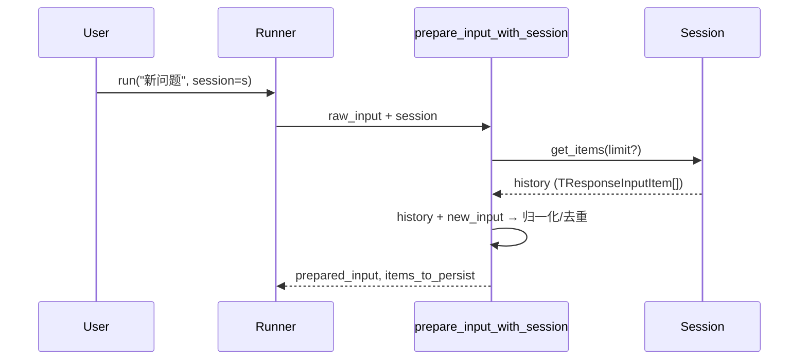

要点：

1. `get_items()` 按 `SessionSettings.limit` 取最近 N 条（时间正序）。
2. 默认 `prepared_input = history + new_input`；`session_input_callback` 可自定义合并，但只把**本 turn 新增**标为待持久化项。
3. **Server-managed**（`conversation_id` / `previous_response_id`）：`include_history_in_prepared_input=False`，历史由 OpenAI 服务端维护；`session_persistence_enabled` 在存在 `OpenAIServerConversationTracker` 时为 false。

#### 7.2.3 多轮写：Run 进行中

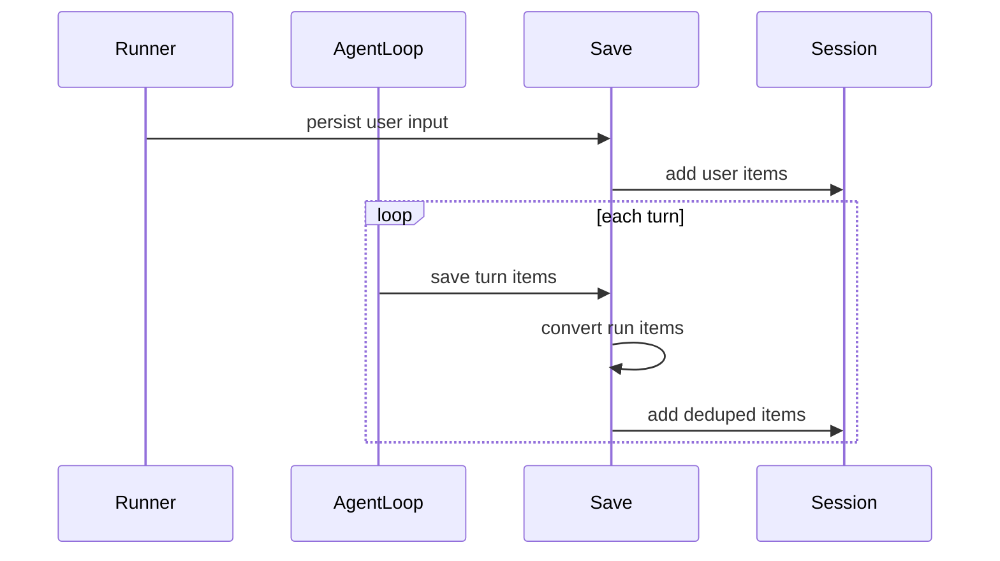

`save_result_to_session()` 还负责：

- **去重 fingerprint**：streaming 重试不重复写入；
- **增量**：`run_state._current_turn_persisted_item_count` 只保存 tail；
- **Compaction**：`OpenAIResponsesCompactionSession` 在本地 tool output 时 defer compaction。

#### 7.2.4 第二次 `Runner.run`（典型多轮）

```python
# Turn 1
result1 = await Runner.run("分析这个 repo", agent, session=session)

# Turn 2 — 同一 session_id，无需手动拼 history
result2 = await Runner.run("再总结一下", agent, session=session)
```

---

### 7.3 Rollout 完整生命周期

Rollout **不是**通用 Session，而是 Sandbox `Memory` 下的可回放轨迹，供 Phase-1 / Phase-2 记忆生成。

#### 7.3.1 rollout_id 解析

```python
# run.py — _sandbox_memory_rollout_id()
# 优先级: conversation_id → session.session_id → group_id → uuid
return resolve_run_grouping_id(conversation_id=..., session=..., group_id=...)
```

同一 `session_id` 的多次 `run()` 可落到同一 `{rollout_id}.jsonl`（若用 session 分组）。

#### 7.3.2 写入时机（源码结论）

**当前实现：整次 `run()` 的 `finally` 写一条 segment，不是每个 Turn 写一次。**

```python
# run.py — Agent Loop 的 finally 块
if completed_result is not None:
    await sandbox_runtime.enqueue_memory_result(completed_result, input_override=memory_input)
elif run_exception is not None:
    await sandbox_runtime.enqueue_memory_payload(...)  # terminal_metadata from exception
```

`enqueue_memory_result` → `build_rollout_payload_from_result` → `SandboxMemoryGenerationManager.enqueue_rollout_payload` → `write_rollout()` 追加 JSONL 一行。

Payload 字段（`sandbox/memory/rollouts.py`）：

```python
{
    "updated_at": "...",
    "rollout_id": "...",
    "input": [...],           # 经 _sanitize_memory_items 过滤
    "generated_items": [...], # RunItem 转 input 后再过滤
    "terminal_metadata": {"terminal_state": "completed|interrupted|...", ...},
    "final_output": ...,      # 可选
    "interruptions": [...],   # 可选
}
```

与 Session 的差异：Rollout 会过滤 `system`/`developer`/`reasoning` 等，面向**记忆提取**而非模型 replay。

#### 7.3.3 Session 关闭后的 Memory 管道

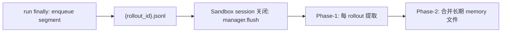

`SandboxMemoryGenerationManager.flush()` 在 `session.register_pre_stop_hook` 注册，关闭 sandbox 时触发。

#### 7.3.4 Session vs Rollout 时机对比（更正版）

| 操作 | 时机 | 频率 |
|------|------|------|
| **Session `add_items`** | 每 Turn（及 run 开始前用户输入） | 每 Turn 多次可能 |
| **Rollout JSONL segment** | `run()` 的 `finally` | **每次 `run()` 一次** |
| **Phase 1 提取** | Sandbox session 关闭 | 每个 rollout 文件 |
| **Phase 2 整合** | Sandbox session 关闭 | 整个 session 一次 |

---

### 7.4 单次 Run 内的三套列表

| 变量 | 类型 | 用途 |
|------|------|------|
| `generated_items` | `list[RunItem]` | **模型下一轮输入**（handoff 后可能被过滤） |
| `session_items` | `list[RunItem]` | 累积进 `RunResult.new_items`，再持久化到 Session |
| `session_input_items_for_persistence` | `list[TResponseInputItem]` | 本 run 用户侧输入，run 开始前写入 Session |

每 Turn 结束（`run.py`）：

```python
generated_items = turn_result.pre_step_items + turn_result.new_step_items
turn_session_items = session_items_for_turn(turn_result)  # 优先 session_step_items
session_items.extend(turn_session_items)
```

`session_items_for_turn()`：若 `turn_result.session_step_items` 已设置则用之，否则 `new_step_items`——用于 handoff 时「Session 记全量、模型只吃子集」。

`RunResult` 字段：

- `new_items` ≈ 全程 `session_items`（可观测）
- `_model_input_items` + `_replay_from_model_input_items`：`to_input_list(mode="normalized")` 时对齐续跑输入

---

### 7.5 RunItem 类型系统与使用场景

#### 7.5.1 类型别名

```python
# items.py
RunItem: TypeAlias = (
    MessageOutputItem | ToolSearchCallItem | ToolSearchOutputItem
    | HandoffCallItem | HandoffOutputItem | ToolCallItem | ToolCallOutputItem
    | ReasoningItem | MCPListToolsItem | MCPApprovalRequestItem
    | MCPApprovalResponseItem | CompactionItem | ToolApprovalItem
)
```

基类 `RunItemBase`：`agent`、`raw_item`、`to_input_item()`、`release_agent()`。

#### 7.5.2 为何需要 RunItem（而不只用 dict）

| | `TResponseInputItem` | `RunItem` |
|--|---------------------|-----------|
| 产生者 | 不记录 | `agent`（多 Agent / handoff） |
| 工具结果 | 多为字符串化 | `ToolCallOutputItem.output` 保留 Python 对象 |
| 审批 | 无 | `ToolApprovalItem` **不进 Session** |
| Handoff | 普通 message/tool | `HandoffOutputItem` 含 `source_agent` / `target_agent` |
| 类型判断 | `item["type"]` 易碎 | `item.type` + `isinstance` |

Handoff 时 `nest_handoff_history()`（`handoffs/history.py`）按 `RunItem` 类型过滤 `ToolApprovalItem`、决定摘要 vs 转发。

#### 7.5.3 调用方示例

```python
# 流式 UI
async for event in result.stream_events():
    if event.type == "run_item_stream_event":
        if event.name == "tool_called":
            ...
        elif event.name == "handoff_occured":
            ...

# HITL
if result.interruptions:  # list[ToolApprovalItem]
    ...

# 审计
for item in result.new_items:
    if item.type == "tool_call_item":
        print(item.agent.name, item.tool_name, item.arguments)
```

---

### 7.6 端到端时序与源码锚点

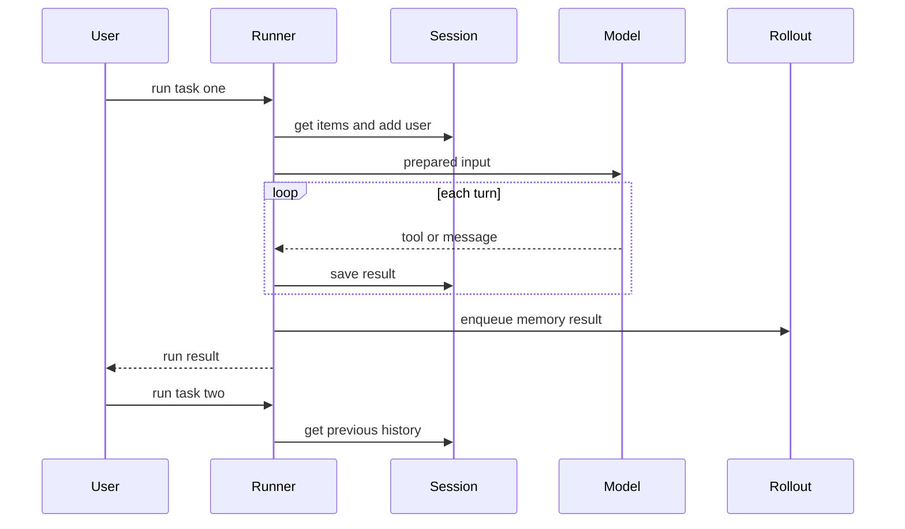

| 能力 | 主要源码 |
|------|----------|
| Session 读/写 | `run_internal/session_persistence.py` |
| Run 主循环 | `run.py`（`session_persistence_enabled`、finally rollout） |
| RunItem 定义 | `items.py`、`run_internal/items.py`（`run_item_to_input_item`） |
| Rollout | `sandbox/memory/rollouts.py`、`sandbox/memory/manager.py`、`sandbox/runtime.py` |
| Handoff 历史 | `handoffs/history.py` |
| 流式事件 | `stream_events.py`（`RunItemStreamEvent`） |

**实践要点：**

1. 多轮对话：固定 `session_id` 的 `Session` 即可；读写自动完成。
2. `RunItem` 面向单次 run 的结构化事件；跨 run 给模型看的是 `TResponseInputItem`。
3. Rollout 仅 Sandbox + Memory；一次 `run()` 一条 segment。
4. Server conversation 模式下勿与纯本地 Session 混用同一 mental model。

---

**待续...**

第二部分将涵盖：
- 第8章：Guardrails 护栏系统
- 第9章：Tracing 追踪与监控
- 第10章：Sandbox 沙箱环境（Memory Phase-1/2 细节）
- 第11章：扩展能力（Voice、Realtime）
- 第12章：最佳实践与设计模式
