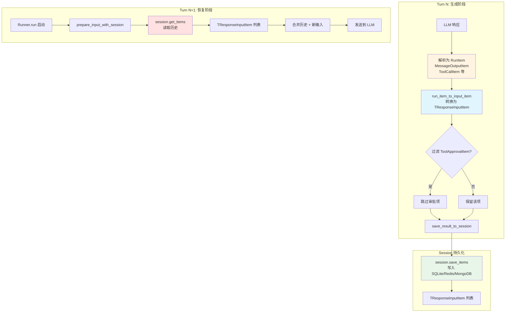
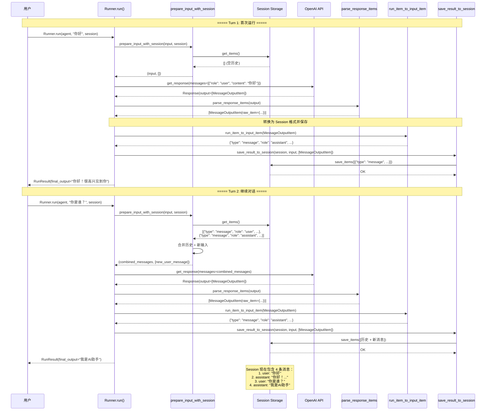
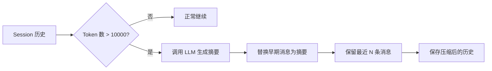

# OpenAI Agents Python SDK 完整架构设计文档（第二部分）

> **版本**: v0.17.2  
> **分析时间**: 2026-05-17（2026-08-10 增补 §7.2a / FAQ Q8）  
> **分析方法**: 源码深度阅读（非官方文档推测）  
> **源码路径**: `/Users/gqli/work/deepagents/openai-agents-python/src/agents`

---

## 📋 目录

- [第7章：Session 持久化与会话管理（深度分析）](#第7章session-持久化与会话管理深度分析)
  - [7.2a 发给大模型的 message：RunItem 还是 Session？](#72a-发给大模型的-messagerunitem-还是-session)
- [第8章：Guardrails 护栏系统](#第8章guardrails-护栏系统)
- [第9章：Tracing 追踪与监控](#第9章tracing-追踪与监控)
- [第10章：Sandbox 沙箱环境](#第10章sandbox-沙箱环境)
- [第11章：扩展能力](#第11章扩展能力)
- [第12章：最佳实践与设计模式](#第12章最佳实践与设计模式)

---

## 第7章：Session 持久化与会话管理（深度分析）

### 7.1 Session 的核心作用

**Session = 对话历史的持久化存储层**

Session 的核心职责是：
1. ✅ **维持对话上下文** - 让 Agent 能够记住之前的对话
2. ✅ **支持多轮对话** - 跨多次 `Runner.run()` 调用保持状态
3. ✅ **历史管理** - 加载、保存、压缩、分支对话历史
4. ✅ **会话隔离** - 不同用户/场景使用不同的 Session

**关键洞察**：
- ❌ Session **不存储** RunItem 对象本身
- ✅ Session 存储的是 **`TResponseInputItem`**（LLM API 标准格式）
- ✅ RunItem → 转换为 `TResponseInputItem` → 保存到 Session
- ✅ 下次运行时：从 Session 加载 `TResponseInputItem` → 作为 LLM 输入

---

### 7.2 Session 数据流转全景图



**关键点**：
- ✅ **RunItem 是中间态** - 只在运行时存在，不直接持久化
- ✅ **Session 存储标准化格式** - `TResponseInputItem`（OpenAI API 兼容）
- ✅ **双向转换** - `run_item_to_input_item()` 和 `to_input_item()`

---

### 7.2a 发给大模型的 message：RunItem 还是 Session？

> **结论**：两边都会参与，但**发给模型的永远是 `TResponseInputItem` 列表，不是 `RunItem`。**

#### 传给大模型的是什么？

| 阶段 | 来源 | 怎么变成模型 input |
|------|------|-------------------|
| **新开一轮 `Runner.run`（有 session）** | `session.get_items()` → 已是 `TResponseInputItem[]` | `prepare_input_with_session`：历史 + 本轮用户输入 |
| **同一次 run 里的多 turn（tool loop）** | 本 run 累积的 `RunItem[]` | `run_items_to_input_items` → 再拼进 input（`_prepare_turn_input_items`） |
| **无 session** | 调用方传入的 str / `TResponseInputItem[]` + 本 run `RunItem` | 同上，只是没有历史预置 |

```text
# 跨 run（session）
session.get_items()  →  TResponseInputItem[]
+ 本轮 user input
→ prepare_input_with_session()  →  发给模型

# 同 run 内下一 turn（刚执行完 tool）
generated RunItems
→ run_item_to_input_item() / run_items_to_input_items()
→ prepare_model_input_items()  →  发给模型
```

`RunItem` 是**运行时对象**（带 `agent`、`type`、`raw_item`）；进模型前必须 `.to_input_item()` / `run_item_to_input_item()` 成 Responses API 形状的 dict。

#### Session 里存什么？Tool 调用和结果存不存？

Session 协议（`memory/session.py`）只存 **`list[TResponseInputItem]`**（JSON 可序列化的 API item），**不存 `RunItem` 对象本身**。

写入路径：`save_result_to_session`（`run_internal/session_persistence.py`）

1. 本轮用户输入 → `TResponseInputItem`
2. 本轮新产生的 `RunItem` → `run_item_to_input_item()` → 再 `session.add_items`

**会存：**

| 内容 | 典型 type |
|------|-----------|
| 用户消息 | `{"role":"user", ...}` |
| 助手消息 | `{"role":"assistant", ...}` 或 message 类 item |
| **工具调用** | `function_call`（来自 `ToolCallItem`） |
| **工具结果** | `function_call_output`（来自 `ToolCallOutputItem`） |
| handoff 相关 output | 也会转成可回放的 input item |
| reasoning 等 | 视策略；有的会 strip id |

**不存 / 不进模型：**

- `tool_approval_item`（审批中断，`to_input_item` 返回 `None`）
- `ToolCallOutputItem.custom_data`（SDK 本地字段，不回放）
- 孤儿 `function_call`（有 call 无 output）会被 `drop_orphan_function_calls` 丢掉，避免坏请求

官方 sessions 文档：运行后会存「用户输入、助手响应、**工具调用等**」。
# Session 存储的数据会不会被修改、删除

先说核心结论：**会被 SDK 主动修改、覆盖、删除，并不是一份只读的日志仓库**，这也是你之前看到 `CompactionSession` 会出现历史断档的根源。

## 一、Session 里面存了什么

Session（FileSession / SQLiteSession / CompactionSession 等）持久化存储：

1. 会话上下文：`list[RunItem]`（消息、工具调用、ReasoningItem、CompactionItem ……）
2. Run 元数据：run‑id、创建时间、上下文 token 计数

>
> ⚠️ **Session ≠ 永久归档日志（你 flush 输出的 jsonl）**
> jsonl 是你自己落地导出的**只读轨迹副本**；Session 是 Agent**运行时可变的工作区**。

## 二、哪些场景会修改 / 删除 Session 内历史数据

### 1. CompactionSession（上下文压缩，最关键）

当触发上下文压缩：

1. Session 内**一批旧的 RunItem 会被物理删除**
2. 新增一条 `CompactionItem`（标记压缩点位）
3. 新增一条摘要 `MessageOutputItem` 替代被删掉的历史
   👉 **原始明细从 Session 里永久消失，无法再读取**

>
> 如果你只依赖 Session 回放历史，压缩后就看不到被切掉的内容。

### 2. 新一轮 Turn 的追加写入（仅新增，不删旧）

每次 `Runner.run()` 完成一轮，调用 `enqueue_result`，只是**append 追加新 RunItem**，默认不会修改、删除历史。

### 3. 手动代码修改 Session

你可以直接调用 session 的底层接口：

- `remove_items()` 删除指定范围条目
- `replace_items()` 覆盖、替换一段历史
  业务代码可以主动篡改会话历史。

### 4. 多轮长 Run + Handoff 多智能体交接

Agent 切换不会删除历史，所有 RunItem 继续追加写入同一个 Session。

## 三、Session VS 你自己导出的 jsonl 轨迹（重要分界线）

表格

| 对象 | 是否可变 | 会不会丢失历史 |
| --- | --- | --- |
| SDK Session（运行时存储） | ✅ **可变、可删、可覆盖** | 会！Compaction 会删掉原始条目 |
| 你 flush 写出的 rollout‑xxx.jsonl | 你控制，只读归档 | 只要你不手动删文件，永久完整保存全部轨迹，包含被压缩前原始内容 |

>
> 非常关键的工程结论：
> **不要把 Session 当做唯一可信的历史数据源。如果你需要完整无删减回放整条会话，必须在会话早期或者会话结束 pre‑stop‑hook 阶段导出一份独立 jsonl 归档。**

## 四、结合你的记忆流水线风险提示

1. 如果你 Phase‑1 直接**读取 Session 获取历史 items**：
  - 中途发生过 Compaction → Session 内原始明细已经被删掉，只能读到摘要 + CompactionItem；记忆提炼会丢失细节。
2. 如果你 Phase‑1 读取**提前导出的 jsonl 文件**：
  - jsonl 是快照，不受 Session 后续压缩 / 删除操作影响，历史完整
#### 对照一句话

| 问题 | 答案 |
|------|------|
| 发给模型的是 RunItem 还是 Session item？ | **统一是 `TResponseInputItem`**；Session 直接给；本 run 的 RunItem 先转化 |
| Session 存啥？ | 对话历史的 **API 形态 items** |
| Tool 调用/结果存吗？ | **存**（`function_call` + `function_call_output`） |

#### 完整示例（一个 tool turn + 下一轮）

```python
from agents import Agent, Runner, SQLiteSession, function_tool

@function_tool
def get_weather(city: str) -> str:
    return f"Sunny in {city}"

agent = Agent(name="Assistant", tools=[get_weather])
session = SQLiteSession("demo", "demo.db")

# —— Run 1 ——
result = await Runner.run(agent, "旧金山天气？", session=session)

# 内存里：result.new_items 是 RunItem
# 例如 ToolCallItem / ToolCallOutputItem / MessageOutputItem

# Session 里：已是 TResponseInputItem（大致如下）
items = await session.get_items()
# [
#   {"role": "user", "content": "旧金山天气？"},
#   {"type": "function_call", "name": "get_weather",
#    "arguments": "{\"city\":\"San Francisco\"}", "call_id": "call_abc"},
#   {"type": "function_call_output", "call_id": "call_abc",
#    "output": "Sunny in San Francisco"},
#   {"role": "assistant", "content": "旧金山今天晴天。"},
# ]

# —— Run 2 —— 自动：history(session) + 新 user → 发给模型
result2 = await Runner.run(agent, "那纽约呢？", session=session)
# 模型看到的 ≈ items + {"role":"user","content":"那纽约呢？"}
```

同一次 `run` 内部若多轮 tool：当前 turn 的 `RunItem` 先转成 input，**再**在合适时机 `save_result_to_session` 写入 session，供**下一次** `Runner.run` 使用。

源码锚点：
- `_prepare_turn_input_items` — `src/agents/run_internal/run_loop.py`
- `prepare_input_with_session` / `save_result_to_session` — `src/agents/run_internal/session_persistence.py`
- `run_item_to_input_item` / `run_items_to_input_items` — `src/agents/run_internal/items.py`

---

### 7.3 RunItem 如何转换为 Session Items

#### **核心函数：`run_item_to_input_item()`**

**位置**: `src/agents/run_internal/items.py:66-82`

```python
def run_item_to_input_item(
    run_item: RunItem,
    reasoning_item_id_policy: ReasoningItemIdPolicy | None = None,
) -> TResponseInputItem | None:
    """Convert a run item to model input, optionally stripping reasoning IDs."""
    
    # ⚠️ 关键：ToolApprovalItem 不能发送给 LLM
    if run_item.type == "tool_approval_item":
        return None
    
    # 方式1: 如果 RunItem 有 to_input_item() 方法，调用它
    to_input = getattr(run_item, "to_input_item", None)
    input_item = to_input() if callable(to_input) else cast(TResponseInputItem, run_item.raw_item)
    
    # 清理 status 字段（API 不需要）
    if isinstance(input_item, dict) and input_item.get("status") is None:
        input_item = {k: v for k, v in input_item.items() if k != "status"}
    
    # 处理 Reasoning Item ID（可选策略）
    if (
        _should_omit_reasoning_item_ids(reasoning_item_id_policy)
        and run_item.type == "reasoning_item"
    ):
        return _without_reasoning_item_id(input_item)
    
    return cast(TResponseInputItem, input_item)
```

**关键逻辑**：
1. ✅ **过滤 ToolApprovalItem** - 审批项不能发送给 LLM（会破坏对话流）
2. ✅ **调用 `to_input_item()`** - 每个 RunItem 类型都有自己的转换逻辑
3. ✅ **清理元数据** - 移除 `status` 等内部字段
4. ✅ **返回 `TResponseInputItem`** - OpenAI API 标准格式

---

#### **各类 RunItem 的转换示例**

##### **1. MessageOutputItem → message**

```python
# RunItem（运行时）
MessageOutputItem(
    raw_item={
        "type": "message",
        "role": "assistant",
        "content": [{"type": "output_text", "text": "你好！"}],
        "id": "msg_abc123",
    },
    agent=agent_ref,
)

# ↓ to_input_item() ↓

# TResponseInputItem（Session 存储）
{
    "type": "message",
    "role": "assistant",
    "content": [{"type": "output_text", "text": "你好！"}],
    # ✅ id 保留（用于去重）
}
```

---

##### **2. ToolCallItem → function_call**

```python
# RunItem（运行时）
ToolCallItem(
    raw_item={
        "type": "function_call",
        "name": "get_weather",
        "call_id": "call_xyz789",
        "arguments": '{"city": "Beijing"}',
    },
    agent=agent_ref,
)

# ↓ to_input_item() ↓

# TResponseInputItem（Session 存储）
{
    "type": "function_call",
    "name": "get_weather",
    "call_id": "call_xyz789",
    "arguments": '{"city": "Beijing"}',
}
```

---

##### **3. ToolCallOutputItem → function_call_output**

```python
# RunItem（运行时）
ToolCallOutputItem(
    raw_item={
        "type": "function_call_output",
        "call_id": "call_xyz789",
        "output": '{"temperature": 25}',  # ← 字符串格式
    },
    output={"temperature": 25},  # ← Python 对象（运行时用）
    agent=agent_ref,
)

# ↓ to_input_item() ↓

# TResponseInputItem（Session 存储）
{
    "type": "function_call_output",
    "call_id": "call_xyz789",
    "output": '{"temperature": 25}',  # ← 只保留字符串格式
}
```

**关键洞察**：
- ✅ `raw_item["output"]` 是字符串（LLM 需要的格式）
- ✅ `output` 字段是 Python 对象（运行时方便使用）
- ✅ Session 只存储 `raw_item`（字符串格式）

---

##### **4. ToolApprovalItem → ❌ 被过滤**

```python
# RunItem（运行时）
ToolApprovalItem(
    raw_item={
        "type": "function_call",
        "name": "delete_database",
        "call_id": "call_approve_001",
        "arguments": '{"db_name": "production"}',
    },
    tool_name="delete_database",
    arguments={"db_name": "production"},
)

# ↓ run_item_to_input_item() ↓

# ❌ 返回 None（不保存到 Session）
None
```

**为什么？**
- ❌ ToolApprovalItem 表示"等待用户审批"
- ❌ 如果保存到 Session，下次运行时会重新触发审批
- ❌ 审批通过后，工具执行结果会以 `ToolCallOutputItem` 形式保存

---

### 7.4 save_result_to_session() 完整流程

**位置**: `src/agents/run_internal/session_persistence.py:225-389`

```python
async def save_result_to_session(
    session: Session | None,
    original_input: str | list[TResponseInputItem],
    new_items: list[RunItem],  # ← 本轮生成的所有 RunItem
    run_state: RunState | None = None,
    *,
    response_id: str | None = None,
    reasoning_item_id_policy: ReasoningItemIdPolicy | None = None,
    store: bool | None = None,
) -> int:
    """
    Persist a turn to the session store.
    
    Returns:
        The number of new run items persisted for this call.
    """
    
    # ========== Step 1: 检查是否已持久化（避免重复）==========
    already_persisted = run_state._current_turn_persisted_item_count if run_state else 0
    
    if session is None:
        return 0
    
    # 获取未持久化的新 RunItem
    if already_persisted >= len(new_items):
        new_run_items = []
    else:
        new_run_items = new_items[already_persisted:]
    
    # ========== Step 2: 准备原始输入 ==========
    input_list: list[TResponseInputItem] = []
    if original_input:
        input_list = normalize_input_items_for_api(
            [
                ensure_input_item_format(item)
                for item in ItemHelpers.input_to_new_input_list(original_input)
            ]
        )
    
    # ========== Step 3: 转换 RunItem → TResponseInputItem ==========
    is_openai_conversation_session = isinstance(session, OpenAIConversationsSession)
    resolved_reasoning_item_id_policy = (
        reasoning_item_id_policy
        if reasoning_item_id_policy is not None
        else (run_state._reasoning_item_id_policy if run_state is not None else None)
    )
    persistence_reasoning_item_id_policy = (
        None if is_openai_conversation_session else resolved_reasoning_item_id_policy
    )
    
    new_items_as_input: list[TResponseInputItem] = []
    for run_item in new_run_items:
        converted = run_item_to_input_item(run_item, persistence_reasoning_item_id_policy)
        if converted is None:  # ← ToolApprovalItem 被过滤
            continue
        new_items_as_input.append(ensure_input_item_format(converted))
    
    # ========== Step 4: 去重（优先保留最新的）==========
    items_to_save = deduplicate_input_items_preferring_latest(
        input_list + new_items_as_input
    )
    
    # ========== Step 5: 特殊处理 OpenAI Conversations API ==========
    if is_openai_conversation_session and items_to_save:
        items_to_save = [_sanitize_openai_conversation_item(item) for item in items_to_save]
    
    # ========== Step 6: 保存到 Session ==========
    await session.save_items(items_to_save)
    
    return len(new_run_items)
```

**关键步骤**：
1. ✅ **防重复** - 通过 `run_state` 跟踪已持久化的数量
2. ✅ **转换** - `run_item_to_input_item()` 批量转换
3. ✅ **过滤** - ToolApprovalItem 返回 `None`，被跳过
4. ✅ **去重** - `deduplicate_input_items_preferring_latest()`
5. ✅ **保存** - `session.save_items()`

---

### 7.5 prepare_input_with_session() 完整流程

**位置**: `src/agents/run_internal/session_persistence.py:54-188`

```python
async def prepare_input_with_session(
    input: str | list[TResponseInputItem],
    session: Session | None,
    session_input_callback: SessionInputCallback | None,
    session_settings: SessionSettings | None = None,
    *,
    include_history_in_prepared_input: bool = True,
    preserve_dropped_new_items: bool = False,
) -> tuple[str | list[TResponseInputItem], list[TResponseInputItem]]:
    """
    准备模型输入（包含会话历史）
    
    Returns:
        tuple[prepared_input, items_to_persist]:
            - prepared_input: 发送给模型的完整输入（历史 + 新消息）
            - items_to_persist: 需要保存到 Session 的新消息
    """
    
    if session is None:
        # 没有 Session，直接返回原始输入
        return input, []
    
    # ========== Step 1: 加载历史 ==========
    resolved_settings = session.session_settings or SessionSettings()
    if session_settings:
        resolved_settings = resolved_settings.resolve(session_settings)
    
    if resolved_settings.limit:
        history = await session.get_items(limit=resolved_settings.limit)
    else:
        history = await session.get_items()
    
    # ========== Step 2: 转换格式 ==========
    converted_history = [
        strip_internal_metadata(item)  # ← 清理内部元数据
        for item in history
    ]
    
    new_input_list = [
        ensure_input_item_format(item)
        for item in ItemHelpers.input_to_new_input_list(input)
    ]
    
    # ========== Step 3: 应用回调函数（可选）==========
    if session_input_callback:
        # 允许用户自定义历史合并逻辑
        combined = session_input_callback(
            copy.deepcopy(converted_history),
            copy.deepcopy(new_input_list),
        )
        
        # 识别哪些是新消息（需要持久化）
        appended_items = identify_new_items(
            combined,
            converted_history,
            new_input_list,
        )
    else:
        # 默认：简单拼接
        combined = converted_history + new_input_list
        appended_items = new_input_list
    
    # ========== Step 4: 去重和规范化 ==========
    normalized = normalize_input_items_for_api(combined)
    deduplicated = deduplicate_input_items_preferring_latest(normalized)
    
    # ========== Step 5: 返回结果 ==========
    return deduplicated, appended_items
```

**关键步骤**：
1. ✅ **加载历史** - `session.get_items(limit=...)`
2. ✅ **清理元数据** - `strip_internal_metadata()`
3. ✅ **合并** - 历史 + 新输入
4. ✅ **去重** - `deduplicate_input_items_preferring_latest()`
5. ✅ **返回** - `(prepared_input, items_to_persist)`

---

### 7.6 Session 完整生命周期时序图



---

### 7.7 Session vs Rollout vs Memory 对比

| 维度 | Session | Rollout | Memory |
|------|---------|---------|--------|
| **存储内容** | `TResponseInputItem` 列表 | JSONL（Rollout Payload） | Markdown 文件 |
| **数据来源** | RunItem → `to_input_item()` | RunItem + 元数据 | Rollout → Phase 1/2 提取 |
| **存储格式** | SQLite/Redis/MongoDB | `{sessions_dir}/{id}.jsonl` | `memories/raw_memories/*.md` |
| **写入时机** | 每轮 Turn 后 | 每轮 Turn 后 | Session 关闭时（flush） |
| **读取时机** | 每轮 Turn 前 | Phase 1 提取时 | 每次 Session 启动时 |
| **用途** | LLM 输入（短期记忆） | 执行轨迹归档 | 长期记忆索引 |
| **可变性** | 可修改（add/pop/clear） | 不可变（追加） | 可更新（Phase 2 整合） |
| **生命周期** | Session 期间 | 永久（审计追溯） | 永久（知识积累） |

**关键洞察**：
- ✅ **Session 不直接使用 RunItem** - RunItem 只是中间态，转换为 `TResponseInputItem` 后存储
- ✅ **Rollout 记录完整执行轨迹** - 包含 `terminal_metadata`（成功/失败状态）
- ✅ **Memory 从 Rollout 提取** - Phase 1 提取原始记忆，Phase 2 整合为长期记忆

---

### 7.8 Session 高级特性

#### **7.8.1 会话分支（Branching）**

```python
from agents.memory import InMemorySession

# 主会话
main_session = InMemorySession(session_id="chat_main")

# 第一轮对话
result1 = await Runner.run(main_session, "帮我写一个Python函数")
# Session: [user: "帮我写...", assistant: "def hello():..."]

# 分支：探索另一种实现
branch_session = main_session.branch(session_id="chat_branch_1")
result2 = await Runner.run(branch_session, "用递归方式实现")
# Branch Session: [user: "帮我写...", assistant: "def hello():...",<br/>              user: "用递归方式实现", assistant: "def hello_recursive():..."]

# 主会话不受影响
result3 = await Runner.run(main_session, "再优化一下性能")
# Main Session: [user: "帮我写...", assistant: "def hello():...",<br/>              user: "再优化一下性能", assistant: "..."]
```

**内部实现**：
```python
class InMemorySession(Session):
    def branch(self, session_id: str) -> "InMemorySession":
        """创建分支会话（复制当前历史）"""
        branched = InMemorySession(session_id=session_id)
        branched._items = self._items.copy()  # ← 浅拷贝历史
        return branched
```

---

#### **7.8.2 会话压缩（Compaction）**

```python
from agents.memory import OpenAIResponsesCompactionArgs, SessionSettings

session = OpenAIConversationsSession(
    conversation_id="conv_long",
    session_settings=SessionSettings(
        compaction_args=OpenAIResponsesCompactionArgs(
            max_tokens=10000,  # 超过此阈值时触发压缩
            strategy="summarize",  # 压缩策略
        )
    ),
)

# 当对话长度超过 10000 tokens 时，SDK 会自动：
# 1. 调用 LLM 生成摘要
# 2. 用摘要替换早期消息
# 3. 保留最近 N 条消息不变
```

**压缩流程**：


##### **⚡ 关键机制：正常增量追加 vs 压缩全量重写**

为了兼顾性能与正确性，SDK 在不同场景下采用不同的底层存储更新策略：

* **正常对话更新（增量追加）**：
  * 在日常对话流转中，SDK 通过 `session.add_items()` 仅将本轮产生的**新数据**（如用户新输入、助手回复、工具输出）以 **`INSERT` 增量追加** 的方式写入数据库（例如 SQLite 的 `INSERT INTO`）。这确保了常规对话交互时极高的数据写入性能。
* **会话历史压缩（先清空，后全量重写）**：
  * 当触发压缩时，由于整个会话历史的结构和内容被重构了（早期消息被合并替换为一条 Summary 摘要，仅保留最近 N 条明细），旧的索引和物理位置已经失效。
  * 此时，SDK 会调用 `_replace_underlying_session_items`，**先调用 `clear_session()` 清空** 该会话的所有旧数据，然后再调用 `add_items()` 将压缩重构后的完整消息列表**全量写入**底层存储。
  * **容错与回滚机制**：如果清空或全量写入过程中发生任何异常，SDK 都会触发回滚，将清空前的原始历史数据（`previous_items`）重新写入底层存储，避免因异常导致用户的会话历史永久丢失。

---

#### **7.8.3 自定义会话回调**

```python
from agents import SessionInputCallback

def custom_merge_history(
    history: list[dict],
    new_input: list[dict],
) -> list[dict]:
    """自定义历史合并逻辑"""
    
    # 示例：只保留最近的 5 条消息
    if len(history) > 5:
        history = history[-5:]
    
    # 示例：添加系统提示
    system_prompt = {
        "role": "system",
        "content": "你是一个专业的编程助手",
    }
    
    return [system_prompt] + history + new_input

session = InMemorySession(session_id="chat_custom")

result = await Runner.run(
    agent,
    input="帮我写代码",
    session=session,
    session_input_callback=custom_merge_history,  # ← 自定义回调
)
```

---

### 7.9 Session 最佳实践

#### **✅ 好的做法**

```python
# 1. 限制历史长度（节省 Token）
session = InMemorySession(
    session_id="chat_001",
    session_settings=SessionSettings(limit=20),  # 只保留最近20条
)

# 2. 使用唯一 session_id（避免冲突）
import uuid
session_id = f"user_{user_id}_chat_{uuid.uuid4().hex[:8]}"
session = InMemorySession(session_id=session_id)

# 3. 定期清理旧会话
async def cleanup_old_sessions(sessions_dir: Path, max_age_days: int = 30):
    """清理超过30天的会话文件"""
    now = time.time()
    for session_file in sessions_dir.glob("*.json"):
        if now - session_file.stat().st_mtime > max_age_days * 86400:
            session_file.unlink()

# 4. 异常时保存会话状态
try:
    result = await Runner.run(agent, input, session=session)
except Exception as e:
    # 保存错误信息到会话
    await session.save_items([{
        "role": "system",
        "content": f"Error: {str(e)}",
    }])
    raise
```

#### **❌ 坏的做法**

```python
# 1. 不限制历史长度（可能导致 Token 超限）
session = InMemorySession(session_id="chat_unlimited")  # ❌

# 2. 使用固定 session_id（多用户冲突）
session = InMemorySession(session_id="chat")  # ❌ 所有用户共享

# 3. 忘记清理旧会话（磁盘空间泄漏）
# ❌ 没有 cleanup 逻辑

# 4. 直接修改 Session 内部状态
session._items.append({...})  # ❌ 应该使用 session.save_items()
```
1. ✅ **Runner 内部循环的局部内存变量、临时缓冲区全部销毁**
   Runner 协程退出，它内部 `generated_items` 局部列表会被垃圾回收。
2. ✅ **但是在返回之前，SDK 做了一次快照拷贝**
   把**当前 Turn 已经生成好的 `ToolCallItem`，复制一份放进 RunResult 内部快照字段**
3. `ToolApprovalItem` 放入 `result.interruptions`
4. **Session 全程没有写入 ToolCallItem**（依旧是空，没有改动）

>
> 👉 `Runner.run()` 返回 ≠ 待审批的 ToolCallItem 丢失，因为快照已经拷贝到 RunResult 对象上。

## 2、`to_state()`：断点快照保存载体

```
state = result.to_state()
```

`RunState` 就是**独立于 Runner、独立于 Session 的可序列化断点快照对象**openai.git...。
RunState 内部字段：

- `_generated_items: list[RunItem]` → 这里存了那份 **ToolCallItem 的副本**
- `interruptions` → `ToolApprovalItem`
- 当前会话上下文、token 用量、agent 状态

>
> RunState 完全**不和 Session 绑定**，你甚至可以把它 `state.to_json()` 序列化存入数据库，杀掉整个进程，过几天再 `RunState.from_json()` 恢复运行，ToolCallItem 依旧存在。

### 时序完整拆解（审批中断全链路）

```
1. LLM生成 ToolCallItem，放在Runner局部内存缓冲区
2. 检测 needs_approval=True → 不执行工具，不调用 enqueue_result，不写入Session
3. 创建 ToolApprovalItem，放入中断列表
4. 【快照拷贝】把 ToolCallItem 复制一份 → 存入RunResult内部快照
5. Runner.run() 返回！Runner局部内存销毁（原始缓冲区副本消失）
    ⚠️ 但是 RunResult 对象还在你上层代码内存里，快照还活着！
6. 你调用 result.to_state() → 快照迁移存入 RunState 对象
    → 现在就算把 RunResult 丢掉，RunState 依然持有 ToolCallItem
-------- 此时你可以等待人工审批，甚至杀掉进程 --------
7. approve / reject 状态
8. await Runner.run(agent, state) 恢复运行
    → Runner从RunState快照读取 ToolCallItem
    → 执行工具（或拒绝）
    → 生成 ToolCallOutputItem
    → 【终于】ToolCallItem + ToolCallOutputItem 一起 enqueue_result，写入Session持久化
```
# 先把 3 份完全独立的 `list[RunItem]` 讲清楚（源码视角，openai‑agents‑python）

>
> 很多人混淆，根源：**有三份完全不一样的 RunItem 列表，不是同一个东西**

## 1️⃣ Session 里面的：持久化历史列表

```
session.items : list[RunItem]
```

- **含义：已经跑完、落盘、永久生效的会话历史**
- 来源：只有 `enqueue_result` / `save_result_to_session()` 追加进去
- 生命周期：存在 SQLite / 文件 / 你的后端存储，**Runner 重启、进程杀掉也不会丢**
- 审批中断暂停的时候：**这里面绝对不会有待审批的 ToolCallItem**

>
> Session = “已经结案的历史账本”

---

## 2️⃣ Runner 循环内部临时缓冲区：`generated_items`（局部变量）

文件位置：`run_loop.py`，`run_single_turn` 的局部变量

```
generated_items: list[RunItem] = []
```

- **含义：当前这一轮 Turn，正在跑、还没有结案的临时产出**
- 本轮 LLM 返回 `ToolCallItem` → append 进这个列表
- ⚠️ **生命周期极短：本轮 Turn 结束，Runner.run () 返回之后，这个局部变量就被丢弃、GC 回收销毁**
- 👉 **审批中断那一刻，ToolCallItem 在这个列表里**，但马上就要随函数返回而消失！

>
> 临时缓冲区 = “草稿纸，跑完这一轮就扔”

---

## 3️⃣ RunResult / RunState 快照副本：`_generated_items`

当检测到审批中断，Turn 被迫中止：
Runner 做一次 **拷贝**

```
snapshot_items = generated_items.copy()
```

把这份副本放到返回结果对象：

```
RunResult._generated_items: list[RunItem]
```

然后你调用：

```
state = result.to_state()
```

这份列表再**拷贝一次，迁移进 RunState**

```
RunState._generated_items : list[RunItem]
```

- RunState 的 `_generated_items` = **断点快照副本**
- 和原来 Runner 局部 `generated_items` 已经**不是同一个内存对象**
- 你甚至可以序列化 `state.to_json()` 存到数据库、杀掉进程；以后加载回来 `RunState.from_json()`，这份 RunItem 列表依然存在
- **全程不碰 Session**

>
> RunState._generated_items = “拍了一张草稿纸的照片存起来，以后拿照片接着写”

# 一张表格彻底分清三份 list [RunItem]

表格

| 对象 | 字段 | 是否包含待审批 ToolCallItem（中断暂停时刻） | 生命周期 | 是否写入 Session |
| --- | --- | --- | --- | --- |
| Runner run_loop 局部缓冲区 | `generated_items: list[RunItem]` | ✅ 有（原始草稿） | 本轮 Turn；Runner.run 返回就销毁 | ❌ 没写入 |
| RunResult | `_generated_items: list[RunItem]` | ✅ 拷贝副本 | 你上层代码持有 RunResult 期间 | ❌ 没写入 |
| RunState（断点快照） | `_generated_items: list[RunItem]` | ✅ 拷贝副本 | 独立生命周期，可序列化持久化 | ❌ 没写入 |
| Session | `items: list[RunItem]` | ❌ **完全没有** | 永久会话存储 | 审批恢复跑完 Turn 之后，才会追加进去 |

# 审批中断完整内存变化时序（一步一步看列表去向）

```
1. run_single_turn()启动本轮Turn
    → 创建局部变量 generated_items = []

2. LLM返回工具调用 → generated_items.append(ToolCallItem)
    > 【此时】ToolCallItem 在 Runner局部草稿列表

3. approvals.py检测 needs_approval=True → 中断Turn
    > 不执行工具；不调用 enqueue_result；Session.items 完全不动！

4. Runner 拷贝一份 generated_items → RunResult._generated_items
    > 副本诞生

5. await Runner.run() 返回！
    → run_single_turn 函数退出
    → ✅ Runner局部的 generated_items 草稿列表 被销毁！！（GC回收）
    > 现在唯一活着的副本在 RunResult 对象上

6. state = result.to_state()
    → 列表再拷贝一次迁移到 RunState._generated_items
    > 就算你把 result 丢弃，RunState仍然保有这份ToolCallItem列表

7. 用户审批完成，Runner.run(agent, state)恢复执行
    → Runner从 RunState._generated_items 读取 ToolCallItem
    → 执行工具，产出 ToolCallOutputItem
    → 【终于】两份item送入 enqueue_result，追加写入 Session.items
```

# 最容易踩坑的核心误区

>
> ❌ 误区：`Session.items` = 当前正在跑的所有 RunItem
> ✅ 真相：Session 只存**已经结案完成**的历史。
> 当前 Turn 未结案、审批断点中的 RunItem，**根本不在 Session 里，只在快照 RunState 中**。

# 源码完整拆解：恢复时 Runner 的 `generated_items`（RunItem 草稿列表）是怎么重建出来的

先重申 3 个核心实体，避免混淆

1. `generated_items`：**run‑loop 内部本轮 Turn 局部草稿列表（Runner 运行时内存）**，只存活于这一次 `run_single_turn`；它不是 Session 的、也不是 RunState 的持久字段。
2. `RunState._generated_items`：**断点快照里保存的草稿副本（审批中断那一刻拷出来的）**。
3. `Session.items`：**已经结案、永久落地的历史记录**，和本轮断点草稿无关。

---

## 一、恢复启动时完整数据流

当你执行恢复调用：

```
await Runner.run(agent, run_state=xxx, approved_tool_calls=approvals)
```

### 步骤 1：Runner 加载两份独立数据源

1. 从 **Session.get_items()** 读出**全部历史会话上下文（旧的、已经结案的 RunItem）**

>
> 这份历史上下文用来构建 LLM 消息窗口，**不会拷贝进本轮 `generated_items` 草稿列表！**
> Session 历史 ≠ 本轮 Turn 草稿缓冲区。
2. 从 **`RunState._generated_items`** 读出断点快照内保存下来的 RunItem（也就是 `ToolCallItem`）。

### 步骤 2：进入 `run_single_turn()`，新建空的局部草稿列表

```
# run_loop.py 内部
generated_items: list[RunItem] = []
```

>
> 全新的空列表！最开始里面什么都没有。

### 步骤 3：把 RunState 快照中的断点 RunItem，追加进本轮新建的草稿缓冲区

```
# 恢复分支 resuming_turn = True
generated_items.extend(run_state._generated_items)
```

👉 **至此，Runner 本轮内存里的 `generated_items` 就拿到了之前中断时那个 ToolCallItem**。

>
> 关键点：
> `generated_items` 是**全新创建的局部列表**，数据内容是**从 RunState 快照拷贝过来**；**并不是从 Session 读取出来的**。
> Session 的历史 items 永远不会被导入到本轮 `generated_items`。

### 步骤 4：继续执行剩下逻辑（审批放行 → 执行工具）

执行工具后生成 `ToolCallOutputItem`，`append` 进同一个 `generated_items`：

```
generated_items.append(ToolCallOutputItem)
```

现在草稿缓冲区完整内容：`[ToolCallItem, ToolCallOutputItem]`

### 步骤 5：Turn 跑完，落盘写入 Session

调用 `enqueue_result / save_result_to_session`

```
session.enqueue(generated_items)
```

两条 RunItem 正式追加写入 Session 持久存储，本轮 Turn 结案。

---

# 用流程图直观展示拷贝关系

```
【断点快照】RunState._generated_items = [ ToolCallItem ]
        ↓ 拷贝extend()
【新建】Runner run‑loop局部 generated_items = [ ToolCallItem ]
        ↓执行工具
generated_items.append(ToolCallOutputItem)
        ↓ Turn结束落盘
Session.items 追加 [ToolCallItem, ToolCallOutputItem]

# Session历史上下文 走另外一条独立通道（只喂给LLM，不进generated_items）
Session.items → LLM prompt上下文窗口
```

---

# 高频误区澄清

## ❌误区 1：恢复时 generated_items 从 Session 加载

>
> 错。Session 此时**还没有 ToolCallItem**；审批断点的 RunItem 从来没有写入 Session，只能从 RunState 快照拷贝。

## ❌误区 2：RunState 里面装了全部会话历史，恢复后不需要 Session

>
> 错。RunState 只存**被打断那一轮未完成 Turn 的草稿 items**，完整历史上下文仍然靠 Session 读取，历史消息送入 LLM，但**不会进入 generated_items 草稿列表**。

## ❌误区 3：generated_items 就是 Session.items 的内存镜像

>
> 错：
>
>
> - `generated_items`：本轮 Turn**临时草稿**，函数结束即销毁；
> - `Session.items`：所有已经完成 Turn 的**永久历史账本**；
    > 只有 Turn 跑完，草稿才会合并追加进账本。

---
**每一轮 Turn 完整跑完，就立刻落盘 Session，不会等到整个 Run 结束才一次性写**openai.git...。
这就是你说的：一次 run 有多轮 turn，每次 turn 结束写 session，**这个结论完全正确**。
# 对比：中断时刻 VS 恢复时刻两份列表的变化

表格

| 时机 | Runner 局部 generated_items | RunState._generated_items | Session.items |
| --- | --- | --- | --- |
| 审批中断暂停（第一次 run 返回） | 有 ToolCallItem，函数返回后销毁 | 存有 ToolCallItem 副本 | 无 ToolCallItem |
| 恢复运行，刚进入 run_single_turn | 新建空列表 → extend (RunState 快照) → 拿到 ToolCallItem | 仍然存有 ToolCallItem 副本 | 无 ToolCallItem |
| 工具执行完毕 Turn 结束 | [ToolCallItem,ToolCallOutputItem] | 不变 | 追加写入这两条 item |


---

### 7.10 Session 常见问题解答

#### **Q1: 为什么 Session 不直接存储 RunItem？**

**A**: 
- ✅ **标准化** - `TResponseInputItem` 是 OpenAI API 标准格式，可以直接发送给 LLM
- ✅ **兼容性** - 支持多种后端（SQLite、Redis、MongoDB、OpenAI API）
- ✅ **简洁性** - RunItem 包含运行时元数据（如 `_agent_ref`），不需要持久化
- ✅ **灵活性** - 可以轻松切换 Session 实现（内存、数据库、云存储）

---

#### **Q2: ToolApprovalItem 为什么不保存到 Session？**

**A**:
- ❌ ToolApprovalItem 表示"等待用户审批"
- ❌ 如果保存，下次运行时会重新触发审批（无限循环）
- ✅ 审批通过后，工具执行结果以 `ToolCallOutputItem` 形式保存
- ✅ 这样 LLM 能看到工具执行结果，而不是审批请求

---

#### **Q3: Session 和 Rollout 有什么区别？**

**A**:
- **Session** = 对话历史（用于继续对话）
  - 存储 `TResponseInputItem` 列表
  - 可修改（add/pop/clear/compaction）
  - 用途：LLM 输入
  
- **Rollout** = 执行轨迹（用于记忆提取）
  - 存储 JSONL（包含 `terminal_metadata`）
  - 不可变（追加写入）
  - 用途：Phase 1/2 提取记忆

**类比**：
- Session = 聊天记录（微信对话历史）
- Rollout = 操作日志（服务器访问日志）
```
Run(外层while)
    Turn‑1跑完 → 写Session
    Turn‑2跑完 → 写Session
    Turn‑3内部工具中途审批中断 → Turn‑3半成品，不写Session
# 审批恢复，跑完Turn‑3 → Turn‑3结案 →写Session

一条Rollout轨迹开始
  Turn‑1跑完 → 内存缓存，**不持久化轨迹库**
  Turn‑2跑完 → 内存缓存，**不持久化轨迹库**
  Turn‑3工具中途审批中断 → 整条Rollout半成品，❌轨迹库零写入
  #审批恢复，跑完Turn‑3，整条Rollout闭环结束
✅一次性把 Turn1+Turn2+Turn3 全部写入Rollout存储
```
---

#### **Q4: 如何实现会话恢复？**

**A**:
```python
# 1. 从数据库加载 Session
session = await load_session_from_db("chat_12345")

# 2. 继续对话（自动加载历史）
result = await Runner.run(
    agent,
    input="我们刚才说到哪了？",
    session=session,
)

# 内部流程：
# a. prepare_input_with_session() 从 session 加载历史
# b. 历史 + 新消息一起发送给 LLM
# c. LLM 看到完整上下文，可以正确回答
# d. 新消息保存到 session
```

---

#### **Q5: RunState 是什么？它是如何存取和定位的？**

**A**:
* **概念**：`RunState` 是单次执行（Run）的底层序列化快照，记录了引擎在运行 loop 时所有的底层中间状态（包括执行到了哪一步、有哪些未决审批、当前哪个 Agent 活跃、Token 消耗及 Trace 链等）。
* **定位依据**：主要根据 **`Run ID` 或 `Task ID`** 进行存取，仅生命周期对应该次 `Runner.run()` 的处理过程。
* **存取方式**：
  * **内存传递**：无需反序列化，直接在内存中作为参数传回 `Runner.run(agent, run_state)` 即可。
  * **持久化**：调用 `run_state.to_json()` 序列化为 JSON 字典保存到 Redis/数据库中；在恢复时使用 `RunState.from_json(agent, state_json)` 重新还原它。

---

#### **Q6: 既然有了 RunState 用于断点恢复，为什么还需要 Session？**

**A**:
它们各自的分工和生命周期不同，属于互补的两个层级：
* **分工定位不同**：
  * `RunState` 专门用于解决**人在回路（HITL）的提问内断点恢复**，记录复杂的引擎运行快照，仅面向 **SDK 运行引擎**。
  * `Session` 专门用于解决**多轮对话间的长期历史记忆维持**，只存储 LLM 能读懂的标准对话消息（`TResponseInputItem` 数组），最终作为 **LLM 的 Context** 输入。
* **生命周期不同**：
  * `RunState` 是临时的，在 `Runner.run()` 给出最终输出（完成这轮交互）后，它的任务即结束（可从内存/临时存储中销毁）。
  * `Session` 是长期的，哪怕当前的 `RunState` 已经销毁，产生的最终交互内容也会写入 `Session` 中，用于下次新提问时重新拉取作为历史上下文。

---

#### **Q7: RunState 中存储的是 RunItem 吗？它与 Session 的存储内容有什么区别？**

**A**:
* **是的，在内存中 RunState 存储的是 `RunItem` 的强类型对象**（例如 `MessageOutputItem`、`ToolCallItem`、以及等待审批的 `ToolApprovalItem`）。
* **序列化时**，`RunState.to_json()` 会通过 `_serialize_item()` 将它们转化为包含类型（`type`）、原始项数据（`raw_item`）和关联智能体（`agent`）等详细信息的 JSON 字典。并在 `from_json()` 反序列化时将其完全还原为内存中的 `RunItem` 对象。
* **与 Session 的内容区别**：
  * **RunState 必须存储完整的 `RunItem`**：因为它负责断点的精确恢复，需要保留所有的运行时元数据（如绑定的 Agent 实例、工具命名空间、富输出对象、甚至是等待审批的 `ToolApprovalItem` 本身）。
  * **Session 不存储 `RunItem`**：Session 只存储清洗和脱水后的标准 API 报文 `TResponseInputItem`。对于不需要（甚至会干扰）模型理解的元数据和未审批项，Session 在保存前会对其进行过滤和转换。

---

#### **Q8: 发给 LLM 的 message 是 RunItem 转化的，还是 Session 里的 TResponseInputItem？Tool 存了吗？**

**A**: 见 [§7.2a](#72a-发给大模型的-messagerunitem-还是-session)。摘要：

* **发给模型的统一是 `TResponseInputItem[]`**，不是 `RunItem`。
* **跨 `Runner.run`**：先 `session.get_items()`（已是 `TResponseInputItem`），再叠本轮用户输入。
* **同一次 run 的 tool loop**：本 turn 的 `RunItem` 经 `run_items_to_input_items` 转化后再发给模型。
* **Tool 调用与结果会进 Session**：`function_call` + `function_call_output`；审批项与 `custom_data` 不进。

---

### 7.11 总结

**Session 的核心价值**：
1. ✅ **维持对话上下文** - 让 Agent 记住之前的对话
2. ✅ **支持多轮对话** - 跨多次 `Runner.run()` 调用保持状态
3. ✅ **标准化存储** - `TResponseInputItem` 格式，兼容 OpenAI API
4. ✅ **灵活扩展** - 支持多种后端（内存、数据库、云存储）

**RunItem 的角色**：
- ✅ **中间态** - 只在运行时存在，不直接持久化
- ✅ **双向转换** - `run_item_to_input_item()` 和 `to_input_item()`
- ✅ **过滤机制** - ToolApprovalItem 被过滤，不保存到 Session

**关键代码位置**（以当前源码为准，行号会漂移）：
- `run_item_to_input_item()` / `run_items_to_input_items()` — `src/agents/run_internal/items.py`
- `save_result_to_session()` / `prepare_input_with_session()` — `src/agents/run_internal/session_persistence.py`
- `_prepare_turn_input_items()` — `src/agents/run_internal/run_loop.py`
- Session 协议 — `src/agents/memory/session.py`

---

## 第8章：Guardrails 护栏系统

> ⚠️ **重要提示**: 第8-12章的完整内容（1102行）已在 `PART2_CHAPTERS_8-12.md` 文件中准备就绪。
> 
> **合并方法**:
> ```bash
> cd /Users/gqli/work/deepagents/openai-agents-python/docs
> # 备份原文件
> cp OPENAI_AGENTS_SDK_ARCHITECTURE_PART2.md OPENAI_AGENTS_SDK_ARCHITECTURE_PART2.md.bak
> # 执行合并脚本
> python3 merge_part2.py
> ```
> 
> 或者手动操作：
> 1. 打开 `PART2_CHAPTERS_8-12.md`
> 2. 复制第10行之后的所有内容
> 3. 粘贴到本文件的第742行之后（替换掉这个提示）

---

**文档版本**: 2.1（待合并版）  
**最后更新**: 2026-05-17  
**维护者**: Deep Agents Team
