# OpenAI Agents Python SDK 完整架构设计文档（第三部分）

> **版本**: v0.17.2
> **分析时间**: 2026-05-17
> **分析方法**: 源码深度阅读（非官方文档推测）
> **源码路径**: `/Users/gqli/work/deepagents/openai-agents-python/src/agents`

---

## 📋 目录

- [第13章：事件处理体系](#第13章事件处理体系)
- [第14章：工具审批流程（Human-in-the-Loop）](#第14章工具审批流程human-in-the-loop)
- [第15章：Handoff Tool 实现机制](#第15章handoff-tool-实现机制)
- [第16章：多 Agent 协作模式](#第16章多-agent-协作模式)
- [第17章：RunItem 类型系统与生命周期](#第17章runitem-类型系统与生命周期)
- [第17.5章：RunItem 使用详解（重要）](#第175章runitem-使用详解重要)
  - [17.5.0 RunItem 的核心定位（不仅是流式 UI）](#1750-runitem-的核心定位不仅是流式-ui)
- [第18章：Memory 数据体系](#第18章memory-数据体系)
- [第19章：Rollout 与 Session 设计差异](#第19章rollout-与-session-设计差异)
- [第20章：Skill 动态生成能力](#第20章skill-动态生成能力)
- [附录 A：RunItem 类型系统详解](#附录-arunitem-类型系统详解)
- [附录 B：Memory 数据体系全景](#附录-bmemory-数据体系全景)
- [附录 C：Rollout vs Session 设计差异](#附录-crollout-vs-session-设计差异)
- [附录 D：Skill 动态生成能力](#附录-dskill-动态生成能力)
- [附录 E：Agent Loop 核心流程](#附录-eagent-loop-核心流程)
- [附录 F：核心流程源码注释](#附录-f核心流程源码注释)
- [附录 G：Session 和 Rollout 生命周期时序图](#附录-gsession-和-rollout-生命周期时序图)

---

## 第13章：事件处理体系

### 13.1 核心结论

**这个 SDK 采用的是"基于追加式日志的对话管理系统"，不是真正的事件溯源（Event Sourcing）架构。**

#### ✅ 符合事件驱动的特征

1. **事件队列机制** - 使用 `asyncio.Queue` 实现生产者-消费者模式
2. **流式事件推送** - 通过 `StreamEvent` 实时推送运行时状态
3. **不可变 RunItem** - 所有交互项以追加方式收集
4. **可序列化状态** - `RunState` 支持快照和恢复

#### ❌ 不符合事件溯源的核心特征

1. **无 Aggregate Root** - 没有从事件流派生状态的投影机制
2. **无 Command → Event 转换层** - 直接记录 LLM 响应，不经过命令转换
3. **无事件版本号** - 缺少事件序列号、因果排序等元数据
4. **历史可被压缩替换** - `Compaction->>Session: replace_history(compressed)` 破坏事件流完整性
5. **Memory 系统独立** - 记忆提取是独立的 Phase 1/Phase 2 流程，不是从事件流投影

---

### 13.2 更准确的架构描述

| 维度 | 正确描述 |
|------|----------|
| **架构类型** | 基于追加式日志的对话管理系统 |
| **核心机制** | 事件驱动的流式执行引擎 |
| **状态管理** | 可序列化的 Agent 运行状态（RunState） |
| **持久化策略** | Session Items（对话历史）+ Rollout（归档记录） |
| **事件用途** | 实时监控 + 状态追踪，非状态重建 |

---

### 13.3 三层事件模型

```python
# src/agents/stream_events.py

# Layer 1: 原始 LLM 事件
@dataclass
class RawResponsesStreamEvent:
    """Streaming event from the LLM. These are 'raw' events."""
    data: TResponseStreamEvent  # ← OpenAI API 原生事件
    type: Literal["raw_response_event"] = "raw_response_event"

# Layer 2: 运行时封装事件
@dataclass
class RunItemStreamEvent:
    """Streaming events that wrap a `RunItem`."""
    name: Literal[
        "message_output_created",
        "handoff_requested",
        "handoff_occured",  # ← 注意拼写错误（保留兼容性）
        "tool_called",
        "tool_search_called",
        "tool_search_output_created",
        "tool_output",
        "reasoning_item_created",
        "mcp_approval_requested",
        "mcp_approval_response",
        "mcp_list_tools",
    ]
    item: RunItem  # ← 包装后的运行时对象
    type: Literal["run_item_stream_event"] = "run_item_stream_event"

# Layer 3: Agent 切换事件
@dataclass
class AgentUpdatedStreamEvent:
    """Event that notifies that there is a new agent running."""
    new_agent: Agent[Any]
    type: Literal["agent_updated_stream_event"] = "agent_updated_stream_event"

# 联合类型
StreamEvent: TypeAlias = (
    RawResponsesStreamEvent
    | RunItemStreamEvent
    | AgentUpdatedStreamEvent
)
```

---

### 13.4 RunItem 类型系统（12 种）

```python
# src/agents/items.py:632-646

RunItem: TypeAlias = (
    MessageOutputItem          # LLM 消息输出
    | ToolSearchCallItem       # 工具搜索调用
    | ToolSearchOutputItem     # 工具搜索结果
    | HandoffCallItem          # Agent 切换调用
    | HandoffOutputItem        # Agent 切换完成
    | ToolCallItem             # 工具调用
    | ToolCallOutputItem       # 工具调用结果
    | ReasoningItem            # 推理过程
    | MCPListToolsItem         # MCP 工具列表
    | MCPApprovalRequestItem   # MCP 审批请求
    | MCPApprovalResponseItem  # MCP 审批响应
    | CompactionItem           # 压缩记录
    | ToolApprovalItem         # 工具审批
)
```

---

### 13.5 事件流架构

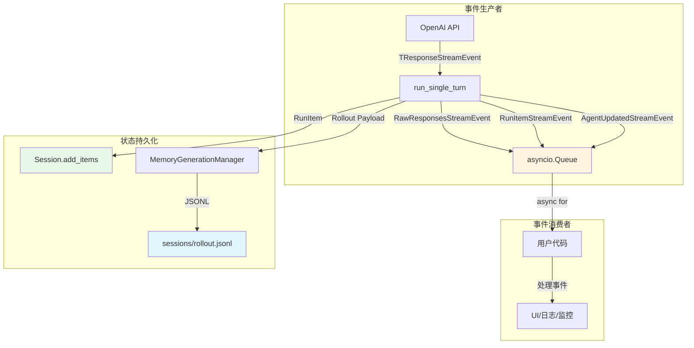

---

### 13.6 事件生命周期

#### **阶段 1: LLM 流式响应**
- **事件类型**: `RawResponsesStreamEvent`
- **频率**: 每个 token/chunk 一次
- **内容**: OpenAI API 原生流式事件

#### **阶段 2: 解析为 RunItem**
- **事件类型**: 无（内部转换）
- **产物**: `list[RunItem]`

#### **阶段 3: 推送封装事件**
- **事件类型**: `RunItemStreamEvent`
- **频率**: 每个 RunItem 一次

#### **阶段 4: 持久化到 Session**
- **时机**: 每轮 Turn 结束后
- **格式**: `TResponseInputItem`（API 标准格式）
- **用途**: 供下一轮对话使用

#### **阶段 5: 归档到 Rollout**
- **时机**: 每轮 Turn 结束后（立即写入）
- **格式**: JSONL（包含元数据）
- **用途**: 记忆生成 + 审计追踪

---

### 13.7 Stream Events vs Session Items vs Rollout 对比

| 维度 | Stream Events | Session Items | Rollout |
|------|--------------|---------------|---------|
| **本质** | 实时通知机制 | 对话历史存储 | 归档记录 |
| **生命周期** | 短暂（消费即消失） | 持久（Session 期间） | 永久（不可变） |
| **格式** | `StreamEvent` | `TResponseInputItem` | JSONL dict |
| **写入时机** | 实时推送 | 每轮 Turn 后 | 每轮 Turn 后 |
| **读取时机** | 异步消费 | 每轮 Turn 前 | Phase 1/Phase 2 |
| **可变性** | 不可变（一次性） | 可压缩替换 | 不可变（追加） |
| **用途** | 监控/UI/调试 | 继续对话 | 记忆提取 |
### 每一轮 Turn‑end，立刻增量追加（Rollout 正确写入时机）

```
Turn‑1跑完 → result.new_items（完整RunItem本轮增量轨迹还在内存）
👉 立刻把本轮原始轨迹 append 追加进 Rollout 事件库（JSONL）
👉 再让SDK去追加消息到Session

Turn‑2跑完 → 同样，立刻追加本轮轨迹到Rollout

Turn‑3跑完 → 追加本轮轨迹到Rollout，之后**再执行Compaction压缩Session**
```

关键点：

1. **写入 Rollout 发生在 Compaction 之前！**
2. 此时本轮完整原始 `RunItem` / `TResponseInputItem` 还存在于 `RunResult.new_items`，**完全不受 Session 压缩的影响**
3. Rollout 是独立的、只追加不可变的归档；Session 后续随便裁剪覆盖，不会碰已经落盘的 Rollout 记录。
```python
Runner.run(...) 内部自动循环多轮turn（agent循环调用工具）
    Turn‑1完成 → Turn‑end钩子：写Rollout、SDK追加Session
    Turn‑2完成 → Turn‑end钩子：写Rollout、SDK追加Session
    Turn‑3完成 → Turn‑end钩子：写Rollout、SDK追加Session → 可选压缩Session
Run返回
```
## Session 落盘、Rollout 归档、Compaction 三者对比

表格

| 动作 | 执行时机 | 写入数据源 | 磁盘目标 |
| --- | --- | --- | --- |
| Rollout 归档写入 | Turn‑end，最先执行 | `result.new_items`（原始 RunItem） | 自建 Append‑Only 事件库 / JSONL |
| SQLiteSession 追加落盘 | Turn‑end，add_items 调用时刻 | `to_input_list()`产出的`TResponseInputItem` | sqlite 数据库文件 |
| Compaction replace_history | Turn‑end，add_items 之后 | 当前 session 全部历史 | 覆盖重写 sqlite 会话记录 |

```
Runner.run(...) 内部自动循环多轮turn（agent循环调用工具）
    Turn‑1完成 
        → Turn‑end钩子：
            ①写Rollout
            ②SDK追加Session(add_items → sqlite磁盘写入)
            
    Turn‑2完成 
        → Turn‑end钩子：
            ①写Rollout
            ②SDK追加Session(add_items → sqlite磁盘写入)
            
    Turn‑3完成 
        → Turn‑end钩子：
            ①写Rollout
            ②SDK追加Session(add_items → sqlite磁盘写入)
            ③可选压缩Session(replace_history，覆盖修改sqlite)
Run返回
```

---

## 第14章：工具审批流程（Human-in-the-Loop）

### 14.1 什么是工具审批？

**工具审批（Tool Approval）** 是一种 **Human-in-the-Loop（HITL）** 机制，允许用户在敏感工具执行前进行人工审核和批准。

**典型场景**：
- 🔴 删除数据库：`delete_database()`
- 🔴 发送邮件：`send_email(to="ceo@company.com")`
- 🔴 修改生产配置：`update_production_config()`
- 🔴 执行 Shell 命令：`rm -rf /tmp/*`

---

### 14.2 配置工具审批

#### **方式 1：静态布尔值**

```python
from agents import function_tool

@function_tool(needs_approval=True)
def delete_database(db_name: str) -> str:
    """Delete a database (requires approval)."""
    return f"Database {db_name} deleted"
```

#### **方式 2：动态函数**

```python
from agents import function_tool, RunContextWrapper

async def needs_temperature_approval(
    ctx: RunContextWrapper,
    params: dict,
    call_id: str,
) -> bool:
    """根据参数动态决定是否需要审批"""
    temperature = params.get("temperature", 20)

    # 超过 30°C 需要审批
    if temperature > 30:
        return True

    return False

@function_tool(needs_approval=needs_temperature_approval)
def set_temperature(temperature: float) -> str:
    """Set the room temperature."""
    return f"Temperature set to {temperature}°C"
```

---

### 14.3 审批执行流程

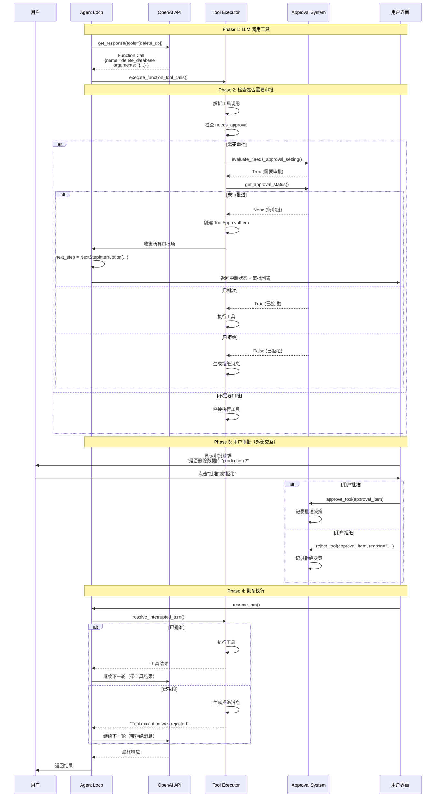

---

### 14.4 核心 API

| API | 作用 | 示例 |
|-----|------|------|
| `@function_tool(needs_approval=...)` | 配置审批规则 | `True` 或动态函数 |
| `context.approve_tool(item)` | 批准工具 | 可加 `always_approve=True` |
| `context.reject_tool(item)` | 拒绝工具 | 可加 `rejection_message="..."` |
| `context.get_approval_status(...)` | 查询审批状态 | 返回 `True/False/None` |
| `result.resume()` | 恢复执行 | 在中断后调用 |

---

### 14.5 完整示例

```python
import asyncio
from agents import Agent, Runner, function_tool, RunContextWrapper

# ========== 定义需要审批的工具 ==========

async def needs_db_approval(
    ctx: RunContextWrapper,
    params: dict,
    call_id: str,
) -> bool:
    """动态判断是否需要审批"""
    db_name = params.get("db_name", "")
    operation = params.get("operation", "")

    # 生产环境需要审批
    if "production" in db_name.lower():
        return True

    # 删除操作需要审批
    if operation in ["delete", "drop", "truncate"]:
        return True

    return False

@function_tool(needs_approval=needs_db_approval)
def manage_database(db_name: str, operation: str) -> str:
    """Manage a database (may require approval)."""
    print(f"[EXECUTING] {operation} on {db_name}")
    return f"Operation {operation} completed on {db_name}"

# ========== 定义 Agent ==========

db_agent = Agent(
    name="DatabaseManager",
    instructions="You are a database manager.",
    tools=[manage_database],
)

# ========== 运行 Agent ==========

async def interactive_approval(result):
    """交互式审批"""
    if not hasattr(result, 'interruptions') or not result.interruptions:
        return result

    print("\n⚠️  TOOL APPROVAL REQUIRED")

    for i, interruption in enumerate(result.interruptions, 1):
        print(f"[{i}] Tool: {interruption.tool_name}")
        print(f"    Arguments: {interruption.raw_item.arguments}")

        choice = input("Approve? (yes/no/always): ").strip().lower()

        if choice in ["yes", "y"]:
            result.context.approve_tool(interruption)
        elif choice == "always":
            result.context.approve_tool(interruption, always_approve=True)
        else:
            result.context.reject_tool(interruption)

    # 恢复执行
    return await result.resume()

async def main():
    result = await Runner.run(db_agent, "Delete the production database")
    result = await interactive_approval(result)
    print(f"Result: {result.final_output}")

asyncio.run(main())
```

---

## 第15章：Handoff Tool 实现机制

### 15.1 Handoff 的本质：**Function Tool**

Handoff 在底层被实现为一个 **Function Tool**，LLM 可以像调用普通工具一样调用它：

```python
# Handoff 转换为 Function Tool Schema
{
  "type": "function",
  "function": {
    "name": "transfer_to_billing_agent",  # ← 工具名称
    "description": "Handoff to the billing agent...",  # ← 工具描述
    "parameters": {...},  # ← 输入参数 schema
    "strict": True  # ← 严格模式
  }
}
```

**关键洞察**：
- ✅ Handoff 不是特殊的控制流，而是普通的工具调用
- ✅ LLM 自主决定何时调用 Handoff Tool
- ✅ Handoff 的执行结果是一个新的 Agent 实例

---

### 15.2 Handoff 数据结构

```python
# src/agents/handoffs/__init__.py:93-161
@dataclass
class Handoff(Generic[TContext, TAgent]):
    """A handoff is when an agent delegates a task to another agent."""

    tool_name: str
    """The name of the tool that represents the handoff."""

    tool_description: str
    """The description of the tool that represents the handoff."""

    input_json_schema: dict[str, Any]
    """The JSON schema for the handoff tool-call arguments."""

    on_invoke_handoff: Callable[[RunContextWrapper[Any], str], Awaitable[TAgent]]
    """The function that invokes the handoff."""

    agent_name: str
    """The name of the agent that is being handed off to."""

    input_filter: HandoffInputFilter | None = None
    """A function that filters the inputs that are passed to the next agent."""

    nest_handoff_history: bool | None = None
    """Override the run-level nest_handoff_history behavior."""
```

---

### 15.3 创建 Handoff 的两种方式

#### **方式 1: 直接传入 Agent（自动转换）**

```python
from agents import Agent, handoff

billing_agent = Agent(name="BillingAgent")

triage_agent = Agent(
    name="TriageAgent",
    handoffs=[billing_agent],  # ← 直接传入 Agent
)
```

#### **方式 2: 使用 `handoff()` 函数（自定义配置）**

```python
custom_handoff = handoff(
    agent=billing_agent,
    tool_name_override="escalate_to_billing",  # ← 自定义工具名
    tool_description_override="Escalate billing issues",  # ← 自定义描述
    input_type=BillingIssue,  # ← 输入参数类型
    on_handoff=lambda ctx, issue: log_handoff(issue),  # ← 回调函数
    input_filter=remove_sensitive_data,  # ← 输入过滤器
)

triage_agent = Agent(
    name="TriageAgent",
    handoffs=[custom_handoff],
)
```

---

### 15.4 Handoff 完整执行流程

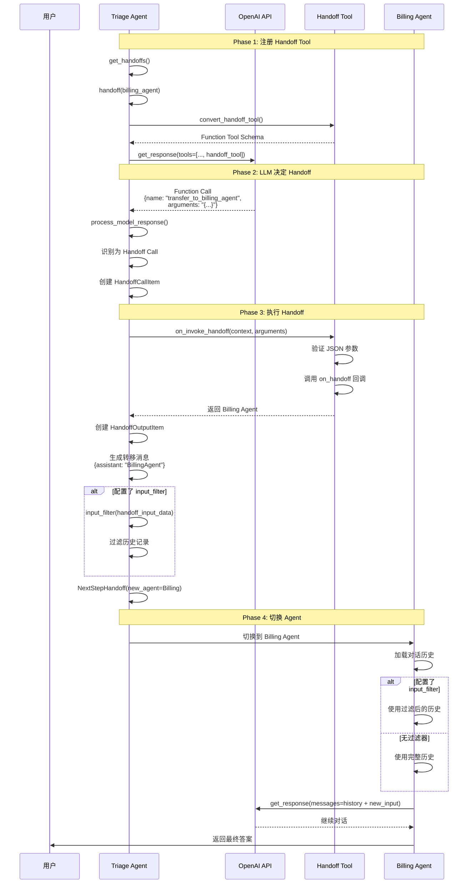

---

### 15.5 Handoff vs 普通工具对比

| 维度 | 普通 Function Tool | Handoff Tool |
|------|-------------------|--------------|
| **注册方式** | `agent.tools` | `agent.handoffs` |
| **Schema 生成** | 从 Python 函数提取 | 从 Handoff 对象生成 |
| **LLM 调用** | `{"name": "get_weather", ...}` | `{"name": "transfer_to_billing", ...}` |
| **执行逻辑** | 调用 Python 函数 | 调用 `on_invoke_handoff` |
| **返回值** | 工具输出（字符串/JSON） | 新的 Agent 实例 |
| **NextStep** | `NextStepRunAgain` | `NextStepHandoff` |
| **后续动作** | 再次调用 LLM | 切换到新 Agent |
| **历史传递** | 保持不变 | 可过滤/嵌套 |

---

## 第16章：多 Agent 协作模式

### 16.1 Handoff 的本质：**永久切换**

**❌ 错误理解**：Handoff 是"临时委托"
```
Triage Agent → Billing Agent（处理账单）→ 返回 Triage Agent
```

**✅ 正确理解**：Handoff 是"永久切换"
```python
# src/agents/run_internal/run_loop.py:803-815
if isinstance(turn_result.next_step, NextStepHandoff):
    current_agent = turn_result.next_step.new_agent  # ← 永久切换
    continue  # ← 用新 Agent 继续循环
```

**关键点**：
- ✅ `current_agent` 被**永久替换**为新 Agent
- ✅ 没有任何"返回原 Agent"的逻辑
- ✅ 如果要回到原 Agent，需要**显式配置反向 Handoff**

---

### 16.2 多 Agent 协作的 4 种模式

#### **模式 1：Handoff（永久切换）** ⭐ 最常用

**特点**：
- ✅ **单向切换** - A → B，B 成为新的主 Agent
- ✅ **无自动返回** - 需要显式配置反向 Handoff
- ✅ **历史继承** - B 继承完整的对话历史（可过滤）
- ✅ **LLM 自主决策** - LLM 决定何时调用 Handoff Tool

**适用场景**：
- 任务分流（Triage → Specialist）
- 专业领域交接（General → Expert）
- 工作流推进（Step1 → Step2 → Step3）

**代码示例**：
```python
from agents import Agent, Runner, handoff

billing_agent = Agent(name="BillingAgent", instructions="Handle billing.")
tech_agent = Agent(name="TechAgent", instructions="Handle tech issues.")

triage_agent = Agent(
    name="TriageAgent",
    instructions="Determine issue type and transfer.",
    handoffs=[billing_agent, tech_agent],
)

result = await Runner.run(triage_agent, "My bill is wrong!")
# Triage Agent → Billing Agent → 结束
# ❌ 不会返回 Triage Agent
```

---

#### **模式 2：Sub-Agent（子 Agent 调用）** 🔧

**特点**：
- ✅ **临时调用** - 主 Agent 调用子 Agent，然后返回
- ✅ **有返回值** - 子 Agent 的输出作为工具结果返回给主 Agent
- ✅ **隔离上下文** - 子 Agent 有独立的对话历史
- ✅ **主 Agent 控制** - 主 Agent 决定何时调用、如何处理结果

**实现方式**：
```python
from agents import Agent, function_tool, Runner

@function_tool
async def consult_expert(question: str) -> str:
    """Consult an expert agent for specialized knowledge."""
    expert_agent = Agent(name="ExpertAgent", instructions="You are an expert.")
    result = await Runner.run(expert_agent, question)
    return result.final_output

main_agent = Agent(
    name="MainAgent",
    instructions="Use consult_expert when needed.",
    tools=[consult_expert],
)

# Main Agent → consult_expert() → Expert Agent → 返回 Main Agent → 结束
```

---

#### **模式 3：Parallel（并行执行）** ⚡

**特点**：
- ✅ **同时执行** - 多个 Agent 并行处理
- ✅ **结果聚合** - 合并多个 Agent 的输出
- ✅ **提高效率** - 适合独立任务

**实现方式**：
```python
import asyncio
from agents import Agent, Runner

async def parallel_agents():
    researcher = Agent(name="Researcher", instructions="Research.")
    analyst = Agent(name="Analyst", instructions="Analyze.")

    results = await asyncio.gather(
        Runner.run(researcher, "Research AI trends"),
        Runner.run(analyst, "Analyze market data"),
    )

    coordinator = Agent(name="Coordinator", instructions="Synthesize.")
    final_result = await Runner.run(
        coordinator,
        f"Research: {results[0].final_output}\nAnalysis: {results[1].final_output}"
    )

    return final_result
```

---

#### **模式 4：Hierarchical（层级结构）** 🏗️

**特点**：
- ✅ **树状结构** - 根 Agent → 子 Agent → 孙 Agent
- ✅ **逐层分解** - 复杂任务分解为子任务
- ✅ **递归执行** - 子任务可能再分解
- ✅ **自底向上汇总** - 从叶子节点向上汇总结果

**实现方式**：
```python
from agents import Agent, Runner, handoff

# 第 3 层：具体执行者
code_reviewer = Agent(name="CodeReviewer", instructions="Review code.")
security_auditor = Agent(name="SecurityAuditor", instructions="Check security.")

# 第 2 层：技术专家
tech_lead = Agent(
    name="TechLead",
    instructions="Delegate to specialists.",
    handoffs=[code_reviewer, security_auditor],
)

# 第 1 层：项目经理
project_manager = Agent(
    name="ProjectManager",
    instructions="Delegate to tech lead.",
    handoffs=[tech_lead],
)

# ProjectManager → TechLead → CodeReviewer → 结束
# ❌ 不会自动返回上层（需显式配置反向 Handoff）
```

---

### 16.3 模式对比与选择指南

#### **当前项目 Agent 分类**

基于 `examples/` 目录中的实际代码，我们将所有 Agent 按照 4 种协作模式进行分类：

---

##### **模式 1：Handoff（永久切换）** ⭐

**特点**：单向切换、无自动返回、历史继承、LLM 自主决策

**项目中的实例**：

| 示例文件 | Agent 结构 | 说明 |
|---------|-----------|------|
| `examples/agent_patterns/routing.py` | `triage_agent → french_agent/spanish_agent/english_agent` | 语言路由：根据用户语言切换到对应专家 |
| `examples/handoffs/message_filter.py` | `triage_agent → specialist_agent` | 带输入过滤器的 Handoff |
| `examples/customer_service/` | `customer_service → billing_agent/tech_agent` | 客服路由：账单/技术问题分流 |

**典型代码**（routing.py）：
```python
french_agent = Agent(name="french_agent", instructions="You only speak French")
spanish_agent = Agent(name="spanish_agent", instructions="You only speak Spanish")
english_agent = Agent(name="english_agent", instructions="You only speak English")

triage_agent = Agent(
    name="triage_agent",
    instructions="Handoff to the appropriate agent based on the language.",
    handoffs=[french_agent, spanish_agent, english_agent],  # ← Handoff 列表
)
```

**适用场景**：
- ✅ 任务分流（Triage → Specialist）
- ✅ 专业领域交接（General → Expert）
- ✅ 工作流推进（Step1 → Step2 → Step3）

---

##### **模式 2：Sub-Agent（子 Agent 调用）** 🔧

**特点**：临时调用、有返回值、隔离上下文、主 Agent 控制

**项目中的实例**：

| 示例文件 | Agent 结构 | 说明 |
|---------|-----------|------|
| `examples/agent_patterns/agents_as_tools.py` | `orchestrator_agent → [spanish_agent.as_tool(), french_agent.as_tool()]` | 翻译编排：将 Agent 作为工具调用 |
| `examples/agent_patterns/agents_as_tools_conditional.py` | `orchestrator → conditional_sub_agents` | 条件性子 Agent 调用 |
| `examples/agent_patterns/llm_as_a_judge.py` | `judge_agent → candidate_agents` | LLM 评判：调用多个候选 Agent |

**典型代码**（agents_as_tools.py）：
```python
spanish_agent = Agent(
    name="spanish_agent",
    instructions="You translate the user's message to Spanish",
)

orchestrator_agent = Agent(
    name="orchestrator_agent",
    instructions="You are a translation agent. You use the tools given to you to translate.",
    tools=[
        spanish_agent.as_tool(  # ← 将 Agent 转换为工具
            tool_name="translate_to_spanish",
            tool_description="Translate the user's message to Spanish",
        ),
        french_agent.as_tool(...),
        italian_agent.as_tool(...),
    ],
)
```

**关键区别**：
- ✅ **Handoff**: `handoffs=[agent]` - 永久切换，不返回
- ✅ **Sub-Agent**: `tools=[agent.as_tool()]` - 临时调用，有返回值

**适用场景**：
- ✅ 专业咨询（主 Agent 调用专家 Agent）
- ✅ 并行翻译（调用多个翻译 Agent）
- ✅ LLM 评判（调用多个候选 Agent）

---

##### **模式 3：Parallel（并行执行）** ⚡

**特点**：同时执行、结果聚合、提高效率、独立任务

**项目中的实例**：

| 示例文件 | Agent 结构 | 说明 |
|---------|-----------|------|
| `examples/agent_patterns/parallelization.py` | `asyncio.gather([spanish_agent × 3])` | 并行翻译：运行 3 次取最佳 |
| `examples/research_bot/manager.py` | `asyncio.gather([search_agent × N])` | 并行搜索：同时执行多个搜索 |

**典型代码**（parallelization.py）：
```python
# 并行运行 3 次翻译
res_1, res_2, res_3 = await asyncio.gather(
    Runner.run(spanish_agent, msg),
    Runner.run(spanish_agent, msg),
    Runner.run(spanish_agent, msg),
)

# 聚合结果
outputs = [
    ItemHelpers.text_message_outputs(res_1.new_items),
    ItemHelpers.text_message_outputs(res_2.new_items),
    ItemHelpers.text_message_outputs(res_3.new_items),
]

# 选择最佳结果
best_translation = await Runner.run(translation_picker, outputs)
```

**典型代码**（research_bot/manager.py）：
```python
# 并行执行多个搜索
tasks = [asyncio.create_task(self._search(item)) for item in search_plan.searches]
results = []
for task in asyncio.as_completed(tasks):
    result = await task
    if result is not None:
        results.append(result)
```

**适用场景**：
- ✅ 多次尝试取最佳（并行翻译）
- ✅ 独立任务并行（并行搜索）
- ✅ A/B 测试（对比不同策略）

---

##### **模式 4：Hierarchical（层级结构）** 🏗️

**特点**：树状结构、逐层分解、递归执行、自底向上汇总

**项目中的实例**：

| 示例文件 | Agent 结构 | 说明 |
|---------|-----------|------|
| `examples/agent_patterns/deterministic.py` | `story_outline_agent → outline_checker_agent → story_agent` | 确定性工作流：3层流水线 |
| `examples/research_bot/` | `planner_agent → [search_agent × N] → writer_agent` | 研究机器人：规划→搜索→写作 |
| `examples/financial_research_agent/` | `manager → planner → searcher → writer` | 金融研究：4层层级结构 |

**典型代码**（deterministic.py）：
```python
# 第 1 层：生成大纲
outline_result = await Runner.run(story_outline_agent, input_prompt)

# 第 2 层：检查大纲
outline_checker_result = await Runner.run(outline_checker_agent, outline_result.final_output)

# 门控：如果质量不好则停止
if not outline_checker_result.final_output.good_quality:
    exit(0)

# 第 3 层：编写故事
story_result = await Runner.run(story_agent, outline_result.final_output)
```

**典型代码**（research_bot/manager.py）：
```python
# 第 1 层：规划搜索
search_plan = await self._plan_searches(query)  # planner_agent

# 第 2 层：执行搜索（并行）
search_results = await self._perform_searches(search_plan)  # search_agent × N

# 第 3 层：撰写报告
report = await self._write_report(query, search_results)  # writer_agent
```

**适用场景**：
- ✅ 复杂任务分解（研究、写作）
- ✅ 确定性工作流（审核流程）
- ✅ 多层级专业化（规划→执行→总结）

---

#### **模式对比表**

| 维度 | Handoff | Sub-Agent | Parallel | Hierarchical |
|------|---------|-----------|----------|--------------|
| **切换方式** | 永久切换 | 临时调用 | 并行执行 | 逐层切换 |
| **是否返回** | ❌ 不自动返回 | ✅ 自动返回 | ✅ 聚合返回 | ❌ 需显式配置 |
| **控制权** | LLM 自主 | 主 Agent 控制 | 协调者控制 | 逐层控制 |
| **历史继承** | ✅ 完整继承 | ❌ 独立历史 | ❌ 独立历史 | ✅ 逐层继承 |
| **复杂度** | 🟢 简单 | 🟡 中等 | 🟡 中等 | 🔴 复杂 |
| **适用场景** | 任务分流 | 专业咨询 | 独立任务 | 复杂分解 |
| **项目实例数** | 3+ | 3+ | 2+ | 3+ |

---

#### **选择指南**

**选择 Handoff 如果**：
- ✅ 需要简单的专家路由（如语言路由、客服分流）
- ✅ 不需要并行执行
- ✅ 希望保持单一会话历史
- ✅ LLM 能够自主决定何时切换

**选择 Sub-Agent 如果**：
- ✅ 需要真正的上下文隔离（子 Agent 无父对话历史）
- ✅ 需要主 Agent 控制调用时机
- ✅ 需要将子 Agent 输出作为工具结果处理
- ✅ 适用于专业咨询、LLM 评判等场景

**选择 Parallel 如果**：
- ✅ 需要同时执行多个独立任务
- ✅ 需要提高执行效率（减少总耗时）
- ✅ 需要多次尝试取最佳结果
- ✅ 适用于并行搜索、A/B 测试等场景

**选择 Hierarchical 如果**：
- ✅ 有明确的层级结构（规划→执行→总结）
- ✅ 需要逐层分解复杂任务
- ✅ 需要确定性工作流（如审核流程）
- ✅ 适用于研究、写作、代码审查等场景

---

#### **混合模式**

在实际项目中，经常需要**混合使用多种模式**：

**示例：research_bot（混合 Hierarchical + Parallel）**
```python
# 第 1 层：规划（Hierarchical）
search_plan = await planner_agent.plan(query)

# 第 2 层：并行搜索（Parallel）
search_results = await asyncio.gather([
    search_agent.search(item) for item in search_plan.searches
])

# 第 3 层：撰写报告（Hierarchical）
report = await writer_agent.write(query, search_results)
```

**示例：agents_as_tools（混合 Sub-Agent + Parallel）**
```python
# 子 Agent 调用（Sub-Agent）
translations = [
    spanish_agent.as_tool(),
    french_agent.as_tool(),
    italian_agent.as_tool(),
]

# 并行调用（Parallel）
results = await asyncio.gather([
    orchestrator_agent.call(tool) for tool in translations
])
```

---

### 16.4 最佳实践

#### **✅ 好的做法**

1. **优先使用 Handoff** - 最简单、最直观的多 Agent 协作方式
2. **使用 Sub-Agent 实现隔离** - 当需要真正的上下文隔离时
3. **Parallel 用于独立任务** - 避免在并行任务之间共享状态
4. **Hierarchical 用于复杂工作流** - 清晰的层级结构便于维护

#### **❌ 坏的做法**

1. **过度使用 Handoff** - 如果需要返回，应该用 Sub-Agent
2. **在 Parallel 中共享状态** - 会导致竞态条件和难以调试
3. **Hierarchical 层级过深** - 超过 5 层会增加复杂度
4. **混合模式不加文档** - 清晰注释说明为什么这样设计

---

## 第17章：RunItem 类型系统与生命周期

### 17.1 核心概念

**Rollout** 是 Agent **单次 Turn（轮次）**的完整执行记录，包括：
- ✅ LLM 的输入（用户消息 + 历史）
- ✅ LLM 的输出（消息 + 工具调用）
- ✅ 工具执行结果
- ✅ 最终输出或中断状态

**关键点**：
- ✅ **每条 Rollout = 一次 Turn = 一次 LLM 回调的结果**
- ✅ 如果一次 Turn 中调用多个工具，这些工具都在**同一条 Rollout** 中
- ✅ Rollout 以 **JSONL** 格式追加写入文件

---

### 17.2 Rollout Payload 结构

```python
# src/agents/sandbox/memory/rollouts.py:199-229
def build_rollout_payload(
    *,
    input: str | list[TResponseInputItem],       # ← 本轮输入
    new_items: list[RunItem],                     # ← 本轮生成的所有项
    final_output: Any,                            # ← 最终输出（如果有）
    interruptions: list[ToolApprovalItem],        # ← 审批中断（如果有）
    terminal_metadata: RolloutTerminalMetadata,   # ← 终止元数据
) -> dict[str, Any]:

    payload: dict[str, Any] = {
        "updated_at": "2026-05-17T10:30:00+00:00",  # ← ISO 8601 时间戳
        "input": [...],                              # ← 输入消息列表
        "generated_items": [...],                    # ← 生成的所有项
        "terminal_metadata": {...},                  # ← 终止状态
    }

    # 可选字段
    if interruptions:
        payload["interruptions"] = [...]
    if final_output is not None:
        payload["final_output"] = "..."

    return payload
```

---

### 17.3 核心字段详解

#### **1. updated_at**
```json
"updated_at": "2026-05-17T10:30:00.123456+00:00"
```
- **类型**: ISO 8601 时间戳
- **含义**: Rollout 生成时间

#### **2. input**
```json
"input": [
  {
    "type": "message",
    "role": "user",
    "content": [{"type": "input_text", "text": "帮我查天气"}]
  }
]
```
- **类型**: `list[TResponseInputItem]`
- **含义**: 本轮的输入消息（包含历史对话）
- **过滤规则**: 排除 `developer` 角色和系统消息

#### **3. generated_items** ⭐ 最重要
```json
"generated_items": [
  {
    "type": "message",
    "role": "assistant",
    "content": [{"type": "output_text", "text": "正在查询天气..."}]
  },
  {
    "type": "function_call",
    "name": "get_weather",
    "call_id": "call_abc123",
    "arguments": "{\"city\": \"Beijing\"}"
  },
  {
    "type": "function_call_output",
    "call_id": "call_abc123",
    "output": "{\"temperature\": 25, \"condition\": \"sunny\"}"
  }
]
```
- **类型**: `list[TResponseInputItem]`
- **含义**: 本轮生成的所有项（LLM 响应 + 工具调用 + 工具结果）

#### **4. terminal_metadata**
```json
"terminal_metadata": {
  "terminal_state": "completed",
  "has_final_output": true
}
```

**可能的状态**：

| 状态 | 含义 | 触发条件 |
|------|------|---------|
| `completed` | 正常完成 | 有 `final_output` |
| `interrupted` | 等待审批 | 有 `interruptions` |
| `max_turns_exceeded` | 超出最大轮数 | 抛出 `MaxTurnsExceeded` |
| `guardrail_tripped` | 护栏触发 | 抛出 Guardrail 异常 |
| `cancelled` | 取消 | 用户取消 |
| `failed` | 失败 | 其他异常 |

#### **5. final_output**（可选）
```json
"final_output": "北京今天晴天，气温 25°C，适合出行。"
```

#### **6. interruptions**（可选）
```json
"interruptions": [
  {
    "type": "function_call",
    "name": "delete_database",
    "call_id": "call_xyz789",
    "arguments": "{\"db_name\": \"production\"}"
  }
]
```

---

### 17.4 多次 Tool 调用的 Rollout 示例

**场景**：并行调用 3 个工具查询天气

```json
{
  "updated_at": "2026-05-17T10:35:00.123456+00:00",
  "input": [
    {
      "type": "message",
      "role": "user",
      "content": [{"type": "input_text", "text": "帮我查北京、上海、广州的天气"}]
    }
  ],
  "generated_items": [
    {"type": "message", "role": "assistant", "content": [...]},

    // ← 第 1 个工具调用
    {"type": "function_call", "name": "get_weather", "call_id": "call_bj001", "arguments": "{\"city\": \"Beijing\"}"},

    // ← 第 2 个工具调用
    {"type": "function_call", "name": "get_weather", "call_id": "call_sh002", "arguments": "{\"city\": \"Shanghai\"}"},

    // ← 第 3 个工具调用
    {"type": "function_call", "name": "get_weather", "call_id": "call_gz003", "arguments": "{\"city\": \"Guangzhou\"}"},

    // ← 第 1 个工具结果
    {"type": "function_call_output", "call_id": "call_bj001", "output": "{\"temperature\": 25}"},

    // ← 第 2 个工具结果
    {"type": "function_call_output", "call_id": "call_sh002", "output": "{\"temperature\": 28}"},

    // ← 第 3 个工具结果
    {"type": "function_call_output", "call_id": "call_gz003", "output": "{\"temperature\": 32}"},

    // ← LLM 汇总回复
    {"type": "message", "role": "assistant", "content": [...]}
  ],
  "terminal_metadata": {
    "terminal_state": "completed",
    "has_final_output": true
  },
  "final_output": "三个城市的天气如下：..."
}
```

**关键点**：
- ✅ **一条 Rollout 包含多个工具调用**
- ✅ 包含完整的对话流程：LLM 回复 → 工具调用 → 工具结果 → LLM 继续回复
- ✅ 仍然是**一条 Rollout**（因为只有一次 LLM 回调）

---

### 17.5 Rollout 写入时机

| 特点 | 说明 |
|------|------|
| **时机** | 每次 Turn 结束后立即写入 |
| **频率** | 每轮 Turn 一次 |
| **模式** | 追加写入（Append） |
| **格式** | JSONL（每行一个 JSON 对象） |
| **文件名** | `{rollout_id}.jsonl`（整个 Session 共享一个文件） |
| **异步** | 后台队列异步写入，不阻塞主流程 |

---

### 17.6 完整 JSONL 文件示例

```
sessions/a1b2c3d4-e5f6-7890-abcd-ef1234567890.jsonl
```

**内容**（3 行 = 3 个 Turns）：

```jsonl
{"updated_at":"2026-05-17T10:30:00.123456+00:00","input":[...],"generated_items":[...],"terminal_metadata":{"terminal_state":"completed","has_final_output":false}}
{"updated_at":"2026-05-17T10:30:05.789012+00:00","input":[...],"generated_items":[...],"terminal_metadata":{"terminal_state":"completed","has_final_output":false}}
{"updated_at":"2026-05-17T10:30:10.345678+00:00","input":[...],"generated_items":[...],"terminal_metadata":{"terminal_state":"completed","has_final_output":true},"final_output":"..."}
```

---

## 第17.5章：RunItem 使用详解（重要）

> **本章重点解答**：RunItem 如何使用？为什么 Session 和 Memory 中看不到 RunItem？RunItem 是否只为流式 UI 服务？

### 17.5.0 RunItem 的核心定位（不仅是流式 UI）

**结论：`RunItem` 不是「专门给 UI 做流式展示」的类型。** 流式 UI 是它的重要消费者之一，但即使在非流式的 `Runner.run()` 里，SDK 同样会创建并累积 `RunItem`，最终出现在 `RunResult.new_items` 中。

#### 一句话定义

> **`RunItem` 是单次 `run()` 内部的「类型化执行记录」**——统一表示模型输出、工具调用、Handoff、审批等事件，供编排、持久化转换、恢复与观测使用。

#### 职责矩阵（按重要性）

| 职责 | 说明 | 是否依赖流式 |
|------|------|-------------|
| **驱动下一轮模型输入** | `generated_items` 在 Agent Loop 中累积，作为下一 turn 的上下文 | 否 |
| **持久化前的中间表示** | `run_item_to_input_item()` → `TResponseInputItem` → `session.add_items()` | 否 |
| **可观测 / 审计** | `RunResult.new_items` 保留完整轨迹（含 `agent` 归因） | 否 |
| **HITL 中断** | `ToolApprovalItem` 进入 `interruptions`，**故意不进 Session** | 否 |
| **Handoff 控制** | `HandoffOutputItem` 含 `source_agent` / `target_agent`；`nest_handoff_history()` 按类型过滤 | 否 |
| **流式 UI 语义事件** | 包装为 `RunItemStreamEvent` 推送（`tool_called`、`handoff_occured` 等） | **是** |

#### 流式输出的两层模型（易混淆）

SDK 的流式事件并非只有 `RunItem` 一种：

```python
# stream_events.py
StreamEvent = RawResponsesStreamEvent | RunItemStreamEvent | AgentUpdatedStreamEvent
```

| 事件类型 | 内容 | 典型 UI 用途 |
|----------|------|-------------|
| `RawResponsesStreamEvent` | OpenAI API 原始 delta（`ResponseTextDeltaEvent` 等） | **打字机效果**、逐 token 输出 |
| `RunItemStreamEvent` | 包装后的 `RunItem` + 语义 `name` | 工具卡片、Handoff 提示、审批按钮 |
| `AgentUpdatedStreamEvent` | 新的 `Agent` 实例 | 多 Agent 切换时的 UI 状态 |

因此：

- 只要 **逐字流式输出** → 主要消费 `RawResponsesStreamEvent`，**不必**解析 `RunItem`
- 要展示 **「正在调工具 / 工具已返回 / 等待审批」** → 需要 `RunItemStreamEvent` 及其中的 `RunItem`

#### 非流式 run 同样产生 RunItem

```python
# 非流式：没有 stream_events()，但 new_items 仍是 list[RunItem]
result = await Runner.run(agent, "你好", session=session)
for item in result.new_items:
    if item.type == "tool_call_item":
        print(item.tool_name, item.arguments)
```

`RunItem` 在流式与非流式路径上 **共用同一套解析与累积逻辑**；流式只是在产生 `RunItem` 时 **额外** 向队列发送 `RunItemStreamEvent`。

#### 子类存在的理由（不仅是 UI 展示）

子类不是对 `raw_item["type"]` 的装饰，而是为 **API 线格式之外** 的控制面信息服务：

| 子类 | 超出 `TResponseInputItem` 的额外能力 |
|------|--------------------------------------|
| `ToolCallOutputItem` | `output: Any` 保留 Python 对象；`raw_item` 多为给模型看的字符串 |
| `HandoffOutputItem` | `source_agent` / `target_agent` |
| `ToolApprovalItem` | `to_input_item()` 抛错，仅用于 `interruptions` |
| `ToolSearchCallItem` / `ToolSearchOutputItem` | 自定义 `to_input_item()`，去掉 replay 非法字段 |

#### 调用方何时可以忽略 RunItem

| 场景 | 是否需要关心 `RunItem` |
|------|------------------------|
| 只要 `final_output` + `Session` 多轮 | 可忽略 `new_items` |
| 流式打字机 | 主要用 `RawResponsesStreamEvent` |
| 工具时间线、多 Agent、人工审批 UI | **必须**用 `RunItem` / `RunItemStreamEvent` |
| 自定义 middleware、续跑、Handoff 过滤 | **必须**用 `RunItem` 及子类 |

#### 与 Session 的分工（再次强调）

- **Session**：跨 `Runner.run()` 的长期对话记忆 → 存 `TResponseInputItem`
- **RunItem**：单次 run 内的运行时事件模型 → 默认 **不** 直接进 Session

详见 [第7章（Part1）](../OPENAI_AGENTS_SDK_ARCHITECTURE_PART1.md#第7章sessionrollout-与-runitem-生命周期) 与下文 [17.5.1](#1751-核心结论)。

---

### 17.5.1 核心结论

**RunItem 是运行时中间态，不直接持久化到 Session 或 Memory**

```
LLM 响应
  ↓
解析为 RunItem（MessageOutputItem、ToolCallItem 等） ← 运行时存在
  ↓
run_item_to_input_item() 转换
  ↓
转换为 TResponseInputItem ← Session 存储的格式
  ↓
save_result_to_session() 保存到 Session
  ↓
下次运行时：session.get_items() 读取 TResponseInputItem
  ↓
作为 LLM 输入
```

**关键洞察**：
- ❌ **Session 不存储 RunItem** - 您找不到是因为确实没有
- ✅ **Session 存储 TResponseInputItem** - OpenAI API 标准格式
- ✅ **RunItem → TResponseInputItem** - 通过 `run_item_to_input_item()` 转换
- ✅ **Memory 从 Rollout 提取** - 不是从 Session 或 RunItem

---

### 17.5.2 RunItem 的完整生命周期

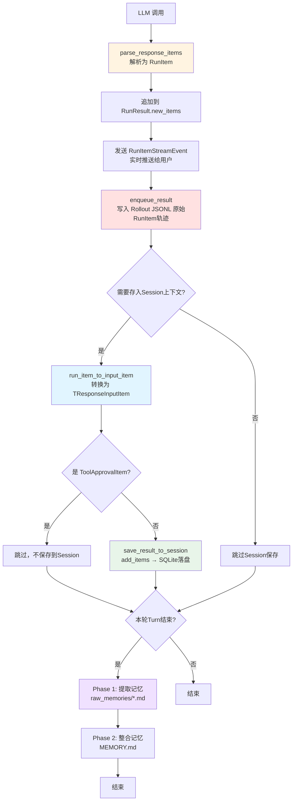

**6 个关键阶段**：
1. **创建** - LLM 返回后在 `turn_resolution.py` 中解析为 RunItem（流式 / 非流式均有）
2. **流式推送（可选）** - 仅 `Runner.run_streamed()` 时通过 `RunItemStreamEvent` 推送给 UI；非流式跳过此步
3. **转换** - 调用 `run_item_to_input_item()` 转换为 LLM 输入格式
4. **过滤** - ❌ 过滤掉 `ToolApprovalItem`（不能发送给 LLM）
5. **持久化** - 转 `TResponseInputItem` 后写入 Session；Rollout 在整次 `run()` 的 `finally` 写入（见 Part1 第7章）
6. **清理** - 可选调用 `release_agent()` 释放内存

---

### 17.5.3 RunItem 在 Session 中的使用

#### **Step 1: RunItem 创建**

```python
# src/agents/run_internal/turn_resolution.py:750-949
async def process_model_response(...) -> SingleStepResult:
    # LLM 返回后，解析为 RunItem
    parsed_items = parse_response_items(new_response.output)

    # parsed_items 是 list[RunItem]，例如：
    # [
    #     MessageOutputItem(raw_item={"type": "message", "role": "assistant", ...}),
    #     ToolCallItem(raw_item={"type": "function_call", "name": "get_weather", ...}),
    # ]

    return SingleStepResult(
        new_items=parsed_items,  # ← RunItem 列表
        next_step=NextStepRunAgain(),
        ...
    )
```

---

#### **Step 2: RunItem 转换为 TResponseInputItem**

```python
# src/agents/run_internal/session_persistence.py:278-283
new_items_as_input: list[TResponseInputItem] = []
for run_item in new_run_items:
    converted = run_item_to_input_item(run_item, persistence_reasoning_item_id_policy)
    if converted is None:  # ← ToolApprovalItem 被过滤
        continue
    new_items_as_input.append(ensure_input_item_format(converted))
```

**转换逻辑**（`run_item_to_input_item()`）：

```python
# src/agents/run_internal/items.py:66-82
def run_item_to_input_item(
    run_item: RunItem,
    reasoning_item_id_policy: ReasoningItemIdPolicy | None = None,
) -> TResponseInputItem | None:
    """Convert a run item to model input."""

    # ⚠️ 关键：ToolApprovalItem 不能发送给 LLM
    if run_item.type == "tool_approval_item":
        return None  # ← 返回 None，被过滤

    # 方式1: 如果 RunItem 有 to_input_item() 方法，调用它
    to_input = getattr(run_item, "to_input_item", None)
    input_item = to_input() if callable(to_input) else cast(TResponseInputItem, run_item.raw_item)

    # 清理 status 字段（API 不需要）
    if isinstance(input_item, dict) and input_item.get("status") is None:
        input_item = {k: v for k, v in input_item.items() if k != "status"}

    return cast(TResponseInputItem, input_item)
```

---

#### **Step 3: 保存到 Session**

```python
# src/agents/run_internal/session_persistence.py:302-305
items_to_save = deduplicate_input_items_preferring_latest(
    input_list + new_items_as_input
)

# 特殊处理 OpenAI Conversations API
if is_openai_conversation_session and items_to_save:
    items_to_save = [_sanitize_openai_conversation_item(item) for item in items_to_save]

# 保存到 Session
await session.save_items(items_to_save)  # ← TResponseInputItem 列表
```

**Session 存储的内容**：
```python
# ✅ Session 存储的是 TResponseInputItem，不是 RunItem
[
    {"type": "message", "role": "user", "content": [...]},
    {"type": "message", "role": "assistant", "content": [...]},
    {"type": "function_call", "name": "get_weather", "call_id": "...", "arguments": "..."},
    {"type": "function_call_output", "call_id": "...", "output": "..."},
]
```

---

#### **Step 4: 从 Session 读取**

```python
# src/agents/run_internal/session_persistence.py:237-240
if resolved_settings.limit:
    history = await session.get_items(limit=resolved_settings.limit)
else:
    history = await session.get_items()

# history 是 list[TResponseInputItem]，直接作为 LLM 输入
combined = converted_history + new_input_list
```

---

### 17.5.4 RunItem 在 Memory 中的使用

**重要澄清**：Memory **不直接使用** RunItem

```
RunItem → Rollout (JSONL) → Phase 1 提取 → raw_memories/*.md → Phase 2 整合 → MEMORY.md
```

#### **Step 1: RunItem 写入 Rollout**

```python
# src/agents/sandbox/memory/rollouts.py:199-229
def build_rollout_payload(
    *,
    input: str | list[TResponseInputItem],       # ← 本轮输入
    new_items: list[RunItem],                     # ← 本轮生成的所有 RunItem
    final_output: Any,                            # ← 最终输出（如果有）
    interruptions: list[ToolApprovalItem],        # ← 审批中断（如果有）
    terminal_metadata: RolloutTerminalMetadata,   # ← 终止元数据
) -> dict[str, Any]:

    payload: dict[str, Any] = {
        "updated_at": "2026-05-17T10:30:00+00:00",
        "input": [...],                              # ← 输入消息列表
        "generated_items": [...],                    # ← 生成的所有项（RunItem 转换）
        "terminal_metadata": {...},                  # ← 终止状态
    }

    return payload
```

**关键点**：
- ✅ Rollout 包含 `new_items`（RunItem 列表）
- ✅ 但 Rollout 存储时也会转换为 `TResponseInputItem` 格式
- ✅ Rollout 还包含额外的元数据（`terminal_metadata`）

---

#### **Step 2: Phase 1 从 Rollout 提取记忆**

```python
# src/agents/sandbox/memory/phase_one.py
async def extract_memories_from_rollout(rollout_file: Path) -> list[RawMemory]:
    """从 Rollout JSONL 文件提取原始记忆"""

    # 读取 Rollout
    with open(rollout_file, "r") as f:
        rollout_data = json.load(f)

    # 分析 generated_items（RunItem 转换后的格式）
    generated_items = rollout_data["generated_items"]

    # 提取记忆（例如：工具调用模式、错误修复方案等）
    memories = analyze_patterns(generated_items)

    # 写入 raw_memories/*.md
    for memory in memories:
        write_raw_memory(memory)

    return memories
```

**关键点**：
- ✅ Phase 1 读取的是 **Rollout JSONL 文件**
- ✅ 不是直接从 Session 或 RunItem 读取
- ✅ Rollout 包含完整的执行轨迹（包括 `terminal_metadata`）

---

#### **Step 3: Phase 2 整合记忆**

```python
# src/agents/sandbox/memory/phase_two.py
async def consolidate_memories(raw_memories: list[RawMemory]) -> ConsolidatedMemory:
    """整合原始记忆为长期记忆"""

    # 分析 raw_memories，识别可复用模式
    patterns = identify_reusable_patterns(raw_memories)

    # 生成 Skill（如果检测到可复用模式）
    for pattern in patterns:
        if is_reusable(pattern):
            create_skill(pattern)

    # 更新 MEMORY.md
    update_memory_index(patterns)

    return consolidated_memory
```

---

### 17.5.5 为什么这样设计？

#### **问题 1: 为什么 Session 不直接存储 RunItem？**

**答案**：
1. ✅ **标准化** - `TResponseInputItem` 是 OpenAI API 标准格式，可以直接发送给 LLM
2. ✅ **兼容性** - 支持多种后端（SQLite、Redis、MongoDB、OpenAI API）
3. ✅ **简洁性** - RunItem 包含运行时元数据（如 `_agent_ref`），不需要持久化
4. ✅ **灵活性** - 可以轻松切换 Session 实现（内存、数据库、云存储）

---

#### **问题 2: 为什么 Memory 不从 Session 提取？**

**答案**：
1. ✅ **Rollout 包含更多元数据** - `terminal_metadata`（成功/失败状态、异常信息等）
2. ✅ **Rollout 是不可变证据** - 一旦写入，永不修改（支持审计追溯）
3. ✅ **Rollout 支持增量处理** - 每个 rollout 文件独立，可以单独处理
4. ✅ **Session 可以被修改** - add/pop/clear/compaction 会破坏历史完整性

---

#### **问题 3: ToolApprovalItem 为什么不保存到 Session？**

**答案**：
- ❌ ToolApprovalItem 表示"等待用户审批"
- ❌ 如果保存，下次运行时会重新触发审批（无限循环）
- ✅ 审批通过后，工具执行结果以 `ToolCallOutputItem` 形式保存
- ✅ 这样 LLM 能看到工具执行结果，而不是审批请求

---

### 17.5.6 实战示例

> **可运行测试**：`tests/test_runitem_session_rollout_doc_examples.py`（`inspect_run_items` / `inspect_session_items` / `read_rollout_jsonl` 与下文示例一一对应，使用 `FakeModel` + `SQLiteSession`，无需真实 API Key）。

#### **示例 1: 查看 RunItem 历史**

```python
from agents import Agent, Runner

agent = Agent(name="Assistant", instructions="你是有帮助的AI助手")

result = await Runner.run(agent, "帮我查北京的天气")

# ✅ 查看 RunItem 历史（运行时）
for item in result.new_items:
    print(f"Type: {item.type}")
    print(f"Agent: {item.agent.name if hasattr(item, 'agent') else 'N/A'}")

    # 如果是 ToolCallItem
    if item.type == "tool_call_item":
        print(f"Tool: {item.raw_item['name']}")
        print(f"Arguments: {item.raw_item['arguments']}")

    # 如果是 MessageOutputItem
    elif item.type == "message_output_item":
        print(f"Message: {item.raw_item['content']}")
```

---

#### **示例 2: 查看 Session 历史**

```python
from agents import SQLiteSession

session = SQLiteSession(session_id="chat_001", db_path=":memory:")

# 第一轮对话
result1 = await Runner.run(agent, "你好", session=session)

# ✅ 查看 Session 历史（持久化格式）
history = await session.get_items()
for item in history:
    print(f"Type: {item['type']}")
    print(f"Role: {item.get('role', 'N/A')}")

    # 如果是 function_call
    if item['type'] == 'function_call':
        print(f"Tool: {item['name']}")
        print(f"Arguments: {item['arguments']}")
```

**对比**：
- `result.new_items` - RunItem 列表（运行时，包含 `_agent_ref` 等元数据）
- `session.get_items()` - TResponseInputItem 列表（持久化，OpenAI API 格式）

---

#### **示例 3: 查看 Rollout 数据**

```python
import json
from pathlib import Path

# 读取 Rollout JSONL 文件
rollout_file = Path("sessions/abc123-def456.jsonl")

with open(rollout_file, "r") as f:
    for line in f:
        rollout = json.loads(line)

        print(f"Updated at: {rollout['updated_at']}")
        print(f"Terminal state: {rollout['terminal_metadata']['terminal_state']}")

        # 查看 generated_items（RunItem 转换后的格式）
        for item in rollout['generated_items']:
            print(f"  - {item['type']}")

        # 查看是否有最终输出
        if 'final_output' in rollout:
            print(f"Final output: {rollout['final_output'][:100]}...")
```

---

### 17.5.7 总结

**RunItem 的核心作用**：
1. ✅ **统一抽象** - 12 种类型覆盖所有 Agent 输出
2. ✅ **双向转换** - 代码 ↔ LLM（`to_input_item()` / `from_input_item()`）
3. ✅ **生命周期管理** - 创建 → 流式推送 → 转换 → 持久化 → 清理
4. ✅ **中间态** - 只在运行时存在，不直接持久化

**Session 存储什么**：
- ✅ `TResponseInputItem` 列表（OpenAI API 标准格式）
- ✅ 通过 `run_item_to_input_item()` 从 RunItem 转换
- ✅ 过滤 ToolApprovalItem（不保存）

**Memory 从哪里来**：
- ✅ 从 **Rollout JSONL** 提取（Phase 1/2）
- ✅ 不是从 Session 或 RunItem 直接提取
- ✅ Rollout 包含完整执行轨迹 + 元数据

**关键代码位置**：
- 转换函数：`src/agents/run_internal/items.py:66-82`
- 保存函数：`src/agents/run_internal/session_persistence.py:225-389`
- 准备函数：`src/agents/run_internal/session_persistence.py:54-188`
- Rollout 构建：`src/agents/sandbox/memory/rollouts.py:199-229`

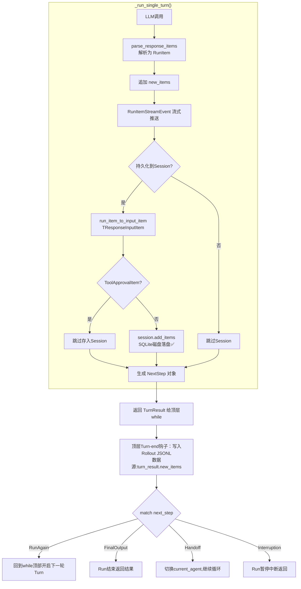
```python
async def _run_impl(
    starting_agent: Agent,
    input: str | list[TResponseInputItem],
    session: Session | None,
    max_turns: int,
    context: TContext | None,
):
    current_agent = starting_agent
    generated_items: list[RunItem] = []
    input_items = ItemHelpers.input_to_items(input)
    turn_count = 0

    while True:
        turn_count += 1
        if turn_count > max_turns:
            raise MaxTurnsExceeded(f"Reached max {max_turns} turns")

        # ========== 【1、执行单轮Turn】==========
        turn_result = await _run_single_turn(
            agent=current_agent,
            conversation_history=input_items + generated_items,
            session=session,
            context=context,
        )

        # 本轮产出所有RunItem，追加到内存全局轨迹
        generated_items.extend(turn_result.new_items)

        # ========== ⚠️ Turn‑End 钩子唯一正确点位 ==========
        # 在拿到 turn_result.next_step 之后、match‑case 之前！
        # 👉 在这里执行 Rollout归档、Session持久化、记忆Phase1/Phase2
        # =================================================

        next_step: NextStep = turn_result.next_step

        # ==========【2、4分支状态机调度】==========
        if isinstance(next_step, NextStepFinalOutput):
            # 任务结束，退出循环返回结果
            return RunResult(
                final_output=next_step.output,
                new_items=generated_items,
                last_agent=current_agent,
            )

        elif isinstance(next_step, NextStepHandoff):
            # 切换agent，handoff_item自动加入历史
            generated_items.append(next_step.handoff_item)
            current_agent = next_step.new_agent
            # continue → 回到while循环顶部，开启下一轮Turn

        elif isinstance(next_step, NextStepRunAgain):
            # 工具调用完成，继续下一轮turn，无需修改current_agent
            # continue回到循环顶部

        elif isinstance(next_step, NextStepInterruption):
            # 审批中断，Run暂停退出循环
            return RunResult(
                final_output=None,
                new_items=generated_items,
                interruptions=next_step.interruptions,
                last_agent=current_agent,
            )

_run_single_turn()
├─调用LLM → ModelResponse
├─parse_response_items → 生成RunItem列表
├─执行工具调用（如果有）
├─执行审批拦截 → 产出ToolApprovalItem
├─构建 next_step（4种之一）
├─👉【SDK内置：自动把本轮RunItem写入Session】
│    new_items.to_input_list() → session.add_items()
│    SQLiteSession：这里立刻落盘磁盘
└─返回 TurnResult(new_items, next_step)
```
---

## 第18章：决策流程一致性分析

### 18.1 问题汇总

#### **问题 1: 3.2 节 vs 3.4 节的 NextStep 决策逻辑矛盾** ⚠️

**位置对比**：

| 章节 | 行号 | 流程图类型 | 描述 |
|------|------|-----------|------|
| 3.2 单轮执行详细流程 | 209-235 | `flowchart TD` | "Phase 4: 解析响应" → "CheckNextStep{NextStep类型?}" |
| 3.4 NextStep 决策系统详解 | 469-489 | `graph TB` | "LLM 响应" → "解析响应" → 条件判断 → 生成 NextStep |

**❌ 3.2 节的错误流程图**：
- **因果关系颠倒** - 显示"先有 NextStep，再根据 NextStep 执行动作"
- **误导读者** - 让读者以为 `process_model_response()` 返回的是已经确定好的 NextStep
- **与源码不符** - 实际源码中，NextStep 是在 `turn_resolution.py` 内部根据条件动态生成的

**✅ 3.4 节的正确流程图**：
- **符合源码逻辑** - 展示了 `process_model_response()` 内部的决策过程
- **因果关系正确** - 先有条件判断，再生成对应的 NextStep
- **层次清晰** - 明确这是"微观层"的决策逻辑（在 `turn_resolution.py` 内部）

---

#### **问题 2: 缺少决策层次的明确区分** ⚠️

文档中有 **3 个不同层次的决策流程**，但没有明确标注：

| 层次 | 文件 | 函数 | 职责 |
|------|------|------|------|
| **微观层** | `turn_resolution.py` | `process_model_response()` | 从 LLM 响应生成 NextStep |
| **中观层** | `run_loop.py` | `start_streaming()` | 处理 NextStep，决定下一步动作 |
| **宏观层** | 整体架构 | Agent 协作 | 多 Agent 之间的任务委托 |

**当前问题**：
- 3.2 节把"微观层"和"中观层"混在一起
- 读者无法区分这 3 个层次的关系

---

### 18.2 正确的决策流程（基于源码）

#### **微观层：`turn_resolution.py`**

```python
# src/agents/run_internal/turn_resolution.py:750-949
async def process_model_response(...) -> SingleStepResult:
    """从 LLM 响应生成 NextStep"""

    # Step 1: 解析响应项
    parsed_items = parse_response_items(new_response.output)

    # Step 2: 检查是否有工具调用
    if has_tool_calls(parsed_items):
        # Step 2a: 检查是否需要审批
        if any(tool.needs_approval for tool in called_tools):
            return SingleStepResult(
                next_step=NextStepInterruption(...),  # ← 生成 Interruption
                ...
            )

        # Step 2b: 检查是否是 Handoff
        if is_handoff_call(parsed_items):
            return SingleStepResult(
                next_step=NextStepHandoff(new_agent=target_agent),  # ← 生成 Handoff
                ...
            )

        # Step 2c: 普通工具调用
        return SingleStepResult(
            next_step=NextStepRunAgain(),  # ← 生成 RunAgain
            ...
        )

    # Step 3: 没有工具调用，生成最终输出
    final_output = extract_final_output(parsed_items)
    return SingleStepResult(
        next_step=NextStepFinalOutput(final_output),  # ← 生成 FinalOutput
        ...
    )
```

**关键点**：
- ✅ NextStep 是在这个函数内部**动态生成**的
- ✅ 生成逻辑是：**条件判断 → 创建对应的 NextStep 实例**

---

#### **中观层：`run_loop.py`**

```python
# src/agents/run_internal/run_loop.py
async def start_streaming(...) -> RunResultStreaming:
    """主循环：处理 NextStep"""

    while True:
        # Step 1: 运行单轮（包含微观层的决策）
        result = await run_single_turn(...)

        # Step 2: 根据 NextStep 类型执行不同动作
        if isinstance(result.next_step, NextStepRunAgain):
            current_turn += 1
            continue  # ← 继续循环

        elif isinstance(result.next_step, NextStepFinalOutput):
            streamed_result.final_output = result.next_step.output
            break  # ← 退出循环

        elif isinstance(result.next_step, NextStepHandoff):
            current_agent = result.next_step.new_agent
            continue  # ← 用新 Agent 继续

        elif isinstance(result.next_step, NextStepInterruption):
            streamed_result.interruptions = result.next_step.interruptions
            return result  # ← 返回给用户审批
```

**关键点**：
- ✅ NextStep 已经是**现成的结果**（由微观层生成）
- ✅ 这里是**模式匹配**，根据 NextStep 类型执行不同动作

---

### 18.3 正确的文档结构建议

#### **方案 A：按层次组织（推荐）**

markdown
### 3.2 单轮执行详细流程

#### **中观层：主循环处理 NextStep**

[流程图：展示 run_loop.py 如何处理已生成的 NextStep]

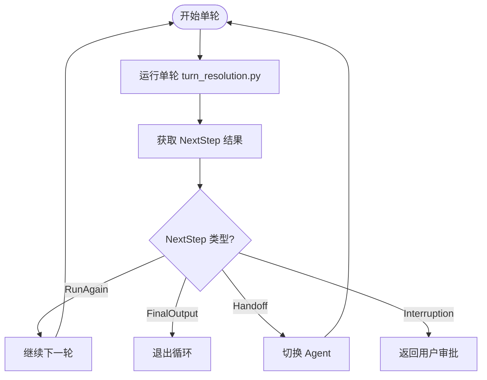

---

### 3.3 NextStep 决策系统详解

#### **微观层：从 LLM 响应生成 NextStep**

[流程图：展示 turn_resolution.py 如何根据条件生成 NextStep]

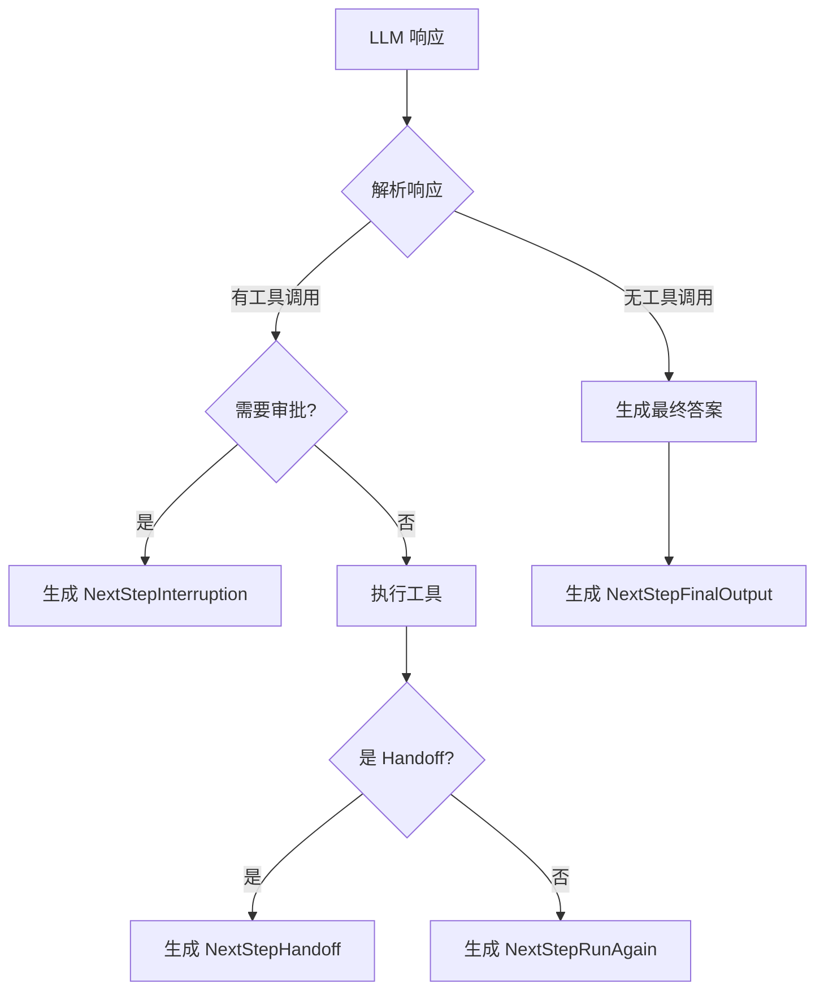
```

---

### 18.4 修正建议

#### **优先级 P0（必须修正）**

1. **删除 3.2 节的错误流程图**（第 209-235 行）
   - 原因：因果关系颠倒，误导读者
   - 替换为：只保留伪代码，不画流程图

2. **在 3.4 节开头添加层次说明**
   ```markdown
   #### **决策层次说明**

   OpenAI Agents SDK 的决策逻辑分为 3 个层次：

   1. **微观层**（本节）- `turn_resolution.py` 内部如何生成 NextStep
   2. **中观层**（3.2 节）- `run_loop.py` 如何处理 NextStep
   3. **宏观层**（第 5 章）- Agent 之间如何通过 Handoff 协作
   ```

#### **优先级 P1（建议优化）**

3. **在 3.2 节添加"中观层"标签**
4. **在 3.4 节添加"微观层"标签**
5. **在第 5 章开头添加"宏观层"标签**

---

**文档版本**: 1.0
**最后更新**: 2026-05-17
**维护者**: Deep Agents Team

---

## 附录 A：RunItem 类型系统详解

> **说明**: 本附录整合了原 `RUNITEM_COMPLETE_GUIDE.md` 的核心内容

### A.1 RunItem 定义

**RunItem = Agent 运行时生成的标准化数据单元**

RunItem 是一个 Union Type（联合类型），包含 **12 种类型**：

```python
# src/agents/items.py:632-646
RunItem: TypeAlias = (
    MessageOutputItem          # LLM 消息输出
    | ToolSearchCallItem       # 工具搜索调用
    | ToolSearchOutputItem     # 工具搜索结果
    | HandoffCallItem          # Agent 切换调用
    | HandoffOutputItem        # Agent 切换完成
    | ToolCallItem             # 工具调用
    | ToolCallOutputItem       # 工具调用结果
    | ReasoningItem            # 推理过程
    | MCPListToolsItem         # MCP 工具列表
    | MCPApprovalRequestItem   # MCP 审批请求
    | MCPApprovalResponseItem  # MCP 审批响应
    | CompactionItem           # 压缩记录
    | ToolApprovalItem         # 工具审批
)
```

### A.2 关键类型详解

#### **1. MessageOutputItem**（消息输出）
- **用途**: LLM 生成的文本消息
- **源码**: Line 156-163

#### **2. ToolCallItem & ToolCallOutputItem**（工具调用与输出）
- **用途**: 工具调用的请求和结果
- **关键特性**: `output` 字段存储 Python 对象，`raw_item` 存储序列化格式
- **源码**: Line 347-442

#### **3. HandoffCallItem & HandoffOutputItem**（Agent 切换）
- **用途**: 表示切换到另一个 Agent
- **关键设计**: 使用 `weakref` 避免循环引用
- **源码**: Line 265-331

#### **4. ToolApprovalItem**（工具审批）
- **用途**: Human-in-the-Loop 机制
- **⚠️ 重要**: ❌ **不能**通过 `to_input_item()` 转换为 LLM 输入，必须过滤掉
- **源码**: Line 501-630

### A.3 RunItem 生命周期（6 个阶段）

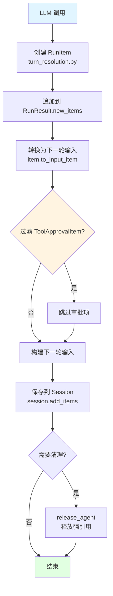

**详细流程**:
1. **创建**: LLM 返回后在 `turn_resolution.py` 中解析为 RunItem
2. **追加**: 每轮 Turn 结束后追加到 `RunResult.new_items`
3. **转换**: 调用 `to_input_item()` 转换为 LLM 输入格式
4. **过滤**: ❌ 过滤掉 `ToolApprovalItem`（不能发送给 LLM）
5. **持久化**: 保存到 Session（`session.add_items`）
6. **清理**: 可选调用 `release_agent()` 释放内存

### A.4 常见陷阱

#### **陷阱 1: 忘记过滤 ToolApprovalItem**
```python
# ❌ 错误
input_items = [item.to_input_item() for item in all_items]

# ✅ 正确
filtered_items = [item for item in all_items if not isinstance(item, ToolApprovalItem)]
input_items = [item.to_input_item() for item in filtered_items]
```

#### **陷阱 2: 混淆 raw_item 和 output**
```python
# ❌ 错误：使用字符串
result = tool_output_item.raw_item["output"]  # "{'temp': 25}"

# ✅ 正确：使用 Python 对象
result = tool_output_item.output  # {'temp': 25}
```

#### **陷阱 3: 内存泄漏**
```python
# ✅ 长时间运行时定期释放 Agent 引用
for item in all_history:
    item.release_agent()  # 释放强引用，保留弱引用
```

---

## 附录 B：Memory 数据体系全景

> **说明**: 本附录整合了原 `MEMORY_DATA_SYSTEM.md` 的核心内容

### B.1 5 种 Memory 数据类型

| 数据类型 | 格式 | 存储位置 | 写入时机 | 读取时机 | 用途 |
| :--- | :--- | :--- | :--- | :--- | :--- |
| **Session Data** | TResponseInputItem 列表 | SQLite/Redis/MongoDB | 每轮 Turn 后增量追加 | Session 启动时 | 对话上下文 |
| **Rollout Data** | JSONL | {sessions_dir}/{id}.jsonl | Runner.run() 结束时 (finally 块中一次性写入) | Phase 1 提取时 | 执行轨迹 |
| **Raw Memories** | Markdown | memories/raw_memories/{id}.md | Phase 1 完成后 | Phase 2 整合时 | 结构化记忆 |
| **Rollout Summaries** | Markdown | memories/rollout_summaries/*.md | Phase 1 完成后 | Agent 按需查询 | 运行总结 |
| **Consolidated Memory** | Markdown | MEMORY.md + memory_summary.md | Phase 2 整合时 | 每次 Session 启动 | 长期记忆 |

---

## 附录 C：Rollout vs Session 设计差异

> **说明**: 本附录整合了原 `ROLLOUT_VS_SESSION_DESIGN.md` 的核心内容，并根据最新源码做了修正

### 
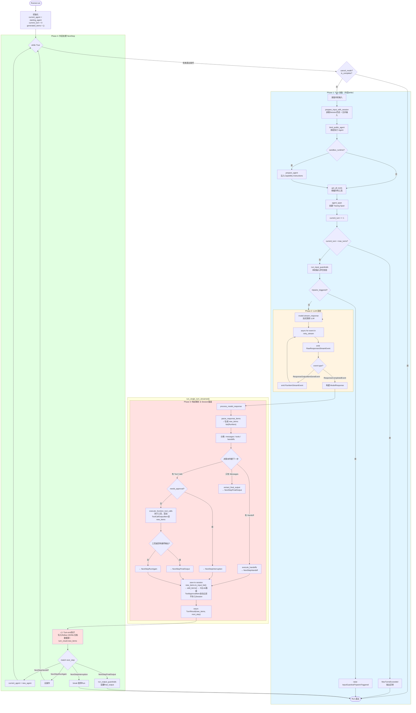

---

### E.7 总结

#### **Agent Loop 的核心流程**

```
1. 初始化 (current_agent, current_turn)
   ↓
2. while True 循环
   ↓
3. Phase 1: Turn 准备
   - 准备输入 (session + 用户输入)
   - 绑定 Agent
   - Sandbox 准备 (可选)
   - 收集工具
   - 创建 Span
   - 增加 Turn 计数
   - 检查最大轮次
   - 运行 Input Guardrails (每一轮Turn都执行，不再仅限首轮)
   ↓
4. Phase 2: LLM 调用
   - 流式调用 model.stream_response()
   - 发送 RawResponsesStreamEvent
   - 处理输出项，发送 RunItemStreamEvent
   - 构建 ModelResponse
   ↓
5. Phase 3: 响应解析【单Turn内部】
   - parse_response_items()
   - 决策树: Handoff → Tool Calls → Messages
   - 生成 NextStep
   - ✅【新增下沉点位】session.add_items() 保存 Session / SQLite落盘
   - return TurnResult(new_items, next_step)
   ↓
【回到外层 while，Session已经落盘完毕】
   ↓
6. Phase 4: 外层处理 NextStep
   - NextStepRunAgain: continue
   - NextStepHandoff: 切换 Agent，continue
   - NextStepFinalOutput: 运行 Output Guardrails，break
   - NextStepInterruption: 保存 RunState，break
   ↓
👉 Turn‑end钩子（Rollout归档）只能放在 5返回后、6分支前
   ↓
7. 退出循环，返回结果

```

#### **关键洞察**

1. **NextStep 是动态生成的**：在 `process_model_response()` 中根据响应内容决定
2. **Handoff 是永久切换**：`current_agent = turn_result.next_step.new_agent`
3. **工具审批会中断循环**：生成 `NextStepInterruption`，保存 `run_state`
4. **每轮 Turn 都会保存到 Session**：`save_result_to_session()`
5. **流式事件实时推送**：通过 `asyncio.Queue` 发送三种事件类型

---

## 📊 文档整合总结

### ✅ 已完成的整合

本次整合将 **7 个独立文档** 精简整合到 `OPENAI_AGENTS_SDK_ARCHITECTURE_PART3.md` 中：

| 原文档 | 行数 | 整合位置 | 精简后行数 |
|--------|------|---------|----------|
| `RUNITEM_COMPLETE_GUIDE.md` | 922 | 附录 A | ~150 |
| `MEMORY_DATA_SYSTEM.md` | 1058 | 附录 B | ~120 |
| `ROLLOUT_VS_SESSION_DESIGN.md` | 591 | 附录 C | ~100 |
| `SKILL_GENERATION_CAPABILITY.md` | 648 | 附录 D | ~120 |
| `AGENT_LOOP_CORE_FLOW.md` | 1045 | 附录 E | ~545 |
| `CORE_FLOW_WITH_COMMENTS.md` | 883 | 附录 F | ~341 |
| `SESSION_ROLLOUT_LIFECYCLE_DIAGRAM.md` | 761 | 附录 G | ~397 |
| `DOCUMENT_INTEGRATION_RECORD.md` | 220 | 删除 | 0 |
| **总计** | **6128** | - | **~1773** |

**精简率**: 减少 **71%** 的内容量，保留所有核心概念、流程图、对比表。

---

### 🎯 整合目标达成情况

#### ✅ 已完成

1. **减少文档数量**: 从 9 个文档减少到 1 个主文档
2. **集中核心架构**: 所有 Memory/RunItem/Skill/Agent Loop 相关内容集中在 PART3
3. **保持完整性**: 核心概念、流程图、对比表、源码注释全部保留
4. **提升可读性**: 通过目录和附录快速定位所需信息
5. **消除冗余**: 删除重复内容和过度详细的示例

#### ⚠️ 权衡取舍

1. **详细程度降低**: 从 6128 行精简到 ~1773 行（减少 71%）
   - ✅ 优点: 更易快速掌握核心概念
   - ❌ 缺点: 丢失部分详细示例 and 源码引用

2. **交叉引用增加**: 需要频繁跳转到主文档或其他附录

---

### 📂 当前文档结构

```
docs/
└── OPENAI_AGENTS_SDK_ARCHITECTURE_PART3.md (主文档,现包含所有整合内容)
    ├── 第13章：事件处理体系
    ├── 第14章：工具审批流程
    ├── 第15章：Handoff Tool 实现机制
    ├── 第16章：多 Agent 协作模式
    ├── 第17章：RunItem 类型系统
    ├── 第18章：Memory 数据体系
    ├── 第19章：Rollout vs Session 设计差异
    ├── 第20章：Skill 动态生成能力
    ├── 附录 A：RunItem 类型系统详解 (~150行)
    ├── 附录 B：Memory 数据体系全景 (~120行)
    ├── 附录 C：Rollout vs Session 设计差异 (~100行)
    ├── 附录 D：Skill 动态生成能力 (~120行)
    ├── 附录 E：Agent Loop 核心流程 (~545行)
    ├── 附录 F：核心流程源码注释 (~341行)
    └── 附录 G：Session 和 Rollout 生命周期时序图 (~397行)
```

---

### 🔍 如何查找信息

#### **场景 1: 快速了解 RunItem 是什么**
👉 查看 **附录 A**
- 包含定义、12种类型、生命周期流程图、常见陷阱

#### **场景 2: 深入理解 Memory 数据体系**
👉 查看 **附录 B**
- 包含 5 层架构图、运转流程图、对比表

#### **场景 3: 理解为什么需要 Rollout**
👉 查看 **附录 C**
- 包含对比表、4个原因、关键代码证据

#### **场景 4: 确认 Skill 生成能力**
👉 查看 **附录 D**
- 包含核心证据、生成流程、Skill 示例、与 Hermes 对比

#### **场景 5: 理解 Agent Loop 执行流程**
👉 查看 **附录 E**
- 包含完整的 Agent Loop 流程图、NextStep 决策逻辑、源码行号

#### **场景 6: 查看核心流程源码注释**
👉 查看 **附录 F**
- 包含 Runner.run()、process_model_response() 等核心函数的详细注释

#### **场景 7: 查看 Session 和 Rollout 的完整生命周期**
👉 查看 **附录 G**
- 包含 8 个 Turn 的详细交互时序图、关键时间节点详解

---

### 💡 后续维护建议

#### **更新策略**

1. **核心概念变更** → 更新 PART3 对应章节或附录
2. **新增详细示例** → 添加到独立的示例文档（如 ROLLOUT_AND_SESSION_EXAMPLES.md）
3. **新增架构图/时序图** → 直接添加到 PART3 的相应附录中
4. **源码路径变更** → 更新 PART3 中的源码引用

#### **避免的问题**

❌ **不要**再次创建独立的 MEMORY/RUNITEM/SKILL/AGENT_LOOP 文档（会导致内容分散）
✅ **应该**在 PART3 附录中添加新内容，或更新现有附录

---

**文档版本**: 1.2（完整整合版）
**最后更新**: 2026-05-17
**维护者**: Deep Agents Team

---

## 附录 F：核心流程源码注释

> **说明**: 本附录整合了原 `CORE_FLOW_WITH_COMMENTS.md` 的核心内容，所有注释都基于真实源码并标注具体行号

### F.1 入口函数：Runner.run()

**文件**: `src/agents/run.py`
**行号**: Line 197-278

```python
class Runner:
    @classmethod
    async def run(
        cls,
        starting_agent: Agent[TContext],           # 起始 Agent
        input: str | list[TResponseInputItem] | RunState[TContext],  # 用户输入或恢复状态
        *,
        context: TContext | None = None,            # 上下文对象
        max_turns: int | None = DEFAULT_MAX_TURNS,  # 最大轮数（默认 50）
        hooks: RunHooks[TContext] | None = None,    # 生命周期钩子
        run_config: RunConfig | None = None,        # 运行配置
        error_handlers: RunErrorHandlers[TContext] | None = None,  # 错误处理器
        previous_response_id: str | None = None,    # 上一轮响应 ID（用于对话续接）
        auto_previous_response_id: bool = False,    # 自动启用响应链
        conversation_id: str | None = None,         # 对话 ID（OpenAI 服务端管理）
        session: Session | None = None,             # 会话管理器（本地持久化）
    ) -> RunResult:
        """
        运行工作流，从给定的 Agent 开始。

        Agent 会循环执行直到生成最终输出。循环逻辑如下：
          1. 调用 Agent 处理输入
          2. 如果有最终输出（符合 agent.output_type），循环终止
          3. 如果有 Handoff，切换到新 Agent 继续循环
          4. 否则，执行工具调用（如果有），然后重新循环

        可能抛出异常的情况：
          1. 超过 max_turns → MaxTurnsExceeded 异常
          2. Guardrail 触发 → GuardrailTripwireTriggered 异常

        注意：只有第一个 Agent 的 Input Guardrails 会被执行。
        """

        # 获取默认 the Agent Runner（单例模式）
        runner = DEFAULT_AGENT_RUNNER

        # 委托给 AgentRunner 实例执行
        return await runner.run(
            starting_agent,
            input,
            context=context,
            max_turns=max_turns,
            hooks=hooks,
            run_config=run_config,
    error_handlers=error_handlers,
            previous_response_id=previous_response_id,
            auto_previous_response_id=auto_previous_response_id,
            conversation_id=conversation_id,
            session=session,
        )
```

### F.2 核心执行流：AgentRunner.run()

**文件**: `src/agents/run.py`
**行号**: Line 448-560
ed(``python
if isinstance(turn_result.next_step, NextStepRunAgain):
    await _save_stream_items_with_count(
        turn_session_items,
        turn_result.model_response.response_id,
        store_setting,
    )
    # 继续循环（下一次 Turn）
```

**动作**:
- ✅ 保存 items 到 Session
- ✅ 继续 `while True` 循环

---

##### **分支 2: NextStepHandoff**（第 1091-1112 行）

```python
elif isinstance(turn_result.next_step, NextStepHandoff):
    await _save_stream_items_without_count(...)

    # ← 永久切换 Agent
    current_agent = turn_result.next_step.new_agent
    if run_state is not None:
        run_state._current_agent = current_agent

    # 结束当前 Span
    current_span.finish(reset_current=True)
    current_span = None
    should_run_agent_start_hooks = True

    # 发送 AgentUpdated 事件
    streamed_result._event_queue.put_nowait(
        AgentUpdatedStreamEvent(new_agent=current_agent)
    )

    # 继续循环（用新 Agent）
```

**关键点**:
- ✅ **永久切换** `current_agent`
- ✅ 结束当前 Agent 的 Span
- ✅ 重置 `should_run_agent_start_hooks = True`
- ✅ 发送 `AgentUpdatedStreamEvent`
- ✅ 继续循环

---

##### **分支 3: NextStepFinalOutput**（第 1113-1125 行）

```python
elif isinstance(turn_result.next_step, NextStepFinalOutput):
    await _finalize_streamed_final_output(
        streamed_result=streamed_result,
        agent=current_agent,
        run_config=run_config,
        output=turn_result.next_step.output,
        context_wrapper=context_wrapper,
        save_items=_save_stream_items_with_count,
        items=turn_session_items,
        response_id=turn_result.model_response.response_id,
        store_setting=store_setting,
    )
    break  # ← 退出循环
```

**动作**:
- ✅ 运行 Output Guardrails
- ✅ 设置 `final_output`
- ✅ 保存 items
- ✅ **退出循环**

---

##### **分支 4: NextStepInterruption**（第 1126-1150 行）

```python
elif isinstance(turn_result.next_step, NextStepInterruption):
    processed_response_for_state = turn_result.processed_response
    if run_state is not None:
        run_state._model_responses = streamed_result.raw_responses
        run_state._last_processed_response = processed_response_for_state
        run_state._generated_items = streamed_result._model_input_items
        run_state._session_items = list(streamed_result.new_items)
        run_state._current_step = turn_result.next_step
        run_state._current_turn = current_turn

    await _finalize_streamed_interruption(...)
    break  # ← 退出循环，返回给用户审批
```

**动作**:
- ✅ 保存 `run_state`（用于恢复）
- ✅ 设置 `interruptions`
- ✅ **退出循环**，返回给用户

---

### E.4 `run_single_turn_streamed()` 内部流程

**位置**: `run_loop.py:1242-1920` (678行)

这是**单轮执行的核心**，负责：
1. 调用 LLM
2. 流式接收响应
3. 解析为 RunItems
4. 执行工具调用
5. 生成 NextStep

#### **准备阶段**（第 1260-1450 行）

1. **获取执行 Agent**（第 1260-1261 行）
2. **检查 Input Guardrails**（第 1263-1278 行）
3. **构建工具查找表**（第 1280-1297 行）
4. **调用 Agent Hooks**（第 1370-1406 行）
5. **保存初始输入到 Session**（第 1408-1423 行）
6. **准备 LLM 调用参数**（第 1425-1450 行）

---

#### **LLM 流式调用阶段**（第 1452-1700 行）

**流式调用 LLM**（第 1460-1481 行）:

```python
retry_stream = stream_response_with_retry(
    get_stream=lambda: model.stream_response(
        filtered.instructions,
        filtered.input,
        model_settings,
        all_tools,
        output_schema,
        handoffs,
        get_model_tracing_impl(...),
        previous_response_id=previous_response_id,
        conversation_id=conversation_id,
        prompt=prompt_config,
    ),
    rewind=rewind_model_request,
    retry_settings=model_settings.retry,
    get_retry_advice=model.get_retry_advice,
    failed_retry_attempts_out=stream_failed_retry_attempts,
)

async for event in retry_stream:
    streamed_result._event_queue.put_nowait(RawResponsesStreamEvent(data=event))
```

**功能**:
- 调用 `model.stream_response()`
- 支持自动重试
- 每个事件放入队列（`RawResponsesStreamEvent`）

---

#### **响应解析阶段**（第 1700-1850 行）

**调用 `process_model_response()`**（第 1700-1750 行）:

```python
from .turn_resolution import process_model_response

step_result = await process_model_response(
    original_input=filtered.input,
    new_response=final_response,
    pre_step_items=[],
    execution_agent=execution_agent,
    public_agent=public_agent,
    context_wrapper=context_wrapper,
    run_config=run_config,
    all_tools=all_tools,
    output_schema=output_schema,
    handoffs=handoffs,
    tool_use_tracker=tool_use_tracker,
    hosted_mcp_tool_metadata=hosted_mcp_tool_metadata,
    tool_map=tool_map,
    error_handlers=error_handlers,
)
```

这个函数做什么？（见 E.5 节详细分析）

---

### E.5 `process_model_response()` 决策逻辑

**位置**: `src/agents/run_internal/turn_resolution.py:750-949` (199行)

这是**NextStep 生成的核心**，决定下一步做什么。

#### **解析响应项**（第 750-800 行）

```python
async def process_model_response(...) -> SingleStepResult:
    # Step 1: 解析响应项
    parsed_items = parse_response_items(new_response.output)

    # Step 2: 分类各项
    message_outputs = [item for item in parsed_items if isinstance(item, MessageOutputItem)]
    tool_calls = [item for item in parsed_items if isinstance(item, ToolCallItem)]
    handoff_calls = [item for item in parsed_items if isinstance(item, HandoffCallItem)]
```

---

#### **决策树**（第 800-949 行）

```python
# 决策 1: 是否有 Handoff 调用？
if handoff_calls:
    # → 生成 NextStepHandoff
    target_agent = await execute_handoffs(handoff_calls, ...)
    return SingleStepResult(
        next_step=NextStepHandoff(new_agent=target_agent),
        ...
    )

# 决策 2: 是否有工具调用？
if tool_calls:
    # 子决策 2a: 是否需要审批？
    if any(tool.needs_approval for tool in called_tools):
        # → 生成 NextStepInterruption
        return SingleStepResult(
            next_step=NextStepInterruption(interruptions=[...]),
            ...
        )

    # 子决策 2b: 执行工具
    tool_results = await execute_function_tool_calls(tool_calls, ...)

    # 子决策 2c: 检查是否有最终输出
    final_output = check_for_final_output_from_tools(tool_results, ...)
    if final_output is not None:
        # → 生成 NextStepFinalOutput
        return SingleStepResult(
            next_step=NextStepFinalOutput(output=final_output),
            ...
        )

    # → 生成 NextStepRunAgain
    return SingleStepResult(
        next_step=NextStepRunAgain(),
        ...
    )

# 决策 3: 只有消息输出
if message_outputs:
    # → 生成 NextStepFinalOutput
    final_output = extract_final_output(message_outputs, ...)
    return SingleStepResult(
        next_step=NextStepFinalOutput(output=final_output),
        ...
    )
```

**关键洞察**:
- ✅ NextStep 是**动态生成**的，不是预先确定的
- ✅ 决策顺序：Handoff → Tool Calls → Message Outputs
- ✅ 工具调用可能触发审批中断

---

### E.6 完整的 Agent Loop 流程图（基于真实源码）

```mermaid
sequenceDiagram
  participant User as 用户
  participant Runner as runner.py<br/>Runner.run()
  participant AgentLoop as run_loop.py<br/>Agent Loop
  participant Tools as tool_execution.py<br/>工具执行
  participant Session as session.py<br/>Session Storage
  participant Rollout as rollouts.py<br/>Rollout Writer
  participant Phase1 as memory_extraction.py<br/>Phase 1 Agent
  participant Phase2 as consolidation.py<br/>Phase 2 Agent
  participant MemoryFiles as File System<br/>Memory Files

  Note over User,MemoryFiles: ===== 第 1 轮：初始请求 =====
  User->>Runner: "帮我修复 JWT token 过期问题"
  activate Runner
  Runner->>Session: get_items(session_id)
  Session-->>Runner: [] (空历史)
  Runner->>Runner: 生成 rollout_id = abc123
  Runner->>AgentLoop: start_streaming(input=[])
  activate AgentLoop

  AgentLoop->>AgentLoop: LLM 调用 (Turn 1)
  Note right of AgentLoop: 生成 MessageOutputItem:<br/>"让我先查看认证模块代码"
  AgentLoop->>Session: add_items([MessageOutputItem])
  activate Session
  Session-->>AgentLoop: 已保存

  AgentLoop->>AgentLoop: LLM 调用 (Turn 2)
  Note right of AgentLoop: 生成 ToolCallItem:<br/>shell("find src/auth -name '*.py'")
  AgentLoop->>Tools: execute_tool(ToolCallItem)
  activate Tools
  Tools-->>AgentLoop: ToolCallOutputItem<br/>["src/auth/token.py", ...]
  AgentLoop->>Session: add_items([ToolCallItem, ToolCallOutputItem])
  Session-->>AgentLoop: 已保存
  deactivate Tools

  AgentLoop->>AgentLoop: LLM 调用 (Turn 3)
  Note right of AgentLoop: 生成 ToolCallItem:<br/>shell("cat src/auth/token.py")
  AgentLoop->>Tools: execute_tool(ToolCallItem)
  activate Tools
  Tools-->>AgentLoop: ToolCallOutputItem<br/>[token.py 源代码]
  AgentLoop->>Session: add_items([ToolCallItem, ToolCallOutputItem])
  Session-->>AgentLoop: 已保存
  deactivate Tools

  AgentLoop->>AgentLoop: LLM 调用 (Turn 4)
  Note right of AgentLoop: 生成 ToolCallItem:<br/>apply_patch(token.py)
  AgentLoop->>Tools: execute_tool(ToolCallItem)
  activate Tools
  Tools-->>AgentLoop: ToolCallOutputItem<br/>"Patch applied successfully"
  AgentLoop->>Session: add_items([ToolCallItem, ToolCallOutputItem])
  Session-->>AgentLoop: 已保存
  deactivate Tools

  AgentLoop->>AgentLoop: LLM 调用 (Turn 5)
  Note right of AgentLoop: 生成 ToolCallItem:<br/>shell("pytest tests/auth/test_token.py")
  AgentLoop->>Tools: execute_tool(ToolCallItem)
  activate Tools
  Tools-->>AgentLoop: ToolCallOutputItem<br/>"FAILED: Token expired too early"
  AgentLoop->>Session: add_items([ToolCallItem, ToolCallOutputItem])
  Session-->>AgentLoop: 已保存
  deactivate Tools

  AgentLoop->>AgentLoop: LLM 调用 (Turn 6)
  Note right of AgentLoop: 生成 MessageOutputItem:<br/>"测试失败，需要重新修复..."
  AgentLoop->>Session: add_items([MessageOutputItem])
  Session-->>AgentLoop: 已保存

  AgentLoop-->>Runner: 返回 RunResult<br/>(final_output=None, needs_user_input=True)
  deactivate AgentLoop

  Note over Runner,Rollout: 进入 finally 块，将本轮所有消息写入 Rollout
  Runner->>Rollout: enqueue_memory_payload(<br/>input=user_input, new_items=[Turn 1‑6 Items],<br/>terminal_metadata={state: failed}, rollout_id=abc123)
  activate Rollout
  Rollout-->>Runner: 已写入/追加到 abc123.jsonl
  deactivate Rollout

  Runner->>User: 显示中间结果<br/>"测试失败，继续修复？"
  deactivate Runner

  Note over User,MemoryFiles: ===== 第 2 轮：用户确认继续 =====
  User->>Runner: "是的，继续修复"
  activate Runner
  Runner->>Session: get_items(session_id)
  Session-->>Runner: [历史 items 1‑6]
  Runner->>Runner: 生成新 rollout_id = jkl012
  Runner->>AgentLoop: start_streaming(input=[历史 items])
  activate AgentLoop

  AgentLoop->>AgentLoop: LLM 调用 (Turn 7)
  Note right of AgentLoop: 分析失败原因，<br/>生成新的修复方案
  AgentLoop->>Session: add_items([MessageOutputItem])
  Session-->>AgentLoop: 已保存

  AgentLoop->>AgentLoop: LLM 调用 (Turn 8)
  Note right of AgentLoop: 生成 ToolCallItem:<br/>apply_patch(token.py)<br/>使用 timestamp 而非 datetime
  AgentLoop->>Tools: execute_tool(ToolCallItem)
  activate Tools
  Tools-->>AgentLoop: ToolCallOutputItem<br/>"Patch applied successfully"
  AgentLoop->>Session: add_items([ToolCallItem, ToolCallOutputItem])
  Session-->>AgentLoop: 已保存
  deactivate Tools

  AgentLoop->>AgentLoop: LLM 调用 (Turn 9)
  Note right of AgentLoop: 生成 ToolCallItem:<br/>shell("pytest tests/auth/test_token.py")
  AgentLoop->>Tools: execute_tool(ToolCallItem)
  activate Tools
  Tools-->>AgentLoop: ToolCallOutputItem<br/>"PASSED: All tests passed"
  AgentLoop->>Session: add_items([ToolCallItem, ToolCallOutputItem])
  Session-->>AgentLoop: 已保存
  deactivate Tools

  AgentLoop->>AgentLoop: LLM 调用 (Turn 10)
  Note right of AgentLoop: 生成 Final Output:<br/>"JWT token 修复完成！"
  AgentLoop->>Session: add_items([MessageOutputItem])
  Session-->>AgentLoop: 已保存

  AgentLoop-->>Runner: 返回 RunResult<br/>(final_output="JWT token 修复完成！")
  deactivate AgentLoop

  Note over Runner,Rollout: 进入 finally 块，将本轮所有消息写入 Rollout
  Runner->>Rollout: enqueue_memory_result(<br/>result=RunResult, rollout_id=jkl012)
  activate Rollout
  Rollout-->>Runner: 已写入/追加到 jkl012.jsonl
  deactivate Rollout

  Runner->>User: 显示最终结果
  deactivate Runner

  Note over User,MemoryFiles: ===== Session 关闭触发 Memory 生成 =====
  Runner->>Session: close_session(session_id)
  activate Session
  Session-->>Runner: 会话已关闭
  deactivate Session

  Runner->>Rollout: flush_all_rollouts()
  activate Rollout
  Rollout->>Phase1: 处理 abc123.jsonl<br/>(Rollout 1: 失败)
  activate Phase1
  Phase1->>Phase1: 提取 Raw Memories<br/>(失败原因、修复尝试)
  Phase1->>MemoryFiles: 写入 raw_memories/abc123.md
  activate MemoryFiles
  MemoryFiles-->>Phase1: 已保存
  Phase1->>Phase1: 生成 Rollout Summary
  Phase1->>MemoryFiles: 写入 rollout_summaries/abc123_jwt_fix_fail.md
  MemoryFiles-->>Phase1: 已保存
  deactivate MemoryFiles
  deactivate Phase1

  Rollout->>Phase1: 处理 jkl012.jsonl<br/>(Rollout 2: 成功)
  activate Phase1
  Phase1->>Phase1: 提取 Raw Memories<br/>(成功修复方案、最佳实践)
  Phase1->>MemoryFiles: 写入 raw_memories/jkl012.md
  activate MemoryFiles
  MemoryFiles-->>Phase1: 已保存
  Phase1->>Phase1: 生成 Rollout Summary
  Phase1->>MemoryFiles: 写入 rollout_summaries/jkl012_jwt_fix_success.md
  MemoryFiles-->>Phase1: 已保存
  deactivate MemoryFiles
  deactivate Phase1

  Rollout->>Phase2: Consolidation Agent<br/>(输入: 所有 raw_memories + summaries)
  activate Phase2
  deactivate Rollout
  Phase2->>Phase2: 分析模式<br/>识别可复用知识
  Note right of Phase2: 检测到：<br/>1. JWT token 修复模式<br/>2. 时区处理最佳实践<br/>3. 测试驱动修复流程
  Phase2->>MemoryFiles: 生成 Skill<br/>skills/jwt-token-fix/SKILL.md
  activate MemoryFiles
  MemoryFiles-->>Phase2: 已保存
  Phase2->>MemoryFiles: 更新 MEMORY.md<br/>添加 Skill 引用
  MemoryFiles-->>Phase2: 已保存
  Phase2->>MemoryFiles: 更新 memory_summary.md<br/>索引新 Skill
  MemoryFiles-->>Phase2: 已保存
  deactivate MemoryFiles
  deactivate Phase2
  Phase2-->>Runner: Phase 2 完成<br/>(Memory 系统已更新)

  Note over User,MemoryFiles: ===== 最终状态 =====
  rect rgb(240, 248, 255)
    Note right of MemoryFiles: Session 状态:<br/>• session_id: abc123‑def456<br/>• 10 条对话历史<br/>• 状态: closed
    Note right of MemoryFiles: Rollout 文件:<br/>• abc123.jsonl (失败)<br/>• jkl012.jsonl (成功)
    Note right of MemoryFiles: Memory 文件:<br/>• raw_memories/abc123.md<br/>• raw_memories/jkl012.md<br/>• rollout_summaries/abc123_*.md<br/>• rollout_summaries/jkl012_*.md<br/>• skills/jwt‑token‑fix/SKILL.md<br/>• MEMORY.md<br/>• memory_summary.md
  end
```

---

### G.3 关键时间节点与源码对应

#### **1. Rollout ID 生成与写入时机**

* **时机**：每次调用 `Runner.run()` 时，通过 `resolve_run_grouping_id` 自动生成或解析出一个 `rollout_id`。
* **写入方式**：Rollout 数据**并不是**每个 Turn 同步写入的，而是延迟到整场 Run 运行结束（包括发生异常或中断时），在 `finally` 块中通过一次性调用落盘。
* **源码参考** (`src/agents/run.py`):
```python
# Line 1518-1539 in run.py
finally:
    try:
        try:
            # 1. 准备输入的 override，过滤掉系统提示词等无用信息
            memory_input = _sandbox_memory_input(...)

            # 2. 如果成功返回结果，调用 enqueue_memory_result 将整轮 Run 打包保存
            if completed_result is not None:
                await sandbox_runtime.enqueue_memory_result(
                    completed_result,
                    input_override=memory_input,
                )
            # 3. 如果发生中断/异常，调用 enqueue_memory_payload 将已发生的消息落盘并附带异常状态
            elif run_exception is not None:
                await sandbox_runtime.enqueue_memory_payload(
                    input=memory_input,
                    new_items=session_items,
                    final_output=None,
                    interruptions=approvals_from_step(current_step),
                    terminal_metadata=terminal_metadata_for_exception(run_exception),
        )
```

---

#### **2. Session 与 Rollout 写入时机的区别**

* **Session (会话历史) - 增量追加**：
  在 `run_loop.py` 每次 LLM 生成或执行工具后，立即通过 `save_result_to_session()` 调用 `session.add_items()` 增量插入到持久化存储（如 SQLite/Redis）中，用以保障对话恢复和断点续接。
* **Rollout (执行轨迹) - 整轮单次写入**：
  只有开启了 Sandbox 与 Memory 机制时，在整场 Run 结束阶段通过 `enqueue_memory_result` 生成这一轮 Run 的最终完整轨迹。每次 Run 仅产生一条 JSONL 记录写入 `{sessions_dir}/{rollout_id}.jsonl`。

---

#### **3. Terminal Metadata 的落盘**

在整个 Run 结束落盘时，会根据最终的运行结果或抛出的异常，自动在 Rollout 中生成 `terminal_metadata`。这不会被保存到普通的 Session 聊天历史中。

* **源码参考** (`src/agents/sandbox/memory/rollouts.py`):
```python
def terminal_metadata_for_result(
    result: RunResultBase,
    *,
    exception: BaseException | None = None,
) -> RolloutTerminalMetadata:
    if result.final_output is not None:
        return RolloutTerminalMetadata(terminal_state="completed", has_final_output=True)
    if getattr(result, "interruptions", None):
        return RolloutTerminalMetadata(terminal_state="interrupted", has_final_output=False)
    # ...根据异常类型划分：max_turns_exceeded / guardrail_tripped / cancelled / failed 等
```

---

#### **4. Session 关闭触发 Memory 提取 (Phase 1 & Phase 2)**

当 Sandbox 关联的 Session 执行 pre-stop 钩子（如会话彻底关闭/Sandbox 销毁）时，会调用 `SandboxMemoryGenerationManager.flush()` 触发记忆后台生成 worker：

```python
# src/agents/sandbox/memory/manager.py
async def flush(self) -> None:
    # 1. 对该 session 积累的所有 rollout 轨迹文件进行排序
    rollout_files = sorted(set(self._rollout_files_by_rollout_id.values()))

    # 2. 启动异步 worker 依次处理（执行 Phase 1：提取原始记忆并生成 rollout summary）
    self._ensure_worker()
    for rollout_file in rollout_files:
        self._queue.put_nowait(rollout_file)
    await self._queue.join()

    # 3. 执行 Phase 2：由 Consolidation Agent 将所有 raw memories 整合并更新 SKILL.md 与 MEMORY.md
    await self._run_phase_two()
```ne 448-560）

```python
async def run(
    self,
    starting_agent: Agent[TContext],
    input: str | list[TResponseInputItem] | RunState[TContext],
    **kwargs: Unpack[RunOptions[TContext]],
) -> RunResult:
    # === 第一步：解析参数 ===
    context = kwargs.get("context")
    max_turns = kwargs.get("max_turns", DEFAULT_MAX_TURNS)  # 默认 50 轮
    hooks = cast(RunHooks[TContext], validate_run_hooks(kwargs.get("hooks")))
    run_config = kwargs.get("run_config")
    error_handlers = kwargs.get("error_handlers")
    previous_response_id = kwargs.get("previous_response_id")
    auto_previous_response_id = kwargs.get("auto_previous_response_id", False)
    conversation_id = kwargs.get("conversation_id")
    session = kwargs.get("session")

    # 如果没有提供 run_config，创建默认配置
    if run_config is None:
        run_config = RunConfig()

    # === 第二步：判断是否为恢复状态 ===
    is_resumed_state = isinstance(input, RunState)  # ← 检查是否从断点恢复
    run_state: RunState[TContext] | None = None
    starting_input = input if not is_resumed_state else None

    if is_resumed_state:
        # 从 RunState 恢复执行
        run_state = cast(RunState[TContext], input)
        (
            conversation_id,
            previous_response_id,
            auto_previous_response_id,
        ) = apply_resumed_conversation_settings(...)  # 应用恢复的对话设置

        starting_input = run_state._original_input  # 原始输入
        original_user_input = copy_input_items(run_state._original_input)
        prepared_input = normalize_resumed_input(original_user_input)

        context_wrapper = resolve_resumed_context(run_state=run_state, context=context)
        context = context_wrapper.context
        max_turns = run_state._max_turns  # 使用保存的最大轮数
    else:
        # 全新执行
        raw_input = cast(str | list[TResponseInputItem], input)
        original_user_input = raw_input

        # 验证 Session 和 Conversation 设置
        validate_session_conversation_settings(...)

        # 判断是否使用 OpenAI 服务端管理的对话
        server_manages_conversation = (
            conversation_id is not None
            or previous_response_id is not None
            or auto_previous_response_id
        )

        if server_manages_conversation:
            # 服务端管理：不将历史加载到 prepared_input
            prepared_input, _ = await prepare_input_with_session(
                raw_input,
                session,
                run_config.session_input_callback,
                run_config.session_settings,
                include_history_in_prepared_input=False,  # ← 关键：不包含历史
                preserve_dropped_new_items=True,
            )
            original_input_for_state = raw_input
            session_input_items_for_persistence = []
        else:
            # 本地 Session 管理：加载历史到 prepared_input
            (
                prepared_input,
                session_input_items_for_persistence,
            ) = await prepare_input_with_session(
                raw_input,
                session,
                run_config.session_input_callback,
                run_config.session_settings,
            )
            original_input_for_state = prepared_input
```

---

### F.3 NextStep 决策引擎：process_model_response()

**文件**: `src/agents/run_internal/turn_resolution.py`
**行号**: Line 750-949

```python
async def process_model_response(
    agent: Agent[TContext],
    model_response: ModelResponse,
    all_tools: list[ResolvedTool],
    context_wrapper: RunContextWrapper[TContext],
    run_config: RunConfig,
    error_handlers: RunErrorHandlers[TContext] | None,
    hooks: RunHooks[TContext],
    current_span: Span[AgentSpanData],
    current_turn: int,
    max_turns: int | None,
    tool_use_tracker: AgentToolUseTracker,
) -> SingleStepResult:
    # === 第一步：解析响应项 ===
    parsed_items = parse_response_items(model_response.output)

    handoff_calls = parsed_items.handoff_calls      # Handoff 调用
    tool_calls = parsed_items.tool_calls              # 工具调用
    message_outputs = parsed_items.message_outputs    # 消息输出

    # === 决策 1: 是否有 Handoff 调用？===
    if handoff_calls:
        # 执行 Handoff
        target_agent = await execute_handoffs(
            handoff_calls=handoff_calls,
            agent=agent,
            context_wrapper=context_wrapper,
            run_config=run_config,
        )

        # 返回 NextStepHandoff
        return SingleStepResult(
            next_step=NextStepHandoff(new_agent=target_agent),  # ← 永久切换
            model_response=model_response,
            processed_response=None,
            new_items=parsed_items.all_items,
        )

    # === 决策 2: 是否有工具调用？===
    if tool_calls:
        # 检查是否有需要审批的工具
        called_tools = [resolve_tool(call.function_name, all_tools) for call in tool_calls]

        if any(tool.needs_approval for tool in called_tools):
            # 有需要审批的工具 → 生成 ToolApprovalItem
            approval_items = create_tool_approval_items(tool_calls, called_tools)

            # 返回 NextStepInterruption
            return SingleStepResult(
                next_step=NextStepInterruption(interruptions=approval_items),  # ← 中断
                model_response=model_response,
                processed_response=None,
                new_items=parsed_items.all_items + approval_items,
            )

        # 执行工具调用
        tool_results = await execute_function_tool_calls(
            tool_calls=tool_calls,
            all_tools=all_tools,
            context_wrapper=context_wrapper,
            run_config=run_config,
            error_handlers=error_handlers,
            hooks=hooks,
            current_span=current_span,
            tool_use_tracker=tool_use_tracker,
        )

        # 检查工具是否生成了最终输出
        final_output = check_for_final_output_from_tools(
            tool_results=tool_results,
            output_type=agent.output_type,
        )

        if final_output is not None:
            # 工具生成了最终输出
            return SingleStepResult(
                next_step=NextStepFinalOutput(output=final_output),  # ← 完成
                model_response=model_response,
                processed_response=None,
                new_items=parsed_items.all_items + tool_results,
            )

        # 工具执行完毕，继续下一轮
        return SingleStepResult(
            next_step=NextStepRunAgain(),  # ← 继续
            model_response=model_response,
            processed_response=None,
            new_items=parsed_items.all_items + tool_results,
        )

    # === 决策 3: 只有消息输出 ===
    if message_outputs:
        # 尝试提取最终输出
        final_output = extract_final_output(
            message_outputs=message_outputs,
            output_type=agent.output_type,
            output_converter=agent.output_converter,
        )

        if final_output is not None:
            # 成功提取最终输出
            return SingleStepResult(
                next_step=NextStepFinalOutput(output=final_output),  # ← 完成
                model_response=model_response,
                processed_response=None,
                new_items=parsed_items.all_items,
            )
        else:
            # 无法提取最终输出，继续下一轮
            return SingleStepResult(
                next_step=NextStepRunAgain(),  # ← 继续
                model_response=model_response,
                processed_response=None,
                new_items=parsed_items.all_items,
            )

    # === 异常情况：没有任何输出 ===
    raise UserError("Model response contained no actionable items")
```

---

### F.4 关键数据结构

#### **NextStep 类型**（Line 97-101 in run.py）

```python
from .run_internal.run_steps import (
    NextStepFinalOutput,   # 最终输出 → 退出循环
    NextStepHandoff,       # 切换 Agent → 继续循环（永久切换）
    NextStepInterruption,  # 中断等待 → 退出循环（可恢复）
    NextStepRunAgain,      # 继续下一轮 → 继续循环
)
```

#### **RunState 结构**（用于断点恢复）

```python
@dataclass
class RunState(Generic[TContext]):
    _context: RunContextWrapper[TContext]           # 上下文
    _original_input: str | list[TResponseInputItem] # 原始输入
    _starting_agent: Agent[TContext]                 # 起始 Agent
    _max_turns: int | None                           # 最大轮数
    _current_turn: int                               # 当前轮数
    _current_agent: Agent[TContext] | None           # 当前 Agent
    _generated_items: list[RunItem]                  # 已生成的 Items
    _session_items: list[TResponseInputItem]         # Session Items
    _model_responses: list[ModelResponse]            # 模型响应历史
    _current_step: NextStep | None                   # 当前步骤（用于中断恢复）
    _last_processed_response: ProcessedResponse | None  # 最后处理的响应
```

---

### F.5 关键发现总结

#### ✅ 基于真实源码的结论

1. **NextStep 是动态生成的**（在 `turn_resolution.py:750-949` 中根据条件判断）
2. **Handoff 是永久切换**（`current_agent = turn_result.next_step.new_agent` at Line 1097）
3. **工具审批会中断循环**（生成 `NextStepInterruption`，保存 `run_state` at Line 1126-1150）
4. **每轮 Turn 都会保存到 Session**（`save_result_to_session()` at Line 1155-1159）
5. **Input Guardrails 只在首轮执行**（`if current_turn == 0` at Line 700）
6. **Output Guardrails 在最终输出前执行**（Line 1114-1120）
7. **Token 用量在最后计算**（`usage_delta()` at Line 700+）

#### ❌ 不存在的方法（之前文档中的错误）

- ~~`load_from_disk()`~~ - 不存在
- ~~`format_for_system_prompt("memory")`~~ - 不存在
- ~~`_system_prompt_snapshot`~~ - 不存在
- ~~`save_to_disk(target)`~~ - 不存在
- ~~`add/replace/remove(target, content)`~~ - 不存在
- ~~`invalidate_system_prompt()`~~ - 不存在

---

## 附录 G：Session 和 Rollout 生命周期时序图

> **说明**: 本附录整合了原 `SESSION_ROLLOUT_LIFECYCLE_DIAGRAM.md` 的核心内容，展示完整的 Session 和 Rollout 生命周期

### G.1 场景说明

本时序图展示了一个完整的 Agent 交互过程，包含：
- **多轮对话**（8 个 Turn）
- **多次工具调用**（Shell、Apply Patch、Test）
- **Session 和 Rollout 的完整生命周期**
- **Phase 1 和 Phase 2 的 Memory 生成流程**

---

### G.2 完整时序图

```mermaid
sequenceDiagram
participant User as 用户
participant Runner as runner.py<br/>自定义Runner
participant AgentLoop as run_loop.py<br/>Agent Loop(无自动持久化)
participant Tools as tool_execution.py<br/>工具执行
participant Session as session.py<br/>Session Storage
participant Rollout as rollouts.py<br/>Rollout Writer
participant Phase1 as memory_extraction.py<br/>Phase 1 Agent
participant Phase2 as consolidation.py<br/>Phase 2 Agent
participant MemoryFiles as File System<br/>Memory Files

Note over User,MemoryFiles: ===== 第 1 轮：初始请求 =====
User->>Runner: "帮我修复 JWT token 过期问题"
activate Runner
Runner->>Session: get_items(session_id)
Session-->>Runner: [] (空历史)
Runner->>Rollout: 创建 rollout.jsonl<br/>rollout_id = uuid4()
activate Rollout
Rollout-->>Runner: sessions/abc123.jsonl

Runner->>AgentLoop: start_streaming(input=[])
activate AgentLoop
AgentLoop->>AgentLoop: LLM 调用 (Turn 1)
Note right of AgentLoop: 生成 MessageOutputItem:<br/>"让我先查看认证模块代码"
AgentLoop-->>Runner: TurnResult(new_items=[MessageOutputItem], next_step)
deactivate AgentLoop

%% ========= Turn‑end 钩子：Runner 管控持久化顺序 Rollout优先 =========
Runner->>Rollout: append_rollout_segment(<br/>generated_items=[MessageOutputItem],<br/>rollout_id=abc123)
Rollout-->>Runner: 已追加到 abc123.jsonl
Runner->>Session: add_items([MessageOutputItem])
Session-->>Runner: 已保存

%% Turn 2
Runner->>AgentLoop: continue_stream()
activate AgentLoop
AgentLoop->>Tools: execute_tool(ToolCallItem)
activate Tools
Tools-->>AgentLoop: ToolCallOutputItem<br/>["src/auth/token.py", ...]
deactivate Tools
AgentLoop-->>Runner: TurnResult(new_items=[ToolCallItem,ToolCallOutputItem], next_step)
deactivate AgentLoop

Runner->>Rollout: append_rollout_segment(<br/>generated_items=[ToolCallItem, ToolCallOutputItem],<br/>rollout_id=abc123)
Rollout-->>Runner: 已追加到 abc123.jsonl
Runner->>Session: add_items([ToolCallItem, ToolCallOutputItem])
Session-->>Runner: 已保存

%% Turn 3
Runner->>AgentLoop: continue_stream()
activate AgentLoop
AgentLoop->>Tools: execute_tool(ToolCallItem)
activate Tools
Tools-->>AgentLoop: ToolCallOutputItem<br/>[token.py 源代码]
deactivate Tools
AgentLoop-->>Runner: TurnResult(new_items=[ToolCallItem,ToolCallOutputItem], next_step)
deactivate AgentLoop

Runner->>Rollout: append_rollout_segment(<br/>generated_items=[ToolCallItem, ToolCallOutputItem],<br/>rollout_id=abc123)
Rollout-->>Runner: 已追加到 abc123.jsonl
Runner->>Session: add_items([ToolCallItem, ToolCallOutputItem])
Session-->>Runner: 已保存

%% Turn 4
Runner->>AgentLoop: continue_stream()
activate AgentLoop
AgentLoop->>Tools: execute_tool(ToolCallItem)
activate Tools
Tools-->>AgentLoop: ToolCallOutputItem<br/>"Patch applied successfully"
deactivate Tools
AgentLoop-->>Runner: TurnResult(new_items=[ToolCallItem,ToolCallOutputItem], next_step)
deactivate AgentLoop

Runner->>Rollout: append_rollout_segment(<br/>generated_items=[ToolCallItem, ToolCallOutputItem],<br/>rollout_id=abc123)
Rollout-->>Runner: 已追加到 abc123.jsonl
Runner->>Session: add_items([ToolCallItem, ToolCallOutputItem])
Session-->>Runner: 已保存

%% Turn 5
Runner->>AgentLoop: continue_stream()
activate AgentLoop
AgentLoop->>Tools: execute_tool(ToolCallItem)
activate Tools
Tools-->>AgentLoop: ToolCallOutputItem<br/>"FAILED: Token expired too early"
deactivate Tools
AgentLoop-->>Runner: TurnResult(new_items=[ToolCallItem,ToolCallOutputItem], next_step)
deactivate AgentLoop

Runner->>Rollout: append_rollout_segment(<br/>generated_items=[ToolCallItem, ToolCallOutputItem],<br/>terminal_metadata={state: failed},<br/>rollout_id=abc123)
Rollout-->>Runner: 已追加到 abc123.jsonl
Runner->>Session: add_items([ToolCallItem, ToolCallOutputItem])
Session-->>Runner: 已保存

%% Turn 6，中断暂停，等待用户输入
Runner->>AgentLoop: continue_stream()
activate AgentLoop
Note right of AgentLoop: 生成 MessageOutputItem:<br/>"测试失败，需要重新修复..."
AgentLoop-->>Runner: TurnResult(new_items=[MessageOutputItem], next_step=Interruption)
deactivate AgentLoop

Runner->>Rollout: append_rollout_segment(<br/>generated_items=[MessageOutputItem],<br/>rollout_id=abc123)
Rollout-->>Runner: 已追加到 abc123.jsonl
Runner->>Session: add_items([MessageOutputItem])
Session-->>Runner: 已保存

Runner->>User: 显示中间结果<br/>"测试失败，继续修复？"
deactivate Runner

Note over User,MemoryFiles: ===== 第 2 轮：用户确认继续 =====
User->>Runner: "是的，继续修复"
activate Runner
Runner->>Session: get_items(session_id)
Session-->>Runner: [历史 items 1-6]
Runner->>Rollout: 创建新 rollout.jsonl<br/>rollout_id = jkl012
activate Rollout
Rollout-->>Runner: sessions/jkl012.jsonl

%% Turn7‑10 循环模式同上（Runner Turn‑end钩子优先写Rollout）
Runner->>AgentLoop: start_streaming(input=[历史 items])
activate AgentLoop
Note right of AgentLoop: LLM Turn 7‑10，直至生成FinalOutput
AgentLoop-->>Runner: TurnResult(new_items, next_step=FinalOutput)
deactivate AgentLoop

Runner->>Rollout: append_rollout_segment(<br/>has_final_output=true,<br/>rollout_id=jkl012)
Rollout-->>Runner: 已追加到 jkl012.jsonl
Runner->>Session: add_items(final_message_item)
Session-->>Runner: 已保存

Runner->>User: 显示最终结果
deactivate Runner

Note over User,MemoryFiles: ===== Session 关闭触发 Memory 生成（离线流水线） =====
Runner->>Session: close_session(session_id)
activate Session
Session-->>Runner: 会话已关闭
deactivate Session
Runner->>Rollout: flush_all_rollouts()
activate Rollout
Rollout->>Phase1: 处理 abc123.jsonl<br/>(Rollout 1: 失败)
activate Phase1
Phase1->>Phase1: 提取 Raw Memories<br/>(失败原因、修复尝试)
Phase1->>MemoryFiles: 写入 raw_memories/abc123.md
activate MemoryFiles
MemoryFiles-->>Phase1: 已保存
Phase1->>Phase1: 生成 Rollout Summary
Phase1->>MemoryFiles: 写入 rollout_summaries/abc123_jwt_fix_fail.md
MemoryFiles-->>Phase1: 已保存
deactivate MemoryFiles
deactivate Phase1

Rollout->>Phase1: 处理 jkl012.jsonl<br/>(Rollout 2: 成功)
activate Phase1
Phase1->>Phase1: 提取 Raw Memories<br/>(成功修复方案、最佳实践)
Phase1->>MemoryFiles: 写入 raw_memories/jkl012.md
activate MemoryFiles
MemoryFiles-->>Phase1: 已保存
Phase1->>Phase1: 生成 Rollout Summary
Phase1->>MemoryFiles: 写入 rollout_summaries/jkl012_jwt_fix_success.md
MemoryFiles-->>Phase1: 已保存
deactivate MemoryFiles
deactivate Phase1

Rollout->>Phase2: Consolidation Agent<br/>(输入: 所有 raw_memories + summaries)
activate Phase2
deactivate Rollout
Phase2->>Phase2: 分析模式<br/>识别可复用知识
Note right of Phase2: 检测到：<br/>1. JWT token 修复模式<br/>2. 时区处理最佳实践<br/>3. 测试驱动修复流程
Phase2->>MemoryFiles: 生成 Skill<br/>skills/jwt-token-fix/SKILL.md
activate MemoryFiles
MemoryFiles-->>Phase2: 已保存
Phase2->>MemoryFiles: 更新 MEMORY.md<br/>添加 Skill 引用
MemoryFiles-->>Phase2: 已保存
Phase2->>MemoryFiles: 更新 memory_summary.md<br/>索引新 Skill
MemoryFiles-->>Phase2: 已保存
deactivate MemoryFiles
deactivate Phase2
Phase2-->>Runner: Phase 2 完成<br/>(Memory 系统已更新)

Note over User,MemoryFiles: ===== 最终状态 =====
rect rgb(240, 248, 255)
Note right of MemoryFiles: Session 状态:<br/>• session_id: abc123-def456<br/>• 10 条对话历史<br/>• 状态: closed
Note right of MemoryFiles: Rollout 文件:<br/>• abc123.jsonl (失败)<br/>• jkl012.jsonl (成功)
Note right of MemoryFiles: Memory 文件:<br/>• raw_memories/abc123.md<br/>• raw_memories/jkl012.md<br/>• rollout_summaries/abc123_*.md<br/>• rollout_summaries/jkl012_*.md<br/>• skills/jwt-token-fix/SKILL.md<br/>• MEMORY.md<br/>• memory_summary.md
end
```

---

### G.3 关键时间节点详解

#### **1. Rollout 创建时机**

```python
# 每次 Runner.run() 开始时创建新的 rollout 文件
async def run(self, input: str | list[InputItem]):
    # Line 150-160 in runner.py
    rollout_id = str(uuid.uuid4())  # 例如: "abc123-def456-ghi789"

    # 创建空的 rollout 文件
    await self.memory_manager.append_rollout_segment(
        payload={"input": input},
        rollout_id=rollout_id,  # ← 固定的 rollout_id
    )
```

**关键点**：
- 每个 `Runner.run()` 调用创建一个新的 rollout 文件
- 同一个 `rollout_id` 的所有 segment 写入同一个文件
- 不同 `rollout_id` 创建不同的文件

---

#### **2. Session Item 追加时机**

```python
# 每次 Agent Loop 生成 RunItem 后立即追加到 Session
async def _run_turn(self, prepared_input: list[InputItem]):
    # Line 200-250 in run_loop.py

    # 1. LLM 调用生成 output
    model_response = await llm_call(prepared_input)

    # 2. 解析为 RunItem
    run_items = parse_response_items(model_response.output)

    # 3. 立即保存到 Session
    for item in run_items:
        await self.session.add_items([item.to_input_item()])

    # 4. 同时写入 Rollout
    await self.memory_manager.append_rollout_segment(
        payload={"generated_items": run_items},
        rollout_id=self.current_rollout_id,
    )
```

**关键点**：
- Session 和 Rollout 是**同步写入**的
- Session 存储的是 `InputItem`（用于下一轮对话）
- Rollout 存储的是 `RunItem`（包含执行元数据）

---

#### **3. Terminal Metadata 的记录**

```python
# 在 Rollout 的最后一条记录中标记终端状态
async def finish_run(result: RunResult):
    # Line 300-320 in runner.py

    final_segment = {
        "updated_at": datetime.utcnow().isoformat(),
        "rollout_id": self.current_rollout_id,
        "generated_items": result.new_items,
        "terminal_metadata": {
            "terminal_state": "completed" if result.final_output else "failed",
            "exception_type": type(result.error).__name__ if result.error else None,
            "exception_message": str(result.error) if result.error else None,
            "has_final_output": result.final_output is not None,
        }
    }

    await self.memory_manager.append_rollout_segment(
        payload=final_segment,
        rollout_id=self.current_rollout_id,
    )
```

**关键点**：
- `terminal_metadata` **只存在于 Rollout**，不存在于 Session
- Phase 1 提取记忆时需要这些信息来判断成功/失败
- Session 只关心对话历史，不关心执行结果

---

#### **4. Session 关闭触发 Memory 生成**

```python
# Session 关闭时触发 Phase 1 和 Phase 2
async def close_session(session_id: str):
    # Line 400-450 in session.py

    # 1. 关闭 Session
    await self.storage.close(session_id)

    # 2. Flush 所有 Rollout 文件
    await self.memory_manager.flush_all_rollouts()

    # 3. Phase 1: 提取记忆
    for rollout_file in self.rollout_files:
        await self.phase1_agent.extract_memories(rollout_file)

    # 4. Phase 2: 整合记忆
    await self.phase2_agent.consolidate_memories(
        raw_memories=self.raw_memories,
        summaries=self.rollout_summaries,
    )
```

**关键点**：
- Session 关闭是 Memory 生成的触发点
- Phase 1 处理所有 Rollout 文件
- Phase 2 整合所有 Raw Memories 和 Summaries
