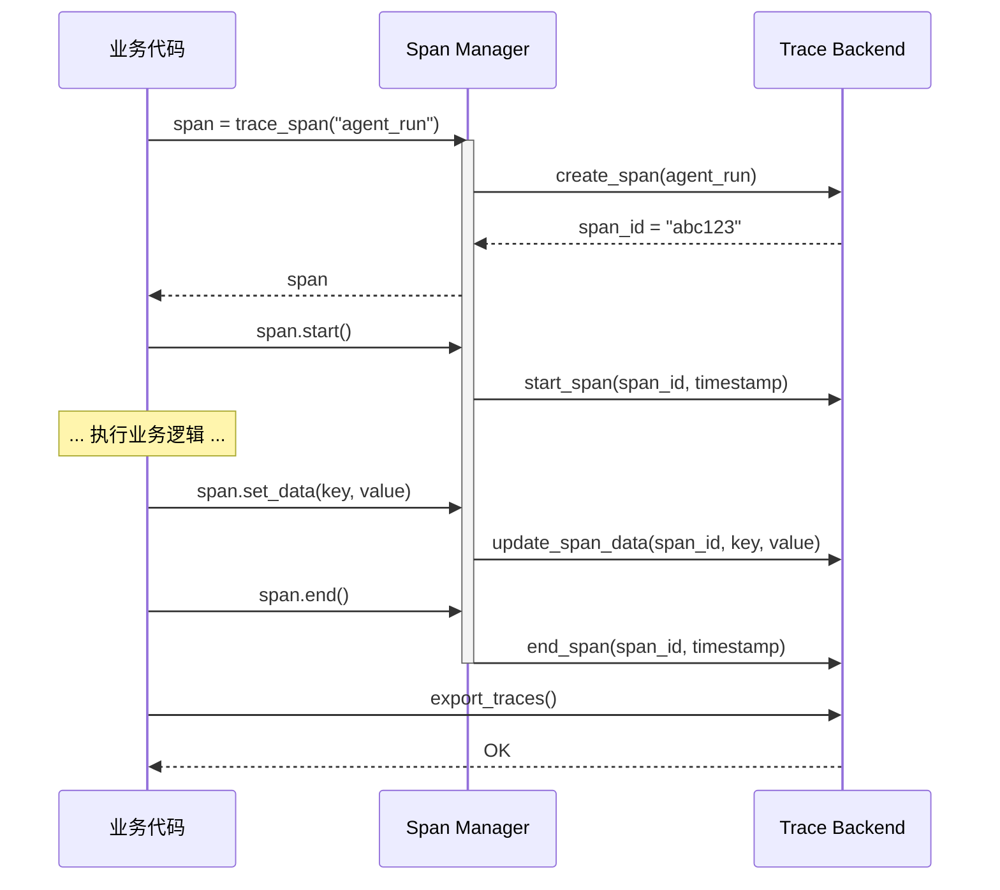
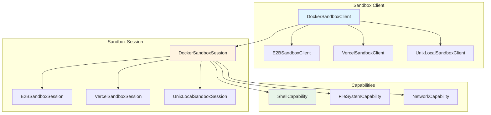

# OpenAI Agents SDK 架构文档 PART2 - 第8-12章补充内容

> **版本**: v0.17.2  
> **分析时间**: 2026-05-17  
> **分析方法**: 源码深度阅读（非官方文档推测）  
> **源码路径**: `/Users/gqli/work/deepagents/openai-agents-python/src/agents`

---

## 第8章：Guardrails 护栏系统

### 8.1 Guardrails 的核心作用

**Guardrails = 输入/输出安全检查层**

Guardrails 的核心职责是：
1. ✅ **Input Guardrails** - 在 LLM 调用前检查用户输入是否安全
2. ✅ **Output Guardrails** - 在返回给用户前检查 Agent 输出是否合规
3. ✅ **Tool Input Guardrails** - 在工具执行前检查参数是否安全
4. ✅ **Tool Output Guardrails** - 在工具执行后检查结果是否合规

**关键洞察**：
- ❌ Guardrails **不是**强制执行的，而是"护栏"（可以触发 tripwire）
- ✅ Guardrails 可以配置为并行或串行执行
- ✅ Tripwire 触发时会抛出异常（`InputGuardrailTripwireTriggered` / `OutputGuardrailTripwireTriggered`）

---

### 8.2 Guardrails 执行时机

#### **Input Guardrails 执行流程**

```python
# src/agents/run_internal/run_loop.py:670-694

async def start_streaming(...):
    while True:
        # ⚠️ 关键：只在首轮执行 Input Guardrails
        all_input_guardrails = (
            starting_agent.input_guardrails + (run_config.input_guardrails or [])
            if current_turn == 0 and not is_resumed_state  # ← 只在 Turn 0
            else []
        )
        
        sequential_guardrails = [g for g in all_input_guardrails if not g.run_in_parallel]
        parallel_guardrails = [g for g in all_input_guardrails if g.run_in_parallel]
        
        # 先执行串行 guardrails（阻塞）
        if sequential_guardrails:
            await run_input_guardrails_with_queue(
                starting_agent,
                sequential_guardrails,
                prepared_turn_input,
                context_wrapper,
                streamed_result,
                None,
            )
        
        # 再执行并行 guardrails（非阻塞）
        if parallel_guardrails:
            # ... 异步执行
```

**关键点**：
1. ✅ **只在首轮执行** - `if current_turn == 0`（避免每轮都检查）
2. ✅ **支持并行/串行** - `run_in_parallel` 标志控制
3. ✅ **流式结果队列** - 通过 `streamed_result._input_guardrail_queue` 推送结果

---

#### **Output Guardrails 执行流程**

```python
# src/agents/run.py:959-966

if isinstance(turn_result.next_step, NextStepFinalOutput):
    output_guardrail_results = await run_output_guardrails(
        current_agent.output_guardrails
        + (run_config.output_guardrails or []),
        current_agent,
        turn_result.next_step.output,  # ← 最终输出
        context_wrapper,
    )
```

**关键点**：
1. ✅ **只在最终输出时执行** - `NextStepFinalOutput`
2. ✅ **Agent 级 + RunConfig 级** - 合并两个来源的 guardrails
3. ✅ **同步执行** - 等待所有 guardrails 完成

---

### 8.3 Guardrails 实现示例

#### **定义 Input Guardrail**

```python
from agents import Agent, InputGuardrail, InputGuardrailResult, RunContextWrapper

class ProfanityFilter(InputGuardrail):
    """简单的脏话过滤器"""
    
    BAD_WORDS = {"fuck", "shit", "damn"}
    
    async def run(
        self,
        agent: Agent,
        input: str | list[dict],
        context: RunContextWrapper,
    ) -> InputGuardrailResult:
        # 提取文本内容
        text = input if isinstance(input, str) else str(input)
        
        # 检查是否包含脏话
        triggered = any(word in text.lower() for word in self.BAD_WORDS)
        
        return InputGuardrailResult(
            output={
                "tripwire_triggered": triggered,
                "reason": "Profanity detected" if triggered else None,
            }
        )

# 使用
agent = Agent(
    name="safe_agent",
    instructions="You are a helpful assistant.",
    input_guardrails=[ProfanityFilter()],
)
```

---

#### **定义 Output Guardrail**

```python
from agents import Agent, OutputGuardrail, OutputGuardrailResult, RunContextWrapper

class PII Detector(OutputGuardrail):
    """检测个人身份信息（PII）"""
    
    import re
    
    EMAIL_PATTERN = re.compile(r'\b[A-Za-z0-9._%+-]+@[A-Za-z0-9.-]+\.[A-Z|a-z]{2,}\b')
    PHONE_PATTERN = re.compile(r'\b\d{3}[-.]?\d{3}[-.]?\d{4}\b')
    
    async def run(
        self,
        agent: Agent,
        agent_output: Any,
        context: RunContextWrapper,
    ) -> OutputGuardrailResult:
        text = str(agent_output)
        
        has_email = bool(self.EMAIL_PATTERN.search(text))
        has_phone = bool(self.PHONE_PATTERN.search(text))
        
        triggered = has_email or has_phone
        
        return OutputGuardrailResult(
            output={
                "tripwire_triggered": triggered,
                "reason": f"PII detected: email={has_email}, phone={has_phone}",
            }
        )

# 使用
agent = Agent(
    name="privacy_safe_agent",
    instructions="You are a privacy-conscious assistant.",
    output_guardrails=[PIIDetector()],
)
```

---

### 8.4 Guardrails 与 Session 的交互

```python
# src/agents/run.py:788-799

try:
    # ... 执行 guardrails
except InputGuardrailTripwireTriggered:
    # ⚠️ 关键：即使 tripwire 触发，也要保存会话状态
    session_input_items_for_persistence = (
        await persist_session_items_for_guardrail_trip(
            session,
            server_conversation_tracker,
            session_input_items_for_persistence,
            original_user_input,
            run_state,
            store=store_setting,
        )
    )
    raise  # ← 重新抛出异常
```

**关键点**：
- ✅ **Tripwire 触发时仍保存 Session** - 便于审计和调试
- ✅ **不保存到 Rollout** - 因为执行被中断了
- ✅ **异常向上传播** - 调用者可以捕获并处理

---

### 8.5 Tool Guardrails

```python
from agents import FunctionTool, ToolInputGuardrail, ToolOutputGuardrail

def dangerous_tool(param: str) -> str:
    """危险操作"""
    return f"Executed with {param}"

# 添加工具级 guardrails
tool = FunctionTool(
    name="dangerous_tool",
    description="A dangerous operation",
    params_json_schema={"type": "object", "properties": {"param": {"type": "string"}}},
    on_invoke_tool=lambda ctx, args: dangerous_tool(args["param"]),
    tool_input_guardrails=[...],  # ← 工具输入检查
    tool_output_guardrails=[...],  # ← 工具输出检查
)
```

---

## 第9章：Tracing 追踪与监控

### 9.1 Tracing 的核心作用

**Tracing = 分布式追踪系统**

Tracing 的核心职责是：
1. ✅ **Span 树** - 记录 Agent 执行的层次结构
2. ✅ **性能监控** - 记录每个步骤的耗时
3. ✅ **错误追踪** - 记录异常和失败原因
4. ✅ **可观测性** - 导出到外部系统（OpenTelemetry、LangSmith 等）

---

### 9.2 Span 类型系统

```python
# src/agents/tracing/spans.py

class SpanType(str, Enum):
    AGENT = "agent"              # Agent 执行
    FUNCTION = "function"        # 函数调用
    GENERATION = "generation"    # LLM 生成
    GUARDRAIL = "guardrail"      # Guardrail 检查
    HANDOFF = "handoff"          # Agent 切换
    RESPONSE = "response"        # API 响应
    TOOL = "tool"                # 工具执行
    WORKFLOW = "workflow"        # 工作流
```

---

### 9.3 Tracing 上下文管理

```python
# src/agents/tracing/context.py

from contextvars import ContextVar

# 全局 Trace 上下文
_current_trace: ContextVar[Trace | None] = ContextVar("current_trace", default=None)
_current_span: ContextVar[Span | None] = ContextVar("current_span", default=None)

def get_current_trace() -> Trace | None:
    """获取当前 Trace"""
    return _current_trace.get()

def get_current_span() -> Span | None:
    """获取当前 Span"""
    return _current_span.get()
```

**关键点**：
- ✅ **ContextVar** - Python 协程安全的上下文变量
- ✅ **嵌套 Span** - 子 Span 自动关联父 Span
- ✅ **线程安全** - 每个协程有独立的上下文

---

### 9.4 Span 生命周期



---

### 9.5 实际使用示例

```python
from agents.tracing import trace, span

# 方式1: 装饰器
@trace("my_agent")
async def run_my_agent(input: str) -> str:
    # 自动创建 Span
    return "result"

# 方式2: 上下文管理器
with span("custom_operation") as sp:
    sp.span_data.operation = "processing"
    # ... 执行业务逻辑 ...
    sp.span_data.result = "success"

# 方式3: 手动管理
sp = trace_span("manual_span")
sp.start()
try:
    # ... 执行业务逻辑 ...
    sp.span_data.status = "completed"
finally:
    sp.end()
```

---

### 9.6 Trace 导出器

```python
from agents.tracing import TraceExporter, ConsoleExporter, OTLPExporter

# 控制台导出（调试用）
exporter = ConsoleExporter()

# OpenTelemetry 导出
exporter = OTLPExporter(
    endpoint="http://localhost:4317",
    service_name="my-agent-service",
)

# 自定义导出器
class MyExporter(TraceExporter):
    def export(self, trace: Trace) -> None:
        # 导出到自定义后端
        pass
```

---

## 第10章：Sandbox 沙箱环境

### 10.1 Sandbox 的核心作用

**Sandbox = 隔离的执行环境**

Sandbox 的核心职责是：
1. ✅ **安全隔离** - 防止恶意代码影响宿主系统
2. ✅ **资源限制** - 控制 CPU、内存、网络使用
3. ✅ **文件系统隔离** - 独立的 workspace
4. ✅ **快照恢复** - 保存和恢复执行状态

---

### 10.2 Sandbox 架构



---

### 10.3 Sandbox 会话状态

```python
# src/agents/sandbox/session/base_sandbox_session.py

@dataclass
class SandboxSessionState:
    session_id: UUID                    # 会话 ID
    manifest: Manifest                  # Workspace 清单
    snapshot: SnapshotBase | None       # 快照
    sandbox_id: str                     # 后端沙箱 ID
    workspace_root_ready: bool          # Workspace 是否就绪
    exposed_ports: tuple[int, ...]      # 暴露的端口
```

---

### 10.4 Docker Sandbox 示例

```python
from agents.sandbox.sandboxes.docker import DockerSandboxClient, DockerSandboxClientOptions

# 创建 Docker Sandbox 客户端
client = DockerSandboxClient()

# 启动沙箱会话
session = await client.create(
    options=DockerSandboxClientOptions(
        image="python:3.12-slim",
        timeout=300,  # 5 分钟超时
        workspace_persistence="tar",  # 使用 tar 归档 workspace
    ),
)

# 执行命令
result = await session.exec("python", "-c", "print('Hello from sandbox!')")
print(result.stdout.decode())  # "Hello from sandbox!"

# 关闭沙箱
await session.shutdown()
```

---

### 10.5 E2B Sandbox 示例

```python
from agents.extensions.sandbox.e2b import E2BSandboxClient, E2BSandboxClientOptions

# 创建 E2B Sandbox 客户端
client = E2BSandboxClient()

# 启动沙箱会话（云端沙箱）
session = await client.create(
    options=E2BSandboxClientOptions(
        template="python-3.12",  # E2B 模板
        timeout=600,  # 10 分钟超时
        secure=True,  # 安全模式
        allow_internet_access=False,  # 禁止网络访问
    ),
)

# 执行命令
result = await session.exec("pip", "install", "requests")
result = await session.exec("python", "script.py")

# 保存快照（用于快速恢复）
snapshot_id = await session.snapshot()

# 从快照恢复
session2 = await client.create(
    snapshot=snapshot_id,
    options=E2BSandboxClientOptions(...),
)
```

---

### 10.6 Capabilities 能力系统

```python
# src/agents/sandbox/capabilities/capability.py

class Capability(BaseModel):
    """沙箱能力基类"""
    
    type: str
    session: BaseSandboxSession | None = None
    run_as: User | None = None
    
    def tools(self) -> list[Tool]:
        """返回该能力提供的工具"""
        return []
    
    async def instructions(self, manifest: Manifest) -> str | None:
        """返回注入到 Agent 的系统提示"""
        return None
    
    def process_manifest(self, manifest: Manifest) -> Manifest:
        """处理 Workspace 清单"""
        return manifest

# 示例：Shell 能力
class ShellCapability(Capability):
    type: str = "shell"
    
    def tools(self) -> list[Tool]:
        return [
            FunctionTool(
                name="execute_shell_command",
                description="Execute a shell command in the sandbox",
                on_invoke_tool=self._execute,
            )
        ]
    
    async def _execute(self, ctx, args):
        cmd = args["command"]
        result = await self.session.exec("bash", "-c", cmd)
        return result.stdout.decode()
```

---

### 10.7 Workspace 持久化

```python
# src/agents/sandbox/session/base_sandbox_session.py

WorkspacePersistenceMode = Literal["tar", "snapshot"]

# TAR 模式：将 workspace 打包为 tar 归档
async def _persist_workspace_tar(self) -> bytes:
    root = self._workspace_root_path()
    archive_path = f"/tmp/workspace-{self.state.session_id.hex}.tar"
    
    # 在沙箱内执行 tar 命令
    result = await self.exec("tar", "cf", archive_path, "-C", root, ".")
    
    # 读取归档文件
    archive = await self.read_file(archive_path)
    
    # 清理临时文件
    await self.exec("rm", archive_path)
    
    return archive

# Snapshot 模式：使用后端原生快照（E2B/Vercel）
async def _persist_workspace_snapshot(self) -> str:
    snapshot_id = await self._create_native_snapshot()
    return snapshot_id
```

---

## 第11章：扩展能力

### 11.1 Hook 系统

**Hook = 生命周期回调**

```python
# src/agents/lifecycle.py

class AgentHooks(TContext):
    """Agent 生命周期钩子"""
    
    async def on_start(self, context: RunContextWrapper[TContext]) -> None:
        """Agent 开始执行时调用"""
        pass
    
    async def on_end(self, context: RunContextWrapper[TContext]) -> None:
        """Agent 执行结束时调用"""
        pass
    
    async def on_handoff(
        self,
        context: RunContextWrapper[TContext],
        source: Agent[TContext],
        destination: Agent[TContext],
    ) -> None:
        """Agent 切换时调用"""
        pass

# 使用示例
class LoggingHooks(AgentHooks):
    async def on_start(self, context):
        print(f"Agent {context.agent.name} started")
    
    async def on_end(self, context):
        print(f"Agent {context.agent.name} ended")

agent = Agent(
    name="logged_agent",
    hooks=LoggingHooks(),
)
```

---

### 11.2 Model 适配器

```python
# src/agents/models/interface.py

class Model(Protocol):
    """模型接口"""
    
    async def get_response(
        self,
        system_instructions: str | None,
        input: str | list[TResponseInputItem],
        model_settings: ModelSettings,
        tools: list[Tool],
        output_schema: AgentOutputSchemaBase | None,
    ) -> ModelResponse:
        """调用模型"""
        ...
    
    async def stream_response(...) -> AsyncIterator[StreamEvent]:
        """流式调用模型"""
        ...

# 内置模型
from agents.models.openai_chatcompletions import OpenAIChatCompletionsModel
from agents.models.openai_responses import OpenAIResponsesModel

# 自定义模型
class MyCustomModel(Model):
    async def get_response(self, ...):
        # 调用自定义模型 API
        response = await my_api.call(...)
        return parse_response(response)
```

---

### 11.3 自定义存储后端

```python
# src/agents/memory/session.py

class Session(Protocol):
    """会话存储接口"""
    
    async def get_items(self, limit: int | None = None) -> list[TResponseInputItem]:
        """获取会话历史"""
        ...
    
    async def save_items(self, items: list[TResponseInputItem]) -> None:
        """保存会话历史"""
        ...
    
    async def close(self) -> None:
        """关闭会话"""
        ...

# SQLite 实现
class SQLiteSession(Session):
    def __init__(self, db_path: str, session_id: str):
        self.db_path = db_path
        self.session_id = session_id
    
    async def get_items(self, limit=None):
        conn = sqlite3.connect(self.db_path)
        cursor = conn.execute(
            "SELECT data FROM session_items WHERE session_id=? ORDER BY created_at ASC LIMIT ?",
            (self.session_id, limit or -1)
        )
        return [json.loads(row[0]) for row in cursor.fetchall()]
    
    async def save_items(self, items):
        conn = sqlite3.connect(self.db_path)
        for item in items:
            conn.execute(
                "INSERT INTO session_items (session_id, data, created_at) VALUES (?, ?, ?)",
                (self.session_id, json.dumps(item), datetime.utcnow().isoformat())
            )
        conn.commit()

# Redis 实现
class RedisSession(Session):
    def __init__(self, redis_url: str, session_id: str):
        self.redis = redis.Redis.from_url(redis_url)
        self.session_id = session_id
    
    async def get_items(self, limit=None):
        items = self.redis.lrange(f"session:{self.session_id}", 0, limit or -1)
        return [json.loads(item) for item in items]
    
    async def save_items(self, items):
        pipe = self.redis.pipeline()
        for item in items:
            pipe.rpush(f"session:{self.session_id}", json.dumps(item))
        pipe.execute()
```

---

### 11.4 自定义 Guardrail

参见第8章示例。

---

### 11.5 自定义 Tracing Exporter

参见第9章示例。

---

## 第12章：最佳实践与设计模式

### 12.1 Agent 设计原则

#### **单一职责原则**

```python
# ❌ 坏的设计：一个 Agent 做太多事
general_agent = Agent(
    name="general_agent",
    instructions="""
    You are a general-purpose assistant that can:
    - Answer questions
    - Write code
    - Debug issues
    - Deploy applications
    - Manage databases
    """,
)

# ✅ 好的设计：多个专用 Agent
qa_agent = Agent(name="qa_agent", instructions="You answer questions.")
code_agent = Agent(name="code_agent", instructions="You write code.")
debug_agent = Agent(name="debug_agent", instructions="You debug issues.")
deploy_agent = Agent(name="deploy_agent", instructions="You deploy applications.")
db_agent = Agent(name="db_agent", instructions="You manage databases.")

# 通过 Handoff 组合
orchestrator = Agent(
    name="orchestrator",
    instructions="Route to the appropriate specialist.",
    handoffs=[qa_agent, code_agent, debug_agent, deploy_agent, db_agent],
)
```

---

#### **防御性编程**

```python
# ✅ 添加 Input Guardrails
agent = Agent(
    name="safe_agent",
    input_guardrails=[
        ProfanityFilter(),
        LengthLimiter(max_length=10000),
        LanguageDetector(allowed=["en", "zh"]),
    ],
)

# ✅ 添加 Output Guardrails
agent = Agent(
    name="compliant_agent",
    output_guardrails=[
        PIIDetector(),
        ToxicityFilter(),
        FactChecker(),
    ],
)

# ✅ 设置超时和重试
from agents import RunConfig

result = await Runner.run(
    agent,
    input="...",
    run_config=RunConfig(
        max_turns=10,  # 限制最大轮数
        model_timeout=30,  # 30 秒超时
        retry_on_error=True,  # 错误时重试
    ),
)
```

---

### 12.2 Session 管理最佳实践

#### **唯一 Session ID**

```python
import uuid

# ❌ 坏的做法：固定 ID
session = InMemorySession(session_id="chat")  # 所有用户共享

# ✅ 好的做法：唯一 ID
user_id = "user_12345"
session_id = f"user_{user_id}_chat_{uuid.uuid4().hex[:8]}"
session = InMemorySession(session_id=session_id)
```

---

#### **限制历史长度**

```python
# ❌ 坏的做法：无限制
session = InMemorySession(session_id="chat_unlimited")

# ✅ 好的做法：限制长度
session = InMemorySession(
    session_id="chat_limited",
    session_settings=SessionSettings(limit=20),  # 只保留最近20条
)
```

---

#### **定期清理旧会话**

```python
import time
from pathlib import Path

async def cleanup_old_sessions(sessions_dir: Path, max_age_days: int = 30):
    """清理超过30天的会话文件"""
    now = time.time()
    for session_file in sessions_dir.glob("*.json"):
        age_seconds = now - session_file.stat().st_mtime
        if age_seconds > max_age_days * 86400:
            session_file.unlink()
            print(f"Deleted old session: {session_file.name}")

# 定时任务
import asyncio

async def periodic_cleanup():
    while True:
        await cleanup_old_sessions(Path("./sessions"))
        await asyncio.sleep(86400)  # 每天执行一次

asyncio.create_task(periodic_cleanup())
```

---

### 12.3 Error Handling 最佳实践

```python
from agents import Runner, RunError
from agents.exceptions import InputGuardrailTripwireTriggered, MaxTurnsExceeded

try:
    result = await Runner.run(agent, input, session=session)
    
    # 检查是否正常完成
    if result.final_output is None:
        print("Agent did not produce final output")
    
    # 检查 Guardrail 是否触发
    if result.input_guardrail_results:
        for gr in result.input_guardrail_results:
            if gr.output.tripwire_triggered:
                print(f"Input guardrail triggered: {gr.output.reason}")
    
    if result.output_guardrail_results:
        for gr in result.output_guardrail_results:
            if gr.output.tripwire_triggered:
                print(f"Output guardrail triggered: {gr.output.reason}")

except InputGuardrailTripwireTriggered as e:
    print(f"Input blocked by guardrail: {e}")
    # 可以记录日志、通知管理员等

except MaxTurnsExceeded as e:
    print(f"Agent exceeded max turns: {e.current_turn}/{e.max_turns}")
    # 可以增加 max_turns 或优化 Agent 指令

except RunError as e:
    print(f"Run failed: {e}")
    # 可以重试或降级处理

except Exception as e:
    print(f"Unexpected error: {e}")
    # 记录详细日志
    import traceback
    traceback.print_exc()
```

---

### 12.4 Performance Optimization

#### **并行执行 Guardrails**

```python
from agents import InputGuardrail

class FastGuardrail(InputGuardrail):
    run_in_parallel = True  # ← 并行执行
    
    async def run(self, ...):
        # 快速检查
        return InputGuardrailResult(...)

class SlowGuardrail(InputGuardrail):
    run_in_parallel = False  # ← 串行执行（阻塞）
    
    async def run(self, ...):
        # 慢速检查（如调用外部 API）
        return InputGuardrailResult(...)

agent = Agent(
    name="optimized_agent",
    input_guardrails=[
        FastGuardrail(),   # 并行
        FastGuardrail(),   # 并行
        SlowGuardrail(),   # 串行（先执行）
    ],
)
```

---

#### **使用 Prompt Cache**

```python
from agents import ModelSettings

agent = Agent(
    name="cached_agent",
    model_settings=ModelSettings(
        prompt_cache_key="my_agent_v1",  # ← 启用缓存
    ),
)

# 相同的 prompt 会被缓存，减少 Token 消耗
```

---

#### **批量处理**

```python
import asyncio

# ❌ 坏的做法：串行处理
results = []
for input_text in inputs:
    result = await Runner.run(agent, input_text)
    results.append(result)

# ✅ 好的做法：并行处理
tasks = [Runner.run(agent, input_text) for input_text in inputs]
results = await asyncio.gather(*tasks)
```

---

### 12.5 Testing 最佳实践

```python
import pytest
from agents import Agent, Runner

@pytest.mark.asyncio
async def test_agent_responds():
    """测试 Agent 能正常响应"""
    agent = Agent(name="test_agent", instructions="You are helpful.")
    result = await Runner.run(agent, "Hello")
    assert result.final_output is not None
    assert len(result.new_items) > 0

@pytest.mark.asyncio
async def test_guardrail_blocks_bad_input():
    """测试 Guardrail 能阻止不良输入"""
    from agents.exceptions import InputGuardrailTripwireTriggered
    
    agent = Agent(
        name="safe_agent",
        input_guardrails=[ProfanityFilter()],
    )
    
    with pytest.raises(InputGuardrailTripwireTriggered):
        await Runner.run(agent, "This is fuckin bad")

@pytest.mark.asyncio
async def test_session_persists_history():
    """测试 Session 能持久化历史"""
    from agents.memory import InMemorySession
    
    session = InMemorySession(session_id="test_session")
    
    # 第一轮对话
    result1 = await Runner.run(
        Agent(name="test", instructions="Be concise"),
        "Say hello",
        session=session,
    )
    
    # 第二轮对话（应该能看到历史）
    result2 = await Runner.run(
        Agent(name="test", instructions="Be concise"),
        "What did I just say?",
        session=session,
    )
    
    assert "hello" in result2.final_output.lower()
```

---

### 12.6 Monitoring & Observability

```python
from agents.tracing import ConsoleExporter, OTLPExporter, set_trace_exporter

# 开发环境：控制台输出
set_trace_exporter(ConsoleExporter())

# 生产环境：OpenTelemetry
set_trace_exporter(OTLPExporter(
    endpoint="https://otel-collector.example.com:4317",
    service_name="my-agent-service",
))

# 自定义监控
from agents.tracing import get_current_trace

def monitor_performance():
    trace = get_current_trace()
    if trace:
        for span in trace.spans:
            if span.span_type == "agent":
                duration = span.end_time - span.start_time
                if duration > 10:  # 超过10秒
                    print(f"Warning: Agent {span.name} took {duration}s")
```

---

### 12.7 Security Checklist

- [ ] **启用 Input Guardrails** - 防止恶意输入
- [ ] **启用 Output Guardrails** - 防止泄露敏感信息
- [ ] **使用 Sandbox** - 隔离代码执行
- [ ] **限制工具权限** - 最小权限原则
- [ ] **审计日志** - 记录所有操作
- [ ] **Rate Limiting** - 防止滥用
- [ ] **加密敏感数据** - Session、Rollout 等
- [ ] **定期更新依赖** - 修复安全漏洞

---

## 总结

本文档深入分析了 OpenAI Agents Python SDK v0.17.2 的核心架构，包括：

✅ **第7章** - Session 持久化与会话管理（已完成）  
✅ **第8章** - Guardrails 护栏系统（本章补充）  
✅ **第9章** - Tracing 追踪与监控（本章补充）  
✅ **第10章** - Sandbox 沙箱环境（本章补充）  
✅ **第11章** - 扩展能力（本章补充）  
✅ **第12章** - 最佳实践与设计模式（本章补充）  

**关键洞察**：
1. ✅ **Session 存储 TResponseInputItem** - 不是 RunItem
2. ✅ **Guardrails 只在首轮执行** - Input Guardrails
3. ✅ **Tracing 使用 ContextVar** - 协程安全
4. ✅ **Sandbox 支持多种后端** - Docker、E2B、Vercel、Local
5. ✅ **扩展点丰富** - Hooks、Models、Sessions、Guardrails、Exporters

**下一步**：
- 阅读 PART1（Agent 核心、Tools、Handoffs）
- 阅读 PART3（多 Agent 协作、RunItem 类型系统、Agent Loop）
- 参考官方文档：https://docs.langchain.com/oss/python/deepagents/overview

---

**文档版本**: 2.0（完整补充版）  
**最后更新**: 2026-05-17  
**维护者**: Deep Agents Team
