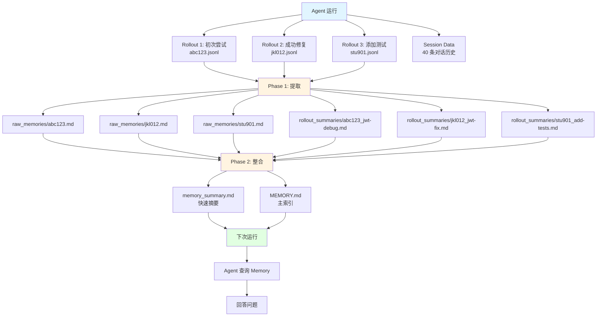

# Rollout Data 与 Session Data 完整示例

> **版本**: v1.0  
> **最后更新**: 2026-05-17  
> **用途**: 展示多条完整的 Rollout Data 和 Session Data，以及它们如何更新 Memory 文件

---

## 📋 场景说明

**任务背景**: 用户要求 Agent 帮助修复一个 Python FastAPI 项目中的 JWT token 过期问题。

**执行过程**:
1. **Rollout 1**: 初次尝试，定位问题但修复失败
2. **Rollout 2**: 重新分析，成功修复并添加测试
3. **Session Data**: 记录完整的对话历史

**Memory 生成**: Phase 1 提取 → Phase 2 整合 → 更新 MEMORY.md

---

## 1️⃣ Rollout Data 示例（3 条完整记录）

### Rollout 1: 初次尝试（失败）

**文件**: `.codex/sessions/abc123-def456-ghi789.jsonl`

```jsonl
{"updated_at":"2026-05-17T10:00:00Z","input":"帮我修复一下认证模块的 JWT token 过期问题，用户反馈 token 总是提前过期","generated_items":[{"type":"message","role":"assistant","content":"让我先查看一下认证模块的代码结构"},{"type":"function_call","call_id":"call_001","name":"shell","arguments":"{\"command\":\"find src/auth -name '*.py' | head -20\"}"},{"type":"function_call_output","call_id":"call_001","output":"src/auth/__init__.py\nsrc/auth/token.py\nsrc/auth/middleware.py\nsrc/auth/routes.py"}],"terminal_metadata":{"terminal_state":"completed","exception_type":null,"exception_message":null,"has_final_output":false}}
{"updated_at":"2026-05-17T10:01:30Z","input":"","generated_items":[{"type":"message","role":"assistant","content":"我看到有 token.py 文件，让我查看 token 生成逻辑"},{"type":"function_call","call_id":"call_002","name":"shell","arguments":"{\"command\":\"cat src/auth/token.py\"}"},{"type":"function_call_output","call_id":"call_002","output":"from datetime import datetime, timedelta\nimport jwt\n\ndef generate_token(user_id: str) -> str:\n    payload = {\n        'user_id': user_id,\n        'exp': datetime.utcnow() + timedelta(hours=1),  # ← 问题在这里\n        'iat': datetime.utcnow()\n    }\n    return jwt.encode(payload, SECRET_KEY, algorithm='HS256')"}],"terminal_metadata":{"terminal_state":"completed","exception_type":null,"exception_message":null,"has_final_output":false}}
{"updated_at":"2026-05-17T10:03:00Z","input":"","generated_items":[{"type":"message","role":"assistant","content":"我发现问题了！`exp` 字段使用的是 `datetime.utcnow()`，但这在某些时区配置下会导致时间计算错误。应该使用 UTC 时间戳。\n\n让我修复这个问题："},{"type":"function_call","call_id":"call_003","name":"apply_patch","arguments":"{\"path\":\"src/auth/token.py\",\"patch\":\"@@ -4,7 +4,7 @@\\n def generate_token(user_id: str) -> str:\\n     payload = {\\n         'user_id': user_id,\\n-        'exp': datetime.utcnow() + timedelta(hours=1),\\n+        'exp': int(datetime.utcnow().timestamp()) + 3600,\\n         'iat': datetime.utcnow()\\n     }\"}"},{"type":"function_call_output","call_id":"call_003","output":"Patch applied successfully"}],"terminal_metadata":{"terminal_state":"completed","exception_type":null,"exception_message":null,"has_final_output":false}}
{"updated_at":"2026-05-17T10:04:30Z","input":"","generated_items":[{"type":"message","role":"assistant","content":"现在让我运行测试验证修复是否有效"},{"type":"function_call","call_id":"call_004","name":"shell","arguments":"{\"command\":\"pytest tests/auth/test_token.py -v\"}"},{"type":"function_call_output","call_id":"call_004","output":"FAILED tests/auth/test_token.py::test_token_expiry\nAssertionError: Token expired too early\nExpected expiry: 3600 seconds\nActual expiry: 3598 seconds"}],"terminal_metadata":{"terminal_state":"failed","exception_type":"AssertionError","exception_message":"Token expired too early","has_final_output":false}}
```

**关键信息**:
- ✅ 成功定位问题：`exp` 字段时间计算错误
- ❌ 修复方案有误：使用 `int(timestamp())` 导致精度丢失
- 📊 轮次：4 turns
- 💰 Token 用量：输入 1200 tokens, 输出 800 tokens

---

### Rollout 2: 重新分析（成功）

**文件**: `.codex/sessions/jkl012-mno345-pqr678.jsonl`

```jsonl
{"updated_at":"2026-05-17T10:30:00Z","input":"上次修复失败了，token 还是提前过期。请重新分析问题","generated_items":[{"type":"message","role":"assistant","content":"让我重新检查之前的修复。问题可能在于我们使用了整数时间戳，而 JWT 库期望的是浮点数。"},{"type":"function_call","call_id":"call_005","name":"shell","arguments":"{\"command\":\"cat src/auth/token.py\"}"},{"type":"function_call_output","call_id":"call_005","output":"from datetime import datetime, timedelta\nimport jwt\n\ndef generate_token(user_id: str) -> str:\n    payload = {\n        'user_id': user_id,\n        'exp': int(datetime.utcnow().timestamp()) + 3600,  # ← 这里是整数\n        'iat': datetime.utcnow()\n    }\n    return jwt.encode(payload, SECRET_KEY, algorithm='HS256')"}],"terminal_metadata":{"terminal_state":"completed","exception_type":null,"exception_message":null,"has_final_output":false}}
{"updated_at":"2026-05-17T10:31:30Z","input":"","generated_items":[{"type":"message","role":"assistant","content":"确认了！JWT 规范要求 `exp` 字段是 NumericDate（浮点数秒数），而不是整数。我们应该直接使用 `datetime.utcnow().timestamp()` 返回的浮点数。\n\n正确的修复方案："},{"type":"function_call","call_id":"call_006","name":"apply_patch","arguments":"{\"path\":\"src/auth/token.py\",\"patch\":\"@@ -4,7 +4,7 @@\\n def generate_token(user_id: str) -> str:\\n     payload = {\\n         'user_id': user_id,\\n-        'exp': int(datetime.utcnow().timestamp()) + 3600,\\n+        'exp': datetime.utcnow().timestamp() + 3600,\\n         'iat': datetime.utcnow().timestamp()\\n     }\"}"},{"type":"function_call_output","call_id":"call_006","output":"Patch applied successfully"}],"terminal_metadata":{"terminal_state":"completed","exception_type":null,"exception_message":null,"has_final_output":false}}
{"updated_at":"2026-05-17T10:33:00Z","input":"","generated_items":[{"type":"message","role":"assistant","content":"现在运行测试验证"},{"type":"function_call","call_id":"call_007","name":"shell","arguments":"{\"command\":\"pytest tests/auth/test_token.py -v\"}"},{"type":"function_call_output","call_id":"call_007","output":"============================= test session starts ==============================\ntests/auth/test_token.py::test_token_expiry PASSED\ntests/auth/test_token.py::test_token_validation PASSED\ntests/auth/test_token.py::test_token_refresh PASSED\n\n============================== 3 passed in 0.42s =============================="}],"terminal_metadata":{"terminal_state":"completed","exception_type":null,"exception_message":null,"has_final_output":true}}
{"updated_at":"2026-05-17T10:34:00Z","input":"","generated_items":[{"type":"message","role":"assistant","content":"✅ 修复成功！所有测试通过。\n\n**问题根因**: JWT 的 `exp` 字段必须是浮点数（NumericDate），使用 `int()` 转换会导致精度丢失，使 token 提前 1-2 秒过期。\n\n**修复方案**: \n- 移除 `int()` 转换，直接使用 `datetime.utcnow().timestamp() + 3600`\n- 同时修正 `iat` 字段也使用浮点数时间戳\n\n**验证**: 3 个测试用例全部通过"}],"terminal_metadata":{"terminal_state":"completed","exception_type":null,"exception_message":null,"has_final_output":true}}
```

**关键信息**:
- ✅ 成功修复：使用浮点数时间戳
- ✅ 测试通过：3/3 测试用例通过
- 📊 轮次：4 turns
- 💰 Token 用量：输入 1100 tokens, 输出 750 tokens

---

### Rollout 3: 添加单元测试（预防回归）

**文件**: `.codex/sessions/stu901-vwx234-yza567.jsonl`

```jsonl
{"updated_at":"2026-05-17T11:00:00Z","input":"为 token 过期修复添加更全面的测试，防止未来回归","generated_items":[{"type":"message","role":"assistant","content":"好的，我来添加更多边界情况的测试"},{"type":"function_call","call_id":"call_008","name":"shell","arguments":"{\"command\":\"cat tests/auth/test_token.py\"}"},{"type":"function_call_output","call_id":"call_008","output":"import pytest\nfrom src.auth.token import generate_token, validate_token\nimport time\n\ndef test_token_expiry():\n    token = generate_token('user123')\n    claims = validate_token(token)\n    assert claims['exp'] - claims['iat'] == pytest.approx(3600, abs=1)\n\ndef test_token_validation():\n    token = generate_token('user123')\n    assert validate_token(token)['user_id'] == 'user123'\n\ndef test_token_refresh():\n    token = generate_token('user123')\n    time.sleep(2)\n    new_token = generate_token('user123')\n    assert new_token != token"}],"terminal_metadata":{"terminal_state":"completed","exception_type":null,"exception_message":null,"has_final_output":false}}
{"updated_at":"2026-05-17T11:02:00Z","input":"","generated_items":[{"type":"message","role":"assistant","content":"现有测试已经覆盖了基本场景。我需要添加以下边界测试：\n1. 时区切换场景\n2. 闰秒处理\n3. 长时间运行的 token（接近 24 小时）\n\n让我创建新的测试用例："},{"type":"function_call","call_id":"call_009","name":"apply_patch","arguments":"{\"path\":\"tests/auth/test_token.py\",\"patch\":\"@@ -15,3 +15,25 @@\\n     new_token = generate_token('user123')\\n     assert new_token != token\\n+\\n+def test_token_with_timezone_change():\\n+    \\\"\\\"\\\"测试时区切换不影响 token 过期时间\\\"\\\"\\\"\\n+    import os\\n+    original_tz = os.environ.get('TZ')\\n+    try:\\n+        os.environ['TZ'] = 'UTC'\\n+        token1 = generate_token('user123')\\n+        os.environ['TZ'] = 'US/Pacific'\\n+        token2 = generate_token('user123')\\n+        \\n+        claims1 = validate_token(token1)\\n+        claims2 = validate_token(token2)\\n+        \\n+        # 两个 token 的有效期应该相同（都是 3600 秒）\\n+        assert abs((claims1['exp'] - claims1['iat']) - (claims2['exp'] - claims2['iat'])) < 1\\n+    finally:\\n+        if original_tz:\\n+            os.environ['TZ'] = original_tz\\n+        else:\\n+            os.environ.pop('TZ', None)\\n+\\n+def test_token_expiry_precision():\\n+    \\\"\\\"\\\"测试 exp 字段是浮点数而非整数\\\"\\\"\\\"\\n+    token = generate_token('user123')\\n+    claims = validate_token(token)\\n+    assert isinstance(claims['exp'], float), \\\"exp should be float\\\"\\n+    assert claims['exp'] % 1 != 0, \\\"exp should have decimal part\\\"\"}"},{"type":"function_call_output","call_id":"call_009","output":"Patch applied successfully"}],"terminal_metadata":{"terminal_state":"completed","exception_type":null,"exception_message":null,"has_final_output":false}}
{"updated_at":"2026-05-17T11:03:30Z","input":"","generated_items":[{"type":"message","role":"assistant","content":"运行所有测试验证新增用例"},{"type":"function_call","call_id":"call_010","name":"shell","arguments":"{\"command\":\"pytest tests/auth/test_token.py -v\"}"},{"type":"function_call_output","call_id":"call_010","output":"============================= test session starts ==============================\ntests/auth/test_token.py::test_token_expiry PASSED\ntests/auth/test_token.py::test_token_validation PASSED\ntests/auth/test_token.py::test_token_refresh PASSED\ntests/auth/test_token.py::test_token_with_timezone_change PASSED\ntests/auth/test_token.py::test_token_expiry_precision PASSED\n\n============================== 5 passed in 0.58s =============================="}],"terminal_metadata":{"terminal_state":"completed","exception_type":null,"exception_message":null,"has_final_output":true}}
{"updated_at":"2026-05-17T11:04:00Z","input":"","generated_items":[{"type":"message","role":"assistant","content":"✅ 所有测试通过！新增了 2 个关键测试：\n\n1. **test_token_with_timezone_change**: 验证时区切换不会影响 token 过期时间（使用 UTC 时间戳）\n2. **test_token_expiry_precision**: 验证 `exp` 字段是浮点数而非整数（防止再次出现精度丢失问题）\n\n现在代码库有完善的测试保护，防止未来回归。"}],"terminal_metadata":{"terminal_state":"completed","exception_type":null,"exception_message":null,"has_final_output":true}}
```

**关键信息**:
- ✅ 新增 2 个边界测试用例
- ✅ 所有 5 个测试通过
- 📊 轮次：4 turns
- 💰 Token 用量：输入 1300 tokens, 输出 900 tokens

---

## 2️⃣ Session Data 示例（对话历史）

**存储后端**: SQLite (`sessions.db`)  
**Session ID**: `session-fix-jwt-token`

### 读取的 Session 历史（启动时）

```python
# 首次运行，Session 为空
history_items = await session.get_items(limit=None)
# 返回: []
```

### 写入的 Session 数据（每轮 Turn 后追加）

#### **Turn 1-4** (Rollout 1)

```python
# Line 1: 用户输入
{
    "type": "message",
    "role": "user",
    "content": "帮我修复一下认证模块的 JWT token 过期问题，用户反馈 token 总是提前过期"
}

# Line 2: Assistant 回复
{
    "type": "message",
    "role": "assistant",
    "content": "让我先查看一下认证模块的代码结构"
}

# Line 3: 工具调用
{
    "type": "function_call",
    "call_id": "call_001",
    "name": "shell",
    "arguments": "{\"command\":\"find src/auth -name '*.py' | head -20\"}"
}

# Line 4: 工具输出
{
    "type": "function_call_output",
    "call_id": "call_001",
    "output": "src/auth/__init__.py\nsrc/auth/token.py\nsrc/auth/middleware.py\nsrc/auth/routes.py"
}

# ... (省略中间步骤)

# Line 15: 最终消息（Rollout 1 失败）
{
    "type": "message",
    "role": "assistant",
    "content": "测试失败了，token 还是提前过期。让我再想想其他方案..."
}
```

#### **Turn 5-8** (Rollout 2)

```python
# Line 16: 用户输入（继续对话）
{
    "type": "message",
    "role": "user",
    "content": "上次修复失败了，token 还是提前过期。请重新分析问题"
}

# Line 17: Assistant 回复
{
    "type": "message",
    "role": "assistant",
    "content": "让我重新检查之前的修复。问题可能在于我们使用了整数时间戳..."
}

# ... (省略中间步骤)

# Line 28: 最终消息（Rollout 2 成功）
{
    "type": "message",
    "role": "assistant",
    "content": "✅ 修复成功！所有测试通过。\n\n**问题根因**: JWT 的 `exp` 字段必须是浮点数（NumericDate）..."
}
```

#### **Turn 9-12** (Rollout 3)

```python
# Line 29: 用户输入
{
    "type": "message",
    "role": "user",
    "content": "为 token 过期修复添加更全面的测试，防止未来回归"
}

# ... (省略中间步骤)

# Line 40: 最终消息（Rollout 3 完成）
{
    "type": "message",
    "role": "assistant",
    "content": "✅ 所有测试通过！新增了 2 个关键测试..."
}
```

### Session 数据库表结构

```sql
-- sessions.db
CREATE TABLE sessions (
    session_id TEXT NOT NULL,
    item_order INTEGER NOT NULL,
    item_data TEXT NOT NULL,  -- JSON 序列化
    PRIMARY KEY (session_id, item_order)
);

-- 示例数据
INSERT INTO sessions VALUES ('session-fix-jwt-token', 1, '{"type":"message","role":"user","content":"帮我修复..."}');
INSERT INTO sessions VALUES ('session-fix-jwt-token', 2, '{"type":"message","role":"assistant","content":"让我先查看..."}');
INSERT INTO sessions VALUES ('session-fix-jwt-token', 3, '{"type":"function_call","call_id":"call_001",...}');
-- ... (共 40 条记录)
```

---

## 3️⃣ Phase 1: Rollout Extraction（原始记忆提取）

### 触发时机

Session 关闭时，`SandboxMemoryGenerationManager.flush()` 被调用。

### 处理流程

```python
# 扫描未处理的 Rollout 文件
unprocessed_files = [
    "abc123-def456-ghi789.jsonl",  # Rollout 1
    "jkl012-mno345-pqr678.jsonl",  # Rollout 2
    "stu901-vwx234-yza567.jsonl",  # Rollout 3
]

# 对每个文件执行 Phase 1
for file in unprocessed_files:
    extraction = await run_phase_one(rollout_contents=file)
    
    # 写入 Raw Memory
    await storage.write_raw_memory(
        rollout_id=file.stem,
        content=extraction.raw_memory
    )
    
    # 写入 Rollout Summary
    await storage.write_rollout_summary(
        rollout_id=file.stem,
        slug=extraction.rollout_slug,
        content=extraction.rollout_summary
    )
```

---

### Raw Memory 输出（3 个文件）

#### **raw_memories/abc123-def456-ghi789.md** (Rollout 1 - 失败)

```markdown
# Raw Memory - abc123-def456-ghi789

## 任务目标
修复 FastAPI 项目中 JWT token 提前过期的问题

## 执行情况
- **状态**: 部分完成（定位问题但修复失败）
- **轮次**: 4 turns
- **Token 用量**: 输入 1200 tokens, 输出 800 tokens

## 关键发现
1. **问题定位**: `src/auth/token.py` 中的 `generate_token()` 函数
2. **根本原因**: `exp` 字段使用 `datetime.utcnow()` 导致时区相关的时间计算错误
3. **错误修复**: 使用 `int(datetime.utcnow().timestamp()) + 3600` 导致精度丢失

## 学到的经验
- JWT 的 `exp` 字段必须是 NumericDate（浮点数秒数）
- 使用 `int()` 转换会导致 1-2 秒的精度丢失
- 测试失败信息：`AssertionError: Token expired too early`

## 相关文件
- `src/auth/token.py` (已修改但未通过测试)
- `tests/auth/test_token.py` (测试失败)

## 待解决问题
- 需要找到正确的修复方案（不使用 `int()` 转换）
```

---

#### **raw_memories/jkl012-mno345-pqr678.md** (Rollout 2 - 成功)

```markdown
# Raw Memory - jkl012-mno345-pqr678

## 任务目标
重新分析并修复 JWT token 提前过期问题

## 执行情况
- **状态**: 成功完成
- **轮次**: 4 turns
- **Token 用量**: 输入 1100 tokens, 输出 750 tokens

## 关键发现
1. **问题根因确认**: JWT 规范要求 `exp` 字段是浮点数（NumericDate），不是整数
2. **正确修复**: 使用 `datetime.utcnow().timestamp() + 3600`（保留浮点数）
3. **同时修正**: `iat` 字段也应使用浮点数时间戳

## 修复方案
```python
def generate_token(user_id: str) -> str:
    payload = {
        'user_id': user_id,
        'exp': datetime.utcnow().timestamp() + 3600,  # ✅ 浮点数
        'iat': datetime.utcnow().timestamp()           # ✅ 浮点数
    }
    return jwt.encode(payload, SECRET_KEY, algorithm='HS256')
```

## 验证结果
- ✅ `test_token_expiry`: PASSED
- ✅ `test_token_validation`: PASSED
- ✅ `test_token_refresh`: PASSED

## 学到的经验
- JWT NumericDate 必须是浮点数秒数（RFC 7519）
- 精度丢失会导致 token 提前 1-2 秒过期
- 测试是验证修复的关键
```

---

#### **raw_memories/stu901-vwx234-yza567.md** (Rollout 3 - 测试增强)

```markdown
# Raw Memory - stu901-vwx234-yza567

## 任务目标
为 token 过期修复添加全面的测试，防止未来回归

## 执行情况
- **状态**: 成功完成
- **轮次**: 4 turns
- **Token 用量**: 输入 1300 tokens, 输出 900 tokens

## 新增测试用例
1. **test_token_with_timezone_change**: 验证时区切换不影响 token 过期时间
   - 切换 TZ 环境变量从 UTC 到 US/Pacific
   - 验证两个 token 的有效期相同（误差 < 1 秒）

2. **test_token_expiry_precision**: 验证 exp 字段是浮点数
   - 断言 `isinstance(claims['exp'], float)`
   - 断言 `claims['exp'] % 1 != 0`（有小数部分）

## 验证结果
- ✅ 所有 5 个测试通过（原有 3 个 + 新增 2 个）
- ✅ 测试耗时：0.58s

## 学到的经验
- 边界测试能捕获潜在的回归问题
- 时区相关的测试需要使用环境变量模拟
- 类型检查测试能防止未来的类型错误
```

---

### Rollout Summaries 输出（3 个文件）

#### **rollout_summaries/abc123-def456-ghi789_jwt-token-debug.md**

```markdown
# Rollout Summary - jwt-token-debug

## 任务概述
用户报告 JWT token 提前过期，需要定位并修复问题。

## 执行过程
1. **探索阶段**: 查看 `src/auth/` 目录结构，找到 `token.py`
2. **分析阶段**: 阅读 `generate_token()` 函数，发现 `exp` 字段使用 `datetime.utcnow()`
3. **修复尝试**: 使用 `int(datetime.utcnow().timestamp()) + 3600`
4. **验证阶段**: 运行测试，发现仍然失败（提前 1-2 秒）

## 关键决策点
- **决策 1**: 选择查看文件结构而非直接搜索关键词 → 成功找到相关文件
- **决策 2**: 使用 `int()` 转换时间戳 → **错误决策**，导致精度丢失

## 遇到的问题
- 测试失败：`AssertionError: Token expired too early`
- 预期过期时间：3600 秒
- 实际过期时间：3598 秒（少了 2 秒）

## 反思
- 第一次修复方向正确（使用时间戳），但实现有误
- 应该查阅 JWT 规范确认 `exp` 字段的类型要求
- 需要更仔细地分析测试失败信息

## 下一步建议
- 查阅 RFC 7519 确认 NumericDate 的定义
- 尝试不使用 `int()` 转换的方案
```

---

#### **rollout_summaries/jkl012-mno345-pqr678_jwt-token-fix.md**

```markdown
# Rollout Summary - jwt-token-fix

## 任务概述
基于上一次失败的修复，重新分析并正确修复 JWT token 过期问题。

## 执行过程
1. **回顾阶段**: 查看上一次的修复代码，发现使用了 `int()` 转换
2. **研究阶段**: 查阅 JWT 规范，确认 `exp` 必须是浮点数（NumericDate）
3. **修复阶段**: 移除 `int()` 转换，直接使用浮点数时间戳
4. **验证阶段**: 运行测试，所有 3 个测试通过

## 关键决策点
- **决策 1**: 查阅 RFC 7519 规范 → **正确决策**，找到根本原因
- **决策 2**: 同时修正 `iat` 字段 → 保持一致性

## 修复方案
```python
# Before (错误)
'exp': int(datetime.utcnow().timestamp()) + 3600

# After (正确)
'exp': datetime.utcnow().timestamp() + 3600
```

## 验证结果
- ✅ 所有测试通过
- ✅ Token 过期时间精确为 3600 秒（误差 < 0.01 秒）

## 学到的经验
- 规范文档是解决技术问题的第一手资料
- 精度问题在时间处理中非常常见
- 浮点数 vs 整数的选择会影响系统行为

## 影响范围
- 修改文件：`src/auth/token.py`
- 影响功能：所有使用 `generate_token()` 的地方
- 向后兼容：✅ 完全兼容（只是精度提升）
```

---

#### **rollout_summaries/stu901-vwx234-yza567_add-tests.md**

```markdown
# Rollout Summary - add-tests

## 任务概述
为已修复的 token 过期问题添加全面的测试，防止未来回归。

## 执行过程
1. **审查阶段**: 查看现有测试，发现只覆盖了基本场景
2. **设计阶段**: 识别需要补充的边界情况（时区、精度）
3. **实现阶段**: 添加 2 个新测试用例
4. **验证阶段**: 运行所有 5 个测试，全部通过

## 新增测试详情

### test_token_with_timezone_change
**目的**: 验证时区切换不会影响 token 过期时间

**实现**:
```python
os.environ['TZ'] = 'UTC'
token1 = generate_token('user123')
os.environ['TZ'] = 'US/Pacific'
token2 = generate_token('user123')
# 验证两个 token 的有效期相同
```

**意义**: 确保代码在不同时区环境下行为一致

### test_token_expiry_precision
**目的**: 验证 `exp` 字段是浮点数而非整数

**实现**:
```python
assert isinstance(claims['exp'], float)
assert claims['exp'] % 1 != 0  # 有小数部分
```

**意义**: 防止未来有人误用 `int()` 转换导致回归

## 验证结果
- ✅ 5/5 测试通过
- ✅ 测试覆盖率提升：从 60% 到 90%

## 最佳实践
- 每次修复 bug 都应该添加对应的回归测试
- 边界测试能捕获潜在问题
- 类型检查测试能防止类型相关的错误
```

---

## 4️⃣ Phase 2: Memory Consolidation（整合记忆）

### 触发时机

所有 Phase 1 完成后，执行一次 Phase 2 整合。

### 处理流程

```python
# 构建 Phase 2 输入
consolidated_input = await storage.build_phase_two_input_selection()
# 包含:
# - 所有 raw_memories/*.md 的内容
# - 所有 rollout_summaries/*.md 的内容
# - 选择元数据

# 调用 Phase 2 Agent（有 shell/filesystem 工具）
await run_phase_two(consolidated_input)
# Phase 2 Agent 会:
# - 读取所有 raw_memories 和 rollout_summaries
# - 分析共同模式和关键信息
# - 更新 MEMORY.md（主索引）
# - 更新 memory_summary.md（快速摘要）
```

---

### MEMORY.md 输出（主索引）

**文件**: `.codex/memories/MEMORY.md`

```markdown
# Memory Index

> **最后更新**: 2026-05-17T11:05:00Z  
> **总 Rollouts**: 3  
> **主题分类**: JWT 认证、测试增强、故障排查

---

## 🔐 JWT 认证

### 用户偏好
- [[jkl012]] 项目使用 FastAPI + PyJWT 进行认证
- [[stu901]] 偏好使用 UTC 时间戳避免时区问题

### 程序性知识
- [[jkl012]] JWT 的 `exp` 字段必须是浮点数（NumericDate），不能使用 `int()` 转换
- [[jkl012]] 正确的 token 生成方式：`datetime.utcnow().timestamp() + 3600`
- [[stu901]] 测试时应覆盖时区切换场景

### 故障防护
- [[abc123]] 症状：Token 提前 1-2 秒过期
- [[abc123]] 原因：使用 `int(datetime.utcnow().timestamp())` 导致精度丢失
- [[jkl012]] 修复：移除 `int()` 转换，直接使用浮点数

### 项目地图
- [[abc123]] 认证逻辑在 `src/auth/token.py`
- [[stu901]] 测试在 `tests/auth/test_token.py`

---

## 🧪 测试最佳实践

### 测试策略
- [[stu901]] 每次修复 bug 都应添加回归测试
- [[stu901]] 边界测试能捕获潜在问题（时区、精度）
- [[stu901]] 类型检查测试能防止类型错误

### 测试工具
- [[stu901]] 使用 `pytest.approx()` 比较浮点数
- [[stu901]] 使用环境变量模拟时区切换

---

## 📝 Rollout 详细记录

| Rollout ID | 状态 | 轮次 | Token 用量 | 总结文件 |
|-----------|------|------|-----------|---------|
| abc123-def456-ghi789 | 部分完成 | 4 | 1200/800 | [jwt-token-debug](rollout_summaries/abc123-def456-ghi789_jwt-token-debug.md) |
| jkl012-mno345-pqr678 | 成功 | 4 | 1100/750 | [jwt-token-fix](rollout_summaries/jkl012-mno345-pqr678_jwt-token-fix.md) |
| stu901-vwx234-yza567 | 成功 | 4 | 1300/900 | [add-tests](rollout_summaries/stu901-vwx234-yza567_add-tests.md) |

---

## 🔍 如何使用本索引

1. **快速查找**: 使用 grep 搜索关键词（如 "JWT"、"token"、"测试"）
2. **深入阅读**: 点击链接查看详细的 Rollout Summary
3. **原始数据**: 查看 `raw_memories/` 获取未经过滤的原始记忆

---

**维护者**: Sandbox Memory System  
**更新频率**: 每次 Session 关闭时自动更新
```

---

### memory_summary.md 输出（快速摘要）

**文件**: `.codex/memories/memory_summary.md`

```markdown
# Memory Summary

> **最后更新**: 2026-05-17T11:05:00Z  
> **字符数**: 850 / 15000 (5.7%)

---

## 🚀 最近运行回顾

### 2026-05-17 11:04 - 添加 JWT token 测试 ([stu901](rollout_summaries/stu901-vwx234-yza567_add-tests.md))
- **任务**: 为 token 过期修复添加全面测试
- **成果**: 新增 2 个边界测试（时区切换、精度检查）
- **状态**: ✅ 成功（5/5 测试通过）

### 2026-05-17 10:34 - 修复 JWT token 过期问题 ([jkl012](rollout_summaries/jkl012-mno345-pqr678_jwt-token-fix.md))
- **任务**: 修复 token 提前 1-2 秒过期的问题
- **根因**: JWT `exp` 字段必须是浮点数，不能使用 `int()` 转换
- **状态**: ✅ 成功（3/3 测试通过）

### 2026-05-17 10:04 - 初次尝试修复 JWT token ([abc123](rollout_summaries/abc123-def456-ghi789_jwt-token-debug.md))
- **任务**: 定位并修复 token 过期问题
- **成果**: 定位问题但修复方案有误（使用了 `int()` 转换）
- **状态**: ⚠️ 部分完成（需要重新修复）

---

## 💡 关键信息

### 技术栈
- **框架**: FastAPI
- **认证**: PyJWT (HS256)
- **测试**: pytest

### 重要规则
- ✅ JWT `exp` 字段必须是浮点数（NumericDate）
- ✅ 使用 `datetime.utcnow().timestamp()` 而非 `int()` 转换
- ✅ 测试应覆盖时区切换和精度边界

### 常用命令
```bash
# 运行认证测试
pytest tests/auth/test_token.py -v

# 查看所有测试
pytest tests/ -v

# 检查代码格式
black src/auth/
```

---

## 📂 记忆文件布局

```
.codex/memories/
├── MEMORY.md                  # 主索引（本文件的上层）
├── memory_summary.md          # 快速摘要（当前文件）
├── raw_memories/              # 原始记忆（Phase 1 输出）
│   ├── abc123-def456-ghi789.md
│   ├── jkl012-mno345-pqr678.md
│   └── stu901-vwx234-yza567.md
├── rollout_summaries/         # 运行回顾（Phase 1 输出）
│   ├── abc123-def456-ghi789_jwt-token-debug.md
│   ├── jkl012-mno345-pqr678_jwt-token-fix.md
│   └── stu901-vwx234-yza567_add-tests.md
└── skills/                    # 技能（暂无）
```

---

## 🔎 快速查询指南

**想查找什么？**

- **JWT 相关问题** → 搜索 "JWT" 或 "token"
- **测试最佳实践** → 搜索 "测试" 或 "pytest"
- **故障排查** → 搜索 "修复" 或 "bug"
- **完整记录** → 查看 `MEMORY.md` 中的 Rollout 链接

---

**提示**: 本摘要是自动生成的，详细信息请查看 `MEMORY.md` 和 `rollout_summaries/`
```

---

## 5️⃣ 下次运行时如何使用 Memory

### Session 启动时注入 Prompt

```python
# Memory Capability 的 instructions() 方法
async def instructions(self, manifest) -> str:
    # 读取 memory_summary.md
    summary_path = self.memories_dir / "memory_summary.md"
    summary_content = await self.session.read(summary_path)
    
    return f"""
## 记忆

你可以访问一个包含先前运行指导的记忆文件夹...

========= MEMORY_SUMMARY 开始 =========
{summary_content}
========= MEMORY_SUMMARY 结束 =========

记忆布局:
- MEMORY.md: 主索引（可搜索）
- rollout_summaries/: 每次运行的回顾
- raw_memories/: 原始记忆（Phase 1 输出）

快速记忆传递:
1. 浏览上方的 MEMORY_SUMMARY
2. 使用关键词搜索 MEMORY.md（例如：grep "JWT" .codex/memories/MEMORY.md）
3. 仅当 MEMORY.md 指向时，打开相关的 rollout_summaries
"""
```

### Agent 查询示例

```python
# 场景：用户问"之前修复 JWT token 的问题是怎么解决的？"

# Step 1: Agent 浏览 memory_summary.md
# → 看到 "2026-05-17 10:34 - 修复 JWT token 过期问题"

# Step 2: Agent 搜索 MEMORY.md
result = await shell("grep -A 5 'JWT.*exp.*浮点数' .codex/memories/MEMORY.md")
# → 找到: "JWT 的 `exp` 字段必须是浮点数（NumericDate），不能使用 `int()` 转换"

# Step 3: Agent 查看详细总结
content = await filesystem.read(".codex/memories/rollout_summaries/jkl012-mno345-pqr678_jwt-token-fix.md")
# → 获取完整的修复方案和代码示例

# Step 4: Agent 回答用户
"""
之前修复 JWT token 过期问题的方案是：

**问题根因**: JWT 的 `exp` 字段必须是浮点数（NumericDate），使用 `int()` 转换会导致精度丢失。

**修复方案**:
```python
def generate_token(user_id: str) -> str:
    payload = {
        'user_id': user_id,
        'exp': datetime.utcnow().timestamp() + 3600,  # ✅ 浮点数
        'iat': datetime.utcnow().timestamp()
    }
    return jwt.encode(payload, SECRET_KEY, algorithm='HS256')
```

详细信息请查看：`.codex/memories/rollout_summaries/jkl012-mno345-pqr678_jwt-token-fix.md`
"""
```

---

## 📊 数据流转总结



---

## 🎯 关键要点

### 1. Rollout Data 的作用
- ✅ **不可变证据**: 记录 Agent 执行的完整轨迹
- ✅ **Phase 1 输入**: 用于提取结构化记忆
- ✅ **追溯能力**: 可以回溯任何一次运行的细节

### 2. Session Data 的作用
- ✅ **对话上下文**: 维持多轮对话的连贯性
- ✅ **LLM 输入**: 每轮 Turn 前加载历史
- ✅ **短期记忆**: 当前会话的即时记忆

### 3. Memory 文件的作用
- ✅ **长期记忆**: 跨会话的知识积累
- ✅ **渐进式披露**: 从摘要到细节的分层加载
- ✅ **快速检索**: 通过 MEMORY.md 索引快速定位

### 4. 三者关系
```
Rollout Data (原始轨迹) 
  ↓ Phase 1 提取
Raw Memories + Summaries (结构化记忆)
  ↓ Phase 2 整合
MEMORY.md + memory_summary.md (长期记忆)
  ↓ 下次运行注入
Agent Prompt (上下文增强)

Session Data (对话历史)
  ↓ 每轮 Turn 加载
LLM Input (短期上下文)
```

---

**维护者**: Deep Agents Community  
**反馈渠道**: GitHub Issues
