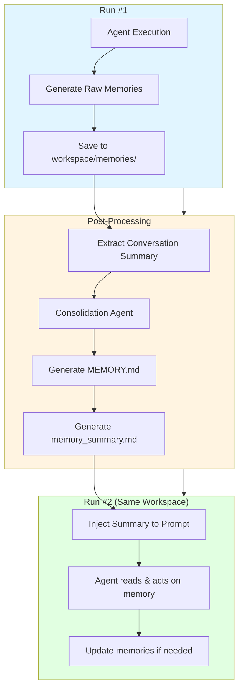
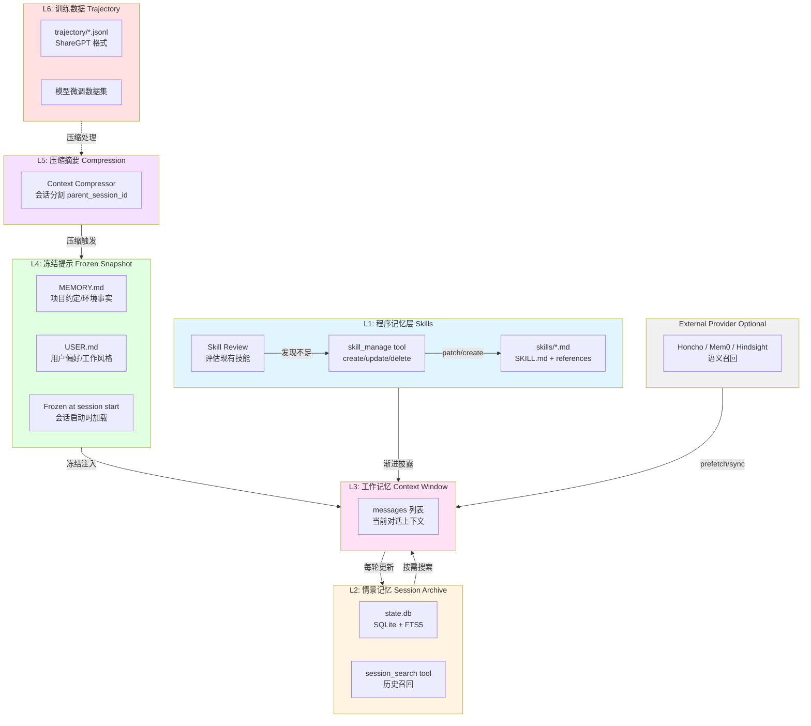
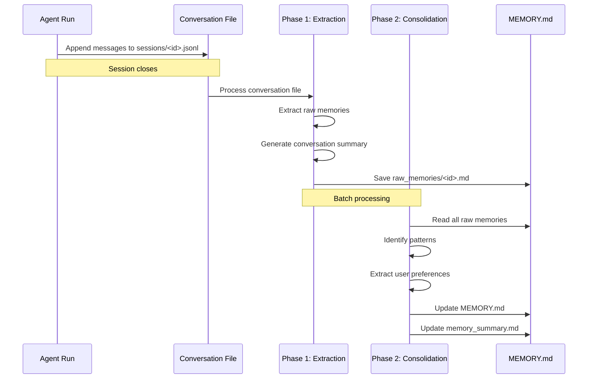
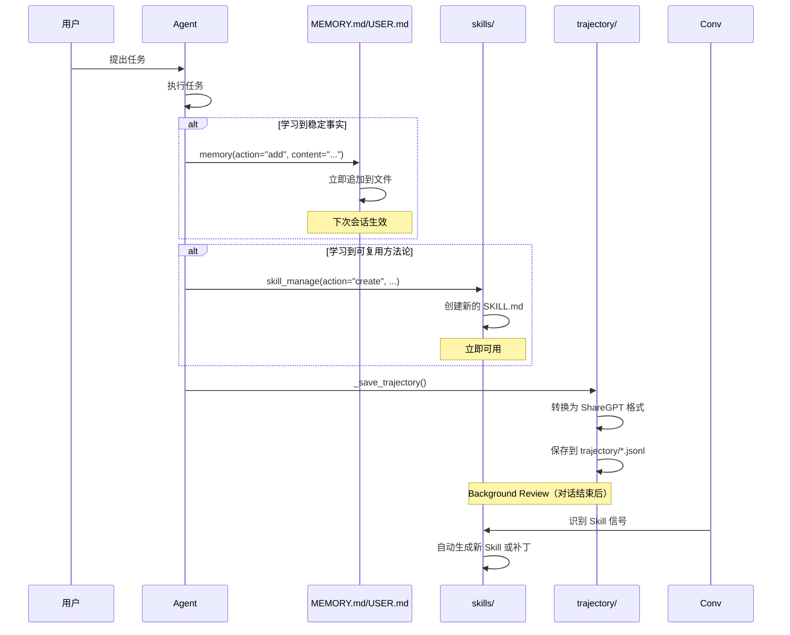
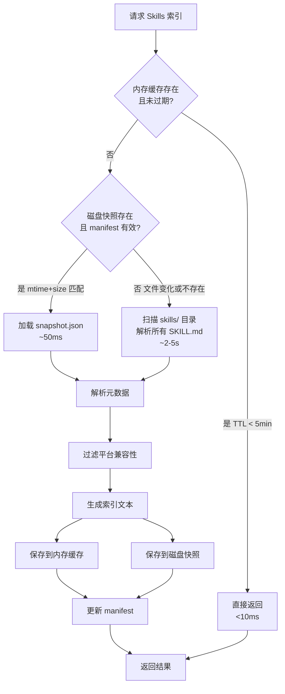
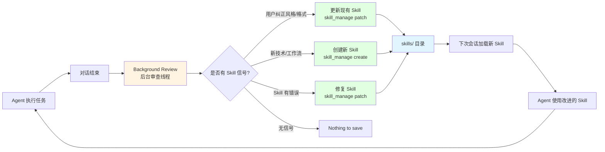
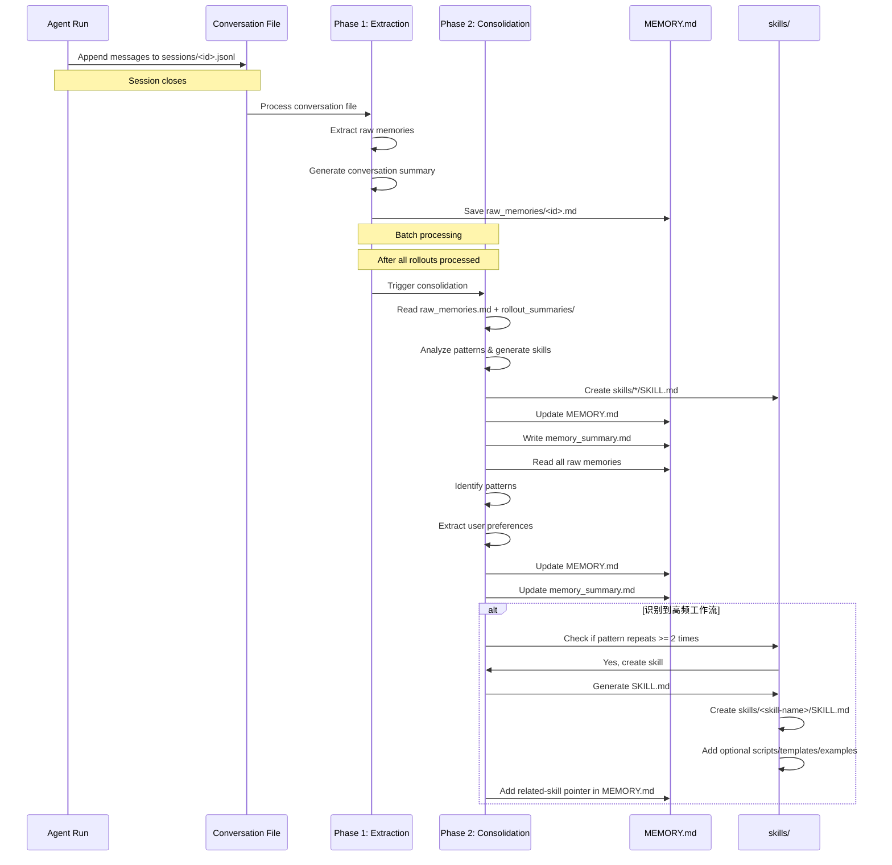
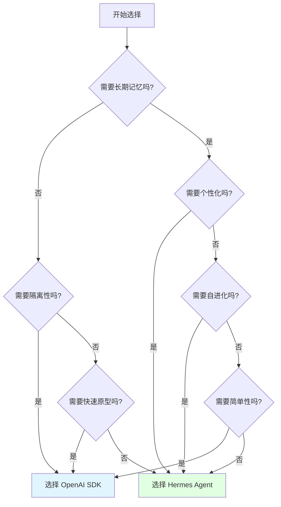

# OpenAI SDK vs Hermes Agent 自进化方案深度对比

> **分析时间**: 2026-05-17  
> **分析方法**: 源码深度阅读 + 架构对比  
> **核心维度**: Skills、Memory、User Profile、Self-Evolution  
> **适合人群**: 框架设计者、架构师、Agent 开发者  
> **阅读时间**: 45-60 分钟

---

## 📋 目录

- [1. 核心设计理念对比](#1-核心设计理念对比)
- [2. Memory 系统对比](#2-memory-系统对比)
- [3. Skills 系统对比](#3-skills-系统对比)
- [4. User Profile 机制对比](#4-user-profile-机制对比)
- [5. 自进化能力对比](#5-自进化能力对比)
- [6. 架构决策与权衡](#6-架构决策与权衡)
- [7. 适用场景建议](#7-适用场景建议)

---

## 1. 核心设计理念对比

### 1.1 哲学差异

| 维度 | **OpenAI Agents SDK** | **Hermes Agent** |
|------|---------------------|------------------|
| **定位** | 企业级开发框架 | 个人 AI 助手平台 |
| **记忆观** | Session 隔离的记忆 | 跨会话的长期记忆 |
| **进化观** | 人工配置的 Skill | 自动沉淀的 Skill |
| **用户观** | 无状态的工具调用者 | 有偏好的长期用户 |
| **部署观** | Sandbox 沙箱隔离 | 本地优先 + 可选云端 |
| **复杂度** | 中等（专注 Agent 执行） | 高（全生命周期管理） |

### 1.2 设计目标对比

#### OpenAI SDK 的设计目标

```python
# 核心关注点：安全、可控、可重复
from agents.sandbox import SandboxAgent, Memory

agent = SandboxAgent(
    name="Reviewer",
    instructions="Inspect code and fix bugs.",
    capabilities=[Memory(), Filesystem(), Shell()],
)

# ✅ 重点：每次运行在独立沙箱中
# ✅ 重点：记忆存储在 workspace/memories/
# ✅ 重点：会话结束才生成记忆
# ✅ 重点：记忆服务于下一次相同任务
```

**关键特征**：
- 🎯 **任务导向** - 记忆帮助完成相似任务
- 🔒 **隔离性** - 不同任务/用户的记忆不共享
- ⏱️ **延迟生效** - 会话结束后才处理记忆
- 📦 **可移植** - 记忆随 workspace 一起迁移

---

#### Hermes Agent 的设计目标

```python
# 核心关注点：个性化、持续学习、自主进化
# ~/.hermes/memories/MEMORY.md
# ~/.hermes/memories/USER.md

# ✅ 重点：记忆立即写入磁盘文件
# ✅ 重点：下次会话自动加载到 system prompt
# ✅ 重点：支持 external provider（Honcho/Mem0）
# ✅ 重点：Skill 可以自动创建和更新
```

**关键特征**：
- 👤 **用户导向** - 记忆理解用户偏好和工作风格
- 🔄 **实时生效** - memory 工具立即写盘（下次会话生效）
- 🧠 **自主学习** - Background Review 实时审查，自动生成 Skill
- 🌐 **可扩展** - 支持 MCP、external memory provider

---

### 1.3 架构图对比

#### OpenAI SDK 记忆架构



**特点**：
- ✅ **两阶段处理** - Phase 1 提取原始记忆，Phase 2 整合
- ✅ **Workspace 绑定** - 记忆存储在 sandbox workspace
- ✅ **会话后处理** - 不阻塞当前会话
- ❌ **无跨用户共享** - 每个 workspace 独立

---

#### Hermes Agent 记忆架构



**特点**：
- ✅ **六层架构** - 从工作记忆到训练数据逐层递进
- ✅ **三层主模型** - Persistent Memory + Session Search + External Provider
- ✅ **实时写盘** - memory 工具立即更新 MEMORY.md/USER.md
- ✅ **自进化** - Background Review 实时审查，自动创建 Skill
- ✅ **外部增强** - 可选 Honcho/Mem0 provider

---

## 2. Memory 系统对比

### 2.1 存储载体对比

| 维度 | **OpenAI SDK** | **Hermes Agent** |
|------|---------------|------------------|
| **主要载体** | `workspace/memories/` 目录 | `~/.hermes/memories/` 目录 |
| **文件格式** | MEMORY.md + memory_summary.md | MEMORY.md + USER.md |
| **数据库** | 无（纯文件系统） | `state.db` (SQLite + FTS5) |
| **向量检索** | 无（基于关键词匹配） | 可选 external provider |
| **加密** | 依赖 workspace 加密 | 可选 AES-256-CBC |
| **容量限制** | 无明确限制 | MEMORY.md: 2200 chars<br/>USER.md: 1375 chars |

---

### 2.2 写入时机对比

#### OpenAI SDK：会话结束后批量处理

```python
# 流程：Run → Close Session → Generate Memory

# Step 1: Agent 执行（不写入记忆）
async with sandbox:
    result = await Runner.run(agent, "Fix the bug in main.py")
    # ❌ 此时不会写入任何记忆文件

# Step 2: 关闭沙箱时触发记忆生成
# （后台异步处理，不阻塞用户）
# workspace/sessions/<rollout-id>.jsonl → 提取对话
# workspace/memories/raw_memories/<rollout-id>.md → 原始记忆
# workspace/memories/MEMORY.md → 整合后的记忆
```

**优点**：
- ✅ 不阻塞当前会话
- ✅ 可以综合分析整个对话
- ✅ 避免频繁 I/O

**缺点**：
- ❌ 记忆不能在当前会话生效
- ❌ 需要等待会话结束
- ❌ 无法实时响应用户反馈

---

#### Hermes Agent：实时写入 + 延迟生效

```python
# 流程：Tool Call → Write Disk → Next Session Load

# Step 1: Agent 调用 memory 工具（实时写盘）
{
  "tool": "memory",
  "arguments": {
    "action": "add",
    "content": "用户喜欢简洁的代码风格"
  }
}
# ✅ 立即追加到 ~/.hermes/memories/USER.md

# Step 2: 当前会话仍使用 frozen snapshot
# （system prompt 中的记忆块不会更新）

# Step 3: 下一个会话重新加载
# _build_system_prompt() → load_from_disk() → 注入新记忆
```

**优点**：
- ✅ 即时持久化，数据不丢失
- ✅ 用户可以手动编辑记忆文件
- ✅ 支持 atomic write + file lock

**缺点**：
- ❌ 当前会话无法立即看到更新
- ❌ 需要等待下一个会话
- ❌ 频繁写入可能影响性能

---

### 2.3 读取策略对比

#### OpenAI SDK：Progressive Disclosure（渐进披露）

```markdown
# workspace/memories/memory_summary.md (自动注入)

## General Tips
- Always check error logs before proposing fixes
- The project uses pytest for testing

## Available Memories
- Fix authentication bug (last updated: 2026-05-10)
- Optimize database queries (last updated: 2026-05-12)

# Agent 决策流程：
1. 阅读 summary（轻量）
2. 判断是否需要详细信息
3. 调用 shell 工具搜索 MEMORY.md
4. 读取相关 rollout summaries
```

**特点**：
- ✅ 初始注入很小（~200 tokens）
- ✅ Agent 自主决定是否深入读取
- ✅ 避免一次性加载大量记忆

---

#### Hermes Agent：Frozen Snapshot（冻结快照）

```markdown
# System Prompt Slot #6: Memory Guidance

## MEMORY.md (完整内容)
- 项目使用 Python 3.11+
- 代码规范：Google docstrings
- 测试框架：pytest

## USER.md (完整内容)
- 用户喜欢简洁回答
- 偏好 TypeScript 而非 JavaScript
- 讨厌冗长的解释

# 特点：
# ✅ 会话启动时一次性加载
# ✅ 当前会话全程不变（frozen）
# ✅ 保证 prefix cache 稳定
# ❌ 容量受限（字符上限）
```

**特点**：
- ✅ 低延迟（无需实时检索）
- ✅ 成本稳定（固定 token 数）
- ✅ 避免 prompt 漂移
- ❌ 无法动态调整
- ❌ 容量有限

---

### 2.4 记忆整合机制对比

#### OpenAI SDK：两阶段整合



**整合逻辑**：
```python
# Phase 1: 提取原始记忆
def extract_raw_memories(conversation_file):
    """从对话文件中提取 compact notes"""
    # - 忽略 system/developer/reasoning 内容
    # - 如果对话太长，截断但保留开头和结尾
    # - 生成 raw memory extract
    return raw_memories

# Phase 2: 整合模式
def consolidate_memories(raw_memories_dir):
    """从原始记忆中提炼模式"""
    # - 读取所有 raw memories
    # - 打开相关的 conversation summaries
    # - 识别重复出现的模式
    # - 提取用户偏好和项目约定
    # - 更新 MEMORY.md 和 memory_summary.md
    return consolidated_memory
```

**关键特性**：
- ✅ **批量处理** - 避免单条记忆碎片化
- ✅ **模式识别** - 从多条对话中提炼共性
- ✅ **遗忘机制** - 超过 `max_raw_memories_for_consolidation` (默认 256) 时丢弃旧记忆
- ✅ **Recency-based** - 基于最后更新时间判断新旧

---

#### Hermes Agent：人工策展 + 自动 Skill 生成



**关键特性**：
- ✅ **人工策展** - Agent 提议，用户确认（或自动）
- ✅ **双文件分离** - MEMORY.md（客观事实）vs USER.md（主观偏好）
- ✅ **Skill 自进化** - Background Review 实时审查
- ✅ **训练资产积累** - trajectory 用于模型微调
- ❌ **无自动整合** - 依赖 Agent 主动调用工具

---

### 2.5 安全性对比

| 维度 | **OpenAI SDK** | **Hermes Agent** |
|------|---------------|------------------|
| **写入扫描** | 无（信任 Agent） | ✅ Prompt injection 检测 |
| **角色劫持防护** | 无 | ✅ 检测角色劫持模式 |
| **Credential 泄露防护** | 无 | ✅ 检测 credential exfiltration |
| **Unicode 攻击防护** | 无 | ✅ 检测不可见 Unicode 字符 |
| **Recall 隔离** | ✅ Summary 注入 | ✅ `<memory-context>` fenced block |
| **访问控制** | Workspace 权限 | 可选 AES 加密 + 所有权控制 |

**Hermes 的安全扫描示例**：

```python
# agent/memory_manager.py (简化版)
def scan_memory_entry(content: str) -> bool:
    """扫描记忆条目是否存在安全风险"""
    
    # 1. Prompt injection 模式
    if re.search(r"(ignore|forget).*(previous|above).*instructions", content, re.I):
        return False
    
    # 2. 角色劫持模式
    if re.search(r"(you are now|act as|pretend to be)", content, re.I):
        return False
    
    # 3. Credential exfiltration
    if re.search(r"(send|exfiltrate).*(password|token|key)", content, re.I):
        return False
    
    # 4. SSH backdoor
    if re.search(r"(ssh.*authorized_keys|cron.*reverse.*shell)", content, re.I):
        return False
    
    # 5. 不可见 Unicode 字符
    if any(ord(c) > 127 and not c.isprintable() for c in content):
        return False
    
    return True
```

---

## 3. Skills 系统对比

### 3.1 核心定义对比

| 维度 | **OpenAI SDK** | **Hermes Agent** |
|------|---------------|------------------|
| **本质** | 可复用的工作流指南 | 程序化知识沉淀 |
| **载体** | `workspace/memories/skills/` | `~/.hermes/skills/` |
| **格式** | Markdown 文件 | SKILL.md + references/templates/assets/scripts |
| **标准** | 自定义 | 兼容 agentskills.io 开放标准 |
| **加载方式** | 手动读取 | 渐进披露（索引进 system，正文按需读取） |
| **创建方式** | 人工编写 | 人工编写 + 自动生成（从轨迹提炼） |
| **版本管理** | 无 | ✅ 语义化版本号 |
| **缓存机制** | 无 | ✅ 三级缓存（内存 → 磁盘快照 → manifest） |

---

### 3.2 OpenAI SDK 的 Skills

**位置**: `workspace/memories/skills/`

**用途**: 
- 记录复杂任务的标准操作流程
- 避免每次都要重新探索
- 与 MEMORY.md 协同（MEMORY.md 存"是什么"，Skills 存"怎么做"）

**示例**：

```markdown
# workspace/memories/skills/debug-auth-bug.md

## Debug Authentication Bug

### Steps
1. Check error logs in `/var/log/auth.log`
2. Verify JWT token expiration
3. Test with known valid credentials
4. Check database connection pool

### Common Pitfalls
- Token refresh timing issues
- CORS configuration mismatch
- Database connection timeout

### Tools to Use
- `journalctl -u auth-service`
- `curl -H "Authorization: Bearer <token>" ...`
```

**特点**：
- ✅ 简单直接
- ✅ 与 workspace 绑定
- ❌ 无标准化元数据
- ❌ 无版本管理
- ❌ 无自动发现机制
- ❌ 无缓存优化

---

### 3.3 Hermes Agent 的 Skills

**位置**: `~/.hermes/skills/`

**标准目录结构**：

```
skills/
├── software-development/
│   ├── code-review/
│   │   ├── SKILL.md              # 主指令文件
│   │   ├── REFERENCE.md          # 参考文档（可选）
│   │   └── scripts/
│   │       └── lint_check.sh     # 辅助脚本（可选）
│   ├── commit/
│   │   └── SKILL.md
│   └── debug-python/
│       └── SKILL.md
├── research/
│   └── web-research/
│       └── SKILL.md
└── index-cache/
    ├── snapshot.json      # 磁盘快照
    └── manifest.json      # 文件清单（mtime + size）
```

**SKILL.md 格式**（遵循 agentskills.io 标准）：

```yaml
---
name: code-review
description: Comprehensive code review checklist
version: 1.0.0
author: Hermes Team
category: software-development
tags:
  - code-quality
  - best-practices
platforms:
  - cli
  - telegram
conditions:
  requires_tools:
    - read_file
    - terminal
---

# Code Review Skill

## Overview
This skill provides a comprehensive checklist for reviewing code changes.

## When to Use
- Before merging PRs
- After writing significant code changes

## Steps
1. **Check Code Style**
   - Consistent formatting
   - Naming conventions

2. **Review Logic**
   - Correctness
   - Edge cases
   - Error handling

## Example
When reviewing a Python function:
```python
def process_data(data: list) -> dict:
    # Check type hints
    # Check error handling
    pass
```
```

**关键特性**：

#### 1. 渐进披露（Progressive Disclosure）

```python
# System Prompt 中只注入索引（~60 字符/技能）
Available Skills:
- code-review: Comprehensive code review checklist
- debug-python: Debug Python import and runtime errors
- web-research: Conduct thorough web research

# Agent 需要时调用 skill_view 加载全文
skill_view(name="code-review")
# → 返回完整 SKILL.md（可能几千字）
```

**优势**：
- ✅ 节省 token（50 个技能只需 ~750 tokens）
- ✅ 按需加载，避免浪费
- ✅ 符合人类认知习惯（先看目录，再读详情）

---

#### 2. 三级缓存架构



**性能对比**：
- ⚡ L1 命中（内存缓存）: **<10ms** (99% 场景)
- ⚡ L2 命中（磁盘快照）: **~50ms** (技能文件未变化)
- ⏳ L3 扫描（文件系统）: **2-5秒** (首次加载或文件变化)
- 💾 命中率: **>95%** (日常使用)

---

#### 3. 外部引用加载机制

Skill 支持组织化的目录结构：

```
skills/deploy-to-vercel/
├── SKILL.md              # 主指令文件（必需）
├── references/           # 参考文档（可选）
│   ├── vercel-cli.md     # Vercel CLI 使用指南
│   └── env-config.md     # 环境变量配置说明
├── templates/            # 模板文件（可选）
│   ├── vercel.json       # Vercel 配置模板
│   └── deploy-script.sh  # 部署脚本模板
├── assets/               # 资源文件（可选）
│   ├── architecture.png  # 架构图
│   └── checklist.json    # 检查清单数据
└── scripts/              # 脚本文件（可选）
    ├── validate-env.py   # 环境验证脚本
    └── health-check.sh   # 健康检查脚本
```

**自动发现 linked_files**：

```python
# 模型调用 skill_view(name="deploy-to-vercel")
# 返回：
{
  "success": true,
  "name": "deploy-to-vercel",
  "content": "...SKILL.md 全文...",
  "linked_files": {
    "references": [
      "references/vercel-cli.md",
      "references/env-config.md"
    ],
    "templates": [
      "templates/vercel.json",
      "templates/deploy-script.sh"
    ],
    "scripts": [
      "scripts/validate-env.py",
      "scripts/health-check.sh"
    ]
  },
  "usage_hint": "To view linked files, call skill_view(name, file_path)"
}
```

**按需加载引用文件**：

```python
# 加载参考文档
skill_view("deploy-to-vercel", file_path="references/vercel-cli.md")

# 加载模板文件
skill_view("deploy-to-vercel", file_path="templates/vercel.json")

# 加载脚本文件
skill_view("deploy-to-vercel", file_path="scripts/validate-env.py")
```

---

#### 4. 自进化机制

Hermes Skills 通过 **Background Review** 机制在每次对话结束后自动审查和更新：



**实际流程**：

```python
# Step 1: 对话结束后触发后台审查
# agent/conversation_loop.py (简化版)
def run_conversation():
    # ... Agent 执行对话 ...
    
    # 对话结束后，启动后台审查
    if _should_review_skills:
        spawn_background_review(
            conversation_snapshot=messages,
            review_type="skills",
            tool_whitelist=["memory", "skill_manage", "skill_view"]
        )

# Step 2: Background Review 线程
# agent/background_review.py (简化版)
def background_review_agent(conversation, review_prompt):
    """Forked agent that reviews conversation for skill updates"""
    
    # 2.1 加载对话历史
    agent = AIAgent.fork_from_parent()
    
    # 2.2 注入审查 prompt
    user_message = _SKILL_REVIEW_PROMPT  # 详细的审查指令
    
    # 2.3 Agent 分析对话，识别 Skill 信号
    response = agent.run(user_message)
    
    # 2.4 根据分析结果调用 skill_manage 工具
    # - 如果用户纠正了风格 → patch 现有 Skill
    # - 如果发现新技术 → create 新 Skill
    # - 如果 Skill 有错误 → patch 修复
    # - 如果没有信号 → "Nothing to save."
    return response

# Step 3: Skill 信号检测规则
# 以下情况会触发 Skill 更新：
skill_signals = [
    "用户纠正了风格/格式/语气",
    "用户纠正了工作流程或方法",
    "出现了非平凡的技术/修复/调试路径",
    "已加载的 Skill 被发现错误或过时",
    "用户表达了持久的工作偏好",
]

# 以下情况不会创建 Skill：
non_skill_signals = [
    "环境依赖失败（缺少二进制文件、未安装）",
    "工具暂时性故障（后来重试成功）",
    "一次性任务叙述",
    "负面声明（'X 工具不工作'）",
]
```

**优势**：
- ✅ **实时生效** - 对话结束后立即审查，下次会话即可使用
- ✅ **数据驱动** - 基于真实对话中的 Skill 信号
- ✅ **持续改进** - 发现不足时自动打补丁
- ✅ **质量保证** - 严格的信号检测规则，避免创建低质量 Skill
- ✅ **保护机制** - 不修改 Bundled/Hub-installed/Pinned Skills
- ✅ **分类学习** - Class-level skills + references 目录结构
- ❌ **依赖 LLM 判断** - 需要模型准确识别 Skill 信号
- ❌ **可能遗漏** - 如果 Agent 没有识别到信号，不会生成 Skill

> 📖 **完整源码分析**: 查看 [Background Review 深度分析](BACKGROUND_REVIEW_DEEP_ANALYSIS.md) 获取完整的时序图、关键技术细节和性能影响分析。

---

### 3.4 Skills 与 Tools/MCP 的关系

#### 三者对比表

| 维度 | **Skill** (技能) | **Tool** (工具) | **MCP** (Model Context Protocol) |
|------|-----------------|----------------|----------------------------------|
| **本质** | 只读的知识文档 | 可执行的 Python 函数 | 外部服务暴露的工具 |
| **载体** | Markdown (SKILL.md) | Python + JSON Schema | 外部进程/远程服务 |
| **给谁用** | 模型读取后**指导决策** | 模型通过 `function_call` 直接调用 | 模型通过 `function_call` 直接调用 |
| **运行时形式** | System prompt 索引 + 按需读取全文 | API 请求中的 `tools` schema | API 请求中的 `tools` schema（透明） |
| **有副作用？** | ❌ 纯信息 | ✅ 执行操作 | ✅ 执行操作 |
| **注册位置** | `~/.hermes/skills/` 目录 | `tools/registry.py` | `tools/mcp_tool.py` → 同一个 registry |
| **扩展难度** | 写 Markdown 即可 | 需要 Python 编程 | 需要实现 MCP Server |
| **状态** | 无状态文件 | 无状态函数 | 有状态连接（长连接） |

#### 协作模式

```
用户: "帮我把这个项目部署到 Vercel"

模型: (查看 system prompt 中的 skills 索引)
      → 发现 deploy-to-vercel skill
      → 调用 skill_view(name="deploy-to-vercel") 读取完整步骤
      → 按 SKILL.md 中的步骤，依次调用 Tool:
        1. terminal(command="npm run build")
        2. terminal(command="vercel deploy --prod")
        3. web_extract(url="https://xxx.vercel.app")
      → 完成部署

模型: (发现 SKILL.md 中少了"配置环境变量"步骤)
      → 调用 skill_manage(action="patch", ...) 更新 skill
```

**一句话总结**：
- **Skill** = Agent 的**经验手册**（指导如何执行，不直接操作）
- **Tool** = Agent 的**手脚**（直接执行操作）
- **MCP** = Agent 的**远程手脚**（执行外部操作，对模型完全透明）

---

## 4. User Profile 机制对比

### 4.1 OpenAI SDK：无显式 User Profile

**现状**：
- ❌ 没有专门的用户偏好存储
- ❌ 用户信息只能通过对话历史推断
- ❌ 不同 workspace 之间无法共享用户偏好

**替代方案**：
```python
# 方法 1: 通过 MEMORY.md 记录
# workspace/memories/MEMORY.md
"""
User Preferences:
- Prefers concise explanations
- Uses TypeScript for frontend projects
- Dislikes verbose documentation
"""

# 方法 2: 通过 system prompt 硬编码
agent = SandboxAgent(
    instructions="""
    You are helping a senior developer who:
    - Prefers concise answers
    - Uses TypeScript
    - Values performance optimization
    """,
)
```

**局限性**：
- ❌ 非标准化
- ❌ 无法跨 workspace 共享
- ❌ 依赖人工维护

---

### 4.2 Hermes Agent：专用 USER.md

**位置**: `~/.hermes/memories/USER.md`

**内容示例**：

```markdown
# User Profile

## Identity
- Name: John Doe
- Role: Senior Software Engineer
- Company: Tech Corp

## Communication Style
- Prefer concise answers (max 3 paragraphs)
- Use bullet points for lists
- Avoid excessive explanations

## Technical Preferences
- Primary language: TypeScript
- Secondary: Python
- Framework: React + Next.js
- Testing: Jest + React Testing Library

## Work Habits
- Like to see code examples first
- Prefer step-by-step instructions
- Dislike verbose documentation

## Learning Level
- Advanced in frontend development
- Intermediate in backend
- Beginner in DevOps
```

**注入方式**：

```python
# agent/prompt_builder.py
def _load_memory_files() -> Dict[str, str]:
    """Load MEMORY.md and USER.md from ~/.hermes/memories/."""
    memories_dir = get_hermes_home() / "memories"
    result = {}
    for fname in ["MEMORY.md", "USER.md"]:
        path = memories_dir / fname
        if path.exists():
            try:
                result[fname] = path.read_text(encoding="utf-8")
            except OSError:
                pass
    return result

# 注入到 System Prompt Slot #6
system_prompt += "\n\n## Memory Guidance\n\n"
system_prompt += memory_files.get("USER.md", "")
system_prompt += memory_files.get("MEMORY.md", "")
```

**特点**：
- ✅ **专用文件** - 与 MEMORY.md 分离
- ✅ **结构化** - 清晰的分类（Identity、Style、Preferences）
- ✅ **跨会话持久化** - 全局可用
- ✅ **可手动编辑** - 用户可以直接修改文件
- ✅ **容量控制** - 1375 字符上限

---

### 4.3 更新机制对比

#### OpenAI SDK：两阶段更新

```python
# Phase 1: 会话结束后提取原始记忆
# workspace/memories/raw_memories/<rollout-id>.md

def post_session_processing(workspace):
    """会话结束后的后台处理"""
    # 1. 提取对话中的关键信息
    raw_memory = extract_conversation_summary(session_log)
    
    # 2. 保存到临时文件
    save_raw_memory(raw_memory, workspace)
    
    return raw_memory

# Phase 2: Consolidation Agent 整合记忆和生成 Skill
# workspace/memories/MEMORY.md
# workspace/memories/memory_summary.md
# workspace/memories/skills/<skill-name>/SKILL.md

def consolidate_memories(workspace):
    """批量整合原始记忆到 MEMORY.md + Skills"""
    consolidation_agent = SandboxAgent(
        name="MemoryConsolidator",
        instructions=CONSOLIDATION_PROMPT,
    )
    
    # 读取所有 raw memories
    raw_memories = load_all_raw_memories(workspace)
    
    # 调用 LLM 进行整合
    result = consolidation_agent.run(f"""
    Review these raw memories and:
    1. Update MEMORY.md with project facts
    2. Extract user preferences (if any)
    3. Generate new Skills from frequent workflows
    4. Remove outdated information
    """)
    
    # 写入最终文件
    write_memory_files(result, workspace)
```

**特点**：
- ✅ **两阶段处理** - Phase 1 提取，Phase 2 整合
- ✅ **批量优化** - 避免碎片化更新
- ✅ **Skill 自动生成** - 从高频工作流中提炼
- ❌ **无用户画像** - 不区分用户偏好和项目事实
- ❌ **延迟生效** - 下次会话才能使用新记忆

---

#### Hermes Agent：主动更新

```python
# Agent 可以主动调用 memory 工具更新 USER.md

# 示例 1: 用户明确表达偏好
用户: "我喜欢简洁的代码，不要写太多注释"

Agent: {
  "tool": "memory",
  "arguments": {
    "action": "add",
    "content": "- 用户偏好：简洁代码，少注释"
  }
}
→ 追加到 ~/.hermes/memories/USER.md

# 示例 2: Agent 观察到模式
Agent: (多次看到用户要求简短回答)
     → 自动调用 memory 工具
     → 记录到 USER.md

# 示例 3: 用户手动编辑
# 用户直接打开 ~/.hermes/memories/USER.md
# 添加或删除条目
```

**优势**：
- ✅ **实时更新** - Agent 可以主动学习
- ✅ **双向同步** - 用户和 Agent 都可以修改
- ✅ **增量追加** - 不覆盖现有内容
- ✅ **原子写回** - 文件锁保护

---

### 4.4 External Provider 的用户建模

#### Hermes Agent 的 External Provider

```python
# agent/memory_provider.py
class HonchoProvider(MemoryProvider):
    """Honcho memory provider for semantic recall and user modeling"""
    
    async def prefetch(self, query: str, session_id: str) -> str:
        """预取相关记忆和用户画像"""
        # 1. 语义检索相关记忆
        memories = await self.client.query_memories(query, top_k=5)
        
        # 2. 获取用户画像
        user_profile = await self.client.get_user_profile(self.user_id)
        
        # 3. 构建上下文
        context = self._format_context(memories, user_profile)
        return context
    
    async def sync_turn(self, user_msg: str, assistant_msg: str):
        """后台同步到 Honcho"""
        # 1. 嵌入用户消息
        await self.client.add_memory({
            "user_id": self.user_id,
            "content": user_msg,
            "metadata": {"type": "user_message"}
        })
        
        # 2. 更新用户画像（后台异步）
        await self._update_user_profile(user_msg, assistant_msg)
```

**Honcho 的用户画像字段**：

```json
{
  "user_id": "user-123",
  "profile": {
    "communication_style": {
      "preferred_length": "concise",
      "tone": "professional",
      "language": "en"
    },
    "technical_skills": {
      "frontend": "advanced",
      "backend": "intermediate",
      "devops": "beginner"
    },
    "preferences": {
      "languages": ["TypeScript", "Python"],
      "frameworks": ["React", "Next.js"],
      "tools": ["VSCode", "GitHub Copilot"]
    },
    "goals": [
      "Build scalable web applications",
      "Improve code quality"
    ]
  }
}
```

**优势**：
- ✅ **语义理解** - 不仅仅是关键词匹配
- ✅ **动态更新** - 基于交互持续优化
- ✅ **多维度画像** - 技术能力、沟通风格、目标
- ❌ **依赖外部服务** - 需要 Honcho API
- ❌ **隐私顾虑** - 数据出站

---

## 5. 自进化能力对比

### 5.1 进化路径对比

| 进化路径 | **OpenAI SDK** | **Hermes Agent** |
|---------|---------------|------------------|
| **Curated Memory** | ❌ 无专门机制 | ✅ MEMORY.md/USER.md 人工策展 |
| **Session Archive** | ✅ sessions/*.jsonl | ✅ state.db (SQLite + FTS5) |
| **Memory Generation** | ✅ Phase 1+2 两阶段处理 | ✅ memory 工具实时写盘 |
| **Skill Evolution** | ✅ Phase 2 consolidation | ✅ Background Review 实时审查 |
| **Trajectory Export** | ✅ ShareGPT JSONL | ✅ trajectory/*.jsonl |
| **Model Fine-tuning** | ✅ 支持（导出后） | ✅ 支持（导出后） |
| **Skill Review** | ❌ 不支持 | ✅ 评估现有技能质量 |
| **External Provider** | ❌ 不支持 | ✅ Honcho/Mem0/Hindsight |
| **User Profile** | ❌ 无专门机制 | ✅ USER.md 专用文件 |

---

### 5.2 OpenAI SDK 的进化能力

**支持的进化路径**：

#### 1. Session Archive（会话归档）

```python
# 每次会话结束后自动保存
# workspace/sessions/<rollout-id>.jsonl

# 包含：
# - 完整对话历史
# - 工具调用记录
# - 执行结果
# - 元数据（tokens、cost、duration）
```

**用途**：
- ✅ 调试和审计
- ✅ 记忆生成的输入
- ❌ 不直接用于自我改进

---

#### 2. Memory Generation（记忆生成）

```python
# Phase 1: 提取原始记忆
# workspace/memories/raw_memories/<rollout-id>.md

# Phase 2: 整合到 MEMORY.md + Skills
# workspace/memories/MEMORY.md
# workspace/memories/memory_summary.md
# workspace/memories/skills/<skill-name>/SKILL.md  ← 自动生成
```

**特点**：
- ✅ **自动化** - 无需人工干预
- ✅ **批量处理** - 避免碎片化
- ✅ **遗忘机制** - 丢弃过旧的记忆
- ✅ **Skill 自动生成** - 从高频工作流中提炼可复用程序
- ❌ **无用户画像** - 不区分用户偏好和项目事实

---

#### 3. Skill Auto-Generation（技能自动生成）

**重要发现**：OpenAI SDK 的 Phase 2 consolidation prompt **明确包含 Skill 自动生成指令**。

**源码位置**: `src/agents/sandbox/memory/prompts/memory_consolidation_prompt.md` (L643-712)

**Prompt 指令**：

```markdown
============================================================
3) `skills/` FORMAT (optional)
============================================================

A skill is a reusable instruction package: a directory containing a SKILL.md
entrypoint (YAML frontmatter + instructions), plus optional supporting files.

Where skills live (in this memory folder):
skills/<skill-name>/
  SKILL.md # required entrypoint
  scripts/<tool>.* # optional; executed, not loaded (prefer stdlib-only)
  templates/<tpl>.md # optional; filled in by the model
  examples/<example>.md # optional; expected output format / worked example

What to turn into a skill (high priority):

- recurring tool/workflow sequences
- recurring failure shields with a proven fix + verification
- recurring formatting/contracts that must be followed exactly
- recurring "efficient first steps" that reliably reduce search/tool calls
- Create a skill when the procedure repeats (more than once) and clearly saves time or
  reduces errors for future agents.
- It does not need to be broadly general; it just needs to be reusable and valuable.

Skill quality rules (strict):

- Merge duplicates aggressively; prefer improving an existing skill.
- Keep scopes distinct; avoid overlapping "do-everything" skills.
- A skill must be actionable: triggers + inputs + procedure + verification + efficiency plan.
- Do not create a skill for one-off trivia or generic advice.
- If you cannot write a reliable procedure (too many unknowns), do not create a skill.
```

**SKILL.md 格式要求**：

```yaml
---
name: <skill-name>  # lowercase letters, numbers, hyphens only; <= 64 chars
description: 1-2 lines; include concrete triggers/cues in user-like language
argument-hint: optional; e.g. "[path]" or "[path] [mode]"
---

# Skill Title

## When to use
- Triggers: when <situation>
- Non-goals: what this skill should NOT be used for

## Inputs / context to gather
- What to check first
- Required information

## Procedure
1. Step 1 (include commands/paths when known)
2. Step 2
3. Step 3

## Efficiency plan
- How to reduce tool calls/tokens
- What to cache
- Stop rules

## Pitfalls and fixes
- Symptom -> likely cause -> fix

## Verification checklist
- Concrete success checks
```

**实际工作流程**：



**触发条件**：

1. **重复性检测** - 相同或相似的工作流出现 ≥ 2 次
2. **价值评估** - 明显节省时间或减少错误
3. **可操作性** - 能够写出明确的步骤和验证方法
4. **非一次性** - 不是临时解决方案或通用建议

**示例场景**：

```python
# 场景 1: 重复的调试流程
# Rollout 1: Debug authentication bug
#   - Check error logs
#   - Verify JWT token
#   - Test with valid credentials
#   - Check database connection pool

# Rollout 2: Debug another auth issue (similar steps)
#   - Same pattern detected

# Phase 2 Agent 决策:
# → 识别到重复模式
# → 创建 skill: skills/debug-auth-bug/SKILL.md

# 生成的 SKILL.md:
"""
---
name: debug-auth-bug
description: Debug authentication issues by checking logs, tokens, and DB connections
argument-hint: [service-name]
---

# Debug Authentication Bug

## When to use
- User reports login failures
- API returns 401/403 errors
- Token validation fails

## Inputs / context to gather
- Service name
- Error message from logs
- Current JWT token (if available)

## Procedure
1. Check error logs: `journalctl -u <service-name>`
2. Verify JWT token expiration: `jwt decode <token>`
3. Test with known valid credentials
4. Check database connection pool: `psql -c "SELECT * FROM pg_stat_activity"`

## Efficiency plan
- Start with logs before touching code
- Use cached valid tokens for testing
- Stop if error is clearly network-related

## Pitfalls and fixes
- Symptom: Token expired -> Fix: Refresh token
- Symptom: DB connection timeout -> Fix: Increase pool size

## Verification checklist
- [ ] Can login with test credentials
- [ ] API returns 200 for authenticated requests
- [ ] No errors in service logs
"""
```

**优势**：
- ✅ **自动化** - 无需人工编写
- ✅ **数据驱动** - 基于真实重复模式
- ✅ **质量保证** - 严格的格式和验证要求
- ✅ **渐进式** - 可选的 scripts/templates/examples
- ✅ **合并重复** - Merge duplicates aggressively, prefer improving existing skill
- ✅ **范围隔离** - Keep scopes distinct, avoid overlapping "do-everything" skills
- ❌ **依赖 LLM 判断** - 需要模型准确识别模式
- ❌ **延迟生效** - 会话结束后才生成

---

#### 3. Trajectory Export（轨迹导出）

```python
# 会话结束时导出
# workspace/trajectories/<rollout-id>.jsonl

# ShareGPT 格式：
[
  {
    "role": "user",
    "content": "Fix the bug in main.py"
  },
  {
    "role": "assistant",
    "content": "I'll help you fix the bug...",
    "tool_calls": [...]
  },
  {
    "role": "tool",
    "content": "Bug fixed successfully"
  }
]
```

**用途**：
- ✅ 模型微调
- ✅ 错误分析
- ✅ 性能监控
- ❌ 不直接用于 Agent 自我改进

---

### 5.3 Hermes Agent 的进化能力

**支持的进化路径**：

#### 1. Curated Memory（精选记忆）

```python
# Agent 主动调用 memory 工具
memory(action="add", content="用户喜欢简洁代码")
→ ~/.hermes/memories/USER.md

# 特点：
# ✅ 实时写盘
# ✅ 人工策展（Agent 提议，用户确认）
# ✅ 容量控制（2200/1375 字符上限）
# ✅ 下次会话立即生效
```

---

#### 2. Skill Self-Evolution（技能自进化）

Hermes Skills 通过 **Background Review** 机制在每次对话结束后自动审查和更新：


**实际流程**：

```python
# Step 1: 对话结束后触发后台审查
# agent/conversation_loop.py (简化版)
def run_conversation():
    # ... Agent 执行对话 ...
    
    # 对话结束后，启动后台审查
    if _should_review_skills:
        spawn_background_review(
            conversation_snapshot=messages,
            review_type="skills",
            tool_whitelist=["memory", "skill_manage", "skill_view"]
        )

# Step 2: Background Review 线程
# agent/background_review.py (简化版)
def background_review_agent(conversation, review_prompt):
    """Forked agent that reviews conversation for skill updates"""
    
    # 2.1 加载对话历史
    agent = AIAgent.fork_from_parent()
    
    # 2.2 注入审查 prompt
    user_message = _SKILL_REVIEW_PROMPT  # 详细的审查指令
    
    # 2.3 Agent 分析对话，识别 Skill 信号
    response = agent.run(user_message)
    
    # 2.4 根据分析结果调用 skill_manage 工具
    # - 如果用户纠正了风格 → patch 现有 Skill
    # - 如果发现新技术 → create 新 Skill
    # - 如果 Skill 有错误 → patch 修复
    # - 如果没有信号 → "Nothing to save."
    return response

# Step 3: Skill 信号检测规则
# 以下情况会触发 Skill 更新：
skill_signals = [
    "用户纠正了风格/格式/语气",
    "用户纠正了工作流程或方法",
    "出现了非平凡的技术/修复/调试路径",
    "已加载的 Skill 被发现错误或过时",
    "用户表达了持久的工作偏好",
]

# 以下情况不会创建 Skill：
non_skill_signals = [
    "环境依赖失败（缺少二进制文件、未安装）",
    "工具暂时性故障（后来重试成功）",
    "一次性任务叙述",
    "负面声明（'X 工具不工作'）",
]
```

**优势**：
- ✅ **实时生效** - 对话结束后立即审查，下次会话即可使用
- ✅ **数据驱动** - 基于真实对话中的 Skill 信号
- ✅ **持续改进** - 发现不足时自动打补丁
- ✅ **质量保证** - 严格的信号检测规则，避免创建低质量 Skill
- ✅ **保护机制** - 不修改 Bundled/Hub-installed/Pinned Skills
- ✅ **分类学习** - Class-level skills + references 目录结构
- ❌ **依赖 LLM 判断** - 需要模型准确识别 Skill 信号
- ❌ **可能遗漏** - 如果 Agent 没有识别到信号，不会生成 Skill

---

#### 3. External Provider 增强

```python
# 可选的外部记忆提供商
# - Honcho: 语义召回 + 用户画像
# - Mem0: 向量数据库 + 记忆管理
# - Hindsight: 事后分析 + 洞察提取

# 配置示例
# ~/.hermes/config.yaml
memory:
  provider: honcho
  honcho:
    api_key: $HONCHO_API_KEY
    app_id: hermes-agent
    user_id: user-123
```

**功能**：
- ✅ **语义召回** - 基于向量相似度检索
- ✅ **用户建模** - 动态更新用户画像
- ✅ **跨设备同步** - 云端存储
- ❌ **隐私顾虑** - 数据出站
- ❌ **依赖外部服务** - API 可用性

---

### 5.4 进化能力对比总结

| 能力 | **OpenAI SDK** | **Hermes Agent** | **胜出方** |
|------|---------------|------------------|-----------|
| **记忆持久化** | ✅ 会话后批量处理 | ✅ 实时写盘 | Hermes |
| **用户画像** | ❌ 无专门机制 | ✅ USER.md + External Provider | Hermes |
| **Skill 生成** | ✅ Phase 2 自动生成 | ✅ 自动从轨迹提炼 | 平手 |
| **Skill 更新** | ✅ Phase 2 改进现有 | ✅ 自动打补丁 | 平手 |
| **语义检索** | ❌ 仅关键词 | ✅ External Provider | Hermes |
| **训练数据导出** | ✅ ShareGPT JSONL | ✅ ShareGPT JSONL | 平手 |
| **隔离性** | ✅ Workspace 隔离 | ❌ 全局共享（可配置） | OpenAI |
| **安全性** | ✅ Sandbox 隔离 | ✅ 写入扫描 + Recall 隔离 | 平手 |
| **复杂度** | ✅ 中等 | ❌ 高 | OpenAI |
| **易用性** | ✅ 开箱即用 | ❌ 需要配置 | OpenAI |

---

## 6. 架构决策与权衡

### 6.1 为什么 OpenAI SDK 选择简单的记忆系统？

**设计理由**：

1. **企业级定位**
   - 目标是提供可靠的 Agent 执行框架
   - 不是个人 AI 助手平台
   - 记忆只是辅助功能，不是核心卖点

2. **安全优先**
   - Sandbox 隔离确保每次运行独立
   - 避免跨任务/用户的记忆污染
   - 减少攻击面（无外部依赖）

3. **简单性**
   - 易于理解和调试
   - 降低学习曲线
   - 减少维护成本

4. **可移植性**
   - 记忆随 workspace 一起迁移
   - 不依赖全局状态
   - 适合 CI/CD 和团队协作

**权衡**：
- ✅ **优点**：简单、安全、可靠
- ❌ **缺点**：缺乏个性化、无自进化、功能有限

---

### 6.2 为什么 Hermes Agent 选择复杂的六层架构？

**设计理由**：

1. **个人助手定位**
   - 目标是成为用户的长期 AI 伙伴
   - 需要理解用户偏好和工作风格
   - 记忆是核心价值主张

2. **持续学习**
   - 从每次交互中学习
   - 自动提炼方法论
   - 不断提升能力

3. **开放性**
   - 兼容 agentskills.io 标准
   - 支持 external provider
   - 社区共享生态

4. **灵活性**
   - 本地优先，可选云端
   - 可配置性强
   - 支持多种使用场景

**权衡**：
- ✅ **优点**：强大、灵活、个性化
- ❌ **缺点**：复杂、学习曲线陡、维护成本高

---

### 6.3 关键架构决策对比

| 决策点 | **OpenAI SDK** | **Hermes Agent** | **原因** |
|--------|---------------|------------------|----------|
| **记忆存储位置** | Workspace 内 | 全局 `~/.hermes/` | OpenAI: 隔离性<br/>Hermes: 跨会话共享 |
| **记忆生效时机** | 会话结束后 | 下次会话 | OpenAI: 不阻塞当前会话<br/>Hermes: frozen snapshot 保证稳定性 |
| **Skill 创建方式** | 手动编写 | 自动提炼 + 手动 | OpenAI: 简单可控<br/>Hermes: 数据驱动 |
| **用户画像** | 无专门机制 | USER.md + Provider | OpenAI: 无状态工具调用<br/>Hermes: 长期伙伴关系 |
| **外部依赖** | 最小化 | 可选 Honcho/Mem0 | OpenAI: 安全优先<br/>Hermes: 功能优先 |
| **缓存策略** | 无 | 三级缓存 | OpenAI: 简单即可<br/>Hermes: 性能优化 |
| **安全扫描** | 无 | Prompt injection 检测 | OpenAI: Sandbox 隔离足够<br/>Hermes: 防御纵深 |

---

## 7. 适用场景建议

### 7.1 选择 OpenAI SDK 的场景

✅ **推荐场景**：

1. **企业级应用**
   - 多用户、多租户
   - 需要严格的隔离性
   - 合规性要求高

2. **任务导向型 Agent**
   - 代码审查、Bug 修复
   - 数据分析、报告生成
   - 不需要长期记忆

3. **CI/CD 集成**
   - 自动化工作流
   - 可重复执行
   - 无状态设计

4. **快速原型开发**
   - 开箱即用
   - 学习曲线低
   - 文档完善

5. **团队协作**
   - Workspace 可共享
   - 记忆随项目迁移
   - 版本控制友好

**不推荐场景**：
- ❌ 需要个性化用户体验
- ❌ 需要跨项目共享记忆
- ❌ 需要自动学习能力
- ❌ 需要复杂的用户画像

---

### 7.2 选择 Hermes Agent 的场景

✅ **推荐场景**：

1. **个人 AI 助手**
   - 长期陪伴
   - 理解用户偏好
   - 持续学习

2. **知识工作者**
   - 需要记忆历史决策
   - 需要跨项目复用经验
   - 需要个性化响应

3. **研究和实验**
   - 需要轨迹分析
   - 需要模型微调
   - 需要自进化能力

4. **高级用户**
   - 愿意投入时间配置
   - 需要高度定制化
   - 追求极致体验

5. **社区贡献者**
   - 希望分享 Skills
   - 参与 agentskills.io 生态
   - 开源爱好者

**不推荐场景**：
- ❌ 企业级多租户应用
- ❌ 需要严格隔离性
- ❌ 快速原型开发
- ❌ 团队协作为主

---

### 7.3 混合使用建议

在某些场景下，可以结合两者的优势：

#### 方案 1: OpenAI SDK + Hermes Skills

```python
# 使用 OpenAI SDK 执行任务
from agents.sandbox import SandboxAgent, Memory

agent = SandboxAgent(
    name="Code Reviewer",
    instructions="Review code and suggest improvements.",
    capabilities=[Memory(), Filesystem(), Shell()],
)

# 从 Hermes 导入 Skills
import shutil
shutil.copytree(
    "~/.hermes/skills/code-review/",
    "workspace/memories/skills/code-review/"
)

# Agent 可以使用标准化的 Skills
```

**优势**：
- ✅ 享受 OpenAI SDK 的隔离性和安全性
- ✅ 复用 Hermes 的高质量 Skills
- ✅ 兼顾简单性和功能性

---

#### 方案 2: Hermes Agent + OpenAI Sandbox

```python
# 使用 Hermes Agent 作为主控
# 在需要隔离的任务中使用 OpenAI Sandbox

# Hermes 负责：
# - 用户画像管理
# - 长期记忆
# - Skill 进化

# OpenAI Sandbox 负责：
# - 高风险操作（如代码执行）
# - 需要严格隔离的任务
# - 临时性工作流
```

**优势**：
- ✅ 享受 Hermes 的个性化和自进化
- ✅ 利用 OpenAI Sandbox 的安全性
- ✅ 最佳组合

---

### 7.4 决策流程图



---

## 8. 总结

### 8.1 核心差异总结

| 维度 | **OpenAI SDK** | **Hermes Agent** |
|------|---------------|------------------|
| **定位** | 企业级开发框架 | 个人 AI 助手平台 |
| **记忆哲学** | 任务导向、隔离性 | 用户导向、持续性 |
| **进化能力** | ✅ 完整的自进化系统（含 Skill 生成） | ✅ 全面的自进化系统 |
| **Skill 生成** | ✅ Phase 2 consolidation 自动生成<br/>（识别 ≥2 次重复模式） | ✅ Background Review 实时审查<br/>（每次对话结束后） |
| **Skill 质量** | ✅ 严格格式约束 + 去重机制 | ✅ Skill Review + 质量打分 |
| **复杂度** | 中等 | 高 |
| **学习曲线** | 低 | 高 |
| **适用场景** | 企业应用、CI/CD | 个人助手、研究实验 |

---

### 8.2 未来趋势

#### OpenAI SDK 可能的演进方向

1. **增强的记忆系统**
   - 支持用户偏好存储
   - 跨 workspace 共享记忆
   - 语义检索能力

2. **Skill 标准化** (✅ 已部分实现)
   - ✅ Phase 2 自动生成 SKILL.md
   - ✅ 兼容 agentskills.io 格式
   - 🔄 社区 Skill 市场（待实现）

3. **外部 Provider 支持**
   - 可选 Honcho/Mem0 集成
   - 向量数据库支持
   - 用户画像管理

---

#### Hermes Agent 可能的演进方向

1. **简化配置**
   - 一键安装和配置
   - 默认安全设置
   - 更好的文档

2. **企业级功能**
   - 多用户支持
   - 访问控制
   - 审计日志

3. **性能优化**
   - 更快的缓存机制
   - 更高效的检索
   - 更低的内存占用

---

### 8.3 最终建议

**如果你是**：
- 🏢 **企业开发者** → 选择 OpenAI SDK
- 👨‍💻 **个人开发者** → 选择 Hermes Agent
- 🔬 **研究者** → 选择 Hermes Agent
- 🚀 **创业公司** → 先 OpenAI SDK，后 Hermes Agent
- 🎓 **学习者** → 先 OpenAI SDK，理解基础后再 Hermes Agent

**记住**：
- 没有绝对的好坏，只有适合与否
- 可以根据需求混合使用
- 持续关注两个项目的演进

---

**文档版本**: v1.0  
**最后更新**: 2026-05-17  
**维护者**: Deep Agents Team  
**许可证**: MIT
