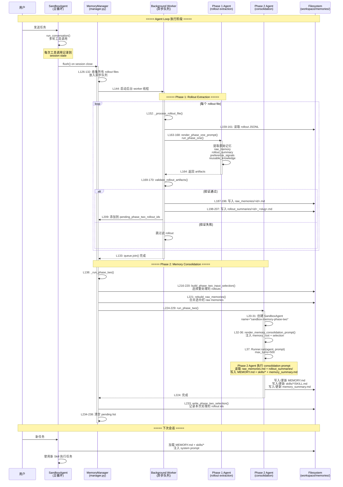

# OpenAI SDK Skill Auto-Generation 完整流程分析

> **分析时间**: 2026-05-17  
> **分析方法**: 源码深度阅读 + 架构对比  
> **核心模块**: `src/agents/sandbox/memory/phase_two.py`, `prompts/memory_consolidation_prompt.md`  
> **适合人群**: 框架设计者、架构师、Agent 开发者  
> **阅读时间**: 30-45 分钟

---

## 📋 目录

- [1. 整体架构概览](#1-整体架构概览)
- [2. 完整执行流程时序图](#2-完整执行流程时序图)
- [3. Phase 1: Rollout Extraction（原始记忆提取）](#3-phase-1-rollout-extraction原始记忆提取)
- [4. Phase 2: Memory Consolidation（记忆整合与Skill生成）](#4-phase-2-memory-consolidation记忆整合与skill生成)
- [5. Skill 格式要求与质量标准](#5-skill-格式要求与质量标准)
- [6. 关键代码位置索引](#6-关键代码位置索引)

---

## 1. 整体架构概览

OpenAI SDK 的 Skill Auto-Generation 采用**两阶段批量处理机制**：

```
Agent Loop → Session Close → Phase 1 (Extraction) → Phase 2 (Consolidation)
                                    ↓                        ↓
                            raw_memories/*.md          MEMORY.md
                            rollout_summaries/*.md     skills/*/SKILL.md
                                                       memory_summary.md
```

**核心特点**：
- ✅ **会话后处理** - 不阻塞当前 Agent 运行
- ✅ **批量优化** - 避免碎片化更新，统一整合
- ✅ **遗忘机制** - 自动清理过时记忆
- ✅ **Skill 自动生成** - 从高频工作流中提炼可复用程序
- ❌ **延迟生效** - 下次会话才能使用新 Skill
- ❌ **无用户画像** - 不区分用户偏好和项目事实

---

## 2. 完整执行流程时序图



---

## 3. Phase 1: Rollout Extraction（原始记忆提取）

### 3.1 触发时机

**何时触发？**
- 每次 `SandboxSession` 关闭时
- 调用 `MemoryGenerationManager.flush()` 方法

**源码位置**: [`manager.py:L118-L140`](file:///Users/gqli/work/deepagents/openai-agents-python/src/agents/sandbox/memory/manager.py#L118-L140)

```python
async def flush(self) -> None:
    """Process accumulated memory rollouts and run one final phase-2 consolidation."""
    
    async with self._flush_lock:
        if self._stopped:
            return
        self._stopped = True
        try:
            # 1. 收集所有 rollout files
            rollout_files = sorted(set(self._rollout_files_by_rollout_id.values()))
            if not rollout_files:
                return
            
            # 2. 确保目录布局存在
            await self._storage.ensure_layout()
            
            # 3. 启动后台 worker
            self._ensure_worker()
            
            # 4. 将所有 rollout files 放入队列
            for rollout_file in rollout_files:
                self._queue.put_nowait(rollout_file)
            
            # 5. 等待所有 rollout 处理完成
            await self._queue.join()
            
            # 6. 停止 worker
            if self._worker_task is not None:
                self._queue.put_nowait(_STOP)
                await self._worker_task
                self._worker_task = None
            
            # 7. 运行 Phase 2 consolidation
            await self._run_phase_two()
        finally:
            _unregister_memory_generation_manager(session=self._session, manager=self)
```

---

### 3.2 Worker 处理单个 Rollout

**源码位置**: [`manager.py:L158-L209`](file:///Users/gqli/work/deepagents/openai-agents-python/src/agents/sandbox/memory/manager.py#L158-L209)

```python
async def _process_rollout_file(self, rollout_file_name: str) -> None:
    """处理单个 rollout file，执行 Phase 1 extraction"""
    
    # 1. 读取 rollout contents (JSONL 格式)
    rollout_contents = await self._storage.read_text(
        self._storage.sessions_dir / rollout_file_name
    )
    
    # 2. 渲染 Phase 1 prompt
    phase_one_prompt = render_phase_one_prompt(rollout_contents=rollout_contents)
    
    # 3. 运行 Phase 1 Agent 提取记忆
    artifacts = await run_phase_one(
        config=self._generate_config,
        prompt=phase_one_prompt,
        run_config=self._memory_run_config(),
    )
    
    # 4. 验证提取结果
    if not validate_rollout_artifacts(artifacts):
        return
    
    # 5. 解析 rollout metadata
    payloads = [json.loads(line) for line in rollout_contents.splitlines() if line.strip()]
    if not payloads:
        return
    payload = payloads[-1]
    updated_at = str(payload.get("updated_at") or "unknown")
    terminal_metadata = payload.get("terminal_metadata")
    terminal_state = "unknown"
    if isinstance(terminal_metadata, dict):
        terminal_state = str(terminal_metadata.get("terminal_state") or "unknown")
    
    # 6. 生成 rollout ID 和 slug
    rollout_id = rollout_id_from_rollout_path(rollout_file_name)
    rollout_slug = normalize_rollout_slug(artifacts.rollout_slug)
    rollout_path = str(self._storage.sessions_dir / rollout_file_name)
    rollout_summary_file = f"rollout_summaries/{rollout_id}_{rollout_slug}.md"
    
    # 7. 并行写入两个文件
    await asyncio.gather(
        # 7a. 写入 raw_memories/<id>.md
        self._storage.write_text(
            self._storage.memories_dir / "raw_memories" / f"{rollout_id}.md",
            _format_raw_memory(
                updated_at=updated_at,
                rollout_id=rollout_id,
                rollout_path=rollout_path,
                rollout_summary_file=rollout_summary_file,
                terminal_state=terminal_state,
                raw_memory=artifacts.raw_memory,
            ),
        ),
        # 7b. 写入 rollout_summaries/<id>_<slug>.md
        self._storage.write_text(
            self._storage.memories_dir / rollout_summary_file,
            _format_rollout_summary(
                updated_at=updated_at,
                rollout_path=rollout_path,
                session_id=str(self._session.state.session_id),
                terminal_state=terminal_state,
                rollout_summary=artifacts.rollout_summary,
            ),
        ),
    )
    
    # 8. 标记为待 Phase 2 处理
    self._pending_phase_two_rollout_ids.append(rollout_id)
```

---

### 3.3 Phase 1 输出格式

#### raw_memories/<id>.md

```markdown
# Raw Memory: <rollout_id>

updated_at: <timestamp>
rollout_path: <path/to/rollout.jsonl>
rollout_summary_file: rollout_summaries/<id>_<slug>.md
terminal_state: success|failure|interrupted

## Raw Memory Content

<Phase 1 Agent 提取的原始记忆内容>
```

#### rollout_summaries/<id>_<slug>.md

```markdown
session_id: <session_id>
updated_at: <timestamp>
rollout_path: <path/to/rollout.jsonl>
terminal_state: success|failure|interrupted

## Rollout Summary

<Phase 1 Agent 生成的对话摘要>

## Preference Signals

- <用户偏好信号>

## Reusable Knowledge

- <可复用知识>

## Failures and How to Do Differently

- <失败经验>
```

---

## 4. Phase 2: Memory Consolidation（记忆整合与Skill生成）

### 4.1 触发条件

**何时触发？**
- 所有 Phase 1 rollout 处理完成后
- `pending_phase_two_rollout_ids` 非空

**源码位置**: [`manager.py:L211-L238`](file:///Users/gqli/work/deepagents/openai-agents-python/src/agents/sandbox/memory/manager.py#L211-L238)

```python
async def _run_phase_two(self) -> None:
    """运行 Phase 2 consolidation"""
    
    if not self._pending_phase_two_rollout_ids:
        return
    
    # 1. 去重 rollout IDs
    rollout_ids = list(dict.fromkeys(self._pending_phase_two_rollout_ids))
    
    # 2. 构建 Phase 2 输入选择
    selection = await self._storage.build_phase_two_input_selection(
        max_raw_memories_for_consolidation=(
            self._generate_config.max_raw_memories_for_consolidation
        )
    )
    
    # 3. 重建 raw_memories.md（合并选中的 rollouts）
    if not await self._storage.rebuild_raw_memories(selected_items=selection.selected):
        return
    
    try:
        # 4. 运行 Phase 2 Agent
        await run_phase_two(
            config=self._generate_config,
            memory_root=self._memory.layout.memories_dir,
            selection=selection,
            run_config=self._memory_run_config(),
        )
    except Exception:
        logger.exception("Sandbox memory phase 2 failed")
        return
    
    # 5. 记录本次处理的 selection
    await self._storage.write_phase_two_selection(selected_items=selection.selected)
    
    # 6. 清空 pending list
    self._pending_phase_two_rollout_ids = [
        rollout_id
        for rollout_id in self._pending_phase_two_rollout_ids
        if rollout_id not in set(rollout_ids)
    ]
```

---

### 4.2 Phase 2 Agent 执行

**源码位置**: [`phase_two.py:L10-L37`](file:///Users/gqli/work/deepagents/openai-agents-python/src/agents/sandbox/memory/phase_two.py#L10-L37)

```python
async def run_phase_two(
    *,
    config: MemoryGenerateConfig,
    memory_root: str,
    selection: PhaseTwoInputSelection,
    run_config: RunConfig,
) -> None:
    from ...run import Runner
    
    # 1. 创建 Phase 2 Agent
    if config.phase_two_model_settings is None:
        agent = SandboxAgent(
            name="sandbox-memory-phase-two",
            instructions=None,
            model=config.phase_two_model,
        )
    else:
        agent = SandboxAgent(
            name="sandbox-memory-phase-two",
            instructions=None,
            model=config.phase_two_model,
            model_settings=config.phase_two_model_settings,
        )
    
    # 2. 渲染 consolidation prompt
    prompt = render_memory_consolidation_prompt(
        memory_root=memory_root,
        selection=selection,
        extra_prompt=config.extra_prompt,
    )
    
    # 3. 运行 Agent（最多 500 轮）
    await Runner.run(agent, prompt, run_config=run_config, max_turns=500)
```

---

### 4.3 Consolidation Prompt 核心指令

**源码位置**: [`prompts/memory_consolidation_prompt.md:L643-L712`](file:///Users/gqli/work/deepagents/openai-agents-python/src/agents/sandbox/memory/prompts/memory_consolidation_prompt.md#L643-L712)

#### Skill 生成条件（高优先级）

```markdown
What to turn into a skill (high priority):

- recurring tool/workflow sequences
- recurring failure shields with a proven fix + verification
- recurring formatting/contracts that must be followed exactly
- recurring "efficient first steps" that reliably reduce search/tool calls
- Create a skill when the procedure repeats (more than once) and clearly saves time or
  reduces errors for future agents.
- It does not need to be broadly general; it just needs to be reusable and valuable.
```

#### Skill 质量规则（严格）

```markdown
Skill quality rules (strict):

- Merge duplicates aggressively; prefer improving an existing skill.
- Keep scopes distinct; avoid overlapping "do-everything" skills.
- A skill must be actionable: triggers + inputs + procedure + verification + efficiency plan.
- Do not create a skill for one-off trivia or generic advice.
- If you cannot write a reliable procedure (too many unknowns), do not create a skill.
```

---

## 5. Skill 格式要求与质量标准

### 5.1 目录结构

```
skills/<skill-name>/
├── SKILL.md              # 必需：入口文件（YAML frontmatter + 指令）
├── scripts/              # 可选：辅助脚本（执行而非加载）
│   └── <tool>.py/.sh
├── templates/            # 可选：模板文件（由模型填充）
│   └── <tpl>.md
└── examples/             # 可选：示例文件（预期输出格式）
    └── <example>.md
```

---

### 5.2 SKILL.md Frontmatter 格式

**源码位置**: [`prompts/memory_consolidation_prompt.md:L674-L678`](file:///Users/gqli/work/deepagents/openai-agents-python/src/agents/sandbox/memory/prompts/memory_consolidation_prompt.md#L674-L678)

```yaml
---
name: <skill-name>              # 小写字母、数字、连字符；≤ 64 字符
description: 1-2 lines; include concrete triggers/cues in user-like language
argument-hint: optional; e.g. "[path]" or "[path] [mode]"
---
```

**示例**：

```yaml
---
name: deploy-to-vercel
description: Deploy a Next.js app to Vercel with environment variables and domain setup
argument-hint: [project-path] [environment]
---
```

---

### 5.3 SKILL.md 内容要求

**源码位置**: [`prompts/memory_consolidation_prompt.md:L680-L694`](file:///Users/gqli/work/deepagents/openai-agents-python/src/agents/sandbox/memory/prompts/memory_consolidation_prompt.md#L680-L694)

必须包含以下部分：

```markdown
# Skill Title

## When to use
- Triggers: when <situation>
- Non-goals: what this skill should NOT be used for

## Inputs / context to gather
- What to check first
- Required information

## Procedure
1. Step 1 (include commands/paths when known)
2. Step 2
3. Step 3

## Efficiency plan
- How to reduce tool calls/tokens
- What to cache
- Stop rules

## Pitfalls and fixes
- Symptom -> likely cause -> fix

## Verification checklist
- Concrete success checks
```

---

### 5.4 完整示例

```markdown
---
name: debug-cloudflare-routing
description: Debug Cloudflare routing issues by checking local rules and DNS configuration
argument-hint: [domain]
---

# Debug Cloudflare Routing Issues

## When to use
- Triggers: when encountering 522/524 errors, DNS resolution failures, or unexpected routing behavior
- Non-goals: general network debugging, SSL certificate issues

## Inputs / context to gather
- Domain name experiencing issues
- Current Cloudflare dashboard access
- Local DNS resolver configuration

## Procedure
1. Check Cloudflare DNS records
   ```bash
   dig @1.1.1.1 <domain> ANY
   ```
2. Verify local Cloudflare proxy rules
   ```bash
   cloudflared tunnel inspect <tunnel-id>
   ```
3. Test direct origin connectivity
   ```bash
   curl -H "Host: <domain>" https://<origin-ip>
   ```
4. Check Cloudflare firewall rules
   - Login to Cloudflare dashboard
   - Navigate to Security > WAF
   - Review active rules for domain

## Efficiency plan
- Always start with DNS lookup before checking proxy rules
- Cache DNS results for 5 minutes to avoid repeated lookups
- Stop if origin server is unreachable (not a Cloudflare issue)

## Pitfalls and fixes
- Symptom: 522 Connection Timed Out
  - Likely cause: Origin server firewall blocking Cloudflare IPs
  - Fix: Whitelist Cloudflare IP ranges on origin server
- Symptom: DNS propagation delay
  - Likely cause: TTL too high
  - Fix: Set TTL to 300 seconds during debugging

## Verification checklist
- [ ] DNS resolves to correct IP
- [ ] Cloudflare proxy status is "Proxied"
- [ ] Origin server responds to direct requests
- [ ] No firewall rules blocking Cloudflare IPs
- [ ] Final request through Cloudflare returns 200 OK
```

---

### 5.5 Supporting Scripts 规范

**源码位置**: [`prompts/memory_consolidation_prompt.md:L696-L705`](file:///Users/gqli/work/deepagents/openai-agents-python/src/agents/sandbox/memory/prompts/memory_consolidation_prompt.md#L696-L705)

```markdown
Supporting scripts (optional but highly recommended):

- Put helper scripts in scripts/ and reference them from SKILL.md (e.g.,
  collect_context.py, verify.sh, extract_errors.py).
- Prefer Python (stdlib only) or small shell scripts.
- Make scripts safe by default:
  - avoid destructive actions, or require explicit confirmation flags
  - do not print secrets
  - deterministic outputs when possible
- Include a minimal usage example in SKILL.md.
```

**示例**：

```python
# scripts/verify_dns.py
#!/usr/bin/env python3
"""Verify DNS configuration for a domain."""
import subprocess
import sys

def verify_dns(domain: str) -> bool:
    """Check if DNS resolves correctly."""
    result = subprocess.run(
        ["dig", "+short", domain],
        capture_output=True,
        text=True,
        timeout=10
    )
    if result.returncode != 0:
        print(f"DNS lookup failed: {result.stderr}")
        return False
    
    ips = result.stdout.strip().split("\n")
    if not ips:
        print("No DNS records found")
        return False
    
    print(f"DNS resolved to: {', '.join(ips)}")
    return True

if __name__ == "__main__":
    if len(sys.argv) != 2:
        print("Usage: verify_dns.py <domain>")
        sys.exit(1)
    
    success = verify_dns(sys.argv[1])
    sys.exit(0 if success else 1)
```

在 SKILL.md 中引用：

```markdown
## Procedure
1. Run DNS verification script
   ```bash
   python3 scripts/verify_dns.py <domain>
   ```
2. If DNS fails, check registrar settings...
```

---

## 6. 关键代码位置索引

### 6.1 核心文件

| 文件 | 作用 | 关键行号 |
|------|------|---------|
| `manager.py` | Memory 生成管理器 | L118-140 (flush), L158-209 (process_rollout), L211-238 (run_phase_two) |
| `phase_two.py` | Phase 2 执行器 | L10-37 (run_phase_two) |
| `prompts.py` | Prompt 渲染 | L71-87 (render_memory_consolidation_prompt) |
| `memory_consolidation_prompt.md` | Consolidation Prompt 模板 | L643-712 (Skill 格式), L714-813 (Workflow) |

---

### 6.2 配置参数

**源码位置**: [`config.py:L35-L80`](file:///Users/gqli/work/deepagents/openai-agents-python/src/agents/sandbox/config.py#L35-L80)

```python
@dataclass
class MemoryGenerateConfig:
    """Configuration for sandbox-backed memory extraction and consolidation."""
    
    max_raw_memories_for_consolidation: int = 256
    """Maximum number of recent raw memories considered during consolidation."""
    
    phase_one_model: str = "gpt-4o-mini"
    """Model used for phase-1 memory extraction."""
    
    phase_two_model: str = "gpt-4o"
    """Model used for phase-2 memory consolidation."""
    
    phase_two_model_settings: ModelSettings | None = None
    """Model settings used for phase-2 memory consolidation."""
    
    extra_prompt: str | None = None
    """Optional developer-specific guidance appended to memory extraction and consolidation prompts."""
```

---

### 6.3 数据流向

```
Agent Loop
    ↓ (session close)
SandboxSession.state.messages
    ↓ (dump to JSONL)
workspace/sessions/<rollout-id>.jsonl
    ↓ (Phase 1 extraction)
workspace/memories/raw_memories/<id>.md
workspace/memories/rollout_summaries/<id>_<slug>.md
    ↓ (Phase 2 consolidation)
workspace/memories/MEMORY.md
workspace/memories/skills/*/SKILL.md
workspace/memories/memory_summary.md
    ↓ (next session load)
System Prompt Injection
```

---

## 🎯 总结

OpenAI SDK 的 Skill Auto-Generation 是一个**精心设计的两阶段批量处理系统**：

### Phase 1: Rollout Extraction
- **触发时机**: 每次会话结束
- **执行方式**: 后台异步 worker 队列
- **输出**: raw_memories/*.md + rollout_summaries/*.md
- **特点**: 快速提取，保留原始证据

### Phase 2: Memory Consolidation
- **触发时机**: 所有 Phase 1 完成后
- **执行方式**: 独立的 SandboxAgent（最多 500 轮）
- **输出**: MEMORY.md + skills/*/SKILL.md + memory_summary.md
- **特点**: 深度整合，智能聚类，自动生成 Skill

### Skill 生成标准
- **触发条件**: 重复的工作流、失败防护、格式化契约、高效第一步
- **质量要求**: 可操作、去重、范围明确、包含验证步骤
- **格式规范**: YAML frontmatter + 结构化 Markdown + 可选 supporting files

### 优势与局限
- ✅ **自动化程度高** - 无需人工干预
- ✅ **批量优化** - 避免碎片化，统一整合
- ✅ **遗忘机制** - 自动清理过时记忆
- ❌ **延迟生效** - 下次会话才能使用
- ❌ **计算成本高** - Phase 2 最多 500 轮对话
- ❌ **无实时反馈** - 用户无法立即看到 Skill 生成

---

**对比 Hermes Agent**:
- OpenAI SDK: 批量离线处理，延迟生效，计算密集
- Hermes Agent: 实时在线审查，即时生效，轻量级

两种方案各有优劣，适用于不同的应用场景。
